# 数据结构

## 第一章 绪论

1. 时间复杂度

```c
// O(logn)                     // O(m+n) 或 O(max(m,n))
for(int i=0;i<=n;i*=2)         for(int i=0;i<=m;i++)
  k++;                           k++;
                               for(int i=0;i<=n;i++)
                                 k++;
// O(n^2)                      //O(√n)
for(int i=0;i<n;i++)           while(i*i<n)
  for(int j=0;j<i;j++)           i++;
    k++; // 频次 n(n+1)/2
```

2. 空间复杂度（只考虑额外开辟的辅助空间）

```c
// O(1)                        // O(n)                  // O(n)
void Sort(int A[],int n){      int Func(int n){         int Fib(int n) {
  for (int i=0;i<n-1;i++){       if (n==0) return 1;      if(n<3) return 1;
    bool flag=false;             return Func(n-1)*n;      return Fib(n-1)*Fib(n-2);
    for(int j=n-1;j>i;j--)     }                        }
      ...                      //递归栈空间消耗          //递归栈可以重复利用
```

<question>

【例1-1 2011统考真题】设n是描述问题规模的非负整数，下列程序段的时间复杂度是 (&emsp;)。
<pre>
x=2;
while(x&lt;n/2)
  x=2*x;
</pre>
<options :options="['A. O(log<sub>2</sub>n)', 'B. O(n)', 'C. O(nlog2n)', 'D. O(n<sup>2</sup>)']" />

【例1-2 2012统考真题】求整数n（n≥0）的阶乘的算法如下，其时间复杂度是 (&emsp;)。
<pre v-pre>
int fact(int n){
  if(n<=l) return 1;
  return n*fact(n-l);
}
</pre>
<options :options="['A. O(log<sub>2</sub>n)', 'B. O(n)', 'C. O(nlog2n)', 'D. O(n<sup>2</sup>)']" />

【例1-3 2014统考真题】下列程序段的时间复杂度是 (&emsp;)。
<pre v-pre>
count=0;
for(k=1;k<=n;k*=2)
  for(j=1;j<=n;j++)
    count++;
</pre>
<options :options="['A. O(log<sub>2</sub>n)', 'B. O(n)', 'C. O(nlog2n)', 'D. O(n<sup>2</sup>)']" />

【例1-4 2017统考真题】下列函数的时间复杂度是 (&emsp;)。
<pre>
int func(int n){
  int i=0, sum=0;
  while(sum&lt;n) sum += ++i;
  return i;
}
</pre>
<options :options="['A. O(log<sub>2</sub>n)', 'B. O(n<sup>1/2</sup>)', 'C. O(n)', 'D. O(nlog<sub>2</sub>n)']" />

【例1-5 2019统考真题】设n是描述问题规模的非负整数，下列程序段的时间复杂度是 (&emsp;)。
<pre>
x=0;
while(n>=(x+1)*(x+1))
  x=x+1;
</pre>
<options :options="['A. O(log<sub>2</sub>n)', 'B. O(n<sup>1/2</sup>)', 'C. O(n)', 'D. O(n<sup>2</sup>)']" />

【例1-6 2022统考真题】下列程序段的时间复杂度是 (&emsp;)。


<options :options="['A. O(log<sub>2</sub>n)', 'B. O(n<sup>1/2</sup>)', 'C. O(n)', 'D. O(n<sup>2</sup>)']" />

::: analysis

算法复杂度描述，关键语句的执行次数t和问题规模n的关系。

|      | 第1轮 | 第2轮 |  第3轮  | ...  |   第log<sub>2</sub>n轮    |
| :--: | :---: | :---: | :-----: | :--: | :-----------------------: |
|  i   |   1   |   2   |    4    | ...  |       $\frac{n}{2}$       |
|  j   |   0   |  0,1  | 0,1,2,3 | ...  | 0,1,2,...,$\frac{n}{2}$-1 |
|  t   |   1   |   2   |    4    | ...  |       $\frac{n}{2}$       |

知道每轮的执行次数t，以及共有多少轮log<sub>2</sub>n。所有轮循环的执行次数总和：t=(1+2+4+...+$\frac{n}{2}$)，形成log<sub>2</sub>n项等比数列求和：

$$
\small t=(1+2+4+\cdots+\frac{n}{2})=\frac{a_1(1-q^n)}{1-q}=\frac{1×(1-2^{log_2n})}{1-2}=n.
$$

:::

【例1-7 2025统考真题】下列程序段的时间复杂度是 (&emsp;)。


<options :options="['A. O(log<sub>2</sub>n)', 'B. O(n<sup>1/2</sup>)', 'C. O(n)', 'D. O(n<sup>2</sup>)']" />

::: analysis

|      | 第1轮 | 第2轮 | 第3轮 | ...  | 第log<sub>2</sub>n轮 |
| :--: | :---: | :---: | :---: | :--: | :------------------: |
|  i   |   1   |   2   |   3   | ...  |      $\sqrt{n}$      |
|  j   |   1   |  1,2  | 1,2,3 | ...  | 1,2,3,...,$\sqrt{n}$ |
|  t   |   1   |   2   |   3   | ...  |      $\sqrt{n}$      |

$$
\small t=(1+2+3+\cdots+\sqrt{n})=\frac{(1+\sqrt{n})\sqrt{n}}{2}=n.
$$

:::

</question>

## 第二章 线性表

| 顺序表 | 内容                                                         |
| ------ | ------------------------------------------------------------ |
| 插入   | 平均移动次数为<emp>$\frac{n}{2}$</emp>，时间复杂度为 $\small O(n)$ |
| 删除   | 平均移动次数为<emp>$\frac{n-1}{2}$</emp>，时间复杂度为 $\small O(n)$ |
| 查找   | 支持<emp>随机存取</emp>，复杂度为 $\small O(1)$              |

> 插入删除第 $i$ 个元素时，要移动 $n-i$ 个元素。

<question>

【例2-1 2023统考真题】在下列对顺序存储的有序表（长度为n）实现给定操作的算法中，平均时间复杂度为O(1)的是 (&emsp;)。

<options :options="['A. 查找包含指定值元素的算法', 'B. 插入包含指定值元素的算法']" />
<options :options="['C. 删除第i (1≤i≤n) 个元素的算法', 'D. 获取第i (1≤i≤n) 个元素的算法']" />

</question>

|        链表        | 头插          | 头删          | 尾插          | 尾删          |   中间插入    |   中间删除    |
| :----------------: | ------------- | ------------- | ------------- | ------------- | :-----------: | :-----------: |
| （带头）单/双链表  | $\small O(1)$ | $\small O(1)$ | $\small O(n)$ | $\small O(n)$ | $\small O(n)$ | $\small O(n)$ |
| （带头）循环单链表 | $\small O(n)$ | $\small O(n)$ | $\small O(n)$ | $\small O(n)$ | $\small O(n)$ | $\small O(n)$ |
| （带头）循环双链表 | $\small O(1)$ | $\small O(1)$ | $\small O(1)$ | $\small O(1)$ | $\small O(n)$ | $\small O(n)$ |

<question>

【例3- 2 2016统考真题】已知一个带有表头结点的循环双链表L，结点结构为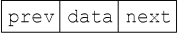，其中prev和next分别是指向其直接前驱和直接后继结点的指针。现要删除指针p所指的结点，正确的语句序列是 (&emsp;)。

<options :options="['A. p->next->prev=p->prev; p->prev->next=p->prev; free(p);']" />
<options :options="['B. p->next->prev=p->next; p->prev->next=p->next; free(p);']" />
<options :options="['C. p->next->prev=p->next; p->prev->next=p->prev; free(p);']" />
<options :options="['D. p->next->prev=p->prev; p->prev->next=p->next; free(p);']" />

【例2-3 2016统考真题】已知表头元素为c的单链表在内存中的存储状态如下表所示。

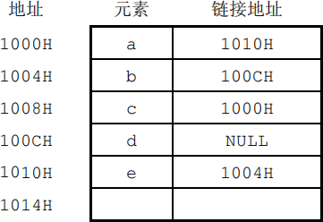

现将f存放于1014H处并插入单链表，若f在逻辑上位于a和e之间，则a、e、f的“链接地址”依次是 (&emsp;)。

<options :options="['A. 1010H、1014H、1004H', 'C. 1014H、1010H、1004H']" />
<options :options="['B. 1010H、1004H、1014H', 'D. 1014H、1004H、1010H']" />

【例2-4 2021统考真题】已知头指针h指向一个带头结点的非空循环单链表，结点结构为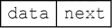其中next是指向直接后继结点的指针，p是尾指针，g是临时指针。现要删除该链表的第一个元素，正确的语句序列是 (&emsp;)。

<options :options="['A. h->next=h->next->next;q=h->next;free(q);']" />
<options :options="['B. q=h->next;h->next=h->next->next;free(q);']" />
<options :options="['C. q=h->next;h->next=q->next;if(p!=q) p=h;free(q)']" />
<options :options="['D. q=h->next;h->next=q->next;if(p==q) p=h;free(q);']" />

【例2-5 2023统考真题】现有非空双链表L，其结点结构为，prev是指向直接前驱结点的指针，next是指向直接后继结点的指针。若要在工中指针p所指向的结点（非尾结点）之后插入指针s指向的新结点，则在执行语句序列“s->next=p->next;p->next=s;”后，下列语句序列中还需要执行的是 (&emsp;)。

<options :options="['A. s->next->prev=p; s->prev=p;']" />
<options :options="['B. p->next->prev=s; s->prev=p;']" />
<options :options="['C. s->prev=s->next->prev; s->next->prev=s;']" />
<options :options="['D. p->next->prev=s->prev; s->next->prev=p;']" />

【例2-6 2024统考真题】已知带头结点的非空单链表L的头指针为h，结点结构为其中next是指向直接后继结点的指针。现有指针p和q，若p指向L中非首且非尾的任意一个结点，则执行语句序列“q=p->next；p->next=q->next；q->next= h->next; h->next=q;”的结果是 (&emsp;)。

<options :options="['A. 在P所指结点后插入g所指结点', 'B. 在g所指结点后插入P所指结点']" />
<options :options="['C. 将P所指结点移至工的头结点之后', 'D. 将g所指结点移动到L的头结点之后']" width="80%"/>

</question>

## 第三章 栈和队列及矩阵

### 卡特兰数

- n个元素入栈，入栈序列确定，出栈序列的个数为$\frac{1}{n+1}C^{n}_{2n}$。
- n个元素组成先序序列，先序序列确定，形成二叉树的个数为$\frac{1}{n+1}C^{n}_{2n}$。

### 栈

|                           栈的应用                           | 内容                                                         |
| :----------------------------------------------------------: | ------------------------------------------------------------ |
| [括号匹配](https://leetcode.cn/problems/valid-parentheses/solutions/3897597/ji-jian-gua-hao-pi-pei-wen-ti-by-yyx_dev-nrgt/) | ① 遍历序列，遇左括号入栈<br/>② 遇右括号，判断栈顶匹配则弹栈，若不匹配或空栈失败<br/>③ 最后判断栈是否为空 |
| [中缀转后缀](https://leetcode.cn/problems/evaluate-reverse-polish-notation/solutions/3897777/zhong-zhui-zhuan-hou-zhui-hou-zhui-biao-0wu9h/) | ① 眼看法：将a+b写成ab+。<mono>(a+b)\*c+d-(e+g)\*h</mono> 到 <mono>ab+c\*d+eg+h\*-</mono>。<br/>② 遍历树：前序得到前缀表达式，后序遍历得到后缀表达式。<br/>③ 借助栈：<mono>(1) </mono>若是数，放入结果串。若是运算符，放入栈<br/>&emsp;&emsp;&emsp;&emsp;&emsp; <mono>(2) </mono>若栈中有运算符，比较二者优先级，优先级高于栈顶才能放进去<br/>&emsp;&emsp;&emsp;&emsp;&emsp; <mono>(3) </mono>如遇左括号放入栈，如遇右括号，弹栈运算直到弹出左括号 |
| [后缀表达式求值](https://leetcode.cn/problems/evaluate-reverse-polish-notation/solutions/3897777/zhong-zhui-zhuan-hou-zhui-hou-zhui-biao-0wu9h/) | ① 遇操作数，放入栈<br/>② 遇操作符，弹栈两个操作数运算（注意倒序），结果放入栈<br/>③ 最后栈中唯一元素，即结果 |

<question>

【例3-1 2009统考真题】设栈S和队列Q的初始状态均为空，元素abcdefg依次进入栈S。若每个元素出栈后，立即进入队列Q，且7个元素出队的顺序是bdcfeag，则栈S的容量至少是 (&emsp;)。

<options :options="['A. 1', 'B. 2', 'C. 3', 'D. 4']" />

【例3-2 2010统考真题】若元素a,b,c,d,e,f依次进栈，允许进栈、退栈操作交替进行，但不允许连续3次进行退栈操作，不可能得到的出栈序列是 (&emsp;)。

<options :options="['A. dcebfa', 'B. cbdaef', 'C. bcaefd', 'D. afedcb']" />

【例3-3 2011统考真题】元素a,b,c,d,e依次进入初始为空的栈中，若元素进栈后可停留、可出栈，直到所有元素都出栈，则在所有可能的出栈序列中，以元素d开头的序列个数是 (&emsp;)。

<options :options="['A. 3', 'B. 4', 'C. 5', 'D. 6']" />

【例3-4 2013统考真题】一个栈的入栈序列为1,2,3,…,n，出栈序列是P1,P2,P3,…,Pn。若P2=3，则P3可能取值的个数是 (&emsp;)。

<options :options="['A. n-3', 'B. n-2', 'C. n-1', 'D. 无法确定']" />

【例3-5 2020统考真题】对空栈S进行Push和Pop操作，入栈序列为a,b,c,d,e，经过Push、Push、Pop、Push、Pop、Push、Push、Pop操作后得到的出栈序列是 (&emsp;)。

<options :options="['A. b,a,c', 'B. b,a,e', 'C. b,c,a', 'D. b,c,e']" />

【例3-6 2022统考真题】给定有限符号集S，in和out均为S中所有元素的任意排列。对于初始为空的栈ST，下列叙述中，正确的是 (&emsp;)。

<options :options="['A. 若in是ST的入栈序列，则不能判断out是否为其可能的出栈序列']" />
<options :options="['B. 若out是ST的出栈序列，则不能判断in是否为其可能的入栈序列']" />
<options :options="['C. 若in是ST的入栈序列，out是对应in的出栈序列，则in与out一定不同']" />
<options :options="['D. 若in是ST的入栈序列，out是对应in的出栈序列，则in与out可能互为倒序']" />

【例3-7 2025统考真题】己知算法A用于检查字符串中各类括号是否匹配，A执行过程中使用初始为空的栈保存遇到的括号。若栈的容量是3，则下列选项中，A不能处理的是 (&emsp;)。

<options :options="['A. (a+[b+(c+d)/e]+f)+g−h', 'B. [a*((b+c)/(d-e)+f/g)−h]']" />
<options :options="['C. [a*(b−(c−d)*e/(f+g))−h]', 'D. [a−(b+[c*(d+e)−f]+g+h)]']" />

【例3-8 2012统考真题】已知操作符包括“+”、“-”、“\*”、“/”、“(”和“)”。将中缀表达式 a+b-a\*c+d/e-f+g 转换为等价的后缀表达式 ab+acd+e/f-\*-g+ 时，用栈来存放暂时还不能确定运算次序的操作符。栈初始时为空时，转换过程中同时保存在栈中的操作符的最大个数是 (&emsp;)。

<options :options="['A. 5', 'B. 7', 'C. 8', 'D. 11']" />

【例3-9 2014统考真题】假设栈初始为空，将中缀表达式 a/b+c*d-e*f/g 转换为等价的后缀表达式的过程中，当扫描到f时，栈中的元素依次是 (&emsp;)。

<options :options="['A. + (*-', 'B. + (- *', 'C. / + (*- *', 'D. / ++*']" />

【例3-10 2015统考真题】已知程序如下：
<pre>
int S(int n) { return (n<=0) ? 0: S(n-1)+n; }
void main() { cout << S(1); }
</pre>
程序运行时使用栈来保存调用过程的信息，自栈底到栈顶保存的信息依次对应的是 (&emsp;)。

<options :options="['A. main→S(1)→S(0)', 'B. S(0)→S(1)→main']" />
<options :options="['C. main→S(0)→S(1)', 'D. S(1)→S(0)→main']" />

【例3-11 2016统考真题】设有如下图所示的火车车轨，入口到出口之间有n条轨道，列车的行进方向均为从左至右，列车可驶入任意一条轨道。现有编号为1~9的9列列车，驶入的次序依次是8,4,2,5,3,9,1,6,7。若期望驶出的次序依次为1~9，则n至少是 (&emsp;)。

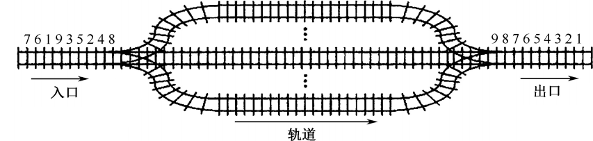

<options :options="['A. 2', 'B. 3', 'C. 4', 'D. 5']" />

【例3-12 2017统考真题】下列关于栈的叙述中，错误的是 (&emsp;)。

<options :options="['Ⅰ. 采用非递归方式重写递归程序时必须使用栈']" />
<options :options="['Ⅱ. 函数调用时，系统要用栈保存必要的信息']" />
<options :options="['Ⅲ. 只要确定了入栈次序，即可确定出栈次序']" />
<options :options="['Ⅳ. 栈是一种受限的线性表，允许在其两端进行操作']" /><br/>

<options :options="['A. 仅Ⅰ', 'B. 仅Ⅰ、Ⅱ、Ⅲ', 'C. 仅Ⅰ、Ⅲ、Ⅳ', 'D. 仅Ⅱ、Ⅲ、Ⅳ']" />

</question>

### 队列

<table>
  <thead>
    <tr>
      <th style="text-align: center;" colspan="4">循环队列 操作内容（Maxsize表示空间容量/数组大小）</th>
    </tr>
  </thead>
  <tbody>
    <tr>
      <td>入队</td>
      <td><mono>(rear +1)%MaxSize</mono></td>
      <td>判空</td>
      <td><mono>front==rear</mono></td>
    </tr>
    <tr>
      <td>出队</td>
      <td><mono>(front+1)%MaxSize</mono></td>
      <td>判满</td>
      <td><mono>front==(rear+1)%MaxSize</mono></td>
    </tr>
    <tr>
      <td>个数</td>
      <td colspan="3"><mono>(rear-front+MaxSize)%MaxSize</mono></td>
    </tr>
  </tbody>
</table>

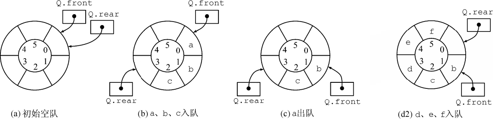

<question>

【例3-13 2010统考真题】某队列允许在其两端进行入队操作，但仅允许在一端进行出队操作。若元素a,b,c,d,e依次入此队列后再进行出队操作，则不可能得到的出队序列是 (&emsp;)。

<options :options="['A. b,a,c,d,e', 'B. d,b,a,c,e', 'C. d,b,c,a,e', 'D. e,c,b,a,d']" />

【例3-14 2011统考真题】已知循环队列存储在一维数组A[0…n-1]中，且队列非空时front和rear分别指向队头元素和队尾元素。若初始时队列为空，且要求第一个进入队列的元素存储在A[0]处，则初始时front和rear的值分别是 (&emsp;)。

<options :options="['A. 0,0', 'B. 0,n-1', 'C. n-1,0', 'D. n-1,n-1']" />

【例3-15 2014统考真题】循环队列放在一维数组A[0…M-1]中，end1指向队头元素，end2指向队尾元素的后一个位置。假设队列两端均可进行入队和出队操作，队列中最多能容纳M-1个元素。初始时为空。下列判断队空和队满的条件中，正确的是 (&emsp;)。

<options :options="['A. 队空: end1 == end2；队满: end1 == (end2+1) mod M']" />
<options :options="['B. 队空: end1 == end2；队满: end2 == (end1+1) mod (M-1)']" />
<options :options="['C. 队空: end2 == (end1+1) mod M；队满: end1 == (end2+1) mod M']" />
<options :options="['D. 队空: end1 == (end2+1) mod M；队满: end2 == (end1+1) mod (M-1)']" />

【例3-16 2018统考真题】现有队列Q与栈S，初始时Q中的元素依次是1,2,3,4,5,6（1在队头），S为空。若仅允许下列3种操作：①出队并输出出队元素；②出队并将出队元素入栈；③出栈并输出出栈元素，则不能得到的输出序列是 (&emsp;)。

<options :options="['A. 1,2,5,6,4,3', 'B. 2,3,4,5,6,1']" />
<options :options="['C. 3,4,5,6,1,2', 'D. 6,5,4,3,2,1']" />

【例3-17 2021统考真题】初始为空的队列Q的一端仅能进行入队操作，另外一端既能进行入队操作又能进行出队操作。若Q的入队序列是1,2,3,4,5，则不能得到的出队序列是 (&emsp;)。

<options :options="['A. 5,4,3,1,2', 'B. 5,3,1,2,4']" />
<options :options="['C. 4,2,1,3,5', 'D. 4,1,3,2,5']" />

【例3-18 2009统考真题】为解决计算机主机与打印机之间速度不匹配的问题，通常设置一个打印数据缓冲区，主机将要输出的数据依次写入该缓冲区，而打印机则依次从该缓冲区中取出数据。该缓冲区的逻辑结构应该是 (&emsp;)。

<options :options="['A. 栈', 'B. 队列', 'C. 树', 'D. 图']" />

</question>

### 矩阵

::: info 两种数组表示
<mono>a[1...n]</mono> 和 <mono>a[1:n]</mono> 表示下标从1到n，共n个元素。
:::

|         矩阵          | 内容                                                         |
| :-------------------: | ------------------------------------------------------------ |
|         数组          | 设二维数组有n行m列：<br/>① 若按行优先存放，则<mono>a[i][j]</mono>的地址为<mono>a+(i\*m+j)\*L</mono>。<br/>② 若按列优先存放，则<mono>a[i][j]</mono>的地址为<mono>a+(j\*n+i)\*L</mono>。 |
| 对阵矩阵<br/>三角矩阵 | ① 下三角按行存储：$\small k=(1+2+...+i-1)+j-1=\frac{i(i-1)}{2}+j-1$。<br/>② 上三角按列存储：$\small k=(1+2+...+j-1)+i-1=\frac{j(j-1)}{2}+i-1$。<br/>三角矩阵最后一个元素放另一半三角的常数。 |
|      三对角矩阵       | 按行压缩，下标对应关系：$\small k=2\times1+3\times(i-2)+0/1$。<br/>第一行和末尾行只有2个，中间行都是3个元素。 |
|       稀疏矩阵        | 三元组存储行下标、列下表和元素值，下标从0开始，始终按第一列升序排序。 |

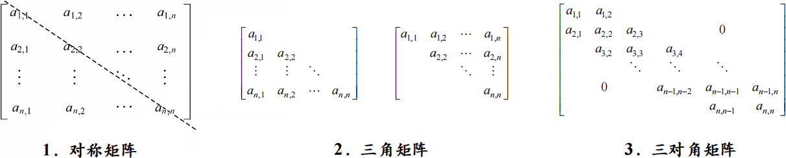


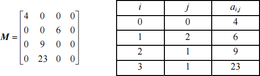

<question>

【例3-19 2016统考真题】有一个100阶的三对角矩阵M，其元素m<sub>i,j</sub>（1≤i,j≤100）按行优先依次压缩存入下标从0开始的一维数组N中。元素m<sub>30,30</sub>在N中的下标是 (&emsp;)。

<options :options="['A. 86', 'B. 87', 'C. 88', 'D. 89']" />

【例3-20 2017统考真题】适用于压缩存储稀疏矩阵的两种存储结构是 (&emsp;)。

<options :options="['A. 三元组表和十字链表']" />
<options :options="['B. 三元组表和邻接矩阵']" />
<options :options="['C. 十字链表和二叉链表']" />
<options :options="['D. 邻接矩阵和十字链表']" />

【例3-21 2018统考真题】设有一个12×12的对称矩阵M，将其上三角部分的元素m<sub>i,j</sub>（1≤i≤j≤12）按行优先存入C语言的一维数组N中，元素m<sub>6,6</sub>在N中的下标是 (&emsp;)。

<options :options="['A. 50', 'B. 51', 'C. 55', 'D. 66']" />

【例3-22 2020统考真题】将一个10×10对称矩阵M的上三角部分的元素m<sub>i,j</sub>（1≤i≤j≤10）按列优先存入C语言的一维数组N中，元素m<sub>7,2</sub>在N中的下标是 (&emsp;)。

<options :options="['A. 15', 'B. 16', 'C. 22', 'D. 23']" />

【例3-23 2021统考真题】二维数组A按行优先方式存储，每个元素占用1个存储单元。若元素A[0][0]的存储地址是100，A[3][3]的存储地址是220，则元素A[5][5]的存储地址是 (&emsp;)。

<options :options="['A. 295', 'B. 300', 'C. 301', 'D. 306']" />

【例3-24 2023统考真题】若采用三元组表存储结构存储稀疏矩阵M，则除三元组表外，下列数据中还需要保存的是 (&emsp;)。

<options :options="['Ⅰ. M的行数&emsp;Ⅱ. M中包含非零元素的行数']" />
<options :options="['Ⅲ. M的列数&emsp;Ⅳ. M中包含非零元素的列数']" /><br/>

<options :options="['A. 仅Ⅰ、Ⅲ', 'B. 仅Ⅰ、Ⅳ', 'C. 仅Ⅱ、Ⅳ', 'D. Ⅰ、Ⅱ、Ⅲ、Ⅳ']" />

</question>

## 第四章 串

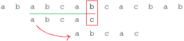

| KMP数组 | 内容                                                         |
| :-----: | ------------------------------------------------------------ |
|   PM    | 从开头到当前位置的子串，其最长公共前后缀的长度。             |
|  next   | 法一：PM数组整体右移一位，开头补<mono>-1</mono>，再整体加<mono>1</mono>。<br/>法二：失配位置前的子串，其最大公共前后缀的长度再加<mono>1</mono>。<br/>默认下标从<mono>1</mono>开始，若从<mono>0</mono>开始，则不用整体加<mono>1</mono>。 |
| nextval | 第一位是<mono>0</mono>，其他位根据next找到对应的元素，相同则取其nextval，不同取自身next。 |

<div style="display: flex; gap: 10px; align-items: center; justify-content: center;">
  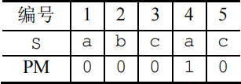
  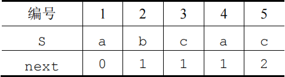
</div>

<question>

【例4-1 2015统考真题】已知字符串s为'abaabaabacacaabaabcc'，模式串t为'abaabc'，采用KMP算法进行匹配，第一次出现“失配”（s[i]≠t[j]）时，i=j=5，则下次开始匹配时，i和j的值分别是 (&emsp;)。

<options :options="['A. i = 1, j = 0', 'B. i = 5, j = 0', 'C. i = 5, j = 2', 'D. i = 6, j = 2']" />

【例4-2 2019统考真题】设主串T='abaabaabcabaabc'，模式串S='abaabc'，采用KMP算法进行模式匹配，到匹配成功时为止，在匹配过程中进行的单个字符间的比较次数是 (&emsp;)。

<options :options="['A. 9', 'B. 10', 'C. 12', 'D. 15']" />

【例4-3 2024统考真题】KMP算法使用修正后的next数组进行模式匹配，模式串为S='aabaab'，当主串的某个字符与S的某个字符失配时，S向右滑动的最长距离是 (&emsp;)。

<options :options="['A. 5', 'B. 4', 'C. 3', 'D. 2']" />

</question>

## 第五章 树

### 树和森林

|      性质      | 内容                                                         |
| :------------: | ------------------------------------------------------------ |
|    树的性质    | • 结点总数 = 总度数<mono>+1</mono> = 分支数<mono>+1</mono><br/>• 树的度为k，结点数为n，则树的最大高度为<emp><mono>n-k+1</mono></emp> |
|  二叉树的性质  | • 二叉树第<mono>i</mono>层结点数最多为 <emp>$\small 2^{i-1}$</emp>，结点总数最多为 <emp>$\small 2^h-1$</emp><br/>• 任意二叉树中，<emp>$\small n_0=n_2+1$</emp><br/>• 完全二叉树中，<emp>$\small n_1=0\text{ or }1$</emp>，n为偶数则 $\small n_1=1$，n为奇数则 $\small n_1=0$<br/>• 完全二叉树中，$\small 2^{h-1}-1<n≤2^{h}-1$，即 <emp>$\small h=\lceil log_2(n+1) \rceil$</emp> 或 <emp>$\small \lfloor log_2n\rfloor + 1$</emp><br/>• 不管以任何方式遍历二叉树，<emp>叶结点的相对顺序不变</emp> |
| 树、森林的遍历 | • 树和森林的先序遍历 = 二叉树的先序遍历<br/>• 树和森林的<emp>后</emp>序遍历 = 二叉树的<emp>中</emp>序遍历 |

| 树、森林转二叉树 | 内容（左孩子，右兄弟）                                      |
| :--------------: | ----------------------------------------------------------- |
|    树转二叉树    | ① 左叉连最左侧的子结点<br/>② 最左子结点右叉连右侧所有子结点 |
|   森林转二叉树   | 森林中每棵树先转，第一树右叉连右侧所有树                    |

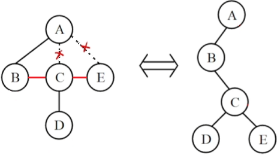

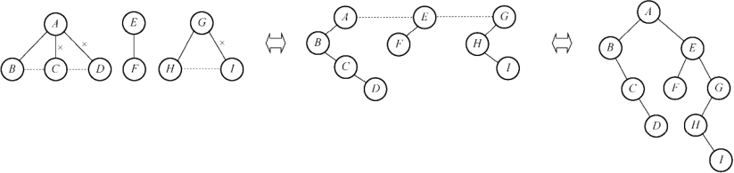

<question>

【例5-1 2010统考真题】在一棵度为4的树T中，若有20个度为4的结点，10个度为3的结点，1个度为2的结点，10个度为1的结点，则树T的叶结点个数是 (&emsp;)。

<options :options="['A. 41', 'B. 82', 'C. 113', 'D. 122']" />

【例5-2 2016统考真题】若森林F有15条边、25个结点，则F包含树的个数是 (&emsp;)。

<options :options="['A. 8', 'B. 9', 'C. 10', 'D. 11']" />

【例5-3 2009统考真题】已知一棵完全二叉树的第6层(设根为第1层)有8个叶结点，则该完全二叉树的结点个数最多是 (&emsp;)。

<options :options="['A. 39', 'B. 52', 'C. 111', 'D. 119']" />

【例5-4 2011统考真题】若一棵完全二叉树有768个结点，则该二叉树中叶结点的个数是 (&emsp;)。

<options :options="['A. 257', 'B. 258', 'C. 384', 'D. 385']" />

【例5-5 2018统考真题】设一棵非空完全二叉树T的所有叶结点均位于同一层，且每个非叶结点都有2个子结点。若T有k个叶结点，则T的结点总数是 (&emsp;)。

<options :options="['A. 2k - 1', 'B. 2k', 'C. k2', 'D. 2k - 1']" />

【例5-6 2020统考真题】对于任意一棵高度为5且有10个结点的二叉树，若采用顺序存储结构保存，每个结点占1个存储单元(仅存放结点的数据信息)，则存放该二叉树需要的存储单元数量至少是 (&emsp;)。

<options :options="['A. 31', 'B. 16', 'C. 15', 'D. 10']" />

【例5-7 2022统考真题】若三叉树T中有244个结点(叶结点的高度为1)，则T的高度至少是 (&emsp;)。

<options :options="['A. 8', 'B. 7', 'C. 6', 'D. 5']" />

【例5-8 2009统考真题】将森林转换为对应的二叉树，若在二叉树中，结点u是结点v的父结点的父结点，则在原来的森林中，u和v可能具有的关系是 (&emsp;)。

<options :options="['Ⅰ. 父子关系']" />
<options :options="['Ⅱ. 兄弟关系']" />
<options :options="['Ⅲ. u的父结点与v的父结点是兄弟关系']" /><br/>

<options :options="['A. 只有Ⅱ', 'B. Ⅰ和Ⅱ', 'C. Ⅰ和Ⅲ', 'D. Ⅰ、Ⅱ和Ⅲ']" />


【例5-9 2011统考真题】已知一棵有2011个结点的树，其叶结点个数为116，该树对应的二叉树中无右孩子的结点个数是 (&emsp;)。

<options :options="['A. 115', 'B. 116', 'C. 1895', 'D. 1896']" />

【例5-10 2014统考真题】将森林F转换为对应的二叉树T，F中叶结点的个数等于 (&emsp;)。

<options :options="['A. T中叶结点的个数', 'B. T中度为1的结点个数']" />
<options :options="['C. T中左孩子指针为空的结点个数', 'D. T中右孩子指针为空的结点个数']" width="86%" />

【例5-11 2019统考真题】若将一棵树T转化为对应的二叉树BT，则下列对BT的遍历中，其遍历序列与T的后根遍历序列相同的是 (&emsp;)。

<options :options="['A. 先序遍历', 'B. 中序遍历', 'C. 后序遍历', 'D. 按层遍历']" />

【例5-12 2020统考真题】已知森林F及与之对应的二叉树T，若F的先根遍历序列是a,b,c,d,e,f，中根遍历序列是b,a,d,f,e,c，则T的后根遍历序列是 (&emsp;)。

<options :options="['A. b,a,d,f,e,c', 'B. b,d,f,e,c,a', 'C. b,f,e,d,c,a', 'D. f,e,d,c,b,a']" />

【例5-13 2021统考真题】某森林F对应的二叉树为T，若T的先序遍历序列是a,b,d,c,e,g,f，中序遍历序列是b,d,a,e,g,c,f，则F中树的棵数是 (&emsp;)。

<options :options="['A. 1', 'B. 2', 'C. 3', 'D. 4']" />

</question>

### 线索二叉树

| 线索二叉树 | 内容                                                         |
| :--------: | ------------------------------------------------------------ |
|    定义    | 线索用来指向遍历序列中前驱和后继，故分为先/中/后序线索二叉树。 |
|    方法    | • 将所有结点的空指针利用起来，<br/>• 空左指针指向前驱，并置ltag为1，空右指针指向后继，并置rtag为1。 |
|    性质    | • 中序线索二叉树可以直接遍历<br/>• **先序**线索二叉树**不支持直接找前驱**<br/>• **后序**线索二叉树**不支持直接找后继**，需借助栈保存父结点信息 |

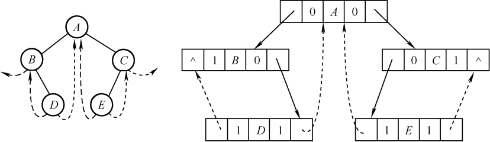

<question>

【例5-14 2009统考真题】给定二叉树如下图所示。设N代表二叉树的根，L代表根结点的左子树，R代表根结点的右子树。若遍历后的结点序列是3175624，则其遍历方式是 (&emsp;)。

<options :options="['A. LRN', 'B. NRL', 'C. RLN', 'D. RNL']" />

【例5-15 2010统考真题】下列线索二叉树中（用虚线表示线索），符合后序线索树定义的是 (&emsp;)。

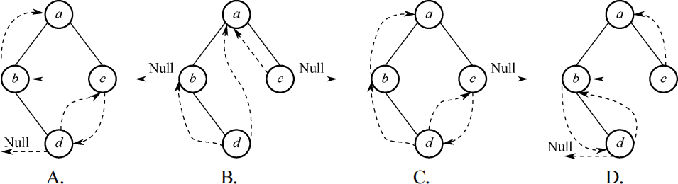

【例5-16 2011统考真题】一棵二叉树的前序遍历序列和后序遍历序列分别为1,2,3,4和4,3,2,1，该二叉树的中序遍历序列不会是 (&emsp;)。

<options :options="['A. 1,2,3,4', 'B. 2,3,4,1', 'C. 3,2,4,1', 'D. 4,3,2,1']" />

【例5-17 2012统考真题】若一棵二叉树的前序遍历序列为a, e, b, d, c，后序遍历序列为b, c, d, e, a，则根结点的孩子结点 (&emsp;)。

<options :options="['A. 只有e', 'B. 有e、b', 'C. 有e、c', 'D. 无法确定']" />

【例5-18 2013统考真题】若X是后序线索二叉树中的叶结点，且X存在左兄弟结点Y，则X的右线索指向的是 (&emsp;)。

<options :options="['A. X的父结点', 'B. 以Y为根的子树的最左下结点']" />
<options :options="['C. X的左兄弟结点Y', 'D. 以Y为根的子树的最右下结点']" />

【例5-19 2014统考真题】若对下图所示的二叉树进行中序线索化，则结点x的左、右线索指向的结点分别是 (&emsp;)。

<options :options="['A. e,c', 'B. e, a', 'C. d,c', 'D. b,a']" />

【例5-20 2015统考真题】先序序列为a, b, c, d的不同二叉树的个数是 (&emsp;)。

<options :options="['A. 13', 'B. 14', 'C. 15', 'D. 16']" />

【例5-21 2017统考真题】某二叉树的树形如下图所示，其后序序列为e, a, c, b, d, g, f，树中与结点a同层的结点是 (&emsp;)。

<options :options="['A. c', 'B. d', 'C. f', 'D. g']" />

【例5-22 2017统考真题】要使一棵非空二叉树的先序序列与中序序列相同，其所有非叶结点须满足的条件是 (&emsp;)。

<options :options="['A. 只有左子树', 'B. 只有右子树', 'C. 结点的度均为1', 'D. 结点的度均为2']" />

【例5-23 2022统考真题】若结点p与q在二叉树T的中序遍历序列中相邻，且p在q之前，则下列p与q的关系中，不可能的是 (&emsp;)。

<options :options="['Ⅰ. q是p的双亲&emsp;Ⅱ. q是p的右孩子']" />
<options :options="['Ⅲ. q是p的右兄弟&emsp;Ⅳ. q是p的双亲的双亲']" /><br/>

<options :options="['A. 仅Ⅰ', 'B. 仅Ⅲ', 'C. 仅Ⅱ、Ⅲ', 'D. 仅Ⅱ、Ⅳ']" />


【例5-24 2023统考真题】已知一棵二叉树的树形如下图所示，若其后序遍历序列为f, d, b, e, c, a，则其先序遍历序列是 (&emsp;)。

<options :options="['A. a, e, d, f, b, c', 'B. a, c, e, b, d, f', 'C. c, a, b, e, f, d', 'D. d, f, e, b, a, c']" />

【例5-25 2024统考真题】若p、q和v均为二叉树T中的结点，v有两个孩子结点，T的中序遍历序列形如“..., p, v, q,...”，则在下列叙述中，正确的是 (&emsp;)。

<options :options="['A. p没有右孩子，q没有左孩子', 'B. p没有右孩子，q有左孩子']" />
<options :options="['C. p有右孩子，q没有左孩子', 'D. p有右孩子，q有左孩子']" />

</question>

### 哈夫曼树

|  哈夫曼树  | 内容                                                         |
| :--------: | ------------------------------------------------------------ |
|    定义    | • 结点的带权路径长度：结点权重 * 结点到根的路径长度<br/>• 树的<emp>带权路径长度</emp>：所有叶结点的带权路径长度之和<br/>• 树的<emp>带权平均长度</emp>：带权路径长度 / 权重之和 |
|    构建    | • 找到权值最小的两个结点，组合成树，根的权值为两结点权值之和（只看根结点）<br/>• 将树放入集合中，重复上述步骤 |
|    性质    | • 哈夫曼树的带权路径长度 WPL 最小<br/>• 共 $\small n$ 个结点，构造过程中新建了 $\small n-1$ 个结点，最终哈夫曼树共 $\small 2n-1$ 个结点<br/>• 哈夫曼树只有度为 $\small 0$ 和 $\small 1$ 的结点，即 $\small n=n_0+n_2$<br/>• 权值越小的结点离根越远 |
| 哈夫曼编码 | 结点权值仅用于构建哈夫曼树，编码过程不涉及权值。<br/>• 从根向下设左分支为0，右分支为1<br/>• 从根到叶的路径编码，即该叶的编码 |

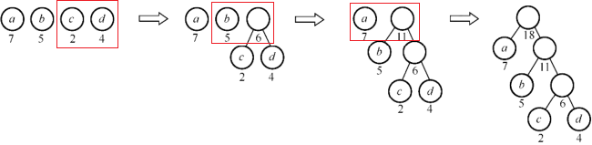

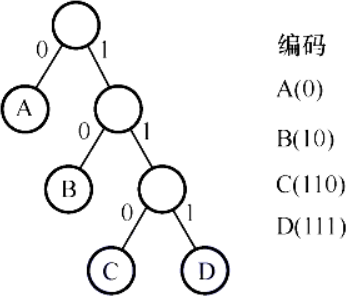


<question>

【例5-26 2010统考真题】n(n≥2)个权值均不相同的字符构成哈夫曼树，关于该树的叙述中，错误的是 (&emsp;)。

<options :options="['A. 该树一定是一棵完全二叉树']" />
<options :options="['B. 树中一定没有度为1的结点']" />
<options :options="['C. 树中两个权值最小的结点一定是兄弟结点']" />
<options :options="['D. 树中任意一个非叶结点的权值一定不小于下一层任意一个结点的权值']" />

【例5-27 2014统考真题】5个字符有如下4种编码方案，不是前缀编码的是 (&emsp;)。

<options :options="['A. 01, 0000, 0001, 001, 1', 'B. 011, 000, 001, 010, 1']" />
<options :options="['C. 000, 001, 010, 011, 100', 'D. 0, 100, 110, 1110, 1100']" />

【例5-28 2015统考真题】下列选项给出的是从根分别到达两个叶结点路径上的权值序列，能属于同一棵哈夫曼树的是 (&emsp;)。

<options :options="['A. 24,10,5 和 24,10,7', 'B. 24,10,5 和 24,12,7']" />
<options :options="['C. 24,10,10 和 24,14,11', 'D. 24,10,5 和 24,14,6']" />

【例5-29 2017统考真题】已知字符集{a, b, c, d, e, f, g, h}，若各字符的哈夫曼编码依次是0100, 10, 0000, 0101, 001, 011, 11, 0001，则编码序列0100011001001011110101的译码结果是 (&emsp;)。

<options :options="['A. acgabfh', 'B. adbagbb', 'C. afbeagd', 'D. afeefgd']" />

【例5-30 2018统考真题】已知字符集{a, b, c, d, e, f}，若各字符出现的次数分别为6, 3, 8, 2, 10, 4，则对应字符集中各字符的哈夫曼编码可能是 (&emsp;)。

<options :options="['A. 00, 1011, 01, 1010, 11, 100', 'B. 00, 100, 110, 000, 0010, 01']" />
<options :options="['C. 10, 1011, 11, 0011, 00, 010', 'D. 0011, 10, 11, 0010, 01, 000']" />

【例5-31 2019统考真题】对n个互不相同的符号进行哈夫曼编码。若生成的哈夫曼树共有115个结点，则n的值是 (&emsp;)。

<options :options="['A. 56', 'B. 57', 'C. 58', 'D. 60']" />

【例5-32 2021统考真题】若某二叉树有5个叶结点，其权值分别为10, 12, 16, 21, 30，则其最小的带权路径长度(WPL)是 (&emsp;)。

<options :options="['A. 89', 'B. 200', 'C. 208', 'D. 289']" />

【例5-33 2022统考真题】对任意给定的含n(n>2)个字符的有限集S，用二叉树表示S的哈夫曼编码集和定长编码集，分别得到二叉树T1和T2。下列叙述中，正确的是 (&emsp;)。

<options :options="['A. T1与T2的结点数相同']" />
<options :options="['B. T1的高度大于T2的高度']" />
<options :options="['C. 出现频次不同的字符在T1中处于不同的层']" />
<options :options="['D. 出现频次不同的字符在T2中处于相同的层']" />

【例5-44 2023统考真题】在由6个字符组成的字符集S中，各字符出现的频次分别为3, 4, 5, 6, 8, 10，为S构造的哈夫曼编码的加权平均长度为 (&emsp;)。

<options :options="['A. 2.4', 'B. 2.5', 'C. 2.67', 'D. 2.75']" />

</question>

## 第六章 图

::: info 并查集*

- 并查集本质是一个森林，逻辑上用树表示集合，物理上用数组存储。
- 并查集使用双亲表示法，数组保存数据，下标定位结点。
- 一般结点保存父结点的下标，父结点保存**负**的结点数（故负数表示根）。最开始每个元素都是一个独立的集合，所以结点值都为-1。

1. 集合的合并：合并两数所在集合，将小集合合并到大集合中。即小集合根作大集合根的子结点。
2. 查找两数是否在一个集合

:::

### 基本概念

::: info 了解概念

- 顶点集合不可为空，边集可为空。
- 无向图中边记作$\small (V_i，V_j)$，有向图中记作$\small <V_i,V_j>$称弧，以及弧头弧尾。
- 一条边的两个顶点互为邻接点。
- 若有$\small G=(V,E),G'=(V',E')$且$\small V'∈V,E'∈E$，则$\small G'$为$\small G$的子图。
- 称$V_i$到$V_j$所经序列为路径，路径长度即边的条数。
- 无重复结点的路径叫简单路径，首尾相同的路径叫回路或环。

:::

| 重要概念       | 含义                                                         |
| -------------- | ------------------------------------------------------------ |
| 有向图、无向图 | 有向图边有方向，无向图边无方向                               |
| 完全图         | 所有顶点相邻接。无向完全图有<emp>$\frac{n(n-1)}{2}$</emp>个边，有向完全图有<emp>$n(n-1)$</emp>个边 |
| 顶点的度       | 顶点连接的边数。有向图度数=入度+出度，<emp>$总度数/2=边数$</emp> |
| 连通图         | 无向图中，两点有路径称两点连通，若所有顶点均连通，称该图为连通图 |
| 连通分量       | 无向图中的极大连通子图                                       |
| 强连通图       | 有向图中，任意顶点间均有两个方向的路径，称该图为强连通图     |
| 强连通分量     | 有向图中的极大连通子图                                       |
| 生成树         | 连通图的极小连通子图（用最少的边连接所有顶点）               |
| 最小生成树     | 所有生成树中，边权值之和最小的树，称最小生成树               |

::: tip
- 子图必须要求$\small G'=(V',E')$，<u>因为$\small V'$和$\small E'$不一定能组合成图</u>。
- 树是特殊的图，当图为连通图且无回路，则该图可视为树。
- 完全图是特殊的连通图。
:::

<question>

【例2- 2009 统考真题】下列关于无向连通图特性的叙述中, 正确的是( &emsp; )
<options :options="['A. 只有I', 'B. 只有II', 'C. I 和II', 'D. I 和III']" />
I. 所有顶点的度之和为偶数
II. 边数大于顶点个数减1
III. 至少有一个顶点的度为1

【例2- 2010 统考真题】若无向图G = ( V, E ) 中含有7 个顶点, 要保证图G 在任何情况下都是连通的, 则需要的边数最少是( &emsp; )
<options :options="['A. 6', 'B. 15', 'C. 16', 'D. 21']" />

【例2- 2017 统考真题】已知无向图G 含有16 条边, 其中度为4 的顶点个数为3, 度为3 的顶点个数为4, 其他顶点的度均小于3。图G 所含的顶点个数至少是( &emsp; )
<options :options="['A. 10', 'B. 11', 'C. 13', 'D. 15']" />

【例2- 2022 统考真题】对于无向图G = ( V, E ), 下列选项中, 正确的是( &emsp; )
<options :options="['A. 当|V| > |E| 时, G 一定是连通的', 'B. 当|V| < |E| 时, G 一定是连通的', 'C. 当|V| = |E| - 1 时, G 一定是不连通的', 'D. 当|V| > |E| + 1 时, G 一定是不连通的']" />

</question>

### 存储结构

- 邻接矩阵：本质二维数组，$\small edges[a][b]=1$表示$\small a$到$\small b$有边，$\small edges[b][a]=1$表示$\small b$到$\small a$有边。
- 邻接表：本质单链表数组，$\small edges[a]$链接了顶点$\small a$的所有边。

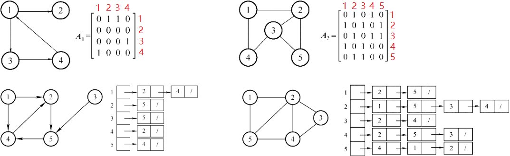

| 对比方面     | 邻接矩阵                                                     | 邻接表                                                       |
| ------------ | ------------------------------------------------------------ | ------------------------------------------------------------ |
| 存储空间大小 | 和顶点数有关                                                 | 和顶点数、边数有关                                           |
| 数据特点     | 无向图的邻接矩阵是对称的                                     | 无向图的邻接表比有向图的大一倍                               |
| 适用性       | 适合稠密图                                                   | 适合稀疏图                                                   |
| 唯一性       | 唯一                                                         | 不唯一                                                       |
| 度的计算     | 无向图的度遍历一行 $O(n)$，<br/>出度看行 $O(n)$、入度看列 $O(n)$ | 无向图度遍历链表 $O(n)$，<br/>出度遍历链表 $O(n)$、入度遍历邻接表 $O(E)$ |
| 边的判断     | 直接访问 $O(1)$                                              | 遍历链表 $O(n)$                                              |

- 十字链表（仅用于有向图）

> 本质是两个单链表数组，第一个是入边链表，保存该点所有入边，第二个出边链表，保存该点所有出边。按下标顺序链接并对齐，便于参照邻接矩阵。

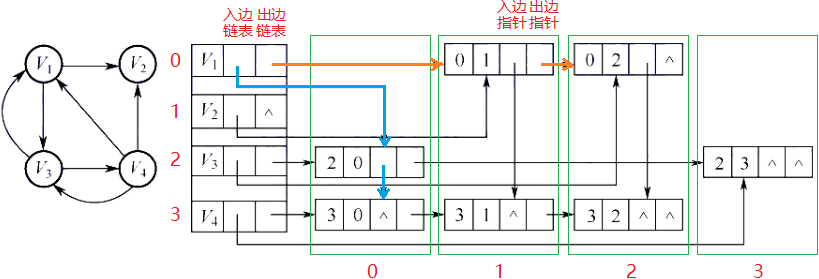

- 邻接多重表（仅用于无向图）

> 和邻接表的区别是加强了边的保存内容，边结构体本质是两个链表组合在一起，点1及其next指针和点2及其next指针。通过自己的next指针可以找到自己的下一条边。

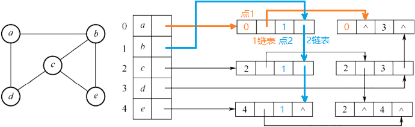

<question>

【例2- 2013 统考真题】设图的邻接矩阵A 如下所示, 各顶点的度依次是( &emsp; )

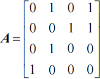

<options :options="['A. 1,2,1,2', 'B. 2,2,1,1', 'C. 3,4,2,3', 'D. 4,4,2,2']" />

【例2- 2024 统考真题】若无向图G = ( V, E ) 的邻接多重表如下图所示, 则G 中顶点b 与d 的度分别是( &emsp; )

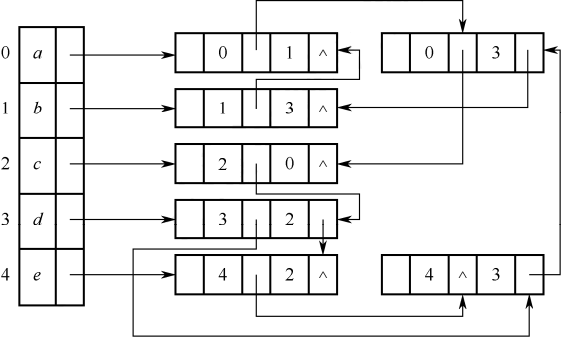

<options :options="['A. 0,2', 'B. 2,4', 'C. 2,5', 'D. 3,4']" />

</question>

### 图的遍历

|   图的遍历   | 内容                                                         |                        作用                        |
| :----------: | ------------------------------------------------------------ | :------------------------------------------------: |
| 深度优先遍历 | • 从某个顶点开始，进行访问<br/>• 多路依次递归所有未被访问的邻接点<br/> | 深度遍历可以判断<br/><u>有向图和无向图</u>是否有环 |
| 广度优先遍历 | • 从某个顶点开始，将其入队<br/>• 在队列不为空的前提下循环，取出队头进行访问<br/>• 将队头的所有未被访问的邻接点入队<br/> |     广度遍历仅可判断<br/><u>无向图</u>是否有环     |

| 遍历算法             | 存储结构 | 时间复杂度          | 空间复杂度 |
| -------------------- | -------- | ------------------- | ---------- |
| DFS / BFS / 拓扑排序 | 邻接矩阵 | <emp>$O(n^2)$</emp> | $O(n)$     |
| DFS / BFS / 拓扑排序 | 邻接表   | <emp>$O(n+e)$</emp> | $O(n)$     |

<question>

【例2- 2012 统考真题】对有n 个顶点、e 条边且使用邻接表存储的有向图进行广度优先遍历, 其算法的时间复杂度是( &emsp; )

<options :options="['A. O(n)', 'B. O(e)', 'C. O(n+e)', 'D. O(ne)']" />

【例2- 2013 统考真题】若对如下无向图进行遍历, 则下列选项中, 不是广度优先遍历序列的是( &emsp; )

<options :options="['A. h, c, a, b, d, e, g, f', 'B. e, a, f, g, b, h, c, d', 'C. d, b, c, a, h, e, f, g', 'D. a, b, c, d, h, e, f, g']" />

【例2- 2015 统考真题】设有向图G = ( V, E ), 顶点集V = { V0, V1, V2, V3 }, 边集E = { <v0, v1>, <v0, v2>, <v0, v3>, <v1, v3> }。若从顶点V0 开始对图进行深度优先遍历, 则可能得到的不同遍历序列个数是( &emsp; )

<options :options="['A. 2', 'B. 3', 'C. 4', 'D. 5']" />

【例2- 2016 统考真题】下列选项中, 不是下图深度优先搜索序列的是( &emsp; )

<options :options="['A. V1, V5, V4, V3, V2', 'B. V1, V3, V2, V5, V4']" />
<options :options="['C. V1, V2, V5, V4, V3', 'D. V1, V2, V3, V4, V5']" />

</question>

### 图的应用

#### 最小生成树

::: info 性质

- $n$ 个顶点的连通图的生成树有 $n$ 个点和 $n-1$ 条边。
- 生成树是边最少的连通图，一个连通图可以有多个生成树。
- 若存在权值相同的边，则最小生成树**可能**不唯一；若最小生成树不唯一，则一定存在权值相同的边。
- 最小生成树的边权值之和是所有生成树中最小的。

:::

|                最小生成树                | 内容                                                         |
| :--------------------------------------: | ------------------------------------------------------------ |
| Kruskal算法<br/>(与点数无关，适合稀疏图) | • 每次都找最小权值的边，<br/>• 检查是否构成回路，<br/>• 若构成回路，则放弃该边，重新选择。<br/>逻辑：先放入n个顶点，排序所有边，按序选择权值最小边，并确保无环<br/>出现。 |
|  Prim算法<br/>(与边数无关，适合稠密图)   | • 首次选择全局最小边，<br/>• 之后都选择与已有边相邻的权值最小边。<br/>逻辑：每次都找一个已选点和一个未选点，所构成的权值最小边，故天然<br/>避开回路。 |

#### 最短路径

|            最短路径             | 内容                                                         |
| :-----------------------------: | ------------------------------------------------------------ |
| Dijkstra算法<br/>(单源最短路径) | • 除源点外共四个点，故画四行四列的表格<br/>• 第一轮找出源点到其他点的距离，选出最短路径<br/>• 第二轮按**上一轮的最短路径**，算到其他点的最短路径，更小则更新，不小则照抄。 |
|  Floyd算法<br/>(多源最短路径)   | • 求点$V_i$到$V_j$的最短路径，就暴力枚举所有可能路径：<br/>• $V_1-V_n、V_1-V_2-V_n、V_1-V_2-...-V_n$（包含所有可能顶点） |

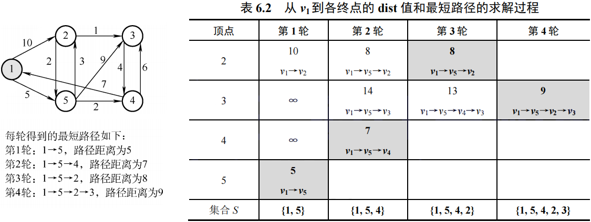

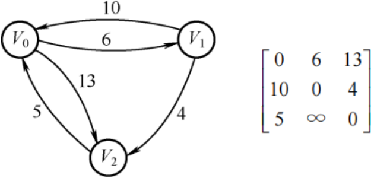

| 对比         | Dijkstra算法      | Floyd算法              | BFS算法        |
| ------------ | ----------------- | ---------------------- | -------------- |
| 用途         | 求单源最短路径    | 求各顶点之间的最短路径 | 求单源最短路径 |
| 无权图       | 适用              | 适用                   | 适用           |
| 带权图       | 适用              | 适用                   |                |
| 带负权值的图 | <emp>不适用</emp> | 适用                   |                |
| 时间复杂度   | $O(n^2)$          | $O(n^3)$               |                |

#### 描述表达式

用**有向无环图**描述表达式，不可出现重复操作数顶点。

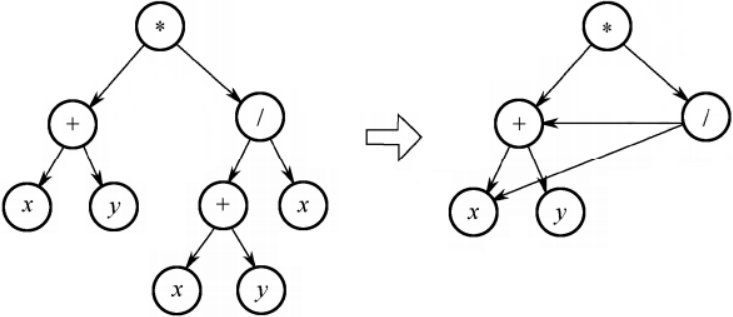

#### 拓扑排序

- 拓扑排序必须要求**有向无环图**，因此可以检测图是否有环。
- 如$V_i$到$V_j$有路径，则$V_i$一定在$V_j$的前面。

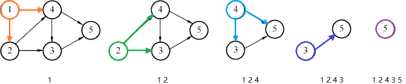

循环找到一个入度为0的点，输出并删除该点及其出边。同时存在多个入度为0的点时，对其输出顺序无要求，因此拓扑序列可能不唯一。

#### 关键路径

::: info 概念

- AOE网即边活动网，边表示活动，点称事件表示活动始末状态。
- AOE网是**有向无环图**，活动存在先后关系。
- ve：事件最早开始时间、vl：事件最晚开始时间、e：活动最早开始时间、l：活动最晚开始时间。

:::

关键路径是耗时最多的路径（不唯一）。最早开始时间=最晚开始时间的活动为关键活动，所构成路径即关键路径。

::: tip 性质

- 关键路径并不唯一，关键路径是权值之和最大的那条路径。
- 增加关键路径上的任意活动的持续时间，一定会延长工期。
- 减少关键路径上的任意活动的持续时间，不一定会缩短工期。
- 若只有一条关键路径，则一定会缩短工期。若有多条关键路径，则另外的关键路径仍在支撑工期长度。

:::

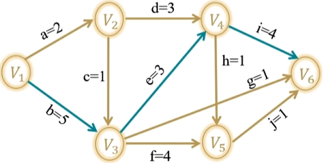

|        关键路径         | 内容                                                         |
| :---------------------: | ------------------------------------------------------------ |
| 求事件最早开始时间$ve$  | • 先将所有事件的 $ve$ 设为 0<br/>• 从源点开始，拓扑序找入度为0的点，更新所有出边的邻接点的 $ve$（更新成<br/>最大值） |
| 求事件最晚开始时间 $vl$ | • 先将所有事件的 $vl$ 设为整个工程的 $ve$<br/>• 从汇点开始，逆拓扑序找出度为0的点，更新所有入边的邻接点的 $vl$（更新<br/>成最小值） |

> $ve$ 要最大保证前面的活干完，$vl$ 要最小保证后面的活干完。

|    关键路径（续表）    | 内容                                 |
| :--------------------: | ------------------------------------ |
| 求活动最早开始时间 $e$ | 出发点的最早开始时间 $ve$            |
| 求活动最晚开始时间 $l$ | 指向点的最晚开始时间 $vl$ - 活动耗时 |

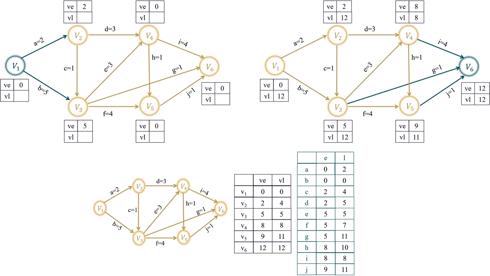

<question>

【例2- 2010 统考真题】对下图进行拓扑排序，可得不同拓扑序列的个数是( &emsp; )
<options :options="['A. 4', 'B. 3', 'C. 2', 'D. 1']" />

【例2- 2012 统考真题】下列关于最小生成树的叙述中，正确的是( &emsp; )
<options :options="['A. 仅I', 'B. 仅II', 'C. 仅I、III', 'D. 仅II、IV']" />
I. 最小生成树的代价唯一
II. 所有权值最小的边一定会出现在所有的最小生成树中
III. 使用Prim 算法从不同顶点开始得到的最小生成树一定相同
IV. 使用Prim 算法和Kruskal 算法得到的最小生成树总不相同

【例2- 2012 统考真题】对下图所示的有向带权图，若采用Dijkstra 算法求从源点a 到其他各顶点的最短路径，则得到的第一条最短路径的目标顶点是b，第二条最短路径的目标顶点是c，后续得到的其余各最短路径的目标顶点依次是( &emsp; )
<options :options="['A. d, e, f', 'B. e, d, f', 'C. f, d, e', 'D. f, e, d']" />

【例2- 2012 统考真题】若用邻接矩阵存储有向图，矩阵中主对角线以下的元素均为零，则关于该图拓扑序列的结论是( &emsp; )
<options :options="['A. 存在，且唯一', 'B. 存在，且不唯一', 'C. 存在，可能不唯一', 'D. 无法确定是否存在']" />

【例2- 2013 统考真题】下列AOE 网表示一项包含8 个活动的工程。通过同时加快若干活动的进度可以缩短整个工程的工期。下列选项中，加快其进度就可以缩短工程工期的是( &emsp; )
<options :options="['A. c 和e', 'B. d 和c', 'C. f 和d', 'D. f 和h']" />

【例2- 2014 统考真题】对下图所示的有向图进行拓扑排序，得到的拓扑序列可能是( &emsp; )
<options :options="['A. 3, 1, 2, 4, 5, 6', 'B. 3, 1, 2, 4, 6, 5', 'C. 3, 1, 4, 2, 5, 6', 'D. 3, 1, 4, 2, 6, 5']" />

【例2- 2015 统考真题】求下面的带权图的最小(代价) 生成树时，可能是Kruskal 算法第2 次选中但不是Prim 算法(从V4 开始) 第2 次选中的边是( &emsp; )
<options :options="['A. (V1, V3)', 'B. (V1, V4)', 'C. (V2, V3)', 'D. (V3, V4)']" />

【例2- 2011 统考真题】下列关于图的叙述中，正确的是( &emsp; )
<options :options="['A. 仅II', 'B. 仅I、II', 'C. 仅III', 'D. 仅I、III']" />
I. 回路是简单路径
II. 存储稀疏图，用邻接矩阵比邻接表更省空间
III. 若有向图中存在拓扑序列，则该图不存在回路

【例2- 2016 统考真题】使用Dijkstra 算法求下图中从顶点1 到其他各顶点的最短路径，依次得到的各最短路径的目标顶点是( &emsp; )
<options :options="['A. 5, 2, 3, 4, 6', 'B. 5, 2, 3, 6, 4', 'C. 5, 2, 4, 3, 6', 'D. 5, 2, 6, 3, 4']" />

【例2- 2016 统考真题】若对n 个顶点、e 条弧的有向图采用邻接表存储，则拓扑排序算法的时间复杂度是( &emsp; )
<options :options="['A. O(n)', 'B. O(n+e)', 'C. O(n^2)', 'D. O(ne)']" />

【例2- 2018 统考真题】下列选项中，不是如下有向图的拓扑序列的是( &emsp; )
<options :options="['A. 1, 5, 2, 3, 6, 4', 'B. 5, 1, 2, 6, 3, 4', 'C. 5, 1, 2, 3, 6, 4', 'D. 5, 2, 1, 6, 3, 4']" />

【例2- 2019 统考真题】下图所示的AOE 网表示一项包含8 个活动的工程。活动d 的最早开始时间和最迟开始时间分别是( &emsp; )
<options :options="['A. 3 和7', 'B. 12 和12', 'C. 12 和14', 'D. 15 和15']" />

【例2- 2019 统考真题】用有向无环图描述表达式 (x + y) * ((x + y) / x)，需要的顶点个数至少是( &emsp; )
<options :options="['A. 5', 'B. 6', 'C. 8', 'D. 9']" />

【例2- 2020 统考真题】已知无向图G 如下所示，使用Kruskal 算法求图G 的最小生成树，加到最小生成树中的边依次是( &emsp; )
<options :options="['A. (b, f), (b, d), (a, e), (c, e), (b, e)', 'B. (b, f), (b, d), (b, e), (a, e), (c, e)', 'C. (a, e), (b, e), (c, e), (b, d), (b, f)', 'D. (a, e), (c, e), (b, e), (b, f), (b, d)']" />

【例2- 2020 统考真题】修改递归方式实现的图的深度优先搜索(DFS) 算法，将输出(访问) 顶点信息的语句移到退出递归前(即执行输出语句后立刻退出递归)。采用修改后的算法遍历有向无环图G，若输出结果中包含G 中的全部顶点，则输出的顶点序列是G 的( &emsp; )
<options :options="['A. 拓扑有序序列', 'B. 逆拓扑有序序列', 'C. 广度优先搜索序列', 'D. 深度优先搜索序列']" />

【例2- 2020 统考真题】若使用AOE 网估算工程进度，则下列叙述中正确的是( &emsp; )
<options :options="['A. 关键路径是从源点到汇点边数最多的一条路径', 'B. 关键路径是从源点到汇点路径长度最长的路径', 'C. 增加任意一个关键活动的时间不会延长工程的工期', 'D. 缩短任意一个关键活动的时间将会缩短工程的工期']" />

【例2- 2021 统考真题】给定如下有向图，该图的拓扑有序序列的个数是( &emsp; )
<options :options="['A. 1', 'B. 2', 'C. 3', 'D. 4']" />

【例2- 2021 统考真题】使用Dijkstra 算法求下图中从顶点1 到其余各顶点的最短路径，将当前找到的从顶点1 到顶点2, 3, 4, 5 的最短路径长度保存在数组dist 中，求出第二条最短路径后，dist 中的内容更新为( &emsp; )
<options :options="['A. 26, 3, 14, 6', 'B. 25, 3, 14, 6', 'C. 21, 3, 14, 6', 'D. 15, 3, 14, 6']" />

【例2- 2022 统考真题】下图是一个有10 个活动的AOE 网，时间余量最大的活动是( &emsp; )
<options :options="['A. c', 'B. g', 'C. h', 'D. j']" />

【例2- 2023 统考真题】已知无向连通图G 中各边的权值均为1。在下列算法中，一定能够求出图G 中从某顶点到其余各顶点最短路径的是( &emsp; )
<options :options="['A. 仅I', 'B. 仅III', 'C. 仅I、II', 'D. I、II、III']" />
I. Prim 算法
II. Kruskal 算法
III. 图的广度优先搜索算法

</question>

## 第七章 查找

### 线性查找

- 哨兵位：在序列开头放入待查找元素，从后往前遍历查找的过程中不必判断循环越界。
- 平均查找长度ASL：查找集合每个元素所需要的平均比较次数（总次数/元素个数）

##### 顺序查找

$ASL=\frac{n(n+1)}{2}\frac{1}{n}=\frac{1+n}{2}≈\frac{n}{2}$

##### 折半查找

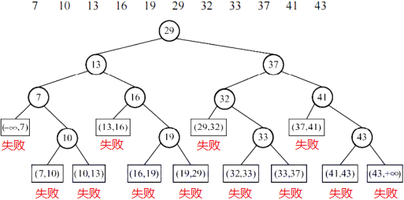

成功查找的次数是判定树中结点的层数，失败查找的次数是判定树中“失败”的父结点的层数。

$ASL_{succ}=\frac{1}{n}\sum{成功点的层高}$

$ASL_{fail}=\frac{1}{失败位置个数}\sum{失败位置父结点的层高}$

折半查找判定树的形态：

- 当结点个数为奇数时，左子树和右子树结点个数相等；
- 当结点个数为偶数时，右子树比左子树多一个结点（左少右多）。

> 这个结论对子树依然成立，因此可推断判定树的构造形态。

折半查找判定树本质是二叉排序树，且是接近完美的二叉排序树。

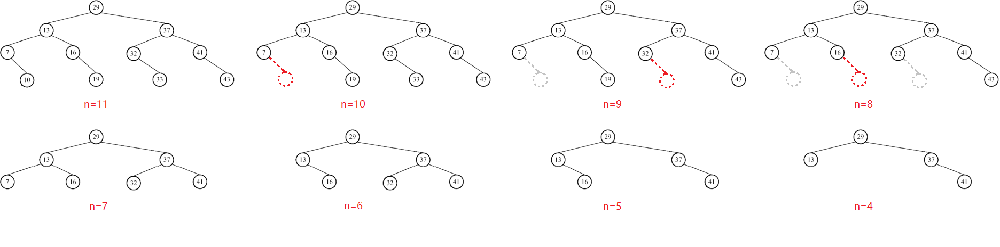

##### 分块查找

- 将序列分块，块内无序块间有序，使用索引表记录每块最大关键字和起始地址。
- 将待查找元素和块最大关键字比较，再在对应块中顺序查找。

> 最佳情况是令$s=\sqrt{n}$

设索引表长 b，每块长度为s，$ASL=\frac{1+b}{2}+\frac{1+s}{2}$

### 树形查找

[二叉搜索树](/docs/DS/5-二叉搜索树)

- 插入：一定落在叶结点的下方
- 删除：叶结点直接删，非叶结点需找左子树的最右结点（前驱）替换过来，再将最右结点的左子树补上来。
- 效率：一般情况 $O(logn)$，最坏情况 $O(n)$

[平衡二叉树](/docs/C++/12-map&set#_2-1-avl树)

- 插入：二叉搜索树一致，只是操作结束需要进行旋转。
- 删除：叶结点直接删，非叶结点若左树高则拿左树最右结点替换，反之则拿右树最左结点替换，最后需考虑旋转。

| 左单旋 LL型                  | 右单旋 RR型         | 左右双旋 LR型              | 右左双旋 RL型                       |
| ---------------------------- | ------------------- | -------------------------- | ----------------------------------- |
| $\backslash \to /\backslash$ | $/ \to /\backslash$ | $< \to / \to /\backslash$  | $> \to \backslash  \to /\backslash$ |
| 左高左旋                     | 右高右旋            | 下半左高左旋，上半右高右旋 | 下半右高右旋，上半左高左旋          |

设深度h的平衡二叉树的最少结点数为n_h，则有$n_h=n_{h-2}+n_{h-1}+1.$

[红黑树](/docs/C++/12-map&set#_2-2-红黑树)

定义：

- 根叶黑：根和叶子（空结点）都是黑色
- 不红红：不存在连续的两个红色结点
- 黑路同：任意结点到叶的所有路径的黑色结点数量相同

性质：
- 最长路径不会超过最短路径的两倍
- 具有$n$个内部结点的红黑树高度不超过 $2log_2{(n+1)}$

[B树](#树形查找)

1. 性质

- 所有叶结点都在同一层（叶节点指失败结点，求深度不算叶节点）
- 根结点分支数最少 2 最多 $m$，非根非叶结点分支数最少 <emp>$\lceil\frac{m}{2}\rceil$</emp> 最多 <emp>$m$</emp>

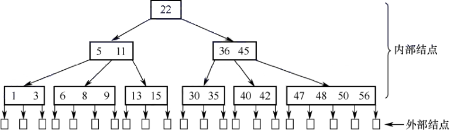

2. 插入

- 比根小走左比根大走右，
- 走到叶结点处进行插入排序，
- 元素个数上溢时需裂项，将中间元素放到父结点中，左右两边裂成两个结点。


3. 删除

- 删除非叶结点，将前驱或后继替换上来
- 如果发生下溢，将父结点中的前驱或后继借来，左右兄弟借一个补上去。（父下来兄上去）
- 如果左右都不够借，需要父元素下移到兄弟中，自身再和兄弟合并。（父下来兄合并）

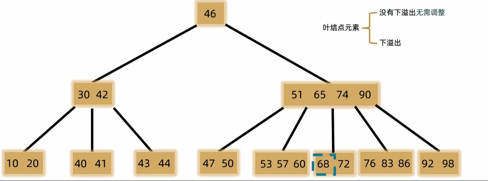
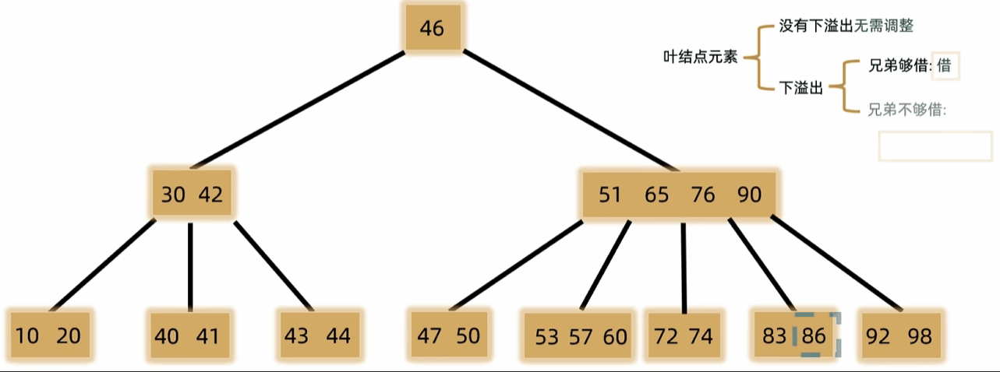

[B+树](#树形查找)

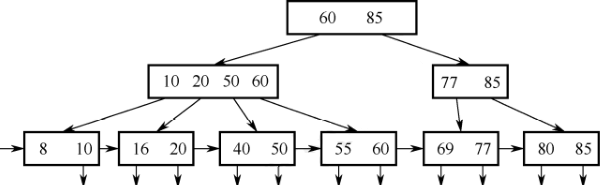

> - 一般用于文件索引系统和数据库。
> - 多级索引结构，仅叶结点存有效数据，非叶结点用于索引，查找一次必走完从根到叶的路径。

| B树                                     | B+树                         |
| --------------------------------------- | ---------------------------- |
| m-1个关键字，m个子树                    | m个关键字，m个子树           |
| 所有内部结点存储信息                    | 叶节点存储信息，非叶存储索引 |
| 关键字可无重复                          | 关键字必出现重复             |
| <emp>支持随机查找，不支持顺序查找</emp> | 支持随机查找和顺序查找       |

> 随机访问的含义是前后访问的位置纯随机无任何联系。

### 散列查找

::: info 基本概念

[哈希表](/docs/C++/13-哈希)

- 散列函数：除留余数法
- 散列地址：散列函数的计算结果
- 同义词：散列地址相同的关键字互为同义词
- 冲突：关键字计算所得位置被占用
- 二次聚集/堆积：某个关键字放在本不属于他的位置，再插入本属于该位置的关键字，此时的冲突就叫二次聚集。
- 装填因子：$\alpha=\frac{n 表中关键字数}{m 散列表长度}$
- 冲突处理：开放地址法、开散列/拉链法/哈希桶

:::

影响查找长度的因素：<emp>装填因子、哈希函数、处理冲突的方法</emp>，和散列表长度无关。

**开放地址法** $H_i=(H(key)+d_i)\%m$

- 线性探测 $d_i=1,2,...$
- 二次探测 $1^2,-1^2,2^2,-2^2,...$

$ASL_{succ}$：所有关键字的比较总次数 / 关键字个数

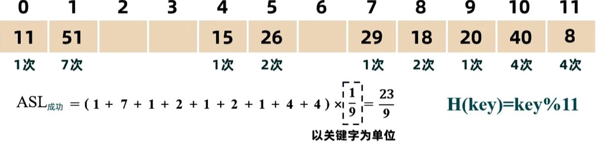

$ASL_{fail}$：除最后映射不到的之外的所有位置的比较总次数 / 位置个数

> 求一个位置失败的查找次数，是看该位置到最近的空位置的比较次数，到空位置也需要比较一次。

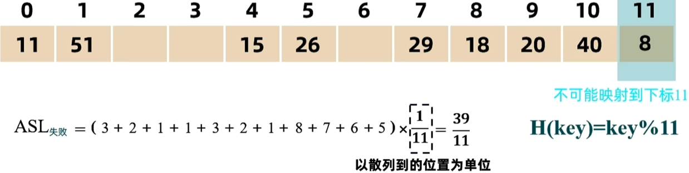

## 第八章 排序

### 内部排序

| 排序                                              | 时间复杂度   | 空间复杂度           | 稳定性            | 描述                                                        |
| ------------------------------------------------- | ------------ | -------------------- | ----------------- | ----------------------------------------------------------- |
| [直接插排](/docs/DS/6-八大排序#_1-1-直接插入排序) | $O(n^2)$     | $O(1)$               | 稳定              | 新元素插入前面的有序序列                                    |
| [希排](/docs/DS/6-八大排序#_1-2-希尔排序)         | $O(n^{1.3})$ | $O(1)$               | <emp>不稳定</emp> | 从$\frac{n}{2}$到1的间距进行直接插排                        |
| [冒排](/docs/DS/6-八大排序#_3-1-冒泡排序)         | $O(n^2)$     | $O(1)$               | 稳定              | 两两交换将最大值换到末尾                                    |
| [快排](/docs/DS/6-八大排序#_3-2-快速排序)         | $O(nlogn)$   | <emp>$O(logn)$</emp> | <emp>不稳定</emp> | 单趟排序相互交换无法保证稳定性                              |
| [直接选排](/docs/DS/6-八大排序#_2-1-直接选择排序) | $O(n^2)$     | $O(1)$               | <emp>不稳定</emp> | 遍历数组找最大值放到末尾                                    |
| [堆排](/docs/DS/6-八大排序#_2-2-堆排序)           | $O(nlogn)$   | $O(1)$               | <emp>不稳定</emp> | 向下建[堆](/docs/DS/4-二叉树#_3-堆)，删除堆顶最大值放到末尾 |
| [归并排序](/docs/DS/6-八大排序#_4-归并排序)       | $O(nlogn)$   | <emp>$O(n)$</emp>    | 稳定              | 二分递归回溯时进行归并                                      |
| 基数排序                                          | $O(n+r)$     | $O(r)$               | 稳定              | 从低到高逐位排序                                            |

> 稳定性口诀：**选**艾**希**，**堆**攻**速**

::: info 特点

- 插排、希排、冒排最好情况是完全有序，最坏情况是完全逆序。
- 快排最好情况是每次都选到中位数，递归树形态完美，最坏情况是完全有序。
- 归并操作最好情况是一个序列遍历完毕一个不动，最坏情况是两个序列的都遍历完毕。
---
- 冒排、选排、堆排一趟可以确定一个数，快排可以确定多个数，插排、希排、归并、基数不能。
---
- 二叉排序树最好情况是完全二叉树、而堆一定是一个完全二叉树。
- 堆从根到叶的任意路径都是有序序列，二叉排序树不行。
---
- 排序趟数和序列的初始状态有关：冒排，快排。
- 比较次数和序列的初始状态有关：插排，希排，快排，归排，冒排。无关：选排，堆排。
- 移动次数和序列的初始状态有关：插排，希排，冒排，快排，~~堆排~~。无关：选排，归排。

:::

### 外部排序
