# 数据结构

## 第一章 绪论

::: stress 考点1 时间复杂度
1. 时间复杂度

```c
// O(logn)                     // O(m+n) 或 O(max(m,n))
for(int i=0;i<=n;i*=2)         for(int i=0;i<=m;i++)
  k++;                           k++;
                               for(int i=0;i<=n;i++)
                                 k++;

// O(n^2)                      //O(√n)
for(int i=0;i<n;i++)           while(i*i<n)
  for(int j=0;j<i;j++)           i++;
    k++; // 频次 n(n+1)/2
```
:::

2. 空间复杂度（只考虑额外开辟的辅助空间）

```c
// O(1)                        // O(n)                  // O(n)
void Sort(int A[],int n){      int Func(int n){         int Fib(int n) {
  for (int i=0;i<n-1;i++){       if (n==0) return 1;      if(n<3) return 1;
    bool flag=false;             return Func(n-1)*n;      return Fib(n-1)*Fib(n-2);
    for(int j=n-1;j>i;j--)     }                        }
      ...                      //递归栈空间消耗          //递归栈可以重复利用
```

<question>

【例1 2022统考真题】下列程序段的时间复杂度是 (&emsp;)。


<options :options="['A. O(log<sub>2</sub>n)', 'B. O(n<sup>1/2</sup>)', 'C. O(n)', 'D. O(n<sup>2</sup>)']" />

::: analysis
算法复杂度描述，关键语句的执行次数t和问题规模n的关系。

|      | 第1轮 | 第2轮 |  第3轮  | ...  |   第log<sub>2</sub>n轮    |
| :--: | :---: | :---: | :-----: | :--: | :-----------------------: |
|  i   |   1   |   2   |    4    | ...  |       $\frac{n}{2}$       |
|  j   |   0   |  0,1  | 0,1,2,3 | ...  | 0,1,2,...,$\frac{n}{2}$-1 |
|  t   |   1   |   2   |    4    | ...  |       $\frac{n}{2}$       |

知道每轮的执行次数t，以及共有多少轮log<sub>2</sub>n。所有轮循环的执行次数总和：t=(1+2+4+...+$\frac{n}{2}$)，形成log<sub>2</sub>n项等比数列求和：

$$
\small t=(1+2+4+\cdots+\frac{n}{2})=\frac{a_1(1-q^n)}{1-q}=\frac{1×(1-2^{log_2n})}{1-2}=n.
$$
:::

【例2 2025统考真题】下列程序段的时间复杂度是 (&emsp;)。


<options :options="['A. O(log<sub>2</sub>n)', 'B. O(n<sup>1/2</sup>)', 'C. O(n)', 'D. O(n<sup>2</sup>)']" />

::: analysis
|      | 第1轮 | 第2轮 | 第3轮 | ...  | 第log<sub>2</sub>n轮 |
| :--: | :---: | :---: | :---: | :--: | :------------------: |
|  i   |   1   |   2   |   3   | ...  |      $\sqrt{n}$      |
|  j   |   1   |  1,2  | 1,2,3 | ...  | 1,2,3,...,$\sqrt{n}$ |
|  t   |   1   |   2   |   3   | ...  |      $\sqrt{n}$      |

$$
\small t=(1+2+3+\cdots+\sqrt{n})=\frac{(1+\sqrt{n})\sqrt{n}}{2}=n.
$$
:::

</question>

## 第二章 线性表

### 顺序表 {.ignore-header}

| 顺序表 | 内容                                                         |
| ------ | ------------------------------------------------------------ |
| 插入   | 平均移动次数为$\frac{n}{2}$，时间复杂度为 $\small O(n)$ |
| 删除   | 平均移动次数为$\frac{n-1}{2}$，时间复杂度为 $\small O(n)$ |
| 查找   | 支持随机存取，复杂度为 $\small O(1)$              |

> 插入删除第 $\small i$ 个元素时，要移动 $\small n-i$ 个元素。

<question>

【例3 2023统考真题】在下列对顺序存储的有序表（长度为n）实现给定操作的算法中，平均时间复杂度为O(1)的是 (&emsp;)。

<options :options="['A. 查找包含指定值元素的算法', 'B. 插入包含指定值元素的算法']" />
<options :options="['C. 删除第i (1≤i≤n) 个元素的算法', 'D. 获取第i (1≤i≤n) 个元素的算法']" />

</question>

::: stress 考点2 链表指针链接顺序
### 链表 {.ignore-header}

|        链表        | 头插          | 头删          | 尾插          | 尾删          |   中间插入    |   中间删除    |
| :----------------: | ------------- | ------------- | ------------- | ------------- | :-----------: | :-----------: |
| （带头）单/双链表  | $\small O(1)$ | $\small O(1)$ | $\small O(n)$ | $\small O(n)$ | $\small O(n)$ | $\small O(n)$ |
| （带头）循环单链表 | $\small O(n)$ | $\small O(n)$ | $\small O(n)$ | $\small O(n)$ | $\small O(n)$ | $\small O(n)$ |
| （带头）循环双链表 | $\small O(1)$ | $\small O(1)$ | $\small O(1)$ | $\small O(1)$ | $\small O(n)$ | $\small O(n)$ |
:::

<question>

【例4 2021统考真题】已知头指针h指向一个带头结点的非空循环单链表，结点结构为其中next是指向直接后继结点的指针，p是尾指针，g是临时指针。现要删除该链表的第一个元素，正确的语句序列是 (&emsp;)。

<options :options="['A. h->next=h->next->next;q=h->next;free(q);']" />
<options :options="['B. q=h->next;h->next=h->next->next;free(q);']" />
<options :options="['C. q=h->next;h->next=q->next;if(p!=q) p=h;free(q)']" />
<options :options="['D. q=h->next;h->next=q->next;if(p==q) p=h;free(q);']" />

【例5 2024统考真题】已知带头结点的非空单链表L的头指针为h，结点结构为其中next是指向直接后继结点的指针。现有指针p和q，若p指向L中非首且非尾的任意一个结点，则执行语句序列“q=p->next；p->next=q->next；q->next= h->next; h->next=q;”的结果是 (&emsp;)。

<options :options="['A. 在P所指结点后插入g所指结点', 'B. 在g所指结点后插入P所指结点']" />
<options :options="['C. 将P所指结点移至工的头结点之后', 'D. 将g所指结点移动到L的头结点之后']" width="80%"/>

</question>

## 第三章 栈、队列和矩阵

### 卡特兰数 {.ignore-header}

- n个元素入栈，入栈序列确定，出栈序列的个数为$\frac{1}{n+1}C^{n}_{2n}$。
- n个元素组成先序序列，先序序列确定，形成二叉树的个数为$\frac{1}{n+1}C^{n}_{2n}$。

::: stress 考点3 栈的应用
### 栈 {.ignore-header}

|                           栈的应用                           | 内容                                                         |
| :----------------------------------------------------------: | ------------------------------------------------------------ |
| [括号匹配](https://leetcode.cn/problems/valid-parentheses/solutions/3897597/ji-jian-gua-hao-pi-pei-wen-ti-by-yyx_dev-nrgt/) | ① 遍历序列，遇左括号入栈<br/>② 遇右括号，判断栈顶匹配则弹栈，若不匹配或空栈失败<br/>③ 最后判断栈是否为空 |
| [中缀转后缀](https://leetcode.cn/problems/evaluate-reverse-polish-notation/solutions/3897777/zhong-zhui-zhuan-hou-zhui-hou-zhui-biao-0wu9h/) | ① 眼看法：将a+b写成ab+。<mono>(a+b)\*c+d-(e+g)\*h</mono> 到 <mono>ab+c\*d+eg+h\*-</mono>。<br/>② 遍历树：前序得到前缀表达式，后序遍历得到后缀表达式。<br/>③ 借助栈：<mono>(1) </mono>若是数，放入结果串。若是运算符，放入栈<br/>&emsp;&emsp;&emsp;&emsp;&emsp; <mono>(2) </mono>若栈中有运算符，比较二者优先级，优先级高于栈顶才能放进去<br/>&emsp;&emsp;&emsp;&emsp;&emsp; <mono>(3) </mono>如遇左括号放入栈，如遇右括号，弹栈运算直到弹出左括号 |
| [后缀表达式求值](https://leetcode.cn/problems/evaluate-reverse-polish-notation/solutions/3897777/zhong-zhui-zhuan-hou-zhui-hou-zhui-biao-0wu9h/) | ① 遇操作数，放入栈<br/>② 遇操作符，弹栈两个操作数运算（注意倒序），结果放入栈<br/>③ 最后栈中唯一元素，即结果 |
:::

<question>

【例6 2010统考真题】若元素a,b,c,d,e,f依次进栈，允许进栈、退栈操作交替进行，但不允许连续3次进行退栈操作，不可能得到的出栈序列是 (&emsp;)。

<options :options="['A. dcebfa', 'B. cbdaef', 'C. bcaefd', 'D. afedcb']" />

【例7 2012统考真题】已知操作符包括“+”、“-”、“\*”、“/”、“(”和“)”。将中缀表达式 a+b-a\*c+d/e-f+g 转换为等价的后缀表达式 ab+acd+e/f-\*-g+ 时，用栈来存放暂时还不能确定运算次序的操作符。栈初始时为空时，转换过程中同时保存在栈中的操作符的最大个数是 (&emsp;)。

<options :options="['A. 5', 'B. 7', 'C. 8', 'D. 11']" />

</question>

::: stress 考点4 循环队列
### 队列 {.ignore-header}

<table>
  <thead>
    <tr>
      <th style="text-align: center;" colspan="4">循环队列 操作内容（Maxsize表示空间容量/数组大小）</th>
    </tr>
  </thead>
  <tbody>
    <tr>
      <td>入队</td>
      <td><mono>(rear +1)%MaxSize</mono></td>
      <td>判空</td>
      <td><mono>front==rear</mono></td>
    </tr>
    <tr>
      <td>出队</td>
      <td><mono>(front+1)%MaxSize</mono></td>
      <td>判满</td>
      <td><mono>front==(rear+1)%MaxSize</mono></td>
    </tr>
    <tr>
      <td>个数</td>
      <td colspan="3"><mono>(rear-front+MaxSize)%MaxSize</mono></td>
    </tr>
  </tbody>
</table>
:::

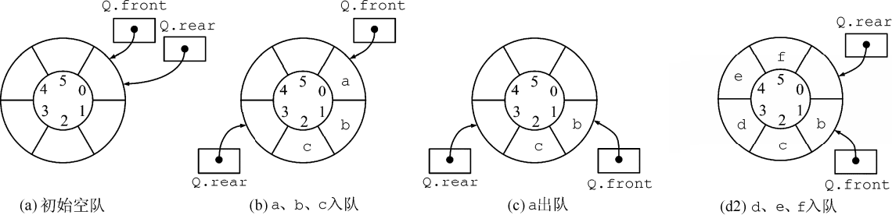

<question>

【例8 2010统考真题】某队列允许在其两端进行入队操作，但仅允许在一端进行出队操作。若元素a,b,c,d,e依次入此队列后再进行出队操作，则不可能得到的出队序列是 (&emsp;)。

<options :options="['A. b,a,c,d,e', 'B. d,b,a,c,e', 'C. d,b,c,a,e', 'D. e,c,b,a,d']" />

【例9 2014统考真题】循环队列放在一维数组A[0…M-1]中，end1指向队头元素，end2指向队尾元素的后一个位置。假设队列两端均可进行入队和出队操作，队列中最多能容纳M-1个元素。初始时为空。下列判断队空和队满的条件中，正确的是 (&emsp;)。

<options :options="['A. 队空: end1 == end2；队满: end1 == (end2+1) mod M']" />
<options :options="['B. 队空: end1 == end2；队满: end2 == (end1+1) mod (M-1)']" />
<options :options="['C. 队空: end2 == (end1+1) mod M；队满: end1 == (end2+1) mod M']" />
<options :options="['D. 队空: end1 == (end2+1) mod M；队满: end2 == (end1+1) mod (M-1)']" />

【例10 2018统考真题】现有队列Q与栈S，初始时Q中的元素依次是1,2,3,4,5,6（1在队头），S为空。若仅允许下列3种操作：①出队并输出出队元素；②出队并将出队元素入栈；③出栈并输出出栈元素，则不能得到的输出序列是 (&emsp;)。

<options :options="['A. 1,2,5,6,4,3', 'B. 2,3,4,5,6,1', 'C. 3,4,5,6,1,2', 'D. 6,5,4,3,2,1']" />

</question>

::: stress 考点5 矩阵元素位置计算
### 矩阵 {.ignore-header}

|         矩阵          | 内容                                                         |
| :-------------------: | ------------------------------------------------------------ |
|         数组          | 设二维数组有n行m列：<br/>① 若按行优先存放，则<mono>a[i][j]</mono>的地址为<mono>a+(i\*m+j)\*L</mono>。<br/>② 若按列优先存放，则<mono>a[i][j]</mono>的地址为<mono>a+(j\*n+i)\*L</mono>。 |
| 对阵矩阵<br/>三角矩阵 | ① 下三角按行存储：$\small k=(1+2+...+i-1)+j-1=\frac{i(i-1)}{2}+j-1$。<br/>② 上三角按列存储：$\small k=(1+2+...+j-1)+i-1=\frac{j(j-1)}{2}+i-1$。<br/>三角矩阵最后一个元素放另一半三角的常数。 |
|      三对角矩阵       | 按行压缩，下标对应关系：$\small k=2\times1+3\times(i-2)+0/1$。<br/>第一行和末尾行只有2个，中间行都是3个元素。 |
|       稀疏矩阵        | 三元组存储行下标、列下表和元素值，下标从0开始，始终按第一列升序排序。 |
:::

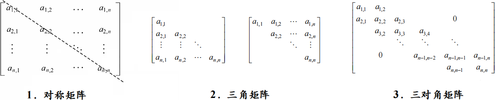
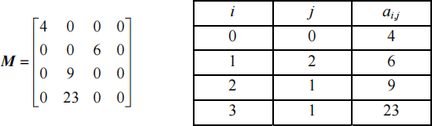

::: info 两种数组表示
<mono>a[1...n]</mono> 和 <mono>a[1:n]</mono> 表示下标从1到n，共n个元素。
:::

<question>

【例11 2016统考真题】有一个100阶的三对角矩阵M，其元素m<sub>i,j</sub>（1≤i,j≤100）按行优先依次压缩存入下标从0开始的一维数组N中。元素m<sub>30,30</sub>在N中的下标是 (&emsp;)。

<options :options="['A. 86', 'B. 87', 'C. 88', 'D. 89']" />

【例12 2018统考真题】设有一个12×12的对称矩阵M，将其上三角部分的元素m<sub>i,j</sub>（1≤i≤j≤12）按行优先存入C语言的一维数组N中，元素m<sub>6,6</sub>在N中的下标是 (&emsp;)。

<options :options="['A. 50', 'B. 51', 'C. 55', 'D. 66']" />

【例13 2021统考真题】二维数组A按行优先方式存储，每个元素占用1个存储单元。若元素A[0][0]的存储地址是100，A[3][3]的存储地址是220，则元素A[5][5]的存储地址是 (&emsp;)。

<options :options="['A. 295', 'B. 300', 'C. 301', 'D. 306']" />

</question>

## 第四章 串

::: stress 考点6 KMP算法过程
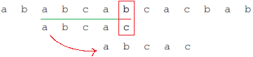

| KMP数组 | 内容                                                         |
| :-----: | ------------------------------------------------------------ |
|   PM    | 从开头到当前位置的子串，其最长公共前后缀的长度。             |
|  next   | 法一：PM数组整体右移一位，开头补<mono>-1</mono>，再整体加<mono>1</mono>。<br/>法二：失配位置前的子串，其最大公共前后缀的长度再加<mono>1</mono>。<br/>默认下标从<mono>1</mono>开始，若从<mono>0</mono>开始，则不用整体加<mono>1</mono>。 |
| nextval | 第一位是<mono>0</mono>，其他位根据next找到对应的元素，相同则取其nextval，不同取自身next。 |
:::

<div style="display: flex; gap: 10px; align-items: center; justify-content: center;">
  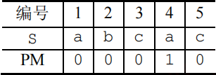
  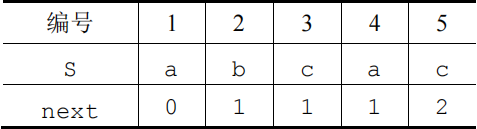
</div>

<question>

【例14 2015统考真题】已知字符串s为'abaabaabacacaabaabcc'，模式串t为'abaabc'，采用KMP算法进行匹配，第一次出现“失配”（s[i]≠t[j]）时，i=j=5，则下次开始匹配时，i和j的值分别是 (&emsp;)。

<options :options="['A. i = 1, j = 0', 'B. i = 5, j = 0', 'C. i = 5, j = 2', 'D. i = 6, j = 2']" />

【例15 2024统考真题】KMP算法使用修正后的next数组进行模式匹配，模式串为S='aabaab'，当主串的某个字符与S的某个字符失配时，S向右滑动的最长距离是 (&emsp;)。

<options :options="['A. 5', 'B. 4', 'C. 3', 'D. 2']" />

</question>

## 第五章 树

::: stress 考点7 树和二叉树的性质
### 树和二叉树 {.ignore-header}

|     性质     | 内容                                                         |
| :----------: | ------------------------------------------------------------ |
|   树的性质   | • <emp>结点总数 = 总度数+1 = 分支数+1</emp>。N = n<sub>0</sub>+n<sub>1</sub>+...+n<sub>n</sub> = 0·n<sub>0</sub>+1·n<sub>1</sub>+...+n·n<sub>n</sub>+1<br/>• 树的度为k，结点数为n，则树的最大高度为 n-k+1 |
| 二叉树的性质 | • 二叉树第<mono>i</mono>层结点数最多为 <num>2<sup>i-1</sup></num>，结点总数最多为 <num>2<sup>h</sup>-1</num><br/>• 任意二叉树中，<emp>n<sub>0</sub>=n<sub>2</sub>+1<br/></emp>• 完全二叉树中，n<sub>1</sub>=0或1，n为偶数则 n<sub>1</sub>=1，n为奇数则 n<sub>1</sub>=0<br/>• 完全二叉树中，n个节点，所占高度为 h=⌈log<sub>2</sub>(n+1)⌉ <br/>• 不管以任何方式遍历二叉树，叶结点的相对顺序不变 |
| 二叉树的遍历 | • 先序遍历：先访问根，再访问左树，最后访问右树<br/>• 中序遍历：先访问左树，再访问根，最后访问右树<br/>• 后序遍历：先访问左树，再访问右树，最后访问根 |
:::

<question>

【例16 2010统考真题】在一棵度为4的树T中，若有20个度为4的结点，10个度为3的结点，1个度为2的结点，10个度为1的结点，则树T的叶结点个数是 (&emsp;)。

<options :options="['A. 41', 'B. 82', 'C. 113', 'D. 122']" />

【例17 2009统考真题】已知一棵完全二叉树的第6层（设根为第1层）有8个叶结点，则该完全二叉树的结点个数最多是 (&emsp;)。

<options :options="['A. 39', 'B. 52', 'C. 111', 'D. 119']" />

【例18 2009统考真题】给定二叉树如下图所示。设N代表二叉树的根，L代表根结点的左子树，R代表根结点的右子树。若遍历后的结点序列是3175624，则其遍历方式是 (&emsp;)。

<options :options="['A. LRN', 'B. NRL', 'C. RLN', 'D. RNL']" />

【例19 2011统考真题】一棵二叉树的前序遍历序列和后序遍历序列分别为1,2,3,4和4,3,2,1，该二叉树的中序遍历序列不会是 (&emsp;)。

<options :options="['A. 1,2,3,4', 'B. 2,3,4,1', 'C. 3,2,4,1', 'D. 4,3,2,1']" />

【例20 2012统考真题】若一棵二叉树的前序遍历序列为a,e,b,d,c，后序遍历序列为b,c,d,e,a，则根结点的孩子结点 (&emsp;)。

<options :options="['A. 只有e', 'B. 有e、b', 'C. 有e、c', 'D. 无法确定']" />

【例21 2015统考真题】先序序列为a, b, c, d的不同二叉树的个数是 (&emsp;)。

<options :options="['A. 13', 'B. 14', 'C. 15', 'D. 16']" />

</question>

::: stress 考点8 树和森林
### 树和森林 {.ignore-header}

| 树、森林转二叉树 | 内容（左孩子，右兄弟）                                      |
| :--------------: | ----------------------------------------------------------- |
|    树转二叉树    | ① 左叉连最左侧的子结点<br/>② 最左子结点右叉连右侧所有子结点 |
|   森林转二叉树   | 森林中每棵树先转，第一树右叉连右侧所有树                    |
| 树、森林的遍历 | 树和森林不区分子结点的顺序，所以只有先序和后序遍历。<br/>• 树和森林的先序遍历 = 二叉树的先序遍历<br/>• 树和森林的<emp>后</emp>序遍历 = 二叉树的<emp>中</emp>序遍历 |
:::

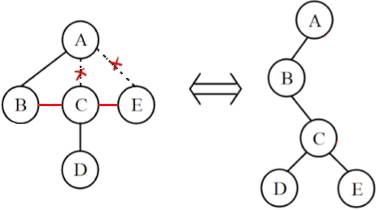
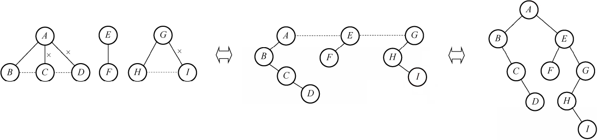

<question>

【例22 2016统考真题】若森林F有15条边、25个结点，则F包含树的个数是 (&emsp;)。

<options :options="['A. 8', 'B. 9', 'C. 10', 'D. 11']" />

【例23 2019统考真题】若将一棵树T转化为对应的二叉树BT，则下列对BT的遍历中，其遍历序列与T的后根遍历序列相同的是 (&emsp;)。

<options :options="['A. 先序遍历', 'B. 中序遍历', 'C. 后序遍历', 'D. 按层遍历']" />

【例24 2020统考真题】已知森林F及与之对应的二叉树T，若F的先根遍历序列是a,b,c,d,e,f，中根遍历序列是b,a,d,f,e,c，则T的后根遍历序列是 (&emsp;)。

<options :options="['A. b,a,d,f,e,c', 'B. b,d,f,e,c,a', 'C. b,f,e,d,c,a', 'D. f,e,d,c,b,a']" />

</question>

::: stress 考点9 线索二叉树
### 线索二叉树 {.ignore-header}

| 线索二叉树 | 内容                                                         |
| :--------: | ------------------------------------------------------------ |
|    定义    | 线索用来指向遍历序列中前驱和后继，故分为先/中/后序线索二叉树。 |
|    方法    | • 将所有结点的空指针利用起来，<br/>• 空左指针指向前驱，并置ltag为1，空右指针指向后继，并置rtag为1。 |
|    性质    | • 中序线索二叉树可以直接遍历<br/>• **先序**线索二叉树**不支持直接找前驱**<br/>• **后序**线索二叉树**不支持直接找后继**，需借助栈保存父结点信息 |
:::

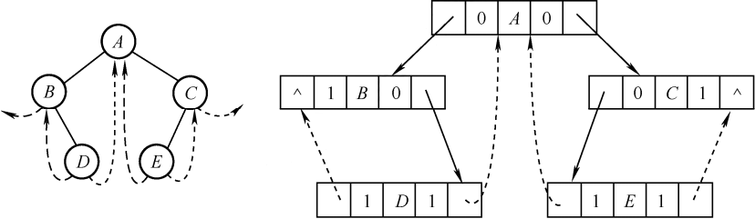

<question>

【例25 2010统考真题】下列线索二叉树中（用虚线表示线索），符合后序线索树定义的是 (&emsp;)。


</question>

::: stress 考点10 哈夫曼树和哈夫曼编码
### 哈夫曼树 {.ignore-header}

|  哈夫曼树  | 内容                                                         |
| :--------: | ------------------------------------------------------------ |
|    定义    | • 结点的带权路径长度：结点权重 * 结点到根的路径长度<br/>• 树的<tip>带权路径长度</tip>：所有叶结点的带权路径长度之和<br/>• 树的<tip>带权平均长度</tip>：带权路径长度 / 权重之和 |
|    构造    | ① 取出两个权值最小的结点，作为子结点组合成树，根的权值为两者权值之和。<br/>② 将该树放入集合中，重复上述步骤。 |
|    性质    | • 权值越小的结点离根越远<br/>• 哈夫曼树的带权路径长度WPL最小<br/>• 共n个结点，构造过程新建了<num>n-1</num>个结点，最终哈夫曼树共<num>2n-1</num>个结点<br/>• 哈夫曼树只有度为0和2的结点，即<num>n=n<sub>0</sub>+n<sub>2</sub></num> |
| 哈夫曼编码 | 结点权值仅用于构建哈夫曼树，编码过程不涉及权值。<br/>① 从根向下设左分支为0，右分支为1<br/>② 从根到叶的路径编码，即该叶的编码 |
:::
<div style="display: flex; gap: 0px; align-items: center; justify-content: center;">
  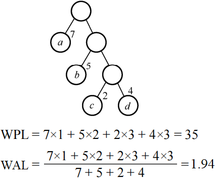
  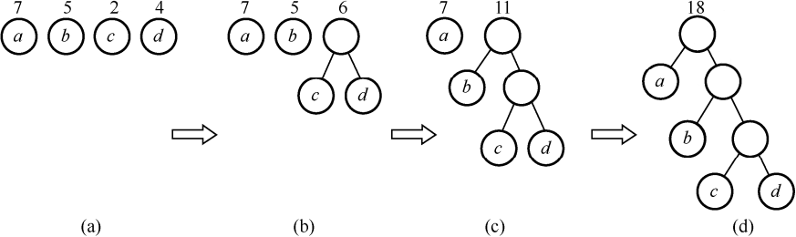
</div>
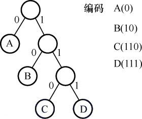

<question>

【例26 2010统考真题】n(n≥2)个权值均不相同的字符构成哈夫曼树，关于该树的叙述中，错误的是 (&emsp;)。

<options :options="['A. 该树一定是一棵完全二叉树']" />
<options :options="['B. 树中一定没有度为1的结点']" />
<options :options="['C. 树中两个权值最小的结点一定是兄弟结点']" />
<options :options="['D. 树中任意一个非叶结点的权值一定不小于下一层任意一个结点的权值']" />

【例27 2019统考真题】对n个互不相同的符号进行哈夫曼编码。若生成的哈夫曼树共有115个结点，则n的值是 (&emsp;)。

<options :options="['A. 56', 'B. 57', 'C. 58', 'D. 60']" />

【例28 2021统考真题】若某二叉树有5个叶结点，其权值分别为10,12,16,21,30，则其最小的带权路径长度(WPL)是 (&emsp;)。

<options :options="['A. 89', 'B. 200', 'C. 208', 'D. 289']" />

</question>

## 第六章 图

::: info 并查集*
- 并查集本质是一个森林，逻辑上用树表示集合，物理上用数组存储。
- 并查集使用双亲表示法，数组保存数据，下标定位结点。
- 一般结点保存父结点的下标，父结点保存**负**的结点数（故负数表示根）。最开始每个元素都是一个独立的集合，所以结点值都为-1。

1. 集合的合并：合并两数所在集合，将小集合合并到大集合中。即小集合根作大集合根的子结点。
2. 查找两数是否在一个集合
:::

::: stress 考点11 图的概念和性质
### 图的概念
:::

::: info 一般概念
- 顶点集合不可为空，边集可为空。
- 边有方向的图叫有向图，边无方向的图叫无向图。
- 一条边的两个顶点互为邻接点。
- 无向图中边记作$\small (V_i，V_j)$，有向图中记作$\small <V_i,V_j>$称弧，以及弧头弧尾。
- 一个顶点到另一个顶点所经序列叫路径，边的条数即路径长度。
- 无重复结点的路径叫简单路径，首尾相同的路径叫回路或环。回路不是简单路径。
:::

| 重要概念                | 含义                                                         |
| ----------------------- | ------------------------------------------------------------ |
| 完全图                  | 所有顶点相邻接。有向完全图有<emp>$\small n(n-1)$</emp>个边，无向完全图有<emp>$\frac{n(n-1)}{2}$</emp>个边。 |
| 顶点的度                | 顶点连接的边数。有向图度数=入度+出度，<emp>总度数/2=边数</emp>。 |
| 连通图<br/>连通分量     | 无向图中，两点有路径称两点连通，若所有顶点均连通，称该图为连通图。<br/>无向图中的极大连通子图。 |
| 强连通图<br/>强连通分量 | 有向图中，任意顶点间均有两个方向的路径，称该图为强连通图。<br/>有向图中的极大连通子图。 |
| 生成树<br/>最小生成树   | 连通图的极小连通子图（用最少的边连接所有顶点）。<br/>所有生成树中，边权值之和最小的树，称最小生成树。 |


::: tip
- 若$\small G=(V,E),G'=(V',E')$且$\small V'∈V,E'∈E$，则$\small G'$为$\small G$的子图。
- 子图必须要求$\small G'=(V',E')$，因为$\small V'$和$\small E'$不一定能组合成图。
- 树是特殊的图，当图为连通图且无回路，则该图可视为树。
- 完全图是特殊的连通图。
:::

<question>

【例29 2009统考真题】下列关于无向连通图特性的叙述中, 正确的是 (&emsp;)。

<options :options="['Ⅰ. 所有顶点的度之和为偶数']" />
<options :options="['Ⅱ. 边数大于顶点个数减1']" />
<options :options="['Ⅲ. 至少有一个顶点的度为1']" /><br/>

<options :options="['A. 只有Ⅰ', 'B. 只有Ⅱ', 'C. Ⅰ和Ⅱ', 'D. Ⅰ和Ⅲ']" />

【例30 2010统考真题】若无向图G=(V,E)中含有7个顶点, 要保证图G在任何情况下都是连通的, 则需要的边数最少是 (&emsp;)。
<options :options="['A. 6', 'B. 15', 'C. 16', 'D. 21']" />

【例31 2017统考真题】已知无向图G含有16条边, 其中度为4的顶点个数为3, 度为3的顶点个数为4, 其他顶点的度均小于3。图G所含的顶点个数至少是 (&emsp;)。
<options :options="['A. 10', 'B. 11', 'C. 13', 'D. 15']" />

【例32 2022统考真题】对于无向图G=(V,E), 下列选项中正确的是 (&emsp;)。

<options :options="['A. 当|V| > |E| 时, G 一定是连通的']" />
<options :options="['B. 当|V| < |E| 时, G 一定是连通的']" />
<options :options="['C. 当|V| = |E| - 1 时, G 一定是不连通的']" />
<options :options="['D. 当|V| > |E| + 1 时, G 一定是不连通的']" />

【例33 2025统考真题】下列关于图的叙述中，正确的是 (&emsp;)。

<options :options="['A. 有向图必存在入度为0的顶点']" />
<options :options="['B. 有向无环图的拓扑有序序列存在且唯一']" />
<options :options="['C. 各顶点的度均大于等于2的无向图必有回路']" />
<options :options="['D. 可用BFS算法求出带权图中每一对顶点间的最短路径']" />


</question>

::: stress 考点12 图的存储结构
### 存储结构 {.ignore-header}

| 存储结构 | 内容                                                         |
| :------: | ------------------------------------------------------------ |
| 邻接矩阵 | 本质二维数组，<mono>edges[a][b]=1</mono>表示<mono>a</mono>到<mono>b</mono>有边，<mono>edges[b][a]=1</mono>表示<mono>b</mono>到<mono>a</mono>有边 |
|  邻接表  | 本质链表数组，<mono>edges[a]</mono>链接了顶点<mono>a</mono>的所有边 |

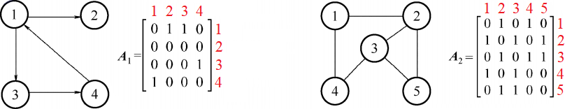
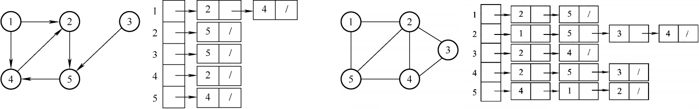

| 对比方面     | 邻接矩阵                                                     | 邻接表                                                       |
| ------------ | ------------------------------------------------------------ | ------------------------------------------------------------ |
| 存储空间大小 | 和顶点数有关                                                 | 和顶点数、边数有关                                           |
| 数据特点     | 无向图的邻接矩阵是对称的                                     | 无向图的邻接表比有向图的大一倍                               |
| 适用性       | 适合稠密图                                                   | 适合稀疏图                                                   |
| 唯一性       | 唯一                                                         | 不唯一                                                       |
| 度的计算     | 无向图的度遍历一行 $O(n)$，<br/>出度看行 $O(n)$、入度看列 $O(n)$ | 无向图度遍历链表 $O(n)$，<br/>出度遍历链表 $O(n)$、入度遍历邻接表 $O(E)$ |
| 边的判断     | 直接访问 $O(1)$                                              | 遍历链表 $O(n)$                                              |
:::

|           存储结构            | 内容                                                         |
| :---------------------------: | ------------------------------------------------------------ |
|  十字链表<br/>（仅用于有向图）  | 本质是两个单链表数组。<br/>第一个是入边链表，保存该点所有入边，第二个出边链表，保存该点所有出边。<br/>按下标顺序链接并对齐，便于参照邻接矩阵。 |
| 邻接多重表<br/>（仅用于无向图） | 加强边的保存，边结构由两个链表组合，点1及next指针和点2及next指针。<br/>通过自己的next指针可以找到自己的下一条边。 |

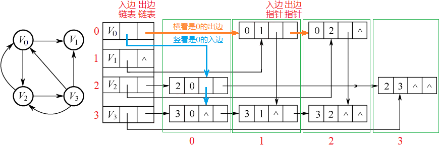
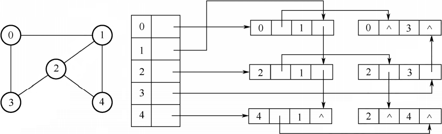

<question>

【例34 2013统考真题】设图的邻接矩阵A如下所示, 各顶点的度依次是 (&emsp;)。


<options :options="['A. 1,2,1,2', 'B. 2,2,1,1', 'C. 3,4,2,3', 'D. 4,4,2,2']" />

【例35 2024统考真题】若无向图G=(V,E)的邻接多重表如下图所示, 则G中顶点b与d的度分别是 (&emsp;)。


<options :options="['A. 0,2', 'B. 2,4', 'C. 2,5', 'D. 3,4']" />

</question>

::: stress 考点13 图的遍历
### 图的遍历

|   图的遍历   | 内容                                                         |                        作用                        |
| :----------: | ------------------------------------------------------------ | :------------------------------------------------: |
| 深度优先遍历 | • 从某个顶点开始，进行访问<br/>• 多路依次递归所有未被访问的邻接点<br/> | 深度遍历可以判断<br/><u>有向图和无向图</u>是否有环 |
| 广度优先遍历 | • 从某个顶点开始，将其入队<br/>• 取出队头访问<br/>• 将队头所有未被访问的邻接点入队<br/>• 重复直到队列为空 |     广度遍历仅可判断<br/><u>无向图</u>是否有环     |

| 遍历算法             | 存储结构 | 时间复杂度          | 空间复杂度 |
| -------------------- | -------- | ------------------- | ---------- |
| DFS / BFS / 拓扑排序 | 邻接矩阵 | <emp>$\small O(n^2)$</emp> | $\small O(n)$     |
| DFS / BFS / 拓扑排序 | 邻接表   | <emp>$\small O(n+e)$</emp> | $\small O(n)$     |
:::

<question>

【例36 2012统考真题】对有n个顶点、e条边且使用邻接表存储的有向图进行广度优先遍历, 其算法的时间复杂度是 (&emsp;)。

<options :options="['A. O(n)', 'B. O(e)', 'C. O(n+e)', 'D. O(ne)']" />

【例37 2015统考真题】设有向图 G=(V,E)，顶点集 V={V<sub>0</sub>, V<sub>1</sub>, V<sub>2</sub>, V<sub>3</sub>}，边集 E={ <v<sub>0</sub>, v<sub>1</sub>>, <v<sub>0</sub>, v<sub>2</sub>>, <v<sub>0</sub>, v<sub>3</sub>>, <v<sub>1</sub>, v<sub>3</sub>> }。若从顶点 V<sub>0</sub> 开始对图进行深度优先遍历，则可能得到的不同遍历序列个数是 (&emsp;)。

<options :options="['A. 2', 'B. 3', 'C. 4', 'D. 5']" />

</question>

### 图的应用

::: stress 考点14 图的应用之最小生成树
#### 最小生成树
:::

::: info 最小生成树的性质
- $n$ 个顶点的连通图的生成树有 $n$ 个点和 $n-1$ 条边。
- 生成树是边最少的连通图，一个连通图可以有多个生成树。
- 若存在权值相同的边，则最小生成树**可能**不唯一；若最小生成树不唯一，则一定存在权值相同的边。
- 最小生成树的边权值之和是所有生成树中最小的。
:::

|                最小生成树算法             | 内容                                                         |
| :--------------------------------------: | ------------------------------------------------------------ |
| Kruskal算法<br/>(与点数无关，适合稀疏图) | • 每次都找最小权值的边，<br/>• 检查是否构成回路，<br/>• 若构成回路，则放弃该边，重新选择。<blockquote style="margin: 5px 0px;">先放入n个顶点，排序所有边，按序选择权值最小边，并确保无环。</blockquote> |
|  Prim算法<br/>(与边数无关，适合稠密图)   | • 首次选择全局最小边，<br/>• 之后都选择与已有边相邻的权值最小边。<blockquote style="margin: 5px 0px;">每次都找一个已选点和一个未选点，所构成的权值最小边，故天然避开回路。</blockquote> |

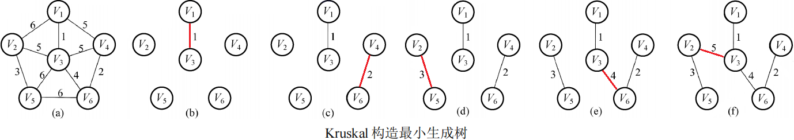
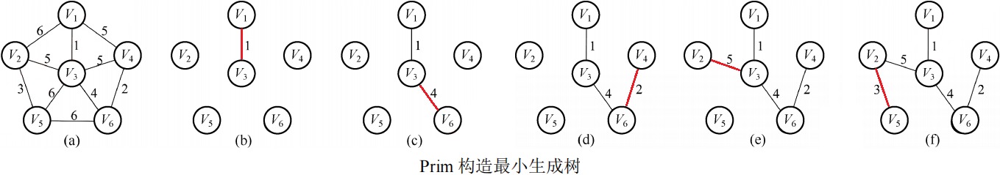

<question>

【例38 2012统考真题】下列关于最小生成树的叙述中，正确的是 (&emsp;)。

<options :options="['Ⅰ. 最小生成树的代价唯一']" />
<options :options="['Ⅱ. 所有权值最小的边一定会出现在所有的最小生成树中']" />
<options :options="['Ⅲ. 使用Prim 算法从不同顶点开始得到的最小生成树一定相同']" />
<options :options="['Ⅳ. 使用Prim 算法和Kruskal 算法得到的最小生成树总不相同']" /><br/>

<options :options="['A. 仅Ⅰ', 'B. 仅Ⅱ', 'C. 仅Ⅰ、Ⅲ', 'D. 仅Ⅱ、Ⅳ']" />

【例39 2020统考真题】 已知无向图G如下所示，使用Kruskal算法求图G的最小生成树，加到最小生成树中的边依次是 (&emsp;)。


<options :options="['A. (b,f),(b,d),(a,e),(c,e),(b,e)','B. (b,f),(b,d),(b,e),(a,e),(c,e)']" />
<options :options="['C. (a,e),(b,e),(c,e),(b,d),(b,f)','D. (a,e),(c,e),(b,e),(b,f),(b,d)']" />

</question>

::: stress 考点15 图的应用之最短路径
#### 最短路径

|            最短路径             | 内容                                                         |
| :-----------------------------: | ------------------------------------------------------------ |
| Dijkstra算法<br/>(单源最短路径) | • 除源点外共四个点，故画四行四列的表格<br/>• 第一轮找出源点到其他点的距离，选出最短路径<br/>• 第二轮按**上一轮的最短路径**，算到其他点的最短路径，更小则更新，不小则照抄。 |
|  Floyd算法<br/>(多源最短路径)   | • 求点$\small V_i$到$\small V_j$的最短路径，就暴力枚举所有可能路径：<br/>• $\small V_1-V_n、V_1-V_2-V_n、V_1-V_2-...-V_n$（包含所有可能顶点） |
:::

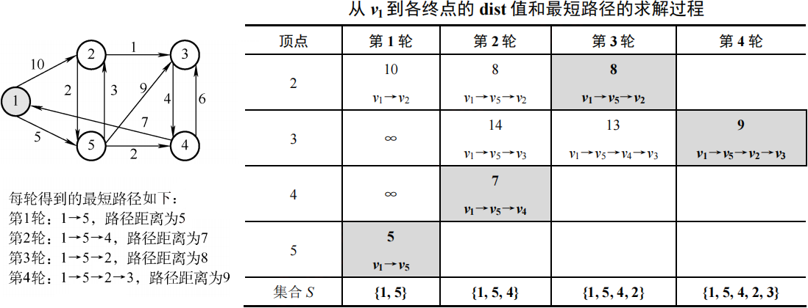

| 对比         | Dijkstra算法      | Floyd算法              | BFS算法        |
| ------------ | ----------------- | ---------------------- | -------------- |
| 用途         | 求单源最短路径    | 求各顶点之间的最短路径 | 求单源最短路径 |
| 无权图       | 适用              | 适用                   | 适用           |
| 带权图       | 适用              | 适用                   |                |
| 带负权值的图 | <emp>不适用</emp> | 适用                   |                |
| 时间复杂度   | $O(n^2)$          | $O(n^3)$               |                |

<question>
【例38 2012统考真题】对下图所示的有向带权图，若采用Dijkstra算法求从源点a到其他各顶点的最短路径，则得到的第一条最短路径的目标顶点是b，第二条最短路径的目标顶点是c，后续得到的其余各最短路径的目标顶点依次是 (&emsp;)。


<options :options="['A. d,e,f', 'B. e,d,f', 'C. f,d,e', 'D. f,e,d']" />
</question>

::: stress 考点16 图的应用之拓扑排序
#### 拓扑排序

| 拓扑排序 | 内容                                                         |
| :------: | ------------------------------------------------------------ |
|   性质   | • 拓扑排序要求**有向无环图**，因此可以检测是否有环。<br/>• 如$\small V_i$到$\small V_j$有路径，则$\small V_i$一定在$\small V_j$的前面。 |
|   方法   | 循环找到一个入度为0的点，输出并删除该点及其出边。同时存在多个入度为0的点时，对其输出顺序无要求，因此拓扑序列可能不唯一。 |
:::

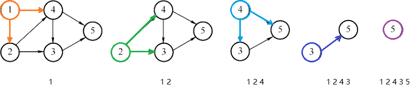

<question>

【例40 2010统考真题】对下图进行拓扑排序，可得不同拓扑序列的个数是 (&emsp;)。


<options :options="['A. 4', 'B. 3', 'C. 2', 'D. 1']" />

</question>


#### 描述表达式

用**有向无环图**描述表达式，不可出现重复操作数顶点。

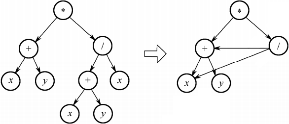

<question>

【例41 2019统考真题】用有向无环图描述表达式(x+y)((x+y)/x)，需要的顶点个数至少是 (&emsp;)。

<options :options="['A. 5', 'B. 6', 'C. 8', 'D. 9']" />

</question>

::: stress 考点17 图的应用之关键路径
#### 关键路径
:::

::: info 概念
- AOE网即边活动网，边表示活动，点称事件表示活动始末状态。
- AOE网是**有向无环图**，活动存在先后关系。
- ve：事件最早开始时间、vl：事件最晚开始时间、e：活动最早开始时间、l：活动最晚开始时间。
:::

关键路径是耗时最多的路径（不唯一）。最早开始时间=最晚开始时间的活动为关键活动，所构成路径即关键路径。

::: tip 性质
- 关键路径并不唯一，关键路径是权值之和最大的那条路径。
- 增加关键路径上的任意活动的持续时间，一定会延长工期。
- 减少关键路径上的任意活动的持续时间，不一定会缩短工期。
- 若只有一条关键路径，则一定会缩短工期。若有多条关键路径，则另外的关键路径仍在支撑工期长度。
:::

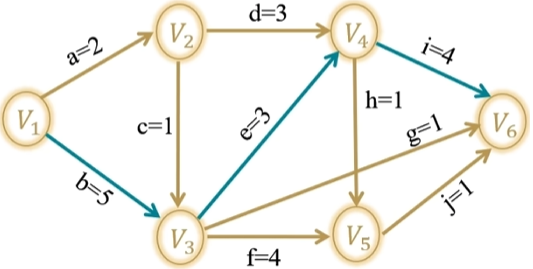

|        关键路径         | 内容                                                         |
| :---------------------: | ------------------------------------------------------------ |
| 求事件最早开始时间$ve$  | • 先将所有事件的 $ve$ 设为 0<br/>• 从源点开始，拓扑序找入度为0的点，更新所有出边的邻接点的 $ve$（更新成最大值） |
| 求事件最晚开始时间 $vl$ | • 先将所有事件的 $vl$ 设为整个工程的 $ve$<br/>• 从汇点开始，逆拓扑序找出度为0的点，更新所有入边的邻接点的 $vl$（更新成最小值） |

> $ve$ 要最大保证前面的活干完，$vl$ 要最小保证后面的活干完。

|    关键路径（续表）    | 内容                                 |
| :--------------------: | ------------------------------------ |
| 求活动最早开始时间 $e$ | 出发点的最早开始时间 $ve$            |
| 求活动最晚开始时间 $l$ | 指向点的最晚开始时间 $vl$ - 活动耗时 |

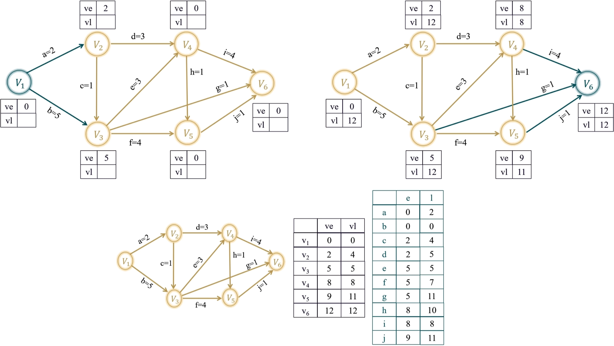

<question>

【例42 2019统考真题】下图所示的AOE网表示一项包含8个活动的工程。活动d的最早开始时间和最迟开始时间分别是 (&emsp;)。


<options :options="['A. 3 和7', 'B. 12 和12', 'C. 12 和14', 'D. 15 和15']" />

【例43 2013统考真题】下列AOE网表示一项包含8个活动的工程。通过同时加快若干活动的进度可以缩短整个工程的工期。下列选项中，加快其进度就可以缩短工程工期的是 (&emsp;)。


<options :options="['A. c和e', 'B. d和c', 'C. f和d', 'D. f和h']" />

</question>

## 第七章 查找

::: stress 考点18 线性查找
### 线性查找
:::

::: info 概念
- 哨兵位：在序列开头放入待查找元素，从后往前遍历查找的过程中不必判断循环越界。
- 平均查找长度ASL：查找集合每个元素所需要的平均比较次数（总次数/元素个数）
:::

| 线性查找 | 内容                                                         |
| -------- | ------------------------------------------------------------ |
| 顺序查找 | $\small ASL=\frac{n(n+1)}{2}\frac{1}{n}=\frac{1+n}{2}≈\frac{n}{2}$ |
| 折半查找 | 查找成功的次数是判定树中结点的层数，查找失败的次数是判定树中“失败”的父结点的层数。<br/>$\small ASL_{成功}=\frac{\sum{成功点的层高}}{n}\;ASL_{失败}=\frac{\sum{失败位置父结点的层高}}{失败位置个数}$<br/>折半查找判定树的形态：<br/>• 当结点个数为奇数时，左子树和右子树结点个数相等；<br/>• 当结点个数为偶数时，右子树比左子树多一个结点（左少右多）。<blockquote style="margin: 5px 0px;">这个结论对子树依然成立，因此可推断判定树的构造形态。</blockquote>折半查找判定树本质是二叉排序树，且是接近完美的二叉排序树。 |
| 分块查找 | ① 将序列分块，块内无序，块间有序。使用索引表记录每块最大关键字和起始地址。<br/>② 将待查找元素和块最大关键字比较，再在对应块中顺序查找。<br/>• 最佳情况是令$\small s=\sqrt{n}$<br/>• 设索引表长 b，每块长度为s，$\small{ASL=} \frac{1+b}{2}+\frac{1+s}{2}$ |

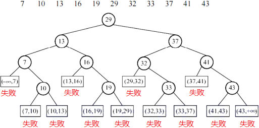
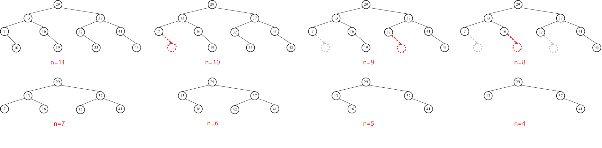

<question>

【例43 2010统考真题】已知一个长度为16的顺序表L，其元素按关键字有序排列，若采用折半查找法查找一个L中不存在的元素，则关键字的比较次数最多是 (&emsp;)。

<options :options="['A. 4', 'B. 5', 'C. 6', 'D. 7']" />

【例44 2024统考真题】下列数据结构中，不适合直接使用折半查找的是 (&emsp;)。

<options :options="['Ⅰ. 有序链表']" />
<options :options="['Ⅱ. 无序数组']" />
<options :options="['Ⅲ. 有序静态链表']" />
<options :options="['Ⅳ. 无序静态链表']" /><br/>

<options :options="['A. 仅Ⅰ、Ⅲ', 'B. 仅Ⅱ、Ⅳ', 'C. 仅Ⅱ、Ⅲ、Ⅳ', 'D. Ⅰ、Ⅱ、Ⅲ、Ⅳ']" />

</question>

### 树形查找

::: stress 考点19 二叉搜索树BST
#### 二叉搜索树

| 二叉搜索树 | 内容                                                         |
| :--------: | ------------------------------------------------------------ |
|    插入    | 一定落在叶结点的下方                                         |
|    删除    | 叶结点直接删，非叶结点需找左子树的最右结点（前驱）替换过来，再将最右结点的左子树补上来。 |
|    效率    | 一般情况 $\small O(logn)$，最坏情况 $\small O(n)$            |
:::

[二叉搜索树](/docs/DS/5-二叉搜索树)

::: stress 考点20 平衡二叉树AVL
#### 平衡二叉树

| 平衡二叉树 | 内容                                                         |
| :--------: | ------------------------------------------------------------ |
|    插入    | 二叉搜索树一致，只是操作结束需要进行旋转。                   |
|    删除    | 叶结点直接删，非叶结点若左树高则拿左树最右结点替换，反之则拿右树最左结点替换，最后需考虑旋转。 |
|    性质    | 设深度h的平衡二叉树的最少结点数为$n_h$，则有$n_h=n_{h-2}+n_{h-1}+1.$ |

| 左单旋 LL型                  | 右单旋 RR型         | 左右双旋 LR型              | 右左双旋 RL型                       |
| ---------------------------- | ------------------- | -------------------------- | ----------------------------------- |
| $\backslash \to /\backslash$ | $/ \to /\backslash$ | $< \to / \to /\backslash$  | $> \to \backslash  \to /\backslash$ |
| 左高左旋                     | 右高右旋            | 下半左高左旋，上半右高右旋 | 下半右高右旋，上半左高左旋          |
:::

[平衡二叉树](/docs/C++/12-map&set#_2-1-avl树)

::: stress 考点21 红黑树
####

| 红黑树 | 内容                                                         |
| :--------: | ------------------------------------------------------------ |
|    定义    | • 根叶黑：根和叶子（空结点）都是黑色<br/>• 不红红：不存在连续的两个红色结点<br/>• 黑路同：任意结点到叶的所有路径的黑色结点数量相同                                         |
|    性质    | • 最长路径不会超过最短路径的两倍<br/>• 具有$\small n$个内部结点的红黑树高度不超过$\small 2log_2{(n+1)}$ |

:::

[红黑树](/docs/C++/12-map&set#_2-2-红黑树)

::: stress 考点22 B树
#### B树

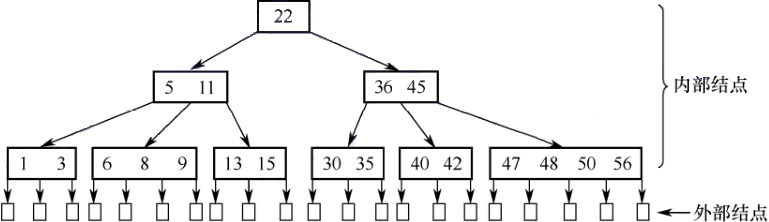

| B树  | 内容                                                         |
| ---- | ------------------------------------------------------------ |
| 性质 | • 所有叶结点都在同一层（叶节点指失败结点，求深度不算叶节点）<br/>• 根结点分支数最少 2 最多 $m$，非根非叶结点分支数最少 <emp>$\lceil\frac{m}{2}\rceil$</emp> 最多 <emp>$m$</emp> |
| 插入 | • 比根小走左比根大走右，<br/>• 走到叶结点处进行插入排序，<br/>• 元素个数上溢时需裂项，将中间元素放到父结点中，左右两边裂成两个结点。 |
| 删除 | • 删除非叶结点，将前驱或后继替换上来<br/>• 如果发生下溢，将父结点中的前驱或后继借来，左右兄弟借一个补上去。（父下来兄上去）<br/>• 如果左右都不够借，需要父元素下移到兄弟中，自身再和兄弟合并。（父下来兄合并） |
:::

<div style="display: flex; align-items: flex-start; font-size: 14px;">
  <!-- 左栏：垂直居中 -->
  <div style="flex: 0 0 40%; align-self: center;">
    <strong style="display: block; text-align: center;">B树插入</strong>
    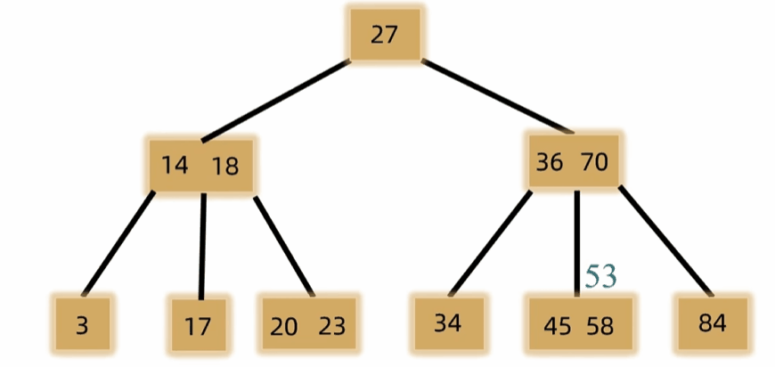
  </div>
  <!-- 右栏：顶部对齐 -->
  <div style="flex: 0 0 60%;">
    <strong style="display: block; text-align: center;">B树删除 - 情况1</strong>
    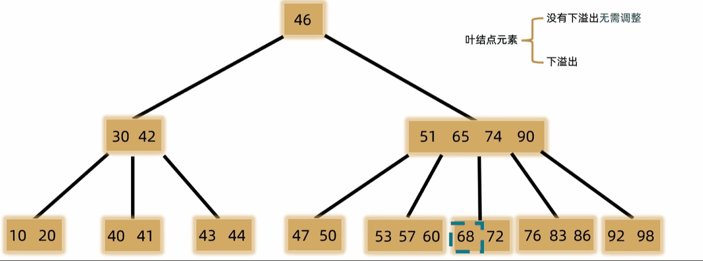
    <strong style="display: block; text-align: center;">B树删除 - 情况2</strong>
    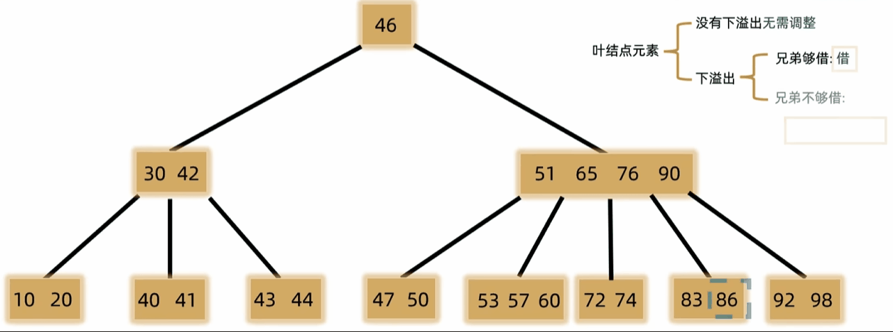
  </div>
</div>

::: stress 考点22 B+树
#### B+树

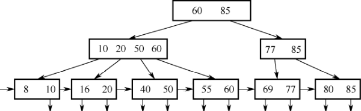

| 性质  |
| ---- |
|• 一般用于文件索引系统和数据库。<br/>• 多级索引结构，仅叶结点存有效数据，非叶结点用于索引，查找一次必走完从根到叶的路径。 |

| B树                                     | B+树                         |
| --------------------------------------- | ---------------------------- |
| m-1个关键字，m个子树                    | m个关键字，m个子树           |
| 所有内部结点存储信息                    | 叶节点存储信息，非叶存储索引 |
| 关键字可无重复                          | 关键字必出现重复             |
| <emp>支持随机查找，不支持顺序查找</emp> | 支持随机查找和顺序查找       |
:::

> 随机访问的含义是前后访问的位置纯随机无任何联系。

<question>

【例45 2013统考真题】在任意一棵非空二叉排序树T1中，删除某结点v之后形成二叉排序树T2，再将v插入T2形成二叉排序树T3。下列关于T1与T3的叙述中，正确的是 (&emsp;)。

<options :options="['Ⅰ. 若v是T1的叶结点，则T1与T3不同']" />
<options :options="['Ⅱ. 若v是T1的叶结点，则T1与T3相同']" />
<options :options="['Ⅲ. 若v不是T1的叶结点，则T1与T3不同']" />
<options :options="['Ⅳ. 若v不是T1的叶结点，则T1与T3相同']" /><br/>

<options :options="['A. 仅Ⅰ、III', 'B. 仅Ⅰ、IV', 'C. 仅ⅠⅠ、III', 'D. 仅ⅠⅠ、IV']" />

【例46 2021统考真题】给定平衡二叉树如下图所示，插入关键字23后，根中的关键字是 (&emsp;)。


<options :options="['A. 16', 'B. 20', 'C. 23', 'D. 25']" />

【例47 2012统考真题】已知一棵3阶B树，如下图所示。删除关键字78得到一棵新B树，其最右叶结点中的关键字是 (&emsp;)。

<options :options="['A. 60', 'B. 60, 62', 'C. 62, 65', 'D. 65']" />

【例48 2016统考真题】B+树不同于B树的特点之一是 (&emsp;)。

<options :options="['A. 能支持顺序查找', 'B. 结点中含有关键字']" width="68%" />
<options :options="['C. 根结点至少有两个分支', 'D. 所有叶结点都在同一层上']" />

</question>

::: stress 考点23 哈希查找
### 散列查找
:::

::: info 基本概念
- 散列函数：除留余数法
- 散列地址：散列函数的计算结果
- 同义词：散列地址相同的关键字互为同义词
- 冲突：关键字计算所得位置被占用
- 二次聚集/堆积：某个关键字放在本不属于他的位置，再插入本属于该位置的关键字，此时的冲突就叫二次聚集。
- 装填因子：$\alpha=\frac{n 表中关键字数}{m 散列表长度}$
- 冲突处理：开放地址法、开散列/拉链法/哈希桶

[哈希表](/docs/C++/13-哈希)
:::

| 哈希 | 内容                                                         |
| ---- | ------------------------------------------------------------ |
| 定义 | • 影响查找长度的因素：<emp>装填因子、哈希函数、处理冲突的方法</emp>，和散列表长度无关。<br/>**开放地址法** $\small H_i=(H(key)+d_i)\%m$<br/>• 线性探测 $\small d_i=1,2,...$<br/>• 二次探测 $\small 1^2,-1^2,2^2,-2^2,...$ |
| 查找 | • $\small ASL_{succ}$：所有关键字的比较总次数 / 关键字个数<br/>• $\small ASL_{fail}$：除最后映射不到的之外的所有位置的比较总次数 / 位置个数<blockquote style="margin: 5px 0px;">求一个位置失败的查找次数，是看该位置到最近的空位置的比较次数，到空位置也需要比较一次。</blockquote> |

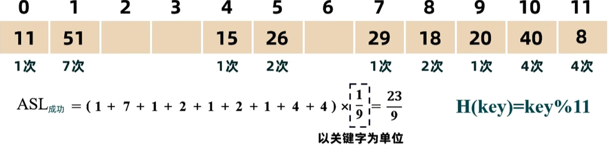
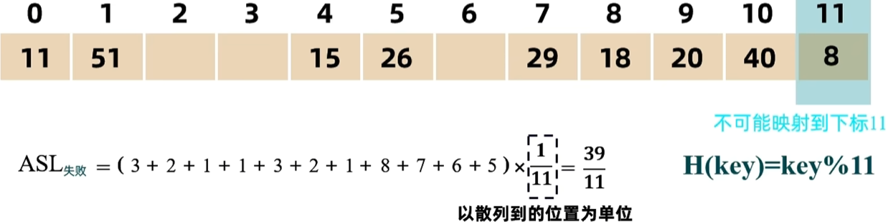

<question>

【例49 2011统考真题】为提高散列表的查找效率，可以采取的正确措施是 (&emsp;)。

<options :options="['Ⅰ. 增大装填(载)因子']" />
<options :options="['Ⅱ. 设计冲突(碰撞)少的散列函数']" />
<options :options="['Ⅲ. 处理冲突(碰撞)时避免产生聚集(堆积)现象']" /><br/>

<options :options="['A. 仅Ⅰ', 'B. 仅Ⅱ', 'C. 仅Ⅰ、Ⅱ', 'D. 仅ⅠⅠ、Ⅲ']" />

【例50 2018统考真题】现有长度为7、初始为空的散列表HT，散列函数H(k)=k%7，用线性探测再散列法解决冲突。将关键字22, 43, 15依次插入HT后，查找成功的平均查找长度是 (&emsp;)。

<options :options="['A. 1.5', 'B. 1.6', 'C. 2', 'D. 3']" />

</question>

## 第八章 排序

::: stress 考点24 各内部排序的性质和过程
### 内部排序

| 排序                                              | 时间复杂度   | 空间复杂度           | 稳定性            | 描述                                                        |
| ------------------------------------------------ | ------------ | -------------------- | ----------------- | ----------------------------------------------------------- |
| [直接插排](/docs/DS/6-八大排序#_1-1-直接插入排序) | $O(n^2)$     | $O(1)$               | 稳定              | 新元素插入前面的有序序列                                    |
| [希排](/docs/DS/6-八大排序#_1-2-希尔排序)         | $O(n^{1.3})$ | $O(1)$               | <emp>不稳定</emp> | 从$\frac{n}{2}$到1的间距进行直接插排                        |
| [冒排](/docs/DS/6-八大排序#_3-1-冒泡排序)         | $O(n^2)$     | $O(1)$               | 稳定              | 两两交换将最大值换到末尾                                    |
| [快排](/docs/DS/6-八大排序#_3-2-快速排序)         | $O(nlogn)$   | <emp>$O(logn)$</emp> | <emp>不稳定</emp> | 单趟排序相互交换无法保证稳定性                              |
| [直接选排](/docs/DS/6-八大排序#_2-1-直接选择排序) | $O(n^2)$     | $O(1)$               | <emp>不稳定</emp> | 遍历数组找最大值放到末尾                                    |
| [堆排](/docs/DS/6-八大排序#_2-2-堆排序)           | $O(nlogn)$   | $O(1)$               | <emp>不稳定</emp> | 向下建[堆](/docs/DS/4-二叉树#_3-堆)，删除堆顶最大值放到末尾 |
| [归并排序](/docs/DS/6-八大排序#_4-归并排序)       | $O(nlogn)$   | <emp>$O(n)$</emp>    | 稳定              | 二分递归回溯时进行归并                                      |
| 基数排序                                          | $O(n+r)$     | $O(r)$               | 稳定              | 从低到高逐位排序                                            |
:::

> 稳定性口诀：**选**艾**希**，**堆**攻**速**

::: info 特点
- 插排、希排、冒排最好情况是完全有序，最坏情况是完全逆序。
- 快排最好情况是每次都选到中位数，递归树形态完美，最坏情况是完全有序。
- 归并操作最好情况是一个序列遍历完毕一个不动，最坏情况是两个序列的都遍历完毕。
---
- 冒排、选排、堆排一趟可以确定一个数，快排可以确定多个数，插排、希排、归并、基数不能。
---
- 二叉排序树最好情况是完全二叉树、而堆一定是一个完全二叉树。
- 堆从根到叶的任意路径都是有序序列，二叉排序树不行。
---
- 排序趟数和序列的初始状态有关：冒排，快排。
- 比较次数和序列的初始状态有关：插排，希排，快排，归排，冒排。无关：选排，堆排。
- 移动次数和序列的初始状态有关：插排，希排，冒排，快排，~~堆排~~。无关：选排，归排。
:::

<question>

【例51 2014统考真题】用希尔排序方法对一个数据序列进行排序时，若第1趟排序结果为9,1,4,13,7,8,20,23,15，则该趟排序采用的增量（间隔）可能是 (&emsp;)。

<options :options="['A. 2', 'B. 3', 'C. 4', 'D. 5']" />

【例52 2009统考真题】若数据元素序列{11,12,13,7,8,9,23,4,5}是采用下列排序算法之一得到的第二趟排序后的结果，则该排序算法只能是 (&emsp;)。

<options :options="['A. 冒泡排序', 'B. 插入排序', 'C. 选择排序', 'D. 二路归并排序']" />

【例53 2010统考真题】对一组数据(2, 12, 16, 88, 5, 10)进行排序，若前3趟排序结果如下：<br/>
第一趟排序结果: 2, 12, 16, 5, 10, 88<br/>
第二趟排序结果: 2, 12, 5, 10, 16, 88<br/>
第三趟排序结果: 2, 5, 10, 12, 16, 88<br/>
则采用的排序算法可能是 (&emsp;)。

<options :options="['A. 冒泡排序', 'B. 希尔排序', 'C. 归并排序', 'D. 基数排序']" />

【例54 2023统考真题】下列排序算法中，不稳定的是 (&emsp;)。

<options :options="['Ⅰ. 希尔排序']" />
<options :options="['Ⅱ. 归并排序']" />
<options :options="['Ⅲ. 快速排序']" />
<options :options="['Ⅳ. 堆排序']" />
<options :options="['Ⅴ. 基数排序']" /><br/>

<options :options="['A. 仅Ⅰ、II', 'B. 仅ⅠⅠ、Ⅴ', 'C. 仅Ⅰ、Ⅲ、Ⅳ', 'D. 仅Ⅲ、Ⅳ、Ⅴ']" />

</question>

::: stress 考点25 外部排序
### 外部排序
:::

<question>

【例55 2013统考真题】已知三叉树T中6个叶结点的权分别是2,3,4,5,6,7，T的带权（外部）路径长度最小是 (&emsp;)。

<options :options="['A. 27', 'B. 46', 'C. 54', 'D. 56']" />

【例56 2016统考真题】对10TB的数据文件进行排序，应使用的方法是 (&emsp;)。

<options :options="['A. 希尔排序', 'B. 堆排序', 'C. 快速排序', 'D. 归并排序']" />

【例57 2019统考真题】设外存上有120个初始归并段，进行12路归并时，为实现最佳归并，需要补充的虚段个数是 (&emsp;)。

<options :options="['A. 1', 'B. 2', 'C. 3', 'D. 4']" />

【例58 2024统考真题】在外排序中，利用败者树对初始为升序的归并段进行多路归并，败者树中记录“冠军”的结点保存的是 (&emsp;)。

<options :options="['A. 最大关键字', 'B. 最小关键字']" width="59%" />
<options :options="['C. 最大关键字所在的归并段号', 'D. 最小关键字所在的归并段号']" />

</question>
