# 操作系统基础题型

## 第一章 操作系统基础

#### 题型一：操作系统的功能

<question>

1\. 下列关于操作系统的叙述中，错误的是 (&emsp;)。

<options :options="['A. 操作系统是管理资源的程序']" />
<options :options="['B. 操作系统是管理用户程序执行的程序']" />
<options :options="['C. 操作系统是能使系统资源提高效率的程序']" />
<options :options="['D. 操作系统是用来编程的程序']" />

::: analysis
答案：D。
:::

2\. 系统调用是由操作系统提供给用户的，它 (&emsp;)。

<options :options="['A. 直接通过键盘交互方式使用']" />
<options :options="['B. 只能通过用户程序间接使用']" />
<options :options="['C. 是命令接口中的命令']" />
<options :options="['D. 与系统的命令一样']" />

::: analysis
答案：B。
:::

3\. 操作系统提供给编程人员的接口是 (&emsp;)。

<options :options="['A. 库函数', 'B. 高级语言', 'C. 系统调用', 'D. 子程序']" />

::: analysis
答案：C。
:::

4\. (2010) 下列选项中，操作系统提供给应用程序的接口是 (&emsp;)。

<options :options="['A. 系统调用', 'B. 中断', 'C. 库函数', 'D. 原语']" />

::: analysis
答案：A。
:::

</question>

#### 题型二：操作系统分类（批处理）

<question>

5\. 操作系统的基本类型主要有 (&emsp;)。

<options :options="['A. 批处理操作系统、分时操作系统和多任务系统']" />
<options :options="['B. 批处理操作系统、分时操作系统和实时操作系统']" />
<options :options="['C. 单用户系统、多用户系统和批处理操作系统']" />
<options :options="['D. 实时操作系统、分时操作系统和多用户系统']" />

::: analysis
答案：B。
:::

6\. 批处理系统的主要缺点是 (&emsp;)。

<options :options="['A. 系统吞吐量小', 'B. CPU的利用率不高', 'C. 资源利用率低', 'D. 无交互能力']" />

::: analysis
答案：D。
:::

7\. 引入多道程序设计技术的前提条件之一是系统具有 (&emsp;)。

<options :options="['A. 多个CPU', 'B. 多个终端', 'C. 中断功能', 'D. 分时功能']" />

::: analysis
答案：C。
:::

8\. (2017) 与单道程序系统相比，多道程序系统的优点是 (&emsp;)。

<options :options="['Ⅰ. CPU的利用率高']" />
<options :options="['Ⅱ. 系统开销小']" />
<options :options="['Ⅲ. 系统吞吐量大']" />
<options :options="['Ⅳ. I/O设备利用率高']" /> 

<options :options="['A. 仅Ⅰ、Ⅲ', 'B. 仅Ⅰ、Ⅳ', 'C. 仅Ⅱ、Ⅲ', 'D. 仅Ⅰ、Ⅲ、Ⅳ']" />

::: analysis
答案：D。
:::

9\. (2022) 下列关于多道程序系统的叙述中，不正确的是 (&emsp;)。

<options :options="['A. 支持进程的并发执行']" />
<options :options="['B. 不必支持虚拟存储管理']" />
<options :options="['C. 需要实现对共享资源的管理']" />
<options :options="['D. 进程数越多，CPU的利用率越高']" />

::: analysis
答案：D。
:::

</question>

#### 题型三：操作系统分类（分时、实时）

<question>

10\. 实时操作系统必须在 (&emsp;) 内处理来自外部的事件。

<options :options="['A. 一个机器周期', 'B. 被控制对象规定时间', 'C. 周转时间', 'D. 时间片']" />

::: analysis
答案：B。
:::

11\. 在分时操作系统中，时间片一定时，(&emsp;) ，响应时间越长，

<options :options="['A. 内存越多', 'B. 内存越少', 'C. 用户数越多', 'D. 用户数越少']" />

::: analysis
答案：C。
:::

12\. 在分时操作系统中，为使多个进程能够及时与系统交互，关键的问题是能在短时间内，使所有就绪进程都能运行。当就绪进程数为100时，为保证响应时间不超过2s，此时的时间片最大应为 (&emsp;)。

<options :options="['A. 10ms', 'B. 20ms', 'C. 50ms', 'D. 100ms']" />

::: analysis
答案：B。
:::

13\. 下列各种系统中，(&emsp;) 可以使多个进程并行执行。

<options :options="['A. 分时操作系统', 'B. 多处理器系统', 'C. 批处理系统', 'D. 实时操作系统']" />

::: analysis
答案：B。
:::

14\. (2018) 下列关于多任务操作系统的叙述中，正确的是 (&emsp;)。

<options :options="['Ⅰ. 具有并发和并行的特点']" />
<options :options="['Ⅱ. 需要实现对共享资源的保护']" />
<options :options="['Ⅲ. 需要运行在多CPU的硬件平台上']" /> 

<options :options="['A. 仅Ⅰ', 'B. 仅Ⅱ', 'C. 仅Ⅰ、Ⅱ', 'D. Ⅰ、Ⅱ、Ⅲ']" />

::: analysis
答案：C。
:::

</question>

#### 题型四：用户程序和内核程序

<question>

15\. 下列程序中，必须在内核态执行的是 (&emsp;)。

<options :options="['Ⅰ. 磁盘调度程序']" />
<options :options="['Ⅱ. 中断处理程序']" />
<options :options="['Ⅲ. 设备驱动程序']" />
<options :options="['Ⅳ. 操作系统初始化程序']" /> 

<options :options="['A. Ⅰ、Ⅱ、Ⅲ、Ⅳ', 'B. Ⅰ、Ⅱ、Ⅲ', 'C. Ⅰ、Ⅲ、Ⅳ', 'D. Ⅱ、Ⅰ']" />

::: analysis
答案：A。
:::

16\. (2011) 下列选项中，在用户态执行的是 (&emsp;)。

<options :options="['A. 命令解释程序']" />
<options :options="['B. 缺页处理程序']" />
<options :options="['C. 进程调度程序']" />
<options :options="['D. 时钟中断处理程序']" />

::: analysis
答案：A。
:::

</question>

#### 题型五：特权指令和非特权指令

<question>

17\. CPU执行的指令被分为两类，其中有一类称为特权指令，它只允许 (&emsp;) 使用。

<options :options="['A. 管理员', 'B. 联机用户', 'C. 目标程序', 'D. 操作系统']" />

::: analysis
答案：D。
:::

18\. 下列指令中，可以在用户态执行的是 (&emsp;)。

<options :options="['Ⅰ. 置时钟指令&emsp;Ⅱ. 停机指令&emsp;Ⅲ. 存数指令']" />
<options :options="['Ⅳ. 寄存器清零指令']" /> 

<options :options="['A. Ⅰ、Ⅳ', 'B. Ⅲ、Ⅳ', 'C. Ⅱ、ⅡⅠ、Ⅳ', 'D. Ⅱ、Ⅲ']" />

::: analysis
答案：B。
:::

19\. 下列指令中，必须在内核态执行的是 (&emsp;)。

<options :options="['Ⅰ. 陷入指令']" />
<options :options="['Ⅱ. 系统调用指令']" />
<options :options="['Ⅲ. 开中断指令']" />
<options :options="['Ⅳ. 转移指令']" />
<options :options="['Ⅴ. 中断屏蔽字设置指令']" /> 

<options :options="['A. Ⅰ、Ⅲ、Ⅲ、Ⅳ', 'B. Ⅱ、Ⅲ', 'C. Ⅱ、Ⅲ、Ⅴ', 'D. Ⅰ、Ⅳ']" />

::: analysis
答案：C。
:::

20\. 当CPU处于内核态时，它可以执行的指令是 (&emsp;)。

<options :options="['A. 只有特权指令']" />
<options :options="['B. 只有非特权指令']" />
<options :options="['C. 只有访管指令']" />
<options :options="['D. 除访管指令之外的全部指令']" />

::: analysis
答案：D。
:::

21\. (2022) 下列关于CPU模式的叙述中，正确的是 (&emsp;)。

<options :options="['A. CPU处于用户态时只能执行特权指令']" />
<options :options="['B. CPU处于内核态时只能执行特权指令']" />
<options :options="['C. CPU处于用户态时只能执行非特权指令']" />
<options :options="['D. CPU处于内核态时只能执行非特权指令']" />

::: analysis
答案：C。
:::

22\. (2014) 下列指令中，不能在用户态执行的是 (&emsp;)。

<options :options="['A. Trap指令', 'B. 跳转指令', 'C. 压栈指令', 'D. 关中断指令']" />

::: analysis
答案：D。
:::

23\. (2021) 下列指令中，只能在内核态执行的是 (&emsp;)。

<options :options="['A. Trap指令', 'B. I/O指令', 'C. 数据传送指令', 'D. 设置断点指令']" />

::: analysis
答案：B。
:::

</question>

#### 题型六：引起中断的事件

<question>

24\. CPU的状态分为用户态和内核态，从用户态转换到内核态的唯一途径是 (&emsp;)。

<options :options="['A. 修改程序状态字指令', 'B. 中断屏蔽', 'C. 中断', 'D. 中断处理程序']" />

::: analysis
答案：C。
:::

25\. 下列中断事件中，能引起外中断的事件是 (&emsp;)。

<options :options="['Ⅰ. 时钟中断&emsp;Ⅱ. 访管中断&emsp;Ⅲ. 缺页中断']" /> 

<options :options="['A. I', 'B. Ⅲ', 'C. Ⅰ和Ⅱ', 'D. Ⅱ和Ⅲ']" />

::: analysis
答案：A。
:::

26\. (2013) 下列选项中，会导致用户进程从用户态切换到内核态的操作是 (&emsp;)。

<options :options="['Ⅰ. 整数除以零&emsp;Ⅱ. sin函数调用&emsp;Ⅲ. read系统调用']" /> 

<options :options="['A. 仅Ⅰ、Ⅱ', 'B. 仅Ⅰ、Ⅲ', 'C. 仅Ⅱ、Ⅲ', 'D. Ⅰ、Ⅲ和Ⅲ']" />

::: analysis
答案：B。
:::

27\. (2015) 假定下列指令已装入指令寄存器，则执行时不可能导致CPU从用户态变为内核态(系统态)的是 (&emsp;)。

<options :options="['A. DIV R0, R1 ;(R0)/(R1)→R0']" />
<options :options="['B. INT n ;产生软中断']" />
<options :options="['C. NOT R0 ;寄存器R0的内容取非']" />
<options :options="['D. MOV R0, addr ;把地址addr处的内存数据放入寄存器RO']" />

::: analysis
答案：C。
:::

28\. (2016) 异常是指令执行过程中在处理器内部发生的特殊事件，中断是来自处理器外部的请求事件。下列关于中断或异常情况的叙述中，错误的是 (&emsp;)。

<options :options="['A. “访存时缺页”属于中断']" />
<options :options="['B. “整数除以零”属于异常']" />
<options :options="['C. “DMA传送结束”属于中断']" />
<options :options="['D. “存储保护错”属于异常']" />

::: analysis
答案：A。
:::

29\. (2012) 下列选项中，不可能在用户态发生的事件是 (&emsp;)。

<options :options="['A. 系统调用', 'B. 外中断', 'C. 进程切换', 'D. 缺页']" />

::: analysis
答案：C。
:::

</question>

#### 题型六：时钟中断（需联系第二章进程调度）

<question>

30\. (2018) 定时器产生时钟中断后，由时钟中断服务程序更新的部分内容是 (&emsp;)。

<options :options="['Ⅰ. 内核中时钟变量的值']" />
<options :options="['Ⅱ. 当前进程占用CPU的时间']" />
<options :options="['Ⅲ. 当前进程在时间片内的剩余执行时间']" /> 

<options :options="['A. 仅Ⅰ、Ⅱ', 'B. 仅Ⅱ、ⅠⅢ', 'C. 仅Ⅰ、Ⅲ', 'D. Ⅰ、Ⅱ、Ⅲ']" />

::: analysis
答案：D。
:::

</question>

#### 题型七：中断的具体操作（此部分需联系计组5章、7章内容）

<question>

31\. 响应外部中断的过程中，中断隐指令完成的操作，除保护断点外，还包括 (&emsp;)。

<options :options="['Ⅰ. 关中断']" />
<options :options="['Ⅱ. 保存通用寄存器的内存']" />
<options :options="['Ⅲ. 形成中断服务程序入口地址并送PC']" /> 

<options :options="['A. 仅Ⅰ、Ⅱ', 'B. 仅Ⅰ、Ⅲ', 'C. 仅Ⅱ、Ⅲ', 'D. Ⅰ、Ⅱ、Ⅲ']" />

::: analysis
答案：B。
:::

32\. (2020) 下列与中断相关的操作中，由操作系统完成的是 (&emsp;)。

<options :options="['Ⅰ. 保存被中断程序的中断点']" />
<options :options="['Ⅱ. 提供中断服务']" />
<options :options="['Ⅲ. 初始化中断向量表']" />
<options :options="['Ⅳ. 保存中断屏蔽字']" /> 

<options :options="['A. 仅Ⅰ、Ⅲ', 'B. 仅Ⅰ、Ⅱ、Ⅳ', 'C. 仅Ⅲ、Ⅳ', 'D. 仅Ⅱ、Ⅲ、Ⅳ']" />

::: analysis
答案：D。
:::

33\. (2015) 处理外中断时，应该由操作系统保存的是 (&emsp;)。

<options :options="['A. 程序计数器(PC)的内容']" />
<options :options="['B. 通用寄存器的内容']" />
<options :options="['C. 快表(TLB)中的内容']" />
<options :options="['D. Cache中的内容']" />

::: analysis
答案：B。
:::

34\. (2023) 在操作系统内核中，中断向量表适合采用的数据结构是 (&emsp;)。

<options :options="['A. 数组', 'B. 队列', 'C. 单向链表', 'D. 双向链表']" />

::: analysis
答案：A。
:::

35\. 在中断发生后，中断处理的程序属于 (&emsp;)。

<options :options="['A. 用户程序']" />
<options :options="['B. 可能是用户程序，也可能是OS程序']" />
<options :options="['C. 操作系统程序']" />
<options :options="['D. 单独的程序、既不是用户程序也不是OS程序']" />

::: analysis
答案：C。
:::

</question>

#### 题型八：中断与子程序调用的区别

<question>

36\. (2012) 中断处理和子程序调用都需要压栈，以便保护现场，中断处理一定会保存而子程序调用不需要保存其内容的是 (&emsp;)。

<options :options="['A. 程序计数器', 'B. 程序状态字寄存器', 'C. 通用数据寄存器', 'D. 通用地址寄存器']" />

::: analysis
答案：B。
:::

</question>

#### 题型九：系统调用的概念

<question>

37\. 系统调用的目的是 (&emsp;)。

<options :options="['A. 请求系统服务', 'B. 中止系统服务', 'C. 申请系统资源', 'D. 释放系统资源']" />

::: analysis
答案：A。
:::

38\. 用户在程序中试图读某文件的第100个逻辑块，使用操作系统提供的 (&emsp;) 接口。

<options :options="['A. 系统调用', 'B. 键盘命令', 'C. 原语', 'D. 图形用户接口']" />

::: analysis
答案：A。
:::

39\. (2019) 下列关于系统调用的叙述中，正确的是 (&emsp;)。

<options :options="['Ⅰ. 在执行系统调用服务程序的过程中，CPU处于内核态']" />
<options :options="['Ⅱ. 操作系统通过提供系统调用避免用户程序直接访问外设']" />
<options :options="['Ⅲ. 不同的操作系统为应用程序提供了统一的系统调用接口']" />
<options :options="['Ⅳ. 系统调用是操作系统内核为应用程序提供服务的接口']" /> 

<options :options="['A. 仅Ⅰ、Ⅳ', 'B. 仅Ⅱ、Ⅲ', 'C. 仅Ⅰ、Ⅱ、Ⅳ', 'D. 仅Ⅰ、Ⅰ、Ⅳ']" />

::: analysis
答案：C。
:::

40\. (2021) 下列选项中，通过系统调用完成的操作是 (&emsp;)。

<options :options="['A. 页置换', 'B. 进程调度', 'C. 创建新进程', 'D. 生成随机整数']" />

::: analysis
答案：C。
:::

</question>

#### 题型十：系统调用的流程

<question>

41\. (2017) 执行系统调用的过程包括如下主要操作：①返回用户态②执行陷入(Trap)指令③传递系统调用参数④执行相应的服务程序正确的执行顺序是 (&emsp;)。

<options :options="['A. ②→③→①→④']" />
<options :options="['B. ②→④→③→①']" />
<options :options="['C. ③→②→④→①']" />
<options :options="['D. ③→④→②→①']" />

::: analysis
答案：C。
:::

42\. 下列关于系统调用的说法中，正确的是 (&emsp;)。

<options :options="['Ⅰ. 用户程序使用系统调用命令，该命令经过编译后形成若干参数和陷入指令']" />
<options :options="['Ⅱ. 用户程序使用系统调用命令，该命令经过编译后形成若干参数和屏蔽中断指令']" />
<options :options="['Ⅲ. 用户程序创建一个新进程，需使用操作系统提供的系统调用接口']" />
<options :options="['Ⅳ. 当操作系统完成用户请求的系统调用功能后，应使CPU从内核态转到用户态']" /> 

<options :options="['A. Ⅰ、Ⅲ', 'B. Ⅲ、Ⅳ', 'C. Ⅰ、ⅠⅢ、Ⅳ', 'D. Ⅱ、Ⅲ、Ⅳ']" />

::: analysis
答案：C。
:::

43\. (2022) 执行系统调用的过程涉及下列操作，其中由操作系统完成的是 (&emsp;)。

<options :options="['Ⅰ. 保存断点和程序状态字']" />
<options :options="['Ⅱ. 保存通用寄存器的内容']" />
<options :options="['Ⅲ. 执行系统调用服务例程']" />
<options :options="['Ⅳ. 将CPU模式改为内核态']" /> 

<options :options="['A. 仅Ⅰ、Ⅲ', 'B. 仅Ⅱ、Ⅱ', 'C. 仅Ⅱ、Ⅳ', 'D. 仅Ⅱ、ⅡⅠ、Ⅳ']" />

::: analysis
答案：B。
:::

</question>

#### 题型十一：系统调用与库函数联系

<question>

44\. 下列关于库函数和系统调用的区别与联系的说法中，错误的是 (&emsp;)。

<options :options="['A. 系统调用用于请求内核服务，部分库函数通过系统调用实现功能']" />
<options :options="['B. 系统调用需要陷入内核态执行，而普通库函数(如字符串处理)通常在用户态执行']" />
<options :options="['C. 所有库函数的实现都依赖系统调用，没有系统调用则无法完成任何功能']" />
<options :options="['D. 库函数具有良好的可移植性，可跨平台使用；系统调用则与具体操作系统紧密耦合']" />

::: analysis
答案：C。
:::

45\. 下列关于库函数和系统调用的说法中，不正确的是 (&emsp;)。

<options :options="['A. 库函数运行在用户态，系统调用运行在内核态']" />
<options :options="['B. 使用库函数时开销较小，使用系统调用时开销较大']" />
<options :options="['C. 库函数不方便被替换，系统调用通常很方便被替换']" />
<options :options="['D. 库函数可以很方便地调试，而系统调用很麻烦']" />

::: analysis
答案：C。
:::

</question>

#### 题型十二：系统调用与一般过程调用区别

<question>

46\. 下列关于系统调用和一般过程调用的说法中，正确的是 (&emsp;)。

<options :options="['A. 两者都需要将当前CPU中的PSW和PC的值压栈，以保存现场信息']" />
<options :options="['B. 系统调用的被调用过程一定运行在内核态']" />
<options :options="['C. 一般过程调用的被调用过程一定运行在用户态']" />
<options :options="['D. 两者的调用过程与被调用过程一定都运行在用户态']" />

::: analysis
答案：B。
:::

</question>

#### 题型十三：中断、异常和系统调用区别

<question>

47\. (2024) 下列关于中断、异常和系统调用的叙述中，错误的是 (&emsp;)。

<options :options="['A. 中断或异常发生时，CPU处于内核态']" />
<options :options="['B. 每个系统调用都有对应的内核服务例程']" />
<options :options="['C. 中断处理程序开始执行时，CPU处于内核态']" />
<options :options="['D. 系统添加新类型设备时，需要注册相应的中断服务例程']" />

::: analysis
答案：A。
:::

</question>

## 第二章 进程线程

#### 题型一：进程的基本概念

<question>

1\. 一个进程映像是 (&emsp;)。

<options :options="['A. 由协处理器执行的一个程序']" />
<options :options="['B. 一个独立的程序+数据集']" />
<options :options="['C. PCB结构与程序和数据的组合']" />
<options :options="['D. 一个独立的程序']" />

::: analysis
答案：C。
:::

2\. 下列关于父进程和子进程的叙述中，正确的是 (&emsp;)。

<options :options="['A. 为了标志父子关系，可让子进程和父进程拥有相同的PID']" />
<options :options="['B. 父进程和子进程是相互独立的，可以并发执行']" />
<options :options="['C. 撤销子进程时，一定会同时撤销父进程']" />
<options :options="['D. 父进程创建了子进程，要等父进程执行完后，子进程才能执行']" />

::: analysis
答案：B。
:::

3\. 同一程序经过多次创建，运行在不同的数据集上，形成了 (&emsp;) 的进程。

<options :options="['A. 不同', 'B. 相同', 'C. 同步', 'D. 互斥']" />

::: analysis
答案：A。
:::

4\. PCB是进程存在的唯一标志，下列 (&emsp;) 不属于PCB.

<options :options="['A. 进程ID', 'B. CPU状态', 'C. 堆栈指针', 'D. 全局变量']" />

::: analysis
答案：D。
:::

5\. (2020) 下列关于父进程与子进程的叙述中，错误的是 (&emsp;)。

<options :options="['A. 父进程与子进程可以并发执行']" />
<options :options="['B. 父进程与子进程共享虚拟地址空间']" />
<options :options="['C. 父进程与子进程有不同的进程控制块']" />
<options :options="['D. 父进程与子进程不能同时使用同一临界资源']" />

::: analysis
答案：B。
:::

6\. 在多对一的线程模型中，当一个多线程进程中的某个线程被阻塞后， (&emsp;)。

<options :options="['A. 该进程的其他线程仍可继续运行']" />
<options :options="['B. 整个进程都将阻塞']" />
<options :options="['C. 该阻塞线程将被撤销']" />
<options :options="['D. 该阻塞线程将永远不可能再执行']" />

::: analysis
答案：B。
:::

</question>

#### 题型二：线程的概念

<question>

7\. 下列关于线程的叙述中，正确的是 (&emsp;)。

<options :options="['A. 线程包含CPU现场，可以独立执行程序']" />
<options :options="['B. 每个线程都有自己独立的地址空间']" />
<options :options="['C. 每个进程只能包含一个线程']" />
<options :options="['D. 同一进程中的线程间通信也必须使用系统调用函数']" />

::: analysis
答案：A。
:::

8\. 下列选项中，(&emsp;) 不是线程的优点。

<options :options="['A. 提高系统并发性', 'B. 节约系统资源', 'C. 切换开销小', 'D. 增强进程安全性']" />

::: analysis
答案：D。
:::

9\. 下面关于用户级线程和内核级线程的描述中，错误的是 (&emsp;)。

<options :options="['A. 采用轮转调度算法，进程中设置内核级线程和用户级线程的效果完全不同']" />
<options :options="['B. 跨进程的用户级线程调度也不需要内核参与，控制简单']" />
<options :options="['C. 用户级线程可以在任何操作系统中运行']" />
<options :options="['D. 若系统中只有用户级线程，则CPU的调度对象是进程']" />

::: analysis
答案：B。
:::

10\. 在内核级线程相对于用户级线程的优点的如下描述中，错误的是 (&emsp;)。

<options :options="['A. 同一进程内的线程切换，系统开销小']" />
<options :options="['B. 当内核线程阻塞时，同一进程中的其他内核级线程仍可被调度']" />
<options :options="['C. 内核级线程的程序实体可以在内核态运行']" />
<options :options="['D. 对多处理器系统，核心可以同时调度同一进程的多个线程并行运行']" />

::: analysis
答案：A。
:::

11\. 下列关于用户级线程相对于内核级线程的优点的描述中，错误的是 (&emsp;)。

<options :options="['A. 一个线程阻塞不影响另一个线程的运行']" />
<options :options="['B. 线程的调度不需要内核直接参与，控制简单']" />
<options :options="['C. 线程切换代价小']" />
<options :options="['D. 允许每个进程定制自己的调度算法，线程管理比较灵活']" />

::: analysis
答案：A。
:::

12\. 下列关于用户级线程的优点的描述中，不正确的是 (&emsp;)。

<options :options="['A. 线程切换不需要切换到内核态']" />
<options :options="['B. 支持不同的应用程序采用不同的调度算法']" />
<options :options="['C. 在不同操作系统上不经修改就可直接运行']" />
<options :options="['D. 同一个进程内的多个线程可以同时调度到多个处理器上执行']" />

::: analysis
答案：D。
:::

13\. 下列选项中，可能导致用户级线程切换的事件是 (&emsp;)。

<options :options="['A. 系统调用', 'B. I/O请求', 'C. 异常处理', 'D. 线程同步']" />

::: analysis
答案：D。
:::

14\. 下列关于用户级线程的描述中，错误的是 (&emsp;)。

<options :options="['A. 用户级线程由线程库进行管理']" />
<options :options="['B. 用户级线程只有在创建和调度时需要内核的干预']" />
<options :options="['C. 操作系统无法直接调度用户级线程']" />
<options :options="['D. 线程库中线程的切换不会导致进程切换']" />

::: analysis
答案：B。
:::

15\. 下面的说法中，正确的是 (&emsp;)。

<options :options="['A. 不论是系统支持的线程还是用户级线程，其切换都需要内核的支持']" />
<options :options="['B. 线程是资源分配的单位，进程是调度和分派的单位']" />
<options :options="['C. 不管系统中是否有线程，进程都是拥有资源的独立单位']" />
<options :options="['D. 在引入线程的系统中，进程仍是资源调度和分派的基本单位']" />

::: analysis
答案：C。
:::

16\. 在多对一的线程模型中，当一个多线程进程中的某个线程被阻塞后，(&emsp;)。

<options :options="['A. 该进程的其他线程仍可继续运行']" />
<options :options="['B. 整个进程都将阻塞']" />
<options :options="['C. 该阻塞线程将被撤销']" />
<options :options="['D. 该阻塞线程将永远不可能再执行']" />

::: analysis
答案：B。
:::

17\. 并发性较好的多线程模型有 (&emsp;)。

<options :options="['Ⅰ. 一对一模型']" />
<options :options="['Ⅱ. 多对一模型']" />
<options :options="['Ⅲ. 多对多模型']" /> 

<options :options="['A. 仅Ⅰ', 'B. Ⅰ和Ⅱ', 'C. Ⅰ和Ⅲ', 'D. Ⅰ、Ⅱ和Ⅲ']" />

::: analysis
答案：C。
:::

18\. 下列关于多对一模型的叙述中，错误的是 (&emsp;)。

<options :options="['A. 一个进程的多个线程不能并行运行在多个处理器上']" />
<options :options="['B. 进程中的用户级线程由进程自己管理']" />
<options :options="['C. 线程切换会导致进程切换']" />
<options :options="['D. 一个线程的系统调用会导致整个进程阻塞']" />

::: analysis
答案：C。
:::

19\. (2011) 在支持多线程的系统中，进程P创建的若干线程不能共享的是 (&emsp;)。

<options :options="['A. 进程P的代码段']" />
<options :options="['B. 进程P中打开的文件']" />
<options :options="['C. 进程P的全局变量']" />
<options :options="['D. 进程P中某线程的栈指针']" />

::: analysis
答案：D。
:::

20\. (2024) 若进程P中的线程T先打开文件，得到文件描述符fd，再创建两个线程TA和Tb，则在下列资源中，TA与TB可共享的是 (&emsp;)。

<options :options="['Ⅰ. 进程P的地址空间&emsp;Ⅱ. 线程T的栈&emsp;Ⅲ. 文件描述符fd']" /> 

<options :options="['A. 仅Ⅰ', 'B. 仅Ⅰ、Ⅲ', 'C. 仅Ⅱ、Ⅲ', 'D. Ⅰ、Ⅱ、Ⅲ']" />

::: analysis
答案：B。
:::

21\. (2019) 下列关于线程的描述中，错误的是 (&emsp;)。

<options :options="['A. 内核级线程的调度由操作系统完成']" />
<options :options="['B. 操作系统为每个用户级线程建立一个线程控制块']" />
<options :options="['C. 用户级线程间的切换比内核级线程间的切换效率高']" />
<options :options="['D. 用户级线程可以在不支持内核级线程的操作系统上实现']" />

::: analysis
答案：B。
:::

</question>

#### 题型三：进程和线程对比

<question>

22\. (2012) 下列关于进程和线程的叙述中，正确的是 (&emsp;)。

<options :options="['A. 不管系统是否支持线程，进程都是资源分配的基本单位']" />
<options :options="['B. 线程是资源分配的基本单位，进程是调度的基本单位']" />
<options :options="['C. 系统级线程和用户级线程的切换都需要内核的支持']" />
<options :options="['D. 同一进程中的各个线程拥有各自不同的地址空间']" />

::: analysis
答案：A。
:::

23\. 下列关于进程和线程的说法中，正确的是 (&emsp;)。

<options :options="['A. 一个进程可以包含一个或多个线程，一个线程可以属于一个或多个进程']" />
<options :options="['B. 多线程技术具有明显的优越性，如速度快、通信简便、设备并行性高等']" />
<options :options="['C. 由于线程不作为资源分配单位，线程之间可以无约束地并行执行']" />
<options :options="['D. 线程也称轻量级进程，因为线程都比进程小']" />

::: analysis
答案：B。
:::

24\. 下面的叙述中，正确的是 (&emsp;)。

<options :options="['A. 线程是比进程更小的能独立运行的基本单位，可以脱离进程独立运行']" />
<options :options="['B. 引入线程可提高程序并发执行的程度，可进一步提高系统效率']" />
<options :options="['C. 线程的引入增加了程序执行时的时空开销']" />
<options :options="['D. 一个进程一定包含多个线程']" />

::: analysis
答案：B。
:::

25\. 下面的叙述中，正确的是 (&emsp;)。

<options :options="['A. 同一进程内的线程可并发执行，不同进程的线程只能串行执行']" />
<options :options="['B. 同一进程内的线程只能串行执行，不同进程的线程可并发执行']" />
<options :options="['C. 同一进程或不同进程内的线程都只能串行执行']" />
<options :options="['D. 同一进程或不同进程内的线程都可以并发执行']" />

::: analysis
答案：D。
:::

26\. 下面的叙述中，正确的是 (&emsp;)。

<options :options="['A. 引入线程后，处理器只能在线程间切换']" />
<options :options="['B. 引入线程后，处理器仍在进程间切换']" />
<options :options="['C. 线程的切换，不会引起进程的切换']" />
<options :options="['D. 线程的切换，可能引起进程的切换']" />

::: analysis
答案：D。
:::

</question>

#### 题型四：进程的创建

<question>

27\. 进程创建时，不需要做的是 (&emsp;)。

<options :options="['A. 填写一个该进程的进程表项']" />
<options :options="['B. 分配该进程适当的内存']" />
<options :options="['C. 将该进程插入就绪队列']" />
<options :options="['D. 为该进程分配CPU']" />

::: analysis
答案：D。
:::

28\. (2010) 下列选项中，导致创建新进程的操作是 (&emsp;)。

<options :options="['Ⅰ. 用户登录成功&emsp;Ⅱ. 设备分配&emsp;Ⅲ. 启动程序执行']" /> 

<options :options="['A. 仅Ⅰ 和Ⅱ', 'B. 仅Ⅱ和Ⅲ', 'C. 仅Ⅰ 和Ⅲ', 'D. Ⅰ、Ⅱ、Ⅲ']" />

::: analysis
答案：C。
:::

29\. (2021) 下列操作中，操作系统在创建新进程时，必须完成的是 (&emsp;)。

<options :options="['Ⅰ. 申请空白的进程控制块']" />
<options :options="['Ⅱ. 初始化进程控制块']" />
<options :options="['Ⅲ. 设置进程状态为运行态']" /> 

<options :options="['A. 仅Ⅰ', 'B. 仅Ⅰ、Ⅱ', 'C. 仅Ⅰ、Ⅲ', 'D. 仅Ⅱ、Ⅲ']" />

::: analysis
答案：B。
:::

</question>

#### 题型五：进程的终止

<question>

30\. 通常用户进程被建立后，(&emsp;)。

<options :options="['A. 便一直存在于系统中，直到被操作人员撤销']" />
<options :options="['B. 随着进程运行的正常或不正常结束而撤销']" />
<options :options="['C. 随着时间片轮转而撤销与建立']" />
<options :options="['D. 随着进程的阻塞或者唤醒而撤销与建立']" />

::: analysis
答案：B。
:::

31\. (2024) 下列选项中，操作系统在终止进程时不一定执行的是 (&emsp;)。

<options :options="['A. 终止子进程']" />
<options :options="['B. 回收进程占用的设备']" />
<options :options="['C. 释放进程控制块']" />
<options :options="['D. 回收为进程分配的内存']" />

::: analysis
答案：A。
:::

</question>

#### 题型六：进程/线程的状态转换

<question>

32\. 在单处理器系统中，若同时存在10个进程，则处于就绪队列中的进程最多有 (&emsp;) 个。

<options :options="['A. 1', 'B. 8', 'C. 9', 'D. 10']" />

::: analysis
答案：C。
:::

33\. 下列关于进程的叙述中，正确的是 (&emsp;)。

<options :options="['A. 进程获得处理器运行是通过调度得到的']" />
<options :options="['B. 优先级是进程调度的重要依据，一旦确定就不能改动']" />
<options :options="['C. 在单处理器系统中，任何时刻都只有一个进程处于运行态']" />
<options :options="['D. 进程申请处理器而得不到满足时，其状态变为阻塞态']" />

::: analysis
答案：A。
:::

34\. 在任何时刻，一个进程的状态变化 (&emsp;) 引起另一个进程的状态变化。

<options :options="['A. 必定', 'B. 一定不', 'C. 不一定', 'D. 不可能']" />

::: analysis
答案：C。
:::

35\. 一个进程释放了一台打印机，它可能改变 (&emsp;) 的状态。

<options :options="['A. 自身进程']" />
<options :options="['B. 输入/输出进程']" />
<options :options="['C. 另一个等待打印机的进程']" />
<options :options="['D. 所有等待打印机的进程']" />

::: analysis
答案：C。
:::

36\. 系统进程所请求的一次I/O操作完成后，将使进程状态从 (&emsp;)。

<options :options="['A. 运行态变为就绪态']" />
<options :options="['B. 运行态变为阻塞态']" />
<options :options="['C. 就绪态变为运行态']" />
<options :options="['D. 阻塞态变为就绪态']" />

::: analysis
答案：D。
:::

37\. 在分时系统中，通常处于 (&emsp;) 的进程最多。

<options :options="['A. 运行态', 'B. 就绪态', 'C. 阻塞态', 'D. 终止态']" />

::: analysis
答案：B。
:::

38\. 进程自身决定 (&emsp;)。

<options :options="['A. 从运行态到阻塞态']" />
<options :options="['B. 从运行态到就绪态']" />
<options :options="['C. 从就绪态到运行态']" />
<options :options="['D. 从阻塞态到就绪态']" />

::: analysis
答案：A。
:::

39\. 在进程转换时，下列 (&emsp;) 转换是不可能发生的。

<options :options="['A. 就绪态→运行态']" />
<options :options="['B. 运行态→就绪态']" />
<options :options="['C. 运行态→阻塞态']" />
<options :options="['D. 阻塞态→运行态']" />

::: analysis
答案：D。
:::

40\. 以下可能导致一个进程从运行态变为就绪态的事件是 (&emsp;)。

<options :options="['A. 一次I/O操作结束']" />
<options :options="['B. 运行进程需做I/O操作']" />
<options :options="['C. 运行进程结束']" />
<options :options="['D. 出现了比现在进程优先级更高的进程']" />

::: analysis
答案：D。
:::

41\. (&emsp;) 必会引起进程切换。

<options :options="['A. 一个进程创建后，进入就绪态']" />
<options :options="['B. 一个进程从运行态变为就绪态']" />
<options :options="['C. 一个进程从阻塞态变为就绪态']" />
<options :options="['D. 以上答案都不对']" />

::: analysis
答案：B。
:::

42\. 进程处于 (&emsp;) 时，它处于非阻塞态。

<options :options="['A. 等待从键盘输入数据']" />
<options :options="['B. 等待协作进程的一个信号']" />
<options :options="['C. 等待操作系统分配CPU时间']" />
<options :options="['D. 等待网络数据进入内存']" />

::: analysis
答案：C。
:::

43\. 一个进程被唤醒，意味着 (&emsp;)。

<options :options="['A. 该进程可以重新竞争CPU']" />
<options :options="['B. 优先级变大']" />
<options :options="['C. PCB移动到就绪队列之首']" />
<options :options="['D. 进程变为运行态']" />

::: analysis
答案：A。
:::

44\. 当 (&emsp;) 时，进程从执行状态转换为就绪态。

<options :options="['A. 进程被调度程序选中']" />
<options :options="['B. 时间片到时']" />
<options :options="['C. 等待某一事件']" />
<options :options="['D. 等待的事件发生']" />

::: analysis
答案：B。
:::

45\. (2014) 一个进程的读磁盘操作完成后，操作系统针对该进程必做的是 (&emsp;)。

<options :options="['A. 修改进程状态为就绪态']" />
<options :options="['B. 降低进程优先级']" />
<options :options="['C. 给进程分配用户内存空间']" />
<options :options="['D. 增加进程时间片大小']" />

::: analysis
答案：A。
:::

46\. (2022) 下列事件或操作中，可能导致进程P由运行态变为阻塞态的是 (&emsp;)。

<options :options="['A. 仅Ⅰ、Ⅳ']" />
<options :options="['B. 仅Ⅱ、Ⅰ']" />
<options :options="['C. 仅Ⅲ、Ⅳ']" />
<options :options="['D. 仅Ⅰ、Ⅲ、Ⅳ']" />

::: analysis
答案：D。
:::

47\. (2023) 下列操作完成时，导致CPU从内核态转换为用户态的是 (&emsp;)。

<options :options="['A. 阻塞进程', 'B. 执行CPU调度', 'C. 唤醒进程', 'D. 执行系统调用']" />

::: analysis
答案：D。
:::

48\. (2023) 下列由当前线程引起的事件或执行的操作中，可能导致该线程由运行态变为就绪态的是 (&emsp;)。

<options :options="['A. 键盘输入', 'B. 缺页异常', 'C. 主动出让CPU', 'D. 执行信号量的wait()操作']" />

::: analysis
答案：C。
:::

49\. (2015) 下列选项中，会导致进程从运行态变为就绪态的事件是 (&emsp;)。

<options :options="['A. 执行P(wait)操作']" />
<options :options="['B. 申请内存失败']" />
<options :options="['C. 启动I/O设备']" />
<options :options="['D. 被高优先级进程抢占']" />

::: analysis
答案：D。
:::

50\. (2018) 下列选项中，可能导致当前进程P阻塞的事件是 (&emsp;)。

<options :options="['Ⅰ. 进程P申请临界资源']" />
<options :options="['Ⅱ. 进程P从磁盘读数据']" />
<options :options="['Ⅲ. 系统将CPU分配给高优先权的进程']" /> 

<options :options="['A. 仅Ⅰ', 'B. 仅Ⅱ', 'C. 仅Ⅰ、Ⅱ', 'D. Ⅰ、Ⅱ、Ⅲ']" />

::: analysis
答案：C。
:::

51\. (2019) 下列选项中，可能将进程唤醒的事件是 (&emsp;)。

<options :options="['Ⅰ. I/O结束']" />
<options :options="['Ⅱ. 某进程退出临界区']" />
<options :options="['Ⅲ. 当前进程的时间片用完']" /> 

<options :options="['A. 仅Ⅰ', 'B. 仅Ⅲ', 'C. 仅Ⅰ、Ⅱ', 'D. I、Ⅱ、Ⅲ']" />

::: analysis
答案：C。
:::

</question>

#### 题型七：进程通信

<question>

52\. 进程之间交换数据不能通过 (&emsp;) 途径进行。

<options :options="['A. 共享文件', 'B. 消息传递', 'C. 访问进程地址空间', 'D. 访问共享存储区']" />

::: analysis
答案：C。
:::

53\. 下列进程间通信方式中，数据传输速度最快的是 (&emsp;)。

<options :options="['A. 消息传递', 'B. 信号量', 'C. 共享内存', 'D. 管道']" />

::: analysis
答案：C。
:::

54\. 下列关于信号发送和处理的描述中，错误的是 (&emsp;)。

<options :options="['A. 一个进程可以给自己发送信号']" />
<options :options="['B. 操作系统的内核可以给进程发送信号']" />
<options :options="['C. 操作系统的内核对每种信号都有默认处理程序']" />
<options :options="['D. 用户可以对每种信号自定义处理函数']" />

::: analysis
答案：D。
:::

55\. 下列关于信号的处理的描述中，错误的是 (&emsp;)。

<options :options="['A. 当进程从内核态转换为用户态时，会检查是否有待处理的信号']" />
<options :options="['B. 当进程从用户态转换为内核态时，也会检查是否有待处理的信号']" />
<options :options="['C. 操作系统对某些信号的处理是可以忽略的']" />
<options :options="['D. 操作系统允许进程通过系统调用，自定义某些信号的处理程序']" />

::: analysis
答案：B。
:::

56\. 两个合作进程(Cooperating Processes)无法利用 (&emsp;) 交换数据。

<options :options="['A. 文件系统']" />
<options :options="['B. 共享内存']" />
<options :options="['C. 高级语言程序设计中的全局变量']" />
<options :options="['D. 消息传递系统']" />

::: analysis
答案：C。
:::

57\. 用信箱实现进程间互通信息的通信机制要有两个通信原语，它们是 (&emsp;)。

<options :options="['A. 发送原语和执行原语']" />
<options :options="['B. 就绪原语和执行原语']" />
<options :options="['C. 发送原语和接收原语']" />
<options :options="['D. 就绪原语和接收原语']" />

::: analysis
答案：C。
:::

58\. (2014) 下列关于管道(Pipe)通信的叙述中，正确的是 (&emsp;)。

<options :options="['A. 一个管道可实现双向数据传输']" />
<options :options="['B. 管道的容量仅受磁盘容量大小限制']" />
<options :options="['C. 进程对管道进行读操作和写操作都可能被阻塞']" />
<options :options="['D. 一个管道只能有一个读进程或一个写进程对其操作']" />

::: analysis
答案：C。
:::

</question>

#### 题型八：调度的层次

<question>

59\. 中级调度的目的是 (&emsp;)。

<options :options="['A. 提高CPU的效率', 'B. 降低系统开销', 'C. 提高CPU的利用率', 'D. 节省内存']" />

::: analysis
答案：D。
:::

60\. 进程从创建态转换到就绪态的工作由 (&emsp;) 完成。

<options :options="['A. 进程调度', 'B. 中级调度', 'C. 高级调度', 'D. 低级调度']" />

::: analysis
答案：C。
:::

</question>

#### 题型九：低级调度的发生/不发生条件

<question>

61\. 下面的情况中进程调度可能发生的时机有 (&emsp;)。

<options :options="['(1)正在执行的进程时间片用完']" />
<options :options="['(2)正在执行的进程提出I/O请求后进入等待状态']" />
<options :options="['(3)有新的用户登录进入系统']" />
<options :options="['(4)等待硬盘读取数据的进程获得了所需的数据']" /> 

<options :options="['A. (1)', 'B. (1)(2)(3)(4)', 'C. (1)(2)(4)', 'D. (1)(3)(4)']" />

::: analysis
答案：B。
:::

62\. 支持多道程序设计的操作系统在运行过程中，不断地选择新进程运行来实现CPU的共享，但其中 (&emsp;) 不是引起操作系统选择新进程的直接原因。

<options :options="['A. 运行进程的时间片用完']" />
<options :options="['B. 运行进程出错']" />
<options :options="['C. 运行进程要等待某一事件发生']" />
<options :options="['D. 有新进程被创建进入就绪态']" />

::: analysis
答案：D。
:::

63\. (2021) 下列事件中，可能引起进程调度程序执行的是 (&emsp;)。

<options :options="['Ⅰ. 中断处理结束']" />
<options :options="['Ⅱ. 进程阻塞']" />
<options :options="['Ⅲ. 进程执行结束']" />
<options :options="['Ⅳ. 进程的时间片用完']" /> 

<options :options="['A. 仅Ⅰ、Ⅲ', 'B. 仅Ⅱ、Ⅳ', 'C. 仅Ⅲ、Ⅳ', 'D. Ⅰ、Ⅱ、Ⅲ和Ⅳ']" />

::: analysis
答案：D。
:::

64\. (2012) 若某单处理器多进程系统中有多个就绪态进程，则下列关于处理机调度的叙述中，错误的是 (&emsp;)。

<options :options="['A. 在进程结束时能进行处理机调度']" />
<options :options="['B. 创建新进程后能进行处理机调度']" />
<options :options="['C. 在进程处于临界区时不能进行处理机调度']" />
<options :options="['D. 在系统调用完成并返回用户态时能进行处理机调度']" />

::: analysis
答案：C。
:::

65\. 在某单处理器系统中、若此刻有多个就绪态进程，则下列说法中错误的是 (&emsp;)。

<options :options="['A. 进程调度的目标是让进程轮流使用处理器']" />
<options :options="['B. 当一个进程运行结束后，会调度下一个就绪进程运行']" />
<options :options="['C. 上下文切换是进程调度的实现手段']" />
<options :options="['D. 处于临界区的进程在退出临界区前，无法被调度']" />

::: analysis
答案：D。
:::

</question>

#### 题型十：调度的上下文切换

<question>

66\. 下列关于进程上下文切换的叙述中，错误的是 (&emsp;)。

<options :options="['A. 进程上下文指进程的代码、数据以及支持进程执行的所有运行环境']" />
<options :options="['B. 进程上下文切换机制实现了不同进程在一个处理器中交替运行的功能']" />
<options :options="['C. 进程上下文切换过程中必须保存换下进程在切换处的程序计数器的值']" />
<options :options="['D. 进程上下文切换过程中必须将换下进程的代码和数据从主存保存到磁盘']" />

::: analysis
答案：D。
:::

67\. 下列内容中，不属于进程上下文的是 (&emsp;)。

<options :options="['A. 进程现场信息', 'B. 进程控制信息', 'C. 中断向量', 'D. 用户堆栈']" />

::: analysis
答案：C。
:::

68\. 在支持页式存储管理和多线程技术的系统中，当一个进程中的线程T1切换到同一个进程中的线程T2执行时，操作系统需要执行的操作是 (&emsp;)。

<options :options="['Ⅰ. 更新程序计数器的值&emsp;Ⅱ. 更新栈基址寄存器的值']" />
<options :options="['Ⅲ. 更新页基址寄存器的值&emsp;Ⅳ. 更新进程打开文件表']" /> 

<options :options="['A. Ⅰ、Ⅲ、Ⅲ、Ⅳ', 'B. Ⅰ、Ⅳ', 'C. Ⅰ、Ⅱ', 'D. Ⅰ、Ⅲ、Ⅳ']" />

::: analysis
答案：C。
:::

69\. (2025) 在采用页式虚拟存储管理方式的系统中，当发生进程上下文切换时，在下列寄存器中，操作系统不需要更新的是 (&emsp;)。

<options :options="['A. 通用寄存器', 'B. 页表基址寄存器']" width="63%" />
<options :options="['C. 程序计数器', 'D. 内核中断向量表基址寄存器']" />

::: analysis
答案：D。
:::

70\. (2024) 在支持页式存储管理的系统中，进程切换时操作系统需要执行的操作是 (&emsp;)。

<options :options="['Ⅰ. 更新程序计数器的值']" />
<options :options="['Ⅱ. 更新栈基址寄存器的值']" />
<options :options="['Ⅲ. 更新页表基地址寄存器的值']" /> 

<options :options="['A. 仅ⅠI', 'B. 仅Ⅰ、Ⅱ', 'C. 仅Ⅰ、Ⅲ', 'D. Ⅰ、Ⅱ、Ⅲ']" />

::: analysis
答案：D。
:::

</question>

#### 题型十一：先来先服务调度算法的比较

<question>

71\. 在进程调度算法中，对短进程不利的是 (&emsp;)。

<options :options="['A. 短进程优先调度算法']" />
<options :options="['B. 先来先服务调度算法']" />
<options :options="['C. 高响应比优先调度算法']" />
<options :options="['D. 多级反馈队列调度算法']" />

::: analysis
答案：B。
:::

72\. 下列调度算法中，系统开销最小的调度算法是 (&emsp;)。

<options :options="['A. 高响应比优先调度算法']" />
<options :options="['B. 多级反馈队列调度算法']" />
<options :options="['C. 先来先服务调度算法']" />
<options :options="['D. 时间片轮转调度算法']" />

::: analysis
答案：C。
:::

</question>

#### 题型十二：短作业优先调度算法的比较

<question>

73\. 设有三个作业，其运行时间分别是2h，5h，3h，假定它们同时到达，并在同一台处理器上以单道方式运行，则平均周转时间最小的执行顺序是 (&emsp;)。

<options :options="['A. J1,J2,J3', 'B. J3,J2,J1', 'C. J2,J1,J3', 'D. J1,J3,J2']" />

::: analysis
答案：D。
:::

74\. 假设系统中所有进程同时到达，则使进程平均周转时间最短的是 (&emsp;) 调度算法。

<options :options="['A. 先来先服务', 'B. 短进程优先', 'C. 时间片轮转', 'D. 优先级']" />

::: analysis
答案：B。
:::

</question>

#### 题型十三：高响应比优先调度算法

<question>

75\. (2011) 下列选项中，满足短作业优先且不会发生饥饿现象的是 (&emsp;) 调度算法。

<options :options="['A. 先来先服务', 'B. 高响应比优先', 'C. 时间片轮转', 'D. 非抢占式短作业优先']" />

::: analysis
答案：B。
:::

76\. (2009) 下列进程调度算法中，综合考虑进程等待时间和执行时间的是 (&emsp;)。

<options :options="['A. 时间片轮转调度算法']" />
<options :options="['B. 短进程优先调度算法']" />
<options :options="['C. 先来先服务调度算法']" />
<options :options="['D. 高响应比优先调度算法']" />

::: analysis
答案：D。
:::

</question>

#### 题型十四：时间片轮转调度算法

<question>

77\. 时间片轮转调度算法是为了 (&emsp;)。

<options :options="['A. 多个用户能及时干预系统']" />
<options :options="['B. 使系统变得高效']" />
<options :options="['C. 优先级较高的进程得到及时响应']" />
<options :options="['D. 需要CPU时间最少的进程最先做']" />

::: analysis
答案：A。
:::

78\. 进程调度算法采用固定时间片轮转调度算法，当时间片过大时，就会使时间片轮转调度算法转化为 (&emsp;) 调度算法。

<options :options="['A. 高响应比优先', 'B. 先来先服务', 'C. 短进程优先', 'D. 以上选项都不对']" />

::: analysis
答案：B。
:::

79\. 分时操作系统通常采用 (&emsp;) 调度算法来为用户服务。

<options :options="['A. 时间片轮转', 'B. 先来先服务', 'C. 短作业优先', 'D. 优先级']" />

::: analysis
答案：A。
:::

80\. (2017) 下列有关基于时间片的进程调度的叙述中，错误的是 (&emsp;)。

<options :options="['A. 时间片越短，进程切换的次数越多，系统开销越大']" />
<options :options="['B. 当前进程的时间片用完后，该进程状态由运行态变为阻塞态']" />
<options :options="['C. 时钟中断发生后，系统会修改当前进程在时间片内的剩余时间']" />
<options :options="['D. 影响时间片大小的主要因素包括响应时间、系统开销和进程数量等']" />

::: analysis
答案：B。
:::

81\. (2021) 在下列内核的数据结构或程序中，分时系统实现时间片轮转调度需要使用的是 (&emsp;)。

<options :options="['Ⅰ. 进程控制块']" />
<options :options="['Ⅱ. 时钟中断处理程序']" />
<options :options="['Ⅲ. 进程就绪队列']" />
<options :options="['Ⅳ. 进程阻塞队列']" /> 

<options :options="['A. 仅Ⅱ、Ⅲ', 'B. 仅Ⅰ、Ⅳ', 'C. 仅Ⅰ、Ⅱ、Ⅲ', 'D. 仅Ⅰ、Ⅱ、Ⅳ']" />

::: analysis
答案：C。
:::

82\. (2024) 假设某系统使用时间片轮转调度算法进行CPU调度，时间片大小为5ms，系统共有10个进程，初始时均处于就绪队列，执行结束前仅处于运行态或就绪态。若队尾的进程P所需的CPU时间最短，时间为25ms，不考虑系统开销，则进程P的周转时间为 (&emsp;)。

<options :options="['A. 200ms', 'B. 205ms', 'C. 250ms', 'D. 295ms']" />

::: analysis
答案：C。
:::

</question>

#### 题型十五：优先级调度算法

<question>

83\. 实时系统的进程调度，通常采用 (&emsp;) 调度算法。

<options :options="['A. 先来先服务', 'B. 时间片轮转', 'C. 抢占式的优先级高者优先', 'D. 高响应比优先']" />

::: analysis
答案：C。
:::

84\. (2010) 下列选项中，降低进程优先级的合理时机是 (&emsp;)。

<options :options="['A. 进程时间片用完']" />
<options :options="['B. 进程刚完成I/O操作，进入就绪队列']" />
<options :options="['C. 进程长期处于就绪队列']" />
<options :options="['D. 进程从就绪态转换为运行态']" />

::: analysis
答案：A。
:::

85\. (2018) 某系统采用基于优先权的非抢占式进程调度策略，完成一次进程调度和进程切换的系统时间开销为1μs。在T时刻就绪队列中有3个进程P1、P2和P3，其在就绪队列中的等待时间、需要的CPU时间和优先权如下表所示。

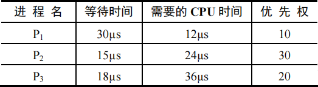

若优先权值大的进程优先获得CPU，从T时刻起系统开始进程调度，则系统的平均周转时间为 (&emsp;)。

<options :options="['A. 54μs', 'B. 73μs', 'C. 74μs', 'D. 75μs']" />

::: analysis
答案：D。
:::

86\. (2022) 进程P0、P1、P2和P3进入就绪队列的时刻、优先级（值越小优先权越高）及CPU执行时间如下表所示。若系统采用基于优先权的抢占式进雅调度算法，则从0ms时刻开始调度，到4个进程都运行结束为止，发生进程调度的总次数为 (&emsp;)。

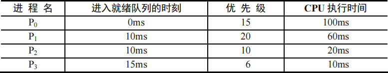

<options :options="['A. 4', 'B. 5', 'C. 6', 'D. 7']" />

::: analysis
答案：C。
:::

87\. (2025) 在某基于优先权的进程调度程序中，进程就绪队列采用优先权从高到低的有序单链表实现。若就绪队列长度为n，则就绪队列的插入操作和从就绪队列中选出将要执行进程的操作的时间复杂度分别是 (&emsp;)。

<options :options="['A. O(1), O(1)', 'B. O(1), O(n)', 'C. O(n), O(1)', 'D. O(n), O(n)']" />

::: analysis
答案：C。
:::

</question>

#### 题型十六：多级反馈调度算法

<question>

88\. (2020) 下列与进程调度有关的因素中，在设计多级反馈队列调度算法时需要考虑的是 (&emsp;)。

<options :options="['Ⅰ. 就绪队列的数量']" />
<options :options="['Ⅱ. 就绪队列的优先级']" />
<options :options="['Ⅲ. 各就绪队列的调度算法']" />
<options :options="['Ⅳ. 进程在就绪队列间的迁移条件']" /> 

<options :options="['A. 仅Ⅰ、Ⅱ', 'B. 仅Ⅲ、Ⅳ', 'C. 仅Ⅱ、Ⅰ、Ⅳ', 'D. Ⅰ、Ⅱ、Ⅲ和Ⅳ']" />

::: analysis
答案：D。
:::

</question>

#### 题型十七：调度算法的比较

<question>

89\. (&emsp;) 有利于CPU繁忙型的作业，而不利于I/O繁忙型的作业。

<options :options="['A. 时间片轮转调度算法']" />
<options :options="['B. 先来先服务调度算法']" />
<options :options="['C. 短作业(进程)优先调度算法']" />
<options :options="['D. 优先级调度算法']" />

::: analysis
答案：B。
:::

90\. 下面有关选择进程调度算法的准则中，不正确的是 (&emsp;)。

<options :options="['A. 尽快响应交互式用户的请求']" />
<options :options="['B. 尽量提高处理器利用率']" />
<options :options="['C. 尽可能提高系统吞吐量']" />
<options :options="['D. 适当增长进程就绪队列的等待时间']" />

::: analysis
答案：D。
:::

91\. 下列进程调度算法中，可能导致饥饿现象的有 (&emsp;)。

<options :options="['Ⅰ. 先来先服务调度算法']" />
<options :options="['Ⅱ. 短作业优先调度算法']" />
<options :options="['Ⅲ. 优先级调度算法']" />
<options :options="['Ⅳ. 时间片轮转调度算法']" />

<options :options="['A. Ⅰ和Ⅱ', 'B. Ⅱ和Ⅲ', 'C. Ⅲ、Ⅲ和Ⅳ', 'D. Ⅲ']" />

::: analysis
答案：B。
:::

92\. (2014) 下列调度算法中，不可能导致饥饿现象的是 (&emsp;)。

<options :options="['A. 时间片轮转', 'B. 静态优先数调度', 'C. 非抢占式短任务优先', 'D. 抢占式短任务优先']" />

::: analysis
答案：A。
:::

</question>

#### 题型十八：临界区与临界资源的概念

<question>

93\. 以下 (&emsp;) 不属于临界资源。

<options :options="['A. 打印机', 'B. 非共享数据', 'C. 共享变量', 'D. 共享缓冲区']" />

::: analysis
答案：B。
:::

94\. 以下 (&emsp;) 属于临界资源。

<options :options="['A. 磁盘', 'B. 公用队列', 'C. 私用数据', 'D. 可重入的程序代码']" />

::: analysis
答案：B。
:::

95\. 临界区是指并发进程访问共享变量段的 (&emsp;)。

<options :options="['A. 管理信息', 'B. 信息存储', 'C. 数据', 'D. 代码程序']" />

::: analysis
答案：D。
:::

96\. 下列对临界区的论述中，正确的是 (&emsp;)。

<options :options="['A. 临界区是指进程中用于实现进程互斥的那段代码']" />
<options :options="['B. 临界区是指进程中用于实现进程同步的那段代码']" />
<options :options="['C. 临界区是指进程中用于实现进程通信的那段代码']" />
<options :options="['D. 临界区是指进程中用于访问临界资源的那段代码']" />

::: analysis
答案：D。
:::

97\. 可以被多个进程在任意时刻共享的代码必须是 (&emsp;)。

<options :options="['A. 顺序代码', 'B. 机器语言代码', 'C. 不允许任何修改的代码', 'D. 无转移指令代码']" />

::: analysis
答案：C。
:::

98\. 一个系统中共有5个并发进程涉及某个相同的变量A，变量A的相关临界区是由 (&emsp;) 个临界区构成的。

<options :options="['A. 1', 'B. 3', 'C. 5', 'D. 6']" />

::: analysis
答案：C。
:::

</question>

#### 题型十九：同步与互斥

<question>

99\. (2018) 属于同一进程的两个线程thread1和thread2并发执行，共享初值为0的全局变量x。thread1和thread2实现对全局变量x加1的机器级代码描述如下：
在所有可能的指令执行序列中，使x的值为2的序列个数是 (&emsp;)。

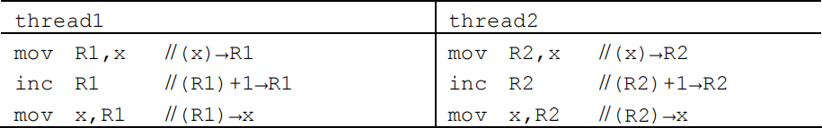

<options :options="['A. 1', 'B. 2', 'C. 3', 'D. 4']" />

::: analysis
答案：B。
:::

100\. 在操作系统中，要对并发进程进行同步的原因是 (&emsp;)。

<options :options="['A. 进程必须在有限的时间内完成', 'B. 进程具有动态性']" />
<options :options="['C. 并发进程是异步的', 'D. 进程具有结构性']" />

::: analysis
答案：C。
:::

101\. 以下不是同步机制应遵循的准则的是 (&emsp;)。

<options :options="['A. 让权等待', 'B. 空闲让进', 'C. 忙则等待', 'D. 无限等待']" />

::: analysis
答案：D。
:::

102\. 两个进程合作完成一个任务。在并发执行中，一个进程要等待其合作伙伴发来消息，或者建立某个条件后再向前执行，这种制约性合作关系被称为进程的 (&emsp;)。

<options :options="['A. 互斥', 'B. 同步', 'C. 调度', 'D. 伙伴']" />

::: analysis
答案：B。
:::

</question>

#### 题型二十：临界区互斥的软件实现方式

<question>

103\. 两个进程P0、P1互斥的Peterson算法描述如下：

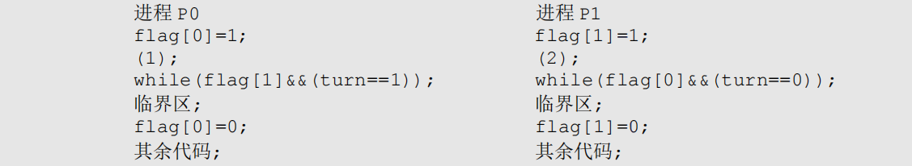

其中，(1)和(2)处的代码分别为 (&emsp;)。

<options :options="['A. tum=0，turn=0', 'B. tum=0，turn=1', 'C. turm=1，tum=0', 'D. tum=1，tum=1']" />

::: analysis
答案：C。
:::

104\. (2010) 进程P0和P1的共享变量定义及其初值为

若进程P0和P1访问临界资源的类C伪代码实现如下：

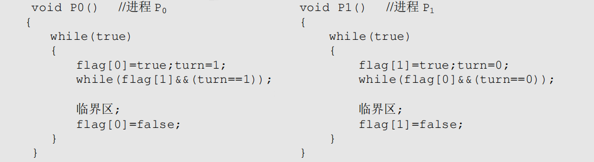

则并发执行进程P0和P1时产生的情形是 (&emsp;)。

<options :options="['A. 不能保证进程互斥进入临界区，会出现“饥饿”现象']" />
<options :options="['B. 不能保证进程互斥进入临界区，不会出现“饥饿”现象']" />
<options :options="['C. 能保证进程互斥进入临界区，会出现“饥饿”现象']" />
<options :options="['D. 能保证进程互斥进入临界区，不会出现“饥饿”现象']" />

::: analysis
答案：D。
:::

</question>

#### 题型二十一：信号量功能与值的含义

<question>

105\. 不需要信号量就能实现的功能是 (&emsp;)。

<options :options="['A. 进程同步', 'B. 进程互斥', 'C. 执行的前驱关系', 'D. 进程的并发执行']" />

::: analysis
答案：D。
:::

106\. 若一个信号量的初值为3，经过多次PV操作后当前值为-1，这表示等待进入临界区的进程数是 (&emsp;)。

<options :options="['A. 1', 'B. 2', 'C. 3', 'D. 4']" />

::: analysis
答案：A。
:::

107\. 对于两个并发进程，设互斥信号量为mutex(初值为1)，若mutex=0，则表示 (&emsp;)。

<options :options="['A. 没有进程进入临界区']" />
<options :options="['B. 有一个进程进入临界区']" />
<options :options="['C. 有一个进程进入临界区，另一个进程等待进入']" />
<options :options="['D. 有一个进程在等待进入']" />

::: analysis
答案：B。
:::

108\. 对于两个并发进程，设互斥信号量为mutex(初值为1)，若mutex=-1，则 (&emsp;)。

<options :options="['A. 表示没有进程进入临界区']" />
<options :options="['B. 表示有一个进程进入临界区']" />
<options :options="['C. 表示有一个进程进入临界区，另一个进程等待进入']" />
<options :options="['D. 表示有两个进程进入临界区']" />

::: analysis
答案：C。
:::

109\. 有三个进程共享同一程序段，而每次只允许两个进程进入该程序段，若用PV操作同步机制，则信号量S的取值范围是 (&emsp;)。

<options :options="['A. 2,1,0,-1', 'B. 3,2,1,0', 'C. 2,1,0,−1,−2', 'D. 1,0,-1,-2']" />

::: analysis
答案：A。
:::

110\. 若系统中有4个进程共享3台打印机，采用信号量机制控制打印机的共享使用，则信号量的取值范围是 (&emsp;)。

<options :options="['A. [-1,4]', 'B. [-2,2]', 'C. [-1,3]', 'D. [-3,2]']" />

::: analysis
答案：C。
:::

111\. 有一个计数信号量S：
1) 假如若干进程对S进行28次P操作和18次V操作后，信号量S的值为0。
2) 假如若干进程对信号量S进行了15次P操作和2次V操作。请问此时有多少个进程等待在信号量S的队列中？ (&emsp;)

<options :options="['A. 2', 'B. 3', 'C. 5', 'D. 7']" />

::: analysis
答案：B。
:::

</question>

#### 题型二十二：PV操作

<question>

112\. 在用信号量机制实现互斥时，互斥信号量的初值为 (&emsp;)。

<options :options="['A. 0', 'B. 1', 'C. 2', 'D. 3']" />

::: analysis
答案：B。
:::

113\. 用PV操作实现进程同步，信号量的初值为 (&emsp;)。

<options :options="['A. -1', 'B. 0', 'C. 1', 'D. 由用户确定']" />

::: analysis
答案：D。
:::

114\. 用V操作唤醒一个等待进程时，被唤醒进程变为 (&emsp;) 态，

<options :options="['A. 运行', 'B. 等待', 'C. 就绪', 'D. 完成']" />

::: analysis
答案：C。
:::

115\. P操作可能导致 (&emsp;)。

<options :options="['A. 进程就绪', 'B. 进程结束', 'C. 进程阻塞', 'D. 新进程创建']" />

::: analysis
答案：C。
:::

116\. 在使用互斥锁进行同步互斥时，下列 (&emsp;) 情况会导致死锁，

<options :options="['A. 一个线程对同一个互斥锁连续加锁两次']" />
<options :options="['B. 一个线程尝试对一个已加锁的互斥锁再次加锁']" />
<options :options="['C. 两个线程分别对两个不同的互斥锁先后加锁，但顺序相反']" />
<options :options="['D. 一个线程对一个互斥锁加锁后忘记解锁']" />

::: analysis
答案：C。
:::

117\. 用来实现进程同步与互斥的PV操作实际上是由 (&emsp;) 过程组成的，

<options :options="['A. 一个可被中断的', 'B. 一个不可被中断的']" />
<options :options="['C. 两个可被中断的', 'D. 两个不可被中断的']" />

::: analysis
答案：D。
:::

118\. 一个进程因在互斥信号量mutex上执行V(mutex)操作而导致唤醒另一个进程时，执行V操作后mutex的值为 (&emsp;)。

<options :options="['A. 大于0', 'B. 小于0', 'C. 大于或等于0', 'D. 小于或等于0']" />

::: analysis
答案：D。
:::

119\. 对信号量S执行P操作后，使该进程进入资源等待队列的条件是 (&emsp;)。

<options :options="['A. S.value<0', 'B. S.value<=0', 'C. S.value>0', 'D. S.value>=0']" />

::: analysis
答案：A。
:::

120\. (2018) 在下列同步机制中，可以实现让权等待的是 (&emsp;)。

<options :options="['A. Peterson方法', 'B. swap指令', 'C. 信号量方法', 'D. TestAndSeT指令']" />

::: analysis
答案：C。
:::

</question>

#### 题型二十三：生产者消费者问题

<question>

121\. 生产者-消费者问题用于解决 (&emsp;)。

<options :options="['A. 多个进程共享一个数据对象的问题']" />
<options :options="['B. 多个进程之间的同步和互斥问题']" />
<options :options="['C. 多个进程共享资源的死锁与饥饿问题']" />
<options :options="['D. 利用信号量实现多个进程并发的问题']" />

::: analysis
答案：B。
:::

122\. 所有的消费者必须等待生产者先运行的前提条件是 (&emsp;)。

<options :options="['A. 缓冲区空', 'B. 缓冲区满', 'C. 缓冲区不可用', 'D. 缓冲区半空']" />

::: analysis
答案：A。
:::

123\. 下列关于生产者-消费者问题的唤醒操作的说法中，正确的是 (&emsp;)。

<options :options="['Ⅰ. 生产者唤醒其他生产者']" />
<options :options="['Ⅱ. 生产者唤醒消费者']" />
<options :options="['Ⅲ. 消费者唤醒其他消费者']" />
<options :options="['Ⅳ. 消费者唤醒生产者']" /> 

<options :options="['A. Ⅰ和Ⅱ', 'B. Ⅲ和Ⅳ', 'C. Ⅲ和Ⅲ', 'D. Ⅰ、Ⅰ、Ⅲ和Ⅳ']" />

::: analysis
答案：D。
:::

124\. 在9 个生产者、6个消费者共享容量为8的缓冲区的生产者-消费者问题中，互斥使用缓冲区的信号量初始值为 (&emsp;)。

<options :options="['A. 1', 'B. 6', 'C. 8', 'D. 9']" />

::: analysis
答案：A。
:::

125\. 消费者进程阻塞在wait(m)(m是互斥信号量)的条件是 (&emsp;)。

<options :options="['Ⅰ. 没有空缓冲区']" />
<options :options="['Ⅱ. 没有满缓冲区']" />
<options :options="['Ⅲ. 有其他生产者已进入临界区']" />
<options :options="['Ⅳ. 有其他消费者已进入临界区']" /> 

<options :options="['A. Ⅰ和Ⅱ', 'B. Ⅲ和Ⅳ', 'C. Ⅰ和Ⅲ', 'D. Ⅱ和Ⅳ']" />

::: analysis
答案：B。
:::

126\. 进程A和进程B通过共享缓冲区协作完成数据处理，进程A负责产生数据并放入缓冲区，进程B从缓冲区读数据并输出，进程A和进程B之间的制约关系是 (&emsp;)。

<options :options="['A. 互斥关系', 'B. 同步关系', 'C. 互斥和同步关系', 'D. 无制约关系']" />

::: analysis
答案：C。
:::

</question>

#### 题型二十四：管程

<question>

127\. (&emsp;) 定义了共享数据结构和各种进程在该数据结构上的全部操作，

<options :options="['A. 管程', 'B. 类程', 'C. 线程', 'D. 程序']" />

::: analysis
答案：A。
:::

128\. 下述 (&emsp;) 选项不是管程的组成部分。

<options :options="['A. 局限于管程的共享数据结构']" />
<options :options="['B. 对管程内数据结构进行操作的一组过程']" />
<options :options="['C. 管程外过程调用管程内数据结构的说明']" />
<options :options="['D. 对局限于管程的数据结构设置初始值的语句']" />

::: analysis
答案：C。
:::

129\. 以下关于管程的叙述中，错误的是 (&emsp;)。

<options :options="['A. 管程是进程同步工具，解决信号量机制大量同步操作分散的问题']" />
<options :options="['B. 管程每次只允许一个进程进入管程']" />
<options :options="['C. 管程中signal 操作的作用和信号量机制中的V操作相同']" />
<options :options="['D. 管程是被进程调用的，管程是语法范围，无法创建和撤销']" />

::: analysis
答案：C。
:::

130\. (2018) 若x是管程内的条件变量，则当进程执行x.wait()时所做的工作是 (&emsp;)。

<options :options="['A. 实现对变量x的互斥访问']" />
<options :options="['B. 唤醒一个在x上阻塞的进程']" />
<options :options="['C. 根据x的值判断该进程是否进入阻塞态']" />
<options :options="['D. 阻塞该进程，并将之插入x的阻塞队列中']" />

::: analysis
答案：D。
:::

</question>

#### 题型二十五：死锁的条件

<question>

131\. 下列情况中，可能导致死锁的是 (&emsp;)。

<options :options="['A. 进程释放资源']" />
<options :options="['B. 一个进程进入死循环']" />
<options :options="['C. 多个进程竞争资源出现了循环等待']" />
<options :options="['D. 多个进程竞争使用共享型设备']" />

::: analysis
答案：C。
:::

132\. 一个进程在获得资源后，只能在使用完资源后由自己释放，这属于死锁必要条件的 (&emsp;)。

<options :options="['A. 互斥条件', 'B. 请求和释放条件', 'C. 不剥夺条件', 'D. 防止系统进入不安全状态']" />

::: analysis
答案：C。
:::

133\. 下面是并发进程的程序代码，正确的是 (&emsp;)。

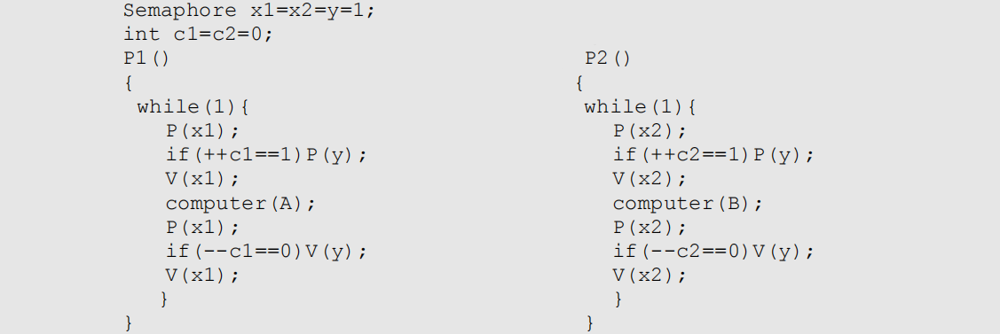

<options :options="['A. 进程不会死锁，也不会“饥饿”']" />
<options :options="['B. 进程不会死销，但是会“饥饿”']" />
<options :options="['C. 进程会死锁，但是不会“饥饿”']" />
<options :options="['D. 进程会死锁，也会“饥饿”']" />

::: analysis
答案：B。
:::

134\. 下列情况中，可能导致死锁的是 (&emsp;)。

<options :options="['A. 进程释放资源']" />
<options :options="['B. 一个进程进入死环']" />
<options :options="['C. 多个进程竞争资源出现了循环等待']" />
<options :options="['D. 多个进程竞争使用共享型的设备']" />

::: analysis
答案：C。
:::

135\. (2016) 系统中有3个不同的临界资源R1、R2和R3，被4个进程p1、p2、p3及p4共享。各进程对资源的需求为：p1申请R1和R2，p2申请R2和R3，p3申请R1和R3，p4申请R2。若系统出现死锁，则处于死锁状态的进程数至少是 (&emsp;)。

<options :options="['A. 1', 'B. 2', 'C. 3', 'D. 4']" />

::: analysis
答案：C。
:::

136\. 假定某计算机系统有两类可使用资源：R1(R1共2个单位)和R2(R2共1个单位)，由进程P1和P2共享。两个进程均按如下顺序使用资源：申请R1→中请R2→申请R1→释放R1→释放R2→释放R1，则在系统运行过程中 (&emsp;)。

<options :options="['A. 不可能产生死锁']" />
<options :options="['B. 有可能产生死锁，因为R1资源不足']" />
<options :options="['C. 有可能产生死锁，因为R₂资源不足']" />
<options :options="['D. 只有一种进程执行序列可能导致死锁']" />

::: analysis
答案：B。
:::

</question>

#### 题型二十六：不会死锁的资源数

<question>

137\. 某系统中有三个并发进程都需要四个同类资源，则该系统必然不会发生死锁的最少资源是 (&emsp;)。

<options :options="['A. 9', 'B. 10', 'C. 11', 'D. 12']" />

::: analysis
答案：B。
:::

138\. 某系统中共有11台磁带机，x个进程共享此磁带机设备，每个进程最多请求使用3台，则系统必然不会死锁的最大x值是 (&emsp;)。

<options :options="['A. 4', 'B. 5', 'C. 6', 'D. 7']" />

::: analysis
答案：B。
:::

139\. 若系统中有5个某类资源供若干进程共享，则不会引起死锁的情况是 (&emsp;)。

<options :options="['A. 有6个进程，每个进程需1个资源']" />
<options :options="['B. 有5个进程，每个进程需2个资源']" />
<options :options="['C. 有4个进程，每个进程需3个资源']" />
<options :options="['D. 有3个进程，每个进程需4个资源']" />

::: analysis
答案：A。
:::

140\. (2021) 若系统中有n(n≥2)个进程，每个进程均需要使用某类临界资源2个，则系统不会发生死锁所需的该类资源总数至少是 (&emsp;)。

<options :options="['A. 2', 'B. n', 'C. n+1', 'D. 2n']" />

::: analysis
答案：C。
:::

</question>

#### 题型二十七：死锁的预防

<question>

141\. 一次分配所有资源的方法可以预防死锁的发生，它破坏死锁4个必要条件中的 (&emsp;)。

<options :options="['A. 互斥', 'B. 占有并请求', 'C. 非剥夺', 'D. 循环等待']" />

::: analysis
答案：B。
:::

142\. 死锁预防是保证系统不进入死锁状态的静态策略，其解决办法是破坏产生死锁的四个必要条件之一，下列方法中直接破坏了“循环等待”条件的是 (&emsp;)。

<options :options="['A. 银行家算法', 'B. 一次性分配策略', 'C. 剥夺资源法', 'D. 资源有序分配策略']" />

::: analysis
答案：D。
:::

143\. 可以防止系统出现死锁的手段是 (&emsp;)。

<options :options="['A. 用PV操作管理共享资源', 'B. 使进程互斥地使用共享资源', 'C. 采用资源静态分配策略', 'D. 定时运行死锁检测程序']" />

::: analysis
答案：C。
:::

144\. 在下列死锁的解决方法中，属于死锁预防策略的是 (&emsp;)。

<options :options="['A. 银行家算法', 'B. 资源有序分配算法', 'C. 死锁检测算法', 'D. 资源分配图化简法']" />

::: analysis
答案：B。
:::

145\. 某系统采用如下资源分配策略：当一个进程提出资源请求而暂时无法满足时，若当前没有其他进程因等待资源而被阻塞，则该进程自行阻塞；若已有因等待资源而被阻塞的进程，则系统检查所有被阻塞的进程，若其中某些进程所占有的资源恰好是当前申请进程所需的，则立即剥夺这些资源并分配给申请进程。该策略可能导致 (&emsp;)。

<options :options="['A. 系统死锁', 'B. 系统陷入死循环', 'C. 进程回退', 'D. 进程饥饿']" />

::: analysis
答案：D。
:::

</question>

#### 题型二十八：死锁的避免

<question>

146\. 死锁的避免是根据 (&emsp;) 采取措施实现的。

<options :options="['A. 配置足够的系统资源']" />
<options :options="['B. 使进程的推进顺序合理']" />
<options :options="['C. 破坏死锁的四个必要条件之一']" />
<options :options="['D. 防止系统进入不安全状态答案']" />

::: analysis
答案：D。
:::

147\. 死锁与安全状态的关系是 (&emsp;)。

<options :options="['A. 死锁状态有可能是安全状态']" />
<options :options="['B. 安全状态有可能成为死锁状态']" />
<options :options="['C. 不安全状态就是死锁状态']" />
<options :options="['D. 死锁状态一定是不安全状态']" />

::: analysis
答案：D。
:::

148\. (2011) 某时刻进程的资源使用情况见下表，此时的安全序列是 (&emsp;)。

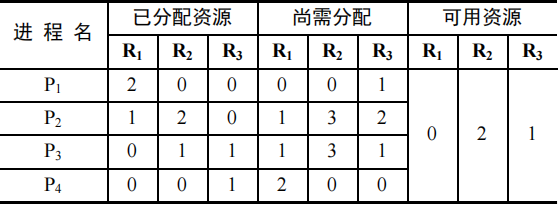

<options :options="['A. P1,P2,P3,P4', 'B. P1,P3,P2,P4', 'C. P1,P4,P3,P2', 'D. 不存在']" />

::: analysis
答案：D。
:::

149\. (2012) 假设5个进程P0、P1、P2、P3、P4共享三类资源R1、R2、R3，这些资源总数分别为18、6、22。T0时刻的资源分配情况如下表所示，此时存在的一个安全序列是 (&emsp;)。

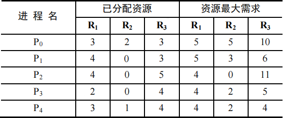

<options :options="['A. P0, P2, P4, P1, P3']" />
<options :options="['B. P1, P0, P3, P4, P2']" />
<options :options="['C. P2, P1, P0, P3, P4']" />
<options :options="['D. P3, P4, P2, P1, P0']" />

::: analysis
答案：D。
:::

150\. (2022) 系统中有三个进程P0、P1、P2及三类资源A、B、C，若某时刻系统分配资源的情况如下表所示，则此时系统中存在的安全序列的个数为 (&emsp;)。

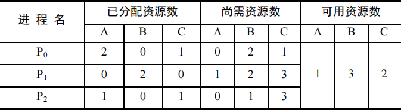

<options :options="['A. 1', 'B. 2', 'C. 3', 'D. 4']" />

::: analysis
答案：B。
:::

151\. (2020) 某系统中有A、B两类资源各6个，T时刻的资源分配及需求情况如下表所示。T时刻安全性检测结果是 (&emsp;)。

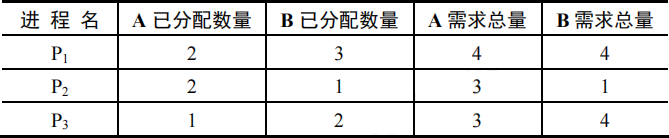

<options :options="['A. 存在安全序列P1、P2、P3']" />
<options :options="['B. 存在安全序列P2、P1、P3']" />
<options :options="['C. 存在安全序列P2、P3、P1']" />
<options :options="['D. 不存在安全序列']" />

::: analysis
答案：B。
:::

152\. 某系统有m个同类资源供n个进程共享，若每个进程最多申请k个资源(k>1)、采用银行家算法分配资源，为保证系统不发生死锁，则各进程的最大需求量之和应 (&emsp;)。

<options :options="['A. 等于m', 'B. 等于m+n', 'C. 小于m+n', 'D. 大于m+n']" />

::: analysis
答案：C。
:::

153\. 采用银行家算法可以避免死锁的发生，这是因为该算法 (&emsp;)。

<options :options="['A. 可以抢夺已分配的资源']" />
<options :options="['B. 能及时为各进程分配资源']" />
<options :options="['C. 任何时刻都能保证每个进程能得到所需的资源']" />
<options :options="['D. 任何时刻都能保证少有一个进程可以得到所需的全部资源']" />

::: analysis
答案：D。
:::

154\. (2013) 下列关于银行家算法的叙述中，正确的是 (&emsp;)。

<options :options="['A. 银行家算法可以预防死锁']" />
<options :options="['B. 当系统处于安全状态时，系统中一定无死锁进程']" />
<options :options="['C. 当系统处于不安全状态时，系统中一定会出现死锁进程']" />
<options :options="['D. 银行家算法破坏了死锁必要条件中的“请求和保持”条件']" />

::: analysis
答案：B。
:::

</question>

#### 题型二十九：死锁的检测

<question>

155\. 以下有关资源分配图的描述中，正确的是 (&emsp;)。

<options :options="['A. 有向边包括进程指向资源类的分配边和资源类指向进程中请边两类']" />
<options :options="['B. 矩形表示进程，其中圆点表示申请同一类资源的各个进程']" />
<options :options="['C. 圆图节点表示资源类',]" />
<options :options="['D. 资源分配图是一个有向图，用于表示某时刻系统资源与进程之间的状态']" />

::: analysis
答案：D。
:::

156\. 死锁检测时检查的是 (&emsp;)。

<options :options="['A. 资源有向图', 'B. 前驱图', 'C. 搜索树', 'D. 安全图']" />

::: analysis
答案：A。
:::

157\. 死锁定理是用于处理死锁的 (&emsp;) 方法。

<options :options="['A. 预防死锁', 'B. 避免死锁', 'C. 检测死锁', 'D. 解除死锁']" />

::: analysis
答案：C。
:::

158\. 系统的资源分配图在下列情况下，无法判断是否处于死锁状态的有 (&emsp;)。

<options :options="['Ⅰ. 出现了环路']" />
<options :options="['Ⅱ. 没有环路']" />
<options :options="['Ⅲ. 每种资源只有一个，并出现环路']" />
<options :options="['Ⅳ. 每个进程节点至少有一条请求边']" /> 

<options :options="['A. Ⅰ、Ⅲ、Ⅲ、Ⅳ', 'B. Ⅰ、Ⅲ、Ⅳ', 'C. Ⅰ、Ⅳ', 'D. 以上答案都不正确']" />

::: analysis
答案：C。
:::

159\. (2015) 若系统S1采用死锁避免方法，S2采用死锁检测方法。下列叙述中，正确的是 (&emsp;)。

<options :options="['Ⅰ. S1会限制用户申请资源的顺序，而S2不会']" />
<options :options="['Ⅱ. S1需要进程运行所需的资源总量信息，而S2不需要']" />
<options :options="['Ⅲ. S1不会给可能导致死锁的进程分配资源，而S2会']" /> 

<options :options="['A. 仅Ⅰ、Ⅱ', 'B. 仅Ⅱ、Ⅲ', 'C. 仅Ⅰ、Ⅲ', 'D. Ⅰ、Ⅱ、Ⅲ']" />

::: analysis
答案：B。
:::

</question>

#### 题型三十：死锁的解除

<question>

160\. 解除死锁通常不采用的方法是 (&emsp;)。

<options :options="['A. 终止一个死锁进程']" />
<options :options="['B. 终止所有死锁进程']" />
<options :options="['C. 从死锁进程处抢夺资源']" />
<options :options="['D. 从非死锁进程处抢夺资源']" />

::: analysis
答案：D。
:::

161\. 三个进程共享四个同类资源，这些资源的分配与释放只能一次一个。已知每个进程最多需要两个该类资源，则该系统 (&emsp;)。

<options :options="['A. 有些进程可能永远得不到该类资源']" />
<options :options="['B. 必然有死锁']" />
<options :options="['C. 进程请求该类资源必然能得到']" />
<options :options="['D. 必然是死锁']" />

::: analysis
答案：C。
:::

162\. 解除死锁通常不采用的方法是 (&emsp;)。

<options :options="['A. 终止一个死锁进程']" />
<options :options="['B. 终止所有死锁进程']" />
<options :options="['C. 从死锁进程处抢夺资源']" />
<options :options="['D. 从非死锁进程处抢夺资源']" />

::: analysis
答案：D。
:::

163\. 采用资源剥夺法可以解除死锁，还可以采用 (&emsp;) 方法解除死锁。

<options :options="['A. 执行并行操作', 'B. 撤销进程', 'C. 拒绝分配新资源', 'D. 修改信号量']" />

::: analysis
答案：B。
:::

164\. 下列各种方法中，可用于解除已发生死锁的是 (&emsp;)。

<options :options="['A. 撤销部分或全部死锁进程']" />
<options :options="['B. 剥夺部分或全部死锁进程的资源']" />
<options :options="['C. 降低部分或全部死锁进程的优先级']" />
<options :options="['D. A和B都可以']" />

::: analysis
答案：D。
:::

</question>

#### 题型三十一：死锁的概念对比

<question>

165\. 下列关于死锁的说法中，正确的有 (&emsp;)。

<options :options="['Ⅰ. 死锁状态一定是不安全状态']" />
<options :options="['Ⅱ. 产生死锁的根本原因是系统资源分配不足和进程推进顺序非法']" />
<options :options="['Ⅲ. 资源的有序分配策略可以破坏死锁的循环等待条件']" />
<options :options="['Ⅳ. 采用资源剥夺法可以解除死锁，还可以采用撤销进程方法解除死锁']" /> 

<options :options="['A. Ⅰ、Ⅲ', 'B. Ⅱ', 'C. Ⅳ', 'D. 四个说法都对']" />

::: analysis
答案：D。
:::

166\. (2019) 下列关于死锁的叙述中，正确的是 (&emsp;)。

<options :options="['Ⅰ. 可以通过剥夺进程资源解除死锁']" />
<options :options="['Ⅱ. 死锁的预防方法能确保系统不发生死锁']" />
<options :options="['Ⅲ. 银行家算法可以判断系统是否处于死锁状态']" />
<options :options="['Ⅳ. 当系统出现死锁时，必然有两个或两个以上的进程处于阻塞态']" /> 

<options :options="['A. 仅Ⅱ、Ⅲ', 'B. 仅Ⅰ、Ⅱ、Ⅳ', 'C. 仅Ⅰ、Ⅱ、Ⅱ', 'D. 仅Ⅰ、Ⅲ、Ⅳ']" />

::: analysis
答案：B。
:::

</question>

## 第三章 内存管理

#### 题型一：程序的编译、链接、装入

<question>

1\. 动态重定位是在作业的 (&emsp;) 中进行的。

<options :options="['A. 编译过程', 'B. 装入过程', 'C. 链接过程', 'D. 执行过程']" />

::: analysis
答案：D。
:::

2\. 下面的 (&emsp;) 方法有利于程序的动态链接。

<options :options="['A. 分段存储管理', 'B. 分页存储管理', 'C. 可变式分区管理', 'D. 固定式分区管理']" />

::: analysis
答案：A。
:::

3\. (2011) 在虚拟内存管理中，地址变换机构将逻辑地址变换为物理地址，形成该逻辑地址的阶段是 (&emsp;)。

<options :options="['A. 编辑', 'B. 编译', 'C. 链接', 'D. 装载']" />

::: analysis
答案：C。
:::

4\. 当前编程人员编写好的程序经过编译转换成目标文件后，各条指令的地址编号起始一般定为(①)，称为(②)地址。

<options :options="['① A. 1', 'B. 0', 'C. IP', 'D. CS']" />
<options :options="['② A. 绝对', 'B. 名义', 'C. 逻辑', 'D. 实']" />

::: analysis
答案：①B、②C。
:::

5\. 在动态分区分配存储管理中，随着时间的推移，会产生越来越多的小碎片，可通过紧凑技术解决，即操作系统不时地对进程进行移动和整理，则适合采用 (&emsp;) 装入技术。

<options :options="['A. 绝对装入', 'B. 静态重定位', 'C. 动态重定位', 'D. 静态重定位和动态重定位']" />

::: analysis
答案：C。
:::

6\. 下面的存储管理方案中，(&emsp;) 方式可以采用静态重定位。

<options :options="['A. 固定分区', 'B. 可变分区', 'C. 页式', 'D. 段式']" />

::: analysis
答案：A。
:::

</question>

#### 题型二：内存连续分配管理方式

<question>

7\. 分区分配管理要求对每一个作业都分配 (&emsp;) 的内存单一。

<options :options="['A. 地址连续', 'B. 若干地址不连续', 'C. 若干连续的帧', 'D. 若干不连续的帧']" />

::: analysis
答案：A。
:::

8\. 分区管理中采用最佳适应分配算法时，把空闲区按 (&emsp;) 次序登记在空闲区表中。

<options :options="['A. 长度递增', 'B. 长度递减', 'C. 地址递增', 'D. 地址递减']" />

::: analysis
答案：A。
:::

9\. 首次适应算法的空闲分区 (&emsp;)。

<options :options="['A. 按大小递减顺序连在一起']" />
<options :options="['B. 按大小递增顺序连在一起']" />
<options :options="['C. 按地址由小到大排列']" />
<options :options="['D. 按地址由大到小排列']" />

::: analysis
答案：C。
:::

10\. 在动态分区分配存储管理中，不需要对空闲区链进行排序的分配算法是 (&emsp;)。

<options :options="['A. 首次适应法', 'B. 最佳适应法', 'C. 最差适应法', 'D. 都不需要']" />

::: analysis
答案：A。
:::

11\. 动态分区也称可变式分区，它是系统运行过程中 (&emsp;) 动态建立的。

<options :options="['A. 在作业装入时', 'B. 在作业创建时', 'C. 在作业完成时', 'D. 在作业未装入时']" />

::: analysis
答案：A。
:::

12\. (2010) 某基于动态分区存储管理的计算机，其主存容量为55MB(初始为空)，采用最佳适配(BesTFit) 算法，分配和释放的顺序为：分配15MB，分配30MB，释放15MB，分配8MB，分配6MB，此时主存中最大空闲分区的大小是 (&emsp;)。

<options :options="['A. 7MB', 'B. 9MB', 'C. 10MB', 'D. 15MB']" />

::: analysis
答案：B。
:::

13\. 设内存的分配情况如图所示。若要申请一块40KB的内存空间，采用最佳适应算法，则所得到的分区首址为 (&emsp;)。

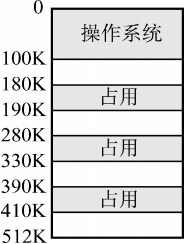

<options :options="['A. 100K', 'B. 190K', 'C. 330K', 'D. 410K']" />

::: analysis
答案：C。
:::

14\. (2024) 下列算法中，每次回收分区时仅合并大小相等的空闲分区的是 (&emsp;)。

<options :options="['A. 伙伴算法', 'B. 最佳适应算法', 'C. 最坏适应算法', 'D. 首次适应算法']" />

::: analysis
答案：A。
:::

15\. (2009) 分区分配内存管理方式的主要保护措施是 (&emsp;)。

<options :options="['A. 界地址保护', 'B. 程序代码保护', 'C. 数据保护', 'D. 栈保护']" />

::: analysis
答案：A。
:::

</question>

#### 题型三：内存非连续分配管理方式：分页的概念

<question>

16\. 操作系统采用分页存储管理方式，要求 (&emsp;)。

<options :options="['A. 每个进程拥有一张页表，且进程的页表驻留在内存中']" />
<options :options="['B. 每个进程拥有一张页表，但只有执行进程的页表驻留在内存中']" />
<options :options="['C. 所有进程共享一张页表，以节约有限的内存空间，但页表必须驻留在内存中']" />
<options :options="['D. 所有进程共享一张页表，只有页表中当前使用的页面必须驻留在内存中，以最大限度地节省有限的内存空间']" />

::: analysis
答案：A。
:::

17\. 某个操作系统对内存的管理采用页式存储管理方法，所划分的页面大小 (&emsp;)。

<options :options="['A. 要根据内存大小确定']" />
<options :options="['B. 必须相同']" />
<options :options="['C. 要根据CPU的地址结构确定']" />
<options :options="['D. 要依据外存和内存的大小确定']" />

::: analysis
答案：B。
:::

18\. 在分页存储管理中，主存的分配 (&emsp;)。

<options :options="['A. 以页框为单位进行']" />
<options :options="['B. 以作业的大小进行']" />
<options :options="['C. 以物理段进行']" />
<options :options="['D. 以逻辑记录大小进行']" />

::: analysis
答案：A。
:::

19\. 下列关于页式存储管理的论述中，正确的是 (&emsp;)。

<options :options="['A. Ⅰ、Ⅱ、Ⅳ', 'B. Ⅰ、Ⅳ', 'C. 仅Ⅰ', 'D. 全都正确']" />

::: analysis
答案：C。
:::

20\. 在页式存储管理中，当CPU形成一个有效地址时，查找页表的工作是由 (&emsp;) 实现的。

<options :options="['A. 操作系统', 'B. 页表查询程序', 'C. 硬件', 'D. 存储管理进程']" />

::: analysis
答案：C。
:::

21\. 对主存储器的访问，(&emsp;)。

<options :options="['A. 以块(页)或段为单位']" />
<options :options="['B. 以字节或字为单位']" />
<options :options="['C. 随存储器的管理方案不同而异']" />
<options :options="['D. 以用户的逻辑记录为单位']" />

::: analysis
答案：B。
:::

</question>

#### 题型四：内存非连续分配管理方式：分页的地址转换

<question>

22\. 在某页式存储管理的系统中，主存容量为1MB，被分成256个页框，页框号为0,1,2, …,255。某作业的地址空间占用4页，其页号为0,1,2,3被分配到主存的第2,4,1,5号页框中，则作业中的2号页在主存中的始址是 (&emsp;)。

<options :options="['A. 1', 'B. 1024', 'C. 2048', 'D. 4096']" />

::: analysis
答案：D。
:::

23\. 在某分页存储管理系统中，地址结构长18位，其中11~1d位为页号，0~10位为页内偏移量，则主存的最大容量为 (&emsp;) KB，主存可分为 (&emsp;) 个页。若有一作业依次放入2、3、d号物理块，相对地址1500处有一条指令“storer1,2500”，该指令地址所在页的页号为0，则指令的物理地址为 (&emsp;)，指令数据的存储地址所在页的页框号为 (&emsp;)。

<options :options="['A. 256、256、5596、3']" />
<options :options="['B. 256、128、5596、3']" />
<options :options="['C. 256、128、5596、7']" />
<options :options="['D. 256、128、3548、7']" />

::: analysis
答案：B。
:::

</question>

#### 题型五：内存非连续分配管理方式：分页之页表

<question>

24\. 页式存储管理中的页表是由 (&emsp;) 建立的。

<options :options="['A. 编译程序', 'B. 用户程序', 'C. 链接程序', 'D. 操作系统']" />

::: analysis
答案：D。
:::

25\. 在页式存储管理中，页表的始地址存放在 (&emsp;) 中。

<options :options="['A. 物理内存', 'B. 页表', 'C. 快表(TLB)', 'D. 页表寄存器']" />

::: analysis
答案：D。
:::

26\. (2014) 下列选项中，属于多级页表优点的是 (&emsp;)。

<options :options="['A. 加快地址变换速度']" />
<options :options="['B. 减少缺页中断次数']" />
<options :options="['C. 减少页表项所占字节数']" />
<options :options="['D. 减少页表所占的连续内存空间']" />

::: analysis
答案：D。
:::

27\. (2021) 在采用二级页表的分页系统中，CPU页表基址寄存器中的内容是 (&emsp;)。

<options :options="['A. 当前进程的一级页表的起始虚拟地址']" />
<options :options="['B. 当前进程的一级页表的起始物理地址']" />
<options :options="['C. 当前进程的二级页表的起始虚拟地址']" />
<options :options="['D. 当前进程的二级页表的起始物理地址']" />

::: analysis
答案：B。
:::

28\. 在采用页式存储管理的系统中，逻辑地址空间大小为256TB，页表项大小为8B，页面大小为4KB，则该系统中的页表应该采用 (&emsp;) 级页表。

<options :options="['A. 2', 'B. 3', 'C. 4', 'D. 5']" />

::: analysis
答案：C。
:::

</question>

#### 题型六：内存非连续分配管理方式：分段

<question>

29\. 某分段存储管理系统中，段表内容如下表所示，逻辑地址的格式为(段号，段内偏移)，则逻辑地址(2,154)对应的物理地址是 (&emsp;)。

<options :options="['A. 120K+2', 'B. 480K+154', 'C. 30K+154', 'D. 480K+2']" />

::: analysis
答案：B。
:::

30\. 下列关于段式存储管理的叙述中，错误的是 (&emsp;)。

<options :options="['A. 段是逻辑结构上相对独立的程序块，因此段是可变长的']" />
<options :options="['B. 按程序中实际的段来分配主存，所以分配后的存储块是可变长的']" />
<options :options="['C. 每个段表项必须记录对应段在主存的起始位置和段的长度']" />
<options :options="['D. 分段方式对低级语言程序员和编译器来说是透明的']" />

::: analysis
答案：D。
:::

31\. 在段式存储管理中，若一个进程有n个段，则该进程需要 (&emsp;) 个段表。

<options :options="['A. n', 'B. n+ 1', 'C. 1', 'D. 2']" />

::: analysis
答案：C。
:::

32\. 在段式分配中，CPU每次从内存中取一次数据需要 (&emsp;) 次访问内存。

<options :options="['A1', 'B. 3', 'C. 2', 'D. 4']" />

::: analysis
答案：C。
:::

</question>

#### 题型七：内存非连续分配管理方式：段页式存储器

<question>

33\. 在段页式分配中，CPU每次从内存中取一次数据需要 (&emsp;) 次访问内存。

<options :options="['A. 1', 'B. 3', 'C. 2', 'D. 4']" />

::: analysis
答案：B。
:::

34\. 段页式存储管理汲取了页式管理和段式管理的长处，其实现原理结合了页式和段式管理的基本思想，即 (&emsp;)。

<options :options="['A. 用分段方法来分配和管理物理存储空间，用分页方法来管理用户地址空间']" />
<options :options="['B. 用分段方法来分配和管理用户地址空间，用分页方法来管理物理存储空间']" />
<options :options="['C. 用分段方法来分配和管理主存空间，用分页方法来管理辅存空间']" />
<options :options="['D. 用分段方法来分配和管理辅存空间，用分页方法来管理主存空间']" />

::: analysis
答案：B。
:::

35\. 在段页式存储管理中，地址映射表是 (&emsp;)。

<options :options="['A. 每个进程一张段表，两张页表']" />
<options :options="['B. 每个进程的每个段一张段表，一张页表']" />
<options :options="['C. 每个进程一张段表，每个段一张页表']" />
<options :options="['D. 每个进程一张页表，每个段一张段表']" />

::: analysis
答案：C。
:::

</question>

#### 题型八：内存连续、非连续分配管理方式对比

<question>

36\. 以下存储管理方式中，会产生内部碎片的是 (&emsp;)。

<options :options="['Ⅰ. 分段虚拟存储管理&emsp;Ⅱ. 分页虚拟存储管理']" />
<options :options="['Ⅲ. 段页式分区管理&emsp;Ⅳ. 固定式分区管理']" /> 

<options :options="['A. Ⅰ、Ⅱ、Ⅲ', 'B. Ⅲ、Ⅳ', 'C. 仅Ⅱ', 'D. Ⅱ、Ⅲ、Ⅳ']" />

::: analysis
答案：D。
:::

37\. 操作系统实现 (&emsp;) 存储管理的代价最小。

<options :options="['A. 分区', 'B. 分页', 'C. 分段', 'D. 段页式']" />

::: analysis
答案：A。
:::

</question>

#### 题型九：虚拟存储器的概念

<question>

38\. 虚拟存储技术是 (&emsp;)。

<options :options="['A. 补充内存物理空间的技术']" />
<options :options="['B. 补充内存逻辑空间的技术']" />
<options :options="['C. 补充外存空间的技术']" />
<options :options="['D. 扩充输入输出缓冲区的技术']" />

::: analysis
答案：B。
:::

39\. 下列关于虚拟存储器的论述中，正确的是 (&emsp;)。

<options :options="['A. 作业在运行前，必须全部装入内存，且在运行过程中也一直驻留内存']" />
<options :options="['B. 作业在运行前，不必全部装入内存，且在运行过程中也不必一直驻留内存']" />
<options :options="['C. 作业在运行前，不必全部装入内存，但在运行过程中必须一直驻留内存']" />
<options :options="['D. 作业在运行前，必须全部装入内存，但在运行过程中不必一直驻留内存']" />

::: analysis
答案：B。
:::

40\. (2012) 下列关于虚拟存储器的叙述中，正确的是 (&emsp;)。

<options :options="['A. 虚拟存储只能基于连续分配技术']" />
<options :options="['B. 虚拟存储只能基于非连续分配技术']" />
<options :options="['C. 虚拟存储容量只受外存容量的限制']" />
<options :options="['D. 虚拟存储容量只受内存容量的限制']" />

::: analysis
答案：B。
:::

41\. 设主存容量为1MB，外存容量为400MB，计算机系统的地址寄存器有32位，那么虚拟存储器的最大容量是 (&emsp;)。

<options :options="['A. 1MB', 'B. 401MB', 'C. 1MB+2³²MB', 'D. 2³²B']" />

::: analysis
答案：D。
:::

42\. (2023) 对于采用虚拟内存管理方式的系统，下列关于进程虚拟地址空间的叙述中，错误的是 (&emsp;)。

<options :options="['A. 每个进程都有自己独立的虚拟地址空间']" />
<options :options="['B. C语言中malloc()函数返回的是虚拟地址']" />
<options :options="['C. 进程对数据段和代码段可以有不同的访问权限']" />
<options :options="['D. 虚拟地址空间的大小由内存和硬盘的大小决定']" />

::: analysis
答案：D。
:::

43\. 若一个系统内存有4MB，处理器是32位地址，则它的虚拟地址空间为 (&emsp;)。

<options :options="['A. 2GB', 'B. 4GB', 'C. 100KB', 'D. 64MB']" />

::: analysis
答案：B。
:::

</question>

#### 题型十：请求分页的概念

<question>

44\. (&emsp;) 是请求分页存储管理方式和基本分页存储管理方式的区别。

<options :options="['A. 地址重定向']" />
<options :options="['B. 不必将作业全部装入内存']" />
<options :options="['C. 采用快表技术']" />
<options :options="['D. 不必将作业装入连续区域']" />

::: analysis
答案：B。
:::

45\. 在页式虚拟存储管理中，程序的链接方式必然是 (&emsp;)。

<options :options="['A. 静态链接', 'B. 装入时动态链接', 'C. 运行时动态链接', 'D. 不确定哪种链接方式']" />

::: analysis
答案：C。
:::

46\. 虚拟地址指的是 (&emsp;)。

<options :options="['A. 程序访问内存时使用的地址']" />
<options :options="['B. 访问内存总线上的地址']" />
<options :options="['C. 内存与磁盘交换数据时使用的地址']" />
<options :options="['D. 寄存器的地址']" />

::: analysis
答案：A。
:::

47\. (2015) 在请求分页系统中，页面分配策略与页面置换策略不能组合使用的是 (&emsp;)。

<options :options="['A. 可变分配，全局置换']" />
<options :options="['B. 可变分配，局部置换']" />
<options :options="['C. 固定分配，全局置换']" />
<options :options="['D. 固定分配，局部置换']" />

::: analysis
答案：C。
:::

48\. 一台机器有32位虚拟地址和16位物理地址，若页面大小为512B，采用单级页表，则页表共有 (&emsp;) 个页表项。

<options :options="['A. 27', 'B. 216', 'C. 223', 'D. 232']" />

::: analysis
答案：C。
:::

</question>

#### 题型十一：请求分页的缺页

<question>

49\. 在虚拟存储器系统的页表项中，决定是否会发生页故障的是 (&emsp;)。

<options :options="['A. 有效位', 'B. 修改位', 'C. 页类型', 'D. 保护码']" />

::: analysis
答案：A。
:::

50\. 请求分页存储管理中，若把页面尺寸增大一倍而且可容纳的最大页数不变，则在程序顺序执行时缺页中断次数会 (&emsp;)。

<options :options="['A. 增加', 'B. 减少', 'C. 不变', 'D. 可能增加也可能减少']" />

::: analysis
答案：B。
:::

51\. 考虑页面置换算法，系统有m个物理块供调度，初始时全空，页面引用串长度为p，包含了n个不同的页号，无论用什么算法，缺页次数不会少于 (&emsp;)。

<options :options="['A. m', 'B. p', 'C. n', 'D. min(m,n)']" />

::: analysis
答案：C。
:::

52\. 进程在执行中发生了缺页中断，经操作系统处理后，应让其执行 (&emsp;) 指令。

<options :options="['A. 被中断的前一条', 'B. 被中断的那一条', 'C. 被中断的后一条', 'D. 启动时的第一条']" />

::: analysis
答案：B。
:::

53\. (2022) 下列选项中，不会影响系统缺页率的是 (&emsp;)。

<options :options="['A. 页置换算法', 'B. 工作集的大小', 'C. 进程的数量', 'D. 页缓冲队列的长度']" />

::: analysis
答案：D。
:::

</question>

#### 题型十二：虚拟地址—>物理地址—>数据的过程

<question>

54\. 在配置了TLB的页式虚拟存储管理的系统中，假设TLB的命中率约为75%，忽略访问TLB的时间，并且使用二级页表，则每次存取的平均访存次数是 (&emsp;)。

<options :options="['A. 1.25', 'B. 1.5', 'C. 1.75', 'D. 2']" />

::: analysis
答案：B。
:::

55\. 在配置了TLB的页式虚拟存储管理的系统中，假设访问内存需要1μs，查询TLB需要0.2μs。已知TLB和内存的访问是串行的，请问在TLB命中率为85%和50%时，系统的平均访问时间分别是多少？ (&emsp;)

<options :options="['A. 1.5μs，1.8μs', 'B. 1.35μs，1.7μs', 'C. 1.6μs，1.7μs', 'D. 1.35μs，1.8μs']" />

::: analysis
答案：B。
:::

56\. (2014) 下列措施中，能加快虚实地址转换的是 (&emsp;)。

<options :options="['Ⅰ. 增大快表(TLB)容量&emsp;Ⅱ. 让页表常驻内存']" />
<options :options="['Ⅲ. 增大交换区(swap)']" /> 

<options :options="['A. 仅Ⅰ', 'B. 仅Ⅱ', 'C. 仅Ⅰ、Ⅱ', 'D. 仅Ⅰ、Ⅲ']" />

::: analysis
答案：C。
:::

57\. (2020) 下列因素中，影响请求分页系统有效(平均)访存时间的是 (&emsp;)。

<options :options="['Ⅰ. 缺页率&emsp;Ⅱ. 磁盘读/写时间&emsp;Ⅲ. 内存访问时间']" />
<options :options="['Ⅳ. 执行缺页处理程序的CPU时间']" /> 

<options :options="['A. 仅Ⅱ、Ⅲ', 'B. 仅Ⅰ、Ⅳ', 'C. 仅Ⅰ、Ⅲ、Ⅳ', 'D. Ⅰ、Ⅱ、Ⅲ和Ⅳ']" />

::: analysis
答案：D。
:::

</question>

#### 题型十三：页面置换

<question>

58\. (2013) 若用户进程访问内存时产生缺页，则在下列选项中，操作系统可能执行的操作是 (&emsp;)。

<options :options="['Ⅰ. 处理越界错&emsp;Ⅱ. 置换页&emsp;Ⅲ. 分配内存']" /> 

<options :options="['A. 仅Ⅰ、Ⅱ', 'B. 仅Ⅱ、Ⅲ', 'C. 仅Ⅰ、Ⅲ', 'D. Ⅰ、Ⅱ和Ⅲ']" />

::: analysis
答案：B。
:::

59\. (2022) 某进程访问的页B不在内存中，导致产生缺页异常，该缺页异常处理过程中不一定包含的操作是 (&emsp;)。

<options :options="['A. 淘汰内存中的页']" />
<options :options="['B. 建立页号与页框号的对应关系']" />
<options :options="['C. 将页B从外存读入内存']" />
<options :options="['D. 修改页表中页B对应的存在位']" />

::: analysis
答案：A。
:::

60\. 虚拟页式存储管理中页表有若干项，当内存中某一页面中某一页面被淘汰时，可能根据其中哪项决定是否将该页写回外存？(&emsp;)。

<options :options="['A. 是否在内存标志', 'B. 外存地址', 'C. 修改标志', 'D. 访问标志']" />

::: analysis
答案：C。
:::

61\. 允许进程在所有页框中选择一个页面替换，而不管该页框是否已分配给其他进程的置换方法是 (&emsp;)。

<options :options="['A. 局部置换', 'B. 全局置换', 'C. 进程外置换', 'D. 进程内置换']" />

::: analysis
答案：B。
:::

62\. 在请求分页存储管理的页表中增加了若干项信息，其中修改位和访问位供 (&emsp;) 参考。

<options :options="['A. 分配页面', 'B. 调入页面', 'C. 置换算法', 'D. 程序访问']" />

::: analysis
答案：C。
:::

63\. 在页面置换算法中，存在Belady现象的算法是 (&emsp;)。

<options :options="['A. 最佳页面置换算法(OPT)']" />
<options :options="['B. 先进先出置换算法(FIFO)']" />
<options :options="['C. 最近最久未使用算法(LRU)']" />
<options :options="['D. 最近未使用算法(NRU)']" />

::: analysis
答案：B。
:::

64\. 在请求分页存储管理中，若采用FIFO算法，则当可供分配的页帧数增加时，缺页中断的次数 (&emsp;)  。

<options :options="['A. 减少']" />
<options :options="['B. 增加']" />
<options :options="['C. 无影响']" />
<options :options="['D. 可能增加也可能减少']" />

::: analysis
答案：D。
:::

65\. 某虚拟存储器系统采用页式内存管理，使用LRU页面置换算法，考虑页面访问地址序列：181d82d218382131d137。假定内存容量为4个页面，开始时是空的，则页面失效次数是 (&emsp;)。

<options :options="['A. 4', 'B. 5', 'C. 6', 'D. 7']" />

::: analysis
答案：C。
:::

66\. 下列说法中，正确的是 (&emsp;)。

<options :options="['Ⅰ. 先进先出(FIFO)页面置换算法会产生Belady现象']" />
<options :options="['Ⅱ. 最近最少使用(LRU)页面置换算法会产生Belady现象']" />
<options :options="['Ⅲ. 在进程运行时，若其工作集页面都在虚拟存储器内，则能够使该进程有效地运行，否则会出现频繁的页面调入/调出现象']" />
<options :options="['Ⅳ. 在进程运行时，若其工作集页面都在主存储器内，则能够使该进程有效地运行，否则会出现频繁的页面调入/调出现象']" /> 

<options :options="['A. Ⅰ、Ⅲ', 'B. Ⅰ、Ⅳ', 'C. Ⅱ、Ⅲ', 'D. Ⅱ、Ⅳ']" />

::: analysis
答案：B。
:::

67\. (2019) 某系统采用LRU页置换算法和局部置换策略，若系统为进程P预分配了4个页框，进程P访问页号的序列为0,1,2,7,0,5,3,5,0,2,7,6,则进程访问上述页的过程中，产生页置换的总次数是 (&emsp;)。

<options :options="['A. 3', 'B. 4', 'C. 5', 'D. 6']" />

::: analysis
答案：C。
:::

68\. (2025) 某页式虚拟存储管理系统采用固定分配局部置换的LRU算法。若系统为进程P分配了3个页框，P从某时刻开始的页访问序列为0,1,2,0,5,1,4,3,0,2,3,2,0，且0,1,2三个页已在内存中，则完成上述页序列的访问时，系统执行缺页异常处理程序的次数为 (&emsp;)。

<options :options="['A. 5', 'B. 6', 'C. 7', 'D. 8']" />

::: analysis
答案：B。
:::

</question>

#### 题型十四：内存映射文件

<question>

69\. (2025) 下列关于内存映射文件(memory-mappedfiles)机制的叙述中，正确的是 (&emsp;)。

<options :options="['Ⅰ. 可实现进程之间的通信']" />
<options :options="['Ⅱ. 可实现页到磁盘块的映射']" />
<options :options="['Ⅲ. 将文件映射到进程的虚拟地址空间']" />
<options :options="['Ⅳ. 将文件映射到系统的物理地址空间']" /> 

<options :options="['A. 仅Ⅰ、Ⅲ', 'B. 仅Ⅰ、Ⅳ', 'C. 仅Ⅱ、Ⅲ', 'D. 仅Ⅰ、Ⅱ、Ⅲ']" />

::: analysis
答案：A。
:::

</question>

## 第四章 文件管理

#### 题型一：目录文件

<question>

1\. 目录文件存放的信息是 (&emsp;)。

<options :options="['A. 某一文件存放的数据信息']" />
<options :options="['B. 某一文件的文件目录']" />
<options :options="['C. 该目录中所有数据文件目录']" />
<options :options="['D. 该目录中所有子目录和数据文件的目录']" />

::: analysis
答案：D。
:::

2\. 文件系统实现按名存取主要是靠 (&emsp;) 实现的。

<options :options="['A. 查找位示图', 'B. 查找文件目录', 'C. 查找作业表', 'D. 地址转换机构']" />

::: analysis
答案：B。
:::

3\. 在访问文件时，需要根据文件名对目录文件进行检索，其检索性能主要由 (&emsp;) 决定。

<options :options="['Ⅰ. 文件大小&emsp;Ⅱ. 目录项数量&emsp;Ⅲ. 目录项的大小&emsp;Ⅳ. 目录项在目录中的位置']" /> 

<options :options="['A. Ⅰ、Ⅱ和Ⅲ', 'B. Ⅱ、Ⅲ和Ⅳ', 'C. Ⅰ、Ⅲ和Ⅳ', 'D. Ⅰ、Ⅱ和Ⅳ']" />

::: analysis
答案：B。
:::

4\. (2009) 文件系统中，文件访问控制信息存储的合理位置是 (&emsp;)。

<options :options="['A. 文件控制块', 'B. 文件分配表', 'C. 用户口令表', 'D. 系统注册表']" />

::: analysis
答案：A。
:::

5\. (2020) 某文件系统的目录项由文件名和索引节点号构成。若每个目录项长度为64字节，其中4字节存放索引节点号，60字节存放文件名。文件名由小写英文字母构成，则该文件系统能创建的文件数量的上限为 (&emsp;)。

<options :options="['A. 226', 'B. 232', 'C. 260', 'D. 264']" />

::: analysis
答案：B。
:::

</question>

#### 题型二：文件的物理结构（链接分配）

<question>

6\. 设有一个记录文件，采用隐式链接分配方式，逻辑记录的固定长度为100B，在磁盘上存储时采用记录成组分解技术。盘块长度为512B。若该文件的目录项已经读入内存，则对第22个逻辑记录完成修改后，共启动了磁盘 (&emsp;) 次。

<options :options="['A. 3', 'B. 4', 'C. 5', 'D. 6']" />

::: analysis
答案：D。
:::

7\. 设某文件为链接文件，它由5个逻辑记录组成，每个逻辑记录的大小与磁盘块的大小相等，均为512B，并依次存放在50,121,75,80,63号磁盘块上。若要存取文件的第1569 逻辑字节处的信息，则应该访问 (&emsp;) 号磁盘块。

<options :options="['A. 3', 'B. 80', 'C. 75', 'D. 63']" />

::: analysis
答案：B。
:::

8\. 某文件系统采用显示链接分配方式组织文件，磁盘块大小为4KB，一个簇包含两个磁盘块，操作系统以簇为单位进行盘块分配。已知系统支持的最大文件长度为512MB，若FAT的每个表项仅存放簇号，则FAT表占用的空间大约是 (&emsp;)。

<options :options="['A. 64KB', 'B. 128KB', 'C. 512KB', 'D. 1024KB']" />

::: analysis
答案：B。
:::

</question>

#### 题型三：文件的物理结构（索引分配）

<question>

9\. 某文件系统使用类似于Linux的inode存储结构，文件块和磁盘块的大小都是4KB，磁盘地址是32位，现在一个文件包含10个直接指针和1个一级间接指针，则这个文件所占用的磁盘块数量最多是 (&emsp;) 块(不考虑索引块)。

<options :options="['A. 128', 'B. 512', 'C. 1024', 'D. 1034']" />

::: analysis
答案：D。
:::

10\. 文件系统采用两级索引分配方式。若每个磁盘块的大小为1KB，每个盘块号占4B，则该系统中单个文件的最大长度是 (&emsp;)。

<options :options="['A. 64MB', 'B. 128MB', 'C. 32MB', 'D. 以上都错误']" />

::: analysis
答案：A。
:::

11\. (2010) 设文件索引节点中有d个地址项，其中4个地址项是直接地址索引，2个地址项是一级间接地址索引，1个地址项是二级间接地址索引，每个地址项大小为4B，若磁盘索引块和磁盘数据块大小均为256B，则可表示的单个文件最大长度是 (&emsp;)。

<options :options="['A. 33KB', 'B. 519KB', 'C. 1057KB', 'D. 16516KB']" />

::: analysis
答案：C。
:::

12\. (2013) 若某文件系统索引节点(inode)中有直接地址项和间接地址项，则下列选项中，与单个文件长度无关的因素是 (&emsp;)。

<options :options="['A. 索引节点的总数', 'B. 间接地址索引的级数', 'C. 地址项的个数', 'D. 文件块大小']" />

::: analysis
答案：A。
:::

13\. (2015) 在文件的索引节点中存放直接索引指针10个，一级和二级索引指针各1个。磁盘块大小为1KB，每个索引指针占4B。若某文件的索引节点已在内存中，则把该文件偏移量(按字节编址)为1234和307400处所在的磁盘块读入内存，需要访问的磁盘块个数分别是 (&emsp;)。

<options :options="['A. 1,2', 'B. 1,3', 'C. 2,3', 'D. 2,4']" />

::: analysis
答案：B。
:::

</question>

#### 题型四：文件的物理结构方式对比

<question>

14\. (2017) 某文件系统的簇和磁盘扇区大小分别为1KB和512B。若一个文件的大小为1026B，则系统分配给该文件的磁盘空间大小是 (&emsp;)。

<options :options="['A. 1026B', 'B. 1536B', 'C. 1538B', 'D. 2048B']" />

::: analysis
答案：D。
:::

15\. 以下不适合随机存取的外存分配方式是 (&emsp;)。

<options :options="['A. 连续分配', 'B. 链接分配', 'C. 索引分配', 'D. 以上都适合']" />

::: analysis
答案：B。
:::

16\. 在磁盘上，最容易导致存储碎片发生的物理文件结构是 (&emsp;)。

<options :options="['A. 隐式链接', 'B. 顺序存放', 'C. 索引存放', 'D. 显式链接']" />

::: analysis
答案：B。
:::

17\. 某500个盘块的文件的目录项已调入内存(若为索引分配，其索引块也在内存中)。若需要在文件中增加一块，下列分配方式中磁盘I/O次数最多的是 (&emsp;)。

<options :options="['A. 连续分配', 'B. 隐式链接分配', 'C. 显式链接分配', 'D. 索引分配']" />

::: analysis
答案：A。
:::

18\. 某文件共有3个记录，每个记录占1个磁盘块，在1次读文件的操作中，为了读出最后1个记录，不得不读出其他2个记录。由此可知该文件所采用的物理结构是 (&emsp;)。

<options :options="['A. 连续分配', 'B. 索引分配', 'C. 链接分配', 'D. 连续分配或链接分配']" />

::: analysis
答案：C。
:::

19\. 某文件存放在100个数据块中，假设管理文件所必需的文件控制块、索引块或索引信息都驻留在内存中。那么若 (&emsp;)，则不需要做任何磁盘I/O操作。

<options :options="['A. 采用连续分配，将最后一个数据块搬到文件头部']" />
<options :options="['B. 采用单级索引分配，将最后一个数据块插入文件头部']" />
<options :options="['C. 采用隐式链接分配，将最后一个数据块插入文件头部']" />
<options :options="['D. 采用隐式链接分配，将第一个数据块插入文件尾部']" />

::: analysis
答案：B。
:::

20\. 某文件有100个盘块(数据块)，假设管理文件所必需的文件控制块、所有索引块都已调入内存。若需要在文件的第45个盘块后插入数据，则物理结构采用 (&emsp;) 时开销最大。

<options :options="['A. 连续分配', 'B. 链接分配', 'C. 一级索引分配', 'D. 多级索引分配']" />

::: analysis
答案：A。
:::

21\. (2009) 下列文件物理结构中，适合随机访问且易于文件扩展的是 (&emsp;)。

<options :options="['A. 连续结构', 'B. 索引结构', 'C. 链式结构且磁盘块定长', 'D. 链式结构且磁盘块变长']" />

::: analysis
答案：B。
:::

22\. (2020) 下列选项中，支持文件长度可变、随机访问的磁盘存储空间分配方式是 (&emsp;)  。

<options :options="['A. 索引分配', 'B. 链接分配', 'C. 连续分配', 'D. 动态分区分配']" />

::: analysis
答案：A。
:::

</question>

#### 题型五：文件的操作

<question>

23\. (2025) 某文件系统采用目录和索引节点管理文件，当用户在目录中新建文件F时，在下列操作中，文件系统不会做的是 (&emsp;)。

<options :options="['A. 对F的索引节点进行初始化']" />
<options :options="['B. 在目录文件中写入F的索引节点号']" />
<options :options="['C. 在目录文件中写入F的访问权限信息']" />
<options :options="['D. 在目录文件中增加一条F对应的目录项']" />

::: analysis
答案：C。
:::

24\. (2014) 在一个文件被用户进程首次打开的过程中，操作系统需做的是 (&emsp;)。

<options :options="['A. 将文件内容读到内存中']" />
<options :options="['B. 将文件控制块读到内存中']" />
<options :options="['C. 修改文件控制块中的读/写权限']" />
<options :options="['D. 将文件的数据缓冲区首指针返回给用户进程']" />

::: analysis
答案：B。
:::

25\. (2023) 若文件F仅被进程P打开并访问，则当进程P关闭F时，下列操作中，文件系统需要完成的是 (&emsp;)。

<options :options="['A. 删除目录中文件F的目录项']" />
<options :options="['B. 释放F的索引节点所占的内存空间']" />
<options :options="['C. 释放F的索引节点所占的外存空间']" />
<options :options="['D. 文件磁盘索引节点中的链接计数减1']" />

::: analysis
答案：B。
:::

26\. (2024) 下列系统调用的实现中，包含文件按名查找功能的是 (&emsp;)。

<options :options="['A. open()', 'B. read()', 'C. write()', 'D. close()']" />

::: analysis
答案：A。
:::

27\. 读文件操作的正确次序应该是 (&emsp;)。

<options :options="['Ⅰ. 向设备驱动程序发出I/O请求，完成数据交换工作']" />
<options :options="['Ⅱ. 按存取控制说明检查访问的合法性']" />
<options :options="['Ⅲ. 根据目录项中该文件的逻辑和物理组织形式，将逻辑记录号转换成物理块号']" />
<options :options="['Ⅳ. 按文件描述符在打开文件表中找到该文件的目录项']" /> 

<options :options="['A. Ⅱ、Ⅳ、Ⅲ、Ⅰ', 'B. Ⅳ、Ⅱ、Ⅲ、Ⅰ', 'C. Ⅳ、Ⅲ、Ⅰ、Ⅰ', 'D. Ⅱ、Ⅳ、Ⅰ、Ⅲ']" />

::: analysis
答案：B。
:::

28\. (2012) 若一个用户进程通过read系统调用读取一个磁盘文件中的数据，则下列关于此过程的叙述中，正确的是 (&emsp;)。

<options :options="['Ⅰ. 若该文件的数据不在内存，则该进程进入睡眠等待状态']" />
<options :options="['Ⅱ. 请求read系统调用会导致CPU从用户态切换到核心态']" />
<options :options="['Ⅲ. read系统调用的参数应包含文件的名称']" /> 

<options :options="['A. 仅Ⅰ、Ⅱ', 'B. 仅Ⅰ、Ⅲ', 'C. 仅Ⅱ、Ⅲ', 'D. Ⅰ、Ⅱ和Ⅲ']" />

::: analysis
答案：A。
:::

29\. (2013) 用户在删除某文件的过程中，操作系统不可能执行的操作是 (&emsp;)。

<options :options="['A. 删除此文件所在的目录']" />
<options :options="['B. 删除与此文件关联的目录项']" />
<options :options="['C. 删除与此文件对应的文件控制块']" />
<options :options="['D. 释放与此文件关联的内存缓冲区']" />

::: analysis
答案：A。
:::

30\. (2021) 若目录dir下有文件file1，则为删除该文件内核不必完成的工作是 (&emsp;)。

<options :options="['A. 删除file1的快捷方式']" />
<options :options="['B. 释放file1的文件控制块']" />
<options :options="['C. 释放file1占用的磁盘空间']" />
<options :options="['D. 删除目录dir中与filel 对应的目录项']" />

::: analysis
答案：A。
:::

</question>

#### 题型六：文件的共享

<question>

31\. 设文件F1的当前引用计数值为1，先建立F1的硬链接文件F2，再建立F2的符号链接文件F3，现有两个进程P1和P2分别打开了F1和F2，则下列说法中正确的是 (&emsp;)。

<options :options="['A. 两次打开操作只涉及一次文件索引节点的磁盘读取操作']" />
<options :options="['B. 进程P1和P2对F1具有相同的访问权限']" />
<options :options="['C. 若删除文件F3，则F2的引用计数值减1']" />
<options :options="['D. 进程P1读取F1时需要提供F1的绝对路径作为系统调用参数']" />

::: analysis
答案：A。
:::

32\. (2017) 若文件f1的硬链接为f2，两个进程分别打开f1和f2，获得对应的文件描述符为fd1和fd2，则下列叙述中正确的是 (&emsp;)。

<options :options="['Ⅰ. f1和f2的读/写指针位置保持相同']" />
<options :options="['Ⅱ. f1和f2共享同一个内存索引节点']" />
<options :options="['Ⅲ. fd1和fd2分别指向各自的用户打开文件表中的一项']" /> 

<options :options="['A. 仅Ⅲ', 'B. 仅Ⅱ、Ⅲ', 'C. 仅Ⅰ、Ⅱ', 'D. Ⅰ、Ⅱ和Ⅲ']" />

::: analysis
答案：B。
:::

33\. (2020) 若多个进程共享同一个文件F，则下列叙述中，正确的是 (&emsp;)。

<options :options="['A. 各进程只能用“读”方式打开文件F']" />
<options :options="['B. 在系统打开文件表中仅有一个表项包含F的属性']" />
<options :options="['C. 各进程的用户打开文件表中关于F的表项内容相同']" />
<options :options="['D. 进程关闭F时，系统删除F在系统打开文件表中的表项']" />

::: analysis
答案：B。
:::

</question>

#### 题型七：外存空闲空间管理

<question>

34\. (2025) 在下列选项中，文件系统可用于记录外存空闲空间使用情况的是 (&emsp;)。

<options :options="['A. 目录', 'B. 系统打开文件表', 'C. 文件分配表(FAT)', 'D. 文件控制块(FCB)']" />

::: analysis
答案：C。
:::

35\. (2023) 某系统采用页式存储管理，用位图管理空闲页框。若页大小为4KB，物理内存大小为16GB，则位图所占空间的大小是 (&emsp;)。

<options :options="['A. 128B', 'B. 128KB', 'C. 512KB', 'D. 4MB']" />

::: analysis
答案：C。
:::

36\. (2015) 文件系统用位图法表示磁盘空间的分配情况，位图存于磁盘的32~127号块中，每个盘块占1024B，盘块和块内字节均从0开始编号。假设要释放的盘块号为409612，则位图中要修改的位所在的盘块号和块内字节序号分别是 (&emsp;)。

<options :options="['A. 81,1', 'B. 81,2', 'C. 82,1', 'D. 82,2']" />

::: analysis
答案：C。
:::

37\. (2019) 下列选项中，可用于文件系统管理空闲磁盘块的数据结构是 (&emsp;)。

<options :options="['Ⅰ. 位图&emsp;Ⅱ. 索引节点&emsp;Ⅲ. 空闲磁盘块链&emsp;Ⅳ. 文件分配表(FAT)']" /> 

<options :options="['A. 仅Ⅰ、Ⅱ', 'B. 仅Ⅰ、Ⅰ、Ⅳ', 'C. 仅Ⅰ、Ⅲ', 'D. 仅Ⅱ、Ⅲ、Ⅳ']" />

::: analysis
答案：B。
:::

38\. (2024) 文件系统需要占用部分外存空间记录空闲块位置。在下列方法中，占用外存空间的大小与当前空闲块数量无关的是 (&emsp;)。

<options :options="['A. 位图法', 'B. 空闲表法', 'C. 成组链接法', 'D. 空闲链表法']" />

::: analysis
答案：A。
:::

39\. 下列各种文件存储空间的管理方法中，(&emsp;) 需要使用空闲盘块号栈。

<options :options="['A. 空闲表法', 'B. 空闲链表法', 'C. 位示图法', 'D. 成组链接法']" />

::: analysis
答案：D。
:::

40\. 若用8个字(字长32位)组成的位示图管理内存，即位示图有8行、32列，行号和列号均从1开始，则块号为100的内存块所对应位示图的位置是 (&emsp;)。

<options :options="['A. 字号为3，位号为5']" />
<options :options="['B. 字号为4，位号为4']" />
<options :options="['C. 字号为3，位号为4']" />
<options :options="['D. 字号为4，位号为5']" />

::: analysis
答案：B。
:::

</question>

#### 题型八：文件系统/操作系统的引导

<question>

41\. 下列关于文件系统的说法中，正确的是 (&emsp;)。

<options :options="['A. 一个文件系统可以管理的文件数量受限于文件控制块的数量']" />
<options :options="['B. 一个文件系统可使用的容量一定等于其所在磁盘的容量']" />
<options :options="['C. 一个文件系统中单个文件的大小只受磁盘剩余容量大小的限制']" />
<options :options="['D. 一个文件系统不能将数据存放在多个磁盘上']" />

::: analysis
答案：A。
:::

42\. (2025) 下列关于虚拟文件系统(VFS)的叙述中，正确的是 (&emsp;)。

<options :options="['A. VFS是在虚拟内存中建立的文件系统']" />
<options :options="['B. VFS能提高不同文件系统中文件的访问速度']" />
<options :options="['C. VFS定义了可以访问不同文件系统的统一接口']" />
<options :options="['D. 通过VFS只能访问本地文件，不能访问网络文件']" />

::: analysis
答案：C。
:::

43\. 计算机的启动过程是 (&emsp;)。

<options :options="['①CPU加电']" />
<options :options="['②进行操作系统引导']" />
<options :options="['③执行BIOS']" />
<options :options="['④登记BIOS中断程序入口地址']" />
<options :options="['⑤硬件自检']" />

<options :options="['A. ①②③④⑤', 'B. ①③⑤④②', 'C. ①③④⑤②', 'D. ①⑤③④②']" />

::: analysis
答案：B。
:::

44\. 个人计算机或笔记本电脑加电启动后，开始执行系统引导过程，CPU首先执行的代码是 (&emsp;)。

<options :options="['A. 磁盘引导块(booTblockondisk)', 'B. 系统程序', 'C. os 内核', 'D. BIOS中的程序']" />

::: analysis
答案：D。
:::

</question>

## 第五章 输入输出管理

#### 题型一：IO控制方式之DMA方式

<question>

1\. 磁盘设备的I/O控制主要采取 (&emsp;) 方式。

<options :options="['A. 位', 'B. 字节', 'C. 帧', 'D. DMA']" />

::: analysis
答案：D。
:::

2\. DMA方式是在 (&emsp;) 之间建立一条直接数据通路。

<options :options="['A. I/O设备和主存', 'B. 两个I/O设备', 'C. I/O设备和CPU', 'D. CPU和主存']" />

::: analysis
答案：A。
:::

3\. 若I/O设备与存储设备进行数据交换不经过CPU来完成，则这种数据交换方式是 (&emsp;)。

<options :options="['A. 程序查询', 'B. 中断方式', 'C. DMA方式', 'D. 直接存取方式']" />

::: analysis
答案：C。
:::

4\. 下列关于DMA方式的描述中，正确的是 (&emsp;)。

<options :options="['A. DMA是一个专门负责输入/输出的处理机']" />
<options :options="['B. 数据传输过程由DMA控制器负责，CPU只在预处理和后处理阶段进行干预']" />
<options :options="['C. CPU通过程序的方式给出DMA可以解释的程序']" />
<options :options="['D. DMA不需要CPU指出所取数据的地址与长度']" />

::: analysis
答案：B。
:::

5\. DMA传输前需要进行预处理，传输后需要进行后处理，则下列说法中正确的是 (&emsp;)。

<options :options="['A. 预处理程序运行在用户态，后处理程序运行在内核态']" />
<options :options="['B. 负责预处理和后处理程序的进程都是请求I/O的进程']" />
<options :options="['C. 预处理阶段不需要CPU参与，后处理阶段需要CPU参与']" />
<options :options="['D. 预处理阶段请求I/O的进程处于运行态，后处理阶段处于阻塞态']" />

::: analysis
答案：D。
:::

6\. (2017) 系统将数据从磁盘读到内存的过程包括以下操作：

<options :options="['①DMA控制器发出中断请求']" />
<options :options="['②初始化DMA控制器并启动磁盘']" />
<options :options="['③从磁盘传输一块数据到内存缓冲区']" />
<options :options="['④执行“DMA结束”中断服务程序']" />

正确的执行顺序是 (&emsp;)。

<options :options="['A. ③→①→②→④', 'B. ②→③→①→④']" />

::: analysis
答案：B。
:::

</question>

#### 题型二：IO控制方式之中断方式

<question>

7\. 在接收和处理一个输入设备的中断的过程中，一定不由硬件来完成的工作是 (&emsp;)。

<options :options="['A. 判断产生中断的类型']" />
<options :options="['B. CPU模式由用户态切换到内核态']" />
<options :options="['C. 主机获取设备输入']" />
<options :options="['D. 保存用户程序的断点']" />

::: analysis
答案：C。
:::

8\. 当一个进程请求I/O操作时，该进程将被挂起，直到I/O设备完成I/O操作后，设备控制器便向CPU发送一个中断请求，CPU响应后便转向中断处理程序，下列关于中断处理程序的说法中，错误的是 (&emsp;)。

<options :options="['A. 中断处理程序将设备控制器中的数据传送到内存的缓冲区(读入)，或将要输出的数据传送到设备控制器(输出)。']" />
<options :options="['B. 对于不同的设备，有不同的中断处理程序']" />
<options :options="['C. 中断处理结束后，需要恢复CPU现场，此时一定会返回到被中断的进程']" />
<options :options="['D. I/O操作完成后，驱动程序必须检查本次I/O操作中是否发生了错误']" />

::: analysis
答案：C。
:::

9\. (2010) 本地用户通过键盘登录系统时，首先获得键盘输入信息的程序是 (&emsp;)。

<options :options="['A. 命令解释程序', 'B. 中断处理程序', 'C. 系统调用服务程序', 'D. 用户登录程序']" />

::: analysis
答案：B。
:::

10\. (2024) 当键盘中断服务例程执行结束时，所输入数据的存放位置是 (&emsp;)。

<options :options="['A. 用户缓冲区', 'B. CPU中的通用寄存器', 'C. 内核缓冲区', 'D. 键盘控制器的数据寄存器']" />

::: analysis
答案：C。
:::

11\. 一个典型的文本打印页面有50行，每行80个字符，假定一台标准的打印机每分钟能打印6页，向打印机的输出寄存器中写一个字符的时间很短，可忽略不计。若每打印一个字符都需要花费50μs的中断处理时间(包括所有服务)，则使用中断驱动I/O方式运行这台打印机，中断的系统开销占CPU的百分比为 (&emsp;)。

<options :options="['A. 2%', 'B. 5%', 'C. 20%', 'D. 50%']" />

::: analysis
答案：A。
:::

</question>

#### 题型三：IO控制方式的对比

<question>

12\. 下列几种I/O方式中，会导致用户进程进入阻塞态的是 (&emsp;)。

<options :options="['Ⅰ. 程序直接控制&emsp;Ⅱ. 中断方式&emsp;Ⅲ. DMA方式']" /> 

<options :options="['A. Ⅱ', 'B. Ⅰ、Ⅲ', 'C. Ⅱ、Ⅲ', 'D. Ⅰ、Ⅱ、Ⅲ']" />

::: analysis
答案：C。
:::

</question>

#### 题型四：IO软件的层次结构

<question>

13\. (2011) 用户程序发出磁盘I/O请求后，系统的正确处理流程是 (&emsp;)。

<options :options="['A. 用户程序→系统调用处理程序→中断处理程序→设备驱动程序']" />
<options :options="['B. 用户程序→系统调用处理程序→设备驱动程序→中断处理程序']" />
<options :options="['C. 用户程序→设备驱动程序→系统调用处理程序→中断处理程序']" />
<options :options="['D. 用户程序→设备驱动程序→中断处理程序→系统调用处理程序']" />

::: analysis
答案：B。
:::

14\. (2012) 操作系统的I/O子系统通常由4个层次组成，每层明确定义了与邻近层次的接口，其合理的层次组织排列顺序是 (&emsp;)。

<options :options="['A. 用户级I/O软件、设备无关软件、设备驱动程序、中断处理程序']" />
<options :options="['B. 用户级I/O软件、设备无关软件、中断处理程序、设备驱动程序']" />
<options :options="['C. 用户级I/O软件、设备驱动程序、设备无关软件、中断处理程序']" />
<options :options="['D. 用户级I/O软件、中断处理程序、设备无关软件、设备驱动程序']" />

::: analysis
答案：A。
:::

15\. (2009) 程序员利用系统调用打开I/O设备时，通常使用的设备标识是 (&emsp;)。

<options :options="['A. 逻辑设备名', 'B. 物理设备名', 'C. 主设备号', 'D. 从设备号']" />

::: analysis
答案：A。
:::

</question>

#### 题型五：SPOOLing技术

<question>

16\. 虚拟设备是靠 (&emsp;) 技术来实现的。

<options :options="['A. 通道', 'B. 缓冲', 'C. SPOOLing', 'D. 控制器']" />

::: analysis
答案：C。
:::

17\.SPOOLing技术的主要目的是 (&emsp;)。

<options :options="['A. 提高CPU和设备交换信息的速度']" />
<options :options="['B. 提高独占设备的利用率']" />
<options :options="['C. 减轻用户编程负担']" />
<options :options="['D. 提供主、辅存接口']" />

::: analysis
答案：B。
:::

18\. 在采用SPOOLing技术的系统中，用户的打印结果首先被送到 (&emsp;)。

<options :options="['A. 磁盘固定区域', 'B. 内存固定区域', 'C. 终端', 'D. 打印机']" />

::: analysis
答案：A。
:::

19\. 下面关于SPOOLing的叙述中，不正确的是 (&emsp;)。

<options :options="['A. SPOOLing系统中不需要独占设备']" />
<options :options="['B. SPOOLing系统加快了作业执行的速度']" />
<options :options="['C. SPOOLing系统使独占设备变成共享设备']" />
<options :options="['D. SPOOLing系统提高了独占设备的利用率']" />

::: analysis
答案：A。
:::

20\. 采用假脱机技术，将磁盘的一部分作为公共缓冲区以代替打印机，用户对打印机的操作实际上是对磁盘的存储操作，用以代替打印机的部分由 (&emsp;) 完成。

<options :options="['A. 独占设备', 'B. 共享设备', 'C. 虚拟设备', 'D. 一般物理设备']" />

::: analysis
答案：C。
:::

21\. 当用户要求使用打印机打印某文件时，用户的要求是由操作系统的 (&emsp;) 实现的。

<options :options="['A. 文件系统', 'B. 设备管理程序']" width="56%" />
<options :options="['C. 文件系统和设备管理程序', 'D. 打印机启动程序和设备管理程序']" />

::: analysis
答案：C。
:::

22\. (2016) 下列关于SPOOLing技术的叙述中，错误的是 (&emsp;)。

<options :options="['A. 需要外存的支持']" />
<options :options="['B. 需要多道程序设计技术的支持']" />
<options :options="['C. 可以让多个作业共享一台独占式设备']" />
<options :options="['D. 由用户作业控制设备与输入/输出井之间的数据传送']" />

::: analysis
答案：D。
:::

</question>

#### 题型六：设备独立性软件

<question>

23\. 将系统调用参数翻译成设备操作命令的工作由 (&emsp;) 完成。

<options :options="['A. 用户层I/O', 'B. 设备无关的操作系统软件', 'C. 中断处理', 'D. 设备驱动程序']" />

::: analysis
答案：B。
:::

24\. 设备的独立性是指 (&emsp;)。

<options :options="['A. 设备独立于计算机系统']" />
<options :options="['B. 系统对设备的管理是独立的']" />
<options :options="['C. 用户编程时使用的设备与实际使用的设备无关']" />
<options :options="['D. 每台设备都有唯一的编号']" />

::: analysis
答案：C。
:::

25\. 下列设备管理工作中，适合由设备独立性软件来完成的有 (&emsp;)。

<options :options="['Ⅰ. 向设备寄存器写命令']" />
<options :options="['Ⅱ. 检查用户是否有权使用设备']" />
<options :options="['Ⅲ. 将二进制整数转换成ASCII码格式打印']" />
<options :options="['Ⅳ. 缓冲区管理']" /> 

<options :options="['A. Ⅰ、Ⅱ和Ⅲ', 'B. Ⅱ、Ⅲ和Ⅳ', 'C. Ⅱ和Ⅳ', 'D. Ⅰ、Ⅲ和Ⅳ']" />

::: analysis
答案：C。
:::

</question>

#### 题型七：缓冲技术

<question>

26\. 为了使多个并发进程能有效地进行输入和输出，最好采用 (&emsp;) 结构的缓冲技术。

<options :options="['A. 缓冲池', 'B. 循环缓冲', 'C. 单缓冲', 'D. 双缓冲']" />

::: analysis
答案：A。
:::

27\. 缓冲技术中的缓冲池在 (&emsp;) 中。

<options :options="['A. 主存', 'B. 外存', 'C. ROM', 'D. 寄存器']" />

::: analysis
答案：A。
:::

28\. 下列关于缓冲区的描述中，正确的是 (&emsp;)。

<options :options="['A. 缓冲区是一种专门的硬件缓冲器，不能用内存来实现']" />
<options :options="['B. 缓冲区的作用是提高CPU和I/O设备之间的速度匹配']" />
<options :options="['C. 缓冲区只能用于输入设备，不能用于输出设备']" />
<options :options="['D. 缓冲区只能用于块设备，不能用于字符设备']" />

::: analysis
答案：B。
:::

29\. 使用单缓冲或双缓冲进行通信时，(&emsp;) 可以实现数据的双向并行传输。

<options :options="['A. 只有单缓冲', 'B. 只有双缓冲', 'C. 都', 'D. 都不']" />

::: analysis
答案：B。
:::

30\. (2011) 某文件占10个磁盘块，现要把该文件的磁盘块逐个读入主存缓冲区，并且送到用户区进行分析，假设一个缓冲区与一个磁盘块大小相同，把一个磁盘块读入缓冲区的时间为100μs，将缓冲区的数据传送到用户区的时间是50μs，CPU对一块数据进行分析的时间为50μs。在单缓冲区和双缓冲区结构下，读入并分析完该文件的时间分别是 (&emsp;)。

<options :options="['A. 1500μs，1000μs', 'B. 1550μs，1100μs', 'C. 1550μs，1550μs', 'D. 2000μs，2000μs']" />

::: analysis
答案：B。
:::

31\. 某操作系统采用双缓冲区传送磁盘上的数据。设从磁盘将数据传送到缓冲区所用的时间为T1，将缓冲区中的数据传送到用户区所用的时间为T2，CPU处理一块数据所用的时间为T₃，假设一个磁盘块和一个缓冲区的大小相等，某系统在一段时间内连续处理一大批数据，则平均处理一个磁盘块数据的时间为 (&emsp;)。

<options :options="[
  'A. T1+T2+T3',
  'B. max(T2,T3)+T1',
  'C. max(T1,T3)+T2',
  'D. max(T1,T2)+T3' ]"
/>

::: analysis
答案：D。
:::

32\. (2015) 在系统内存中设置磁盘缓冲区的主要目的是 (&emsp;)。

<options :options="['A. 减少磁盘I/O次数']" />
<options :options="['B. 减少平均寻道时间']" />
<options :options="['C. 提高磁盘数据可靠性']" />
<options :options="['D. 实现设备无关性']" />

::: analysis
答案：A。
:::

</question>

#### 题型八：设备分配

<question>

33\. (2023) 下列因素中，设备分配需要考虑的是 (&emsp;)。

<options :options="['Ⅰ. 设备的类型']" />
<options :options="['Ⅱ. 设备的访问权限']" />
<options :options="['Ⅲ. 设备的占用状态']" />
<options :options="['Ⅳ. 逻辑设备与物理设备的映射关系']" /> 

<options :options="['A. 仅Ⅰ、Ⅱ', 'B. 仅Ⅱ、Ⅲ', 'C. 仅Ⅲ、Ⅳ', 'D. Ⅰ、Ⅱ、Ⅲ、Ⅳ']" />

::: analysis
答案：D。
:::

34\. 设备分配程序需要访问一系列的数据结构来给进程分配设备，这些数据结构有：设备控制表(DCT)，控制器控制表(COCT)，通道控制表(CHCT)，系统设备表(SDT)。在设备分配的过程中，访问这些数据结构的正确顺序是 (&emsp;)。

<options :options="['A. SDT, DCT, COCT, CHCT']" />
<options :options="['B. DCT, COCT, CHCT, SDT']" />
<options :options="['C. SDT, COCT, CHCT, DCT']" />
<options :options="['D. COCT, CHCT, SDT, DCT']" />

::: analysis
答案：A。
:::

</question>

#### 题型九：设备驱动程序

<question>

35\. 一个计算机系统配置了2台相同类型的绘图机和3台相同类型的打印机，为了正确驱动这些设备，系统应该提供 (&emsp;) 个设备驱动程序。

<options :options="['A. 5', 'B. 3', 'C. 2', 'D. 1']" />

::: analysis
答案：C。
:::

36\. 向设备寄存器的写命令是在I/O软件的 (&emsp;) 中完成的。

<options :options="['A. 用户层软件', 'B. 设备独立性软件', 'C. 设备驱动程序', 'D. 中断处理程序']" />

::: analysis
答案：C。
:::

37\. 下列关于设备驱动程序的说法中，正确的是 (&emsp;)。

<options :options="['Ⅰ. 设备驱动程序负责处理与设备相关的中断处理过程']" />
<options :options="['Ⅱ. 驱动程序全部使用汇编语言编写，没有使用高级语言编写']" />
<options :options="['Ⅲ. 设备驱动程序负责处理磁盘调度']" />
<options :options="['Ⅳ. 设备驱动程序与设备密切相关，可以在任意操作系统运行']" /> 

<options :options="['A. Ⅱ、Ⅲ、Ⅳ', 'B. Ⅰ、Ⅲ', 'C. Ⅲ、Ⅳ', 'D. Ⅰ、Ⅱ、Ⅲ']" />

::: analysis
答案：B。
:::

38\. 下列选项中，(&emsp;) 不属于设备驱动程序的功能。

<options :options="['A. 接收进程发来的I/O命令和参数，并检查其合法性']" />
<options :options="['B. 查询I/O设备的状态']" />
<options :options="['C. 发出I/O命令，启动I/O设备']" />
<options :options="['D. 对I/O设备传回的数据进行分析和缓冲']" />

::: analysis
答案：D。
:::

39\. 对设备驱动程序的处理过程进行排序，正确的处理顺序是 (&emsp;)。

<options :options="['①对服务请求进行校验&emsp;②传送必要的参数&emsp;③启动I/O设备']" />
<options :options="['④将抽象要求转化为具体要求&emsp;⑤检查设备的状态']" /> 

<options :options="['A. ①④⑤②③', 'B. ①④②⑤③', 'C. ①④②⑤③', 'D. ④①②⑤③']" />

::: analysis
答案：B。
:::

40\. (2013) 用户程序发出磁盘I/O请求后，系统的处理流程是：用户程序→系统调用处理程序→设备驱动程序→中断处理程序。其中，计算数据所在磁盘的柱面号、磁头号、扇区号的程序是 (&emsp;)。

<options :options="['A. 用户程序', 'B. 系统调用处理程序', 'C. 设备驱动程序', 'D. 中断处理程序']" />

::: analysis
答案：C。
:::

41\. (2020) 对于具备设备独立性的系统，下列叙述中，错误的是 (&emsp;)。

<options :options="['A. 可以使用文件名访问物理设备']" />
<options :options="['B. 用户程序使用逻辑设备名访问物理设备']" />
<options :options="['C. 需要建立逻辑设备与物理设备之间的映射关系']" />
<options :options="['D. 更换物理设备后必须修改访问该设备的应用程序']" />

::: analysis
答案：D。
:::

42\. (2022) 下列关于驱动程序的叙述中，不正确的是 (&emsp;)。

<options :options="['A. 驱动程序与I/O控制方式无关']" />
<options :options="['B. 初始化设备是由驱动程序控制完成的']" />
<options :options="['C. 进程在执行驱动程序时可能进入阻塞态']" />
<options :options="['D. 读/写设备的操作是由驱动程序控制完成的']" />

::: analysis
答案：A。
:::

</question>

#### 题型十：机械磁盘的概念和结构

<question>

43\. 磁盘是可共享设备，但在每个时刻 (&emsp;) 作业启动它。

<options :options="['A. 可以由任意多个', 'B. 能限定多个', 'C. 至少能由一个', 'D. 至多能由一个']" />

::: analysis
答案：D。
:::

44\. 既可以顺序读/写，又可以按任意次序读/写的存储器有 (&emsp;)。

<options :options="['Ⅰ. 光盘&emsp;Ⅱ. 磁带&emsp;Ⅲ. U盘&emsp;Ⅳ. 磁盘']" /> 

<options :options="['A. Ⅱ、Ⅲ、Ⅳ', 'B. Ⅰ、Ⅲ、Ⅳ', 'C. Ⅲ、Ⅳ', 'D. 仅Ⅳ']" />

::: analysis
答案：B。
:::

45\. 假设磁盘有100个柱面，每个柱面上有8个磁道，每个磁道有8个扇区。文件A含有6400个逻辑记录，逻辑记录大小与扇区大小一致，该文件以顺序结构的形式存放在磁盘上。文件的第0个逻辑记录存放在磁盘地址(0号柱面、0号盘面、0号扇区)中，则磁盘地址(78号柱面、6号盘面、6号扇区)中存放了该文件的第 (&emsp;) 个逻辑记录。

<options :options="['A. 5045', 'B. 5046', 'C. 5047', 'D. 5048']" />

::: analysis
答案：B。
:::

46\. 文件系统和整个磁盘的关系是 (&emsp;)。

<options :options="['A. 没有磁盘就没有文件系统']" />
<options :options="['B. 文件系统的组织信息放在磁盘上，这些信息和代码合在一起形成文件系统']" />
<options :options="['C. 文件系统就是整个磁盘']" />
<options :options="['D. 没有关系']" />

::: analysis
答案：B。
:::

47\. 磁盘上的文件以 (&emsp;) 为单位读/写。

<options :options="['A. 块', 'B. 记录', 'C. 柱面', 'D. 磁道']" />

::: analysis
答案：A。
:::

</question>

#### 题型十一：机械磁盘的平均存取时间

<question>

48\. 在磁盘中读取数据的下列时间中，影响最大的是 (&emsp;)。

<options :options="['A. 处理时间', 'B. 延迟时间', 'C. 传送时间', 'D. 寻道时间']" />

::: analysis
答案：D。
:::

49\. 在下列有关旋转延迟的叙述中，不正确的是 (&emsp;)。

<options :options="['A. 旋转延迟的大小与磁盘调度算法无关']" />
<options :options="['B. 旋转延迟的大小取决于磁盘空闲空间的分配程序']" />
<options :options="['C. 旋转延迟的大小与文件的物理结构有关']" />
<options :options="['D. 扇区数据的处理时间对旋转延迟的影响较大']" />

::: analysis
答案：D。
:::

50\. 当设计针对传统机械式硬盘的磁盘调度算法时，主要考虑下列哪种因素对磁盘I/O的性能影响最为显著？(&emsp;)。

<options :options="['A. 移动磁头的延迟']" />
<options :options="['B. 单个磁盘块的读/写时间']" />
<options :options="['C. 磁盘平均旋转延迟']" />
<options :options="['D. 磁盘最大旋转延迟']" />

::: analysis
答案：A。
:::

51\. 设磁盘的转速为3000转/分，盘面划分为10个扇区，则读取一个扇区的时间为 (&emsp;)。

<options :options="['A. 20ms', 'B. 5ms', 'C. 2ms', 'D. 1ms']" />

::: analysis
答案：C。
:::

52\. 已知某磁盘的平均转速为r秒/转，平均寻道时间为T秒，每个磁道可以存储的字节数为N，现向该磁盘读/写B字节的数据，采用随机寻道的方法，每道的所有扇区组成一个簇，其平均访问时间是 (&emsp;)。

<options :options="['A. (r+ T)b/N', 'B. b/NT', 'C. (b/N+T)r', 'D. bT/n+r']" />

::: analysis
答案：A。
:::

53\. 一个磁盘的转速为7200转/分，每个磁道有160个扇区，每扇区有512B，那么理想情况下，其数据传输率为 (&emsp;)。

<options :options="['A. 7200×160KB/s', 'B. 7200KB/s', 'C. 9600KB/s', 'D. 19200KB/s']" />

::: analysis
答案：C。
:::

</question>

#### 题型十二：机械磁盘的分区

<question>

54\. 硬盘的操作系统引导扇区产生在 (&emsp;)。

<options :options="['A. 对硬盘进行分区时']" />
<options :options="['B. 对硬盘进行低级格式化时']" />
<options :options="['C. 硬盘出厂时自带']" />
<options :options="['D. 对硬盘进行高级格式化时']" />

::: analysis
答案：D。
:::

55\. 在磁盘中，每个扇区的头部和尾部都包含一些磁盘控制器的使用信息，如扇区号等，这些磁盘控制器的使用信息是在 (&emsp;) 阶段被创建的。

<options :options="['A. 低级格式化', 'B. 分区', 'C. 高级格式化', 'D. 系统引导']" />

::: analysis
答案：A。
:::

56\. (2017) 下列选项中，磁盘逻辑格式化程序所做的工作是 (&emsp;)。

<options :options="['Ⅰ. 对磁盘进行分区']" />
<options :options="['Ⅱ. 建立文件系统的根目录']" />
<options :options="['Ⅲ. 确定磁盘扇区校验码所占位数']" />
<options :options="['Ⅳ. 对保存空闲磁盘块信息的数据结构进行初始化']" /> 

<options :options="['A. 仅Ⅱ', 'B. 仅Ⅱ、Ⅳ', 'C. 仅Ⅲ、Ⅳ', 'D. 仅Ⅰ、Ⅱ、Ⅳ']" />

::: analysis
答案：B。
:::

</question>

#### 题型十三：磁盘调度算法

<question>

57\. 磁盘调度的目的是缩短 (&emsp;) 时间。

<options :options="['A. 寻道', 'B. 延迟', 'C. 传送', 'D. 启动']" />

::: analysis
答案：A。
:::

58\. (2009) 假设磁头当前位于第105道，正在向磁道序号增加的方向移动。现有一个磁道访问请求序列为35,45,12,68,110,180,170,195，采用SCAn调度(电梯调度) 算法得到的磁道访问序列是 (&emsp;)。

<options :options="['A. 110,170,180,195,68,45,35,12']" />
<options :options="['B. 110,68,45,35,12,170,180,195']" />
<options :options="['C. 110,170,180,195,12,35,45,68']" />
<options :options="['D. 12,35,45,68,110,170,180,195']" />

::: analysis
答案：A。
:::

59\. (2015) 某硬盘有200个磁道(最外侧磁道号为0)，磁道访问请求序列为130,42,180,15,199，当前磁头位于第58号磁道并从外侧向内侧移动。按照SCAn调度方法处理完上述请求后，磁头移过的磁道数是 (&emsp;)。

<options :options="['A. 208', 'B. 287', 'C. 325', 'D. 382']" />

::: analysis
答案：C。
:::

60\. (2021) 某系统中磁盘的磁道数为200(0~199)，磁头当前在184号磁道上。用户进程提出的磁盘访问请求对应的磁道号依次为184,187,176,182,199。若采用最短寻道时间优先(SSTF)算法完成磁盘访问，则磁头移动的距离(磁道数)是 (&emsp;)。

<options :options="['A. 37', 'B. 38', 'C. 41', 'D. 42']" />

::: analysis
答案：C。
:::

61\. (2024) 某个磁盘的磁道数为400(磁道号为0~399)，采用循环扫描算法(C-SCAN)进行磁盘调度，完成对200号磁道的请求后，磁头向磁道号减小的方向移动。若还有d个磁盘请求，对应的磁道号分别为300,120,110,0,160,210,399，则完成上述磁盘访问请求后磁头移动的距离是 (&emsp;)。

<options :options="['A. 599', 'B. 619', 'C. 788', 'D. 799']" />

::: analysis
答案：C。
:::

</question>

#### 题型十四：机械磁盘的性能

<question>

62\. (2012) 下列选项中，不能改善磁盘设备I/O性能的是 (&emsp;)。

<options :options="['A. 重排I/O请求次序']" />
<options :options="['B. 在一个磁盘上设置多个分区']" />
<options :options="['C. 预读和滞后写']" />
<options :options="['D. 优化文件物理块的分布']" />

::: analysis
答案：B。
:::

63\. (2018) 下列优化方法中，可以提高文件访问速度的是 (&emsp;)。

<options :options="['Ⅰ. 提前读&emsp;Ⅱ. 为文件分配连续的簇&emsp;Ⅲ. 延迟写&emsp;Ⅳ. 采用磁盘高速缓存']" /> 

<options :options="['A. 仅Ⅰ、Ⅱ', 'B. 仅Ⅱ、Ⅲ', 'C. 仅Ⅰ、Ⅲ、Ⅳ', 'D. Ⅰ、Ⅱ、Ⅲ、Ⅳ']" />

::: analysis
答案：D。
:::

</question>

#### 题型十五：固态硬盘

<question>

64\. 下列关于固态硬盘(SSD)的说法中，错误的是 (&emsp;)。

<options :options="['A. 基于闪存的存储技术']" />
<options :options="['B. 随机读/写性能明显高于磁盘']" />
<options :options="['C. 随机写比较慢']" />
<options :options="['D. 不易磨损']" />

::: analysis
答案：D。
:::

65\. 下列关于固态硬盘(SSD)的说法中，错误的是 (&emsp;)。

<options :options="['A. 基于闪存的存储技术']" />
<options :options="['B. 随机读/写性能明显高于磁盘']" />
<options :options="['C. 随机写比较慢']" />
<options :options="['D. 不易磨损']" />

::: analysis
答案：D。
:::

66\. 下列关于固态硬盘的说法中，正确的是 (&emsp;)。

<options :options="['A. 固态硬盘的写速度比较慢，性能甚至弱于常规硬盘']" />
<options :options="['B. 相比常规硬盘，固态硬盘优势主要体现在连续存取的速度']" />
<options :options="['C. 静态磨损均衡算法通常比动态磨损均衡算法的表现更优秀']" />
<options :options="['D. 写入时，静态磨损均衡算法每次选择使用长期存放数据而很少擦写的存储块']" />

::: analysis
答案：C。
:::

67\. 下列关于固态硬盘的说法中，错误的是 (&emsp;)。

<options :options="['A. 常规硬盘需要采用磁盘调度算法，而固态硬盘不需要']" />
<options :options="['B. 固态硬盘需要进行磨损均衡，而常规硬盘不需要']" />
<options :options="['C. 反复写同一个块会减少固态硬盘的寿命']" />
<options :options="['D. 磨损均衡机制的目的是加快固态硬盘读/写速度']" />

::: analysis
答案：D。
:::

68\. (2025) 在下列选项中，文件系统需要为温彻斯特硬盘和固态硬盘都提供的功能是 (&emsp;)。

<options :options="['A. 划分扇区', 'B. 确定盘块大小', 'C. 降低寻道时间', 'D. 实现均衡磨损']" />

::: analysis
答案：B。
:::

</question>