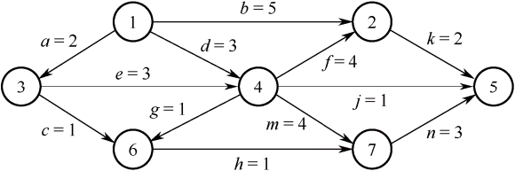

# 数据结构强化题型

## 线性表

<question>

1\. (2010) 设将n(n>1)个整数存放到一维数组R中。试设计一个在时间和空间两方面都尽可能高效的算法。将R中保存的序列循环左移p(0<p<n)个位置，即将R中的数据由(X0,X1,···,Xn-1)变换为(Xp,Xp+1,···,Xn-1,X0,X1,···,Xp-1)。要求：
1) 给出算法的基本设计思想。
2) 根据设计思想，采用 C、C++或Java语言描述算法，关键之处给出注释。
3) 说明你所设计算法的时间复杂度和空间复杂度。

2\. (2011) 一个长度为L(L≥1)的升序序列S，处在第⌈L/2⌉个位置的数称为S的中位数。例如，若序列S1=(11,13,15,17,19)，则S1的中位数是15。两个序列的中位数是含它们所有元素的升序序列的中位数。例如，若S2=(2,4,6,8,20)，则S1和S2的中位数是11。现有两个等长升序序列A和B，试设计一个在时间和空间两方面都尽可能高效的算法，找出两个序列A和B的中位数。要求：
1) 给出算法的基本设计思想。
2) 根据设计思想，采用C、C++或Java语言描述算法，关键之处给出注释。
3) 说明你所设计算法的时间复杂度和空间复杂度。

3\. (2013) 已知一个整数序列A=(a0,a1,···,an-1)，其中0≤ai&lt;n(0≤ix&lt;n)。若存在ap1=ap2=···= apm=x且m>n/2(0≤pk&lt;n, 1≤k≤m)，则称x为A的主元素。例如A=(0,5,5,3,5,7,5,5)，则5为主元素；又如A=(0,5,5,3,5,1,5,7)，则A中没有主元素。假设A中的n个元素保存在一个一维数组中，请设计一个尽可能高效的算法，找出A的主元素。若存在主元素，则输出该元素；否则输出-1。要求：

1) 给出算法的基本设计思想。
2) 根据设计思想，采用C或C++或Java语言描述算法，关键之处给出注释。
3) 说明你所设计算法的时间复杂度和空间复杂度。

4\. (2018) 给定一个含n(n≥1)个整数的数组，请设计一个在时间上尽可能高效的算法，找出数组中未出现的最小正整数。例如，数组{-5,3,2,3}中未出现的最小正整数是1；数组{1,2,3}中未出现的最小正整数是4。要求：
1) 给出算法的基本设计思想。
2) 根据设计思想，采用C或C++语言描述算法，关键之处给出注释。
3) 说明你所设计算法的时间复杂度和空间复杂度。

5\. (2020) 定义三元组(a,b,c)（其中a,b,c均为整数）的距离D=|a-b|+|b-c|+|c-a|。给定3个非空整数集合S1、S2和S3，按升序分别存储在3个数组中。请设计一个尽可能高效的算法，计算并输出所有可能的三元组(a,b,c)（a∈Si,b∈ S2,c∈Ss）中的最小距离。例如：S1={-1,0,9},S2={-25,-10,10,11},S3={2,9,17,30,41}，则最小距离为2，相应的三元组为(9,10,9)。要求：
1) 给出算法的基本设计思想。
2) 根据设计思想，采用C或C++语言描述算法，关键之处给出注释。
3) 明你所设计算法的时间复杂度和空间复杂度。

6\. (2025) 设有两个长度均为n的一维整型数组A和res，对数组A中的每个元素A[i]，计算 A[i]与A[j] (0≤i≤j≤n-1) 乘积的最大值，并将其保存到res[i]中。例如，若A[]={1,4,-9,6}，则得到res[]={6,24,81,36}。现给定数组A，请设计一个时间和空间上尽可能高效的算法calMulMax，求res中各元素的值。 
函数原型为：void calMulMax(int A[], int res[], int n)。要求如下：
1) 给出算法的基本设计思想。(2000)
2) 根据设计思想，采用C或C++语言描述算法，关键之处给出注释。(2000)
3) 说明你所设计算法的时间复杂度和空间复杂度。(2000)

7\. (2009) 已知一个带有表头结点的单链表，结点结构为：。假设该链表只给出了头指针list。在不改变链表的前提下，请设计一个尽可能高效的算法，查找链表中倒数第k个位置上的结点（k为正整数）。若查找成功，算法输出该结点的data域的值，并返回1；否则，只返回0。要求：
1) 描述算法的基本设计思想。
2) 描述算法的详细实现步骤。
3) 根据设计思想和实现步骤，采用程序设计语言描述算法（使用C、C++或Java 语言实现），关键之处请给出简要注释。

8\. (2012) 假定采用带头结点的单链表保存单词，当两个单词有相同的后缀时，则可共享相同的后缀存储空间，例如，“loading”和“being”的存储映像如下图所示。

设str1和str2分别指向两个单词所在单链表的头结点，链表结点结构为，请设计一个时间上尽可能高效的算法，找出由str1和str2所指向两个链表共同后缀的起始位置（如图中字符i所在结点的位置p）。要求：
1) 给出算法的基本设计思想。
2) 根据设计思想，采用C或C++或Java语言描述算法，关键之处给出注释。
3) 说明你所设计算法的时间复杂度和空间复杂度。

9\. (2015) 用单链表保存m个整数，结点的结构为，且|data|&lt;n（n为正整数）。现要求设计一个时间复杂度尽可能高效的算法，对于链表中data的绝对值相等的结点，仅保留第一次出现的结点而删除其余绝对值相等的结点。例如，若给定的单链表HEAD如下：

则删除结点后的HEAD为

要求：
1) 给出算法的基本设计思想。
2) 使用C或C++语言，给出单链表结点的数据类型定义。
3) 根据设计思想，采用C或C++语言描述算法，关键之处给出注释。
4) 说明你所设计算法的时间复杂度和空间复杂度。

10\. (2019) 设线性表L=(a1,a2,a3,···,an-2,an-1,an)采用带头结点的单链表保存，链表中的结点定义如下：
<pre>
  typedef struct node {
    int data;
    struct node *next;
  }NODE;
</pre>
请设计一个空间复杂度为O(1)且时间上尽可能高效的算法，重新排列L中的各结点，得到线性表L'=(a1,an,a2,an-1,,a3,n-2,···)。要求：
1) 给出算法的基本设计思想。
2) 根据设计思想，采用C或C++语言描述算法，关键之处给出注释。
3) 说明你所设计算法的时间复杂度。

11\. (2019) 请设计一个队列，要求满足：①初始时队列为空；②入队时，充许增加队列占用空间；③出队后，出队元素所占用的空间可重复使用，即整个队列所占用的空间只增不减；④人队操作和出队操作的时间复杂度始终保持为O(1)。请回答下列问题：
1) 该队列应选择链式存储结构，还是应选择顺序存储结构？
2) 画出队列的初始状态，并给出判断队空和队满的条件。
3) 画出第一个元素人队后的队列状态。
4) 给出人队操作和出队操作的基本过程。

</question>

## 树

<question>

1\. (2016) 如果一棵非空k(k≥2)叉树T中每个非叶结点都有k个孩子，则称T为正则k叉树。请回答下列问题并给出推导过程
1) 若T有m个非叶结点，则T中的叶结点有多少个？
2) 若T的高度为h（单结点的树h=1），则T的结点数最多为多少个？最少为多少个？

2\. (2014) 二叉树的带权路径长度(WPL)是二叉树中所有叶结点的带权路径长度之和。给定一棵二叉树T，采用二叉链表存储，其结点结构为：

其中叶结点的weight域保存该结点的非负权值。设root为指向T的根结点的指针，请设计求T的WPL的算法，要求：

1) 给出算法的基本设计思想。
2) 使用C或C++语言，给出二叉树结点的数据类型定义。
3) 根据设计思想，采用C或C++语言描述算法，关键之处给出注释。

3\. (2017) 请设计一个算法，将给定的表达式树（二叉树）转换为等价的中缀表达式（通过括号反映操作符的计算次序）并输出。例如，当下列两棵表达式树作为算法的输入时，输出的等价中缀表达式分别为(a+b)\*(c\*(-d))和(a*b)+(-(c-d))。

二叉树结点定义如下：
<pre>
  typedef struct node {
    char data[10];              // 存储操作数或操作符
    struct node *left, *right;
  } BTree;
</pre>

要求：
1) 给出算法的基本设计思想。
2) 根据设计思想，采用C或C++语言描述算法，关键之处给出注释。

4\. (2022) 已知非空二叉树T的结点值均为正整数，采用顺序存储方式保存，数据结构定义如下：
<pre>
  typedef struct {            // MAX_SIZE为已定义常量
    int SqBiTNode[MAX_SIZE];  // 保存二叉树结点值的数组
    int ElemNum;              // 实际占用的数组元素个数
  }SqBiTree;
</pre>
T中不存在的结点在数组SqBiTNode中用-1表示。例如，对于下图所示的两棵非空二叉树T1和T2，

T1存储结果如下：

T2存储结果如下：

请设计一个尽可能高效的算法，判定一棵采用这种方式存储的二叉树是否为二叉搜索树，若是，则返回true，否则，返回false。要求：

1) 给出算法的基本设计思想。
2) 根据设计思想，采用C或C++语言描述算法，关键之处给出注释。

5\. (2012) 设有6个有序表A、B、C、D、E、F，分别含有10、35、40、50、60和200个数据元素，各表中元素按升序排列。要求通过5次两两合并，将6个表最终合并成一个升序表，并在最坏情况下比较的总次数达到最小。请回答下列问题。
1) 给出完整的合并过程，并求出最坏情况下比较的总次数。
2) 根据你的合并过程，描述n(n≥2)个不等长升序表的合并策略，并说明理由。

6\. (2020) 若任意一个字符的编码都不是其他字符的前缀，则称这种编码具有前缀特性。现有某字符集（字符个数≥2）的不等长编码，每个字符的编码均为二进制的0、1序列，最长为L位，且具有前缀特性。请回答下列问题：
1) 哪种数据结构适宜保存上述具有前缀特性的不等长编码？
2) 基于你所设计的数据结构，简述从0/1串到字符串的译码过程。
3) 简述判定某字符集的不等长编码是否具有前缀特性的过程。

</question>

## 图

<question>

1\. (2015) 已知含有5个顶点的图G如下图所示。

请回答下列问题：
1) 写出图G的邻接矩阵A（行、列下标从0开始）。
2) 求A²，矩阵A²中位于0行3列元素值的含义是什么？
3) 若已知具有n(n≥2)个顶点的图的邻接矩阵为B，则Bᵐ (2≤m≤n)中非零元素的含义是什么？

2\. (2021) 已知无向连通图G由顶点集V和边集E组成，|E|>0，当G中度为奇数的顶点个数为不大于2的偶数时，G存在包含所有边且长度为|EI的路径（称为EL路径）。设图G采用邻接矩阵存储，类型定义如下：
<pre>
  typedef struct {             // 图的定义
    int numVertices, numEdges；// 图中实际的顶点数和边数
    char VerticesList[MAXV]；  // 顶点表。MAxV为已定义常量
    int Edge[MAXV][MAXV];      // 邻接矩阵
  } MGraph;
</pre>
请设计算法：int IsExistEL(MGraph G)，判断G是否存在EL路径，若存在，则返回1，否则返回0。要求：
1) 给出算法的基本设计思想。
2) 根据设计思想，采用C或C++语言描述算法，关键之处给出注释。
3) 明你所设计算法的时间复杂度和空间复杂度。

3\. (2023) 已知有向图G采用邻接矩阵存储，类型定义如下：
<pre>
  typedef struct {             // 图的定义
    int numVertices, numEdges；// 图中实际的顶点数和边数
    char VerticesList[MAXV]；  // 顶点表。MAxV为已定义常量
    int Edge[MAXV][MAXV];      // 邻接矩阵
  } MGraph;
</pre>

将图中出度大于入度的顶点称为K顶点。例如：在右图中，顶点a和顶点b都是K顶点。请设计算法：int printVertices(MGraph G)，
对给定的任意非空有向图G，输出图G中所有的K顶点，并返回K顶点的个数。要求：
1) 给出算法的基本设计思想。
2) 根据设计思想，采用C或C++语言描述算法，关键之处给出注释。

4\. (2009) 带权图（权值非负，表示边连接的两顶点间的距离）的最短路径问题是找出从初始顶点到目标顶点之间的一条最短路径。假设从初始顶点到目标顶点之间存在路径，现有一种解决该问题的方法： 
①设最短路径初始时仅包含初始顶点，令当前顶点u为初始顶点； 
②选择离u最近且尚未在最短路径中的一个顶点v，加入最短路径中，修改当前顶点u=v； 
③重复步骤②，直到u是目标顶点时为止。 
请问上述方法能否求得最短路径？若该方法可行，请证明之；否则，请举例说明。

5\. (2011) 已知有6个顶点（顶点编号为0~5）的有向带权图G，其邻接矩阵A为上三角矩阵，按行为主序（行优先）保存在如下的一维数组中。

要求：
1) 写出图G的邻接矩阵A。
2) 画出有向带权图G。
3) 求图G的关键路径，并计算该关键路径的长度。

6\. (2014) 某网络中的路由器运行OSPF路由协议，题42表是路由器R1维护的主要链路状态信息(LSI)，题42图是根据题42表及R1的接口名构造出来的网络拓扑。

请回答下列问题。

1) 本题中的网络可抽象为数据结构中的哪种逻辑结构？
2) 针对题42表中的内容，设计合理的链式存储结构，以保存题42表中的链路状态信息(LSI)。要求给出链式存储结构的数据类型定义，并画出对应题42表的链式存储结构示意图（示意图中可仅以ID标识结点）。
3) 按照迪杰斯特拉(Dijkstra)算法的策略，依次给出R1到达题42图中子网192.1.X.X的最短路径及费用。

7\. (2017) 使用Prim（普里姆）算法求带权连通图的最小（代价）生成树(MST)。请回答下列问题。

1) 对下列图G，从顶点A开始求G的MST，依次给出按算法选出的边。
2) 图G的MST是唯一的吗？
3) 对任意的带权连通图，满足什么条件时，其MST是唯一的？

8\. (2018) 拟建设一个光通信骨干网络连通BJ，CS，XA，QD，JN，NJ，TL和WH等8个城市，下图中无向边上的权值表示两个城市之间备选光缆的铺设费用。

请回答下列问题：
1) 仅从铺设费用角度出发，给出所有可能的最经济的光缆铺设方案（用带权图表示），并计算相应方案的总费用。
2) 该图可采用图的哪种存储结构？给出求解问题(1)所用的算法名称。
3) 假设每个城市采用一个路由器按(1)中得到的最经济方案组网，主机H1直接连接在TL的路由器上，主机H2直接连接在BJ的路由器上。若H1向H2发送一个TTL=5的IP分组，则H2是否可以收到该IP分组？

9\. (2024) 2023年10月26日，神舟十七号载人飞船发射取得圆满成功，再次彰显了中国航天事业的辉煌成就。载人航天工程是包含众多子工程的复杂系统工程，为了保证工程的有序开展，需要明确各子工程的前导子工程，以协调各子工程的实施。该问题可以简化、抽象为有向图的拓扑序列问题。已知有向图G采用邻接矩阵存储，类型定义如下：
<pre>
  typedef struct {             // 图的定义
    int numVertices, numEdges；// 图中实际的顶点数和边数
    char VerticesList[MAXV]；  // 顶点表。MAxV为已定义常量
    int Edge[MAXV][MAXV];      // 邻接矩阵
  } MGraph;
</pre>
请设计算法：int uniquely(MGraph G)，判定G是否存在唯一的拓扑序列，若是则返回1，否则返回0。要求如下：
1) 给出算法的基本设计思想。(4分)
2) 根据设计思想，采用C或C++语言描述算法，关键之处给出注释。(9分)

10\. (2025) 某工程包含12个活动，使用下图所示的AOE网描述，图中各边上标注了活动及全系列其持续时间。

请回答下列问题（活动均用活动名表示）
1) 完成该工程的最短时间是多少？哪些活动是关键活动？(3分)
2) 若以最短时间完成工程，则与活动e同时进行的活动可能有哪些？(3分)
3) 时间余量最大的活动是哪个？其时间余量是多少？(2分)
4) 假设工程从时刻0启动，因某种原因，活动b在时刻6开始。为了保证工程不延期，在其他活动持续时间均不变的情况下，b的持续时间最多是多少？若不改变b的持续时间，则压缩哪个活动的持续时间也能保证工程不延期？(2分)

</question>

## 查找

<question>

1\. (2013) 设包含4个数据元素的集合S={“do”，“for”，“repeat”，“while”}，各元素的查找概率依次为p1=0.35,P2=0.15,P3=0.15,P4=0.35。将S保存在一个长度为4的顺序表中，采用折半查找法，查找成功时的平均查找长度为2.2。请回答下列问题：
1) 若采用顺序存储结构保存S，且要求平均查找长度更短，则元素应如何排列？应使用何种查找方法？查找成功时的平均查找长度是多少？
2) 若采用链式存储结构保存S，且要求平均查找长度更短，则元素应如何排列？应使用何种查找方法？查找成功时的平均查找长度是多少？

2\. (2010) 将关键字序列(7, 8, 30, 11, 18, 9, 14)散列存储到散列表中。散列表的存储空间是一个下标从0开始的一维数组，散列函数为H(key)=(key×3)%7，处理冲突采用线性探测再散列法，要求装填（载）因子为0.7。
1) 请画出所构造的散列表。
2) 分别计算等概率情况下查找成功和查找不成功的平均查找长度。

3\. (2023) 将关键字序列20,3,11,18,9,14,7依次存储到初始为空、长度为11的散列表HT中，散列函数为H(key)=(keyx3)%11，H(key)计算出的初始散列地址为H0，发生冲突时探查地址序列是H1,H2,H3,···，其中，Hk=(H0+k2)%11, k=1,2,3,···。
请回答下列问题：
1) 画出所构造的HT，并计算HT的装填因子。
2) 给出在HT中查找关键字14的关键字比较序列。
3) 在HT中查找关键字8，确认查找失败时的散列地址是多少？

</question>

## 排序

<question>

1\. (2021) 已知某排序算法如下：
<pre>
  void cmpCountSort(int a[], int b[], int n) {
    int i,j,*count;
    count = (int*)malloc(sizeof(int)*n);
    for(i=0; i&lt;n; i++) count[i] = 0;
      for(i=0; i&lt;n-1; i++)
        for(j=i+1; j&lt;n; j++)
          if(a[i]&lt;a[j]) count[j]++;
          else count[i]++;
    for(i=0; i&lt;n; i++) b[count[i]]=a[i];
    free(count);
  }
</pre>
请回答下列问题：
1) 若有int a[]={25,-10,25,10,11,19},b[6]; 则调用cmpCountSort(a,b,6) 后数组b中的内容是什么？
2) 若a中含有n个元素，则算法执行过程中，元素之间的比较次数是多少？
3) 该算法是稳定的吗？若是，则阐述理由；否则，修改为稳定排序算法。

2\. (2022) 现有n(n>100000)个数保存在一维数组M中，需要查找M中最小的10个数。请回答下列问题：
1) 设计一个完成上述查找任务的算法，要求平均情况下的比较次数尽可能少，简述其算法思想（不需要程序实现）。
2) 说明你所设计的算法平均情况下的时间复杂度和空间复杂度。

3\. (2023) 对含有n(n>0)个记录的文件进行外部排序，采用置换-选择排序生成初始归并段时需要使用一个工作区，工作区中能保存m个记录，请回答下列问题：
1) 若文件中有19个记录，其关键字依次是51, 94, 37, 92, 14, 63, 15, 99, 48, 56, 23, 60, 31, 17, 43, 8, 90, 166, 100。当m=4时，可生成儿个初始归并段？每个归并段各是什么？
2) 对任意m(n>>m>0)，生成的第一个初始归并段的长度最大值和最小值分别是多少？

</question>
