# 数据结构

## 第一章 绪论

1. 常见概念

- 数据：输入的所有内容
- 数据元素：数据的基本单位，一条记录
- 数据项：单条记录中的每个项目

2. 时间复杂度

```c
// O(logn)                        // O(m+n) 或 O(max(m,n))
for (int i=0; i<=n; i*=2)         for (int i=0; i<=m; i++)
    k++;                              k++;
                                  for (int i=0; i<=n; i++)
                                      k++;
```

```c
// O(n^2)                         //O(√n)
for (int i=0; i<n; i++)           while (i*i<n)
    for (int j=0; j<i; j++)           i++;
        k++;
// 频次 n(n+1)/2
```

3. 空间复杂度（只考虑额外开辟的辅助空间）

```c
// O(1)                               // O(n)
void BubbleSort(int A[],int n) {      int Func(int n) {
    for (int i=0;i<n-1;i++) {             if (n == 0) return 1;
        bool flag=false;                  return Func(n-1) * n;
        for(int j=n-1;j>i;j--)        }
            ...                       // 递归栈空间消耗
```

```c
// O(n)
int Fib(int n) {
    if(n < 3) return 1;
	return Fib(n-1) * Fib(n-2);
}
// 递归栈可以重复利用
```

## 第二章 线性表

1. 顺序表

- 插入：平均移动次数为<mark>$\frac{n}{2}$</mark>，时间复杂度为 $O(n)$.
- 删除：平均移动次数为<mark>$\frac{n-1}{2}$</mark>，时间复杂度为 $O(n)$.
- 查找：支持<mark>随机存取</mark>，复杂度为 $O(1)$.

> 插入删除第 $i$ 个元素时，要移动 $n-i$ 个元素。

2. 链表

| 数据结构           | 头插   | 头删   | 尾插   | 尾删   | 中间位置插入 | 中间位置删除 |
| ------------------ | ------ | ------ | ------ | ------ | ------------ | ------------ |
| （带头）单/双链表  | $O(1)$ | $O(1)$ | $O(n)$ | $O(n)$ | $O(n)$       | $O(n)$       |
| （带头）循环单链表 | $O(n)$ | $O(n)$ | $O(n)$ | $O(n)$ | $O(n)$       | $O(n)$       |
| （带头）循环双链表 | $O(1)$ | $O(1)$ | $O(1)$ | $O(1)$ | $O(n)$       | $O(n)$       |

## 第三章 栈、队列和矩阵

### 栈

$n$ 个元素进栈时，出栈排列个数为 $\frac{1}{n+1}C^{n}_{2n}$（卡特兰数）。

| 栈操作 | 初始Top=-1 | 初始Top=0  |
| ------ | ---------- | ---------- |
| 入栈   | a[++top]=x | a[top++]=x |
| 出栈   | a[top--]=x | a[--top]=x |
| 读栈   | a[top]     | a[top-1]   |
| 个数   | top+1      | top        |
| 判空   | top==-1    | top==-1    |

[括号匹配](https://leetcode.cn/problems/valid-parentheses/solutions/3897597/ji-jian-gua-hao-pi-pei-wen-ti-by-yyx_dev-nrgt/)

[中缀转后缀、后缀表达式求值](https://leetcode.cn/problems/evaluate-reverse-polish-notation/solutions/3897777/zhong-zhui-zhuan-hou-zhui-hou-zhui-biao-0wu9h/)

### 队列

| 循环队列 | 操作（Maxsize表示空间容量/数组大小） |
| -------- | ------------------------------------ |
| 入队     | $(rear+1)\%MaxSize$                  |
| 出队     | $(front+1)\%MaxSize$                 |
| 判空     | $front==rear$                        |
| 判满     | $front==(rear+1)\%MaxSize$           |
| 个数     | $(rear-front+MaxSize)\%MaxSize$      |

<center>
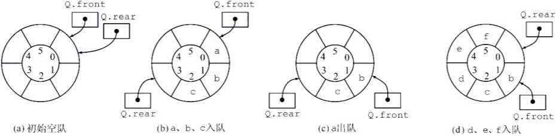
</center>

### 矩阵

1. 数组

::: tip
`a[1...n]`和`a[1:n]`都表示下标从1到n，共n个元素。
:::

设二维数组有n行m列（每行m个元素、每列n个元素）：

- 若按行优先存放，则 $a[i][j]$ 的地址为 $a + (i*m + j)*L$.
- 若按列优先存放，则 $a[i][j]$ 的地址为 $a + (j*n + i)*L$.

> $a_{ij}$ 压缩存储在数组 B[k] 中，i j 和 k 的关系。

<center>
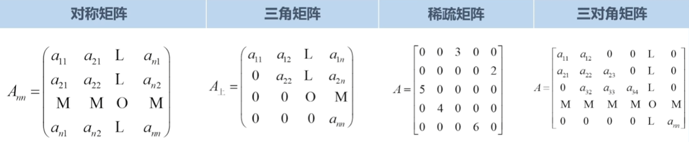
</center>

2. 对阵矩阵 / 三角矩阵

| 存储方式       | 对应法则                                   |
| -------------- | ------------------------------------------ |
| 下三角按行存储 | $k=(1+2+...+i-1)+j-1=\frac{i(i-1)}{2}+j-1$ |
| 上三角按列存储 | $k=(1+2+...+j-1)+i-1=\frac{j(j-1)}{2}+i-1$ |

三角矩阵最后一个元素放另一半三角的常数。

3. 稀疏矩阵

三元组存储行下标、列下表和元素值，**下标从0开始**，始终按**第一列升序排序**。

<center>
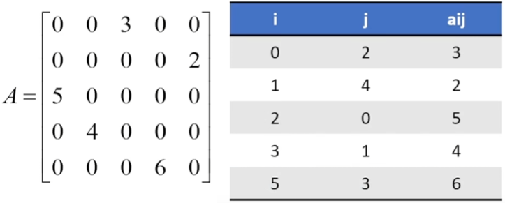
</center>

4. 三对角矩阵

按行压缩，下标对应关系 $k=2\times1+3\times(i-2)+0或1$ 。

> 第一行和末尾行只有2个，中间行都是3个元素。

## 第四章 串

<center>
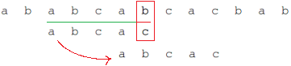
</center>

1. PM：从开头到当前位置的子串，其最长公共前后缀的长度。

<center>
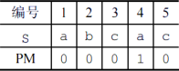
</center>

2. next：

- 法一：PM数组整体右移一位，开头补$-1$，再整体加 $1$ 。
- 法二：失配位置前的子串，其最大公共前后缀的长度再加 $1$ 。

> 默认下标从1开始，若从0开始，则不用整体加一。

<center>
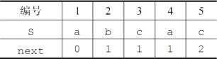
</center>

3. nextval：

- 第一位是 $0$
- 其他位根据 next，找到对应的元素，相同则取其 nextval，不同取自身 next。

## 第五章 树

##### 树的性质

- $结点总数=总度数+1=分支数+1$
- $树的度为k，结点数为n，则树的最大高度为\bbox[yellow]{n-k+1}$

##### 二叉树的性质

- $二叉树第i层结点数最多为\bbox[yellow]{2^{i-1}}，结点总数最多为\bbox[yellow]{2^h-1}$
- $任意二叉树中，\bbox[yellow]{n_0=n_2+1}$
- $完全二叉树中，\bbox[yellow]{n_1=0或1}。n为偶数则n_1=1，n为奇数则n_1=0$
- $完全二叉树中，2^{h-1}-1<n≤2^{h}-1，即\bbox[yellow]{h=\lceil log_2(n+1) \rceil} 或 \bbox[yellow]{\lfloor log_2n\rfloor + 1}$
- $不管以任何方式遍历二叉树，\bbox[yellow]{叶结点的相对顺序不变}$

##### 树、森林转二叉树（左孩子，右兄弟）

- 左叉连最左侧的子结点
- 最左子结点右叉连右侧所有子结点

<center>
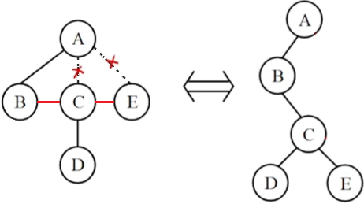
</center>

- 森林中每棵树先转，第一树右叉连右侧所有树

<center>
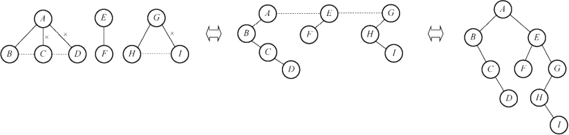
</center>

##### 树、森林的遍历

- $树和森林的先序遍历=二叉树的先序遍历$
- $树和森林的\bbox[yellow]{后}序遍历=二叉树的\bbox[yellow]{中}序遍历$

##### 线索二叉树

> 线索用来指向遍历序列中前驱和后继，故分为先/中/后序线索二叉树。

方法：

- 将所有结点的空指针利用起来，
- 空左指针指向前驱，并置ltag为1，空右指针指向后继，并置rtag为1。

<center>
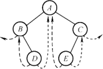
</center>

性质：

- 中序线索二叉树可以直接遍历
- **先序**线索二叉树**不支持直接找前驱**
- **后序**线索二叉树**不支持直接找后继**，需借助栈保存父结点信息

##### 哈夫曼树

- 结点的带权路径长度：结点权重 * 结点到根的路径长度
- 树的<mark>带权路径长度</mark>：所有叶节点的带权路径长度之和
- 树的<mark>带权平均长度</mark>：带权路径长度 / 权重之和

构建：

- 找到权值最小的两个结点，组合成树，根的权值为两结点权值之和（只看根节点）
- 将树放入集合中，重复上述步骤

<center>
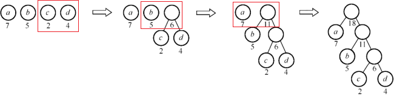
</center>

性质：

- 哈夫曼树的带权路径长度 WPL 最小
- 共 $n$ 个结点，构造过程中新建了 $n-1$ 个结点，最终哈夫曼树共 $2n-1$ 个结点
- 哈夫曼树只有度为 $0$ 和 $1$ 的结点，即 $n=n_0+n_2$
- 权值越小的结点离根越远

##### 哈夫曼编码

> 结点权值仅用于构建哈夫曼树，编码过程不涉及权值。

- 从根向下设左分支为0，右分支为1
- 从根到叶的路径编码，即该叶的编码

<center>
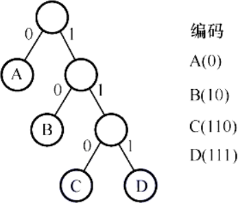
</center>

## 第六章 图

::: details 并查集

- 并查集本质是一个森林，逻辑上用树表示集合，物理上用数组存储。
- 并查集使用双亲表示法，数组保存数据，下标定位结点。
- 一般节点保存父结点的下标，父结点保存**负**的结点数（故负数表示根）。最开始每个元素都是一个独立的集合，所以节点值都为-1。

1. 集合的合并：合并两数所在集合，将小集合合并到大集合中。即小集合根作大集合根的子结点。
2. 查找两数是否在一个集合

:::

### 基本概念

::: details 了解概念

- 顶点集合不可为空，边集可为空。
- 无向图中边记作$(V_i，V_j)$，有向图中记作$<V_i,V_j>$称弧，以及弧头弧尾。
- 一条边的两个顶点互为邻接点。
- $若有G=(V,E), \bbox[yellow]{G'=(V',E')}且V'∈V,E'∈E，则G'为G的子图。$
- 称$V_i$到$V_j$所经序列为路径，路径长度即边的条数。
- 无重复结点的路径叫简单路径，首尾相同的路径叫回路或环。

:::

| 重要概念       | 含义                                                         |
| -------------- | ------------------------------------------------------------ |
| 有向图、无向图 | 有向图边有方向，无向图边无方向                               |
| 完全图         | 所有顶点相邻接。无向完全图有<mark>$\frac{n(n-1)}{2}$</mark>个边，有向完全图有<mark>$n(n-1)$</mark>个边 |
| 顶点的度       | 顶点连接的边数。有向图度数=入度+出度，<mark>$总度数/2=边数$</mark> |
| 连通图         | 无向图中，两点有路径称两点连通，若所有顶点均连通，称该图为连通图 |
| 连通分量       | 无向图中的极大连通子图                                       |
| 强连通图       | 有向图中，任意顶点间均有两个方向的路径，称该图为强连通图     |
| 强连通分量     | 有向图中的极大连通子图                                       |
| 生成树         | 连通图的极小连通子图（用最少的边连接所有顶点）               |
| 最小生成树     | 所有生成树中，边权值之和最小的树，称最小生成树               |

> [!IMPORTANT]
>
> - 子图必须要求$G'=(V',E')$，<u>因为$V'$和$E'$不一定能组合成图</u>。
> - 树是特殊的图，当图为连通图且无回路，则该图可视为树。
> - 完全图是特殊的连通图。

### 存储结构

- 邻接矩阵：本质二维数组，$edges[a][b]=1$表示$a$到$b$有边，$edges[b][a]=1$表示$b$到$a$有边。
- 邻接表：本质单链表数组，$edges[a]$链接了顶点$a$的所有边。

<center>

</center>

| 对比方面     | 邻接矩阵                                                     | 邻接表                                                       |
| ------------ | ------------------------------------------------------------ | ------------------------------------------------------------ |
| 存储空间大小 | 和顶点数有关                                                 | 和顶点数、边数有关                                           |
| 数据特点     | 无向图的邻接矩阵是对称的                                     | 无向图的邻接表比有向图的大一倍                               |
| 适用性       | 适合稠密图                                                   | 适合稀疏图                                                   |
| 唯一性       | 唯一                                                         | 不唯一                                                       |
| 度的计算     | 无向图的度遍历一行 $O(n)$，<br/>出度看行 $O(n)$、入度看列 $O(n)$ | 无向图度遍历链表 $O(n)$，<br/>出度遍历链表 $O(n)$、入度遍历邻接表 $O(E)$ |
| 边的判断     | 直接访问 $O(1)$                                              | 遍历链表 $O(n)$                                              |

- 十字链表（仅用于有向图）

> 本质是两个单链表数组，第一个是入边链表，保存该点所有入边，第二个出边链表，保存该点所有出边。按下标顺序链接并对齐，便于参照邻接矩阵。

<center>

</center>

- 邻接多重表（仅用于无向图）

> 和邻接表的区别是加强了边的保存内容，边结构体本质是两个链表组合在一起，点1及其next指针和点2及其next指针。通过自己的next指针可以找到自己的下一条边。

<center>
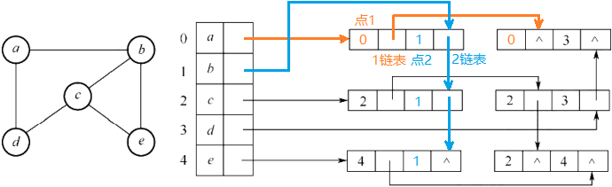
</center>

### 图的遍历

1. 深度优先遍历

- 从某个顶点开始，进行访问
- 多路依次递归所有未被访问的邻接点

2. 广度优先遍历

- 从某个顶点开始，将其入队
- 在队列不为空的前提下循环，取出队头进行访问
- 将队头的所有未被访问的邻接点入队

| 遍历算法             | 存储结构 | 时间复杂度            | 空间复杂度 |
| -------------------- | -------- | --------------------- | ---------- |
| DFS / BFS / 拓扑排序 | 邻接矩阵 | <mark>$O(n^2)$</mark> | $O(n)$     |
| DFS / BFS / 拓扑排序 | 邻接表   | <mark>$O(n+e)$</mark> | $O(n)$     |

- 深度遍历可以判断<u>有向图和无向图</u>是否有环
- 广度遍历仅可判断<u>无向图</u>是否有环

### 图的应用

#### 最小生成树

::: info 性质

- $n$ 个顶点的连通图的生成树有 $n$ 个点和 $n-1$ 条边。
- 生成树是边最少的连通图，一个连通图可以有多个生成树。
- 若存在权值相同的边，则最小生成树**可能**不唯一；若最小生成树不唯一，则一定存在权值相同的边。
- 最小生成树的边权值之和是所有生成树中最小的。

:::

1. Kruskal算法（与点数无关，适合稀疏图）

- 每次都找最小权值的边，
- 检查是否构成回路（使用并查集，若两点在同一个集合，则将构成回路），
- 若构成回路则放弃该边，重新选择

> 逻辑：先放入n个顶点，排序所有边，按序选择权值最小边，并确保无环出现。

2. Prim算法（与边数无关，适合稠密图）

- 首次选择全局最小边，
- 之后都选择与已有边相邻的权值最小边

> 逻辑：每次都找一个已选点和一个未选点，所构成的权值最小边，故天然避开回路。

#### 最短路径

1. Dijkstra算法（单源最短路径）

<center>
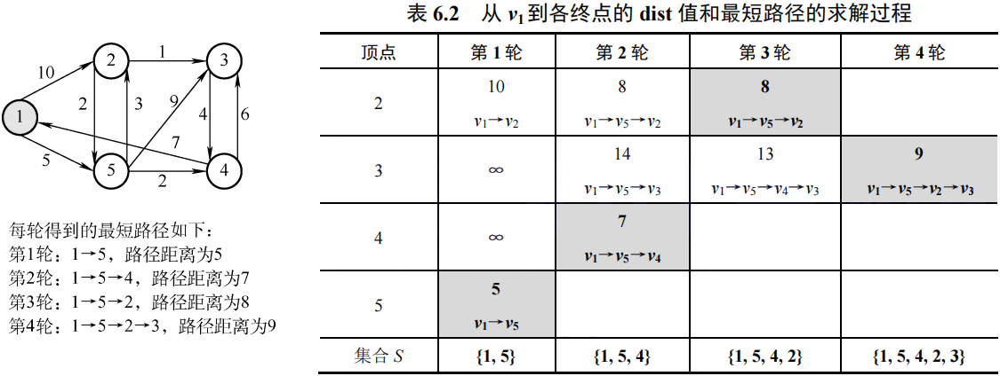
</center>

- 除源点外共四个点，故画四行四列的表格
- 第一轮找出源点到其他点的距离，选出最短路径
- 第二轮按**上一轮的最短路径**，算到其他点的最短路径，更小则更新，不小则照抄。

2. Floyd算法（多源最短路径）

- 求点$V_i$到$V_j$的最短路径，就暴力枚举所有可能路径：
- $V_1-V_n、V_1-V_2-V_n、V_1-V_2-...-V_n$（包含所有可能顶点）

<center>
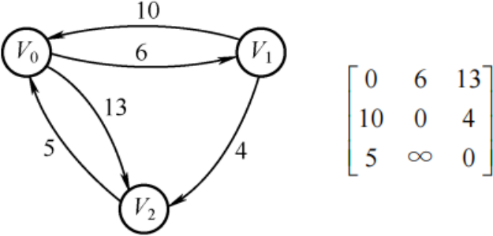
</center>

| 对比         | Dijkstra算法        | Floyd算法              | BFS算法        |
| ------------ | ------------------- | ---------------------- | -------------- |
| 用途         | 求单源最短路径      | 求各顶点之间的最短路径 | 求单源最短路径 |
| 无权图       | 适用                | 适用                   | 适用           |
| 带权图       | 适用                | 适用                   |                |
| 带负权值的图 | <mark>不适用</mark> | 适用                   |                |
| 时间复杂度   | $O(n^2)$            | $O(n^3)$               |                |

#### 描述表达式

用**有向无环图**描述表达式，不可出现重复操作数顶点。

<center>
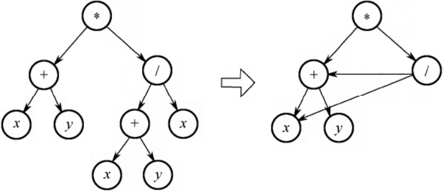
</center>

#### 拓扑排序

- 拓扑排序必须要求**有向无环图**，因此可以检测图是否有环。
- 如$V_i$到$V_j$有路径，则$V_i$一定在$V_j$的前面。

<center>
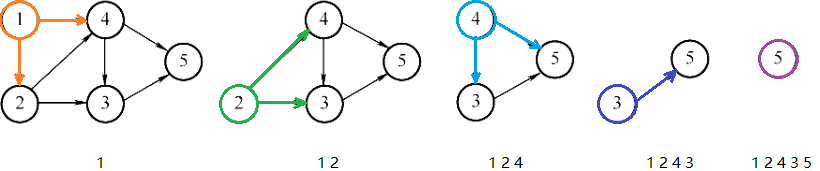
</center>

循环找到一个入度为0的点，输出并删除该点及其出边。同时存在多个入度为0的点时，对其输出顺序无要求，因此拓扑序列可能不唯一。

#### 关键路径

::: details 概念

- AOE网即边活动网，边表示活动，点称事件表示活动始末状态。
- AOE网是**有向无环图**，活动存在先后关系。
- ve：事件最早开始时间、vl：事件最晚开始时间、e：活动最早开始时间、l：活动最晚开始时间。

:::

关键路径是耗时最多的路径（不唯一）。最早开始时间=最晚开始时间的活动为关键活动，所构成路径即关键路径。

::: tip 性质

- 关键路径并不唯一，关键路径是权值之和最大的那条路径。
- 增加关键路径上的任意活动的持续时间，一定会延长工期。
- 减少关键路径上的任意活动的持续时间，不一定会缩短工期。
- 若只有一条关键路径，则一定会缩短工期。若有多条关键路径，则另外的关键路径仍在支撑工期长度。

:::

<center>
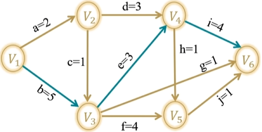
</center>


1. 求事件最早开始时间 $ve$

- 先将所有事件的 $ve$ 设为0
- 从源点开始，拓扑序找入度为0的点，更新所有出边的邻接点的 $ve$（更新成最大值）

2. 求事件最晚开始时间 $vl$

- 先将所有事件的 $vl$ 设为整个工程的 $ve$
- 从汇点开始，逆拓扑序找出度为0的点，更新所有入边的邻接点的 $vl$（更新成最小值）

> $ve$ 要最大保证前面的活干完，$vl$ 要最小保证后面的活干完。

3. 求活动最早开始时间 $e$：出发点的最早开始时间 $ve$

4. 求活动最晚开始时间 $l$：指向点的最晚开始时间 $vl-活动耗时$

<center>
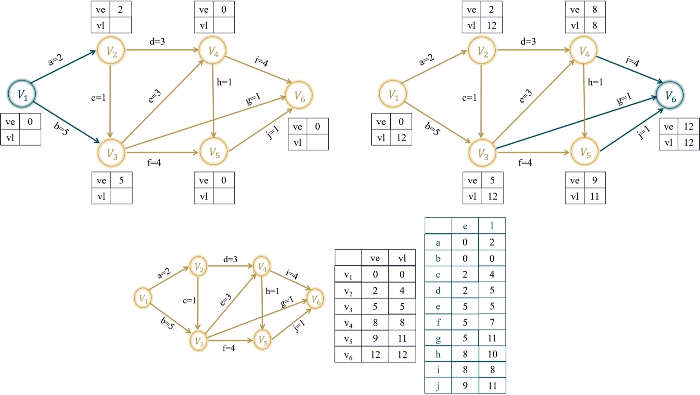
</center>

## 第七章 查找

### 线性查找

- 哨兵位：在序列开头放入待查找元素，从后往前遍历查找的过程中不必判断循环越界。
- 平均查找长度ASL：查找集合每个元素所需要的平均比较次数（总次数/元素个数）

##### 顺序查找

$ASL=\frac{n(n+1)}{2}\frac{1}{n}=\bbox[yellow]{\frac{1+n}{2}}≈\frac{n}{2}$

##### 折半查找

<center>
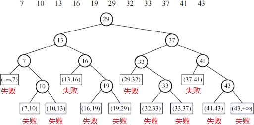
</center>

成功查找的次数是判定树中结点的层数，失败查找的次数是判定树中“失败”的父结点的层数。

$ASL_{succ}=\frac{1}{n}\sum{成功点的层高}$

$ASL_{fail}=\frac{1}{失败位置个数}\sum{失败位置父节点的层高}$

折半查找判定树的形态：

- 当节点个数为奇数时，左子树和右子树节点个数相等；
- 当节点个数为偶数时，右子树比左子树多一个节点（左少右多）。

> 这个结论对子树依然成立，因此可推断判定树的构造形态。

<center>
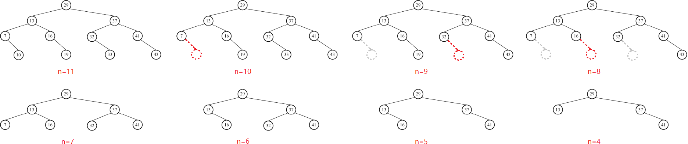
</center>

##### 分块查找

- 将序列分块，块内无序块间有序，使用索引表记录每块最大关键字和起始地址。
- 将待查找元素和块最大关键字比较，再在对应块中顺序查找。

> 最佳情况是令$s=\sqrt{n}$

$设索引表长 b，每块长度为s，ASL=\bbox[yellow]{\frac{1+b}{2}+\frac{1+s}{2}}$

### 树形查找

[二叉搜索树](/docs/DS/5-二叉搜索树.md)

- 插入：一定落在叶节点的下方
- 删除：叶节点直接删，非叶节点需找左子树的最右结点（前驱）替换过来，再将最右结点的左子树补上来。

[AVL树](/docs/C++/12-map&set.md#_2-1-avl树)

| 左单旋 LL型                  | 右单旋 RR型         | 左右双旋 LR型              | 右左双旋 RL型                       |
| ---------------------------- | ------------------- | -------------------------- | ----------------------------------- |
| $\backslash \to /\backslash$ | $/ \to /\backslash$ | $< \to / \to /\backslash$  | $> \to \backslash  \to /\backslash$ |
| 左高左旋                     | 右高右旋            | 下半左高左旋，上半右高右旋 | 下半右高右旋，上半左高左旋          |

[红黑树](/docs/C++/12-map&set.md#_2-2-红黑树)

- 根叶黑：根和叶子（空结点）都是黑色
- 不红红：不存在连续的两个红色结点
- 黑路同：任意结点到叶的所有路径的黑色结点数量相同

B树

1. 性质

- 平衡：所有叶节点都在同一层
- 有序：结点内有序，左子树都小于该结点，右子树都大于该结点
- 多路：每个结点最多M个分支，M-1个元素
- 多路：根节点最少2个分支1个元素，其他<mark>最少$\lceil\frac{m}{2}\rceil$个分支，$\lceil\frac{m}{2}\rceil-1$个元素</mark>。

<center>
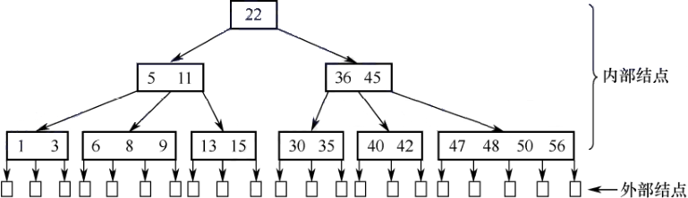
</center>

1. 插入

- 比根小走左比根大走右，
- 走到叶结点处进行插入排序，
- 元素个数上溢时需裂项，将中间元素放到父结点中，左右两边裂成两个结点。

<center>

</center>

3. 删除

- 删除非叶节点，将前驱或后继替换上来（本质还是删除叶节点）
- 如果发生下溢，将父结点中的前驱或后继借来，左右兄弟借一个补上去（父下来兄上去）。
- 如果左右都不够借，需要父元素下移到兄弟中，自身再和兄弟合并。

<center>

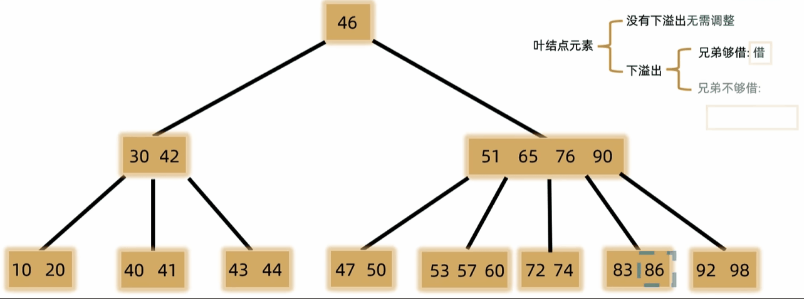
</center>

B+树

- 用于文件系统和数据库
- 多级索引结构，仅叶结点存有效数据，非叶结点用于索引，查找一次必走完从根到叶的路径
- 支持随机查找、<u>顺序查找和范围查找</u>

### 散列查找

- 哈希函数：除留余数法
- 冲突处理：线性探测法/二次探测法、开散列/拉链法/哈希桶

- $ASL_{succ}$：所有关键字的比较总次数 / 关键字个数

<center>
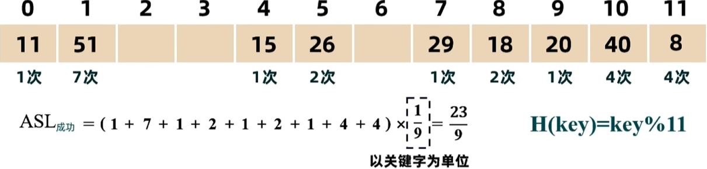
</center>

- $ASL_{fail}$：除最后映射不到的之外的所有位置的比较总次数 / 位置个数

>求一个位置失败的查找次数，是看该位置到最近的空位置的比较次数，到空位置也需要比较一次。

<center>
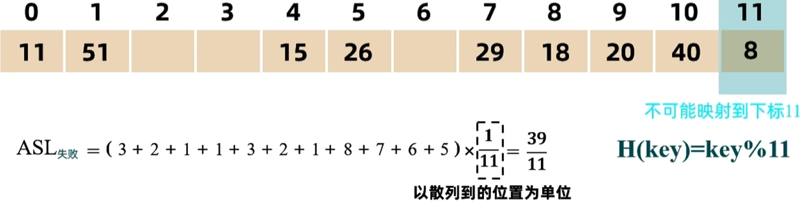
</center>

## 第八章 排序

### 内部排序

| 排序     | 时间复杂度   | 空间复杂度             | 稳定性              | 描述                                 |
| -------- | ------------ | ---------------------- | ------------------- | ------------------------------------ |
| 直接插排 | $O(n^2)$     | $O(1)$                 | 稳定                | 新元素插入前面的有序序列             |
| 希尔排序 | $O(n^{1.3})$ | $O(1)$                 | <mark>不稳定</mark> | 从$\frac{n}{2}$到1的间距进行直接插排 |
| 冒泡排序 | $O(n^2)$     | $O(1)$                 | 稳定                | 两两交换将最大值换到末尾             |
| 快排     | $O(nlogn)$   | <mark>$O(logn)$</mark> | <mark>不稳定</mark> | 单趟排序相互交换无法保证稳定性       |
| 直接选排 | $O(n^2)$     | $O(1)$                 | <mark>不稳定</mark> | 遍历数组找最大值放到末尾             |
| 堆排     | $O(nlogn)$   | $O(1)$                 | <mark>不稳定</mark> | 向下建堆，删除队顶最大值放到末尾     |
| 归并排序 | $O(nlogn)$   | <mark>$O(n)$</mark>    | 稳定                | 二分递归回溯时进行归并               |
| 基数排序 | $O(n+r)$     | $O(r)$                 | 稳定                | 从低到高逐位排序                     |

> 稳定性口诀：**选**艾**希**，**堆**攻**速**

### 外部排序
