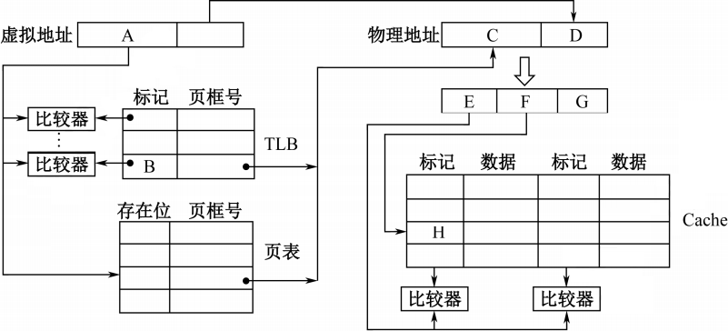
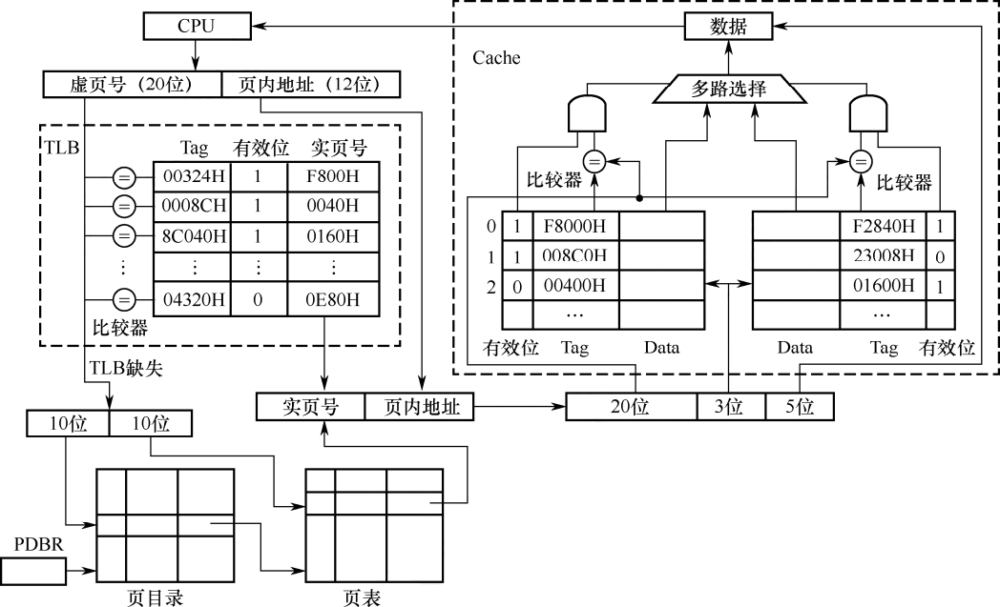
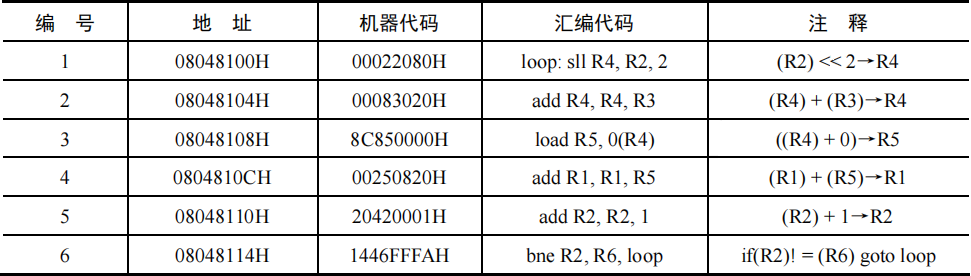

# 计组强化题型

### 机器数计算大题专项

<question>

1\. (2025) 在32位计算机上执行下列C语言代码段后，ui的值是 (&emsp;)。

<pre>
short si=-32767;
unsigned int ui=si;
</pre>

<options :options="['A.  2<sup>15</sup> - 1', 'B.  2<sup>15</sup> + 1', 'C. 2<sup>32</sup> - 2<sup>15</sup> - 1', 'D. 2<sup>32</sup> -  2<sup>15</sup> + 1']" />

::: analysis
答案：D。
:::

2\. (2025) 假设在8位字长的计算机中，两个带符号整数x和y的补码表示分别为[x]<sub>补</sub>=A3H，[y]<sub>补</sub>=75H，则通过补码加减运算器得到的x-y的值及OF标志分别为 (&emsp;)。

<options :options="['A. 24,0', 'B. 24,1', 'C. 46,0', 'D. 46,1']" />

::: analysis
答案：D。
:::

3\. (2011) 假定在一个8位字长的计算机中运行如下C程序段：

<pre>
unsigned int x=134;
unsigned int y=246;
int m=x;
int n=y;
unsigned int z1=x-y;
unsigned int z2=x+y;
int k1=m-n;
int k2=m+n;
</pre>

若编译器编译时将8个8位寄存器R1~R8分别分配给变量x、y、m、n、z1、z2、k1和k2。请回答下列问题。（提示：带符号整数用补码表示）<br/>
(1) 执行上述程序段后，寄存器R1、R5 和R6的内容分别是什么？（用十六进制表示）<br/>
(2) 执行上述程序段后，变量m和k1的值分别是多少？（用十进制表示）<br/>
(3) 上述程序段涉及带符号整数加/减、无符号整数加/减运算，这四种运算能否利用同一个加法器及辅助电路实现？简述理由。<br/>
(4) 计算机内部如何判断带符号整数加/减运算的结果是否发生溢出？上述程序段中，哪些带符号整数运算语句的执行结果会发生溢出？<br/>

::: analysis
(1) 134=128+6=1000 0110B，所以x的机器数为1000 0110B，故R1的内容为86H。246=255-9=1111 0110B，所以y的机器数为1111 0110B。x-y: 1000 0110 + 0000 1010 = (0)1001 0000，括弧中为加法器的进位，故R5的内容为90H。x+y: 1000 0110 + 1111 0110 = (1)0111 1100，括弧中为加法器的进位，故R6的内容为7CH。

(2) m的机器数与x的机器数相同，皆为86H=1000 0110B，解释为带符号整数m（用补码表示）时，其值为-111 1010B = -122。m-n的机器数与x-y的机器数相同，皆为90H=1001 0000B，解释为带符号整数k1（用补码表示）时，其值为-111 0000B = -112。

(3) 能。<br/>
无符号数做加法可以直接用加法器实现，而a-b可用a加b的补数实现，所以n位无符号整数加/减运算都可在n位加法器中实现。（1 分）<br/>
带符号整数在计算机的机器数中用补码表示，补码做加法可以直接用加法器实现（补码连同符号位参与运算可以得到正确的结果），a补-b补=a补+b补的补数，所以n位带符号整数加/减运算都可在n位加法器中实现。

(4) 加法器完成加法操作时，若次高位的进位和最高位的进位不同，则结果溢出，最后一条语句执行时会发生溢出。因为1000 0110 + 1111 0110 = (1)0111 1100，括弧中为加法器的进位，根据上述溢出判断规则，可知结果溢出。
:::

</question>


### 存储系统大题专项

#### 专项一：虚拟地址→物理地址→数据的过程

<question>

1\. (2011) 某计算机存储器按字节编址，虚拟（逻辑）地址空间大小为16MB，主存(物理)地址空间大小为1MB，页面大小为4KB：Cache采用直接映射方式，共8行：主存与Cache之间交换的块大小为32B。系统运行到某一时刻时，页表的部分内容和Cache的部分内容分别如题44-a图、题44-b图所示，图中页框号及标记字段的内容为十六进制形式。


请回答下列问题：<br/>
(1) 虚拟地址共有几位，哪几位表示虚页号？物理地址共有几位，哪几位表示页框号（物理页号）？<br/>
(2) 使用物理地址访问Cache时，物理地址应划分成哪几个字段？要求说明每个字段的位数及在物理地址中的位置。<br/>
(3) 虚拟地址001C60H所在的页面是否在主存中？若在主存中，则该虚拟地址对应的物理地址是什么？访问该地址时是否Cache命中？要求说明理由。<br/>
(4) 假定为该机配置一个4路组相连的TLB，该TLB共可存放8个页表项，若其当前内容（十六进制）如题44-c图所示，则此时虚拟地址024BACH所在的页面是否在主存中？要求说明理由。


::: analysis
(1) 因为页面大小4KB，虚拟地址空间大小16MB，物理地址空间大小1MB，故1MB/4KB=28 ，所以虚拟地址共24位，前12位表示虚页号；物理地址20位，且前8位表示页框号。

(2) 直接映射，因为Cache行大小为32B，因此块内地址5位。字段分为标记、行号、块内地址，因为块内地址5位，8 行需要3位行号，标记为总位数(20)减去块内地址(5)和行号(3)，所以位数分别是12、3、5。

(3) 虚拟地址为001C60H，因为后12位为块内地址，因此虚页号为001H=1，其有效位为1，则在主存中，且对应的页框号为04H，因此物理地址为04C60H=0000 0100 1100 0110 0000。又因为前12位为Cache 标记，因此查询04CH，中间3位为行号，即3号，3号内并不是标记04CH，即未命中。

(4) 024BACH=0000 0010 0100 1011 1010 1100，4 路组相连的TLB的组数为8/4=2，因此占用1位，故其标记为前11位，也就是012H，其在快表中可查询，有效位为1，快表命中则存在于主存中。
:::

2\. (2016) 某计算机采用页式虚拟存储管理方式，按字节编址，虚拟地址为32位，物理地址为24位，页大小为8KB；TLB采用全相联映射；Cache数据区大小为64KB，按2路组相联方式组织，主存块大小为64B。存储访问过程的示意图如下。



请回答下列问题。<br/>
(1) 图中字段A~G的位数各是多少？TLB 标记字段B中存放的是什么信息？<br/>
(2) 将块号为4099的主存块装入到Cache中时，所映射的Cache组号是多少？对应的H字段内容是什么？<br/>
(3) Cache缺失处理的时间开销大还是缺页处理的时间开销大？为什么？<br/>
(4) 为什么Cache可以采用直写(Write Through)策略，而修改页面内容时总是采用回写(Write Back)策略？

::: analysis
(1) 页大小8KB，占13位，因此页内偏移量13位，实页号24-13=11位，虚页号32-13=19位；主存块大小为64B，2路组相联，64KB/64B/2=29组，因此块内地址为6位，组号9位，标记位为24-9-6=9；故综上：A占19位，B占19位，C占11位，D占13位，E占9位，F占9位，G占6位。

(2) 4099/512=8，4099=1 0000 0000 0011B，因此组号为8；H字段为0 0000 1000B；

(3) 缺页处理的开销更大，因为缺页时外存调入内存，Cache是内存调入Cache，不访问磁盘，访问磁盘的速度明显慢于访存。

(4) 因为采用直写策略时需要同时写快速存储器和慢速存储器，而写磁盘比写主存慢得多，所以应该使写磁盘的次数尽量少。在Cache-主存层次，Cache可以采用直写策略，而在主存-外存（磁盘）层次，修改页面内容时总是采用回写策略。
:::

3\. (2018) 某计算机采用页式虚拟存储管理方式，按字节编址。CPU进行存储访问的过程如题44图所示。根据题44图回答下列问题。



(1) 主存物理地址占多少位？<br/>
(2) TLB采用什么映射方式？TLB用SRAM还是DRAM实现？<br/>
(3) Cache采用什么映射方式？若Cache采用LRU替换算法和回写(Write Back)策略，则Cache每行中除数据(Data)、Tag和有效位外，还应有哪些附加位？Cache总容量是多少？Cache中有效位的作用是什么？<br/>
(4) 若CPU给出的虚拟地址为0008C040H，则对应的物理地址是多少？是否在Cache中命中？说明理由。若CPU给出的虚拟地址为0007C260H，则该地址所在主存块映射到的Cache组号是多少？

::: analysis
(1) 由上图可知主存实页号占16位，页内地址占12位，总共28位。

(2) 观察比较器可得，每个表项都有一个比较器，表示可以映射到任意位置，因此TLB采用全相联映射；TLB是SRAM，速度快无需刷新。

(3) 由比较器个数可得Cache采用2路组相联映射；LRU需要计数位（替换算法控制位）、回写需要脏位；Cache组数3位，一共8组，每组2行，故一共16行；每行块内地址5位，也就是一个块大小为32B，16×32B=512B；又因为LRU位1位（2路仅需要1位），脏位1位，标记20位，有效位1位，总位数23bit×16=46B；故Cache总容量为：46B+512B=558B；有效位是为确定内存块是否位于Cache内，其内信息是否有效。

(4) 0008C040H取前20位0008CH比对，找到实页号为0040H，因此物理地址为：0040040H；主存物理地址为0040040H，其中高20位00400H为标志字段，低5位00000B为块内偏移量，中间3位010B为组号2，因此将00400H与Cache中第2组两行中的标志字段同时比较，可以看出，虽然有一个Cache行中的标志字段与00400H相等，但对应的有效位为0，而另一Cache行的标志字段与00400H不相等，故访问Cache不命中。因为物理地址的低12位与虚拟地址低12位相同，即为001001100000B，其中011B是组号（组索引），因此，该地址所在的主存块映射到的Cache组号为3。
:::

4\. (2019) 题45图如下。

```asm
int  f1(int n){
  1     00401000   55             push ebp
     ...       ...            ...
     if(n>1)
  11    00401018   83 7D 08 01    cmp dword ptr [ebp+8], 1
  12    0040101C   7E 17          jle f1+35h (00401035)
     return n*f1(n-1);
  13    0040101E   8B 45 08       mov eax, dword ptr [ebp+8]
  14    00401021   83 E8 01       sub eax, 1
  15    00401024   50             push eax
  16    00401025   E8 D6 FF FF FF call f1 (00401000)
     ...       ...            ...
  19    00401030   0F AF C1       imul eax, ecx
  20    00401033   EB 05          jmp f1+3Ah (0040103a)
     else return 1;
  21    00401035   B8 01 00 00 00 mov eax, 1
}
     ...       ...            ...
  26    00401040   3B EC          cmp ebp, esp
     ...       ...            ...
  30    0040104A   C3             ret
```

若计算机M的主存地址为32位，釆用分页存储管理方式，页大小为4KB，则第1行的push指令和第30行的ret指令是否在同一页中（说明理由）？若指令Cache有64 行，采用4路组相联映射方式，主存块大小为64B，则32位主存地址中，哪几位表示块内地址？哪几位表示Cache组号？哪几位表示标记(tag)信息？读取第16行的call指令时，只可能在指令Cache的哪一组中命中（说明理由）？

::: analysis
第1行指令和第30行指令的代码在同一页。因为页大小为4KB，所以虚拟地址的高20位为虚拟页号。第1 行指令和第30行指令的虚拟地址高20位都是00401H，因此两条指令在同一页中。

Cache组数为64/4=16，因此，主存地址划分中，低6位为块内地址、中间4位为组号（组索引）、高22位为标记。

读取第16行call指令时，只可能在指令Cache第0组中命中。因为页大小为4KB，所以虚拟地址和物理地址的最低12位完全相同，因而call指令虚拟地址0040 1025H中的025H = 0000 0010 0101B = 00 0000 100101B为物理地址的低12位，故对应Cache组号为0。
:::

5\. (2021) 假设计算机M的主存地址为24位，按字节编址；采用分页存储管理方式，虚拟地址为30位，页大小为4KB；TLB 采用2路组相联方式和LRU替换策略，共8组。请回答下列问题。<br/>
(1) 虚拟地址中哪几位表示虚页号？哪几位表示页内地址？<br/>
(2) 已知访问TLB 时虚页号高位部分用作TLB标记，低位部分用作TLB组号，M的虚拟地址中哪几位是TLB标记？哪几位是TLB组号？<br/>
(3) 假设TLB初始时为空，访问的虚页号依次为10、12、16、7、26、4、12和20，在此过程中，哪一个虚页号对应的TLB表项被替换？说明理由。<br/>
(4) 若将M中的虚拟地址位数增加到32位，则TLB表项的位数增加几位？

::: analysis
(1) 页大小4KB，故占用12位页内地址，30-12=18位虚页号。<br/>
(2) 2路组相联共8组，因此需要3位表示组号，也就是第从右往左的第13到15位，高15位是TLB标记。<br/>
(3) LRU替换策略需替换最久未访问过的，10、12、16、7、26、4、12和20mod8可得2、4、0、7、2、4、4和4。因此依次访问（注意组内可以放2个），当访问第20页时，虚页号4对应的TLB表项被替换出来。<br/>
(4) 虚拟地址位数增加到32位时，页大小不变，虚拟地址中页内地址位数不变，虚页号增加了32-30=2位，因此每个TLB表项的位数增加2位。
:::

</question>

#### 专项二：Cache的命中率/命中次数

<question>

6\. 假定用作Cache的SRAM的存取时间为2ns，用作主存的SDRAM的存取时间为40ns。为使存储系统的平均存取时间达到3ns，则Cache命中率应达到 (&emsp;) 左右。

<options :options="['A. 92.5%', 'B. 85%', 'C. 97.5%', 'D. 99.9%']" />

::: analysis
答案：C。
:::

7\. (2016) 有如下C语言程序段：

<pre>
for (k=0; k<1000; k++)
  a[k]=a[k]+32;
</pre>

若数组a和变量k均为int型，int型数据占4B，数据Cache采用直接映射方式，数据区大小为1KB、块大小为16B，该程序段执行前Cache为空，则该程序段执行过程中访问数组a的Cache缺失率约为 (&emsp;)。

<options :options="['A. 1.25%', 'B. 2.5%', 'C. 12.5%', 'D. 25%']" />

::: analysis
答案：C，缺失次数250次。
:::

8\. 有如下C语言程序段：

<pre>
for (k=0; k<256; k++)
  a[k] = a[k] + 32;
for (k=0; k<256; k++)
  a[k] = a[k] + 32;
</pre>

若数组a和变量k均为int型，int型数据占4B，数据Cache采用直接映射方式，数据区大小为1KB、块大小为16B，该程序段执行前Cache为空，则该程序段执行过程中访问数组a的Cache缺失率约为？

::: analysis
答案：1/16。
:::

9\. (2020) 假定主存地址为32位，按字节编址，指令Cache和数据Cache与主存之间均采用8路组相联映射方式，直写(Write Through)写策略和LRU替换算法，主存块大小为64B，数据区容量各为32KB。开始时Cache均为空。请回答下列问题。<br/>
(1) Cache每一行中标记(Tag)、LRU位各占几位？是否有修改位？<br/>
(2) 有如下C语言程序段：
<pre>
  for(k=0; k<1024; k++)
    s[k] = 2*s[k];
</pre>
若数组s及其变量k均为int型，int型数据占4B，变量k分配在寄存器中，数组s在主存中的起始地址为008000C0H，则该程序段执行过程中，访问数组s的数据Cache缺失次数为多少？<br/>
(3) 若 CPU 最先开始的访问操作是读取主存单元 00010003H 中的指令，简要说明从 Cache 中访问该指令的过程，包括 Cache 缺失处理过程。<br/>

::: analysis
(1) Cache采用8路组相联映射方式，组相联映射格式为 主存字块标记 组号 块内地址。主存块大小为64B=2<sup>6</sup>B，按字节编址，主存地址低6位为块内地址，数据区容量各为32KB，行数为32KB/64B=2<sup>9</sup>，采用8路组相联，组数为2<sup>9</sup>/8=2<sup>6</sup>，主存地址中间6位为Cache组号，主存地址为32位，主存地址中高32-6-6=20位为标记，8路组相联LRU位占log8=3位，采用直写方式，故没有修改位。

(2)因为数组s的起始地址 008000C0H = 0000000010000000000 000011 000000B，块内地址为000000B=0，所以s位于一个主存块开始处，需要访问1024个数组元素，每个数组元素类型为int，占4B，主存块大小为64B，1024个数组元素占1024×4B/64B=64个主存块。执行程序段过程中，观察s[k]=2*s[k]，每个数组元素都需要读、写各1次，主存块大小为64B，每访问一个主存块(包含64B/4B=16个数组元素)产生一次Cache缺失，每个主存块会访问16×(1+1)=32次。总共需要访问64个主存块，产生64×1=64次Cache缺失。所以该程序段执行过程中，访问数组s的数据Cache缺失次数为64。

(3) 00010003H = 0000000000000010000 000000 000011B，根据主存地址划分可知，组索引为0，故该地址所在主存块被映射到指令Cache组0;因为Cache初始为空，所有Cache行的有效位均为0，所以Cache访问缺失。此时，将该主存块取出后存入指令Cache组0的某一行，并将主存地址高20位(00010H)填入该行标记字段，设置有效位，修改LRU位，最后根据块内地址000011B从该行中取出相应内容。
:::

10\. (2023) 已知计算机M字长为32位，按字节编址，采用请求调页策略的虚拟存储管理方式，虚拟地址为32位，页面大小为4KB；数据Cache采用4路组相联映射，数据区大小为8KB，主存块大小为32B。现有C语言程序段如下：
<pre>
for (i=0; i<24; i++)
    for (j=0; j<64; j++) a[i][j]=10;
</pre>

已知二维数组a按行优先存放，在虚拟地址空间中分配的起始地址为0042 2000H，sizeof(int)=4，假定在M上执行上述程序段之前数组a不在主存，且在该程序段执行过程中不会发生页面置换。请回答下列问题。<br/>
(1) 数组a分为几个页面存储？对于数组a的访问，会发生几次缺页异常？页故障地址各是什么？<br/>
(2) 不考虑变量i和j，该程序段的数据访问是否具有时间局部性？为什么？<br/>
(3) 计算机M的虚拟地址（A31~A0）中哪几位用作块内地址？哪几位用作Cache组号？a[1][0]的虚拟地址是多少？其所在主存块对应的Cache组号是多少？<br/>
(4) 数组a占用多少主存块？假设上述程序段执行过程中数组a的访问不会和其他数据发生Cache访问冲突，则数组a的Cache命中率是多少？若将循环中i和j的次序按如下方式调换：
<pre>
for(j=0; j<64；j++)
    for(i=0; i<24; i++) a[i][j]=10;
</pre>
则数组a的Cache命中率又是多少？

::: analysis
(1) 计算如下：<br/>
第一问：24×64×4B=6144B=6KB，因此需要2个存储页面；<br/>
第二问：a起始地址为0042 2000H，页内地址为000H，也就是一个页面的开始，故2个存储页面需要调入2次，缺页异常2次；<br/>
第三问：故障地址为0042 2000H、0042 3000H；<br/>

(2) 没有时间局部性，每个元素仅被访问一次。

(3) 计算如下：<br/>
第一、二问：主存块大小32B，5位块内地址；4路组相联，8KB/32B/4=26，故组号6位，剩余标记位为32-5-6=21。虚拟地址中低5位（A4~A0）用作块内地址，低11位中高6位（A10~A5）用作Cache组号。<br/>
第三问：a[1][0]的虚拟地址=0042 2000H+64×4=0042 2100H；<br/>
第四问：组号看从右往左第6到11位，也就是001000，组号为001000=8。

(4) 计算如下：<br/>
第一问：6KB/32B=192个主存块；<br/>
第二问：数组占用了192个连续主存块，Cache4个一组总行数为256行，因此足够数组每次调入一行，也就是调入1次可以读取8次，命中率为7/8=87.5%；<br/>
第三问：数组占用了192个连续主存块，Cache4个一组总行数为256行，因此调入全部足够Cache容量，尽管第一列调入因不连续会发生多次不命中，但后续7列都会因提前调入命中，其余列可类比，因此命中率也为7/8=87.5%。
:::

11\. (2025) 现有C语言程序P的部分代码如题43图所示。
<pre>
int x, d[2048], i;
...
for (i=0; i<2048；i++)
    d[i] =d[i]/x;
</pre>
假定运行程序P的计算机M字长为32位，按字节编址，数据Cache的数据区大小为32KB，采用8路组相联映射方式，主存块大小为64B，Cache的命中时间为2个时钟周期，缺失损失为200个时钟周期；采用页式虚拟存储管理方式，页大小为4KB。数组d的起始虚拟地址为0180 0020H。请回答下列问题。

(1) 主存地址中的Cache组号字段和块内地址字段分别占几位？虚拟地址中哪些位可作为Cache索引？<br/>
(2) d[100]的虚拟地址为多少？d[100]所在主存块中对应的Cache组号是多少？<br/>
(3) 假定执行for语句时对应代码已经在Cache，变量i和x已装入寄存器，数组d已调入主存但不在Cache，则d[0]在其主存块内的偏移量是多少（用十六进制表示）？for语句执行过程中，访问数组d的Cache缺失率和数组元素的平均访问时间分别是多少（Cache缺失率的计算结果要求用百分比表示，保留两位小数）？<br/>
(4)数组d分布在几个页中？若执行for语句时对应代码已在主存，但数组d还未调入主存，则执行for语句过程中，访问数组d所引起的缺页次数是多少？

::: analysis
(1) Cache组号字段占6位；块内地址字段占6位。虚拟地址的VA11～VA6可作为Cache索引。<br/>
(2) d[100]的虚拟地址为0180 01B0H。Cache组号是000110B=6。<br/>
(3) d[0]在其主存块内的偏移量为20H。共发生129次Cache缺失，总访问次数为2048×2=4096，缺失率为129/4096≈3.15%；数组元素的平均访问时间约为2+3.15%×200=8.3个时钟周期。<br/>
(4) 数组d分布在3页中，访问数组d所引起的缺页次数是3。
:::

12\. (2010) 某计算机的主存地址空间大小为256MB，按字节编址，指令Cache和数据Cache分离，均有8个Cache行，每个Cache行大小为64B，数据Cache采用直接映射方式。现有两个功能相同的程序A和B，其伪代码如下所示：
<pre>
程序A：                     程序B：
int a[256][256]            int a[256][256]
...                        ...
int sum_array1()           int sum_array1()
{                          {
  int i，j，sum=0;           int i，j，sum=0;
  for(i=0；i<256；i++)       for(i=0；i<256；i++)
    for(j=0；j<256；j++)       for(j=0；j<256；j++)
      sum += a[i][j];            sum += a[i][j];
  return sum;                return sum;
}                          }
</pre>
假定int类型数据用32位补码表示，程序编译时i、j、sum均分配在寄存器中，数组a按行优先方式存放，首地址320（十进制数）。请回答下列问题，要求说明理由或给出计算过程。<br/>
(1) 若不考虑用于Cache一致性维护和替换算法的控制位,则数据Cache的总容量为多少？<br/>
(2) 数组数据a[0][31]和a[1][1]各自所在的主存块对应的Cache行号分别是多少（Cache行号从0开始）？<br/>
(3) 程序A和B的数据访问命中率各是多少？哪个程序的执行时间更短？

::: analysis
(1) Cache总容量=(Cache行大小+标记项)×Cache行个数，如下图排除题目表述，各种位需要计算的有：有效位、标记位。有效位固定为1位，标记位为19位。故标记位+有效位=20位。Cache总容量=(64B+20/8B)×8=532B。

(2) 方法一：十进制方式<br/>
直接映射方式计算行号的散列函数为除留余数法。<br/>
结构每个Cache行大小为64B，每行占64个地址单元，需要除64向下取整获得行号，有8个Cache行，行号还需要模8。<br/>
a[0][31]所在的主存块对应的Cache行号为：444/64 mod 8=6；<br/>
a[1][1]所在的主存块对应的Cache行号为：1348/64 mod 8=5。<br/>
方法二：二进制方式
<pre>
a[0][31]所在地址为444：
444 = 110111100B
    = 00000000000000000000 110 111100B
，行号为110B=6；
a[1][1]所在地址为1348：
1348=10101000100B
    =00000000000000000010 101 000100B，
行号为101B=5。
</pre>

(3) 对A来讲，因为Cache大小为64B，数组可一次性调入64/4=16个元素，因此访问命中率可达：15/16=93.75%；<br/>
对B来讲，由于其数组元素在内存不连续，因此无法命中，命中率0%。故A局部性更好，执行时间更短。
:::

13\. (2014) 假设对于题44中的计算机M和程序段P的机器代码（题44图如下）<br/>
某程序中有如下循环代码段P：“for (int i=0; i＜N; i++) sum += A[i];”。假设编译时变量sum和i分别分配在寄存器R1和R2中。常量N在寄存器R6中，数组A的首地址在寄存器R3中。程序段P起始地址为08048100H，对应的汇编代码和机器代码如下表所示。



M采用页式虚拟存储管理；P开始执行时，(R1)=(R2)=0，(R6)=1000，其机器代码已调入主存但不在Cache中；数组A未调入主存，且所有数组元素在同一页，并存储在磁盘同一个扇区。请回答下列问题并说明理由。<br/>
(1) P执行结束时，R2的内容是多少？<br/>
(2) M的指令Cache和数据Cache分离。若指令Cache共有16行，Cache和主存交换的块大小为32字节，则其数据区的容量是多少？若仅考虑程序段P的执行，则指令Cache的命中率为多少？<br/>
(3) P在执行过程中，哪条指令的执行可能发生溢出异常？哪条指令的执行可能产生缺页异常？对于数组A的访问，需要读磁盘和TLB至少各多少次？

::: analysis
(1) P执行结束，i自增到1000，因此R2内容为1000（没说几进制表示）。<br/>
(2) 因为Cache块大小为32B，且一共16行，因此数据区容量为16×32B=512B；本问是个小坑，题目问的是指令Cache的命中率（不要算数据Cache），因为6条指令一共占用24B，且首地址为08048100H，所以第一次执行时可将6条指令全部调入Cache，此后循环执行这六条指令1000次，因此缺失率为：(1000×6-1)/(1000×6)=99.98%。<br/>
(3) 指令4的加法指令可能发生溢出异常，即sum+=A[i]，当数组A中元素的值过大时，则会导致这条加法指令发生溢出异常；<br/>
指令3的访存指令可能产生缺页，因为数组A没有调入内存；<br/>
对于数组A的访问，因为都在同一页且在同一磁盘扇区，故只需要读磁盘一次；<br/>
对于快表的访问，因为第一次访问不在快表需要先调入，因此访问一次，调入后再去访问一次快表，剩余的999次指令则只需访问一次快表即可，因此一共访问1+1000=1001次。
:::

</question>
