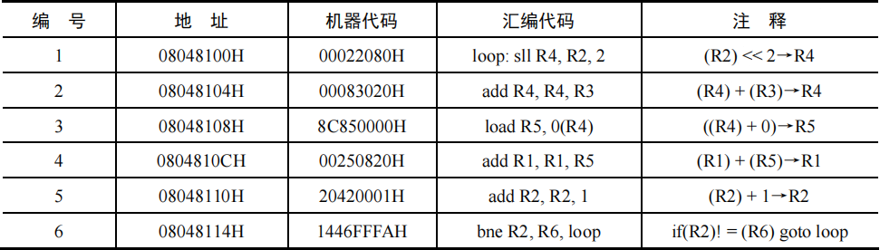
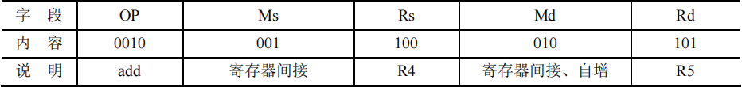
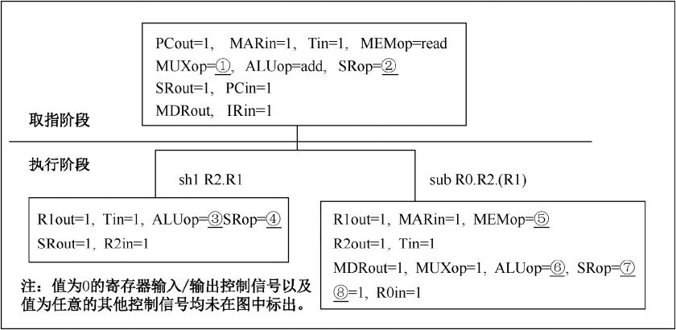
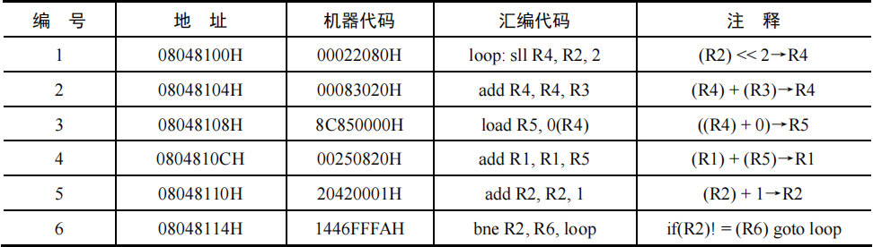
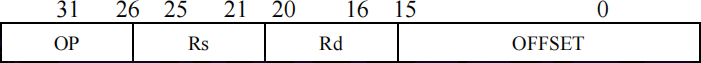

# 计组强化题型

## 机器数计算大题专项

<question>

1\. (2025) 在32位计算机上执行下列C语言代码段后，ui的值是 (&emsp;)。

<pre>
short si=-32767;
unsigned int ui=si;
</pre>

<options :options="['A.  215 - 1', 'B.  215 + 1', 'C. 232 - 215 - 1', 'D. 232 -  215 + 1']" />

::: analysis
答案：D。
:::

2\. (2025) 假设在8位字长的计算机中，两个带符号整数x和y的补码表示分别为[x]补=A3H，[y]补=75H，则通过补码加减运算器得到的x-y的值及OF标志分别为 (&emsp;)。

<options :options="['A. 24,0', 'B. 24,1', 'C. 46,0', 'D. 46,1']" />

::: analysis
答案：D。
:::

\(2011) 假定在一个8位字长的计算机中运行如下C程序段：

<pre>
unsigned int x=134;
unsigned int y=246;
int m=x;
int n=y;
unsigned int z1=x-y;
unsigned int z2=x+y;
int k1=m-n;
int k2=m+n;
</pre>

若编译器编译时将8个8位寄存器R1~R8分别分配给变量x、y、m、n、z1、z2、k1和k2。请回答下列问题。（提示：带符号整数用补码表示）
1) 执行上述程序段后，寄存器R1、R5 和R6的内容分别是什么？（用十六进制表示）
2) 执行上述程序段后，变量m和k1的值分别是多少？（用十进制表示）
3) 上述程序段涉及带符号整数加/减、无符号整数加/减运算，这四种运算能否利用同一个加法器及辅助电路实现？简述理由。
4) 计算机内部如何判断带符号整数加/减运算的结果是否发生溢出？上述程序段中，哪些带符号整数运算语句的执行结果会发生溢出？

::: analysis
1) 134=128+6=1000 0110B，所以x的机器数为1000 0110B，故R1的内容为86H。246=255-9=1111 0110B，所以y的机器数为1111 0110B。x-y: 1000 0110 + 0000 1010 = (0)1001 0000，括弧中为加法器的进位，故R5的内容为90H。x+y: 1000 0110 + 1111 0110 = (1)0111 1100，括弧中为加法器的进位，故R6的内容为7CH。
2) m的机器数与x的机器数相同，皆为86H=1000 0110B，解释为带符号整数m（用补码表示）时，其值为-111 1010B = -122。m-n的机器数与x-y的机器数相同，皆为90H=1001 0000B，解释为带符号整数k1（用补码表示）时，其值为-111 0000B = -112。
3) 能。无符号数做加法可以直接用加法器实现，而a-b可用a加b的补数实现，所以n位无符号整数加/减运算都可在n位加法器中实现。（1 分）带符号整数在计算机的机器数中用补码表示，补码做加法可以直接用加法器实现（补码连同符号位参与运算可以得到正确的结果），a补-b补=a补+b补的补数，所以n位带符号整数加/减运算都可在n位加法器中实现。
4) 加法器完成加法操作时，若次高位的进位和最高位的进位不同，则结果溢出，最后一条语句执行时会发生溢出。因为1000 0110 + 1111 0110 = (1)0111 1100，括弧中为加法器的进位，根据上述溢出判断规则，可知结果溢出。
:::

</question>

## 存储系统大题专项

### 专项一：虚拟地址→物理地址→数据的过程

<question>

\(2011) 某计算机存储器按字节编址，虚拟（逻辑）地址空间大小为16MB，主存(物理)地址空间大小为1MB，页面大小为4KB：Cache采用直接映射方式，共8行：主存与Cache之间交换的块大小为32B。系统运行到某一时刻时，页表的部分内容和Cache的部分内容分别如题44-a图、题44-b图所示，图中页框号及标记字段的内容为十六进制形式。

请回答下列问题：
1) 虚拟地址共有几位，哪几位表示虚页号？物理地址共有几位，哪几位表示页框号（物理页号）？
2) 使用物理地址访问Cache时，物理地址应划分成哪几个字段？要求说明每个字段的位数及在物理地址中的位置。
3) 虚拟地址001C60H所在的页面是否在主存中？若在主存中，则该虚拟地址对应的物理地址是什么？访问该地址时是否Cache命中？要求说明理由。
4) 假定为该机配置一个4路组相连的TLB，该TLB共可存放8个页表项，若其当前内容（十六进制）如题44-c图所示，则此时虚拟地址024BACH所在的页面是否在主存中？要求说明理由。

::: analysis
1) 因为页面大小4KB，虚拟地址空间大小16MB，物理地址空间大小1MB，故1MB/4KB=28 ，所以虚拟地址共24位，前12位表示虚页号；物理地址20位，且前8位表示页框号。
2) 直接映射，因为Cache行大小为32B，因此块内地址5位。字段分为标记、行号、块内地址，因为块内地址5位，8 行需要3位行号，标记为总位数(20)减去块内地址(5)和行号(3)，所以位数分别是12、3、5。
3) 虚拟地址为001C60H，因为后12位为块内地址，因此虚页号为001H=1，其有效位为1，则在主存中，且对应的页框号为04H，因此物理地址为04C60H=0000 0100 1100 0110 0000。又因为前12位为Cache 标记，因此查询04CH，中间3位为行号，即3号，3号内并不是标记04CH，即未命中。
4) 024BACH=0000 0010 0100 1011 1010 1100，4 路组相连的TLB的组数为8/4=2，因此占用1位，故其标记为前11位，也就是012H，其在快表中可查询，有效位为1，快表命中则存在于主存中。
:::

\(2016) 某计算机采用页式虚拟存储管理方式，按字节编址，虚拟地址为32位，物理地址为24位，页大小为8KB；TLB采用全相联映射；Cache数据区大小为64KB，按2路组相联方式组织，主存块大小为64B。存储访问过程的示意图如下。

请回答下列问题。
1) 图中字段A~G的位数各是多少？TLB 标记字段B中存放的是什么信息？
2) 将块号为4099的主存块装入到Cache中时，所映射的Cache组号是多少？对应的H字段内容是什么？
3) Cache缺失处理的时间开销大还是缺页处理的时间开销大？为什么？
4) 为什么Cache可以采用直写(Write Through)策略，而修改页面内容时总是采用回写(Write Back)策略？

::: analysis
1) 页大小8KB，占13位，因此页内偏移量13位，实页号24-13=11位，虚页号32-13=19位；主存块大小为64B，2路组相联，64KB/64B/2=29组，因此块内地址为6位，组号9位，标记位为24-9-6=9；故综上：A占19位，B占19位，C占11位，D占13位，E占9位，F占9位，G占6位。
2) 4099/512=8，4099=1 0000 0000 0011B，因此组号为8；H字段为0 0000 1000B；
3) 缺页处理的开销更大，因为缺页时外存调入内存，Cache是内存调入Cache，不访问磁盘，访问磁盘的速度明显慢于访存。
4) 因为采用直写策略时需要同时写快速存储器和慢速存储器，而写磁盘比写主存慢得多，所以应该使写磁盘的次数尽量少。在Cache-主存层次，Cache可以采用直写策略，而在主存-外存（磁盘）层次，修改页面内容时总是采用回写策略。
:::

\(2018) 某计算机采用页式虚拟存储管理方式，按字节编址。CPU进行存储访问的过程如题44图所示。根据题44图回答下列问题。

1) 主存物理地址占多少位？
2) TLB采用什么映射方式？TLB用SRAM还是DRAM实现？
3) Cache采用什么映射方式？若Cache采用LRU替换算法和回写(Write Back)策略，则Cache每行中除数据(Data)、Tag和有效位外，还应有哪些附加位？Cache总容量是多少？Cache中有效位的作用是什么？
4) 若CPU给出的虚拟地址为0008C040H，则对应的物理地址是多少？是否在Cache中命中？说明理由。若CPU给出的虚拟地址为0007C260H，则该地址所在主存块映射到的Cache组号是多少？

::: analysis
1) 由上图可知主存实页号占16位，页内地址占12位，总共28位。
2) 观察比较器可得，每个表项都有一个比较器，表示可以映射到任意位置，因此TLB采用全相联映射；TLB是SRAM，速度快无需刷新。
3) 由比较器个数可得Cache采用2路组相联映射；LRU需要计数位（替换算法控制位）、回写需要脏位；Cache组数3位，一共8组，每组2行，故一共16行；每行块内地址5位，也就是一个块大小为32B，16×32B=512B；又因为LRU位1位（2路仅需要1位），脏位1位，标记20位，有效位1位，总位数23bit×16=46B；故Cache总容量为：46B+512B=558B；有效位是为确定内存块是否位于Cache内，其内信息是否有效。
4) 0008C040H取前20位0008CH比对，找到实页号为0040H，因此物理地址为：0040040H；主存物理地址为0040040H，其中高20位00400H为标志字段，低5位00000B为块内偏移量，中间3位010B为组号2，因此将00400H与Cache中第2组两行中的标志字段同时比较，可以看出，虽然有一个Cache行中的标志字段与00400H相等，但对应的有效位为0，而另一Cache行的标志字段与00400H不相等，故访问Cache不命中。因为物理地址的低12位与虚拟地址低12位相同，即为001001100000B，其中011B是组号（组索引），因此，该地址所在的主存块映射到的Cache组号为3。
:::

\(2019) 题45图如下。

<pre>
int  f1(int n){
  1     00401000   55             push ebp
     ...       ...            ...
     if(n>1)
  11    00401018   83 7D 08 01    cmp dword ptr [ebp+8], 1
  12    0040101C   7E 17          jle f1+35h (00401035)
     return n*f1(n-1);
  13    0040101E   8B 45 08       mov eax, dword ptr [ebp+8]
  14    00401021   83 E8 01       sub eax, 1
  15    00401024   50             push eax
  16    00401025   E8 D6 FF FF FF call f1 (00401000)
     ...       ...            ...
  19    00401030   0F AF C1       imul eax, ecx
  20    00401033   EB 05          jmp f1+3Ah (0040103a)
     else return 1;
  21    00401035   B8 01 00 00 00 mov eax, 1
}
     ...       ...            ...
  26    00401040   3B EC          cmp ebp, esp
     ...       ...            ...
  30    0040104A   C3             ret
</pre>

若计算机M的主存地址为32位，釆用分页存储管理方式，页大小为4KB，则第1行的push指令和第30行的ret指令是否在同一页中（说明理由）？若指令Cache有64 行，采用4路组相联映射方式，主存块大小为64B，则32位主存地址中，哪几位表示块内地址？哪几位表示Cache组号？哪几位表示标记(tag)信息？读取第16行的call指令时，只可能在指令Cache的哪一组中命中（说明理由）？

::: analysis
第1行指令和第30行指令的代码在同一页。因为页大小为4KB，所以虚拟地址的高20位为虚拟页号。第1 行指令和第30行指令的虚拟地址高20位都是00401H，因此两条指令在同一页中。

Cache组数为64/4=16，因此，主存地址划分中，低6位为块内地址、中间4位为组号（组索引）、高22位为标记。

读取第16行call指令时，只可能在指令Cache第0组中命中。因为页大小为4KB，所以虚拟地址和物理地址的最低12位完全相同，因而call指令虚拟地址0040 1025H中的025H = 0000 0010 0101B = 00 0000 100101B为物理地址的低12位，故对应Cache组号为0。
:::

\(2021) 假设计算机M的主存地址为24位，按字节编址；采用分页存储管理方式，虚拟地址为30位，页大小为4KB；TLB 采用2路组相联方式和LRU替换策略，共8组。请回答下列问题。
1) 虚拟地址中哪几位表示虚页号？哪几位表示页内地址？
2) 已知访问TLB 时虚页号高位部分用作TLB标记，低位部分用作TLB组号，M的虚拟地址中哪几位是TLB标记？哪几位是TLB组号？
3) 假设TLB初始时为空，访问的虚页号依次为10、12、16、7、26、4、12和20，在此过程中，哪一个虚页号对应的TLB表项被替换？说明理由。
4) 若将M中的虚拟地址位数增加到32位，则TLB表项的位数增加几位？

::: analysis
1) 页大小4KB，故占用12位页内地址，30-12=18位虚页号。
2) 2路组相联共8组，因此需要3位表示组号，也就是第从右往左的第13到15位，高15位是TLB标记。
3) LRU替换策略需替换最久未访问过的，10、12、16、7、26、4、12和20mod8可得2、4、0、7、2、4、4和4。因此依次访问（注意组内可以放2个），当访问第20页时，虚页号4对应的TLB表项被替换出来。
4) 虚拟地址位数增加到32位时，页大小不变，虚拟地址中页内地址位数不变，虚页号增加了32-30=2位，因此每个TLB表项的位数增加2位。
:::

</question>

### 专项二：Cache的命中率/命中次数

<question>

3\. 假定用作Cache的SRAM的存取时间为2ns，用作主存的SDRAM的存取时间为40ns。为使存储系统的平均存取时间达到3ns，则Cache命中率应达到 (&emsp;) 左右。

<options :options="['A. 92.5%', 'B. 85%', 'C. 97.5%', 'D. 99.9%']" />

::: analysis
答案：C。
:::

4\. (2016) 有如下C语言程序段：

<pre>
for (k=0; k<1000; k++)
  a[k]=a[k]+32;
</pre>

若数组a和变量k均为int型，int型数据占4B，数据Cache采用直接映射方式，数据区大小为1KB、块大小为16B，该程序段执行前Cache为空，则该程序段执行过程中访问数组a的Cache缺失率约为 (&emsp;)。

<options :options="['A. 1.25%', 'B. 2.5%', 'C. 12.5%', 'D. 25%']" />

::: analysis
答案：C，缺失次数250次。
:::

5\. 有如下C语言程序段：

<pre>
for (k=0; k<256; k++)
  a[k] = a[k] + 32;
for (k=0; k<256; k++)
  a[k] = a[k] + 32;
</pre>

若数组a和变量k均为int型，int型数据占4B，数据Cache采用直接映射方式，数据区大小为1KB、块大小为16B，该程序段执行前Cache为空，则该程序段执行过程中访问数组a的Cache缺失率约为？

::: analysis
答案：1/16。
:::

\(2020) 假定主存地址为32位，按字节编址，指令Cache和数据Cache与主存之间均采用8路组相联映射方式，直写(Write Through)写策略和LRU替换算法，主存块大小为64B，数据区容量各为32KB。开始时Cache均为空。请回答下列问题。
1) Cache每一行中标记(Tag)、LRU位各占几位？是否有修改位？
2) 有如下C语言程序段：
<pre>
  for(k=0; k<1024; k++)
    s[k] = 2*s[k];
</pre>
若数组s及其变量k均为int型，int型数据占4B，变量k分配在寄存器中，数组s在主存中的起始地址为008000C0H，则该程序段执行过程中，访问数组s的数据Cache缺失次数为多少？
3) 若 CPU 最先开始的访问操作是读取主存单元 00010003H 中的指令，简要说明从 Cache 中访问该指令的过程，包括 Cache 缺失处理过程。

::: analysis
1. Cache采用8路组相联映射方式，组相联映射格式为 主存字块标记 组号 块内地址。主存块大小为64B=26B，按字节编址，主存地址低6位为块内地址，数据区容量各为32KB，行数为32KB/64B=29，采用8路组相联，组数为29/8=26，主存地址中间6位为Cache组号，主存地址为32位，主存地址中高32-6-6=20位为标记，8路组相联LRU位占log8=3位，采用直写方式，故没有修改位。
2. 因为数组s的起始地址 008000C0H = 0000000010000000000 000011 000000B，块内地址为000000B=0，所以s位于一个主存块开始处，需要访问1024个数组元素，每个数组元素类型为int，占4B，主存块大小为64B，1024个数组元素占1024×4B/64B=64个主存块。执行程序段过程中，观察s[k]=2*s[k]，每个数组元素都需要读、写各1次，主存块大小为64B，每访问一个主存块(包含64B/4B=16个数组元素)产生一次Cache缺失，每个主存块会访问16×(1+1)=32次。总共需要访问64个主存块，产生64×1=64次Cache缺失。所以该程序段执行过程中，访问数组s的数据Cache缺失次数为64。
3. 00010003H = 0000000000000010000 000000 000011B，根据主存地址划分可知，组索引为0，故该地址所在主存块被映射到指令Cache组0;因为Cache初始为空，所有Cache行的有效位均为0，所以Cache访问缺失。此时，将该主存块取出后存入指令Cache组0的某一行，并将主存地址高20位(00010H)填入该行标记字段，设置有效位，修改LRU位，最后根据块内地址000011B从该行中取出相应内容。
:::

\(2023) 已知计算机M字长为32位，按字节编址，采用请求调页策略的虚拟存储管理方式，虚拟地址为32位，页面大小为4KB；数据Cache采用4路组相联映射，数据区大小为8KB，主存块大小为32B。现有C语言程序段如下：
<pre>
for (i=0; i<24; i++)
    for (j=0; j<64; j++) a[i][j]=10;
</pre>

已知二维数组a按行优先存放，在虚拟地址空间中分配的起始地址为0042 2000H，sizeof(int)=4，假定在M上执行上述程序段之前数组a不在主存，且在该程序段执行过程中不会发生页面置换。请回答下列问题。
1) 数组a分为几个页面存储？对于数组a的访问，会发生几次缺页异常？页故障地址各是什么？
2) 不考虑变量i和j，该程序段的数据访问是否具有时间局部性？为什么？
3) 计算机M的虚拟地址（A31~A0）中哪几位用作块内地址？哪几位用作Cache组号？a[1][0]的虚拟地址是多少？其所在主存块对应的Cache组号是多少？
4) 数组a占用多少主存块？假设上述程序段执行过程中数组a的访问不会和其他数据发生Cache访问冲突，则数组a的Cache命中率是多少？若将循环中i和j的次序按如下方式调换：
<pre>
for(j=0; j<64；j++)
    for(i=0; i<24; i++) a[i][j]=10;
</pre>
则数组a的Cache命中率又是多少？

::: analysis
1) 计算如下：
第一问：24×64×4B=6144B=6KB，因此需要2个存储页面； 
第二问：a起始地址为0042 2000H，页内地址为000H，也就是一个页面的开始，故2个存储页面需要调入2次，缺页异常2次； 
第三问：故障地址为0042 2000H、0042 3000H；

2) 没有时间局部性，每个元素仅被访问一次。

3) 计算如下：
第一、二问：主存块大小32B，5位块内地址；4路组相联，8KB/32B/4=26，故组号6位，剩余标记位为32-5-6=21。虚拟地址中低5位（A4~A0）用作块内地址，低11位中高6位（A10~A5）用作Cache组号。 
第三问：a[1][0]的虚拟地址=0042 2000H+64×4=0042 2100H； 
第四问：组号看从右往左第6到11位，也就是001000，组号为001000=8。

4) 计算如下：
第一问：6KB/32B=192个主存块； 
第二问：数组占用了192个连续主存块，Cache4个一组总行数为256行，因此足够数组每次调入一行，也就是调入1次可以读取8次，命中率为7/8=87.5%； 
第三问：数组占用了192个连续主存块，Cache4个一组总行数为256行，因此调入全部足够Cache容量，尽管第一列调入因不连续会发生多次不命中，但后续7列都会因提前调入命中，其余列可类比，因此命中率也为7/8=87.5%。
:::

\(2025) 现有C语言程序P的部分代码如题43图所示。
<pre>
int x, d[2048], i;
...
for (i=0; i<2048；i++)
    d[i] =d[i]/x;
</pre>
假定运行程序P的计算机M字长为32位，按字节编址，数据Cache的数据区大小为32KB，采用8路组相联映射方式，主存块大小为64B，Cache的命中时间为2个时钟周期，缺失损失为200个时钟周期；采用页式虚拟存储管理方式，页大小为4KB。数组d的起始虚拟地址为0180 0020H。请回答下列问题。

1) 主存地址中的Cache组号字段和块内地址字段分别占几位？虚拟地址中哪些位可作为Cache索引？
2) d[100]的虚拟地址为多少？d[100]所在主存块中对应的Cache组号是多少？
3) 假定执行for语句时对应代码已经在Cache，变量i和x已装入寄存器，数组d已调入主存但不在Cache，则d[0]在其主存块内的偏移量是多少（用十六进制表示）？for语句执行过程中，访问数组d的Cache缺失率和数组元素的平均访问时间分别是多少（Cache缺失率的计算结果要求用百分比表示，保留两位小数）？
4) 数组d分布在几个页中？若执行for语句时对应代码已在主存，但数组d还未调入主存，则执行for语句过程中，访问数组d所引起的缺页次数是多少？

::: analysis
1) Cache组号字段占6位；块内地址字段占6位。虚拟地址的VA11～VA6可作为Cache索引。
2) d[100]的虚拟地址为0180 01B0H。Cache组号是000110B=6。
3) d[0]在其主存块内的偏移量为20H。共发生129次Cache缺失，总访问次数为2048×2=4096，缺失率为129/4096≈3.15%；数组元素的平均访问时间约为2+3.15%×200=8.3个时钟周期。
4) 数组d分布在3页中，访问数组d所引起的缺页次数是3。
:::

\(2010) 某计算机的主存地址空间大小为256MB，按字节编址，指令Cache和数据Cache分离，均有8个Cache行，每个Cache行大小为64B，数据Cache采用直接映射方式。现有两个功能相同的程序A和B，其伪代码如下所示：
<pre>
程序A：                     程序B：
int a[256][256]             int a[256][256]
...                         ...
int sum_array1()            int sum_array1()
{                           {
  int i，j，sum=0;            int i，j，sum=0;
  for(i=0；i<256；i++)        for(i=0；i<256；i++)
    for(j=0；j<256；j++)        for(j=0；j<256；j++)
      sum += a[i][j];             sum += a[i][j];
  return sum;                 return sum;
}                           }
</pre>
假定int类型数据用32位补码表示，程序编译时i、j、sum均分配在寄存器中，数组a按行优先方式存放，首地址320（十进制数）。请回答下列问题，要求说明理由或给出计算过程。
1) 若不考虑用于Cache一致性维护和替换算法的控制位,则数据Cache的总容量为多少？
2) 数组数据a[0][31]和a[1][1]各自所在的主存块对应的Cache行号分别是多少（Cache行号从0开始）？
3) 程序A和B的数据访问命中率各是多少？哪个程序的执行时间更短？

::: analysis
1) Cache总容量=(Cache行大小+标记项)×Cache行个数，如下图排除题目表述，各种位需要计算的有：有效位、标记位。有效位固定为1位，标记位为19位。故标记位+有效位=20位。Cache总容量=(64B+20/8B)×8=532B。

2) 方法一：十进制方式
直接映射方式计算行号的散列函数为除留余数法。 
结构每个Cache行大小为64B，每行占64个地址单元，需要除64向下取整获得行号，有8个Cache行，行号还需要模8。 
a[0][31]所在的主存块对应的Cache行号为：444/64 mod 8=6； 
a[1][1]所在的主存块对应的Cache行号为：1348/64 mod 8=5。 
方法二：二进制方式
<pre>
a[0][31]所在地址为444：
444 = 110111100B
    = 00000000000000000000 110 111100B
，行号为110B=6；
a[1][1]所在地址为1348：
1348=10101000100B
    =00000000000000000010 101 000100B，
行号为101B=5。
</pre>

3) 对A来讲，因为Cache大小为64B，数组可一次性调入64/4=16个元素，因此访问命中率可达：15/16=93.75%； 
对B来讲，由于其数组元素在内存不连续，因此无法命中，命中率0%。故A局部性更好，执行时间更短。
:::

\(2014) 假设对于题44中的计算机M和程序段P的机器代码（题44图如下）某程序中有如下循环代码段P：“for (int i=0; i＜N; i++) sum += A[i];”。假设编译时变量sum和i分别分配在寄存器R1和R2中。常量N在寄存器R6中，数组A的首地址在寄存器R3中。程序段P起始地址为08048100H，对应的汇编代码和机器代码如下表所示。

M采用页式虚拟存储管理；P开始执行时，(R1)=(R2)=0，(R6)=1000，其机器代码已调入主存但不在Cache中；数组A未调入主存，且所有数组元素在同一页，并存储在磁盘同一个扇区。请回答下列问题并说明理由。
1) P执行结束时，R2的内容是多少？
2) M的指令Cache和数据Cache分离。若指令Cache共有16行，Cache和主存交换的块大小为32字节，则其数据区的容量是多少？若仅考虑程序段P的执行，则指令Cache的命中率为多少？
3) P在执行过程中，哪条指令的执行可能发生溢出异常？哪条指令的执行可能产生缺页异常？对于数组A的访问，需要读磁盘和TLB至少各多少次？

::: analysis
1) P执行结束，i自增到1000，因此R2内容为1000（没说几进制表示）。
2) 因为Cache块大小为32B，且一共16行，因此数据区容量为16×32B=512B；本问是个小坑，题目问的是指令Cache的命中率（不要算数据Cache），因为6条指令一共占用24B，且首地址为08048100H，所以第一次执行时可将6条指令全部调入Cache，此后循环执行这六条指令1000次，因此缺失率为：(1000×6-1)/(1000×6)=99.98%。
3) 指令4的加法指令可能发生溢出异常，即sum+=A[i]，当数组A中元素的值过大时，则会导致这条加法指令发生溢出异常；
指令3的访存指令可能产生缺页，因为数组A没有调入内存；
对于数组A的访问，因为都在同一页且在同一磁盘扇区，故只需要读磁盘一次；
对于快表的访问，因为第一次访问不在快表需要先调入，因此访问一次，调入后再去访问一次快表，剩余的999次指令则只需访问一次快表即可，因此一共访问1+1000=1001次。
:::

</question>

### 专项三：主存和外存

<question>

\(2012) 假定某计算机的CPU主频为80MHz，CPI为4，平均每条指令访存1.5次，主存与Cache之间交换的块大小为16B，Cache的命中率为99%，存储器总线宽度为32位。请回答下列问题。（注：此(2)的第2小问与(3)跟存储器内容无关，会放到后面章节讲解）
1) 该计算机的MIPS数是多少？平均每秒Cache缺失的次数是多少？在不考虑DMA传送的情况下，主存带宽至少达到多少才能满足CPU的访存要求？
2) 假定在Cache缺失的情况下访问主存时，存在0.0005%的缺页率，则CPU平均每秒产生多少次缺页异常？
4) 为了提高性能，主存采用4体交叉存储模式，工作时每1/4个存储周期启动一个体。若每个体的存储周期为50ns，则该主存能提供的最大带宽是多少？

::: analysis
答案：
1) 平均每秒CPU执行的指令数为：80M/4=20M，故MIPS数为20。平均每秒Cache缺失的次数为：20M×1.5×(1-99%)=300000。当Cache缺失时，CPU访问主存，主存与Cache之间以块为单位传送数据，此时，主存带宽为：16B×300000/s=4.8MB/s。在不考虑DMA传输的情况下，主存带宽至少达到4.8MB/s才能满足CPU的访存要求。
2) 平均每秒钟缺页异常次数为：300000×0.0005%=1.5次。
4) 4体交叉存储模式能提供的最大带宽为：4×4B/50ns=320MB/s。
:::

\(2013) 某32位计算机，CPU主频为800MHz，Cache命中时的CPI为4，Cache块大小为32字节；主存采用8体交叉存储方式，每个体的存储字长为32位、存储周期是40ns；存储器总线宽度为32位，总线时钟频率为200MHz，支持突发传送总线事务。每次读突发传送总线事务的过程包括：送首地址和命令、存储器准备数据、传送数据。每次突发传送32字节，传送地址或者32位数据均需要一个总线时钟周期。请回答下列问题，要求给出理由或者计算过程。
1) CPU和总线的时钟周期各是多少？总线的带宽（即最大数据传输率）为多少？
2) Cache缺失时，需要用几个读突发传送总线事务来完成一个主存块的读取？
3) 存储器总线完成一次读突发传送总线事务所需的时间是多少？
4) 若程序BP执行过程中，共执行了100条指令，平均每条指令需要1.2次访存，Cache缺失率是5%，不考虑替换等开销，则BP的CPU执行时间是多少？

::: analysis
答案：
1) CPU 的时钟周期为：1/800 MHz=1.25ns。总线的时钟周期为：1/200MHz=5ns。总线带宽为：4B×200MHz=800MB/s或4B/5ns=800MB/s。
2) Cache块大小是32B，Cache缺失时需要一个读突发传送总线事务读取一个主存块。
3) 一次读突发传送总线事务包括一次地址传送和32B 数据传送：用1个总线时钟周期传输地址；每隔40ns/8=5ns启动一个体工作（各进行1次存取），第一个体读数据花费40ns，之后数据存取与数据传输重叠；用8个总线时钟周期传输数据。读突发传送总线事务时间：5ns+40ns+8×5ns=85ns。
4) BP的CPU执行时间包括Cache命中时的指令执行时间和Cache缺失时带来的额外开销。命中时的指令执行时间：100×4×1.25ns=500ns。指令执行过程中Cache缺失时的额外开销：1.2×100×5%×85ns=510ns。BP的CPU执行时间：500ns+510ns=1010ns。
:::

\(2022) 假设某磁盘驱动器中有4个双面盘片，每个盘面有20000个磁道，每个磁道有500个扇区，每个扇区可记录512字节的数据，盘片转速为7200r/m（转/分），平均寻道时间为5ms，请回答下列问题。（注：此题3) 跟存储器内容无关，会放到后面章节进行讲解）
1) 每个扇区包含数据及地址信息，地址信息分为3个字段，这3个字段的名称各是什么？对于该磁盘，各字段至少占多少位？
2) 一个扇区的平均访问时间约为多少？

::: analysis
1) 磁盘地址格式
磁盘地址格式为：驱动器号 柱面号 盘面号 扇区号。本题中只有一个磁盘驱动器，不需要考虑驱动器号。每个扇区的地址信息分为3个字段，分别为柱面号（磁道号）、盘面号（磁头号）、扇区号。每个盘面有20000个磁道，该磁盘共有20000个柱面，柱面号字段至少占：⌈log₂20000⌉＝15位。该磁盘有4个双面盘片，共计：4×2＝8个盘面，盘面号字段至少占：⌈log₂8⌉＝3位。每个磁道有500个扇区，扇区号至少占：⌈log₂500⌉＝9位。

2) 一个扇区的平均访问时间
一个扇区的平均访问时间＝平均寻道时间＋平均延迟时间＋传输时间。平均寻道时间＝5ms。平均延迟时间（盘片转半圈时间）为：1r/(2×7200) rpm=1r/(2×120) rps=1/240s≈4.167ms。传输时间（盘片转过一个扇区的时间）为：1r/(500×7200) rpm=1r/(500×120) rps=1/60000s≈0.017ms。所以，一个扇区的平均访问时间约为：5ms+4.167ms+0.017ms=9.183 ms。
:::

</question>

## 指令系统大题专项

### 专项一：指令格式的判断

<question>

\(2010) 某计算机字长为16位，主存地址空间大小为128KB，按字编址，采用单字长指令格式，指令各字段定义如下图所示。

转移指令采用相对寻址，相对偏移量用补码表示，寻址方式定义如下：

请回答下列问题:
1) 该指令系统最多可有多少条指令？该计算机最多有多少个通用寄存器？存储器地址寄存器(MAR)和存储器数据寄存器(MDR)至少各需要多少位？
2) 转移指令的目标地址范围是多少？
3) 若操作码0010B表示加法操作（助记符为ADD），寄存器R4和R5的编号分别为100B和101B，R4的内容为1234H，R5的内容为5678H，地址1234H中的内容为5678H，地址5678H中的内容为1234H，则汇编语句“ADD (R4), (R5)+”（逗号前为源操作数，逗号后为目的操作数）对应的机器码是什么（用十六进制表示）？该指令执行后，哪些寄存器和存储单元的内容会改变？改变后的内容是什么？

::: analysis
答案：
1. 由图可知，OP占4位，因此指令类型最多：24=16位；寄存器编号占三位，故通用寄存器个数：23=8个；字的个数为128KB/2B=216，按字编址故MAR至少为16位；MDR为字长位数，即16位。
2. 转移指令采用相对寻址，转移目标地址=(PC)+(Rn)，其中PC值未指明，可以取任意值，这里就已经是全部的寻址空间0～216-1，再去考虑Rn的补码偏移范围为-215~215-1，其寻址空间可以覆盖0000H~FFFFH。
3. 汇编语句“ADD (R4),(R5)+”机器码为：

该指令的机器码为0010 0011 0001 0101B=2315H；R5中内容会自增，变成5678H+1H=5679H；5678H中的内容会改变：5678H+1234H=68ACH。
:::

\(2013) 某计算机采用16位定长指令字格式，其CPU中有一个标志寄存器，其中包含进位/借位标志CF、零标志ZF和符号标志NF。假定为该机设计了条件转移指令，其格式如下：

其中，00000为操作码OP；C、Z和N分别为CF、ZF和NF的对应检测位，某检测位为1时表示需检测对应标志，需检测的标志位中只要有一个为1就转移，否则就不转移，例如，若C=1，Z=0，N=1，则需检测CF和NF的值，当CF=1或NF=1时发生转移；OFFSET是相对偏移量，用补码表示。转移执行时，转移目标地址为(PC)+2+2×OFFSET；顺序执行时，下条指令地址为(PC)+2。请回答下列问题。
1) 该计算机存储器按字节编址，还是按字编址？该条件转移指令向后（反向）最多可跳转多少条指令？
2) 某条件转移指令的地址为200CH，指令内容如下图所示，若该执行时CF=0，ZF=0，NF=1，则该指令执行后PC的值是多少？若该指令执行时CF=1，ZF=0，NF=0，则该指令执行后PC的值又是多少？请给出计算过程。

3) 实现“无符号数比较小于等时转移”功能的指令中，C、Z和N应各是什么？
4) 以下是该指令对应的数据通路示意图，要求给出中部件①~③的名称或功能说明。

::: analysis
答案：
1) 因为指令长度为16位，且下条指令地址为(PC)+2，故编址单位是字节。偏移量OFFSET为8位补码，范围为-128~127，故相对于当前条件转移指令，向后最多可跳转127条指令。
2) 指令中C=0, Z=1, N=1，故应根据ZF和NF的值来判断是否转移。当CF=0, ZF=0, NF=1时，需转移。已知指令中偏移量为1110 0011B=E3H，符号扩展后为FFE3H，左移一位（乘2）后为FFC6H，故PC的值（即转移目标地址）为200CH+2+FFC6H=1FD4H。当CF=1, ZF=0, NF=0时不转移。（1分）PC的值为：200CH+2=200EH。
3) 指令中的C、Z和N应分别设置为C=Z=1, N=0
4) 部件①：指令寄存器（用于存放当前指令）；部件②：移位寄存器（用于左移一位）；部件③：加法器（地址相加）
:::

\(2015) 某16位计算机的主存按字节编址，存取单位为16位；采用16位定长指令字格式，该计算机某部分指令执行过程的控制信号如下所示。该机指令格式如下图所示，支持寄存器直接和寄存器间接两种寻址方式，寻址方式位分别为0和1，通用寄存器R0~R3的编号分别为0、1、2和3。
（本题3) (4)内容与指令系统无关，会放在后面进行讲解）

请回答下列问题：
1) 该机的指令系统最多可定义多少条指令？
2) 假定inc、shl和sub指令的操作码分别为01H、02H和03H，则以下指令对应的机器代码各是什么？

<pre>
① inc R1                ; (R1)+1→R1
② shl R2, R1            ; (R1)<<1→R2
③ sub R3, (R1), R2      ; ((R1))-(R2)→R3
</pre>

::: analysis
答案：
1) 指令操作码有7 位，因此最多可定义= 128 条指令。
2) 各条指令的机器代码分别如下：
① “inc R1”的机器码为：0000001 0 01 0 00 0 00，即0240H。
② “shl R2, R1”的机器码为：0000010 0 10 0 01 0 00，即0488H。
③ “sub R3, (R1), R2”的机器码为：0000011 0 11 1 01 0 10，即06EAH。
:::

\(2021) 假定计算机M字长为16位，按字节编址，连接CPU和主存的系统总线中地址线为20位、数据线为8位，采用16位定长指令字，指令格式及其说明如下：

其中，op1~op3为操作码，rs、rt和rd为通用寄存器编号，R[r]表示寄存器r的内容，imm为立即数，target为转移目标的形式地址。请回答下列问题。
1) ALU的宽度是多少位？可寻址主存空间大小为多少字节？指令寄存器、主存地址寄存器(MAR)和主存数据寄存器(MDR)分别应有多少位？
2) R型格式最多可定义多少种操作？I型和J型格式总共最多可定义多少种操作？通用寄存器最多有多少个？
3) 假定op1为0010和0011时，分别表示带符号整数减法和带符号整数乘法指令，则指令01B2H的功能是什么（参考上述指令功能说明的格式进行描述）？若1、2、3号通用寄存器当前内容分别为B052H、0008H、0020H，则分别执行指令01B2H和01B3H后，3号通用寄存器内容各是什么？各自结果是否溢出？
4) 若采用I型格式的访存指令中imm（偏移量）为带符号整数，则地址计算时应对imm进行零扩展还是符号扩展？
5) 无条件转移指令可以采用上述哪种指令格式？

::: analysis
答案：
1) 字长为16位，因此ALU宽度为16位；地址线20位，可寻址主存空间大小为：220B=1MB，寻址空间大小为1MB；指令寄存器、主存地址寄存器(MAR)和主存数据寄存器(MDR)分别为16位、20位、8位。
2) R型因为op1有4位，因此最多定义16种；I型和J型因为op2和op3都有6位，减去被R型占用的全零，因此最多定义63种；通用寄存器编号2位，因此最多22=4个。
3) 01B2H=0000 0001 1011 0010B，op1=0010B，因此操作为带符号整数减法，操作是将编号为1的寄存器中内容减编号为2的寄存器内容，放入编号为3的寄存器，即R[3]←R[1]-R[2]。
执行01B2H：B052H-0008H=B052H+FFF8H（全部位取反末尾加1）=B04AH，不溢出（最高位进位与符号位进位相同为1）。
执行01B2H（带符号整数乘法）：B052H×0008H，这里相当于将B052H左移三位，B052H=10110000 0101 0010B，且移出011，低位补000，则为1000 0010 1001 0000B=8290H，第一次移位时符号位发生变化，因此发生溢出。
4) imm（偏移量）为带符号整数，因此进行符号扩展。
5) 可以采取J型，因为J型格式功能为target→PC的低10位，无条件转移指令需要更新PC内容，把target送到PC的低10位后，PC内容为目标指令地址。
:::

\(2024) 假定计算机M字长32位，按字节编址，采用32位定长指令字。指令add、slli和lw的格式、编码和功能说明如图(a)所示。

其中，R[x]表示通用寄存器x的内容，M[x]表示地址为x的存储单元内容，shamt为移位位数，imm为补码表示的偏移量。图(b)给出了计算机M的部分数据通路及控制信号（用带箭头虚线表示），其中，A和B分别表示从通用寄存器rs1和rs2中读出的内容；IR[31:20]表示指令寄存器中的高12位；控制信号Ext为0、1时扩展器分别实现零扩展、符号扩展，ALUctr为000、001、010时ALU分别实现加、减、逻辑左移运算。

请回答下列问题。
1) 计算机M最多有几个通用寄存器？为什么shamt占5位？
2) 执行add指令时，控制信号ALUBsrc的取值应是什么？若rs1和rs2寄存器内容分别是8765 4321H和9876 5432H，则add指令执行后，ALU输出端F、OF和CF的结果分别是什么？若该add指令处理的是无符号整数，则应该根据哪个标志位判断是否溢出？
3) 执行slli指令时，控制信号Ext的取值可以是0也可以是1，为什么？
4) 执行lw指令时，控制信号Ext、ALUctr的取值分别是什么？
5) 若一条指令的机器码是A040 A103H，则该指令一定是lw指令，为什么？若执行该指令时，R[01H]=FFFF A2D0H，则所读取数据的存储地址是什么？

::: analysis
答案：
1. 最多有25=32个通用寄存器。M字长为32位，故通用寄存器宽度为32位，因此shamt字段占log232=5位。
2. 控制信号ALUBsrc=0。F=1FDB 9753H；OF=1；CF=1；根据CF判断是否溢出。
3. 因为slli指令的移位位数只使用IR[31:20]中的低5位，与高位IR[31:25]及扩展出来的位无关，故Ext取值可以是0也可以是1。
4. Ext=1；ALUctr=000。
5. 因为A040 A103H=1010 0000 0100 0000 1010 0001 0000 0011B，根据指令格式中IR[6:0]=0000011B，IR[14:12]=010B，可以判定该指令是lw指令。lw指令所读取数据的存储地址为FFFF 9CD4H。
:::

\(2024) 对于题43（上一道题，可直接使用上一题中条件）中的计算机M，C语言程序P包含的语句“sum+=a[i];” 在M中对应的指令序列S如下。

<pre>
slli r4, r2, 2   // R[r4]←R[r2]<<2
 add r4, r3, r4  // R[r4]←R[r3]+R[r4]
  lw r5, 0(r4)   // R[r5]←M[R[r4]+0]
 add r1, r1, r5  // R[r1]←R[r1]+R[r5]
</pre>

已知变量i、sum和数组a都为int型，通用寄存器r1~r5的编号为01H~05H。
请回答下列问题。
1) 根据指令序列S中每条指令的功能，写出存放数组a的首地址、变量i、变量sum的通用寄存器编号。
2) 已知M为小端方式计算机，采用页式存储管理方式，页大小为4KB。若执行到指令序列S中第一条指令时，i=5，且r1和r3的内容分别为0000 1332H和0013 DFF0H，从地址0013 DFF0H开始的存储单元内容如题44图所示，则执行“sum+=a[i];” 语句后，a[i]的地址、a[i]和sum的机器数分别是什么（用十六进制表示）？a[i]所在页的页号是多少？此次执行中，数组a至少存放在几页中？

3) 指令“slli r4, r2, 2” 的机器码是什么（用十六进制表示）？若数组a改为short类型，则指令序列S中slli指令的汇编形式应是什么？

::: analysis
答案：
1) a的首地址存放在r3；i存放在r2；sum存放在r1。
2) a[i]的地址为0013 E004H；a[i]的机器数为FFFF ECDCH；sum的机器数为0000 000EH。a[i]所在页的页号是0013EH。数组a至少存放在2页中。
3) 指令机器码为0021 2213H。汇编形式是slli r4, r2, 1。
:::

</question>

### 专项二：程序的机器级表示

<question>

\(2014) 某程序中有如下循环代码段P：“for (int i=0; i＜N; i++) sum += A[i];”。假设编译时变量sum和i分别分配在寄存器R1和R2中。常量N在寄存器R6中，数组A的首地址在寄存器R3中。程序段P起始地址为08048100H，对应的汇编代码和机器代码如下表所示。

执行上述代码的计算机M采用32位定长指令字，其中分支指令bne采用如下格式。

Op为操作码，Rs和Rd为寄存器编号，OFFSET为偏移量，用补码表示。请回答下列问题，并说明理由。
1) M的存储器编址单位是什么？
2) 已知sll指令实现左移功能，数组A中每个元素占多少位？
3) 题44表中bne指令的OFFSET字段的值是多少？已知bne指令采用相对寻址方式，当前PC内容为bne指令地址，通过分析题44表中指令地址和bne指令内容，推断出bne指令的转移目标地址计算公式。

::: analysis
答案：
1) 因为每条指令长度为32位，占4个单元，所以存储器编址单位是字节。
2) R2中存放的是整型变量i，每次左移两位代表扩大4倍，扩大四倍后与首地址相加可得出下一个元素，因此占用字节为4B，也就是A中每个元素占用32位。
3) 因为其机器代码为1446FFFAH，因此OFFSET字段的值=FFFAH（注意偏移量为补码）=-6；目标地址公式为：PC+4-4×OFFSET=08048114H+4B-24B=08048100H
:::

\(2017) 在按字节编址的计算机M上，题43中f1的部分源程序（阴影部分）与对应的机器级代码（包括指令的虚拟地址）如下图所示。

<pre>
int f1(unsigned n)
1 00401020 55          push ebp
  ...      ...         ...
        for (unsigned i = 0; i <= n - 1; i++)
  ...      ...         ...
20 0040105E 39 4D F4   cmp dword ptr [ebp-0Ch],ecx
  ...      ...         ...
            power *= 2;
  ...      ...         ...
23 00401066 D1 E2      shl edx, 1
  ...      ...         ...
            return sum;
  ...      ...         ...
35 0040107F C3         ret
</pre>

其中，机器级代码行包括行号、虚拟地址、机器指令和汇编指令。
请回答下列问题。
1) 计算机M是RISC还是CISC？为什么？
2) f1的机器指令代码共占多少字节？要求给出计算过程。
3) 第20条指令cmp通过i减n-1实现对i和n-1的比较。执行f1(0)过程中，当i=0时，cmp指令执行后，进/借位标志CF的内容是什么？要求给出计算过程。
4) 第23条指令shl通过左移操作实现了power\*2运算，在f2中能否也用shl指令实现power\*2？为什么？（将f1中的int都改为float，可得到计算f(n)的另一个函数f2）。

::: analysis
答案：
1) CISC，因为指令字长不相同。
2) 将f1尾地址减去首地址可得：0040107FH - 00401020H+1H=60H=96，因此占用96B（这里加1H可以代入00401020H~00401021H，占据两个单元格但是相减却只能得出1个，故需加1）。
3) 都是无符号数，因此i-(n-1)=0-(0-1)=0-FFFFFFFFH<0，也就是不够减，故CF会产生借位标记，因此CF=1。
4) 不能，整体进行左移代表float的阶码、符号位都会产生移动，不合理。
:::

\(2019) 已知f(n)=n!=n×(n-1)×(n-2)×…×2×1，计算f(n)的C语言函数f1的源程序（阴影部分）及其在32位计算机M上的部分机器级代码如下：

其中，机器级代码行包括行号、虚拟地址、机器指令和汇编指令，计算机M按字节编址，int型数据占32位。请回答下列问题：
1) 计算f(10)需要调用函数f1多少次？执行哪条指令会递归调用f1？
2) 上述代码中，哪条指令是条件转移指令？哪几条指令一定会使程序跳转执行？
3) 根据第16行的call指令，第17行指令的虚拟地址应是多少？已知第16行的call指令采用相对寻址方式，该指令中的偏移量应是多少（给出计算过程）？已知第16行的call指令的后4字节为偏移量，M是采用大端方式还是采用小端方式？
4) f(13)=6227020800，但f1(13)的返回值为1932053504，为什么两者不相等？要使f1(13)能返回正确的结果，应如何修改f1的源程序？
5) 第19行的imul指令（带符号整数乘）的功能是R[eax]←R[eax]×R[ecx]，当乘法器输出的高、低32位乘积之间满足什么条件时，溢出标志OF=1？要使CPU在发生溢出时转异常处理，编译器应在imul指令后应加一条什么指令？

::: analysis
答案：
1) 需要调用10次；第16行的call f1(00401000)会调用该函数；
2) 第12行的jle f1+35h (00401035)是条件转移指令；16行的call f1(00401000)、20行的jmp f1+3Ah (0040103a)和第30行的ret一定会跳转；
3) 第一问：地址为：00401025H+5H=0040102AH；
第二问：偏移量：0040102AH-00401000H=2AH，因此偏移量为-42（向上为减），变成16进制就是FFFFFFD6H（这里注意是从17行的虚地址开始减，为16行末地址，不是16行的首地址）；
第三问：因为后四字节为偏移量，偏移量字段为“D6 FF FF FF”，又因为偏移量为FFFFFFD6H，因此采用小端存储。
4) 因为f1 返回值类型为int，int 型数据占32 位，int 的表示范围为-231～231-1，即-2147483648~2147483647，f(13)=6 227 020 800 大于32 位int 型数据可表示的最大值，因而f1(13)的返回值是一个发生了溢出的结果；为使f1(13) 能返回正确结果，可将函数的返回值类型改为double（或long long）。
5) 高32位与符号位一致全0或全1时，则不溢出，OF=0；否则溢出，OF=1；加一条溢出自陷指令。
:::

\(2023) 题43中C程序段在计算机M上的部分机器级代码如下，每个机器级代码行中依次包含指令序号、虚拟地址、机器指令和汇编指令。

请回答下列问题： 
43题相关：已知计算机M字长为32位，按字节编址，采用请求调页策略的虚拟存储管理方式，虚拟地址为32位，页面大小为4KB；数据Cache采用4路组相联映射，数据区大小为8KB，主存块大小为32B。
<pre>
for (i = 0; i < 24; i++)
    for (j = 0; j < 64; j++) a[i][j] = 10;
</pre>
已知二维数组a按行优先存放，在虚拟地址空间中分配的起始地址为0042 2000H，sizeof(int)=4，假定在M上执行上述程序段之前数组a不在主存，且在该程序段执行过程中不会发生页面置换。
1) 第20条指令的虚拟地址是多少？
2) 已知第2条jmp和第7条jge都是跳转指令，其操作码分别是EBH和7DH，跳转地址分别为0040 1084H、0040 10BCH，这两条指令都采用什么寻址方式？给出第2条指令jmp的跳转目标地址计算过程。
3) 已知第19条mov指令的功能是“a[i][j]←10”，其中ecx和edx为寄存器名，0042 2000H是数组a的首地址，指令中源操作数采用什么寻址方式？已知edx中存放的是变量j，ecx中存放的是什么？根据该指令的机器码判断计算机M采用的是大端还是小端方式。
4) 第一次执行第19条指令时，取指令过程中是否会发生缺页异常？为什么？

::: analysis
答案：
1) 004010AEH+BH（指令长11个字节）=004010B9H。
2) 第2条有：00401079H+09H+2H=0040 1084H；第7条有：00401088H+32H+2H=0040 10BCH；因此上述两条指令都采取相对寻址的方式，当前指令加上寄存器中偏移量和原本指令长度；第2条jmp的跳转目标地址计算过程为：0040 1084H=00401079H+2H+09H。
3) 源操作数为0Ah=10为立即数，直接将其复制到数组中，因此采取的是立即寻址；a[i][j]的地址=a[0][0]的地址+4(64i+j)=a[0][0]的地址+256i+4j，因此ecx存放256×i；C7 84 82 00 20 42 00 0A 00 00 00H，可以找到数组首地址00 42 20 00H逆序存放，因此是小端存储。
4) 004010AEH，页面大小4KB，可知其页号是00401H，和前方代码处于同一页，因此访问前置代码使已经被调入，故不会发生缺页。
:::

</question>

## 中央处理器大题专项

### 专项一：多周期CPU的数据通路

<question>

\(2015) 某16位计算机的主存按字节编码，存取单位为16位；采用16位定长指令字格式；CPU采用单总线结构，主要部分如下图所示。图中R0~R3为通用寄存器；T为暂存器；SR为移位寄存器，可实现直送(mov)、左移一位(left)和右移一位(right)三种操作，控制信号为SRop，SR的输出由信号SRout控制；ALU可实现直送A(mova)、A加B(add)、A减B(sub)、A与B(and)、A或B(or)、非A(not)、A加1(inc)七种操作，控制信号为ALUop。

回答下列问题：
1) 图中哪些寄存器是程序员可见的？为何要设置暂存器T？
2) 控制信号ALUop和SRop的位数至少各是多少？
3) 控制信号SRout所控制部件的名称或作用是什么？
4) 端点①~⑨中，哪些端点须连接到控制部件的输出端？
5) 为完善单总线数据通路，需要在端点①~⑨中相应的端点之间添加必要的连线。写出连线的起点和终点，以正确表示数据的流动方向。
6) 为什么二路选择器MUX的一个输入端是2？

::: analysis
答案：
1) 程序员可见寄存器为通用寄存器(R0~R3)和PC。因为采用了单总线结构，因此，若无暂存器T，则ALU的A、B端口会同时获得两个相同的数据，使数据通路不能正常工作。
2) ALU共有7种操作，故其操作控制信号ALUop至少需要3位；移位寄存器有3种操作，其操作控制信号SRop至少需要2位。
3) 信号SRout所控制的部件是一个三态门，用于控制移位器与总线之间数据通路的连接与断开。
4) 端口①、②、③、⑤、⑧须连接到控制部件输出端。
5) 连线1，⑥→⑨；连线2，⑦→④。
6) 因为每条指令的长度为16位，按字节编址，所以每条指令占用2个内存单元，顺序执行时，下条指令地址为(PC)+2。MUX的一个输入端为2，可便于执行(PC)+2操作。
:::

\(2015) 上题中描述的计算机，某部分指令执行过程的控制信号如下所示。

该机指令格式如下图所示，支持寄存器直接和寄存器间接两种寻址方式，寻址方式位分别为0和1，通用寄存器R0~R3的编号分别为0,1,2和3。

回答下列问题：
1) 该机的指令系统最多可定义多少条指令？
2) 假定inc、shl 和 sub指令的操作码分别为01H、02H和03H，则以下指令对应的机器代码各是什么？
<pre>
① inc R1           ; (R1)+1→R1
② shl R2, R1       ; (R1)<<1→R2
③ sub R3, (R1), R2 ; ((R1))−(R2)→R3
</pre>
3) 假设寄存器X的输入和输出控制信号分别为Xin和Xout，其值为1表示有效，为0表示无效（如PCout=1表示PC内容送总线）；存储器控制信号为MEMop，用于控制存储器的读(read)和写(write)操作。写出本题第一幅图中标号①~⑧处的控制信号或控制信号的取值。
4) 指令“sub R1,R3,(R2)”和“inc R1”的执行阶段至少各需要多少个时钟周期?

::: analysis
答案：（注：(1)和(2)在指令系统专项中已做讲解）
3) 各标号处的控制信号或控制信号取值如下：①0；②mov；③mova；④left；⑤read；⑥sub；⑦mov；⑧SRout。
4) 指令“sub R1, R3, (R2)”的执行阶段至少包含4个时钟周期；指令“inc R1”的执行阶段至少包含2个时钟周期。
:::

\(2022) 某CPU中部分数据通路如题43图所示，其中，GPRs为通用寄存器组；FR为标志寄存器，用于存放ALU产生的标志信息；带箭头虚线表示控制信号，如控制信号Read、Write分别表示主存读、主存写，MDRin表示内部总线上数据写入MDR，MDRout表示MDR的内容送内部总线。

请回答下列问题：
1) 设ALU的输入端A、B及输出端F的最高位分别为A15、B15及F15，FR中的符号标志和溢出标志分别为SF和OF，则SF的逻辑表达式是什么？A加B、A减B时OF的逻辑表达式分别是什么？要求逻辑表达式的输入变量为A15、B15及F15。
2) 为什么要设置暂存器Y和Z？
3) 若GPRs的输入端rs、rd分别为所读、写的通用寄存器的编号，则GPRs中最多有多少个通用寄存器？rs和rd来自图中的哪个寄存器？已知GPRs内部有一个地址译码器和一个多路选择器，rd应该连接地址译码器还是多路选择器？
4) 取指令阶段（不考虑PC增量操作）的控制信号序列是什么？若从发出主存读命令到主存读出数据并传送到MDR共需5个时钟周期，则取指令阶段至少需要几个时钟周期？
5) 图中控制信号由什么部件产生？图中哪些寄存器的输出信号会连到该部件的输入端？

::: analysis
答案：
1) SF=F15
2) 因为单总线结构中每一时刻总线上只有一个数据有效，而ALU有两个输入端和一个输出端，因而需要设置Y和Z两个暂存器，以缓存ALU的一个输入端和输出端数据。
3) GPRs中最多有2⁴=16个通用寄存器；rs和rd来自指令寄存器IR；rd应连接地址译码器。
4) 取指阶段的控制信号序列为：①PCout, MARin ②Read ③MDRout, IRin。取指令阶段至少需要7个时钟周期。
5) 图中控制信号由控制部件(CU)产生。指令寄存器IR和标志寄存器FR的输出信号会连到控制部件的输入端。
:::

\(2009) 某计算机字长16位，采用16位定长指令字结构，部分数据通路结构如下图所示，图中所有控制信号为1时表示有效、为0时表示无效，例如控制信号MDRinE为1表示允许数据从DB打入MDR，MDRin为1表示允许数据从内总线打入MDR。假设MAR的输出一直处于使能状态。加法指令“ADD (R1), R0”的功能为(R0)+((R1))→(R1)，即将R0中的数据与R1的内容所指主存单元的数据相加，并将结果送入R1的内容所指主存单元中保存。

下表给出了上述指令取指和译码阶段每个节拍（时钟周期）的功能和有效控制信号，请按表中描述方式用表格列出指令执行阶段每个节拍的功能和有效控制信号。

::: analysis
:::

</question>

### 专项二：指令流水线

<question>

\(2012) 某16位计算机中，带符号整数用补码表示，数据Cache和指令Cache分离。下表给出了指令系统中部分指令格式，其中Rs和Rd表示寄存器，mem表示存储单元地址，(x)表示寄存器x或存储单元x的内容。

该计算机采用5段流水方式执行指令，各流水段分别是取指(IF)、译码/读寄存器(ID)、执行/计算有效地址(EX)、访问存储器(M)和结果写回寄存器(WB)，流水线采用“按序发射，按序完成”方式，没有采用转发技术处理数据相关，并且同一个寄存器的读和写操作不能在同一个时钟周期内进行。请回答下列问题：
1) 若int型变量x的值为-513，存放在寄存器R1中，则执行指令“SHR R1”后，R1的内容是多少（用十六进制表示）？
2) 若某个时间段中，有连续的4条指令进入流水线，在其执行过程中没有发生任何阻塞，则执行这4条指令所需的时钟周期数为多少？
3) 若高级语言程序中某赋值语句为x=a+b，x、a和b均为int型变量，它们的存储单元地址分别表示为[x]、[a]和[b]。该语句对应的指令序列及其在指令流水线中的执行过程如下图所示。
<pre>
I1 LOAD R1, [a]
I2 LOAD R2, [b]
I3 ADD R1, R2
I4 STORE R2, [x]
</pre>

则这4条指令执行过程中，I3的ID段和I4的IF段被阻塞的原因各是什么？ 
4) 若高级语言程序中某赋值语句为x=x*2+a，x 和a均为unsigned int类型变量，它们的存储单元地址分别表示为[x]、[a]，则执行这条语句至少需要多少个时钟周期？要求模仿题44图画出这条语句对应的指令序列及其在流水线中的执行过程示意图。

::: analysis
答案：
1) 因为字长16位，故x=-513=1111 1101 1111 1111B，将其算数右移一位，高位补符号位，则为1111 1110 1111 1111B=FEFFH。
2) 根据指令流水线，所需周期为5+4-1=8个。
3) I3的ID段被阻塞是因为数据冲突（写后读冲突），I3需要用到I2写入到R2的数据和I1写入到R1的数据，因此会发生数据冲突；I4的IF段被阻塞是因为I3的ID段被阻塞，流水线采用“按序发射，按序完成”方式，因此I4的IF段被阻塞。
4) 先写出其执行过程：
<pre>
I1  LOAD R1, [x]
I2  LOAD R2, [a]
I3  ADD R1, R1 或 SHL R1
I4  ADD R1, R2
I5  STORE R2, [x]
</pre>
该指令中I1和I3存在数据冲突，I2和I4存在数据冲突，I4和I5存在数据冲突，且注意一定要把对[x]的访存放在首位，可以最节省时钟周期（避开与I3的直接冲突），因此可作图得：
至少需要17个时钟周期。
:::

\(2014) 某程序中有如下循环代码段P：“for (int i=0; i＜N; i++) sum += A[i];”。假设编译时变量sum和i分别分配在寄存器R1和R2中。常量N在寄存器R6中，数组A的首地址在寄存器R3中。程序段P起始地址为0804 8100H，对应的汇编代码和机器代码如下表所示。

执行上述代码的计算机M 采用32 位定长指令字，其中分支指令bne 采用如下格式。

OP为操作码；Rs和Rd为寄存器编号；OFFSET为偏移量，用补码表示。请回答下列问题，并说明理由。
1) M的存储器编址单位是什么？
2) 已知sl指令实现左移功能，数组A中每个元素占多少位？
3) 表中bne指令的OFFSET字段的值是多少？已知bne指令采用相对寻址方式，当前PC内容为bne指令地址，通过分析表中指令地址和bne指令内容，推断bne指令的转移目标地址计算公式。
4) 若M采用如下“按序发射、按序完成”的5级指令流水线：IF（取值）、ID（译码及取数）、EXE（执行）、MEM（访存）、WB（写回寄存器），且硬件不采取任何转发措施，分支指令的执行均引起3个时钟周期的阻塞，则P中哪些指令的执行会由于数据相关而发生流水线阻塞？哪条指令的执行会发生控制冒险？为什么指令1的执行不会因为与指令5的数据相关而发生阻塞？

::: analysis
答案（注：此题1、2、3 问已经在指令系统专项做过讲解）：
1) 因为每条指令长度为32位，占4个单元，所以存储器编址单位是字节。
2) R2中存放的是整型变量i，每次左移两位代表扩大4倍，扩大四倍后与首地址相加可得出下一个元素，因此占用字节为4B，也就是A中每个元素占用32位。
3) 因为其机器代码为1446FFFAH，因此OFFSET字段的值=FFFAH（注意偏移量为补码）=-6；目标地址公式为：PC+4-4×OFFSET=08048114H+4B-24B=08048100H
4) 由于数据相关而发生阻塞的指令为第2、3、4、6条，因为第2、3、4、6条指令都与各自前一条指令发生数据相关。第6条指令会发生控制冒险。当前循环的第5条指令与下次循环的第1条指令虽然有数据相关，但由于第6条指令后有3个时钟周期的阻塞，因而消除了该数据相关。
:::

</question>
