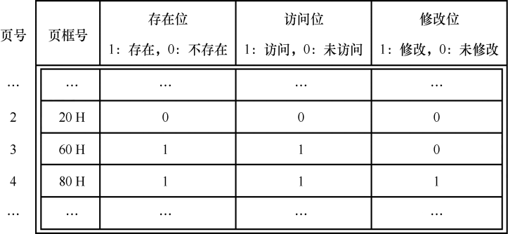
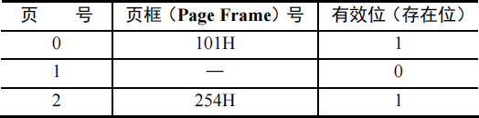
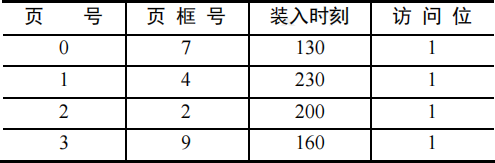
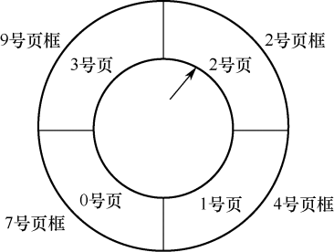
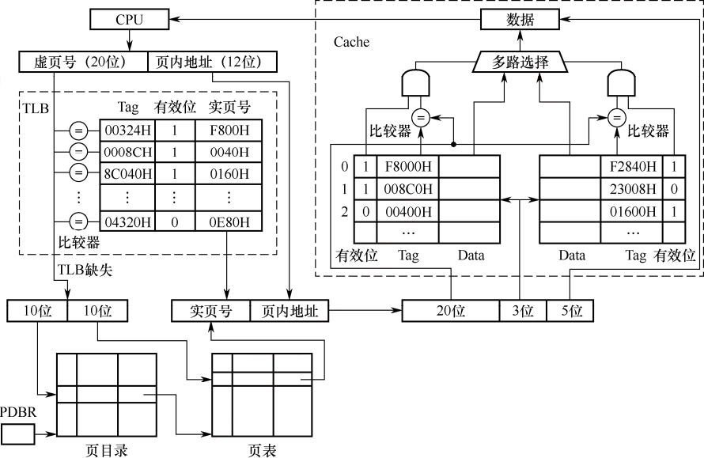

# 操作系统强化

### 存储系统大题专项

#### 专项三：关于单级页表

<question>

(2021) 某请求分页存储系统的页大小为4KB，按字节编址。系统给进程P分配2个固定的页框，并采用改进型Clock置换算法，进程P页表的部分内容如下表所示。若P访问虚拟地址为02A01H的存储单元，则经地址变换后得到的物理地址是 (&emsp;)。

<options :options="['A. 00A01H', 'B. 20A01H', 'C. 60A01H', 'D. 80A01H']" />

::: analysis
答案：C
:::

(2009) 请求分页管理系统中，假设某进程的页表内容见下表。

页面大小为4KB，一次内存的访问时间为100ns，一次快表（TLB）的访问时间为10ns，处理一次缺页的平均时间为108ns（已含更新TLB和页表的时间），进程的驻留集大小固定为2，采用最近最少使用置换算法（LRU）和局部淘汰策略。假设①TLB初始为空；②地址转换时先访问TLB，若TLB未命中，再访问页表（忽略访问页表之后的TLB更新时间）；③有效位为0表示页面不在内存中，产生缺页中断，缺页中断处理后，返回到产生缺页中断的指令处重新执行。设有虚地址访问序列2362H、1565H、25A5H，请问： 
1\) 依次访问上述三个虚地址，各需多少时间？给出计算过程。 
2\) 基于上述访问序列，虚地址1565H的物理地址是多少？请说明理由。

(2010) 设某计算机的逻辑地址空间和物理地址空间均为64KB，按字节编址。若某进程最多需要6页(Page)数据存储空间，页的大小为1KB，操作系统采用固定分配局部置换策略为此进程分配4个页框(Page Frame)。在时刻260前该进程访问情况见下表（访问位即使用位）。

当该进程执行到时刻260时，要访问逻辑地址为17CAH的数据。请回答下列问题： 
1\) 该逻辑地址对应的页号是多少？ 
2\) 若采用先进先出(FIFO)置换算法，该逻辑地址对应的物理地址？要求给出计算过程。采用时钟(CLOCK)置换算法，该逻辑地址对应的物理地址是多少？要求给出计算过程。设搜索下一页的指针按顺时针方向移动，且指向当前2号页框，示意图如下图。

::: analysis
答案：
(1) 17CAH=0001 0111 1100 1010B，页的大小为1KB，低10位表示页内地址，因此逻辑地址对应的页号为101B也就是5。 
(2) FIFO则需要替换最早达到的，因此要替换掉0 号页面，对应页框号为7=111B，因此物理地址为：1 1111 1100 1010B=1FCAH。 
(3) 因为所有页面访问位都是1，因此需要转一圈把访问位全部置0，此时回到2号页，访问位为0，可以替换，找到其对应页框号为2=10B，故物理地址为1011 1100 1010B=0BCAH。 
:::

(2013) 某计算机主存按字节编址，逻辑地址和物理地址都是32位，页表项大小为4字节。请回答下列问题。 
1\) 若使用一级页表的分页存储管理方式，逻辑地址结构为：

则页的大小是多少字节？页表最大占用多少字节？ 
2\) 若使用二级页表的分页存储管理方式，逻辑地址结构为：

设逻辑地址为LA，请分别给出其对应的页目录号和页表索引的表达式。

::: analysis
1\) 页内偏移量12字节，因此页大小为4KB；页表最多占用220×4B=4MB； 
2\) 页目录号占据最高的10位，逻辑右移22 位即可：(((unsigned int)(LA)) >> 22)； 
页表索引占据中间10位，可以先逻辑右移12位，之后把高于10位的清零，此时除4K取余即可，可得式子：(((unsigned int)(LA)) >> 12) %1Kh。 
3\) 采用(1)中的分页存储管理方式，一个代码段起始逻辑地址为0000 8000H，其长度为8KB，被装载到从物理地址0090 0000H开始的连续主存空间中。页表从主存0020 0000H开始的物理地址处连续存放，如下图所示（地址大小自下向上递增）。请计算出该代码段对应的两个页表项的物理地址、这两个页表项中的页框号以及代码页面2的起始物理地址。
:::

(2024) 某计算机按字节编址，采用页式虚拟存储管理方式，虚拟地址和物理地址长度均为32位，页表项的大小为4字节，页大小为4MB，虚拟地址结构如下。

进程P的页表起始虚拟地址为B8C0 0000H，被装载到从物理地址6540 0000H开始的连续主存空间中。请回答下列问题，要求答案用十六进制表示。 
1\) 若CPU在执行进程P的过程中，访问虚拟地址1234 5678H时发生了缺页异常，经过缺页异常处理和MMU地址转换后得到的物理地址是BAB4 5678H，在此次缺页异常处理过程中，需要为所缺页分配页框并更新相应的页表项，则该页表项的虚拟地址和物理地址分别是什么？该页表项的页框号更新后的值是什么？ 
2\) 进程P的页表所在页的页号是多少？该页对应的页表项的虚拟地址是多少？该页表项中的页框号是多少？

</question>

#### 专项四：关于二级页表

<question>

(2015) 某计算机系统按字节编址，采用二级页表的分页存储管理方式，虚拟地址格式如下所示：

请回答下列问题。 
1\) 页和页框的大小各为多少字节？进程的虚拟地址空间大小为多少页？ 
2\) 假定页目录项和页表项均占4个字节，则进程的页目录和页表共占多少页？要求写出计算过程。 
3\) 若某指令周期内访问的虚拟地址为0100 0000H和0111 2048H，则进行地址转换时共访问多少个二级页表？要求说明理由。

::: analysis
（1）根据题意很容易得出，页大小为4KB（12位），页框大小与之相同都为4KB；虚拟地址空间大小为220页。 
（2）页表占：220×4B=4MB，4MB/4KB=1024页；页目录占：210×4B=4KB，4KB/4KB=1；所以二者一共占1024+1=1025页。 
（3）访问0100 0000H和0111 2048H 具有相同的页目录号，都是0000 0001 00B=4，他们俩都访问4号页表，因此只需要访问1个二级页表。
:::

(2017) 假定题44给出的计算机M采用二级分页虚拟存储管理方式，虚拟地址格式如下：

请针对2017年题43的函数f1和题44中的机器指令代码，回答下列问题。
<pre>
int f1(unsigned n){
  int sum=1, power=1;
  for (unsigned i=0; i<=n-1; i++){
    power*=2;
    sum+=power;
  }
  return sum;
}

int  f1(int n){
  1     00401000   55             push ebp
     ...       ...            ...
     if(n>1)
  11    00401018   83 7D 08 01    cmp dword ptr [ebp+8], 1
  12    0040101C   7E 17          jle f1+35h (00401035)
     return n*f1(n-1);
  13    0040101E   8B 45 08       mov eax, dword ptr [ebp+8]
  14    00401021   83 E8 01       sub eax, 1
  15    00401024   50             push eax
  16    00401025   E8 D6 FF FF FF call f1 (00401000)
     ...       ...            ...
  19    00401030   0F AF C1       imul eax, ecx
  20    00401033   EB 05          jmp f1+3Ah (0040103a)
     else return 1;
  21    00401035   B8 01 00 00 00 mov eax, 1
}
     ...       ...            ...
  26    00401040   3B EC          cmp ebp, esp
     ...       ...            ...
  30    0040104A   C3             ret
</pre>

1\) 函数f1的机器指令代码占多少页？ 
2\) 取第1条指令（push ebp）时，若在进行地址变换的过程中需要访问内存中的页目录和页表，则会分别访问它们各自的第几个表项（编号从0开始）？ 
3\) M的I/O采用中断控制方式。若进程P在调用f1之前通过scanf()获取n的值，则在执行scanf()的过程中，进程P的状态会如何变化？CPU是否会进入内核态？

::: analysis
（1）由题意可知页号一共是20位，f1的代码地址都是00401H开头，故都位于同一页上。 
（2）该指令地址为：00401020H=0000 0000 0100 0000 0001 0000 0010 0000B，其页目录号为0000 0000 01B=1号；页表索引为：00 0000 0001B=1号；因此都是访问1号表项。 
（3）执行scanf()的过程中P 会由执行态进入阻塞态，scanf()执行结束则进入就绪态，等待被调度进入执行态；会进入内核态，因为引发了中断，中断需要在内核态进行。
:::

(2018) 请根据题44图给出的虚拟存储管理方式，回答下列问题。

1\) 某虚拟地址对应的页目录号为6，在相应的页表中对应的页号为6，页内偏移量为8，该虚拟地址的十六进制表示是什么？ 
2\) 寄存器PDBR用于保存当前进程的页目录起始地址，该地址是物理地址还是虚拟地址？进程切换时，PDBR的内容是否会变化？说明理由。同一进程的线程切换时，PDBR的内容是否会变化？说明理由。 
3\) 为了支持改进型CLOCK置换算法，需要在页表项中设置哪些字段？

::: analysis
答案：
（1）易得页目录号占10位，页表索引占10位，页内偏移量占12位，所以将其变成二进制。可得：页目录号6=0000 0001 10B，页表索引6=00 0000 0110B，页内偏移量8=0000 0000 1000B，三者拼接，可得16进制为：01806008H。 
（2）该地址为物理地址，表示页目录在内存的实际起始位置；会发生变化，因为进程切换后其地址空间和页目录都会发生对应变化；不会变化，同一进程的线程共享地址空间和PCB，因此不会改变。 
（3）需要增加访问位和修改位。
:::

(2020) 某32位系统采用基于二级页表的请求分页存储管理方式，按字节编址，页目录项和页表项长度均为4字节，虚拟地址结构如下所示。

某C程序中数组a[1024][1024]的起始虚拟地址为1080 0000H，数组元素占4字节，该程序运行时，其进程的页目录起始物理地址为0020 1000H，请回答下列问题。 
1\) 数组元素a[1][2]的虚拟地址是什么？对应的页目录号和页号分别是什么？对应的页目录项的物理地址是什么？若该目录项中存放的页框号为00301H，则a[1][2]所在页对应的页表项的物理地址是什么？ 
2\) 数组a在虚拟地址空间中所占区域是否必须连续？在物理地址空间中所占区域是否必须连续？ 
3\) 已知数组a按行优先方式存放，若对数组a分别按行遍历和按列遍历，则哪一种遍历方式的局部性更好？ 

::: analysis
答案：
（1）a[1][2]的虚拟地址为：1080 0000H+(1024+2)×4B=1080 1008H；页目录号为0001 0000 10B=66，页号为0000 0000 01B=1；对应的页目录项的物理地址是：0020 1000H+66×4B=0020 1108H；a[1][2]所在页对应的页表项的物理地址是：00301H 拼接页内偏移001×4=004H 为0030 10004H。 
（2）虚拟地址空间必须连续，因为数组支持随机访问，逻辑地址需要连续才满足；物理地址可以不连续，请求分页可以把地址拆分存放，不一定连续。 
（3）按行遍历更好，a在内存中也会有大部分的连续存放元素，按照行访问更利于发挥其空间局限性。
:::

</question>