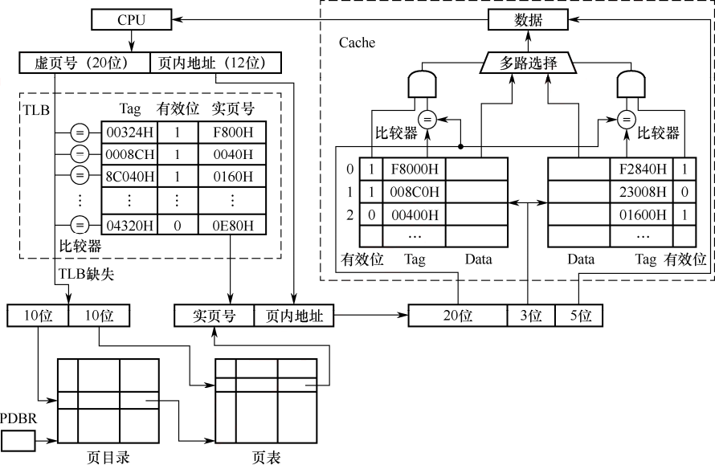
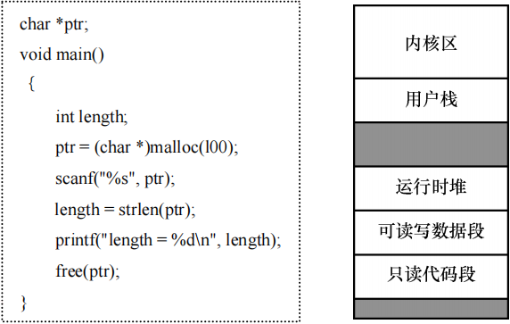
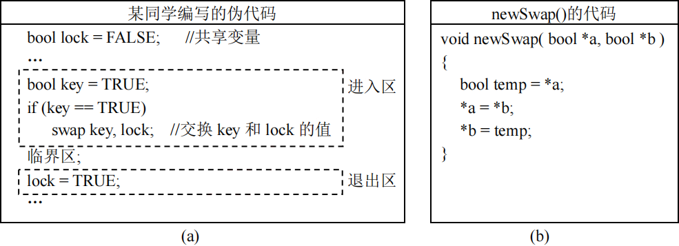
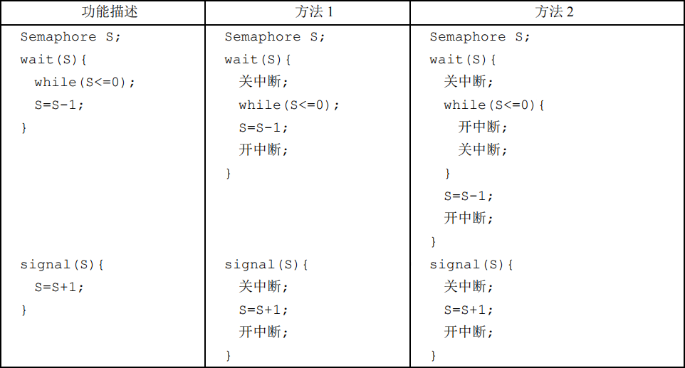
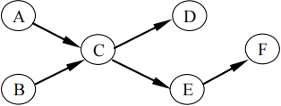

# 操作系统强化题型

## 存储系统大题专项

### 专项一：关于单级页表

<question>

1\. (2021) 某请求分页存储系统的页大小为4KB，按字节编址。系统给进程P分配2个固定的页框，并采用改进型Clock置换算法，进程P页表的部分内容如下表所示。若P访问虚拟地址为02A01H的存储单元，则经地址变换后得到的物理地址是 (&emsp;)。

<options :options="['A. 00A01H', 'B. 20A01H', 'C. 60A01H', 'D. 80A01H']" />

::: answer
答案：C
:::

2\. (2009) 请求分页管理系统中，假设某进程的页表内容见下表。

页面大小为4KB，一次内存的访问时间为100ns，一次快表(TLB)的访问时间为10ns，处理一次缺页的平均时间为108ns（已含更新TLB和页表的时间），进程的驻留集大小固定为2，采用最近最少使用置换算法(LRU)和局部淘汰策略。假设①TLB初始为空；②地址转换时先访问TLB，若TLB未命中，再访问页表（忽略访问页表之后的TLB更新时间）；③有效位为0表示页面不在内存中，产生缺页中断，缺页中断处理后，返回到产生缺页中断的指令处重新执行。设有虚地址访问序列2362H、1565H、25A5H，请问：
1) 依次访问上述三个虚地址，各需多少时间？给出计算过程。
2) 基于上述访问序列，虚地址1565H的物理地址是多少？请说明理由。

3\. (2010) 设某计算机的逻辑地址空间和物理地址空间均为64KB，按字节编址。若某进程最多需要6页(Page)数据存储空间，页的大小为1KB，操作系统采用固定分配局部置换策略为此进程分配4个页框(Page Frame)。在时刻260前该进程访问情况见下表（访问位即使用位）。

当该进程执行到时刻260时，要访问逻辑地址为17CAH的数据。请回答下列问题：
1) 该逻辑地址对应的页号是多少？
2) 若采用先进先出(FIFO)置换算法，该逻辑地址对应的物理地址？要求给出计算过程。采用时钟(CLOCK)置换算法，该逻辑地址对应的物理地址是多少？要求给出计算过程。设搜索下一页的指针按顺时针方向移动，且指向当前2号页框，示意图如下图。

::: answer
1) 17CAH=0001 0111 1100 1010B，页的大小为1KB，低10位表示页内地址，因此逻辑地址对应的页号为101B也就是5。
2) FIFO则需要替换最早达到的，因此要替换掉0 号页面，对应页框号为7=111B，因此物理地址为：1 1111 1100 1010B=1FCAH。
3) 因为所有页面访问位都是1，因此需要转一圈把访问位全部置0，此时回到2号页，访问位为0，可以替换，找到其对应页框号为2=10B，故物理地址为1011 1100 1010B=0BCAH。
:::

4\. (2013) 某计算机主存按字节编址，逻辑地址和物理地址都是32位，页表项大小为4字节。请回答下列问题。
1) 若使用一级页表的分页存储管理方式，逻辑地址结构为：

则页的大小是多少字节？页表最大占用多少字节？

2) 若使用二级页表的分页存储管理方式，逻辑地址结构为：

设逻辑地址为LA，请分别给出其对应的页目录号和页表索引的表达式。

::: answer
1) 页内偏移量12字节，因此页大小为4KB；页表最多占用220×4B=4MB；
2) 页目录号占据最高的10位，逻辑右移22 位即可：(((unsigned int)(LA)) >> 22)；
页表索引占据中间10位，可以先逻辑右移12位，之后把高于10位的清零，此时除4K取余即可，可得式子：(((unsigned int)(LA)) >> 12) %1Kh。
3) 采用(1)中的分页存储管理方式，一个代码段起始逻辑地址为0000 8000H，其长度为8KB，被装载到从物理地址0090 0000H开始的连续主存空间中。页表从主存0020 0000H开始的物理地址处连续存放，如下图所示（地址大小自下向上递增）。请计算出该代码段对应的两个页表项的物理地址、这两个页表项中的页框号以及代码页面2的起始物理地址。
:::

5\. (2024) 某计算机按字节编址，采用页式虚拟存储管理方式，虚拟地址和物理地址长度均为32位，页表项的大小为4字节，页大小为4MB，虚拟地址结构如下。

进程P的页表起始虚拟地址为B8C0 0000H，被装载到从物理地址6540 0000H开始的连续主存空间中。请回答下列问题，要求答案用十六进制表示。
1) 若CPU在执行进程P的过程中，访问虚拟地址1234 5678H时发生了缺页异常，经过缺页异常处理和MMU地址转换后得到的物理地址是BAB4 5678H，在此次缺页异常处理过程中，需要为所缺页分配页框并更新相应的页表项，则该页表项的虚拟地址和物理地址分别是什么？该页表项的页框号更新后的值是什么？
2) 进程P的页表所在页的页号是多少？该页对应的页表项的虚拟地址是多少？该页表项中的页框号是多少？

</question>

### 专项二：关于二级页表

<question>

6\. (2015) 某计算机系统按字节编址，采用二级页表的分页存储管理方式，虚拟地址格式如下所示：

请回答下列问题。
1) 页和页框的大小各为多少字节？进程的虚拟地址空间大小为多少页？
2) 假定页目录项和页表项均占4个字节，则进程的页目录和页表共占多少页？要求写出计算过程。
3) 若某指令周期内访问的虚拟地址为0100 0000H和0111 2048H，则进行地址转换时共访问多少个二级页表？要求说明理由。

::: answer
1) 根据题意很容易得出，页大小为4KB（12位），页框大小与之相同都为4KB；虚拟地址空间大小为220页。
2) 页表占：220×4B=4MB，4MB/4KB=1024页；页目录占：210×4B=4KB，4KB/4KB=1；所以二者一共占1024+1=1025页。
3) 访问0100 0000H和0111 2048H 具有相同的页目录号，都是0000 0001 00B=4，他们俩都访问4号页表，因此只需要访问1个二级页表。
:::

7\. (2017) 假定题44给出的计算机M采用二级分页虚拟存储管理方式，虚拟地址格式如下：

请针对2017年题43的函数f1和题44中的机器指令代码，回答下列问题。
<pre>
  int f1(unsigned n){
    int sum=1, power=1;
    for (unsigned i=0; i<=n-1; i++){
      power*=2;
      sum+=power;
    }
    return sum;
  }

  int  f1(int n){
    1     00401000   55             push ebp
      ...       ...            ...
      if(n>1)
    11    00401018   83 7D 08 01    cmp dword ptr [ebp+8], 1
    12    0040101C   7E 17          jle f1+35h (00401035)
      return n*f1(n-1);
    13    0040101E   8B 45 08       mov eax, dword ptr [ebp+8]
    14    00401021   83 E8 01       sub eax, 1
    15    00401024   50             push eax
    16    00401025   E8 D6 FF FF FF call f1 (00401000)
      ...       ...            ...
    19    00401030   0F AF C1       imul eax, ecx
    20    00401033   EB 05          jmp f1+3Ah (0040103a)
      else return 1;
    21    00401035   B8 01 00 00 00 mov eax, 1
  }
      ...       ...            ...
    26    00401040   3B EC          cmp ebp, esp
      ...       ...            ...
    30    0040104A   C3             ret
</pre>

1) 函数f1的机器指令代码占多少页？
2) 取第1条指令(push ebp)时，若在进行地址变换的过程中需要访问内存中的页目录和页表，则会分别访问它们各自的第几个表项（编号从0开始）？
3) M的I/O采用中断控制方式。若进程P在调用f1之前通过scanf()获取n的值，则在执行scanf()的过程中，进程P的状态会如何变化？CPU是否会进入内核态？

::: answer
1) 由题意可知页号一共是20位，f1的代码地址都是00401H开头，故都位于同一页上。
2) 该指令地址为：00401020H=0000 0000 0100 0000 0001 0000 0010 0000B，其页目录号为0000 0000 01B=1号；页表索引为：00 0000 0001B=1号；因此都是访问1号表项。
3) 执行scanf()的过程中P 会由执行态进入阻塞态，scanf()执行结束则进入就绪态，等待被调度进入执行态；会进入内核态，因为引发了中断，中断需要在内核态进行。
:::

8\. (2018) 请根据题44图给出的虚拟存储管理方式，回答下列问题。

1) 某虚拟地址对应的页目录号为6，在相应的页表中对应的页号为6，页内偏移量为8，该虚拟地址的十六进制表示是什么？
2) 寄存器PDBR用于保存当前进程的页目录起始地址，该地址是物理地址还是虚拟地址？进程切换时，PDBR的内容是否会变化？说明理由。同一进程的线程切换时，PDBR的内容是否会变化？说明理由。
3) 为了支持改进型CLOCK置换算法，需要在页表项中设置哪些字段？

::: answer
1) 易得页目录号占10位，页表索引占10位，页内偏移量占12位，所以将其变成二进制。可得：页目录号6=0000 0001 10B，页表索引6=00 0000 0110B，页内偏移量8=0000 0000 1000B，三者拼接，可得16进制为：01806008H。
2) 该地址为物理地址，表示页目录在内存的实际起始位置；会发生变化，因为进程切换后其地址空间和页目录都会发生对应变化；不会变化，同一进程的线程共享地址空间和PCB，因此不会改变。
3) 需要增加访问位和修改位。
:::

9\. (2020) 某32位系统采用基于二级页表的请求分页存储管理方式，按字节编址，页目录项和页表项长度均为4字节，虚拟地址结构如下所示。

某C程序中数组a[1024][1024]的起始虚拟地址为1080 0000H，数组元素占4字节，该程序运行时，其进程的页目录起始物理地址为0020 1000H，请回答下列问题。
1) 数组元素a[1][2]的虚拟地址是什么？对应的页目录号和页号分别是什么？对应的页目录项的物理地址是什么？若该目录项中存放的页框号为00301H，则a[1][2]所在页对应的页表项的物理地址是什么？
2) 数组a在虚拟地址空间中所占区域是否必须连续？在物理地址空间中所占区域是否必须连续？
3) 已知数组a按行优先方式存放，若对数组a分别按行遍历和按列遍历，则哪一种遍历方式的局部性更好？

::: answer
1) a[1][2]的虚拟地址为：1080 0000H+(1024+2)×4B=1080 1008H；页目录号为0001 0000 10B=66，页号为0000 0000 01B=1；对应的页目录项的物理地址是：0020 1000H+66×4B=0020 1108H；a[1][2]所在页对应的页表项的物理地址是：00301H 拼接页内偏移001×4=004H 为0030 10004H。
2) 虚拟地址空间必须连续，因为数组支持随机访问，逻辑地址需要连续才满足；物理地址可以不连续，请求分页可以把地址拆分存放，不一定连续。
3) 按行遍历更好，a在内存中也会有大部分的连续存放元素，按照行访问更利于发挥其空间局限性。
:::

</question>

### 专项三：主存和外存

<question>

10\. (2010) 假设计算机系统采用CSCAN（循环扫描）磁盘调度策略，使用2KB的内存空间记录16384个磁盘块的空闲状态。（注：此题(1)跟存储器内容无关，会放到后面章节进行讲解）

2) 设某单面磁盘的旋转速度为每分钟6000转，每个磁道有100个扇区，相邻磁道间的平均移动的时间为1ms。若在某时刻，磁头位于100号磁道处，并沿着磁道号增大的方向移动（如下图所示），磁道号的请求队列为50,90,30,120，对请求队列中的每个磁道需读取1个随机分布的扇区，则读完这个扇区点共需要多少时间？要求给出计算过程。
3) 如果将磁盘替换为随机访问的Flash半导体存储器（如U盘、SSD等），是否有比CSCAN更高效的磁盘调度策略？若有，给出磁盘调度策略的名称并说明理由；若无，说明理由。

::: answer
2) 采用CSCAN调度算法，访问磁道的顺序为120、30、50、90，则移动磁道长度为170，总的移动磁道时间为170ms。
由于转速为6000 r/m，则平均旋转延迟为5ms，总的旋转延迟时间=20ms。
由于转速为6000 r/m，则读取一个磁道上一个扇区的平均读取时间为0.1ms，总的读取扇区的时间为0.4ms。读取上述磁道上所有扇区所花的总时间为190.4ms。
3) 采用FCFS（先来先服务）调度策略更高效。因为Flash半导体存储器的物理结构不需要考虑寻道时间和旋转延迟，可直接按I/O请求的先后顺序服务。
:::

11\. (2019) 某计算机系统中的磁盘有300个柱面，每个柱面有10个磁道，每个磁道有200个扇区，扇区大小为512B。文件系统的每个簇包含2个扇区。请回答下列问题。（注：此题(3)第2小问跟存储器内容无关，会放到后面章节进行讲解）
1) 磁盘的容量是多少？
2) 假设磁头在85号柱面上，此时有4个磁盘访问请求，簇号分别为100260、60005、101660 和110560。若采用最短寻道时间优先(SSTF)调度算法，则系统访问簇的先后次序是什么？
3) 第100530簇在磁盘上的物理地址是什么？

::: answer
1) 磁盘容量=(300×10×200×512/1024)KB = 3×10⁵KB。
2) 依次访问的簇是100260、101660、110560、60005。
3) 第100530簇在磁盘上的物理地址由其所在的柱面号、磁头号、扇区号构成。其所在的柱面号为⌊100530/(10×200/2)⌋=100。100530%(10×200/2)=530，磁头号为⌊530/(200/2)⌋=5。扇区号为(530×2)%200=60。
:::

</question>

## 输入输出管理大题专项

<question>

1\. (2012) 操作系统的I/O子系统通常由4个层次组成，每层明确定义了与邻近层次的接口，其合理的层次组织排列顺序是 (&emsp;)。

<options :options="['A. 用户级I/O软件、设备无关软件、设备驱动程序、中断处理程序']" />
<options :options="['B. 用户级I/O软件、设备无关软件、中断处理程序、设备驱动程序']" />
<options :options="['C. 用户级I/O软件、设备驱动程序、设备无关软件、中断处理程序']" />
<options :options="['D. 用户级I/O软件、中断处理程序、设备无关软件、设备驱动程序']" />

::: answer
答案：A。
:::

2\. (2020) 对于具备设备独立性的系统，下列叙述中，错误的是 (&emsp;)。

<options :options="['A. 可以使用文件名访问物理设备']" />
<options :options="['B. 用户程序使用逻辑设备名访问物理设备']" />
<options :options="['C. 需要建立逻辑设备与物理设备之间的映射关系']" />
<options :options="['D. 更换物理设备后必须修改访问该设备的应用程序']" />

::: answer
答案：D。
:::

3\. (2013) 用户程序发出磁盘I/O请求后，系统的处理流程是：用户程序→系统调用处理程序→设备驱动程序→中断处理程序。其中，计算数据所在磁盘的柱面号、磁头号、扇区号的程序是 (&emsp;)。

<options :options="['A. 用户程序', 'B. 系统调用处理程序', 'C. 设备驱动程序', 'D. 中断处理程序']" />

::: answer
答案：C。
:::

4\. (2022) 下列关于驱动程序的叙述中，不正确的是 (&emsp;)。

<options :options="['A. 驱动程序与I/O控制方式无关']" />
<options :options="['B. 初始化设备是由驱动程序控制完成的']" />
<options :options="['C. 进程在执行驱动程序时可能进入阻塞态']" />
<options :options="['D. 读/写设备的操作是由驱动程序控制完成的']" />

::: answer
答案：A。
:::

5. DMA传输前需要进行预处理，传输后需要进行后处理，则下列说法中正确的是 (&emsp;)。

<options :options="['A. 预处理程序运行在用户态，后处理程序运行在内核态']" />
<options :options="['B. 负责预处理和后处理程序的进程都是请求I/O的进程']" />
<options :options="['C. 预处理阶段不需要CPU参与，后处理阶段需要CPU参与']" />
<options :options="['D. 预处理阶段请求I/O的进程处于运行态，后处理阶段处于阻塞态']" />

::: answer
答案：D。
:::

6\. (2019) 某计算机系统中的磁盘有300个柱面，每个柱面有10个磁道，每个磁道有200个扇区，扇区大小为512B。文件系统的每个簇包含2个扇区。请回答下列问题。（注：此题(1)、(2)和(3)第一问在存储器章节讲解过）
3) 将簇号转换成磁盘物理地址的过程是由I/O系统的什么程序完成的？

::: answer
答案：
3) 将簇号转换成磁盘物理地址的过程由磁盘驱动程序完成。
:::

7\. (2017) 假定题44给出的计算机M采用二级分页虚拟存储管理方式，虚拟地址格式如下：

请针对2017年题43的函数f1和题44中的机器指令代码，回答下列问题。
<pre>
  int f1(unsigned n){
    int sum=1, power=1;
    for (unsigned i=0; i<=n-1; i++){
      power*=2;
      sum+=power;
    }
    return sum;
  }

  int  f1(int n){
    1     00401000   55             push ebp
      ...       ...            ...
      if(n>1)
    11    00401018   83 7D 08 01    cmp dword ptr [ebp+8], 1
    12    0040101C   7E 17          jle f1+35h (00401035)
      return n*f1(n-1);
    13    0040101E   8B 45 08       mov eax, dword ptr [ebp+8]
    14    00401021   83 E8 01       sub eax, 1
    15    00401024   50             push eax
    16    00401025   E8 D6 FF FF FF call f1 (00401000)
      ...       ...            ...
    19    00401030   0F AF C1       imul eax, ecx
    20    00401033   EB 05          jmp f1+3Ah (0040103a)
      else return 1;
    21    00401035   B8 01 00 00 00 mov eax, 1
  }
      ...       ...            ...
    26    00401040   3B EC          cmp ebp, esp
      ...       ...            ...
    30    0040104A   C3             ret
</pre>

3) M的I/O采用中断控制方式。若进程P在调用f1之前通过scanf()获取n的值，则在执行scanf()的过程中，进程P的状态会如何变化？CPU是否会进入内核态？（注：此题前几个问在存储系统章节讲解过）

::: answer
3) 执行scanf()的过程中P会由执行态进入阻塞态，scanf()执行结束则进入就绪态，等待被调度进入执行态；会进入内核态，因为引发了中断，中断需要在内核态进行。
:::

8\. (2023) 进程P通过执行系统调用从键盘接收一个字符的输入。已知此过程中与进程P相关的操作包括：①将进程P插人就绪队列；②将进程P插人阻塞队列；③将字符从键盘控制器读人系统缓冲区；④启动键盘中断处理程序；③进程P从系统调用返回；用户在键盘上输人字符。以上编号①~⑥仅用于标记操作，与操作的先后顺序无关。请回答下列问题。
1) 按照正确的操作顺序，操作①的前一个和后一个操作分别是上述操作中的哪一个？操作⑥的后一个操作是上述操作中的哪一个？
2) 在上述哪个操作之后，CPU一定从进程P切换到其他进程？在上述哪个操作之后CPU调度程序才能选中进程P执行？
3) 完成上述哪个操作的代码属于键盘驱动程序？
4) 键盘中断处理程序执行时，进程P处于什么状态？CPU处于内核态还是用户态？

::: answer
1) 其正常操作顺序应为：②→⑥→④→③→①→⑤；因此①的前一个是③，后一个是⑤；⑥的后一个是④。
2) ②操作后发生进程切换；①之后。
3) ③属于磁盘驱动程序。
4) 阻塞态；CPU处于内核态。
:::

9\. (2021) 某计算机用硬盘作为启动盘，硬盘第一个扇区存放主引导记录，其中包含磁盘引导程序和分区表。磁盘引导程序用于选择要引导哪个分区的操作系统，分区表记录硬盘上各分区的位置等描述信息。硬盘被划分成若干个分区，每个分区的第一个扇区存放分区引导程序，用于引导该分区中的操作系统。系统采用多阶段引导方式，除了执行磁盘引导程序和分区引导程序外，还需要执行ROM中的引导程序。请回答下列问题：
1) 系统启动过程中操作系统的初始化程序、分区引导程序、ROM中的引导程序、磁盘引导程序的执行顺序是什么？
2) 把硬盘制作为启动盘时，需要完成操作系统的安装、磁盘的物理格式化、逻辑格式化、对磁盘进行分区，执行这4个操作的正确顺序是什么？
3) 磁盘扇区的划分和文件系统根目分别是在第(2)问的哪个操作中完成的？

::: answer
1) 顺序依次是ROM中的引导程序、磁盘引导程序、分区引导程序、操作系统的初始化程序。
2) 执行顺序依次是磁盘的物理格式化、对磁盘进行分区、逻辑格式化、操作系统的安装。
3) 磁盘扇区的划分是在磁盘的物理格式化操作中完成的；文件系统根目录的建立是在逻辑格式化操作中完成的。
:::

</question>

## 进程管理大题专项

### 专项一：进程同步

<question>

1\. (2016) 某进程调度程序采用基于优先数(priority)的调度策略，即选择优先数最小的进程运行，进程创建时由用户指定一个nice作为静态优先数。为了动态调整优先数，引入运行时间cpuTime和等待时间waitTime，初值均为O。进程处于执行态时，cpuTime定时加1，且WaitTime置0；进程处于就绪态时，cpuTime置0，waitTime定时加1。请回答下列问题。
1) 若调度程序只将nice的值作为进程的优先数，即priority=nice，则可能会出现饥饿现象，为什么？
2) 使用nice、cpuTime和waitTime设计一种动态优先数计算方法，以避免产生饥饿现象，并说明waitTime的作用。

::: answer
1) nice 作为静态优先数不变，因此若有优先级高的进程源源不断执行，则优先级低的进程没有机会被执行，处于饥饿状态。
2) 设置动态优先数：令priority=nice+cpuTime-waitTime，此时当进程执行态时间越久，priority越大，优先级变低；进程就绪态时间越久，priority越小，优先级越低。使得原先优先级高的和长时间不执行的进程都有竞争优势，消除饥饿。
:::

2\. (2025) 某系统中进程的虚拟地址空间包括内核区、用户栈、运行时堆、可读写数据段、只读代码段等区域，其布局如下图所示，图中阴影部分表示未占用区域。现有C语言程序的部分代码如下。

请回答下列问题。
1) 上述程序执行时，其进程控制块位于哪个区域？执行scanf()等待键盘输入时，该进程处于什么状态？
2) main()函数的代码位于哪个区域？其直接调用的哪些函数的功能需要通过执行驱动程序实现？
3) 变量ptr被分配在哪个区域？若变量length 没有被分配在寄存器中，则会被分配在哪个区域？ptr指向的字符串位于哪个区域？

::: answer
1) 进程控制块位于内核区。该进程处于阻塞态。
2) main()函数的代码位于只读代码段。scanf()和printf()的功能需要通过执行驱动程序实现。
3) ptr被分配在可读写数据段中。length被分配在用户栈中。ptr指向的字符串位于运行时堆中。
:::

3\. (2023) 现要求学生使用swap指令和布尔型变量lock实现临界区互斥。lock为线程间共享的变量。lock的值为TRUE时线程不能进人临界区，为FALSE时线程能够进人临界区。某同学编写的实现临界区互斥的伪代码如下图(a)所示。

请回答下列问题。
1) 图(a)的伪代码中哪些语句存在错误？将其改为正确的语句（不增加语句条数）。
2) 图(b)给出了交换两个变量值的函数newSwap()的代码，是否可以用函数调用语句“newSwap(&key,&lock)”代替指令“swap key,lock”以实现临界区互斥？为什么？

::: answer
1) 进入区中的语句“if(key==TRUE) swap key,lock”存在错误，修改为“while(key==TRUE) swap key,lock”。退出区中的语句“lock=TRUE”存在错误，修改为“lock=FALSE”。
2) 否。因为多个线程可以并发执行newSwap()，newSwap()执行时传递给形参b的是共享变量lock的地址，在newSwap()中对lock既有读操作又有写操作，并发执行时不能保证实现两个变量值的原子交换，从而会导致并发执行的线程同时进入临界区。
:::

4\. (2021) 下表给出了整型信号量S的wait()和signal()操作的功能描述，以及采用开/关中断指令实现信号量操作互斥的两种方法。

请回答下列问题：
1) 为什么在wait()和signal()操作中对信号量S的访问必须互斥执行？
2) 分别说明方法1和方法2是否正确。若不正确，请说明理由。
3) 用户程序能否使用开/关中断指令实现临界区互斥？为什么？

::: answer
1) 因为信号量S是能够被多个进程共享的变量，多个进程都可以通过wait()和signal()对S进行读写操作。所以，在wait()和signal()操作中对S的访问必须是互斥的。
2) 方法1是错误的。在wait()中，当S<=0时，关中断后，其他进程无法修改S的值，while语句陷入死循环。方法2是正确的。
3) 用户程序不能使用开/关中断指令实现临界区互斥。因为开中断和关中断指令都是特权指令。
:::

5\. (2024) 计算机系统中的进程之间往往需要相互协作以完成一个任务。在某网络系统中，缓冲区B用于存放一个数据分组，对B的操作有C1、C2和C3。C1将一个数据分组写人B中，C2从B中读出一个数据分组，C3对B中的数据分组进行修改。要求B为空时才能执行C1，B非空时才能执行C2和C3。请回答下列问题。
1) 假设进程P1和P2都需要执行C1，实现C1的代码是否为临界区？为什么？
2) 假设B初始为空，进程P1执行C1一次，进程P2执行C2一次。请定义尽可能少的信号量，并用wait()，signal()操作描述进程P1和P2之间的同步或互斥关系，说明所用信号量的作用及其初值。

::: answer
1) 实现C1代码是临界区，因为代码C1执行对B的写操作，且P1、P2需要互斥执行C1。
2) 进程P1和P2的同步伪代码如下。
<pre>
  semaphore S=0; // 实现进程P1和P2的同步
  P1 {
    ...
    C1;
    signal(S);
    ...
  }
  P2 {
    ...
    wait(S);
    C2;
    ...
  }
</pre>
3) 进程P1和P2的互斥伪代码如下。
<pre>
  semaphore mutex=1; // 实现进程P1和P2的互斥执行C3
  P1 {
    ...
    wait(mutex);
    C3;
    signal(mutex);
    ...
  }
  P2 {
    ...
    wait(mutex);
    C3;
    signal(mutex);
    ...
  }
</pre>
:::

</question>

### 专项二：PV操作

<question>

6\. (2009) 三个进程 P1、P2、P3互斥使用一个包含N(N>0)个单元的缓冲区。P1每次用produce()生成一个正整数并用put()送入缓冲区某一空单元中；P2每次用getodd()从该缓冲区中取出一个奇数并用countodd()统计奇数个数；P3每次用geteven()从该缓冲区中取出一个偶数并用counteven()统计偶数个数。请用信号量机制实现这三个进程的同步与互斥活动，并说明所定义信号量的含义。要求用伪代码描述。

::: answer
<pre>
  semaphore mutex=1; //互斥访问缓冲区
  semaphore empty=N; //缓冲区剩余数量
  semaphore odd=0;   //缓冲区奇数数量
  semaphore even=0;  //缓冲区偶数数量
  Process P1(){              Process P2(){              Process P3(){
    while(1){                  while(1){                  while(1){
      int n=produce();           P(odd);                    P(even);
      P(empty);                  p(mutex);                  p(mutex);
      P(mutex);                  int n=getodd();            int n=geteven();
      put();                     V(mutex);                  V(mutex);
      V(mutex);                  V(empty);                  V(empty);
      if(n%2==0)                 countodd(n);               counteven(n);
        v(even);               }                          }
      else                   }                          }
        V(odd);
    }
  }
</pre>
:::

7\. (2011) 某银行提供1个服务窗口和10个供顾客等待的座位。顾客到达银行时，若有空座位，则到取号机上领取一个号，等待叫号。取号机每次仅允许一位顾客使用。当营业员空闲时，通过叫号选取一位顾客，并为其服务。顾客和营业员的活动过程描述如下：
<pre>
  cobegin {
    process 顾客i {
      从取号机获取一个号码；
      等待叫号；
      获取服务；
    }
    process 营业员 {
      while (TRUE) {
        叫号；
        为顾客服务；
      }
    }
  } coend
</pre>
请添加必要的信号量和P、V（或wait()、signal()）操作，实现上述过程中的互斥与同步。要求写出完整的过程，说明信号量的含义并赋初值。

::: answer
<pre>
  semaphore service_i=0; //保证顾客被叫号才能接受服务，顾客编号为i
  semaphore empty=10;    //空闲座位数
  semaphore customer=0;  //顾客数量
  semaphore machine=1;   //互斥访问叫号机
  process 顾客i {
    P(empty); //占用一个座位
    P(machine);
    从取号机获得一个号码
    V(machine);
    等待叫号;
    V(customer); //增添一个顾客
    P(service_i); //服务员未叫号需等待
    获得服务;
  }
  process 营业员 {
    while (TRUE) {
      P(customer); //选中一个顾客
      V(service_i); //服务员开始叫号
      叫号;
      V(empty); //释放座位
      为顾客服务;
    }
  }
</pre>
:::

8\. (2013) 某博物馆最多可容纳500人同时参观，有一个出入口，该出入口一次仅允许一人通过。参观者的活动描述如下：
<pre>
  cobegin {
    process 参观者i {
      进入入口；
      参观；
      走出入口；
    }
  } coend
</pre>
请添加必要的信号量和P、V（或wait()、signal()）操作，实现上述过程中的互斥与同步。要求写出完整的过程，说明信号量的含义并赋初值。

::: answer
<pre>
  semaphore mutex=1; //互斥访问出入口
  semaphore empty=500; //剩余参观名额
  参观者进程i()
  {
    P(empty);
    P(mutex);
    进门;
    V(mutex);
    参观;
    P(mutex);
    出门;
    V(mutex);
    V(empty);
  }
</pre>
:::

9\. (2014) 系统中有多个生产者进程和多个消费者进程，共享一个能存放1000件产品的环形缓冲区（初始为空）。当缓冲区未满时，生产者进程可以放入其生产的一件产品，否则等待；当缓冲区未空时，消费者进程可以从缓冲区取走一件产品，否则等待。要求一个消费者进程从缓冲区连续取出10件产品后，其他消费者进程才可以取产品。请使用信号量P，V（或wait()，signal()）操作实现进程间的互斥与同步，要求写出完整的过程，并说明所用信号量的含义和初值。

::: answer
<pre>
  semaphone mutex=1;    //互斥访问缓冲区
  semaphone empty=1000; //缓冲区余量
  semaphone produce=0;  //产品数量
  semaphone take=1;     //保证连续拿10个
  int n=10;
  producer() { //生产者
    while(1) {
    生产一个产品;
      P(empty); //判断缓冲区是否有空闲
      P(mutex); //对缓冲区上锁
      将产品放入空闲缓冲区;
      V(mutex); //对缓冲区解锁
      V(produce); //产品数量+1
    }
  }
  consumer(){ //消费者
    while(1) {
      P(take); //保证连续拿10 个
      for(int i=0;i&lt;n;i++) {
      P(produce); //判断缓冲区是否有产品
      P(mutex); //对缓冲区上锁
      从缓冲区取走一个产品;
      V(mutex); //对缓冲区解锁
      V(empty); //空闲区数量+1
      }
      V(take);
    }
  }
</pre>
:::

10\. (2015) 有A、B两人通过信箱进行辩论，每个人都从自已的信箱中取得对方的问题。将答案和向对方提出的新问题组成一个邮件放入对方的邮箱中。假设A的信箱最多放M个邮件，B的信箱最多放N个邮件。初始时A的信箱中有x个邮件(0<x<M)，B的信箱中有y个(0<x<N)。辩论者每取出一个邮件，邮件数减1。A和B两人的操作过程描述如下：
<pre>
  CoBegin
  {
    A {                             B {
      while(TRUE){                    while(TRUE){
        从A的信箱中取出一个邮件；        从B的信箱中取出一个邮件；
        回答问题并提出一个新问题；        回答问题并提出一个新问题；
        将新邮件放入B的信箱；            将新邮件放入A的信箱；
      }                               }
    }                               }
  } CoEnd
</pre>
当信箱不为空时，辩论者才能从信箱中取邮件，否则需要等待。当信箱不满时，辩论者才能将新邮件放入信箱，否则需要等待。请添加必要的信号量和P、V（或 wait、signal）操作，以实现上述过程的同步。要求写出完整过程，并说明信号量的含义和初值。

::: answer
<pre>
  semaphore mutexA=1; //用以信箱A的互斥访问
  semaphore mutexB=1; //用以信箱B的互斥访问
  semaphore emptyA=M-x; //用以判断A信箱是否为满
  semaphore emptyB=N-y; //用以判断B信箱是否为满
  semaphore mailA=x; //用以记录A的信件数
  semaphore mailB=y; //用以记录B的信件数
  A() {                               B() {
    while (true) {                      while (true) {
      P(mailA);                           P(mailB);
      P(mutexA);                          P(mutexB);
      从A的信箱中取出一个邮件;             从B的信箱中取出一个邮件;
      V(mutexA);                          V(mutexB);
      V(emptyA);                          V(emptyB);
      回答问题并提出一个新问题;             回答问题并提出一个新问题;
      P(emptyB);                          P(emptyA);
      P(mutexB);                          P(mutexA);
      将新邮件放入B的信箱;                 将新邮件放入A的信箱;
      V(mutexB);                          V(mutexA);
      V(mailB);                           V(mailA);
    }                                   }
  }                                   }
</pre>
:::

11\. (2025) 甲、乙、内三人一起植树，甲负责挖树坑，乙负责将树苗放入树坑中并填土，内负责为新种的树苗浇水。植树的步骤依次为：挖树坑、放树苗、填土和浇水。现有铁锹和水桶各1个，铁锹用于挖树坑和填土，水桶用于浇水。当树坑的数量小于3时，甲才可以挖树坑。假设初始时树坑的数量为0，铁锹和水桶均可用。请定义尽可能少的信号量，用wait()、signal()操作描述植树过程中三人之间的同步或互厅关系，并说明所用信号量的作用及其初值。

::: answer
<pre>
  semaphore position=3; // 可挖树坑的数量
  semaphore pit=0; // 树坑的数量
  semaphore tree=0;
  semaphore mutex=1;
  甲() {                    乙() {                     丙() {
    wait(position);           wait(pit);                 wait(tree);
    wait(mutex);              放树苗;                     浇水;
    挖树坑;                   signal(position);           …
    signal(mutex);            wait(mutex);             }
    signal(pit);              填土;
    …                         signal(mutex);
  }                           signal(tree);
                              …
                            }
</pre>
:::

12\. (2017) 某进程中有3个并发执行的线程thread1、thread2和thread3，其伪代码如下所示。

请添加必要的信号量和 P、V（或 wait()、signal()）操作，要求确保线程互斥访问临界资源、并且最大限度地并发执行。

::: answer
<pre>
  semaphore mutex_y1=1; //控制thread1和thread3直接的y变量互斥访问
  semaphore mutex_y2=1; //控制thread2和thread3直接的y变量互斥访问
  semaphore mutex_z=1;
  //控制thread2和thread3直接的z变量互斥访问
  thread1{               thread2{                 thread3{
    cnum w;                cnum w;                  cnum w;
    P(mutex_y1);           P(mutex_y2);             w.a=1;
    w=add(x,y);            P(mutex_z);              w.b=2;
    V(mutex_y1);           w=add(y,z);              P(mutex_z);
    ...                    V(mutex_z);              z=add(z,w);
  }                        V(mutex_y2);             V(mutex_z)
                          ...                      P(mutex_y1);
                        }                          P(mutex_y2);
                                                    y=add(y,w);
                                                    V(mutex_y1);
                                                    V(mutex_y2);
                                                    ...
                                                  }
</pre>
:::

13\. (2019) 有n（n≥3）位哲学家围坐在一张圆桌边，每位哲学家交替地就餐和思考。在圆桌中心有m(m≥1)个碗，每两位哲学家之间有一根筷子。每位哲学家必须取到一个碗和两侧的筷子后，才能就餐，进餐完毕，将碗和筷子放回原位，并继续思考。为使尽可能多的哲学家同时就餐，且防止出现死锁现象，请使用信号量的P、V操作（wait()、signal()操作）描述上述过程中的互斥与同步，并说明所用信号量及初值的含义。

::: answer
<pre>
  semaphore bowl; // 用于协调哲学家对碗的使用
  semaphore chopsticks[n]; // 用于协调哲学家对筷子的使用
  for (int i=0; i&lt;n; i++)
    chopsticks[i].value = 1; // 设置两个哲学家之间筷子的数量
  bowl.value = min(n-1, m); // bowl.value ≤n-1，确保不死锁
  while (true) {
    思考;
    P(bowl); // 取碗
    P(chopsticks[i]); // 取左边筷子
    P(chopsticks[(i+1) % n]); // 取右边筷子
    就餐;
    V(chopsticks[i]); // 放回左边筷子
    V(chopsticks[(i+1) % n]); // 放回右边筷子
    V(bowl); // 放回碗
  }
</pre>
:::

14\. (2020) 现有5个操作A、B、C、D和E，操作C必须在A和B完成后执行，操作E必须在C和D完成后执行，请使用信号量的wait()、signal()操作（P、V操作）描述上述操作之间的同步关系，并说明所用信号量及其初值。

::: answer
<pre>
  semaphore S_AC = 0; //控制操作A和C的执行顺序
  semaphore S_BC = 0; //控制操作B和C的执行顺序
  semaphore S_CE = 0; //控制操作C和E的执行顺序
  semaphore S_DE = 0; //控制操作D和E的执行顺序
  Process A() {
    完成操作A;
    V(S_AC);
  }
  Process B() {
    完成操作B;
    V(S_BC);
  }
  Process C() {
    P(S_AC);
    P(S_BC);
    完成操作C;
    V(S_CE);
  }
  Process D() {
    完成操作D;
    V(S_DE);
  }
  Process E() {
    P(S_CE);
    P(S_DE);
    完成操作E;
  }
</pre>
:::

15\. (2020) 某进程的两个线程T1和T2并发执行A、B、C、D、E和F共6个操作，其中T1执行A、E和F，T2执行B、C和D。右图表示上述6个操作的执行顺序所必须满足的约束：C在A和B完成后执行，D和E在C完成后执行，F在E完成后执行。请使用信号量的wait()、signal()操作描述T1和T2之间的同步关系，并说明所用信号量的作用及其初值。

::: answer
<pre>
  semaphore S_AC=0, S_BC=0, S_CD=0, S_CE=0, S_EF=0;
  Process T1(){
    执行A;
    V(S_AC);
    P(S_CE);
    执行E;
    V(S_EF);
    P(S_EF);
    执行F;
  }
  Process T2(){
    执行B;
    V(S_BC);
    P(S_BC);
    P(S_AC);
    执行C;
    V(S_CE);
    V(S_CD);
    P(S_CD);
    执行D;
  }
</pre>
化简：
<pre>
  semaphore S_AC=0, S_CE=0;
  Process T1(){
    执行A;
    V(S_AC);
    P(S_CE);
    执行E;
    执行F;
  }
  Process T2(){
    执行B;
    P(S_AC);
    执行C;
    V(S_CE);
    执行D;
  }
</pre>
:::

</question>