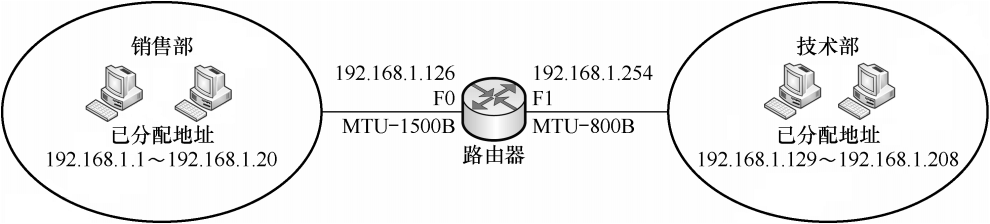
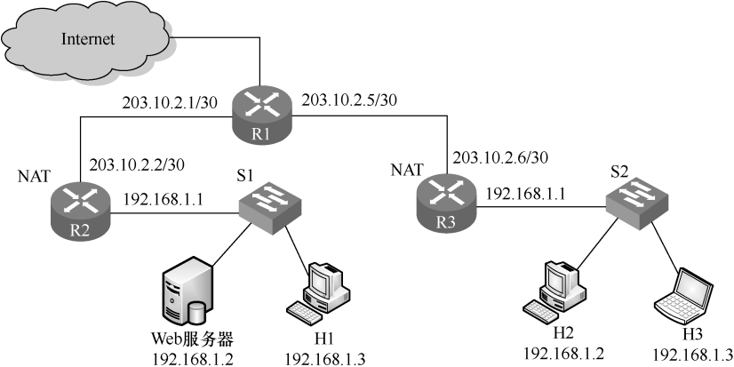
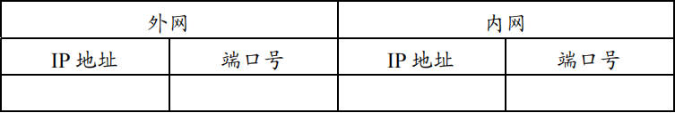
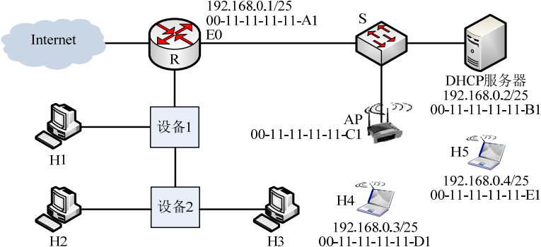
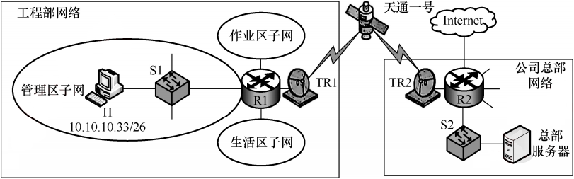
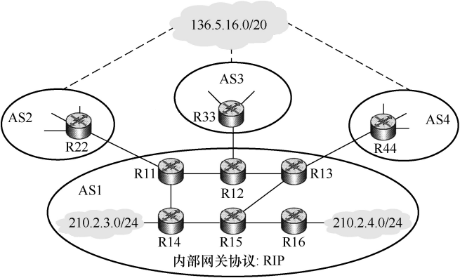
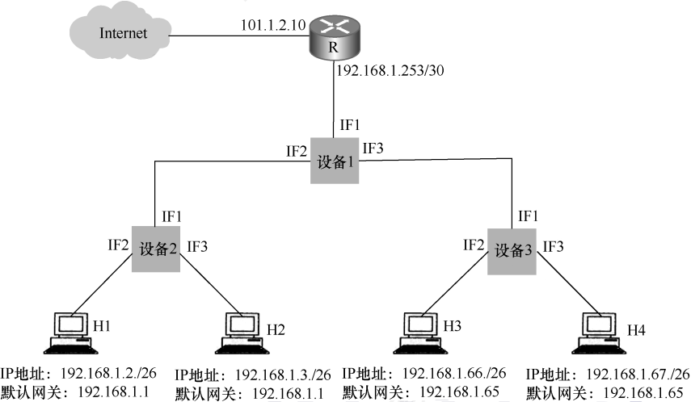
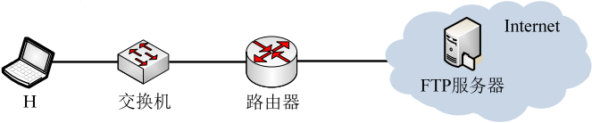
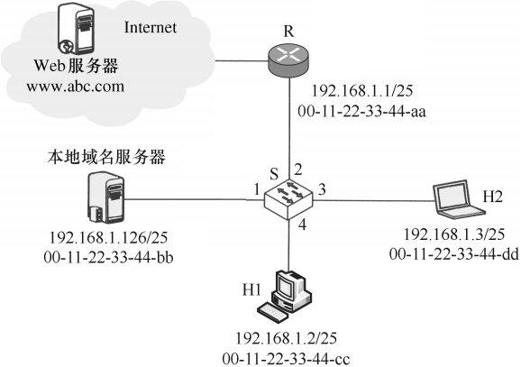

# 计网强化题型

## 第三章 数据链路层

1\. (2010) 某局域网采用CSMA/CD协议实现介质访问控制，数据传输速率为10Mbps，主机甲和主机乙之间的距离为2km，信号传播速度为200000km/s。请回答下列问题，要求说明理由或写出计算过程。
1) 若主机甲和主机乙发送数据时发生冲突，则从开始发送数据时刻起，到两台主机均检测到冲突时刻止，最短需经过多长时间？最长需经过多长时间？（假设主机甲和主机乙发送数据过程中，其他主机不发送数据）
2) 若网络不存在任何冲突与差错，主机甲总是以标准的最长以太网数据帧(1518B)向主机乙发送数据，主机乙每成功收到一个数据帧后立即向主机甲发送一个64B的确认，主机甲收到确认帧后方可发送下一个数据帧。此时主机甲的有效数据传输速率是多少？（不考虑以太网的前导码）

2\. (2017) 甲乙双方均采用后退N帧协议(GBN)进行持续的双向数据传输，且双方始终采用捎带确认，帧长均为1000B。Sx,y和Rx,y分别表示甲方和乙方发送的数据帧，其中x是发送序号；y是确认序号（表示希望接收对方的下一帧序号）；数据帧的发送序号和确认序号字段均为3比特。信道传输速率为100Mbps，RTT=0.96ms。下图给出了甲方发送数据帧和接收数据帧的两种场景，其中t0为初始时刻，此时甲方的发送和确认序号均为0，t1时刻甲方有足够多的数据待发送。

请回答下列问题。
1) 对于图(a)，t₀时刻到t₁时刻期间，甲方可以断定乙方已正确接收的数据帧数是多少？正确接收的是哪几个帧？（请用Sₓ‚ᵧ形式给出）
2) 对于图(a)，从t₁时刻起，甲方在不出现超时且未收到乙方新的数据帧之前，最多还可以发送多少个数据帧？其中第一个帧和最后一个帧分别是哪个？（请用Sₓ‚ᵧ形式给出）
3) 对于图(b)，从t₁时刻起，甲方在不出现新的超时且未收到乙方新的数据帧之前，需要重发多少个数据帧？重发的第一个帧是哪个？（请用Sₓ‚ᵧ形式给出）
4) 甲方可以达到的最大信道利用率是多少？

## 第四章 网络层

1\. (2009) 某网络拓扑如下图所示，路由器R1通过接口E1、E2分别连接局域网1、局域网2，通过接口L0连接路由器R2，并通过路由器R2连接域名服务器与互联网。R1的L0接口的IP地址是202.118.2.1，R2的L0接口的IP地址是202.118.2.2，L1接口的IP地址是130.11.120.1，E0接口的IP地址是202.118.3.1，域名服务器的IP地址是202.118.3.2。R1和R2的路由表结构如下：

1) 将IP地址空间202.118.1.0/24划分为2个子网分别分配给局域网1、局域网2，每个局域网需分配的IP地址数不少于120个。请给出子网划分结果，说明理由或给出必要的计算过程。
2) 请给出R1的路由表，使其明确包括到局域网1的路由、局域网2的路由、域名服务器的主机路由和互联网的路由。
3) 请采用路由聚合技术，给出R2到局域网1和局域网2的路由。

2\. (2015) 某网络拓扑如下图所示，其中路由器内网接口、DHCP服务器、WWW服务器与主机1均采用静态IP地址配置，相关地址信息见图中标注；主机2~主机N通过DHCP服务器动态获取IP地址等配置信息。

请回答下列问题。
1) DHCP服务器可为主机2~主机N 动态分配IP地址的最大范围是什么？主机2使用DHCP协议获取IP地址的过程中，发送的封装DHCP Discover报文的IP分组的源IP地址和目的IP地址分别是什么？
2) 若主机2的ARP表为空，则该主机访问Internet时，发出的第一个以太网帧的目的MAC地址是什么？封装主机2发往Internet的IP分组的以太网帧的目的MAC地址是什么？
3) 若主机1的子网掩码和默认网关分别配置为255.255.255.0和111.123.15.2，则该主机是否能访问WWW服务器？是否能访问Internet？请说明理由。

3\. (2018) 某公司的网络如下图所示。IP地址空间192.168.1.0/24被均分给销售部和技术部两个子网，并已分别为部分主机和路由器接口分配了IP地址，销售部子网的MTU=1500B，技术部子网的MTU=800B。

请回答下列问题：
1) 销售部子网的广播地址是什么？技术部子网的子网地址是什么？若每个主机仅分配一个IP地址，则技术部子网还可以连接多少台主机？
2) 假设主机192.168.1.1向主机192.168.1.208发送一个总长度为1500B的IP分组，IP分组的头部长度为20B，路由器在通过接口F1转发该IP分组时进行了分片。若分片时尽可能分为最大片，则一个最大IP分片封装数据的字节数是多少？至少需要分为几个分片？每个分片的片偏移量是多少？

4\. (2020) 某校园网有两个局域网，通过路由器R1、R2 和 R3互联后接人Internet，S1和S2为以太网交换机。局域网采用静态IP地址配置，路由器部分接口以及各主机的IP地址如下图所示。

假设NAT转换表结构为：

请回答下列问题：
1) 为使H2和H3能访问Web服务器（使用默认端口号），需要进行什么配置？给出具体配置。
2) 若H2主动访问Web服务器时，将HTTP请求报文封装到IP数据报P中发送，则H2发送P的源IP地址和目的IP地址分别是什么？经过R3转发后，P的源IP地址和目的IP地址分别是什么？经过R2转发后，P的源IP地址和目的IP地址分别是什么？

5\. (2022) 某网络拓扑如下图所示，R为路由器，S为以太网交换机，AP是802.11接人点，路由器的E0接口和DHCP服务器的IP地址配置如下图所示。H1与H2属于同一个广播域，但不属于同一个冲突域；H2和H3属于同一个冲突域；H4和H5已经接人网络，并通过DHCP动态获取了IP地址。现有路由器、100BaseT以太网交换机和100BaseT集线器(Hub)三类设备各若干台。
请回答下列问题：
1) 设备1和设备2应该分别选择哪类设备？
2) 若信号传播速度为2×10*m/s，以太网最小帧长为64B，信号通过设备2时会产生额外的1.51us的时间延迟，则H2与H3之间可以相距的最远距离是多少？
3) 在H4通过DHCP动态获取IP地址过程中，H4首先发送了DHCP报文M，M是哪种DHCP报文？路由器EO接口能否收到封装M的以太网帧？S向DHCP服务器转发的封装M的以太网帧的目的MAC地址是什么？
4) 若H4向H5发送一个IP分组P，则H5收到的封装P的802.11帧的地址1、地址2和地址3分别是什么？

6\. (2025) 某公司在承建国家重大工程项目时，工程部需要较长时间驻扎在偏远山区，工程部网络需要连接公司总部网络。假设综合考虑方案的技术可行性、安全性与经济成本等因素后，决定租用我国自主建设的天通一号卫星通信链路，连接工程部网络的路由器R1和公司总部网络的路由器R2，如下图所示。S1和S2为千兆以太网交换机；TR1和TR2是卫星信号地面收发设备，实现全双工调制解调。天通一号卫星轨道高度是36000km，电磁波信号传播速度为300000km/s。租用的卫星链路为R1和R2之间提供对称全双工信道，每个方向的数据传输速率为200kb/s。

请回答下列问题。
1) 若忽略卫星信号中继以及TR1和TR2调制解调的时间开销，则R1到R2之间卫星链路的单向传播时延是多少？主机H向总部服务器传输数据时可以达到的最大吞吐量是多少？若忽略各层协议数据包的首部开销以及以太网内的传播时延，则主机H向总部服务器上传一个4000B大小的工程进度报告文件，至少需要多长时间？(3分)
2) 现需要基于GBN滑动窗口协议为卫星链路设计单向可靠的数据链路层协议SLP，支持R1向R2发送数据，SLP数据帧长为1500B，忽略ACK帧长度。若要求SLP的单向信道利用率不低于80%，则SLP的发送窗口至少为多少？SLP帧的序号字段至少需要多少位？(3分)
3) 若公司总部为工程部网络分配的IP地址空间是10.10.10.0/24，工程部进一步将该IP地址空间分配给3个子网，其中生活区子网可分配IP地址数不少于120个，作业区子网和管理区子网可分配IP地址数均不少于60个，且主机H已正确配置了IP地址，则作业区子网、管理区子网和生活区子网的子网地址分别是什么（给出CIDR地址形式）？(3分)

7\. (2013) 假设Internet的两个自治系统构成的网络如题47图所示，自治系统AS1由路由器R1连接两个子网构成；自治系统AS2由路由器R2、R3互联并连接3个子网构成。各子网地址、R2的接口名、R1与R3的部分接口IP地址如题47图所示。

请回答下列问题。
1) 假设路由表结构如下表所示。请利用路由聚合技术，给出R2的路由表，要求包括到达题47图中所有子网的路由，且路由表中的路由项尽可能少。

2) 若R2收到一个目的IP地址为194.17.20.200的IP分组，R2会通过哪个接口转发该IP分组？
3) R1与R2之间利用哪个路由协议交换路由信息？该路由协议的报文被封装到哪个协议的分组中进行传输？

8\. (2014) 某网络中的路由器运行OSPF路由协议，题42表是路由器R1维护的主要链路状态信息(LSI)，题42图是根据题42表及R1的接口名构造出来的网络拓扑。

请回答下列问题。

1) 本题中的网络可抽象为数据结构中的哪种逻辑结构？
2) 针对题42表中的内容，设计合理的链式存储结构，以保存题42表中的链路状态信息(LSI)。要求给出链式存储结构的数据类型定义，并画出对应题42表的链式存储结构示意图（示意图中可仅以ID标识结点）。
3) 按照迪杰斯特拉(Dijkstra)算法的策略，依次给出R1到达题42图中子网192.1.X.X的最短路径及费用。

9\. (2024) 网络空间是继陆海空天之后的“第五疆域”，网络技术是网络疆域建设与治理的基础。路由算法与协议是网络核心技术之一，对其准确认知、合理选择与应用，对于网络建设十分重要。假设现有互联网中的4个自治系统互连拓扑示意图如下图所示。其中，AS1运行内部网关协议RIP；AS3规模较小，自治系统内任意两个主机间通信，经过路由器数量不超过15个；AS4规模较大，自治系统内任意两个主机间通信，经过路由器数量可能超过20个。

请回答下列问题。
1) 若仅有RIP和OSPF内部网关协议供选择，则AS4应该选择哪个协议？(1分)
2) 若AS3中的某主机向本自治系统内另一主机发送1个IP分组，为确保该IP分组能够被正常接收，则该IP分组的初始TTL值应该至少设置为多少？(1分)
3) 假设AS1中的路由器同一时刻启动，启动后立即构建并交换初始距离向量，之后每隔30s交换一次最新的距离向量，则从交换初始距离向量时刻算起，R11~R16路由器均获得到达网络210.2.3.0/24的正确路由，至少需要多长时间？均获得到达网络210.2.4.0/24的正确路由，至少需要多长时间？(2分)
4) R44向R13通告到达网络136.5.16.0/20路由时，由BGP协议哪类会话完成？通过哪个BGP报文通告？R13通过BGP协议的哪类会话将该网络可达性信息通告给R14和R15？(3分)
5) 若R14和R15均收到分别由R11、R12、R13通告的到达网络136.5.16.0/20的可达信息如下表所示。

目的网络：136.5.16.0/20，AS路径：AS2 AS8 AS19，下一跳：R11
目的网络：136.5.16.0/20，AS路径：AS3 AS7 AS11 AS19，下一跳：R12
目的网络：136.5.16.0/20，AS路径：AS4 AS10 AS19，下一跳：R13

则在无策略约束情况下，R14和R15更新路由表后，各自路由表中到达网络136.5.16.0/20路由的下一跳分别是什么？（用路由器名称表示）(2分)

10\. (2019) 某网络拓扑如下图所示，其中R为路由器，主机H1~H4的IP地址配置以及R的各接口IP地址配置如图中所示。现有若干以太网交换机（无VLAN功能）和路由器两类网络互连设备可供选择。

请回答下列问题：
1) 设备1、设备2和设备3分别应选择什么类型的网络设备？
2) 设备1、设备2和设备3中，哪几个设备的接口需要配置IP地址？为对应的接口配置正确的IP地址。
3) 为确保主机H1~H4能够访问Intermet，R需要提供什么服务？
4) 若主机H3发送一个目的地址为192.168.1.127的IP数据报，网络中哪几个主机会接收该数据报？

## 第六章 应用层

1\. (2023) 某网络拓扑如下图所示，主机H登录到FTP服务器后，向服务器上传一个大小为18000B的文件F。假设H为传输F建立数据连接时，选择的初始序号为100，MSS=1000B，拥塞控制的初始阈值是4MSS，RTT=10ms，忽略TCP的传输时延；在F的传输过程中，H均以MSS段向服务器发送数据，且未发生差错、丢包和乱序现象。

请回答下列问题。
1) FTP的控制连接是持久的还是非持久的？FTP的数据连接是持久的还是非持久的？H登录FTP服务器时，建立的TCP连接是控制连接还是数据连接？
2) H通过数据连接发送F时，F的第一个字节序号是多少？在断开数据连接的过程中，FTP服务器发送的第二次挥手ACK段的确认序号是多少？
3) H通过数据连接发送F的过程中，当H收到确认序号为2101的确认段时，H的拥塞窗口调整为多少？收到确认序号为7101的确认段时，H的拥塞窗口调整为多少？
4) H从请求建立数据连接开始，到确认F已被服务器全部接收为止，至少需要多长时间？期间应用层数据平均发送速率是多少？

2\. (2011) 某主机的MAC地址为00-15-C5-C1-5E-28，IP地址为10.2.128.100（私有地址）。下图1是网络拓扑，下图2是该主机进行Web请求的1个以太网数据帧前80B的十六进制及ASCII码内容。

1) Web服务器的IP地址是什么？该主机的默认网关的MAC地址是什么？
2) 该主机在构造图(b)所示的数据帧时，使用什么协议确定目的MAC地址？封装该协议请求报文的以太网帧的目的MAC地址是什么？
3) 假设HTTP/1.1协议以持续的非流水线方式工作，一次请求-响应时间为RTT，rfc.html页面引用了5个JPEG小图像，则从发出如图2所示的Web请求开始到浏览器收到全部内容为止，需要多少个RTT？
4) 该帧所封装的IP分组经过路由器R转发时，需修改IP分组头中的哪些字段？

3\. (2021) 某网络拓扑如下图所示，以太网交换机S通过路由器R与Internet互联。路由器部分接口、本地域名服务器、H1、H2的IP地址和MAC地址如下图中所示。在to时刻H1的ARP表和S的交换表均为空，H1在此刻利用浏览器通过域名www.abc.com请求访问Web服务器，在t时刻(t>t0)S第一次收到了封装HTTP请求报文的以太网帧，假设从t0到t1期间网络未发生任何与此次Web访问无关的网络通信。

请回答下列问题：
1) 从t₀到t₁期间，H1除了HTTP之外还运行了哪个应用层协议？从应用层到数据链路层，该应用层协议报文是通过哪些协议进行逐层封装的？
2) 若S的交换表结构为&lt;MAC地址，端口&gt;，则t时刻S交换表的内容是什么？
3) 从t₀到t₁期间，H2至少会接收到几个与此次Web访问相关的帧？接收到的是什么帧？帧的目的MAC地址是什么？
