# 历年真题

## 2009年计算机学科专业基础试题 {.custom-h2}

一、单项选择题：第1~40小题，每小题2分，共80分。下列每题给出的四个选项中，只有一个选项最符合试题要求。 {.custom-h3}

<question>

1\. 为解决计算机主机与打印机之间速度不匹配问题，通常设置一个打印数据缓冲区，主机将要输出的数据依次写入该缓冲区，而打印机则依次从该缓冲区中取出数据。该缓冲区的逻辑结构应该是 (&emsp;)。

<options :options="['A. 栈', 'B. 队列', 'C. 树', 'D. 图']" />

2\. 设栈S和队列Q的初始状态均为空，元素a,b,c,d,e,f,g依次进入栈S。若每个元素出栈后立即进入队列Q，且7个元素出队的顺序是b,d,c,f,e,a,g，则栈S的容量至少是 (&emsp;)。

<options :options="['A. 1', 'B. 2', 'C. 3', 'D. 4']" />

3\. 给定二叉树如右图所示。设N代表二叉树的根，L代表根结点的左子树，R代表根结点的右子树。若遍历后的结点序列是3,1,7,5,6,2,4，则其遍历方式是 (&emsp;)。

<options :options="['A. LRN', 'B. NRL', 'C. RLN', 'D. RNL']" />

4\. 下列二叉排序树中，满足平衡二叉树定义的是 (&emsp;)。

5\. 已知一棵完全二叉树的第6层（设根为第1层）有8个叶结点，则该完全二叉树的结点个数最多是 (&emsp;)。

<options :options="['A. 39', 'B. 52', 'C. 111', 'D. 119']" />

6\. 将森林转换为对应的二叉树，若在二叉树中，结点u是结点v的父结点的父结点，则在原来的森林中，u和v可能具有的关系是 (&emsp;)。

<options :options="['Ⅰ. 父子关系']" />
<options :options="['Ⅱ. 兄弟关系']" />
<options :options="['Ⅲ. u的父结点与v的父结点是兄弟关系']" /> 

<options :options="['A. 只有Ⅱ', 'B. Ⅰ和Ⅱ', 'C. Ⅰ和Ⅲ', 'D. Ⅰ、Ⅱ和Ⅲ']" />

7\. 下列关于无向连通图特性的叙述中，正确的是 (&emsp;)。

<options :options="['Ⅰ. 所有顶点的度之和为偶数']" />
<options :options="['Ⅱ. 边数大于顶点个数减1']" />
<options :options="['Ⅲ. 至少有一个顶点的度为1']" /> 

<options :options="['A. 只有Ⅰ', 'B. 只有Ⅱ', 'C. Ⅰ和Ⅱ', 'D. Ⅰ和Ⅲ']" />

8\. 下列叙述中，不符合m阶B树定义要求的是 (&emsp;)。

<options :options="['A. 根结点至多有m棵子树', 'B. 所有叶结点都在同一层上']" />
<options :options="['C. 各结点内关键字均升序或降序排列', 'D. 叶结点之间通过指针链接']" />

9\. 已知关键字序列5,8,12,19,28,20,15,22是小根堆（最小堆），插入关键字3，调整后得到的小根堆是 (&emsp;)。

<options :options="['A. 3,5,12,8,28,20,15,22,19', 'B. 3,5,12,19,20,15,22,8,28']" />
<options :options="['C. 3,8,12,5,20,15,22,28,19', 'D. 3,12,5,8,28,20,15,22,19']" />

10\. 若数据元素序列11,12,13,7,8,9,23,4,5是采用下列排序方法之一得到的第二趟排序后的结果，则该排序算法只能是 (&emsp;)。

<options :options="['A. 冒泡排序', 'B. 插入排序', 'C. 选择排序', 'D. 二路归并排序']" />

11\. 冯·诺依曼计算机中指令和数据均以二进制形式存放在存储器中，CPU区分它们的依据是 (&emsp;)。

<options :options="['A. 指令操作码的译码结果']" />
<options :options="['B. 指令和数据的寻址方式']" />
<options :options="['C. 指令周期的不同阶段']" />
<options :options="['D. 指令和数据所在的存储单元']" />

12\. 一个C语言程序在一台32位机器上运行。程序中定义了三个变量x、y和z，其中x和z为int型，y为short型。当x=127，y=-9时，执行赋值语句z=x+y后，x、y和z的值分别是 (&emsp;)。

<options :options="['A. x=0000007FH, y=FFF9H, z=00000076H']" />
<options :options="['B. x=0000007FH, y=FFF9H, z=FFFF0076H']" />
<options :options="['C. x=0000007FH, y=FFF7H, z=FFFF0076H']" />
<options :options="['D. x=0000007FH, y=FFF7H, z=00000076H']" />

13\. 浮点数加、减运算过程一般包括对阶、尾数运算、规格化、舍入和判溢出等步骤。设浮点数的阶码和尾数均采用补码表示，且位数分别为5位和7位（均含2位符号位）。若有两个数X=27×29/32,Y=25×5/8，则用浮点加法计算X+Y的最终结果是 (&emsp;)。

<options :options="['A. 00111 1100010', 'B.00111 0100010', 'C. 01000 0010001', 'D.发生溢出']" />

14\. 某计算机的Cache共有16块，采用2路组相联映射方式（即每组2块）。每个主存块大小为32B，按字节编址。主存129号单元所在主存块应装入到的Cache组号是 (&emsp;)。

<options :options="['A. 0', 'B. 2', 'C. 4', 'D. 6']" />

15\. 某计算机主存容量为64KB，其中ROM区为4KB，其余为RAM区，按字节编址。现要用2K×8位的ROM芯片和4K×4位的RAM芯片来设计该存储器，则需要上述规格的ROM芯片数和RAM芯片数分别是 (&emsp;)。

<options :options="['A. 1、15', 'B. 2、15', 'C. 1、30', 'D. 2、30']" />

16\. 某机器字长为16位，主存按字节编址，转移指令采用相对寻址，由两个字节组成，第个字节为操作码字段，第二个字节为相对位移量字段。假定取指令时，每取一个字节PC自动加1。若某转移指令所在主存地址为2000H，相对位移量字段的内容为06H，则该转移指令成功转移后的目标地址是 (&emsp;)。

<options :options="['A. 2006H', 'B. 2007H', 'C. 2008H', 'D. 2009H']" />

17\. 下列关于RISC的叙述中，错误的是 (&emsp;)。

<options :options="['A. RISC普遍采用微程序控制器']" />
<options :options="['B. RISC大多数指令在一个时钟周期内完成']" />
<options :options="['C. RISC的内部通用寄存器数量相对CISC多']" />
<options :options="['D. RISC的指令数、寻址方式和指令格式种类相对CISC少']" />

18\. 某计算机的指令流水线由四个功能段组成，指令流经各功能段的时间（忽略各功能段之间的缓存时间）分别为 90ns、80ns、70ns和60ns，则该计算机的 CPU时钟周期至少是 (&emsp;)。

<options :options="['A. 90ns', 'B. 80ns', 'C. 70ns', 'D. 60ns']" />

19\. 相对于微程序控制器，硬布线控制器的特点是 (&emsp;)。

<options :options="['A. 指令执行速度慢，指令功能的修改和扩展容易']" />
<options :options="['B. 指令执行速度慢，指令功能的修改和扩展难']" />
<options :options="['C. 指令执行速度快，指令功能的修改和扩展容易']" />
<options :options="['D. 指令执行速度快，指令功能的修改和扩展难']" />

20\. 假设某系统总线在一个总线周期中并行传输4B信息，一个总线周期占用2个时钟周期，总线时钟频率为10MHz，则总线带宽是 (&emsp;)。

<options :options="['A. 10MB/s', 'B. 20MB/s', 'C. 40MB/s', 'D. 80MB/s']" />

21\. 假设某计算机的存储系统由Cache和主存组成，某程序执行过程中访存1000次，其中访问Cache缺失（未命中）50次，则Cache的命中率是 (&emsp;)。

<options :options="['A. 5%', 'B. 9.5%', 'C. 50%', 'D. 95%']" />

22\. 下列选项中，能引起外部中断的事件是 (&emsp;)。

<options :options="['A. 键盘输入', 'B. 除数为0', 'C. 浮点运算下溢', 'D. 访存缺页']" />

23\. 单处理机系统中，可并行的是 (&emsp;)。

<options :options="['Ⅰ. 进程与进程&emsp;Ⅱ. 处理机与设备&emsp;Ⅲ. 处理机与通道&emsp;Ⅳ. 设备与设备']" /> 

<options :options="['A. Ⅰ、Ⅱ、Ⅲ', 'B. Ⅰ、Ⅱ、IV', 'C. Ⅰ、Ⅲ、IV', 'D. Ⅱ、Ⅲ、Ⅳ']" />

24\. 下列进程调度算法中，综合考虑进程等待时间和执行时间的是 (&emsp;)。

<options :options="['A. 时间片轮转调度算法', 'B. 短进程优先调度算法']" width="73%" />
<options :options="['C. 先来先服务调度算法', 'D. 高响应比优先调度算法']" />

25\. 某计算机系统中有8台打印机，由K个进程竞争使用，每个进程最多需要3台打印机。该系统可能会发生死锁的K的最小值是 (&emsp;)。

<options :options="['A. 2', 'B. 3', 'C. 4', 'D. 5']" />

26\. 分区分配内存管理方式的主要保护措施是 (&emsp;)。

<options :options="['A. 界地址保护', 'B. 程序代码保护', 'C. 数据保护', 'D. 栈保护']" />

27\. 一个分段存储管理系统中，地址长度为32位，其中段号占8位，则最大段长是 (&emsp;)。

<options :options="['A. 28字节', 'B. 216字节', 'C. 224字节', 'D. 232字节']" />

28\. 下列文件物理结构中，适合随机访问且易于文件扩展的是 (&emsp;)。

<options :options="['A. 连续结构', 'B. 索引结构', 'C. 链式结构且磁盘块定长', 'D. 链式结构且磁盘块变长']" width="90%" />
29\. 假设磁头当前位于第105道，正在向磁道序号增加的方向移动。现有一个磁道访问请求序列为35,45,12,68,110,180,170,195，采用SCAN调度（电梯调度）算法得到的磁道访问序列是 (&emsp;)。

<options :options="['A. 110,170,180,195,68,45,35,12']" />
<options :options="['B. 110,68,45,35,12,170,180,195']" />
<options :options="['C. 110,170,180,195,12,35,45,68']" />
<options :options="['D. 12,35,45,68,110,170,180,195']" />

30\. 文件系统中，文件访问控制信息存储的合理位置是 (&emsp;)。

<options :options="['A. 文件控制块', 'B. 文件分配表', 'C. 用户口令表', 'D. 系统注册表']" />
31\. 设文件F1的当前引用计数值为1，先建立F1的符号链接（软链接）文件F2，再建立F1的硬链接文件F3，然后删除F1。此时，F2和F3的引用计数值分别是 (&emsp;)。

<options :options="['A. 两次打开操作只涉及一次文件索引节点的磁盘读取操作']" />
<options :options="['B. 进程P1和P2对F1具有相同的访问权限']" />
<options :options="['C. 若删除文件F3，则F2的引用计数值减1']" />
<options :options="['D. 进程P1读取F1时需要提供F1的绝对路径作为系统调用参数']" />
32\. 程序员利用系统调用打开I/O设备时，通常使用的设备标识是 (&emsp;)。

<options :options="['A. 逻辑设备名', 'B. 物理设备名', 'C. 主设备号', 'D. 从设备号']" />
33\. 在OSI参考模型中，自下而上第一个提供端到端服务的层次是 (&emsp;)。

<options :options="['A. 数据链路层', 'B. 传输层', 'C. 会话层', 'D. 应用层']" />

34\. 在无噪声情况下，若某通信链路的带宽为3kHz，采用4个相位，每个相位具有4种振幅的QAM调制技术，则该通信链路的最大数据传输速率是 (&emsp;)

<options :options="['A. 12kb/s', 'B. 24kb/s', 'C. 48kb/s', 'D. 96kb/s']" />

35\. 数据链路层采用后退N帧(GBN)协议，发送方已经发送了编号为0~7的帧。当计时器超时时，若发送方只收到0、2、3号帧的确认，则发送方需要重发的帧数是 (&emsp;)。

<options :options="['A. 2', 'B. 3', 'C. 4', 'D. 5']" />

36\. 以太网交换机进行转发决策时使用的PDU地址是 (&emsp;)。

<options :options="['A. 目的物理地址', 'B. 目的IP地址', 'C. 源物理地址', 'D. 源IP地址']" />

37\. 在一个采用CSMA/CD协议的网络中，传输介质是一根完整的电缆，传输速率为1Gbps，电缆中的信号传播速度为200000km/s。若最小数据帧长度减少800bit，则最远的两个站点之间的距离至少需要 (&emsp;)。

<options :options="['A. 增加160m', 'B. 增加80m', 'C. 减少160m', 'D. 减少80m']" />

38\. 主机甲与主机乙之间已建立一个TCP连接，主机甲向主机乙发送了两个连续的TCP段，分别包含300B和500B的有效载荷，第一个段的序列号为200，主机乙正确接收到两个段后, 发送给主机甲的确认序列号是 (&emsp;)。

<options :options="['A. 500', 'B. 700', 'C. 800', 'D. 1000']" />

39\. 一个TCP连接总是以1KB的最大段长发送TCP段，发送方有足够多的数据要发送。当拥塞窗口为16KB时发生了超时，如果接下来的4个RTT（往返时间）时间内的TCP段的传输都是成功的，那么当第4个RTT时间内发送的所有TCP段都得到肯定应答时，拥塞窗口大小是 (&emsp;)。

<options :options="['A. 7KB', 'B. 8KB', 'C. 9KB', 'D. 16KB']" />

40\. FTP客户和服务器间传递FTP命令时，使用的连接是 (&emsp;)。

<options :options="['A. 建立在TCP之上的控制连接', 'B. 建立在TCP之上的数据连接']" />
<options :options="['C. 建立在UDP之上的控制连接', 'D. 建立在UDP之上的数据连接']" />

二、综合应用题：第41~47题，共70分。{.custom-h3}

41\. (10分) 带权图（权值非负，表示边连接的两顶点间的距离）的最短路径问题是找出从初始顶点到目标顶点之间的一条最短路径。假设从初始顶点到目标顶点之间存在路径，现有一种解决该问题的方法： 
①设最短路径初始时仅包含初始顶点，令当前顶点u为初始顶点； 
②选择离u最近且尚未在最短路径中的一个顶点v，加入最短路径中，修改当前顶点u=v； 
③重复步骤②，直到u是目标顶点时为止。 
请问上述方法能否求得最短路径？若该方法可行，请证明之；否则，请举例说明。

42\. (15分) 已知一个带有表头结点的单链表，结点结构为：。假设该链表只给出了头指针list。在不改变链表的前提下，请设计一个尽可能高效的算法，查找链表中倒数第k个位置上的结点（k为正整数）。若查找成功，算法输出该结点的data域的值，并返回1；否则，只返回0。要求：
1) 描述算法的基本设计思想。
2) 描述算法的详细实现步骤。
3) 根据设计思想和实现步骤，采用程序设计语言描述算法（使用C、C++或Java 语言实现），关键之处请给出简要注释。

43\. (8分) 某计算机的CPU主频为500MHz，CPI为5（即执行每条指令平均需5个时钟周期）。假定某外设的数据传输率为0.5MB/s，采用中断方式与主机进行数据传送，以32位为传输单位，对应的中断服务程序包含18条指令，中断服务的其他开销相当于2条指令的执行时间。请回答下列问题，要求给出计算过程。
1) 在中断方式下，CPU用于该外设IO的时间占整个CPU时间的百分比是多少？
2) 当该外设的数据传输率达到5MB/s时，改用DMA方式传送数据。假定每次DMA传送块大小为5000B，且DMA预处理和后处理的总开销为500个时钟周期，则CPU用于该外设I/O的时间占整个CPU时间的百分比是多少？（假设DMA与CPU之间没有访存冲突）

44\. (13分) 某计算机字长16位，采用16位定长指令字结构，部分数据通路结构如下图所示，图中所有控制信号为1时表示有效、为0时表示无效，例如控制信号MDRinE为1表示允许数据从DB打入MDR，MDRin为1表示允许数据从内总线打入MDR。假设MAR的输出一直处于使能状态。加法指令“ADD (R1), R0”的功能为(R0)+((R1))→(R1)，即将R0中的数据与R1的内容所指主存单元的数据相加，并将结果送入R1的内容所指主存单元中保存。

下表给出了上述指令取指和译码阶段每个节拍（时钟周期）的功能和有效控制信号，请按表中描述方式用表格列出指令执行阶段每个节拍的功能和有效控制信号。

45\. (7分) 三个进程 P1、P2、P3互斥使用一个包含N(N>0)个单元的缓冲区。P1每次用produce()生成一个正整数并用put()送入缓冲区某一空单元中；P2每次用getodd()从该缓冲区中取出一个奇数并用countodd()统计奇数个数；P3每次用geteven()从该缓冲区中取出一个偶数并用counteven()统计偶数个数。请用信号量机制实现这三个进程的同步与互斥活动，并说明所定义信号量的含义。要求用伪代码描述。

46\. (8分) 请求分页管理系统中，假设某进程的页表内容见下表。

页面大小为4KB，一次内存的访问时间为100ns，一次快表(TLB)的访问时间为10ns，处理一次缺页的平均时间为108ns（已含更新TLB和页表的时间），进程的驻留集大小固定为2，采用最近最少使用置换算法(LRU)和局部淘汰策略。假设①TLB初始为空；②地址转换时先访问TLB，若TLB未命中，再访问页表（忽略访问页表之后的TLB更新时间）；③有效位为0表示页面不在内存中，产生缺页中断，缺页中断处理后，返回到产生缺页中断的指令处重新执行。设有虚地址访问序列2362H、1565H、25A5H，请问：
1) 依次访问上述三个虚地址，各需多少时间？给出计算过程。
2) 基于上述访问序列，虚地址1565H的物理地址是多少？请说明理由。

47\. (9分) 某网络拓扑如下图所示，路由器R1通过接口E1、E2分别连接局域网1、局域网2，通过接口L0连接路由器R2，并通过路由器R2连接域名服务器与互联网。R1的L0接口的IP地址是202.118.2.1，R2的L0接口的IP地址是202.118.2.2，L1接口的IP地址是130.11.120.1，E0接口的IP地址是202.118.3.1，域名服务器的IP地址是202.118.3.2。R1和R2的路由表结构如下：

1) 将IP地址空间202.118.1.0/24划分为2个子网分别分配给局域网1、局域网2，每个局域网需分配的IP地址数不少于120个。请给出子网划分结果，说明理由或给出必要的计算过程。
2) 请给出R1的路由表，使其明确包括到局域网1的路由、局域网2的路由、域名服务器的主机路由和互联网的路由。
3) 请采用路由聚合技术，给出R2到局域网1和局域网2的路由。

</question>

## 2010年计算机学科专业基础试题 {.custom-h2}

一、单项选择题：第1~40小题，每小题2分，共80分。下列每题给出的四个选项中，只有一个选项最符合试题要求。 {.custom-h3}

<question>

1\. 若元素a,b,c,d,e,f依次进栈，允许进栈、退栈操作交替进行，但不允许连续3次进行退栈操作，不可能得到的出栈序列是 (&emsp;)。

<options :options="['A. dcebfa', 'B. cbdaef', 'C. bcaefd', 'D. afedcb']" />

2\. 某队列允许在其两端进行入队操作，但仅允许在一端进行出队操作。若元素a,b,c,d,e依次入此队列后再进行出队操作，则不可能得到的出队序列是 (&emsp;)。

<options :options="['A. b,a,c,d,e', 'B. d,b,a,c,e', 'C. d,b,c,a,e', 'D. e,c,b,a,d']" />

3\. 下列线索二叉树中（用虚线表示线索），符合后序线索树定义的是 (&emsp;)。

4\. 在下图所示的平衡二叉树中插入关键字48后得到一棵新平衡二叉树，在新平衡二叉树中，关键字37所在结点的左、右子结点中保存的关键字分别是 (&emsp;)。

<options :options="['A. 13, 48', 'B. 24, 48', 'C. 24, 53', 'D. 24, 90']" />

5\. 在一棵度为4的树T中，若有20个度为4的结点，10个度为3的结点，1个度为2的结点，10个度为1的结点，则树T的叶结点个数是 (&emsp;)。

<options :options="['A. 41', 'B. 82', 'C. 113', 'D. 122']" />

6\. n(n≥2)个权值均不相同的字符构成哈夫曼树，关于该树的叙述中，错误的是 (&emsp;)。

<options :options="['A. 该树一定是一棵完全二叉树']" />
<options :options="['B. 树中一定没有度为1的结点']" />
<options :options="['C. 树中两个权值最小的结点一定是兄弟结点']" />
<options :options="['D. 树中任意一个非叶结点的权值一定不小于下一层任意一个结点的权值']" />

7\. 若无向图G=(V,E)中含有7个顶点, 要保证图G在任何情况下都是连通的, 则需要的边数最少是 (&emsp;)。

<options :options="['A. 6', 'B. 15', 'C. 16', 'D. 21']" />

8\. 对下图进行拓扑排序，可得不同拓扑序列的个数是 (&emsp;)。

<options :options="['A. 4', 'B. 3', 'C. 2', 'D. 1']" />

9\. 已知一个长度为16的顺序表L，其元素按关键字有序排列。若采用折半查找法查找一个L中不存在的元素，则关键字的比较次数最多是 (&emsp;)。

<options :options="['A. 4', 'B. 5', 'C. 6', 'D. 7']" />

10\. 采用递归方式对顺序表进行快速排序。下列关于递归次数的叙述中，正确的是 (&emsp;)。

<options :options="['A. 递归次数与初始数据的排列次序无关']" />
<options :options="['B. 每次划分后，先处理较长的分区可以减少递归次数']" />
<options :options="['C. 每次划分后，先处理较短的分区可以减少递归次数']" />
<options :options="['D. 递归次数与每次划分后得到的分区的处理顺序无关']" />

11\. 对一组数据(2, 12, 16, 88, 5, 10)进行排序，若前3趟排序结果如下： 
第一趟排序结果: 2, 12, 16, 5, 10, 88 
第二趟排序结果: 2, 12, 5, 10, 16, 88 
第三趟排序结果: 2, 5, 10, 12, 16, 88 
则采用的排序算法可能是 (&emsp;)。

<options :options="['A. 冒泡排序', 'B. 希尔排序', 'C. 归并排序', 'D. 基数排序']" />

12\. 下列选项中，能缩短程序执行时间的措施是 (&emsp;)。

<options :options="['Ⅰ. 提高CPU时钟频率&emsp;Ⅱ. 优化数据通路结构&emsp;Ⅲ. 对程序进行编译优化']" /> 

<options :options="['A. 仅Ⅰ和Ⅱ', 'B. 仅Ⅰ和Ⅲ', 'C. 仅Ⅱ和Ⅲ', 'D. Ⅰ、Ⅱ、Ⅲ']" />

13\. 假定有四个整数用8位补码分别表示：r1=FEH,r2=F2H,r3=90H,r4=F8H，若将运算结果存放在一个8位寄存器中，则下列运算会发生溢出的是 (&emsp;)。

<options :options="['A. r1×r2', 'B. r2×r3', 'C. r1×r4', 'D. r2×r4']" />

14\. 假定变量i、f和d的数据类型分别为int、float和double（int型用补码表示，float型和double型分别用IEEE754单精度和双精度浮点数格式表示），已知i=785，f=1.5678E3，d=1.5E100，若在32位机器中执行下列关系表达式，则结果为“真”的是 (&emsp;)。

<options :options="['Ⅰ. i==(int)(float)i&emsp;Ⅱ. f==(float)(int)f&emsp;Ⅲ. f==(float)(double)f&emsp;Ⅳ. (d+f)-d==f']" /> 

<options :options="['A. 仅Ⅰ和Ⅱ', 'B. 仅Ⅰ和Ⅲ', 'C. 仅Ⅱ和Ⅲ', 'D. 仅Ⅰ和Ⅳ']" />

15\. 假定用若干2K×4位的芯片组成一个8K×8位的存储器，则地址0B1FH所在芯片的最小地址是 (&emsp;)。

<options :options="['A. 0000H', 'B. 0600H', 'C. 0700H', 'D. 0800H']" />

16\. 下列有关RAM和ROM的叙述中，正确的是 (&emsp;)。

<options :options="['Ⅰ. RAM是易失性存储器，ROM是非易失性存储器']" />
<options :options="['Ⅱ. RAM和ROM都采用随机存取方式进行信息访问']" />
<options :options="['Ⅲ. RAM和ROM都可用作Cache']" />
<options :options="['Ⅳ. RAM和ROM都需要进行刷新']" /> 

<options :options="['A. 仅Ⅰ和Ⅱ', 'B. 仅Ⅱ和Ⅲ', 'C. 仅Ⅰ、Ⅱ和Ⅲ', 'D. 仅Ⅱ、Ⅲ和Ⅳ']" />

17\. 下列命中组合情况中，一次访存过程中不可能发生的是 (&emsp;)。

<options :options="['A. TLB未命中，Cache未命中，Page未命中']" />
<options :options="['B. TLB未命中，Cache命中，Page命中']" />
<options :options="['C. TLB命中，Cache未命中，Page命中']" />
<options :options="['D. TLB命中，Cache命中，Page未命中']" />

18\. 下列寄存器中，汇编语言程序员可见的是 (&emsp;)。

<options :options="['A. 存储器地址寄存器(MAR)', 'B. 程序计数器(PC)']" />
<options :options="['C. 存储器数据寄存器(MDR)', 'D. 指令寄存器(IR)']" />

19\. 下列不会引起指令流水线阻塞的是 (&emsp;)。

<options :options="['A. 数据旁路（转发）', 'B. 数据相关', 'C. 条件转移', 'D. 资源冲突']" />

20\. 下列选项中的英文缩写均为总线标准的是 (&emsp;)。

<options :options="['A. PCI、CRT、USB、EISA', 'B. ISA、CPI、VESA、EISA']" width="69%" />
<options :options="['C. ISA、SCSI、RAM、MIPS', 'D. ISA、EISA、PCI、PCI-Express']" />

21\. 单级中断系统中，中断服务程序内的执行顺序是 (&emsp;)。

<options :options="['Ⅰ. 保护现场&emsp;Ⅱ. 开中断&emsp;Ⅲ. 关中断']" />
<options :options="['Ⅳ. 保存断点&emsp;Ⅴ. 中断事件处理&emsp;Ⅵ. 恢复现场&emsp;Ⅶ. 中断返回']" />

<options :options="['A. Ⅰ→Ⅴ-→Ⅳ→Ⅱ→Ⅶ', 'B. Ⅲ→Ⅰ→Ⅴ→Ⅶ']" width="67%" />
<options :options="['C. Ⅲ→Ⅳ→Ⅴ→Ⅵ→Ⅶ', 'D. Ⅳ-→Ⅰ-→Ⅴ-→Ⅵ-→Ⅶ']" />

22\. 假定一台计算机的显示存储器用DRAM芯片实现，若要求显示分辨率为1600×1200颜色深度为24位，帧频为85Hz，显存总带宽的50%用来刷新屏幕，则需要的显存总带宽至少约为 (&emsp;)。

<options :options="['A.245Mbps', 'B. 979Mbps', 'C. 1958Mbps', 'D. 7834Mbps']" />

23\. 下列选项中，操作系统提供给应用程序的接口是 (&emsp;)。

<options :options="['A. 系统调用', 'B. 中断', 'C. 库函数', 'D. 原语']" />

24\. 下列选项中，导致创建新进程的操作是 (&emsp;)。

<options :options="['Ⅰ. 用户登录成功&emsp;Ⅱ. 设备分配&emsp;Ⅲ. 启动程序执行']" /> 

<options :options="['A. 仅Ⅰ 和Ⅱ', 'B. 仅Ⅱ和Ⅲ', 'C. 仅Ⅰ 和Ⅲ', 'D. Ⅰ、Ⅱ、Ⅲ']" />

25\. 设与某资源关联的信号量初值为3，当前值为1。若M表示该资源的可用个数，N表示等待该资源的进程数，则M、N分别是 (&emsp;)。

<options :options="['A. 0、1', 'B. 1、0', 'C. 1、2', 'D. 2、0']" />

26\. 下列选项中，降低进程优先级的合理时机是 (&emsp;)。

<options :options="['A. 进程时间片用完']" />
<options :options="['B. 进程刚完成I/O操作，进入就绪队列']" />
<options :options="['C. 进程长期处于就绪队列']" />
<options :options="['D. 进程从就绪态转换为运行态']" />

27\. 进程P0和P1的共享变量定义及其初值为

若进程P0和P1访问临界资源的类C伪代码实现如下：

则并发执行进程P0和P1时产生的情形是 (&emsp;)。

<options :options="['A. 不能保证进程互斥进入临界区，会出现“饥饿”现象']" />
<options :options="['B. 不能保证进程互斥进入临界区，不会出现“饥饿”现象']" />
<options :options="['C. 能保证进程互斥进入临界区，会出现“饥饿”现象']" />
<options :options="['D. 能保证进程互斥进入临界区，不会出现“饥饿”现象']" />

28\. 某基于动态分区存储管理的计算机，其主存容量为55MB(初始为空)，采用最佳适配(BesTFit)算法，分配和释放的顺序为：分配15MB，分配30MB，释放15MB，分配8MB，分配6MB，此时主存中最大空闲分区的大小是 (&emsp;)。

<options :options="['A. 7MB', 'B. 9MB', 'C. 10MB', 'D. 15MB']" />

29\. 某计算机采用二级页表的分页存储管理方式，按字节编址，页大小为210B，页表项大小为2B，逻辑地址结构为：

逻辑地址空间大小为216页，则表示整个逻辑地址空间的页目录表中包含表项的个数至少是 (&emsp;)。

<options :options="['A. 64', 'B. 128', 'C. 256', 'D. 512']" />

30\. 设文件索引节点中有d个地址项，其中4个地址项是直接地址索引，2个地址项是一级间接地址索引，1个地址项是二级间接地址索引，每个地址项大小为4B，若磁盘索引块和磁盘数据块大小均为256B，则可表示的单个文件最大长度是 (&emsp;)。

<options :options="['A. 33KB', 'B. 519KB', 'C. 1057KB', 'D. 16516KB']" />

31\. 设置当前工作目录的主要目的是 (&emsp;)。
<options :options="['A. 节省外存空间', 'B. 节省内存空间']" width="67%" />
<options :options="['C. 加快文件的检索速度', 'D. 加快文件的读/写速度']" />

32\. 本地用户通过键盘登录系统时，首先获得键盘输入信息的程序是 (&emsp;)。

<options :options="['A. 命令解释程序', 'B. 中断处理程序', 'C. 系统调用服务程序', 'D. 用户登录程序']" />

33\. 下列选项中，不属于网络体系结构所描述的内容是 (&emsp;)。

<options :options="['A. 网络的层次', 'B. 每一层使用的协议']" width="70%" />
<options :options="['C. 协议的内部实现细节', 'D. 每一层必须完成的功能']" />

34\. 在下图所示的采用“存储-转发”方式的分组交换网络中，所有链路的数据传输速率为100Mb/s，分组大小为1000B，其中分组头大小为20B。若主机H1向主机H2发送一个大小为980000B的文件，则在不考虑分组拆装时间和传播延迟的情况下，从H1发送开始到H2接收完为止，需要的时间至少是 (&emsp;)。

<options :options="['A. 80ms', 'B. 80.08ms', 'C. 80.16ms', 'D. 80.24ms']" />

35\. 某自治系统内采用RIP，若该自治系统内的路由器R1收到其邻居路由器R2的距离向量，距离向量中包含信息<Net1,16>，则能得出的结论是 (&emsp;)。

<options :options="['A. R2可以经过R1到达Net1，跳数为17']" />
<options :options="['B. R2可以到达Net1，跳数为16']" />
<options :options="['C. R1可以经过R2到达Net1，跳数为17']" />
<options :options="['D. R1不能经过R2到达Net1']" />

36\. 若路由器R因为拥塞丢弃IP分组，则此时R可向发出该IP分组的源主机发送的ICMP报文类型是 (&emsp;)。

<options :options="['A. 路由重定向', 'B. 目的不可达', 'C. 源点抑制', 'D. 超时']" />

37\. 网络的IP地址空间为192.168.5.0/24，采用定长子网划分，子网掩码为255.255.255.248，则该网络中的最大子网个数、每个子网内的最大可分配地址个数分别是 (&emsp;)。

<options :options="['A. 32, 8', 'B. 32, 6', 'C. 8, 32', 'D. 8, 30']" />
38\. 下列网络设备中，能够抑制广播风暴的是 (&emsp;)。

<options :options="['Ⅰ. 中继器', 'Ⅱ. 集线器', 'Ⅲ. 网桥', 'Ⅳ. 路由器']" width="50%" /> 

<options :options="['A. 仅Ⅰ和Ⅱ', 'B. 仅Ⅲ', 'C. 仅Ⅲ和Ⅳ', 'D. 仅Ⅳ']" />

39\. 主机甲和主机乙之间已建立一个TCP连接，TCP最大段长为1000字节。若主机甲的当前拥塞窗口为4000字节，在主机甲向主机乙连续发送两个最大段后，成功收到主机乙发送的第一个段的确认段，确认段中通告的接收窗口大小为2000字节，则此时主机甲还可以向主机乙发送的最大字节数是 (&emsp;)。

<options :options="['A. 1000', 'B. 2000', 'C. 3000', 'D. 4000']" />

40\. 若本地域名服务器无缓存，则在采用递归方法解析另一网络某主机域名时，用户主机和本地域名服务器发送的域名请求条数分别为 (&emsp;)。

<options :options="['A. 1条、1条', 'B. 1条、多条', 'C. 多条、1条', 'D. 多条、多条']" />

二、综合应用题：第41~47题，共70分。{.custom-h3}

41\. (10分) 将关键字序列(7,8,30,11,18,9,14)散列存储到散列表中。散列表的存储空间是一个下标从0开始的一维数组，散列函数为H(key)=(key×3)%7，处理冲突采用线性探测再散列法，要求装填（载）因子为0.7。
1) 请画出所构造的散列表。
2) 分别计算等概率情况下查找成功和查找不成功的平均查找长度。

42\. (13分) 设将n(n>1)个整数存放到一维数组R中。试设计一个在时间和空间两方面都尽可能高效的算法。将R中保存的序列循环左移p(0<p<n)个位置，即将R中的数据由(X0,X1,···,Xn-1)变换为(Xp,Xp+1,···,Xn-1,X0,X1,···,Xp-1)。要求：
1) 给出算法的基本设计思想。
2) 根据设计思想，采用 C、C++或Java语言描述算法，关键之处给出注释。
3) 说明你所设计算法的时间复杂度和空间复杂度。

43\. (11分) 某计算机字长为16位，主存地址空间大小为128KB，按字编址，采用单字长指令格式，指令各字段定义如下图所示。

转移指令采用相对寻址，相对偏移量用补码表示，寻址方式定义如下：

请回答下列问题:
1) 该指令系统最多可有多少条指令？该计算机最多有多少个通用寄存器？存储器地址寄存器(MAR)和存储器数据寄存器(MDR)至少各需要多少位？
2) 转移指令的目标地址范围是多少？
3) 若操作码0010B表示加法操作（助记符为ADD），寄存器R4和R5的编号分别为100B和101B，R4的内容为1234H，R5的内容为5678H，地址1234H中的内容为5678H，地址5678H中的内容为1234H，则汇编语句“ADD (R4), (R5)+”（逗号前为源操作数，逗号后为目的操作数）对应的机器码是什么（用十六进制表示）？该指令执行后，哪些寄存器和存储单元的内容会改变？改变后的内容是什么？

44\. (12分) 某计算机的主存地址空间大小为256MB，按字节编址，指令Cache和数据Cache分离，均有8个Cache行，每个Cache行大小为64B，数据Cache采用直接映射方式。现有两个功能相同的程序A和B，其伪代码如下所示：
<pre>
程序A：                     程序B：
int a[256][256]             int a[256][256]
...                         ...
int sum_array1()            int sum_array1()
{                           {
  int i，j，sum=0;            int i，j，sum=0;
  for(i=0；i<256；i++)        for(i=0；i<256；i++)
    for(j=0；j<256；j++)        for(j=0；j<256；j++)
      sum += a[i][j];             sum += a[i][j];
  return sum;                 return sum;
}                           }
</pre>
假定int类型数据用32位补码表示，程序编译时i、j、sum均分配在寄存器中，数组a按行优先方式存放，首地址320（十进制数）。请回答下列问题，要求说明理由或给出计算过程。
1) 若不考虑用于Cache一致性维护和替换算法的控制位,则数据Cache的总容量为多少？
2) 数组数据a[0][31]和a[1][1]各自所在的主存块对应的Cache行号分别是多少？（Cache行号从0开始）
3) 程序A和B的数据访问命中率各是多少？哪个程序的执行时间更短？

45\. (7分) 假设计算机系统采用CSCAN（循环扫描）磁盘调度策略，使用2KB的内存空间记录16384个磁盘块的空闲状态。

1) 请说明在上述条件下如何进行磁盘块空闲状态的管理。
2) 设某单面磁盘的旋转速度为每分钟6000转，每个磁道有100个扇区，相邻磁道间的平均移动的时间为1ms。若在某时刻，磁头位于100号磁道处，并沿着磁道号增大的方向移动（如下图所示），磁道号的请求队列为50,90,30,120，对请求队列中的每个磁道需读取1个随机分布的扇区，则读完这个扇区点共需要多少时间？要求给出计算过程。
3) 如果将磁盘替换为随机访问的Flash半导体存储器（如U盘、SSD等），是否有比CSCAN更高效的磁盘调度策略？若有，给出磁盘调度策略的名称并说明理由；若无，说明理由。

46\. (8分) 设某计算机的逻辑地址空间和物理地址空间均为64KB，按字节编址。若某进程最多需要6页(Page)数据存储空间，页的大小为1KB，操作系统采用固定分配局部置换策略为此进程分配4个页框(Page Frame)。在时刻260前该进程访问情况见下表（访问位即使用位）。

当该进程执行到时刻260时，要访问逻辑地址为17CAH的数据。请回答下列问题：
1) 该逻辑地址对应的页号是多少？
2) 若采用先进先出(FIFO)置换算法，该逻辑地址对应的物理地址？要求给出计算过程。采用时钟(CLOCK)置换算法，该逻辑地址对应的物理地址是多少？要求给出计算过程。设搜索下一页的指针按顺时针方向移动，且指向当前2号页框，示意图如下图。

47\. (9分) 某局域网采用CSMA/CD协议实现介质访问控制，数据传输速率为10Mbps，主机甲和主机乙之间的距离为2km，信号传播速度为200000km/s。请回答下列问题，要求说明理由或写出计算过程。
1) 若主机甲和主机乙发送数据时发生冲突，则从开始发送数据时刻起，到两台主机均检测到冲突时刻止，最短需经过多长时间？最长需经过多长时间？（假设主机甲和主机乙发送数据过程中，其他主机不发送数据）
2) 若网络不存在任何冲突与差错，主机甲总是以标准的最长以太网数据帧(1518B)向主机乙发送数据，主机乙每成功收到一个数据帧后立即向主机甲发送一个64B的确认，主机甲收到确认帧后方可发送下一个数据帧。此时主机甲的有效数据传输速率是多少？（不考虑以太网的前导码）

</question>

## 2011年计算机学科专业基础试题 {.custom-h2}

一、单项选择题：第1~40小题，每小题2分，共80分。下列每题给出的四个选项中，只有一个选项最符合试题要求。 {.custom-h3}

<question>

1\. 设n是描述问题规模的非负整数，下面程序片段的时间复杂度是 (&emsp;)。
<pre>
x=2;
while(x&lt;n/2)
  x=2*x;
</pre>
<options :options="['A. O(log2n)', 'B. O(n)', 'C. O(nlog2n)', 'D. O(n2)']" />

2\. 元素a,b,c,d,e依次进入初始为空的栈中，若元素进栈后可停留、可出栈，直到所有元素都出栈，则在所有可能的出栈序列中，以元素d开头的序列个数是 (&emsp;)。

<options :options="['A. 3', 'B. 4', 'C. 5', 'D. 6']" />

3\. 已知循环队列存储在一维数组A[0…n-1]中，且队列非空时front和rear分别指向队头元素和队尾元素。若初始时队列为空，且要求第一个进入队列的元素存储在A[0]处，则初始时front和rear的值分别是 (&emsp;)。

<options :options="['A. 0, 0', 'B. 0, n-1', 'C. n-1, 0', 'D. n-1, n-1']" />

4\. 若一棵完全二叉树有768个结点，则该二叉树中叶结点的个数是 (&emsp;)。

<options :options="['A. 257', 'B. 258', 'C. 384', 'D. 385']" />

5\. 一棵二叉树的前序遍历序列和后序遍历序列分别为1,2,3,4和4,3,2,1，该二叉树的中序遍历序列不会是 (&emsp;)。

<options :options="['A. 1,2,3,4', 'B. 2,3,4,1', 'C. 3,2,4,1', 'D. 4,3,2,1']" />

6\. 已知一棵有2011个结点的树，其叶结点个数为116，该树对应的二叉树中无右孩子的结点个数是 (&emsp;)。

<options :options="['A. 115', 'B. 116', 'C. 1895', 'D. 1896']" />

7\. 对下列关键字序列，不可能构成某二叉排序树中一条查找路径的是 (&emsp;)。

<options :options="['A.95,22,91,24,94,71','B.92,20,91,34,88,35','C.21,89,77,29,36,38','D.12,25,71,68,33,34']"/>

8\. 下列关于图的叙述中，正确的是 (&emsp;)。

<options :options="['Ⅰ. 回路是简单路径']" />
<options :options="['Ⅱ. 存储稀疏图，用邻接矩阵比邻接表更省空间']" />
<options :options="['Ⅲ. 若有向图中存在拓扑序列，则该图不存在回路']" /> 

<options :options="['A. 仅Ⅱ', 'B. 仅Ⅰ、Ⅱ', 'C. 仅Ⅲ', 'D. 仅Ⅰ、Ⅲ']" />

9\. 为提高散列(Hash)表的查找效率，可以采取的正确措施是 (&emsp;)。

<options :options="['Ⅰ. 增大装填(载)因子']" />
<options :options="['Ⅱ. 设计冲突（碰撞）少的散列函数']" />
<options :options="['Ⅲ. 处理冲突（碰撞）时避免产生聚集（堆积）现象']" /> 

<options :options="['A. 仅Ⅰ', 'B. 仅Ⅱ', 'C. 仅Ⅰ、Ⅱ', 'D. 仅ⅠⅠ、Ⅲ']" />

10\. 为实现快速排序算法，待排序序列宜采用的存储方式是 (&emsp;)。

<options :options="['A. 顺序存储', 'B. 散列存储', 'C. 链式存储', 'D. 索引存储']" />

11\. 已知序列25,13,10,12,9是大根堆，在序列尾部插入新元素18，将其再调整为大根堆，调整过程中元素之间进行的比较次数是 (&emsp;)。

<options :options="['A. 1', 'B. 2', 'C. 4', 'D. 5']" />

12\. 下列选项中，描述浮点数操作速度指标的是 (&emsp;)。

<options :options="['A. MIPS', 'B. CPI', 'C. IPC', 'D. MFLOPS']" />

13\. float型数据通常用IEEE754单精度浮点数格式表示。若编译器将float型变量x分配在一个32位浮点寄存器FR1中，且x=-8.25，则FR1的内容是 (&emsp;)。

<options :options="['A. C104 0000H', 'B. C242 0000H', 'C. C184 0000H', 'D. C1C2 0000H']" />

14\. 下列各类存储器中，不采用随机存取方式的是 (&emsp;)。

<options :options="['A. EPROM', 'B. CD-ROM', 'C. DRAM', 'D. SRAM']" />

15\. 某计算机存储器按字节编址，主存地址空间大小为64MB，现用4M×8位的RAM芯片组成32MB的主存储器，则存储器地址寄存器MAR的位数至少是 (&emsp;)。

<options :options="['A. 22位', 'B. 23位', 'C. 25位', 'D. 26位']" />

16\. 偏移寻址通过将某个寄存器内容与一个形式地址相加而生成有效地址。下列寻址方式中，不属于偏移寻址方式的是 (&emsp;)。

<options :options="['A. 间接寻址', 'B. 基址寻址', 'C. 相对寻址', 'D. 变址寻址']" />

17\. 某机器有一个标志寄存器，其中有进位/借位标志CF，零标志ZF，符号标志SF和溢出标志OF，条件转移指令bgt（无符号整数比较大于时转移）的转移条件是 (&emsp;)。

<options :options="[
  'A. CF+OF=1',
  'B. SF+ZF=1',
  'C. CF+ZF=1',
  'D. CF+SF=1'
]" />

18\. 下列给出的指令系统特点中，有利于实现指令流水线的是 (&emsp;)。

<options :options="['Ⅰ. 指令格式规整且长度一致']" />
<options :options="['Ⅱ. 指令和数据边界对齐存放']" />
<options :options="['Ⅲ. 只有Load/Store指令才能对操作数进行存储访问']" /> 

<options :options="['A. 仅Ⅰ、Ⅱ', 'B. 仅Ⅱ、Ⅲ', 'C. 仅Ⅰ、Ⅲ', 'D. Ⅰ、Ⅱ、Ⅲ']" />

19\. 假定不采用Cache和指令预取技术，且机器处于“开中断”状态，则在下列有关指令执行的叙述中，错误的是 (&emsp;)。

<options :options="['A. 每个指令周期中CPU都至少访存一次']" />
<options :options="['B. 每个指令周期一定大于或等于一个CPU时钟周期']" />
<options :options="['C. 空操作指令的指令周期中任何寄存器的内容都不会被改变']" />
<options :options="['D. 当前程序在每条指令执行结束时都可能被外部中断打断']" />

20\. 在系统总线的数据线上，不可能传输的是 (&emsp;)。

<options :options="['A. 指令', 'B. 操作数', 'C. 握手（应答）信号', 'D. 中断类型号']" />

21\. 某计算机有五级中断L4~L0，中断屏蔽字为M4M3M2M1M0，Mi=1(0≤i≤4)表示对Li级中断进行屏蔽。若中断响应优先级从高到低的顺序是L0→L1→L2→L3→L4，且要求中断处理优先级从高到低的顺序为L4→L0→L2→L1→L3，则L1的中断处理程序中设置的中断屏蔽字是()。

<options :options="['A. 11110', 'B. 01101', 'C. 00011', 'D. 01010']" />

22\. 某计算机处理器主频为50MHz，采用定时查询方式控制设备A的I/O，查询程序运行一次所用的时钟周期数至少为500。在设备A工作期间，为保证数据不丢失，每秒需对其查询至少200次，则CPU用于设备A的I/O的时间占整个CPU时间的百分比至少是 (&emsp;)。

<options :options="['A. 0.02%', 'B. 0.05%', 'C. 0.20%', 'D. 0.50%']" />

23\. 下列选项中，满足短任务优先且不会发生饥饿现象的调度算法是 (&emsp;)。

<options :options="['A. 先来先服务', 'B. 高响应比优先', 'C. 时间片轮转', 'D. 非抢占式短任务优先']" width="90%" />

24\. 下列选项中，在用户态执行的是 (&emsp;)。

<options :options="['A. 命令解释程序', 'B. 缺页处理程序', 'C. 进程调度程序', 'D. 时钟中断处理程序']" width="90%" />

25\. 在支持多线程的系统中，进程P创建的若干线程不能共享的是 (&emsp;)。

<options :options="['A. 进程P的代码段', 'B. 进程P中打开的文件']" width="70%" />
<options :options="['C. 进程P的全局变量', 'D. 进程P中某线程的栈指针']" />
<options :options="[]" />

26\. 用户程序发出磁盘I/O请求后，系统的正确处理流程是 (&emsp;)。

<options :options="['A. 用户程序→系统调用处理程序→中断处理程序→设备驱动程序']" />
<options :options="['B. 用户程序→系统调用处理程序→设备驱动程序→中断处理程序']" />
<options :options="['C. 用户程序→设备驱动程序→系统调用处理程序→中断处理程序']" />
<options :options="['D. 用户程序→设备驱动程序→中断处理程序→系统调用处理程序']" />

27\. 某时刻进程的资源使用情况见下表，此时的安全序列是 (&emsp;)。

<options :options="['A. P1,P2,P3,P4', 'B. P1,P3,P2,P4', 'C. P1,P4,P3,P2', 'D. 不存在']" />

28\. 在缺页处理过程中，操作系统执行的操作可能是 (&emsp;)。

<options :options="['Ⅰ. 修改页表&emsp;Ⅱ. 磁盘I/O&emsp;Ⅲ. 分配页框']" /> 

<options :options="['A. 仅Ⅰ、Ⅱ', 'B. 仅Ⅱ', 'C. 仅Ⅲ', 'D. Ⅰ、Ⅱ、Ⅲ']" />

29\. 当系统发生抖动(thrashing)时，可以采取的有效措施是 (&emsp;)。

<options :options="['Ⅰ. 撤销部分进程&emsp;Ⅱ. 增加磁盘交换区的容量&emsp;Ⅲ. 提高用户进程的优先级']" /> 

<options :options="['A. 仅Ⅰ', 'B. 仅Ⅱ', 'C. 仅Ⅲ', 'D. Ⅰ、Ⅱ']" />

30\. 在虚拟内存管理中，地址变换机构将逻辑地址变换为物理地址，形成该逻辑地址的阶段是 (&emsp;)。

<options :options="['A. 编辑', 'B. 编译', 'C. 链接', 'D. 装载']" />

31\. 某文件占10个磁盘块，现要把该文件的磁盘块逐个读入主存缓冲区，并且送到用户区进行分析，假设一个缓冲区与一个磁盘块大小相同，把一个磁盘块读入缓冲区的时间为100μs，将缓冲区的数据传送到用户区的时间是50μs，CPU对一块数据进行分析的时间为50μs。在单缓冲区和双缓冲区结构下，读入并分析完该文件的时间分别是 (&emsp;)。

<options :options="['A. 1500μs, 1000μs', 'B. 1550μs, 1100μs', 'C. 1550μs, 1550μs', 'D. 2000μs, 2000μs']" />

32\. 有两个并发执行的进程P1和P2，共享初值为1的变量X。P1对x加1，P2对x减1。加1和减1操作的指令序列分别如下所示。
<pre>
//加1操作                         //减1操作
load R1, x  //取x到寄存器R1中     load R2, x  //取x到寄存器R2中
inc R1                            dec R2
store x, R1 //将R1的内容存入x     store x, R2 //将R2的内容存入x
</pre>
两个操作完成后，x的值 (&emsp;)。

<options :options="['A. 可能为-1或3', 'B. 只能为1', 'C. 可能为 0、1或2', 'D. 可能为-1、0、1或2']" />

33\. TCP/IP模型的网络层提供的是 (&emsp;)。

<options :options="['A. 无连接不可靠的数据报服务', 'B. 无连接可靠的数据报服务']" />
<options :options="['C. 有连接不可靠的虚电路服务', 'D. 有连接可靠的虚电路服务']" />

34\. 若某通信链路的数据传输速率为2400b/s，采用4个相位调制，则该链路的波特率是 (&emsp;)。

<options :options="['A. 600Baud', 'B. 1200Baud', 'C. 4800Baud', 'D. 9600Baud']" />

35\. 数据链路层采用选择重传协议（SR）传输数据，发送方已发送0~3号数据帧，现已收到1号帧的确认，而0、2号帧依次超时，则此时需要重传的帧数是 (&emsp;)。

<options :options="['A. 1', 'B. 2', 'C. 3', 'D. 4']" />

36\. 下列选项中，对正确接收到的数据帧进行确认的MAC协议是 (&emsp;)。

<options :options="['A. CSMA', 'B. CDMA', 'C. CSMA/CD', 'D. CSMA/CA']" />

37\. 某网络拓扑如下图所示，路由器R1只有到达子网192.168.1.0/24的路由。为使R1可以将IP分组正确地路由到图中的所有子网，在R1中需要增加的一条路由（目的网络，子网掩码，下一跳）是 (&emsp;)。

<options :options="['A. 192.168.2.0, 255.255.255.128, 192.168.1.1']" />
<options :options="['B. 192.168.2.0, 255.255.255.0, 192.168.1.1']" />
<options :options="['C. 192.168.2.0, 255.255.255.128, 192.168.1.2']" />
<options :options="['D. 192.168.2.0, 255.255.255.0, 192.168.1.2']" />

38\. 在子网192.168.4.0/30中，能接收目的地址为192.168.4.3的IP分组的最大主机数是 (&emsp;)。

<options :options="['A. 0', 'B. 1', 'C. 2', 'D. 4']" />

39\. 主机甲向主机乙发送一个(SYN=1, seq=11220)的TCP段，期望与主机乙建立TCP连接，若主机乙接收该连接请求，则主机乙向主机甲发送的正确的TCP段可能是 (&emsp;)。

<options :options="['A. (SYN=0, ACK=0, seq=11221, ack=11221)']" />
<options :options="['B. (SYN=1, ACK=1, seq=11220, ack=11220)']" />
<options :options="['C. (SYN=1, ACK=1, seq=11221, ack=11221)']" />
<options :options="['D. (SYN=0, ACK=0, seq=11220, ack=11220)']" />

40\. 主机甲与主机乙之间已建立一个TCP连接，主机甲向主机乙发送了3个连续的TCP段，分别包含300B、400B和500B的有效载荷，第3个段的序号为900。若主机乙仅正确接收到第1个段和第3个段，则主机乙发送给主机甲的确认序号是 (&emsp;)。

<options :options="['A. 300', 'B. 500', 'C. 1200', 'D. 1400']" />

二、综合应用题：第41~47题，共70分。{.custom-h3}

41\．(8分) 已知有6个顶点（顶点编号为0~5）的有向带权图G，其邻接矩阵A为上三角矩阵，按行为主序（行优先）保存在如下的一维数组中。

要求：
1) 写出图G的邻接矩阵A。
2) 画出有向带权图G。
3) 求图G的关键路径，并计算该关键路径的长度。

42\. (15分) 一个长度为L(L≥1)的升序序列S，处在第⌈L/2⌉个位置的数称为S的中位数。例如，若序列S1=(11,13,15,17,19)，则S1的中位数是15。两个序列的中位数是含它们所有元素的升序序列的中位数。例如，若S2=(2,4,6,8,20)，则S1和S2的中位数是11。现有两个等长升序序列A和B，试设计一个在时间和空间两方面都尽可能高效的算法，找出两个序列A和B的中位数。要求：
1) 给出算法的基本设计思想。
2) 根据设计思想，采用C、C++或Java语言描述算法，关键之处给出注释。
3) 说明你所设计算法的时间复杂度和空间复杂度。

43\. (11分) 假定在一个8位字长的计算机中运行如下C程序段：
<pre>
unsigned int x=134;
unsigned int y=246;
int m=x;
int n=y;
unsigned int z1=x-y;
unsigned int z2=x+y;
int k1=m-n;
int k2=m+n;
</pre>
若编译器编译时将8个8位寄存器R1~R8分别分配给变量x、y、m、n、z1、z2、k1和k2。请回答下列问题。（提示：带符号整数用补码表示）
1) 执行上述程序段后，寄存器R1、R5和R6的内容分别是什么？（用十六进制表示）
2) 执行上述程序段后，变量m和k1的值分别是多少？（用十进制表示）
3) 上述程序段涉及带符号整数加/减、无符号整数加/减运算，这四种运算能否利用同一个加法器及辅助电路实现？简述理由。
4) 计算机内部如何判断带符号整数加/减运算的结果是否发生溢出？上述程序段中，哪些带符号整数运算语句的执行结果会发生溢出？

44\. (12分) 某计算机存储器按字节编址，虚拟（逻辑）地址空间大小为16MB，主存(物理)地址空间大小为1MB，页面大小为4KB：Cache采用直接映射方式，共8行：主存与Cache之间交换的块大小为32B。系统运行到某一时刻时，页表的部分内容和Cache的部分内容分别如题44-a图、题44-b图所示，图中页框号及标记字段的内容为十六进制形式。

请回答下列问题：
1) 虚拟地址共有几位，哪几位表示虚页号？物理地址共有几位，哪几位表示页框号（物理页号）？
2) 使用物理地址访问Cache时，物理地址应划分成哪几个字段？要求说明每个字段的位数及在物理地址中的位置。
3) 虚拟地址001C60H所在的页面是否在主存中？若在主存中，则该虚拟地址对应的物理地址是什么？访问该地址时是否Cache命中？要求说明理由。
4) 假定为该机配置一个4路组相联的TLB，该TLB共可存放8个页表项，若其当前内容（十六进制）如题44-c图所示，则此时虚拟地址024BACH所在的页面是否在主存中？要求说明理由。

45\. (8分)
某银行提供1个服务窗口和10个供顾客等待的座位。顾客到达银行时，若有空座位，则到取号机上领取一个号，等待叫号。取号机每次仅允许一位顾客使用。当营业员空闲时，通过叫号选取一位顾客，并为其服务。顾客和营业员的活动过程描述如下：
<pre>
cobegin
{
  process 顾客i
  {
    从取号机获取一个号码；
    等待叫号；
    获取服务；
  }
  process 营业员
  {
    while (TRUE)
    {
      叫号；
      为顾客服务；
    }
  }
} coend
</pre>
请添加必要的信号量和P、V（或wait()、signal()）操作，实现上述过程中的互斥与同步。要求写出完整的过程，说明信号量的含义并赋初值。

46\. (7分) 某文件系统为一级目录结构，文件的数据一次性写人磁盘，已写人的文件不可修改，但可多次创建新文件。请回答如下问题：
1) 在连续、链式、索引三种文件的数据块组织方式中，哪种更合适？要求说明理由。为定位文件数据块，需要 FCB 中设计哪些相关描述字段？
2) 为快速找到文件，对于FCB，是集中存储好，还是与对应的文件数据块连续存储好？要求说明理由。

47\. (9分) 某主机的MAC地址为00-15-C5-C1-5E-28，IP地址为10.2.128.100（私有地址）。下图1是网络拓扑，下图2是该主机进行Web请求的1个以太网数据帧前80B的十六进制及ASCII码内容。

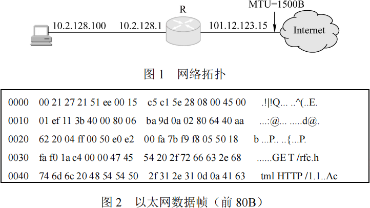

1) Web服务器的IP地址是什么？该主机的默认网关的MAC地址是什么？
2) 该主机在构造图(b)所示的数据帧时，使用什么协议确定目的MAC地址？封装该协议请求报文的以太网帧的目的MAC地址是什么？
3) 假设HTTP/1.1协议以持续的非流水线方式工作，一次请求-响应时间为RTT，rfc.html页面引用了5个JPEG小图像，则从发出如图2所示的Web请求开始到浏览器收到全部内容为止，需要多少个RTT？
4) 该帧所封装的IP分组经过路由器R转发时，需修改IP分组头中的哪些字段？

注：以太网数据帧结构和IP分组头结构分别如图3和图4所示。

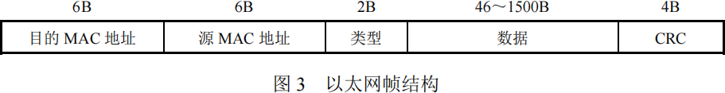
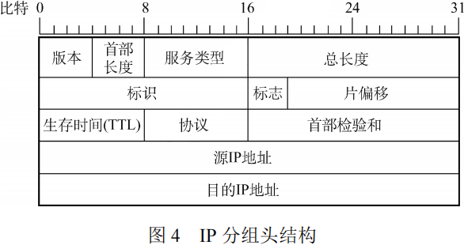

</question>

## 2012年计算机学科专业基础试题 {.custom-h2}

一、单项选择题：第1~40小题，每小题2分，共80分。下列每题给出的四个选项中，只有一个选项最符合试题要求。 {.custom-h3}

<question>

1\. 求整数n（n≥0）的阶乘的算法如下，其时间复杂度是 (&emsp;)。
<pre>
int fact(int n){
  if(n<=l) return 1;
  return n*fact(n-l);
}
</pre>
<options :options="['A. O(log2n)', 'B. O(n)', 'C. O(nlog2n)', 'D. O(n2)']" />

2\. 已知操作符包括“+”、“-”、“\*”、“/”、“(”和“)”。将中缀表达式 a+b-a\*c+d/e-f+g 转换为等价的后缀表达式 ab+acd+e/f-\*-g+ 时，用栈来存放暂时还不能确定运算次序的操作符。栈初始时为空时，转换过程中同时保存在栈中的操作符的最大个数是 (&emsp;)。

<options :options="['A. 5', 'B. 7', 'C. 8', 'D. 11']" />

3\. 若一棵二叉树的前序遍历序列为a,e,b,d,c，后序遍历序列为b,c,d,e,a，则根结点的孩子结点 (&emsp;)。

<options :options="['A. 只有e', 'B. 有e、b', 'C. 有e、c', 'D. 无法确定']" />

4\. 若平衡二叉树的高度为6，且所有非叶结点的平衡因子均为1，则该平衡二叉树的结点总数为 (&emsp;)。

<options :options="['A. 12', 'B. 20', 'C. 32', 'D. 33']" />

5\. 对有n个顶点、e条边且使用邻接表存储的有向图进行广度优先遍历, 其算法的时间复杂度是 (&emsp;)。

<options :options="['A. O(n)', 'B. O(e)', 'C. O(n+e)', 'D. O(ne)']" />

6\. 若用邻接矩阵存储有向图，矩阵中主对角线以下的元素均为零，则关于该图拓扑序列的结论是 (&emsp;)。

<options :options="['A. 存在，且唯一', 'B. 存在，且不唯一']" width="73%" />
<options :options="['C. 存在，可能不唯一', 'D. 无法确定是否存在']" />

7\. 对下图所示的有向带权图，若采用Dijkstra算法求从源点a到其他各顶点的最短路径，则得到的第一条最短路径的目标顶点是b，第二条最短路径的目标顶点是c，后续得到的其余各最短路径的目标顶点依次是 (&emsp;)。

<options :options="['A. d,e,f', 'B. e,d,f', 'C. f,d,e', 'D. f,e,d']" />

8\. 下列关于最小生成树的叙述中，正确的是 (&emsp;)。

<options :options="['Ⅰ. 最小生成树的代价唯一']" />
<options :options="['Ⅱ. 所有权值最小的边一定会出现在所有的最小生成树中']" />
<options :options="['Ⅲ. 使用Prim算法从不同顶点开始得到的最小生成树一定相同']" />
<options :options="['Ⅳ. 使用Prim算法和Kruskal算法得到的最小生成树总不相同']" /> 

<options :options="['A. 仅Ⅰ', 'B. 仅Ⅱ', 'C. 仅Ⅰ、Ⅲ', 'D. 仅Ⅱ、Ⅳ']" />

9\. 已知一棵3阶B树，如下图所示。删除关键字78得到一棵新B树，其最右叶结点中的关键字是 (&emsp;)。

<options :options="['A. 60', 'B. 60, 62', 'C. 62, 65', 'D. 65']" />

10\. 在内部排序过程中，对尚未确定最终位置的所有元素进行一遍处理称为一趟排序。下列排序方法中，每趟排序结束都至少能够确定一个元素最终位置的方法是 (&emsp;)。

<options :options="['Ⅰ. 简单选择排序&emsp;Ⅱ. 希尔排序&emsp;Ⅲ. 快速排序&emsp;Ⅲ. 快速排序&emsp;']" />
<options :options="['Ⅳ. 堆排序&emsp;Ⅴ. 二路归并排序']" /> 

<options :options="['A. 仅Ⅰ、Ⅲ、Ⅳ', 'B. 仅Ⅰ、Ⅲ、Ⅴ', 'C. 仅ⅠⅠ、Ⅲ、Ⅳ', 'D. 仅Ⅲ、Ⅳ、Ⅴ']" />

11\. 对同一待排序序列分别进行折半插入排序和直接插入排序，两者之间可能的不同之处是 (&emsp;)。

<options :options="['A. 排序的总趟数', 'B. 元素的移动次数']" width="70%" />
<options :options="['C. 使用辅助空间的数量', 'D. 元素之间的比较次数']" />

12\. 假定基准程序A在某计算机上的运行时间为100s，其中90s为CPU时间，其余为I/O时间。若CPU速度提高50%，I/O速度不变，则运行基准程序A所耗费的时间是 (&emsp;)。

<options :options="['A. 55s', 'B. 60s', 'C. 65s', 'D. 70s']" />

13\. 假定编译器规定int和short型长度分别为32位和16位，执行下列C语言语句：
<pre>
unsigned short x=65530;
unsigned int y=x;
</pre>
得到y的机器数为 (&emsp;)。

<options :options="['A. 0000 7FFAH', 'B. 0000 FFFAH', 'C. FFFF 7FFAH', 'D. FFFF FFFAH']" />

14\. float类型（即IEEE754单精度浮点数格式）能表示的最大正整数是 (&emsp;)。

<options :options="['A. 2126 - 2103', 'B. 2127 - 2104', 'C. 2127 - 2103', 'D. 2128 - 2104']" />

15\. 某计算机存储器按字节编址，采用小端方式存放数据。假定编译器规定int型和short型长度分别为32位和16位，并且数据按边界对齐存储。某C语言程序段如下：
<pre>
struct {
  int a;
  char b;
  short c;
} record;
record.a=273;
</pre>
若record变量的首地址为0xC008，地址0xC008中的内容及record.c的地址分别为 (&emsp;)。

<options :options="['A. 0x00, 0xC00D', 'B. 0x00, 0xC00E', 'C. 0x11, 0xC00D', 'D. 0x11, 0xC00E']" />

16\. 下列关于闪存(Flash Memory)的叙述中，错误的是 (&emsp;)。

<options :options="['A. 信息可读可写，并且读、写速度一样快']" />
<options :options="['B. 存储元由MOS管组成，是一种半导体存储器']" />
<options :options="['C. 掉电后信息不丢失，是一种非易失性存储器']" />
<options :options="['D. 采用随机访问方式，可替代计算机外部存储器']" />

17\. 假设某计算机按字编址，Cache有4行，Cache和主存之间交换的块大小为1个字。若Cache的内容初始为空，采用2路组相联映射方式和LRU算法，则访问的主存地址依次为0,4,8,2,0,6,8,6,4,8时，命中Cache的次数是 (&emsp;)。

<options :options="['A. 1', 'B. 2', 'C. 3', 'D. 4']" />

18\. 某计算机的控制器采用微程序控制方式，微指令中的操作控制字段采用字段直接编码法，共有33个微命令，构成5个互斥类，分别包含7、3、12、5和6个微命令，则操作控制字段至少有 (&emsp;)。

<options :options="['A. 5位', 'B. 6位', 'C. 15位', 'D. 33位']" />

19\. 某同步总线的时钟频率为100MHz，宽度为32位，地址/数据线复用，每传输一个地址或数据占用一个时钟周期。若该总线支持突发（猝发）传输方式，则一次“主存写”总线事务传输128位数据所需要的时间至少是 (&emsp;)。

<options :options="['A. 20ns', 'B. 40ns', 'C. 50ns', 'D. 80ns']" />

20\. 下列关于USB总线特性的描述中，错误的是 (&emsp;)。

<options :options="['A. 可实现外设的即插即用和热拔插']" />
<options :options="['B. 可通过级联方式连接多台外设']" />
<options :options="['C. 是一种通信总线，连接不同外设']" />
<options :options="['D. 同时可传输2位数据，数据传输率高']" />

21\. 下列选项中，在I/O总线的数据线上传输的信息包括 (&emsp;)。

<options :options="['I. I/O接口中的命令字&emsp;Ⅱ. I/O接口中的状态字&emsp;Ⅲ. 中断类型号']" /> 

<options :options="['A. 仅Ⅰ、Ⅱ', 'B. 仅Ⅰ、Ⅲ', 'C. 仅Ⅱ、ⅢI', 'D. Ⅰ、Ⅱ、Ⅲ']" />

22\. 响应外部中断的过程中，中断隐指令完成的操作，除保护断点外，还包括 (&emsp;)。

<options :options="['Ⅰ. 关中断']" />
<options :options="['Ⅱ. 保存通用寄存器的内存']" />
<options :options="['Ⅲ. 形成中断服务程序入口地址并送PC']" /> 

<options :options="['A. 仅Ⅰ、Ⅱ', 'B. 仅Ⅰ、Ⅲ', 'C. 仅Ⅱ、Ⅲ', 'D. Ⅰ、Ⅱ、Ⅲ']" />

23\. 下列选项中，不可能在用户态发生的事件是 (&emsp;)。

<options :options="['A. 系统调用', 'B. 外中断', 'C. 进程切换', 'D. 缺页']" />

24\. 中断处理和子程序调用都需要压栈，以便保护现场，中断处理一定会保存而子程序调用不需要保存其内容的是 (&emsp;)。

<options :options="['A. 程序计数器', 'B. 程序状态字寄存器', 'C. 通用数据寄存器', 'D. 通用地址寄存器']" />

25\. 下列关于虚拟存储器的叙述中，正确的是 (&emsp;)。

<options :options="['A. 虚拟存储只能基于连续分配技术']" />
<options :options="['B. 虚拟存储只能基于非连续分配技术']" />
<options :options="['C. 虚拟存储容量只受外存容量的限制']" />
<options :options="['D. 虚拟存储容量只受内存容量的限制']" />

26\. 操作系统的I/O子系统通常由四个层次组成，每一层明确定义了与邻近层次的接口。其合理的层次组织排列顺序是 (&emsp;)。

<options :options="['A. 用户级I/O软件、设备无关软件、设备驱动程序、中断处理程序']" />
<options :options="['B. 用户级I/O软件、设备无关软件、中断处理程序、设备驱动程序']" />
<options :options="['C. 用户级I/O软件、设备驱动程序、设备无关软件、中断处理程序']" />
<options :options="['D. 用户级I/O软件、中断处理程序、设备无关软件、设备驱动程序']" />

27\. 假设5个进程P0、P1、P2、P3、P4共享三类资源R1、R2、R3，这些资源总数分别为18、6、22。T0时刻的资源分配情况如下表所示，此时存在的一个安全序列是 (&emsp;)。

<options :options="['A. P0, P2, P4, P1, P3', 'B. P1, P0, P3, P4, P2']" />
<options :options="['C. P2, P1, P0, P3, P4', 'D. P3, P4, P2, P1, P0']" />

28\. 若一个用户进程通过read系统调用读取一个磁盘文件中的数据，则下列关于此过程的叙述中，正确的是 (&emsp;)。

<options :options="['Ⅰ. 若该文件的数据不在内存，则该进程进入睡眠等待状态']" />
<options :options="['Ⅱ. 请求read系统调用会导致CPU从用户态切换到核心态']" />
<options :options="['Ⅲ. read系统调用的参数应包含文件的名称']" /> 

<options :options="['A. 仅Ⅰ、Ⅱ', 'B. 仅Ⅰ、Ⅲ', 'C. 仅Ⅱ、Ⅲ', 'D. Ⅰ、Ⅱ和Ⅲ']" />

29\. 一个多道批处理系统中仅有P1和P2两个作业，P2比P1晚5ms到达，它们的计算和IO操作顺序如下： 
P1：计算 60ms，I/O 80ms，计算 20ms 
P2：计算 120ms，I/O 40ms，计算 40ms 
若不考虑调度和切换时间，则完成两个作业需要的时间最少是 (&emsp;)。

<options :options="['A. 240ms', 'B. 260ms', 'C. 340ms', 'D. 360ms']" />

30\. 若某单处理器多进程系统中有多个就绪态进程，则下列关于处理机调度的叙述中，错误的是 (&emsp;)。

<options :options="['A. 在进程结束时能进行处理机调度']" />
<options :options="['B. 创建新进程后能进行处理机调度']" />
<options :options="['C. 在进程处于临界区时不能进行处理机调度']" />
<options :options="['D. 在系统调用完成并返回用户态时能进行处理机调度']" />

31\. 下列关于进程和线程的叙述中，正确的是 (&emsp;)。

<options :options="['A. 不管系统是否支持线程，进程都是资源分配的基本单位']" />
<options :options="['B. 线程是资源分配的基本单位，进程是调度的基本单位']" />
<options :options="['C. 系统级线程和用户级线程的切换都需要内核的支持']" />
<options :options="['D. 同一进程中的各个线程拥有各自不同的地址空间']" />

32\. 下列选项中，不能改善磁盘设备I/O性能的是 (&emsp;)。

<options :options="['A. 重排I/O请求次序', 'B. 在一个磁盘上设置多个分区']" />
<options :options="['C. 预读和滞后写', 'D. 优化文件物理块的分布']" width="70%" />

33\. 在TCP/IP体系结构中，直接为ICMP提供服务的协议是 (&emsp;)。

<options :options="['A. PPP', 'B. IP', 'C. UDP', 'D. TCP']" />

34\. 在物理层接口特性中，用于描述完成每种功能的事件发生顺序的是 (&emsp;)。

<options :options="['A. 机械特性', 'B. 功能特性', 'C. 过程特性', 'D. 电气特性']" />

35\. 以太网的MAC协议提供的是 (&emsp;)。

<options :options="['A. 无连接的不可靠服务', 'B. 无连接的可靠服务']" width="70%" />
<options :options="['C. 有连接的可靠服务', 'D. 有连接的不可靠服务']" width="72%" />

36\. 两台主机之间的数据链路层采用后退N协议（GBN）传输数据，数据传输速率为16kb/s，单向传播时延为270ms，数据帧长范围是128~512字节，接收方总是以与数据帧等长的帧进行确认。为使信道利用率达到最高，帧序号的比特数至少为 (&emsp;)。

<options :options="['A. 5', 'B. 4', 'C. 3', 'D. 2']" />

37\. 下列关于IP路由器功能的描述中，正确的是 (&emsp;)。

<options :options="['Ⅰ. 运行路由协议,设备路由表']" />
<options :options="['Ⅱ. 监测到拥塞时,合理丢弃IP分组']" />
<options :options="['Ⅲ. 对收到的IP分组头进行差错检验,确保传输的IP分组不丢失']" />
<options :options="['Ⅳ. 根据收到的IP分组的目的IP地址,将其转发到合适的输出线路上']" /> 

<options :options="['A. 仅Ⅲ、Ⅳ', 'B. 仅Ⅰ、Ⅱ、Ⅲ', 'C. 仅Ⅰ、Ⅱ、Ⅳ', 'D. Ⅰ、Ⅱ、Ⅲ、Ⅳ']" />

38\. ARP协议的功能是 (&emsp;)。

<options :options="['A. 根据IP地址查询MAC地址', 'B. 根据MAC地址查询IP地址']"  width="81%" />
<options :options="['C. 根据域名查询IP地址', 'D. 根据IP地址查询域名']" />

39\. 某主机的IP地址为180.80.77.55，子网掩码为255.255.252.0。若该主机向其所在子网发送广播分组，则目的地址可以是 (&emsp;)。

<options :options="['A. 180.80.76.0', 'B. 180.80.76.255', 'C. 180.80.77.255', 'D. 180.80.79.255']" />

40\. 若用户1与用户2之间发送和接收电子邮件的过程如下图所示，则图中①、②、③阶段分别使用的应用层协议可以是 (&emsp;)。

<options :options="['A. SMTP、SMTP、SMTP', 'B. POP3、SMTP、POP3']" />
<options :options="['C.POP3、SMTP、SMTP', 'D. SMTP、SMTP、POP3']" />

二、综合应用题：第41~47题，共70分。{.custom-h3}

41\. (10分) 设有6个有序表A、B、C、D、E、F，分别含有10、35、40、50、60和200个数据元素，各表中元素按升序排列。要求通过5次两两合并，将6个表最终合并成一个升序表，并在最坏情况下比较的总次数达到最小。请回答下列问题。
1) 给出完整的合并过程，并求出最坏情况下比较的总次数。
2) 根据你的合并过程，描述n(n≥2)个不等长升序表的合并策略，并说明理由。

42\. (13分) 假定采用带头结点的单链表保存单词，当两个单词有相同的后缀时，则可共享相同的后缀存储空间，例如，“loading”和“being”的存储映像如下图所示。

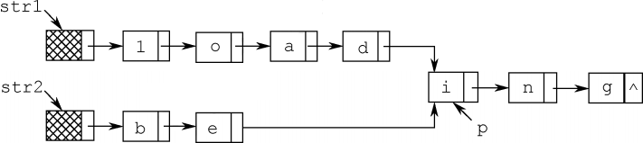

设str1和str2分别指向两个单词所在单链表的头结点，链表结点结构为，请设计一个时间上尽可能高效的算法，找出由str1和str2所指向两个链表共同后缀的起始位置（如图中字符i所在结点的位置p）。要求：
1) 给出算法的基本设计思想。
2) 根据设计思想，采用C或C++或Java语言描述算法，关键之处给出注释。
3) 说明你所设计算法的时间复杂度和空间复杂度。

43\. (11分) 假定某计算机的CPU主频为80MHz，CPI为4，平均每条指令访存1.5次，主存与Cache之间交换的块大小为16B，Cache的命中率为99%，存储器总线宽度为32位。请回答下列问题。
1) 该计算机的MIPS数是多少？平均每秒Cache缺失的次数是多少？在不考虑DMA传送的情况下，主存带宽至少达到多少才能满足CPU的访存要求？
2) 假定在Cache缺失的情况下访问主存时，存在0.0005%的缺页率，则CPU平均每秒产生多少次缺页异常？
4) 为了提高性能，主存采用4体交叉存储模式，工作时每1/4个存储周期启动一个体。若每个体的存储周期为50ns，则该主存能提供的最大带宽是多少？

44\. (12分) 某16位计算机中，带符号整数用补码表示，数据Cache和指令Cache分离。下表给出了指令系统中部分指令格式，其中Rs和Rd表示寄存器，mem表示存储单元地址，(x)表示寄存器x或存储单元x的内容。

该计算机采用5段流水方式执行指令，各流水段分别是取指(IF)、译码/读寄存器(ID)、执行/计算有效地址(EX)、访问存储器(M)和结果写回寄存器(WB)，流水线采用“按序发射，按序完成”方式，没有采用转发技术处理数据相关，并且同一个寄存器的读和写操作不能在同一个时钟周期内进行。请回答下列问题：
1) 若int型变量x的值为-513，存放在寄存器R1中，则执行指令“SHR R1”后，R1的内容是多少（用十六进制表示）？
2) 若某个时间段中，有连续的4条指令进入流水线，在其执行过程中没有发生任何阻塞，则执行这4条指令所需的时钟周期数为多少？
3) 若高级语言程序中某赋值语句为x=a+b，x、a和b均为int型变量，它们的存储单元地址分别表示为[x]、[a]和[b]。该语句对应的指令序列及其在指令流水线中的执行过程如下图所示。
<pre>
I1 LOAD R1, [a]
I2 LOAD R2, [b]
I3 ADD R1, R2
I4 STORE R2, [x]
</pre>

则这4条指令执行过程中，I3的ID段和I4的IF段被阻塞的原因各是什么？ 
4) 若高级语言程序中某赋值语句为x=x*2+a，x 和a均为unsigned int类型变量，它们的存储单元地址分别表示为[x]、[a]，则执行这条语句至少需要多少个时钟周期？要求模仿题44图画出这条语句对应的指令序列及其在流水线中的执行过程示意图。

45\. (7分) 某请求分页系统的局部页面置换策略如下：系统从0时刻开始扫描，每隔5个时间单位扫描一轮驻留集（扫描时间忽略不计），本轮没有被访问过的页框将被系统回收，并放入到空闲页框链尾，其中内容在下一次分配之前不被清空。当发生缺页时，如果该页曾被使用过且还在空闲页链表中，那么重新放回进程的驻留集中；否则，从空闲页框链表头部取出一个页框。
假设不考虑其他进程的影响和系统开销。初始时进程驻留集为空。目前系统空闲页框链表中页框号依次为32、15、21、41。进程P依次访问的<虚拟页号，访问时刻>是<1,1>，\<3,2>，<0,4>，<0,6>，<1,11>，<0,13>，<2,14>。请回答下列问题。
1) 访问<0,4>时，对应的页框号是什么？说明理由。
2) 访问<1,11>时，对应的页框号是什么？说明理由。
3) 访问<2,14>时，对应的页框号是什么？说明理由。
4) 该策略是否适合于时间局部性好的程序？说明理由。

46\. (8分) 某文件系统空间的最大容量为4TB(1TB=240B),以磁盘块为基本分配单位。磁盘块大
小为1KB。文件控制块(FCB)包含一个512B的索引表区。请回答下列问题。
1) 假设索引表区仅采用直接索引结构，索引表区存放文件占用的磁盘块号，索引表项中块号最少占多少字节？可支持的单个文件最大长度是多少字节？
2) 假设索引表区采用如下结构：第0~7字节采用<起始块号，块数>格式表示文件创建时预分配的连续存储空间，其中起始块号占6B,块数占2B;剩余504字节采用直接索引结构，一个索引项占6B,那么可支持的单个文件最大长度是多少字节？为了使单个文件的长度达到最大，请指出起始块号和块数分别所占字节数的合理值并说明理由。

47\. (9分) 主机H通过快速以太网连接Internet，IP地址为192.168.0.8，服务器S的IP地址为211.68.71.80。H与S使用TCP通信时，在H上捕获的其中5个IP分组如题47-1表所示。

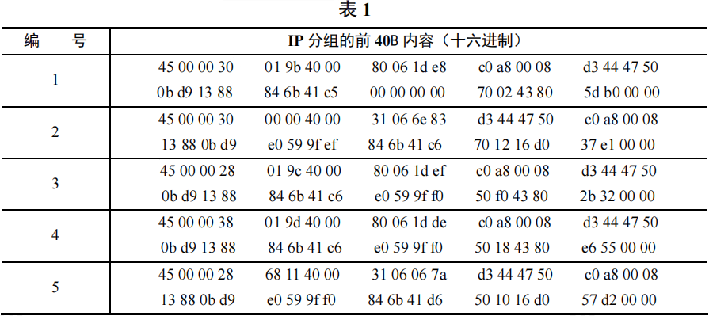

回答下列问题。
1) 题47-a表中的IP分组中，哪几个是由H发送的？哪几个完成了TCP连接建立过程？哪几个在通过快速以太网传输时进行了填充？
2) 根据题47-a表中的IP分组，分析S已经收到的应用层数据字节数是多少？
3) 若题47-a表中的某个IP分组在S发出时的前40字节如题47-2表所示，则该IP分组到达H时经过了多少个路由器？

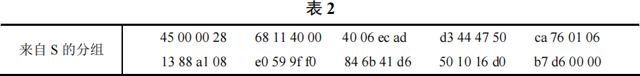

注：IP分组头结构和TCP段头结构如图1和图2所示。

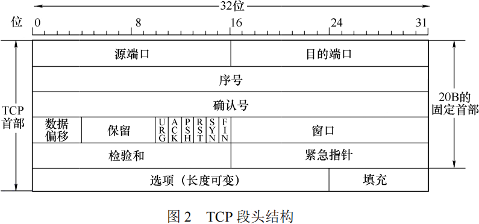

</question>

## 2013年计算机学科专业基础试题 {.custom-h2}

一、单项选择题：第1~40小题，每小题2分，共80分。下列每题给出的四个选项中，只有一个选项最符合试题要求。 {.custom-h3}

<question>

1\. 已知两个长度分别为m和n的升序链表，若将它们合并为一个长度为m+n的降序链表，则最坏情况下的时间复杂度是 (&emsp;)。

<options :options="['A. O(n)', 'B. O(mn)', 'C. O(min(m, n))', 'D. O(max(m, n))']" />

2\. 一个栈的入栈序列为1,2,3,…,n，出栈序列是P1,P2,P3,…,Pn。若P2=3，则P3可能取值的个数是 (&emsp;)。

<options :options="['A. n-3', 'B. n-2', 'C. n-1', 'D. 无法确定']" />

3\. 若将关键字1,2,3,4,5,6,7依次插入到初始为空的平衡二叉树T中，则T中平衡因子为0的非叶结点的个数是 (&emsp;)。

<options :options="['A. 0', 'B. 1', 'C. 2', 'D. 3']" />

4\. 已知三叉树T中6个叶结点的权分别是2,3,4,5,6,7，T的带权（外部）路径长度最小是 (&emsp;)。

<options :options="['A. 27', 'B. 46', 'C. 54', 'D. 56']" />

5\. 若X是后序线索二叉树中的叶结点，且X存在左兄弟结点Y，则X的右线索指向的是 (&emsp;)。

<options :options="['A. X的父结点', 'B. 以Y为根的子树的最左下结点']" />
<options :options="['C. X的左兄弟结点Y', 'D. 以Y为根的子树的最右下结点']" />

6\. 在任意一棵非空二叉排序树T1中，删除某结点v之后形成二叉排序树T2，再将v插入T2形成二叉排序树T3。下列关于T1与T3的叙述中，正确的是 (&emsp;)。

<options :options="['Ⅰ. 若v是T1的叶结点，则T1与T3不同']" />
<options :options="['Ⅱ. 若v是T1的叶结点，则T1与T3相同']" />
<options :options="['Ⅲ. 若v不是T1的叶结点，则T1与T3不同']" />
<options :options="['Ⅳ. 若v不是T1的叶结点，则T1与T3相同']" /> 

<options :options="['A. 仅Ⅰ、Ⅲ', 'B. 仅Ⅰ、Ⅳ', 'C. 仅Ⅱ、Ⅲ', 'D. 仅Ⅱ、Ⅳ']" />

7\. 设图的邻接矩阵A如下所示, 各顶点的度依次是 (&emsp;)。

<options :options="['A. 1,2,1,2', 'B. 2,2,1,1', 'C. 3,4,2,3', 'D. 4,4,2,2']" />

8\. 若对如下无向图进行遍历, 则下列选项中, 不是广度优先遍历序列的是 (&emsp;)。

<options :options="['A. h,c,a,b,d,e,g,f', 'B. e,a,f,g,b,h,c,d', 'C. d,b,c,a,h,e,f,g', 'D. a,b,c,d,h,e,f,g']" />

9\. 下列AOE网表示一项包含8个活动的工程。通过同时加快若干活动的进度可以缩短整个工程的工期。下列选项中，加快其进度就可以缩短工程工期的是 (&emsp;)。

<options :options="['A. c和e', 'B. d和c', 'C. f和d', 'D. f和h']" />

10\. 在一棵高度为2的5阶B树中，所含关键字的个数至少是 (&emsp;)。

<options :options="['A. 5', 'B. 7', 'C. 8', 'D. 14']" />

11\. 对给定的关键字序列110,119,007,911,114,120,122进行基数排序，则第 2趟分配收集后得到的关键字序列是 (&emsp;)。

<options :options="['A.007,110,119,114,911,120,122']" />
<options :options="['C.007,110,911,114,119,120,122']" />
<options :options="['B.007,110,119,114,911,122,120']" />
<options :options="['D.110,120,911,122,114,007,119']" />

12\. 某计算机主频为1.2GHz，其指令分为4类，它们在基准程序中所占比例及CPI如下表所示。该机的MIPS数是 (&emsp;)。

<options :options="['A. 100', 'B. 200', 'C. 400', 'D. 600']" />

13\. 某数采用IEEE754单精度浮点数格式表示为C640 0000H，则该数的值是 (&emsp;)。

<options :options="['A. -1.5×213', 'B. -1.5×212', 'C. -0.5×213', 'D. -0.5×212']" />

14\. 某字长为8位的计算机中，已知整型变量x、y的机器数分别为[x]补=11110100，[y]补=10110000，若整型变量z=2x+y/2则z的机器数为 (&emsp;)。

<options :options="['A. 11000000', 'B. 00100100', 'C. 10101010', 'D. 溢出']" />

15\. 用海明码对长度为8位的数据进行检/纠错时，若能纠正一位错，则校验位数至少为 (&emsp;)。

<options :options="['A. 2', 'B. 3', 'C. 4', 'D. 5']" />

16\. 某计算机主存地址空间大小为256MB,按字节编址。虚拟地址空间大小为4GB,采用页式存储管理，页面大小为4KB，TLB（快表）采用全相联映射，有4个页表项，内容如下表所示。

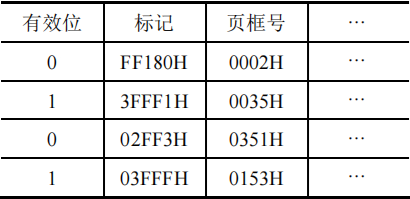

则对虚拟地址03FF F180H进行虚实地址变换的结果是 (&emsp;)。

<options :options="['A. 015 3180H', 'B. 003 5180H', 'C. TLB缺失', 'D. 缺页']" />

17\. 假设变址寄存器R的内容为1000H，指令中的形式地址为2000H；地址1000H中的内容为2000H，地址2000H中的内容为3000H，地址3000H中的内容为4000H，则变址寻址方式下访问到的操作数是 (&emsp;)。

<options :options="['A. 1000H', 'B. 2000H', 'C. 3000H', 'D. 4000H']" />

18\. 某CPU主频为1.03GHz，采用4级指令流水线，每个流水段的执行需要1个时钟周期。假定CPU执行了100条指令，在其执行过程中，没有发生任何流水线阻塞，此时流水线的吞吐率为 (&emsp;)。

<options :options="['A. 0.25×109条指令/秒', 'B. 0.97×109条指令/秒']" />
<options :options="['C. 1.0×109条指令/秒', 'D. 1.03×109条指令/秒']" />

19\. 下列选项中，用于设备和设备控制器（I/O接口）之间互连的接口标准是 (&emsp;)。

<options :options="['A. PCI', 'B. USB', 'C. AGP', 'D. PCI-Express']" />

20\. 下列选项中，用于提高RAID可靠性的措施有 (&emsp;)。

<options :options="['Ⅰ. 磁盘镜像&emsp;Ⅱ. 条带化&emsp;Ⅲ. 奇偶校验&emsp;Ⅳ. 增加Cache机制']" /> 

<options :options="['A. 仅Ⅰ、Ⅱ', 'B. 仅Ⅰ、Ⅲ', 'C. 仅Ⅰ、Ⅲ和Ⅳ', 'D. 仅Ⅱ、Ⅲ和Ⅳ']" />

21\. 某磁盘的转速为10000转/分，平均寻道时间是6ms，磁盘传输速率是20MB/s，磁盘控制器延迟为0.2ms，读取一个4KB的扇区所需的平均时间约为 (&emsp;)。

<options :options="['A. 9ms', 'B. 9.4ms', 'C. 12ms', 'D. 12.4ms']" />

22\. 下列关于中断I/O方式和DMA方式比较的叙述中，错误的是 (&emsp;)。

<options :options="['A. 中断I/O方式请求的是CPU处理时间，DMA方式请求的是总线使用权']" />
<options :options="['B. 中断响应发生在一条指令执行结束后，DMA响应发生在一个总线事务完成后']" />
<options :options="['C. 中断I/O方式下数据传送通过软件完成，DMA方式下数据传送由硬件完成']" />
<options :options="['D. 中断I/O方式适用于所有外部设备，DMA方式仅适用于快速外部设备']" />

23\. 用户在删除某文件的过程中，操作系统不可能执行的操作是 (&emsp;)。

<options :options="['A. 删除此文件所在的目录']" />
<options :options="['B. 删除与此文件关联的目录项']" />
<options :options="['C. 删除与此文件对应的文件控制块']" />
<options :options="['D. 释放与此文件关联的内存缓冲区']" />

24\. 为支持CD-ROM中视频文件的快速随机播放，播放性能最好的文件数据块组织方式是 (&emsp;)。

<options :options="['A. 连续结构', 'B. 链式结构', 'C. 直接索引结构', 'D. 多级索引结构']" />

25\. 用户程序发出磁盘I/O请求后，系统的处理流程是：用户程序→系统调用处理程序→设备驱动程序→中断处理程序。其中，计算数据所在磁盘的柱面号、磁头号、扇区号的程序是 (&emsp;)。

<options :options="['A. 用户程序', 'B. 系统调用处理程序', 'C. 设备驱动程序', 'D. 中断处理程序']" />

26\. 若某文件系统索引节点(inode)中有直接地址项和间接地址项，则下列选项中，与单个文件长度无关的因素是 (&emsp;)。

<options :options="['A. 索引节点的总数', 'B. 间接地址索引的级数', 'C. 地址项的个数', 'D. 文件块大小']" />

27\. 设系统缓冲区和用户工作区均采用单缓冲，从外设读入1个数据块到系统缓冲区的时间为100，从系统缓冲区读入1个数据块到用户工作区的时间为5，对用户工作区中的1个数据块进行分析的时间为90（如右图所示）。进程从外设读入并分析2个数据块的最短时间是 (&emsp;)。

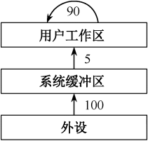

<options :options="['A. 200', 'B. 295', 'C. 300', 'D. 390']" />

28\. 下列选项中，会导致用户进程从用户态切换到内核态的操作是 (&emsp;)。

<options :options="['Ⅰ. 整数除以零&emsp;Ⅱ. sin函数调用&emsp;Ⅲ. read系统调用']" /> 

<options :options="['A. 仅Ⅰ、Ⅱ', 'B. 仅Ⅰ、Ⅲ', 'C. 仅Ⅱ、Ⅲ', 'D. Ⅰ、Ⅱ和Ⅲ']" />

29\. 计算机开机后，操作系统最终被加载到 (&emsp;)。

<options :options="['A. BIOS', 'B. ROM', 'C. EPROM', 'D. RAM']" />

30\. 若用户进程访问内存时产生缺页，则下列选项中，操作系统可能执行的操作是 (&emsp;)。

<options :options="['Ⅰ. 处理越界错&emsp;Ⅱ. 置换页&emsp;Ⅲ. 分配内存']" /> 

<options :options="['A. 仅Ⅰ、Ⅱ', 'B. 仅Ⅱ、Ⅲ', 'C. 仅Ⅰ、Ⅲ', 'D. Ⅰ、Ⅱ和Ⅲ']" />

31\. 某系统正在执行三个进程P1、P2 和P3，各进程的计算(CPU)时间和I/O时间比例如下表所示。

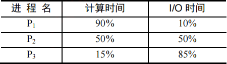

为提高系统资源利用率，合理的进程优先级设置应为 (&emsp;)。

<options :options="['A. P1>P2>P3', 'B. P3>P2>P1', 'C. P2>P1=P3', 'D. P1>P2=P3']" />

32\. 下列关于银行家算法的叙述中，正确的是 (&emsp;)。

<options :options="['A. 银行家算法可以预防死锁']" />
<options :options="['B. 当系统处于安全状态时，系统中一定无死锁进程']" />
<options :options="['C. 当系统处于不安全状态时，系统中一定会出现死锁进程']" />
<options :options="['D. 银行家算法破坏了死锁必要条件中的“请求和保持”条件']" />

33\. 在OSI参考模型中，下列功能需由应用层的相邻层实现的是 (&emsp;)。

<options :options="['A. 对话管理', 'B. 路由选择', 'C. 数据格式转换', 'D. 可靠数据传输']" />

34\. 下图为10Base-T网卡接收到的信号波形，则该网卡收到的比特串是 (&emsp;)。

<options :options="['A. 0011 0110', 'B. 1010 1101']" width="70%" />
<options :options="['C. 0101 0010', 'D. 1100 0101']" width="70%" />

35\. 主机甲通过一个路由器（存储转发方式）与主机乙互连，两段链路的数据传输速率均为10Mb/s，主机甲分别采用报文交换和分组大小为10kb的分组交换向主机乙发送一个大小为8Mb（1M=106）的报文。若忽略链路传播延迟、分组头开销和分组拆装时间，则两种交换方式完成该报文传输所需的总时间分别为 (&emsp;)。

<options :options="['A. 800ms、1600ms', 'B. 801ms、1600ms']" width="70%" />
<options :options="['C. 1600ms、800ms', 'D. 1600ms、801ms']" width="70%" />

36\. 下列介质访问控制方法中，可能发生冲突的是 (&emsp;)。

<options :options="['A. CDMA', 'B. CSMA', 'C. TDMA', 'D. FDMA']" />

37\. HDLC协议对01111100 01111110组帧后对应的比特串为 (&emsp;)。

<options :options="['A. 0111110000111110 10', 'B. 01111100 01111101 01111110']" />
<options :options="['C. 0111110001111101 0', 'D. 01111100 01111110 01111101']" />

38\. 对于100Mb/s的以太网交换机，当输出端口无排队，以直通交换方式转发一个以太网帧（不包括前导码）时，引入的转发时延至少是 (&emsp;)。

<options :options="['A. 0μs', 'B. 0.48μs', 'C. 5.12μs', 'D. 121.44μs']" />

39\. 主机甲与主机乙之间已建立一个TCP连接，双方持续有数据传输，且数据无差错与丢失。若甲收到一个来自乙的TCP段，该段的序号为1913、确认序号为2046、有效载荷为100B，则甲立即发送给乙的TCP段的序号和确认序号分别是 (&emsp;)。

<options :options="['A. 2046、2012', 'B. 2046、2013', 'C. 2047、2012', 'D. 2047、2013']" />

40\. 下列关于SMTP协议的叙述中，正确的是 (&emsp;)。

<options :options="['Ⅰ．只支持传输 7比特 ASCII码内容']" />
<options :options="['Ⅱ．支持在邮件服务器之间发送邮件']" />
<options :options="['Ⅲ．支持从用户代理向邮件服务器发送邮件']" />
<options :options="['Ⅳ．支持从邮件服务器向用户代理发送邮件']" /> 

<options :options="['A.仅Ⅰ、Ⅱ和Ⅲ', 'B.仅Ⅰ、Ⅱ和Ⅳ', 'C.仅Ⅰ、Ⅱ和Ⅳ', 'D.仅Ⅱ、Ⅲ和Ⅳ']" />

二、综合应用题：第41~47题，共70分。{.custom-h3}

41\. (13分) 已知一个整数序列A=(a0,a1,···,an-1)，其中0≤ai&lt;n(0≤ix&lt;n)。若存在ap1=ap2=···= apm=x且m>n/2(0≤pk&lt;n, 1≤k≤m)，则称x为A的主元素。例如A=(0,5,5,3,5,7,5,5)，则5为主元素；又如A=(0,5,5,3,5,1,5,7)，则A中没有主元素。假设A中的n个元素保存在一个一维数组中，请设计一个尽可能高效的算法，找出A的主元素。若存在主元素，则输出该元素；否则输出-1。要求：

1) 给出算法的基本设计思想。
2) 根据设计思想，采用C或C++或Java语言描述算法，关键之处给出注释。
3) 说明你所设计算法的时间复杂度和空间复杂度。

42\. (10分) 设包含4个数据元素的集合S={“do”，“for”，“repeat”，“while”}，各元素的查找概率依次为p1=0.35,P2=0.15,P3=0.15,P4=0.35。将S保存在一个长度为4的顺序表中，采用折半查找法，查找成功时的平均查找长度为2.2。请回答下列问题：
1) 若采用顺序存储结构保存S，且要求平均查找长度更短，则元素应如何排列？应使用何种查找方法？查找成功时的平均查找长度是多少？
2) 若采用链式存储结构保存S，且要求平均查找长度更短，则元素应如何排列？应使用何种查找方法？查找成功时的平均查找长度是多少？

43\. (9分) 某32位计算机，CPU主频为800MHz，Cache命中时的CPI为4，Cache块大小为32字节；主存采用8体交叉存储方式，每个体的存储字长为32位、存储周期是40ns；存储器总线宽度为32位，总线时钟频率为200MHz，支持突发传送总线事务。每次读突发传送总线事务的过程包括：送首地址和命令、存储器准备数据、传送数据。每次突发传送32字节，传送地址或者32位数据均需要一个总线时钟周期。请回答下列问题，要求给出理由或者计算过程。
1) CPU和总线的时钟周期各是多少？总线的带宽（即最大数据传输率）为多少？
2) Cache缺失时，需要用几个读突发传送总线事务来完成一个主存块的读取？
3) 存储器总线完成一次读突发传送总线事务所需的时间是多少？
4) 若程序BP执行过程中，共执行了100条指令，平均每条指令需要1.2次访存，Cache缺失率是5%，不考虑替换等开销，则BP的CPU执行时间是多少？

44\. (14分) 某计算机采用16位定长指令字格式，其CPU中有一个标志寄存器，其中包含进位/借位标志CF、零标志ZF和符号标志NF。假定为该机设计了条件转移指令，其格式如下：

其中，00000为操作码OP；C、Z和N分别为CF、ZF和NF的对应检测位，某检测位为1时表示需检测对应标志，需检测的标志位中只要有一个为1就转移，否则就不转移，例如，若C=1，Z=0，N=1，则需检测CF和NF的值，当CF=1或NF=1时发生转移；OFFSET是相对偏移量，用补码表示。转移执行时，转移目标地址为(PC)+2+2×OFFSET；顺序执行时，下条指令地址为(PC)+2。请回答下列问题。
1) 该计算机存储器按字节编址，还是按字编址？该条件转移指令向后（反向）最多可跳转多少条指令？
2) 某条件转移指令的地址为200CH，指令内容如下图所示，若该执行时CF=0，ZF=0，NF=1，则该指令执行后PC的值是多少？若该指令执行时CF=1，ZF=0，NF=0，则该指令执行后PC的值又是多少？请给出计算过程。

3) 实现“无符号数比较小于等时转移”功能的指令中，C、Z和N应各是什么？
4) 以下是该指令对应的数据通路示意图，要求给出中部件①~③的名称或功能说明。

45\. (7分) 某博物馆最多可容纳500人同时参观，有一个出入口，该出入口一次仅允许一人通过。参观者的活动描述如下：
<pre>
cobegin
{
  process 参观者i {
    进入入口；
    参观；
    走出入口；
  }
} coend
</pre>
请添加必要的信号量和P、V（或wait()、signal()）操作，实现上述过程中的互斥与同步。要求写出完整的过程，说明信号量的含义并赋初值。

46\. (8分) 某计算机主存按字节编址，逻辑地址和物理地址都是32位，页表项大小为4字节。请回答下列问题。
1) 若使用一级页表的分页存储管理方式，逻辑地址结构为：

则页的大小是多少字节？页表最大占用多少字节？

2) 若使用二级页表的分页存储管理方式，逻辑地址结构为：

设逻辑地址为LA，请分别给出其对应的页目录号和页表索引的表达式。

3) 采用(1)中的分页存储管理方式，一个代码段起始逻辑地址为0000 8000H,其长度为8KB,被装载到从物理地址0090 0000H开始的连续主存空间中。页表从主存0020 0000H开始的物理地址处连续存放，如下图所示（地址大小自下向上递增）。请计算出该代码段对应的两个页表项的物理地址、这两个页表项中的页框号以及代码页面2的起始物理地址。

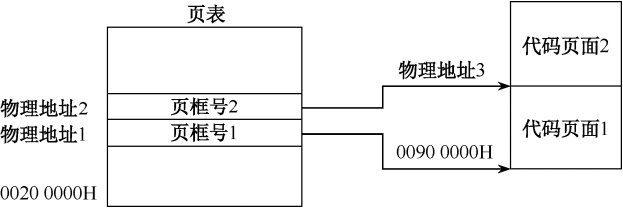

47\. (9分) 假设Internet的两个自治系统构成的网络如题47图所示，自治系统AS1由路由器R1连接两个子网构成；自治系统AS2由路由器R2、R3互联并连接3个子网构成。各子网地址、R2的接口名、R1与R3的部分接口IP地址如题47图所示。

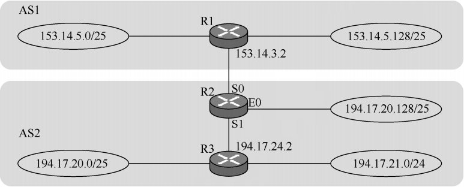

请回答下列问题。
1) 假设路由表结构如下表所示。请利用路由聚合技术，给出R2的路由表，要求包括到达题47图中所有子网的路由，且路由表中的路由项尽可能少。

2) 若R2收到一个目的IP地址为194.17.20.200的IP分组，R2会通过哪个接口转发该IP分组？
3) R1与R2之间利用哪个路由协议交换路由信息？该路由协议的报文被封装到哪个协议的分组中进行传输？

</question>

## 2014年计算机学科专业基础试题 {.custom-h2}

一、单项选择题：第1~40小题，每小题2分，共80分。下列每题给出的四个选项中，只有一个选项最符合试题要求。 {.custom-h3}

<question>

1\. 下列程序段的时间复杂度是 (&emsp;)。
<pre>
count=0;
for(k=1;k<=n;k*=2)
  for(j=1;j<=n;j++)
    count++;
</pre>
<options :options="['A. O(log2n)', 'B. O(n)', 'C. O(nlog2n)', 'D. O(n2)']" />

2\. 假设栈初始为空，将中缀表达式 a/b+c*d-e*f/g 转换为等价的后缀表达式的过程中，当扫描到f时，栈中的元素依次是 (&emsp;)。

<options :options="['A. +(*-', 'B. +(-*', 'C. /+(*-*', 'D. /++*']" />

3\. 循环队列放在一维数组A[0…M-1]中，end1指向队头元素，end2指向队尾元素的后一个位置。假设队列两端均可进行入队和出队操作，队列中最多能容纳M-1个元素。初始时为空。下列判断队空和队满的条件中，正确的是 (&emsp;)。

<options :options="['A. 队空: end1 == end2；队满: end1 == (end2+1) mod M']" />
<options :options="['B. 队空: end1 == end2；队满: end2 == (end1+1) mod (M-1)']" />
<options :options="['C. 队空: end2 == (end1+1) mod M；队满: end1 == (end2+1) mod M']" />
<options :options="['D. 队空: end1 == (end2+1) mod M；队满: end2 == (end1+1) mod (M-1)']" />

4\. 若对下图所示的二叉树进行中序线索化，则结点x的左、右线索指向的结点分别是 (&emsp;)。

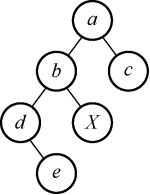

<options :options="['A. e,c', 'B. e,a', 'C. d,c', 'D. b,a']" />

5\. 将森林F转换为对应的二叉树T，F中叶结点的个数等于 (&emsp;)。

<options :options="['A. T中叶结点的个数', 'B. T中度为1的结点个数']" />
<options :options="['C. T中左孩子指针为空的结点个数', 'D. T中右孩子指针为空的结点个数']" width="85%" />

6\. 5个字符有如下4种编码方案，不是前缀编码的是 (&emsp;)。

<options :options="['A. 01, 0000, 0001, 001, 1', 'B. 011, 000, 001, 010, 1']" />
<options :options="['C. 000, 001, 010, 011, 100', 'D. 0, 100, 110, 1110, 1100']" width="77%" />

7\. 对下图所示的有向图进行拓扑排序，得到的拓扑序列可能是 (&emsp;)。

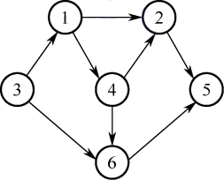

<options :options="['A. 3,1,2,4,5,6', 'B. 3,1,2,4,6,5', 'C. 3,1,4,2,5,6', 'D. 3,1,4,2,6,5']" />

8\. 用哈希（散列）方法处理冲突（碰撞）时，可能出现堆积（聚集）现象，下列选项中，会受堆积现象直接影响的是 (&emsp;)。

<options :options="['A. 存储效率', 'B. 散列函数', 'C. 装填（装载）因子', 'D. 平均查找长度']" />

9\. 在一棵有15个关键字的4阶B树中，含关键字的结点个数最多是 (&emsp;)。

<options :options="['A. 5', 'B. 6', 'C. 10', 'D. 15']" />

10\. 用希尔排序方法对一个数据序列进行排序时，若第1趟排序结果为9,1,4,13,7,8,20,23,15，则该趟排序采用的增量（间隔）可能是 (&emsp;)。

<options :options="['A. 2', 'B. 3', 'C. 4', 'D. 5']" />

11\. 下列选项中，不可能是快速排序第2趟排序结果的是 (&emsp;)。

<options :options="['A.2,3,5,4,6,7,9','B.2,7,5,6,4,3,9','C.3,2,5,4,7,6,9','D.4,2,3,5,7,6,9']"/>

12\. 程序P在机器M上的执行时间是20s，编译优化后，P执行的指令数减少到原来的70%，而CPI增加到原来的1.2倍，则P在M上的执行时间是 (&emsp;)。

<options :options="['A. 8.4s', 'B. 11.7s', 'C. 14s', 'D. 16.8s']" />

13\. 若x=103,y=-25，则下列表达式采用8位定点补码运算实现时，会发生溢出的是 (&emsp;)。

<options :options="['A. x + y', 'B. -x + y', 'C. x - y', 'D. -x - y']" />

14\. float型数据常用IEEE754单精度浮点格式表示。假设两个float型变量x和y分别存放在32位寄存器f1和f2中，若(f1)=CC90 0000H，(f2)=B0C0 0000H，则x和y之间的关系为 (&emsp;)。

<options :options="['A. x&lty且符号相同', 'B. x&lty且符号不同', 'C. x&gty且符号相同', 'D. x&gty且符号不同']" />

15\. 某容量为256MB的存储器由若干4M×8位的DRAM芯片构成，该DRAM芯片的地址引脚和数据引脚总数是 (&emsp;)。

<options :options="['A. 19', 'B. 22', 'C. 30', 'D. 36']" />

16\. 采用指令Cache与数据Cache分离的主要目的是 (&emsp;)。

<options :options="['A. 降低Cache的缺失损失', 'B. 提高Cache的命中率']" />
<options :options="['C. 降低CPU平均访存时间', 'D. 减少指令流水线资源冲突']" width="80%" />

17\. 某计算机有16个通用寄存器，采用32位定长指令字，操作码字段（含寻址方式位）为8位，STORE指令的源操作数和目的操作数分别采用寄存器直接寻址和基址寻址方式。若基址寄存器可使用任意一个通用寄存器，且偏移量用补码表示，则STORE指令中偏移量的取值范围是 (&emsp;)。

<options :options="['A. -32768 ~ +32767', 'B. -32767 ~ +32768', 'C. -65536 ~ +65535', 'D. -65535 ~ +65536']" width="90%"  />

18\. 某计算机采用微程序控制器，共有32条指令，公共的取指令微程序包含2条微指令，各指令对应的微程序平均由4条微指令组成，采用断定法（后继地址字段法）确定下条微指令地址，则微指令中后继地址字段的位数至少是 (&emsp;)。

<options :options="['A. 5', 'B. 6', 'C. 8', 'D. 9']" />

19\. 某同步总线采用数据线和地址线复用方式，其中地址/数据线有32根，总线时钟频率为66MHz，每个时钟周期传送两次数据（上升沿和下降沿各传送一次数据），该总线的最大数据传输速率（总线带宽）是 (&emsp;)。

<options :options="['A. 132MB/s', 'B. 264MB/s', 'C. 528MB/s', 'D. 1056MB/s']" />

20\. 一次总线事务中，主设备只需给出一个首地址，从设备就能从首地址开始的若干连续单元读出或写入多个数据。这种总线事务方式称为 (&emsp;)。

<options :options="['A. 并行传输', 'B. 串行传输', 'C. 突发传输', 'D. 同步传输']" />

21\. 下列有关I/O接口的叙述中，错误的是 (&emsp;)。

<options :options="['A. 状态端口和控制端口可以合用同一个寄存器']" />
<options :options="['B. I/O接口中CPU可访问的寄存器称为I/O端口']" />
<options :options="['C. 采用独立编址方式时，I/O端口地址和主存地址可能相同']" />
<options :options="['D. 采用统一编址方式时，CPU不能用访存指令访问I/O端口']" />

22\. 若某设备中断请求的响应和处理时间为100ns，每400ns发出一次中断请求，中断响应所允许的最长延迟时间为5Ons，则在该设备持续工作过程中，CPU用于该设备的I/O时间占整个CPU时间的百分比至少是 (&emsp;)。

<options :options="['A. 12.5%', 'B. 25%', 'C. 37.5%', 'D. 50%']" />

23\. 下列调度算法中，不可能导致饥饿现象的是 (&emsp;)。

<options :options="['A. 时间片轮转', 'B. 静态优先数调度', 'C. 非抢占式短任务优先', 'D. 抢占式短任务优先']" width="95%" />

24\. 某系统有n台互斥使用的同类设备，三个并发进程分别需要3、4、5台设备，可确保系统不发生死锁的设备数n最小为 (&emsp;)。

<options :options="['A. 9', 'B. 10', 'C. 11', 'D. 12']" />

25\. 下列指令中，不能在用户态执行的是 (&emsp;)。

<options :options="['A. Trap指令', 'B. 跳转指令', 'C. 压栈指令', 'D. 关中断指令']" />

26\. 一个进程的读磁盘操作完成后，操作系统针对该进程必做的是 (&emsp;)。

<options :options="['A. 修改进程状态为就绪态']" />
<options :options="['B. 降低进程优先级']" />
<options :options="['C. 给进程分配用户内存空间']" />
<options :options="['D. 增加进程时间片大小']" />

27\. 现有一个容量为10GB的磁盘分区，磁盘空间以簇(cluster)为单位进行分配，簇的大小为4KB，若采用位图法管理该分区的空闲空间，即用一位(bit)标识一个簇是否被分配，则存放该位图所需簇数为 (&emsp;)。

<options :options="['A. 80', 'B. 320', 'C. 80K', 'D. 320K']" />

28\. 下列措施中，能加快虚实地址转换的是 (&emsp;)。

<options :options="['Ⅰ. 增大快表(TLB)容量&emsp;Ⅱ. 让页表常驻内存&emsp;Ⅲ. 增大交换区(swap)']" /> 

<options :options="['A. 仅Ⅰ', 'B. 仅Ⅱ', 'C. 仅Ⅰ、Ⅱ', 'D. 仅Ⅰ、Ⅲ']" />

29\. 在一个文件被用户进程首次打开的过程中，操作系统需做的是 (&emsp;)。

<options :options="['A. 将文件内容读到内存中']" />
<options :options="['B. 将文件控制块读到内存中']" />
<options :options="['C. 修改文件控制块中的读/写权限']" />
<options :options="['D. 将文件的数据缓冲区首指针返回给用户进程']" />

30\. 在页式虚拟存储管理系统中，采用某些页面置换算法，会出现Belady异常现象，即进程的缺页次数会随着分配给该进程的页框个数的增加而增加。下列算法中，可能出现Belady异常现象的是 (&emsp;)。

<options :options="['Ⅰ. LRU算法&emsp;Ⅱ. FIFO算法&emsp;Ⅲ. OPT算法']" /> 

<options :options="['A. 仅Ⅱ', 'B. 仅Ⅰ、Ⅱ', 'C. 仅Ⅰ、Ⅲ', 'D. 仅Ⅱ、Ⅲ']" />

31．下列关于管道(Pipe)通信的叙述中，正确的是 (&emsp;)。

<options :options="['A. 一个管道可实现双向数据传输']" />
<options :options="['B. 管道的容量仅受磁盘容量大小限制']" />
<options :options="['C. 进程对管道进行读操作和写操作都可能被阻塞']" />
<options :options="['D. 一个管道只能有一个读进程或一个写进程对其操作']" />

32\. 下列选项中，属于多级页表优点的是 (&emsp;)。

<options :options="['A. 加快地址变换速度']" />
<options :options="['B. 减少缺页中断次数']" />
<options :options="['C. 减少页表项所占字节数']" />
<options :options="['D. 减少页表所占的连续内存空间']" />

33\. 在OSI参考模型中，直接为会话层提供服务的是 (&emsp;)。

<options :options="['A. 应用层', 'B. 表示层', 'C. 传输层', 'D. 网络层']" />

34\. 某以太网拓扑及交换机的当前转发表如下图所示，主机00-e1-d5-00-23-al向主机00-el-d5-00-23-c1发送一个数据帧，主机00-el-d5-00-23-cl收到该帧后，向主机00-el-d5-00-23-al发送一个确认帧，交换机对这两个帧的转发端口分别是 (&emsp;)。

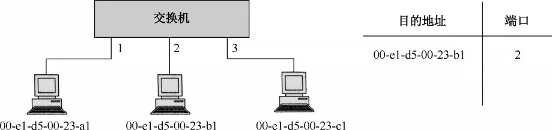

<options :options="['A. {3}和{1}', 'B. {2,3}和{1}', 'C. {2,3}和{1,2}', 'D. {1,2,3}和{1}']" />

35\. 下列因素中，不会影响信道数据传输速率的是 (&emsp;)。

<options :options="['A. 信噪比', 'B. 频率宽带', 'C. 调制速率', 'D. 信号传播速度']" />

36\. 主机甲与主机乙之间使用后退N帧协议(GBN)传输数据，主机甲的发送窗口尺寸为1000，数据帧长为1000字节，信道带宽为100Mb/s，主机乙每收到一个数据帧，就立即利用一个短帧（忽略其传输延迟）进行确认，若主机甲和主机乙之间的单向传播时延是50ms，则主机甲可以达到的最大平均数据传输速率约为 (&emsp;)。

<options :options="['A. 10Mb/s', 'B. 20Mb/s', 'C. 80Mb/s', 'D. 100Mb/s']" />

37\. 站A、B、C通过CDMA共享链路，A、B、C的码片序列分别是(1,1,1,1)、(1,-1,1,-1)和(1,1,-1,-1)。若C从链路上收到的序列是(2,0,2,0,0,-2,0,-2,0,2,0,2)，则C收到A发送的数据是 (&emsp;)。

<options :options="['A. 000', 'B. 101', 'C. 110', 'D. 111']" />

38\. 主机甲和乙建立了TCP连接，甲始终以MSS=1KB大小的段发送数据，并一直有数据发送；乙每收到一个数据段都会发出一个接收窗口为10KB的确认段。若甲在t时刻发生超时的时候拥塞窗口为8KB，则从t时刻起，不再发生超时的情况下，经过10RTT后甲的发送窗口是 (&emsp;)。

<options :options="['A. 10KB', 'B. 12KB', 'C. 14KB', 'D. 15KB']" />

39\. 下列关于UDP协议的叙述中，正确的是 (&emsp;)。

<options :options="['Ⅰ. 提供无连接服务']" />
<options :options="['Ⅱ. 供复用/分用服务']" />
<options :options="['Ⅲ. 通过差错校验，保障可靠数据传输']" /> 

<options :options="['A. 仅Ⅰ', 'B. 仅Ⅰ、Ⅱ', 'C. 仅Ⅱ、Ⅲ', 'D. 仅Ⅰ、Ⅱ、Ⅲ']" />

40\. 使用浏览器访问某大学的Web网站主页时，不可能使用到的协议是 (&emsp;)。

<options :options="['A. PPP', 'B. ARP', 'C. UDP', 'D. SMTP']" />

二、综合应用题：第41~47题，共70分。{.custom-h3}

41\. (13分) 二叉树的带权路径长度(WPL)是二叉树中所有叶结点的带权路径长度之和。给定一棵二叉树T，采用二叉链表存储，其结点结构为：

其中叶结点的weight域保存该结点的非负权值。设root为指向T的根结点的指针，请设计求T的WPL的算法，要求：

1) 给出算法的基本设计思想。
2) 使用C或C++语言，给出二叉树结点的数据类型定义。
3) 根据设计思想，采用C或C++语言描述算法，关键之处给出注释。

42\. (10分) 某网络中的路由器运行OSPF路由协议，题42表是路由器R1维护的主要链路状态信息(LSI)，题42图是根据题42表及R1的接口名构造出来的网络拓扑。

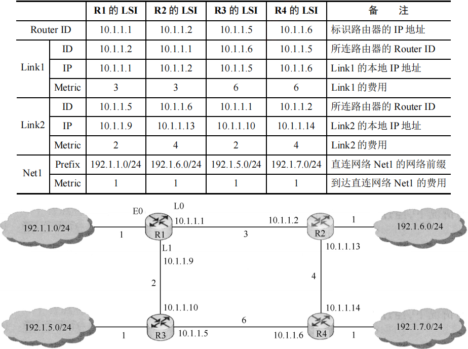

请回答下列问题。

1) 本题中的网络可抽象为数据结构中的哪种逻辑结构？
2) 针对题42表中的内容，设计合理的链式存储结构，以保存题42表中的链路状态信息(LSI)。要求给出链式存储结构的数据类型定义，并画出对应题42表的链式存储结构示意图（示意图中可仅以ID标识结点）。
3) 按照迪杰斯特拉(Dijkstra)算法的策略，依次给出R1到达题42图中子网192.1.X.X的最短路径及费用。

43\. (11分) 请根据题42描述的网络，继续回答下列问题。
1) 假设路由表结构如下表所示，请给出题42图中R1的路由表，要求包括到达题42图中子网192.1.X.X的路由，且路由表中的路由项尽可能少。
2) 当主机192.1.1.130向主机192.1.7.211发送一个TTL=64的IP分组时，R1通过哪个接口转发该IP分组？主机192.1.7.211收到的IP分组TTL是多少？
3) 若R1增加一条Metric为10的链路连接Internet,则题42表中R1的LSI需要增加哪些信息？

44\. (12分) 某程序中有如下循环代码段P：“for (int i=0; i＜N; i++) sum += A[i];”。假设编译时变量sum和i分别分配在寄存器R1和R2中。常量N在寄存器R6中，数组A的首地址在寄存器R3中。程序段P起始地址为0804 8100H，对应的汇编代码和机器代码如下表所示。

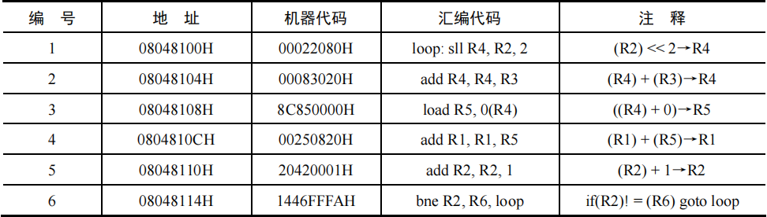

执行上述代码的计算机M采用32位定长指令字，其中分支指令bne采用如下格式。

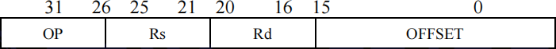

Op为操作码，Rs和Rd为寄存器编号，OFFSET为偏移量，用补码表示。请回答下列问题，并说明理由。
1) M的存储器编址单位是什么？
2) 已知sll指令实现左移功能，数组A中每个元素占多少位？
3) 题44表中bne指令的OFFSET字段的值是多少？已知bne指令采用相对寻址方式，当前PC内容为bne指令地址，通过分析题44表中指令地址和bne指令内容，推断出bne指令的转移目标地址计算公式。
4) 若M采用如下“按序发射、按序完成”的5级指令流水线：IF（取值）、ID（译码及取数）、EXE（执行）、MEM（访存）、WB（写回寄存器），且硬件不采取任何转发措施，分支指令的执行均引起3个时钟周期的阻塞，则P中哪些指令的执行会由于数据相关而发生流水线阻塞？哪条指令的执行会发生控制冒险？为什么指令1的执行不会因为与指令5的数据相关而发生阻塞？

45\. (11分) 假设对于题44中的计算机M和程序段P的机器代码，M采用页式虚拟存储管理；P开始执行时，(R1)=(R2)=0，(R6)=1000，其机器代码已调入主存但不在Cache中；数组A未调入主存，且所有数组元素在同一页，并存储在磁盘同一个扇区。请回答下列问题并说明理由。
1) P执行结束时，R2的内容是多少？
2) M的指令Cache和数据Cache分离。若指令Cache共有16行，Cache和主存交换的块大小为32字节，则其数据区的容量是多少？若仅考虑程序段P的执行，则指令Cache的命中率为多少？
3) P在执行过程中，哪条指令的执行可能发生溢出异常？哪条指令的执行可能产生缺页异常？对于数组A的访问，需要读磁盘和TLB至少各多少次？

46\. (7分) 文件F由200条记录组成，记录从1开始编号。用户打开文件后，欲将内存中的一条记录插入到文件F中，作为其第30条记录。请回答下列问题，并说明理由。
1) 若文件系统采用连续分配方式，每个磁盘块存放一条记录，文件F存储区域前后均有足够的空闲磁盘空间，则完成上述插入操作最少需要访问多少次磁盘块？F的文件控制块内容会发生哪些改变？
2) 若文件系统采用链接分配方式，每个磁盘块存放一条记录和一个链接指针，则完成上述插入操作需要访问多少次磁盘块？若每个存储块大小为1KB，其中4字节存放链接指针，则该文件系统支持的文件最大长度是多少？

47\. (9分) 系统中有多个生产者进程和多个消费者进程，共享一个能存放1000件产品的环形缓冲区（初始为空）。当缓冲区未满时，生产者进程可以放入其生产的一件产品，否则等待；当缓冲区未空时，消费者进程可以从缓冲区取走一件产品，否则等待。要求一个消费者进程从缓冲区连续取出10件产品后，其他消费者进程才可以取产品。请使用信号量P，V（或wait()，signal()）操作实现进程间的互斥与同步，要求写出完整的过程，并说明所用信号量的含义和初值。

</question>

## 2015年计算机学科专业基础试题 {.custom-h2}

一、单项选择题：第1~40小题，每小题2分，共80分。下列每题给出的四个选项中，只有一个选项最符合试题要求。 {.custom-h3}

<question>

1\. 已知程序如下：
<pre>
int S(int n) { return (n<=0) ？ 0: S(n-1)+n; }
void main() { cout << S(1); }
</pre>
程序运行时使用栈来保存调用过程的信息，自栈底到栈顶保存的信息依次对应的是 (&emsp;)。

<options :options="['A. main→S(1)→S(0)', 'B. S(0)→S(1)→main']" />
<options :options="['C. main→S(0)→S(1)', 'D. S(1)→S(0)→main']" />

2\. 先序序列为a, b, c, d的不同二叉树的个数是 (&emsp;)。

<options :options="['A. 13', 'B. 14', 'C. 15', 'D. 16']" />

3\. 下列选项给出的是从根分别到达两个叶结点路径上的权值序列，能属于同一棵哈夫曼树的是 (&emsp;)。

<options :options="['A. 24,10,5 和 24,10,7', 'B. 24,10,5 和 24,12,7']" />
<options :options="['C. 24,10,10 和 24,14,11', 'D. 24,10,5 和 24,14,6']" />

4\. 现有一棵无重复关键字的平衡二叉树(AVL)，对其进行中序遍历可得到一个降序序列。下列关于该平衡二叉树的叙述中，正确的是 (&emsp;)。

<options :options="['A. 根结点的度一定为2', 'B. 树中最小元素一定是叶结点']" />
<options :options="['C. 最后插入的元素一定是叶结点', 'D. 树中最大元素一定是无左子树']" width="77%" />

5\. 设有向图 G=(V,E)，顶点集 V={V0, V1, V2, V3}，边集 E={ <v0, v1>, <v0, v2>, <v0, v3>, <v1, v3> }。若从顶点 V0 开始对图进行深度优先遍历，则可能得到的不同遍历序列个数是 (&emsp;)。

<options :options="['A. 2', 'B. 3', 'C. 4', 'D. 5']" />

6\. 求下面的带权图的最小（代价）生成树时，可能是Kruskal算法第2次选中但不是Prim算法（从V4 开始）第2次选中的边是 (&emsp;)。

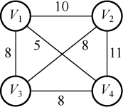

7\. 下列选项中，不能构成折半查找中关键字比较序列的是 (&emsp;)。

<options :options="['A. 500,200,450,180', 'B. 500,450,200,180', 'C. 180,500,200,450', 'D. 180,200,500,450']" width="90%"/>

8\. 已知字符串s为'abaabaabacacaabaabcc'，模式串t为'abaabc'，采用KMP算法进行匹配，第一次出现“失配”（s[i]≠t[j]）时，i=j=5，则下次开始匹配时，i和j的值分别是 (&emsp;)。

<options :options="['A. i = 1, j = 0', 'B. i = 5, j = 0', 'C. i = 5, j = 2', 'D. i = 6, j = 2']" />

9\. 下列排序算法中，元素的移动次数与关键字的初始排列次序无关的是 (&emsp;)。

<options :options="['A. 直接插入排序', 'B. 起泡排序', 'C. 基数排序', 'D. 快速排序']" />

10\. 已知小根堆为8,15,10,21,34,16,12，删除关键字8之后需重建堆，在此过程中，关键字之间的比
较次数是 (&emsp;)。

<options :options="['A. 1', 'B. 2', 'C. 3', 'D. 4']" />

11\. 希尔排序的组内排序采用的是 (&emsp;)。

<options :options="['A. 直接插入排序', 'B. 折半插入排序', 'C. 快速排序', 'D. 归并排序']" />

12\. 计算机硬件能够直接执行的是 (&emsp;)。

<options :options="['Ⅰ. 机器语言程序&emsp;Ⅱ. 汇编语言程序&emsp;Ⅲ. 硬件描述语言程序']" /> 

<options :options="['A. 仅I', 'B. 仅Ⅰ、Ⅱ', 'C. 仅Ⅰ、Ⅲ', 'D. Ⅰ、Ⅱ、Ⅲ']" />

13\. 由 3个“1”和5个“0”组成的8位二进制补码，能表示的最小整数是 (&emsp;)。

<options :options="['A. -126', 'B. -125', 'C. -32', 'D. -3']" />

14\. 下列有关浮点数加减运算的叙述中，正确的是 (&emsp;)。

<options :options="['Ⅰ. 对阶操作不会引起阶码上溢或下溢']" />
<options :options="['Ⅱ. 右规和尾数舍入都可能引起阶码上溢']" />
<options :options="['Ⅲ. 左规时可能引起阶码下溢']" />
<options :options="['Ⅳ. 尾数溢出时，结果不一定溢出']" /> 

<options :options="['A. 仅Ⅱ、Ⅲ', 'B. 仅Ⅰ、Ⅱ、Ⅳ', 'C. 仅Ⅰ、ⅡⅠ、Ⅳ', 'D. Ⅰ、Ⅱ、ⅡⅠ、Ⅳ']" />

15\. 假定主存地址为32位，按字节编址，主存和Cache之间采用直接映射方式，主存块大小为4个字，每字32位，采用回写(Write Back)方式，则能存放4K字数据的Cache的总容量的位数至少是 (&emsp;)。

<options :options="['A. 146k', 'B. 147K', 'C. 148K', 'D. 158K']" />

16\. 假定编译器将赋值语句“x=x+3”转换为指令“add xaddr, 3”，其中xaddr是x对应的存储单元地址。若执行该指令的计算机采用页式虚拟存储管理方式，并配有相应的TLB，且Cache使用直写方式，则完成该指令功能需要访问主存的次数至少是 (&emsp;)。

<options :options="['A. 0', 'B. 1', 'C. 2', 'D. 3']" />

17\. 下列存储器中，在工作期间需要周期性刷新的是 (&emsp;)。

<options :options="['A. SRAM', 'B. SDRAM', 'C. ROM', 'D. Flash存储器']" />

18\. 某计算机使用4体交叉编址存储器，假定在存储器总线上出现的主存地址（十进制）序列为8005,8006,8007,8008,8001,8002,8003,8004,8000，则可能发生访存冲突的地址对是（）

<options :options="['A. 8004和8008', 'B. 8002和8007', 'C. 8001和8008', 'D. 8000和8004']" />

19\. 下列有关总线定时的叙述中，错误的是 (&emsp;)。

<options :options="['A. 异步通信方式中，全互锁协议最慢']" />
<options :options="['B. 异步通信方式中，不互锁协议的可靠性最差']" />
<options :options="['C. 同步通信方式中，同步时钟信号可由各设备提供']" />
<options :options="['D. 半同步通信方式中，握手信号的采样由同步时钟控制']" />

20\. 磁盘转速为7200rpm，平均寻道时间为8ms，每个磁道包含1000个扇区，则访问一个扇区的平均存取时间大约是 (&emsp;)。

<options :options="['A. 8.1ms', 'B. 12.2ms', 'C. 16.3ms', 'D. 20.5ms']" />

21\. 在采用中断I/O方式控制打印输出的情况下，CPU和打印控制接口中的I/O端口之间交换的信息不可能是 (&emsp;)。

<options :options="['A. 打印字符', 'B. 主存地址', 'C. 设备状态', 'D. 控制命令']" />

22\. 内部异常（内中断）可分为故障(fault)、陷阱(trap)和终止(abort)三类。下列有关内部异常的叙述中，错误的是 (&emsp;)。

<options :options="['A. 内部异常的产生与当前执行指令相关']" />
<options :options="['B. 内部异常的检测由CPU内部逻辑实现']" />
<options :options="['C. 内部异常的响应发生在指令执行过程中']" />
<options :options="['D. 内部异常处理后返回到发生异常的指令继续执行']" />

23\. 处理外中断时，应该由操作系统保存的是 (&emsp;)。

<options :options="['A. 程序计数器(PC)的内容']" />
<options :options="['B. 通用寄存器的内容']" />
<options :options="['C. 快表(TLB)中的内容']" />
<options :options="['D. Cache中的内容']" />

24\. 假定下列指令已装入指令寄存器，则执行时不可能导致CPU从用户态变为内核态(系统态)的是 (&emsp;)。

<options :options="['A.  \
  DIV R0, R1 ; (R0)/(R1)→R0']" />
<options :options="['B.  \
  INT n ; 产生软中断']" />
<options :options="['C.  \
  NOT R0 ; 寄存器R0的内容取非']" />
<options :options="['D.  \
  MOV R0, addr ; 把地址addr处的内存数据放入寄存器R0']" />

25\. 下列选项中，会导致进程从运行态变为就绪态的事件是 (&emsp;)。

<options :options="['A. 执行P(wait)操作', 'B. 申请内存失败']" width="68%" />
<options :options="['C. 启动I/O设备', 'D. 被高优先级进程抢占']" />

26\. 若系统S1采用死锁避免方法，S2采用死锁检测方法。下列叙述中，正确的是 (&emsp;)。

<options :options="['Ⅰ. S1会限制用户申请资源的顺序，而S2不会']" />
<options :options="['Ⅱ. S1需要进程运行所需的资源总量信息，而S2不需要']" />
<options :options="['Ⅲ. S1不会给可能导致死锁的进程分配资源，而S2会']" /> 

<options :options="['A. 仅Ⅰ、Ⅱ', 'B. 仅Ⅱ、Ⅲ', 'C. 仅Ⅰ、Ⅲ', 'D. Ⅰ、Ⅱ、Ⅲ']" />

27\. 系统为某进程分配了4个页框，该进程已访问的页号序列为2,0,2,9,3,4,2,8,2,4,8,4,5。若进程要访问的下一页的页号为7,依据LRU算法，应淘汰页的页号是 (&emsp;)。

<options :options="['A. 2', 'B. 3', 'C. 4', 'D. 8']" />

28\. 在系统内存中设置磁盘缓冲区的主要目的是 (&emsp;)。

<options :options="['A. 减少磁盘I/O次数', 'B. 减少平均寻道时间']" />
<options :options="['C. 提高磁盘数据可靠性', 'D. 实现设备无关性']"  width="73%" />

29\. 文件的索引结点中存放直接索引指针10个，一级和二级索引指针各1个。磁盘块大小为1KB，每个索引指针占4字节。若某文件的索引结点已在内存中，则把该文件偏移量（按字节编址）为1234和307400处所在的磁盘块读入内存，需访问的磁盘块个数分别是 (&emsp;)。

<options :options="['A. 1,2', 'B. 1,3', 'C. 2,3', 'D. 2,4']" />

30\. 在请求分页系统中，页面分配策略与页面置换策略不能组合使用的是 (&emsp;)。

<options :options="['A. 可变分配，全局置换', 'B. 可变分配，局部置换']" />
<options :options="['C. 固定分配，全局置换', 'D. 固定分配，局部置换']" />

31\. 文件系统用位图法表示磁盘空间的分配情况，位图存于磁盘的32~127号块中，每个盘块占1024B，盘块和块内字节均从0开始编号。假设要释放的盘块号为409612，则位图中要修改的位所在的盘块号和块内字节序号分别是 (&emsp;)。

<options :options="['A. 81, 1', 'B. 81, 2', 'C. 82, 1', 'D. 82, 2']" />

32\. 某硬盘有200个磁道（最外侧磁道号为0），磁道访问请求序列为130, 42, 180, 15, 199，当前磁头位于第58号磁道并从外侧向内侧移动。按照SCAN调度方法处理完上述请求后，磁头移过的磁道数是 (&emsp;)。

<options :options="['A. 208', 'B. 287', 'C. 325', 'D. 382']" />

33\. 通过POP3协议接收邮件时，使用的传输层服务类型是 (&emsp;)。

<options :options="['A. 无连接不可靠的数据传输服务', 'B. 无连接可靠的数据传输服务']" />
<options :options="['C. 有连接不可靠的数据传输服务', 'D. 有连接可靠的数据传输服务']" />

34\. 使用两种编码方案对比特流01100111进行编码的结果如下图所示，编码1和编码2分别是 (&emsp;)。

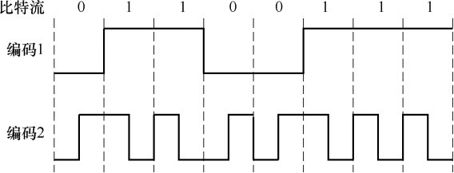

<options :options="['A. NRZ编码和曼彻斯特编码', 'B. NRZ编码和差分曼彻斯特编码']" />
<options :options="['C. NRZI编码和曼彻斯特编码', 'D. NRZI编码和差分曼彻斯特编码']" width="76%" />

35\. 主机甲通过128kb/s卫星链路，采用滑动窗口协议向主机乙发送数据链路单向传播时延为250ms，长为1000字节。不考虑确认的开销，为使链路利用率不小于80%，帧序号的比特数至少是 (&emsp;)。

<options :options="['A. 3', 'B. 4', 'C. 7', 'D. 8']" />

36\. 下列关于CSMA/CD协议的叙述中，错误的是 (&emsp;)。

<options :options="['A. 边发送数据帧，边检测是否发生冲突']" />
<options :options="['B. 适用于无线网络，以实现无线链路共享']" />
<options :options="['C. 需要根据网络跨距和数据传输速率限定最小帧长']" />
<options :options="['D. 当信号传播延迟趋近0时，信道利用率趋近100%']" />

37\. 下列关于交换机的叙述中，正确的是 (&emsp;)。

<options :options="['A. 以太网交换机本质上是一种多端口网桥']" />
<options :options="['B. 通过交换机互连的一组工作站构成一个冲突域']" />
<options :options="['C. 交换机每个接口所连的网络构成一个独立的广播域']" />
<options :options="['D. 以太网交换机可实现采用不同网络层协议的网络互连']" />

38\. 某路由器的路由表如下所示：

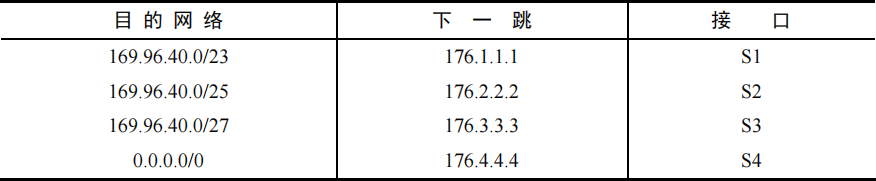

若路由器收到一个目的地址为169.96.40.5的IP分组，则转发该IP分组的接口是 (&emsp;)。

39\. 主机甲和主机乙新建一个TCP连接，甲的拥塞控制初始阈值为32KB，甲向乙始终以MSS=1KB大小的段发送数据，并一直有数据发送；乙为该连接分配16KB接收缓存，并对每个数据段进行确认，忽略段传输延迟。若乙收到的数据全部存入缓存，不被取走，则甲从连接建立成功时刻起，未出现发送超时的情况下，经过4RTT后，甲的发送窗口是 (&emsp;)。

<options :options="['A. 1KB', 'B. 8KB', 'C. 16KB', 'D. 32KB']" />

40\. 某浏览器发出的HTTP请求报文如下。下列叙述中，错误的是 (&emsp;)。

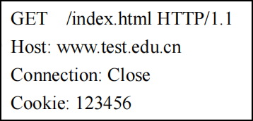

<options :options="['A. 该浏览器请求浏览index.html']" />
<options :options="['B. index.html存放在www.test.edu.cn上']" />
<options :options="['C. 该浏览器请求使用持续连接']" />
<options :options="['D. 该浏览器曾经浏览过www.test.edu.cn']" />

二、综合应用题：第41~47题，共70分。{.custom-h3}

41\. (15分) 用单链表保存m个整数，结点的结构为，且|data|&lt;n（n为正整数）。现要求设计一个时间复杂度尽可能高效的算法，对于链表中data的绝对值相等的结点，仅保留第一次出现的结点而删除其余绝对值相等的结点。例如，若给定的单链表HEAD如下：

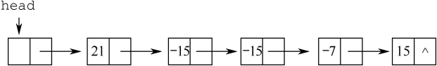

则删除结点后的HEAD为

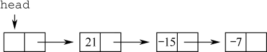

要求：
1) 给出算法的基本设计思想。
2) 使用C或C++语言，给出单链表结点的数据类型定义。
3) 根据设计思想，采用C或C++语言描述算法，关键之处给出注释。
4) 说明你所设计算法的时间复杂度和空间复杂度。

42\. (8分) 已知含有5个顶点的图G如下图所示。

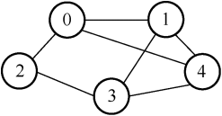

请回答下列问题：
1) 写出图G的邻接矩阵A（行、列下标从0开始）。
2) 求A²,矩阵A²中位于0行3列元素值的含义是什么？
3) 若已知具有n(n≥2)个顶点的图的邻接矩阵为B，则Bᵐ (2≤m≤n)中非零元素的含义是什么？

43\. (13分) 某16位计算机的主存按字节编码，存取单位为16位；采用16位定长指令字格式；CPU采用单总线结构，主要部分如下图所示。图中R0~R3为通用寄存器；T为暂存器；SR为移位寄存器，可实现直送(mov)、左移一位(left)和右移一位(right)三种操作，控制信号为SRop，SR的输出由信号SRout控制；ALU可实现直送A(mova)、A加B(add)、A减B(sub)、A与B(and)、A或B(or)、非A(not)、A加1(inc)七种操作，控制信号为ALUop。

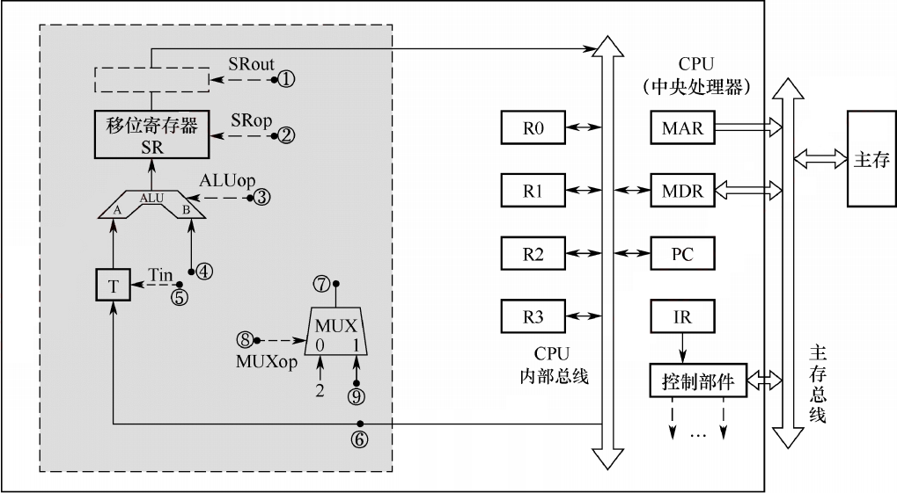

回答下列问题：
1) 图中哪些寄存器是程序员可见的？为何要设置暂存器T？
2) 控制信号ALUop和SRop的位数至少各是多少？
3) 控制信号SRout所控制部件的名称或作用是什么？
4) 端点①~⑨中，哪些端点须连接到控制部件的输出端？
5) 为完善单总线数据通路，需要在端点①~⑨中相应的端点之间添加必要的连线。写出连线的起点和终点，以正确表示数据的流动方向。
6) 为什么二路选择器MUX的一个输入端是2？

44\. (10分) 题43中描述的计算机，某部分指令执行过程的控制信号如下图所示。

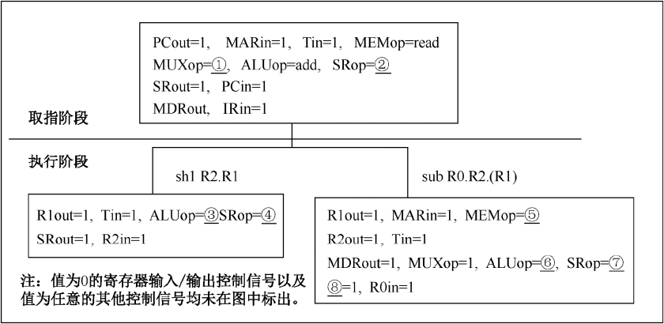

该机指令格式如下图所示，支持寄存器直接和寄存器间接两种寻址方式，寻址方式位分别为0和1，通用寄存器R0~R3的编号分别为0,1,2和3。

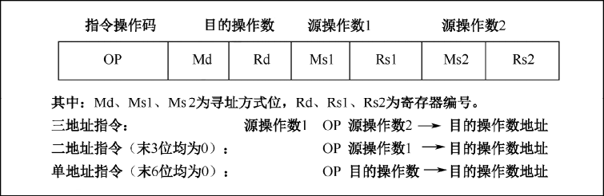

回答下列问题：
1) 该机的指令系统最多可定义多少条指令？
2) 假定inc、shl 和 sub指令的操作码分别为01H、02H和03H，则以下指令对应的机器代码各是什么？
<pre>
① inc R1           ; (R1)+1→R1
② shl R2, R1       ; (R1)<<1→R2
③ sub R3, (R1), R2 ; ((R1))−(R2)→R3
</pre>
3) 假设寄存器X的输入和输出控制信号分别为Xin和Xout，其值为1表示有效，为0表示无效（如PCout=1表示PC内容送总线）；存储器控制信号为MEMop，用于控制存储器的读(read)和写(write)操作。写出本题第一幅图中标号①~⑧处的控制信号或控制信号的取值。
4) 指令“sub R1,R3,(R2)”和“inc R1”的执行阶段至少各需要多少个时钟周期？

45\. (9分) 有A、B两人通过信箱进行辩论，每个人都从自已的信箱中取得对方的问题。将答案和向对方提出的新问题组成一个邮件放入对方的邮箱中。假设A的信箱最多放M个邮件，B的信箱最多放N个邮件。初始时A的信箱中有x个邮件(0<x<M)，B的信箱中有y个(0<x<N)。辩论者每取出一个邮件，邮件数减1。A和B两人的操作过程描述如下：
<pre>
CoBegin
{
  A {                             B {
    while(TRUE){                    while(TRUE){
      从A的信箱中取出一个邮件；        从B的信箱中取出一个邮件；
      回答问题并提出一个新问题；        回答问题并提出一个新问题；
      将新邮件放入B的信箱；            将新邮件放入A的信箱；
    }                               }
  }                               }
} CoEnd
</pre>
当信箱不为空时，辩论者才能从信箱中取邮件，否则需要等待。当信箱不满时，辩论者才能将新邮件放入信箱，否则需要等待。请添加必要的信号量和P、V（或 wait、signal）操作，以实现上述过程的同步。要求写出完整过程，并说明信号量的含义和初值。

46\. (6分) 某计算机系统按字节编址，采用二级页表的分页存储管理方式，虚拟地址格式如下所示：

请回答下列问题。
1) 页和页框的大小各为多少字节？进程的虚拟地址空间大小为多少页？
2) 假定页目录项和页表项均占4个字节，则进程的页目录和页表共占多少页？要求写出计算过程。
3) 若某指令周期内访问的虚拟地址为0100 0000H和0111 2048H，则进行地址转换时共访问多少个二级页表？要求说明理由。

47\. (9分) 某网络拓扑如下图所示，其中路由器内网接口、DHCP服务器、WWW服务器与主机1均采用静态IP地址配置，相关地址信息见图中标注；主机2~主机N通过DHCP服务器动态获取IP地址等配置信息。

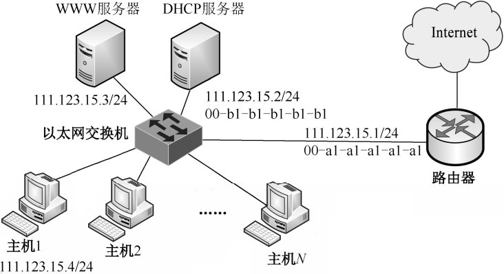

请回答下列问题。
1) DHCP服务器可为主机2~主机N 动态分配IP地址的最大范围是什么？主机2使用DHCP协议获取IP地址的过程中，发送的封装DHCP Discover报文的IP分组的源IP地址和目的IP地址分别是什么？
2) 若主机2的ARP表为空，则该主机访问Internet时，发出的第一个以太网帧的目的MAC地址是什么？封装主机2发往Internet的IP分组的以太网帧的目的MAC地址是什么？
3) 若主机1的子网掩码和默认网关分别配置为255.255.255.0和111.123.15.2，则该主机是否能访问WWW服务器？是否能访问Internet？请说明理由。

</question>

## 2016年计算机学科专业基础试题 {.custom-h2}

一、单项选择题：第1~40小题，每小题2分，共80分。下列每题给出的四个选项中，只有一个选项最符合试题要求。 {.custom-h3}

<question>

1\. 已知表头元素为c的单链表在内存中的存储状态如下表所示。

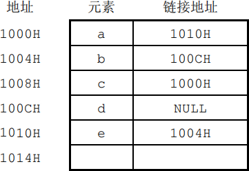

现将f存放于1014H处并插入单链表，若f在逻辑上位于a和e之间，则a、e、f的“链接地址”依次是 (&emsp;)。

<options :options="['A. 1010H、1014H、1004H', 'C. 1014H、1010H、1004H']" />
<options :options="['B. 1010H、1004H、1014H', 'D. 1014H、1004H、1010H']" />

2\. 已知一个带有表头结点的循环双链表L，结点结构为，其中prev和next分别是指向其直接前驱和直接后继结点的指针。现要删除指针p所指的结点，正确的语句序列是 (&emsp;)。

<options :options="['A. p->next->prev=p->prev; p->prev->next=p->prev; free(p);']" />
<options :options="['B. p->next->prev=p->next; p->prev->next=p->next; free(p);']" />
<options :options="['C. p->next->prev=p->next; p->prev->next=p->prev; free(p);']" />
<options :options="['D. p->next->prev=p->prev; p->prev->next=p->next; free(p);']" />

3\. 设有如下图所示的火车车轨，入口到出口之间有n条轨道，列车的行进方向均为从左至右，列车可驶入任意一条轨道。现有编号为1~9的9列列车，驶入的次序依次是8,4,2,5,3,9,1,6,7。若期望驶出的次序依次为1~9，则n至少是 (&emsp;)。

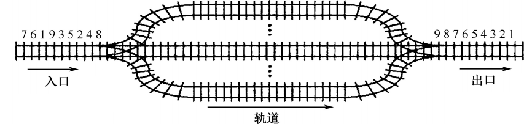

<options :options="['A. 2', 'B. 3', 'C. 4', 'D. 5']" />

4\. 有一个100阶的三对角矩阵M，其元素mi,j（1≤i,j≤100）按行优先依次压缩存入下标从0开始的一维数组N中。元素m30,30在N中的下标是 (&emsp;)。

<options :options="['A. 86', 'B. 87', 'C. 88', 'D. 89']" />

5\. 若森林F有15条边、25个结点，则F包含树的个数是 (&emsp;)。

<options :options="['A. 8', 'B. 9', 'C. 10', 'D. 11']" />

6\. 下列选项中，不是下图深度优先搜索序列的是 (&emsp;)。

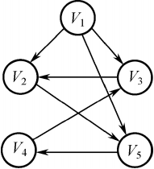

<options :options="['A. V1, V5, V4, V3, V2', 'B. V1, V3, V2, V5, V4']" />
<options :options="['C. V1, V2, V5, V4, V3', 'D. V1, V2, V3, V4, V5']" />

7\. 若对n个顶点、e条弧的有向图采用邻接表存储，则拓扑排序算法的时间复杂度是 (&emsp;)。

<options :options="['A. O(n)', 'B. O(n+e)', 'C. O(n^2)', 'D. O(ne)']" />

8\. 使用Dijkstra算法求下图中从顶点1到其他各顶点的最短路径，依次得到的各最短路径的目标顶点是 (&emsp;)。

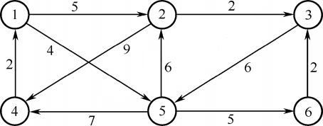

<options :options="['A. 5,2,3,4,6', 'B. 5,2,3,6,4', 'C. 5,2,4,3,6', 'D. 5,2,6,3,4']" />

9\. 在有n(n>1000)个元素的升序数组A中查找关键字x。查找算法的伪代码如下所示。
<pre>
k=0;
while(k&lt;n 且 A[k]&lt;x) k=k+3;
if(k&lt;n 且 A[k]==x) 查找成功;
else if(k-1&lt;n 且 A[k-1]==x) 查找成功;
else if(k-2&lt;n 且 A[k-2]==x) 查找成功;
else 查找失败;
</pre>
本算法与折半查找算法相比，有可能具有更少比较次数的情形是 (&emsp;)。

<options :options="['A. 当x不在数组中', 'B. 当x接近数组开头处']" />
<options :options="['C. 当x接近数组结尾处', 'D. 当x位于数组中间位置']" />

10\. B+树不同于B树的特点之一是 (&emsp;)。

<options :options="['A. 能支持顺序查找', 'B. 结点中含有关键字']" width="68%" />
<options :options="['C. 根结点至少有两个分支', 'D. 所有叶结点都在同一层上']" />

11\. 对10TB的数据文件进行排序，应使用的方法是 (&emsp;)。

<options :options="['A. 希尔排序', 'B. 堆排序', 'C. 快速排序', 'D. 归并排序']" />

12\. 将高级语言源程序转换为机器级目标代码文件的程序是 (&emsp;)。

<options :options="['A. 汇编程序', 'B. 链接程序', 'C. 编译程序', 'D. 解释程序']" />

13\. 有如下C语言程序段：
<pre>
short si=-32767;
unsigned short usi=si;
</pre>
执行上述两条语句后，机器的值为 (&emsp;)。

<options :options="['A. -32767', 'B. 32767', 'C. 32768', 'D. 32769']" />

14\. 某计算机字长为32位，按字节编址，采用小端(Little Endian)方式存放数据。假定有一个double型变量，其机器数表示为1122 3344 5566 7788H，存放在0000 8040H开始的连续存储单元中，则存储单元00008046H中存放的是 (&emsp;)。

<options :options="['A. 22H', 'B. 33H', 'C. 77H', 'D. 66H']" />

15\. 有如下C语言程序段：
<pre>
for (k=0; k<1000; k++)
  a[k]=a[k]+32;
</pre>
若数组a和变量k均为int型，int型数据占4B，数据Cache采用直接映射方式，数据区大小为1KB、块大小为16B，该程序段执行前Cache为空，则该程序段执行过程中访问数组a的Cache缺失率约为 (&emsp;)。

<options :options="['A. 1.25%', 'B. 2.5%', 'C. 12.5%', 'D. 25%']" />

16\. 某存储器容量为64KB，按字节编址，地址4000H~5FFFH为ROM区，其余为RAM区。若采用8K×4位的SRAM芯片进行设计，则需要该芯片的数量是 (&emsp;)。

<options :options="['A. 7', 'B. 8', 'C. 14', 'D. 16']" />

17\. 某指令格式如下所示。

其中M为寻址方式，I为变址寄存器编号，D为形式地址。若采用先变址后间址的寻址方式，则操作数的有效地址是 (&emsp;)。

<options :options="['A. I+D', 'B. (I)+D', 'C. ((I)+D)', 'D. ((I))+D']" />

18\. 某计算机的主存储器空间为4GB，字长为32位，按字节编址，采用32位字长指令字格式。若指令按字边界对齐存放，则程序计数器(PC)和指令寄存器(IR)的位数至少分别是 (&emsp;)。

<options :options="['A. 30, 30', 'B. 30, 32', 'C. 32, 30', 'D. 32, 32']" />

19\. 在无转发机制的五段基本流水线（取指、译码/读寄存器、运算、访写回寄存器）中，下列指令序列存在数据冒险的指令对是 (&emsp;)。
<pre>
I1:  add R1, R2, R3  ;(R2)+(R3)→R1
I2:  add R5, R2, R4  ;(R2)+(R4)→R5
I3:  add R4, R5, R3  ;(R5)+(R3)→R4
I4:  add R5, R2, R6  ;(R2)+(R6)→R5
</pre>
<options :options="['A. I1和I2', 'B. I2和I3', 'C. I2和I4', 'D. I3和I4']" />

20\. 单周期处理器中所有指令的指令周期为一个时钟周期。下列关于单周期错误的是 (&emsp;)。

<options :options="['A. 可以采用单总线结构数据通路']" />
<options :options="['B. 处理器时钟频率较低']" />
<options :options="['C. 在指令执行过程中控制信号不变']" />
<options :options="['D. 每条指令的CPI为1']" />

21\. 下列关于总线设计的叙述中，错误的是 (&emsp;)。

<options :options="['A. 并行总线传输比串行总线传输速度快']" />
<options :options="['B. 采用信号线复用技术可减少信号线数量']" />
<options :options="['C. 采用突发传输方式可提高总线数据传输率']" />
<options :options="['D. 采用分离事务通信方式可提高总线利用率']" />

22\. 异常是指令执行过程中在处理器内部发生的特殊事件，中断是来自处理器外部的请求事件。下列关于中断或异常情况的叙述中，错误的是 (&emsp;)。

<options :options="['A. “访存时缺页”属于中断', 'B. “整数除以0”属于异常']" />
<options :options="['C. “DMA传送结束”属于中断', 'D. “存储保护错”属于异常']" />

23\. 下列关于批处理系统的叙述中，正确的是 (&emsp;)。

<options :options="['Ⅰ. 批处理系统允许多个用户与计算机直接交互']" />
<options :options="['Ⅱ. 批处理系统分为单道批处理系统和多道批处理系统']" />
<options :options="['Ⅲ. 中断技术使得多道批处理系统和I/O设备可与CPU并行工作']" /> 

<options :options="['A. 仅Ⅱ、Ⅲ', 'B. 仅Ⅱ', 'C. 仅Ⅰ、Ⅱ', 'D. 仅Ⅰ、Ⅲ']" />

24\. 某单CPU系统中有输入和输出设备各1台，现有3个并发执行的作业，每个作业的输入、计算和输出时间均分别为 2ms、3ms和4ms,且都按输入、计算和输出的顺序执行，则执行完3个作业需要的时间最少是 (&emsp;)。

<options :options="['A. 15ms', 'B. 17ms', 'C. 22ms', 'D. 27ms']" />

25\. 系统中有3个不同的临界资源R1、R2和R3，被4个进程p1、p2、p3及p4共享。各进程对资源的需求为：p1申请R1和R2，p2申请R2和R3，p3申请R1和R3，p4申请R2。若系统出现死锁，则处于死锁状态的进程数至少是 (&emsp;)。

<options :options="['A. 1', 'B. 2', 'C. 3', 'D. 4']" />

26\. 某系统采用改进型CLOCK置换算法，页表项中字段A为访问位，M为修改位。A=0表示页最近没有被访问，A=1表示页最近被访问过。M=0表示页没有被修改过，M=1表示页被修改过。按(A, M)所有可能的取值，将页分为四类：(0,0)、(1,0)、(0,1)和(1,1)，则该算法淘汰页的次序为 (&emsp;)。

<options :options="['A. (0,0)、(0,1)、(1,0)、(1,1)']" />
<options :options="['B. (0,0)、(1,0)、(0,1)、(1,1)']" />
<options :options="['C. (0,0)、(0,1)、(1,1)、(1,0)']" />
<options :options="['D. (0,0)、(1,1)、(0,1)、(1,0)']" />

27\. 使用TSL(TestandSetLock)指令实现进程互斥的伪代码如下所示。
<pre>
do {
  ...
  while(TSL(&lock));
  critical section;
  lock=FALSE;
  ...
} while(TRUE);
</pre>
下列与该实现机制相关的叙述中，正确的是 (&emsp;)。

<options :options="['A. 退出临界区的进程负责唤醒阻塞态进程']" />
<options :options="['B. 等待进入临界区的进程不会主动放弃CPU']" />
<options :options="['C. 上述伪代码满足“让权等待”的同步准则']" />
<options :options="['D. while(TSL(&lock))语句应在关中断状态下执行']" />

28\. 某进程的段表内容如下所示：

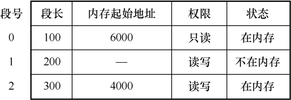

当访问段号为2、段内地址为400的逻辑地址时，进行地址转换的结果是 (&emsp;)。

<options :options="['A. 段缺失异常', 'B. 得到内存地址4400', 'C. 越权异常', 'D. 越界异常']" />

29\. 某进程访问页面的序列如下所示。

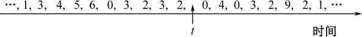

若工作集的窗口大小为6，则在t时刻的工作集为 (&emsp;)。

<options :options="['A. {6,0,3,2}', 'B. {2,3,0,4}', 'C. {0,4,3,2,9}', 'D. {4,5,6,0,3,2}']" />

30\. 进程P1和P2均包含并发执行的线程，部分伪代码描述如下所示。
<pre>
//线程P1          //进程P2
int x=0;          int x=0;
Thread1()         Thread3()
{                 {
  int a;            int a;
  a=1; x+=1;        a=x; x+=3；
}                 }
Thread2()         Thread4()
{                 {
  int a;            int b;
  a=2; x+=2;        b=x; x+=4；
}                 }
</pre>
下列选项中，需要互斥执行的操作是 (&emsp;)。

<options :options="['A. a=l与a=2', 'B. a=x与b=x', 'C. x+=l与x+=2', 'D. x+=l与x+=3']" />

31\. 下列关于SPOOLing技术的叙述中，错误的是 (&emsp;)。

<options :options="['A. 需要外存的支持']" />
<options :options="['B. 需要多道程序设计技术的支持']" />
<options :options="['C. 可以让多个作业共享一台独占设备']" />
<options :options="['D. 由用户作业控制设备与输入/输出井之间的数据传送']" />

32\. 下列关于管程的叙述中，错误的是 (&emsp;)。

<options :options="['A. 管程只能用于实现进程的互斥']" />
<options :options="['B. 管程是由编程语言支持的进程同步机制']" />
<options :options="['C. 任何时候只能有一个进程在管程中执行']" />
<options :options="['D. 管程中定义的变量只能被管程内的过程访问']" />

33\. 在OSI参考模型中，R1、Switch、Hub实现的最高功能层分别是 (&emsp;)。

<options :options="['A. 2、2、1', 'B. 2、2、2', 'C. 3、2、1', 'D. 3、2、2']" />

34\. 如下图所示，若连接R2和R3链路的频带宽度为8kHz，信噪比为30dB，该链路实际数据传输速率约为理论最大数据传输速率的50%，则该链路的实际数据传输速率约为 (&emsp;)。

<options :options="['A. 8kb/s', 'B. 20kb/s', 'C. 40kb/s', 'D. 80kb/s']" />

35\. 若主机H2向主机H4发送一个数据帧，主机H4向主机H2立即发送一个确认帧，则除H4外，从物理层上能够收到该确认帧的主机还有 (&emsp;)。

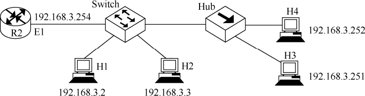

<options :options="['A. 仅H2', 'B. 仅H3', 'C. 仅H1、H2', 'D. 仅H2、H3']" />

36\. 如下图所示，在Hub再生比特流的过程中会产生1.535μs的时延（Switch和Hub均为100Base-T设备），信号传播速率为200m/μs，不考虑以太网帧的前导码，则H3和H4之间理论上可以相距的最远距离是 (&emsp;)。

<options :options="['A. 200m', 'B. 205m', 'C. 359m', 'D. 512m']" />

37\. 假设下图中的R1、R2、R3采用RIP交换路由信息，且均已收敛。若R3检测到网络201.1.2.0/25不可达，并向R2通告一次新的距离向量，则R2更新后，其到达该网络的距离是 (&emsp;)。

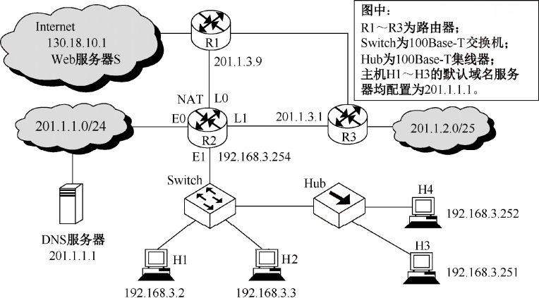

<options :options="['A. 2', 'B. 3', 'C. 16', 'D. 17']" />

38\. 下图中，假设连接R1、R2和R3之间的点对点链路使用地址201.1.3.x/30，当H3访问Web服务器S时，R2转发出去的封装HTTP请求报文的IP分组是源IP地址和目的IP地址，它们分别是 (&emsp;)。

<options :options="['A. 192.168.3.251, 130.18.10.1', 'B. 192.168.3.251, 201.1.3.9']" />
<options :options="['C. 201.1.3.8, 130.18.10.1', 'D. 201.1.3.10, 130.18.10.1']" width="74%" />

39\. 如下图所示，假设H1与H2的默认网关和子网掩码均分别配置为192.168.3.1和255.255.255.128，H3和H4的默认网关和子网掩码均分别配置为192.168.3.254和255.255.255.128，则下列现象中可能发生的是 (&emsp;)。

<options :options="['A. H1不能与H2进行正常IP通信', 'B. H2与H4均不能访问Internet']" />
<options :options="['C. H1不能与H3进行正常IP通信', 'D. H3不能与H4进行正常IP通信']" width="77%" />

40\. 假设所有域名服务器均采用迭代查询方式进行域名解析。当主机访问规范域名为www.abc.xyz.com的网站时，本地域名服务器在完成该域名解析的过程中，可能发出DNS查询的最少和最多次数分别是 (&emsp;)。

<options :options="['A. 0, 3', 'B. 1, 3', 'C. 0, 4', 'D. 1, 4']" />

二、综合应用题：第41~47题，共70分。{.custom-h3}

41\. (x分) 设题33~41图中的H3访问Web服务器S时，S为新建的TCP连接分配了20KB(K=1024)的接收缓存，最大段长MSS=1KB，平均往返时间RTT=200ms。H3建立连接时的初始序号为100，且持续以MSS大小的段向S发送数据，拥塞窗口初始阈值为32KB；S对收到的每个段进行确认，并通告新的接收窗口。假定TCP连接建立完成后，S端的TCP接收缓存仅有数据存入而无数据取出。请回答下列问题。

1) 在TCP连接建立过程中，H3收到的S发送过来的第二次握手TCP段的SYN和ACK标志位的值分别是多少？确认序号是多少？
2) H3收到的第8个确认段所通告的接收窗口是多少？此时H3的拥塞窗口变为多少？H3的发送窗口变为多少？
3) 当H3的发送窗口等于0时，下一个待发送的数据段序号是多少？H3从发送第1个数据段到发送窗口等于0时刻为止，平均数据传输速率是多少（忽略段的传输延时）？
4) 若H3与S之间通信已经结束，在t时刻H3请求断开该连接，则从t时刻起，S释放该连接的最短时间是多少？

42\. (x分) 如果一棵非空k(k≥2)叉树T中每个非叶结点都有k个孩子，则称T为正则k叉树。请回答下列问题并给出推导过程
1) 若T有m个非叶结点，则T中的叶结点有多少个？
2) 若T的高度为h（单结点的树h=1），则T的结点数最多为多少个？最少为多少个？

43\. (x分) 已知由n(n≥2)个正整数构成的集合A={0≤k&lt;n}，将其划分为两个不相交的子集A1和A2，元素个数分别是n1和n2，A1和A2决中元素之和分别为S1和S2。设计一个尽可能高效的划分算法，满足|n1-n2|最小且|S1-S2|最大。要求：

1) 给出算法的基本设计思想。
2) 根据设计思想，采用C或C++语言描述算法，关键之处给出注释。
3) 说明你所设计算法的平均时间复杂度和空间复杂度。

44\. (12分) 假定CPU主频为50MHz，CPI为4。设备D采用异步串行通信方式向主机传送7位ASCII字符，通信规程中有1位奇校验位和1位停止位，从D接收启动命令到字符送入I/O端口需要0.5ms。请回答下列问题，要求说明理由。
1) 每传送一个字符，在异步串行通信线上共需传输多少位？在设备D持续工作过程中，每秒钟最多可向I/O端口送入多少个字符？
2) 设备D采用中断方式进行输入/输出，示意图如下。

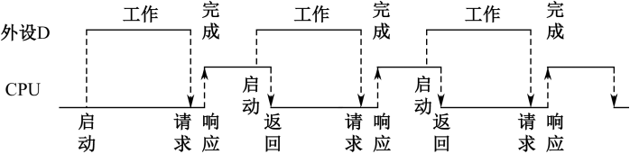

3) I/O端口每收到一个字符申请一次中断，中断响应需10个时钟周期，中断服务程序共有20条指令，其中第15条指令启动D工作。若CPU需从D读取1000个字符，则完成这一任务所需时间大约是多少个时钟周期？CPU用于完成这一任务的时间大约是多少个时钟周期？在中断响应阶段CPU进行了哪些操作？

45\. (x分) 某计算机采用页式虚拟存储管理方式，按字节编址，虚拟地址为32位，物理地址为24位，页大小为8KB；TLB采用全相联映射；Cache数据区大小为64KB，按2路组相联方式组织，主存块大小为64B。存储访问过程的示意图如下。

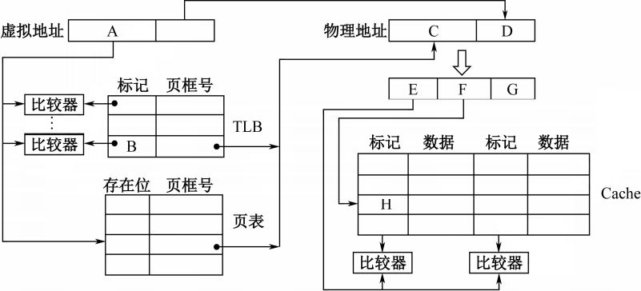

请回答下列问题。
1) 图中字段A~G的位数各是多少？TLB 标记字段B中存放的是什么信息？
2) 将块号为4099的主存块装入到Cache中时，所映射的Cache组号是多少？对应的H字段内容是什么？
3) Cache缺失处理的时间开销大还是缺页处理的时间开销大？为什么？
4) 为什么Cache可以采用直写(Write Through)策略，而修改页面内容时总是采用回写(Write Back)策略？

46\. (x分) 某进程调度程序采用基于优先数（priority）的调度策略，即选择优先数最小的进程运行，进程创建时由用户指定一个nice作为静态优先数。为了动态调整优先数，引入运行时间cpuTime和等待时间waitTime，初值均为O。进程处于执行态时，cpuTime定时加1，且WaitTime置0;进程处于就绪态时，cpuTime置0，waitTime定时加1。请回答下列问题。
1) 若调度程序只将nice的值作为进程的优先数，即priority=nice，则可能会出现饥饿现象，为什么？
2) 使用nice、cpuTime和waitTime设计一种动态优先数计算方法，以避免产生饥饿现象，并说明waitTime的作用。

47\. (x分)
某磁盘文件系统使用链接分配方式组织文件，簇大小为4KB。目录文件的每个目录项包括文件名和文件的第一个簇号，其他簇号存放在文件分配表FAT中。
1) 假定目录树如下图所示，各文件占用的簇号及顺序如下表所示，其中dir、dir1是目录，file1、file2是用户文件。请给出所有目录文件的内容。

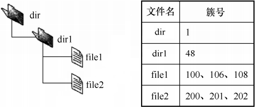

1) 若FAT的每个表项仅存放簇号，占2字节，则FAT的最大长度为多少字节？该文件系统支持的文件长度最大是多少？
2) 系统通过目录文件和FAT实现对文件的按名存取，说明file1的106、108两个簇号分别存放在FAT的哪个表项中。
3) 假设仅FAT和dir目录文件已读入内存，若需将文件dir/dir1/file1的第5000个字节读入内存，则要访问哪几个簇？

</question>

## 2017年计算机学科专业基础试题 {.custom-h2}

一、单项选择题：第1~40小题，每小题2分，共80分。下列每题给出的四个选项中，只有一个选项最符合试题要求。 {.custom-h3}

<question>

1\. 下列函数的时间复杂度是 (&emsp;)。
<pre>
int func(int n){
  int i=0, sum=0;
  while(sum&lt;n) sum += ++i;
  return i;
}
</pre>
<options :options="['A. O(log2n)', 'B. O(n1/2)', 'C. O(n)', 'D. O(nlog2n)']" />

2\. 下列关于栈的叙述中，错误的是 (&emsp;)。

<options :options="['Ⅰ. 采用非递归方式重写递归程序时必须使用栈']" />
<options :options="['Ⅱ. 函数调用时，系统要用栈保存必要的信息']" />
<options :options="['Ⅲ. 只要确定了入栈次序，即可确定出栈次序']" />
<options :options="['Ⅳ. 栈是一种受限的线性表，允许在其两端进行操作']" /> 

<options :options="['A. 仅Ⅰ', 'B. 仅Ⅰ、Ⅱ、Ⅲ', 'C. 仅Ⅰ、Ⅲ、Ⅳ', 'D. 仅Ⅱ、Ⅲ、Ⅳ']" />

3\. 适用于压缩存储稀疏矩阵的两种存储结构是 (&emsp;)。

<options :options="['A. 三元组表和十字链表']" />
<options :options="['B. 三元组表和邻接矩阵']" />
<options :options="['C. 十字链表和二叉链表']" />
<options :options="['D. 邻接矩阵和十字链表']" />

4\. 要使一棵非空二叉树的先序序列与中序序列相同，其所有非叶结点须满足的条件是 (&emsp;)。

<options :options="['A. 只有左子树', 'B. 只有右子树', 'C. 结点的度均为1', 'D. 结点的度均为2']" />

5\. 某二叉树的树形如下图所示，其后序序列为e,a,c,b,d,g,f，树中与结点a同层的结点是 (&emsp;)。

<options :options="['A. c', 'B. d', 'C. f', 'D. g']" />

6\. 已知字符集{a, b, c, d, e, f, g, h}，若各字符的哈夫曼编码依次是0100, 10, 0000, 0101, 001, 011, 11, 0001，则编码序列0100011001001011110101的译码结果是 (&emsp;)。

<options :options="['A. acgabfh', 'B. adbagbb', 'C. afbeagd', 'D. afeefgd']" />

7\. 已知无向图G含有16条边, 其中度为4的顶点个数为3, 度为3的顶点个数为4, 其他顶点的度均小于3。图G所含的顶点个数至少是 (&emsp;)。

<options :options="['A. 10', 'B. 11', 'C. 13', 'D. 15']" />

8\. 下列二叉树中，可能成为折半查找判定树（不含外部结点）的是 (&emsp;)。

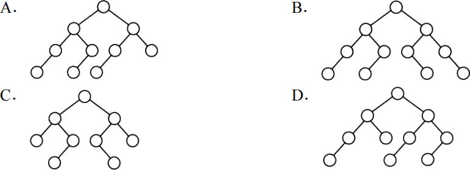

9\. 下列应用中，适合使用B+树的是 (&emsp;)。

<options :options="['A. 编译器中的词法分析', 'B. 关系数据库系统中的索引']" />
<options :options="['C. 网络中的路由表快速查找', 'D. 操作系统的磁盘空闲块管理']" />

10\. 在内部排序时，若选择了归并排序而没有选择插入排序，则可能的理由是 (&emsp;)。

<options :options="['Ⅰ. 归并排序的程序代码更短']" />
<options :options="['Ⅱ. 归并排序的占用空间更少']" />
<options :options="['Ⅲ. 归并排序的运行效率更高']" /> 

<options :options="['A. 仅Ⅱ', 'B. 仅Ⅲ', 'C. 仅Ⅰ、Ⅱ', 'D. 仅Ⅰ、Ⅲ']" />

11\. 下列排序方法中，若将顺序存储更换为链式存储，则算法的时间效率会降低的是 (&emsp;)。

<options :options="['Ⅰ. 插入排序&emsp;Ⅱ. 选择排序&emsp;Ⅲ. 起泡排序&emsp;Ⅳ. 希尔排序&emsp;Ⅴ. 堆排序']" /> 

<options :options="['A. 仅Ⅰ、Ⅱ', 'B. 仅Ⅱ、Ⅲ', 'C. 仅Ⅲ、Ⅳ', 'D. 仅Ⅳ、Ⅴ']" />

12\. 假定计算机M1和M2具有相同的指令集体系结构(ISA)，主频分别为1.5GHz和1.2GHz。在M1和M2上运行某基准程序P，平均CPI分别为2和1，则程序P在M1和M2上运行时间的比值是 (&emsp;)。

<options :options="['A. 0.4', 'B. 0.625', 'C. 1.6', 'D. 2.5']" />

13\. 某计算机主存按字节编址，由4个64M×8位的DRAM芯片采用交叉编址方式构成，并与宽度为32位的存储器总线相连，主存每次最多读写32位数据。若double型变量x的主存地址为804001AH，则读取x需要的存储周期数是 (&emsp;)。

<options :options="['A. 1', 'B. 2', 'C. 3', 'D. 4']" />

14\. 某C语言程序段如下：
<pre>
for(i=0;i<=9;i++){
  temp=1;
  for(j=0;j<=i;j++) temp*=a[j];
  sum+=temp;
}
</pre>
下列关于数组a的访问局部性的描述中，正确的是 (&emsp;)。

<options :options="['A. 时间局部性和空间局部性皆有', 'B. 无时间局部性，有空间局部性']" />
<options :options="['C. 有时间局部性，无空间局部性', 'D. 时间局部性和空间局部性皆无']" />

15\. 下列寻址方式中，最适合按下标顺序访问一维数组元素的是 (&emsp;)。

<options :options="['A. 相对寻址', 'B. 寄存器寻址', 'C. 直接寻址', 'D. 变址寻址']" />

16\. 某计算机按字节编址，指令字长固定且只有两种指令格式，其中三地址指令29条、二地址指令107条，每个地址字段为6位，则指令字长至少应该是 (&emsp;)。

<options :options="['A. 24位', 'B. 26位', 'C. 28位', 'D. 32位']" />

17\. 下列关于超标量流水线特性的叙述中，正确的是 (&emsp;)。

<options :options="['Ⅰ. 能缩短流水线功能段的处理时间']" />
<options :options="['Ⅱ. 能在一个时钟周期内同时发射多条指令']" />
<options :options="['Ⅲ. 能结合动态调度技术提高指令执行并行性']" /> 

<options :options="['A. 仅Ⅱ', 'B. 仅Ⅰ、Ⅲ', 'C. 仅Ⅱ、Ⅲ', 'D. 仅Ⅰ、Ⅱ、Ⅲ']" />

18\. 下列关于主存储器(MM)和控制存储器(CS)的叙述，错误的是 (&emsp;)。

<options :options="['A. MM在CPU外，CS在CPU内']" />
<options :options="['B. MM按地址访问，CS按内容访问']" />
<options :options="['C. MM存储指令和数据，CS存储微指令']" />
<options :options="['D. MM用RAM和ROM实现，CS用ROM实现']" />

19\. 下列关于指令流水线数据通路的叙述中，错误的是 (&emsp;)。

<options :options="['A. 包含生成控制信号的控制部件']" />
<options :options="['B. 包含算术逻辑运算部件(ALU)']" />
<options :options="['C. 包含通用寄存器组和取指部件']" />
<options :options="['D. 由组合逻辑电路和时序逻辑电路组合而成']" />

20\. 下列关于多总线结构的叙述中，错误的是 (&emsp;)。

<options :options="['A. 靠近CPU的总线速度较快', 'B. 存储器总线可支持突发传送方式']" />
<options :options="['C. 总线之间须通过桥接器相连', 'D. PCI-Express×16采用并行传输方式']" />

21\. I/O指令实现的数据传送通常发生在 (&emsp;)。

<options :options="['A. I/O设备和I/O端口之间']" />
<options :options="['B. 通用寄存器和I/O设备之间']" />
<options :options="['C. I/O端口和I/O端口之间']" />
<options :options="['D. 通用寄存器和I/O端口之间']" />

22\. 下列关于多重中断系统的叙述中，错误的是 (&emsp;)。

<options :options="['A. 在一条指令执行结束时响应中断']" />
<options :options="['B. 中断处理期间CPU处于关中断状态']" />
<options :options="['C. 中断请求的产生与当前指令的执行无关']" />
<options :options="['D. CPU通过采样中断请求信号检测中断请求']" />

23\. 假设4个作业到达系统的时刻和运行时间如下表所示：

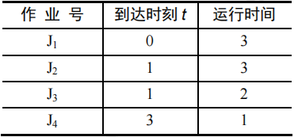

系统在t=2时开始作业调度。若分别采用先来先服务和短作业优先调度算法，则选中的作业分别是 (&emsp;)。

<options :options="['A. J2、J3', 'B. J1、J4', 'C. J2、J4', 'D. J1、J3']" />

24\. 执行系统调用的过程包括如下主要操作：①返回用户态②执行陷入(Trap)指令③传递系统调用参数④执行相应的服务程序正确的执行顺序是 (&emsp;)。

<options :options="['A. ②→③→①→④']" />
<options :options="['B. ②→④→③→①']" />
<options :options="['C. ③→②→④→①']" />
<options :options="['D. ③→④→②→①']" />

25\. 某计算机按字节编址，其动态分区内存管理采用最佳适应算法，每次分配和回收内存后都对空闲分区链重新排序，当前空闲分区信息如下表所示。

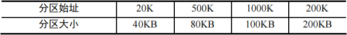

回收起始地址为60K、大小为140KB的分区后，系统中空闲分区的数量、空闲分区链第一个分区的起始地址和大小分别是 (&emsp;)。

<options :options="['A. 3、20K、380KB', 'B. 3、500K、80KB', 'C. 4、20K、180KB', 'D. 4、500K、80KB']" width="95%" />
<options :options="[]" />

26\. 某文件系统的簇和磁盘扇区大小分别为1KB和512B。若一个文件的大小为1026B，则系统分配给该文件的磁盘空间大小是 (&emsp;)。

<options :options="['A. 1026B', 'B. 1536B', 'C. 1538B', 'D. 2048B']" />

27\. 下列有关基于时间片的进程调度的叙述中，错误的是 (&emsp;)。

<options :options="['A. 时间片越短，进程切换的次数越多，系统开销越大']" />
<options :options="['B. 当前进程的时间片用完后，该进程状态由运行态变为阻塞态']" />
<options :options="['C. 时钟中断发生后，系统会修改当前进程在时间片内的剩余时间']" />
<options :options="['D. 影响时间片大小的主要因素包括响应时间、系统开销和进程数量等']" />

28\. 与单道程序系统相比，多道程序系统的优点是 (&emsp;)。

<options :options="['Ⅰ. CPU的利用率高&emsp;Ⅱ. 系统开销小&emsp;Ⅲ. 系统吞吐量大&emsp;Ⅳ. I/O设备利用率高']" /> 

<options :options="['A. 仅Ⅰ、Ⅲ', 'B. 仅Ⅰ、Ⅳ', 'C. 仅Ⅱ、Ⅲ', 'D. 仅Ⅰ、Ⅲ、Ⅳ']" />

29\. 下列选项中，磁盘逻辑格式化程序所做的工作是 (&emsp;)。

<options :options="['Ⅰ. 对磁盘进行分区']" />
<options :options="['Ⅱ. 建立文件系统的根目录']" />
<options :options="['Ⅲ. 确定磁盘扇区校验码所占位数']" />
<options :options="['Ⅳ. 初始化保存空闲磁盘块信息的数据结构']" /> 

<options :options="['A. 仅Ⅱ', 'B. 仅Ⅱ、Ⅳ', 'C. 仅Ⅲ、Ⅳ', 'D. 仅Ⅰ、Ⅱ、Ⅳ']" />

30\. 某文件系统中，针对每个文件，用户类别分为4类：安全管理员、文件主、文件主的伙伴、其他用户；访问权限分为5种：完全控制、执行、修改、读取、写入。若文件控制块中用二进制位串表示文件权限，为表示不同类别用户对一个文件的访问权限，则描述文件权限的位数至少应 (&emsp;)。

<options :options="['A. 5', 'B. 9', 'C. 12', 'D. 20']" />

31\. 若文件f1的硬链接为f2，两个进程分别打开f1和f2，获得对应的文件描述符为fd1和fd2，则下列叙述中正确的是 (&emsp;)。

<options :options="['Ⅰ. f1和f2的读/写指针位置保持相同']" />
<options :options="['Ⅱ. f1和f2共享同一个内存索引节点']" />
<options :options="['Ⅲ. fd1和fd2分别指向各自的用户打开文件表中的一项']" /> 

<options :options="['A. 仅Ⅲ', 'B. 仅Ⅱ、Ⅲ', 'C. 仅Ⅰ、Ⅱ', 'D. Ⅰ、Ⅱ和Ⅲ']" />

32\. 系统将数据从磁盘读到内存的过程包括以下操作：

<options :options="['① DMA控制器发出中断请求']" />
<options :options="['② 初始化DMA控制器并启动磁盘']" />
<options :options="['③ 从磁盘传输一块数据到内存缓冲区']" />
<options :options="['④ 执行“DMA结束”中断服务程序']" />

正确的执行顺序是 (&emsp;)。

<options :options="['A. ③→①→②→④', 'B. ②→③→①→④', 'C. ②→①→③→④', 'D. ①→②→④→③']" width="90%" />

33\. 假设OSI参考模型的应用层欲发送400B的数据（无拆分) ，除物理层和应用层之外，其他各层在封装PDU时均引入20B的额外开销，则应用层数据传输效率约为 (&emsp;)。

<options :options="['A. 80%', 'B. 83%', 'C. 87%', 'D. 91%']" />

34\. 若信道在无噪声情况下的极限数据传输速率不小于信噪比为30dB条件下的极限数据传输速率，则信号状态数至少是 (&emsp;)。

<options :options="['A. 4', 'B. 8', 'C. 16', 'D. 32']" />

35\. 在下图所示的网络中，若主机H发送一个封装访问Internet的IP分组的IEEE802.11数据帧F，则帧F的地址1、地址2和地址3分别是 (&emsp;)。

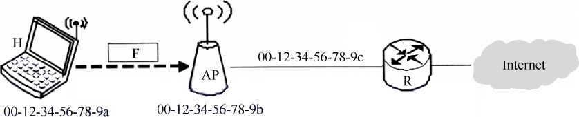

<options :options="['A. 00-12-34-56-78-9a, 00-12-34-56-78-9b, 00-12-34-56-78-9c']" />
<options :options="['B. 00-12-34-56-78-9b, 00-12-34-56-78-9a, 00-12-34-56-78-9c']" />
<options :options="['C. 00-12-34-56-78-9b, 00-12-34-56-78-9c, 00-12-34-56-78-9a']" />
<options :options="['D. 00-12-34-56-78-9a, 00-12-34-56-78-9c, 00-12-34-56-78-9b']" />

36\. 下列IP地址中，只能作为IP分组源IP地址但不能作为目的IP地址的是 (&emsp;)。

<options :options="['A. 0.0.0.0', 'B. 127.0.0.1', 'C. 200.10.10.3', 'D. 255.255.255.255']" />

37\. 直接封装RIP、OSPF、BGP报文的协议分别是 (&emsp;)。

<options :options="['A. TCP、UDP、IP', 'B. TCP、IP、UDP', 'C. UDP、TCP、IP', 'D. UDP、IP、TCP']" width="90%" />

38\. 若将网络21.3.0.0/16划分为128个规模相同的子网，则每个子网可分配的最大IP地址个数是 (&emsp;)。

<options :options="['A. 254', 'B. 256', 'C. 510', 'D. 512']" />

39\. 若甲向乙发起一个TCP连接，最大段长MSS=1KB，RTT=5ms，乙开辟的接收缓存为64KB，则甲从连接建立成功至发送窗口达到32KB，需经过的时间至少为 (&emsp;)。

<options :options="['A. 25ms', 'B. 30ms', 'C. 160ms', 'D. 165ms']" />

40\. 下列关于FTP的叙述中，错误的是 (&emsp;)。

<options :options="['A. 数据连接在每次数据传输完毕后就关闭']" />
<options :options="['B. 控制连接在整个会话期间保持打开状态']" />
<options :options="['C. 服务器与客户端的TCP20端口建立数据连接']" />
<options :options="['D. 客户端与服务器的TCP21端口建立控制连接']" />

二、综合应用题：第41~47题，共70分。{.custom-h3}

41\. (15分) 请设计一个算法，将给定的表达式树（二叉树）转换为等价的中缀表达式（通过括号反映操作符的计算次序）并输出。例如，当下列两棵表达式树作为算法的输入时，输出的等价中缀表达式分别为(a+b)\*(c\*(-d))和(a*b)+(-(c-d))。

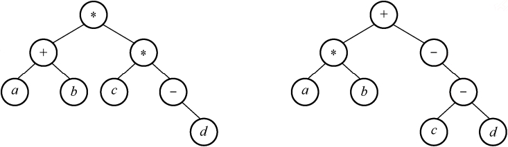

二叉树结点定义如下：
<pre>
typedef struct node {
  char data[10];              // 存储操作数或操作符
  struct node *left, *right;
} BTree;
</pre>

要求：
1) 给出算法的基本设计思想。
2) 根据设计思想，采用C或C++语言描述算法，关键之处给出注释。

42\. (10分) 使用Prim（普里姆）算法求带权连通图的最小（代价）生成树(MST)。请回答下列问题。

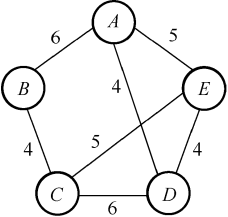

(1) 对下列图G，从顶点A开始求G的MST，依次给出按算法选出的边。
(2) 图G的MST是唯一的吗？
(3) 对任意的带权连通图，满足什么条件时，其MST是唯一的？

43\. (13分) 已知$f(n) = \sum\limits_{i=0}^n 2^i = 2^{n+1} - 1 = \overbrace{11 \cdots 1}^{n+1位}B$，计算f(n)的C语言函数f1如下：

<pre>
int f1(unsigned n){
  int sum=1, power=1;
  for (unsigned i=0; i<=n-1; i++){
    power*=2;
    sum+=power;
  }
  return sum;
}
</pre>

将f1中的int都改为float，可得到计算f(n)的另一个函数f2。假设unsigned和int型数据都占32位，float采用IEEE 754单精度标准。请回答下列问题。
1) 当n=0时，f1会出现死循环，为什么？若将f1中的变量i和n都定义为int型，则f1是否还会出现死循环？
2) f1(23)和f2(23)的返回值是否相等？机器数各是什么？（用十六进制表示）
3) f1(24)和f2(24)的返回值分别为33 554 431和33 554 432.0，为什么不相等？
4) f(31)=232-1，而f1(31)的返回值却为-1，为什么？若使f1(n)的返回值与f(n)相等，则最大的n是多少？
5) f2(127)的机器数为7F80 0000H，对应的值是什么？若使f2(n)的结果不溢出，则最大的n是多少？若使f2(n)的结果精确（无舍入），则最大的n是多少？

44\. (10分) 在按字节编址的计算机M上，题43中f1的部分源程序（阴影部分) 与对应的机器级代码（包括指令的虚拟地址）如下图所示。

<pre>
int f1(unsigned n)
1 00401020 55          push ebp
  ...      ...         ...
        for (unsigned i = 0; i <= n - 1; i++)
  ...      ...         ...
20 0040105E 39 4D F4   cmp dword ptr [ebp-0Ch],ecx
  ...      ...         ...
            power *= 2;
  ...      ...         ...
23 00401066 D1 E2      shl edx, 1
  ...      ...         ...
            return sum;
  ...      ...         ...
35 0040107F C3         ret
</pre>

其中，机器级代码行包括行号、虚拟地址、机器指令和汇编指令。
请回答下列问题。
1) 计算机M是RISC还是CISC？为什么？
2) f1的机器指令代码共占多少字节？要求给出计算过程。
3) 第20条指令cmp通过i减n-1实现对i和n-1的比较。执行f1(0)过程中，当i=0时，cmp指令执行后，进/借位标志CF的内容是什么？要求给出计算过程。
4) 第23条指令shl通过左移操作实现了power\*2运算，在f2中能否也用shl指令实现power\*2？为什么？（将f1中的int都改为float，可得到计算f(n)的另一个函数f2）。

45\. (7分)
假定题44给出的计算机M采用二级分页虚拟存储管理方式，虚拟地址格式如下：

请针对2017年题43的函数f1和题44中的机器指令代码，回答下列问题。
1) 函数f1的机器指令代码占多少页？
2) 取第1条指令(push ebp)时，若在进行地址变换的过程中需要访问内存中的页目录和页表，则会分别访问它们各自的第几个表项？（编号从0开始）
3) M的I/O采用中断控制方式。若进程P在调用f1之前通过scanf()获取n的值，则在执行scanf()的过程中，进程P的状态会如何变化？CPU是否会进入内核态？

46\. (8分) 某进程中有3个并发执行的线程thread1、thread2和thread3，其伪代码如下所示。

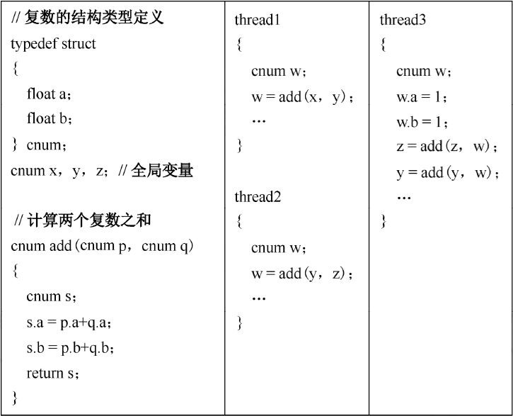

请添加必要的信号量和 P、V（或 wait()、signal()）操作，要求确保线程互斥访问临界资源、并且最大限度地并发执行。

47、(9分) 甲乙双方均采用后退N帧协议(GBN)进行持续的双向数据传输，且双方始终采用捎带确认，帧长均为1000B。Sx,y和Rx,y分别表示甲方和乙方发送的数据帧，其中x是发送序号；y是确认序号（表示希望接收对方的下一帧序号）；数据帧的发送序号和确认序号字段均为3比特。信道传输速率为100Mbps，RTT=0.96ms。下图给出了甲方发送数据帧和接收数据帧的两种场景，其中t0为初始时刻，此时甲方的发送和确认序号均为0，t1时刻甲方有足够多的数据待发送。

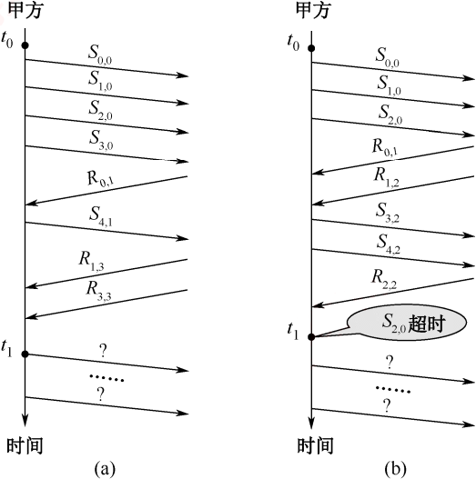

请回答下列问题。
1) 对于图(a)，t0时刻到t1时刻期间，甲方可以断定乙方已正确接收的数据帧数是多少？正确接收的是哪几个帧？（请用Sx,y形式给出）
2) 对于图(a)，从t1时刻起，甲方在不出现超时且未收到乙方新的数据帧之前，最多还可以发送多少个数据帧？其中第一个帧和最后一个帧分别是哪个？（请用Sx,y形式给出）
3) 对于图(b)，从t1时刻起，甲方在不出现新的超时且未收到乙方新的数据帧之前，需要重发多少个数据帧？重发的第一个帧是哪个？（请用Sx,y形式给出）
4) 甲方可以达到的最大信道利用率是多少？

</question>

## 2018年计算机学科专业基础试题 {.custom-h2}

一、单项选择题：第1~40小题，每小题2分，共80分。下列每题给出的四个选项中，只有一个选项最符合试题要求。 {.custom-h3}

<question>

1\. 若栈S1中保存整数，栈S2中保存运算符，函数F()依次执行下述各步操作：
(1) 从S1中依次弹出两个操作数a和b；
(2) 从S2中弹出一个运算符op；
(3) 执行相应的运算b op a；
(4) 将运算结果压入S1中。
假定S1中的操作数依次是5,8,3,2（2在栈顶），S2中的运算符依次是*,-,+（+在栈顶）。调用3次F()后，S1栈顶保存的值是 (&emsp;)。

<options :options="['A. -15', 'B. 15', 'C. -20', 'D. 20']" />

2\. 现有队列Q与栈S，初始时Q中的元素依次是1,2,3,4,5,6（1在队头），S为空。若仅允许下列3种操作：①出队并输出出队元素；②出队并将出队元素入栈；③出栈并输出出栈元素，则不能得到的输出序列是 (&emsp;)。

<options :options="['A. 1,2,5,6,4,3', 'B. 2,3,4,5,6,1', 'C. 3,4,5,6,1,2', 'D. 6,5,4,3,2,1']" />

3\. 设有一个12×12的对称矩阵M，将其上三角部分的元素mi,j（1≤i≤j≤12）按行优先存入C语言的一维数组N中，元素m6,6在N中的下标是 (&emsp;)。

<options :options="['A. 50', 'B. 51', 'C. 55', 'D. 66']" />

4\. 设一棵非空完全二叉树T的所有叶结点均位于同一层，且每个非叶结点都有2个子结点。若T有k个叶结点，则T的结点总数是 (&emsp;)。

<options :options="['A. 2k-1', 'B. 2k', 'C. k2', 'D. 2k-1']" />

5\. 已知字符集{a,b,c,d,e,f}，若各字符出现的次数分别为6,3,8,2,10,4，则对应字符集中各字符的哈夫曼编码可能是 (&emsp;)。

<options :options="['A. 00, 1011, 01, 1010, 11, 100', 'B. 00, 100, 110, 000, 0010, 01']" />
<options :options="['C. 10, 1011, 11, 0011, 00, 010', 'D. 0011, 10, 11, 0010, 01, 000']" />

6\. 已知二叉排序树如下图所示，元素之间应满足的大小关系是 (&emsp;)。

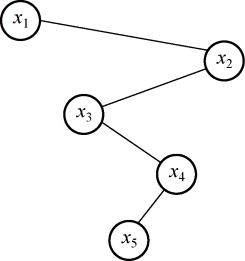

<options :options="['A. x1 < x2 < x5', 'B. x1 < x4 < x5', 'C. x3 < x5 < x4', 'D. x4 < x3 < x5']" />

7\. 下列选项中，不是如下有向图的拓扑序列的是 (&emsp;)。

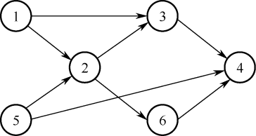

<options :options="['A. 1, 5, 2, 3, 6, 4', 'B. 5, 1, 2, 6, 3, 4', 'C. 5, 1, 2, 3, 6, 4', 'D. 5, 2, 1, 6, 3, 4']" />

8\. 高度为5的3阶B树含有的关键字个数至少是 (&emsp;)。

<options :options="['A. 15', 'B. 31', 'C. 62', 'D. 242']" />

9\. 现有长度为7、初始为空的散列表HT，散列函数H(k)=k%7，用线性探测再散列法解决冲突。将关键字22, 43, 15依次插入HT后，查找成功的平均查找长度是 (&emsp;)。

<options :options="['A. 1.5', 'B. 1.6', 'C. 2', 'D. 3']" />

10\. 对初始数据序列(8,3,9,11,2,1,4,7,5,10,6)进行希尔排序。若第一趟排序结果为(1,3,7,5,2,6,4,9,11,10, 8)，第二趟排序结果为(1,2,6,4,3,7,5,8,11,10,9)，则两趟排序采用的增量（间隔）依次是 (&emsp;)。

<options :options="['A. 3, 1', 'B. 3, 2', 'C. 5, 2', 'D. 5, 3']" />

11\. 在将数据序列(6,1,5,9,8,4,7)建成大根堆时，正确的序列变化过程是 (&emsp;)。

<options :options="['A. {6,1,7,9,8,4,5}→{6,9,7,1,8,4,5}→{9,6,7,1,8,4,5}→{9,8,7,1,6,4,5}']" />
<options :options="['B. {6,9,5,1,8,4,7}→{6,9,7,1,8,4,5}→{9,6,7,1,8,4,5}→{9,8,7,1,6,4,5}']" />
<options :options="['C. {6,9,5,1,8,4,7}→{9,6,5,1,8,4,7}→{9,6,7,1,8,4,5}→{9,8,7,1,6,4,5}']" />
<options :options="['D. {6,1,7,9,8,4,5}→{7,1,6,9,8,4,5}→{7,9,6,1,8,4,5}→{9,7,6,1,8,4,5}→{9,8,6,1,7,4,5}']" />

12\. 冯诺依曼结构计算机中数据采用二进制编码表示，其主要原因是 (&emsp;)。

<options :options="['Ⅰ. 二进制的运算规则简单']" />
<options :options="['Ⅱ. 制造两个稳态的物理器件较容易']" />
<options :options="['Ⅲ. 便于用逻辑门电路实现算术运算']" /> 

<options :options="['A. 仅Ⅰ、Ⅱ', 'B. 仅Ⅰ、Ⅲ', 'C. 仅Ⅱ、Ⅲ', 'D. 仅Ⅰ、Ⅱ、Ⅲ']" />

13\. 假定带符号整数采用补码表示，若int型变量x和y的机器数分别是FFFF FFDFH和0000 0041H，则x、y的值以及x-y的机器数分别是 (&emsp;)。

<options :options="['A. x=-65,y=4l，x-y的机器数溢出']" />
<options :options="['B. X=-33,y=65，X-y的机器数为FFFF FF9DH']" />
<options :options="['C. X=-33,y=65，X-y的机器数为FFFF FF9EH']" />
<options :options="['D. X=-65,y=41，X-y的机器数为FFFF FF96H']" />

14\. IEEE754单精度浮点格式表示的数中，最小的规格化正数是 (&emsp;)。

<options :options="['A. 1.0×2-126', 'B. 1.0×2-127', 'C. 1.0×2-128', 'D. 1.0×2-149']" />

15\. 某32位计算机按字节编址，采用小端(LittleEndian)方式。若语句“int i=0;”对应指令的机器代码为“C745FC00000000”，则语句“int i=-64;”对应指令的机器代码是 (&emsp;)。

<options :options="['A. C7 45 FC C0 FF FF FF', 'B. C7 45 FC 0C FF FF FF']" />
<options :options="['C. C7 45 FC FF FF FF C0', 'D. C7 45 FC FF FF FF 0C']" />

16\. 整数x的机器数为1101 1000，分别对x进行逻辑右移1位和算术右移1位操作，得到的机器数分别是 (&emsp;)。

<options :options="['A. 1110 1100, 1110 1100', 'B. 0110 1100, 1110 1100']" />
<options :options="['C. 1110 1100, 0110 1100', 'D. 0110 1100, 0110 1100']" />

17\. 假定DRAM芯片中存储阵列的行数为r、列数为c，对于一个2K×1位的DRAM芯片，为保证其地址引脚数最少，并尽量减少刷新开销，则r、c的取值分别是 (&emsp;)。

<options :options="['A. 2048, 1', 'B. 64, 32', 'C. 32, 64', 'D. 1, 2048']" />

18\. 按字节编址的计算机中，某double型数组A的首地址为2000H，使用变址寻址和循环结构访问数组A，保存数组下标的变址寄存器的初值为0，每次循环取一个数组元素，其偏移地址为变址值乘以sizeof(double)，取完后变址寄存器的内容自动加1。若某次循环所取元素的地址为2100H，则进入该次循环时变址寄存器的内容是 (&emsp;)。

<options :options="['A. 25', 'B. 32', 'C. 64', 'D. 100']" />

19\. 减法指令“sub Rl,R2,R3”的功能为“(Rl)-(R2)→(R3)”，该指令执行启将生成进位/借位标志CF和溢出标志OF。若(R1)-FFFF FFFFH,(R2)=FFFF FFFOH，则该减法指令执行后，CF与OF分别为 (&emsp;)。

<options :options="['A. CF=0, OF=0', 'B. CF=1, OF=0', 'C. CF=0, OF=1', 'D. CF=1, OF=1']" />

20\. 若某计算机最复杂指令的执行需要完成5个子功能，分别由功能部件A~E实现，各功能部件所需时间分别为80ps、50ps、50ps、70ps和50ps，采用流水线方式执行指令，流水段寄存器延时为20ps，则CPU时钟周期至少为 (&emsp;)。

<options :options="['A. 60ps', 'B. 70ps', 'C. 80ps', 'D. 100ps']" />

21\. 下列选项中，可提高同步总线数据传输率的是 (&emsp;)。

<options :options="['Ⅰ. 增加总线宽度&emsp;Ⅱ. 提高总线工作频率']" />
<options :options="['Ⅲ. 支持突发传输&emsp;Ⅳ. 采用地址/数据线复用']" /> 

<options :options="['A. 仅Ⅰ、Ⅱ', 'B. 仅Ⅰ、Ⅱ、Ⅲ', 'C. 仅Ⅲ、Ⅳ', 'D. Ⅰ、Ⅱ、Ⅲ、Ⅳ']" />

22\. 下列关于外部I/O中断的叙述中，正确的是 (&emsp;)。

<options :options="['A. 中断控制器按所接收中断请求的先后次序进行中断优先级排队']" />
<options :options="['B. CPU响应中断时，通过执行中断隐指令完成通用寄存器的保存']" />
<options :options="['C. CPU只有在处于中断允许状态时，才能响应外部设备的中断请求']" />
<options :options="['D. 有中断请求时，CPU立即暂停当前指令执行，转去执行中断服务程序']" />

23\. 下列关于多任务操作系统的叙述中，正确的是 (&emsp;)。

<options :options="['Ⅰ. 具有并发和并行的特点']" />
<options :options="['Ⅱ. 需要实现对共享资源的保护']" />
<options :options="['Ⅲ. 需要运行在多CPU的硬件平台上']" /> 

<options :options="['A. 仅Ⅰ', 'B. 仅Ⅱ', 'C. 仅Ⅰ、Ⅱ', 'D. Ⅰ、Ⅱ、Ⅲ']" />

24\. 某系统采用基于优先权的非抢占式进程调度策略，完成一次进程调度和进程切换的系统时间开销为1μs。在T时刻就绪队列中有3个进程P1、P2和P3，其在就绪队列中的等待时间、需要的CPU时间和优先权如下表所示。

若优先权值大的进程优先获得CPU，从T时刻起系统开始进程调度，则系统的平均周转时间为 (&emsp;)。

<options :options="['A. 54μs', 'B. 73μs', 'C. 74μs', 'D. 75μs']" />

25\. 属于同一进程的两个线程thread1和thread2并发执行，共享初值为0的全局变量x。thread1和thread2实现对全局变量x加1的机器级代码描述如下：
在所有可能的指令执行序列中，使x的值为2的序列个数是 (&emsp;)。

<options :options="['A. 1', 'B. 2', 'C. 3', 'D. 4']" />

26\. 假设系统中有4个同类资源，进程P1、P2和 P3需要的资源数分别为4,3和1，P1,P2和P3已申请到的资源数分别为2,1和0,则执行安全性检测算法的结果是 (&emsp;)。

<options :options="['A. 不存在安全序列，系统处于不安全状态']" />
<options :options="['B. 存在多个安全序列，系统处于安全状态']" />
<options :options="['C. 存在唯一安全序列P3,P1,P2，系统处于安全状态']" />
<options :options="['D. 存在唯一安全序列P3,P2,P1，系统处于安全状态']" />

27\. 下列选项中，可能导致当前进程P阻塞的事件是 (&emsp;)。

<options :options="['Ⅰ. 进程P申请临界资源']" />
<options :options="['Ⅱ. 进程P从磁盘读数据']" />
<options :options="['Ⅲ. 系统将CPU分配给高优先权的进程']" /> 

<options :options="['A. 仅Ⅰ', 'B. 仅Ⅱ', 'C. 仅Ⅰ、Ⅱ', 'D. Ⅰ、Ⅱ、Ⅲ']" />

28\. 若x是管程内的条件变量，则当进程执行x.wait()时所做的工作是 (&emsp;)。

<options :options="['A. 实现对变量x的互斥访问']" />
<options :options="['B. 唤醒一个在x上阻塞的进程']" />
<options :options="['C. 根据x的值判断该进程是否进入阻塞态']" />
<options :options="['D. 阻塞该进程，并将之插入x的阻塞队列中']" />

29\. 定时器产生时钟中断后，由时钟中断服务程序更新的部分内容是 (&emsp;)。

<options :options="['Ⅰ. 内核中时钟变量的值']" />
<options :options="['Ⅱ. 当前进程占用CPU的时间']" />
<options :options="['Ⅲ. 当前进程在时间片内的剩余执行时间']" /> 

<options :options="['A. 仅Ⅰ、Ⅱ', 'B. 仅Ⅱ、ⅠⅢ', 'C. 仅Ⅰ、Ⅲ', 'D. Ⅰ、Ⅱ、Ⅲ']" />

30\. 系统总是访问磁盘的某个磁道而不响应对其他磁道的访问请求，这种现象称为磁臂黏着。下列磁盘调度算法中，不会导致磁臂黏着的是 (&emsp;)。

<options :options="['A. 先来先服务(FCFS)', 'B. 最短寻道时间优先(SSTF)']" />
<options :options="['C. 扫描算法(SCAN)', 'D. 循环扫描算法(CSCAN)']" width="73%" />

31\. 下列优化方法中，可以提高文件访问速度的是 (&emsp;)。

<options :options="['Ⅰ. 提前读&emsp;Ⅱ. 为文件分配连续的簇&emsp;Ⅲ. 延迟写&emsp;Ⅳ. 采用磁盘高速缓存']" /> 

<options :options="['A. 仅Ⅰ、Ⅱ', 'B. 仅Ⅱ、Ⅲ', 'C. 仅Ⅰ、Ⅲ、Ⅳ', 'D. Ⅰ、Ⅱ、Ⅲ、Ⅳ']" />

32\. 在下列同步机制中，可以实现让权等待的是 (&emsp;)。

<options :options="['A. Peterson方法', 'B. swap指令', 'C. 信号量方法', 'D. TestAndSeT指令']" />

33\. 下列TCP/IP应用层协议中，可以使用传输层无连接服务的是 (&emsp;)。

<options :options="['A. FTP', 'B. DNS', 'C. SMTP', 'D. HTTP']" />

34\. 下列选项中，不属于物理层接口规范定义范畴的是 (&emsp;)。

<options :options="['A. 接口形状', 'B. 引脚功能', 'C. 物理地址', 'D. 信号电平']" />

35\. IEEE802.11无线局域网的MAC协议CSMA/CA进行信道预约的方法是 (&emsp;)。

<options :options="['A. 发送确认帧', 'B. 采用二进制指数退避', 'C. 使用多个MAC地址', 'D. 交换RTS与CTS帧']" width="95%" />

36\. 主机甲采用停止-等待协议向主机乙发送数据，数据传输速率是3kb/s：单向传播时延是200ms，忽略确认帧的传输时延。当信道利用率等于40%时，数据帧的长度为 (&emsp;)。

<options :options="['A. 240 比特', 'B. 400 比特', 'C. 480 比特', 'D. 800 比特']" />

37\. 路由器R通过以太网交换机S1和S2连接两个网络，R的接口、主机H1和H2的IP地址与MAC地址如下图所示。若H1向H2发送一个IP分组P，则H1发出的封装P的以太网帧的目的MAC地址、H2收到的封装P的以太网帧的源MAC地址分别是 (&emsp;)。

<options :options="['A. 00-a1-b2-c3-d4-62, 00-1a-2b-3c-4d-52', 'B. 00-a1-b2-c3-d4-62, 00-a1-b2-c3-d4-61']" width="85%" />
<options :options="['C. 00-1a-2b-3c-4d-51, 00-1a-2b-3c-4d-52', 'D. 00-1a-2b-3c-4d-51, 00-a1-b2-c3-d4-61']" width="85%" />

38\. 某路由表中有转发接口相同的4条路由表项，其目的网络地址分别为35.230.32.0/21、35.230.40.0/21、35.230.48.0/21和35.230.56.0/21，将该4条路由聚合后的目的网络地址为 (&emsp;)。

<options :options="['A. 35.230.0.0/19', 'B. 35.230.0.0/20', 'C. 35.230.32.0/19', 'D. 35.230.32.0/20']" />

39\. UDP协议实现分用(demultiplexing)时所依据的头部字段是 (&emsp;)。

<options :options="['A. 源端口号', 'B. 目的端口号', 'C. 长度', 'D. 检验和']" />

40\. 无须转换即可由SMTP直接传输的内容是 (&emsp;)。

<options :options="['A. JPEG图像', 'B. MPEG视频', 'C. EXE文件', 'D. ASCII文本']" />

二、综合应用题：第41~47题，共70分。{.custom-h3}

41\. (13分) 给定一个含n(n≥1)个整数的数组，请设计一个在时间上尽可能高效的算法，找出数组中未出现的最小正整数。例如，数组{-5,3,2,3}中未出现的最小正整数是1；数组{1,2,3}中未出现的最小正整数是4。要求：
1) 给出算法的基本设计思想。
2) 根据设计思想，采用C或C++语言描述算法，关键之处给出注释。
3) 说明你所设计算法的时间复杂度和空间复杂度。

42\. (12分) 拟建设一个光通信骨干网络连通BJ，CS，XA，QD，JN，NJ，TL和WH等8个城市，下图中无向边上的权值表示两个城市之间备选光缆的铺设费用。

请回答下列问题：
1) 仅从铺设费用角度出发，给出所有可能的最经济的光缆铺设方案（用带权图表示），并计算相应方案的总费用。
2) 该图可采用图的哪种存储结构？给出求解问题(1)所用的算法名称。
3) 假设每个城市采用一个路由器按(1)中得到的最经济方案组网，主机H1直接连接在TL的路由器上，主机H2直接连接在BJ的路由器上。若H1向H2发送一个TTL=5的IP分组，则H2是否可以收到该IP分组？

43\. (8分) 假定计算机的主频为500MHz，CPI为4。现有设备A和B，其数据传输率分别为2MBps和40MBps，对应IO接口中各有一个32位数据缓冲寄存器。请回答下列问题，要求给出计算过程。
1) 若设备A采用定时查询I/0方式，每次输人/输出都至少执行10条指令。设备A最多间隔多长时间查询一次才能不丢失数据？CPU用于设备A输入/输出的时间占CPU总时间的百分比至少是多少？
2) 在中断IO方式下，若每次中断响应和中断处理的总时钟周期数至少为400，则设备B能否采用中断IO方式？为什么？
3) 若设备B采用DMA方式，每次DMA传送的数据块大小为1000B，CPU用于DMA预处理和后处理的总时钟周期数为500，则CPU用于设备B输人/输出的时间占CPU总时间的百分比最大是多少？

44\. (15分) 某计算机采用页式虚拟存储管理方式，按字节编址。CPU进行存储访问的过程如题44图所示。根据题44图回答下列问题。

1) 主存物理地址占多少位？
2) TLB采用什么映射方式？TLB用SRAM还是DRAM实现？
3) Cache采用什么映射方式？若Cache采用LRU替换算法和回写(Write Back)策略，则Cache每行中除数据(Data)、Tag和有效位外，还应有哪些附加位？Cache总容量是多少？Cache中有效位的作用是什么？
4) 若CPU给出的虚拟地址为0008C040H，则对应的物理地址是多少？是否在Cache中命中？说明理由。若CPU给出的虚拟地址为0007C260H，则该地址所在主存块映射到的Cache组号是多少？

45\. (8分) 请根据题44图给出的虚拟存储管理方式，回答下列问题。

1) 某虚拟地址对应的页目录号为6，在相应的页表中对应的页号为6，页内偏移量为8，该虚拟地址的十六进制表示是什么？
2) 寄存器PDBR用于保存当前进程的页目录起始地址，该地址是物理地址还是虚拟地址？进程切换时，PDBR的内容是否会变化？说明理由。同一进程的线程切换时，PDBR的内容是否会变化？说明理由。
3) 为了支持改进型CLOCK置换算法，需要在页表项中设置哪些字段？

46\. (7分) 某文件系统采用索引节点存放文件的属性和地址信息，簇大小为4KB。每个文件索引节点占64B，有11个地址项，其中直接地址项8个，一级、二级和三级间接地址项各1个，每个地址项长度为4B。请回答下列问题：
1) 该文件系统能支持的最大文件长度是多少？（给出计算表达式即可）
2) 文件系统用1M（1M=220）个簇存放文件索引节点，用512M个簇存放文件数据。若一个图像文件的大小为5600B，则该文件系统最多能存放多少个图像文件？
3) 若文件F1的大小为6KB，文件F2的大小为40KB，则该文件系统获取F1和F2最后一个簇的簇号需要的时间是否相同？为什么？

47\. (7分) 某公司的网络如下图所示。IP地址空间192.168.1.0/24被均分给销售部和技术部两个子网，并已分别为部分主机和路由器接口分配了IP地址，销售部子网的MTU=1500B，技术部子网的MTU=800B。
【图】
请回答下列问题：
1) 销售部子网的广播地址是什么？技术部子网的子网地址是什么？若每个主机仅分配一个IP地址，则技术部子网还可以连接多少台主机？
2) 假设主机192.168.1.1向主机192.168.1.208发送一个总长度为1500B的IP分组，IP分组的头部长度为20B，路由器在通过接口F1转发该IP分组时进行了分片。若分片时尽可能分为最大片，则一个最大IP分片封装数据的字节数是多少？至少需要分为几个分片？每个分片的片偏移量是多少？

</question>

## 2019年计算机学科专业基础试题 {.custom-h2}

一、单项选择题：第1~40小题，每小题2分，共80分。下列每题给出的四个选项中，只有一个选项最符合试题要求。 {.custom-h3}

<question>

1\. 设n是描述问题规模的非负整数，下列程序段的时间复杂度是 (&emsp;)。
<pre>
x=0;
while(n>=(x+1)*(x+1))
  x=x+1;
</pre>
<options :options="['A. O(log2n)', 'B. O(n1/2)', 'C. O(n)', 'D. O(n2)']" />

2\. 若将一棵树T转化为对应的二叉树BT，则下列对BT的遍历中，其遍历序列与T的后根遍历序列相同的是 (&emsp;)。

<options :options="['A. 先序遍历', 'B. 中序遍历', 'C. 后序遍历', 'D. 按层遍历']" />

3\. 对n个互不相同的符号进行哈夫曼编码。若生成的哈夫曼树共有115个结点，则n的值是 (&emsp;)。

<options :options="['A. 56', 'B. 57', 'C. 58', 'D. 60']" />

4\. 在任意一棵非空平衡二叉树（AVL树）T1中，删除某结点v之后形成平衡二叉树T2，再将v插入T2形成平衡二叉树T3。下列关于T1与T3的叙述中，正确的是 (&emsp;)。

<options :options="['Ⅰ. 若v是T1的叶结点，则T1与T3可能不相同']" />
<options :options="['Ⅱ. 若v不是T1的叶结点，则T1与T3一定不相同']" />
<options :options="['Ⅲ. 若v不是T1的叶结点，则T1与T3一定相同']" /> 

<options :options="['A. 仅Ⅰ', 'B. 仅Ⅱ', 'C. 仅Ⅰ、Ⅱ', 'D. 仅Ⅰ、Ⅲ']" />

5\. 下图所示的AOE网表示一项包含8个活动的工程。活动d的最早开始时间和最迟开始时间分别是 (&emsp;)。

<options :options="['A. 3 和7', 'B. 12 和12', 'C. 12 和14', 'D. 15 和15']" />

6\. 用有向无环图描述表达式(x+y)((x+y)/x)，需要的顶点个数至少是 (&emsp;)。

<options :options="['A. 5', 'B. 6', 'C. 8', 'D. 9']" />

7\. 选择一个排序算法时，除算法的时空效率外，下列因素中，还需要考虑的是 (&emsp;)。

<options :options="['Ⅰ. 数据的规模&emsp;Ⅱ. 数据的存储方式&emsp;Ⅲ. 算法的稳定性&emsp;Ⅳ. 数据的初始状态']" /> 

<options :options="['A. 仅Ⅲ', 'B. 仅Ⅰ、Ⅱ', 'C. 仅ⅠⅠ、Ⅲ、Ⅳ', 'D. Ⅰ、Ⅱ、Ⅲ、IⅣ']" />

8\. 现有长度为11且初始为空的散列表HT，散列函数是H(key)=key%7，采用线性探查(线性探测再散列)法解决冲突。将关键字序列87, 40, 30, 6, 11, 22, 98, 20依次插入HT后，HT查找失败的平均查找长度是 (&emsp;)。

<options :options="['A. 4', 'B. 5.25', 'C. 6', 'D. 6.29']" />

9\. 设主串T='abaabaabcabaabc'，模式串S='abaabc'，采用KMP算法进行模式匹配，到匹配成功时为止，在匹配过程中进行的单个字符间的比较次数是 (&emsp;)。

<options :options="['A. 9', 'B. 10', 'C. 12', 'D. 15']" />

10\. 排序过程中，对尚未确定最终位置的所有元素进行一遍处理称为一“趟”。下列序列中，不可能是快速排序第二趟结果的是 (&emsp;)。

<options :options="['A.5,2,16,12,28,60,32,72','B.2,16,5,28,12,60,32,72']"/>
<options :options="['C.2,12,16,5,28,32,72,60','D.5,2,12,28,16,32,72,60']"/>

11\. 设外存上有120个初始归并段，进行12路归并时，为实现最佳归并，需要补充的虚段个数是 (&emsp;)。

<options :options="['A. 1', 'B. 2', 'C. 3', 'D. 4']" />

12\. 下列关于冯诺依曼结构计算机基本思想的叙述中，错误的是 (&emsp;)。

<options :options="['A. 程序的功能都通过中央处理器执行指令实现']" />
<options :options="['B. 指令和数据都用二进制数表示，形式上无差别']" />
<options :options="['C. 指令按地址访问，数据都在指令中直接给出']" />
<options :options="['D. 程序执行前，指令和数据需预先存放在存储器中']" />

13\. 考虑以下C语言代码：
<pre>
unsigned short usi=65535;
short si=usi;
</pre>
执行上述程序段后，si的值是 (&emsp;)。

<options :options="['A. -1', 'B. -32767', 'C. -32768', 'D. -65535']" />

14\. 下列关于缺页处理的叙述中，错误的是 (&emsp;)。

<options :options="['A. 缺页是在地址转换时CPU检测到的一种异常']" />
<options :options="['B. 缺页处理由操作系统提供的缺页处理程序来完成']" />
<options :options="['C. 缺页处理程序根据页故障地址从外存读入所缺失的页']" />
<options :options="['D. 缺页处理完成后回到发生缺页的指令的下一条指令执行']" />

15\. 某计算机采用大端方式，按字节编址。某指令中操作数的机器数为1234 FF00H，该操作数采用基址寻址方式，形式地址（用补码表示）为FF12H，基址寄存器的内容为F000 0000H，则该操作数的LSB（最低有效字节）所在的地址是 (&emsp;)。

<options :options="['A. F000 FF12H', 'B. F000 FF15H', 'C. EFFF FF12H', 'D. EFFF FF15H']" />

16\. 下列有关处理器时钟脉冲信号的叙述中，错误的是 (&emsp;)。

<options :options="['A. 时钟脉冲信号由机器脉冲源发出的脉冲信号经整形和分频后形成']" />
<options :options="['B. 时钟脉冲信号的宽度称为时钟周期，时钟周期的倒数为机器主频']" />
<options :options="['C. 时钟周期以相邻状态单元间组合逻辑电路的最大延迟为基准确定']" />
<options :options="['D. 处理器总是在每来一个时钟脉冲信号时就开始执行一条新的指令']" />

17\. 某指令功能为R[r2]←R[r1]+M[R[r01]]，其两个源操作数分别采用寄存器、寄存器间接寻址方式。对于下列给定部件，该指令在取数及执行过程中需要用到的是 (&emsp;)。

<options :options="['Ⅰ. 通用寄存器组(GPRs)&emsp;Ⅱ. 算术逻辑单元(ALU)&emsp;Ⅲ. 存储器(Memory)&emsp;Ⅳ. 指令译码器(ID)']" /> 

<options :options="['A. 仅Ⅰ、Ⅱ', 'B. 仅Ⅰ、Ⅱ、Ⅲ', 'C. 仅Ⅱ、Ⅲ、Ⅳ', 'D. 仅Ⅰ、Ⅲ、Ⅳ']" />

18\. 在采用“取指、译码/取数、执行、访存、写回”5段流水线的处理器中，执行如下指令序列，其中s0、s1、s2、s3和t2表示寄存器编号。

<pre>
I1:        add   s2, s1, s0        // R[s2]←R[s1]+R[s0]
I2:        load  s3, 0(t2)         // R[s3]←M[R[t2]+0]
I3:        add   s2, s2, s3        // R[s2]←R[s2]+R[s3]
I4:        store s2, 0(t2)         // M[R[t2]+0]←R[s2]
</pre>

下列指令对中，不存在数据冒险的是 (&emsp;)。

<options :options="['A. I1和I3', 'B. I2和I3', 'C. I2和I4', 'D. I3和I4']" />

19\. 假定一台计算机采用3通道存储器总线，配套的内存条型号为DDR3-1333，即内存条所接插的存储器总线的工作频率为1333MHz，总线宽度为64位，则存储器总线的总带宽大约是 (&emsp;)。

<options :options="['A. 10.66GBps', 'B. 32GBps', 'C. 64GBps', 'D. 96GBps']" />

20\. 下列关于磁盘存储器的叙述中，错误的是 (&emsp;)。

<options :options="['A. 磁盘的格式化容量比非格式化容量小']" />
<options :options="['B. 扇区中包含数据、地址和校验等信息']" />
<options :options="['C. 磁盘存储器的最小读写单位为一字节']" />
<options :options="['D. 磁盘存储器由磁盘控制器、磁盘驱动器和盘片组成']" />

21\. 某设备以中断方式与CPU进行数据交换，CPU主频为1GHz，设备接口中的数据缓冲寄存器为32位，设备的数据传输速率为50kB/s。若每次中断开销（包括中断响应和中断处理）为1000个时钟周期，则CPU用于该设备输入/输出的时间占整个CPU时间的百分比最多是 (&emsp;)。

<options :options="['A. 1.25%', 'B. 2.5%', 'C. 5%', 'D. 12.5%']" />

22\. 下列关于DMA方式的叙述中，正确的是 (&emsp;)。

<options :options="['Ⅰ. DMA传送前由设备驱动程序设置传送参数']" />
<options :options="['Ⅱ. 数据传送前由DMA控制器请求总线使用权']" />
<options :options="['Ⅲ. 数据传送由DMA控制器直接控制总线完成']" />
<options :options="['Ⅳ. DMA传送结束后的处理由中断服务程序完成']" /> 

<options :options="['A. 仅Ⅰ、Ⅱ', 'B. 仅Ⅰ、Ⅱ、Ⅳ', 'C. 仅Ⅱ、Ⅲ、Ⅳ', 'D. Ⅰ、Ⅱ、Ⅲ、Ⅳ']" />

23\. 下列关于线程的描述中，错误的是 (&emsp;)。

<options :options="['A. 内核级线程的调度由操作系统完成']" />
<options :options="['B. 操作系统为每个用户级线程建立一个线程控制块']" />
<options :options="['C. 用户级线程间的切换比内核级线程间的切换效率高']" />
<options :options="['D. 用户级线程可以在不支持内核级线程的操作系统上实现']" />

24\. 下列选项中，可能将进程唤醒的事件是 (&emsp;)。

<options :options="['Ⅰ. I/O结束&emsp;Ⅱ. 某进程退出临界区&emsp;Ⅲ. 当前进程的时间片用完']" /> 

<options :options="['A. 仅Ⅰ', 'B. 仅Ⅲ', 'C. 仅Ⅰ、Ⅱ', 'D. I、Ⅱ、Ⅲ']" />

25\. 下列关于系统调用的叙述中，正确的是 (&emsp;)。

<options :options="['Ⅰ. 在执行系统调用服务程序的过程中，CPU处于内核态']" />
<options :options="['Ⅱ. 操作系统通过提供系统调用避免用户程序直接访问外设']" />
<options :options="['Ⅲ. 不同的操作系统为应用程序提供了统一的系统调用接口']" />
<options :options="['Ⅳ. 系统调用是操作系统内核为应用程序提供服务的接口']" /> 

<options :options="['A. 仅Ⅰ、Ⅳ', 'B. 仅Ⅱ、Ⅲ', 'C. 仅Ⅰ、Ⅱ、Ⅳ', 'D. 仅Ⅰ、Ⅰ、Ⅳ']" />

26\. 下列选项中，可用于文件系统管理空闲磁盘块的数据结构是 (&emsp;)。

<options :options="['Ⅰ. 位图&emsp;Ⅱ. 索引节点&emsp;Ⅲ. 空闲磁盘块链&emsp;Ⅳ. 文件分配表(FAT)']" /> 

<options :options="['A. 仅Ⅰ、Ⅱ', 'B. 仅Ⅰ、Ⅰ、Ⅳ', 'C. 仅Ⅰ、Ⅲ', 'D. 仅Ⅱ、Ⅲ、Ⅳ']" />

27\. 系统采用二级反馈队列调度算法进行进程调度。就绪队列Q1采用时间片轮转调度算法，时间片为10ms；就绪队列Q2采用短进程优先调度算法；系统优先调度Q1队列中的进程，当Q1为空时系统才会调度Q2中的进程；新创建的进程首先进入Q1；Q1中的进程执行一个时间片后，若未结束，则转入Q2。若当前Q1、Q2为空，系统依次创建进程P1、P2后即开始进程调度，P1、P2需要的CPU时间分别为30ms和20ms，则进程P1、P2在系统中的平均等待时间为 (&emsp;)。

<options :options="['A. 25ms', 'B. 20ms', 'C. 15ms', 'D. 10ms']" />

28\. 在分段存储管理系统中，用共享段表描述所有被共享的段。若进程P1和P2共享段S，下列叙述中，错误的是 (&emsp;)。

<options :options="['A. 在物理内存中仅保存一份段S的内容']" />
<options :options="['B. 段S在P1和P2中应该具有相同的段号']" />
<options :options="['C. P1和P2共享段S在共享段表中的段表项']" />
<options :options="['D. P1和P2都不再使用段S时才回收段S所占的内存空间']" />

29\. 某系统采用LRU页置换算法和局部置换策略，若系统为进程P预分配了4个页框，进程P访问页号的序列为0,1,2,7,0,5,3,5,0,2,7,6,则进程访问上述页的过程中，产生页置换的总次数是 (&emsp;)。

<options :options="['A. 3', 'B. 4', 'C. 5', 'D. 6']" />

30\. 下列关于死锁的叙述中，正确的是 (&emsp;)。

<options :options="['Ⅰ. 可以通过剥夺进程资源解除死锁']" />
<options :options="['Ⅱ. 死锁的预防方法能确保系统不发生死锁']" />
<options :options="['Ⅲ. 银行家算法可以判断系统是否处于死锁状态']" />
<options :options="['Ⅳ. 当系统出现死锁时，必然有两个或两个以上的进程处于阻塞态']" /> 

<options :options="['A. 仅Ⅱ、Ⅲ', 'B. 仅Ⅰ、Ⅱ、Ⅳ', 'C. 仅Ⅰ、Ⅱ、Ⅱ', 'D. 仅Ⅰ、Ⅲ、Ⅳ']" />

31\. 某计算机主存按字节编址，采用二级分页存储管理，地址结构如下所示：

虚拟地址2050 1225H对应的页目录号、页号分别是 (&emsp;)。

<options :options="['A. 081H、101H', 'B. 081H、401H', 'C. 201H、101H', 'D. 201H、401H']" />

32\. 在下列动态分区分配算法中，最容易产生内存碎片的是 (&emsp;)。

<options :options="['A. 首次适应算法', 'B. 最坏适应算法']" />
<options :options="['C. 最佳适应算法', 'D. 循环首次适应算法']" />

33\. OSI参考模型的第5层（自下而上）完成的主要功能是 (&emsp;)。

<options :options="['A. 差错控制', 'B. 路由选择', 'C. 会话管理', 'D. 数据表示转换']" />

34\. 100Base-T快速以太网使用的导向传输介质是 (&emsp;)。

<options :options="['A. 双绞线', 'B. 单模光纤', 'C. 多模光纤', 'D. 同轴电缆']" />

35\. 对于滑动窗口协议，若分组序号采用3比特编号，发送窗口大小为5，则接收窗口最大是 (&emsp;)。

<options :options="['A. 2', 'B. 3', 'C. 4', 'D. 5']" />

36\. 假设一个采用CSMA/CD协议的100Mbps局域网，最小帧长是128B，则在一个冲突域内两个站点之间的单向传播时延最多是 (&emsp;)。

<options :options="['A. 2.56μs', 'B. 5.12μs', 'C. 10.24μs', 'D. 20.48μs']" />

37\. 若将101.200.16.0/20划分为5个子网，则可能的最小子网的可分配IP地址数是 (&emsp;)。

<options :options="['A. 126', 'B. 254', 'C. 510', 'D. 1022']" />

38\. 某客户通过一个TCP连接向服务器发送数据的部分过程如图所示。客户在t0时刻第一次收到确认序列号ack_seq=100的段，并发送序列号seq=100的段，但发生丢失。若TCP支持快速重传，则客户重新发送seq=100段的时刻是 (&emsp;)。

<options :options="['A. t1', 'B. t2', 'C. t3', 'D. t4']" />

39\. 若主机甲主动发起一个与主机乙的TCP连接，甲、乙选择的初始序列号分别为2018和2046，则第三次握手TCP段的确认序列号是 (&emsp;)。

<options :options="['A. 2018', 'B. 2019', 'C. 2046', 'D. 2047']" />

40\. 下列关于网络应用模型的叙述中，错误的是 (&emsp;)。

<options :options="['A. 在P2P模型中，节点之间具有对等关系']" />
<options :options="['B. 在客户/服务器(C/S)模型中，客户与客户之间可以直接通信']" />
<options :options="['C. 在C/S模型中，主动发起通信的是客户，被动通信的是服务器']" />
<options :options="['D. 在向多用户分发一个文件时，P2P模型通常比C/S模型所需的时间短']" />

二、综合应用题：第41~47题，共70分。{.custom-h3}

41\. (13分) 设线性表L=(a1,a2,a3,···,an-2,an-1,an)采用带头结点的单链表保存，链表中的结点定义如下：
<pre>
typedef struct node {
  int data;
  struct node *next;
}NODE;
</pre>
请设计一个空间复杂度为O(1)且时间上尽可能高效的算法，重新排列L中的各结点，得到线性表L'=(a1,an,a2,an-1,,a3,n-2,···)。要求：
1) 给出算法的基本设计思想。
2) 根据设计思想，采用C或C++语言描述算法，关键之处给出注释。
3) 说明你所设计算法的时间复杂度。

42\. (10分) 请设计一个队列，要求满足：①初始时队列为空；②入队时，充许增加队列占用空间；③出队后，出队元素所占用的空间可重复使用，即整个队列所占用的空间只增不减；④人队操作和出队操作的时间复杂度始终保持为O(1)。请回答下列问题：
1) 该队列应选择链式存储结构，还是应选择顺序存储结构？
2) 画出队列的初始状态，并给出判断队空和队满的条件。
3) 画出第一个元素人队后的队列状态。
4) 给出人队操作和出队操作的基本过程。

43\. (8分) 有n（n≥3）位哲学家围坐在一张圆桌边，每位哲学家交替地就餐和思考。在圆桌中心有m(m≥1)个碗，每两位哲学家之间有一根筷子。每位哲学家必须取到一个碗和两侧的筷子后，才能就餐，进餐完毕，将碗和筷子放回原位，并继续思考。为使尽可能多的哲学家同时就餐，且防止出现死锁现象，请使用信号量的P、V操作（waitO、signalO操作）描述上述过程中的互斥与同步，并说明所用信号量及初值的含义。

44\. (7分) 某计算机系统中的磁盘有300个柱面，每个柱面有10个磁道，每个磁道有200个扇区，扇区大小为512B。文件系统的每个簇包含2个扇区。请回答下列问题：
1) 磁盘的容量是多少？
2) 假设磁头在85号柱面上，此时有4个磁盘访问请求，簇号分别为100260、60005、101660和110560。若采用最短寻道时间优先(SSTF)调度算法，则系统访问簇的先后次序是什么？
3) 第100530簇在磁盘上的物理地址是什么？将簇号转换成磁盘物理地址的过程是由I/O系统的什么程序完成的？

45\. (16分) 已知$f(n)=n!=n×(n-1)×(n-2)×…×2×1$，计算f(n)的C语言函数f1的源程序（阴影部分）及其在32位计算机M上的部分机器级代码如下：

其中，机器级代码行包括行号、虚拟地址、机器指令和汇编指令，计算机M按字节编址，int型数据占32位。请回答下列问题：
1) 计算f(10)需要调用函数f1多少次？执行哪条指令会递归调用f1？
2) 上述代码中，哪条指令是条件转移指令？哪几条指令一定会使程序跳转执行？
3) 根据第16行的call指令，第17行指令的虚拟地址应是多少？已知第16行的call指令采用相对寻址方式，该指令中的偏移量应是多少（给出计算过程）？已知第16行的call指令的后4字节为偏移量，M是采用大端方式还是采用小端方式？
4) f(13)=6227020800，但f1(13)的返回值为1932053504，为什么两者不相等？要使f1(13)能返回正确的结果，应如何修改f1的源程序？
5) 第19行的imul指令（带符号整数乘）的功能是R[eax]←R[eax]×R[ecx]，当乘法器输出的高、低32位乘积之间满足什么条件时，溢出标志OF=1？要使CPU在发生溢出时转异常处理，编译器应在imul指令后应加一条什么指令？

46\. (8分) 对于题45，若计算机M的主存地址为32位，釆用分页存储管理方式，页大小为4KB，则第1行的push指令和第30行的ret指令是否在同一页中（说明理由）？若指令Cache有64 行，采用4路组相联映射方式，主存块大小为64B，则32位主存地址中，哪几位表示块内地址？哪几位表示Cache组号？哪几位表示标记(tag)信息？读取第16行的call指令时，只可能在指令Cache的哪一组中命中？（说明理由）

47\. (9分) 某网络拓扑如下图所示，其中R为路由器，主机H1~H4的IP地址配置以及R的各接口IP地址配置如图中所示。现有若干以太网交换机（无VLAN功能）和路由器两类网络互连设备可供选择。

【图】

请回答下列问题：
1) 设备1、设备2和设备3分别应选择什么类型的网络设备？
2) 设备1、设备2和设备3中，哪几个设备的接口需要配置IP地址？为对应的接口配置正确的IP地址。
3) 为确保主机H1~H4能够访问Intermet，R需要提供什么服务？
4) 若主机H3发送一个目的地址为192.168.1.127的IP数据报，网络中哪几个主机会接收该数据报？

</question>

## 2020年计算机学科专业基础试题 {.custom-h2}

一、单项选择题：第1~40小题，每小题2分，共80分。下列每题给出的四个选项中，只有一个选项最符合试题要求。 {.custom-h3}

<question>

1\. 将一个10×10对称矩阵M的上三角部分的元素mi,j（1≤i≤j≤10）按列优先存入C语言的一维数组N中，元素m7,2在N中的下标是 (&emsp;)。

<options :options="['A. 15', 'B. 16', 'C. 22', 'D. 23']" />

2\. 对空栈S进行Push和Pop操作，入栈序列为a,b,c,d,e，经过Push、Push、Pop、Push、Pop、Push、Push、Pop操作后得到的出栈序列是 (&emsp;)。

<options :options="['A. b,a,c', 'B. b,a,e', 'C. b,c,a', 'D. b,c,e']" />

3\. 对于任意一棵高度为5且有10个结点的二叉树，若采用顺序存储结构保存，每个结点占1个存储单元（仅存放结点的数据信息），则存放该二叉树需要的存储单元数量至少是 (&emsp;)。

<options :options="['A. 31', 'B. 16', 'C. 15', 'D. 10']" />

4\. 已知森林F及与之对应的二叉树T，若F的先根遍历序列是a,b,c,d,e,f，中根遍历序列是b,a,d,f,e,c，则T的后根遍历序列是 (&emsp;)。

<options :options="['A. b,a,d,f,e,c', 'B. b,d,f,e,c,a', 'C. b,f,e,d,c,a', 'D. f,e,d,c,b,a']" />

5\. 下列给定的关键字输入序列中，不能生成如下二叉排序树的是 (&emsp;)。

<options :options="['A. 4, 5, 2, 1, 3', 'B. 4, 5, 1, 2, 3', 'C. 4, 2, 5, 3, 1', 'D. 4, 2, 1, 3, 5']" />

6\. 修改递归方式实现的图的深度优先搜索（DFS）算法，将输出（访问）顶点信息的语句移到退出递归前（即执行输出语句后立刻退出递归）。采用修改后的算法遍历有向无环图G，若输出结果中包含G中的全部顶点，则输出的顶点序列是G的 (&emsp;)。

<options :options="['A. 拓扑有序序列', 'B. 逆拓扑有序序列', 'C. 广度优先搜索序列', 'D. 深度优先搜索序列']" />

7\. 已知无向图G如下所示，使用Kruskal算法求图G的最小生成树，加到最小生成树中的边依次是 (&emsp;)。

<options :options="['A. (b,f),(b,d),(a,e),(c,e),(b,e)','B. (b,f),(b,d),(b,e),(a,e),(c,e)']" />
<options :options="['C. (a,e),(b,e),(c,e),(b,d),(b,f)','D. (a,e),(c,e),(b,e),(b,f),(b,d)']" />

8\. 若使用AOE网估算工程进度，则下列叙述中正确的是 (&emsp;)。

<options :options="['A. 关键路径是从源点到汇点边数最多的一条路径']" />
<options :options="['B. 关键路径是从源点到汇点路径长度最长的路径']" />
<options :options="['C. 增加任意一个关键活动的时间不会延长工程的工期']" />
<options :options="['D. 缩短任意一个关键活动的时间将会缩短工程的工期']" />

9\. 下列关于大根堆（至少含2个元素）的叙述中，正确的是 (&emsp;)。

<options :options="['Ⅰ. 可以将堆视为一棵完全二叉树']" />
<options :options="['Ⅱ. 可以采用顺序存储方式保存堆']" />
<options :options="['Ⅲ. 可以将堆看成一棵二又排序树']" />
<options :options="['Ⅳ. 堆中的次大值一定在根的下一层']" /> 

<options :options="['A. 仅Ⅰ、Ⅱ', 'B. 仅Ⅱ、Ⅲ', 'C. 仅Ⅰ、Ⅱ、Ⅳ', 'D. 仅Ⅰ、Ⅲ、Ⅳ']" />

10\. 依次将关键字5,6,9,13,8,2,12,15插入初始为空的4阶B树后，根结点中包含的关键字是 (&emsp;)。

<options :options="['A. 8', 'B. 6, 9', 'C. 8, 13', 'D. 9, 12']" />

11\. 对大部分元素已有序的数组排序时，直接插入排序比简单选择排序效率更高，其原因是 (&emsp;)。

<options :options="['Ⅰ. 直接插入排序过程中元素之间的比较次数更少']" />
<options :options="['Ⅱ. 直接插入排序过程中所需的辅助空间更少']" />
<options :options="['Ⅲ. 直接插入排序过程中元素的移动次数更少']" /> 

<options :options="['A. 仅Ⅰ', 'B. 仅Ⅲ', 'C. 仅Ⅰ、Ⅱ', 'D. Ⅰ、Ⅱ和Ⅲ']" />

12\. 下列给出的部件中，其位数（宽度）一定与机器字长相同的是 (&emsp;)。

<options :options="['Ⅰ. ALU&emsp;Ⅱ. 指令寄存器&emsp;Ⅲ. 通用寄存器&emsp;Ⅳ. 浮点寄存器']" /> 

<options :options="['A. 仅Ⅰ、Ⅱ', 'B. 仅Ⅰ、Ⅲ', 'C. 仅Ⅲ', 'D. 仅Ⅱ、Ⅲ、Ⅳ']" />

13\. 已知带符号整数用补码表示，float型数据用IEEE754标准表示，假定变量x的类型只可能是int或float，当x的机器数为C8000000H时，x的值可能是 (&emsp;)。

<options :options="['A. -7×227', 'B. -216', 'C. 217', 'D. 25×227']" />

14\. 在按字节编址，采用小端方式的32位计算机中，按边界对齐方式为以下C语言结构型变量a分配存储空间：
<pre>
struct record{
  short x1;
  int x2;
}a;
</pre>
若a的首地址为2020 FE00H，a的成员变量X2的机器数为1234 0000H，则其中34H所在存储单元的地址是 (&emsp;)。

<options :options="['A. 2020 FE03H', 'B. 2020 FE04H', 'C. 2020 FE05H', 'D. 2020 FE05H']" />

15\. 下列关于TLB和Cache的叙述中，错误的是 (&emsp;)。

<options :options="['A. 命中率都与程序局部性有关']" />
<options :options="['B. 缺失后都需要去访问主存']" />
<options :options="['C. 缺失处理都可以由硬件实现']" />
<options :options="['D. 都由DRAM存储器组成']" />

16\. 某计算16位定长指令字格式，操作码位数和寻址方式位数固定，指令系统有48条指令，支持直接、间接、立即、相对4种寻址方式。在单地址指令中，直接寻址方式的可寻址范围是 (&emsp;)。

<options :options="['A. 0~255', 'B. 0~1023', 'C. -128~127', 'D. -512~511']" />

17\. 下列给出的处理器类型中，理想情况下，CPI为1的是 (&emsp;)。

<options :options="['Ⅰ. 单周期CPU&emsp;Ⅱ. 多周期CPU&emsp;Ⅲ. 基本流水线CPU&emsp;Ⅳ. 超标量流水线CPU']" /> 

<options :options="['A. 仅Ⅰ、Ⅱ', 'B. 仅Ⅰ、Ⅲ', 'C. 仅Ⅱ、Ⅳ', 'D. 仅Ⅲ、Ⅳ']" />

18\. 下列关于“自陷”（Trap，也称陷阱）的叙述中，错误的是 (&emsp;)。

<options :options="['A. 自陷是通过陷阱指令预先设定的一类外部中断事件']" />
<options :options="['B. 自陷可用于实现程序调试时的断点设置和单步跟踪']" />
<options :options="['C. 自陷发生后CPU将转去执行操作系统内核相应程序']" />
<options :options="['D. 自陷处理完成后返回到陷阱指令的下一条指令执行']" />

19\. QPI总线是一种点对点全工同步串行总线，总线上的设备可同时接收和发送信息，每个方向可同时传输20位信息（16位数据+4位校验位），每个QPI数据包有80位信息，分2个时钟周期传送，每个时钟周期传递2次。因此，QPI总线带宽为：每秒传送次数×2B×2。若QPI时钟频率为2.4GHz，则总线带宽为 (&emsp;)。

<options :options="['A. 4.8GBps', 'B. 9.6GBps', 'C. 19.2GBps', 'D. 38.4GBps']" />

20\. 下列事件中，属于外部中断事件的是 (&emsp;)。

<options :options="['Ⅰ. 访存时缺页&emsp;Ⅱ. 定时器到时&emsp;Ⅲ. 网络数据包到达']" /> 

<options :options="['A. 仅Ⅰ、Ⅱ', 'B. 仅Ⅰ、Ⅲ', 'C. 仅Ⅱ、Ⅲ', 'D. Ⅰ、Ⅱ、Ⅲ']" />

21\. 外部中断包括不可屏蔽中断(NMI)和可屏蔽中断，下列关于外部中断的叙述中，错误的是 (&emsp;)。

<options :options="['A. CPU处于关中断状态时，也能响应NMI请求']" />
<options :options="['B. 一旦可屏蔽中断请求信号有效，CPU就立即响应']" />
<options :options="['C. 不可屏蔽中断的优先级比可屏蔽中断的优先级高']" />
<options :options="['D. 可通过中断屏蔽字改变可屏蔽中断的处理优先级']" />

22\. 若设备采用周期挪用DMA方式进行输入和输出，每次DMA传送的数据块大小为512字节，相应的I/O接口中有一个32位数据缓冲寄存器。对于数据输入过程，下列叙述中，错误的是 (&emsp;)。

<options :options="['A. 得准备好32位数据，DMA控制器就发出一次总线请求']" />
<options :options="['B. 相对于CPU、DMA控制器的总线使用权的优先级更高']" />
<options :options="['C. 在整个数据块的传送过程中，CPU不可以访问主存储器']" />
<options :options="['D. 数据块传送结束时，会产生“DMA传送结束”中断请求']" />

23\. 若多个进程共享同一个文件F，则下列叙述中，正确的是 (&emsp;)。

<options :options="['A. 各进程只能用“读”方式打开文件F']" />
<options :options="['B. 在系统打开文件表中仅有一个表项包含F的属性']" />
<options :options="['C. 各进程的用户打开文件表中关于F的表项内容相同']" />
<options :options="['D. 进程关闭F时，系统删除F在系统打开文件表中的表项']" />

24\. 下列选项中，支持文件长度可变、随机访问的磁盘存储空间分配方式是 (&emsp;)  。

<options :options="['A. 索引分配', 'B. 链接分配', 'C. 连续分配', 'D. 动态分区分配']" />

25\. 下列与中断相关的操作中，由操作系统完成的是 (&emsp;)。

<options :options="['Ⅰ. 保存被中断程序的中断点']" />
<options :options="['Ⅱ. 提供中断服务']" />
<options :options="['Ⅲ. 初始化中断向量表']" />
<options :options="['Ⅳ. 保存中断屏蔽字']" /> 

<options :options="['A. 仅Ⅰ、Ⅲ', 'B. 仅Ⅰ、Ⅱ、Ⅳ', 'C. 仅Ⅲ、Ⅳ', 'D. 仅Ⅱ、Ⅲ、Ⅳ']" />

26\. 下列与进程调度有关的因素中，在设计多级反馈队列调度算法时需要考虑的是 (&emsp;)。

<options :options="['Ⅰ. 就绪队列的数量']" />
<options :options="['Ⅱ. 就绪队列的优先级']" />
<options :options="['Ⅲ. 各就绪队列的调度算法']" />
<options :options="['Ⅳ. 进程在就绪队列间的迁移条件']" /> 

<options :options="['A. 仅Ⅰ、Ⅱ', 'B. 仅Ⅲ、Ⅳ', 'C. 仅Ⅱ、Ⅰ、Ⅳ', 'D. Ⅰ、Ⅱ、Ⅲ和Ⅳ']" />

27\. 某系统中有A、B两类资源各6个，T时刻的资源分配及需求情况如下表所示。T时刻安全性检测结果是 (&emsp;)。

<options :options="['A. 存在安全序列P1、P2、P3', 'B. 存在安全序列P2、P1、P3']" />
<options :options="['C. 存在安全序列P2、P3、P1', 'D. 不存在安全序列']"width="66%" />

28\. 下列因素中，影响请求分页系统有效（平均）访存时间的是 (&emsp;)。

<options :options="['Ⅰ. 缺页率&emsp;Ⅱ. 磁盘读/写时间&emsp;Ⅲ. 内存访问时间']" />
<options :options="['Ⅳ. 执行缺页处理程序的CPU时间']" /> 

<options :options="['A. 仅Ⅱ、Ⅲ', 'B. 仅Ⅰ、Ⅳ', 'C. 仅Ⅰ、Ⅲ、Ⅳ', 'D. Ⅰ、Ⅱ、Ⅲ和Ⅳ']" />

29\. 下列关于父进程与子进程的叙述中，错误的是 (&emsp;)。

<options :options="['A. 父进程与子进程可以并发执行']" />
<options :options="['B. 父进程与子进程共享虚拟地址空间']" />
<options :options="['C. 父进程与子进程有不同的进程控制块']" />
<options :options="['D. 父进程与子进程不能同时使用同一临界资源']" />

30\. 对于具备设备独立性的系统，下列叙述中，错误的是 (&emsp;)。

<options :options="['A. 可以使用文件名访问物理设备']" />
<options :options="['B. 用户程序使用逻辑设备名访问物理设备']" />
<options :options="['C. 需要建立逻辑设备与物理设备之间的映射关系']" />
<options :options="['D. 更换物理设备后必须修改访问该设备的应用程序']" />

31\. 某文件系统的目录项由文件名和索引节点号构成。若每个目录项长度为64字节，其中4字节存放索引节点号，60字节存放文件名。文件名由小写英文字母构成，则该文件系统能创建的文件数量的上限为 (&emsp;)。

<options :options="['A. 226', 'B. 232', 'C. 260', 'D. 264']" />

32\. 下列准则中，实现临界区互斥机制必须遵循的是 (&emsp;)。

<options :options="['Ⅰ. 两个进程不能同时进入临界区']" />
<options :options="['Ⅱ. 允许进程访问空闲的临界资源']" />
<options :options="['Ⅲ. 进程等待进入临界区的时间是有限的']" />
<options :options="['Ⅳ. 不能进入临界区的执行态进程立即放弃CPU']" /> 

<options :options="['A. 仅Ⅰ、Ⅳ', 'B. 仅Ⅱ、Ⅲ', 'C. 仅Ⅰ、Ⅱ、Ⅲ', 'D. 仅Ⅰ、Ⅲ、Ⅳ']" />

33\. 下图描述的协议要素是 (&emsp;)。

<options :options="['Ⅰ. 语法&emsp;Ⅱ. 语义&emsp;Ⅲ. 时序']" /> 

<options :options="['A. 仅Ⅰ', 'B. 仅Ⅱ', 'C. 仅Ⅲ', 'D. Ⅰ、Ⅱ、Ⅲ']" />

34\. 下列关于虚电路网络的叙述中，错误的是 (&emsp;)。

<options :options="['A. 可以确保数据分组传输顺序', 'B. 需要为每条虚电路预分配带宽']"  width="77%" />
<options :options="['C. 建立虚电路时需要进行路由选择', 'D. 依据虚电路号（VCID）进行数据分组转发']" width="90%" />

35\. 下图所示的网络中，冲突域和广播域的个数分别是 (&emsp;)。

<options :options="['A. 2,2', 'B. 2,4', 'C. 4,2', 'D. 4,4']" />

36\. 假设主机甲采用停止-等待协议向主机乙发送数据帧，数据长与确认长均为1000B，数据传输速率是10kb/s，单项传播时延是200ms。则主机甲的最大信道利用率为 (&emsp;)。

<options :options="['A. 80%', 'B. 66.7%', 'C. 44.4%', 'D. 40%']" />

37\. 在某个IEEE802.11无线局域网中，主机H与AP之间发送或接收CSMA/CA的过程如下图所示。在H或AP发送帧前等待的帧间间隔时间（IFS）中，最长的是 (&emsp;)。

<options :options="['A. IFS1', 'B. IFS2', 'C. IFS3', 'D. IFS4']" />

38\. 若主机甲与主机乙已建立一条TCP连接，最大段长(MSS)为1KB，往返时间(RTT)为2ms，则在不出现拥塞的前提下，拥塞窗口从8KB增长到32KB所需的最长时间是 (&emsp;)。

<options :options="['A. 4ms', 'B. 8ms', 'C. 24ms', 'D. 48ms']" />

39\. 若主机甲与主机乙建立TCP连接时，发送的SYN段中的序号为1000，在断开连接时，主机甲发送给主机乙的FIN段中的序号为5001，则在无任何重传的情况下，甲向乙已经发送的应用层数据的字节数为 (&emsp;)。

<options :options="['A. 4002', 'B. 4001', 'C. 4000', 'D. 3999']" />

40\. 假设下图所示网络中的本地域名服务器只提供递归查询服务，其他域名服务器均只提供迭代查询服务；局域网内主机访问Internet上各服务器的往返时间(RTT)均为10ms，忽略其他各种时延。若主机H通过超链接[http://www.abc.com/index.html](http://www.abc.com/index.html)请求浏览纯文本Web页index.html，则从单击超链接开始到浏览器接收到index.html页面为止所需的最短与最长时间分别是 (&emsp;)。

<options :options="['A. 10ms, 40ms', 'B. 10ms, 50ms', 'C. 20ms, 40ms', 'D. 20ms, 50ms']" />

二、综合应用题：第41~47题，共70分。{.custom-h3}

41\. (13分) 定义三元组(a,b,c)（其中a,b,c均为整数）的距离D=|a-b|+|b-c|+|c-a|。给定3个非空整数集合S1、S2和S3，按升序分别存储在3个数组中。请设计一个尽可能高效的算法，计算并输出所有可能的三元组(a,b,c)（a∈Si,b∈ S2,c∈Ss）中的最小距离。例如：S1={-1,0,9},S2={-25,-10,10,11},S3={2,9,17,30,41}，则最小距离为2，相应的三元组为(9,10,9)。要求：
1) 给出算法的基本设计思想。
2) 根据设计思想，采用C或C++语言描述算法，关键之处给出注释。
3) 明你所设计算法的时间复杂度和空间复杂度。

42\. (10分) 若任一个字符的编码都不是其他字则称这种编码具有前缀特性。现有某字符集（字符个数≥2）的不等长编码，每个字字符的编码均为二进制的0、1序列，最长为L位，且具有前缀特性。请回答下列问题：
1) 哪种数据结构适宜保存上述具有前缀特性的不等长编码？
2) 基于你所设计的数据结构，简述从0/1串到字符串的译码过程。
3) 简述判定某字符集的不等长编码是否具有前缀特性的过程。

43\. (13分) 有实现x×y的两个C语言函数如下：
<pre>
unsigned umul(unsigned x, unsigned y) { return x*y; }
int imul(int x, int y) { return x*y; }
</pre>
假定某计算机M中ALU只能进行加减运算和逻辑运算。请回答下列问题：
1) 若M的指令系统中没有乘法指令，但有加法、减法和移位等指令，则在M上也能实现上述两个函数中的乘法运算，为什么？
2) 若M的指令系统中有乘法指令，则基于ALU、位移器、寄存器以及相应控制逻辑实现乘法指令时，控制逻辑的作用是什么？
3) 针对以下三种情况：①没有乘法指令；②有使用ALU和位移器实现的乘法指令；③有使用阵列乘法器实现的乘法指令，函数umul()在哪种情况下执行时间最长？哪种情况下执行的时间最短？说明理由。
4) 位整数乘法指令可保存2n位乘积，当仅取低n位作为乘积时，其结果可能会发生溢出。当n=32，x=23l-1，y=2时，带符号整数乘法指令和无符号整数乘法指令得到的x×y的2n位乘积分别是什么？（用十六进制表示）此时函数umul()和imul()的返回结果是否溢出？
对于无符号整数乘法运算，当仅取乘积的低n位作为乘法结果时，如何用2n位乘积进行溢出判断？

44\. (10分) 假定主存地址为32位，按字节编址，指令Cache和数据Cache与主存之间均采用8路组相联映射方式，直写(Write Through)写策略和LRU替换算法，主存块大小为64B，数据区容量各为32KB。开始时Cache均为空。请回答下列问题。
1) Cache每一行中标记(Tag)、LRU位各占几位？是否有修改位？
2) 有如下C语言程序段：
<pre>
  for(k=0; k<1024; k++)
    s[k] = 2*s[k];
</pre>
若数组s及其变量k均为int型，int型数据占4B，变量k分配在寄存器中，数组s在主存中的起始地址为008000C0H，则该程序段执行过程中，访问数组s的数据Cache缺失次数为多少？ 
&nbsp;3) 若CPU最先开始的访问操作是读取主存单元00010003H中的指令，简要说明从Cache中访问该指令的过程，包括Cache缺失处理过程。

45\. (7分) 现有5个操作A、B、C、D和E，操作C必须在A和B完成后执行，操作E必须在C和D完成后执行，请使用信号量的wait()、signal()操作（P、V操作）描述上述操作之间的同步关系，并说明所用信号量及其初值。

46\. (8分) 某32位系统采用基于二级页表的请求分页存储管理方式，按字节编址，页目录项和页表项长度均为4字节，虚拟地址结构如下所示。

某C程序中数组a[1024][1024]的起始虚拟地址为1080 0000H，数组元素占4字节，该程序运行时，其进程的页目录起始物理地址为0020 1000H，请回答下列问题。
1) 数组元素a[1][2]的虚拟地址是什么？对应的页目录号和页号分别是什么？对应的页目录项的物理地址是什么？若该目录项中存放的页框号为00301H，则a[1][2]所在页对应的页表项的物理地址是什么？
2) 数组a在虚拟地址空间中所占区域是否必须连续？在物理地址空间中所占区域是否必须连续？
3) 已知数组a按行优先方式存放，若对数组a分别按行遍历和按列遍历，则哪一种遍历方式的局部性更好？

47\. (9分) 某校园网有两个局域网，通过路由器R1、R2 和 R3互联后接人Internet，S1和S2为以太网交换机。局域网采用静态IP地址配置，路由器部分接口以及各主机的IP地址如下图所示。
【图】
假设NAT转换表结构为：
【图】
请回答下列问题：
1) 为使H2和H3能访问Web服务器（使用默认端口号），需要进行什么配置？给出具体配置。
2) 若H2主动访问Web服务器时，将HTTP请求报文封装到IP数据报P中发送，则H2发送P的源IP地址和目的IP地址分别是什么？经过R3转发后，P的源IP地址和目的IP地址分别是什么？经过R2转发后，P的源IP地址和目的IP地址分别是什么？

</question>

## 2021年计算机学科专业基础试题 {.custom-h2}

一、单项选择题：第1~40小题，每小题2分，共80分。下列每题给出的四个选项中，只有一个选项最符合试题要求。 {.custom-h3}

<question>

1\. 已知头指针h指向一个带头结点的非空循环单链表，结点结构为其中next是指向直接后继结点的指针，p是尾指针，g是临时指针。现要删除该链表的第一个元素，正确的语句序列是 (&emsp;)。

<options :options="['A. h->next=h->next->next;q=h->next;free(q);']" />
<options :options="['B. q=h->next;h->next=h->next->next;free(q);']" />
<options :options="['C. q=h->next;h->next=q->next;if(p!=q) p=h;free(q)']" />
<options :options="['D. q=h->next;h->next=q->next;if(p==q) p=h;free(q);']" />

2\. 初始为空的队列Q的一端仅能进行入队操作，另外一端既能进行入队操作又能进行出队操作。若Q的入队序列是1,2,3,4,5，则不能得到的出队序列是 (&emsp;)。

<options :options="['A. 5,4,3,1,2', 'B. 5,3,1,2,4', 'C. 4,2,1,3,5', 'D. 4,1,3,2,5']" />

3\. 二维数组A按行优先方式存储，每个元素占用1个存储单元。若元素A[0][0]的存储地址是100，A[3][3]的存储地址是220，则元素A[5][5]的存储地址是 (&emsp;)。

<options :options="['A. 295', 'B. 300', 'C. 301', 'D. 306']" />

4\. 某森林F对应的二叉树为T，若T的先序遍历序列是a,b,d,c,e,g,f，中序遍历序列是b,d,a,e,g,c,f，则F中树的棵数是 (&emsp;)。

<options :options="['A. 1', 'B. 2', 'C. 3', 'D. 4']" />

5\. 若某二叉树有5个叶结点，其权值分别为10,12,16,21,30，则其最小的带权路径长度(WPL)是 (&emsp;)。

<options :options="['A. 89', 'B. 200', 'C. 208', 'D. 289']" />

6\. 给定平衡二叉树如下图所示，插入关键字23后，根中的关键字是 (&emsp;)。

<options :options="['A. 16', 'B. 20', 'C. 23', 'D. 25']" />

7\. 给定如下有向图，该图的拓扑有序序列的个数是 (&emsp;)。

<options :options="['A. 1', 'B. 2', 'C. 3', 'D. 4']" />

8\. 使用Dijkstra算法求下图中从顶点1到其余各顶点的最短路径，将当前找到的从顶点1到顶点2,3,4,5的最短路径长度保存在数组dist中，求出第二条最短路径后，dist中的内容更新为 (&emsp;)。

<options :options="['A. 26, 3, 14, 6', 'B. 25, 3, 14, 6', 'C. 21, 3, 14, 6', 'D. 15, 3, 14, 6']" />

9\. 在一棵高度为3的3阶B树中，根为第1层，若第2层中有4个关键字，则该树的结点数最多是 (&emsp;)。

<options :options="['A. 11', 'B. 10', 'C. 9', 'D. 8']" />

10\. 设数组S={93,946,372,9,146,151,301,485,236,327,43,892}，采用最低位优先(LSD)基数排序将S排列成升序序列。第1趟分配、收集后，元素372之前、之后紧邻的元素分别是 (&emsp;)。

<options :options="['A. 43,892', 'B. 236,301', 'C. 301,892', 'D. 485,301']" />

11\. 将关键字6,9,1,5,8,4,7依次插入到初始为空的大根堆H中，得到的H是 (&emsp;)。

<options :options="['A. 9,8,7,6,5,4,1', 'B. 9,8,7,5,6,1,4']" />
<options :options="['C. 9,8,7,5,6,4,1', 'D. 9,6,7,5,8,4,1']" />

12\. 2017年公布的全球超级计算机TOP 500排名中，我国“神威·太湖之光”超级计算机蝉联第一，其浮点运算速度为93.0146 PFLOPS，说明该计算机每秒完成的浮点操作次数约为 (&emsp;)。

<options :options="['A. 9.3×1013次', 'B. 9.3×1015次', 'C. 9.3千万亿次', 'D. 9.3亿亿次']" />

13\. 已知有符号整数用补码表示，变量x, y, z的机器数分别为FFFDH, FFDFH, 7FFCH，下列结论中，正确的是 (&emsp;)。

<options :options="['A. 若x,y和z为无符号整数，则z&ltx&lty']" />
<options :options="['B. 若x,y和z为无符号整数，则x&lty&ltz']" />
<options :options="['C. 若x,y和z为有符号整数，则x&lty&ltz']" />
<options :options="['D. 若x,y和z为有符号整数，则y&ltx&ltz']" />

14\. 下列数值中，不能用IEEE754浮点格式精确表示的是 (&emsp;)。

<options :options="['A. 1.2', 'B. 1.25', 'C. 2.0', 'D. 2.5']" />

15\. 某计算机的存储器总线中有24位地址线和32位数据线，按字编址，字长为32位。若000000H~3FFFFFH为RAM区，则需要512K×8位的RAM芯片数为 (&emsp;)。

<options :options="['A. 8', 'B. 16', 'C. 32', 'D. 64']" />

16\. 若计算机主存地址为32位，按字节编址，Cache数据区大小为32KB，主存块大小为32B，采用直接映射方式和回写法(Write Back)，则Cache行的位数至少是 (&emsp;)。

<options :options="['A. 275', 'B. 274', 'C. 258', 'D. 257']" />

17\. 下列寄存器中，汇编语言程序员可见的是 (&emsp;)。

<options :options="['Ⅰ. 指令寄存器&emsp;Ⅱ. 微指令寄存器&emsp;Ⅲ. 基址寄存器&emsp;Ⅳ. 标志/状态寄存器']" /> 

<options :options="['A. 仅Ⅰ、Ⅲ', 'B. 仅Ⅰ、Ⅳ', 'C. 仅Ⅱ、Ⅳ', 'D. 仅Ⅲ、Ⅳ']" />

18\. 下列关于数据通路的叙述中，错误的是 (&emsp;)。

<options :options="['A. 数据通路包含ALU等组合逻辑（操作）元件']" />
<options :options="['B. 数据通路包含寄存器等时序逻辑（状态）元件']" />
<options :options="['C. 数据通路不包含用于异常事件检测及响应的电路']" />
<options :options="['D. 数据通路中的数据流动路径由控制信号进行控制']" />

19\. 下列关于总线的叙述中，错误的是 (&emsp;)。

<options :options="['A. 总线是在两个或多个部件之间进行数据交换的传输介质']" />
<options :options="['B. 总线是在两个或多个部件之间进行数据交换的传输介质']" />
<options :options="['C. 异步总线由握手信号定时，一次握手过程完成一位数据交换']" />
<options :options="['D. 突发(Burst)传送总线事务可以在总线上连续传送多个数据']" />

20\. 下列选项中，不属于I/O接口的是 (&emsp;)。

<options :options="['A. 磁盘驱动器', 'B. 打印机适配器', 'C. 网络控制器', 'D. 可编程中断控制器']" />

21\. 异常事件在当前指令执行过程中进行检测，中断请求则在当前指令执行后进行检测。下列事件中，相应处理程序执行后，必须回到当前指令重新执行的是 (&emsp;)。

<options :options="['A. 系统调用', 'B. 页缺失', 'C. DMA传送结束', 'D. 打印机缺纸']" />

22\. 下列是关于多重中断系统中CPU响应中断的叙述，错误的是 (&emsp;)。

<options :options="['A. 仅在用户态（执行用户程序）下，CPU才能检测和响应中断']" />
<options :options="['B. CPU只有在检测到中断请求信号后，才会进入中断响应周期']" />
<options :options="['C. 进入中断响应周期时，CPU一定处于中断允许（开中断）状态']" />
<options :options="['D. 若CPU检测到中断请求信号，则一定存在未被屏蔽的中断源请求信号']" />

23\. 下列指令中，只能在内核态执行的是 (&emsp;)。

<options :options="['A. Trap指令', 'B. I/O指令', 'C. 数据传送指令', 'D. 设置断点指令']" />

24\. 下列操作中，操作系统在创建新进程时，必须完成的是 (&emsp;)。

<options :options="['Ⅰ. 申请空白的进程控制块&emsp;Ⅱ. 初始化进程控制块&emsp;Ⅲ. 设置进程状态为运行态']" /> 

<options :options="['A. 仅Ⅰ', 'B. 仅Ⅰ、Ⅱ', 'C. 仅Ⅰ、Ⅲ', 'D. 仅Ⅱ、Ⅲ']" />

25\. 在下列内核的数据结构或程序中，分时系统实现时间片轮转调度需要使用的是 (&emsp;)。

<options :options="['Ⅰ. 进程控制块&emsp;Ⅱ. 时钟中断处理程序&emsp;Ⅲ. 进程就绪队列&emsp;Ⅳ. 进程阻塞队列']" /> 

<options :options="['A. 仅Ⅱ、Ⅲ', 'B. 仅Ⅰ、Ⅳ', 'C. 仅Ⅰ、Ⅱ、Ⅲ', 'D. 仅Ⅰ、Ⅱ、Ⅳ']" />

26\. 某系统中磁盘的磁道数为200(0~199)，磁头当前在184号磁道上。用户进程提出的磁盘访问请求对应的磁道号依次为184, 187, 176, 182, 199。若采用最短寻道时间优先(SSTF)算法完成磁盘访问，则磁头移动的距离(磁道数)是 (&emsp;)。

<options :options="['A. 37', 'B. 38', 'C. 41', 'D. 42']" />

27\. 下列事件中，可能引起进程调度程序执行的是 (&emsp;)。

<options :options="['Ⅰ. 中断处理结束&emsp;Ⅱ. 进程阻塞&emsp;Ⅲ. 进程执行结束&emsp;Ⅳ. 进程的时间片用完']" /> 

<options :options="['A. 仅Ⅰ、Ⅲ', 'B. 仅Ⅱ、Ⅳ', 'C. 仅Ⅲ、Ⅳ', 'D. Ⅰ、Ⅱ、Ⅲ和Ⅳ']" />

28\. 某请求分页存储系统的页大小为4KB，按字节编址。系统给进程P分配2个固定的页框，并采用改进型Clock置换算法，进程P页表的部分内容如下表所示。若P访问虚拟地址为02A01H的存储单元，则经地址变换后得到的物理地址是 (&emsp;)。

<options :options="['A. 00A01H', 'B. 20A01H', 'C. 60A01H', 'D. 80A01H']" />

29\. 在采用二级页表的分页系统中，CPU页表基址寄存器中的内容是 (&emsp;)。

<options :options="['A. 当前进程的一级页表的起始虚拟地址']" />
<options :options="['B. 当前进程的一级页表的起始物理地址']" />
<options :options="['C. 当前进程的二级页表的起始虚拟地址']" />
<options :options="['D. 当前进程的二级页表的起始物理地址']" />

30\. 若目录dir下有文件file1，则为删除该文件内核不必完成的工作是 (&emsp;)。

<options :options="['A. 删除file1的快捷方式', 'B. 释放file1的文件控制块']" width="68%" />
<options :options="['C. 释放file1占用的磁盘空间', 'D. 删除目录dir中与filel 对应的目录项']" width="80%" />

31\. 若系统中有n(n≥2)个进程，每个进程均需要使用某类临界资源2个，则系统不会发生死锁所需的该类资源总数至少是 (&emsp;)。

<options :options="['A. 2', 'B. n', 'C. n+1', 'D. 2n']" />

32\. 下列选项中，通过系统调用完成的操作是 (&emsp;)。

<options :options="['A. 页置换', 'B. 进程调度', 'C. 创建新进程', 'D. 生成随机整数']" />

33\. 在TCP/IP参考模型中，由传输层相邻的下一层实现的主要功能是 (&emsp;)。

<options :options="['A. 对话管理', 'B. 端到端报文段传输', 'C. 路由选择', 'D. 结点到结点流量控制']" />

34\. 下图为一段差分曼彻斯特编码信号波形，该编码的二进制串是 (&emsp;)。

<options :options="['A. 1011 1001', 'B. 1101 0001', 'C. 0010 1110', 'D. 1011 0110']" />

35\. 现将一个IP网络划分为3个子网，若其中一个子网是192.168.9.128/26，则下列网络中，不可能是另外两个子网之一的是 (&emsp;)。

<options :options="['A. 192.168.9.0/25', 'B. 192.168.9.0/26', 'C. 192.168.9.192/26', 'D. 192.168.9.192/27']" />

36\. 若路由器向MTU=800B的长度为1580B的IP数据报（首部长度为20B）时，进行了分片，且每个分片尽可能大，则第2个分片的总长度字段和MF标志位的值分别是 (&emsp;)。

<options :options="['A. 796, 0', 'B. 796, 1', 'C. 800, 0', 'D. 800, 1']" />

37\. 某网络中的所有路由器均采用距离向量路由算法计算路由。若路由器E与邻居路由器A、B、C和D之间的直接链路距离分别是8,10,12和6，且E收到邻居路由器的距离向量如下表所示，则路由器E更新后的到达目的网络Net1~Net4的距离分别是 (&emsp;)。

<options :options="['A. 9,10,12,6', 'B. 9,10,28,20', 'C. 9,20,12,20', 'D. 9,20,28,20']" />

38\. 若客户首先向服务器发送FIN段请求断开TCP连接，则当客户收到服务器发送的FIN段并向服务器发送ACK段后，客户的TCP状态转换为 (&emsp;)。

<options :options="['A. CLOSE_WAIT', 'B. TIME_WAIT', 'C. FIN_WAIT_1', 'D. FIN_WAIT_2']" />

39\. 若大小为12B的应用层数据分别通过1个UDP数据报和1个TCP段传输，则该UDP数据报和TCP段实现的有效载荷（应用层数据）最大传输效率分别是 (&emsp;)。

<options :options="['A. 37.5%, 16.7%', 'B. 37.5%, 37.5%', 'C. 60.0%, 16.7%', 'D. 60.0%, 37.5%']" />

40\. 设主机甲通过TCP向主机乙发送数据，部分过程如下图所示。甲在t0时刻发送一个序号seq=501、封装200B数据的段，在t1时刻收到乙发送的序号seq=601、确认序号ack_seq=501、接收窗口rcvwnd=500B的段，则甲在未收到新的确认段之前，可以继续向乙发送的数据序号范围是 (&emsp;)。

<options :options="['A. 501~1000', 'B. 601~1100', 'C. 701~1000', 'D. 801~1100']" />

二、综合应用题：第41~47题，共70分。{.custom-h3}

41\. (15分) 已知无向连通图G由顶点集V和边集E组成，|E|>0，当G中度为奇数的顶点个数为不大于2的偶数时，G存在包含所有边且长度为|EI的路径（称为EL路径）。设图G采用邻接矩阵存储，类型定义如下：
<pre>
typedef struct {             // 图的定义
  int numVertices, numEdges；// 图中实际的顶点数和边数
  char VerticesList[MAXV]；  // 顶点表。MAxV为已定义常量
  int Edge[MAXV][MAXV];      // 邻接矩阵
} MGraph;
</pre>
请设计算法：int IsExistEL(MGraph G)，判断G是否存在EL路径，若存在，则返回1，否则返回0。要求：
1) 给出算法的基本设计思想。
2) 根据设计思想，采用C或C++语言描述算法，关键之处给出注释。
3) 明你所设计算法的时间复杂度和空间复杂度。

42\. (8分) 已知某排序算法如下：
<pre>
void cmpCountSort(int a[], int b[], int n) {
  int i,j,*count;
  count = (int*)malloc(sizeof(int)*n);
  for(i=0; i&lt;n; i++) count[i] = 0;
    for(i=0; i&lt;n-1; i++)
      for(j=i+1; j&lt;n; j++)
        if(a[i]&lt;a[j]) count[j]++;
        else count[i]++;
  for(i=0; i&lt;n; i++) b[count[i]]=a[i];
  free(count);
}
</pre>
请回答下列问题：
1) 若有int a[]={25,-10,25,10,11,19},b[6]; 则调用cmpCountSort(a,b,6) 后数组b中的内容是什么？
2) 若a中含有n个元素，则算法执行过程中，元素之间的比较次数是多少？
3) 该算法是稳定的吗？若是，则阐述理由；否则，修改为稳定排序算法。

43\. (15分) 假定计算机M字长为16位，按字节编址，连接CPU和主存的系统总线中地址线为20位、数据线为8位，采用16位定长指令字，指令格式及其说明如下：

其中，op1~op3为操作码，rs、rt和rd为通用寄存器编号，R[r]表示寄存器r的内容，imm为立即数，target为转移目标的形式地址。请回答下列问题。
1) ALU的宽度是多少位？可寻址主存空间大小为多少字节？指令寄存器、主存地址寄存器(MAR)和主存数据寄存器(MDR)分别应有多少位？
2) R型格式最多可定义多少种操作？I型和J型格式总共最多可定义多少种操作？通用寄存器最多有多少个？
3) 假定op1为0010和0011时，分别表示带符号整数减法和带符号整数乘法指令，则指令01B2H的功能是什么（参考上述指令功能说明的格式进行描述）？若1、2、3号通用寄存器当前内容分别为B052H、0008H、0020H，则分别执行指令01B2H和01B3H后，3号通用寄存器内容各是什么？各自结果是否溢出？
4) 若采用I型格式的访存指令中imm（偏移量）为带符号整数，则地址计算时应对imm进行零扩展还是符号扩展？
5) 无条件转移指令可以采用上述哪种指令格式？

44\. (8分) 假设计算机M的主存地址为24位，按字节编址；采用分页存储管理方式，虚拟地址为30位，页大小为4KB；TLB 采用2路组相联方式和LRU替换策略，共8组。请回答下列问题。
1) 虚拟地址中哪几位表示虚页号？哪几位表示页内地址？
2) 已知访问TLB 时虚页号高位部分用作TLB标记，低位部分用作TLB组号，M的虚拟地址中哪几位是TLB标记？哪几位是TLB组号？
3) 假设TLB初始时为空，访问的虚页号依次为10、12、16、7、26、4、12和20，在此过程中，哪一个虚页号对应的TLB表项被替换？说明理由。
4) 若将M中的虚拟地址位数增加到32位，则TLB表项的位数增加几位？

45\. (7分) 下表给出了整型信号量S的wait()和signal()操作的功能描述，以及采用开/关中断指令实现信号量操作互斥的两种方法。
【图】
请回答下列问题：
1) 为什么在wait()和signal()操作中对信号量S的访问必须互斥执行？
2) 分别说明方法1和方法2是否正确。若不正确，请说明理由。
3) 用户程序能否使用开/关中断指令实现临界区互斥？为什么？

46\. (8分) 某计算机用硬盘作为启动盘，硬盘第一个扇区存放主引导记录，其中包含磁盘引导程序和分区表。磁盘引导程序用于选择要引导哪个分区的操作系统，分区表记录硬盘上各分区的位置等描述信息。硬盘被划分成若干个分区，每个分区的第一个扇区存放分区引导程序，用于引导该分区中的操作系统。系统采用多阶段引导方式，除了执行磁盘引导程序和分区引导程序外，还需要执行ROM中的引导程序。请回答下列问题：
1) 系统启动过程中操作系统的初始化程序、分区引导程序、ROM中的引导程序、磁盘引导程序的执行顺序是什么？
2) 把硬盘制作为启动盘时，需要完成操作系统的安装、磁盘的物理格式化、逻辑格式化、对磁盘进行分区，执行这4个操作的正确顺序是什么？
3) 磁盘扇区的划分和文件系统根目分别是在第(2)问的哪个操作中完成的？

47\. (9分) 某网络拓扑如下图所示，以太网交换机S通过路由器R与Internet互联。路由器部分接口、本地域名服务器、H1、H2的IP地址和MAC地址如下图中所示。在to时刻H1的ARP表和S的交换表均为空，H1在此刻利用浏览器通过域名www.abc.com请求访问Web服务器，在t时刻(t>t0)S第一次收到了封装HTTP请求报文的以太网帧，假设从t0到t1期间网络未发生任何与此次Web访问无关的网络通信。
【图】
请回答下列问题：
1) 从t₀到t₁期间，H1除了HTTP之外还运行了哪个应用层协议？从应用层到数据链路层，该应用层协议报文是通过哪些协议进行逐层封装的？
2) 若S的交换表结构为&lt;MAC地址，端口&gt;，则t时刻S交换表的内容是什么？
3) 从t₀到t₁期间，H2至少会接收到几个与此次Web访问相关的帧？接收到的是什么帧？帧的目的MAC地址是什么？

</question>

## 2022年计算机学科专业基础试题 {.custom-h2}

一、单项选择题：第1~40小题，每小题2分，共80分。下列每题给出的四个选项中，只有一个选项最符合试题要求。 {.custom-h3}

<question>

1\. 下列程序段的时间复杂度是 (&emsp;)。

<options :options="['A. O(log2n)', 'B. O(n1/2)', 'C. O(n)', 'D. O(n2)']" />

2\. 给定有限符号集S，in和out均为S中所有元素的任意排列。对于初始为空的栈ST，下列叙述中，正确的是 (&emsp;)。

<options :options="['A. 若in是ST的入栈序列，则不能判断out是否为其可能的出栈序列']" />
<options :options="['B. 若out是ST的出栈序列，则不能判断in是否为其可能的入栈序列']" />
<options :options="['C. 若in是ST的入栈序列，out是对应in的出栈序列，则in与out一定不同']" />
<options :options="['D. 若in是ST的入栈序列，out是对应in的出栈序列，则in与out可能互为倒序']" />

3\. 若结点p与q在二叉树T的中序遍历序列中相邻，且p在q之前，则下列p与q的关系中，不可能的是 (&emsp;)。

<options :options="['Ⅰ. q是p的双亲&emsp;Ⅱ. q是p的右孩子&emsp;Ⅲ. q是p的右兄弟&emsp;Ⅳ. q是p的双亲的双亲']" /> 

<options :options="['A. 仅Ⅰ', 'B. 仅Ⅲ', 'C. 仅Ⅱ、Ⅲ', 'D. 仅Ⅱ、Ⅳ']" />

4\. 若三叉树T中有244个结点（叶结点的高度为1），则T的高度至少是 (&emsp;)。

<options :options="['A. 8', 'B. 7', 'C. 6', 'D. 5']" />

5\. 对任意给定的含n(n>2)个字符的有限集S，用二叉树表示S的哈夫曼编码集和定长编码集，分别得到二叉树T1和T2。下列叙述中，正确的是 (&emsp;)。

<options :options="['A. T1与T2的结点数相同', 'B. T1的高度大于T2的高度']" width="77%" />
<options :options="['C. 出现频次不同的字符在T1中处于不同的层', 'D. 出现频次不同的字符在T2中处于相同的层']" width="95%" />

6\. 对于无向图G=(V,E), 下列选项中正确的是 (&emsp;)。

<options :options="['A. 当|V|>|E|时, G一定是连通的', 'B. 当|V|<|E|时, G一定是连通的']" width="80%" />
<options :options="['C. 当|V|=|E|-1时, G一定是不连通的', 'D. 当|V|>|E|+1时, G一定是不连通的']" width="85%" />

7\. 下图是一个有10个活动的AOE网，时间余量最大的活动是 (&emsp;)。

<options :options="['A. c', 'B. g', 'C. h', 'D. j']" />

8\. 在下图所示的5阶B树T中，删除关键字260之后需要进行必要的调整，得到新的B树T1。下列选项中，不可能是T1根结点中关键字序列的是 (&emsp;)。

<options :options="['A. 60, 90, 280', 'B. 60, 90, 350', 'C. 60, 85, 110, 350', 'D. 60, 90, 110, 350']" />

9\. 下列因素中，影响散列（哈希）方法平均查找长度的是 (&emsp;)。

<options :options="['Ⅰ. 装填因子&emsp;Ⅱ. 散列函数&emsp;Ⅲ. 冲突解决策略']" /> 

<options :options="['A. 仅Ⅰ、Ⅱ', 'B. 仅Ⅰ、Ⅲ', 'C. 仅ⅠⅠ、Ⅲ', 'D. Ⅰ、Ⅱ、Ⅲ']" />

10\. 使用二路归并排序对含n个元素的数组M进行排序时，二路归并操作的功能是 (&emsp;)。

<options :options="['A. 将两个有序表合并为一个新的有序表']" />
<options :options="['B. 将M划分为两部分，两部分的元素个数大致相等']" />
<options :options="['C. 将M划分为n个部分，每个部分中仅含有一个元素']" />
<options :options="['D. 将M划分为两部分，一部分元素的值均小于另一部分元素的值']" />

11\. 对数据进行排序时，若采用直接插入排序而不采用快速排序，则可能的原因是 (&emsp;)。

<options :options="['Ⅰ. 大部分元素已有序']" />
<options :options="['Ⅱ. 待排序元素数量很少']" />
<options :options="['Ⅲ. 要求空间复杂度为O(1)']" />
<options :options="['Ⅳ. 要求排序算法是稳定的']" /> 

<options :options="['A. 仅Ⅰ、Ⅱ', 'B. 仅Ⅲ、Ⅳ', 'C. 仅Ⅰ、Ⅱ、Ⅳ', 'D. Ⅰ、Ⅱ、Ⅲ、Ⅳ']" />

12\. 某计算机主频为1GHz，程序P运行过程中，共执行了10000条指令，其中，80%的指令执行平均需1个时钟周期，20%的指令执行平均需10个时钟周期。程序P的平均CPI和CPU执行时间分别是 (&emsp;)。

<options :options="['A. 2.8, 28μs', 'B. 28, 28μs', 'C. 2.8, 28ms', 'D. 28, 28ms']" />

13\. 32位补码所能表示的整数范围是 (&emsp;)。

<options :options="['A. -232~231-1', 'B. -231~231-1',
                    'C. -232~232-1', 'D. -231~232-1']" />

14\. -0.4375的IEEE754单精度浮点数表示为 (&emsp;)。

<options :options="['A. BEE00000H', 'B. BF600000H', 'C. BF700000H', 'D. COE00000H']" />

15\. 某计算机主存地址为24位，采用分页虚拟存储管理方式，虚拟地址空间大小为4GB，页大小为4KB，按字节编址。某进程的页表部分内容如下表所示。

当CPU访问虚拟地址0008 2840H时，虚实地址转换的结果是 (&emsp;)。

<options :options="['A. 得到主存地址 02 4840H', 'B. 得到主存地址 18 0840H']" />
<options :options="['C. 得到主存地址 01 8840H', 'D. 检测到缺页异常']" width="68%" />

16\. 若计算机主存地址为32位，按字节编址，某Cache的数据区容量为32KB，主存块大小为64B，采用8路组相联映射方式，该Cache中比较器的个数和位数分别为 (&emsp;)。

<options :options="['A. 8, 20', 'B. 8, 23', 'C. 64, 20', 'D. 64, 23']" />

17\. 某内存条包含8个8192×8192×8位的DRAM芯片，按字节编址，支持突发(burst)传送方式，对应存储器总线宽度为64位，每个DRAM芯片内有一个行缓冲区(row buffer)。下列关于该内存条的叙述中，不正确的是 (&emsp;)。

<options :options="['A. 内存条的容量为512MB', 'B. 采用多模块交叉编址方式']" />
<options :options="['C. 芯片的地址引脚为26位', 'D. 芯片内行缓冲有8192×8位']" width="76%" />

18\. 下列选项中，属于指令集体系结构(ISA)规定的内容是 (&emsp;)。

<options :options="['Ⅰ. 指令字格式和指令类型&emsp;Ⅱ. CPU的时钟周期']" />
<options :options="['Ⅲ. 通用寄存器个数和位数&emsp;Ⅳ. 加法器的进位方式']" /> 

<options :options="['A. 仅Ⅰ、Ⅱ', 'B. 仅Ⅰ、Ⅲ', 'C. 仅Ⅱ、Ⅳ', 'D. 仅Ⅰ、Ⅱ、Ⅳ']" />

19\. 设计某指令系统时，假设采用16位定长指令字格式，操作码使用扩展编码方式，地址码为6位，包含零地址、一地址和二地址3种格式的指令。若二地址指令有12条，一地址指令有254条，则零地址指令的条数最多为 (&emsp;)。

<options :options="['A. 0', 'B. 2', 'C. 64', 'D. 128']" />

20\. 将高级语言源程序转换为可执行目标文件的主要过程是 (&emsp;)。

<options :options="['A. 预处理→编译→汇编→链接', 'B. 预处理→汇编→编译→链接']" />
<options :options="['C. 预处理→编译→链接→汇编', 'D. 预处理→汇编→链接→编译']" />

21\. 下列关于中断I/O方式的叙述中，不正确的是 (&emsp;)。

<options :options="['A. 适用于键盘、针式打印机等字符型设备']" />
<options :options="['B. 外设和主机之间的数据传送通过软件完成']" />
<options :options="['C. 外设准备数据的时间应小于中断处理时间']" />
<options :options="['D. 外设为某进程准备数据时CPU可运行其他进程']" />

22\. 下列关于并行处理技术的叙述中，不正确的是 (&emsp;)。

<options :options="['A. 多核处理器属于MIMD结构']" />
<options :options="['B. 向量处理器属于SIMD结构']" />
<options :options="['C. 硬件多线程技术只可用于多核处理器']" />
<options :options="['D. SMP中所有处理器共享单一物理地址空间']" />

23\. 下列关于多道程序系统的叙述中，不正确的是 (&emsp;)。

<options :options="['A. 支持进程的并发执行']" />
<options :options="['B. 不必支持虚拟存储管理']" />
<options :options="['C. 需要实现对共享资源的管理']" />
<options :options="['D. 进程数越多，CPU的利用率越高']" />

24\. 下列选项中，需要在操作系统进行初始化过程中创建的是(&emsp;)。

<options :options="['A. 中断向量表', 'B. 文件系统的根目录', 'C. 硬盘分区表', 'D. 文件系统的索引节点表']" width="90%" />

25\. 进程P0、P1、P2和P3进入就绪队列的时刻、优先级（值越小优先权越高）及CPU执行时间如下表所示。若系统采用基于优先权的抢占式进雅调度算法，则从0ms时刻开始调度，到4个进程都运行结束为止，发生进程调度的总次数为 (&emsp;)。

<options :options="['A. 4', 'B. 5', 'C. 6', 'D. 7']" />

26\. 系统中有三个进程P0、P1、P2及三类资源A、B、C，若某时刻系统分配资源的情况如下表所示，则此时系统中存在的安全序列的个数为 (&emsp;)。

<options :options="['A. 1', 'B. 2', 'C. 3', 'D. 4']" />

27\. 下列关于CPU模式的叙述中，正确的是 (&emsp;)。

<options :options="['A. CPU处于用户态时只能执行特权指令']" />
<options :options="['B. CPU处于内核态时只能执行特权指令']" />
<options :options="['C. CPU处于用户态时只能执行非特权指令']" />
<options :options="['D. CPU处于内核态时只能执行非特权指令']" />

28\. 下列事件或操作中，可能导致进程P由运行态变为阻塞态的是 (&emsp;)。

<options :options="['Ⅰ. 进程P读文件&emsp;Ⅱ. 进程P的时间片用完']" />
<options :options="['Ⅲ. 进程P申请外设&emsp;Ⅳ. 进行P执行信号量的wait()操作']" /> 

<options :options="['A. 仅Ⅰ、Ⅳ', 'B. 仅Ⅱ、Ⅲ', 'C. 仅Ⅲ、Ⅳ', 'D. 仅Ⅰ、Ⅲ、Ⅳ']" />

29\. 某进程访问的页B不在内存中，导致产生缺页异常，该缺页异常处理过程中不一定包含的操作是 (&emsp;)。

<options :options="['A. 淘汰内存中的页', 'B. 建立页号与页框号的对应关系']" />
<options :options="['C. 将页B从外存读入内存', 'D. 修改页表中页B对应的存在位']" />

30\. 下列选项中，不会影响系统缺页率的是 (&emsp;)。

<options :options="['A. 页置换算法', 'B. 工作集的大小', 'C. 进程的数量', 'D. 页缓冲队列的长度']" />

31\. 执行系统调用的过程涉及下列操作，其中由操作系统完成的是 (&emsp;)。

<options :options="['Ⅰ. 保存断点和程序状态字']" />
<options :options="['Ⅱ. 保存通用寄存器的内容']" />
<options :options="['Ⅲ. 执行系统调用服务例程']" />
<options :options="['Ⅳ. 将CPU模式改为内核态']" /> 

<options :options="['A. 仅Ⅰ、Ⅲ', 'B. 仅Ⅱ、Ⅱ', 'C. 仅Ⅱ、Ⅳ', 'D. 仅Ⅱ、ⅡⅠ、Ⅳ']" />

32\. 下列关于驱动程序的叙述中，不正确的是 (&emsp;)。

<options :options="['A. 驱动程序与I/O控制方式无关']" />
<options :options="['B. 初始化设备是由驱动程序控制完成的']" />
<options :options="['C. 进程在执行驱动程序时可能进入阻塞态']" />
<options :options="['D. 读/写设备的操作是由驱动程序控制完成的']" />

33\. 在ISO/OSI参考模型中，实现两个相邻结点间流量控制功能的是 (&emsp;)。

<options :options="['A. 物理层', 'B. 数据链路层', 'C. 网络层', 'D. 传输层']" />

34\. 在一条带宽为200kHz的无噪声信道上，若采用4个幅值的ASK调制，则该信道的最大数据传输速率是 (&emsp;)。

<options :options="['A. 200kbps', 'B. 400kbps', 'C. 800kbps', 'D. 1600kbps']" />

35\. 若某主机的IP地址是183.89.72.48，子网掩码是255.255.192.0，则该主机所在网络的网络地址是 (&emsp;)。

<options :options="['A. 183.80.0.0', 'B. 183.80.64.0', 'C. 183.80.72.0', 'D. 183.80.192.0']" />

36\. 下图所示网络中的主机H的子网掩码与默认网关分别是 (&emsp;)。

<options :options="['A. 255.255.255.192, 192.168.1.1', 'B. 255.255.255.192, 192.168.1.62']" />
<options :options="['C. 255.255.255.224, 192.168.1.1', 'D. 255.255.255.224, 192.168.1.62']" />

37\. 在SDN网络体系结构中，SDN控制器向数据平面的SDN交换机下发流表时所使用的接口是 (&emsp;)。

<options :options="['A. 东向接口', 'B. 南向接口', 'C. 西向接口', 'D. 北向接口']" />

38\. 假设主机甲和主机乙已建立一个TCP连接，最大段长MSS=1KB，甲一直向乙发送数据，当甲的拥塞窗口为16KB时，计时器发生了超时，则甲的拥塞窗口再次增长到16KB所需要的时间至少是 (&emsp;)。

<options :options="['A. 4RTT', 'B. 5RTT', 'C. 11RTT', 'D. 16RTT']" />

39\. 假设客户C和服务器S已建立一个TCP连接，通信往返时间RTT=50ms，最长报文段寿命MSL=80ms，数据传输结束后，C主动请求断开连接。若从C主动向S发出FIN段时刻算起，则C和S进入CLOSED状态所需的时间至少分别是 (&emsp;)。

<options :options="['A. 850ms, 50ms', 'B. 1650ms, 50ms', 'C. 850ms, 75ms', 'D. 1650ms, 75ms']" />

40\. 假设主机H通过HTTP/1.1请求浏览Web服务器S上的Web页news408.html，news408.html引用了同目录下的1幅图像，news408.html文件大小为1MSS（最大段长），图像文件大小为3MSS，H访问S的往返时间RTT=10ms，忽略HTTP响应报文的首部开销和TCP段传输时延。若H已完成域名解析，则从H请求与S建立TCP连接时刻起，到接收到全部内容止，所需的时间至少是 (&emsp;)。

<options :options="['A. 30ms', 'B. 40ms', 'C. 50ms', 'D. 60ms']" />

二、综合应用题：第41~47题，共70分。{.custom-h3}

41\. (13分) 已知非空二叉树T的结点值均为正整数，采用顺序存储方式保存，数据结构定义如下：
<pre>
typedef struct {            // MAX_SIZE为已定义常量
  int SqBiTNode[MAX_SIZE];  // 保存二叉树结点值的数组
  int ElemNum;              // 实际占用的数组元素个数
}SqBiTree;
</pre>
T中不存在的结点在数组SqBiTNode中用-1表示。例如，对于下图所示的两棵非空二叉树T1和T2，

T1存储结果如下：

T2存储结果如下：

请设计一个尽可能高效的算法，判定一棵采用这种方式存储的二叉树是否为二叉搜索树，若是，则返回true，否则，返回false。要求：

1) 给出算法的基本设计思想。
2) 根据设计思想，采用C或C++语言描述算法，关键之处给出注释。

42\. (10分) 现有n(n>100000)个数保存在一维数组M中，需要查找M中最小的10个数。请回答下列问题：
1) 设计一个完成上述查找任务的算法，要求平均情况下的比较次数尽可能少，简述其算法思想（不需要程序实现）。
2) 说明你所设计的算法平均情况下的时间复杂度和空间复杂度。

43\. (15分) 某CPU中部分数据通路如题43图所示，其中，GPRs为通用寄存器组；FR为标志寄存器，用于存放ALU产生的标志信息；带箭头虚线表示控制信号，如控制信号Read、Write分别表示主存读、主存写，MDRin表示内部总线上数据写入MDR，MDRout表示MDR的内容送内部总线。

请回答下列问题：
1) 设ALU的输入端A、B及输出端F的最高位分别为A15、B15及F15，FR中的符号标志和溢出标志分别为SF和OF，则SF的逻辑表达式是什么？A加B、A减B时OF的逻辑表达式分别是什么？要求逻辑表达式的输入变量为A15、B15及F15。
2) 为什么要设置暂存器Y和Z？
3) 若GPRs的输入端rs、rd分别为所读、写的通用寄存器的编号，则GPRs中最多有多少个通用寄存器？rs和rd来自图中的哪个寄存器？已知GPRs内部有一个地址译码器和一个多路选择器，rd应该连接地址译码器还是多路选择器？
4) 取指令阶段（不考虑PC增量操作）的控制信号序列是什么？若从发出主存读命令到主存读出数据并传送到MDR共需5个时钟周期，则取指令阶段至少需要几个时钟周期？
5) 图中控制信号由什么部件产生？图中哪些寄存器的输出信号会连到该部件的输入端？

44\. (8分) 假设某磁盘驱动器中有4个双面盘片，每个盘面有20000个磁道，每个磁道有500个扇区，每个扇区可记录512字节的数据，盘片转速为7200r/m（转／分），平均寻道时间为5ms。
请回答下列问题：
1) 每个扇区包含数据及其地址信息，地址信息分为3个字段。这3个字段的名称各是什么？对于该磁盘，各字段至少占多少位？
2) 一个扇区的平均访问时间约为多少？
3) 若采用周期挪用DMA方式进行磁盘与主机之间的数据传送，磁盘控制器中的数据缓冲区大小为64位，则在一个扇区读写过程中，DMA控制器向CPU发送了多少次总线请求？若CPU检测到DMA控制器的总线请求信号时也需要访问主存，则DMA控制器是否可以获得总线使用权？为什么？

45\. (7分) 某文件系统的磁盘块大小为4KB，目录项由文件名和索引节点号构成，每个索引节点占256字节，其中包含直接地址项10个，一级、二级和三级间接地址项各1个，每个地址项占4字节。该文件系统中子目录stu的结构如图(a)所示，stu包含子目录course和文件doc，course子目录包含文件course1和course2。各文件的文件名、索引节点号、占用磁盘块的块号如图(b)所示。请回答下列问题：
【图】
1) 目录文件stu中每个目录项的内容是什么？
2) 文件doc占用的磁盘块的块号x的值是多少？
3) 若目录文件course的内容已在内存，则打开文件coursel并将其读人内存，需要读几个磁盘块？说明理由。
4) 若文件course2的大小增长到6MB，则为了存取course2需要使用该文件索引节点的哪几级间接地址项？说明理由。

46\. (8分) 某进程的两个线程T1和T2并发执行A、B、C、D、E和F共6个操作，其中T1执行A、E和F，T2执行B、C和D。右图表示上述6个操作的执行顺序所必须满足的约束：C在A和B完成后执行，D和E在C完成后执行，F在E完成后执行。请使用信号量的waitO、signalO操作描述T1和T2之间的同步关系，并说明所用信号量的作用及其初值。
【图】

47\. (9分) 某网络拓扑如下图所示，R为路由器，S为以太网交换机，AP是802.11接人点，路由器的E0接口和DHCP服务器的IP地址配置如下图所示。H1与H2属于同一个广播域，但不属于同一个冲突域；H2和H3属于同一个冲突域；H4和H5已经接人网络，并通过DHCP动态获取了IP地址。现有路由器、100BaseT以太网交换机和100BaseT集线器(Hub)三类设备各若干台。
请回答下列问题：
1) 设备1和设备2应该分别选择哪类设备？
2) 若信号传播速度为2×10*m/s，以太网最小帧长为64B，信号通过设备2时会产生额外的1.51us的时间延迟，则H2与H3之间可以相距的最远距离是多少？
3) 在H4通过DHCP动态获取IP地址过程中，H4首先发送了DHCP报文M，M是哪种DHCP报文？路由器EO接口能否收到封装M的以太网帧？S向DHCP服务器转发的封装M的以太网帧的目的MAC地址是什么？
4) 若H4向H5发送一个IP分组P，则H5收到的封装P的802.11帧的地址1、地址2和地址3分别是什么？
【图】

</question>

## 2023年计算机学科专业基础试题 {.custom-h2}

一、单项选择题：第1~40小题，每小题2分，共80分。下列每题给出的四个选项中，只有一个选项最符合试题要求。 {.custom-h3}

<question>

1\. 在下列对顺序存储的有序表（长度为n）实现给定操作的算法中，平均时间复杂度为O(1)的是 (&emsp;)。

<options :options="['A. 查找包含指定值元素的算法', 'B. 插入包含指定值元素的算法']" />
<options :options="['C. 删除第i (1≤i≤n) 个元素的算法', 'D. 获取第i (1≤i≤n) 个元素的算法']" width="77%" />

2\. 现有非空双链表L，其结点结构为，prev是指向直接前驱结点的指针，next是指向直接后继结点的指针。若要在工中指针p所指向的结点（非尾结点）之后插入指针s指向的新结点，则在执行语句序列“s->next=p->next;p->next=s;”后，下列语句序列中还需要执行的是 (&emsp;)。

<options :options="['A. s->next->prev=p; s->prev=p;']" />
<options :options="['B. p->next->prev=s; s->prev=p;']" />
<options :options="['C. s->prev=s->next->prev; s->next->prev=s;']" />
<options :options="['D. p->next->prev=s->prev; s->next->prev=p;']" />

3\. 若采用三元组表存储结构存储稀疏矩阵M，则除三元组表外，下列数据中还需要保存的是 (&emsp;)。

<options :options="['Ⅰ. M的行数&emsp;Ⅱ. M中包含非零元素的行数']" />
<options :options="['Ⅲ. M的列数&emsp;Ⅳ. M中包含非零元素的列数']" /> 

<options :options="['A. 仅Ⅰ、Ⅲ', 'B. 仅Ⅰ、Ⅳ', 'C. 仅Ⅱ、Ⅳ', 'D. Ⅰ、Ⅱ、Ⅲ、Ⅳ']" />

4\. 在由6个字符组成的字符集S中，各字符出现的频次分别为3,4,5,6,8,10，为S构造的哈夫曼编码的加权平均长度为 (&emsp;)。

<options :options="['A. 2.4', 'B. 2.5', 'C. 2.67', 'D. 2.75']" />

5\. 已知一棵二叉树的树形如下图所示，若其后序遍历序列为f,d,b,e,c,a，则其先序遍历序列是 (&emsp;)。

<options :options="['A. a,e,d,f,b,c', 'B. a,c,e,b,d,f', 'C. c,a,b,e,f,d', 'D. d,f,e,b,a,c']" />

6\. 已知无向连通图G中各边的权值均为1。在下列算法中，一定能够求出图G中从某顶点到其余各顶点最短路径的是 (&emsp;)。

<options :options="['Ⅰ. Prim算法&emsp;Ⅱ. Kruskal算法&emsp;Ⅲ. 图的广度优先搜索算法']" /> 

<options :options="['A. 仅Ⅰ', 'B. 仅Ⅲ', 'C. 仅Ⅰ、Ⅱ', 'D. Ⅰ、Ⅱ、Ⅲ']" />

7\. 下列关于非空B树的叙述中，正确的是 (&emsp;)。

<options :options="['Ⅰ. 插入操作可能增加树的高度']" />
<options :options="['Ⅱ. 删除操作一定会导致叶结点的变化']" />
<options :options="['Ⅲ. 查找某关键字总是要查找到叶结点']" />
<options :options="['Ⅳ. 插入的新关键字最终位于叶结点中']" /> 

<options :options="['A. 仅Ⅰ', 'B. 仅Ⅰ、Ⅱ', 'C. 仅Ⅲ、Ⅳ', 'D. 仅Ⅰ、Ⅱ、Ⅳ']" />

8\. 对含600个元素的有序顺序表进行折半查找，关键字间的比较次数最多是 (&emsp;)。

<options :options="['A. 9', 'B. 10', 'C. 30', 'D. 300']" />

9\. 现有长度为5，初始为空的散列表HT，散列函数H(k)=(k+4)%5，用线性探查再散列法解决冲突。若将关键字序列2022, 12, 25依次插入HT，然后删除关键字25，则HT中查找失败的平均查找长度为 (&emsp;)。

<options :options="['A. 1', 'B. 1.6', 'C. 1.8', 'D. 2.2']" />

10\. 下列排序算法中，不稳定的是 (&emsp;)。

<options :options="['Ⅰ. 希尔排序&emsp;Ⅱ. 归并排序&emsp;Ⅲ. 快速排序&emsp;Ⅳ. 堆排序&emsp;Ⅴ. 基数排序']" /> 

<options :options="['A. 仅Ⅰ、II', 'B. 仅ⅠⅠ、Ⅴ', 'C. 仅Ⅰ、Ⅲ、Ⅳ', 'D. 仅Ⅲ、Ⅳ、Ⅴ']" />

11\. 使用快速排序算法对数据进行升序排序，若经过一次划分后得到的数据序列是68,11,70,23,80,77,48,81,93,88，则该次划分的枢轴是 (&emsp;)。

<options :options="['A. 11', 'B. 70', 'C. 80', 'D. 81']" />

12\. 若机器M的主频为1.5GHz，在M上执行程序P的指令条数为5×105，P的平均CPI为1.2，则P在M上的指令执行速度和用户CPU时间分别为 (&emsp;)。

<options :options="['A. 0.8GIPS, 0.4ms', 'B. 0.8GIPS, 0.4μs']" />
<options :options="['C. 1.25GIPS, 0.4ms', 'D. 1.25GIPS, 0.4μs']" />

13\. 若short型变量x=-8190，则x的机器数是 (&emsp;)。

<options :options="['A. E002H', 'B. E001H']" />
<options :options="['C. 9FFFH', 'D. 9FFEH']" />

14\. 已知float型变量用IEEE754单精度浮点数格式表示。若float变量x的机器数为8020 0000H，则x的值是 (&emsp;)。

<options :options="['A. -2-128', 'B. -1.01×2-127', 'C. -1.01×2-126', 'D. 非数(NaN)']" />

15\. 某计算机的CPU有30根地址线，按字节编址，CPU和主存连接时，要求主存芯片占满所有可能的存储地址空间，且RAM区和ROM区所分配的空间大小比是3:1。若RAM在低地址区，ROM在高地址区，则ROM的地址范围是 (&emsp;)。

<options :options="['A. 00000000H~0FFFFFFFH', 'B. 10000000H~2FFFFFFFH']" />
<options :options="['C. 30000000H~3FFFFFFFH', 'D. 40000000H~4FFFFFFFH']" />

16\. 已知x,y为int型，当x=100,y=200时，执行“x减y”指令得到的溢出标志OF和借位标志CF分别为0,1，那么当x=10,y=-20时，执行该指令得到的OF和CF分别为 (&emsp;)。

<options :options="['A. OF=0, CF=0', 'B. OF=0, CF=1', 'C. OF=1, CF=0', 'D. OF=1, CF=1']" />

17\. 某运算类型指令中有一个地址码为通用寄存器编号，对应通用寄存器中存放的是操作数或操作数地址，CPU区分两者的依据是 (&emsp;)。

<options :options="['A. 操作数的寻址方式', 'B. 操作数的编码方式', 'C. 通用寄存器编号', 'D. 通用寄存器的内容']" width="95%" />

18\. 数据通路由组合逻辑元件（操作元件）和时序逻辑元件（状态元件）组成。下列给出的元件中，属于操作元件的是 (&emsp;)。

<options :options="['Ⅰ. 算术逻辑单元(ALU)&emsp;Ⅱ. 程序计数器(PC)']" />
<options :options="['Ⅲ. 通用寄存器组(GPRs)&emsp;Ⅳ. 多路选择器(MUX)']" /> 

<options :options="['A. 仅Ⅰ、Ⅱ', 'B. 仅Ⅰ、Ⅳ', 'C. 仅Ⅱ、Ⅲ', 'D. 仅Ⅰ、Ⅱ、Ⅳ']" />

19\. 在采用“取指、译码/取数、执行、访存、写回”5段流水线的RISC处理器中，执行如下指令序列（第一列为指令序号），其中s0、s1、s2、s3和t2表示寄存器编号。

<pre>
I1        add  s2, s1, s0        // R[s2]←R[s1]+R[s0]
I2        load s3, 0(s2)         // R[s3]←M[R[s2]+0]
I3        beq  t2, s3, L1        // if R[t2]=R[s3] jump to L1
I4        addi t2, t2, 20        // R[t2]←R[t2]+20
I5  L1: ......
</pre>

若采用转发（旁路）技术处理数据冒险，采用硬件阻塞方式处理控制冒险，则在指令I1~I4的执行过程中，发生流水线阻塞的指令有 (&emsp;)。

<options :options="['A. 仅I3', 'B. 仅I2、I4', 'C. 仅I3、I4', 'D. 仅I2、I3、I4']" />

20\. 某存储总线宽度为64位，总线时钟频率为1GHz，在总线上传输一个数据或地址需要个时钟周期，不支持突发传送方式。若通关该总线连接CPU和主存，主存每次准备一个64位数据需要6ns，主存块大小为32B，则读取一个主存块时间为 (&emsp;)。

<options :options="['A. 8ns', 'B. 11ns', 'C. 26ns', 'D. 32ns']" />

21\. 下列关于硬件和异常/中断关系的叙述中，错误的是 (&emsp;)。

<options :options="['A. CPU在执行一条指令的过程中检测异常事件']" />
<options :options="['B. CPU在执行完一条指令时检测中断请求信号']" />
<options :options="['C. 开中断时CPU检测到中断请求后就进行中断响应']" />
<options :options="['D. 外部设备通过中断控制器向CPU发中断结束信号']" />

22\. 下列关于I/O控制方式的叙述中，错误的是 (&emsp;)。

<options :options="['A. 查询方式下，通过CPU执行查询程序进行I/O操作']" />
<options :options="['B. 中断方式下，通过CPU执行中断服务程序进行I/O操作']" />
<options :options="['C. DMA方式下，通过CPU执行DMA传送程序进行I/O操作']" />
<options :options="['D. 对于SSD，网络适配器等高速设备，采用DMA方式输入/输出']" />

23\. 与宏内核操作系统相比，下列特征中，微内核操作系统具有的是 (&emsp;)。

<options :options="['Ⅰ. 较好的性能&emsp;Ⅱ. 较高的可靠性']" />
<options :options="['Ⅲ. 较高的安全性&emsp;Ⅳ. 较强的可扩展性']" /> 

<options :options="['A. 仅Ⅱ、Ⅳ', 'B. 仅Ⅰ、Ⅱ、Ⅲ', 'C. 仅Ⅰ、Ⅲ、Ⅳ', 'D. 仅Ⅱ、Ⅲ、Ⅳ']" />

24\. 在操作系统内核中，中断向量表适合采用的数据结构是 (&emsp;)。

<options :options="['A. 数组', 'B. 队列', 'C. 单向链表', 'D. 双向链表']" />

25\. 某系统采用页式存储管理，用位图管理空闲页框。若页大小为4KB，物理内存大小为16GB，则位图所占空间的大小是 (&emsp;)。

<options :options="['A. 128B', 'B. 128KB', 'C. 512KB', 'D. 4MB']" />

26\. 下列操作完成时，导致CPU从内核态转为用户态的是 (&emsp;)。

<options :options="['A. 阻塞进程', 'B. 执行CPU调度', 'C. 唤醒进程', 'D. 执行系统调用']" />

27\. 下列由当前线程引起的事件或执行的操作中，可能导致该线程由运行态变为就绪态的是 (&emsp;)。

<options :options="['A. 键盘输入', 'B. 缺页异常', 'C. 主动出让CPU', 'D. 执行信号量的wait()操作']" />

28\. 对于采用虚拟内存管理方式的系统，下列关于进程虚拟地址空间的叙述中，错误的是 (&emsp;)。

<options :options="['A. 每个进程都有自己独立的虚拟地址空间']" />
<options :options="['B. C语言中malloc()函数返回的是虚拟地址']" />
<options :options="['C. 进程对数据段和代码段可以有不同的访问权限']" />
<options :options="['D. 虚拟地址空间的大小由内存和硬盘的大小决定']" />

29\. 进程P1、P2和P3进入就绪队列的时刻，优先值（越大优先权越高）以及CPU的执行时间如下表所示。

若系统采用基于先权的抢占式CPU调度算法，从0ms时刻开始进行调度，则P1、P2和P3的平均周转时间为 (&emsp;)。

<options :options="['A. 60ms', 'B. 6lms', 'C. 70ms', 'D. 71ms']" />

30\. 进程R和S共享数据data，若data在R和S中所在页的页号分别为p1和p2，两个页所对应的页框号分别为fl和f2，则下列叙述中，正确的是 (&emsp;)。

<options :options="['A. p1和p2一定相等，f1和f2一定相等', 'B. p1和p2一定相等，f1和f2不一定相等']" width="90%" />
<options :options="['C. p1和p2不一定相等，f1和f2一定相等', 'D. p1和p2不一定相等，f1和f2不一定相等']" width="92%" />

31\. 若文件F仅被进程P打开并访问，则当进程P关闭F时，下列操作中，文件系统需要完成的是 (&emsp;)。

<options :options="['A. 删除目录中文件F的目录项', 'B. 释放F的索引节点所占的内存空间']" width="83%" />
<options :options="['C. 释放F的索引节点所占的外存空间', 'D. 文件磁盘索引节点中的链接计数减1']" width="85%" />

32\. 下列因素中，设备分配需要考虑的是 (&emsp;)。

<options :options="['Ⅰ. 设备的类型&emsp;Ⅱ. 设备的访问权限&emsp;Ⅲ. 设备的占用状态']" />
<options :options="['Ⅳ. 逻辑设备与物理设备的映射关系']" /> 

<options :options="['A. 仅Ⅰ、Ⅱ', 'B. 仅Ⅱ、Ⅲ', 'C. 仅Ⅲ、Ⅳ', 'D. Ⅰ、Ⅱ、Ⅲ、Ⅳ']" />

33\. 在下图所示的分组交换网络中，主机H1和H2通过路由器互连，2段链路的带宽均为100Mb/s，时延带宽积（单向传播时延×带宽）均为1000b。若H1向H2发送一个大小为1MB的文件，分组长度为1000B，则从H1开始发送的时刻起到H2收到文件全部数据时刻止，所需的时间至少是 (&emsp;)。（注：1M=106。）

<options :options="['A. 80.02ms', 'B. 80.08ms', 'C. 80.09ms', 'D. 80.10ms']" />

34\. 某无噪声理想信道带宽为4MHz，采用QAM调制，若该信道的最大数据传输率是48MbpS，则该信道采用的QAM调制方案是 (&emsp;)。

<options :options="['A. QAM-16', 'B. QAM-32', 'C. QAM-64', 'D. QAM-128']" />

35\. 假设通过同一条信道，数据链路层分别采用停止-等待协议、GBN协议和SR协议（发送窗口和接收窗口相等）传输数据，三个协议的数据帧长相同，忽略确认帧长，帧序号位数为3比特。若对应三个协议的发送方最大信道利用率分别是U1、U2和U3，则U1、U2和U3满足的关系是 (&emsp;)。

<options :options="['A. U1 ≤ U2 ≤ U3', 'B. U1 ≤ U3 ≤ U2', 'C. U2 ≤ U3 ≤ U1', 'D. U3 ≤ U2 ≤ U1']" />

36\. 已知10BaseT以太网的争用时间片为51.2μs。若网卡在发送某帧时发生了连续4次冲突，则基于二进制指数退避算法确定的再次尝试重发该帧前等待的最长时间是 (&emsp;)。

<options :options="['A. 51.2μs', 'B. 204.8μs', 'C. 768μs', 'D. 819.2μs']" />

37\. 若甲向乙发送数据时采用CRC检验，生成多项式为G(X)=X4+X+1 (G=10011)，则乙方接收到比特串 (&emsp;) 时，可以断定其在传输过程中未发生错误。

<options :options="['A. 10111 0000', 'B. 10111 0100', 'C. 10111 1000', 'D. 10111 1100']" />

38\. 某网络拓扑如下图所示，其中路由器R2实现NAT功能。若主机H向Internet发送1个IP分组，则经过R2转发后，该IP分组的源IP地址是 (&emsp;)。

<options :options="['A. 195.123.0.33', 'B. 195.123.0.35', 'C. 192.168.0.1', 'D. 192.168.0.3']" />

39\. 主机168.16.84.24/20所在子网的最小可分配IP地址和最大可分配IP地址分别是 (&emsp;)。

<options :options="['A. 168.16.80.1, 168.16.84.254', 'B. 168.16.80.1, 168.16.95.254']" />
<options :options="['C. 168.16.84.1, 168.16.84.254', 'D. 168.16.84.1, 168.16.95.254']" />

40\. 下列关于IPv6和IPv4的叙述中，正确的是 (&emsp;)。

<options :options="['Ⅰ. IPv6地址空间是IPv4地址空间的96倍']" />
<options :options="['Ⅱ. IPv4和IPv6的基本首部的长度均可变']" />
<options :options="['Ⅲ. IPv4向IPv6过渡可以采双协议栈和隧道技术']" />
<options :options="['Ⅳ. IPv6首部的Hop Limit等价于IPv4首部的TTL字段']" /> 

<options :options="['A. 仅Ⅰ、Ⅱ', 'B. 仅Ⅱ、Ⅳ', 'C. 仅Ⅱ、Ⅲ', 'D. Ⅲ、Ⅳ']" />

二、综合应用题：第41~47题，共70分。{.custom-h3}

41\. (13分) 已知有向图G采用邻接矩阵存储，类型定义如下：
<pre>
typedef struct {             // 图的定义
  int numVertices, numEdges；// 图中实际的顶点数和边数
  char VerticesList[MAXV]；  // 顶点表。MAxV为已定义常量
  int Edge[MAXV][MAXV];      // 邻接矩阵
} MGraph;
</pre>

将图中出度大于入度的顶点称为K顶点。例如：在右图中，顶点a和顶点b都是K顶点。请设计算法：int printVertices(MGraph G)，
对给定的任意非空有向图G，输出图G中所有的K顶点，并返回K顶点的个数。要求：
1) 给出算法的基本设计思想。
2) 根据设计思想，采用C或C++语言描述算法，关键之处给出注释。

42\. (10分) 对含有n(n>0)个记录的文件进行外部排序，采用置换-选择排序生成初始归并段时需要使用一个工作区，工作区中能保存m个记录，请回答下列问题：
1) 若文件中有19个记录，其关键字依次是51,94,37,92,14,63,15,99,48,56,23,60,31,17,43,8,90,166,100。当m=4时，可生成儿个初始归并段？每个归并段各是什么？
2) 对任意m(n>>m>0)，生成的第一个初始归并段的长度最大值和最小值分别是多少？

43\. (14分) 已知计算机M字长为32位，按字节编址，采用请求调页策略的虚拟存储管理方式，虚拟地址为32位，页面大小为4KB；数据Cache采用4路组相联映射，数据区大小为8KB，主存块大小为32B。现有C语言程序段如下：
<pre>
for (i=0; i<24; i++)
    for (j=0; j<64; j++) a[i][j]=10;
</pre>

已知二维数组a按行优先存放，在虚拟地址空间中分配的起始地址为0042 2000H，sizeof(int)=4，假定在M上执行上述程序段之前数组a不在主存，且在该程序段执行过程中不会发生页面置换。请回答下列问题。
1) 数组a分为几个页面存储？对于数组a的访问，会发生几次缺页异常？页故障地址各是什么？
2) 不考虑变量i和j，该程序段的数据访问是否具有时间局部性？为什么？
3) 计算机M的虚拟地址（A31~A0）中哪几位用作块内地址？哪几位用作Cache组号？a[1][0]的虚拟地址是多少？其所在主存块对应的Cache组号是多少？
4) 数组a占用多少主存块？假设上述程序段执行过程中数组a的访问不会和其他数据发生Cache访问冲突，则数组a的Cache命中率是多少？若将循环中i和j的次序按如下方式调换：
<pre>
for(j=0; j<64；j++)
    for(i=0; i<24; i++) a[i][j]=10;
</pre>
则数组a的Cache命中率又是多少？

44\. (9分) 题43中C程序段在计算机M上的部分机器级代码如下，每个机器级代码行中依次包含指令序号、虚拟地址、机器指令和汇编指令。

请回答下列问题： 
43题相关：已知计算机M字长为32位，按字节编址，采用请求调页策略的虚拟存储管理方式，虚拟地址为32位，页面大小为4KB；数据Cache采用4路组相联映射，数据区大小为8KB，主存块大小为32B。
<pre>
for (i = 0; i < 24; i++)
    for (j = 0; j < 64; j++) a[i][j] = 10;
</pre>
已知二维数组a按行优先存放，在虚拟地址空间中分配的起始地址为0042 2000H，sizeof(int)=4，假定在M上执行上述程序段之前数组a不在主存，且在该程序段执行过程中不会发生页面置换。
1) 第20条指令的虚拟地址是多少？
2) 已知第2条jmp和第7条jge都是跳转指令，其操作码分别是EBH和7DH，跳转地址分别为0040 1084H、0040 10BCH，这两条指令都采用什么寻址方式？给出第2条指令jmp的跳转目标地址计算过程。
3) 已知第19条mov指令的功能是“a[i][j]←10”，其中ecx和edx为寄存器名，0042 2000H是数组a的首地址，指令中源操作数采用什么寻址方式？已知edx中存放的是变量j，ecx中存放的是什么？根据该指令的机器码判断计算机M采用的是大端还是小端方式。
4) 第一次执行第19条指令时，取指令过程中是否会发生缺页异常？为什么？

45\. (7分) 现要求学生使用swap指令和布尔型变量lock实现临界区互斥。lock为线程间共享的变量。lock的值为TRUE时线程不能进人临界区，为FALSE时线程能够进人临界区。某同学编写的实现临界区互斥的伪代码如下图(a)所示。
【图】
请回答下列问题。
1) 图(a)的伪代码中哪些语句存在错误？将其改为正确的语句（不增加语句条数）。
2) 图(b)给出了交换两个变量值的函数newSwapO的代码，是否可以用函数调用语句“newSwap(&key,&lock)”代替指令“swapkey,lock”以实现临界区互斥？为什么？

46\. (8分) 进程P通过执行系统调用从键盘接收一个字符的输入。已知此过程中与进程P相关的操作包括：①将进程P插人就绪队列；②将进程P插人阻塞队列；③将字符从键盘控制器读人系统缓冲区；④启动键盘中断处理程序；③进程P从系统调用返回；用户在键盘上输人字符。以上编号①~⑥仅用于标记操作，与操作的先后顺序无关。请回答下列问题。
1) 按照正确的操作顺序，操作①的前一个和后一个操作分别是上述操作中的哪一个？操作⑥的后一个操作是上述操作中的哪一个？
2) 在上述哪个操作之后，CPU一定从进程P切换到其他进程？在上述哪个操作之后CPU调度程序才能选中进程P执行？
3) 完成上述哪个操作的代码属于键盘驱动程序？
4) 键盘中断处理程序执行时，进程P处于什么状态？CPU处于内核态还是用户态？

47\. (9分) 某网络拓扑如下图所示，主机H登录到FTP服务器后，向服务器上传一个大小为18000B的文件F。假设H为传输F建立数据连接时，选择的初始序号为100，MSS=1000B，拥塞控制的初始阈值是4MSS，RTT=10ms，忽略TCP的传输时延；在F的传输过程中，H均以MSS段向服务器发送数据，且未发生差错、丢包和乱序现象。
【图】
请回答下列问题。
1) FTP的控制连接是持久的还是非持久的？FTP的数据连接是持久的还是非持久的？H登录FTP服务器时，建立的TCP连接是控制连接还是数据连接？
2) H通过数据连接发送F时，F的第一个字节序号是多少？在断开数据连接的过程中，FTP服务器发送的第二次挥手ACK段的确认序号是多少？
3) H通过数据连接发送F的过程中，当H收到确认序号为2101的确认段时，H的拥塞窗口调整为多少？收到确认序号为7101的确认段时，H的拥塞窗口调整为多少？
4) H从请求建立数据连接开始，到确认F已被服务器全部接收为止，至少需要多长时间？期间应用层数据平均发送速率是多少？

</question>

## 2024年计算机学科专业基础试题 {.custom-h2}

一、单项选择题：第1~40小题，每小题2分，共80分。下列每题给出的四个选项中，只有一个选项最符合试题要求。 {.custom-h3}

<question>

1\. 已知带头结点的非空单链表L的头指针为h，结点结构为其中next是指向直接后继结点的指针。现有指针p和q，若p指向L中非首且非尾的任意一个结点，则执行语句序列“q=p->next；p->next=q->next；q->next= h->next; h->next=q;”的结果是 (&emsp;)。

<options :options="['A. 在P所指结点后插入g所指结点', 'B. 在g所指结点后插入P所指结点']" />
<options :options="['C. 将P所指结点移至工的头结点之后', 'D. 将g所指结点移动到L的头结点之后']" width="80%"/>

2\. 与表达式x+y*(z-u)/v等价的后缀表达式是 (&emsp;)。

<options :options="['A. xyzu-*v/+', 'B. xyzu-v/*+', 'C. +x/*y-zuv', 'D. +x*y/-zuv']" />

3\. 若p、q和v均为二叉树T中的结点，v有两个孩子结点，T的中序遍历序列形如“..., p, v, q,...”，则在下列叙述中，正确的是 (&emsp;)。

<options :options="['A. p没有右孩子，q没有左孩子', 'B. p没有右孩子，q有左孩子']" />
<options :options="['C. p有右孩子，q没有左孩子', 'D. p有右孩子，q有左孩子']" width="73%" />

4\. 若无向图G=(V,E)的邻接多重表如下图所示, 则G中顶点b与d的度分别是 (&emsp;)。

<options :options="['A. 0,2', 'B. 2,4', 'C. 2,5', 'D. 3,4']" />

5\. 下列数据结构中，不适合直接使用折半查找的是 (&emsp;)。

<options :options="['Ⅰ. 有序链表']" />
<options :options="['Ⅱ. 无序数组']" />
<options :options="['Ⅲ. 有序静态链表']" />
<options :options="['Ⅳ. 无序静态链表']" /> 

<options :options="['A. 仅Ⅰ、Ⅲ', 'B. 仅Ⅱ、Ⅳ', 'C. 仅Ⅱ、Ⅲ、Ⅳ', 'D. Ⅰ、Ⅱ、Ⅲ、Ⅳ']" />

6\. KMP算法使用修正后的next数组进行模式匹配，模式串为S='aabaab'，当主串的某个字符与S的某个字符失配时，S向右滑动的最长距离是 (&emsp;)。

<options :options="['A. 5', 'B. 4', 'C. 3', 'D. 2']" />

7\. 一棵二叉搜索树如下图所示，k1, k2, k3分别是对应结点中保存的关键字。子树T的任意一个结点中保存的关键字x满足的是 (&emsp;)。

<options :options="['A. x < k1', 'B. x > k2', 'C. k1 < x < k3', 'D. k3 < x < k2']" />

8\. 使用快速排序算法对含n(n≥3)个元素的数组M进行排序，若第一趟排序将M中除枢轴外的n-1个元素划分为均不为空的P和Q两块，则下列叙述中，正确的是 (&emsp;)。

<options :options="['A. P与Q块间有序', 'B. P与Q均块内有序']" width="61%" />
<options :options="['C. P和Q的元素个数大致相等', 'D. P中和Q中均不存在相等的元素']" />

9\. 已知关键字序列28,22,20,19,8,12,15,5是大根堆（最大堆），对该堆进行两次删除操作后，得到的新堆是 (&emsp;)。

<options :options="['A. 20,19,15,12,8,5', 'B. 20,19,15,5,8,12']" />
<options :options="['C. 20,19,12,15,8,5', 'D. 20,19,8,12,15,5']" />

10\. 现有由关键字组成的3个有序序列(3,5)、(7,9)和(6)，若按从左至右的次序选择有序序列进行二路归并排序，则关键字之间的总比较次数是 (&emsp;)。

<options :options="['A. 3', 'B. 4', 'C. 5', 'D. 6']" />

11\. 在外排序中，利用败者树对初始为升序的归并段进行多路归并，败者树中记录“冠军”的结点保存的是 (&emsp;)。

<options :options="['A. 最大关键字', 'B. 最小关键字']" width="59%" />
<options :options="['C. 最大关键字所在的归并段号', 'D. 最小关键字所在的归并段号']" />

12\. C语言代码段如下，执行该代码段后，j的值是 (&emsp;)。

<pre>
int i=32777;
short si=i;
int j=si;
</pre>

<options :options="['A. -32777', 'B. -32759', 'C. 32759', 'D. 32777']" />

13\. 通常情况下，将汇编语言程序中实现特定功能的指令序列定义成一条伪指令(pseudoin struction)。在下列选项中，CPU能理解并直接执行的是 (&emsp;)。

<options :options="['Ⅰ. 伪指令&emsp;Ⅱ. 微指令&emsp;Ⅱ. 机器指令&emsp;Ⅳ. 汇编指令']" /> 

<options :options="['A. 仅Ⅰ、Ⅳ', 'B. 仅Ⅱ、Ⅲ', 'C. 仅Ⅲ、Ⅳ', 'D. 仅Ⅰ、Ⅲ、Ⅳ']" />

14\. 某科学实验中，需要使用大量的整型参数，为了在保证表数精度的基础上提高运算速度，需要选择合理的数据表示方法。若整型参数a、β的取值范围分别为-220~220、-240~240，则在下列选项中，a、β最适合采用的数据表示方法分别是 (&emsp;)。

<options :options="['A. 32位整数、32位整数', 'B. 单精度浮点数、单精度浮点数']" />
<options :options="['C. 32位整数、双精度浮点数', 'D. 单精度浮点数、双精度浮点数']" />

15\. 下列关于整数乘法运算的叙述中，错误的是 (&emsp;)。

<options :options="['A. 用阵列乘法器实现的乘运算可以在一个时钟周期内完成']" />
<options :options="['B. 用ALU和移位器实现的乘运算无法在一个时钟周期内完成']" />
<options :options="['C. 变量与常数的乘运算可编译优化为若干条移位及加/减运算指令']" />
<options :options="['D. 两个变量的乘运算无法编译转换为移位及加法等指令的循环实现']" />

16\. 对于页式虚拟存储管理系统，下列关于存储器层次结构的叙述中，错误的是 (&emsp;)。

<options :options="['A. Cache-主存层次的交换单位为主存块，主存-外存层次的交换单位为页']" />
<options :options="['B. Cache-主存层次替换算法由硬件实现，主存-外存层次替换算法由软件实现']" />
<options :options="['C. Cache-主存层次可采用回写法，主存-外存层次通常采用回写法']" />
<options :options="['D. Cache-主存层次可采用直接映射方式，主存-外存层次通常采用直接映射方式']" />

17\. 某计算机按字节编址，采用页式虚拟存储管理方式，虚拟地址为32位，主存地址为30位，页大小为1KB。若TLB共有32个表项，采用4路组相联映射方式，则TLB表项中标记字段的位数至少是 (&emsp;)。

<options :options="['A. 17', 'B. 18', 'C. 19', 'D. 20']" />

18\. 下列事件中，不是在MMU地址转换过程中检测的是 (&emsp;)。

<options :options="['A. 访问越权', 'B. Cache缺失', 'C. 页面缺失', 'D. TLB缺失']" />

19\. 对于采用“取指、译码/取数、执行、访存、写回”5段流水线的RISC数据通路，下列关于指令流水线数据冒险处理的叙述中，错误的是 (&emsp;)。

<options :options="['A. 相邻两条指令中的操作数相关可能引起数据冒险']" />
<options :options="['B. 在数据相关的指令间插入“气泡”能避免数据冒险']" />
<options :options="['C. 所有数据冒险都可以通过加入转发（旁路）电路解决']" />
<options :options="['D. 所有数据冒险都能通过调整指令顺序和插入nop指令解决']" />

20\. 某存储器总线的时钟频率为420MHz，总线宽度为64位，每个时钟周期传送2次数据；其总线事务支持突发传送方式，最多传送8次数据，第1个时钟周期传送地址和读/写命令，从第4个至第7个时钟周期连续传送8次数据。该总线的总线带宽（最大数据传输率）为 (&emsp;)。

<options :options="['A. 3.84GB/s', 'B. 6.72GB/s', 'C. 30.72GB/s', 'D. 53.76GB/s']" />

21\. 下列关于中断I/O方式的叙述中，错误的是 (&emsp;)。

<options :options="['A. 中断屏蔽字用于确定中断响应的优先级']" />
<options :options="['B. 保存断点和程序状态字在中断响应阶段完成']" />
<options :options="['C. 保存通用寄存器和设置新中断屏蔽字由软件实现']" />
<options :options="['D. 单重中断方式下中断处理时CPU处于关中断状态']" />

22\. DMA控制I/O方式下，设备的输入/输出由DMA控制器控制完成，此时，DMA控制器控制的数据传输通路位于 (&emsp;)。

<options :options="['A. CPU和主存之间', 'B. CPU和DMA控制器之间']" width="70%" />
<options :options="['C. 设备接口和主存之间', 'D. 设备接口和DMA控制器之间']" />

23\. 下列关于中断、异常和系统调用的叙述中，错误的是 (&emsp;)。

<options :options="['A. 中断或异常发生时，CPU处于内核态']" />
<options :options="['B. 每个系统调用都有对应的内核服务例程']" />
<options :options="['C. 中断处理程序开始执行时，CPU处于内核态']" />
<options :options="['D. 系统添加新类型设备时，需要注册相应的中断服务例程']" />

24\. 下列选项中，操作系统在终止进程时不一定执行的是 (&emsp;)。

<options :options="['A. 终止子进程', 'B. 回收进程占用的设备']" width="73%" />
<options :options="['C. 释放进程控制块', 'D. 回收为进程分配的内存']" />

25\. 在支持页式存储管理的系统中，进程切换时操作系统需要执行的操作是 (&emsp;)。

<options :options="['Ⅰ. 更新程序计数器的值']" />
<options :options="['Ⅱ. 更新栈基址寄存器的值']" />
<options :options="['Ⅲ. 更新页表基地址寄存器的值']" /> 

<options :options="['A. 仅ⅠI', 'B. 仅Ⅰ、Ⅱ', 'C. 仅Ⅰ、Ⅲ', 'D. Ⅰ、Ⅱ、Ⅲ']" />

26\. 文件系统需要占用部分外存空间记录空闲块位置。在下列方法中，占用外存空间的大小与当前空闲块数量无关的是 (&emsp;)。

<options :options="['A. 位图法', 'B. 空闲表法', 'C. 成组链接法', 'D. 空闲链表法']" />

27\. 下列算法中，每次回收分区时仅合并大小相等的空闲分区的是 (&emsp;)。

<options :options="['A. 伙伴算法', 'B. 最佳适应算法', 'C. 最坏适应算法', 'D. 首次适应算法']" />

28\. 若进程P中的线程T先打开文件，得到文件描述符fd，再创建两个线程Ta和Tb，则在下列资源中，Ta与Tb可共享的是 (&emsp;)。

<options :options="['Ⅰ. 进程P的地址空间&emsp;Ⅱ. 线程T的栈&emsp;Ⅲ. 文件描述符fd']" /> 

<options :options="['A. 仅Ⅰ', 'B. 仅Ⅰ、Ⅲ', 'C. 仅Ⅱ、Ⅲ', 'D. Ⅰ、Ⅱ、Ⅲ']" />

29\. 下列系统调用的实现中，包含文件按名查找功能的是 (&emsp;)。

<options :options="['A. open()', 'B. read()', 'C. write()', 'D. close()']" />

30\. 假设某系统使用时间片轮转调度算法进行CPU调度，时间片大小为5ms，系统共有10个进程，初始时均处于就绪队列，执行结束前仅处于运行态或就绪态。若队尾的进程P所需的CPU时间最短，时间为25ms，不考虑系统开销，则进程P的周转时间为 (&emsp;)。

<options :options="['A. 200ms', 'B. 205ms', 'C. 250ms', 'D. 295ms']" />

31\. 当键盘中断服务例程执行结束时，所输入数据的存放位置是 (&emsp;)。

<options :options="['A. 用户缓冲区', 'B. CPU中的通用寄存器', 'C. 内核缓冲区', 'D. 键盘控制器的数据寄存器']" width="90%" />

32\. 某个磁盘的磁道数为400（磁道号为0~399），采用循环扫描算法(C-SCAN)进行磁盘调度，完成对200号磁道的请求后，磁头向磁道号减小的方向移动。若还有d个磁盘请求，对应的磁道号分别为300, 120, 110, 0, 160, 210, 399，则完成上述磁盘访问请求后磁头移动的距离是 (&emsp;)。

<options :options="['A. 599', 'B. 619', 'C. 788', 'D. 799']" />

33\. 某分组交换网络及每段链路带宽如图所示，H1到H2的最大吞吐量约为 (&emsp;)。

<options :options="['A. 1Mb/s', 'B. 10Mb/s', 'C. 100Mb/s', 'D. 1000Mb/s']" />

34\. 在下列二进制数字调制方法中，需要2个不同频率载波的是 (&emsp;)。

<options :options="['A. ASK', 'B. PSK', 'C. FSK', 'D. DPSK']" />

35\. 如下图所示的支持VLAN划分的交换机，已按端口划分了3个VLAN，部分端口连接主机的IP地址和MAC地址如图中所示，ARP表结构为<IP地址,MAC地址,TTL>。下列选项中，不会出现在H4的ARP表中的是 (&emsp;)。

<options :options="['A. 192.168.3.81, 00-18-A2-3B-36-21, 14:32:00']" />
<options :options="['B. 192.168.3.91, 00-3E-C2-39-12-B5, 14:37:00']" />
<options :options="['C. 192.168.3.125, 00-E5-78-4A-09-B2, 14:45:00']" />
<options :options="['D. 192.168.3.129, 00-08-6E-05-A7-82, 14:52:00']" />

36\. 在采用CSMA/CA的802.11无线局域网中，DIFS=128μs，SIFS=28μs，RTS、CTS和ACK帧的传输时延分别是3μs、2μs和2μs，忽略信号传播时延。若主机A要向AP发送一个总长度为1998B的数据帧，无线链路带宽为54Mb/s，则隐藏站B收到AP发送的CTS帧时，设置的网络分配向量NAV的值是 (&emsp;)。

<options :options="['A. 326μs', 'B. 354μs', 'C. 385μs', 'D. 513μs']" />

37\. 主机甲通过选择重传(SR)滑动窗口协议向主机乙发送帧的部分过程如下图所示，F<em>x</em>为数据帧，ACK<em>x</em>为确认帧，<em>x</em>是位数为3比特的序号。主机乙只对正确接收的数据帧进行独立确认，发送窗口与接收窗口大小相同且均为最大值。主机甲在t1时刻和t2时刻发送的数据帧分别是 (&emsp;)。

<options :options="['A. F1, F3', 'B. F1, F4', 'C. F3, F1', 'D. F4, F1']" />

38\. 假设主机H通过TCP向服务器发送长度为3000B的报文，往返时间RTT=10ms，最长报文段寿命MSL=30s，最大报文段长度MSS=1000B，忽略TCP段的传输时延，报文传输结束后H首先请求断开连接，则从H请求建立TCP连接时刻起，到H进入CLOSED状态为止，所需的时间至少是 (&emsp;)。

<options :options="['A. 30.03s', 'B. 30.04s', 'C. 60.03s', 'D. 60.04s']" />

39\. 若UDP协议在计算校验和过程中，计算得到中间结果为1011 1001 1011 0110时，还需要加上最后一个16位数0110 0101 1100 0101，则最终计算得到的校验和是 (&emsp;)。

<options :options="['A. 0001 1111 0111 1011', 'B. 0001 1111 0111 1100']" />
<options :options="['C. 1110 0000 1000 0011', 'D. 1110 0000 1000 0100']" />

40\. 若浏览器不支持并行TCP连接，使用非持久的HTTP/1.0协议请求浏览1个Web页，该页中引用同一网站上的7个小图像文件，则从浏览器为传输Web页请求建立TCP连接开始，到接收完所有内容为止，所需要的往返时间RTT数至少是 (&emsp;)。

<options :options="['A. 4', 'B. 9', 'C. 14', 'D. 16']" />

二、综合应用题：第41~47题，共70分。{.custom-h3}

41\. (13分) 2023年10月26日，神舟十七号载人飞船发射取得圆满成功，再次彰显了中国航天事业的辉煌成就。载人航天工程是包含众多子工程的复杂系统工程，为了保证工程的有序开展，需要明确各子工程的前导子工程，以协调各子工程的实施。该问题可以简化、抽象为有向图的拓扑序列问题。已知有向图G采用邻接矩阵存储，类型定义如下：
<pre>
typedef struct {             // 图的定义
  int numVertices, numEdges；// 图中实际的顶点数和边数
  char VerticesList[MAXV]；  // 顶点表。MAxV为已定义常量
  int Edge[MAXV][MAXV];      // 邻接矩阵
} MGraph;
</pre>
请设计算法：int uniquely(MGraph G)，判定G是否存在唯一的拓扑序列，若是则返回1，否则返回0。要求如下：
1) 给出算法的基本设计思想。(4分)
2) 根据设计思想，采用C或C++语言描述算法，关键之处给出注释。(9分)

42\. (10分) 将关键字序列20,3,11,18,9,14,7依次存储到初始为空、长度为11的散列表HT中，散列函数为H(key)=(keyx3)%11，H(key)计算出的初始散列地址为H0，发生冲突时探查地址序列是H1,H2,H3,···，其中，Hk=(H0+k2)%11, k=1,2,3,···。
请回答下列问题：
1) 画出所构造的HT，并计算HT的装填因子。(6分)
2) 给出在HT中查找关键字14的关键字比较序列。(2分)
3) 在HT中查找关键字8，确认查找失败时的散列地址是多少？(2分)

43\. (13分) 假定计算机M字长32位，按字节编址，采用32位定长指令字。指令add、slli和lw的格式、编码和功能说明如图(a)所示。

其中，R[x]表示通用寄存器x的内容，M[x]表示地址为x的存储单元内容，shamt为移位位数，imm为补码表示的偏移量。图(b)给出了计算机M的部分数据通路及控制信号（用带箭头虚线表示），其中，A和B分别表示从通用寄存器rs1和rs2中读出的内容；IR[31:20]表示指令寄存器中的高12位；控制信号Ext为0、1时扩展器分别实现零扩展、符号扩展，ALUctr为000、001、010时ALU分别实现加、减、逻辑左移运算。

请回答下列问题。
1) 计算机M最多有几个通用寄存器？为什么shamt占5位？(2分)
2) 执行add指令时，控制信号ALUBsrc的取值应是什么？若rs1和rs2寄存器内容分别是8765 4321H和9876 5432H，则add指令执行后，ALU输出端F、OF和CF的结果分别是什么？若该add指令处理的是无符号整数，则应该根据哪个标志位判断是否溢出？(5分)
3) 执行slli指令时，控制信号Ext的取值可以是0也可以是1，为什么？(2分)
4) 执行lw指令时，控制信号Ext、ALUctr的取值分别是什么？(2分)
5) 若一条指令的机器码是A040 A103H，则该指令一定是lw指令，为什么？若执行该指令时，R[01H]=FFFF A2D0H，则所读取数据的存储地址是什么？(2分)

44\. (10分) 对于题43中的计算机M，C语言程序P包含的语句“sum+=a[i];” 在M中对应的指令序列S如下。
<pre>
slli r4, r2, 2   // R[r4]←R[r2]<<2
 add r4, r3, r4  // R[r4]←R[r3]+R[r4]
  lw r5, 0(r4)   // R[r5]←M[R[r4]+0]
 add r1, r1, r5  // R[r1]←R[r1]+R[r5]
</pre>

已知变量i、sum和数组a都为int型，通用寄存器r1~r5的编号为01H~05H。
请回答下列问题。
1) 根据指令序列S中每条指令的功能，写出存放数组a的首地址、变量i、变量sum的通用寄存器编号。(3分)
2) 已知M为小端方式计算机，采用页式存储管理方式，页大小为4KB。若执行到指令序列S中第一条指令时，i=5，且r1和r3的内容分别为0000 1332H和0013 DFF0H，从地址0013 DFF0H开始的存储单元内容如题44图所示，则执行“sum+=a[i];” 语句后，a[i]的地址、a[i]和sum的机器数分别是什么（用十六进制表示）？a[i]所在页的页号是多少？此次执行中，数组a至少存放在几页中？(5分)

3) 指令“slli r4, r2, 2” 的机器码是什么（用十六进制表示）？若数组a改为short类型，则指令序列S中slli指令的汇编形式应是什么？(2分)

45\. (7分) 某计算机按字节编址，采用页式虚拟存储管理方式，虚拟地址和物理地址长度均为32位，页表项的大小为4字节，页大小为4MB，虚拟地址结构如下。

进程P的页表起始虚拟地址为B8C0 0000H，被装载到从物理地址6540 0000H开始的连续主存空间中。请回答下列问题，要求答案用十六进制表示。
1) 若CPU在执行进程P的过程中，访问虚拟地址1234 5678H时发生了缺页异常，经过缺页异常处理和MMU地址转换后得到的物理地址是BAB4 5678H，在此次缺页异常处理过程中，需要为所缺页分配页框并更新相应的页表项，则该页表项的虚拟地址和物理地址分别是什么？该页表项的页框号更新后的值是什么？(3分)
2) 进程P的页表所在页的页号是多少？该页对应的页表项的虚拟地址是多少？该页表项中的页框号是多少？(4分)

46\. (8分) 计算机系统中的进程之间往往需要相互协作以完成一个任务。在某网络系统中，缓冲区B用于存放一个数据分组，对B的操作有C1、C2和C3。C1将一个数据分组写人B中，C2从B中读出一个数据分组，C3对B中的数据分组进行修改。要求B为空时才能执行C1，B非空时才能执行C2和C3。请回答下列问题。
1) 假设进程P1和P2都需要执行C1，实现C1的代码是否为临界区？为什么？(2分)
2) 假设B初始为空，进程P1执行C1一次，进程P2执行C2一次。请定义尽可能少的信号量，并用waitO，signalO操作描述进程P1和P2之间的同步或互斥关系，说明所用信号量的作用及其初值。(3分)

47\. (9分) 网络空间是继陆海空天之后的“第五疆域”，网络技术是网络疆域建设与治理的基础。路由算法与协议是网络核心技术之一，对其准确认知、合理选择与应用，对于网络建设十分重要。假设现有互联网中的4个自治系统互连拓扑示意图如下图所示。其中，AS1运行内部网关协议RIP；AS3规模较小，自治系统内任意两个主机间通信，经过路由器数量不超过15个；AS4规模较大，自治系统内任意两个主机间通信，经过路由器数量可能超过20个。

【图】

请回答下列问题。
1) 若仅有RIP和OSPF内部网关协议供选择，则AS4应该选择哪个协议？(1分)
2) 若AS3中的某主机向本自治系统内另一主机发送1个IP分组，为确保该IP分组能够被正常接收，则该IP分组的初始TTL值应该至少设置为多少？(1分)
3) 假设AS1中的路由器同一时刻启动，启动后立即构建并交换初始距离向量，之后每隔30s交换一次最新的距离向量，则从交换初始距离向量时刻算起，R11～R16路由器均获得到达网络210.2.3.0/24的正确路由，至少需要多长时间？均获得到达网络210.2.4.0/24的正确路由，至少需要多长时间？(2分)
4) R44向R13通告到达网络136.5.16.0/20路由时，由BGP协议哪类会话完成？通过哪个BGP报文通告？R13通过BGP协议的哪类会话将该网络可达性信息通告给R14和R15？(3分)
5) 若R14和R15均收到分别由R11、R12、R13通告的到达网络136.5.16.0/20的可达信息如下表所示。

【图】

则在无策略约束情况下，R14和R15更新路由表后，各自路由表中到达网络136.5.16.0/20路由的下一跳分别是什么？（用路由器名称表示）(2分)

</question>

## 2025年计算机学科专业基础试题 {.custom-h2}

一、单项选择题：第1~40小题，每小题2分，共80分。下列每题给出的四个选项中，只有一个选项最符合试题要求。 {.custom-h3}

<question>

1\. 下列程序段的时间复杂度是 (&emsp;)。

<options :options="['A. O(log2n)', 'B. O(n1/2)', 'C. O(n)', 'D. O(n2)']" />

2\. 己知算法A用于检查字符串中各类括号是否匹配，A执行过程中使用初始为空的栈保存遇到的括号。若栈的容量是3，则下列选项中，A不能处理的是 (&emsp;)。

<options :options="['A. (a+[b+(c+d)/e]+f)+g−h', 'B. [a*((b+c)/(d-e)+f/g)−h]']" width="73%" />
<options :options="['C. [a*(b−(c−d)*e/(f+g))−h]', 'D. [a−(b+[c*(d+e)−f]+g+h)]']" />

3\. 若二叉树的结点值均为正整数，采用顺序存储方式保存在数组R中，用-1表示结点不存在，则下列数组中，不能表示一棵二叉树的是 (&emsp;)。

<options :options="['A. R[]={20, 15, 40, −1, −1, 35}', 'B. R[]={15, 40, 10, 18, 35, −1, −1}']" />
<options :options="['C. R[]={15, 40, 10, −1, −1, −1, 12}', 'D. R[]={17, 20, 35, −1, 18, 45, −1, −1, 19, 27}']" width="86%" />

4\. 下列关于二叉树及森林的叙述中，正确的是 (&emsp;)。

<options :options="['A. 完全二叉树不存在度为1的结点']" />
<options :options="['B. 任意一个森林可以转换为一棵二叉树']" />
<options :options="['C. 二叉树的分支结点个数比叶结点个数少']" />
<options :options="['D. 链式树的根中保存的是最先计算的运算符']" />

5\. 设字符集S包含7个字符，各字符出现的频次分别是2,3,4,6,8,10,11。为S中的各字符构造哈夫曼编码，编码长度不小于3的字符个数是 (&emsp;)。

<options :options="['A. 2', 'B. 3', 'C. 4', 'D. 5']" />

6\. 下列关于图的叙述中，正确的是 (&emsp;)。

<options :options="['A. 有向图必定存在入度为0的顶点']" />
<options :options="['B. 有向无环图的拓扑排序有序序列存在且唯一']" />
<options :options="['C. 各顶点的度均大于等于2的无向图必有回路']" />
<options :options="['D. 可用BFS算法求出带权图中的每一对顶点的最短路径']" />

7\. 已知查找表中有400个元素，查找元素概率相同。采用分块查找法且均匀分块。若采用顺序查找法确定元素所在块，且块内也采用顺序查找法，为效率最高，每块包含元素应为 (&emsp;)。

<options :options="['A. 8', 'B. 10', 'C. 20', 'D. 25']" />

8\. 给7个不同的关键字，能够构成不同4阶B树的个数为 (&emsp;)。

<options :options="['A. 7', 'B. 8', 'C. 9', 'D. 10']" />

9\. 下列关于散列法处理冲突的叙述中，正确的是 (&emsp;)。

<options :options="['A. 只要散列表不满，线性探查再散列一定能找到一个空闲位置']" />
<options :options="['B. 只要散列表不满，二次探查再散列一定能找到一个空闲位置']" />
<options :options="['C. 线性探查再散列处理的冲突，一定是发生在同义词之间']" />
<options :options="['D. 二次探查再散列处理的冲突，一定是发生在非同义词之间']" />

10\. 下列排序算法中，最坏情况下元素移动最少的是 (&emsp;)。

<options :options="['A. 冒泡排序', 'B. 直接插入排序', 'C. 快速排序', 'D. 简单选择排序']" />

11\. 对含9个关键字的初始序列进行排序，若序列的变化情况如下表所示，则下列排序算法中，采用的是 (&emsp;)。 
初始序列：5,25,40,30,10,20,45,15,35 
第1趟排序后的序列：5,10,20,30,15,35,45,25,40 
第2趟排序后的序列：5,10,15,25,20,30,40,35,45

<options :options="['A. 希尔排序', 'B. 基数排序', 'C. 归并排序', 'D. 折半插入排序']" />

12\. 在32位计算机上执行下列C语言代码段后，ui的值是 (&emsp;)。

<pre>
short si=-32767;
unsigned int ui=si;
</pre>

<options :options="['A. 215 - 1', 'B. 215 + 1', 'C. 232 - 215 - 1', 'D. 232 - 215 + 1']" />

13\. 已知float型变量用IEEE754单精度浮点数格式表示。若float型变量x的机器数为47300000H，则x的值为 (&emsp;)。

<options :options="['A. 0.375×214', 'B. 1.375×214', 'C. 0.375×215', 'D. 1.375×215']" />

14\. 假设8位字长的计算机中，两个带符号整数x和y的补码表示分别为[x]补=A3H，[y]补=75H，则通过补码加减运算器得到的x-y的值及OF标志分别为 (&emsp;)。

<options :options="['A. 24,0', 'B. 24,1', 'C. 46,0', 'D. 46,1']" />

15\. 某32位计算机按字节编址，采用小端方式存放数据，编译器按边界对齐方式，为下列C语言结构型数组变量employee分配存储空间。
<pre>
struct record {
  int id;
  char name[10];
  int salary;
} employee[200];
</pre>
若employee的首地址为0000 A0B0H，employee[1].id的机器数为12345678H，则该机器数中的56H所在存储单元的地址是 (&emsp;)。

<options :options="['A. 0000 A0C3H', 'B. 0000 A0C4H', 'C. 0000 A0C5H', 'D. 0000 A0C6H']" />

16\. 下列选项中，由指令体系结构(ISA)规定的是 (&emsp;)。

<options :options="['A. 是否采用阵列乘法器', 'B. 是否采用定长指令字格式']" />
<options :options="['C. 是否采用微程序控制器', 'D. 是否采用单总线数据通路']" />

17\. 下列关于RISC的叙述中，错误的是 (&emsp;)。

<options :options="['A. 多采用硬连线方式实现控制器', 'B. 通常采用Load/Store型指令设计风格']" width="84%" />
<options :options="['C. 难以采用流水线数据通路实现微架构', 'D. 多采用寄存器传递过程调用时的参数']" width="85%" />

18\. 下列关于CPI和CPU时钟周期的叙述中，错误的是 (&emsp;)。

<options :options="['A. 不同类型指令的CPI可能不一样']" />
<options :options="['B. 程序的CPI与Cache缺失率无关']" />
<options :options="['C. 单周期CPU的时钟周期以最耗时指令所用的时间为准']" />
<options :options="['D. 流水线CPU的时钟周期以最长流水段所用时间为准']" />

19\. 下列关于CPU中的数据通路和控制器的叙述中，错误的是 (&emsp;)。

<options :options="['A. 通用寄存器组中应该包含程序计数器']" />
<options :options="['B. 控制器中一定包含指令操作码的译码电路']" />
<options :options="['C. 单周期CPU中的控制器比多周期CPU中的更简单']" />
<options :options="['D. 流水线CPU需解决数据相关和控制相关等冒险问题']" />

20\. 某处理器总线采用同步并行传输方式，每个总线时钟周期传送4次数据（quadpumped技术），若该总线的工作频率为1333MHz（实际单位是MT/s，表示每秒传送1333M次），总线宽度为64位，则总线带宽约为 (&emsp;)。

<options :options="['A. 10.66GB/s', 'B. 42.66GB/s', 'C. 85.31GB/s', 'D. 341.25GB/s']" />

21\. 下列设备中，适合采用DMA输入输出的设备是 (&emsp;)。

<options :options="['Ⅰ. 键盘&emsp;Ⅱ. 网卡&emsp;Ⅲ. 固态硬盘&emsp;Ⅳ. 针式打印机']" /> 

<options :options="['A. 仅Ⅰ', 'B. 仅Ⅲ', 'C. 仅Ⅱ、Ⅲ', 'D. 仅Ⅱ、Ⅳ']" />

22\. 下列选项中，会触发外部中断请求的事件是 (&emsp;)。

<options :options="['A. DMA传送结束', 'B. 总线事务结束', 'C. 页故障处理结束', 'D. 执行断点指令']" />

23\. 在采用页式虚拟存储管理方式的系统中，当发生上下文切换时，下列寄存器中操作系统不需要更新的是 (&emsp;)。

<options :options="['A. 通用寄存器', 'B. 页表基址寄存器', 'C. 程序计数器', 'D. 内核中断向量表基址寄存器']"  width="90%" />

24\. 关于虚拟化技术，下列说法错误的是 (&emsp;)。

<options :options="['A. 操作系统可以在虚拟机上运行']" />
<options :options="['B. 一台主机可以支持多个虚拟机']" />
<options :options="['C. VMM与操作系统特权级相同']" />
<options :options="['D. 通过虚拟机技术，可以用一台主机上模拟多种ISA']" />

25\. 在优先权调度中，采用单链表保存进程就绪队列，高优先级进程在队头。若就绪队列长度为n，则插入进程、选出进程的时间复杂度为 (&emsp;)。

<options :options="['A. O(1), O(1)', 'B. O(1), O(n)', 'C. O(n), O(1)', 'D. O(n), O(n)']" />

26\. 现有一LRU算法，采用固定分配局部置换的页面置换策略，已为进程分配3个页框，页面访问序列为{0,1,2,0,5,1,4,3,0,2,3,2,0}，其中0,1,2已调入内存。则缺页次数是 (&emsp;)。

<options :options="['A. 5', 'B. 6', 'C. 7', 'D. 8']" />

27\. 确定进程运行所需的最少页框数时，要考虑的指标是 (&emsp;)。

<options :options="['A. 代码段长', 'B. 虚拟地址空间大小', 'C. 物理地址空间大小', 'D. 指令系统支持的寻址方式']"  width="95%" />

28\. 关于虚拟文件系统，下列说法正确的是 (&emsp;)。

<options :options="['A. 虚拟文件系统是运行在虚拟内存的文件系统']" />
<options :options="['B. VFS可以加快文件系统的访问速度']" />
<options :options="['C. VFS定义了可访问不同文件系统的统一接口']" />
<options :options="['D. VFS只能访问本地文件系统，不能访问网络文件系统']" />

29\. 某文件系统采用索引节点方式。用户在目录中新建文件F时，文件系统不会做的是 (&emsp;)。

<options :options="['A. 初始化文件F的索引节点']" />
<options :options="['B. 在目录文件中写入F的索引节点号']" />
<options :options="['C. 在目录文件中写入F的访问权限信息']" />
<options :options="['D. 在目录文件中增加一条文件F对应的目录项']" />

30\. 关于内存映射文件，下列说法正确的是 (&emsp;)。

<options :options="['Ⅰ. 可实现进程间通信']" />
<options :options="['Ⅱ. 实现了页面到磁盘块的映射']" />
<options :options="['Ⅲ. 将文件映射到进程的虚拟地址空间']" />
<options :options="['Ⅳ. 将文件映射到系统的物理地址空间']" /> 

<options :options="['A. 仅Ⅰ、Ⅲ', 'B. 仅Ⅰ、Ⅳ', 'C. 仅Ⅱ、Ⅳ', 'D. Ⅰ、Ⅱ、Ⅲ、Ⅳ']" />

31\. 下列选项中，可被文件系统用于外存空间使用情况的是 (&emsp;)。

<options :options="['A. 目录', 'B. 系统打开文件表', 'C. 文件分配表(FAT)', 'D. 文件控制块(FCB)']" />

32\. 下列选项中，文件系统能为温彻斯特硬盘和固态硬盘提供的功能是 (&emsp;)。

<options :options="['A. 划分扇区', 'B. 确定盘块大小', 'C. 降低寻道时间', 'D. 实现均衡磨损']" />

33\. 如下图所示，主机H1向H2发送一个2MB（1MB=106B）文件有三种方式：①电路交换，建立时间为32μs，速度为10Mbps；②分组交换，分组长度为400B，忽略首部；③报文交换。电路交换的时间为Tcs，报文交换的时间为Tms，分组交换的时间为Tps，则三者的大小关系是 (&emsp;)。

<options :options="['A. Tcs>Tms>Tps', 'B. Tms>Tps>Tcs', 'C. Tms>Tcs>Tps', 'D. Tps>Tms>Tcs']" />

34\. 某差错编码的编码集为{10011010,01011100,11110000,00001111}，其检错和纠错能力是 (&emsp;)。

<options :options="['A. 可以检测不超过2位错，检错率100%；可纠正不超过1位错']" />
<options :options="['B. 可以检测不超过2位错，检错率100%；可纠正不超过2位错']" />
<options :options="['C. 可以检测不超过3位错，检错率100%；可纠正不超过1位错']" />
<options :options="['D. 可以检测不超过3位错，检错率100%；可纠正不超过2位错']" />

35\. 现有一10BaseT以太网，甲乙处于同一个冲突域，连续发生11次冲突，甲再次发送的最大时间间隔为 (&emsp;)。

<options :options="['A. 0.512ms', 'B. 0.5632ms', 'C. 52.3776ms', 'D. 104.8064ms']" />

36\. 一台新接入网络的主机H通过DHCP服务器动态请求IP地址过程中，与DHCP服务器交换DHCP报文过程如下图所示。封装DHCP的REQUEST报文的IP数据报的目的IP地址和源IP地址分别是 (&emsp;)。

<options :options="['A. 192.168.5.1,0.0.0.0', 'B. 192.168.5.1,192.168.5.9']"  width="70%" />
<options :options="['C. 255.255.255.255,0.0.0.0', 'D. 255.255.255.255,192.168.5.9']" />

37\. 假设路由器实现NAT功能，内网中主机H的IP地址为192.168.1.5/24。若H运行某应用向internet发送一个UDP报文段，则路由器在转发封装该UDP报文段的IP数据报的过程中，UDP报文的首部字段会被修改的是 (&emsp;)。

<options :options="['I. 源端口号&emsp;II. 目的端口号&emsp;III. 总长度&emsp;IV. 校验和']" /> 

<options :options="['A. 仅Ⅰ、Ⅲ', 'B. 仅Ⅰ、Ⅳ', 'C. 仅Ⅱ、Ⅲ', 'D. 仅Ⅱ、Ⅳ']" />

38\. 主机甲通过TCP向主机乙发送数据的部分过程如下图，seq为序号，ack-seq为确认序号，rcwnd为接收窗口。甲在t0时刻的拥塞窗口和发送窗口均为2000B，拥塞控制阈值为8000B，MSS=1000B。甲始终以MSS发送TCP段。若甲在t1时刻收到如图所示的确认段，则甲在未收到新的确认段之前，还可以继续向乙发送的TCP段数是 (&emsp;)。

<options :options="['A. 2', 'B. 3', 'C. 4', 'D. 5']" />

39\. Time是一个提供时间查询服务的C/S架构网络应用，支持客户通过UDP和TCP向Time服务器请求时间。若某客户与Time服务器通信往返时间为8ms，则该客户分别通过UDP和TCP向该服务器请求服务，所需的最少时间分别是 (&emsp;)。

<options :options="['A. 8ms,8ms', 'B. 8ms,16ms', 'C. 16ms,8ms', 'D. 16ms,16ms']" />

40\. 关于POP3，正确的是 (&emsp;)。

<options :options="['Ⅰ. 支持用户代理从邮件服务器读取邮件']" />
<options :options="['Ⅱ. 支持用户代理向邮件服务器发送邮件']" />
<options :options="['Ⅲ. 支持邮件服务器之间发送与接收邮件']" />
<options :options="['Ⅳ. 支持一条TCP连接收取多封邮件']" /> 

<options :options="['A. 仅Ⅰ、Ⅳ', 'B. 仅Ⅱ、Ⅲ', 'C. 仅Ⅰ、Ⅱ、Ⅲ', 'D. 仅Ⅰ、Ⅲ、Ⅳ']" />

二、综合应用题：第41~47题，共70分。{.custom-h3}

41\. (13分) 设有两个长度均为n的一维整型数组A和res，对数组A中的每个元素A[i]，计算 A[i]与A[j] (0≤i≤j≤n-1) 乘积的最大值，并将其保存到res[i]中。例如，若A[]={1,4,-9,6}，则得到res[]={6,24,81,36}。现给定数组A，请设计一个时间和空间上尽可能高效的算法calMulMax，求res中各元素的值。 
函数原型为：void calMulMax(int A[], int res[], int n)。要求如下：
1) 给出算法的基本设计思想。(4分)
2) 根据设计思想，采用C或C++语言描述算法，关键之处给出注释。(7分)
3) 说明你所设计算法的时间复杂度和空间复杂度。(2分)

42\. (10分) 某工程包含12个活动，使用下图所示的AOE网描述，图中各边上标注了活动及全系列其持续时间。
【图】
请回答下列问题（活动均用活动名表示）
1) 完成该工程的最短时间是多少？哪些活动是关键活动？(3分)
2) 若以最短时间完成工程，则与活动e同时进行的活动可能有哪些？(3分)
3) 时间余量最大的活动是哪个？其时间余量是多少？(2分)
4) 假设工程从时刻0启动，因某种原因，活动b在时刻6开始。为了保证工程不延期，在其他活动持续时间均不变的情况下，b的持续时间最多是多少？若不改变b的持续时间，则压缩哪个活动的持续时间也能保证工程不延期？(2分)

43\. (11分) 现有C语言程序P的部分代码如题43图所示。
<pre>
int x, d[2048], i;
...
for (i=0; i<2048；i++)
    d[i] =d[i]/x;
</pre>
假定运行程序P的计算机M字长为32位，按字节编址，数据Cache的数据区大小为32KB，采用8路组相联映射方式，主存块大小为64B，Cache的命中时间为2个时钟周期，缺失损失为200个时钟周期；采用页式虚拟存储管理方式，页大小为4KB。数组d的起始虚拟地址为0180 0020H。请回答下列问题。
1) 主存地址中的Cache组号字段和块内地址字段分别占几位？虚拟地址中哪些位可作为Cache索引？(3分)
2) d[100]的虚拟地址为多少？d[100]所在主存块中对应的Cache组号是多少？(2分)
3) 假定执行for语句时对应代码已经在Cache，变量i和x已装入寄存器，数组d已调入主存但不在Cache，则d[0]在其主存块内的偏移量是多少（用十六进制表示）？for语句执行过程中，访问数组d的Cache缺失率和数组元素的平均访问时间分别是多少？（Cache缺失率的计算结果要求用百分比表示，保留两位小数）(5分)
4) 数组d分布在几个页中？若执行for语句时对应代码已在主存，但数组d还未调入主存，则执行for语句过程中，访问数组d所引起的缺页次数是多少？(2分)

44\. (11分) 对于题43中计算机M和程序P，假定P的部分机器级代码如下所示。
<pre>
// x在R2中，i在R4中；数组d的首地址在R3中
mov R1, (R3 + 4*R4) // R1←d[i]
Scov R1             // {R0,R1}←SEXT(R1)
idiv R1, R2         // R1←{R0,R1}/R2
</pre>
其中，R0~R4为通用寄存器，SEXT表示按符号扩展；M中补码除法器逻辑结构如下图所示。
【图】
请回答下列问题。
1) 若执行题目给出的机器级代码中idiv指令的除运算时，d[i]=0x87654321、x=0xff，则补码除法器中寄存器R、Q和Y的初始内容分别是什么（用十六进制表示）？上图中哪个部件包含计数器？在补码除法器执行过程中，由ALUop所控制的ALU运算有哪几种？(6分)
2) 假设idiv指令执行过程中会检测并触发除法异常，则执行idiv指令时，哪些情况下会发生除法异常（要求给出此时d[山和x的十六进制表示机器数）？发生除法异常时，在异常响应过程中CPU需要完成哪些操作？(5分)

45\. (7分) 甲、乙、内三人一起植树，甲负责挖树坑，乙负责将树苗放入树坑中并填土，内负责为新种的树苗浇水。植树的步骤依次为：挖树坑、放树苗、填土和浇水。现有铁锹和水桶各1个，铁锹用于挖树坑和填土，水桶用于浇水。当树坑的数量小于3时，甲才可以挖树坑。假设初始时树坑的数量为0，铁锹和水桶均可用。请定义尽可能少的信号量，用wait()、signal()操作描述植树过程中三人之间的同步或互厅关系，并说明所用信号量的作用及其初值。

46\. (8分) 某系统中进程的虚拟地址空间包括内核区、用户栈、运行时堆、可读写数据段、只读代码段等区域，其布局如下图所示，图中阴影部分表示未占用区域。现有C语言程序的部分代码如下。
【图】
请回答下列问题。
1) 上述程序执行时，其进程控制块位于哪个区域？执行scanf()等待键盘输入时，该进程处于什么状态？(2分)
2) main()函数的代码位于哪个区域？其直接调用的哪些函数的功能需要通过执行驱动程序实现？(3分)
3) 变量ptr被分配在哪个区域？若变量length 没有被分配在寄存器中，则会被分配在哪个区域？ptr指向的字符串位于哪个区域？(3分)

47\. (9分) 某公司在承建国家重大工程项目时，工程部需要较长时间驻扎在偏远山区，工程部网络需要连接公司总部网络。假设综合考虑方案的技术可行性、安全性与经济成本等因素后，决定租用我国自主建设的天通一号卫星通信链路，连接工程部网络的路由器R1和公司总部网络的路由器R2，如下图所示。S1和S2为千兆以太网交换机；TR1和TR2是卫星信号地面收发设备，实现全双工调制解调。天通一号卫星轨道高度是36000km，电磁波信号传播速度为300000km/s。租用的卫星链路为R1和R2之间提供对称全双工信道，每个方向的数据传输速率为200kb/s。
【图】
请回答下列问题。
1) 若忽略卫星信号中继以及TR1和TR2调制解调的时间开销，则R1到R2之间卫星链路的单向传播时延是多少？主机H向总部服务器传输数据时可以达到的最大吞吐量是多少？若忽略各层协议数据包的首部开销以及以太网内的传播时延，则主机H向总部服务器上传一个4000B大小的工程进度报告文件，至少需要多长时间？(3分)
2) 现需要基于GBN滑动窗口协议为卫星链路设计单向可靠的数据链路层协议SLP，支持R1向R2发送数据，SLP数据帧长为1500B，忽略ACK帧长度。若要求SLP的单向信道利用率不低于80%，则SLP的发送窗口至少为多少？SLP帧的序号字段至少需要多少位？(3分)
3) 若公司总部为工程部网络分配的IP地址空间是10.10.10.0/24，工程部进一步将该IP地址空间分配给3个子网，其中生活区子网可分配IP地址数不少于120个，作业区子网和管理区子网可分配IP地址数均不少于60个，且主机H已正确配置了IP地址，则作业区子网、管理区子网和生活区子网的子网地址分别是什么（给出CIDR地址形式）？(3分)
</question>

## 2026年计算机学科专业基础试题 {.custom-h2}

一、单项选择题：第1~40小题，每小题2分，共80分。下列每题给出的四个选项中，只有一个选项最符合试题要求。 {.custom-h3}

<question>

1\. 当存储空间有足够的空闲空间时，在保持表内元素顺序相对不变的情况下，下列哪些操作会必然导致产生移动次数 (&emsp;)。

<options :options="['Ⅰ. 表头插入一个元素&emsp;Ⅱ. 表头删除一个元素']" />
<options :options="['Ⅲ. 表尾插入一个元素&emsp;Ⅳ. 表尾删除一个元素']" /> 

<options :options="['A. 仅Ⅰ、Ⅱ', 'B. 仅Ⅰ、Ⅲ', 'C. 仅Ⅱ、Ⅳ', 'D. 仅Ⅲ、Ⅳ']" />

2\. 设有一个双向链表L，结构为[p2,p1]，头结点为head，初始时head=cu，现要将每个结点的p2指向p1指向结点的直接后继，应该进行的操作是 (&emsp;)。

<options :options="['A. while(cu!=NULL){cu->p2=cu->p1->p1;cu=cu->p1;}']" />
<options :options="['B. while(cu!=NULL&&cu->p2!=NULL){cu->p2=cu->p1->p1;cu=cu->p1;}']" />
<options :options="['C. while(cu!=NULL){if(cu->p1!=NULL){cu->p2=cu->p1->p1;cu=cu->p1;}}']" />
<options :options="['D. while(cu!=NULL){if(cu->p1!=NULL){cu->p2=cu->p1->p1;}else{cu->p2=NULL;}cu=cu->p1;}']" />

3\. 已知二叉树T的中序遍历为b,e,d,f,c,a,g，层序遍历为a,b,g,c,d,e,f，则其后序遍历序列是 (&emsp;)。

<options :options="['A. c,e,d,f,b,g,a', 'B. c,e,f,d,b,g,a', 'C. e,f,d,c,b,g,a', 'D. e,g,f,d,b,c,a']" />

4\. 森林F中有5颗树，其节点个数分别为2、3、4、5、7，森林中树的次序可以任意，问F对应的二叉树最小高度是 (&emsp;)。

<options :options="['A. 5', 'B. 6', 'C. 8', 'D. 10']" />

5\. 假设二叉树中节点权值为a=1,b=2,c=4,d=5,e=8,f=10,g=12，当带权路径长度(WPL)最小时，与节点e（权值8）处于相同深度的节点是 (&emsp;)。

<options :options="['A. d', 'B. g', 'C. d,f', 'D. f,g']" />

6\. 有向图G=(V,E)采用邻接表存储，求某点入度的时间复杂度是 (&emsp;)。

<options :options="['A. O(|V|)', 'B. O(min(|V|,|E|))', 'C. O(|E|)', 'D. O(max(|V|,|E|))']" />

7\. 设有序向图G=(V,E)，其中顶点集V的大小为n=|V|，每条边e∈E都标记有一个唯一的字符（不同边可标记相同字符）。定义字符串集S为：所有由G中任意一条路径（路径可包含单个顶点，对应空字符串）上的边标记按顺序拼接而成的字符串的集合。以下说法错误的是 (&emsp;)。

<options :options="['A. 若G无环，则S是有限集', 'B. 若G无环，则S中存在长度为n的字符串']"  width="94%" />
<options :options="['C. 若G有环，则S中存在长度大于n的字符串', 'D. 若G有环，则S中存在长度小于2n的字符串']"  width="98%" />

8\. 已知平衡二叉树（AVL树）的定义为：树中任意一个节点的左右子树的高度差的绝对值不超过1，且左右子树均为平衡二叉树。若某平衡二叉树的高度为4（根节点的高度记为1），则其根节点的左右子树的节点数之差最多是 (&emsp;)。

<options :options="['A. 1', 'B. 2', 'C. 3', 'D. 5']" />

9\. 使用直接插入排序对序列进行升序排序，以下比较次数最少的是 (&emsp;)。

<options :options="['A. 30,27,56,41,80,95,69', 'B. 31,43,26,55,63,99,77']" />
<options :options="['C. 61,84,51,23,34,91,40', 'D. 93,32,48,81,50,21,72']" />

10\. 现有n名学生的成绩记录，每位学生的记录包含两门课程的成绩：课程1（记为C1）和课程2（记为C2）。排序规则如下：首先，依据C1成绩升序排列；若两名学生的C1成绩相同，则依据其总分（即C1+C2）升序排列。请从下列排序算法中，选择最适合实现上述需求的算法是 (&emsp;)。

<options :options="['A. 基数排序', 'B. 快速排序', 'C. 希尔排序', 'D. 选择排序']" />

11\. 在外部排序的k路归并过程中，归并趟数为d。下列关于k、d、初始归并段及内存大小的说法中，正确的是 (&emsp;)。

<options :options="['Ⅰ. k越大，d越小']" />
<options :options="['Ⅱ. 初始归并段数不影响d']" />
<options :options="['Ⅲ. 内存大小限制初始归并段的最大长度']" /> 

<options :options="['A. Ⅰ', 'B. Ⅰ、Ⅱ', 'C. Ⅰ、Ⅲ', 'D. Ⅱ、Ⅲ']" />

12\. 下列关于计算机的系统层次的叙述，错误的是 (&emsp;)。

<options :options="['A. 最上层是应用软件层']" />
<options :options="['B. 指令集体系结构是软件和硬件的接口']" />
<options :options="['C. 计算机组成（即微架构）属于指令集体系结构的物理实现层']" />
<options :options="['D. 操作系统可通过ISA进行抽象，向上层软件提供服务']" />

13\. 对机器数1010 0110B先执行算术右移3位，再执行算术左移2位，最终结果是 (&emsp;)。

<options :options="['A. 1101 0000B', 'B. 1101 0011B', 'C. 0101 0000B', 'D. 0101 0011B']" />

14\. 已知用IEEE 754单精度浮点数表示浮点型变量，采用就近舍入（中间值取偶数）。若浮点型变量x为12.1，则x的机器数是 (&emsp;)。

<options :options="['A. 4141 9999H', 'B. 4141 999AH', 'C. 41E0 CCCCH', 'D. 41E0 CCCDH']" />

15\. 用8个64M×8bit的DRAM芯片按交叉编址方式构成主存储器，并与一个宽度为64bit的存储器总线相连。主存每次最多读写64bit，且按字节编址。则下列地址中，与主存地址0018 001DH位于同一芯片中的是 (&emsp;)。

<options :options="['A. 0000 01D5H', 'B. 000F A020H', 'C. 0018 001EH', 'D. 0101 0011H']" />

16\. 下列不是由指令集体系结构规定的是 (&emsp;)。

<options :options="['A. 输入输出指令']" />
<options :options="['B. 采用向量中断']" />
<options :options="['C. 虚拟存储管理方式']" />
<options :options="['D. 指令流水线是否使用超级流水线技术']" />

17\. 下列指令中，可能不改变程序下一条指令的地址的是 (&emsp;)。

<options :options="['Ⅰ. 条件转移&emsp;Ⅱ. 过程调用&emsp;Ⅲ. 陷入指令&emsp;Ⅳ. 返回']" /> 

<options :options="['A. Ⅰ、Ⅱ', 'B. Ⅰ、Ⅳ', 'C. Ⅱ、Ⅲ', 'D. Ⅱ、Ⅳ']" />

18\. 某计算机按字节编址，数据Cache共有1024行，采用4路组相联映射，主存块大小为32B，若访问主存地址为1028的4字节数据，则该数据所在主存块对应的组号是 (&emsp;)。

<options :options="['A. 4', 'B. 16', 'C. 32', 'D. 64']" />

19\. 某计算机按字节编址，虚拟地址为16位，页大小为256B，页表项中包含装入位(P)、页框号(PPN)等字段。TLB采用4路组相联映射，共有16个页表项，TLB表项中包含标记(Tag)、有效位(V)等字段。在主存页表与TLB表项同步后，若主存页表中页号22对应的页表项中P=0，PPN=2AH，则下列不可能出现在组号为2的TLB表项中的是 (&emsp;)。

<options :options="['A. Tag=05H,V=1,PPN=1CH', 'B. Tag=06H,V=1,PPN=2AH']" />
<options :options="['C. Tag=16H,V=0,PPN=2AH', 'D. Tag=1AH,V=0,PPN=1CH']" />

20\. 在不考虑异常中断处理和访存的额外开销下，下列关于数据通路结构与CPI之间的关系正确的是 (&emsp;)。

<options :options="['Ⅰ. 单周期数据通路计算机的CPI等于1']" />
<options :options="['Ⅱ. 多周期数据通路计算机的CPI大于1']" />
<options :options="['Ⅲ. 流水线数据通路计算机的CPI等于1']" /> 

<options :options="['A. 仅Ⅰ、Ⅱ', 'B. 仅Ⅰ、Ⅲ', 'C. 仅Ⅱ、Ⅲ', 'D. Ⅰ、Ⅱ、Ⅲ']" />

21\. 在I/O子系统中，驱动程序和中断服务程序直接控制外设与主机之间的输入/输出操作，这一过程需要使用一些特权指令。下列指令中，不属于特权指令的是 (&emsp;)。

<options :options="['A. I/O指令', 'B. 关中断指令', 'C. 中断返回指令', 'D. 系统调用指令']" />

22\. 中断控制I/O方式下，实现I/O需要硬件和软件协同完成，中断响应和处理过程中所包含的下列工作中，必须由硬件完成的是 (&emsp;)。

<options :options="['A. 开中断', 'B. 中断处理', 'C. 保存断点', 'D. 保存通用寄存器']" />

23\. 下列操作中，在内核模式执行的是 (&emsp;)。

<options :options="['A. 编译程序', 'B. 链接程序', 'C. 装入程序', 'D. 命令解释程序']" />

24\. 在支持虚拟存储器系统下的指令执行过程中，正确的是 (&emsp;)。

<options :options="['A. 地址转换由操作系统完成', 'B. 页表项的内容由编译器确定']" />
<options :options="['C. 缺页中断由硬件直接处理', 'D. 异常由操作系统处理']" width="68%" />

25\. 下列关于的线程描述中，正确的是 (&emsp;)。

<options :options="['A. 内核级线程和用户级线程都由操作系统创建']" />
<options :options="['B. 多个内核级线程可以映射到一个用户级线程']" />
<options :options="['C. 同一个进程下的多个内核级线程共享进程栈']" />
<options :options="['D. 同一个进程下的多个线程共享进程堆']" />

26\. 系统中有8个进程，执行下图的操作，资源S的初始值为5。若此时S的值为-2，其中m表示执行到访问资源的进程个数，n表示阻塞的进程个数，则m和n的值分别是 (&emsp;)。

<options :options="['A. 5,2', 'B. 5,1', 'C. 6,2', 'D. 7,1']" />

27\. 假设进程P的读、写进程集合分别是R(P)和W(P)，进程Q的读、写进程集合分别为R(Q)和W(Q)，则进程P和Q并发执行中，不会发生错误的并发执行充要条件是 (&emsp;)。

<options :options="['Ⅰ. R(Q)∩W(P)=∅&emsp;Ⅱ. R(P)∩R(Q)=∅&emsp;Ⅲ. W(P)∩W(Q)=∅&emsp;Ⅳ. R(P)∩W(Q)=∅']" /> 

<options :options="['A. 仅Ⅰ、Ⅱ', 'B. 仅Ⅰ、Ⅱ、Ⅲ', 'C. 仅Ⅰ、Ⅲ、Ⅳ', 'D. 仅Ⅱ、Ⅲ']" />

28\. 若64位的系统采用三级虚拟分页存储管理方式，其结构如下图所示，第三级页表所占用的页框数是 (&emsp;)。

【图】

<options :options="['A. 1', 'B. 256', 'C. 256K', 'D. 256M']" />

29\. 下列方法中能够有效降低系统平均访存时间的是 (&emsp;)。

<options :options="['Ⅰ. TLB&emsp;Ⅱ. 多级页表&emsp;Ⅲ. 工作集概念&emsp;Ⅳ. 页表缓冲队列']" /> 

<options :options="['A. 仅Ⅰ、Ⅲ', 'B. 仅Ⅱ、Ⅲ', 'C. 仅Ⅰ、Ⅲ、Ⅳ', 'D. 仅Ⅰ、Ⅱ、Ⅳ']" />

30\. 进程P1和P2共享一个文件R，该文件的页表项分别是R1和R2，其在2个进程中的虚拟地址分别是W1和W2，则下列说法中正确的是 (&emsp;)。

<options :options="['A. 页表项R1和R2的内容完全不同']" />
<options :options="['B. W1和W2映射的物理地址相同']" />
<options :options="['C. 进程P1对W1的修改不会影响P2对W2的访问']" />
<options :options="['D. W1和W2虚拟地址相同']" />

31\. 下列关于驱动程序的描述中，错误的是 (&emsp;)。

<options :options="['A. 驱动程序是硬件与操作系统之间的接口程序']" />
<options :options="['B. 驱动程序需根据硬件特性定制开发']" />
<options :options="['C. 驱动程序需要设置统一的接口']" />
<options :options="['D. 字符设备、块设备都是同一种IO方式']" />

32\. 下列操作中，鼠标中断处理程序完成的是 (&emsp;)。

<options :options="['A. 解析鼠标的输入指令含义']" />
<options :options="['B. 将鼠标数据同步到用户应用程序缓冲区']" />
<options :options="['C. 将数据从输入设备传输到数据寄存器']" />
<options :options="['D. 将数据从数据寄存器传输到内核缓冲区']" />

33\. 下列关于分层网络体系结构的叙述中，错误的是 (&emsp;)。

<options :options="['A. 每层都有明确的功能边界', 'B. 层次越多效率越高']" width="64%" />
<options :options="['C. 有利于各层技术独立演化', 'D. 上层无需关心下层的具体实现细节']" width="80%" />

34\. 若在带宽200kHz，信噪比S/N=1023的信道上，发送一个长度为1500B的分组，则发送该分组的传输时延至少是 (&emsp;)。

<options :options="['A. 1ms', 'B. 2ms', 'C. 3ms', 'D. 6ms']" />

35\. 假设采用CSMA/CA的IEEE802.11无线局域网，其数据传输速率为300Mbps，DIFS=128μs，SIFS=28μs。忽略除数据帧以外的其他帧的传输时延及信号传播时延，主机H发送一个总长度为1500B的数据帧，则从开始发送数据帧至确认接收方收到所需的时间至少为 (&emsp;)。

<options :options="['A. 40us', 'B. 68us', 'C. 168us', 'D. 196us']" />

36\. 支持VLAN划分的以太网交换机，已按端口划分了两个VLAN。VLAN划分结果及各端口连接主机的MAC地址如图所示。下列具有不同目的MAC地址(DA)和源MAC地址(SA)的以太帧F1–F4中，H3会接收到的是 (&emsp;)。
【图】

<options :options="['A. 仅F2、F4', 'B. 仅F1、F3', 'C. 仅F1、F2', 'D. 仅F3、F4']" />

37\. 某网络在t0时刻的网络拓扑与R1的路由表如下图所示。R1~R4为路由器，基于链路状态路由算法进行路由计算。S0~S4为路由器R1的接口，链路上的数值为链路开销。若在t1(t1>t0)时刻，R1检测到R1与R2之间的链路断开，则R1重新计算路由并进行充分路由聚合后，表中路由条目的数量是 (&emsp;)。
【图】

<options :options="['A. 3', 'B. 4', 'C. 5', 'D. 6']" />

38\. 下列路由协议中，能将一个自治系统划分为多个区域的内部网关协议是 (&emsp;)。

<options :options="['Ⅰ. OSPF&emsp;Ⅱ. RIP&emsp;Ⅲ. BGP']" /> 

<options :options="['A. 仅Ⅰ', 'B. 仅Ⅱ', 'C. 仅Ⅰ、Ⅲ', 'D. 仅Ⅱ、Ⅲ']" />

39\. 若将IP网络123.4.4.0/22划分为规模均衡的32个子网，则IP地址123.4.5.11所在的子网是 (&emsp;)。

<options :options="['A. 123.4.4.0/27', 'B. 123.4.4.32/27', 'C. 123.4.5.0/27', 'D. 123.4.5.32/27']" />

40\. 下列叙述中不属于cookie的技术典型用途的是 (&emsp;)。

<options :options="['A. 用户跟踪', 'B. 个性化推荐', 'C. 构建虚拟购物车', 'D. 缩短web对象的响应时间']" width="90%" />

二、综合应用题：第41~47题，共70分。{.custom-h3}

待补充。

</question>
