# 历年真题

## 2009年计算机学科专业基础试题 {.custom-h2}

一、单项选择题：第1~40小题，每小题2分，共80分。下列每题给出的四个选项中，只有一个选项最符合试题要求。 {.custom-h3}

<question>

1\. 为解决计算机主机与打印机之间速度不匹配问题，通常设置一个打印数据缓冲区，主机将要输出的数据依次写入该缓冲区，而打印机则依次从该缓冲区中取出数据。该缓冲区的逻辑结构应该是 (&emsp;)。

<options :options="['A. 栈', 'B. 队列', 'C. 树', 'D. 图']" />

2\. 设栈S和队列Q的初始状态均为空，元素a,b,c,d,e,f,g依次进入栈S。若每个元素出栈后立即进入队列Q，且7个元素出队的顺序是b,d,c,f,e,a,g，则栈S的容量至少是 (&emsp;)。

<options :options="['A. 1', 'B. 2', 'C. 3', 'D. 4']" />

3\. 给定二叉树如右图所示。设N代表二叉树的根，L代表根结点的左子树，R代表根结点的右子树。若遍历后的结点序列是3,1,7,5,6,2,4，则其遍历方式是 (&emsp;)。

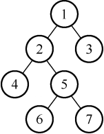
<options :options="['A. LRN', 'B. NRL', 'C. RLN', 'D. RNL']" />

4\. 下列二叉排序树中，满足平衡二叉树定义的是 (&emsp;)。

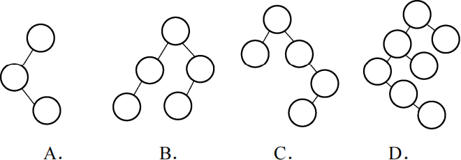

5\. 已知一棵完全二叉树的第6层（设根为第1层）有8个叶结点，则该完全二叉树的结点个数最多是 (&emsp;)。

<options :options="['A. 39', 'B. 52', 'C. 111', 'D. 119']" />

6\. 将森林转换为对应的二叉树，若在二叉树中，结点u是结点v的父结点的父结点，则在原来的森林中，u和v可能具有的关系是 (&emsp;)。

<options :options="['Ⅰ. 父子关系']" />
<options :options="['Ⅱ. 兄弟关系']" />
<options :options="['Ⅲ. u的父结点与v的父结点是兄弟关系']" /> 

<options :options="['A. 只有Ⅱ', 'B. Ⅰ和Ⅱ', 'C. Ⅰ和Ⅲ', 'D. Ⅰ、Ⅱ和Ⅲ']" />

7\. 下列关于无向连通图特性的叙述中，正确的是 (&emsp;)。

<options :options="['Ⅰ. 所有顶点的度之和为偶数']" />
<options :options="['Ⅱ. 边数大于顶点个数减1']" />
<options :options="['Ⅲ. 至少有一个顶点的度为1']" /> 

<options :options="['A. 只有Ⅰ', 'B. 只有Ⅱ', 'C. Ⅰ和Ⅱ', 'D. Ⅰ和Ⅲ']" />

8\. 下列叙述中，不符合m阶B树定义要求的是 (&emsp;)。

<options :options="['A. 根结点至多有m棵子树', 'B. 所有叶结点都在同一层上']" />
<options :options="['C. 各结点内关键字均升序或降序排列', 'D. 叶结点之间通过指针链接']" />

9\. 已知关键字序列5,8,12,19,28,20,15,22是小根堆（最小堆），插入关键字3，调整后得到的小根堆是 (&emsp;)。

<options :options="['A. 3,5,12,8,28,20,15,22,19', 'B. 3,5,12,19,20,15,22,8,28']" />
<options :options="['C. 3,8,12,5,20,15,22,28,19', 'D. 3,12,5,8,28,20,15,22,19']" />

10\. 若数据元素序列11,12,13,7,8,9,23,4,5是采用下列排序方法之一得到的第二趟排序后的结果，则该排序算法只能是 (&emsp;)。

<options :options="['A. 冒泡排序', 'B. 插入排序', 'C. 选择排序', 'D. 二路归并排序']" />

11\. 冯·诺依曼计算机中指令和数据均以二进制形式存放在存储器中，CPU区分它们的依据是 (&emsp;)。

<options :options="['A. 指令操作码的译码结果']" />
<options :options="['B. 指令和数据的寻址方式']" />
<options :options="['C. 指令周期的不同阶段']" />
<options :options="['D. 指令和数据所在的存储单元']" />

12\. 一个C语言程序在一台32位机器上运行。程序中定义了三个变量x、y和z，其中x和z为int型，y为short型。当x=127，y=-9时，执行赋值语句z=x+y后，x、y和z的值分别是 (&emsp;)。

<options :options="['A. x=0000007FH, y=FFF9H, z=00000076H']" />
<options :options="['B. x=0000007FH, y=FFF9H, z=FFFF0076H']" />
<options :options="['C. x=0000007FH, y=FFF7H, z=FFFF0076H']" />
<options :options="['D. x=0000007FH, y=FFF7H, z=00000076H']" />

13\. 浮点数加、减运算过程一般包括对阶、尾数运算、规格化、舍入和判溢出等步骤。设浮点数的阶码和尾数均采用补码表示，且位数分别为5位和7位（均含2位符号位）。若有两个数X=27×29/32,Y=25×5/8，则用浮点加法计算X+Y的最终结果是 (&emsp;)。

<options :options="['A. 00111 1100010', 'B.00111 0100010', 'C. 01000 0010001', 'D.发生溢出']" />

14\. 某计算机的Cache共有16块，采用2路组相联映射方式（即每组2块）。每个主存块大小为32B，按字节编址。主存129号单元所在主存块应装入到的Cache组号是 (&emsp;)。

<options :options="['A. 0', 'B. 2', 'C. 4', 'D. 6']" />

15\. 某计算机主存容量为64KB，其中ROM区为4KB，其余为RAM区，按字节编址。现要用2K×8位的ROM芯片和4K×4位的RAM芯片来设计该存储器，则需要上述规格的ROM芯片数和RAM芯片数分别是 (&emsp;)。

<options :options="['A. 1、15', 'B. 2、15', 'C. 1、30', 'D. 2、30']" />

16\. 某机器字长为16位，主存按字节编址，转移指令采用相对寻址，由两个字节组成，第个字节为操作码字段，第二个字节为相对位移量字段。假定取指令时，每取一个字节PC自动加1。若某转移指令所在主存地址为2000H，相对位移量字段的内容为06H，则该转移指令成功转移后的目标地址是 (&emsp;)。

<options :options="['A. 2006H', 'B. 2007H', 'C. 2008H', 'D. 2009H']" />

17\. 下列关于RISC的叙述中，错误的是 (&emsp;)。

<options :options="['A. RISC普遍采用微程序控制器']" />
<options :options="['B. RISC大多数指令在一个时钟周期内完成']" />
<options :options="['C. RISC的内部通用寄存器数量相对CISC多']" />
<options :options="['D. RISC的指令数、寻址方式和指令格式种类相对CISC少']" />

18\. 某计算机的指令流水线由四个功能段组成，指令流经各功能段的时间（忽略各功能段之间的缓存时间）分别为 90ns、80ns、70ns和60ns，则该计算机的 CPU时钟周期至少是 (&emsp;)。

<options :options="['A. 90ns', 'B. 80ns', 'C. 70ns', 'D. 60ns']" />

19\. 相对于微程序控制器，硬布线控制器的特点是 (&emsp;)。

<options :options="['A. 指令执行速度慢，指令功能的修改和扩展容易']" />
<options :options="['B. 指令执行速度慢，指令功能的修改和扩展难']" />
<options :options="['C. 指令执行速度快，指令功能的修改和扩展容易']" />
<options :options="['D. 指令执行速度快，指令功能的修改和扩展难']" />

20\. 假设某系统总线在一个总线周期中并行传输4B信息，一个总线周期占用2个时钟周期，总线时钟频率为10MHz，则总线带宽是 (&emsp;)。

<options :options="['A. 10MB/s', 'B. 20MB/s', 'C. 40MB/s', 'D. 80MB/s']" />

21\. 假设某计算机的存储系统由Cache和主存组成，某程序执行过程中访存1000次，其中访问Cache缺失（未命中）50次，则Cache的命中率是 (&emsp;)。

<options :options="['A. 5%', 'B. 9.5%', 'C. 50%', 'D. 95%']" />

22\. 下列选项中，能引起外部中断的事件是 (&emsp;)。

<options :options="['A. 键盘输入', 'B. 除数为0', 'C. 浮点运算下溢', 'D. 访存缺页']" />

23\. 单处理机系统中，可并行的是 (&emsp;)。

<options :options="['Ⅰ. 进程与进程']" />
<options :options="['Ⅱ. 处理机与设备']" />
<options :options="['Ⅲ. 处理机与通道']" />
<options :options="['Ⅳ. 设备与设备']" /> 

<options :options="['A. Ⅰ、Ⅱ、Ⅲ', 'B. Ⅰ、Ⅱ、IV', 'C. Ⅰ、Ⅲ、IV', 'D. Ⅱ、Ⅲ、Ⅳ']" />

24\. 下列进程调度算法中，综合考虑进程等待时间和执行时间的是 (&emsp;)。

<options :options="['A. 时间片轮转调度算法', 'B. 短进程优先调度算法']" width="73%" />
<options :options="['C. 先来先服务调度算法', 'D. 高响应比优先调度算法']" />

25\. 某计算机系统中有8台打印机，由K个进程竞争使用，每个进程最多需要3台打印机。该系统可能会发生死锁的K的最小值是 (&emsp;)。

<options :options="['A. 2', 'B. 3', 'C. 4', 'D. 5']" />

26\. 分区分配内存管理方式的主要保护措施是 (&emsp;)。

<options :options="['A. 界地址保护', 'B. 程序代码保护', 'C. 数据保护', 'D. 栈保护']" />

27\. 一个分段存储管理系统中，地址长度为32位，其中段号占8位，则最大段长是 (&emsp;)。

<options :options="['A. 28字节', 'B. 216字节', 'C. 224字节', 'D. 232字节']" />

28\. 下列文件物理结构中，适合随机访问且易于文件扩展的是 (&emsp;)。

<options :options="['A. 连续结构', 'B. 索引结构', 'C. 链式结构且磁盘块定长', 'D. 链式结构且磁盘块变长']" />
29\. 假设磁头当前位于第105道，正在向磁道序号增加的方向移动。现有一个磁道访问请求序列为35,45,12,68,110,180,170,195，采用SCAN调度（电梯调度）算法得到的磁道访问序列是 (&emsp;)。

<options :options="['A. 110,170,180,195,68,45,35,12']" />
<options :options="['B. 110,68,45,35,12,170,180,195']" />
<options :options="['C. 110,170,180,195,12,35,45,68']" />
<options :options="['D. 12,35,45,68,110,170,180,195']" />

30\. 文件系统中，文件访问控制信息存储的合理位置是 (&emsp;)。

<options :options="['A. 文件控制块', 'B. 文件分配表', 'C. 用户口令表', 'D. 系统注册表']" />
31\. 设文件F1的当前引用计数值为1，先建立F1的符号链接（软链接）文件F2，再建立F1的硬链接文件F3，然后删除F1。此时，F2和F3的引用计数值分别是 (&emsp;)。

<options :options="['A. 两次打开操作只涉及一次文件索引节点的磁盘读取操作']" />
<options :options="['B. 进程P1和P2对F1具有相同的访问权限']" />
<options :options="['C. 若删除文件F3，则F2的引用计数值减1']" />
<options :options="['D. 进程P1读取F1时需要提供F1的绝对路径作为系统调用参数']" />
32\. 程序员利用系统调用打开I/O设备时，通常使用的设备标识是 (&emsp;)。

<options :options="['A. 逻辑设备名', 'B. 物理设备名', 'C. 主设备号', 'D. 从设备号']" />
33\. 在OSI参考模型中，自下而上第一个提供端到端服务的层次是 (&emsp;)。

<options :options="['A. 数据链路层', 'B. 传输层', 'C. 会话层', 'D. 应用层']" />

34\. 在无噪声情况下，若某通信链路的带宽为3kHz，采用4个相位，每个相位具有4种振幅的QAM调制技术，则该通信链路的最大数据传输速率是 (&emsp;)

<options :options="['A. 12kb/s', 'B. 24kb/s', 'C. 48kb/s', 'D. 96kb/s']" />

35\. 数据链路层采用后退N帧(GBN)协议，发送方已经发送了编号为0~7的帧。当计时器超时时，若发送方只收到0、2、3号帧的确认，则发送方需要重发的帧数是 (&emsp;)。

<options :options="['A. 2', 'B. 3', 'C. 4', 'D. 5']" />

36\. 以太网交换机进行转发决策时使用的PDU地址是 (&emsp;)。

<options :options="['A. 目的物理地址', 'B. 目的IP地址', 'C. 源物理地址', 'D. 源IP地址']" />

37\. 在一个采用CSMA/CD协议的网络中，传输介质是一根完整的电缆，传输速率为1Gbps，电缆中的信号传播速度为200000km/s。若最小数据帧长度减少800bit，则最远的两个站点之间的距离至少需要 (&emsp;)。

<options :options="['A. 增加160m', 'B. 增加80m', 'C. 减少160m', 'D. 减少80m']" />

38\. 主机甲与主机乙之间已建立一个TCP连接，主机甲向主机乙发送了两个连续的TCP段，分别包含300B和500B的有效载荷，第一个段的序列号为200，主机乙正确接收到两个段后, 发送给主机甲的确认序列号是 (&emsp;)。

<options :options="['A. 500', 'B. 700', 'C. 800', 'D. 1000']" />

39\. 一个TCP连接总是以1KB的最大段长发送TCP段，发送方有足够多的数据要发送。当拥塞窗口为16KB时发生了超时，如果接下来的4个RTT（往返时间）时间内的TCP段的传输都是成功的，那么当第4个RTT时间内发送的所有TCP段都得到肯定应答时，拥塞窗口大小是 (&emsp;)。

<options :options="['A. 7KB', 'B. 8KB', 'C. 9KB', 'D. 16KB']" />

40\. FTP客户和服务器间传递FTP命令时，使用的连接是 (&emsp;)。

<options :options="['A. 建立在TCP之上的控制连接', 'B. 建立在TCP之上的数据连接']" />
<options :options="['C. 建立在UDP之上的控制连接', 'D. 建立在UDP之上的数据连接']" />

</question>

二、综合应用题：第41~47题，共70分。{.custom-h3}

<question>

41\. (10分) 带权图（权值非负，表示边连接的两顶点间的距离）的最短路径问题是找出从初始顶点到目标顶点之间的一条最短路径。假设从初始顶点到目标顶点之间存在路径，现有一种解决该问题的方法： 
①设最短路径初始时仅包含初始顶点，令当前顶点u为初始顶点； 
②选择离u最近且尚未在最短路径中的一个顶点v，加入最短路径中，修改当前顶点u=v； 
③重复步骤②，直到u是目标顶点时为止。 
请问上述方法能否求得最短路径？若该方法可行，请证明之；否则，请举例说明。

42\. (15分) 已知一个带有表头结点的单链表，结点结构为：。假设该链表只给出了头指针list。在不改变链表的前提下，请设计一个尽可能高效的算法，查找链表中倒数第k个位置上的结点（k为正整数）。若查找成功，算法输出该结点的data域的值，并返回1；否则，只返回0。要求：
1) 描述算法的基本设计思想。
2) 描述算法的详细实现步骤。
3) 根据设计思想和实现步骤，采用程序设计语言描述算法（使用C、C++或Java 语言实现），关键之处请给出简要注释。

43\. (8分) 某计算机的CPU主频为500MHz，CPI为5（即执行每条指令平均需5个时钟周期）。假定某外设的数据传输率为0.5MB/s，采用中断方式与主机进行数据传送，以32位为传输单位，对应的中断服务程序包含18条指令，中断服务的其他开销相当于2条指令的执行时间。请回答下列问题，要求给出计算过程。
1) 在中断方式下，CPU用于该外设IO的时间占整个CPU时间的百分比是多少？
2) 当该外设的数据传输率达到5MB/s时，改用DMA方式传送数据。假定每次DMA传送块大小为5000B，且DMA预处理和后处理的总开销为500个时钟周期，则CPU用于该外设I/O的时间占整个CPU时间的百分比是多少？（假设DMA与CPU之间没有访存冲突）

44\. (13分) 某计算机字长16位，采用16位定长指令字结构，部分数据通路结构如下图所示，图中所有控制信号为1时表示有效、为0时表示无效，例如控制信号MDRinE为1表示允许数据从DB打入MDR，MDRin为1表示允许数据从内总线打入MDR。假设MAR的输出一直处于使能状态。加法指令“ADD (R1), R0”的功能为(R0)+((R1))→(R1)，即将R0中的数据与R1的内容所指主存单元的数据相加，并将结果送入R1的内容所指主存单元中保存。

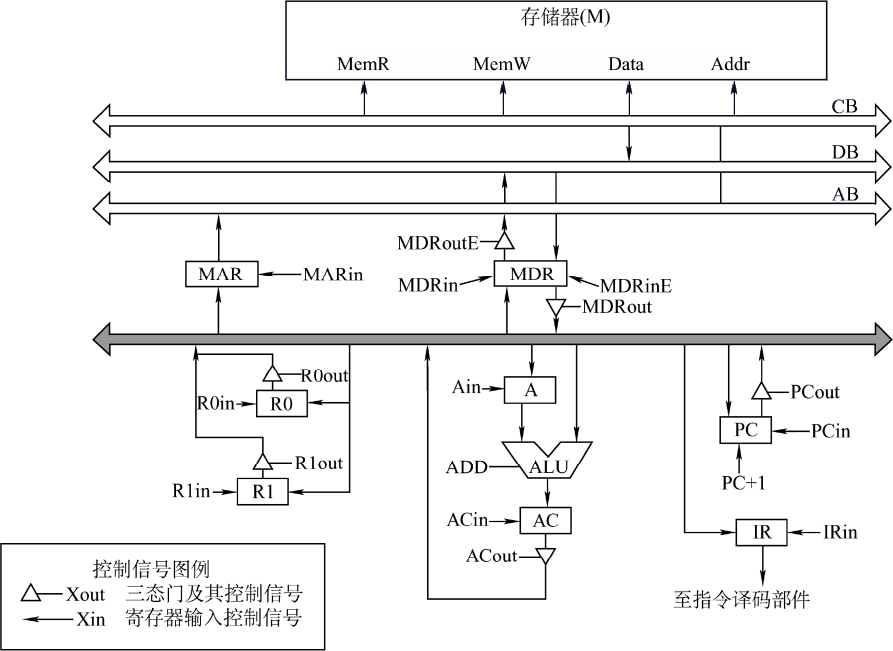

下表给出了上述指令取指和译码阶段每个节拍（时钟周期）的功能和有效控制信号，请按表中描述方式用表格列出指令执行阶段每个节拍的功能和有效控制信号。

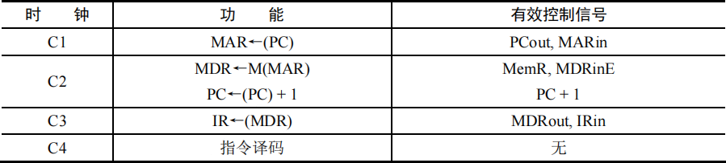

45\. (7分) 三个进程 P1、P2、P3互斥使用一个包含N(N>0)个单元的缓冲区。P1每次用produce()生成一个正整数并用put()送入缓冲区某一空单元中；P2每次用getodd()从该缓冲区中取出一个奇数并用countodd()统计奇数个数；P3每次用geteven()从该缓冲区中取出一个偶数并用counteven()统计偶数个数。请用信号量机制实现这三个进程的同步与互斥活动，并说明所定义信号量的含义。要求用伪代码描述。

46\. (8分) 请求分页管理系统中，假设某进程的页表内容见下表。

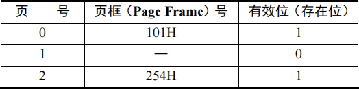

页面大小为4KB，一次内存的访问时间为100ns，一次快表(TLB)的访问时间为10ns，处理一次缺页的平均时间为108ns（已含更新TLB和页表的时间），进程的驻留集大小固定为2，采用最近最少使用置换算法(LRU)和局部淘汰策略。假设①TLB初始为空；②地址转换时先访问TLB，若TLB未命中，再访问页表（忽略访问页表之后的TLB更新时间）；③有效位为0表示页面不在内存中，产生缺页中断，缺页中断处理后，返回到产生缺页中断的指令处重新执行。设有虚地址访问序列2362H、1565H、25A5H，请问：
1) 依次访问上述三个虚地址，各需多少时间？给出计算过程。
2) 基于上述访问序列，虚地址1565H的物理地址是多少？请说明理由。

47\. (9分) 某网络拓扑如下图所示，路由器R1通过接口E1、E2分别连接局域网1、局域网2，通过接口L0连接路由器R2，并通过路由器R2连接域名服务器与互联网。R1的L0接口的IP地址是202.118.2.1，R2的L0接口的IP地址是202.118.2.2，L1接口的IP地址是130.11.120.1，E0接口的IP地址是202.118.3.1，域名服务器的IP地址是202.118.3.2。R1和R2的路由表结构如下：

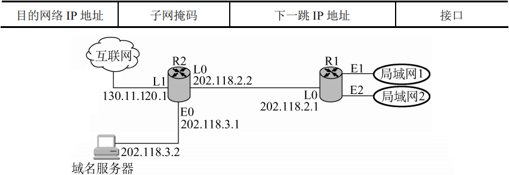

1) 将IP地址空间202.118.1.0/24划分为2个子网分别分配给局域网1、局域网2，每个局域网需分配的IP地址数不少于120个。请给出子网划分结果，说明理由或给出必要的计算过程。
2) 请给出R1的路由表，使其明确包括到局域网1的路由、局域网2的路由、域名服务器的主机路由和互联网的路由。
3) 请采用路由聚合技术，给出R2到局域网1和局域网2的路由。

</question>

## 2010年计算机学科专业基础试题 {.custom-h2}

一、单项选择题：第1~40小题，每小题2分，共80分。下列每题给出的四个选项中，只有一个选项最符合试题要求。 {.custom-h3}

<question>

1\. 若元素a,b,c,d,e,f依次进栈，允许进栈、退栈操作交替进行，但不允许连续3次进行退栈操作，不可能得到的出栈序列是 (&emsp;)。

<options :options="['A. dcebfa', 'B. cbdaef', 'C. bcaefd', 'D. afedcb']" />

2\. 某队列允许在其两端进行入队操作，但仅允许在一端进行出队操作。若元素a,b,c,d,e依次入此队列后再进行出队操作，则不可能得到的出队序列是 (&emsp;)。

<options :options="['A. b,a,c,d,e', 'B. d,b,a,c,e', 'C. d,b,c,a,e', 'D. e,c,b,a,d']" />

3\. 下列线索二叉树中（用虚线表示线索），符合后序线索树定义的是 (&emsp;)。

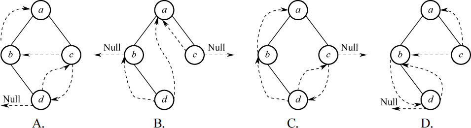

4\. 在下图所示的平衡二叉树中插入关键字48后得到一棵新平衡二叉树，在新平衡二叉树中，关键字37所在结点的左、右子结点中保存的关键字分别是 (&emsp;)。

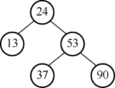

<options :options="['A. 13, 48', 'B. 24, 48', 'C. 24, 53', 'D. 24, 90']" />

5\. 在一棵度为4的树T中，若有20个度为4的结点，10个度为3的结点，1个度为2的结点，10个度为1的结点，则树T的叶结点个数是 (&emsp;)。

<options :options="['A. 41', 'B. 82', 'C. 113', 'D. 122']" />

6\. n(n≥2)个权值均不相同的字符构成哈夫曼树，关于该树的叙述中，错误的是 (&emsp;)。

<options :options="['A. 该树一定是一棵完全二叉树']" />
<options :options="['B. 树中一定没有度为1的结点']" />
<options :options="['C. 树中两个权值最小的结点一定是兄弟结点']" />
<options :options="['D. 树中任意一个非叶结点的权值一定不小于下一层任意一个结点的权值']" />

7\. 若无向图G=(V,E)中含有7个顶点, 要保证图G在任何情况下都是连通的, 则需要的边数最少是 (&emsp;)。

<options :options="['A. 6', 'B. 15', 'C. 16', 'D. 21']" />

8\. 对下图进行拓扑排序，可得不同拓扑序列的个数是 (&emsp;)。

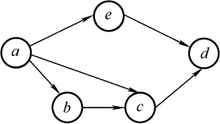

<options :options="['A. 4', 'B. 3', 'C. 2', 'D. 1']" />

9\. 已知一个长度为16的顺序表L，其元素按关键字有序排列。若采用折半查找法查找一个L中不存在的元素，则关键字的比较次数最多是 (&emsp;)。

<options :options="['A. 4', 'B. 5', 'C. 6', 'D. 7']" />

10\. 采用递归方式对顺序表进行快速排序。下列关于递归次数的叙述中，正确的是 (&emsp;)。

<options :options="['A. 递归次数与初始数据的排列次序无关']" />
<options :options="['B. 每次划分后，先处理较长的分区可以减少递归次数']" />
<options :options="['C. 每次划分后，先处理较短的分区可以减少递归次数']" />
<options :options="['D. 递归次数与每次划分后得到的分区的处理顺序无关']" />

11\. 对一组数据(2, 12, 16, 88, 5, 10)进行排序，若前3趟排序结果如下： 
第一趟排序结果: 2, 12, 16, 5, 10, 88 
第二趟排序结果: 2, 12, 5, 10, 16, 88 
第三趟排序结果: 2, 5, 10, 12, 16, 88 
则采用的排序算法可能是 (&emsp;)。

<options :options="['A. 冒泡排序', 'B. 希尔排序', 'C. 归并排序', 'D. 基数排序']" />

12\. 下列选项中，能缩短程序执行时间的措施是 (&emsp;)。

<options :options="['Ⅰ. 提高CPU时钟频率&emsp;Ⅱ. 优化数据通路结构&emsp;Ⅲ. 对程序进行编译优化']" /> 

<options :options="['A. 仅Ⅰ和Ⅱ', 'B. 仅Ⅰ和Ⅲ', 'C. 仅Ⅱ和Ⅲ', 'D. Ⅰ、Ⅱ、Ⅲ']" />

13\. 假定有四个整数用8位补码分别表示：r1=FEH,r2=F2H,r3=90H,r4=F8H，若将运算结果存放在一个8位寄存器中，则下列运算会发生溢出的是 (&emsp;)。

<options :options="['A. r1×r2', 'B. r2×r3', 'C. r1×r4', 'D. r2×r4']" />

14\. 假定变量i、f和d的数据类型分别为int、float和double（int型用补码表示，float型和double型分别用IEEE754单精度和双精度浮点数格式表示），已知i=785，f=1.5678E3，d=1.5E100，若在32位机器中执行下列关系表达式，则结果为“真”的是 (&emsp;)。

<options :options="['Ⅰ. i==(int)(float)i&emsp;Ⅱ. f==(float)(int)f&emsp;Ⅲ. f==(float)(double)f&emsp;Ⅳ. (d+f)-d==f']" /> 

<options :options="['A. 仅Ⅰ和Ⅱ', 'B. 仅Ⅰ和Ⅲ', 'C. 仅Ⅱ和Ⅲ', 'D. 仅Ⅰ和Ⅳ']" />

15\. 假定用若干2K×4位的芯片组成一个8K×8位的存储器，则地址0B1FH所在芯片的最小地址是 (&emsp;)。

<options :options="['A. 0000H', 'B. 0600H', 'C. 0700H', 'D. 0800H']" />

16\. 下列有关RAM和ROM的叙述中，正确的是 (&emsp;)。

<options :options="['Ⅰ. RAM是易失性存储器，ROM是非易失性存储器']" />
<options :options="['Ⅱ. RAM和ROM都采用随机存取方式进行信息访问']" />
<options :options="['Ⅲ. RAM和ROM都可用作Cache']" />
<options :options="['Ⅳ. RAM和ROM都需要进行刷新']" /> 

<options :options="['A. 仅Ⅰ和Ⅱ', 'B. 仅Ⅱ和Ⅲ', 'C. 仅Ⅰ、Ⅱ和Ⅲ', 'D. 仅Ⅱ、Ⅲ和Ⅳ']" />

17\. 下列命中组合情况中，一次访存过程中不可能发生的是 (&emsp;)。

<options :options="['A. TLB未命中，Cache未命中，Page未命中']" />
<options :options="['B. TLB未命中，Cache命中，Page命中']" />
<options :options="['C. TLB命中，Cache未命中，Page命中']" />
<options :options="['D. TLB命中，Cache命中，Page未命中']" />

18\. 下列寄存器中，汇编语言程序员可见的是 (&emsp;)。

<options :options="['A. 存储器地址寄存器(MAR)', 'B. 程序计数器(PC)']" />
<options :options="['C. 存储器数据寄存器(MDR)', 'D. 指令寄存器(IR)']" />

19\. 下列不会引起指令流水线阻塞的是 (&emsp;)。

<options :options="['A. 数据旁路（转发）', 'B. 数据相关', 'C. 条件转移', 'D. 资源冲突']" />

20\. 下列选项中的英文缩写均为总线标准的是 (&emsp;)。

<options :options="['A. PCI、CRT、USB、EISA', 'B. ISA、CPI、VESA、EISA']" width="69%" />
<options :options="['C. ISA、SCSI、RAM、MIPS', 'D. ISA、EISA、PCI、PCI-Express']" />

21\. 单级中断系统中，中断服务程序内的执行顺序是 (&emsp;)。

<options :options="['Ⅰ. 保护现场&emsp;Ⅱ. 开中断&emsp;Ⅲ. 关中断']" />
<options :options="['Ⅳ. 保存断点&emsp;Ⅴ. 中断事件处理&emsp;Ⅵ. 恢复现场&emsp;Ⅶ. 中断返回']" />

<options :options="['A. Ⅰ→Ⅴ-→Ⅳ→Ⅱ→Ⅶ', 'B. Ⅲ→Ⅰ→Ⅴ→Ⅶ']" width="67%" />
<options :options="['C. Ⅲ→Ⅳ→Ⅴ→Ⅵ→Ⅶ', 'D. Ⅳ-→Ⅰ-→Ⅴ-→Ⅵ-→Ⅶ']" />

22\. 假定一台计算机的显示存储器用DRAM芯片实现，若要求显示分辨率为1600×1200颜色深度为24位，帧频为85Hz，显存总带宽的50%用来刷新屏幕，则需要的显存总带宽至少约为 (&emsp;)。

<options :options="['A.245Mbps', 'B. 979Mbps', 'C. 1958Mbps', 'D. 7834Mbps']" />

23\. 下列选项中，操作系统提供给应用程序的接口是 (&emsp;)。

<options :options="['A. 系统调用', 'B. 中断', 'C. 库函数', 'D. 原语']" />

24\. 下列选项中，导致创建新进程的操作是 (&emsp;)。

<options :options="['Ⅰ. 用户登录成功&emsp;Ⅱ. 设备分配&emsp;Ⅲ. 启动程序执行']" /> 

<options :options="['A. 仅Ⅰ 和Ⅱ', 'B. 仅Ⅱ和Ⅲ', 'C. 仅Ⅰ 和Ⅲ', 'D. Ⅰ、Ⅱ、Ⅲ']" />

25\. 设与某资源关联的信号量初值为3，当前值为1。若M表示该资源的可用个数，N表示等待该资源的进程数，则M、N分别是 (&emsp;)。

<options :options="['A. 0、1', 'B. 1、0', 'C. 1、2', 'D. 2、0']" />

26\. 下列选项中，降低进程优先级的合理时机是 (&emsp;)。

<options :options="['A. 进程时间片用完']" />
<options :options="['B. 进程刚完成I/O操作，进入就绪队列']" />
<options :options="['C. 进程长期处于就绪队列']" />
<options :options="['D. 进程从就绪态转换为运行态']" />

27\. 进程P0和P1的共享变量定义及其初值为

若进程P0和P1访问临界资源的类C伪代码实现如下：

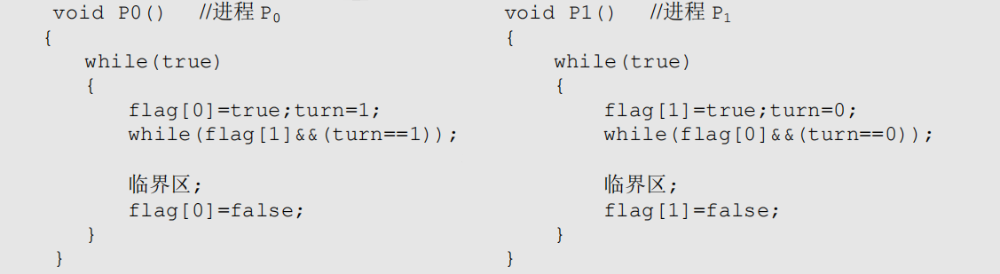

则并发执行进程P0和P1时产生的情形是 (&emsp;)。

<options :options="['A. 不能保证进程互斥进入临界区，会出现“饥饿”现象']" />
<options :options="['B. 不能保证进程互斥进入临界区，不会出现“饥饿”现象']" />
<options :options="['C. 能保证进程互斥进入临界区，会出现“饥饿”现象']" />
<options :options="['D. 能保证进程互斥进入临界区，不会出现“饥饿”现象']" />

28\. 某基于动态分区存储管理的计算机，其主存容量为55MB(初始为空)，采用最佳适配(BesTFit)算法，分配和释放的顺序为：分配15MB，分配30MB，释放15MB，分配8MB，分配6MB，此时主存中最大空闲分区的大小是 (&emsp;)。

<options :options="['A. 7MB', 'B. 9MB', 'C. 10MB', 'D. 15MB']" />

29\. 某计算机采用二级页表的分页存储管理方式，按字节编址，页大小为210B，页表项大小为2B，逻辑地址结构为：

逻辑地址空间大小为216页，则表示整个逻辑地址空间的页目录表中包含表项的个数至少是 (&emsp;)。

<options :options="['A. 64', 'B. 128', 'C. 256', 'D. 512']" />

30\. 设文件索引节点中有d个地址项，其中4个地址项是直接地址索引，2个地址项是一级间接地址索引，1个地址项是二级间接地址索引，每个地址项大小为4B，若磁盘索引块和磁盘数据块大小均为256B，则可表示的单个文件最大长度是 (&emsp;)。

<options :options="['A. 33KB', 'B. 519KB', 'C. 1057KB', 'D. 16516KB']" />

31\. 设置当前工作目录的主要目的是 (&emsp;)。
<options :options="['A. 节省外存空间', 'B. 节省内存空间']" width="67%" />
<options :options="['C. 加快文件的检索速度', 'D. 加快文件的读/写速度']" />

32\. 本地用户通过键盘登录系统时，首先获得键盘输入信息的程序是 (&emsp;)。

<options :options="['A. 命令解释程序', 'B. 中断处理程序', 'C. 系统调用服务程序', 'D. 用户登录程序']" />

33\. 下列选项中，不属于网络体系结构所描述的内容是 (&emsp;)。

<options :options="['A. 网络的层次', 'B. 每一层使用的协议']" width="70%" />
<options :options="['C. 协议的内部实现细节', 'D. 每一层必须完成的功能']" />

34\. 在下图所示的采用“存储-转发”方式的分组交换网络中，所有链路的数据传输速率为100Mb/s，分组大小为1000B，其中分组头大小为20B。若主机H1向主机H2发送一个大小为980000B的文件，则在不考虑分组拆装时间和传播延迟的情况下，从H1发送开始到H2接收完为止，需要的时间至少是 (&emsp;)。

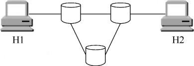

<options :options="['A. 80ms', 'B. 80.08ms', 'C. 80.16ms', 'D. 80.24ms']" />

35\. 某自治系统内采用RIP，若该自治系统内的路由器R1收到其邻居路由器R2的距离向量，距离向量中包含信息<Net1,16>，则能得出的结论是 (&emsp;)。

<options :options="['A. R2可以经过R1到达Net1，跳数为17']" />
<options :options="['B. R2可以到达Net1，跳数为16']" />
<options :options="['C. R1可以经过R2到达Net1，跳数为17']" />
<options :options="['D. R1不能经过R2到达Net1']" />

36\. 若路由器R因为拥塞丢弃IP分组，则此时R可向发出该IP分组的源主机发送的ICMP报文类型是 (&emsp;)。

<options :options="['A. 路由重定向', 'B. 目的不可达', 'C. 源点抑制', 'D. 超时']" />

37\. 网络的IP地址空间为192.168.5.0/24，采用定长子网划分，子网掩码为255.255.255.248，则该网络中的最大子网个数、每个子网内的最大可分配地址个数分别是 (&emsp;)。

<options :options="['A. 32, 8', 'B. 32, 6', 'C. 8, 32', 'D. 8, 30']" />
38\. 下列网络设备中，能够抑制广播风暴的是 (&emsp;)。

<options :options="['Ⅰ. 中继器', 'Ⅱ. 集线器', 'Ⅲ. 网桥', 'Ⅳ. 路由器']" width="50%" /> 

<options :options="['A. 仅Ⅰ和Ⅱ', 'B. 仅Ⅲ', 'C. 仅Ⅲ和Ⅳ', 'D. 仅Ⅳ']" />

39\. 主机甲和主机乙之间已建立一个TCP连接，TCP最大段长为1000字节。若主机甲的当前拥塞窗口为4000字节，在主机甲向主机乙连续发送两个最大段后，成功收到主机乙发送的第一个段的确认段，确认段中通告的接收窗口大小为2000字节，则此时主机甲还可以向主机乙发送的最大字节数是 (&emsp;)。

<options :options="['A. 1000', 'B. 2000', 'C. 3000', 'D. 4000']" />

40\. 若本地域名服务器无缓存，则在采用递归方法解析另一网络某主机域名时，用户主机和本地域名服务器发送的域名请求条数分别为 (&emsp;)。

<options :options="['A. 1条、1条', 'B. 1条、多条', 'C. 多条、1条', 'D. 多条、多条']" />

</question>

二、综合应用题：第41~47题，共70分。{.custom-h3}

<question>

41\. (10分) 将关键字序列(7,8,30,11,18,9,14)散列存储到散列表中。散列表的存储空间是一个下标从0开始的一维数组，散列函数为H(key)=(key×3)%7，处理冲突采用线性探测再散列法，要求装填（载）因子为0.7。
1) 请画出所构造的散列表。
2) 分别计算等概率情况下查找成功和查找不成功的平均查找长度。

42\. (13分) 设将n(n>1)个整数存放到一维数组R中。试设计一个在时间和空间两方面都尽可能高效的算法。将R中保存的序列循环左移p(0<p<n)个位置，即将R中的数据由(X0,X1,···,Xn-1)变换为(Xp,Xp+1,···,Xn-1,X0,X1,···,Xp-1)。要求：
1) 给出算法的基本设计思想。
2) 根据设计思想，采用 C、C++或Java语言描述算法，关键之处给出注释。
3) 说明你所设计算法的时间复杂度和空间复杂度。

43\. (11分) 某计算机字长为16位，主存地址空间大小为128KB，按字编址，采用单字长指令格式，指令各字段定义如下图所示。

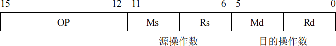

转移指令采用相对寻址，相对偏移量用补码表示，寻址方式定义如下：

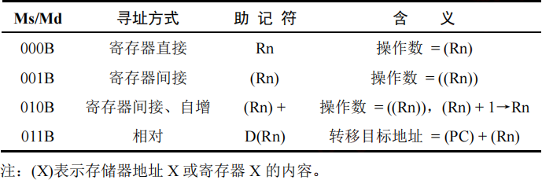

请回答下列问题:
1) 该指令系统最多可有多少条指令？该计算机最多有多少个通用寄存器？存储器地址寄存器(MAR)和存储器数据寄存器(MDR)至少各需要多少位？
2) 转移指令的目标地址范围是多少？
3) 若操作码0010B表示加法操作（助记符为ADD），寄存器R4和R5的编号分别为100B和101B，R4的内容为1234H，R5的内容为5678H，地址1234H中的内容为5678H，地址5678H中的内容为1234H，则汇编语句“ADD (R4), (R5)+”（逗号前为源操作数，逗号后为目的操作数）对应的机器码是什么（用十六进制表示）？该指令执行后，哪些寄存器和存储单元的内容会改变？改变后的内容是什么？

44\. (12分) 某计算机的主存地址空间大小为256MB，按字节编址，指令Cache和数据Cache分离，均有8个Cache行，每个Cache行大小为64B，数据Cache采用直接映射方式。现有两个功能相同的程序A和B，其伪代码如下所示：
<pre>
程序A：                     程序B：
int a[256][256]             int a[256][256]
...                         ...
int sum_array1()            int sum_array1()
{                           {
  int i，j，sum=0;            int i，j，sum=0;
  for(i=0；i<256；i++)        for(i=0；i<256；i++)
    for(j=0；j<256；j++)        for(j=0；j<256；j++)
      sum += a[i][j];             sum += a[i][j];
  return sum;                 return sum;
}                           }
</pre>
假定int类型数据用32位补码表示，程序编译时i、j、sum均分配在寄存器中，数组a按行优先方式存放，首地址320（十进制数）。请回答下列问题，要求说明理由或给出计算过程。
1) 若不考虑用于Cache一致性维护和替换算法的控制位,则数据Cache的总容量为多少？
2) 数组数据a[0][31]和a[1][1]各自所在的主存块对应的Cache行号分别是多少？（Cache行号从0开始）
3) 程序A和B的数据访问命中率各是多少？哪个程序的执行时间更短？

45\. (7分) 假设计算机系统采用CSCAN（循环扫描）磁盘调度策略，使用2KB的内存空间记录16384个磁盘块的空闲状态。

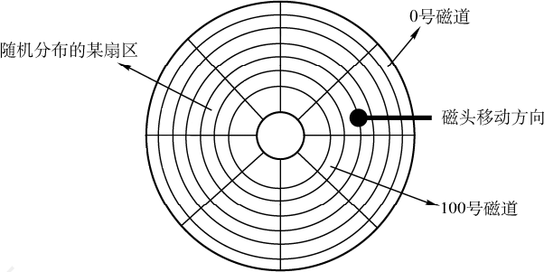

1) 请说明在上述条件下如何进行磁盘块空闲状态的管理。
2) 设某单面磁盘的旋转速度为每分钟6000转，每个磁道有100个扇区，相邻磁道间的平均移动的时间为1ms。若在某时刻，磁头位于100号磁道处，并沿着磁道号增大的方向移动（如下图所示），磁道号的请求队列为50,90,30,120，对请求队列中的每个磁道需读取1个随机分布的扇区，则读完这个扇区点共需要多少时间？要求给出计算过程。
3) 如果将磁盘替换为随机访问的Flash半导体存储器（如U盘、SSD等），是否有比CSCAN更高效的磁盘调度策略？若有，给出磁盘调度策略的名称并说明理由；若无，说明理由。

46\. (8分) 设某计算机的逻辑地址空间和物理地址空间均为64KB，按字节编址。若某进程最多需要6页(Page)数据存储空间，页的大小为1KB，操作系统采用固定分配局部置换策略为此进程分配4个页框(Page Frame)。在时刻260前该进程访问情况见下表（访问位即使用位）。

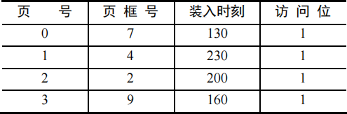

当该进程执行到时刻260时，要访问逻辑地址为17CAH的数据。请回答下列问题：
1) 该逻辑地址对应的页号是多少？
2) 若采用先进先出(FIFO)置换算法，该逻辑地址对应的物理地址？要求给出计算过程。采用时钟(CLOCK)置换算法，该逻辑地址对应的物理地址是多少？要求给出计算过程。设搜索下一页的指针按顺时针方向移动，且指向当前2号页框，示意图如下图。

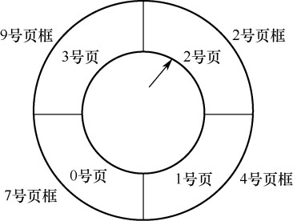

47\. (9分) 某局域网采用CSMA/CD协议实现介质访问控制，数据传输速率为10Mbps，主机甲和主机乙之间的距离为2km，信号传播速度为200000km/s。请回答下列问题，要求说明理由或写出计算过程。
1) 若主机甲和主机乙发送数据时发生冲突，则从开始发送数据时刻起，到两台主机均检测到冲突时刻止，最短需经过多长时间？最长需经过多长时间？（假设主机甲和主机乙发送数据过程中，其他主机不发送数据）
2) 若网络不存在任何冲突与差错，主机甲总是以标准的最长以太网数据帧(1518B)向主机乙发送数据，主机乙每成功收到一个数据帧后立即向主机甲发送一个64B的确认，主机甲收到确认帧后方可发送下一个数据帧。此时主机甲的有效数据传输速率是多少？（不考虑以太网的前导码）

</question>

## 2011年计算机学科专业基础试题 {.custom-h2}

一、单项选择题：第1~40小题，每小题2分，共80分。下列每题给出的四个选项中，只有一个选项最符合试题要求。 {.custom-h3}

<question>

1\. 设n是描述问题规模的非负整数，下面程序片段的时间复杂度是 (&emsp;)。
<pre>
x=2;
while(x&lt;n/2)
  x=2*x;
</pre>
<options :options="['A. O(log2n)', 'B. O(n)', 'C. O(nlog2n)', 'D. O(n2)']" />

2\. 元素a,b,c,d,e依次进入初始为空的栈中，若元素进栈后可停留、可出栈，直到所有元素都出栈，则在所有可能的出栈序列中，以元素d开头的序列个数是 (&emsp;)。

<options :options="['A. 3', 'B. 4', 'C. 5', 'D. 6']" />

3\. 已知循环队列存储在一维数组A[0…n-1]中，且队列非空时front和rear分别指向队头元素和队尾元素。若初始时队列为空，且要求第一个进入队列的元素存储在A[0]处，则初始时front和rear的值分别是 (&emsp;)。

<options :options="['A. 0,0', 'B. 0,n-1', 'C. n-1,0', 'D. n-1,n-1']" />

4\. 若一棵完全二叉树有768个结点，则该二叉树中叶结点的个数是 (&emsp;)。

<options :options="['A. 257', 'B. 258', 'C. 384', 'D. 385']" />

5\. 一棵二叉树的前序遍历序列和后序遍历序列分别为1,2,3,4和4,3,2,1，该二叉树的中序遍历序列不会是 (&emsp;)。

<options :options="['A. 1,2,3,4', 'B. 2,3,4,1', 'C. 3,2,4,1', 'D. 4,3,2,1']" />

6\. 已知一棵有2011个结点的树，其叶结点个数为116，该树对应的二叉树中无右孩子的结点个数是 (&emsp;)。

<options :options="['A. 115', 'B. 116', 'C. 1895', 'D. 1896']" />

7\. 对下列关键字序列，不可能构成某二叉排序树中一条查找路径的是 (&emsp;)。

<options :options="['A.95,22,91,24,94,71','B.92,20,91,34,88,35','C.21,89,77,29,36,38','D.12,25,71,68,33,34']"/>

8\. 下列关于图的叙述中，正确的是 (&emsp;)。

<options :options="['Ⅰ. 回路是简单路径']" />
<options :options="['Ⅱ. 存储稀疏图，用邻接矩阵比邻接表更省空间']" />
<options :options="['Ⅲ. 若有向图中存在拓扑序列，则该图不存在回路']" /> 

<options :options="['A. 仅Ⅱ', 'B. 仅Ⅰ、Ⅱ', 'C. 仅Ⅲ', 'D. 仅Ⅰ、Ⅲ']" />

9\. 为提高散列(Hash)表的查找效率，可以采取的正确措施是 (&emsp;)。

<options :options="['Ⅰ. 增大装填(载)因子']" />
<options :options="['Ⅱ. 设计冲突（碰撞）少的散列函数']" />
<options :options="['Ⅲ. 处理冲突（碰撞）时避免产生聚集（堆积）现象']" /> 

<options :options="['A. 仅Ⅰ', 'B. 仅Ⅱ', 'C. 仅Ⅰ、Ⅱ', 'D. 仅ⅠⅠ、Ⅲ']" />

10\. 为实现快速排序算法，待排序序列宜采用的存储方式是 (&emsp;)。

<options :options="['A. 顺序存储', 'B. 散列存储', 'C. 链式存储', 'D. 索引存储']" />

11\. 已知序列25,13,10,12,9是大根堆，在序列尾部插入新元素18，将其再调整为大根堆，调整过程中元素之间进行的比较次数是 (&emsp;)。

<options :options="['A. 1', 'B. 2', 'C. 4', 'D. 5']" />

12\. 下列选项中，描述浮点数操作速度指标的是 (&emsp;)。

<options :options="['A. MIPS', 'B. CPI', 'C. IPC', 'D. MFLOPS']" />

13\. float型数据通常用IEEE754单精度浮点数格式表示。若编译器将float型变量x分配在一个32位浮点寄存器FR1中，且x=-8.25，则FR1的内容是 (&emsp;)。

<options :options="['A. C104 0000H', 'B. C242 0000H', 'C. C184 0000H', 'D. C1C2 0000H']" />

14\. 下列各类存储器中，不采用随机存取方式的是 (&emsp;)。

<options :options="['A. EPROM', 'B. CD-ROM', 'C. DRAM', 'D. SRAM']" />

15\. 某计算机存储器按字节编址，主存地址空间大小为64MB，现用4M×8位的RAM芯片组成32MB的主存储器，则存储器地址寄存器MAR的位数至少是 (&emsp;)。

<options :options="['A. 22位', 'B. 23位', 'C. 25位', 'D. 26位']" />

16\. 偏移寻址通过将某个寄存器内容与一个形式地址相加而生成有效地址。下列寻址方式中，不属于偏移寻址方式的是 (&emsp;)。

<options :options="['A. 间接寻址', 'B. 基址寻址', 'C. 相对寻址', 'D. 变址寻址']" />

17\. 某机器有一个标志寄存器，其中有进位/借位标志CF，零标志ZF，符号标志SF和溢出标志OF，条件转移指令bgt（无符号整数比较大于时转移）的转移条件是 (&emsp;)。

<options :options="[
  'A. CF+OF=1',
  'B. SF+ZF=1',
  'C. CF+ZF=1',
  'D. CF+SF=1'
]" />

18\. 下列给出的指令系统特点中，有利于实现指令流水线的是 (&emsp;)。

<options :options="['Ⅰ. 指令格式规整且长度一致']" />
<options :options="['Ⅱ. 指令和数据边界对齐存放']" />
<options :options="['Ⅲ. 只有Load/Store指令才能对操作数进行存储访问']" /> 

<options :options="['A. 仅Ⅰ、Ⅱ', 'B. 仅Ⅱ、Ⅲ', 'C. 仅Ⅰ、Ⅲ', 'D. Ⅰ、Ⅱ、Ⅲ']" />

19\. 假定不采用Cache和指令预取技术，且机器处于“开中断”状态，则在下列有关指令执行的叙述中，错误的是 (&emsp;)。

<options :options="['A. 每个指令周期中CPU都至少访存一次']" />
<options :options="['B. 每个指令周期一定大于或等于一个CPU时钟周期']" />
<options :options="['C. 空操作指令的指令周期中任何寄存器的内容都不会被改变']" />
<options :options="['D. 当前程序在每条指令执行结束时都可能被外部中断打断']" />

20\. 在系统总线的数据线上，不可能传输的是 (&emsp;)。

<options :options="['A. 指令', 'B. 操作数', 'C. 握手（应答）信号', 'D. 中断类型号']" />

21\. 某计算机有五级中断L4~L0，中断屏蔽字为M4M3M2M1M0，Mi=1(0≤i≤4)表示对Li级中断进行屏蔽。若中断响应优先级从高到低的顺序是L0→L1→L2→L3→L4，且要求中断处理优先级从高到低的顺序为L4→L0→L2→L1→L3，则L1的中断处理程序中设置的中断屏蔽字是()。

<options :options="['A. 11110', 'B. 01101', 'C. 00011', 'D. 01010']" />

22\. 某计算机处理器主频为50MHz，采用定时查询方式控制设备A的I/O，查询程序运行一次所用的时钟周期数至少为500。在设备A工作期间，为保证数据不丢失，每秒需对其查询至少200次，则CPU用于设备A的I/O的时间占整个CPU时间的百分比至少是 (&emsp;)。

<options :options="['A. 0.02%', 'B. 0.05%', 'C. 0.20%', 'D. 0.50%']" />

23\. 下列选项中，满足短任务优先且不会发生饥饿现象的调度算法是 (&emsp;)。

<options :options="['A. 先来先服务', 'B. 高响应比优先', 'C. 时间片轮转', 'D. 非抢占式短任务优先']" />

24\. 下列选项中，在用户态执行的是 (&emsp;)。

<options :options="['A. 命令解释程序', 'B. 缺页处理程序']" />
<options :options="['C. 进程调度程序', 'D. 时钟中断处理程序']" />

25\. 在支持多线程的系统中，进程P创建的若干线程不能共享的是 (&emsp;)。

<options :options="['A. 进程P的代码段']" />
<options :options="['B. 进程P中打开的文件']" />
<options :options="['C. 进程P的全局变量']" />
<options :options="['D. 进程P中某线程的栈指针']" />

26\. 用户程序发出磁盘I/O请求后，系统的正确处理流程是 (&emsp;)。

<options :options="['A. 用户程序→系统调用处理程序→中断处理程序→设备驱动程序']" />
<options :options="['B. 用户程序→系统调用处理程序→设备驱动程序→中断处理程序']" />
<options :options="['C. 用户程序→设备驱动程序→系统调用处理程序→中断处理程序']" />
<options :options="['D. 用户程序→设备驱动程序→中断处理程序→系统调用处理程序']" />

27\. 某时刻进程的资源使用情况见下表，此时的安全序列是 (&emsp;)。

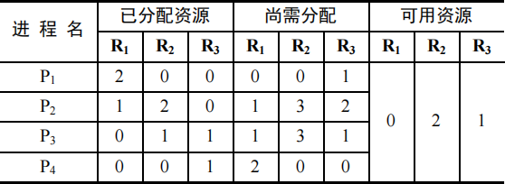

<options :options="['A. P1,P2,P3,P4', 'B. P1,P3,P2,P4', 'C. P1,P4,P3,P2', 'D. 不存在']" />

28\. 在缺页处理过程中，操作系统执行的操作可能是 (&emsp;)。

<options :options="['Ⅰ. 修改页表&emsp;Ⅱ. 磁盘I/O&emsp;Ⅲ. 分配页框']" /> 

<options :options="['A. 仅Ⅰ、Ⅱ', 'B. 仅Ⅱ', 'C. 仅Ⅲ', 'D. Ⅰ、Ⅱ、Ⅲ']" />

29\. 当系统发生抖动(thrashing)时，可以采取的有效措施是 (&emsp;)。

<options :options="['Ⅰ. 撤销部分进程&emsp;Ⅱ. 增加磁盘交换区的容量&emsp;Ⅲ. 提高用户进程的优先级']" /> 

<options :options="['A. 仅Ⅰ', 'B. 仅Ⅱ', 'C. 仅Ⅲ', 'D. Ⅰ、Ⅱ']" />

30\. 在虚拟内存管理中，地址变换机构将逻辑地址变换为物理地址，形成该逻辑地址的阶段是 (&emsp;)。

<options :options="['A. 编辑', 'B. 编译', 'C. 链接', 'D. 装载']" />

31\. 某文件占10个磁盘块，现要把该文件的磁盘块逐个读入主存缓冲区，并且送到用户区进行分析，假设一个缓冲区与一个磁盘块大小相同，把一个磁盘块读入缓冲区的时间为100μs，将缓冲区的数据传送到用户区的时间是50μs，CPU对一块数据进行分析的时间为50μs。在单缓冲区和双缓冲区结构下，读入并分析完该文件的时间分别是 (&emsp;)。

<options :options="['A. 1500μs, 1000μs', 'B. 1550μs, 1100μs', 'C. 1550μs, 1550μs', 'D. 2000μs, 2000μs']" />

32\. 有两个并发执行的进程P1和P2，共享初值为1的变量X。P1对x加1，P2对x减1。加1和减1操作的指令序列分别如下所示。
<pre>
//加1操作                         //减1操作
load R1, x  //取x到寄存器R1中     load R2, x  //取x到寄存器R2中
inc R1                            dec R2
store x, R1 //将R1的内容存入x     store x, R2 //将R2的内容存入x
</pre>
两个操作完成后，x的值 (&emsp;)。

<options :options="['A. 可能为-1或3', 'B. 只能为1', 'C. 可能为 0、1或2', 'D. 可能为-1、0、1或2']" />

33\. TCP/IP模型的网络层提供的是 (&emsp;)。

<options :options="['A. 无连接不可靠的数据报服务', 'B. 无连接可靠的数据报服务']" />
<options :options="['C. 有连接不可靠的虚电路服务', 'D. 有连接可靠的虚电路服务']" />

34\. 若某通信链路的数据传输速率为2400b/s，采用4个相位调制，则该链路的波特率是 (&emsp;)。

<options :options="['A. 600Baud', 'B. 1200Baud', 'C. 4800Baud', 'D. 9600Baud']" />

35\. 数据链路层采用选择重传协议（SR）传输数据，发送方已发送0~3号数据帧，现已收到1号帧的确认，而0、2号帧依次超时，则此时需要重传的帧数是 (&emsp;)。

<options :options="['A. 1', 'B. 2', 'C. 3', 'D. 4']" />

36\. 下列选项中，对正确接收到的数据顿进行确认的MAC协议是 (&emsp;)。

<options :options="['A. CSMA', 'B. CDMA', 'C. CSMA/CD', 'D. CSMA/CA']" />

37\. 某网络拓扑如下图所示，路由器R1只有到达子网192.168.1.0/24的路由。为使R1可以将IP分组正确地路由到图中的所有子网，在R1中需要增加的一条路由（目的网络，子网掩码，下一跳）是 (&emsp;)。

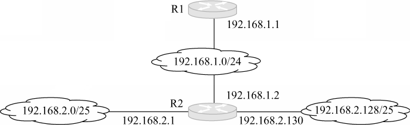

<options :options="['A. 192.168.2.0, 255.255.255.128, 192.168.1.1']" />
<options :options="['B. 192.168.2.0, 255.255.255.0, 192.168.1.1']" />
<options :options="['C. 192.168.2.0, 255.255.255.128, 192.168.1.2']" />
<options :options="['D. 192.168.2.0, 255.255.255.0, 192.168.1.2']" />

38\. 在子网192.168.4.0/30中，能接收目的地址为192.168.4.3的IP分组的最大主机数是 (&emsp;)。

<options :options="['A. 0', 'B. 1', 'C. 2', 'D. 4']" />

39\. 主机甲向主机乙发送一个(SYN=1, seq=11220)的TCP段，期望与主机乙建立TCP连接，若主机乙接收该连接请求，则主机乙向主机甲发送的正确的TCP段可能是 (&emsp;)。

<options :options="['A. (SYN=0, ACK=0, seq=11221, ack=11221)']" />
<options :options="['B. (SYN=1, ACK=1, seq=11220, ack=11220)']" />
<options :options="['C. (SYN=1, ACK=1, seq=11221, ack=11221)']" />
<options :options="['D. (SYN=0, ACK=0, seq=11220, ack=11220)']" />

40\. 主机甲与主机乙之间已建立一个TCP连接，主机甲向主机乙发送了3个连续的TCP段，分别包含300B、400B和500B的有效载荷，第3个段的序号为900。若主机乙仅正确接收到第1个段和第3个段，则主机乙发送给主机甲的确认序号是 (&emsp;)。

<options :options="['A. 300', 'B. 500', 'C. 1200', 'D. 1400']" />

</question>

二、综合应用题：第41~47题，共70分。{.custom-h3}

<question>

41\．(8分) 已知有6个顶点（顶点编号为0~5）的有向带权图G，其邻接矩阵A为上三角矩阵，按行为主序（行优先）保存在如下的一维数组中。
【图】
要求：
1) 写出图G的邻接矩阵A。
2) 画出有向带权图G。
3) 求图G的关键路径，并计算该关键路径的长度。

42\. (15分) 一个长度为L(L≥1)的升序序列S，处在第⌈L/2⌉个位置的数称为S的中位数。例如，若序列S1=(11,13,15,17,19)，则S1的中位数是15。两个序列的中位数是含它们所有元素的升序序列的中位数。例如，若S2=(2,4,6,8,20)，则S1和S2的中位数是11。现有两个等长升序序列A和B，试设计一个在时间和空间两方面都尽可能高效的算法，找出两个序列A和B的中位数。要求：
1) 给出算法的基本设计思想。
2) 根据设计思想，采用C、C++或Java语言描述算法，关键之处给出注释。
3) 说明你所设计算法的时间复杂度和空间复杂度。

43\. (11分) 假定在一个8位字长的计算机中运行如下C程序段：
<pre>
unsigned int x=134;
unsigned int y=246;
int m=x;
int n=y;
unsigned int z1=x-y;
unsigned int z2=x+y;
int k1=m-n;
int k2=m+n;
</pre>
若编译器编译时将8个8位寄存器R1~R8分别分配给变量x、y、m、n、z1、z2、k1和k2。请回答下列问题。（提示：带符号整数用补码表示）
1) 执行上述程序段后，寄存器R1、R5和R6的内容分别是什么？（用十六进制表示）
2) 执行上述程序段后，变量m和k1的值分别是多少？（用十进制表示）
3) 上述程序段涉及带符号整数加/减、无符号整数加/减运算，这四种运算能否利用同一个加法器及辅助电路实现？简述理由。
4) 计算机内部如何判断带符号整数加/减运算的结果是否发生溢出？上述程序段中，哪些带符号整数运算语句的执行结果会发生溢出？

44\. (12分) 某计算机存储器按字节编址，虚拟（逻辑）地址空间大小为16MB，主存(物理)地址空间大小为1MB，页面大小为4KB：Cache采用直接映射方式，共8行：主存与Cache之间交换的块大小为32B。系统运行到某一时刻时，页表的部分内容和Cache的部分内容分别如题44-a图、题44-b图所示，图中页框号及标记字段的内容为十六进制形式。

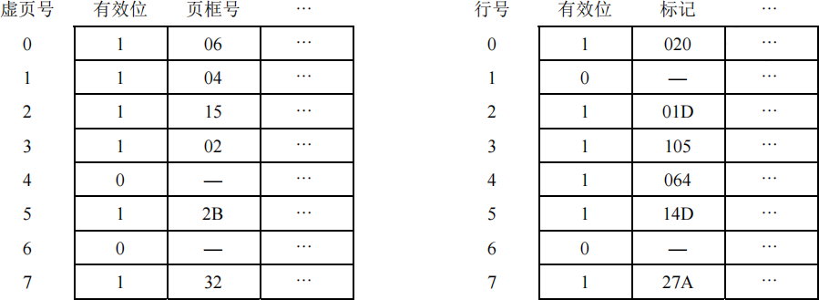

请回答下列问题：
1) 虚拟地址共有几位，哪几位表示虚页号？物理地址共有几位，哪几位表示页框号（物理页号）？
2) 使用物理地址访问Cache时，物理地址应划分成哪几个字段？要求说明每个字段的位数及在物理地址中的位置。
3) 虚拟地址001C60H所在的页面是否在主存中？若在主存中，则该虚拟地址对应的物理地址是什么？访问该地址时是否Cache命中？要求说明理由。
4) 假定为该机配置一个4路组相联的TLB，该TLB共可存放8个页表项，若其当前内容（十六进制）如题44-c图所示，则此时虚拟地址024BACH所在的页面是否在主存中？要求说明理由。

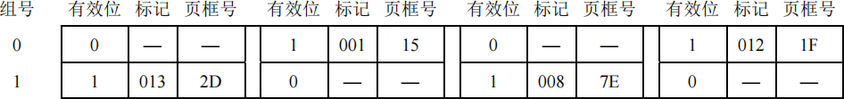

45\. (8分)
某银行提供1个服务窗口和10个供顾客等待的座位。顾客到达银行时，若有空座位，则到取号机上领取一个号，等待叫号。取号机每次仅允许一位顾客使用。当营业员空闲时，通过叫号选取一位顾客，并为其服务。顾客和营业员的活动过程描述如下：
<pre>
cobegin
{
  process 顾客i
  {
    从取号机获取一个号码；
    等待叫号；
    获取服务；
  }
  process 营业员
  {
    while (TRUE)
    {
      叫号；
      为顾客服务；
    }
  }
} coend
</pre>
请添加必要的信号量和P、V（或wait()、signal()）操作，实现上述过程中的互斥与同步。要求写出完整的过程，说明信号量的含义并赋初值。

46\. (7分) 某文件系统为一级目录结构，文件的数据一次性写人磁盘，已写人的文件不可修改，但可多次创建新文件。请回答如下问题：
1) 在连续、链式、索引三种文件的数据块组织方式中，哪种更合适？要求说明理由。为定位文件数据块，需要 FCB 中设计哪些相关描述字段？
2) 为快速找到文件，对于FCB，是集中存储好，还是与对应的文件数据块连续存储好？要求说明理由。

47\. (9分) 某主机的MAC地址为00-15-C5-C1-5E-28，IP地址为10.2.128.100（私有地址）。下图(a)是网络拓扑，下图(b)是该主机进行Web请求的1个以太网数据顿前80B的十六进制及ASCII码内容。
【图】

1) Web服务器的IP地址是什么？该主机的默认网关的MAC地址是什么？
2) 该主机在构造图(b)所示的数据帧时，使用什么协议确定目的MAC地址？封装该协议请求报文的以太网帧的目的MAC地址是什么？
3) 假设HTTP/1.1协议以持续的非流水线方式工作，一次请求-响应时间为RTT，rfc.html页面引用了5个JPEG小图像，则从发出如图(b)所示的Web请求开始到浏览器收到全部内容为止，需要多少个RTT？
4) 该帧所封装的IP分组经过路由器R转发时，需修改IP分组头中的哪些字段？
【图】

</question>

## 2012年计算机学科专业基础试题 {.custom-h2}

一、单项选择题：第1~40小题，每小题2分，共80分。下列每题给出的四个选项中，只有一个选项最符合试题要求。 {.custom-h3}

<question>

1\. 求整数n（n≥0）的阶乘的算法如下，其时间复杂度是 (&emsp;)。
<pre>
int fact(int n){
  if(n<=l) return 1;
  return n*fact(n-l);
}
</pre>
<options :options="['A. O(log2n)', 'B. O(n)', 'C. O(nlog2n)', 'D. O(n2)']" />

2\. 已知操作符包括“+”、“-”、“\*”、“/”、“(”和“)”。将中缀表达式 a+b-a\*c+d/e-f+g 转换为等价的后缀表达式 ab+acd+e/f-\*-g+ 时，用栈来存放暂时还不能确定运算次序的操作符。栈初始时为空时，转换过程中同时保存在栈中的操作符的最大个数是 (&emsp;)。

<options :options="['A. 5', 'B. 7', 'C. 8', 'D. 11']" />

3\. 若一棵二叉树的前序遍历序列为a,e,b,d,c，后序遍历序列为b,c,d,e,a，则根结点的孩子结点 (&emsp;)。

<options :options="['A. 只有e', 'B. 有e、b', 'C. 有e、c', 'D. 无法确定']" />

4\. 若平衡二叉树的高度为6，且所有非叶结点的平衡因子均为1，则该平衡二叉树的结点总数为 (&emsp;)。

<options :options="['A. 12', 'B. 20', 'C. 32', 'D. 33']" />

5\. 对有n个顶点、e条边且使用邻接表存储的有向图进行广度优先遍历, 其算法的时间复杂度是 (&emsp;)。

<options :options="['A. O(n)', 'B. O(e)', 'C. O(n+e)', 'D. O(ne)']" />

6\. 若用邻接矩阵存储有向图，矩阵中主对角线以下的元素均为零，则关于该图拓扑序列的结论是 (&emsp;)。

<options :options="['A. 存在，且唯一', 'B. 存在，且不唯一']" />
<options :options="['C. 存在，可能不唯一', 'D. 无法确定是否存在']" />

7\. 对下图所示的有向带权图，若采用Dijkstra算法求从源点a到其他各顶点的最短路径，则得到的第一条最短路径的目标顶点是b，第二条最短路径的目标顶点是c，后续得到的其余各最短路径的目标顶点依次是 (&emsp;)。

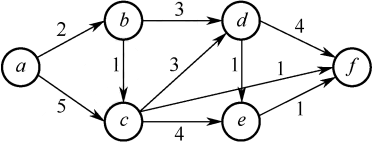

<options :options="['A. d,e,f', 'B. e,d,f', 'C. f,d,e', 'D. f,e,d']" />

8\. 下列关于最小生成树的叙述中，正确的是 (&emsp;)。

<options :options="['Ⅰ. 最小生成树的代价唯一']" />
<options :options="['Ⅱ. 所有权值最小的边一定会出现在所有的最小生成树中']" />
<options :options="['Ⅲ. 使用Prim 算法从不同顶点开始得到的最小生成树一定相同']" />
<options :options="['Ⅳ. 使用Prim 算法和Kruskal 算法得到的最小生成树总不相同']" /> 

<options :options="['A. 仅Ⅰ', 'B. 仅Ⅱ', 'C. 仅Ⅰ、Ⅲ', 'D. 仅Ⅱ、Ⅳ']" />

9\. 已知一棵3阶B树，如下图所示。删除关键字78得到一棵新B树，其最右叶结点中的关键字是 (&emsp;)。

<options :options="['A. 60', 'B. 60, 62', 'C. 62, 65', 'D. 65']" />

10\. 在内部排序过程中，对尚未确定最终位置的所有元素进行一遍处理称为一趟排序。下列排序方法中，每趟排序结束都至少能够确定一个元素最终位置的方法是 (&emsp;)。

<options :options="['Ⅰ. 简单选择排序']" />
<options :options="['Ⅱ. 希尔排序']" />
<options :options="['Ⅲ. 快速排序']" />
<options :options="['Ⅳ. 堆排序']" />
<options :options="['Ⅴ. 二路归并排序']" /> 

<options :options="['A. 仅Ⅰ、Ⅲ、Ⅳ', 'B. 仅Ⅰ、Ⅲ、Ⅴ', 'C. 仅ⅠⅠ、Ⅲ、Ⅳ', 'D. 仅Ⅲ、Ⅳ、Ⅴ']" />

11\. 对同一待排序序列分别进行折半插入排序和直接插入排序，两者之间可能的不同之处是 (&emsp;)。

<options :options="['A. 排序的总趟数', 'B. 元素的移动次数']" width="70%" />
<options :options="['C. 使用辅助空间的数量', 'D. 元素之间的比较次数']" />

12\. 假定基准程序A在某计算机上的运行时间为100s，其中90s为CPU时间，其余为I/O时间。若CPU速度提高50%，I/O速度不变，则运行基准程序A所耗费的时间是 (&emsp;)。

<options :options="['A. 55s', 'B. 60s', 'C. 65s', 'D. 70s']" />

13\. 假定编译器规定int和short型长度分别为32位和16位，执行下列C语言语句：
<pre>
unsigned short x=65530;
unsigned int y=x;
</pre>
得到y的机器数为 (&emsp;)。

<options :options="['A. 0000 7FFAH', 'B. 0000 FFFAH', 'C. FFFF 7FFAH', 'D. FFFF FFFAH']" />

14\. float类型（即IEEE754单精度浮点数格式）能表示的最大正整数是 (&emsp;)。

<options :options="['A. 2126 - 2103', 'B. 2127 - 2104', 'C. 2127 - 2103', 'D. 2128 - 2104']" />

15\. 某计算机存储器按字节编址，采用小端方式存放数据。假定编译器规定int型和short型长度分别为32位和16位，并且数据按边界对齐存储。某C语言程序段如下：
<pre>
struct {
  int a;
  char b;
  short c;
} record;
record.a=273;
</pre>
若record变量的首地址为0xC008，地址0xC008中的内容及record.c的地址分别为 (&emsp;)。

<options :options="['A. 0x00,0xC00D', 'B. 0x00,0xC00E', 'C. 0x11,0xC00D', 'D. 0x11,0xC00E']" />

16\. 下列关于闪存(Flash Memory)的叙述中，错误的是 (&emsp;)。

<options :options="['A. 信息可读可写，并且读、写速度一样快']" />
<options :options="['B. 存储元由MOS管组成，是一种半导体存储器']" />
<options :options="['C. 掉电后信息不丢失，是一种非易失性存储器']" />
<options :options="['D. 采用随机访问方式，可替代计算机外部存储器']" />

17\. 假设某计算机按字编址，Cache有4行，Cache和主存之间交换的块大小为1个字。若Cache的内容初始为空，采用2路组相联映射方式和LRU算法，则访问的主存地址依次为0,4,8,2,0,6,8,6,4,8时，命中Cache的次数是 (&emsp;)。

<options :options="['A. 1', 'B. 2', 'C. 3', 'D. 4']" />

18\. 某计算机的控制器采用微程序控制方式，微指令中的操作控制字段采用字段直接编码法，共有33个微命令，构成5个互斥类，分别包含7、3、12、5和6个微命令，则操作控制字段至少有 (&emsp;)。

<options :options="['A. 5位', 'B. 6位', 'C. 15位', 'D. 33位']" />

19\. 某同步总线的时钟频率为100MHz，宽度为32位，地址/数据线复用，每传输一个地址或数据占用一个时钟周期。若该总线支持突发（猝发）传输方式，则一次“主存写”总线事务传输128位数据所需要的时间至少是 (&emsp;)。

<options :options="['A. 20ns', 'B. 40ns', 'C. 50ns', 'D. 80ns']" />

20\. 下列关于USB总线特性的描述中，错误的是 (&emsp;)。

<options :options="['A. 可实现外设的即插即用和热拔插']" />
<options :options="['B. 可通过级联方式连接多台外设']" />
<options :options="['C. 是一种通信总线，连接不同外设']" />
<options :options="['D. 同时可传输2位数据，数据传输率高']" />

21\. 下列选项中，在I/O总线的数据线上传输的信息包括 (&emsp;)。

<options :options="['I. I/O接口中的命令字&emsp;Ⅱ. I/O接口中的状态字&emsp;Ⅲ. 中断类型号']" /> 

<options :options="['A. 仅Ⅰ、Ⅱ', 'B. 仅Ⅰ、Ⅲ', 'C. 仅Ⅱ、ⅢI', 'D. Ⅰ、Ⅱ、Ⅲ']" />

22\. 响应外部中断的过程中，中断隐指令完成的操作，除保护断点外，还包括 (&emsp;)。

<options :options="['Ⅰ. 关中断']" />
<options :options="['Ⅱ. 保存通用寄存器的内存']" />
<options :options="['Ⅲ. 形成中断服务程序入口地址并送PC']" /> 

<options :options="['A. 仅Ⅰ、Ⅱ', 'B. 仅Ⅰ、Ⅲ', 'C. 仅Ⅱ、Ⅲ', 'D. Ⅰ、Ⅱ、Ⅲ']" />

23\. 下列选项中，不可能在用户态发生的事件是 (&emsp;)。

<options :options="['A. 系统调用', 'B. 外中断', 'C. 进程切换', 'D. 缺页']" />

24\. 中断处理和子程序调用都需要压栈，以便保护现场，中断处理一定会保存而子程序调用不需要保存其内容的是 (&emsp;)。

<options :options="['A. 程序计数器', 'B. 程序状态字寄存器', 'C. 通用数据寄存器', 'D. 通用地址寄存器']" />

25\. 下列关于虚拟存储器的叙述中，正确的是 (&emsp;)。

<options :options="['A. 虚拟存储只能基于连续分配技术']" />
<options :options="['B. 虚拟存储只能基于非连续分配技术']" />
<options :options="['C. 虚拟存储容量只受外存容量的限制']" />
<options :options="['D. 虚拟存储容量只受内存容量的限制']" />

26\. 操作系统的I/O子系统通常由四个层次组成，每一层明确定义了与邻近层次的接口。其合理的层次组织排列顺序是 (&emsp;)。
    A. 用户级I/O软件、设备无关软件、设备驱动程序、中断处理程序
    B. 用户级I/O软件、设备无关软件、中断处理程序、设备驱动程序
    C. 用户级I/O软件、设备驱动程序、设备无关软件、中断处理程序
    D. 用户级I/O软件、中断处理程序、设备无关软件、设备驱动程序

27\. 假设5个进程P0、P1、P2、P3、P4共享三类资源R1、R2、R3，这些资源总数分别为18、6、22。T0时刻的资源分配情况如下表所示，此时存在的一个安全序列是 (&emsp;)。

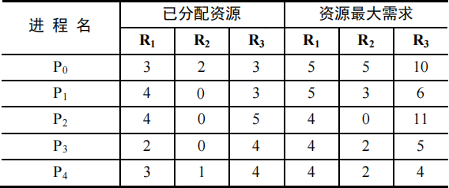

<options :options="['A. P0, P2, P4, P1, P3']" />
<options :options="['B. P1, P0, P3, P4, P2']" />
<options :options="['C. P2, P1, P0, P3, P4']" />
<options :options="['D. P3, P4, P2, P1, P0']" />

28\. 若一个用户进程通过read系统调用读取一个磁盘文件中的数据，则下列关于此过程的叙述中，正确的是 (&emsp;)。

<options :options="['Ⅰ. 若该文件的数据不在内存，则该进程进入睡眠等待状态']" />
<options :options="['Ⅱ. 请求read系统调用会导致CPU从用户态切换到核心态']" />
<options :options="['Ⅲ. read系统调用的参数应包含文件的名称']" /> 

<options :options="['A. 仅Ⅰ、Ⅱ', 'B. 仅Ⅰ、Ⅲ', 'C. 仅Ⅱ、Ⅲ', 'D. Ⅰ、Ⅱ和Ⅲ']" />

29\. 一个多道批处理系统中仅有P1和P2两个作业，P2比P1晚5ms到达，它们的计算和IO操作顺序如下： 
P1：计算 60ms，I/O 80ms，计算 20ms 
P2：计算 120ms，I/O 40ms，计算 40ms 
若不考虑调度和切换时间，则完成两个作业需要的时间最少是 (&emsp;)。

<options :options="['A. 240ms', 'B. 260ms', 'C. 340ms', 'D. 360ms']" />

30\. 若某单处理器多进程系统中有多个就绪态进程，则下列关于处理机调度的叙述中，错误的是 (&emsp;)。

<options :options="['A. 在进程结束时能进行处理机调度']" />
<options :options="['B. 创建新进程后能进行处理机调度']" />
<options :options="['C. 在进程处于临界区时不能进行处理机调度']" />
<options :options="['D. 在系统调用完成并返回用户态时能进行处理机调度']" />

31\. 下列关于进程和线程的叙述中，正确的是 (&emsp;)。

<options :options="['A. 不管系统是否支持线程，进程都是资源分配的基本单位']" />
<options :options="['B. 线程是资源分配的基本单位，进程是调度的基本单位']" />
<options :options="['C. 系统级线程和用户级线程的切换都需要内核的支持']" />
<options :options="['D. 同一进程中的各个线程拥有各自不同的地址空间']" />

32\. 下列选项中，不能改善磁盘设备I/O性能的是 (&emsp;)。

<options :options="['A. 重排I/O请求次序']" />
<options :options="['B. 在一个磁盘上设置多个分区']" />
<options :options="['C. 预读和滞后写']" />
<options :options="['D. 优化文件物理块的分布']" />

33\. 在TCP/IP体系结构中，直接为ICMP提供服务的协议是 (&emsp;)。

<options :options="['A. PPP', 'B. IP', 'C. UDP', 'D. TCP']" />

34\. 在物理层接口特性中，用于描述完成每种功能的事件发生顺序的是 (&emsp;)。

<options :options="['A. 机械特性', 'B. 功能特性', 'C. 过程特性', 'D. 电气特性']" />

35\. 以太网的MAC协议提供的是 (&emsp;)。

<options :options="['A. 无连接的不可靠服务', 'B. 无连接的可靠服务']" width="70%" />
<options :options="['C. 有连接的可靠服务', 'D. 有连接的不可靠服务']" width="72%" />

36\. 两台主机之间的数据链路层采用后退N协议（GBN）传输数据，数据传输速率为16kb/s，单向传播时延为270ms，数据帧长范围是128~512字节，接收方总是以与数据帧等长的帧进行确认。为使信道利用率达到最高，帧序号的比特数至少为 (&emsp;)。

<options :options="['A. 5', 'B. 4', 'C. 3', 'D. 2']" />

37\. 下列关于IP路由器功能的描述中，正确的是 (&emsp;)。

<options :options="['Ⅰ. 运行路由协议,设备路由表']" />
<options :options="['Ⅱ. 监测到拥塞时,合理丢弃IP分组']" />
<options :options="['Ⅲ. 对收到的IP分组头进行差错检验,确保传输的IP分组不丢失']" />
<options :options="['Ⅳ. 根据收到的IP分组的目的IP地址,将其转发到合适的输出线路上']" /> 

<options :options="['A. 仅Ⅲ、Ⅳ', 'B. 仅Ⅰ、Ⅱ、Ⅲ', 'C. 仅Ⅰ、Ⅱ、Ⅳ', 'D. Ⅰ、Ⅱ、Ⅲ、Ⅳ']" />

38\. ARP协议的功能是 (&emsp;)。

<options :options="['A. 根据IP地址查询MAC地址', 'B. 根据MAC地址查询IP地址']"  width="81%" />
<options :options="['C. 根据域名查询IP地址', 'D. 根据IP地址查询域名']" />

39\. 某主机的IP地址为180.80.77.55，子网掩码为255.255.252.0。若该主机向其所在子网发送广播分组，则目的地址可以是 (&emsp;)。

<options :options="['A. 180.80.76.0', 'B. 180.80.76.255', 'C. 180.80.77.255', 'D. 180.80.79.255']" />

40\. 若用户1与用户2之间发送和接收电子邮件的过程如下图所示，则图中①、②、③阶段分别使用的应用层协议可以是 (&emsp;)。

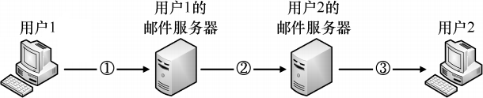

</question>

二、综合应用题：第41~47题，共70分。{.custom-h3}

<question>

41\. (10分) 设有6个有序表A、B、C、D、E、F，分别含有10、35、40、50、60和200个数据元素，各表中元素按升序排列。要求通过5次两两合并，将6个表最终合并成一个升序表，并在最坏情况下比较的总次数达到最小。请回答下列问题。
1) 给出完整的合并过程，并求出最坏情况下比较的总次数。
2) 根据你的合并过程，描述n(n≥2)个不等长升序表的合并策略，并说明理由。

42\. (13分) 假定采用带头结点的单链表保存单词，当两个单词有相同的后缀时，则可共享相同的后缀存储空间，例如，“loading”和“being”的存储映像如下图所示。
【图】
设str1和str2分别指向两个单词所在单链表的头结点，链表结点结构为【图】，请设计一个时间上尽可能高效的算法，找出由str1和str2所指向两个链表共同后缀的起始位置（如图中字符i所在结点的位置p）。要求：
1) 给出算法的基本设计思想。
2) 根据设计思想，采用C或C++或Java语言描述算法，关键之处给出注释。
3) 说明你所设计算法的时间复杂度和空间复杂度。

43\. (11分) 假定某计算机的CPU主频为80MHz，CPI为4，平均每条指令访存1.5次，主存与Cache之间交换的块大小为16B，Cache的命中率为99%，存储器总线宽度为32位。请回答下列问题。（注：此(2)的第2小问与(3)跟存储器内容无关，会放到后面章节讲解）
1) 该计算机的MIPS数是多少？平均每秒Cache缺失的次数是多少？在不考虑DMA传送的情况下，主存带宽至少达到多少才能满足CPU的访存要求？
2) 假定在Cache缺失的情况下访问主存时，存在0.0005%的缺页率，则CPU平均每秒产生多少次缺页异常？
4) 为了提高性能，主存采用4体交叉存储模式，工作时每1/4个存储周期启动一个体。若每个体的存储周期为50ns，则该主存能提供的最大带宽是多少？

44\. (12分) 某16位计算机中，带符号整数用补码表示，数据Cache和指令Cache分离。下表给出了指令系统中部分指令格式，其中Rs和Rd表示寄存器，mem表示存储单元地址，(x)表示寄存器x或存储单元x的内容。

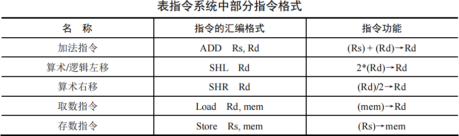

该计算机采用5段流水方式执行指令，各流水段分别是取指(IF)、译码/读寄存器(ID)、执行/计算有效地址(EX)、访问存储器(M)和结果写回寄存器(WB)，流水线采用“按序发射，按序完成”方式，没有采用转发技术处理数据相关，并且同一个寄存器的读和写操作不能在同一个时钟周期内进行。请回答下列问题：
1) 若int型变量x的值为-513，存放在寄存器R1中，则执行指令“SHR R1”后，R1的内容是多少（用十六进制表示）？
2) 若某个时间段中，有连续的4条指令进入流水线，在其执行过程中没有发生任何阻塞，则执行这4条指令所需的时钟周期数为多少？
3) 若高级语言程序中某赋值语句为x=a+b，x、a和b均为int型变量，它们的存储单元地址分别表示为[x]、[a]和[b]。该语句对应的指令序列及其在指令流水线中的执行过程如下图所示。
<pre>
I1 LOAD R1, [a]
I2 LOAD R2, [b]
I3 ADD R1, R2
I4 STORE R2, [x]
</pre>
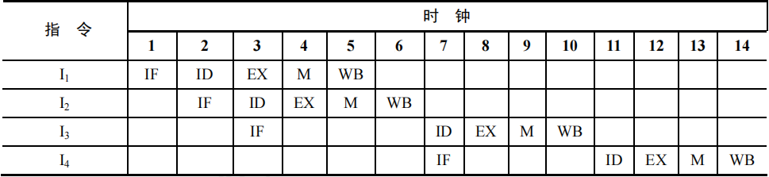

则这4条指令执行过程中，I3的ID段和I4的IF段被阻塞的原因各是什么？ 
4) 若高级语言程序中某赋值语句为x=x*2+a，x 和a均为unsigned int类型变量，它们的存储单元地址分别表示为[x]、[a]，则执行这条语句至少需要多少个时钟周期？要求模仿题44图画出这条语句对应的指令序列及其在流水线中的执行过程示意图。

45\. (7分) 某请求分页系统的局部页面置换策略如下：系统从0时刻开始扫描，每隔5个时间单位扫描一轮驻留集（扫描时间忽略不计），本轮没有被访问过的页框将被系统回收，并放入到空闲页框链尾，其中内容在下一次分配之前不被清空。当发生缺页时，如果该页曾被使用过且还在空闲页链表中，那么重新放回进程的驻留集中；否则，从空闲页框链表头部取出一个页框。
假设不考虑其他进程的影响和系统开销。初始时进程驻留集为空。目前系统空闲页框链表中页框号依次为32、15、21、41。进程P依次访问的<虚拟页号，访问时刻>是<1,1>，<3,2>，<0,4>，<0,6>，<1,11>，<0,13>，<2,14>。请回答下列问题。
1) 访问<0,4>时，对应的页框号是什么？说明理由。
2) 访问<1,11>时，对应的页框号是什么？说明理由。
3) 访问<2,14>时，对应的页框号是什么？说明理由。
4) 该策略是否适合于时间局部性好的程序？说明理由。

46\. (8分) 某文件系统空间的最大容量为4TB(1TB=240B),以磁盘块为基本分配单位。磁盘块大
小为1KB。文件控制块(FCB)包含一个512B的索引表区。请回答下列问题。
1) 假设索引表区仅采用直接索引结构，索引表区存放文件占用的磁盘块号，索引表项中块号最少占多少字节？可支持的单个文件最大长度是多少字节？
2) 假设索引表区采用如下结构：第0~7字节采用<起始块号，块数>格式表示文件创建时预分配的连续存储空间，其中起始块号占6B,块数占2B;剩余504字节采用直接索引结构，一个索引项占6B,那么可支持的单个文件最大长度是多少字节？为了使单个文件的长度达到最大，请指出起始块号和块数分别所占字节数的合理值并说明理由。

47\. (9分) 主机H通过快速以太网连接Internet，IP地址为192.168.0.8，服务器S的IP地址为211.68.71.80。H与S使用TCP通信时，在H上捕获的其中5个IP分组如题47-a表所示。
【图】
回答下列问题。
1) 题47-a表中的IP分组中，哪几个是由H发送的？哪几个完成了TCP连接建立过程？哪几个在通过快速以太网传输时进行了填充？
2) 根据题47-a表中的IP分组，分析S已经收到的应用层数据字节数是多少？
3) 若题47-a表中的某个IP分组在S发出时的前40字节如题47-b表所示，则该IP分组到达H时经过了多少个路由器？
【图】

</question>

## 2013年计算机学科专业基础试题 {.custom-h2}

一、单项选择题：第1~40小题，每小题2分，共80分。下列每题给出的四个选项中，只有一个选项最符合试题要求。 {.custom-h3}

<question>

1\. 已知两个长度分别为m和n的升序链表，若将它们合并为一个长度为m+n的降序链表，则最坏情况下的时间复杂度是 (&emsp;)。

<options :options="['A. O(n)', 'B. O(mn)', 'C. O(min(m, n))', 'D. O(max(m, n))']" />

2\. 一个栈的入栈序列为1,2,3,…,n，出栈序列是P1,P2,P3,…,Pn。若P2=3，则P3可能取值的个数是 (&emsp;)。

<options :options="['A. n-3', 'B. n-2', 'C. n-1', 'D. 无法确定']" />

3\. 若将关键字1,2,3,4,5,6,7依次插入到初始为空的平衡二叉树T中，则T中平衡因子为0的非叶结点的个数是 (&emsp;)。

<options :options="['A. 0', 'B. 1', 'C. 2', 'D. 3']" />

4\. 已知三叉树T中6个叶结点的权分别是2,3,4,5,6,7，T的带权（外部）路径长度最小是 (&emsp;)。

<options :options="['A. 27', 'B. 46', 'C. 54', 'D. 56']" />

5\. 若X是后序线索二叉树中的叶结点，且X存在左兄弟结点Y，则X的右线索指向的是 (&emsp;)。

<options :options="['A. X的父结点', 'B. 以Y为根的子树的最左下结点']" />
<options :options="['C. X的左兄弟结点Y', 'D. 以Y为根的子树的最右下结点']" />

6\. 在任意一棵非空二叉排序树T1中，删除某结点v之后形成二叉排序树T2，再将v插入T2形成二叉排序树T3。下列关于T1与T3的叙述中，正确的是 (&emsp;)。

<options :options="['Ⅰ. 若v是T1的叶结点，则T1与T3不同']" />
<options :options="['Ⅱ. 若v是T1的叶结点，则T1与T3相同']" />
<options :options="['Ⅲ. 若v不是T1的叶结点，则T1与T3不同']" />
<options :options="['Ⅳ. 若v不是T1的叶结点，则T1与T3相同']" /> 

<options :options="['A. 仅Ⅰ、III', 'B. 仅Ⅰ、IV', 'C. 仅ⅠⅠ、III', 'D. 仅ⅠⅠ、IV']" />

7\. 设图的邻接矩阵A如下所示, 各顶点的度依次是 (&emsp;)。

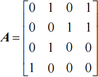

<options :options="['A. 1,2,1,2', 'B. 2,2,1,1', 'C. 3,4,2,3', 'D. 4,4,2,2']" />

8\. 若对如下无向图进行遍历, 则下列选项中, 不是广度优先遍历序列的是 (&emsp;)。

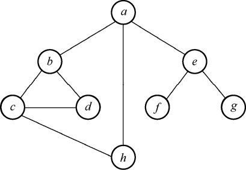

<options :options="['A. h,c,a,b,d,e,g,f', 'B. e,a,f,g,b,h,c,d', 'C. d,b,c,a,h,e,f,g', 'D. a,b,c,d,h,e,f,g']" />

9\. 下列AOE网表示一项包含8个活动的工程。通过同时加快若干活动的进度可以缩短整个工程的工期。下列选项中，加快其进度就可以缩短工程工期的是 (&emsp;)。

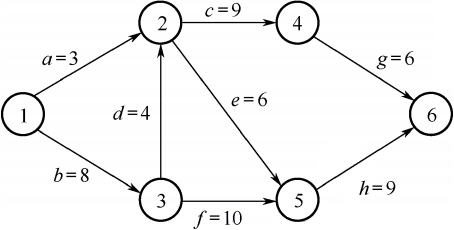

<options :options="['A. c和e', 'B. d和c', 'C. f和d', 'D. f和h']" />

10\. 在一棵高度为2的5阶B树中，所含关键字的个数至少是 (&emsp;)。

<options :options="['A. 5', 'B. 7', 'C. 8', 'D. 14']" />

11\. 对给定的关键字序列110,119,007,911,114,120,122进行基数排序，则第 2趟分配收集后得到的关键字序列是 (&emsp;)。

<options :options="['A.007,110,119,114,911,120,122']" />
<options :options="['C.007,110,911,114,119,120,122']" />
<options :options="['B.007,110,119,114,911,122,120']" />
<options :options="['D.110,120,911,122,114,007,119']" />

12\. 某计算机主频为1.2GHz，其指令分为4类，它们在基准程序中所占比例及CPI如下表所示。该机的MIPS数是 (&emsp;)。

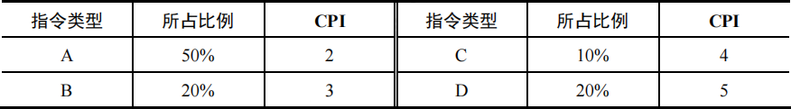

<options :options="['A. 100', 'B. 200', 'C. 400', 'D. 600']" />

13\. 某数采用IEEE754单精度浮点数格式表示为C640 0000H，则该数的值是 (&emsp;)。

<options :options="['A. -1.5×213', 'B. -1.5×212', 'C. -0.5×213', 'D. -0.5×212']" />

14\. 某字长为8位的计算机中，已知整型变量x、y的机器数分别为[x]补=11110100，[y]补=10110000，若整型变量z=2x+y/2则z的机器数为 (&emsp;)。

<options :options="['A. 11000000', 'B. 00100100', 'C. 10101010', 'D. 溢出']" />

15\. 用海明码对长度为8位的数据进行检/纠错时，若能纠正一位错，则校验位数至少为 (&emsp;)。

<options :options="['A. 2', 'B. 3', 'C. 4', 'D. 5']" />

16\. 某计算机主存地址空间大小为256MB,按字节编址。虚拟地址空间大小为4GB,采用页式存储管理，页面大小为 4KB，TLB（快表）采用全相联映射，有4个页表项，内容如下表所示。
【图】
则对虚拟地址03FF F180H进行虚实地址变换的结果是 (&emsp;)。

<options :options="['A. 015 3180H', 'B. 003 5180H', 'C. TLB缺失', 'D. 缺页']" />

17\. 假设变址寄存器R的内容为1000H，指令中的形式地址为2000H；地址1000H中的内容为2000H，地址2000H中的内容为3000H，地址3000H中的内容为4000H，则变址寻址方式下访问到的操作数是 (&emsp;)。

<options :options="['A. 1000H', 'B. 2000H', 'C. 3000H', 'D. 4000H']" />

18\. 某CPU主频为1.03GHz，采用4级指令流水线，每个流水段的执行需要1个时钟周期。假定CPU执行了100条指令，在其执行过程中，没有发生任何流水线阻塞，此时流水线的吞吐率为 (&emsp;)。

<options :options="['A. 0.25×109条指令/秒', 'B. 0.97×109条指令/秒']" />
<options :options="['C. 1.0×109条指令/秒', 'D. 1.03×109条指令/秒']" />

19\. 下列选项中，用于设备和设备控制器（I/O接口）之间互连的接口标准是 (&emsp;)。

<options :options="['A. PCI', 'B. USB', 'C. AGP', 'D. PCI-Express']" />

20\. 下列选项中，用于提高RAID可靠性的措施有 (&emsp;)。

<options :options="['Ⅰ. 磁盘镜像&emsp;Ⅱ. 条带化&emsp;Ⅲ. 奇偶校验&emsp;Ⅳ. 增加Cache机制']" /> 

<options :options="['A. 仅Ⅰ、Ⅱ', 'B. 仅Ⅰ、Ⅲ', 'C. 仅Ⅰ、Ⅲ和Ⅳ', 'D. 仅Ⅱ、Ⅲ和Ⅳ']" />

21\. 某磁盘的转速为10000转/分，平均寻道时间是6ms，磁盘传输速率是20MB/s，磁盘控制器延迟为0.2ms，读取一个4KB的扇区所需的平均时间约为 (&emsp;)。

<options :options="['A. 9ms', 'B. 9.4ms', 'C. 12ms', 'D. 12.4ms']" />

22\. 下列关于中断I/O方式和DMA方式比较的叙述中，错误的是 (&emsp;)。

<options :options="['A. 中断I/O方式请求的是CPU处理时间，DMA方式请求的是总线使用权']" />
<options :options="['B. 中断响应发生在一条指令执行结束后，DMA响应发生在一个总线事务完成后']" />
<options :options="['C. 中断I/O方式下数据传送通过软件完成，DMA方式下数据传送由硬件完成']" />
<options :options="['D. 中断I/O方式适用于所有外部设备，DMA方式仅适用于快速外部设备']" />

23\. 用户在删除某文件的过程中，操作系统不可能执行的操作是 (&emsp;)。

<options :options="['A. 删除此文件所在的目录']" />
<options :options="['B. 删除与此文件关联的目录项']" />
<options :options="['C. 删除与此文件对应的文件控制块']" />
<options :options="['D. 释放与此文件关联的内存缓冲区']" />

24\. 为支持CD-ROM中视频文件的快速随机播放，播放性能最好的文件数据块组织方式是 (&emsp;)。

<options :options="['A. 连续结构', 'B. 链式结构', 'C. 直接索引结构', 'D. 多级索引结构']" />

25\. 用户程序发出磁盘I/O请求后，系统的处理流程是：用户程序→系统调用处理程序→设备驱动程序→中断处理程序。其中，计算数据所在磁盘的柱面号、磁头号、扇区号的程序是 (&emsp;)。

<options :options="['A. 用户程序', 'B. 系统调用处理程序', 'C. 设备驱动程序', 'D. 中断处理程序']" />

26\. 若某文件系统索引节点(inode)中有直接地址项和间接地址项，则下列选项中，与单个文件长度无关的因素是 (&emsp;)。

<options :options="['A. 索引节点的总数', 'B. 间接地址索引的级数', 'C. 地址项的个数', 'D. 文件块大小']" />

27\. 设系统缓冲区和用户工作区均采用单缓冲，从外设读入1个数据块到系统缓冲区的时间为100，从系统缓冲区读入1个数据块到用户工作区的时间为5，对用户工作区中的1个数据块进行分析的时间为90（如右图所示）。进程从外设读入并分析2个数据块的最短时间是 (&emsp;)。
【图】
<options :options="['A. 200', 'B. 295', 'C. 300', 'D. 390']" />

28\. 下列选项中，会导致用户进程从用户态切换到内核态的操作是 (&emsp;)。

<options :options="['Ⅰ. 整数除以零&emsp;Ⅱ. sin函数调用&emsp;Ⅲ. read系统调用']" /> 

<options :options="['A. 仅Ⅰ、Ⅱ', 'B. 仅Ⅰ、Ⅲ', 'C. 仅Ⅱ、Ⅲ', 'D. Ⅰ、Ⅱ和Ⅲ']" />

29\. 计算机开机后，操作系统最终被加载到 (&emsp;)。

<options :options="['A. BIOS', 'B. ROM', 'C. EPROM', 'D. RAM']" />

30\. 若用户进程访问内存时产生缺页，则下列选项中，操作系统可能执行的操作是 (&emsp;)。

<options :options="['Ⅰ. 处理越界错&emsp;Ⅱ. 置换页&emsp;Ⅲ. 分配内存']" /> 

<options :options="['A. 仅Ⅰ、Ⅱ', 'B. 仅Ⅱ、Ⅲ', 'C. 仅Ⅰ、Ⅲ', 'D. Ⅰ、Ⅱ和Ⅲ']" />

31\. 某系统正在执行三个进程P1、P2 和P3，各进程的计算(CPU)时间和I/O时间比例如下表所示。
【图】
为提高系统资源利用率，合理的进程优先级设置应为 (&emsp;)。

<options :options="['A. P1>P2>P3', 'B. P3>P2>P1', 'C. P2>P1=P3', 'D. P1>P2=P3']" />

32\. 下列关于银行家算法的叙述中，正确的是 (&emsp;)。

<options :options="['A. 银行家算法可以预防死锁']" />
<options :options="['B. 当系统处于安全状态时，系统中一定无死锁进程']" />
<options :options="['C. 当系统处于不安全状态时，系统中一定会出现死锁进程']" />
<options :options="['D. 银行家算法破坏了死锁必要条件中的“请求和保持”条件']" />

33\. 在OSI参考模型中，下列功能需由应用层的相邻层实现的是（）。

<options :options="['A. 对话管理', 'B. 路由选择', 'C. 数据格式转换', 'D. 可靠数据传输']" />

34\. 下图为10Base-T网卡接收到的信号波形，则该网卡收到的比特串是 (&emsp;)。

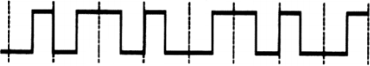

<options :options="['A. 0011 0110', 'B. 1010 1101']" width="70%" />
<options :options="['C. 0101 0010', 'D. 1100 0101']" width="70%" />

35\. 主机甲通过一个路由器（存储转发方式）与主机乙互连，两段链路的数据传输速率均为10Mb/s，主机甲分别采用报文交换和分组大小为10kb的分组交换向主机乙发送一个大小为8Mb（1M=106）的报文。若忽略链路传播延迟、分组头开销和分组拆装时间，则两种交换方式完成该报文传输所需的总时间分别为 (&emsp;)。

<options :options="['A. 800ms、1600ms', 'B. 801ms、1600ms']" width="70%" />
<options :options="['C. 1600ms、800ms', 'D. 1600ms、801ms']" width="70%" />

36\. 下列介质访问控制方法中，可能发生冲突的是 (&emsp;)。

<options :options="['A. CDMA', 'B. CSMA', 'C. TDMA', 'D. FDMA']" />

37\. HDLC协议对01111100 01111110组帧后对应的比特串为 (&emsp;)。

<options :options="['A. 0111110000111110 10', 'B. 01111100 01111101 01111110']" />
<options :options="['C. 0111110001111101 0', 'D. 01111100 01111110 01111101']" />

38\. 对于100Mb/s的以太网交换机，当输出端口无排队，以直通交换方式转发一个以太网帧（不包括前导码）时，引入的转发时延至少是 (&emsp;)。

<options :options="['A. 0μs', 'B. 0.48μs', 'C. 5.12μs', 'D. 121.44μs']" />

39\. 主机甲与主机乙之间已建立一个TCP连接，双方持续有数据传输，且数据无差错与丢失。若甲收到一个来自乙的TCP段，该段的序号为1913、确认序号为2046、有效载荷为100B，则甲立即发送给乙的TCP段的序号和确认序号分别是 (&emsp;)。

<options :options="['A. 2046、2012', 'B. 2046、2013', 'C. 2047、2012', 'D. 2047、2013']" />

40\. 下列关于SMTP协议的叙述中，正确的是 (&emsp;)。

<options :options="['Ⅰ．只支持传输 7比特 ASCII码内容']" />
<options :options="['Ⅱ．支持在邮件服务器之间发送邮件']" />
<options :options="['Ⅲ．支持从用户代理向邮件服务器发送邮件']" />
<options :options="['Ⅳ．支持从邮件服务器向用户代理发送邮件']" /> 

<options :options="['A.仅Ⅰ、Ⅱ和Ⅲ', 'B.仅Ⅰ、Ⅱ和Ⅳ']" />
<options :options="['C.仅Ⅰ、Ⅱ和Ⅳ', 'D.仅Ⅱ、Ⅲ和Ⅳ']" />

</question>

二、综合应用题：第41~47题，共70分。{.custom-h3}

<question>
41\. (13分) 已知一个整数序列A=(a0,a1,···,an-1)，其中0≤ai&lt;n(0≤ix&lt;n)。若存在ap1=ap2=···= apm=x且m>n/2(0≤pk&lt;n, 1≤k≤m)，则称x为A的主元素。例如A=(0,5,5,3,5,7,5,5)，则5为主元素；又如A=(0,5,5,3,5,1,5,7)，则A中没有主元素。假设A中的n个元素保存在一个一维数组中，请设计一个尽可能高效的算法，找出A的主元素。若存在主元素，则输出该元素；否则输出-1。要求：

1) 给出算法的基本设计思想。
2) 根据设计思想，采用C或C++或Java语言描述算法，关键之处给出注释。
3) 说明你所设计算法的时间复杂度和空间复杂度。

42\. (10分) 设包含4个数据元素的集合S={“do”，“for”，“repeat”，“while”}，各元素的查找概率依次为p1=0.35,P2=0.15,P3=0.15,P4=0.35。将S保存在一个长度为4的顺序表中，采用折半查找法，查找成功时的平均查找长度为2.2。请回答下列问题：
1) 若采用顺序存储结构保存S，且要求平均查找长度更短，则元素应如何排列？应使用何种查找方法？查找成功时的平均查找长度是多少？
2) 若采用链式存储结构保存S，且要求平均查找长度更短，则元素应如何排列？应使用何种查找方法？查找成功时的平均查找长度是多少？

43\. (9分) 某32位计算机，CPU主频为800MHz，Cache命中时的CPI为4，Cache块大小为32字节；主存采用8体交叉存储方式，每个体的存储字长为32位、存储周期是40ns；存储器总线宽度为32位，总线时钟频率为200MHz，支持突发传送总线事务。每次读突发传送总线事务的过程包括：送首地址和命令、存储器准备数据、传送数据。每次突发传送32字节，传送地址或者32位数据均需要一个总线时钟周期。请回答下列问题，要求给出理由或者计算过程。
1) CPU和总线的时钟周期各是多少？总线的带宽（即最大数据传输率）为多少？
2) Cache缺失时，需要用几个读突发传送总线事务来完成一个主存块的读取？
3) 存储器总线完成一次读突发传送总线事务所需的时间是多少？
4) 若程序BP执行过程中，共执行了100条指令，平均每条指令需要1.2次访存，Cache缺失率是5%，不考虑替换等开销，则BP的CPU执行时间是多少？

44\. (14分) 某计算机采用16位定长指令字格式，其CPU中有一个标志寄存器，其中包含进位/借位标志CF、零标志ZF和符号标志NF。假定为该机设计了条件转移指令，其格式如下：

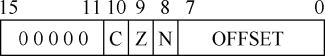

其中，00000为操作码OP；C、Z和N分别为CF、ZF和NF的对应检测位，某检测位为1时表示需检测对应标志，需检测的标志位中只要有一个为1就转移，否则就不转移，例如，若C=1，Z=0，N=1，则需检测CF和NF的值，当CF=1或NF=1时发生转移；OFFSET是相对偏移量，用补码表示。转移执行时，转移目标地址为(PC)+2+2×OFFSET；顺序执行时，下条指令地址为(PC)+2。请回答下列问题。
1) 该计算机存储器按字节编址，还是按字编址？该条件转移指令向后（反向）最多可跳转多少条指令？
2) 某条件转移指令的地址为200CH，指令内容如下图所示，若该执行时CF=0，ZF=0，NF=1，则该指令执行后PC的值是多少？若该指令执行时CF=1，ZF=0，NF=0，则该指令执行后PC的值又是多少？请给出计算过程。

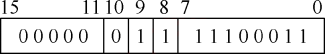

3) 实现“无符号数比较小于等时转移”功能的指令中，C、Z和N应各是什么？
4) 以下是该指令对应的数据通路示意图，要求给出中部件①~③的名称或功能说明。

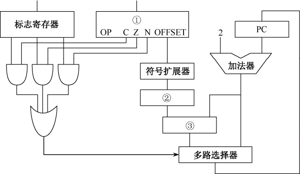

45\. (7分) 某博物馆最多可容纳500人同时参观，有一个出入口，该出入口一次仅允许一人通过。参观者的活动描述如下：
<pre>
cobegin
{
  process 参观者i {
    进入入口；
    参观；
    走出入口；
  }
} coend
</pre>
请添加必要的信号量和P、V（或wait()、signal()）操作，实现上述过程中的互斥与同步。要求写出完整的过程，说明信号量的含义并赋初值。

46\. (8分) 某计算机主存按字节编址，逻辑地址和物理地址都是32位，页表项大小为4字节。请回答下列问题。
1) 若使用一级页表的分页存储管理方式，逻辑地址结构为：

则页的大小是多少字节？页表最大占用多少字节？

2) 若使用二级页表的分页存储管理方式，逻辑地址结构为：

设逻辑地址为LA，请分别给出其对应的页目录号和页表索引的表达式。

3) 采用(1)中的分页存储管理方式，一个代码段起始逻辑地址为0000 8000H,其长度为8KB,被装载到从物理地址0090 0000H开始的连续主存空间中。页表从主存0020 0000H开始的物理地址处连续存放，如下图所示（地址大小自下向上递增）。请计算出该代码段对应的两个页表项的物理地址、这两个页表项中的页框号以及代码页面2的起始物理地址。
【图】

47\. (9分) 假设Internet的两个自治系统构成的网络如题47图所示，自治系统AS1由路由器R1连接两个子网构成；自治系统AS2由路由器R2、R3互联并连接3个子网构成。各子网地址、R2的接口名、R1与R3的部分接口IP地址如题47图所示。
【图】
请回答下列问题。
1) 假设路由表结构如下表所示。请利用路由聚合技术，给出R2的路由表，要求包括到达题47图中所有子网的路由，且路由表中的路由项尽可能少。
【图】
2) 若R2收到一个目的IP地址为194.17.20.200的IP分组，R2会通过哪个接口转发该IP分组？
3) R1与R2之间利用哪个路由协议交换路由信息？该路由协议的报文被封装到哪个协议的分组中进行传输？
</question>

## 2014年计算机学科专业基础试题 {.custom-h2}

一、单项选择题：第1~40小题，每小题2分，共80分。下列每题给出的四个选项中，只有一个选项最符合试题要求。 {.custom-h3}

<question>

1\. 下列程序段的时间复杂度是 (&emsp;)。
    count = 0;
    for (k = 1; k <= n; k *= 2)
        for (j = 1; j <= n; j++)
            count++;
    A. O(log2 n)    B. O(n)    C. O(n log2 n)    D. O(n^2)

2\. 假设栈初始为空，将中缀表达式a/b+(c*d-e*f)/g转换为等价的后缀表达式的过程中，当扫描到f时，栈中的操作符依次是 (&emsp;)。
    A. +(*-      B. +(-*      C. /+(*-*    D. /+-*

3\. 循环队列放在一维数组A[0..M-1]中，end1指向队头元素，end2指向队尾元素的后一个位置。假设队列两端均可进行入队和出队操作，队列中最多能容纳M-1个元素。初始时为空，下列判断队空和队满的条件中，正确的是 (&emsp;)。
    A. 队空：end1 == end2；队满：end1 == (end2 + 1) mod M
    B. 队空：end1 == end2；队满：end2 == (end1 + 1) mod M
    C. 队空：end2 == (end1 + 1) mod M；队满：end1 == (end2 + 1) mod M
    D. 队空：end1 == (end2 + 1) mod M；队满：end2 == (end1 + 1) mod M

4\. 若对如下的二叉树进行中序线索化，则结点x的左、右线索指向的结点分别是 (&emsp;)。
    （注：原题附图，略。二叉树结构从略）
    A. e, c    B. e, a    C. d, c    D. d, a

5\. 将森林F转换为对应的二叉树T，F中叶结点的个数等于 (&emsp;)。
    A. T中叶结点的个数    B. T中度为1的结点个数
    C. T中左孩子为空的结点个数    D. T中右孩子为空的结点个数

6\. 5个字符有如下4种编码方案，其中不是前缀编码的是 (&emsp;)。
    A. 01, 0000, 0001, 001, 1    B. 011, 000, 001, 010, 1
    C. 000, 001, 010, 011, 100    D. 0, 100, 110, 1110, 1100

7\. 对如下所示的有向图进行拓扑排序，得到的拓扑序列可能是 (&emsp;)。
    （注：原题附图，略。有向图顶点为v1,v2,v3,v4,v5,v6，边从略）
    A. v1, v2, v3, v4, v5, v6    B. v1, v3, v2, v4, v6, v5
    C. v1, v3, v4, v2, v6, v5    D. v1, v3, v2, v6, v4, v5

8\. 用哈希（散列）方法处理冲突（碰撞）时，可能出现堆积（聚集）现象的是 (&emsp;)。
    A. 线性探测法    B. 二次探测法    C. 链地址法    D. 再散列法

9\. 在一棵高度为2的5阶B树中，所含关键字的个数最少是 (&emsp;)。
    A. 5    B. 7    C. 8    D. 14

10\. 下列排序算法中，元素的移动次数与关键字的初始排列次序无关的是 (&emsp;)。
    A. 直接插入排序    B. 起泡排序    C. 基数排序    D. 快速排序

11\. 已知序列25, 13, 10, 12, 9是大根堆，在序列尾部插入新元素18，将其再调整为大根堆，调整过程中元素之间进行的比较次数是 (&emsp;)。
    A. 1    B. 2    C. 4    D. 5

12\. 某计算机采用微程序控制器，共有32条指令，公共指令取指微程序包含2条微指令，各指令对应的微程序平均由4条微指令组成，则控制存储器容量至少为 (&emsp;)。
    A. 96    B. 128    C. 130    D. 132

13\. 某数采用IEEE754单精度浮点数格式表示，其十六进制机器数为C0A00000H，则该数的值是 (&emsp;)。
    A. -2.5    B. -3.5    C. -4.5    D. -5.5

14\. 某计算机的Cache采用相联映射方式，Cache容量为64KB，每块大小为128B，主存容量为16MB。则主存地址格式中，标记字段、块字段和字字段的位数分别为 (&emsp;)。
    A. 8、9、7    B. 8、10、7    C. 9、9、7    D. 9、10、7

15\. 某计算机主存按字节编址，采用页式虚拟存储管理方式，虚拟地址为32位，物理地址为24位，页大小为4KB。页表项大小为4B，则该计算机的页表总长度为 (&emsp;)。
    A. 2^20 B    B. 2^22 B    C. 2^24 B    D. 2^26 B

16\. 下列关于指令流水线的叙述中，正确的是 (&emsp;)。
    A. 流水线技术可以提高指令的执行速度，但不会改变指令的执行时间
    B. 流水线技术可以提高指令的吞吐率，但会降低单条指令的执行速度
    C. 流水线技术可以提高单条指令的执行速度，但不会改变指令的吞吐率
    D. 流水线技术既可以提高指令的执行速度，也可以提高指令的吞吐率

17\. 某计算机有16个通用寄存器，采用32位定长指令字，操作码字段（含寻址方式位）为8位，Store指令的源操作数和目的操作数分别采用寄存器直接寻址和基址寻址方式。若基址寄存器可使用任一通用寄存器，且偏移量用补码表示，则Store指令中偏移量的取值范围是 (&emsp;)。
    A. -32768 ~ +32767    B. -32767 ~ +32768
    C. -65536 ~ +65535    D. -65535 ~ +65536

18\. 某CPU采用单周期指令周期，所有指令的CPI均为1。若ALU、寄存器堆、数据存储器、指令存储器的延迟分别为10ns、5ns、15ns、8ns，则CPU时钟周期至少为 (&emsp;)。
    A. 10ns    B. 15ns    C. 20ns    D. 25ns

19\. 某计算机采用微程序控制器，控制存储器容量为1024×32位，微指令中下地址字段占10位，则微指令中控制字段的位数为 (&emsp;)。
    A. 10    B. 12    C. 22    D. 32

20\. 下列关于DMA方式的叙述中，正确的是 (&emsp;)。
    I. DMA方式可以用于高速设备与主存之间的数据传送
    II. DMA方式中，CPU与设备并行工作
    III. DMA方式中，CPU完全被解放，不参与任何数据传送控制
    IV. DMA方式中，数据传送过程由DMA控制器控制
    A. 仅I、II    B. 仅I、II、IV    C. 仅II、III、IV    D. I、II、III、IV

21\. 下列选项中，属于微指令控制字段编码方式的是 (&emsp;)。
    I. 直接控制方式    II. 字段直接编码方式
    III. 字段间接编码方式    IV. 混合编码方式
    A. 仅I、II    B. 仅II、III    C. 仅I、II、III    D. I、II、III、IV

22\. 某计算机的CPU内部采用总线结构，其数据通路如下图所示。图中MDR为存储器数据寄存器，MAR为存储器地址寄存器，IR为指令寄存器，PC为程序计数器，A、B为暂存器。图中未画出的控制信号有 (&emsp;)。
    （注：原题附图，略。选项涉及控制信号名称）
    A. MARin、MDRout、MDRin、PCout、PCin、IRin
    B. MARin、MDRout、MDRin、PCout、PCin、IRin
    C. MARin、MDRout、MDRin、PCout、PCin、IRin
    D. MARin、MDRout、MDRin、PCout、PCin、IRin

23\. 下列选项中，不可能在用户态发生的事件是 (&emsp;)。
    A. 系统调用    B. 外部中断    C. 进程切换    D. 缺页

24\. 中断处理和子程序调用都需要压栈以保护现场，中断处理一定会保存而子程序调用不需要保存其内容的是 (&emsp;)。
    A. 程序计数器    B. 程序状态字寄存器
    C. 通用数据寄存器    D. 通用地址寄存器

25\. 下列关于虚拟存储器的叙述中，正确的是 (&emsp;)。
    A. 虚拟存储只能基于连续分配技术    B. 虚拟存储只能基于非连续分配技术
    C. 虚拟存储容量只受外存容量的限制    D. 虚拟存储容量只受内存容量的限制

26\. 用户程序发出磁盘I/O请求后，系统的正确处理流程是 (&emsp;)。
    A. 用户级I/O软件、设备无关软件、设备驱动程序、中断处理程序
    B. 用户级I/O软件、设备无关软件、中断处理程序、设备驱动程序
    C. 用户级I/O软件、设备驱动程序、设备无关软件、中断处理程序
    D. 用户级I/O软件、中断处理程序、设备无关软件、设备驱动程序

27\. 假设5个进程P0、P1、P2、P3、P4共享三类资源R1、R2、R3，这些资源总数分别为18、6、22。T0时刻的资源分配情况如下表所示。此时系统是否存在死锁？
    进程  已分配资源    最大需求资源
           R1 R2 R3    R1 R2 R3
    P0    3  2  4      5  5  9
    P1    4  1  3      5  2  7
    P2    3  1  4      4  2  6
    P3    2  1  3      4  3  8
    P4    4  1  4      6  2  9
    A. 存在死锁，因为系统资源不足    B. 不存在死锁，因为系统处于安全状态
    C. 存在死锁，因为P0和P2之间形成环路    D. 不存在死锁，因为P1可以运行完成

28\. 在操作系统中，对信号量S的P原语操作定义中，使进程进入相应等待队列的条件是 (&emsp;)。
    A. S > 0    B. S = 0    C. S < 0    D. S ≤ 0

29\. 某文件系统采用索引节点（i-node）管理文件，每个索引节点中有12个地址项（iaddr[0]~iaddr[11]），它们采用直接地址、一级间接地址、二级间接地址方式。设磁盘块大小为4KB，每个磁盘块号占4B，则该文件系统中单个文件最大长度是 (&emsp;)。
    A. 48KB + 4MB + 4GB    B. 48KB + 4MB + 4GB + 4TB
    C. 48KB + 4MB + 4GB + 4TB + 4PB    D. 48KB + 4MB + 4GB

30\. 某文件系统采用位图法管理磁盘空闲空间，磁盘块大小为4KB，磁盘容量为1TB，则位图占用空间大小至少为 (&emsp;)。
    A. 256MB    B. 32MB    C. 4MB    D. 512KB

31\. 采用FCFS（先来先服务）调度算法，进程P1、P2、P3、P4、P5依次进入就绪队列，它们的服务时间分别为6、2、4、8、3，则平均等待时间为 (&emsp;)。
    A. 5.2    B. 6.4    C. 7.6    D. 8.8

32\. 下列关于银行家算法的叙述中，正确的是 (&emsp;)。
    A. 银行家算法可以预防死锁    B. 银行家算法可以避免死锁
    C. 银行家算法可以检测死锁    D. 银行家算法可以解除死锁

33\. 某公司申请到一个C类IP地址，但要连接6个子公司，最大的一个子公司有26台计算机，每个子公司在一个网段中，则子网掩码应设为 (&emsp;)。
    A. 255.255.255.0    B. 255.255.255.128
    C. 255.255.255.192    D. 255.255.255.224

34\. 主机甲和主机乙之间已建立了一个TCP连接，TCP最大段长度为1000字节，若主机甲的当前拥塞窗口为4000字节，在主机甲向主机乙连续发送两个最大段后，成功收到主机乙对第一段的确认，确认段中通告的接收窗口大小为2000字节，则此时主机甲还可以向主机乙发送的最大字节数是 (&emsp;)。
    A. 1000    B. 2000    C. 3000    D. 4000

35\. 主机甲向主机乙发送一个（SYN=1, seq=11220）的TCP段，期望与主机乙建立TCP连接，若主机乙接受该连接请求，则主机乙向主机甲发送的正确的TCP段可能是 (&emsp;)。
    A. (SYN=0, ACK=0, seq=11221, ack=11221)
    B. (SYN=1, ACK=1, seq=11220, ack=11220)
    C. (SYN=1, ACK=1, seq=11221, ack=11221)
    D. (SYN=0, ACK=0, seq=11220, ack=11220)

36\. 主机甲与主机乙之间已建立了一个TCP连接，主机甲向主机乙发送了3个连续的TCP段，分别包含300字节、400字节和500字节的有效载荷，第3个段的序号为900。若主机乙仅正确接收到第1和第3个段，则主机乙发送给主机甲的确认序号是 (&emsp;)。
    A. 300    B. 500    C. 700    D. 1200

37\. 某网络拓扑如下图所示，路由器R1与R2之间使用OSPF协议进行路由信息交换，则路由器R1的路由表中，到达网络192.168.1.0/24的下一跳地址应为 (&emsp;)。
    （注：原题附图，略）
    A. 10.0.1.1    B. 10.0.1.2    C. 10.0.2.1    D. 10.0.2.2

38\. 某主机的IP地址为192.168.1.100，子网掩码为255.255.255.224，则该主机所在子网的广播地址是 (&emsp;)。
    A. 192.168.1.127    B. 192.168.1.128
    C. 192.168.1.255    D. 192.168.1.31

39\. 在CSMA/CD协议中，下列指标与冲突窗口（争用期）有关的是 (&emsp;)。
    A. 最短帧长    B. 最长帧长    C. 帧间隔    D. 最大重传次数

40\. 在下列协议中，能够实现网络层差错报告的是 (&emsp;)。
    A. ARP    B. ICMP    C. RIP    D. OSPF

</question>

二、综合应用题：第41~47题，共70分。{.custom-h3}

<question>

41\. (10分)
    用单链表存储一个字符串，每个结点存储一个字符。请设计一个算法，判断该字符串是否为回文串（即正读和反读相同，例如“abcba”是回文串，“abccba”也是回文串）。要求：
    (1) 给出算法的基本设计思想。
    (2) 根据设计思想，采用C或C++或Java语言描述算法，关键之处给出注释。
    (3) 说明你所设计算法的时间复杂度和空间复杂度。

42\. (13分)
    已知一个整数序列A = (a0, a1, ..., an-1)，其中0 ≤ ai < n (0 ≤ i < n)。若存在ap1 = ap2 = ... = apm = x，且m > n/2 (0 ≤ pk < n, 1 ≤ k ≤ m)，则称x为A的主元素。例如A = (0, 5, 5, 3, 5, 7, 5, 5)，则5为主元素；又如A = (0, 5, 5, 3, 5, 1, 5, 7)，则A中没有主元素。
    假设A中的n个元素保存在一个一维数组中，请设计一个尽可能高效的算法，找出A的主元素。若存在主元素，则输出该元素；否则输出-1。要求：
    (1) 给出算法的基本设计思想。
    (2) 根据设计思想，采用C或C++或Java语言描述算法，关键之处给出注释。
    (3) 说明你所设计算法的时间复杂度和空间复杂度。

43\. (11分)
    某计算机采用16位定长指令字格式，其CPU中有一个标志寄存器，其中包含进位/借位标志CF、零标志ZF、符号标志SF和溢出标志OF。指令格式和寻址方式如下：
    （注：原题附图，略。包含操作码、源操作数、目的操作数、偏移量等字段）
    请回答下列问题：
    (1) 该指令系统最多可有多少条指令？
    (2) 若指令中源操作数和目的操作数均采用寄存器直接寻址，则最多可有多少个通用寄存器？
    (3) 若指令中采用基址寻址方式，基址寄存器为Rb，偏移量为X（补码表示），则执行“LOAD Rd, (Rb), X”指令时，操作数的有效地址如何计算？该指令的功能是什么？
    (4) 若该计算机采用单总线结构，且ALU的两个输入端分别来自暂存器A和B，则执行“ADD Rd, Rs”指令时，需要哪些微操作？请按时间顺序列出。

44\. (12分)
    某计算机的主存地址空间大小为256MB，按字节编址。指令Cache和数据Cache分离，均有8个Cache行，每Cache行大小为64B。数据Cache采用直接映射方式。现有两个功能相同的程序A和B，其伪代码如下：
    程序A：
    int a[256][256];
    ...
    int sum_array1() {
        int i, j, sum = 0;
        for (i = 0; i < 256; i++)
            for (j = 0; j < 256; j++)
                sum += a[i][j];
        return sum;
    }
    程序B：
    int a[256][256];
    ...
    int sum_array2() {
        int i, j, sum = 0;
        for (j = 0; j < 256; j++)
            for (i = 0; i < 256; i++)
                sum += a[i][j];
        return sum;
    }
    假定int类型数据占32位，程序编译时i、j、sum均分配在寄存器中，数组a按行优先方式存放，其首地址为0x0C000000。请回答下列问题，要求说明理由或给出计算过程。
    (1) 数组元素a[0][31]和a[1][1]各自所在主存块对应的Cache行号分别是多少（Cache行号从0开始）？
    (2) 程序A和B的数据访问命中率各是多少？哪个程序的执行时间更短？

45\. (7分) 某博物馆最多可容纳500人同时参观，有一个出入口，该出入口一次仅允许一人通过。参观者的活动描述如下：
<pre>
cobegin
{
  process 参观者i {
    进入入口；
    参观；
    走出入口；
  }
} coend
</pre>
请添加必要的信号量和P、V（或wait、signal）操作，实现上述过程中的互斥与同步。要求写出完整的过程，说明信号量的含义并赋初值。

46\. (8分)
    某文件系统采用索引节点（i-node）管理文件，每个索引节点中包含13个地址项：iaddr[0]~iaddr[12]，它们采用直接地址、一级间接地址、二级间接地址和三级间接地址方式。设磁盘块大小为4KB，每个磁盘块号占4个字节（32位），试问：
    (1) 该文件系统中，单个文件最大长度是多少字节？
    (2) 若要访问某文件的第1234567字节，需要读取多少个磁盘块？分别是什么？

47\. (9分)
    某网络拓扑如下图所示，路由器R1通过接口E1、E2分别连接局域网1、局域网2，通过接口L0连接路由器R2，并通过路由器R2连接域名服务器与互联网。R1的L0接口的IP地址是202.118.2.1；R2的L0接口的IP地址是202.118.2.2，L1接口的IP地址是130.11.120.1，E0接口的IP地址是202.118.3.1；域名服务器的IP地址是202.118.3.2。
    R1和R2的路由表结构为：
    目的网络IP地址  子网掩码  下一跳IP地址  接口
    (1) 将IP地址空间202.118.1.0/24划分为两个子网，分别分配给局域网1、局域网2，每个局域网需分配的IP地址数不少于120个。请给出子网划分结果，说明理由或给出必要的计算过程。
    (2) 请给出R1的路由表，使其明确包括到局域网1的路由、局域网2的路由、域名服务器的主机路由以及到互联网的路由。
    (3) 请给出R2的路由表，使其明确包括到局域网1的路由、局域网2的路由、域名服务器的主机路由以及到互联网的路由。

（注：原题附图，略。网络拓扑结构：互联网——R2——R1——局域网1、局域网2；域名服务器连接在R2上）

</question>

## 2015年计算机学科专业基础试题 {.custom-h2}

一、单项选择题：第1~40小题，每小题2分，共80分。下列每题给出的四个选项中，只有一个选项最符合试题要求。 {.custom-h3}

<question>

1\. 已知程序如下：
    int s(int n) {
        return (n <= 0) ? 0 : s(n - 1) + n;
    }
    void main() {
        cout << s(1);
    }
    程序运行时使用栈来保存调用过程的信息，自栈底到栈顶保存的信息依次对应的是 (&emsp;)。
    A. main()->s(1)->s(0)    B. s(0)->s(1)->main()
    C. main()->s(0)->s(1)    D. s(1)->s(0)->main()

2\. 先序序列为a,b,c,d的不同二叉树的个数是 (&emsp;)。
    A. 13    B. 14    C. 15    D. 16

3\. 下列选项给出的是从根分别到达两个叶结点路径上的权值序列，能属于同一棵哈夫曼树的是 (&emsp;)。
    A. 24, 10, 5 和 24, 10, 7    B. 24, 10, 5 和 24, 12, 7
    C. 24, 10, 10 和 24, 14, 11    D. 24, 10, 5 和 24, 14, 6

4\. 现有一棵无重复关键字的平衡二叉树（AVL树），对其进行中序遍历可得到一个降序序列。下列关于该平衡二叉树的叙述中，正确的是 (&emsp;)。
    A. 根结点的度一定为2    B. 树中最小元素一定是叶结点
    C. 最后插入的元素一定是叶结点    D. 树中最大元素一定是无左子树

5\. 设有向图G=(V,E)，顶点集V={v0,v1,v2,v3}，若图G的邻接矩阵为
        [0  1  1  1]
        [1  0  1  0]
        [1  1  0  1]
        [1  0  1  0]
    则顶点v0的出度是 (&emsp;)。
    A. 1    B. 2    C. 3    D. 4

6\. 若用邻接矩阵存储有向图，矩阵中主对角线以下的元素均为零，则关于该图拓扑序列的结论是 (&emsp;)。
    A. 存在，且唯一    B. 存在，且不唯一
    C. 存在，可能不唯一    D. 无法确定是否存在

7\. 对如下所示的有向带权图，若采用迪杰斯特拉（Dijkstra）算法求从源点a到其他各顶点的最短路径，则得到的第一条最短路径的目标顶点是b，第二条最短路径的目标顶点是c，后续得到的其余各最短路径的目标顶点依次是 (&emsp;)。
    （注：原题附图，略。有向带权图顶点为a,b,c,d,e,f，边与权值从略）
    A. d, e, f    B. e, d, f    C. f, d, e    D. f, e, d

8\. 下列关于最小生成树的叙述中，正确的是 (&emsp;)。
    I. 最小生成树的代价唯一
    II. 所有权值最小的边一定会出现在所有的最小生成树中
    III. 使用普里姆（Prim）算法从不同顶点开始得到的最小生成树一定相同
    IV. 使用普里姆算法和克鲁斯卡尔（Kruskal）算法得到的最小生成树总不相同
    A. 仅I    B. 仅II    C. 仅I、III    D. 仅II、IV

9\. 已知一棵3阶B-树，如下图所示。删除关键字78得到一棵新B-树，其最右叶结点中的关键字是 (&emsp;)。
    （注：原题附图，略。B-树结构从略）
    A. 60    B. 60, 62    C. 62, 65    D. 65

10\. 在内部排序过程中，对尚未确定最终位置的所有元素进行一遍处理称为一趟排序。下列排序方法中，每一趟排序结束都至少能够确定一个元素最终位置的方法是 (&emsp;)。
    I. 简单选择排序  II. 希尔排序  III. 快速排序  IV. 堆排序  V. 二路归并排序
    A. 仅I、III、IV    B. 仅I、III、V    C. 仅II、III、IV    D. 仅III、IV、V

11\. 对一待排序序列分别进行折半插入排序和直接插入排序，两者之间可能的不同之处是 (&emsp;)。
    A. 排序的总趟数    B. 元素的移动次数
    C. 使用辅助空间的数量    D. 元素之间的比较次数

12\. 某计算机采用微程序控制器，共有32条指令，公共指令取指微程序包含2条微指令，各指令对应的微程序平均由4条微指令组成，则控制存储器容量至少为 (&emsp;)。
    A. 96    B. 128    C. 130    D. 132

13\. 某数采用IEEE754单精度浮点数格式表示，其十六进制机器数为C0A00000H，则该数的值是 (&emsp;)。
    A. -2.5    B. -3.5    C. -4.5    D. -5.5

14\. 某计算机的Cache采用相联映射方式，Cache容量为64KB，每块大小为128B，主存容量为16MB。则主存地址格式中，标记字段、块字段和字字段的位数分别为 (&emsp;)。
    A. 8、9、7    B. 8、10、7    C. 9、9、7    D. 9、10、7

15\. 某计算机主存按字节编址，采用页式虚拟存储管理方式，虚拟地址为32位，物理地址为24位，页大小为4KB。页表项大小为4B，则该计算机的页表总长度为 (&emsp;)。
    A. 2^20 B    B. 2^22 B    C. 2^24 B    D. 2^26 B

16\. 下列关于指令流水线的叙述中，正确的是 (&emsp;)。
    A. 流水线技术可以提高指令的执行速度，但不会改变指令的执行时间
    B. 流水线技术可以提高指令的吞吐率，但会降低单条指令的执行速度
    C. 流水线技术可以提高单条指令的执行速度，但不会改变指令的吞吐率
    D. 流水线技术既可以提高指令的执行速度，也可以提高指令的吞吐率

17\. 某计算机有16个通用寄存器，采用32位定长指令字，操作码字段（含寻址方式位）为8位，Store指令的源操作数和目的操作数分别采用寄存器直接寻址和基址寻址方式。若基址寄存器可使用任一通用寄存器，且偏移量用补码表示，则Store指令中偏移量的取值范围是 (&emsp;)。
    A. -32768 ~ +32767    B. -32767 ~ +32768
    C. -65536 ~ +65535    D. -65535 ~ +65536

18\. 某CPU采用单周期指令周期，所有指令的CPI均为1。若ALU、寄存器堆、数据存储器、指令存储器的延迟分别为10ns、5ns、15ns、8ns，则CPU时钟周期至少为 (&emsp;)。
    A. 10ns    B. 15ns    C. 20ns    D. 25ns

19\. 某计算机采用微程序控制器，控制存储器容量为1024×32位，微指令中下地址字段占10位，则微指令中控制字段的位数为 (&emsp;)。
    A. 10    B. 12    C. 22    D. 32

20\. 下列关于DMA方式的叙述中，正确的是 (&emsp;)。
    I. DMA方式可以用于高速设备与主存之间的数据传送
    II. DMA方式中，CPU与设备并行工作
    III. DMA方式中，CPU完全被解放，不参与任何数据传送控制
    IV. DMA方式中，数据传送过程由DMA控制器控制
    A. 仅I、II    B. 仅I、II、IV    C. 仅II、III、IV    D. I、II、III、IV

21\. 下列选项中，属于微指令控制字段编码方式的是 (&emsp;)。
    I. 直接控制方式    II. 字段直接编码方式
    III. 字段间接编码方式    IV. 混合编码方式
    A. 仅I、II    B. 仅II、III    C. 仅I、II、III    D. I、II、III、IV

22\. 某计算机的CPU内部采用总线结构，其数据通路如下图所示。图中MDR为存储器数据寄存器，MAR为存储器地址寄存器，IR为指令寄存器，PC为程序计数器，A、B为暂存器。图中未画出的控制信号有 (&emsp;)。
    （注：原题附图，略。选项涉及控制信号名称）
    A. MARin、MDRout、MDRin、PCout、PCin、IRin
    B. MARin、MDRout、MDRin、PCout、PCin、IRin
    C. MARin、MDRout、MDRin、PCout、PCin、IRin
    D. MARin、MDRout、MDRin、PCout、PCin、IRin

23\. 下列选项中，不可能在用户态发生的事件是 (&emsp;)。
    A. 系统调用    B. 外部中断    C. 进程切换    D. 缺页

24\. 中断处理和子程序调用都需要压栈以保护现场，中断处理一定会保存而子程序调用不需要保存其内容的是 (&emsp;)。
    A. 程序计数器    B. 程序状态字寄存器
    C. 通用数据寄存器    D. 通用地址寄存器

25\. 下列关于虚拟存储器的叙述中，正确的是 (&emsp;)。
    A. 虚拟存储只能基于连续分配技术    B. 虚拟存储只能基于非连续分配技术
    C. 虚拟存储容量只受外存容量的限制    D. 虚拟存储容量只受内存容量的限制

26\. 用户程序发出磁盘I/O请求后，系统的正确处理流程是 (&emsp;)。
    A. 用户级I/O软件、设备无关软件、设备驱动程序、中断处理程序
    B. 用户级I/O软件、设备无关软件、中断处理程序、设备驱动程序
    C. 用户级I/O软件、设备驱动程序、设备无关软件、中断处理程序
    D. 用户级I/O软件、中断处理程序、设备无关软件、设备驱动程序

27\. 假设5个进程P0、P1、P2、P3、P4共享三类资源R1、R2、R3，这些资源总数分别为18、6、22。T0时刻的资源分配情况如下表所示。此时系统是否存在死锁？
    进程  已分配资源    最大需求资源
           R1 R2 R3    R1 R2 R3
    P0    3  2  4      5  5  9
    P1    4  1  3      5  2  7
    P2    3  1  4      4  2  6
    P3    2  1  3      4  3  8
    P4    4  1  4      6  2  9
    A. 存在死锁，因为系统资源不足    B. 不存在死锁，因为系统处于安全状态
    C. 存在死锁，因为P0和P2之间形成环路    D. 不存在死锁，因为P1可以运行完成

28\. 在操作系统中，对信号量S的P原语操作定义中，使进程进入相应等待队列的条件是 (&emsp;)。
    A. S > 0    B. S = 0    C. S < 0    D. S ≤ 0

29\. 某文件系统采用索引节点（i-node）管理文件，每个索引节点中有12个地址项（iaddr[0]~iaddr[11]），它们采用直接地址、一级间接地址、二级间接地址方式。设磁盘块大小为4KB，每个磁盘块号占4B，则该文件系统中单个文件最大长度是 (&emsp;)。
    A. 48KB + 4MB + 4GB    B. 48KB + 4MB + 4GB + 4TB
    C. 48KB + 4MB + 4GB + 4TB + 4PB    D. 48KB + 4MB + 4GB

30\. 某文件系统采用位图法管理磁盘空闲空间，磁盘块大小为4KB，磁盘容量为1TB，则位图占用空间大小至少为 (&emsp;)。
    A. 256MB    B. 32MB    C. 4MB    D. 512KB

31\. 采用FCFS（先来先服务）调度算法，进程P1、P2、P3、P4、P5依次进入就绪队列，它们的服务时间分别为6、2、4、8、3，则平均等待时间为 (&emsp;)。
    A. 5.2    B. 6.4    C. 7.6    D. 8.8

32\. 下列关于银行家算法的叙述中，正确的是 (&emsp;)。
    A. 银行家算法可以预防死锁    B. 银行家算法可以避免死锁
    C. 银行家算法可以检测死锁    D. 银行家算法可以解除死锁

33\. 某公司申请到一个C类IP地址，但要连接6个子公司，最大的一个子公司有26台计算机，每个子公司在一个网段中，则子网掩码应设为 (&emsp;)。
    A. 255.255.255.0    B. 255.255.255.128
    C. 255.255.255.192    D. 255.255.255.224

34\. 主机甲和主机乙之间已建立了一个TCP连接，TCP最大段长度为1000字节，若主机甲的当前拥塞窗口为4000字节，在主机甲向主机乙连续发送两个最大段后，成功收到主机乙对第一段的确认，确认段中通告的接收窗口大小为2000字节，则此时主机甲还可以向主机乙发送的最大字节数是 (&emsp;)。
    A. 1000    B. 2000    C. 3000    D. 4000

35\. 主机甲向主机乙发送一个（SYN=1, seq=11220）的TCP段，期望与主机乙建立TCP连接，若主机乙接受该连接请求，则主机乙向主机甲发送的正确的TCP段可能是 (&emsp;)。
    A. (SYN=0, ACK=0, seq=11221, ack=11221)
    B. (SYN=1, ACK=1, seq=11220, ack=11220)
    C. (SYN=1, ACK=1, seq=11221, ack=11221)
    D. (SYN=0, ACK=0, seq=11220, ack=11220)

36\. 主机甲与主机乙之间已建立了一个TCP连接，主机甲向主机乙发送了3个连续的TCP段，分别包含300字节、400字节和500字节的有效载荷，第3个段的序号为900。若主机乙仅正确接收到第1和第3个段，则主机乙发送给主机甲的确认序号是 (&emsp;)。
    A. 300    B. 500    C. 700    D. 1200

37\. 某网络拓扑如下图所示，路由器R1与R2之间使用OSPF协议进行路由信息交换，则路由器R1的路由表中，到达网络192.168.1.0/24的下一跳地址应为 (&emsp;)。
    （注：原题附图，略）
    A. 10.0.1.1    B. 10.0.1.2    C. 10.0.2.1    D. 10.0.2.2

38\. 某主机的IP地址为192.168.1.100，子网掩码为255.255.255.224，则该主机所在子网的广播地址是 (&emsp;)。
    A. 192.168.1.127    B. 192.168.1.128
    C. 192.168.1.255    D. 192.168.1.31

39\. 在CSMA/CD协议中，下列指标与冲突窗口（争用期）有关的是 (&emsp;)。
    A. 最短帧长    B. 最长帧长    C. 帧间隔    D. 最大重传次数

40\. 在下列协议中，能够实现网络层差错报告的是 (&emsp;)。
    A. ARP    B. ICMP    C. RIP    D. OSPF

</question>

二、综合应用题：第41~47题，共70分。{.custom-h3}

<question>

41\. (10分)
    用单链表存储一个字符串，每个结点存储一个字符。请设计一个算法，判断该字符串是否为回文串（即正读和反读相同，例如“abcba”是回文串，“abccba”也是回文串）。要求：
    (1) 给出算法的基本设计思想。
    (2) 根据设计思想，采用C或C++或Java语言描述算法，关键之处给出注释。
    (3) 说明你所设计算法的时间复杂度和空间复杂度。

42\. (13分)
    已知一个整数序列A = (a0, a1, ..., an-1)，其中0 ≤ ai < n (0 ≤ i < n)。若存在ap1 = ap2 = ... = apm = x，且m > n/2 (0 ≤ pk < n, 1 ≤ k ≤ m)，则称x为A的主元素。例如A = (0, 5, 5, 3, 5, 7, 5, 5)，则5为主元素；又如A = (0, 5, 5, 3, 5, 1, 5, 7)，则A中没有主元素。
    假设A中的n个元素保存在一个一维数组中，请设计一个尽可能高效的算法，找出A的主元素。若存在主元素，则输出该元素；否则输出-1。要求：
    (1) 给出算法的基本设计思想。
    (2) 根据设计思想，采用C或C++或Java语言描述算法，关键之处给出注释。
    (3) 说明你所设计算法的时间复杂度和空间复杂度。

43\. (11分)
    某计算机采用16位定长指令字格式，其CPU中有一个标志寄存器，其中包含进位/借位标志CF、零标志ZF、符号标志SF和溢出标志OF。指令格式和寻址方式如下：
    （注：原题附图，略。包含操作码、源操作数、目的操作数、偏移量等字段）
    请回答下列问题：
    (1) 该指令系统最多可有多少条指令？
    (2) 若指令中源操作数和目的操作数均采用寄存器直接寻址，则最多可有多少个通用寄存器？
    (3) 若指令中采用基址寻址方式，基址寄存器为Rb，偏移量为X（补码表示），则执行“LOAD Rd, (Rb), X”指令时，操作数的有效地址如何计算？该指令的功能是什么？
    (4) 若该计算机采用单总线结构，且ALU的两个输入端分别来自暂存器A和B，则执行“ADD Rd, Rs”指令时，需要哪些微操作？请按时间顺序列出。

44\. (12分)
    某计算机的主存地址空间大小为256MB，按字节编址。指令Cache和数据Cache分离，均有8个Cache行，每Cache行大小为64B。数据Cache采用直接映射方式。现有两个功能相同的程序A和B，其伪代码如下：
    程序A：
    int a[256][256];
    ...
    int sum_array1() {
        int i, j, sum = 0;
        for (i = 0; i < 256; i++)
            for (j = 0; j < 256; j++)
                sum += a[i][j];
        return sum;
    }
    程序B：
    int a[256][256];
    ...
    int sum_array2() {
        int i, j, sum = 0;
        for (j = 0; j < 256; j++)
            for (i = 0; i < 256; i++)
                sum += a[i][j];
        return sum;
    }
    假定int类型数据占32位，程序编译时i、j、sum均分配在寄存器中，数组a按行优先方式存放，其首地址为0x0C000000。请回答下列问题，要求说明理由或给出计算过程。
    (1) 数组元素a[0][31]和a[1][1]各自所在主存块对应的Cache行号分别是多少（Cache行号从0开始）？
    (2) 程序A和B的数据访问命中率各是多少？哪个程序的执行时间更短？

45\. (7分)
    某博物馆最多可容纳500人同时参观，有一个出入口，该出入口一次仅允许一人通过。参观者的活动描述如下：
    cobegin
    {
        process 参观者 i {
            进入入口；
            参观；
            走出入口；
        }
    } coend
    请添加必要的信号量和P、V（或wait、signal）操作，实现上述过程中的互斥与同步。要求写出完整的过程，说明信号量的含义并赋初值。

46\. (8分)
    某文件系统采用索引节点（i-node）管理文件，每个索引节点中包含13个地址项：iaddr[0]~iaddr[12]，它们采用直接地址、一级间接地址、二级间接地址和三级间接地址方式。设磁盘块大小为4KB，每个磁盘块号占4个字节（32位），试问：
    (1) 该文件系统中，单个文件最大长度是多少字节？
    (2) 若要访问某文件的第1234567字节，需要读取多少个磁盘块？分别是什么？

47\. (9分)
    某网络拓扑如下图所示，路由器R1通过接口E1、E2分别连接局域网1、局域网2，通过接口L0连接路由器R2，并通过路由器R2连接域名服务器与互联网。R1的L0接口的IP地址是202.118.2.1；R2的L0接口的IP地址是202.118.2.2，L1接口的IP地址是130.11.120.1，E0接口的IP地址是202.118.3.1；域名服务器的IP地址是202.118.3.2。
    R1和R2的路由表结构为：
    目的网络IP地址  子网掩码  下一跳IP地址  接口
    (1) 将IP地址空间202.118.1.0/24划分为两个子网，分别分配给局域网1、局域网2，每个局域网需分配的IP地址数不少于120个。请给出子网划分结果，说明理由或给出必要的计算过程。
    (2) 请给出R1的路由表，使其明确包括到局域网1的路由、局域网2的路由、域名服务器的主机路由以及到互联网的路由。
    (3) 请给出R2的路由表，使其明确包括到局域网1的路由、局域网2的路由、域名服务器的主机路由以及到互联网的路由。

（注：原题附图，略。网络拓扑结构：互联网——R2——R1——局域网1、局域网2；域名服务器连接在R2上）

</question>

## 2016年计算机学科专业基础试题 {.custom-h2}

一、单项选择题：第1~40小题，每小题2分，共80分。下列每题给出的四个选项中，只有一个选项最符合试题要求。 {.custom-h3}

<question>

1\. 已知程序如下：
    int s(int n) {
        return (n <= 0) ? 0 : s(n - 1) + n;
    }
    void main() {
        cout << s(1);
    }
    程序运行时使用栈来保存调用过程的信息，自栈底到栈顶保存的信息依次对应的是 (&emsp;)。
    A. main()->s(1)->s(0)    B. s(0)->s(1)->main()
    C. main()->s(0)->s(1)    D. s(1)->s(0)->main()

2\. 先序序列为a,b,c,d的不同二叉树的个数是 (&emsp;)。
    A. 13    B. 14    C. 15    D. 16

3\. 下列选项给出的是从根分别到达两个叶结点路径上的权值序列，能属于同一棵哈夫曼树的是 (&emsp;)。
    A. 24, 10, 5 和 24, 10, 7    B. 24, 10, 5 和 24, 12, 7
    C. 24, 10, 10 和 24, 14, 11    D. 24, 10, 5 和 24, 14, 6

4\. 现有一棵无重复关键字的平衡二叉树（AVL树），对其进行中序遍历可得到一个降序序列。下列关于该平衡二叉树的叙述中，正确的是 (&emsp;)。
    A. 根结点的度一定为2    B. 树中最小元素一定是叶结点
    C. 最后插入的元素一定是叶结点    D. 树中最大元素一定是无左子树

5\. 设有向图G=(V,E)，顶点集V={v0,v1,v2,v3}，若图G的邻接矩阵为
        [0  1  1  1]
        [1  0  1  0]
        [1  1  0  1]
        [1  0  1  0]
    则顶点v0的出度是 (&emsp;)。
    A. 1    B. 2    C. 3    D. 4

6\. 若用邻接矩阵存储有向图，矩阵中主对角线以下的元素均为零，则关于该图拓扑序列的结论是 (&emsp;)。
    A. 存在，且唯一    B. 存在，且不唯一
    C. 存在，可能不唯一    D. 无法确定是否存在

7\. 对如下所示的有向带权图，若采用迪杰斯特拉（Dijkstra）算法求从源点a到其他各顶点的最短路径，则得到的第一条最短路径的目标顶点是b，第二条最短路径的目标顶点是c，后续得到的其余各最短路径的目标顶点依次是 (&emsp;)。
    （注：原题附图，略。有向带权图顶点为a,b,c,d,e,f，边与权值从略）
    A. d, e, f    B. e, d, f    C. f, d, e    D. f, e, d

8\. 下列关于最小生成树的叙述中，正确的是 (&emsp;)。
    I. 最小生成树的代价唯一
    II. 所有权值最小的边一定会出现在所有的最小生成树中
    III. 使用普里姆（Prim）算法从不同顶点开始得到的最小生成树一定相同
    IV. 使用普里姆算法和克鲁斯卡尔（Kruskal）算法得到的最小生成树总不相同
    A. 仅I    B. 仅II    C. 仅I、III    D. 仅II、IV

9\. 已知一棵3阶B-树，如下图所示。删除关键字78得到一棵新B-树，其最右叶结点中的关键字是 (&emsp;)。
    （注：原题附图，略。B-树结构从略）
    A. 60    B. 60, 62    C. 62, 65    D. 65

10\. 在内部排序过程中，对尚未确定最终位置的所有元素进行一遍处理称为一趟排序。下列排序方法中，每一趟排序结束都至少能够确定一个元素最终位置的方法是 (&emsp;)。
    I. 简单选择排序  II. 希尔排序  III. 快速排序  IV. 堆排序  V. 二路归并排序
    A. 仅I、III、IV    B. 仅I、III、V    C. 仅II、III、IV    D. 仅III、IV、V

11\. 对一待排序序列分别进行折半插入排序和直接插入排序，两者之间可能的不同之处是 (&emsp;)。
    A. 排序的总趟数    B. 元素的移动次数
    C. 使用辅助空间的数量    D. 元素之间的比较次数

12\. 某计算机采用微程序控制器，共有32条指令，公共指令取指微程序包含2条微指令，各指令对应的微程序平均由4条微指令组成，则控制存储器容量至少为 (&emsp;)。
    A. 96    B. 128    C. 130    D. 132

13\. 某数采用IEEE754单精度浮点数格式表示，其十六进制机器数为C0A00000H，则该数的值是 (&emsp;)。
    A. -2.5    B. -3.5    C. -4.5    D. -5.5

14\. 某计算机的Cache采用相联映射方式，Cache容量为64KB，每块大小为128B，主存容量为16MB。则主存地址格式中，标记字段、块字段和字字段的位数分别为 (&emsp;)。
    A. 8、9、7    B. 8、10、7    C. 9、9、7    D. 9、10、7

15\. 某计算机主存按字节编址，采用页式虚拟存储管理方式，虚拟地址为32位，物理地址为24位，页大小为4KB。页表项大小为4B，则该计算机的页表总长度为 (&emsp;)。
    A. 2^20 B    B. 2^22 B    C. 2^24 B    D. 2^26 B

16\. 下列关于指令流水线的叙述中，正确的是 (&emsp;)。
    A. 流水线技术可以提高指令的执行速度，但不会改变指令的执行时间
    B. 流水线技术可以提高指令的吞吐率，但会降低单条指令的执行速度
    C. 流水线技术可以提高单条指令的执行速度，但不会改变指令的吞吐率
    D. 流水线技术既可以提高指令的执行速度，也可以提高指令的吞吐率

17\. 某计算机有16个通用寄存器，采用32位定长指令字，操作码字段（含寻址方式位）为8位，Store指令的源操作数和目的操作数分别采用寄存器直接寻址和基址寻址方式。若基址寄存器可使用任一通用寄存器，且偏移量用补码表示，则Store指令中偏移量的取值范围是 (&emsp;)。
    A. -32768 ~ +32767    B. -32767 ~ +32768
    C. -65536 ~ +65535    D. -65535 ~ +65536

18\. 某CPU采用单周期指令周期，所有指令的CPI均为1。若ALU、寄存器堆、数据存储器、指令存储器的延迟分别为10ns、5ns、15ns、8ns，则CPU时钟周期至少为 (&emsp;)。
    A. 10ns    B. 15ns    C. 20ns    D. 25ns

19\. 某计算机采用微程序控制器，控制存储器容量为1024×32位，微指令中下地址字段占10位，则微指令中控制字段的位数为 (&emsp;)。
    A. 10    B. 12    C. 22    D. 32

20\. 下列关于DMA方式的叙述中，正确的是 (&emsp;)。
    I. DMA方式可以用于高速设备与主存之间的数据传送
    II. DMA方式中，CPU与设备并行工作
    III. DMA方式中，CPU完全被解放，不参与任何数据传送控制
    IV. DMA方式中，数据传送过程由DMA控制器控制
    A. 仅I、II    B. 仅I、II、IV    C. 仅II、III、IV    D. I、II、III、IV

21\. 下列选项中，属于微指令控制字段编码方式的是 (&emsp;)。
    I. 直接控制方式    II. 字段直接编码方式
    III. 字段间接编码方式    IV. 混合编码方式
    A. 仅I、II    B. 仅II、III    C. 仅I、II、III    D. I、II、III、IV

22\. 某计算机的CPU内部采用总线结构，其数据通路如下图所示。图中MDR为存储器数据寄存器，MAR为存储器地址寄存器，IR为指令寄存器，PC为程序计数器，A、B为暂存器。图中未画出的控制信号有 (&emsp;)。
    （注：原题附图，略。选项涉及控制信号名称）
    A. MARin、MDRout、MDRin、PCout、PCin、IRin
    B. MARin、MDRout、MDRin、PCout、PCin、IRin
    C. MARin、MDRout、MDRin、PCout、PCin、IRin
    D. MARin、MDRout、MDRin、PCout、PCin、IRin

23\. 下列选项中，不可能在用户态发生的事件是 (&emsp;)。
    A. 系统调用    B. 外部中断    C. 进程切换    D. 缺页

24\. 中断处理和子程序调用都需要压栈以保护现场，中断处理一定会保存而子程序调用不需要保存其内容的是 (&emsp;)。
    A. 程序计数器    B. 程序状态字寄存器
    C. 通用数据寄存器    D. 通用地址寄存器

25\. 下列关于虚拟存储器的叙述中，正确的是 (&emsp;)。
    A. 虚拟存储只能基于连续分配技术    B. 虚拟存储只能基于非连续分配技术
    C. 虚拟存储容量只受外存容量的限制    D. 虚拟存储容量只受内存容量的限制

26\. 用户程序发出磁盘I/O请求后，系统的正确处理流程是 (&emsp;)。
    A. 用户级I/O软件、设备无关软件、设备驱动程序、中断处理程序
    B. 用户级I/O软件、设备无关软件、中断处理程序、设备驱动程序
    C. 用户级I/O软件、设备驱动程序、设备无关软件、中断处理程序
    D. 用户级I/O软件、中断处理程序、设备无关软件、设备驱动程序

27\. 假设5个进程P0、P1、P2、P3、P4共享三类资源R1、R2、R3，这些资源总数分别为18、6、22。T0时刻的资源分配情况如下表所示。此时系统是否存在死锁？
    进程  已分配资源    最大需求资源
           R1 R2 R3    R1 R2 R3
    P0    3  2  4      5  5  9
    P1    4  1  3      5  2  7
    P2    3  1  4      4  2  6
    P3    2  1  3      4  3  8
    P4    4  1  4      6  2  9
    A. 存在死锁，因为系统资源不足    B. 不存在死锁，因为系统处于安全状态
    C. 存在死锁，因为P0和P2之间形成环路    D. 不存在死锁，因为P1可以运行完成

28\. 在操作系统中，对信号量S的P原语操作定义中，使进程进入相应等待队列的条件是 (&emsp;)。
    A. S > 0    B. S = 0    C. S < 0    D. S ≤ 0

29\. 某文件系统采用索引节点（i-node）管理文件，每个索引节点中有12个地址项（iaddr[0]~iaddr[11]），它们采用直接地址、一级间接地址、二级间接地址方式。设磁盘块大小为4KB，每个磁盘块号占4B，则该文件系统中单个文件最大长度是 (&emsp;)。
    A. 48KB + 4MB + 4GB    B. 48KB + 4MB + 4GB + 4TB
    C. 48KB + 4MB + 4GB + 4TB + 4PB    D. 48KB + 4MB + 4GB

30\. 某文件系统采用位图法管理磁盘空闲空间，磁盘块大小为4KB，磁盘容量为1TB，则位图占用空间大小至少为 (&emsp;)。
    A. 256MB    B. 32MB    C. 4MB    D. 512KB

31\. 采用FCFS（先来先服务）调度算法，进程P1、P2、P3、P4、P5依次进入就绪队列，它们的服务时间分别为6、2、4、8、3，则平均等待时间为 (&emsp;)。
    A. 5.2    B. 6.4    C. 7.6    D. 8.8

32\. 下列关于银行家算法的叙述中，正确的是 (&emsp;)。
    A. 银行家算法可以预防死锁    B. 银行家算法可以避免死锁
    C. 银行家算法可以检测死锁    D. 银行家算法可以解除死锁

33\. 某公司申请到一个C类IP地址，但要连接6个子公司，最大的一个子公司有26台计算机，每个子公司在一个网段中，则子网掩码应设为 (&emsp;)。
    A. 255.255.255.0    B. 255.255.255.128
    C. 255.255.255.192    D. 255.255.255.224

34\. 主机甲和主机乙之间已建立了一个TCP连接，TCP最大段长度为1000字节，若主机甲的当前拥塞窗口为4000字节，在主机甲向主机乙连续发送两个最大段后，成功收到主机乙对第一段的确认，确认段中通告的接收窗口大小为2000字节，则此时主机甲还可以向主机乙发送的最大字节数是 (&emsp;)。
    A. 1000    B. 2000    C. 3000    D. 4000

35\. 主机甲向主机乙发送一个（SYN=1, seq=11220）的TCP段，期望与主机乙建立TCP连接，若主机乙接受该连接请求，则主机乙向主机甲发送的正确的TCP段可能是 (&emsp;)。
    A. (SYN=0, ACK=0, seq=11221, ack=11221)
    B. (SYN=1, ACK=1, seq=11220, ack=11220)
    C. (SYN=1, ACK=1, seq=11221, ack=11221)
    D. (SYN=0, ACK=0, seq=11220, ack=11220)

36\. 主机甲与主机乙之间已建立了一个TCP连接，主机甲向主机乙发送了3个连续的TCP段，分别包含300字节、400字节和500字节的有效载荷，第3个段的序号为900。若主机乙仅正确接收到第1和第3个段，则主机乙发送给主机甲的确认序号是 (&emsp;)。
    A. 300    B. 500    C. 700    D. 1200

37\. 某网络拓扑如下图所示，路由器R1与R2之间使用OSPF协议进行路由信息交换，则路由器R1的路由表中，到达网络192.168.1.0/24的下一跳地址应为 (&emsp;)。
    （注：原题附图，略）
    A. 10.0.1.1    B. 10.0.1.2    C. 10.0.2.1    D. 10.0.2.2

38\. 某主机的IP地址为192.168.1.100，子网掩码为255.255.255.224，则该主机所在子网的广播地址是 (&emsp;)。
    A. 192.168.1.127    B. 192.168.1.128
    C. 192.168.1.255    D. 192.168.1.31

39\. 在CSMA/CD协议中，下列指标与冲突窗口（争用期）有关的是 (&emsp;)。
    A. 最短帧长    B. 最长帧长    C. 帧间隔    D. 最大重传次数

40\. 在下列协议中，能够实现网络层差错报告的是 (&emsp;)。
    A. ARP    B. ICMP    C. RIP    D. OSPF

</question>

二、综合应用题：第41~47题，共70分。{.custom-h3}

<question>

41\. (10分)
    用单链表存储一个字符串，每个结点存储一个字符。请设计一个算法，判断该字符串是否为回文串（即正读和反读相同，例如“abcba”是回文串，“abccba”也是回文串）。要求：
    (1) 给出算法的基本设计思想。
    (2) 根据设计思想，采用C或C++或Java语言描述算法，关键之处给出注释。
    (3) 说明你所设计算法的时间复杂度和空间复杂度。

42\. (13分)
    已知一个整数序列A = (a0, a1, ..., an-1)，其中0 ≤ ai < n (0 ≤ i < n)。若存在ap1 = ap2 = ... = apm = x，且m > n/2 (0 ≤ pk < n, 1 ≤ k ≤ m)，则称x为A的主元素。例如A = (0, 5, 5, 3, 5, 7, 5, 5)，则5为主元素；又如A = (0, 5, 5, 3, 5, 1, 5, 7)，则A中没有主元素。
    假设A中的n个元素保存在一个一维数组中，请设计一个尽可能高效的算法，找出A的主元素。若存在主元素，则输出该元素；否则输出-1。要求：
    (1) 给出算法的基本设计思想。
    (2) 根据设计思想，采用C或C++或Java语言描述算法，关键之处给出注释。
    (3) 说明你所设计算法的时间复杂度和空间复杂度。

43\. (11分)
    某计算机采用16位定长指令字格式，其CPU中有一个标志寄存器，其中包含进位/借位标志CF、零标志ZF、符号标志SF和溢出标志OF。指令格式和寻址方式如下：
    （注：原题附图，略。包含操作码、源操作数、目的操作数、偏移量等字段）
    请回答下列问题：
    (1) 该指令系统最多可有多少条指令？
    (2) 若指令中源操作数和目的操作数均采用寄存器直接寻址，则最多可有多少个通用寄存器？
    (3) 若指令中采用基址寻址方式，基址寄存器为Rb，偏移量为X（补码表示），则执行“LOAD Rd, (Rb), X”指令时，操作数的有效地址如何计算？该指令的功能是什么？
    (4) 若该计算机采用单总线结构，且ALU的两个输入端分别来自暂存器A和B，则执行“ADD Rd, Rs”指令时，需要哪些微操作？请按时间顺序列出。

44\. (12分)
    某计算机的主存地址空间大小为256MB，按字节编址。指令Cache和数据Cache分离，均有8个Cache行，每Cache行大小为64B。数据Cache采用直接映射方式。现有两个功能相同的程序A和B，其伪代码如下：
    程序A：
    int a[256][256];
    ...
    int sum_array1() {
        int i, j, sum = 0;
        for (i = 0; i < 256; i++)
            for (j = 0; j < 256; j++)
                sum += a[i][j];
        return sum;
    }
    程序B：
    int a[256][256];
    ...
    int sum_array2() {
        int i, j, sum = 0;
        for (j = 0; j < 256; j++)
            for (i = 0; i < 256; i++)
                sum += a[i][j];
        return sum;
    }
    假定int类型数据占32位，程序编译时i、j、sum均分配在寄存器中，数组a按行优先方式存放，其首地址为0x0C000000。请回答下列问题，要求说明理由或给出计算过程。
    (1) 数组元素a[0][31]和a[1][1]各自所在主存块对应的Cache行号分别是多少（Cache行号从0开始）？
    (2) 程序A和B的数据访问命中率各是多少？哪个程序的执行时间更短？

45\. (7分)
    某博物馆最多可容纳500人同时参观，有一个出入口，该出入口一次仅允许一人通过。参观者的活动描述如下：
    cobegin
    {
        process 参观者 i {
            进入入口；
            参观；
            走出入口；
        }
    } coend
    请添加必要的信号量和P、V（或wait、signal）操作，实现上述过程中的互斥与同步。要求写出完整的过程，说明信号量的含义并赋初值。

46\. (8分)
    某文件系统采用索引节点（i-node）管理文件，每个索引节点中包含13个地址项：iaddr[0]~iaddr[12]，它们采用直接地址、一级间接地址、二级间接地址和三级间接地址方式。设磁盘块大小为4KB，每个磁盘块号占4个字节（32位），试问：
    (1) 该文件系统中，单个文件最大长度是多少字节？
    (2) 若要访问某文件的第1234567字节，需要读取多少个磁盘块？分别是什么？

47\. (9分)
    某网络拓扑如下图所示，路由器R1通过接口E1、E2分别连接局域网1、局域网2，通过接口L0连接路由器R2，并通过路由器R2连接域名服务器与互联网。R1的L0接口的IP地址是202.118.2.1；R2的L0接口的IP地址是202.118.2.2，L1接口的IP地址是130.11.120.1，E0接口的IP地址是202.118.3.1；域名服务器的IP地址是202.118.3.2。
    R1和R2的路由表结构为：
    目的网络IP地址  子网掩码  下一跳IP地址  接口
    (1) 将IP地址空间202.118.1.0/24划分为两个子网，分别分配给局域网1、局域网2，每个局域网需分配的IP地址数不少于120个。请给出子网划分结果，说明理由或给出必要的计算过程。
    (2) 请给出R1的路由表，使其明确包括到局域网1的路由、局域网2的路由、域名服务器的主机路由以及到互联网的路由。
    (3) 请给出R2的路由表，使其明确包括到局域网1的路由、局域网2的路由、域名服务器的主机路由以及到互联网的路由。

（注：原题附图，略。网络拓扑结构：互联网——R2——R1——局域网1、局域网2；域名服务器连接在R2上）

</question>

## 2017年计算机学科专业基础试题 {.custom-h2}

一、单项选择题：第1~40小题，每小题2分，共80分。下列每题给出的四个选项中，只有一个选项最符合试题要求。 {.custom-h3}

<question>

1\. 下列程序段的时间复杂度是 (&emsp;)。
    int sum = 0;
    for (int i = 1; i < n; i *= 2)
        for (int j = 0; j < i; j++)
            sum++;
    A. O(log n)    B. O(n)    C. O(n log n)    D. O(n^2)

2\. 下列关于栈的叙述中，错误的是 (&emsp;)。
    I. 采用非递归方式重写递归程序时必须使用栈
    II. 函数调用时，系统要用栈保存必要的信息
    III. 只要确定了入栈次序，即可确定出栈次序
    IV. 栈是一种受限的线性表，允许在其两端进行操作
    A. 仅I    B. 仅I、II    C. 仅I、III    D. 仅II、III、IV

3\. 适用于压缩存储稀疏矩阵的两种存储结构是 (&emsp;)。
    A. 三元组表和散列表    B. 三元组表和十字链表
    C. 十字链表和散列表    D. 散列表和邻接表

4\. 已知一棵二叉树的中序序列为cbaedgf，后序序列为cbefgda，则该二叉树先序序列为 (&emsp;)。
    A. abcedfg    B. abcdefg    C. abdcefg    D. abdcegf

5\. 下列关于二叉树的叙述中，正确的是 (&emsp;)。
    A. 二叉树中每个结点的度均为2    B. 二叉树中每个结点的度均小于2
    C. 二叉树中每个结点的度均不超过2    D. 二叉树中每个结点的度均大于2

6\. 已知无向图G含有16条边，其中度为4的顶点个数为3，度为3的顶点个数为4，其他顶点的度均小于3。图G所含顶点个数至少是 (&emsp;)。
    A. 10    B. 11    C. 13    D. 15

7\. 若用邻接矩阵存储有向图，矩阵中主对角线以下的元素均为零，则关于该图拓扑序列的结论是 (&emsp;)。
    A. 存在，且唯一    B. 存在，且不唯一
    C. 存在，可能不唯一    D. 无法确定是否存在

8\. 下列排序算法中，元素的移动次数与关键字的初始排列次序无关的是 (&emsp;)。
    A. 直接插入排序    B. 起泡排序    C. 基数排序    D. 快速排序

9\. 已知一棵3阶B-树，如下图所示。删除关键字78得到一棵新B-树，其最右叶结点中的关键字是 (&emsp;)。
    （注：原题附图，略。B-树结构从略）
    A. 60    B. 60, 62    C. 62, 65    D. 65

10\. 对如下所示的有向带权图，若采用迪杰斯特拉（Dijkstra）算法求从源点a到其他各顶点的最短路径，则得到的第一条最短路径的目标顶点是b，第二条最短路径的目标顶点是c，后续得到的其余各最短路径的目标顶点依次是 (&emsp;)。
    （注：原题附图，略。有向带权图顶点为a,b,c,d,e,f，边与权值从略）
    A. d, e, f    B. e, d, f    C. f, d, e    D. f, e, d

11\. 在内部排序过程中，对尚未确定最终位置的所有元素进行一遍处理称为一趟排序。下列排序方法中，每一趟排序结束都至少能够确定一个元素最终位置的方法是 (&emsp;)。
    I. 简单选择排序  II. 希尔排序  III. 快速排序  IV. 堆排序  V. 二路归并排序
    A. 仅I、III、IV    B. 仅I、III、V    C. 仅II、III、IV    D. 仅III、IV、V

12\. 某计算机主频为1.2 GHz，其指令分为4类，它们在基准程序中所占比例及CPI如下表所示。
    指令类型    所占比例    CPI
    A           50%         2
    B           20%         3
    C           10%         4
    D           20%         5
    该机的MIPS数是 (&emsp;)。
    A. 100    B. 200    C. 400    D. 600

13\. 某数采用IEEE754单精度浮点数格式表示，其十六进制机器数为C0E00000H，则该数的值是 (&emsp;)。
    A. -1.5    B. -2.5    C. -3.5    D. -4.5

14\. 某计算机的Cache采用相联映射方式，Cache容量为64KB，每块大小为128B，主存容量为16MB。则主存地址格式中，标记字段、块字段和字字段的位数分别为 (&emsp;)。
    A. 8、9、7    B. 8、10、7    C. 9、9、7    D. 9、10、7

15\. 某计算机主存按字节编址，采用页式虚拟存储管理方式，虚拟地址为32位，物理地址为24位，页大小为4KB。页表项大小为4B，则该计算机的页表总长度为 (&emsp;)。
    A. 2^20 B    B. 2^22 B    C. 2^24 B    D. 2^26 B

16\. 下列关于指令流水线的叙述中，正确的是 (&emsp;)。
    A. 流水线技术可以提高指令的执行速度，但不会改变指令的执行时间
    B. 流水线技术可以提高指令的吞吐率，但会降低单条指令的执行速度
    C. 流水线技术可以提高单条指令的执行速度，但不会改变指令的吞吐率
    D. 流水线技术既可以提高指令的执行速度，也可以提高指令的吞吐率

17\. 某计算机有16个通用寄存器，采用32位定长指令字，操作码字段（含寻址方式位）为8位，Store指令的源操作数和目的操作数分别采用寄存器直接寻址和基址寻址方式。若基址寄存器可使用任一通用寄存器，且偏移量用补码表示，则Store指令中偏移量的取值范围是 (&emsp;)。
    A. -32768 ~ +32767    B. -32767 ~ +32768
    C. -65536 ~ +65535    D. -65535 ~ +65536

18\. 某CPU采用单周期指令周期，所有指令的CPI均为1。若ALU、寄存器堆、数据存储器、指令存储器的延迟分别为10ns、5ns、15ns、8ns，则CPU时钟周期至少为 (&emsp;)。
    A. 10ns    B. 15ns    C. 20ns    D. 25ns

19\. 某计算机采用微程序控制器，控制存储器容量为1024×32位，微指令中下地址字段占10位，则微指令中控制字段的位数为 (&emsp;)。
    A. 10    B. 12    C. 22    D. 32

20\. 下列关于DMA方式的叙述中，正确的是 (&emsp;)。
    I. DMA方式可以用于高速设备与主存之间的数据传送
    II. DMA方式中，CPU与设备并行工作
    III. DMA方式中，CPU完全被解放，不参与任何数据传送控制
    IV. DMA方式中，数据传送过程由DMA控制器控制
    A. 仅I、II    B. 仅I、II、IV    C. 仅II、III、IV    D. I、II、III、IV

21\. 下列选项中，属于微指令控制字段编码方式的是 (&emsp;)。
    I. 直接控制方式    II. 字段直接编码方式
    III. 字段间接编码方式    IV. 混合编码方式
    A. 仅I、II    B. 仅II、III    C. 仅I、II、III    D. I、II、III、IV

22\. 某计算机的CPU内部采用总线结构，其数据通路如下图所示。图中MDR为存储器数据寄存器，MAR为存储器地址寄存器，IR为指令寄存器，PC为程序计数器，A、B为暂存器。图中未画出的控制信号有 (&emsp;)。
    （注：原题附图，略。选项涉及控制信号名称）
    A. MARin、MDRout、MDRin、PCout、PCin、IRin
    B. MARin、MDRout、MDRin、PCout、PCin、IRin
    C. MARin、MDRout、MDRin、PCout、PCin、IRin
    D. MARin、MDRout、MDRin、PCout、PCin、IRin

23\. 下列选项中，不可能在用户态发生的事件是 (&emsp;)。
    A. 系统调用    B. 外部中断    C. 进程切换    D. 缺页

24\. 中断处理和子程序调用都需要压栈以保护现场，中断处理一定会保存而子程序调用不需要保存其内容的是 (&emsp;)。
    A. 程序计数器    B. 程序状态字寄存器
    C. 通用数据寄存器    D. 通用地址寄存器

25\. 下列关于虚拟存储器的叙述中，正确的是 (&emsp;)。
    A. 虚拟存储只能基于连续分配技术    B. 虚拟存储只能基于非连续分配技术
    C. 虚拟存储容量只受外存容量的限制    D. 虚拟存储容量只受内存容量的限制

26\. 用户程序发出磁盘I/O请求后，系统的正确处理流程是 (&emsp;)。
    A. 用户级I/O软件、设备无关软件、设备驱动程序、中断处理程序
    B. 用户级I/O软件、设备无关软件、中断处理程序、设备驱动程序
    C. 用户级I/O软件、设备驱动程序、设备无关软件、中断处理程序
    D. 用户级I/O软件、中断处理程序、设备无关软件、设备驱动程序

27\. 假设5个进程P0、P1、P2、P3、P4共享三类资源R1、R2、R3，这些资源总数分别为18、6、22。T0时刻的资源分配情况如下表所示。此时系统是否存在死锁？
    进程  已分配资源    最大需求资源
           R1 R2 R3    R1 R2 R3
    P0    3  2  4      5  5  9
    P1    4  1  3      5  2  7
    P2    3  1  4      4  2  6
    P3    2  1  3      4  3  8
    P4    4  1  4      6  2  9
    A. 存在死锁，因为系统资源不足    B. 不存在死锁，因为系统处于安全状态
    C. 存在死锁，因为P0和P2之间形成环路    D. 不存在死锁，因为P1可以运行完成

28\. 在操作系统中，对信号量S的P原语操作定义中，使进程进入相应等待队列的条件是 (&emsp;)。
    A. S > 0    B. S = 0    C. S < 0    D. S ≤ 0

29\. 某文件系统采用索引节点（i-node）管理文件，每个索引节点中有12个地址项（iaddr[0]~iaddr[11]），它们采用直接地址、一级间接地址、二级间接地址方式。设磁盘块大小为4KB，每个磁盘块号占4B，则该文件系统中单个文件最大长度是 (&emsp;)。
    A. 48KB + 4MB + 4GB    B. 48KB + 4MB + 4GB + 4TB
    C. 48KB + 4MB + 4GB + 4TB + 4PB    D. 48KB + 4MB + 4GB

30\. 某文件系统采用位图法管理磁盘空闲空间，磁盘块大小为4KB，磁盘容量为1TB，则位图占用空间大小至少为 (&emsp;)。
    A. 256MB    B. 32MB    C. 4MB    D. 512KB

31\. 采用FCFS（先来先服务）调度算法，进程P1、P2、P3、P4、P5依次进入就绪队列，它们的服务时间分别为6、2、4、8、3，则平均等待时间为 (&emsp;)。
    A. 5.2    B. 6.4    C. 7.6    D. 8.8

32\. 下列关于银行家算法的叙述中，正确的是 (&emsp;)。
    A. 银行家算法可以预防死锁    B. 银行家算法可以避免死锁
    C. 银行家算法可以检测死锁    D. 银行家算法可以解除死锁

33\. 某公司申请到一个C类IP地址，但要连接6个子公司，最大的一个子公司有26台计算机，每个子公司在一个网段中，则子网掩码应设为 (&emsp;)。
    A. 255.255.255.0    B. 255.255.255.128
    C. 255.255.255.192    D. 255.255.255.224

34\. 主机甲和主机乙之间已建立了一个TCP连接，TCP最大段长度为1000字节，若主机甲的当前拥塞窗口为4000字节，在主机甲向主机乙连续发送两个最大段后，成功收到主机乙对第一段的确认，确认段中通告的接收窗口大小为2000字节，则此时主机甲还可以向主机乙发送的最大字节数是 (&emsp;)。
    A. 1000    B. 2000    C. 3000    D. 4000

35\. 主机甲向主机乙发送一个（SYN=1, seq=11220）的TCP段，期望与主机乙建立TCP连接，若主机乙接受该连接请求，则主机乙向主机甲发送的正确的TCP段可能是 (&emsp;)。
    A. (SYN=0, ACK=0, seq=11221, ack=11221)
    B. (SYN=1, ACK=1, seq=11220, ack=11220)
    C. (SYN=1, ACK=1, seq=11221, ack=11221)
    D. (SYN=0, ACK=0, seq=11220, ack=11220)

36\. 主机甲与主机乙之间已建立了一个TCP连接，主机甲向主机乙发送了3个连续的TCP段，分别包含300字节、400字节和500字节的有效载荷，第3个段的序号为900。若主机乙仅正确接收到第1和第3个段，则主机乙发送给主机甲的确认序号是 (&emsp;)。
    A. 300    B. 500    C. 700    D. 1200

37\. 某网络拓扑如下图所示，路由器R1与R2之间使用OSPF协议进行路由信息交换，则路由器R1的路由表中，到达网络192.168.1.0/24的下一跳地址应为 (&emsp;)。
    （注：原题附图，略）
    A. 10.0.1.1    B. 10.0.1.2    C. 10.0.2.1    D. 10.0.2.2

38\. 某主机的IP地址为192.168.1.100，子网掩码为255.255.255.224，则该主机所在子网的广播地址是 (&emsp;)。
    A. 192.168.1.127    B. 192.168.1.128
    C. 192.168.1.255    D. 192.168.1.31

39\. 在CSMA/CD协议中，下列指标与冲突窗口（争用期）有关的是 (&emsp;)。
    A. 最短帧长    B. 最长帧长    C. 帧间隔    D. 最大重传次数

40\. 在下列协议中，能够实现网络层差错报告的是 (&emsp;)。
    A. ARP    B. ICMP    C. RIP    D. OSPF

</question>

二、综合应用题：第41~47题，共70分。{.custom-h3}

<question>

41\. (10分)
    用单链表存储一个字符串，每个结点存储一个字符。请设计一个算法，判断该字符串是否为回文串（即正读和反读相同，例如“abcba”是回文串，“abccba”也是回文串）。要求：
    (1) 给出算法的基本设计思想。
    (2) 根据设计思想，采用C或C++或Java语言描述算法，关键之处给出注释。
    (3) 说明你所设计算法的时间复杂度和空间复杂度。

42\. (13分)
    已知一个整数序列A = (a0, a1, ..., an-1)，其中0 ≤ ai < n (0 ≤ i < n)。若存在ap1 = ap2 = ... = apm = x，且m > n/2 (0 ≤ pk < n, 1 ≤ k ≤ m)，则称x为A的主元素。例如A = (0, 5, 5, 3, 5, 7, 5, 5)，则5为主元素；又如A = (0, 5, 5, 3, 5, 1, 5, 7)，则A中没有主元素。
    假设A中的n个元素保存在一个一维数组中，请设计一个尽可能高效的算法，找出A的主元素。若存在主元素，则输出该元素；否则输出-1。要求：
    (1) 给出算法的基本设计思想。
    (2) 根据设计思想，采用C或C++或Java语言描述算法，关键之处给出注释。
    (3) 说明你所设计算法的时间复杂度和空间复杂度。

43\. (11分)
    某计算机采用16位定长指令字格式，其CPU中有一个标志寄存器，其中包含进位/借位标志CF、零标志ZF、符号标志SF和溢出标志OF。指令格式和寻址方式如下：
    （注：原题附图，略。包含操作码、源操作数、目的操作数、偏移量等字段）
    请回答下列问题：
    (1) 该指令系统最多可有多少条指令？
    (2) 若指令中源操作数和目的操作数均采用寄存器直接寻址，则最多可有多少个通用寄存器？
    (3) 若指令中采用基址寻址方式，基址寄存器为Rb，偏移量为X（补码表示），则执行“LOAD Rd, (Rb), X”指令时，操作数的有效地址如何计算？该指令的功能是什么？
    (4) 若该计算机采用单总线结构，且ALU的两个输入端分别来自暂存器A和B，则执行“ADD Rd, Rs”指令时，需要哪些微操作？请按时间顺序列出。

44\. (12分)
    某计算机的主存地址空间大小为256MB，按字节编址。指令Cache和数据Cache分离，均有8个Cache行，每Cache行大小为64B。数据Cache采用直接映射方式。现有两个功能相同的程序A和B，其伪代码如下：
    程序A：
    int a[256][256];
    ...
    int sum_array1() {
        int i, j, sum = 0;
        for (i = 0; i < 256; i++)
            for (j = 0; j < 256; j++)
                sum += a[i][j];
        return sum;
    }
    程序B：
    int a[256][256];
    ...
    int sum_array2() {
        int i, j, sum = 0;
        for (j = 0; j < 256; j++)
            for (i = 0; i < 256; i++)
                sum += a[i][j];
        return sum;
    }
    假定int类型数据占32位，程序编译时i、j、sum均分配在寄存器中，数组a按行优先方式存放，其首地址为0x0C000000。请回答下列问题，要求说明理由或给出计算过程。
    (1) 数组元素a[0][31]和a[1][1]各自所在主存块对应的Cache行号分别是多少（Cache行号从0开始）？
    (2) 程序A和B的数据访问命中率各是多少？哪个程序的执行时间更短？

45\. (7分)
    某博物馆最多可容纳500人同时参观，有一个出入口，该出入口一次仅允许一人通过。参观者的活动描述如下：
    cobegin
    {
        process 参观者 i {
            进入入口；
            参观；
            走出入口；
        }
    } coend
    请添加必要的信号量和P、V（或wait、signal）操作，实现上述过程中的互斥与同步。要求写出完整的过程，说明信号量的含义并赋初值。

46\. (8分)
    某文件系统采用索引节点（i-node）管理文件，每个索引节点中包含13个地址项：iaddr[0]~iaddr[12]，它们采用直接地址、一级间接地址、二级间接地址和三级间接地址方式。设磁盘块大小为4KB，每个磁盘块号占4个字节（32位），试问：
    (1) 该文件系统中，单个文件最大长度是多少字节？
    (2) 若要访问某文件的第1234567字节，需要读取多少个磁盘块？分别是什么？

47\. (9分)
    某网络拓扑如下图所示，路由器R1通过接口E1、E2分别连接局域网1、局域网2，通过接口L0连接路由器R2，并通过路由器R2连接域名服务器与互联网。R1的L0接口的IP地址是202.118.2.1；R2的L0接口的IP地址是202.118.2.2，L1接口的IP地址是130.11.120.1，E0接口的IP地址是202.118.3.1；域名服务器的IP地址是202.118.3.2。
    R1和R2的路由表结构为：
    目的网络IP地址  子网掩码  下一跳IP地址  接口
    (1) 将IP地址空间202.118.1.0/24划分为两个子网，分别分配给局域网1、局域网2，每个局域网需分配的IP地址数不少于120个。请给出子网划分结果，说明理由或给出必要的计算过程。
    (2) 请给出R1的路由表，使其明确包括到局域网1的路由、局域网2的路由、域名服务器的主机路由以及到互联网的路由。
    (3) 请给出R2的路由表，使其明确包括到局域网1的路由、局域网2的路由、域名服务器的主机路由以及到互联网的路由。

（注：原题附图，略。网络拓扑结构：互联网——R2——R1——局域网1、局域网2；域名服务器连接在R2上）

</question>

## 2018年计算机学科专业基础试题 {.custom-h2}

一、单项选择题：第1~40小题，每小题2分，共80分。下列每题给出的四个选项中，只有一个选项最符合试题要求。 {.custom-h3}

<question>

1\. 若栈S1中保存整数，栈S2中保存运算符，函数F()依次执行下述各步操作：
    (1) 从S1中依次弹出两个操作数a和b；
    (2) 从S2中弹出一个运算符op；
    (3) 执行相应的运算b op a；
    (4) 将运算结果压入S1中。
    假定S1中的操作数依次是5, 8, 3, 2（2在栈顶），S2中的运算符依次是*, -, +（+在栈顶）。调用3次F()后，S1栈顶保存的值是 (&emsp;)。
    A. -15    B. 15    C. -20    D. 20

2\. 现有队列Q与栈S，初始时Q中的元素依次是1, 2, 3, 4, 5, 6（1在队头），S为空。若仅允许下列3种操作：①出队并输出出队元素；②出队并将出队元素入栈；③出栈并输出出栈元素，则不能得到的输出序列是 (&emsp;)。
    A. 1, 2, 5, 6, 4, 3    B. 2, 3, 4, 5, 6, 1
    C. 3, 4, 5, 6, 1, 2    D. 6, 5, 4, 3, 2, 1

3\. 设有一个12×12的对称矩阵M，将其上三角部分的元素mij（1≤i≤j≤12）按行优先存入C语言的一维数组N中，元素m6,6在N中的下标是 (&emsp;)。
    A. 50    B. 51    C. 55    D. 66

4\. 已知一棵二叉树的后序遍历序列为DABEC，中序遍历序列为DEBAC，则先序遍历序列为 (&emsp;)。
    A. ACBED    B. DECAB    C. DEABC    D. CEDBA

5\. 已知一棵有2011个结点的树，其叶结点个数为116，该树对应的二叉树中无右孩子的结点个数是 (&emsp;)。
    A. 115    B. 116    C. 1895    D. 1896

6\. 已知无向图G含有16条边，其中度为4的顶点个数为3，度为3的顶点个数为4，其他顶点的度均小于3。图G所含顶点个数至少是 (&emsp;)。
    A. 10    B. 11    C. 13    D. 15

7\. 下列关于图的叙述中，正确的是 (&emsp;)。
    A. 回路是简单路径    B. 存储稀疏图，用邻接矩阵比邻接表更省空间
    C. 若有向图中存在拓扑序列，则该图不存在回路    D. 对任意图进行深度优先遍历，其遍历序列唯一

8\. 下列关于最小生成树的叙述中，正确的是 (&emsp;)。
    I. 最小生成树的代价唯一
    II. 所有权值最小的边一定会出现在所有的最小生成树中
    III. 使用普里姆（Prim）算法从不同顶点开始得到的最小生成树一定相同
    IV. 使用普里姆算法和克鲁斯卡尔（Kruskal）算法得到的最小生成树总不相同
    A. 仅I    B. 仅II    C. 仅I、III    D. 仅II、IV

9\. 已知一棵3阶B-树，如下图所示。删除关键字78得到一棵新B-树，其最右叶结点中的关键字是 (&emsp;)。
    （注：原题附图，略。B-树结构从略）
    A. 60    B. 60, 62    C. 62, 65    D. 65

10\. 对如下所示的有向带权图，若采用迪杰斯特拉（Dijkstra）算法求从源点a到其他各顶点的最短路径，则得到的第一条最短路径的目标顶点是b，第二条最短路径的目标顶点是c，后续得到的其余各最短路径的目标顶点依次是 (&emsp;)。
    （注：原题附图，略。有向带权图顶点为a,b,c,d,e,f，边与权值从略）
    A. d, e, f    B. e, d, f    C. f, d, e    D. f, e, d

11\. 在内部排序过程中，对尚未确定最终位置的所有元素进行一遍处理称为一趟排序。下列排序方法中，每一趟排序结束都至少能够确定一个元素最终位置的方法是 (&emsp;)。
    I. 简单选择排序  II. 希尔排序  III. 快速排序  IV. 堆排序  V. 二路归并排序
    A. 仅I、III、IV    B. 仅I、III、V    C. 仅II、III、IV    D. 仅III、IV、V

12\. 某计算机主频为1.2 GHz，其指令分为4类，它们在基准程序中所占比例及CPI如下表所示。
    指令类型    所占比例    CPI
    A           50%         2
    B           20%         3
    C           10%         4
    D           20%         5
    该机的MIPS数是 (&emsp;)。
    A. 100    B. 200    C. 400    D. 600

13\. 某数采用IEEE754单精度浮点数格式表示，其十六进制机器数为C0E00000H，则该数的值是 (&emsp;)。
    A. -1.5    B. -2.5    C. -3.5    D. -4.5

14\. 某计算机的Cache采用相联映射方式，Cache容量为64KB，每块大小为128B，主存容量为16MB。则主存地址格式中，标记字段、块字段和字字段的位数分别为 (&emsp;)。
    A. 8、9、7    B. 8、10、7    C. 9、9、7    D. 9、10、7

15\. 某计算机主存按字节编址，采用页式虚拟存储管理方式，虚拟地址为32位，物理地址为24位，页大小为4KB。页表项大小为4B，则该计算机的页表总长度为 (&emsp;)。
    A. 2^20 B    B. 2^22 B    C. 2^24 B    D. 2^26 B

16\. 下列关于指令流水线的叙述中，正确的是 (&emsp;)。
    A. 流水线技术可以提高指令的执行速度，但不会改变指令的执行时间
    B. 流水线技术可以提高指令的吞吐率，但会降低单条指令的执行速度
    C. 流水线技术可以提高单条指令的执行速度，但不会改变指令的吞吐率
    D. 流水线技术既可以提高指令的执行速度，也可以提高指令的吞吐率

17\. 某计算机有16个通用寄存器，采用32位定长指令字，操作码字段（含寻址方式位）为8位，Store指令的源操作数和目的操作数分别采用寄存器直接寻址和基址寻址方式。若基址寄存器可使用任一通用寄存器，且偏移量用补码表示，则Store指令中偏移量的取值范围是 (&emsp;)。
    A. -32768 ~ +32767    B. -32767 ~ +32768
    C. -65536 ~ +65535    D. -65535 ~ +65536

18\. 某CPU采用单周期指令周期，所有指令的CPI均为1。若ALU、寄存器堆、数据存储器、指令存储器的延迟分别为10ns、5ns、15ns、8ns，则CPU时钟周期至少为 (&emsp;)。
    A. 10ns    B. 15ns    C. 20ns    D. 25ns

19\. 某计算机采用微程序控制器，控制存储器容量为1024×32位，微指令中下地址字段占10位，则微指令中控制字段的位数为 (&emsp;)。
    A. 10    B. 12    C. 22    D. 32

20\. 下列关于DMA方式的叙述中，正确的是 (&emsp;)。
    I. DMA方式可以用于高速设备与主存之间的数据传送
    II. DMA方式中，CPU与设备并行工作
    III. DMA方式中，CPU完全被解放，不参与任何数据传送控制
    IV. DMA方式中，数据传送过程由DMA控制器控制
    A. 仅I、II    B. 仅I、II、IV    C. 仅II、III、IV    D. I、II、III、IV

21\. 下列选项中，属于微指令控制字段编码方式的是 (&emsp;)。
    I. 直接控制方式    II. 字段直接编码方式
    III. 字段间接编码方式    IV. 混合编码方式
    A. 仅I、II    B. 仅II、III    C. 仅I、II、III    D. I、II、III、IV

22\. 某计算机的CPU内部采用总线结构，其数据通路如下图所示。图中MDR为存储器数据寄存器，MAR为存储器地址寄存器，IR为指令寄存器，PC为程序计数器，A、B为暂存器。图中未画出的控制信号有 (&emsp;)。
    （注：原题附图，略。选项涉及控制信号名称）
    A. MARin、MDRout、MDRin、PCout、PCin、IRin
    B. MARin、MDRout、MDRin、PCout、PCin、IRin
    C. MARin、MDRout、MDRin、PCout、PCin、IRin
    D. MARin、MDRout、MDRin、PCout、PCin、IRin

23\. 下列选项中，不可能在用户态发生的事件是 (&emsp;)。
    A. 系统调用    B. 外部中断    C. 进程切换    D. 缺页

24\. 中断处理和子程序调用都需要压栈以保护现场，中断处理一定会保存而子程序调用不需要保存其内容的是 (&emsp;)。
    A. 程序计数器    B. 程序状态字寄存器
    C. 通用数据寄存器    D. 通用地址寄存器

25\. 下列关于虚拟存储器的叙述中，正确的是 (&emsp;)。
    A. 虚拟存储只能基于连续分配技术    B. 虚拟存储只能基于非连续分配技术
    C. 虚拟存储容量只受外存容量的限制    D. 虚拟存储容量只受内存容量的限制

26\. 用户程序发出磁盘I/O请求后，系统的正确处理流程是 (&emsp;)。
    A. 用户级I/O软件、设备无关软件、设备驱动程序、中断处理程序
    B. 用户级I/O软件、设备无关软件、中断处理程序、设备驱动程序
    C. 用户级I/O软件、设备驱动程序、设备无关软件、中断处理程序
    D. 用户级I/O软件、中断处理程序、设备无关软件、设备驱动程序

27\. 假设5个进程P0、P1、P2、P3、P4共享三类资源R1、R2、R3，这些资源总数分别为18、6、22。T0时刻的资源分配情况如下表所示。此时系统是否存在死锁？
    进程  已分配资源    最大需求资源
           R1 R2 R3    R1 R2 R3
    P0    3  2  4      5  5  9
    P1    4  1  3      5  2  7
    P2    3  1  4      4  2  6
    P3    2  1  3      4  3  8
    P4    4  1  4      6  2  9
    A. 存在死锁，因为系统资源不足    B. 不存在死锁，因为系统处于安全状态
    C. 存在死锁，因为P0和P2之间形成环路    D. 不存在死锁，因为P1可以运行完成

28\. 在操作系统中，对信号量S的P原语操作定义中，使进程进入相应等待队列的条件是 (&emsp;)。
    A. S > 0    B. S = 0    C. S < 0    D. S ≤ 0

29\. 某文件系统采用索引节点（i-node）管理文件，每个索引节点中有12个地址项（iaddr[0]~iaddr[11]），它们采用直接地址、一级间接地址、二级间接地址方式。设磁盘块大小为4KB，每个磁盘块号占4B，则该文件系统中单个文件最大长度是 (&emsp;)。
    A. 48KB + 4MB + 4GB    B. 48KB + 4MB + 4GB + 4TB
    C. 48KB + 4MB + 4GB + 4TB + 4PB    D. 48KB + 4MB + 4GB

30\. 某文件系统采用位图法管理磁盘空闲空间，磁盘块大小为4KB，磁盘容量为1TB，则位图占用空间大小至少为 (&emsp;)。
    A. 256MB    B. 32MB    C. 4MB    D. 512KB

31\. 采用FCFS（先来先服务）调度算法，进程P1、P2、P3、P4、P5依次进入就绪队列，它们的服务时间分别为6、2、4、8、3，则平均等待时间为 (&emsp;)。
    A. 5.2    B. 6.4    C. 7.6    D. 8.8

32\. 下列关于银行家算法的叙述中，正确的是 (&emsp;)。
    A. 银行家算法可以预防死锁    B. 银行家算法可以避免死锁
    C. 银行家算法可以检测死锁    D. 银行家算法可以解除死锁

33\. 某公司申请到一个C类IP地址，但要连接6个子公司，最大的一个子公司有26台计算机，每个子公司在一个网段中，则子网掩码应设为 (&emsp;)。
    A. 255.255.255.0    B. 255.255.255.128
    C. 255.255.255.192    D. 255.255.255.224

34\. 主机甲和主机乙之间已建立了一个TCP连接，TCP最大段长度为1000字节，若主机甲的当前拥塞窗口为4000字节，在主机甲向主机乙连续发送两个最大段后，成功收到主机乙对第一段的确认，确认段中通告的接收窗口大小为2000字节，则此时主机甲还可以向主机乙发送的最大字节数是 (&emsp;)。
    A. 1000    B. 2000    C. 3000    D. 4000

35\. 主机甲向主机乙发送一个（SYN=1, seq=11220）的TCP段，期望与主机乙建立TCP连接，若主机乙接受该连接请求，则主机乙向主机甲发送的正确的TCP段可能是 (&emsp;)。
    A. (SYN=0, ACK=0, seq=11221, ack=11221)
    B. (SYN=1, ACK=1, seq=11220, ack=11220)
    C. (SYN=1, ACK=1, seq=11221, ack=11221)
    D. (SYN=0, ACK=0, seq=11220, ack=11220)

36\. 主机甲与主机乙之间已建立了一个TCP连接，主机甲向主机乙发送了3个连续的TCP段，分别包含300字节、400字节和500字节的有效载荷，第3个段的序号为900。若主机乙仅正确接收到第1和第3个段，则主机乙发送给主机甲的确认序号是 (&emsp;)。
    A. 300    B. 500    C. 700    D. 1200

37\. 某网络拓扑如下图所示，路由器R1与R2之间使用OSPF协议进行路由信息交换，则路由器R1的路由表中，到达网络192.168.1.0/24的下一跳地址应为 (&emsp;)。
    （注：原题附图，略）
    A. 10.0.1.1    B. 10.0.1.2    C. 10.0.2.1    D. 10.0.2.2

38\. 某主机的IP地址为192.168.1.100，子网掩码为255.255.255.224，则该主机所在子网的广播地址是 (&emsp;)。
    A. 192.168.1.127    B. 192.168.1.128
    C. 192.168.1.255    D. 192.168.1.31

39\. 在CSMA/CD协议中，下列指标与冲突窗口（争用期）有关的是 (&emsp;)。
    A. 最短帧长    B. 最长帧长    C. 帧间隔    D. 最大重传次数

40\. 在下列协议中，能够实现网络层差错报告的是 (&emsp;)。
    A. ARP    B. ICMP    C. RIP    D. OSPF

</question>

二、综合应用题：第41~47题，共70分。{.custom-h3}

<question>

41\. (10分)
    用单链表存储一个字符串，每个结点存储一个字符。请设计一个算法，判断该字符串是否为回文串（即正读和反读相同，例如“abcba”是回文串，“abccba”也是回文串）。要求：
    (1) 给出算法的基本设计思想。
    (2) 根据设计思想，采用C或C++或Java语言描述算法，关键之处给出注释。
    (3) 说明你所设计算法的时间复杂度和空间复杂度。

42\. (13分)
    已知一个整数序列A = (a0, a1, ..., an-1)，其中0 ≤ ai < n (0 ≤ i < n)。若存在ap1 = ap2 = ... = apm = x，且m > n/2 (0 ≤ pk < n, 1 ≤ k ≤ m)，则称x为A的主元素。例如A = (0, 5, 5, 3, 5, 7, 5, 5)，则5为主元素；又如A = (0, 5, 5, 3, 5, 1, 5, 7)，则A中没有主元素。
    假设A中的n个元素保存在一个一维数组中，请设计一个尽可能高效的算法，找出A的主元素。若存在主元素，则输出该元素；否则输出-1。要求：
    (1) 给出算法的基本设计思想。
    (2) 根据设计思想，采用C或C++或Java语言描述算法，关键之处给出注释。
    (3) 说明你所设计算法的时间复杂度和空间复杂度。

43\. (11分)
    某计算机采用16位定长指令字格式，其CPU中有一个标志寄存器，其中包含进位/借位标志CF、零标志ZF、符号标志SF和溢出标志OF。指令格式和寻址方式如下：
    （注：原题附图，略。包含操作码、源操作数、目的操作数、偏移量等字段）
    请回答下列问题：
    (1) 该指令系统最多可有多少条指令？
    (2) 若指令中源操作数和目的操作数均采用寄存器直接寻址，则最多可有多少个通用寄存器？
    (3) 若指令中采用基址寻址方式，基址寄存器为Rb，偏移量为X（补码表示），则执行“LOAD Rd, (Rb), X”指令时，操作数的有效地址如何计算？该指令的功能是什么？
    (4) 若该计算机采用单总线结构，且ALU的两个输入端分别来自暂存器A和B，则执行“ADD Rd, Rs”指令时，需要哪些微操作？请按时间顺序列出。

44\. (12分)
    某计算机的主存地址空间大小为256MB，按字节编址。指令Cache和数据Cache分离，均有8个Cache行，每Cache行大小为64B。数据Cache采用直接映射方式。现有两个功能相同的程序A和B，其伪代码如下：
    程序A：
    int a[256][256];
    ...
    int sum_array1() {
        int i, j, sum = 0;
        for (i = 0; i < 256; i++)
            for (j = 0; j < 256; j++)
                sum += a[i][j];
        return sum;
    }
    程序B：
    int a[256][256];
    ...
    int sum_array2() {
        int i, j, sum = 0;
        for (j = 0; j < 256; j++)
            for (i = 0; i < 256; i++)
                sum += a[i][j];
        return sum;
    }
    假定int类型数据占32位，程序编译时i、j、sum均分配在寄存器中，数组a按行优先方式存放，其首地址为0x0C000000。请回答下列问题，要求说明理由或给出计算过程。
    (1) 数组元素a[0][31]和a[1][1]各自所在主存块对应的Cache行号分别是多少（Cache行号从0开始）？
    (2) 程序A和B的数据访问命中率各是多少？哪个程序的执行时间更短？

45\. (7分)
    某博物馆最多可容纳500人同时参观，有一个出入口，该出入口一次仅允许一人通过。参观者的活动描述如下：
    cobegin
    {
        process 参观者 i {
            进入入口；
            参观；
            走出入口；
        }
    } coend
    请添加必要的信号量和P、V（或wait、signal）操作，实现上述过程中的互斥与同步。要求写出完整的过程，说明信号量的含义并赋初值。

46\. (8分)
    某文件系统采用索引节点（i-node）管理文件，每个索引节点中包含13个地址项：iaddr[0]~iaddr[12]，它们采用直接地址、一级间接地址、二级间接地址和三级间接地址方式。设磁盘块大小为4KB，每个磁盘块号占4个字节（32位），试问：
    (1) 该文件系统中，单个文件最大长度是多少字节？
    (2) 若要访问某文件的第1234567字节，需要读取多少个磁盘块？分别是什么？

47\. (9分)
    某网络拓扑如下图所示，路由器R1通过接口E1、E2分别连接局域网1、局域网2，通过接口L0连接路由器R2，并通过路由器R2连接域名服务器与互联网。R1的L0接口的IP地址是202.118.2.1；R2的L0接口的IP地址是202.118.2.2，L1接口的IP地址是130.11.120.1，E0接口的IP地址是202.118.3.1；域名服务器的IP地址是202.118.3.2。
    R1和R2的路由表结构为：
    目的网络IP地址  子网掩码  下一跳IP地址  接口
    (1) 将IP地址空间202.118.1.0/24划分为两个子网，分别分配给局域网1、局域网2，每个局域网需分配的IP地址数不少于120个。请给出子网划分结果，说明理由或给出必要的计算过程。
    (2) 请给出R1的路由表，使其明确包括到局域网1的路由、局域网2的路由、域名服务器的主机路由以及到互联网的路由。
    (3) 请给出R2的路由表，使其明确包括到局域网1的路由、局域网2的路由、域名服务器的主机路由以及到互联网的路由。

（注：原题附图，略。网络拓扑结构：互联网——R2——R1——局域网1、局域网2；域名服务器连接在R2上）

</question>

## 2019年计算机学科专业基础试题 {.custom-h2}

一、单项选择题：第1~40小题，每小题2分，共80分。下列每题给出的四个选项中，只有一个选项最符合试题要求。 {.custom-h3}

<question>

1\. 已知程序如下：
    int S(int n) {
        return (n <= 0) ? 0 : S(n - 1) + n;
    }
    void main() {
        cout << S(1);
    }
    程序运行时使用栈来保存调用过程的信息，自栈底到栈顶保存的信息依次对应的是 (&emsp;)。
    A. main()->S(1)->S(0)    B. S(0)->S(1)->main()
    C. main()->S(0)->S(1)    D. S(1)->S(0)->main()

2\. 先序序列为a,b,c,d的不同二叉树的个数是 (&emsp;)。
    A. 13    B. 14    C. 15    D. 16

3\. 下列选项给出的是从根分别到达两个叶结点路径上的权值序列，能属于同一棵哈夫曼树的是 (&emsp;)。
    A. 24, 10, 5 和 24, 10, 7    B. 24, 10, 5 和 24, 12, 7
    C. 24, 10, 10 和 24, 14, 11    D. 24, 10, 5 和 24, 14, 6

4\. 现有一棵无重复关键字的平衡二叉树（AVL树），对其进行中序遍历可得到一个降序序列。下列关于该平衡二叉树的叙述中，正确的是 (&emsp;)。
    A. 根结点的度一定为2    B. 树中最小元素一定是叶结点
    C. 最后插入的元素一定是叶结点    D. 树中最大元素一定是无左子树

5\. 设有向图G=(V,E)，顶点集V={v0,v1,v2,v3}，若图G的邻接矩阵为
        [0  1  1  1]
        [1  0  1  0]
        [1  1  0  1]
        [1  0  1  0]
    则顶点v0的出度是 (&emsp;)。
    A. 1    B. 2    C. 3    D. 4

6\. 若用邻接矩阵存储有向图，矩阵中主对角线以下的元素均为零，则关于该图拓扑序列的结论是 (&emsp;)。
    A. 存在，且唯一    B. 存在，且不唯一
    C. 存在，可能不唯一    D. 无法确定是否存在

7\. 对如下所示的有向带权图，若采用迪杰斯特拉（Dijkstra）算法求从源点a到其他各顶点的最短路径，则得到的第一条最短路径的目标顶点是b，第二条最短路径的目标顶点是c，后续得到的其余各最短路径的目标顶点依次是 (&emsp;)。
    （注：原题附图，略。有向带权图顶点为a,b,c,d,e,f，边与权值从略）
    A. d, e, f    B. e, d, f    C. f, d, e    D. f, e, d

8\. 下列关于最小生成树的叙述中，正确的是 (&emsp;)。
    I. 最小生成树的代价唯一
    II. 所有权值最小的边一定会出现在所有的最小生成树中
    III. 使用普里姆（Prim）算法从不同顶点开始得到的最小生成树一定相同
    IV. 使用普里姆算法和克鲁斯卡尔（Kruskal）算法得到的最小生成树总不相同
    A. 仅I    B. 仅II    C. 仅I、III    D. 仅II、IV

9\. 已知一棵3阶B-树，如下图所示。删除关键字78得到一棵新B-树，其最右叶结点中的关键字是 (&emsp;)。
    （注：原题附图，略。B-树结构从略）
    A. 60    B. 60, 62    C. 62, 65    D. 65

10\. 在内部排序过程中，对尚未确定最终位置的所有元素进行一遍处理称为一趟排序。下列排序方法中，每一趟排序结束都至少能够确定一个元素最终位置的方法是 (&emsp;)。
    I. 简单选择排序  II. 希尔排序  III. 快速排序  IV. 堆排序  V. 二路归并排序
    A. 仅I、III、IV    B. 仅I、III、V    C. 仅II、III、IV    D. 仅III、IV、V

11\. 对一待排序序列分别进行折半插入排序和直接插入排序，两者之间可能的不同之处是 (&emsp;)。
    A. 排序的总趟数    B. 元素的移动次数
    C. 使用辅助空间的数量    D. 元素之间的比较次数

12\. 某计算机采用微程序控制器，共有32条指令，公共指令取指微程序包含2条微指令，各指令对应的微程序平均由4条微指令组成，则控制存储器容量至少为 (&emsp;)。
    A. 96    B. 128    C. 130    D. 132

13\. 某数采用IEEE754单精度浮点数格式表示，其十六进制机器数为C0A00000H，则该数的值是 (&emsp;)。
    A. -2.5    B. -3.5    C. -4.5    D. -5.5

14\. 某计算机的Cache采用相联映射方式，Cache容量为64KB，每块大小为128B，主存容量为16MB。则主存地址格式中，标记字段、块字段和字字段的位数分别为 (&emsp;)。
    A. 8、9、7    B. 8、10、7    C. 9、9、7    D. 9、10、7

15\. 某计算机主存按字节编址，采用页式虚拟存储管理方式，虚拟地址为32位，物理地址为24位，页大小为4KB。页表项大小为4B，则该计算机的页表总长度为 (&emsp;)。
    A. 2^20 B    B. 2^22 B    C. 2^24 B    D. 2^26 B

16\. 下列关于指令流水线的叙述中，正确的是 (&emsp;)。
    A. 流水线技术可以提高指令的执行速度，但不会改变指令的执行时间
    B. 流水线技术可以提高指令的吞吐率，但会降低单条指令的执行速度
    C. 流水线技术可以提高单条指令的执行速度，但不会改变指令的吞吐率
    D. 流水线技术既可以提高指令的执行速度，也可以提高指令的吞吐率

17\. 某计算机有16个通用寄存器，采用32位定长指令字，操作码字段（含寻址方式位）为8位，Store指令的源操作数和目的操作数分别采用寄存器直接寻址和基址寻址方式。若基址寄存器可使用任一通用寄存器，且偏移量用补码表示，则Store指令中偏移量的取值范围是 (&emsp;)。
    A. -32768 ~ +32767    B. -32767 ~ +32768
    C. -65536 ~ +65535    D. -65535 ~ +65536

18\. 某CPU采用单周期指令周期，所有指令的CPI均为1。若ALU、寄存器堆、数据存储器、指令存储器的延迟分别为10ns、5ns、15ns、8ns，则CPU时钟周期至少为 (&emsp;)。
    A. 10ns    B. 15ns    C. 20ns    D. 25ns

19\. 某计算机采用微程序控制器，控制存储器容量为1024×32位，微指令中下地址字段占10位，则微指令中控制字段的位数为 (&emsp;)。
    A. 10    B. 12    C. 22    D. 32

20\. 下列关于DMA方式的叙述中，正确的是 (&emsp;)。
    I. DMA方式可以用于高速设备与主存之间的数据传送
    II. DMA方式中，CPU与设备并行工作
    III. DMA方式中，CPU完全被解放，不参与任何数据传送控制
    IV. DMA方式中，数据传送过程由DMA控制器控制
    A. 仅I、II    B. 仅I、II、IV    C. 仅II、III、IV    D. I、II、III、IV

21\. 下列选项中，属于微指令控制字段编码方式的是 (&emsp;)。
    I. 直接控制方式    II. 字段直接编码方式
    III. 字段间接编码方式    IV. 混合编码方式
    A. 仅I、II    B. 仅II、III    C. 仅I、II、III    D. I、II、III、IV

22\. 某计算机的CPU内部采用总线结构，其数据通路如下图所示。图中MDR为存储器数据寄存器，MAR为存储器地址寄存器，IR为指令寄存器，PC为程序计数器，A、B为暂存器。图中未画出的控制信号有 (&emsp;)。
    （注：原题附图，略。选项涉及控制信号名称）
    A. MARin、MDRout、MDRin、PCout、PCin、IRin
    B. MARin、MDRout、MDRin、PCout、PCin、IRin
    C. MARin、MDRout、MDRin、PCout、PCin、IRin
    D. MARin、MDRout、MDRin、PCout、PCin、IRin

23\. 下列选项中，不可能在用户态发生的事件是 (&emsp;)。
    A. 系统调用    B. 外部中断    C. 进程切换    D. 缺页

24\. 中断处理和子程序调用都需要压栈以保护现场，中断处理一定会保存而子程序调用不需要保存其内容的是 (&emsp;)。
    A. 程序计数器    B. 程序状态字寄存器
    C. 通用数据寄存器    D. 通用地址寄存器

25\. 下列关于虚拟存储器的叙述中，正确的是 (&emsp;)。
    A. 虚拟存储只能基于连续分配技术    B. 虚拟存储只能基于非连续分配技术
    C. 虚拟存储容量只受外存容量的限制    D. 虚拟存储容量只受内存容量的限制

26\. 用户程序发出磁盘I/O请求后，系统的正确处理流程是 (&emsp;)。
    A. 用户级I/O软件、设备无关软件、设备驱动程序、中断处理程序
    B. 用户级I/O软件、设备无关软件、中断处理程序、设备驱动程序
    C. 用户级I/O软件、设备驱动程序、设备无关软件、中断处理程序
    D. 用户级I/O软件、中断处理程序、设备无关软件、设备驱动程序

27\. 假设5个进程P0、P1、P2、P3、P4共享三类资源R1、R2、R3，这些资源总数分别为18、6、22。T0时刻的资源分配情况如下表所示。此时系统是否存在死锁？
    进程  已分配资源    最大需求资源
           R1 R2 R3    R1 R2 R3
    P0    3  2  4      5  5  9
    P1    4  1  3      5  2  7
    P2    3  1  4      4  2  6
    P3    2  1  3      4  3  8
    P4    4  1  4      6  2  9
    A. 存在死锁，因为系统资源不足    B. 不存在死锁，因为系统处于安全状态
    C. 存在死锁，因为P0和P2之间形成环路    D. 不存在死锁，因为P1可以运行完成

28\. 在操作系统中，对信号量S的P原语操作定义中，使进程进入相应等待队列的条件是 (&emsp;)。
    A. S > 0    B. S = 0    C. S < 0    D. S ≤ 0

29\. 某文件系统采用索引节点（i-node）管理文件，每个索引节点中有12个地址项（iaddr[0]~iaddr[11]），它们采用直接地址、一级间接地址、二级间接地址方式。设磁盘块大小为4KB，每个磁盘块号占4B，则该文件系统中单个文件最大长度是 (&emsp;)。
    A. 48KB + 4MB + 4GB    B. 48KB + 4MB + 4GB + 4TB
    C. 48KB + 4MB + 4GB + 4TB + 4PB    D. 48KB + 4MB + 4GB

30\. 某文件系统采用位图法管理磁盘空闲空间，磁盘块大小为4KB，磁盘容量为1TB，则位图占用空间大小至少为 (&emsp;)。
    A. 256MB    B. 32MB    C. 4MB    D. 512KB

31\. 采用FCFS（先来先服务）调度算法，进程P1、P2、P3、P4、P5依次进入就绪队列，它们的服务时间分别为6、2、4、8、3，则平均等待时间为 (&emsp;)。
    A. 5.2    B. 6.4    C. 7.6    D. 8.8

32\. 下列关于银行家算法的叙述中，正确的是 (&emsp;)。
    A. 银行家算法可以预防死锁    B. 银行家算法可以避免死锁
    C. 银行家算法可以检测死锁    D. 银行家算法可以解除死锁

33\. 某公司申请到一个C类IP地址，但要连接6个子公司，最大的一个子公司有26台计算机，每个子公司在一个网段中，则子网掩码应设为 (&emsp;)。
    A. 255.255.255.0    B. 255.255.255.128
    C. 255.255.255.192    D. 255.255.255.224

34\. 主机甲和主机乙之间已建立了一个TCP连接，TCP最大段长度为1000字节，若主机甲的当前拥塞窗口为4000字节，在主机甲向主机乙连续发送两个最大段后，成功收到主机乙对第一段的确认，确认段中通告的接收窗口大小为2000字节，则此时主机甲还可以向主机乙发送的最大字节数是 (&emsp;)。
    A. 1000    B. 2000    C. 3000    D. 4000

35\. 主机甲向主机乙发送一个（SYN=1, seq=11220）的TCP段，期望与主机乙建立TCP连接，若主机乙接受该连接请求，则主机乙向主机甲发送的正确的TCP段可能是 (&emsp;)。
    A. (SYN=0, ACK=0, seq=11221, ack=11221)
    B. (SYN=1, ACK=1, seq=11220, ack=11220)
    C. (SYN=1, ACK=1, seq=11221, ack=11221)
    D. (SYN=0, ACK=0, seq=11220, ack=11220)

36\. 主机甲与主机乙之间已建立了一个TCP连接，主机甲向主机乙发送了3个连续的TCP段，分别包含300字节、400字节和500字节的有效载荷，第3个段的序号为900。若主机乙仅正确接收到第1和第3个段，则主机乙发送给主机甲的确认序号是 (&emsp;)。
    A. 300    B. 500    C. 700    D. 1200

37\. 某网络拓扑如下图所示，路由器R1与R2之间使用OSPF协议进行路由信息交换，则路由器R1的路由表中，到达网络192.168.1.0/24的下一跳地址应为 (&emsp;)。
    （注：原题附图，略）
    A. 10.0.1.1    B. 10.0.1.2    C. 10.0.2.1    D. 10.0.2.2

38\. 某主机的IP地址为192.168.1.100，子网掩码为255.255.255.224，则该主机所在子网的广播地址是 (&emsp;)。
    A. 192.168.1.127    B. 192.168.1.128
    C. 192.168.1.255    D. 192.168.1.31

39\. 在CSMA/CD协议中，下列指标与冲突窗口（争用期）有关的是 (&emsp;)。
    A. 最短帧长    B. 最长帧长    C. 帧间隔    D. 最大重传次数

40\. 在下列协议中，能够实现网络层差错报告的是 (&emsp;)。
    A. ARP    B. ICMP    C. RIP    D. OSPF

</question>

二、综合应用题：第41~47题，共70分。{.custom-h3}

<question>

41\. (10分)
    用单链表存储一个字符串，每个结点存储一个字符。请设计一个算法，判断该字符串是否为回文串（即正读和反读相同，例如“abcba”是回文串，“abccba”也是回文串）。要求：
    (1) 给出算法的基本设计思想。
    (2) 根据设计思想，采用C或C++或Java语言描述算法，关键之处给出注释。
    (3) 说明你所设计算法的时间复杂度和空间复杂度。

42\. (13分)
    已知一个整数序列A = (a0, a1, ..., an-1)，其中0 ≤ ai < n (0 ≤ i < n)。若存在ap1 = ap2 = ... = apm = x，且m > n/2 (0 ≤ pk < n, 1 ≤ k ≤ m)，则称x为A的主元素。例如A = (0, 5, 5, 3, 5, 7, 5, 5)，则5为主元素；又如A = (0, 5, 5, 3, 5, 1, 5, 7)，则A中没有主元素。
    假设A中的n个元素保存在一个一维数组中，请设计一个尽可能高效的算法，找出A的主元素。若存在主元素，则输出该元素；否则输出-1。要求：
    (1) 给出算法的基本设计思想。
    (2) 根据设计思想，采用C或C++或Java语言描述算法，关键之处给出注释。
    (3) 说明你所设计算法的时间复杂度和空间复杂度。

43\. (11分)
    某计算机采用16位定长指令字格式，其CPU中有一个标志寄存器，其中包含进位/借位标志CF、零标志ZF、符号标志SF和溢出标志OF。指令格式和寻址方式如下：
    （注：原题附图，略。包含操作码、源操作数、目的操作数、偏移量等字段）
    请回答下列问题：
    (1) 该指令系统最多可有多少条指令？
    (2) 若指令中源操作数和目的操作数均采用寄存器直接寻址，则最多可有多少个通用寄存器？
    (3) 若指令中采用基址寻址方式，基址寄存器为Rb，偏移量为X（补码表示），则执行“LOAD Rd, (Rb), X”指令时，操作数的有效地址如何计算？该指令的功能是什么？
    (4) 若该计算机采用单总线结构，且ALU的两个输入端分别来自暂存器A和B，则执行“ADD Rd, Rs”指令时，需要哪些微操作？请按时间顺序列出。

44\. (12分)
    某计算机的主存地址空间大小为256MB，按字节编址。指令Cache和数据Cache分离，均有8个Cache行，每Cache行大小为64B。数据Cache采用直接映射方式。现有两个功能相同的程序A和B，其伪代码如下：
    程序A：
    int a[256][256];
    ...
    int sum_array1() {
        int i, j, sum = 0;
        for (i = 0; i < 256; i++)
            for (j = 0; j < 256; j++)
                sum += a[i][j];
        return sum;
    }
    程序B：
    int a[256][256];
    ...
    int sum_array2() {
        int i, j, sum = 0;
        for (j = 0; j < 256; j++)
            for (i = 0; i < 256; i++)
                sum += a[i][j];
        return sum;
    }
    假定int类型数据占32位，程序编译时i、j、sum均分配在寄存器中，数组a按行优先方式存放，其首地址为0x0C000000。请回答下列问题，要求说明理由或给出计算过程。
    (1) 数组元素a[0][31]和a[1][1]各自所在主存块对应的Cache行号分别是多少（Cache行号从0开始）？
    (2) 程序A和B的数据访问命中率各是多少？哪个程序的执行时间更短？

45\. (7分)
    某博物馆最多可容纳500人同时参观，有一个出入口，该出入口一次仅允许一人通过。参观者的活动描述如下：
    cobegin
    {
        process 参观者 i {
            进入入口；
            参观；
            走出入口；
        }
    } coend
    请添加必要的信号量和P、V（或wait、signal）操作，实现上述过程中的互斥与同步。要求写出完整的过程，说明信号量的含义并赋初值。

46\. (8分)
    某文件系统采用索引节点（i-node）管理文件，每个索引节点中包含13个地址项：iaddr[0]~iaddr[12]，它们采用直接地址、一级间接地址、二级间接地址和三级间接地址方式。设磁盘块大小为4KB，每个磁盘块号占4个字节（32位），试问：
    (1) 该文件系统中，单个文件最大长度是多少字节？
    (2) 若要访问某文件的第1234567字节，需要读取多少个磁盘块？分别是什么？

47\. (9分)
    某网络拓扑如下图所示，路由器R1通过接口E1、E2分别连接局域网1、局域网2，通过接口L0连接路由器R2，并通过路由器R2连接域名服务器与互联网。R1的L0接口的IP地址是202.118.2.1；R2的L0接口的IP地址是202.118.2.2，L1接口的IP地址是130.11.120.1，E0接口的IP地址是202.118.3.1；域名服务器的IP地址是202.118.3.2。
    R1和R2的路由表结构为：
    目的网络IP地址  子网掩码  下一跳IP地址  接口
    (1) 将IP地址空间202.118.1.0/24划分为两个子网，分别分配给局域网1、局域网2，每个局域网需分配的IP地址数不少于120个。请给出子网划分结果，说明理由或给出必要的计算过程。
    (2) 请给出R1的路由表，使其明确包括到局域网1的路由、局域网2的路由、域名服务器的主机路由以及到互联网的路由。
    (3) 请给出R2的路由表，使其明确包括到局域网1的路由、局域网2的路由、域名服务器的主机路由以及到互联网的路由。

（注：原题附图，略。网络拓扑结构：互联网——R2——R1——局域网1、局域网2；域名服务器连接在R2上）

</question>

## 2020年计算机学科专业基础试题 {.custom-h2}

一、单项选择题：第1~40小题，每小题2分，共80分。下列每题给出的四个选项中，只有一个选项最符合试题要求。 {.custom-h3}

<question>

1\. 已知程序如下：
    int foo(int n) {
        if (n <= 1) return 1;
        return n * foo(n - 1);
    }
    程序运行时使用栈来保存调用过程的信息，自栈底到栈顶保存的信息依次对应的是 (&emsp;)。
    A. main()->foo(5)->foo(4)->foo(3)->foo(2)->foo(1)
    B. foo(1)->foo(2)->foo(3)->foo(4)->foo(5)->main()
    C. main()->foo(1)->foo(2)->foo(3)->foo(4)->foo(5)
    D. foo(5)->foo(4)->foo(3)->foo(2)->foo(1)->main()

2\. 现有队列Q与栈S，初始时Q中的元素依次是1, 2, 3, 4, 5, 6（1在队头），S为空。若仅允许下列3种操作：①出队并输出出队元素；②出队并将出队元素入栈；③出栈并输出出栈元素，则不能得到的输出序列是 (&emsp;)。
    A. 1, 2, 5, 6, 4, 3    B. 2, 3, 4, 5, 6, 1
    C. 3, 4, 5, 6, 1, 2    D. 6, 5, 4, 3, 2, 1

3\. 设有一个12×12的对称矩阵M，将其上三角部分的元素mij（1≤i≤j≤12）按行优先存入C语言的一维数组N中，元素m6,6在N中的下标是 (&emsp;)。
    A. 50    B. 51    C. 55    D. 66

4\. 已知一棵二叉树的后序遍历序列为DABEC，中序遍历序列为DEBAC，则先序遍历序列为 (&emsp;)。
    A. ACBED    B. DECAB    C. DEABC    D. CEDBA

5\. 已知一棵有2011个结点的树，其叶结点个数为116，该树对应的二叉树中无右孩子的结点个数是 (&emsp;)。
    A. 115    B. 116    C. 1895    D. 1896

6\. 已知无向图G含有16条边，其中度为4的顶点个数为3，度为3的顶点个数为4，其他顶点的度均小于3。图G所含顶点个数至少是 (&emsp;)。
    A. 10    B. 11    C. 13    D. 15

7\. 下列关于图的叙述中，正确的是 (&emsp;)。
    A. 回路是简单路径    B. 存储稀疏图，用邻接矩阵比邻接表更省空间
    C. 若有向图中存在拓扑序列，则该图不存在回路    D. 对任意图进行深度优先遍历，其遍历序列唯一

8\. 下列关于最小生成树的叙述中，正确的是 (&emsp;)。
    I. 最小生成树的代价唯一
    II. 所有权值最小的边一定会出现在所有的最小生成树中
    III. 使用普里姆（Prim）算法从不同顶点开始得到的最小生成树一定相同
    IV. 使用普里姆算法和克鲁斯卡尔（Kruskal）算法得到的最小生成树总不相同
    A. 仅I    B. 仅II    C. 仅I、III    D. 仅II、IV

9\. 已知一棵3阶B-树，如下图所示。删除关键字78得到一棵新B-树，其最右叶结点中的关键字是 (&emsp;)。
    （注：原题附图，略。B-树结构从略）
    A. 60    B. 60, 62    C. 62, 65    D. 65

10\. 对如下所示的有向带权图，若采用迪杰斯特拉（Dijkstra）算法求从源点a到其他各顶点的最短路径，则得到的第一条最短路径的目标顶点是b，第二条最短路径的目标顶点是c，后续得到的其余各最短路径的目标顶点依次是 (&emsp;)。
    （注：原题附图，略。有向带权图顶点为a,b,c,d,e,f，边与权值从略）
    A. d, e, f    B. e, d, f    C. f, d, e    D. f, e, d

11\. 在内部排序过程中，对尚未确定最终位置的所有元素进行一遍处理称为一趟排序。下列排序方法中，每一趟排序结束都至少能够确定一个元素最终位置的方法是 (&emsp;)。
    I. 简单选择排序  II. 希尔排序  III. 快速排序  IV. 堆排序  V. 二路归并排序
    A. 仅I、III、IV    B. 仅I、III、V    C. 仅II、III、IV    D. 仅III、IV、V

12\. 某计算机主频为1.2 GHz，其指令分为4类，它们在基准程序中所占比例及CPI如下表所示。
    指令类型    所占比例    CPI
    A           50%         2
    B           20%         3
    C           10%         4
    D           20%         5
    该机的MIPS数是 (&emsp;)。
    A. 100    B. 200    C. 400    D. 600

13\. 某数采用IEEE754单精度浮点数格式表示，其十六进制机器数为C0E00000H，则该数的值是 (&emsp;)。
    A. -1.5    B. -2.5    C. -3.5    D. -4.5

14\. 某计算机的Cache采用相联映射方式，Cache容量为64KB，每块大小为128B，主存容量为16MB。则主存地址格式中，标记字段、块字段和字字段的位数分别为 (&emsp;)。
    A. 8、9、7    B. 8、10、7    C. 9、9、7    D. 9、10、7

15\. 某计算机主存按字节编址，采用页式虚拟存储管理方式，虚拟地址为32位，物理地址为24位，页大小为4KB。页表项大小为4B，则该计算机的页表总长度为 (&emsp;)。
    A. 2^20 B    B. 2^22 B    C. 2^24 B    D. 2^26 B

16\. 下列关于指令流水线的叙述中，正确的是 (&emsp;)。
    A. 流水线技术可以提高指令的执行速度，但不会改变指令的执行时间
    B. 流水线技术可以提高指令的吞吐率，但会降低单条指令的执行速度
    C. 流水线技术可以提高单条指令的执行速度，但不会改变指令的吞吐率
    D. 流水线技术既可以提高指令的执行速度，也可以提高指令的吞吐率

17\. 某计算机有16个通用寄存器，采用32位定长指令字，操作码字段（含寻址方式位）为8位，Store指令的源操作数和目的操作数分别采用寄存器直接寻址和基址寻址方式。若基址寄存器可使用任一通用寄存器，且偏移量用补码表示，则Store指令中偏移量的取值范围是 (&emsp;)。
    A. -32768 ~ +32767    B. -32767 ~ +32768
    C. -65536 ~ +65535    D. -65535 ~ +65536

18\. 某CPU采用单周期指令周期，所有指令的CPI均为1。若ALU、寄存器堆、数据存储器、指令存储器的延迟分别为10ns、5ns、15ns、8ns，则CPU时钟周期至少为 (&emsp;)。
    A. 10ns    B. 15ns    C. 20ns    D. 25ns

19\. 某计算机采用微程序控制器，控制存储器容量为1024×32位，微指令中下地址字段占10位，则微指令中控制字段的位数为 (&emsp;)。
    A. 10    B. 12    C. 22    D. 32

20\. 下列关于DMA方式的叙述中，正确的是 (&emsp;)。
    I. DMA方式可以用于高速设备与主存之间的数据传送
    II. DMA方式中，CPU与设备并行工作
    III. DMA方式中，CPU完全被解放，不参与任何数据传送控制
    IV. DMA方式中，数据传送过程由DMA控制器控制
    A. 仅I、II    B. 仅I、II、IV    C. 仅II、III、IV    D. I、II、III、IV

21\. 下列选项中，属于微指令控制字段编码方式的是 (&emsp;)。
    I. 直接控制方式    II. 字段直接编码方式
    III. 字段间接编码方式    IV. 混合编码方式
    A. 仅I、II    B. 仅II、III    C. 仅I、II、III    D. I、II、III、IV

22\. 某计算机的CPU内部采用总线结构，其数据通路如下图所示。图中MDR为存储器数据寄存器，MAR为存储器地址寄存器，IR为指令寄存器，PC为程序计数器，A、B为暂存器。图中未画出的控制信号有 (&emsp;)。
    （注：原题附图，略。选项涉及控制信号名称）
    A. MARin、MDRout、MDRin、PCout、PCin、IRin
    B. MARin、MDRout、MDRin、PCout、PCin、IRin
    C. MARin、MDRout、MDRin、PCout、PCin、IRin
    D. MARin、MDRout、MDRin、PCout、PCin、IRin

23\. 下列选项中，不可能在用户态发生的事件是 (&emsp;)。
    A. 系统调用    B. 外部中断    C. 进程切换    D. 缺页

24\. 中断处理和子程序调用都需要压栈以保护现场，中断处理一定会保存而子程序调用不需要保存其内容的是 (&emsp;)。
    A. 程序计数器    B. 程序状态字寄存器
    C. 通用数据寄存器    D. 通用地址寄存器

25\. 下列关于虚拟存储器的叙述中，正确的是 (&emsp;)。
    A. 虚拟存储只能基于连续分配技术    B. 虚拟存储只能基于非连续分配技术
    C. 虚拟存储容量只受外存容量的限制    D. 虚拟存储容量只受内存容量的限制

26\. 用户程序发出磁盘I/O请求后，系统的正确处理流程是 (&emsp;)。
    A. 用户级I/O软件、设备无关软件、设备驱动程序、中断处理程序
    B. 用户级I/O软件、设备无关软件、中断处理程序、设备驱动程序
    C. 用户级I/O软件、设备驱动程序、设备无关软件、中断处理程序
    D. 用户级I/O软件、中断处理程序、设备无关软件、设备驱动程序

27\. 假设5个进程P0、P1、P2、P3、P4共享三类资源R1、R2、R3，这些资源总数分别为18、6、22。T0时刻的资源分配情况如下表所示。此时系统是否存在死锁？
    进程  已分配资源    最大需求资源
           R1 R2 R3    R1 R2 R3
    P0    3  2  4      5  5  9
    P1    4  1  3      5  2  7
    P2    3  1  4      4  2  6
    P3    2  1  3      4  3  8
    P4    4  1  4      6  2  9
    A. 存在死锁，因为系统资源不足    B. 不存在死锁，因为系统处于安全状态
    C. 存在死锁，因为P0和P2之间形成环路    D. 不存在死锁，因为P1可以运行完成

28\. 在操作系统中，对信号量S的P原语操作定义中，使进程进入相应等待队列的条件是 (&emsp;)。
    A. S > 0    B. S = 0    C. S < 0    D. S ≤ 0

29\. 某文件系统采用索引节点（i-node）管理文件，每个索引节点中有12个地址项（iaddr[0]~iaddr[11]），它们采用直接地址、一级间接地址、二级间接地址方式。设磁盘块大小为4KB，每个磁盘块号占4B，则该文件系统中单个文件最大长度是 (&emsp;)。
    A. 48KB + 4MB + 4GB    B. 48KB + 4MB + 4GB + 4TB
    C. 48KB + 4MB + 4GB + 4TB + 4PB    D. 48KB + 4MB + 4GB

30\. 某文件系统采用位图法管理磁盘空闲空间，磁盘块大小为4KB，磁盘容量为1TB，则位图占用空间大小至少为 (&emsp;)。
    A. 256MB    B. 32MB    C. 4MB    D. 512KB

31\. 采用FCFS（先来先服务）调度算法，进程P1、P2、P3、P4、P5依次进入就绪队列，它们的服务时间分别为6、2、4、8、3，则平均等待时间为 (&emsp;)。
    A. 5.2    B. 6.4    C. 7.6    D. 8.8

32\. 下列关于银行家算法的叙述中，正确的是 (&emsp;)。
    A. 银行家算法可以预防死锁    B. 银行家算法可以避免死锁
    C. 银行家算法可以检测死锁    D. 银行家算法可以解除死锁

33\. 某公司申请到一个C类IP地址，但要连接6个子公司，最大的一个子公司有26台计算机，每个子公司在一个网段中，则子网掩码应设为 (&emsp;)。
    A. 255.255.255.0    B. 255.255.255.128
    C. 255.255.255.192    D. 255.255.255.224

34\. 主机甲和主机乙之间已建立了一个TCP连接，TCP最大段长度为1000字节，若主机甲的当前拥塞窗口为4000字节，在主机甲向主机乙连续发送两个最大段后，成功收到主机乙对第一段的确认，确认段中通告的接收窗口大小为2000字节，则此时主机甲还可以向主机乙发送的最大字节数是 (&emsp;)。
    A. 1000    B. 2000    C. 3000    D. 4000

35\. 主机甲向主机乙发送一个（SYN=1, seq=11220）的TCP段，期望与主机乙建立TCP连接，若主机乙接受该连接请求，则主机乙向主机甲发送的正确的TCP段可能是 (&emsp;)。
    A. (SYN=0, ACK=0, seq=11221, ack=11221)
    B. (SYN=1, ACK=1, seq=11220, ack=11220)
    C. (SYN=1, ACK=1, seq=11221, ack=11221)
    D. (SYN=0, ACK=0, seq=11220, ack=11220)

36\. 主机甲与主机乙之间已建立了一个TCP连接，主机甲向主机乙发送了3个连续的TCP段，分别包含300字节、400字节和500字节的有效载荷，第3个段的序号为900。若主机乙仅正确接收到第1和第3个段，则主机乙发送给主机甲的确认序号是 (&emsp;)。
    A. 300    B. 500    C. 700    D. 1200

37\. 某网络拓扑如下图所示，路由器R1与R2之间使用OSPF协议进行路由信息交换，则路由器R1的路由表中，到达网络192.168.1.0/24的下一跳地址应为 (&emsp;)。
    （注：原题附图，略）
    A. 10.0.1.1    B. 10.0.1.2    C. 10.0.2.1    D. 10.0.2.2

38\. 某主机的IP地址为192.168.1.100，子网掩码为255.255.255.224，则该主机所在子网的广播地址是 (&emsp;)。
    A. 192.168.1.127    B. 192.168.1.128
    C. 192.168.1.255    D. 192.168.1.31

39\. 在CSMA/CD协议中，下列指标与冲突窗口（争用期）有关的是 (&emsp;)。
    A. 最短帧长    B. 最长帧长    C. 帧间隔    D. 最大重传次数

40\. 在下列协议中，能够实现网络层差错报告的是 (&emsp;)。
    A. ARP    B. ICMP    C. RIP    D. OSPF

</question>

二、综合应用题：第41~47题，共70分。{.custom-h3}

<question>

41\. (10分)
    用单链表存储一个字符串，每个结点存储一个字符。请设计一个算法，判断该字符串是否为回文串（即正读和反读相同，例如“abcba”是回文串，“abccba”也是回文串）。要求：
    (1) 给出算法的基本设计思想。
    (2) 根据设计思想，采用C或C++或Java语言描述算法，关键之处给出注释。
    (3) 说明你所设计算法的时间复杂度和空间复杂度。

42\. (13分)
    已知一个整数序列A = (a0, a1, ..., an-1)，其中0 ≤ ai < n (0 ≤ i < n)。若存在ap1 = ap2 = ... = apm = x，且m > n/2 (0 ≤ pk < n, 1 ≤ k ≤ m)，则称x为A的主元素。例如A = (0, 5, 5, 3, 5, 7, 5, 5)，则5为主元素；又如A = (0, 5, 5, 3, 5, 1, 5, 7)，则A中没有主元素。
    假设A中的n个元素保存在一个一维数组中，请设计一个尽可能高效的算法，找出A的主元素。若存在主元素，则输出该元素；否则输出-1。要求：
    (1) 给出算法的基本设计思想。
    (2) 根据设计思想，采用C或C++或Java语言描述算法，关键之处给出注释。
    (3) 说明你所设计算法的时间复杂度和空间复杂度。

43\. (11分)
    某计算机采用16位定长指令字格式，其CPU中有一个标志寄存器，其中包含进位/借位标志CF、零标志ZF、符号标志SF和溢出标志OF。指令格式和寻址方式如下：
    （注：原题附图，略。包含操作码、源操作数、目的操作数、偏移量等字段）
    请回答下列问题：
    (1) 该指令系统最多可有多少条指令？
    (2) 若指令中源操作数和目的操作数均采用寄存器直接寻址，则最多可有多少个通用寄存器？
    (3) 若指令中采用基址寻址方式，基址寄存器为Rb，偏移量为X（补码表示），则执行“LOAD Rd, (Rb), X”指令时，操作数的有效地址如何计算？该指令的功能是什么？
    (4) 若该计算机采用单总线结构，且ALU的两个输入端分别来自暂存器A和B，则执行“ADD Rd, Rs”指令时，需要哪些微操作？请按时间顺序列出。

44\. (12分)
    某计算机的主存地址空间大小为256MB，按字节编址。指令Cache和数据Cache分离，均有8个Cache行，每Cache行大小为64B。数据Cache采用直接映射方式。现有两个功能相同的程序A和B，其伪代码如下：
    程序A：
    int a[256][256];
    ...
    int sum_array1() {
        int i, j, sum = 0;
        for (i = 0; i < 256; i++)
            for (j = 0; j < 256; j++)
                sum += a[i][j];
        return sum;
    }
    程序B：
    int a[256][256];
    ...
    int sum_array2() {
        int i, j, sum = 0;
        for (j = 0; j < 256; j++)
            for (i = 0; i < 256; i++)
                sum += a[i][j];
        return sum;
    }
    假定int类型数据占32位，程序编译时i、j、sum均分配在寄存器中，数组a按行优先方式存放，其首地址为0x0C000000。请回答下列问题，要求说明理由或给出计算过程。
    (1) 数组元素a[0][31]和a[1][1]各自所在主存块对应的Cache行号分别是多少（Cache行号从0开始）？
    (2) 程序A和B的数据访问命中率各是多少？哪个程序的执行时间更短？

45\. (7分)
    某博物馆最多可容纳500人同时参观，有一个出入口，该出入口一次仅允许一人通过。参观者的活动描述如下：
    cobegin
    {
        process 参观者 i {
            进入入口；
            参观；
            走出入口；
        }
    } coend
    请添加必要的信号量和P、V（或wait、signal）操作，实现上述过程中的互斥与同步。要求写出完整的过程，说明信号量的含义并赋初值。

46\. (8分)
    某文件系统采用索引节点（i-node）管理文件，每个索引节点中包含13个地址项：iaddr[0]~iaddr[12]，它们采用直接地址、一级间接地址、二级间接地址和三级间接地址方式。设磁盘块大小为4KB，每个磁盘块号占4个字节（32位），试问：
    (1) 该文件系统中，单个文件最大长度是多少字节？
    (2) 若要访问某文件的第1234567字节，需要读取多少个磁盘块？分别是什么？

47\. (9分)
    某网络拓扑如下图所示，路由器R1通过接口E1、E2分别连接局域网1、局域网2，通过接口L0连接路由器R2，并通过路由器R2连接域名服务器与互联网。R1的L0接口的IP地址是202.118.2.1；R2的L0接口的IP地址是202.118.2.2，L1接口的IP地址是130.11.120.1，E0接口的IP地址是202.118.3.1；域名服务器的IP地址是202.118.3.2。
    R1和R2的路由表结构为：
    目的网络IP地址  子网掩码  下一跳IP地址  接口
    (1) 将IP地址空间202.118.1.0/24划分为两个子网，分别分配给局域网1、局域网2，每个局域网需分配的IP地址数不少于120个。请给出子网划分结果，说明理由或给出必要的计算过程。
    (2) 请给出R1的路由表，使其明确包括到局域网1的路由、局域网2的路由、域名服务器的主机路由以及到互联网的路由。
    (3) 请给出R2的路由表，使其明确包括到局域网1的路由、局域网2的路由、域名服务器的主机路由以及到互联网的路由。

（注：原题附图，略。网络拓扑结构：互联网——R2——R1——局域网1、局域网2；域名服务器连接在R2上）

</question>

## 2021年计算机学科专业基础试题 {.custom-h2}

一、单项选择题：第1~40小题，每小题2分，共80分。下列每题给出的四个选项中，只有一个选项最符合试题要求。 {.custom-h3}

<question>

2021年全国硕士研究生招生考试计算机科学与技术学科联考
计算机学科专业基础综合试题

一、单项选择题：第1~40小题，每小题2分，共80分。下列每题给出的四个选项中，只有一个选项最符合试题要求。

1\. 已知头指针h指向一个带头结点的非空单循环链表，结点结构为
   data | next
   其中next是指向直接后继结点的指针，p是尾指针，q是临时指针。现要删除该链表的第一个元素，正确的语句序列是（）。

   A. h->next = h->next->next; q = h->next; free(q);
   B. q = h->next; h->next = h->next->next; free(q);
   C. q = h->next; h->next = q->next; if (p != q) p = h; free(q);
   D. q = h->next; h->next = q->next; if (p == q) p = h; free(q);

2\. 已知初始为空的队列Q的一端仅能进行入队操作，另外一端既能进行入队操作又能进行出队操作。若Q的入队序列是1,2,3,4,5，则不能得到的出队序列是（）。

   A. 5,4,3,1,2
   B. 5,3,1,2,4
   C. 4,2,1,3,5
   D. 4,1,3,2,5

3\. 已知二维数组A按行优先方式存储，每个元素占用1个存储单元。若元素A[0][0]的存储地址是100，A[3][3]的存储地址是220，则元素A[5][5]的存储地址是（）。

   A. 295
   B. 300
   C. 301
   D. 306

4\. 某森林F对应的二叉树为T，若T的先序遍历序列是a,b,d,c,e,g,f，中序遍历序列是b,d,a,e,g,c,f，则F中树的棵数是（）。

   A. 1
   B. 2
   C. 3
   D. 4

5\. 若某二叉树有5个叶结点，其权值分别为10,12,16,21,30，则其最小的带权路径长度（WPL）是（）。

   A. 89
   B. 200
   C. 208
   D. 289

6\. 给定平衡二叉树如下图所示，插入关键字23后，根中的关键字是（）。
   （图略）

   A. 16
   B. 20
   C. 23
   D. 25

7\. 给定如下有向图，该图的拓扑有序序列的个数是（）。
   （图略）

   A. 1
   B. 2
   C. 3
   D. 4

8\. 使用Dijkstra算法求下图中从顶点1到其余各顶点的最短路径，将当前找到的从顶点1到顶点2,3,4,5的最短路径长度保存在数组dist中，求出第二条最短路径后，dist中的内容更新为（）。
   （图略）

   A. 26,3,14,6
   B. 25,3,14,6
   C. 21,3,14,6
   D. 15,3,14,6

9\. 在一棵高度为3的3阶B树中，根为第1层，若第2层有4个关键字，则该树的结点个数最多是（）。

   A. 11
   B. 10
   C. 9
   D. 8

10\. 设数组S[]={93, 78, 67, 56, 45, 34, 23, 12, 1}，则用顺序查找法查找元素56，在等概率情况下，查找成功的平均查找长度是（）。

    A. 5
    B. 5.5
    C. 6
    D. 6.5

11\. 下列排序算法中，不稳定的是（）。
    Ⅰ. 希尔排序Ⅱ. 快速排序Ⅲ. 堆排序Ⅳ. 归并排序

    A. 仅Ⅰ、Ⅱ
    B. 仅Ⅱ、Ⅲ
    C. 仅Ⅰ、Ⅱ、Ⅲ
    D. Ⅰ、Ⅱ、Ⅲ、Ⅳ

12\. 2017年公布的全球超级计算机TOP500排名中，我国“神威·太湖之光”超级计算机蝉联第一，其浮点运算速度为93.0146 PFLOPS，说明该计算机每秒钟完成的浮点操作次数为（）。

    A. 9.3×10^13次
    B. 9.3×10^15次
    C. 9.3千万亿次
    D. 9.3亿亿次

13\. 已知带符号整数用补码表示，变量x，y，z的机器数分别为FFFDH，FFDFH，7FFCH，下列结论中，正确的是（）。

    A. 若x、y和z为无符号整数，则z<x<y
    B. 若x、y和z为无符号整数，则x<y<z
    C. 若x、y和z为带符号整数，则x<y<z
    D. 若x、y和z为带符号整数，则y<x<z

14\. 下列数值中，不能用IEEE 754浮点格式精确表示的是（）。

    A. 1.2
    B. 1.25
    C. 2.0
    D. 2.5

15\. 某计算机指令集由A、B、C三类指令组成，其CPI分别为1、2、3，在某程序中三类指令所占比例分别为50%、30%、20%。程序执行的CPI为1.6，请问该计算机的MIPS（每秒百万条指令）是多少？（主频为1.2GHz）

    A. 500
    B. 600
    C. 750
    D. 800

16\. 下列关于多周期数据通路和单周期数据通路的叙述中，错误的是（）。

    A. 多周期数据通路中，一条指令的执行分为多个时钟周期
    B. 多周期数据通路中，每个时钟周期的长度可以不同
    C. 单周期数据通路中，所有指令在一个时钟周期内完成
    D. 单周期数据通路的时钟周期长度由最长指令决定

17\. 某计算机的主存地址空间大小为256MB，按字节编址，其数据Cache有8行，行长为64B。直接映射方式下，主存地址为2060H的单元所在的主存块应装入的Cache行号是（）。

    A. 0
    B. 1
    C. 2
    D. 3

18\. 某计算机采用页式虚拟存储管理方式，其页表存放在主存中，若访问主存时间为200ns，快表（TLB）的访问时间为20ns，快表的命中率为90%，则缺页中断处理时间为200ns，则有效访问时间约为（）。

    A. 220ns
    B. 238ns
    C. 240ns
    D. 420ns

19\. 某计算机主存按字节编址，采用小端方式存储，int型变量i的机器数为0000 0040H，其地址为0000 1000H，则地址0000 1003H中存放的内容是（）。

    A. 00H
    B. 40H
    C. 04H
    D. 00H或40H不确定

20\. 某计算机采用微程序控制器，共有微指令32条，微命令32个，微指令字长32位，则控制存储器容量至少为（）。

    A. 32×32位
    B. 32×5位
    C. 32×32位（与A相同，可能有误）
    D. 32×6位

21\. 下列关于总线仲裁方式的叙述中，错误的是（）。

    A. 独立请求方式响应时间最快
    B. 计数器定时查询方式对电路故障最敏感
    C. 菊花链方式对电路故障最敏感
    D. 独立请求方式需要的控制线数最多

22\. 某计算机的I/O设备采用DMA方式传送数据，若磁盘的转速为7200转/分，每个磁道有100个扇区，每个扇区512B，则磁盘的最大数据传输率约为（）。

    A. 7.2 MB/s
    B. 6 MB/s
    C. 3.6 MB/s
    D. 1.2 MB/s

23\. 下列指令中，只能在内核态执行的是（）。

    A. trap指令
    B. I/O指令
    C. 数据传送指令
    D. 设置断点指令

24\. 下列操作中，操作系统在创建新进程时，必须完成的是（）。
    Ⅰ. 申请空白的进程控制块
    Ⅱ. 初始化进程控制块
    Ⅲ. 设置进程状态为执行态

    A. 仅Ⅰ
    B. 仅Ⅰ、Ⅱ
    C. 仅Ⅰ、Ⅲ
    D. 仅Ⅱ、Ⅲ

25\. 下列内核的数据结构或程序中，分时系统实现时间片轮转调度需要使用的是（）。
    Ⅰ. 进程控制块
    Ⅱ. 时钟中断处理程序
    Ⅲ. 进程就绪队列
    Ⅳ. 进程阻塞队列

    A. 仅Ⅱ、Ⅲ
    B. 仅Ⅰ、Ⅳ
    C. 仅Ⅰ、Ⅱ、Ⅲ
    D. 仅Ⅰ、Ⅱ、Ⅳ

26\. 某系统中磁盘的磁道数为200（0~199），磁头当前在184号磁道上。用户进程提出的磁盘访问请求对应的磁道号依次为184、187、176、182、199。若采用最短寻道时间优先调度算法（SSTF）完成磁盘访问，则磁头移动的距离（磁道数）是（）。

    A. 37
    B. 38
    C. 41
    D. 42

27\. 某文件系统采用多级索引分配方式，磁盘块大小为1KB，每个索引项占4B，则一个文件的最大长度约为（）。

    A. 256MB
    B. 512MB
    C. 1GB
    D. 2GB

28\. 下列选项中，属于文件系统功能的是（）。
    Ⅰ. 实现文件的按名存取
    Ⅱ. 管理文件存储空间
    Ⅲ. 实现文件共享和保护
    Ⅳ. 提供文件访问接口

    A. 仅Ⅰ、Ⅱ
    B. 仅Ⅰ、Ⅱ、Ⅲ
    C. 仅Ⅰ、Ⅱ、Ⅳ
    D. Ⅰ、Ⅱ、Ⅲ、Ⅳ

29\. 某进程在运行过程中，需要等待I/O操作完成，此时该进程的状态转换为（）。

    A. 运行态→就绪态
    B. 运行态→阻塞态
    C. 就绪态→运行态
    D. 阻塞态→就绪态

30\. 某银行家算法中，系统有3类资源，资源总数分别为10、5、7，在T0时刻的资源分配情况如下表所示。下列判断中，正确的是（）。
    （表略）

    A. T0时刻系统处于安全状态，存在安全序列P1,P3,P4,P2,P0
    B. T0时刻系统处于不安全状态
    C. T0时刻系统处于安全状态，但不存在安全序列
    D. T0时刻系统处于安全状态，存在安全序列P0,P2,P3,P1,P4

31\. 某系统采用页式存储管理，页大小为4KB，逻辑地址为16位，物理地址为24位，则页表项数为（）。

    A. 2^4
    B. 2^8
    C. 2^12
    D. 2^16

32\. 某文件系统的文件控制块（FCB）大小为64B，磁盘块大小为1KB，则该文件系统每个磁盘块最多能存放的FCB数量为（）。

    A. 15
    B. 16
    C. 17
    D. 18

33\. 下列IP地址中，属于C类地址的是（）。

    A. 192.168.1.1
    B. 10.1.1.1
    C. 172.16.1.1
    D. 202.118.1.1

34\. 某网络拓扑如下图所示，若路由器R1的路由表中到达网络1的下一跳为R2，则R1到达网络1的路由是（）。
    （图略）

    A. 直连路由
    B. 静态路由
    C. RIP路由
    D. OSPF路由

35\. 某TCP连接的最大段长度（MSS）为1KB，若发送方发送了一个序号为2001、数据长度为1KB的报文段，则接收方对该报文段确认的确认号是（）。

    A. 2001
    B. 2002
    C. 3001
    D. 3002

36\. 若主机甲向主机乙发送一个TCP报文段，发送窗口大小为1000B，已发送但未确认的字节序号为1001~2000，则甲还可以发送的字节序号是（）。

    A. 2001~3000
    B. 2001~3000（可能题干描述有差异）
    C. 2001~2000（无意义）
    D. 2001~4000

37\. 下列关于UDP和TCP的叙述中，正确的是（）。

    A. UDP和TCP都提供可靠数据传输服务
    B. UDP和TCP都提供面向连接的服务
    C. UDP提供无连接服务，TCP提供面向连接服务
    D. UDP提供面向连接服务，TCP提供无连接服务

38\. 若主机H1向主机H2发送一个IP分组，该分组经过路由器R1转发，则IP分组首部中的源IP地址和目的IP地址分别是（）。

    A. H1的IP地址，H2的IP地址
    B. H1的IP地址，R1的IP地址
    C. R1的IP地址，H2的IP地址
    D. R1的IP地址，R1的IP地址

39\. 某CSMA/CD网络中，传输速率为1Gb/s，信号传播速度为2×10^8m/s，若最小帧长为512b，则该网络的最大距离是（）。

    A. 25.6m
    B. 51.2m
    C. 128m
    D. 256m

40\. 下列介质访问控制方法中，采用冲突检测的是（）。

    A. CSMA
    B. CSMA/CD
    C. CSMA/CA
    D. 令牌环

</question>

二、综合应用题：第41~47题，共70分。{.custom-h3}

<question>

41\. (13分)
    已知无向图G采用邻接表存储，试设计一个算法，判断图G是否是一棵树。若是树，则返回true，否则返回false。要求：
    （1）给出算法的基本设计思想。
    （2）根据设计思想，采用C或C++语言描述算法，关键之处给出注释。
    （3）说明你所设计算法的时间复杂度和空间复杂度。

42\. (10分)
    已知长度为n的线性表A采用顺序存储结构，请设计一个时间复杂度为O(n)、空间复杂度为O(1)的算法，该算法可删除线性表中所有值为item的数据元素。要求：
    （1）给出算法的基本设计思想。
    （2）根据设计思想，采用C或C++语言描述算法，关键之处给出注释。
    （3）说明你所设计算法的时间复杂度和空间复杂度。

43\. (11分)
    假定计算机M字长为16位，按字节编址，采用16位定长指令字格式，其中op1~op3为操作码，rs、rt和rd为通用寄存器编号，R[r]表示寄存器r的内容，imm为立即数，target为转移目标的形式地址。请回答下列问题。
    （1）ALU的宽度是多少位？可寻址主存空间大小为多少字节？指令寄存器、主存地址寄存器（MAR）和主存数据寄存器（MDR）分别应有多少位？
    （2）R型格式最多可定义多少种操作？I型和J型格式总共最多可定义多少种操作？通用寄存器最多有多少个？
    （3）假定op1为0010和0011时，分别表示带符号整数减法和带符号整数乘法指令，则指令01B2H的功能是什么（参考上述指令功能说明的格式进行描述）？若1、2、3号通用寄存器当前内容分别为B052H、0008H、0020H，则分别执行指令01B2H和01B3H后，3号通用寄存器内容各是什么？各自结果是否溢出？
    （4）若采用I型格式的访存指令中imm（偏移量）为带符号整数，则地址计算时应对imm进行零扩展还是符号扩展？
    （5）无条件转移指令可以采用上述哪种指令格式？

44\. (12分)
    某计算机采用页式虚拟存储管理方式，页大小为4KB，内存访问时间为100ns，快表（TLB）的访问时间为10ns，TLB命中率为95%，缺页中断处理时间为10^7ns。请回答下列问题。
    （1）有效访问时间是多少？
    （2）若缺页中断处理时间变为10^8ns，其他条件不变，则有效访问时间变为多少？
    （3）若TLB命中率变为90%，其他条件不变（缺页中断处理时间为10^7ns），则有效访问时间变为多少？

45\. (7分)
    某系统中有5个进程P0、P1、P2、P3、P4，有3种类型的资源A、B、C，资源总数分别为10、5、7，在T0时刻的资源分配情况如下表所示。
    （表略，包含Allocation、Max、Available等）
    （1）T0时刻系统是否安全？若安全，请给出安全序列。
    （2）在T0时刻，若进程P1发出请求Request1(1,0,2)，系统能否满足？为什么？

46\. (7分)
    某文件系统采用索引分配方式，磁盘块大小为1KB，每个索引项占4B，请回答下列问题。
    （1）若采用一级索引分配方式，则该文件系统支持的最大文件长度是多少？
    （2）若采用二级索引分配方式，则该文件系统支持的最大文件长度是多少？
    （3）若采用三级索引分配方式，则该文件系统支持的最大文件长度是多少？

47\. (10分)
    某网络拓扑如下图所示，主机H1和H2通过路由器R1和R2连接，各接口IP地址和MAC地址如图所示。请回答下列问题。
    （图略）
    （1）当H1向H2发送一个IP分组时，写出该分组从H1出发到到达H2的过程中，每一跳的源MAC地址、目的MAC地址、源IP地址和目的IP地址。
    （2）若R1的路由表如下图所示，请说明R1如何将收到的IP分组转发到目的网络202.118.2.0/24。
    （3）若在R1上配置了NAT，使得内部网络192.168.1.0/24中的主机能够访问Internet，请说明NAT的工作原理。

</question>

## 2022年计算机学科专业基础试题 {.custom-h2}

一、单项选择题：第1~40小题，每小题2分，共80分。下列每题给出的四个选项中，只有一个选项最符合试题要求。 {.custom-h3}

<question>

2022年全国硕士研究生招生考试计算机科学与技术学科联考
计算机学科专业基础综合试题

一、单项选择题：第1~40小题，每小题2分，共80分。下列每题给出的四个选项中，只有一个选项最符合试题要求。

1\. 下列程序段的时间复杂度是（）。
    int sum = 0;
    for (int i = 1; i < n; i *= 2)
        for (int j = 0; j < i; j++)
            sum++;

    A. O(log n)
    B. O(n)
    C. O(n log n)
    D. O(n^2)

2\. 已知栈的最大容量为3，元素1,2,3,4,5,6依次入栈，则下列出栈序列中，不可能出现的是（）。

    A. 1,2,3,4,5,6
    B. 2,3,1,4,5,6
    C. 3,2,1,5,4,6
    D. 3,2,1,4,5,6

3\. 若用数组A[0..5]实现循环队列，且当前队头指针front指向3，队尾指针rear指向1，则当前队列中的元素个数是（）。

    A. 3
    B. 4
    C. 5
    D. 6

4\. 已知二叉树T的中序遍历序列为d,b,e,a,c,f，后序遍历序列为d,e,b,f,c,a，则T的先序遍历序列是（）。

    A. a,b,d,e,c,f
    B. a,b,d,e,f,c
    C. a,c,b,d,e,f
    D. a,c,f,b,d,e

5\. 已知无向图G有16条边，每个顶点的度数均为2，则G的顶点个数是（）。

    A. 8
    B. 10
    C. 12
    D. 16

6\. 下列排序算法中，最坏情况下时间复杂度最低的是（）。

    A. 插入排序
    B. 冒泡排序
    C. 快速排序
    D. 归并排序

7\. 下列叙述中，不符合m阶B树定义的是（）。

    A. 根结点至少有2棵子树
    B. 所有叶结点都在同一层
    C. 每个结点最多有m棵子树
    D. 每个非叶结点（除根外）至少有⌈m/2⌉棵子树

8\. 已知散列表长度为11，散列函数H(key)=key%11，采用线性探测法解决冲突，将关键字序列{32,15,67,46,24,88,51}依次插入散列表后，关键字51的查找长度是（）。

    A. 1
    B. 2
    C. 3
    D. 4

9\. 在下列查找方法中，平均查找长度与元素个数n无关的是（）。

    A. 顺序查找
    B. 折半查找
    C. 分块查找
    D. 散列查找

10\. 下列排序算法中，每一趟排序都能确定至少一个元素最终位置的是（）。
    Ⅰ. 插入排序Ⅱ. 快速排序Ⅲ. 堆排序Ⅳ. 归并排序

    A. 仅Ⅰ、Ⅱ
    B. 仅Ⅱ、Ⅲ
    C. 仅Ⅰ、Ⅱ、Ⅲ
    D. 仅Ⅱ、Ⅲ、Ⅳ

11\. 下列关于冯·诺依曼结构计算机的叙述中，正确的是（）。

    A. 计算机由运算器、控制器、存储器、输入设备和输出设备五部分组成
    B. 程序和数据采用二进制表示
    C. 程序和数据存放在存储器中
    D. 以上都正确

12\. 若某数采用IEEE 754单精度浮点数格式存储，其机器数为C0A00000H，则该数的十进制真值是（）。

    A. -5.0
    B. -2.5
    C. -1.25
    D. -0.625

13\. 已知x的机器数为1111 1000B，若x为无符号整数，则x的十进制真值是（）；若x为带符号整数（补码表示），则x的十进制真值是（）。

    A. 248，-8
    B. 248，-7
    C. 240，-8
    D. 240，-7

14\. 某计算机按字节编址，采用小端方式存储，若int型变量x的地址为0x1000，x的机器数为0x12345678，则地址0x1001中存放的内容是（）。

    A. 0x12
    B. 0x34
    C. 0x56
    D. 0x78

15\. 某计算机的指令系统采用定长指令字格式，指令字长为16位，操作码长度固定为6位，地址码字段为5位，则该计算机最多可以定义的指令条数是（）。

    A. 32
    B. 64
    C. 128
    D. 256

16\. 某CPU采用单总线结构，若ALU的宽度为16位，则通用寄存器的宽度至少为（）。

    A. 8位
    B. 16位
    C. 32位
    D. 64位

17\. 某计算机主存容量为64KB，Cache容量为4KB，每块大小为64B，采用直接映射方式，则主存地址中用于标记（Tag）的位数是（）。

    A. 6
    B. 8
    C. 10
    D. 12

18\. 下列关于虚拟存储器的叙述中，正确的是（）。

    A. 虚拟存储器可以比主存大
    B. 虚拟存储器比主存速度快
    C. 虚拟存储器是物理上实际存在的存储器
    D. 虚拟存储器不需要辅存支持

19\. 某计算机的TLB采用全相联映射方式，若TLB共8行，则TLB的地址映射过程中，需要比较的项数是（）。

    A. 1
    B. 4
    C. 8
    D. 16

20\. 下列部件中，用于控制I/O设备与主存之间直接进行数据传送的是（）。

    A. 中断控制器
    B. DMA控制器
    C. 通道控制器
    D. I/O接口

21\. 某计算机采用DMA方式传送数据，若每传送1KB数据需中断一次，则DMA传送过程中CPU的中断频率主要取决于（）。

    A. 总线宽度
    B. DMA控制器的工作频率
    C. 数据传送速率
    D. 缓存区大小

22\. 下列关于总线的叙述中，错误的是（）。

    A. 总线是多个部件之间共享的信息传输线
    B. 同一时刻只能有一个设备向总线发送数据
    C. 同一时刻可以有多个设备从总线接收数据
    D. 总线必须包含数据线、地址线和控制线三类

23\. 下列系统调用中，属于文件操作的是（）。

    A. fork()
    B. exec()
    C. open()
    D. wait()

24\. 在进程状态转换中，不可能发生的转换是（）。

    A. 运行态→就绪态
    B. 运行态→阻塞态
    C. 就绪态→运行态
    D. 阻塞态→运行态

25\. 某系统采用短作业优先调度算法，若作业的到达时间和运行时间如下表所示，则作业的平均周转时间是（）。
    （表略）

    A. 4.5
    B. 5.0
    C. 5.5
    D. 6.0

26\. 某系统中，有3个进程共享一个临界资源，若使用互斥信号量mutex实现互斥访问，则mutex的初始值应设为（）。

    A. 0
    B. 1
    C. 2
    D. 3

27\. 某文件系统的磁盘块大小为4KB，文件控制块大小为64B，则该文件系统每个磁盘块最多能存放的FCB数量是（）。

    A. 62
    B. 63
    C. 64
    D. 65

28\. 下列磁盘调度算法中，可能导致饥饿现象的是（）。

    A. 先来先服务（FCFS）
    B. 最短寻道时间优先（SSTF）
    C. 扫描算法（SCAN）
    D. 循环扫描算法（C-SCAN）

29\. 某页式存储管理系统中，页大小为2KB，逻辑地址长度为16位，则逻辑地址空间最多可以划分的页数是（）。

    A. 8
    B. 16
    C. 32
    D. 64

30\. 下列关于分段存储管理的叙述中，正确的是（）。

    A. 每个段的大小必须相同
    B. 每个段的逻辑地址是连续的
    C. 段表存储在CPU中
    D. 分段管理没有外部碎片

31\. 某采用分页存储管理的系统，逻辑地址为32位，页大小为4KB，则逻辑地址中页号的位数为（）。

    A. 12
    B. 16
    C. 20
    D. 24

32\. 下列选项中，属于操作系统提供给应用程序的接口是（）。

    A. 系统调用
    B. 库函数
    C. 命令解释器
    D. 图形用户界面

33\. 下列IP地址中，属于A类地址的是（）。

    A. 1.1.1.1
    B. 128.1.1.1
    C. 192.1.1.1
    D. 224.1.1.1

34\. 某网络采用CSMA/CD协议，传输速率为100Mb/s，信号传播速度为2×10^8m/s，若检测到冲突后发送阻塞信号，则最短帧长为512b，该网络的最大距离约为（）。

    A. 256m
    B. 512m
    C. 1024m
    D. 2048m

35\. 在TCP/IP参考模型中，负责为分组提供路由和转发功能的层次是（）。

    A. 应用层
    B. 传输层
    C. 网络层
    D. 网络接口层

36\. 某TCP连接的最大段长度（MSS）为1KB，若接收方通告窗口为6KB，发送方已发送序号为2001~3500的报文段，则发送方还可以发送的字节数是（）。

    A. 1KB
    B. 2KB
    C. 3KB
    D. 4KB

37\. 下列关于UDP的叙述中，正确的是（）。

    A. UDP提供可靠的数据传输
    B. UDP是面向连接的协议
    C. UDP报文段首部包含源端口和目的端口
    D. UDP使用三次握手建立连接

38\. 若主机A向主机B发送一个IP分组，该分组经过路由器R1转发，则IP分组首部中的源IP地址和目的IP地址在转发过程中（）。

    A. 源IP地址改变，目的IP地址不变
    B. 源IP地址不变，目的IP地址改变
    C. 源IP地址和目的IP地址都不变
    D. 源IP地址和目的IP地址都改变

39\. 某网络采用RIP协议进行路由选择，若路由器R1的路由表中到达网络N的下一跳为R2，且R2通知R1到达网络N的距离为3，则R1到达网络N的距离设置为（）。

    A. 2
    B. 3
    C. 4
    D. 5

40\. 下列关于网络地址转换（NAT）的叙述中，错误的是（）。

    A. NAT可以解决IPv4地址短缺问题
    B. NAT可以实现私有网络与公共网络的通信
    C. NAT会改变IP分组首部中的源IP地址
    D. NAT不支持任何基于端口的映射

</question>

二、综合应用题：第41~47题，共70分。{.custom-h3}

<question>

41\. (13分)
    已知单链表L的结点结构为 data | next，其中data为整型，next为指向后继结点的指针。请设计一个算法，将单链表L中的所有结点按数据域的值从小到大重新排列（即排序），要求算法的时间复杂度为O(n^2)，空间复杂度为O(1)。要求：
    （1）给出算法的基本设计思想。
    （2）根据设计思想，采用C或C++语言描述算法，关键之处给出注释。
    （3）说明你所设计算法的时间复杂度和空间复杂度。

42\. (10分)
    已知一棵二叉树T采用二叉链表存储结构，结点结构为 lchild | data | rchild，请设计一个算法，计算该二叉树中度为1的结点个数。要求：
    （1）给出算法的基本设计思想。
    （2）根据设计思想，采用C或C++语言描述算法，关键之处给出注释。
    （3）说明你所设计算法的时间复杂度和空间复杂度。

43\. (11分)
    某计算机字长为16位，采用16位定长指令字格式，其中操作码字段为6位，寄存器编号字段为5位，立即数字段为5位。请回答下列问题。
    （1）该计算机最多可以定义多少条指令？
    （2）该计算机最多可以有多少个通用寄存器？
    （3）若采用立即数寻址方式，则立即数的取值范围是多少（用十进制表示）？
    （4）若某条指令的机器码为0x8C1A，请分析该指令的操作码和寄存器编号（假设指令格式为 opcode | rs | rt | imm，其中rs和rt为寄存器编号，imm为立即数）。
    （5）若该计算机采用单总线结构，请说明执行一条加法指令（格式为 ADD rs, rt, rd）时，需要哪些微操作？

44\. (12分)
    某计算机主存按字节编址，采用页式虚拟存储管理方式，页大小为4KB，TLB采用全相联映射方式，共有16个表项。已知某程序执行过程中的地址访问序列如下（十六进制）：
    0x1234, 0x5678, 0x1234, 0x9ABC, 0x5678, 0xDEF0, 0x1234, 0x9ABC, 0x5678, 0x1234
    请回答下列问题。
    （1）该程序的逻辑地址中，页号占多少位？页内偏移量占多少位？
    （2）若TLB初始为空，采用FIFO替换算法，则上述地址访问序列中，TLB的命中次数是多少？
    （3）若TLB采用LRU替换算法，则上述地址访问序列中，TLB的命中次数又是多少？

45\. (7分)
    某系统中有4个进程P0、P1、P2、P3，有3种类型的资源A、B、C，资源总数分别为9、3、6，在T0时刻的资源分配情况如下表所示。
    （表略，包含Allocation、Max、Available等）
    （1）T0时刻系统是否安全？若安全，请给出至少一个安全序列。
    （2）在T0时刻，若进程P0发出请求Request0(1,0,1)，系统能否满足？为什么？

46\. (7分)
    某文件系统采用混合索引分配方式，磁盘块大小为1KB，每个索引项占4B，文件控制块中有12个直接地址项、1个一级间接索引项、1个二级间接索引项和1个三级间接索引项。请回答下列问题。
    （1）该文件系统支持的最大文件长度是多少？
    （2）若某文件的大小为10MB，则访问该文件时最多需要读取多少个磁盘块？

47\. (10分)
    某网络拓扑如下图所示，主机A、B、C通过路由器R1、R2连接，各接口IP地址和MAC地址如表所示。请回答下列问题。
    （图略，表含各接口IP和MAC地址）
    （1）若主机A向主机C发送一个IP分组，写出该分组从A出发到到达C的过程中，每一跳的源MAC地址、目的MAC地址、源IP地址和目的IP地址。
    （2）若R1的路由表如下所示，请说明R1如何将收到的IP分组转发到目的网络192.168.2.0/24。
    （3）若在R1上配置了NAT，使得内部网络10.0.0.0/24中的主机能够访问Internet，请说明NAT转换过程中IP地址和端口号的变化。

</question>

## 2023年计算机学科专业基础试题 {.custom-h2}

一、单项选择题：第1~40小题，每小题2分，共80分。下列每题给出的四个选项中，只有一个选项最符合试题要求。 {.custom-h3}

<question>

2023年全国硕士研究生招生考试计算机科学与技术学科联考
计算机学科专业基础综合试题

一、单项选择题：第1~40小题，每小题2分，共80分。下列每题给出的四个选项中，只有一个选项最符合试题要求。

1\. 下列程序段的时间复杂度是（）。
    int i = 1;
    while (i < n) {
        i = i * 2;
    }

    A. O(log n)
    B. O(n)
    C. O(n log n)
    D. O(n^2)

2\. 已知一个栈的入栈序列为1,2,3,...,n，其出栈序列为p1,p2,p3,...,pn。若p1=n，则pi（1<i≤n）的可能取值个数是（）。

    A. 1
    B. 2
    C. n-1
    D. n

3\. 用数组A[1..m]存放循环队列的元素，已知队列头指针front指向队头元素的前一个位置，尾指针rear指向队尾元素，则当前队列中的元素个数是（）。

    A. (rear - front + m) % m
    B. (rear - front + 1 + m) % m
    C. (front - rear + m) % m
    D. (front - rear + 1 + m) % m

4\. 已知二叉树T的先序遍历序列为a,b,d,e,c,f，中序遍历序列为d,b,e,a,f,c，则T的后序遍历序列是（）。

    A. d,e,b,f,c,a
    B. d,e,b,f,a,c
    C. d,e,b,c,f,a
    D. d,b,e,f,c,a

5\. 下列排序算法中，在每一趟排序结束后，不一定能确定一个元素最终位置的是（）。

    A. 冒泡排序
    B. 快速排序
    C. 插入排序
    D. 堆排序

6\. 已知有向图G的邻接矩阵如下，则从顶点1出发进行深度优先遍历（DFS）得到的顶点序列是（）。
    （矩阵略）

    A. 1,2,3,4,5
    B. 1,2,4,3,5
    C. 1,3,2,4,5
    D. 1,3,4,2,5

7\. 在下列查找方法中，数据元素在存储结构中的排列顺序不影响查找效率的是（）。

    A. 顺序查找
    B. 折半查找
    C. 分块查找
    D. 散列查找

8\. 某二叉树的先序遍历序列和后序遍历序列正好相反，则该二叉树一定是（）。

    A. 空树或只有一个结点
    B. 每个结点均无左孩子
    C. 每个结点均无右孩子
    D. 每层只有一个结点

9\. 已知一个散列表如下图所示，散列函数H(key)=key%11，采用线性探测法解决冲突，则关键字33的查找长度是（）。
    （表略）

    A. 1
    B. 2
    C. 3
    D. 4

10\. 下列关于堆的叙述中，正确的是（）。
    Ⅰ. 堆是一棵完全二叉树
    Ⅱ. 堆中任意结点的关键字小于等于其左右孩子结点的关键字
    Ⅲ. 堆排序是稳定的排序算法

    A. 仅Ⅰ
    B. 仅Ⅰ、Ⅱ
    C. 仅Ⅱ、Ⅲ
    D. Ⅰ、Ⅱ、Ⅲ

11\. 下列关于计算机系统层次的叙述中，错误的是（）。

    A. 微程序机器是计算机系统的硬件级
    B. 操作系统是计算机系统的软件级
    C. 高级语言机器是计算机系统的软件级
    D. 汇编语言机器是计算机系统的硬件级

12\. 若某数采用IEEE 754单精度浮点数格式表示，其机器数为3F800000H，则该数的十进制真值是（）。

    A. 0.5
    B. 1.0
    C. 1.5
    D. 2.0

13\. 已知x的补码为1110 0110B，则x的十进制真值是（）。

    A. -26
    B. -25
    C. -24
    D. -23

14\. 某计算机按字节编址，采用小端方式存储，若int型变量x的地址为0x2000，x的机器数为0xABCD1234，则地址0x2003中存放的内容是（）。

    A. 0xAB
    B. 0xCD
    C. 0x12
    D. 0x34

15\. 某计算机指令字长为16位，操作码字段为5位，地址码字段为6位，则一条指令中操作数的最大个数是（）。

    A. 1
    B. 2
    C. 3
    D. 4

16\. 某CPU采用多总线结构，若ALU的宽度为32位，则通用寄存器的宽度为（）。

    A. 8位
    B. 16位
    C. 32位
    D. 64位

17\. 某计算机主存容量为16MB，Cache容量为64KB，每块大小为16B，采用直接映射方式，则主存地址中用于标记（Tag）的位数是（）。

    A. 8
    B. 10
    C. 12
    D. 14

18\. 下列关于虚拟存储器的叙述中，错误的是（）。

    A. 虚拟存储器需要辅存支持
    B. 虚拟存储器可以实现内存的扩展
    C. 虚拟存储器的访问速度比主存快
    D. 虚拟存储器采用局部性原理

19\. 某计算机的TLB采用组相联映射方式，共分8组，每组4行，则TLB的组索引位数是（）。

    A. 2
    B. 3
    C. 4
    D. 5

20\. 下列I/O控制方式中，CPU与I/O设备并行工作程度最高的是（）。

    A. 程序查询方式
    B. 中断方式
    C. DMA方式
    D. 通道方式

21\. 某计算机采用DMA方式传送数据，若磁盘的数据传输率为5MB/s，每次DMA传送的数据块大小为4KB，则DMA请求的间隔时间是（）。

    A. 0.8ms
    B. 0.4ms
    C. 0.2ms
    D. 0.1ms

22\. 下列关于总线的叙述中，正确的是（）。

    A. 总线由数据线、地址线和控制线组成
    B. 总线上可以同时进行多个数据传输
    C. 总线的带宽是指每秒传输的最大字节数
    D. 总线的时钟频率越高，传输速率一定越快

23\. 下列系统调用中，属于进程控制的是（）。

    A. read()
    B. write()
    C. fork()
    D. open()

24\. 在进程状态转换中，由阻塞态转换为运行态需要经过（）。

    A. 就绪态
    B. 挂起态
    C. 执行态
    D. 终止态

25\. 某系统采用时间片轮转调度算法，时间片大小为10ms，若系统中只有3个进程，它们的运行时间分别为20ms、30ms、40ms，则所有进程运行结束所需的总时间是（）。

    A. 60ms
    B. 90ms
    C. 120ms
    D. 150ms

26\. 若信号量S的值为-2，则表示有（）个进程在等待该信号量。

    A. 0
    B. 1
    C. 2
    D. 3

27\. 某文件系统中，磁盘块大小为2KB，文件控制块大小为32B，则该文件系统每个磁盘块最多能存放的FCB数量是（）。

    A. 62
    B. 63
    C. 64
    D. 65

28\. 下列磁盘调度算法中，平均寻道时间最短的是（）。

    A. 先来先服务（FCFS）
    B. 最短寻道时间优先（SSTF）
    C. 扫描算法（SCAN）
    D. 循环扫描算法（C-SCAN）

29\. 某页式存储管理系统中，逻辑地址为32位，页大小为4KB，则页号占（）位。

    A. 12
    B. 16
    C. 20
    D. 24

30\. 下列关于分段存储管理的叙述中，错误的是（）。

    A. 每个段的大小可以不同
    B. 段的逻辑地址是连续的
    C. 段表存储在辅存中
    D. 分段管理会产生外部碎片

31\. 某采用分页存储管理的系统，逻辑地址为16位，页大小为1KB，则逻辑地址空间最多可以划分的页数是（）。

    A. 16
    B. 32
    C. 64
    D. 128

32\. 下列选项中，不属于操作系统功能的是（）。

    A. 进程管理
    B. 内存管理
    C. 文件管理
    D. 编译程序

33\. 下列IP地址中，属于B类地址的是（）。

    A. 10.0.0.1
    B. 172.16.0.1
    C. 192.168.1.1
    D. 224.0.0.1

34\. 某网络采用CSMA/CD协议，传输速率为1Gb/s，信号传播速度为2×10^8m/s，若最小帧长为512b，则该网络的最长距离是（）。

    A. 25.6m
    B. 51.2m
    C. 128m
    D. 256m

35\. TCP/IP参考模型中，传输层的主要协议是（）。

    A. IP和ICMP
    B. TCP和UDP
    C. ARP和RARP
    D. HTTP和FTP

36\. 某TCP连接的最大段长度（MSS）为1KB，接收方通告窗口为8KB，发送方已发送序号为1001~3000的报文段，则发送方还可以发送的字节数是（）。

    A. 1KB
    B. 2KB
    C. 3KB
    D. 4KB

37\. 下列关于UDP和TCP的叙述中，错误的是（）。

    A. UDP是面向报文的协议
    B. TCP是面向字节流的协议
    C. UDP提供可靠传输服务
    D. TCP提供可靠传输服务

38\. 若主机A向主机B发送一个IP分组，该分组经过多个路由器转发，则IP分组首部中的源IP地址和目的IP地址（）。

    A. 源IP地址改变，目的IP地址不变
    B. 源IP地址不变，目的IP地址改变
    C. 源IP地址和目的IP地址都不变
    D. 源IP地址和目的IP地址都改变

39\. 某网络采用RIP协议进行路由选择，若路由器R1的路由表中到达网络N的跳数为3，且R2通知R1到达网络N的跳数为2，则R1更新后到达网络N的跳数为（）。

    A. 1
    B. 2
    C. 3
    D. 4

40\. 下列关于网络地址转换（NAT）的叙述中，正确的是（）。

    A. NAT可以转换IP地址和端口号
    B. NAT只转换IP地址，不转换端口号
    C. NAT只转换端口号，不转换IP地址
    D. NAT不支持UDP协议

</question>

二、综合应用题：第41~47题，共70分。{.custom-h3}

<question>

41\. (13分)
    已知线性表L采用顺序存储结构，且表中元素按值非递减排列。请设计一个算法，删除表中所有重复出现的元素（使每个值只保留一个），要求算法的时间复杂度为O(n)，空间复杂度为O(1)。要求：
    （1）给出算法的基本设计思想。
    （2）根据设计思想，采用C或C++语言描述算法，关键之处给出注释。
    （3）说明你所设计算法的时间复杂度和空间复杂度。

42\. (10分)
    已知一棵二叉树T采用二叉链表存储结构，请设计一个算法，判断该二叉树是否为二叉排序树（BST）。要求：
    （1）给出算法的基本设计思想。
    （2）根据设计思想，采用C或C++语言描述算法，关键之处给出注释。
    （3）说明你所设计算法的时间复杂度和空间复杂度。

43\. (11分)
    某计算机字长为16位，采用16位定长指令字格式，其中操作码字段为4位，寄存器编号字段为3位，立即数字段为6位。请回答下列问题。
    （1）该计算机最多可以定义多少条指令？
    （2）该计算机最多可以有多少个通用寄存器？
    （3）若采用立即数寻址方式，则立即数的取值范围是多少（用十进制表示）？
    （4）若某条指令的机器码为0x6A3C，请分析该指令的操作码、寄存器编号和立即数（假设指令格式为 opcode | rs | rt | imm，其中rs和rt为寄存器编号，imm为立即数）。
    （5）若该计算机采用多总线结构，请说明执行一条算术逻辑运算指令时，数据在哪些部件之间传送？

44\. (12分)
    某计算机主存按字节编址，采用页式虚拟存储管理方式，页大小为2KB，TLB采用全相联映射方式，共有8个表项。已知某程序执行过程中的地址访问序列如下（十六进制）：
    0x1000, 0x2000, 0x1000, 0x3000, 0x4000, 0x1000, 0x2000, 0x3000, 0x4000, 0x1000
    请回答下列问题。
    （1）该程序的逻辑地址中，页号占多少位？页内偏移量占多少位？
    （2）若TLB初始为空，采用FIFO替换算法，则上述地址访问序列中，TLB的命中次数是多少？
    （3）若TLB采用LRU替换算法，则上述地址访问序列中，TLB的命中次数又是多少？

45\. (7分)
    某系统中有3个进程P0、P1、P2，有2种类型的资源A、B，资源总数分别为10、5，在T0时刻的资源分配情况如下表所示。
    （表略，包含Allocation、Max、Available等）
    （1）T0时刻系统是否安全？若安全，请给出安全序列。
    （2）在T0时刻，若进程P2发出请求Request2(1,1)，系统能否满足？为什么？

46\. (7分)
    某文件系统采用索引分配方式，磁盘块大小为512B，每个索引项占4B，文件控制块中有10个直接地址项、1个一级间接索引项、1个二级间接索引项。请回答下列问题。
    （1）该文件系统支持的最大文件长度是多少？
    （2）若某文件的大小为1MB，则访问该文件时最多需要读取多少个磁盘块？

47\. (10分)
    某网络拓扑如下图所示，主机H1、H2通过路由器R1、R2连接，各接口IP地址和MAC地址如表所示。请回答下列问题。
    （图略，表含各接口IP和MAC地址）
    （1）若H1向H2发送一个IP分组，写出该分组从H1出发到到达H2的过程中，每一跳的源MAC地址、目的MAC地址、源IP地址和目的IP地址。
    （2）若R1的路由表如下所示，请说明R1如何将收到的IP分组转发到目的网络203.0.113.0/24。
    （3）若在R1上配置了NAT，使得内部网络192.168.1.0/24中的主机能够访问Internet，请说明NAT转换过程中IP地址和端口号的变化。

</question>

## 2024年计算机学科专业基础试题 {.custom-h2}

一、单项选择题：第1~40小题，每小题2分，共80分。下列每题给出的四个选项中，只有一个选项最符合试题要求。 {.custom-h3}

<question>

2024年全国硕士研究生招生考试计算机科学与技术学科联考
计算机学科专业基础综合试题

一、单项选择题：第1~40小题，每小题2分，共80分。下列每题给出的四个选项中，只有一个选项最符合试题要求。

1\. 下列程序段的时间复杂度是（）。
    int sum = 0;
    for (int i = 1; i < n; i = i * 3) {
        for (int j = i; j < n; j++) {
            sum++;
        }
    }

    A. O(log n)
    B. O(n)
    C. O(n log n)
    D. O(n^2)

2\. 用数组A[0..N-1]实现循环队列，队头指针front指向队头元素位置，队尾指针rear指向队尾元素的下一个位置，则判断队列为空的条件是（）。

    A. front == rear
    B. (front + 1) % N == rear
    C. (rear + 1) % N == front
    D. front == (rear + 1) % N

3\. 已知链栈的结点结构为 data | next，top为栈顶指针，则删除栈顶元素并返回其值的操作是（）。

    A. x = top->data; top = top->next;
    B. top = top->next; x = top->data;
    C. x = top->data; free(top);
    D. top = top->next; free(top);

4\. 已知二叉树T的后序遍历序列为d,e,b,f,c,a，中序遍历序列为d,b,e,a,f,c，则T的先序遍历序列是（）。

    A. a,b,d,e,c,f
    B. a,b,d,e,f,c
    C. a,c,b,d,e,f
    D. a,c,f,b,d,e

5\. 下列排序算法中，平均时间复杂度为O(n log n)且空间复杂度为O(1)的是（）。

    A. 快速排序
    B. 归并排序
    C. 堆排序
    D. 希尔排序

6\. 已知无向图G有12条边，每个顶点的度数均为3，则G的顶点个数是（）。

    A. 6
    B. 8
    C. 10
    D. 12

7\. 在下列查找方法中，查找效率与数据规模n无关的是（）。

    A. 顺序查找
    B. 折半查找
    C. 分块查找
    D. 散列查找

8\. 某二叉树的先序遍历序列与中序遍历序列相同，则该二叉树一定是（）。

    A. 空树
    B. 每个结点均无左孩子
    C. 每个结点均无右孩子
    D. 只有一个根结点

9\. 已知散列表长度为13，散列函数H(key)=key%13，采用线性探测法解决冲突，将关键字序列{19,14,23,01,68,20,84,27}依次插入散列表后，在等概率情况下查找成功的平均查找长度是（）。

    A. 1.0
    B. 1.5
    C. 2.0
    D. 2.5

10\. 下列关于B树的叙述中，错误的是（）。

    A. 所有叶结点都在同一层
    B. 每个结点最多有m棵子树
    C. 根结点至少有两棵子树
    D. 非叶结点（除根外）至少有⌈m/2⌉-1个关键字

11\. 下列关于计算机性能指标的叙述中，正确的是（）。

    A. 主频越高，计算机运算速度一定越快
    B. MIPS越大，计算机性能一定越好
    C. CPI越小，计算机性能一定越好
    D. 吞吐率是衡量计算机系统性能的重要指标

12\. 若某数采用IEEE 754单精度浮点数格式表示，其机器数为BF800000H，则该数的十进制真值是（）。

    A. -1.0
    B. -1.5
    C. -2.0
    D. -2.5

13\. 已知x的补码为1000 0000B，则x的十进制真值是（）。

    A. -128
    B. -127
    C. 0
    D. 128

14\. 某计算机按字节编址，采用大端方式存储，若int型变量x的地址为0x3000，x的机器数为0x87654321，则地址0x3002中存放的内容是（）。

    A. 0x87
    B. 0x65
    C. 0x43
    D. 0x21

15\. 某计算机指令字长为32位，操作码字段为8位，地址码字段为12位，则一条指令中地址码字段的个数最多是（）。

    A. 1
    B. 2
    C. 3
    D. 4

16\. 某CPU采用流水线技术，若流水线分为5级，每级所需时间分别为2ns、3ns、2ns、4ns、2ns，则流水线的吞吐率约为（）。

    A. 0.25×10^9条指令/秒
    B. 0.33×10^9条指令/秒
    C. 0.5×10^9条指令/秒
    D. 1.0×10^9条指令/秒

17\. 某计算机主存容量为32MB，Cache容量为128KB，每块大小为32B，采用4路组相联映射方式，则主存地址中用于标记（Tag）的位数是（）。

    A. 8
    B. 10
    C. 12
    D. 14

18\. 下列关于缺页处理的叙述中，正确的是（）。

    A. 缺页中断由硬件触发
    B. 缺页中断由软件触发
    C. 缺页中断处理完成后，进程状态一定变为就绪态
    D. 缺页中断处理过程中，CPU一定处于内核态

19\. 某计算机的TLB采用全相联映射方式，若TLB共16行，则TLB的访问过程中，需要比较的项数是（）。

    A. 1
    B. 4
    C. 8
    D. 16

20\. 下列I/O控制方式中，CPU介入程度最低的是（）。

    A. 程序查询方式
    B. 中断方式
    C. DMA方式
    D. 通道方式

21\. 某计算机采用DMA方式传送数据，若磁盘的数据传输率为10MB/s，每次DMA传送的数据块大小为8KB，则DMA请求的间隔时间是（）。

    A. 0.8ms
    B. 0.4ms
    C. 0.8μs
    D. 0.4μs

22\. 下列关于总线的叙述中，错误的是（）。

    A. 总线是多个部件之间共享的信息传输线
    B. 同一时刻只能有一个设备向总线发送数据
    C. 同一时刻可以有多个设备从总线接收数据
    D. 总线必须包含数据线、地址线和控制线三类

23\. 下列系统调用中，属于文件操作的是（）。

    A. fork()
    B. exec()
    C. open()
    D. wait()

24\. 在进程状态转换中，可能导致进程从运行态转换为阻塞态的事件是（）。

    A. 时间片用完
    B. 进程调度
    C. 等待I/O完成
    D. 中断处理

25\. 某系统采用多级反馈队列调度算法，若一个进程在某一级队列中用完时间片仍未完成，则该进程将（）。

    A. 被终止
    B. 进入下一级队列
    C. 继续在当前队列运行
    D. 进入阻塞队列

26\. 若信号量S的值为0，则表示（）。

    A. 没有进程等待该信号量
    B. 有一个进程等待该信号量
    C. 有多个进程等待该信号量
    D. 信号量不可用

27\. 某文件系统的磁盘块大小为4KB，文件控制块大小为128B，则该文件系统每个磁盘块最多能存放的FCB数量是（）。

    A. 30
    B. 31
    C. 32
    D. 33

28\. 下列磁盘调度算法中，可能导致饥饿现象的是（）。

    A. 先来先服务（FCFS）
    B. 最短寻道时间优先（SSTF）
    C. 扫描算法（SCAN）
    D. 循环扫描算法（C-SCAN）

29\. 某页式存储管理系统中，逻辑地址为32位，页大小为8KB，则页号占（）位。

    A. 13
    B. 16
    C. 19
    D. 22

30\. 下列关于段页式存储管理的叙述中，正确的是（）。

    A. 每个进程有一个段表和一个页表
    B. 每个进程只有一个段表
    C. 每个段有一个页表
    D. 段页式管理没有外部碎片

31\. 某采用分页存储管理的系统，逻辑地址为16位，页大小为2KB，则逻辑地址空间最多可以划分的页数是（）。

    A. 8
    B. 16
    C. 32
    D. 64

32\. 下列选项中，属于操作系统内核功能的是（）。

    A. 进程调度
    B. 文件系统的用户界面
    C. 命令解释器
    D. 图形用户界面

33\. 下列IP地址中，属于C类地址的是（）。

    A. 1.1.1.1
    B. 128.1.1.1
    C. 192.168.1.1
    D. 224.0.0.1

34\. 某网络采用CSMA/CD协议，传输速率为10Mb/s，信号传播速度为2×10^8m/s，若网络最大距离为2500m，则最短帧长至少为（）。

    A. 125b
    B. 250b
    C. 500b
    D. 1000b

35\. TCP/IP参考模型中的网络层对应OSI参考模型中的（）。

    A. 数据链路层
    B. 网络层
    C. 传输层
    D. 会话层

36\. 某TCP连接的最大段长度（MSS）为1KB，接收方通告窗口为4KB，发送方已发送但未确认的字节序号为1001~2000，则发送方还可以发送的字节数是（）。

    A. 1KB
    B. 2KB
    C. 3KB
    D. 4KB

37\. 下列关于UDP的叙述中，正确的是（）。

    A. UDP提供可靠的数据传输
    B. UDP是面向连接的协议
    C. UDP报文段首部包含源端口和目的端口
    D. UDP使用三次握手建立连接

38\. 若主机A向主机B发送一个IP分组，该分组经过路由器R1转发，则IP分组首部中的源MAC地址和目的MAC地址在转发过程中（）。

    A. 源MAC地址改变，目的MAC地址不变
    B. 源MAC地址不变，目的MAC地址改变
    C. 源MAC地址和目的MAC地址都改变
    D. 源MAC地址和目的MAC地址都不变

39\. 某网络采用OSPF协议进行路由选择，OSPF协议使用的路由算法是（）。

    A. 距离向量算法
    B. 链路状态算法
    C. 最短路径优先算法
    D. 扩散法

40\. 下列关于网络地址转换（NAT）的叙述中，错误的是（）。

    A. NAT可以解决IPv4地址短缺问题
    B. NAT可以实现私有网络与公共网络的通信
    C. NAT会改变IP分组首部中的源IP地址
    D. NAT不支持任何基于端口的映射

</question>

二、综合应用题：第41~47题，共70分。{.custom-h3}

<question>

41\. (13分)
    已知带头结点的单链表L的结点结构为 data | next，其中data为整型，next为指向后继结点的指针。请设计一个算法，将单链表L中的所有结点按数据域的值从小到大重新排列（即排序），要求算法的时间复杂度为O(n^2)，空间复杂度为O(1)。要求：
    （1）给出算法的基本设计思想。
    （2）根据设计思想，采用C或C++语言描述算法，关键之处给出注释。
    （3）说明你所设计算法的时间复杂度和空间复杂度。

42\. (10分)
    已知一棵二叉树T采用二叉链表存储结构，结点结构为 lchild | data | rchild，请设计一个算法，判断该二叉树是否为完全二叉树。要求：
    （1）给出算法的基本设计思想。
    （2）根据设计思想，采用C或C++语言描述算法，关键之处给出注释。
    （3）说明你所设计算法的时间复杂度和空间复杂度。

43\. (11分)
    某计算机字长为32位，采用32位定长指令字格式，其中操作码字段为6位，寄存器编号字段为5位，立即数字段为16位。请回答下列问题。
    （1）该计算机最多可以定义多少条指令？
    （2）该计算机最多可以有多少个通用寄存器？
    （3）若采用立即数寻址方式，则立即数的取值范围是多少（用十进制表示）？
    （4）若某条指令的机器码为0x8C1A0000，请分析该指令的操作码、寄存器编号和立即数（假设指令格式为 opcode | rs | rt | imm，其中rs和rt为寄存器编号，imm为立即数）。
    （5）若该计算机采用多总线结构，请说明执行一条存储指令（格式为 STORE rs, rt, offset）时，需要哪些微操作？

44\. (12分)
    某计算机主存按字节编址，采用页式虚拟存储管理方式，页大小为4KB，TLB采用组相联映射方式，共4组，每组2行。已知某程序执行过程中的地址访问序列如下（十六进制）：
    0x0001, 0x1001, 0x2001, 0x0001, 0x3001, 0x1001, 0x2001, 0x4001, 0x0001, 0x1001
    请回答下列问题。
    （1）该程序的逻辑地址中，页号占多少位？页内偏移量占多少位？
    （2）若TLB初始为空，采用LRU替换算法，则上述地址访问序列中，TLB的命中次数是多少？
    （3）若TLB采用FIFO替换算法，则上述地址访问序列中，TLB的命中次数又是多少？

45\. (7分)
    某系统中有4个进程P0、P1、P2、P3，有3种类型的资源A、B、C，资源总数分别为8、5、7，在T0时刻的资源分配情况如下表所示。
    （表略，包含Allocation、Max、Available等）
    （1）T0时刻系统是否安全？若安全，请给出至少一个安全序列。
    （2）在T0时刻，若进程P1发出请求Request1(1,0,2)，系统能否满足？为什么？

46\. (7分)
    某文件系统采用混合索引分配方式，磁盘块大小为1KB，每个索引项占4B，文件控制块中有8个直接地址项、1个一级间接索引项、1个二级间接索引项和1个三级间接索引项。请回答下列问题。
    （1）该文件系统支持的最大文件长度是多少？
    （2）若某文件的大小为8MB，则访问该文件时最多需要读取多少个磁盘块？

47\. (10分)
    某网络拓扑如下图所示，主机A、B、C通过路由器R1、R2连接，各接口IP地址和MAC地址如表所示。请回答下列问题。
    （图略，表含各接口IP和MAC地址）
    （1）若主机A向主机C发送一个IP分组，写出该分组从A出发到到达C的过程中，每一跳的源MAC地址、目的MAC地址、源IP地址和目的IP地址。
    （2）若R1的路由表如下所示，请说明R1如何将收到的IP分组转发到目的网络192.168.2.0/24。
    （3）若在R1上配置了NAT，使得内部网络10.0.0.0/24中的主机能够访问Internet，请说明NAT转换过程中IP地址和端口号的变化。

</question>

## 2025年计算机学科专业基础试题 {.custom-h2}

一、单项选择题：第1~40小题，每小题2分，共80分。下列每题给出的四个选项中，只有一个选项最符合试题要求。 {.custom-h3}

<question>

2025年全国硕士研究生招生考试计算机科学与技术学科联考
计算机学科专业基础综合试题

一、单项选择题：第1~40小题，每小题2分，共80分。下列每题给出的四个选项中，只有一个选项最符合试题要求。

1\. 下列程序段的时间复杂度是（）。
    int i = 1, j = 1;
    while (i < n) {
        j = j + i;
        i++;
    }

    A. O(1)
    B. O(log n)
    C. O(n)
    D. O(n^2)

2\. 用数组A[0..m-1]存放循环队列的元素，front指向队头元素，rear指向队尾元素的下一个位置，则队列中元素个数为（）。

    A. (rear - front + m) % m
    B. (rear - front + 1 + m) % m
    C. (front - rear + m) % m
    D. (front - rear + 1 + m) % m

3\. 设栈S的初始状态为空，元素a,b,c,d,e,f依次入栈，出栈序列为c,b,e,d,f,a，则栈的容量至少为（）。

    A. 2
    B. 3
    C. 4
    D. 5

4\. 已知二叉树T的先序遍历序列为a,b,c,d,e，中序遍历序列为c,b,a,d,e，则T的后序遍历序列是（）。

    A. c,b,d,e,a
    B. c,b,e,d,a
    C. c,d,e,b,a
    D. c,e,d,b,a

5\. 下列排序算法中，最坏情况下时间复杂度为O(n^2)且平均情况下时间复杂度为O(n log n)的是（）。

    A. 插入排序
    B. 冒泡排序
    C. 快速排序
    D. 归并排序

6\. 已知有向图G的邻接表如下所示，则从顶点1出发进行广度优先遍历（BFS）得到的顶点序列是（）。
    （表略）

    A. 1,2,3,4,5
    B. 1,2,4,3,5
    C. 1,3,2,4,5
    D. 1,3,4,2,5

7\. 在下列查找方法中，要求数据元素有序存储的是（）。

    A. 顺序查找
    B. 折半查找
    C. 散列查找
    D. 分块查找

8\. 某二叉树的先序遍历序列与后序遍历序列正好相反，则该二叉树一定是（）。

    A. 空树或只有一个结点
    B. 每个结点均无左孩子
    C. 每个结点均无右孩子
    D. 每层只有一个结点

9\. 已知散列表长度为11，散列函数H(key)=key%11，采用链地址法解决冲突，将关键字序列{22,33,44,55,66,77,88}依次插入散列表后，在等概率情况下查找成功的平均查找长度是（）。

    A. 1.0
    B. 1.5
    C. 2.0
    D. 2.5

10\. 下列关于堆排序的叙述中，正确的是（）。
    Ⅰ. 堆排序是稳定的排序算法
    Ⅱ. 堆排序的时间复杂度为O(n log n)
    Ⅲ. 堆排序的空间复杂度为O(1)

    A. 仅Ⅰ
    B. 仅Ⅱ
    C. 仅Ⅱ、Ⅲ
    D. Ⅰ、Ⅱ、Ⅲ

11\. 下列关于计算机系统性能的叙述中，错误的是（）。

    A. CPU主频越高，执行指令的速度越快
    B. 流水线技术可以提高指令执行效率
    C. 多核处理器可以提高并行处理能力
    D. 增加内存容量一定能提高系统性能

12\. 若某数采用IEEE 754单精度浮点数格式表示，其机器数为3FC00000H，则该数的十进制真值是（）。

    A. 0.5
    B. 0.75
    C. 1.0
    D. 1.5

13\. 已知x的补码为1111 1001B，则x的十进制真值是（）。

    A. -7
    B. -6
    C. -5
    D. -4

14\. 某计算机按字节编址，采用小端方式存储，若short型变量x的地址为0x4000，x的机器数为0x1234，则地址0x4001中存放的内容是（）。

    A. 0x12
    B. 0x34
    C. 0x00
    D. 0xFF

15\. 某计算机指令字长为16位，操作码字段为6位，地址码字段为5位，则最多可以定义的指令条数是（）。

    A. 32
    B. 64
    C. 128
    D. 256

16\. 某CPU采用流水线技术，若流水线分为4级，每级所需时间分别为3ns、4ns、3ns、5ns，则流水线的吞吐率约为（）。

    A. 0.2×10^9条指令/秒
    B. 0.25×10^9条指令/秒
    C. 0.33×10^9条指令/秒
    D. 0.5×10^9条指令/秒

17\. 某计算机主存容量为64MB，Cache容量为256KB，每块大小为64B，采用直接映射方式，则主存地址中用于标记（Tag）的位数是（）。

    A. 6
    B. 8
    C. 10
    D. 12

18\. 下列关于页式虚拟存储管理的叙述中，正确的是（）。

    A. 页表必须全部放在主存中
    B. 页表可以部分放在辅存中
    C. 页表全部放在CPU中
    D. 页表全部放在Cache中

19\. 某计算机的TLB采用全相联映射方式，若TLB共8行，则TLB的访问过程中，需要比较的项数是（）。

    A. 1
    B. 4
    C. 8
    D. 16

20\. 下列I/O控制方式中，CPU需要不断查询I/O设备状态的是（）。

    A. 程序查询方式
    B. 中断方式
    C. DMA方式
    D. 通道方式

21\. 某计算机采用DMA方式传送数据，若磁盘的数据传输率为8MB/s，每次DMA传送的数据块大小为2KB，则DMA请求的间隔时间是（）。

    A. 0.25ms
    B. 0.5ms
    C. 0.25μs
    D. 0.5μs

22\. 下列关于总线的叙述中，正确的是（）。

    A. 总线是多个部件之间共享的信息传输线
    B. 同一时刻可以有多个设备向总线发送数据
    C. 同一时刻只能有一个设备从总线接收数据
    D. 总线不需要控制线

23\. 下列系统调用中，属于进程间通信的是（）。

    A. fork()
    B. exec()
    C. pipe()
    D. open()

24\. 在进程调度中，可能导致进程从就绪态转换为运行态的事件是（）。

    A. 进程创建
    B. 进程调度
    C. 时间片用完
    D. I/O完成

25\. 某系统采用优先级调度算法，若高优先级进程频繁到达，则低优先级进程可能发生（）。

    A. 死锁
    B. 饥饿
    C. 阻塞
    D. 终止

26\. 若信号量S的值为-1，则表示有（）个进程在等待该信号量。

    A. 0
    B. 1
    C. 2
    D. 3

27\. 某文件系统的磁盘块大小为1KB，文件控制块大小为16B，则该文件系统每个磁盘块最多能存放的FCB数量是（）。

    A. 62
    B. 63
    C. 64
    D. 65

28\. 下列磁盘调度算法中，平均寻道时间最长的是（）。

    A. 先来先服务（FCFS）
    B. 最短寻道时间优先（SSTF）
    C. 扫描算法（SCAN）
    D. 循环扫描算法（C-SCAN）

29\. 某页式存储管理系统中，逻辑地址为16位，页大小为1KB，则页号占（）位。

    A. 6
    B. 8
    C. 10
    D. 12

30\. 下列关于分段存储管理的叙述中，错误的是（）。

    A. 每个段的大小可以不同
    B. 段的逻辑地址是连续的
    C. 段表存储在主存中
    D. 分段管理没有外部碎片

31\. 某采用分页存储管理的系统，逻辑地址为32位，页大小为4KB，则逻辑地址空间最多可以划分的页数是（）。

    A. 2^20
    B. 2^24
    C. 2^28
    D. 2^32

32\. 下列选项中，属于操作系统提供给应用程序的接口是（）。

    A. 系统调用
    B. 命令解释器
    C. 图形用户界面
    D. 库函数

33\. 下列IP地址中，属于B类地址的是（）。

    A. 10.0.0.1
    B. 172.16.0.1
    C. 192.168.1.1
    D. 224.0.0.1

34\. 某网络采用CSMA/CD协议，传输速率为100Mb/s，信号传播速度为2×10^8m/s，若最短帧长为64B，则该网络的最大距离约为（）。

    A. 51.2m
    B. 102.4m
    C. 204.8m
    D. 409.6m

35\. TCP/IP参考模型中的传输层对应OSI参考模型中的（）。

    A. 数据链路层
    B. 网络层
    C. 传输层
    D. 会话层

36\. 某TCP连接的最大段长度（MSS）为1KB，接收方通告窗口为2KB，发送方已发送序号为1~1000的报文段，则发送方还可以发送的字节数是（）。

    A. 1KB
    B. 2KB
    C. 3KB
    D. 4KB

37\. 下列关于TCP的叙述中，正确的是（）。

    A. TCP提供无连接的服务
    B. TCP是面向报文的协议
    C. TCP使用三次握手建立连接
    D. TCP不提供可靠传输服务

38\. 若主机A向主机B发送一个IP分组，该分组经过路由器R1转发，则IP分组首部中的目的IP地址在转发过程中（）。

    A. 改变
    B. 不变
    C. 可能改变
    D. 由路由器决定

39\. 某网络采用RIP协议进行路由选择，RIP协议使用的路由算法是（）。

    A. 距离向量算法
    B. 链路状态算法
    C. 最短路径优先算法
    D. 扩散法

40\. 下列关于网络地址转换（NAT）的叙述中，正确的是（）。

    A. NAT只转换IP地址
    B. NAT只转换端口号
    C. NAT可以同时转换IP地址和端口号
    D. NAT不支持TCP协议

</question>

二、综合应用题：第41~47题，共70分。{.custom-h3}

<question>

41\. (13分)
    已知线性表L采用顺序存储结构，且表中元素按值非递减排列。请设计一个算法，删除表中所有值大于x且小于y的元素（x<y），要求算法的时间复杂度为O(n)，空间复杂度为O(1)。要求：
    （1）给出算法的基本设计思想。
    （2）根据设计思想，采用C或C++语言描述算法，关键之处给出注释。
    （3）说明你所设计算法的时间复杂度和空间复杂度。

42\. (10分)
    已知一棵二叉树T采用二叉链表存储结构，请设计一个算法，求该二叉树中所有结点的最大距离（即树中任意两个结点之间的最大路径长度）。要求：
    （1）给出算法的基本设计思想。
    （2）根据设计思想，采用C或C++语言描述算法，关键之处给出注释。
    （3）说明你所设计算法的时间复杂度和空间复杂度。

43\. (11分)
    某计算机字长为16位，采用16位定长指令字格式，其中操作码字段为5位，寄存器编号字段为3位，立即数字段为5位。请回答下列问题。
    （1）该计算机最多可以定义多少条指令？
    （2）该计算机最多可以有多少个通用寄存器？
    （3）若采用立即数寻址方式，则立即数的取值范围是多少（用十进制表示）？
    （4）若某条指令的机器码为0x4C2A，请分析该指令的操作码、寄存器编号和立即数（假设指令格式为 opcode | rs | rt | imm，其中rs和rt为寄存器编号，imm为立即数）。
    （5）若该计算机采用单总线结构，请说明执行一条加法指令（格式为 ADD rs, rt）时，需要哪些微操作？

44\. (12分)
    某计算机主存按字节编址，采用页式虚拟存储管理方式，页大小为2KB，TLB采用全相联映射方式，共有8个表项。已知某程序执行过程中的地址访问序列如下（十六进制）：
    0x0800, 0x1800, 0x2800, 0x0800, 0x3800, 0x1800, 0x2800, 0x4800, 0x0800, 0x1800
    请回答下列问题。
    （1）该程序的逻辑地址中，页号占多少位？页内偏移量占多少位？
    （2）若TLB初始为空，采用LRU替换算法，则上述地址访问序列中，TLB的命中次数是多少？
    （3）若TLB采用FIFO替换算法，则上述地址访问序列中，TLB的命中次数又是多少？

45\. (7分)
    某系统中有3个进程P0、P1、P2，有2种类型的资源A、B，资源总数分别为8、6，在T0时刻的资源分配情况如下表所示。
    （表略，包含Allocation、Max、Available等）
    （1）T0时刻系统是否安全？若安全，请给出安全序列。
    （2）在T0时刻，若进程P0发出请求Request0(1,1)，系统能否满足？为什么？

46\. (7分)
    某文件系统采用索引分配方式，磁盘块大小为512B，每个索引项占4B，文件控制块中有12个直接地址项、1个一级间接索引项、1个二级间接索引项。请回答下列问题。
    （1）该文件系统支持的最大文件长度是多少？
    （2）若某文件的大小为2MB，则访问该文件时最多需要读取多少个磁盘块？

47\. (10分)
    某网络拓扑如下图所示，主机H1、H2通过路由器R1、R2连接，各接口IP地址和MAC地址如表所示。请回答下列问题。
    （图略，表含各接口IP和MAC地址）
    （1）若H1向H2发送一个IP分组，写出该分组从H1出发到到达H2的过程中，每一跳的源MAC地址、目的MAC地址、源IP地址和目的IP地址。
    （2）若R1的路由表如下所示，请说明R1如何将收到的IP分组转发到目的网络192.168.2.0/24。
    （3）若在R1上配置了NAT，使得内部网络10.0.0.0/24中的主机能够访问Internet，请说明NAT转换过程中IP地址和端口号的变化。

</question>

## 2026年计算机学科专业基础试题 {.custom-h2}

一、单项选择题：第1~40小题，每小题2分，共80分。下列每题给出的四个选项中，只有一个选项最符合试题要求。 {.custom-h3}

<question>

2026年全国硕士研究生招生考试计算机科学与技术学科联考
计算机学科专业基础综合试题

一、单项选择题：第1~40小题，每小题2分，共80分。下列每题给出的四个选项中，只有一个选项最符合试题要求。

1\. 已知线性表L含有n（n≥3）个元素，采用顺序存储结构。在L中元素相对次序保持不变且仍有存储空间的条件下，下列操作中，一定会移动多个元素的是（）。

   Ⅰ. 在表头插入元素   Ⅱ. 在表头删除元素   Ⅲ. 在表尾插入元素   Ⅳ. 在表尾删除元素

   A. 仅Ⅰ、Ⅱ
   B. 仅Ⅰ、Ⅲ
   C. 仅Ⅱ、Ⅳ
   D. 仅Ⅲ、Ⅳ

2\. 已知带头结点的双向链表L中含有n(n≥3)个元素，结点结构中p2和p1分别是指向其直接前驱和直接后继结点的指针。指针head指向头结点，指针cu=head。现将L中各结点的p2指针修改为指向p1所指结点的直接后继结点。若指针指向的结点不存在，相应的指针值为NULL。下列选项中，能完成修改功能的是（）。

   A. while(cu!=NULL){cu->p2 = cu->p1->p1; cu = cu->p1;}
   B. while(cu!=NULL && cu->p1!=NULL){cu->p2 = cu->p1->p1; cu = cu->p1;}
   C. while(cu!=NULL){if(cu->p1!=NULL) cu->p2 = cu->p1->p1; cu = cu->p1;}
   D. while(cu!=NULL && cu->p1!=NULL){cu->p2 = cu->p1; cu = cu->p1;}

3\. 已知二叉树T的中序序列为{b,c,d,f,c,a,g}，层次遍历序列为{a,b,g,c,d,e,f}，则后序遍历序列为（）。

   A. c,e,d,f,b,g,a
   B. c,e,f,d,b,g,a
   C. e,f,d,e,b,g,a
   D. e,g,f,d,b,c,a

4\. 高度为4的平衡二叉树中，根结点左、右子树的结点个数相差最多的是（）。

   A. 1
   B. 2
   C. 3
   D. 5

5\. 使用直接插入排序算法分别对下列数据进行升序排序，元素之间的比较次数最少的是（）。

   A. 30,27,56,41,80,95,69
   B. 31,43,26,55,63,99,71
   C. 61,84,51,23,34,91,40
   D. 93,32,48,81,50,21,72

6\. 现有学生成绩序列，需优先按C1成绩排序，C1成绩相同时按总分（C1+C2）排序，最合适的排序算法是（）。

   A. 基数排序
   B. 快速排序
   C. 希尔排序
   D. 选择排序

7\. 采用k-路归并对外存中保存的数据进行排序，排序的趟数记为d，下列叙述正确的是（）。
   Ⅰ. 增加k的值，可能减少d的值
   Ⅱ. 初始归并段的个数不影响d的值
   Ⅲ. 可用内存大小限制k的取值

   A. 仅Ⅰ
   B. 仅Ⅰ、Ⅱ
   C. 仅Ⅰ、Ⅲ
   D. Ⅰ、Ⅱ、Ⅲ

8\. 下列指令中，可能不改变下一条指令地址的是（）。
   Ⅰ. 无条件转移指令   Ⅱ. Call调用指令   Ⅲ. 陷入指令   Ⅳ. Ret返回指令

   A. 仅Ⅰ、Ⅱ
   B. 仅Ⅰ、Ⅳ
   C. 仅Ⅱ、Ⅲ
   D. 仅Ⅲ、Ⅳ

9\. 某计算机Cache共1024行，4路组相联映射，主存块大小32B，按字节编址，主存地址1028对应的Cache组号为（）。

   A. 4
   B. 16
   C. 32
   D. 64

10\. 机器字长32位，其中符号位1位，数值位31位，补码表示的整数范围是（）。

    A. [-2^31, 2^31-1]
    B. [-2^31+1, 2^31]
    C. [-2^32, 2^32-1]
    D. [-2^32+1, 2^32]

11\. 浮点数规格化的主要目的是（）。

    A. 提高运算速度
    B. 扩大表示范围
    C. 保证数据精度、唯一表示
    D. 简化硬件设计

12\. 指令寻址方式中，获取操作数最快的是（）。

    A. 直接寻址
    B. 立即寻址
    C. 间接寻址
    D. 变址寻址

13\. 计算机流水线冒险中，可通过插入气泡解决的是（）。

    A. 结构冒险
    B. 数据冒险
    C. 控制冒险
    D. 所有冒险

14\. 主存容量64MB，按字节编址，地址线位数为（）。

    A. 22
    B. 24
    C. 26
    D. 28

15\. Cache主要作用是（）。

    A. 扩大主存容量
    B. 缓解CPU与主存速度差异
    C. 存储系统程序
    D. 优化指令格式

16\. 下列关于进程状态转换的叙述中，不可能发生的转换是（）。

    A. 就绪态→运行态
    B. 运行态→阻塞态
    C. 阻塞态→运行态
    D. 阻塞态→就绪态

17\. 采用分页存储管理方式时，页表的作用是（）。

    A. 实现逻辑地址到物理地址的映射
    B. 存储页面内容
    C. 管理内存空闲块
    D. 记录进程的状态

18\. 分页存储管理方式可以有效解决的内存问题是（）。

    A. 外部碎片
    B. 内部碎片
    C. 内存不足
    D. 内存访问速度慢

19\. 文件的物理结构主要有顺序结构、链接结构和（）。

    A. 索引结构
    B. 散列结构
    C. 树形结构
    D. 网状结构

20\. 下列磁盘调度算法中，可能导致饥饿现象的是（）。

    A. 先来先服务（FCFS）
    B. 最短寻道时间优先（SSTF）
    C. 扫描算法（SCAN）
    D. 循环扫描算法（C-SCAN）

21\. 在计算机网络中，以下哪个协议是用于实现文件传输的？（）

    A. HTTP
    B. FTP
    C. SMTP
    D. POP3

22\. 计算机网络中，以下哪种拓扑结构的可靠性最高？（）

    A. 总线型
    B. 星型
    C. 环型
    D. 网状型

23\. TCP/IP协议栈分为四层，分别是网络接口层、网络层、传输层和（）。

    A. 应用层
    B. 会话层
    C. 表示层
    D. 物理层

24\. 在计算机网络中，HTTP协议是一种（）。

    A. 面向连接的协议
    B. 无连接的协议
    C. 可靠传输协议
    D. 基于UDP的协议

25\. 下列关于Cookie的叙述中，错误的是（）。

    A. Cookie可用于用户跟踪
    B. Cookie可用于个性化推荐
    C. Cookie可用于购物车功能
    D. Cookie可缩短服务器响应时间

26\. OSI参考模型中，网络层的主要功能是（）。

    A. 路由选择
    B. 可靠传输
    C. 会话管理
    D. 数据加密

27\. 下列关于CSMA/CA协议的叙述中，正确的是（）。

    A. 用于有线网络
    B. 采用冲突检测
    C. 采用冲突避免
    D. 不需要确认机制

28\. VLAN划分后，跨VLAN的帧（）。

    A. 可以被转发
    B. 不能被转发
    C. 可以被广播
    D. 可以被组播

29\. OSPF协议相比RIP协议的优势是（）。

    A. 支持区域划分
    B. 使用距离向量算法
    C. 跳数限制为15
    D. 路由更新更频繁

30\. 数据库系统中，关系模型的一个关系就是一个（）。

    A. 二维表
    B. 三维表
    C. 树形结构
    D. 网状结构

31\. 事务的原子性是指（）。

    A. 事务中包括的所有操作要么都做，要么都不做
    B. 事务一旦提交，对数据库的改变是永久的
    C. 一个事务的执行不能被其他事务干扰
    D. 事务必须是使数据库从一个一致性状态变到另一个一致性状态

32\. 数据的完整性约束主要包括实体完整性、参照完整性和（）。

    A. 用户定义完整性
    B. 域完整性
    C. 关系完整性
    D. 数据完整性

33\. 关系代数的基本运算不包括（）。

    A. 并
    B. 交
    C. 选择
    D. 连接

34\. 若一个栈的输入序列为1,2,3,4,5，则可能的输出序列种数为（）。

    A. 42
    B. 32
    C. 24
    D. 16

35\. 一个具有n个顶点的无向连通图，其边数至少为（）。

    A. n-1
    B. n
    C. n+1
    D. 2n

36\. 对长度为n的有序顺序表进行二分查找，最坏情况下的时间复杂度为（）。

    A. O(n)
    B. O(log₂n)
    C. O(n²)
    D. O(nlog₂n)

37\. 下列排序算法中，初始序列完全有序时时间复杂度最高的是（）。

    A. 冒泡排序
    B. 快速排序
    C. 直接插入排序
    D. 堆排序

38\. 哈希表长为16，哈希函数H(key)=key%13，采用线性探测法解决冲突，依次插入关键字19、27、36、44，最终44的存储下标为（）。

    A. 5
    B. 6
    C. 7
    D. 8

39\. 若一棵哈夫曼树有n个叶子结点，则该树总结点数为（）。

    A. 2n-1
    B. 2n
    C. 2n+1
    D. n-1

40\. 邻接表存储的图，深度优先遍历（DFS）的时间复杂度为（）。

    A. O(V)
    B. O(E)
    C. O(V+E)
    D. O(V²)

</question>

二、综合应用题：第41~47题，共70分。{.custom-h3}

<question>

41\. (13分)
    已知二叉搜索树T采用二叉链表存储结构，请设计一个算法，求该树中第k小的元素值。要求：
    （1）给出算法的基本设计思想。
    （2）根据设计思想，采用C或C++语言描述算法，关键之处给出注释。
    （3）说明你所设计算法的时间复杂度和空间复杂度。

42\. (10分)
    已知栈的入栈序列为1,2,3,...,n，请设计一个算法，判断给定的出栈序列是否合法。要求：
    （1）给出算法的基本设计思想。
    （2）根据设计思想，采用C或C++语言描述算法，关键之处给出注释。
    （3）说明你所设计算法的时间复杂度和空间复杂度。

43\. (10分)
    某计算机字长为16位，主存按字节编址，采用16位定长指令字格式。其中操作码字段为4位，寄存器编号字段为4位，立即数字段为8位。请回答下列问题。
    （1）该计算机最多可以定义多少条指令？最多可以有多少个通用寄存器？
    （2）若采用立即数寻址方式，则立即数的取值范围是多少（用十进制表示）？
    （3）若某条指令的机器码为0x8C1A，请分析该指令的操作码和寄存器编号（假设指令格式为 opcode | rs | rt | imm，其中rs和rt为寄存器编号，imm为立即数）。
    （4）执行一条加法指令（格式为 ADD rs, rt）时，若采用单总线结构，需要哪些微操作？

44\. (12分)
    某计算机主存按字节编址，采用页式虚拟存储管理方式，页大小为2KB。TLB采用全相联映射方式，共有8个表项。已知某程序执行过程中的地址访问序列如下（十六进制）：
    0x0800, 0x1800, 0x2800, 0x0800, 0x3800, 0x1800, 0x2800, 0x4800, 0x0800, 0x1800
    请回答下列问题。
    （1）该程序的逻辑地址中，页号占多少位？页内偏移量占多少位？
    （2）若TLB初始为空，采用LRU替换算法，则上述地址访问序列中，TLB的命中次数是多少？
    （3）若TLB采用FIFO替换算法，则上述地址访问序列中，TLB的命中次数又是多少？

45\. (7分)
    某系统中有4个进程P0、P1、P2、P3，有3种类型的资源A、B、C，资源总数分别为8、5、7。在T0时刻的资源分配情况如下表所示。
    （表略，包含Allocation、Max、Available等）
    （1）T0时刻系统是否安全？若安全，请给出至少一个安全序列。
    （2）在T0时刻，若进程P1发出请求Request1(1,0,2)，系统能否满足？为什么？

46\. (8分)
    某文件系统采用混合索引分配方式，磁盘块大小为1KB，每个索引项占4B，文件控制块中有8个直接地址项、1个一级间接索引项、1个二级间接索引项和1个三级间接索引项。请回答下列问题。
    （1）该文件系统支持的最大文件长度是多少？
    （2）若某文件的大小为8MB，则访问该文件时最多需要读取多少个磁盘块？

47\. (10分)
    某网络拓扑如下图所示，主机A、B、C通过路由器R1、R2连接，各接口IP地址和MAC地址如表所示。请回答下列问题。
    （图略，表含各接口IP和MAC地址）
    （1）若主机A向主机C发送一个IP分组，写出该分组从A出发到到达C的过程中，每一跳的源MAC地址、目的MAC地址、源IP地址和目的IP地址。
    （2）若R1的路由表如下所示，请说明R1如何将收到的IP分组转发到目的网络192.168.2.0/24。
    （3）若在R1上配置了NAT，使得内部网络10.0.0.0/24中的主机能够访问Internet，请说明NAT转换过程中IP地址和端口号的变化。

</question>
