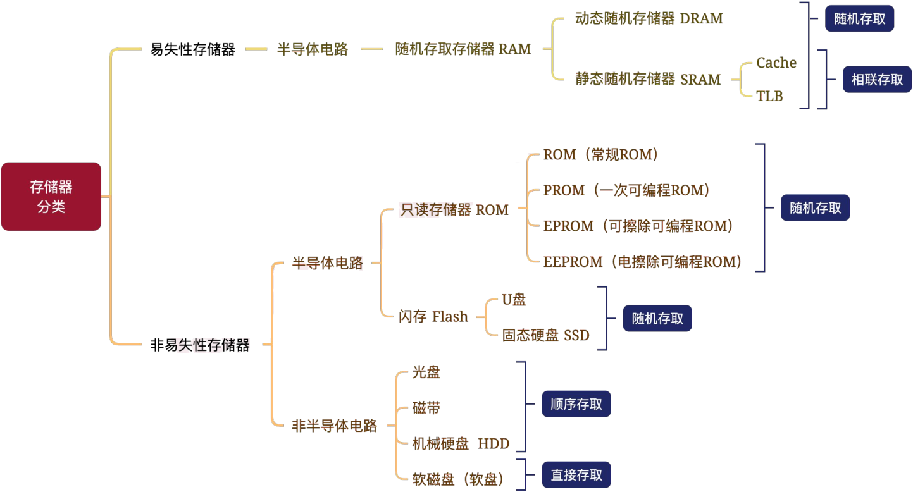
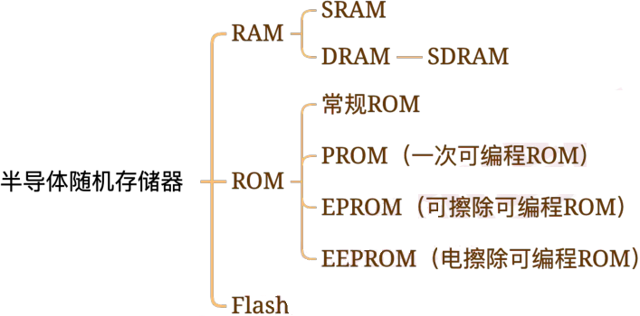

# 计算机组成原理

## 第一章 计算机系统概述

### 冯诺依曼机的特点

1. 采用”<mark>存储程序</mark>“的工作方式。
2. 计算机硬件系统由运算器、存储器、控制器、输入输出设备五大部件组成，<mark>以运算器为核心</mark>。（现代计算机改以<mark>存储器</mark>为核心）
3. 指令和数据以<mark>同等地位</mark>存储在存储器中。
4. 指令和数据均以二进制形式表示。
5. 指令由操作码和地址码组成，操作码指出操作的类型，地址码指出操作数的地址。
6. 程序和功能都是通过中央处理器执行指令实现的。（“<mark>程序控制</mark>”思想）

### 计算机的功能部件

1. 存储器是指主存和辅存。
2. 一个编址的对应一个存储单元，存储单元中存储的叫存储字，每一个bit叫存储元件。
3. 运算器的核心是ALU算数逻辑单元

> 其常见寄存器有：累加器ACC、乘商寄存器MQ、操作数寄存器X、变址寄存器IX、基址寄存器BR。

4. 控制器由程序计数器PC、指令寄存器IR和控制单元CU组成。
5. 存储器地址寄存器MAR、存储器数据寄存器MDR。

### 三种级别的语言

1. 机器语言，是计算机<mark>唯一</mark>可以直接识别和执行的语言。
2. 汇编语言，汇编语言和机器语言一一对应。（汇编相当于机器语言的英语助记）
3. 高级语言。

### 三种翻译程序

将语言与语言进行转换的软件叫做翻译程序。

1. 解释程序（解释器）：将高级语言按序逐条翻译成机器语言并立即执行。
2. 编译程序（编译器）：将高级语言编译成汇编语言<u>或机器语言</u>。
3. 汇编程序（汇编器）将汇编语言汇编成机器语言。

### 软硬件逻辑功能等价性

一个功能既可以由硬件实现、也可以有软件实现，这一等价性称为<mark>软硬件逻辑功能等价性</mark>。

### 三个常见字长

1. 机器字长：简称字长，也叫CPU字长、计算机字长。是指CPU一次整数运算所能处理的二进制位数。机器字长=CPU总线宽度=运算器ALU位数=通用寄存器位数。
2. 存储字长：存储单元的位数（一般按字节编址则8位）
3. 指令字长：一条指令的长度（长度不一，具体和指令内容相关）

### 计算机主要性能指标

1. 时钟周期：CPU脉冲信号宽度，时间单位（一个时钟周期占多少秒）。
2. CPU主频：每秒有多少时钟周期，时钟周期的倒数。
3. CPI：一个指令需要多少时钟周期（个数）。
4. IPS：每秒能执行多少指令（个数）。
5. FLOPS：每秒能执行多少次浮点运算。

## 第二章 数据的表示和运算

### 真值机器数转换

> 进制转换、BCD码、原反补移转换

- 无符号数没有原反补移码，原反补移码只针对有符号数。
- 补码符号位取反得移码。<mark>移码（解读为无符号真值）= 实际真值 + 偏置值</mark>。 

- 真值直接转补码，给补码**符号位设置位权** $-2^i$ 参与运算。

### 数据表示范围

| 定点数               | 定点整数                       | 定点小数                        | 二进制表示       |
| -------------------- | ------------------------------ | ------------------------------- | ---------------- |
| （  n  位）无符号    | $0 \sim 2^n-1$                 | $0 \sim 1-2^{-n}$               | $0000 \sim 1111$ |
| （n+1位）原码 / 反码 | $-(2^n-1) \sim 2^n-1$          | $-(1-2^{-n}) \sim 1-2^{-n}$     | $1111 \sim 0111$ |
| （n+1位）补码        | <mark>$-2^n \sim 2^n-1$</mark> | <mark>$-1 \sim 1-2^{-n}$</mark> | $1000 \sim 0001$ |

- 补码全1为-1。补码最小：符号位为1，其他位有1放后面。
- 补码的符号扩展：高位用符号位填充。

### 加减法运算

- 减法转加法：减去一个数相当于加上这个数的补数。
- 补数求法：**补码所有位取反，再+1**。
- 补数本质：一个数+它的补数=$2^n$。

### 溢出判断

| 加法器标志                  | 含义                                                         |
| --------------------------- | ------------------------------------------------------------ |
| CF (Carry Flag) 进位标志    | 无符号数运算是否溢出，溢出为1。<mark>$CF=C_{in} \oplus C_{out}$</mark> |
| OF (Overflow Flag) 溢出标志 | 有符号数运算是否溢出，溢出为1。<mark>$OF=C_{n} \oplus C_{n-1}$</mark> |
| ZF (Zero Flag) 零标志       | 运算结果是否为0，为零ZF=1。                                  |
| SF (Sign Flag) 符号标志     | 输出运算结果符号。                                           |

双符号位判断溢出（仅针对补码运算）：复制一位符号位，若运算结果两符号位相异则溢出，相同不溢出。

> 无符号数：小减大一定溢出，大减小不会溢出，两数之和可能溢出。
>
> 有符号数：正+正 负+负 可能溢出，正+负 正-正 负-负 不会溢出。

### 乘除法移位

| 移位     | 规则                                                      | 溢出                    | 损失精度 |
| -------- | --------------------------------------------------------- | ----------------------- | -------- |
| 逻辑移位 | 左移：高位移出，低位补0，右移：高位补0，低位移出          | <mark>1被移出</mark>    | 1被移出  |
| 算术移位 | 左移：高位移出，低位补0，右移：高位**补符号位**，低位移出 | <mark>符号位变化</mark> | 1被移出  |

### 一般浮点数

规格化：尾数中数值位的最高位必须是有效位（原码1有效，补码与符号位相异有效）。

### IEEE754浮点数

- 阶码使用移码表示，偏置值为$2^{n-1}-1$。**8位阶码偏置值127**，11位阶码偏置值1023。
- 尾数用原码表示，采用 **1.Y** 的形式，只存储 Y 的内容。

> 应用以上规则时，阶码不能全0或全1，若阶码全0或全1，应用以下规则。

| 阶码 | 尾数 | 结果                     |
| ---- | ---- | ------------------------ |
| 0    | 0    | $0$                      |
| 0    | 非0  | 非规范数 $±0.Y×2^{-126}$ |
| 255  | 0    | $∞$                      |
| 255  | 非0  | $NaN$                    |

- 只有能写成 $±\frac{A}{2^n}$ 的形式的十进制小数才能转成二进制小数。

### 浮点数加减运算

1. 对阶：小阶向大阶对齐
2. 尾数运算
3. 尾数规格化
4. 舍入处理：多余$m$位的值$>\frac{2^m}{2}$则进1，$<\frac{2^m}{2}$则舍去，$=\frac{2^m}{2}$看保留的最低位，为0舍去，为1进1。
5. 溢出判断：尾数的溢出通过调整阶码解决，阶码溢出是真的溢出。

> 尾数右规、舍入可能造成阶码上溢，尾数左规可能造成阶码下溢。

### 乘除法总结

- 迭代式乘除法器：n位运算约需2n个时钟周期
- 阵列式乘除法器：一个时钟周期内完成运算
- 移位实现乘除法：手算方法，若乘除$2^n$则进行移位，若非$2^n$则转十进制（硬件实现最慢）

### 数据存储

- 小端存储：低位字节放到低地址处，高位字节放到高地址处。
- 大端存储：低位字节放到高地址处，高位字节放到低地址处。

### 边界对齐

- 双字数据（8个字节）的起始地址必须为8的倍数（地址末尾为000）
- 单字数据（4个字节）的起始地址必须为4的倍数（地址末尾为00）
- 半字数据（2个字节）的起始地址必须为2的倍数（地址末尾为0）

## 第三章 存储系统

&nbsp;&nbsp;&nbsp;

### 存储器分类

#### 存储层级间的透明问题

- Cache-主存层调度由硬件自动完成，对所有程序员透明。
- 主存-辅存层调度由硬件和操作系统共同完成，对应用程序员透明。

> 透明=看不见。

#### 按存储介质分类

#### 按存取方式分类

| 四种存取方式 | 存取逻辑                           | 对应设备         |
| ------------ | ---------------------------------- | ---------------- |
| 顺序存取     | 读取时必须按顺序逐个读取，无法跳过 | 光盘、磁带、软盘 |
| 随机存取     | 任意时刻可以访问任意位置           | RAM、ROM、Flash  |
| 直接存取     | 选取信息所在区域，然后顺序访问     | 机械硬盘 HDD     |
| 相联存取     | 通过数据的内容进行存取             | Cache、TLB       |

### 存储器性能指标

#### Cache平均访问时间/存取时间

- CPU首先去Cache中取数据，若未命中则将数据从主存调入Cache，再从Cache访问数据。
- 平均访问时间 = 命中率 × 访问Cache时间 +（1 - 命中率）×（访问Cache时间 + 访问主存时间）

#### 存取周期和存取时间

- 存取（存储）周期：可以**连续读写的最短时间间隔**，可以理解为<u>存储器准备数据的时间</u>。
- 存取周期 = 存取时间 + 恢复时间

#### 主存带宽

主存带宽 $B_m$，也称数据传输速率，表示每秒从主存进出信息的最大数据量，单位字/秒、字节/秒。

#### 存储容量

存储容量 = 存储单元数（可寻单元数）× 存储单元长度（存储字长）

#### 地址位数和存储单元个数

n 位地址 ⇔ $2^n$ 个存储单元

### 静态随机存储器 SRAM

- SRAM集成度低、速度快、价格高、故<mark>仅SRAM能用作Cache、TLB</mark>。

- 数据线个数 = 数据位数 = 存储字长
- 地址线个数 = 地址位数

- 单译码结构：$n$位地址，$2^n$个地址单元，$2^n$根译码线
- 双译码结构：$n$位地址，$2^n$个地址单元，<mark>$2·2^\frac{n}{2}$</mark>根译码线

### 动态随机存储器 DRAM

1. 需要刷新，且是按行刷新的。

刷新周期：刷新周期内，每行都须刷新一次。

分散刷新：存取周期之后进行一次刷新，分散刷新增加了原存取周期的时间。

集中刷新：读取完毕后集中进行多次刷新操作。

异步刷新：

2. 行列地址复用：先传行地址，再传列地址。

异步刷新：

异步刷新：

3. 有一个行缓冲区。

异步刷新：

异步刷新：

### SRAM和DRAM的对比

| 特点       | SRAM | DRAM |
| ---------- | ---- | ---- |
| 存储信息   |      |      |
| 破环性读出 |      |      |
| 需要刷新   |      |      |
| 送行列地址 |      |      |
| 运行速度   |      |      |
| 集成度     |      |      |
| 存储成本   |      |      |
| 主要用途   |      |      |

### SDRAM
