# 计算机组成原理

## 第一章 计算机系统概述

<center>
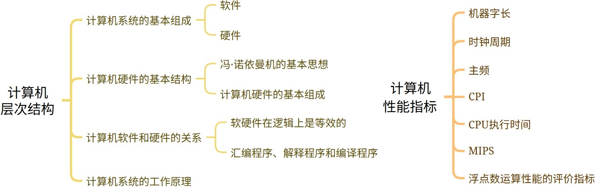
</center>

### 冯诺依曼机的特点

1. 采用”<mark>存储程序</mark>“的工作方式。
2. 计算机硬件系统由运算器、存储器、控制器、输入输出设备五大部件组成，<mark>以运算器为核心</mark>。（现代计算机改以<mark>存储器</mark>为核心）
3. 指令和数据以<mark>同等地位</mark>存储在存储器中。
4. 指令和数据均以二进制形式表示。
5. 指令由操作码和地址码组成，操作码指出操作的类型，地址码指出操作数的地址。
6. 程序和功能都是通过中央处理器执行指令实现的。（“<mark>程序控制</mark>”思想）

### 计算机的功能部件

1. 存储器是指主存和辅存。
2. 一个编址的对应一个存储单元，存储单元中存储的叫存储字，每一个bit叫存储元件。
3. 运算器的核心是ALU算数逻辑单元

> 其常见寄存器有：累加器ACC、乘商寄存器MQ、操作数寄存器X、变址寄存器IX、基址寄存器BR。

4. 控制器由程序计数器PC、指令寄存器IR和控制单元CU组成。
5. 存储器地址寄存器MAR、存储器数据寄存器MDR。

### 三种级别的语言

1. 机器语言，是计算机<mark>唯一</mark>可以直接识别和执行的语言。
2. 汇编语言，汇编语言和机器语言一一对应。（汇编相当于机器语言的英语助记）
3. 高级语言。

### 三种翻译程序

将语言与语言进行转换的软件叫做翻译程序。

1. 解释程序（解释器）：将高级语言按序逐条翻译成机器语言并立即执行。
2. 编译程序（编译器）：将高级语言编译成<mark>汇编语言或机器语言</mark>。
3. 汇编程序（汇编器）将汇编语言汇编成机器语言。

<center>
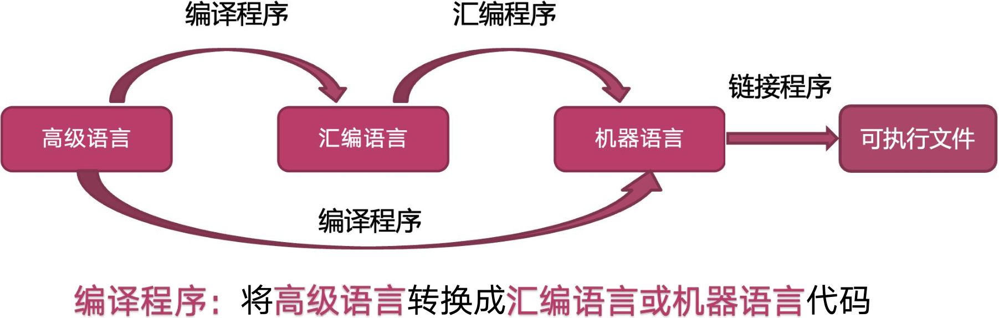
</center>


### 软硬件逻辑功能等价性

一个功能既可以由硬件实现、也可以有软件实现，这一等价性称为<mark>软硬件逻辑功能等价性</mark>。

### 三个常见字长

1. 机器字长：也叫CPU字长/计算机字长，简称字长。指CPU一次运算所能处理的位数。机器字长=CPU总线宽度=运算器ALU位数=通用寄存器位数。
2. 存储字长：存储单元的位数（一般按字节编址则8位）
3. 指令字长：一条指令的长度（长度不一，具体和指令内容相关）

### 计算机主要性能指标

1. 时钟周期：CPU脉冲信号宽度，时间单位（一个时钟周期占多少秒）。
2. CPU主频：每秒有多少时钟周期，时钟周期的倒数。
3. CPI：一个指令需要多少时钟周期（个数）。
4. IPS：每秒能执行多少指令（个数）。
5. FLOPS：每秒能执行多少次浮点运算。

## 第二章 数据的表示和运算

<center>
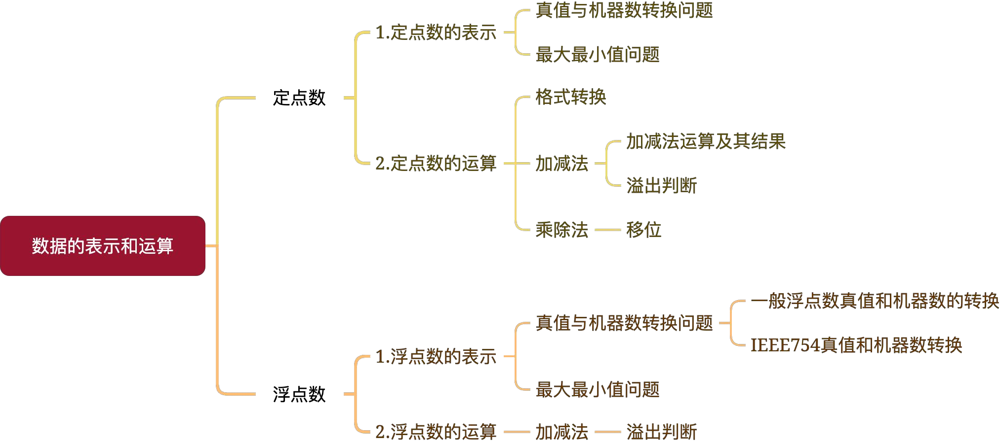
</center>

### 真值机器数转换

> 进制转换、BCD码、原反补移转换

- 无符号数没有原反补移码，原反补移码只针对有符号数。
- 补码符号位取反得移码。<mark>移码（解读为无符号真值）= 实际真值 + 偏置值</mark>。 

<center>
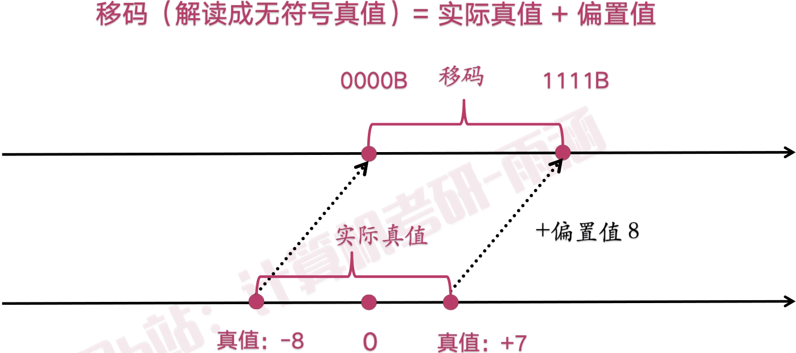
</center>

- 补码转真值：给补码**符号位设置位权** $-2^i$ 参与运算。

### 数据表示范围

| 定点数              | 定点整数                       | 定点小数                        | 二进制表示       |
| ------------------- | ------------------------------ | ------------------------------- | ---------------- |
| （`  n  `位）无符号 | $0 \sim 2^n-1$                 | $0 \sim 1-2^{-n}$               | $0000 \sim 1111$ |
| （`n+1`位）原码     | $-(2^n-1) \sim 2^n-1$          | $-(1-2^{-n}) \sim 1-2^{-n}$     | $1111 \sim 0111$ |
| （`n+1`位）补码     | <mark>$-2^n \sim 2^n-1$</mark> | <mark>$-1 \sim 1-2^{-n}$</mark> | $1000 \sim 0111$ |

- 补码全1为-1。补码最小：符号位为1，数值位有1放后面。
- 补码的符号扩展：高位用符号位填充。

### 加法器运算

- 减法转加法：减去一个数相当于加上这个数的补数。
- 补数求法：**补码所有位取反，再+1**。
- 补数本质：一个数+它的补数=$2^n$。

<center>
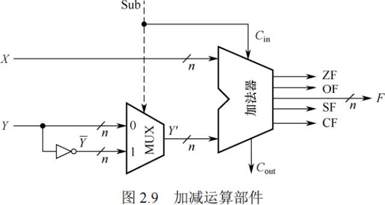
</center>

### 加法器溢出判断

| 加法器标志                  | 含义                                                         |
| --------------------------- | ------------------------------------------------------------ |
| CF (Carry Flag) 进位标志    | 无符号数运算是否溢出，溢出为1。<mark>$CF=C_{in} \oplus C_{out}$</mark> |
| OF (Overflow Flag) 溢出标志 | 有符号数运算是否溢出，溢出为1。<mark>$OF=C_{n} \oplus C_{n-1}$</mark> |
| ZF (Zero Flag) 零标志       | 运算结果是否为0，为零ZF=1。                                  |
| SF (Sign Flag) 符号标志     | 输出运算结果符号。                                           |

双符号位判断溢出（仅针对补码运算）：复制一位符号位，若运算结果两符号位相异则溢出，相同不溢出。

<center>
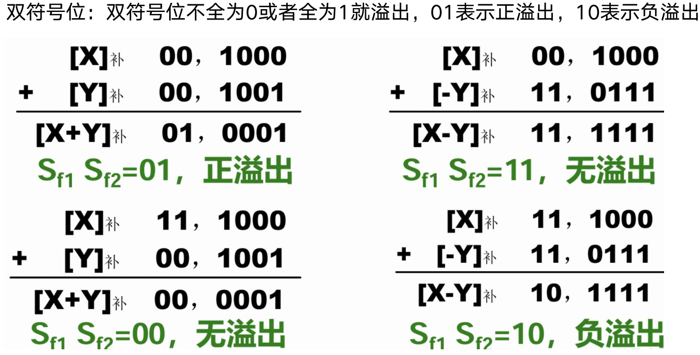
</center>

> 无符号数：小减大一定溢出，大减小不会溢出，两数之和可能溢出。
>
> 有符号数：正+正 负+负 可能溢出，正+负 正-正 负-负 不会溢出。

### 乘除法移位

| 移位     | 规则                                                      | 溢出                    | 损失精度  |
| -------- | --------------------------------------------------------- | ----------------------- | --------- |
| 逻辑移位 | 左移：高位移出，低位补0，右移：高位补0，低位移出          | <mark>1被左移出</mark>  | 1被右移出 |
| 算术移位 | 左移：高位移出，低位补0，右移：高位**补符号位**，低位移出 | <mark>符号位变化</mark> | 1被右移出 |

> 算术移位一般用于有符号数，因为有符号数专注算术运算。
>
> 一般算术移位需要先写出补码，但使用原码也可以只需要保持符号位不变即可。

### 一般浮点数

<center>

</center>

规格化：尾数的最高位必须是有效位。原码1有效，补码须与符号位相异有效。

### IEEE754浮点数

<center>
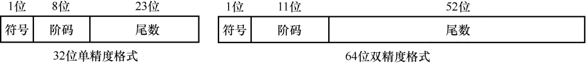
</center>

- 阶码使用移码表示，偏置值为$2^{n-1}-1$。**8位阶码偏置值127**，11位阶码偏置值1023。
- 尾数用原码表示，采用 **1.Y** 的形式，只存储 Y 的内容。

> 应用以上规则时，阶码不能全0或全1，若阶码全0或全1，应用以下规则。

| 阶码 | 尾数 | 结果                                    |
| ---- | ---- | --------------------------------------- |
| 0    | 0    | $0$                                     |
| 0    | 非0  | 非规范数 $±\bbox[yellow]{0.Y}×2^{-126}$ |
| 255  | 0    | $∞$                                     |
| 255  | 非0  | $NaN$                                   |

<center>
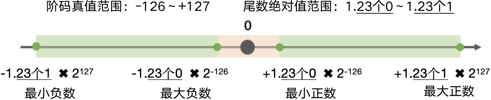
</center>

- 只有能写成 $±\frac{A}{2^n}$ 的形式的十进制小数才能转成二进制小数。

### 浮点数加减运算

1. 对阶：小阶向大阶对齐
2. 尾数运算
3. 尾数规格化：写成 1.Y 的形式
4. 舍入处理：多余$m$位，最高位为1进1，为0舍去，$=\frac{2^m}{2}$看保留的最低位，为0舍去，为1进1。
5. 溢出判断：尾数的溢出通过调整阶码解决，阶码溢出是真的溢出。

> 尾数右规、舍入可能造成阶码上溢，尾数左规可能造成阶码下溢。

### 乘除法总结

- 迭代式乘除法器：n位运算约需2n个时钟周期
- 阵列式乘除法器：一个时钟周期内完成运算
- 移位实现乘除法：手算方法，若乘除$2^n$则进行移位，若非$2^n$则转十进制（硬件实现最慢）

### 数据存储

- 小端存储：低位字节放到低地址处，高位字节放到高地址处。
- 大端存储：低位字节放到高地址处，高位字节放到低地址处。

### 边界对齐

- 双字数据（8个字节）的起始地址必须为8的倍数（地址末尾为000）
- 单字数据（4个字节）的起始地址必须为4的倍数（地址末尾为00）
- 半字数据（2个字节）的起始地址必须为2的倍数（地址末尾为0）

## 第三章 存储系统

<div style="display: flex; gap: 20px; align-items: center; justify-content: center;">
 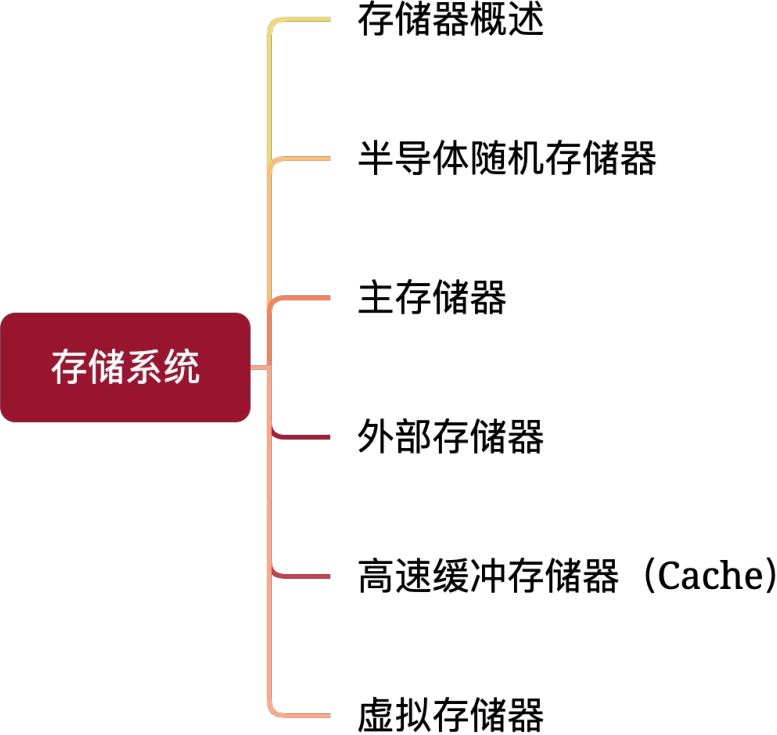
 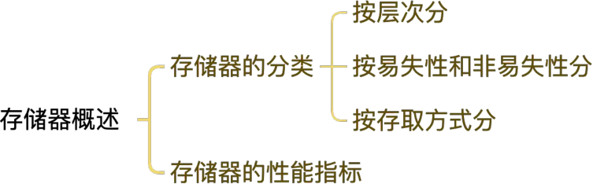
</div>

### 存储器分类

#### 存储层级间的透明问题

- Cache-主存层调度由硬件自动完成，对所有程序员透明。
- 主存-辅存层调度由硬件和操作系统共同完成，对应用程序员透明。

> 透明=看不见。

#### 按存储介质分类

<center>
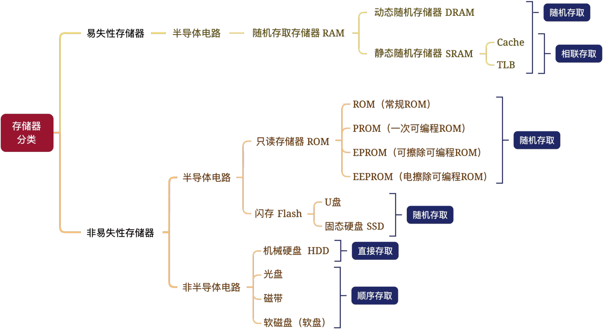
</center>

#### 按存取方式分类

| 四种存取方式 | 存取逻辑                           | 对应设备         |
| ------------ | ---------------------------------- | ---------------- |
| 顺序存取     | 读取时必须按顺序逐个读取，无法跳过 | 光盘、磁带、软盘 |
| 随机存取     | 任意时刻可以访问任意位置           | RAM、ROM、Flash  |
| 直接存取     | 选取信息所在区域，然后顺序访问     | 机械硬盘 HDD     |
| 相联存取     | 通过数据的内容进行存取             | Cache、TLB       |

### 存储器性能指标

#### Cache平均访问时间/存取时间

CPU首先去Cache中取数据，若未命中则将数据从主存调入Cache，再从Cache访问数据。

- 平均访问时间 = 命中率 × 访问Cache时间 + (1 - 命中率) × (访问Cache时间 + 访问主存时间)

#### 存取周期和存取时间

- 存取（存储）周期：可以**连续读写的最短时间间隔**，可以理解为<u>存储器准备数据的时间</u>。
- 存取周期 = 存取时间 + 恢复时间

<center>
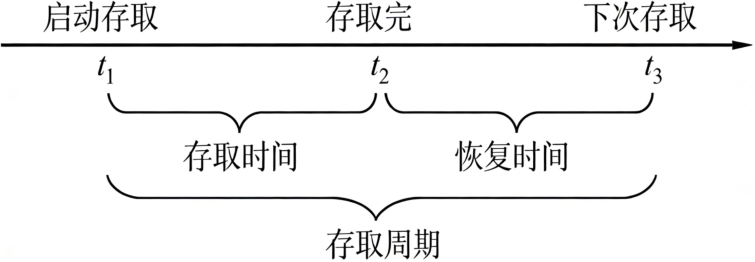
</center>

#### 主存带宽

主存带宽 $B_m$，也称数据传输速率，表示每秒从主存进出信息的最大数据量，单位字/秒、字节/秒。

> 注意换算单位：1KB=1024B，1s=1000ms。字节和秒换算尺度不统一，不能约掉。

#### 存储容量

存储容量 = 存储单元数（可寻单元数）× 存储单元长度（存储字长）

#### 地址位数和存储单元个数

n 位地址 ⇔ $2^n$ 个存储单元


### 静态随机存储器 SRAM

- SRAM集成度低、速度快、价格高、故<mark>仅SRAM能用作Cache、TLB</mark>。
- 数据线个数 = 数据位数 = 存储字长
- 地址线个数 = 地址位数

<center>
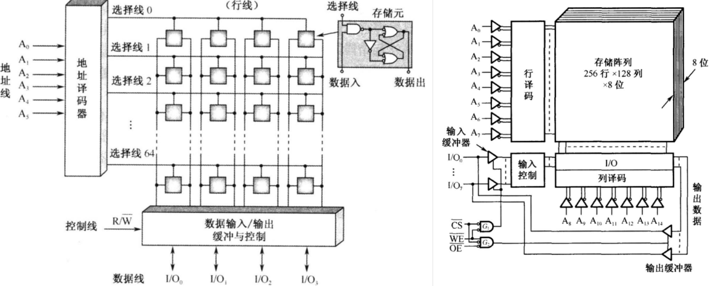
</center>

- 单译码结构：$n$位地址，$2^n$个地址单元，$2^n$根译码线
- 双译码结构：$n$位地址，$2^n$个地址单元，<mark>$2·2^\frac{n}{2}$</mark>根译码线

### 动态随机存储器 DRAM

1. 需要刷新，且是<mark>按行刷新</mark>。

刷新周期：刷新周期内，每行都经历一次刷新。

刷新一行的耗时就是一个存储周期。刷新时不可读写，故称为死时间。

| 刷新方式 | 策略                                             | 优缺点                 |
| -------- | ------------------------------------------------ | ---------------------- |
| 分散刷新 | 存取周期之后进行一次刷新，刷新时间囊括进存取周期 | 无死时间，存取周期翻倍 |
| 集中刷新 | 刷新周期的后期集中刷新所有行                     | 死时间长               |
| 异步刷新 | 刷新周期分成行数段，每一段最后进行一次刷新       | 死时间短               |

<center>
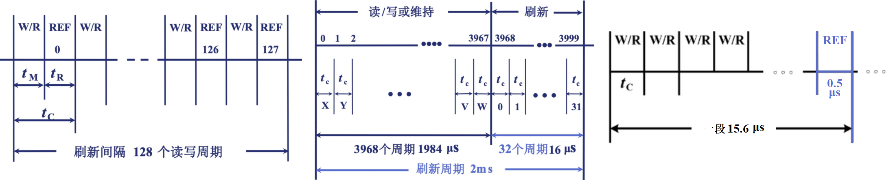
</center>

2. <mark>行列地址复用</mark>：同一组地址管脚（引脚）先传行地址，再传列地址。地址管脚数取行列地址数的最大值。

3. 行缓冲区：大小为一行数据大小。

<center>
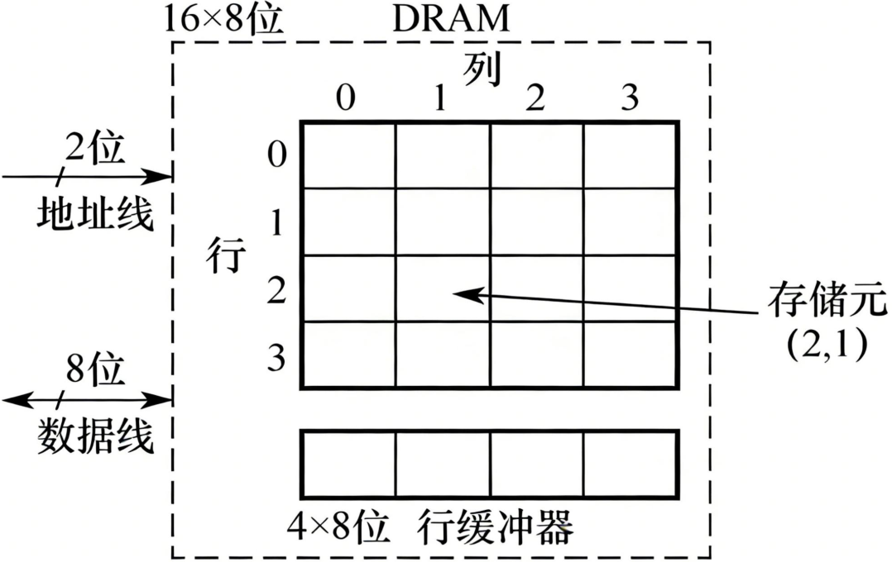
</center>

#### SRAM和DRAM的对比

| 特点           | SRAM         | DRAM         |
| -------------- | ------------ | ------------ |
| 存储信息       | 触发器       | 电容         |
| 破环性读出     | 不是         | 是           |
| **需要刷新**   | **不是**     | **是**       |
| **送行列地址** | **同时送**   | **分两次送** |
| **运行速度**   | **快**       | **慢**       |
| 集成度         | 低           | 高           |
| 存储成本       | 高           | 低           |
| **主要用途**   | **高速缓存** | **内存**     |

::: tip RAM参数

$4M×8位$存储器（默认行列数相等）：

- $4M=2^{22}$ 是存储单元个数，即需 $2^{22}$ 个地址，
  - 若是SRAM需要22根地址，分11根行和列地址线
  - 若是DRAM需要11根地址线，行列共用这11根地址线


- $8位$是存储单元容量 = 数据线位数

:::

#### SDRAM

SDRAM叫**同步**动态随机存储器，继承DRAM的所有特点，另外支持突发传输、流水线，连续读写更快。

### 存储芯片的扩展

| 扩展方式     | 含义                                               |
| ------------ | -------------------------------------------------- |
| 位扩展       | 多个芯片”并联“，存储单元个数不变，存储单元位数 ×2  |
| 字扩展       | 多个芯片”串联“，存储单元个数 ×2，存储单元位数不变  |
| 字位同时扩展 | 多个芯片”串并联“，存储单元个数 ×2，存储单元位数 ×2 |

> 存储单元个数 和 地址位数 有关，存储单元位数 = 存储单元容量。

<center>
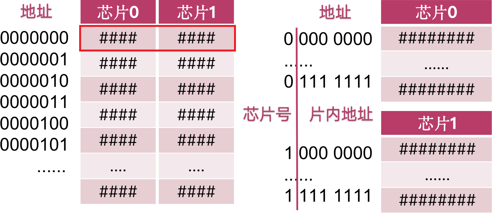
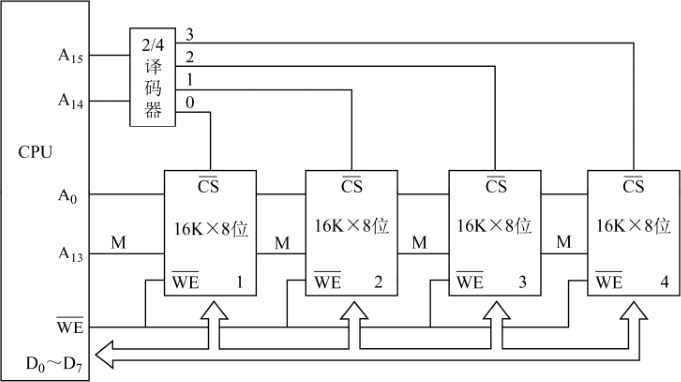
</center>


### 多模块存储器

> 多模块存储器是指多个存储体的组合。

#### 高位交叉编址 / 连续交叉编址

多个存储体“串联”，地址高位作“体号”、低位作“体内地址”。缺点：数据传输不连续。

<center>
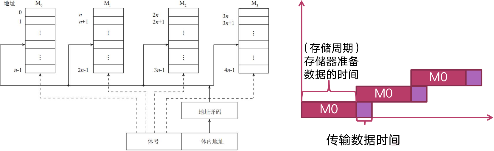
</center>

#### 低位交叉编址（轮流启动）

多个存储体“并联”，地址高位作“体内地址”、低位作“体号”。优点：数据传输连续。

<center>
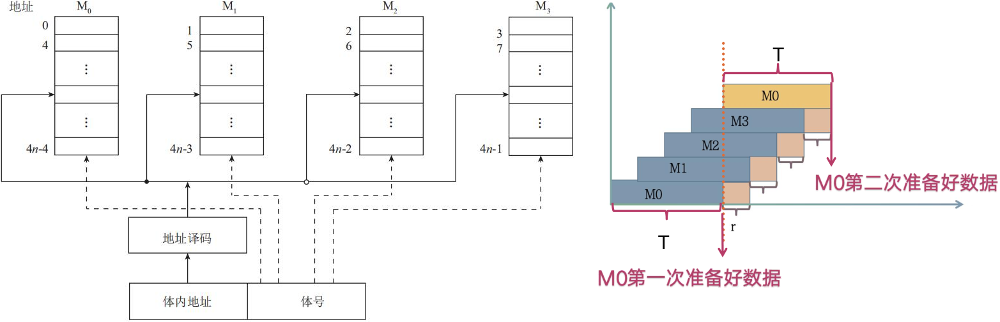
</center>

最佳情况：

- <mark>$T=mr$</mark>，存储周期 = 体数 × 数据传输时间，$m=\frac{T}{r}$ 时效率最高。
- 连续存取 $n$ 个体需要的时间 $t=\bbox[yellow]{T+(n-1)r}$.
- 连续存取并传输 $n$ 个体需要的时间 $t=\bbox[yellow]{T+nr}$.

> 一个存储周期内存储器可以存取 $m$ 个存储字，一个数据传输时间内存储器可以存取 $1$ 个存储字。

#### 低位交叉编址（同时启动）

同时启动每次存取数据只能访问“同一行”。如果数据跨行存储，就需要多个存储周期。

- 轮流启动：数据总线宽度 = MDR 位数 = 存储字长。
- 同时启动：数据总线宽度 = MDR 位数 = <mark>存储字长 ×  体数</mark>。

<center>
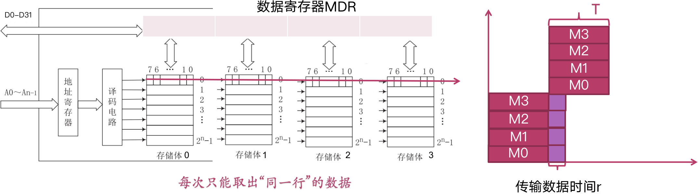
</center>

### 只读存储器 ROM

| 名称                      | 特点               |
| ------------------------- | ------------------ |
| ROM（常规ROM）            | 只能读不能写       |
| PROM（一次可编程ROM）     | 可以写一次，不能擦 |
| EPROM（可擦除可编程ROM）  | 紫外线擦除         |
| EEPROM（电擦除可编程ROM） | 高电压擦除         |

### 闪存 Flash

- U盘、固态硬盘
- 非易失性存储器，断电后可长期保存，支持电擦除和在线重写，读写性能不对称，读比写快得多。

### 机械硬盘 HDD

机械硬盘HDD，也叫温彻斯特硬盘，以磁性存储为主。

#### 结构

- 盘片：存储数据
- 磁盘驱动器：接收控制信号负责读写
- 磁盘控制器：接收CPU指令发送控制信号

#### 数据

- 盘面数：用于存储数据的单双面的数量
- 柱面数：盘片上有多少条磁道
- 扇区数：磁道上有多少个扇区

#### 磁盘地址结构

<center>

</center>

若驱动器唯一则驱动器号可省略。

#### 性能指标

1. 记录密度：

- 道密度：半径方向单位长度上的磁道数
- 位密度：磁道单位长度上的能记录的二进制位数
- 面密度：道密度 × 面密度

2. 磁盘容量：有格式化容量和非格式化容量，格式化容量比非格式化容量小。
3. <mark>平均存取时间 = 寻道时间 + 旋转延迟时间 + 数据读取时间</mark>

- 寻道时间：直接给出
- 旋转延迟时间：在磁道上**转半圈**的时间
- 数据读取时间：磁头扫过数据块的时间（取决于数据占磁道区域的比例）

#### 独立磁盘冗余阵列 RAID

RAID：将多个物理硬盘以不同的方式组合成一个逻辑硬盘的技术。

使用RAID的目的：提高硬盘的**读写性能**和**数据安全可靠性**。提高可靠性只有两种方式：冗余和校验。

| RAID    | 技术                                         | 特点                           |
| ------- | -------------------------------------------- | ------------------------------ |
| RAID0   | **条带化**存储，并联多个硬盘，类似交叉编址   | **提高速度，无冗余，无校验**   |
| RAID1   | 磁盘**镜像**技术，提供冗余，适合存储关键数据 | 镜像存储，**一半冗余，无校验** |
| RAID2   | **海明码校验**                               | **冗余少**存储校验码           |
| RAID3~6 | **奇偶校验**                                 | **冗余少**存储校验码           |

### 固态硬盘 SSD

- 半导体器件
- 随机访问延迟极低、无噪声振动、功耗低、抗震、安全。价格贵、容量低、耐用性差、数据难恢复。

#### 内部结构

<center>
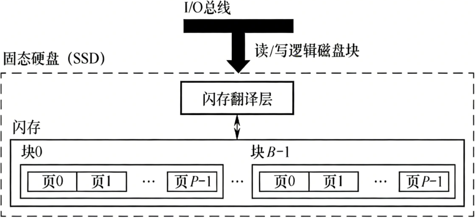
</center>

- 页级读写：以页为单位读写。
- 块级擦除：以块位单位擦除。

> 写速度慢的原因就是，改写一个块需要到另一个页中<u>拷贝</u>并改写。

#### 磨损均衡技术

- 动态磨损均衡：写入时优先选择擦写次数较少的空闲块。
- 静态磨损均衡：控制器定期扫描，将高磨损块的数据迁移至低磨损块中，高磨损块以读为主，低磨损块以写为主，以均衡整体寿命。

### Cache的基本原理

> 局部性原理：
> - 时间局部性：现在用的信息未来还要用
> - 空间局部性：未来用的信息在现在用的旁边
>
> CPU访问数据逻辑：
> - 首先去Cache中取数据，若命中，则算一次Cache存取。
> - 若未命中，则将数据从主存调入Cache，再从Cache访问数据，算一次Cache存取 + 一次主存存取。

- Cache的命中率 $h = \frac{N_c}{N_c+N_m}$ .
- 平均访问时间 = 命中率 × 访问Cache时间 + (1 - 命中率) × (访问Cache时间 + 访问主存时间)
- 平均访问时间 =                 访问Cache时间 + (1 - 命中率) × 访问主存时间

### Cache的映射方式

#### 直接映射

<center>
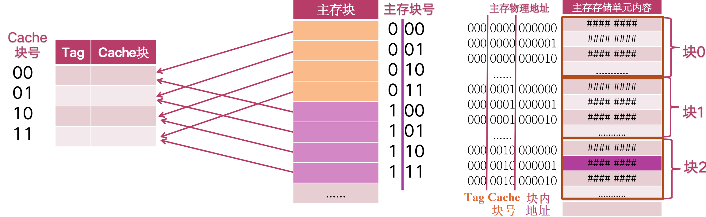
</center>

直接映射主存块需要放到对应Cache块号的位置。找的时候也是找Cache号对应位置，再对比Tag。

- Cache块号 = 主存块号 % Cache块数
- 主存地址 = <font color= "#de6c36">主存块号</font> + <font color= "#b34d70">块内地址</font> = <font color= "#de6c36">Tag + Cache块号</font> + <font color= "#b34d70">块内地址</font>

<center>
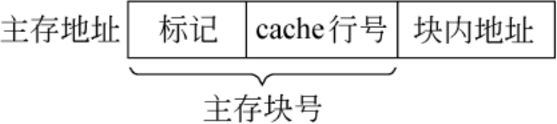
</center>

> 块内地址位数取决于块大小，块号位数取决于Cache块数，主存地址位数取决于主存大小。

#### 全相联映射

<center>
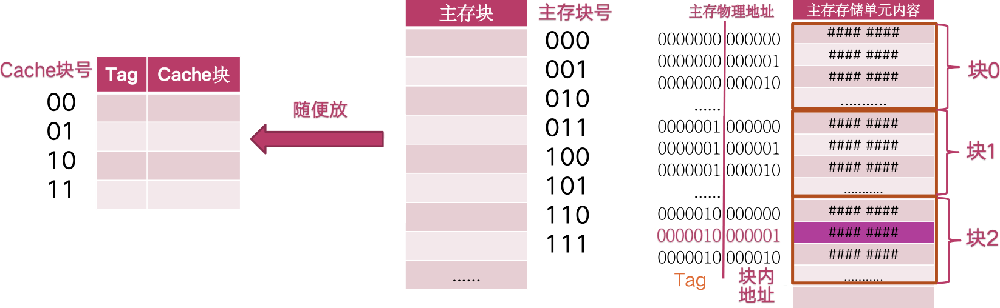
</center>

全相联映射主存块可以随便放。

- 主存地址 = <font color= "#de6c36">主存块号</font> + <font color= "#b34d70">块内地址</font> = <font color= "#de6c36">Tag</font> + <font color= "#b34d70">块内地址</font>

<center>
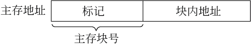
</center>

#### 组相联映射

组相联映射主存块放在对应组，组内位置随便放。

- $n$ 路组相联 ⇔ 一个组内有 $n$ 个Cache块
- Cache组数 = Cache总块数 / 路数

<center>
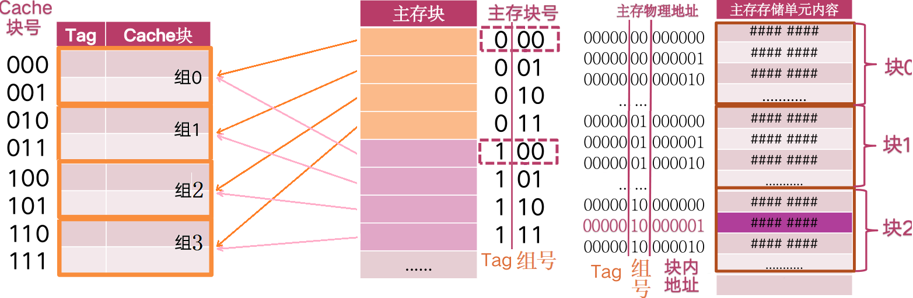
</center>

- 组号 = 主存块号 % 组数
- 主存地址 = <font color= "#de6c36">主存块号</font> + <font color= "#b34d70">块内地址</font> = <font color= "#de6c36">Tag + Cache组号</font> + <font color= "#b34d70">块内地址</font>

<center>
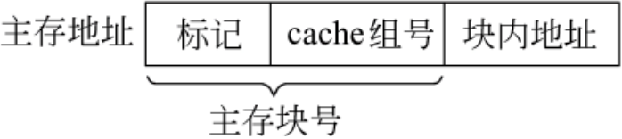
</center>

### Cache的比较器

| 映射方式   | 比较次数                                  |
| ---------- | ----------------------------------------- |
| 全相联映射 | 每个块都要对比Tag，有多少块对比多少次     |
| 直接映射   | 主存块去往Cache块的位置固定，仅需对比一次 |
| 组相联映射 | 组内有几块，就需要对比几次                |

- 需要对比几次，就会有几个对比器硬件。
- 比较器仅需对比Tag位，比较器位数就是Tag位数。

<center>
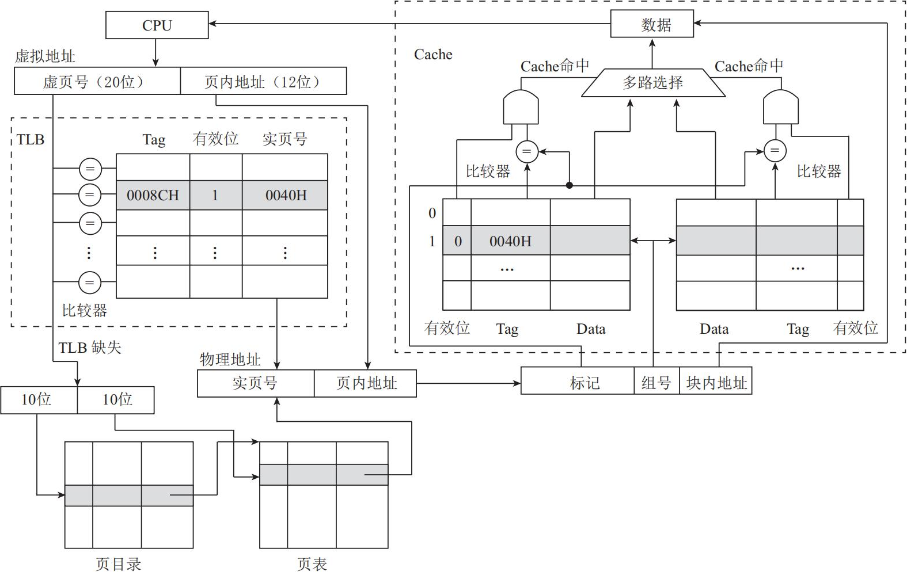
</center>

### Cache块的替换算法

| 替换算法             | 策略                                    |
| -------------------- | --------------------------------------- |
| RAND 随机            | 随机找一个位置替换                      |
| FIFO 先进先出        | 谁先进来替换谁                          |
| LRU 最近最久未使用 ★ | 设置计数器，没使用就加1，替换计数最大者 |
| LFU 最不经常使用     | 设置计数器，被使用就加1，替换计数最小者 |

FIFO、LRU 的替换控制位的位数均为 $log_2{n}$。组相联时 $n$ 为组的路数，全相联时 $n$ 为Cache总行数。

LRU 手算方法：用眼看序列，向前找第 n 个即最近最久未使用的。

```
共有4个Cache块，访问主存块序列  1  2  3  4  1  2  5
                          <------√4--3--2--1--↑--    
```

### Cache的写策略

| 情况     | 名称       | 策略                           | 优缺点                   |
| -------- | ---------- | ------------------------------ | ------------------------ |
| 写命中   | 全写法     | 同时写入Cache和主存            | 数据一致性，增加访存次数 |
| 写命中   | 回写法     | 写入Cache，替换时才写入主存    | 数据不一致，减少访存次数 |
| 写不命中 | 写分配法   | 加载主存块到Cache，只更新Cache |                          |
| 写不命中 | 非写分配法 | 只写入主存，不进行调块         |                          |

> 全写法可以提供写缓冲队列，CPU同时写入Cache和缓冲区，缓冲区自行写入主存。
>
> 回写法会为每个Cache块设置修改位（脏位）。

写分配法只能搭配回写法（默认情况），非写分配法只能搭配全写法。

<center>
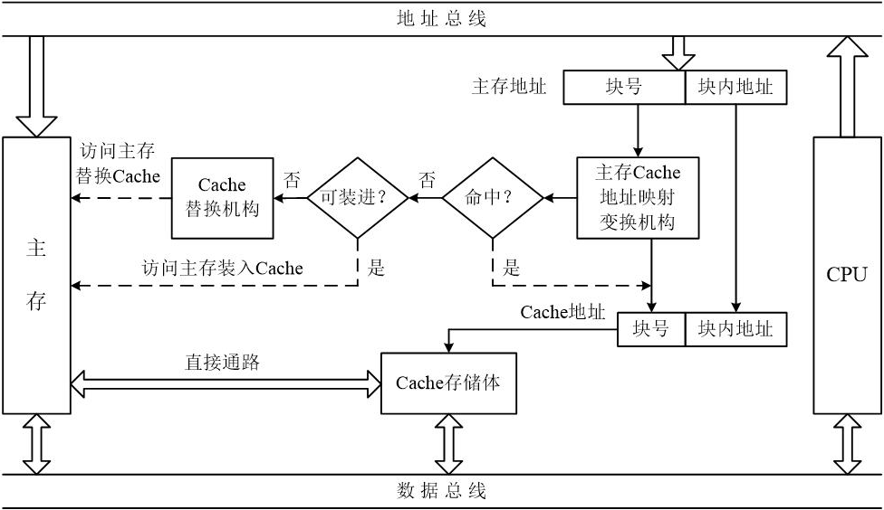
</center>

### Cache的容量

- Cache一行容量：

<font color= "#de6c36">标记项</font> + <font color= "#b34d70">数据块</font> = <font color= "#de6c36">有效位1b + 标记位Tag + 回写法脏位1b + LRU/FIFO替换控制位logn</font> + <font color= "#b34d70">数据块</font>

- Cache的总容量：

Cache行数 × Cache一行容量

### 页式虚拟存储器

#### 基本概念

> 常规存储器的缺点：
>
> 1. 一次性：必须全部加载才能运行整个作业，故当作业很大或有大量作业无法全部装入。
> 2. 驻留性：作业执行完毕前，必须全部驻留内存。

虚拟存储器解决主存容量不够用的问题，存在于主存-辅存层，故虚拟地址与物理地址的转换有操作系统负责。

内存和外存的数据交换以页为单位。虚拟存储器中称页，主存中称页框，它们的大小必须相同。

- “基本分页”：基于常规存储器，将程序的所有页导入内存。
- “请求分页”：基于虚拟存储器，只将访问的页导入内存。

一个进程拥有一个虚拟地址空间和一个页表，主存唯一存在。

#### 虚拟地址转换过程

页内地址不变，虚页号查页表转换成页框号。

<center>
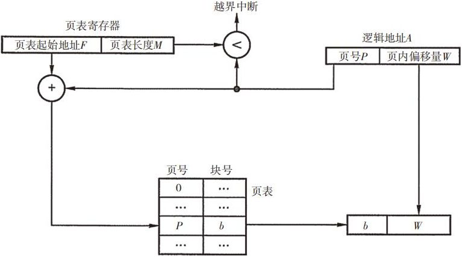
</center>

#### 页表的大小

| 数量       | 求法                                        |
| ---------- | ------------------------------------------- |
| 页的大小   | 页内地址位数 (Byte)                         |
| 页表的大小 | 页表项 = 页号 + 页框号，页表长度 = 页号位数 |

<center>
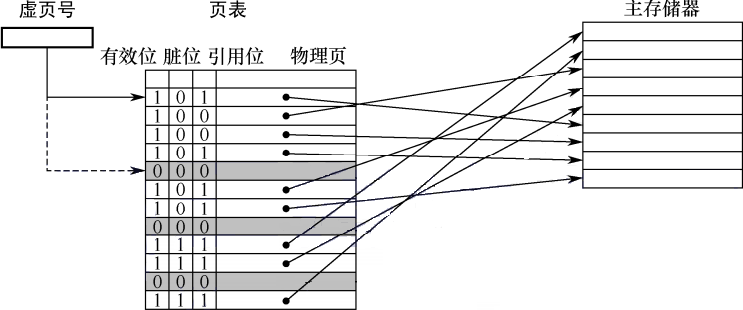
</center>

#### MMU和OS的任务

| 角色     | 任务                                                    |
| -------- | ------------------------------------------------------- |
| 硬件 MMU | 逻辑地址到物理地址的转换（先查TLB，未命中则查页表）     |
| 软件 OS  | 页表/段表的建立、更新、缺页中断处理、权限检查及异常处理 |

### 快表TLB

> 快表TLB使用高速缓冲存储器，速度和Cache一致，地址转换先查TLB可以保证速度。
>
> 快表TLB和Cache都是相联存储器，快表采用全相联映射。

<center>
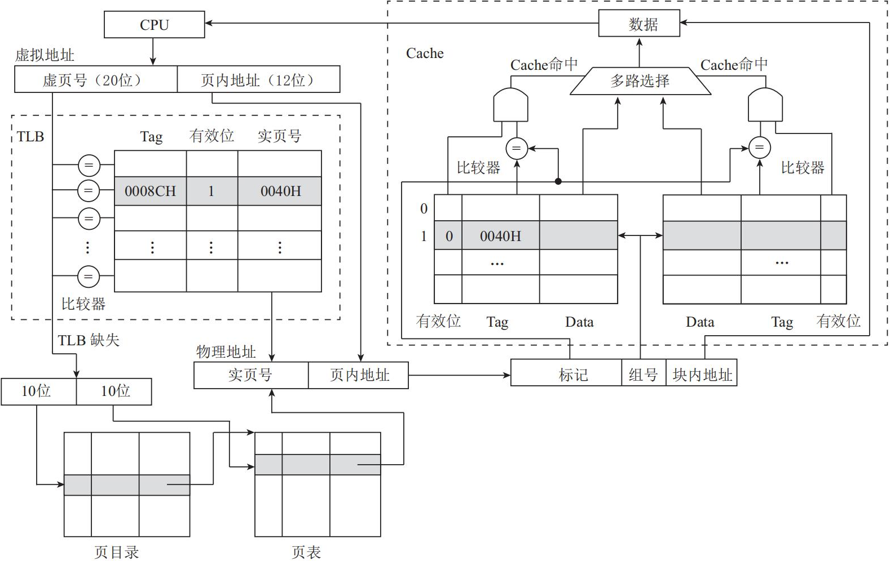
</center>

#### 命中情况组合

| 情况 | TLB  | Page | Cache | 访内存次数和工作 | 访外存次数和工作 |
| ---- | ---- | ---- | ----- | ---------------- | ---------------- |
| 1    | 命中 | 命中 | 命中  | 0                |                  |
| 2    | 命中 | 命中 | 缺失  | 1 获取数据       |                  |
| 3    | 缺失 | 命中 | 命中  | 1 获取地址       |                  |
| 4    | 缺失 | 命中 | 缺失  | 2 地址和数据     |                  |
| 5    | 缺失 | 缺失 | 缺失  | 2 地址和数据     | 1 调入内存       |

1. TLB命中，Page一定命中
2. Cache命中，Page一定命中

### 段页式虚拟存储器

#### 段式虚拟存储器

不按页分按段分，段长不固定。地址划分为段号和段内地址。段表项中存储段长和基址。

段号须小于段表长度、段内偏移量须小于段长。段内偏移量 + 基址 = 数据的地址。

<center>
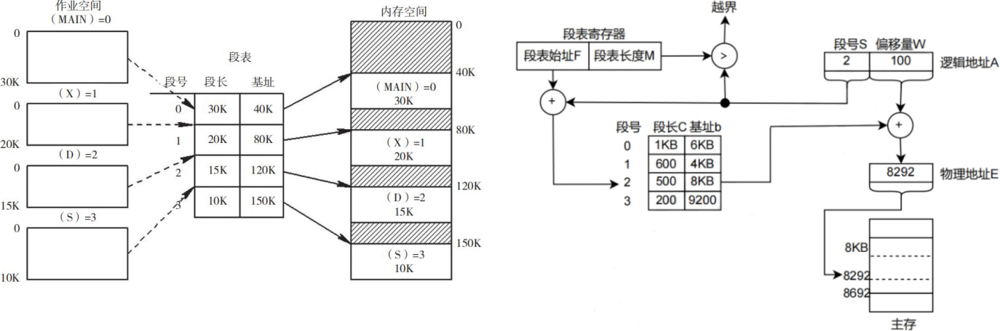
</center>

#### 段页式虚拟存储器

先分成大小不等的段，段内再分成大小相等的页。进程拥有一张段表，每个段拥有一张页表。

地址划分为段号+页号+页内地址。

<center>
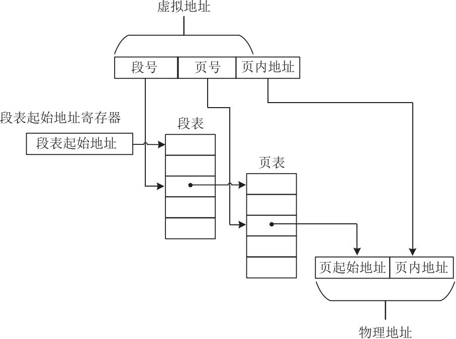
</center>

## 第四章 指令系统

<center>
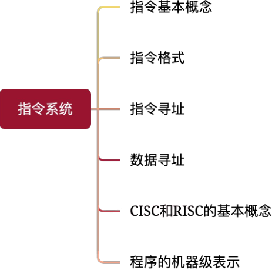
</center>

### 指令相关概念

- 指令系统：所有机器指令的集合。
- 指令集体系结构 ISA：指令系统的设计规范。ISA 是软硬件之间的接口，对上是机器语言和汇编语言的基础，对下是硬件的使用者。
- 微体系结构 / 微架构：具体硬件的设计规范。软件感知不到。

::: details ISA和微架构具体规定内容

指令集体系结构 ISA 规定内容有：

- **指令**格式、指令寻址方式，操作数类型、**寻址**方式和地址空间大小，大小端存储
- 程序可见的**寄存器**编号、个数和位数，存储空间大小和编址方式
- 程序可见的控制状态，包括程序计数器、条件码定义等
- IO空间的编址方式，**中断**结构，机器工作状态的定义和切换

微体系结构规定内容有：

- 硬件产生的控制信号
- CPU时钟周期
- 几级流水线
- 是否支持超标量流水线
- 硬件数据通路类型
- Cache的大小和层级
- ALU数量，译码器设计
- TLB具体实现

:::

<center>
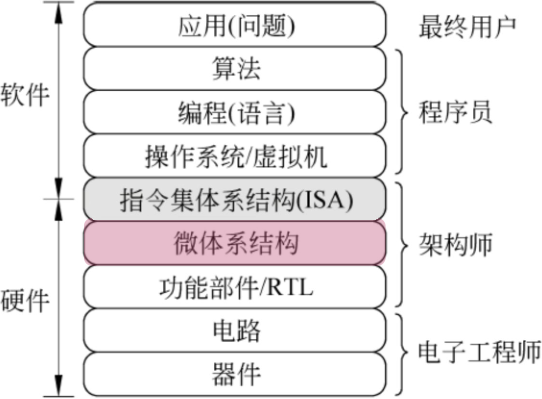
</center>

### 指令的格式

<center>
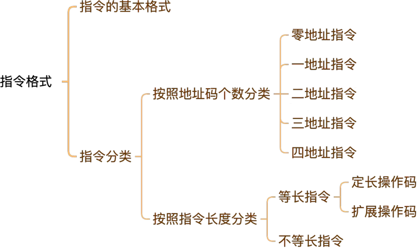
</center>

- 操作码：操作类型的编号。
- 形式地址A：可能直接就是操作数，也可能是所在寄存器编号或主存地址。数量可能有0到4个。
- 寻址方式位：寻址方式的编号。（寻址方式位可有可无，具体看题设）

<center>

</center>

#### 零地址指令

<center>
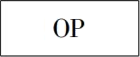
</center>

零地址指令只有操作码。两种可能：

1. 无需操作数的指令：空操作指令、停机指令、关中断指令。
2. 隐含操作数的指令：参与运算的两个操作数被放在栈顶和次栈顶，因此指令中无需指明地址。

如果说零地址指令一定不需要操作数，是错误的。

#### 一地址指令

<center>
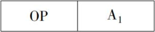
</center>

一地址指令的操作数称为目的操作数。两种可能：

1. 只有目的操作数的单操作数指令：OP(A1)→A1，如++、--、取反等。
2. 隐含约定目的地址的双操作数指令：(ACC)OP(A1)→ACC，A1和ACC的运算结果写回ACC。

#### 二地址指令

<center>
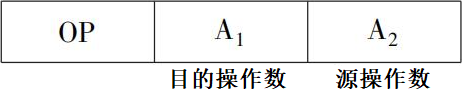
</center>

二地址指令的操作数分别为目的操作数和源操作数，指令含义：(A1)OP(A2)→A1。

一般算术/逻辑运算指令需使用两个操作数，给出目的操作数和源操作数的地址，目的操作数地址还用于写回结果。

二地址指令的访存次数为 4 次，取指令一次、取操作数两次、存结果一次。

#### 三地址指令

<center>
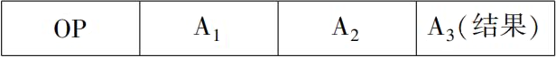
</center>

三地址指令的操作数分别为源操作数1、源操作数2、目的操作数，指令含义：(A1)OP(A2)→A3。

三地址指令的访存次数为 4 次，取指令一次、取操作数两次、存结果一次。

#### 四地址指令

<center>
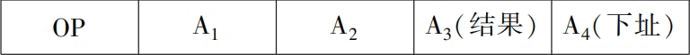
</center>

四地址指令的操作数分别为源操作数1、源操作数2、目的操作数、下条指令地址。

指令含义：(A1)OP(A2)→A3。

#### 扩展操作码

以16位指令为例，操作码可以从4位扩展到8位、再到12位、再到16位。

- 4 位操作码：使用`0000`到`1110`共15种，`1111`保留作8位操作码的起始4位。
- 8 位操作码：使用`1111 0000`到`1111 1110`共15种，`1111 1111`保留。
- 12位操作码：使用`1111 1111 0000`到`1111 1111 1110`共15种，`1111 1111 1111`保留。
- 16位操作码：使用`1111 1111 1111 0000`到`1111 1111 1111 1111`共16种，此时无需保留。

<center>
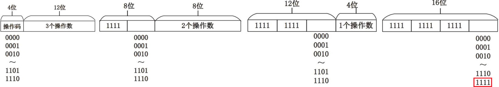
</center>

> 上述例子是只保留一种情况，也可以保留两种。

### 指令的寻址方式

#### 顺序寻址

::: details 取指周期所作工作

1. 将PC中下条指令地址放到MAR中，(PC)→MAR
2. 根据MAR中的指令地址访存获得指令放到MDR中，M(MAR)→MDR
3. 将MDR中的指令放到IR中，(MDR)→IR
4. PC指针自增形成下条指令地址，(PC)+1→PC

<center>
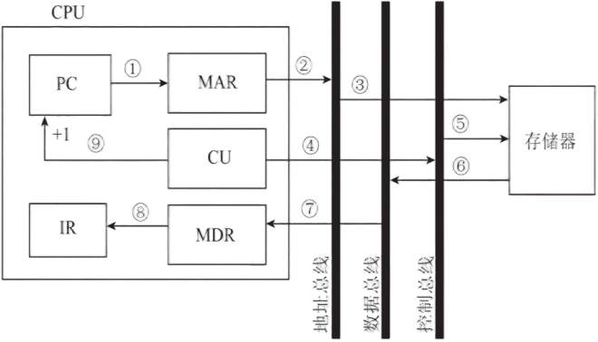
</center>

:::

程序计数器PC + 指令所占存储单元数，自动形成下条指令的地址。

取指周期结束后，PC就已经指向了当前待执行指令的下条指令。相当于**PC时刻保存当前所执行指令的下条指令地址**。

#### 跳跃寻址（转移指令）

跳跃寻址的地址给出有两种方式：

1. 绝对地址：直接就是转移目标地址（无符号数），A→PC
2. 相对地址：指出当前PC值到转移目标地址的偏移量（<mark>A可正可负，补码表示</mark>），(PC)+A→PC

### 数据的寻址方式

| 寻址方式       | 具体内容                                                     |
| -------------- | ------------------------------------------------------------ |
| 隐含寻址       | 操作数地址无需直接指出，隐含在ACC或栈帧中，具体据指令类型而定。 |
| 立即寻址       | 操作数即**数据本身**，无需访存时间最短，但立即数的范围被限制。 |
| 直接寻址       | 操作数即数据的**有效地址EA**，即访存一次。                   |
| 间接寻址       | 操作数是数据的**间接地址**，需访存两次。n次间接寻址需访存n+1次。 |
| 寄存器寻址     | 操作数是数据的**寄存器编号**，无需访存地址码短指令短，缺点寄存器个数有限。 |
| 寄存器间接寻址 | 操作数是**寄存器编号**，寄存器中存储数据的有效地址。         |
| 相对(偏移)寻址 | 指令的跳跃寻址，归纳为一种数据寻址方式，EA=(PC)+A。适用于转移指令。 |
| 基址(偏移)寻址 | 基址寄存器BR或通用寄存器保存基址，基址固定、偏移量可变，EA=(BR)+A。<br/>适用于多道程序设计。 |
| 变址(偏移)寻址 | 变址寄存器IX或通用寄存器保存变址，变址可变、偏移量固定，EA=(IX)+A。<br/>用户可更改，适用于循环、数组遍历。 |

- 多次间接寻址的地址空间可用标志位标识，间接地址为1真实地址为0。

<center>
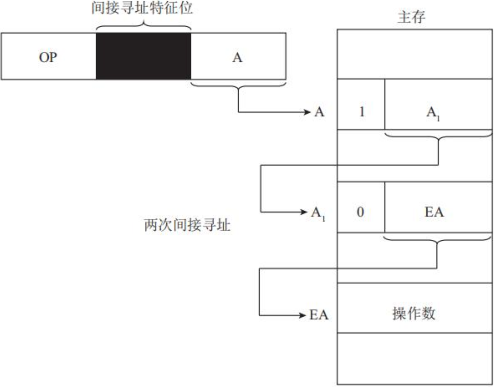
</center>

- 基址寻址变址寻址若采用通用寄存器须在指令中指明寄存器编号。

<center>
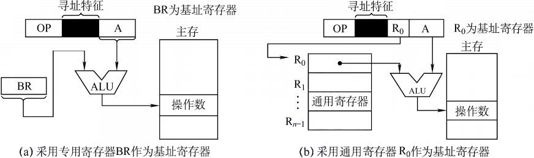
</center>

- 三种偏移寻址的<mark>偏移量A均可正可负、使用补码表示</mark>。

### CISC和RISC

#### 复杂指令系统计算机CISC主要特点

1. 指令系统**复杂**，指令**数目200条以上**。
2. 指令**长度不固定**，指令**格式多**，**寻址方式多**。**可访存的指令不受限制**。指令间使用频度差距大。
3. 各种指令**执行时间相差很大**，大多数指令需**多个时钟周期**才能完成。
4. 控制器采用**微程序控制**，难以通过优化编译生成高效的目标代码程序。

#### 精简指令系统计算机RISC主要特点

1. 指令**数量相对少**，**寻址方式相对少**。
2. 指令**格式相对少**，指令为**等长指令**，适合流水线操作。
3. **仅LOAD/STORE指令可访问存储器**，读存储器使用LOAD指令，写存储器使用STORE指令。
4. **寄存器相对多**，用于暂存数据，**大大减少访存**操作。
5. 控制器采用**硬布线**控制。

#### CISC和RISC的对比

| 对比项目         | CISC（复杂指令集）     | RISC（精简指令集）         |
| ---------------- | ---------------------- | -------------------------- |
| 指令数目         | 一般大于200条          | 一般小于200条              |
| 指令字长         | <mark>不固定</mark>    | <mark>固定</mark>          |
| 指令功能         | 功能强好               | 功能简单                   |
| 可访存指令       | 不加限制               | 只有LOAD/STORE指令         |
| 各种指令执行时间 | 相差较大               | 绝大多数能在一个周期内完成 |
| 各种指令使用频率 | 相差很大               | 比较均衡                   |
| 通用寄存器数量   | 较少                   | 较多                       |
| 控制方式         | 绝大多数为微程序控制器 | 绝大多数为硬布线控制器     |
| 兼容性           | 好                     | 差                         |
| 编译优化         | 不利于编译优化         | 有利于编译优化             |
| 指令流水线       | 可以通过一定方式实现   | 必须实现                   |

### 程序的机器级表示

::: details 常用汇编指令介绍

<center>
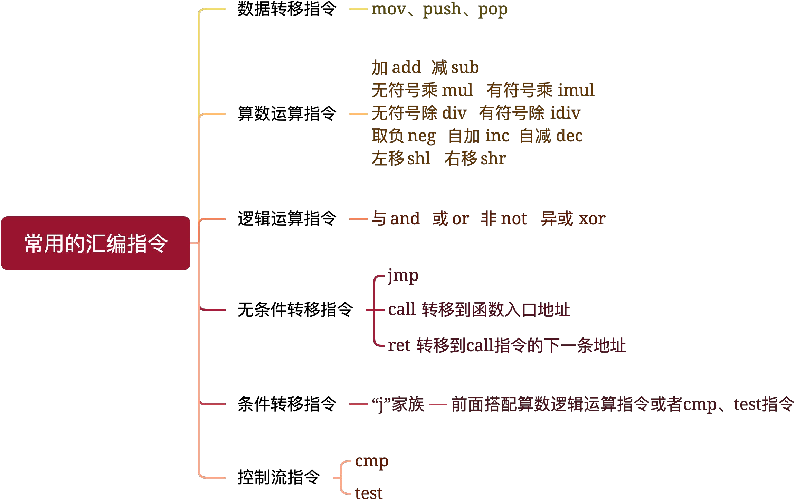
</center>

| 无条件转移指令           | 含义                                       |
| ------------------------ | ------------------------------------------ |
| jmp 128                  | 跳转到128地址位置                          |
| jmp [128]                | 跳转到主存188地址中所保存的位置            |
| jmp .L1                  | 跳转到.L1标记位置                          |
| call / ret               | 跳转到函数入口，返回到call指令的下一条指令 |
| **条件转移指令**         | **含义**                                   |
| je \<addr> / jne \<addr> | jump if equal / if not equal               |
| jz \<addr> / jne \<addr> | jump if zero / if not zero                 |
| jg \<addr> / jge \<addr> | jump if greater / if greater or equal      |
| jl \<addr> / jle \<addr> | jump if less / if less or equal            |

:::

#### 选择结构的机器级表示


#### 循环结构的机器级表示


#### 过程调用的机器级表示


## 第五章 中央处理器

### CPU功能和基本结构


### 指令执行过程


### 数据通路的功能和基本结构


### 控制器的功能和工作原理


### 异常和中断机制


### 指令流水线


### 多处理器的基本概念


## 第六章 总线

### 总线概念


### 总线事务和定时


## 第七章 输入输出系统

### IO系统基本概念


### IO接口


### IO方式
