# 计算机组成原理

## 第一章 计算机系统概述


### 冯诺依曼机的特点

1. 采用”<mark>存储程序</mark>“的工作方式。
2. 计算机硬件系统由运算器、存储器、控制器、输入输出设备五大部件组成，<mark>以运算器为核心</mark>。（现代计算机改以<mark>存储器</mark>为核心）
3. 指令和数据以<mark>同等地位</mark>存储在存储器中。
4. 指令和数据均以二进制形式表示。
5. 指令由操作码和地址码组成，操作码指出操作的类型，地址码指出操作数的地址。
6. 程序和功能都是通过中央处理器执行指令实现的。（“<mark>程序控制</mark>”思想）

### 计算机的功能部件

1. 存储器是指主存和辅存。
2. 一个编址的对应一个存储单元，存储单元中存储的叫存储字，每一个bit叫存储元件。
3. 运算器的核心是ALU算术逻辑单元

> 其常见寄存器有：累加器ACC、乘商寄存器MQ、操作数寄存器X、变址寄存器IX、基址寄存器BR。

4. 控制器由程序计数器PC、指令寄存器IR和控制单元CU组成。
5. 存储器地址寄存器MAR、存储器数据寄存器MDR。

### 三种级别的语言

1. 机器语言，是计算机<mark>唯一</mark>可以直接识别和执行的语言。
2. 汇编语言，汇编语言和机器语言一一对应。（汇编相当于机器语言的英语助记）
3. 高级语言。

### 三种翻译程序

将语言与语言进行转换的软件叫做翻译程序。

1. 解释程序（解释器）：将高级语言按序逐条翻译成机器语言并立即执行。
2. 编译程序（编译器）：将高级语言编译成<mark>汇编语言或机器语言</mark>。
3. 汇编程序（汇编器）将汇编语言汇编成机器语言。


### 软硬件逻辑功能等价性

一个功能既可以由硬件实现、也可以有软件实现，这一等价性称为<mark>软硬件逻辑功能等价性</mark>。

### 三个常见字长

1. 机器字长：也叫CPU字长/计算机字长，简称字长。指CPU一次运算所能处理的位数。

> 机器字长=CPU总线宽度=运算器ALU位数=通用寄存器位数。

2. 存储字长：存储单元的位数（一般按字节编址则8位）
3. 指令字长：一条指令的长度（长度不一，具体和指令内容相关）

### 计算机主要性能指标

1. 时钟周期：CPU脉冲信号宽度，时间单位（一个时钟周期占多少秒）。
2. CPU主频：每秒有多少时钟周期，时钟周期的倒数。
3. CPI：一个指令需要多少时钟周期（个数）。
4. IPS：每秒能执行多少指令（个数）。
5. FLOPS：每秒能执行多少次浮点运算。

## 第二章 数据的表示和运算


### 真值机器数转换

> 进制转换、BCD码、原反补移转换

- 无符号数没有原反补移码，原反补移码只针对有符号数。
- 补码符号位取反得移码。<mark>移码（解读为无符号真值）= 实际真值 + 偏置值</mark>。


- 补码转真值：给补码**符号位设置位权** $-2^i$ 参与运算。

### 数据表示范围

| 定点数              | 定点整数                       | 定点小数                        | 二进制表示       |
| ------------------- | ------------------------------ | ------------------------------- | ---------------- |
| （`  n  `位）无符号 | $0 \sim 2^n-1$                 | $0 \sim 1-2^{-n}$               | $0000 \sim 1111$ |
| （`n+1`位）原码     | $-(2^n-1) \sim 2^n-1$          | $-(1-2^{-n}) \sim 1-2^{-n}$     | $1111 \sim 0111$ |
| （`n+1`位）补码     | <mark>$-2^n \sim 2^n-1$</mark> | <mark>$-1 \sim 1-2^{-n}$</mark> | $1000 \sim 0111$ |

- 补码全1为-1。补码最小：符号位为1，数值位有1放后面。
- 补码的符号扩展：高位用符号位填充。

### 加法器运算

- 减法转加法：减去一个数相当于加上这个数的补数。
- 补数求法：**补码所有位取反，再+1**。
- 补数本质：一个数+它的补数=$2^n$。


### 加法器溢出判断

| 加法器标志                  | 含义                                                         |
| --------------------------- | ------------------------------------------------------------ |
| CF (Carry Flag) 进位标志    | 无符号数运算是否溢出，溢出为1。<mark>$CF=C_{in} \oplus C_{out}$</mark> |
| OF (Overflow Flag) 溢出标志 | 有符号数运算是否溢出，溢出为1。<mark>$OF=C_{n} \oplus C_{n-1}$</mark> |
| ZF (Zero Flag) 零标志       | 运算结果是否为0，为零ZF=1。                                  |
| SF (Sign Flag) 符号标志     | 输出运算结果符号。                                           |

双符号位判断溢出（仅针对补码运算）：复制一位符号位，若运算结果两符号位相异则溢出，相同不溢出。


> 无符号数：小减大一定溢出，大减小不会溢出，两数之和可能溢出。
>
> 有符号数：正+正 负+负 可能溢出，正+负 正-正 负-负 不会溢出。

### 乘除法移位

| 移位     | 规则                                                      | 溢出                    | 损失精度  |
| -------- | --------------------------------------------------------- | ----------------------- | --------- |
| 逻辑移位 | 左移：高位移出，低位补0，右移：高位补0，低位移出          | <mark>1被移出</mark>  | 1被移出 |
| 算术移位 | 左移：高位移出，低位补0，右移：高位**补符号位**，低位移出 | <mark>符号位变化</mark> | 1被移出 |

> 算术移位一般用于有符号数，因为有符号数专注算术运算。
>
> 一般算术移位需要先写出补码，但使用原码也可以只需要保持符号位不变即可。

### 一般浮点数


规格化：尾数的最高位必须是有效位。原码1有效，补码须与符号位相异有效。

### IEEE754浮点数


- 阶码使用移码表示，偏置值为$2^{n-1}-1$。**8位阶码偏置值127**，11位阶码偏置值1023。
- 尾数用原码表示，采用 **1.Y** 的形式，只存储 Y 的内容。

> 应用以上规则时，阶码不能全0或全1，若阶码全0或全1，应用以下规则。

| 阶码 | 尾数 | 结果                                    |
| ---- | ---- | --------------------------------------- |
| 0    | 0    | $0$                                     |
| 0    | 非0  | 非规范数 $±\bbox[yellow]{0.Y}×2^{-126}$ |
| 255  | 0    | $∞$                                     |
| 255  | 非0  | $NaN$                                   |


- 只有能写成 $±\frac{A}{2^n}$ 的形式的十进制小数才能转成二进制小数。

### 浮点数加减运算

1. 对阶：小阶向大阶对齐
2. 尾数运算
3. 尾数规格化：写成 1.Y 的形式
4. 舍入处理：多余位＞0.5则进位，＜0.5则舍去，＝0.5则向偶数舍入。
5. 溢出判断：尾数的溢出通过调整阶码解决，阶码溢出是真的溢出。

> 尾数右规、舍入可能造成阶码上溢，尾数左规可能造成阶码下溢。

### 乘除法总结

- 迭代式乘除法器：n位运算约需2n个时钟周期
- 阵列式乘除法器：一个时钟周期内完成运算
- 移位实现乘除法：手算方法，若乘除$2^n$则进行移位，若非$2^n$则转十进制（硬件实现最慢）

### 数据存储

- 小端存储：低位字节放到低地址处，高位字节放到高地址处。
- 大端存储：低位字节放到高地址处，高位字节放到低地址处。

### 边界对齐

- 双字数据（8个字节）的起始地址必须为8的倍数（地址末尾为000）
- 单字数据（4个字节）的起始地址必须为4的倍数（地址末尾为00）
- 半字数据（2个字节）的起始地址必须为2的倍数（地址末尾为0）

## 第三章 存储系统

<div style="display: flex; gap: 20px; align-items: center; justify-content: center;">
  
  
</div>

### 存储器分类

#### 存储层级间的透明问题

- Cache-主存层调度由硬件自动完成，对所有程序员透明。
- 主存-辅存层调度由硬件和操作系统共同完成，对应用程序员透明。

> 透明=看不见。

#### 按存储介质分类


#### 按存取方式分类

| 四种存取方式 | 存取逻辑                           | 对应设备         |
| ------------ | ---------------------------------- | ---------------- |
| 顺序存取     | 读取时必须按顺序逐个读取，无法跳过 | 光盘、磁带、软盘 |
| 随机存取     | 任意时刻可以访问任意位置           | RAM、ROM、Flash  |
| 直接存取     | 选取信息所在区域，然后顺序访问     | 机械硬盘 HDD     |
| 相联存取     | 通过数据的内容进行存取             | Cache、TLB       |

### 存储器性能指标

#### Cache平均访问时间/存取时间

CPU首先去Cache中取数据，若未命中则将数据从主存调入Cache，再从Cache访问数据。

- 平均访问时间 = 命中率 × 访问Cache时间 + (1 - 命中率) × (访问Cache时间 + 访问主存时间)

#### 存取周期和存取时间

- 存取（存储）周期：可以**连续读写的最短时间间隔**，可以理解为<u>存储器准备数据的时间</u>。
- 存取周期 = 存取时间 + 恢复时间


#### 主存带宽

主存带宽 $B_m$，也称数据传输速率，表示每秒从主存进出信息的最大数据量，单位字/秒、字节/秒。

> 注意换算单位：1KB=1024B，1s=1000ms。字节和秒换算尺度不统一，不能约掉。

#### 存储容量

存储容量 = 存储单元数（可寻单元数）× 存储单元长度（存储字长）

#### 地址位数和存储单元个数

n 位地址 ⇔ $2^n$ 个存储单元

### 随机存储器 SRAM/DRAM

#### 静态随机存储器 SRAM

- SRAM集成度低、速度快、价格高、故<mark>仅SRAM能用作Cache、TLB</mark>。
- 数据线个数 = 数据位数 = 存储字长
- 地址线个数 = 地址位数


- 单译码结构：$n$位地址，$2^n$个地址单元，$2^n$根译码线
- 双译码结构：$n$位地址，$2^n$个地址单元，<mark>$2·2^\frac{n}{2}$</mark>根译码线

#### 动态随机存储器 DRAM

1. 需要刷新，且是<mark>按行刷新</mark>。

刷新周期：刷新周期内，每行都经历一次刷新。

刷新一行的耗时就是一个存储周期。刷新时不可读写，故称为死时间。

| 刷新方式 | 策略                                             | 优缺点                 |
| -------- | ------------------------------------------------ | ---------------------- |
| 分散刷新 | 存取周期之后进行一次刷新，刷新时间囊括进存取周期 | 无死时间，存取周期翻倍 |
| 集中刷新 | 刷新周期的后期集中刷新所有行                     | 死时间长               |
| 异步刷新 | 刷新周期分成行数段，每一段最后进行一次刷新       | 死时间短               |


2. <mark>行列地址复用</mark>：同一组地址管脚（引脚）先传行地址，再传列地址。地址管脚数取行列地址数的最大值。

3. 行缓冲区：大小为一行数据大小。


#### SRAM和DRAM的对比

| 特点           | SRAM         | DRAM         |
| -------------- | ------------ | ------------ |
| 存储信息       | 触发器       | 电容         |
| 破环性读出     | 不是         | 是           |
| **需要刷新**   | **不是**     | **是**       |
| **送行列地址** | **同时送**   | **分两次送** |
| **运行速度**   | **快**       | **慢**       |
| 集成度         | 低           | 高           |
| 存储成本       | 高           | 低           |
| **主要用途**   | **高速缓存** | **内存**     |

::: tip RAM参数

$4M×8位$存储器（默认行列数相等）：

- $4M=2^{22}$ 是存储单元个数，即需 $2^{22}$ 个地址，
  - 若是SRAM需要22根地址线
  - 若是DRAM需要11根地址线，行列共用这11根地址线

- $8位$是存储单元容量 = 数据线位数

:::

#### SDRAM

SDRAM叫**同步**动态随机存储器，继承DRAM的所有特点，另外支持突发传输、流水线，连续读写更快。

### 存储芯片的扩展

| 扩展方式     | 含义                                               |
| ------------ | -------------------------------------------------- |
| 位扩展       | 多个芯片”并联“，存储单元个数不变，存储单元位数 ×2  |
| 字扩展       | 多个芯片”串联“，存储单元个数 ×2，存储单元位数不变  |
| 字位同时扩展 | 多个芯片”串并联“，存储单元个数 ×2，存储单元位数 ×2 |

> 存储单元个数 和 地址位数 有关，存储单元位数 = 存储单元容量。


### 多模块存储器

> 多模块存储器是指多个存储体的组合。

#### 高位交叉编址 / 连续交叉编址

多个存储体“串联”，地址高位作“体号”、低位作“体内地址”。缺点：数据传输不连续。


#### 低位交叉编址（轮流启动）

多个存储体“并联”，地址高位作“体内地址”、低位作“体号”。优点：数据传输连续。


最佳情况：

- <mark>$T=mr$</mark>，存储周期 = 体数 × 数据传输时间，$m=\frac{T}{r}$ 时效率最高。
- 连续存取 $n$ 个体需要的时间 $t=\bbox[yellow]{T+(n-1)r}$.
- 连续存取并传输 $n$ 个体需要的时间 $t=\bbox[yellow]{T+nr}$.

> 一个存储周期内存储器可以存取 $m$ 个存储字，一个数据传输时间内存储器可以存取 $1$ 个存储字。

#### 低位交叉编址（同时启动）

同时启动每次存取数据只能访问“同一行”。如果数据跨行存储，就需要多个存储周期。

- 轮流启动：数据总线宽度 = MDR 位数 = 存储字长。
- 同时启动：数据总线宽度 = MDR 位数 = <mark>存储字长 ×  体数</mark>。


### 只读存储器 ROM

| 名称                      | 特点               |
| ------------------------- | ------------------ |
| ROM（常规ROM）            | 只能读不能写       |
| PROM（一次可编程ROM）     | 可以写一次，不能擦 |
| EPROM（可擦除可编程ROM）  | 紫外线擦除         |
| EEPROM（电擦除可编程ROM） | 高电压擦除         |

### 闪存 Flash

- U盘、固态硬盘
- 非易失性存储器，断电后可长期保存，支持电擦除和在线重写，读写性能不对称，读比写快得多。

### 机械硬盘 HDD

机械硬盘HDD，也叫温彻斯特硬盘，以磁性存储为主。

#### 结构

- 盘片：存储数据
- 磁盘驱动器：接收控制信号负责读写
- 磁盘控制器：接收CPU指令发送控制信号

#### 数据

- 盘面数：用于存储数据的单双面的数量
- 柱面数：盘片上有多少条磁道
- 扇区数：磁道上有多少个扇区

#### 磁盘地址结构


若驱动器唯一则驱动器号可省略。

#### 性能指标

1. 记录密度：

- 道密度：半径方向单位长度上的磁道数
- 位密度：磁道单位长度上的能记录的二进制位数
- 面密度：道密度 × 面密度

2. 磁盘容量：有格式化容量和非格式化容量，格式化容量比非格式化容量小。
3. <mark>平均存取时间 = 寻道时间 + 旋转延迟时间 + 数据读取时间</mark>

- 寻道时间：直接给出
- 旋转延迟时间：在磁道上**转半圈**的时间
- 数据读取时间：磁头扫过数据块的时间（取决于数据占磁道区域的比例）

#### 独立磁盘冗余阵列 RAID

RAID：将多个物理硬盘以不同的方式组合成一个逻辑硬盘的技术。

使用RAID的目的：提高硬盘的**读写性能**和**数据安全可靠性**。提高可靠性只有两种方式：冗余和校验。

| RAID    | 技术                                         | 特点                           |
| ------- | -------------------------------------------- | ------------------------------ |
| RAID0   | **条带化**存储，并联多个硬盘，类似交叉编址   | **提高速度，无冗余，无校验**   |
| RAID1   | 磁盘**镜像**技术，提供冗余，适合存储关键数据 | 镜像存储，**一半冗余，无校验** |
| RAID2   | **海明码校验**                               | **冗余少**存储校验码           |
| RAID3~6 | **奇偶校验**                                 | **冗余少**存储校验码           |

### 固态硬盘 SSD

- 半导体器件
- 随机访问延迟极低、无噪声振动、功耗低、抗震、安全。价格贵、容量低、耐用性差、数据难恢复。

#### 内部结构


- 页级读写：以页为单位读写。
- 块级擦除：以块位单位擦除。

> 写速度慢的原因就是，改写一个块需要到另一个页中<u>拷贝</u>并改写。

#### 磨损均衡技术

- 动态磨损均衡：写入时优先选择擦写次数较少的空闲块。
- 静态磨损均衡：控制器定期扫描，将高磨损块的数据迁移至低磨损块中，高磨损块以读为主，低磨损块以写为主，以均衡整体寿命。

### 高速缓存 Cache

#### Cache的基本原理

> 局部性原理：
> - 时间局部性：现在用的信息未来还要用
> - 空间局部性：未来用的信息在现在用的旁边
>
> CPU访问数据逻辑：
> - 首先去Cache中取数据，若命中，则算一次Cache存取。
> - 若未命中，则将数据从主存调入Cache，再从Cache访问数据，算一次Cache存取 + 一次主存存取。

- Cache的命中率 $h = \frac{N_c}{N_c+N_m}$ .
- 平均访问时间 = 命中率 × 访问Cache时间 + (1 - 命中率) × (访问Cache时间 + 访问主存时间)
- 平均访问时间 =                 访问Cache时间 + (1 - 命中率) × 访问主存时间

#### Cache的映射方式

##### 直接映射


放：每个主存块只能放到特定的Cache块。取：对比块号对应的Tag，对比成功则命中。

- Cache块号 = 主存块号 % Cache块数
- 主存地址 = <font color= "#de6c36">主存块号</font> + <font color= "#b83c68">块内地址</font> = <font color= "#de6c36">Tag + Cache块号</font> + <font color= "#b83c68">块内地址</font>


> 块内地址位数取决于块大小，块号位数取决于Cache块数，主存地址位数取决于主存大小。

##### 全相联映射


全相联映射，主存块可以随便放。

- 主存地址 = <font color= "#de6c36">主存块号</font> + <font color= "#b83c68">块内地址</font> = <font color= "#de6c36">Tag</font> + <font color= "#b83c68">块内地址</font>


##### 组相联映射

组相联映射，主存块放在哪个组和组数有关，以组为单位循环，组内随便放。

- $n$ 路组相联 ⇔ 一个组内有 $n$ 个Cache块
- Cache组数 = Cache总块数 / 路数


- 组号 = 主存块号 % 组数
- 主存地址 = <font color= "#de6c36">主存块号</font> + <font color= "#b83c68">块内地址</font> = <font color= "#de6c36">Tag + Cache组号</font> + <font color= "#b83c68">块内地址</font>


#### Cache的比较器

| 映射方式   | 比较次数                                  |
| ---------- | ----------------------------------------- |
| 全相联映射 | 每个块都要对比Tag，有多少块对比多少次     |
| 直接映射   | 主存块去往Cache块的位置固定，仅需对比一次 |
| 组相联映射 | 组内有几块，就需要对比几次                |

- 需要对比几次，就会有几个对比器硬件。
- 比较器仅需对比Tag位，比较器位数就是Tag位数。


#### Cache块的替换算法

- 全相联全满和组相联组满时需要替换，并需要考虑替换算法。
- 直接映射主存块对应位置唯一，被占用就需要替换，不需要考虑替换算法。

| 替换算法             | 策略                                    |
| -------------------- | --------------------------------------- |
| RAND 随机            | 随机找一个位置替换                      |
| FIFO 先进先出        | 谁先进来替换谁                          |
| LRU 最近最久未使用 ★ | 设置计数器，没使用就加1，替换计数最大者 |
| LFU 最不经常使用     | 设置计数器，被使用就加1，替换计数最小者 |

LRU 手算方法：用眼看序列，向前找第 n 个即最近最久未使用的。

```
共有4个Cache块，访问主存块序列  1  2  3  4  1  2  5
                          <------√4--3--2--1--↑--
```

FIFO、LRU 的替换控制位的位数均为 $log_2{n}$。组相联时$n$指路数，全相联时$n$指Cache总行数。

> LFU替换控制位长度无限，无需考虑。

#### Cache的写策略

| 情况     | 名称       | 策略                           | 优缺点                   |
| -------- | ---------- | ------------------------------ | ------------------------ |
| 写命中   | 全写法     | 同时写入Cache和主存            | 数据一致性，增加访存次数 |
| 写命中   | 回写法     | 写入Cache，替换时才写入主存    | 数据不一致，减少访存次数 |
| 写不命中 | 写分配法   | 加载主存块到Cache，只更新Cache |                          |
| 写不命中 | 非写分配法 | 只写入主存，不进行调块         |                          |

> 全写法可以提供写缓冲队列，CPU同时写入Cache和缓冲区，缓冲区自行写入主存。
>
> 回写法会为每个Cache块设置修改位（脏位）。

写分配法只能搭配回写法（默认情况），非写分配法只能搭配全写法。


#### Cache的容量

- Cache一行容量：

<font color= "#de6c36">标记项</font> + <font color= "#b83c68">数据块</font> = <font color= "#de6c36">有效位1b + 标记位Tag + 回写法脏位1b + LRU/FIFO替换控制位logn</font> + <font color= "#b83c68">数据块</font>

- Cache的总容量：

Cache行数 × Cache一行容量

### 页式虚拟存储器

#### 基本概念

> 常规存储器的缺点：
>
> 1. 一次性：必须全部加载才能运行整个作业，故当作业很大或有大量作业无法全部装入。
> 2. 驻留性：作业执行完毕前，必须全部驻留内存。

虚拟存储器解决主存容量不够用的问题，存在于主存-辅存层，故虚拟地址与物理地址的转换有操作系统负责。

内存和外存的数据交换以页为单位。虚拟存储器中称页，主存中称页框，它们的大小必须相同。

- “基本分页”：基于常规存储器，将程序的所有页导入内存。
- “请求分页”：基于虚拟存储器，只将访问的页导入内存。

一个进程拥有一个虚拟地址空间和一个页表，主存唯一存在。

#### 虚拟地址转换过程

页内地址不变，虚页号查页表转换成页框号。


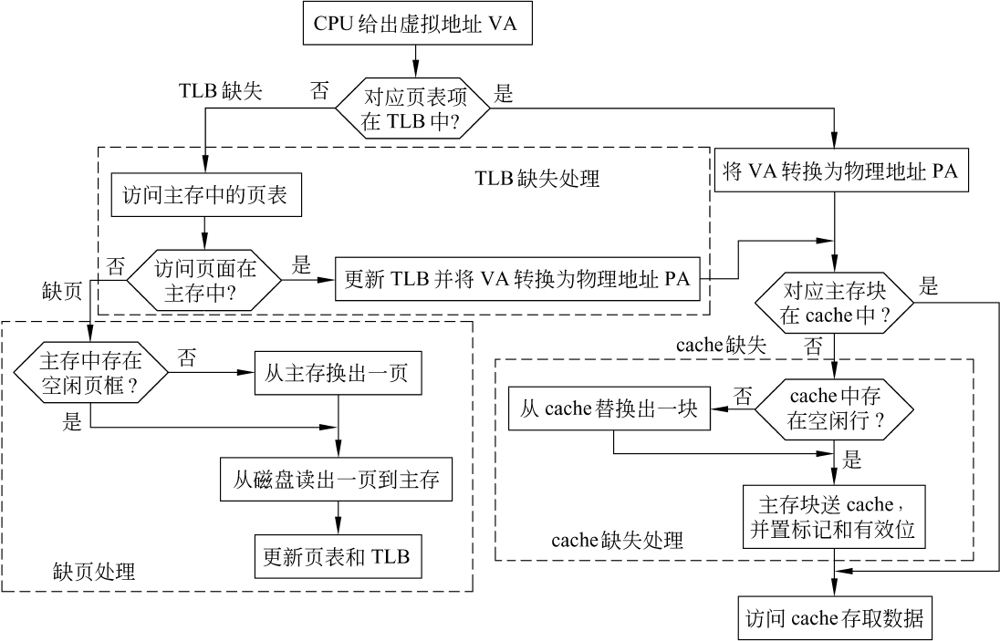

#### 页表的大小

| 数量       | 求法                                        |
| ---------- | ------------------------------------------- |
| 页的大小   | 页内地址位数 (Byte)                         |
| 页表的大小 | 页表项 = 页号 + 页框号，页表长度 = 页号位数 |


#### MMU和OS的任务

| 角色     | 任务                                                    |
| -------- | ------------------------------------------------------- |
| 硬件 MMU | 逻辑地址到物理地址的转换（先查TLB，未命中则查页表）     |
| 软件 OS  | 页表/段表的建立、更新、缺页中断处理、权限检查及异常处理 |

::: details 段页式虚拟存储器

1. 段式虚拟存储器

不按页分按段分，段长不固定。地址划分为段号和段内地址。段表项中存储段长和基址。

段号须小于段表长度、段内偏移量须小于段长。段内偏移量 + 基址 = 数据的地址。


2. 段页式虚拟存储器

先分成大小不等的段，段内再分成大小相等的页。进程拥有一张段表，每个段拥有一张页表。

地址划分为段号+页号+页内地址。


:::

### 快表 TLB

> 快表TLB使用高速缓冲存储器，速度和Cache一致，地址转换先查TLB可以保证速度。
>
> 快表TLB和Cache都是相联存储器，快表采用全相联映射。


#### 命中情况组合

| 情况 | TLB  | Page | Cache | 访内存次数和工作 | 访外存次数和工作 |
| ---- | ---- | ---- | ----- | ---------------- | ---------------- |
| 1    | 命中 | 命中 | 命中  | 0                |                  |
| 2    | 命中 | 命中 | 缺失  | 1 获取数据       |                  |
| 3    | 缺失 | 命中 | 命中  | 1 获取地址       |                  |
| 4    | 缺失 | 命中 | 缺失  | 2 地址和数据     |                  |
| 5    | 缺失 | 缺失 | 缺失  | 2 地址和数据     | 1 调入内存       |

1. TLB命中，Page一定命中
2. Cache命中，Page一定命中

## 第四章 指令系统

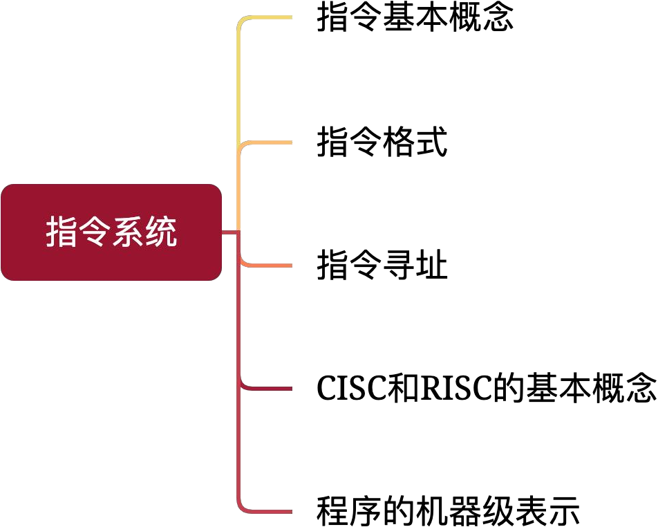

### 指令的概念

- 指令系统：所有机器指令的集合。
- 指令集体系结构 ISA：指令系统的设计规范。ISA 是软硬件之间的接口，对上是机器语言和汇编语言的基础，对下是硬件的使用者。
- 微体系结构 / 微架构：具体硬件的设计规范。软件感知不到。

::: details ISA和微架构具体规定内容

指令集体系结构 ISA 规定内容有：

- **指令**格式、指令寻址方式，操作数类型、**寻址**方式和地址空间大小，大小端存储
- 程序可见的**寄存器**编号、个数和位数，存储空间大小和编址方式
- 程序可见的控制状态，包括程序计数器、条件码定义等
- IO空间的编址方式，**中断**结构，机器工作状态的定义和切换

微体系结构规定内容有：

- 硬件产生的控制信号
- CPU时钟周期
- 几级流水线
- 是否支持超标量流水线
- 硬件数据通路类型
- Cache的大小和层级
- ALU数量，译码器设计
- TLB具体实现

:::

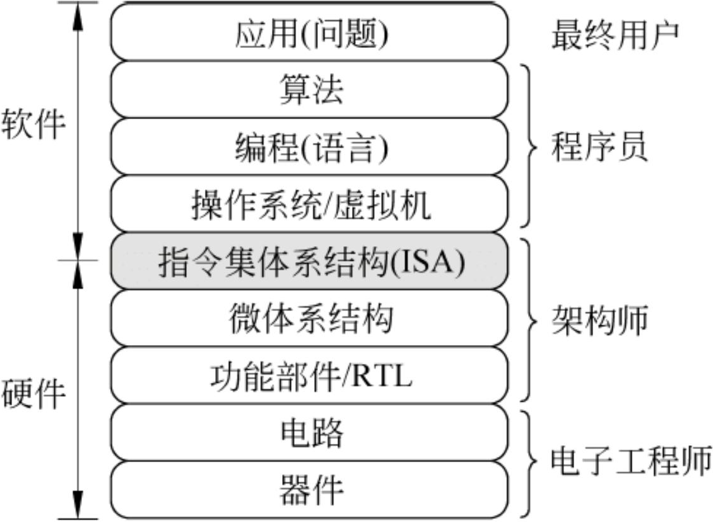

### 指令的格式


- 操作码：操作类型的编号。
- 形式地址A：可能直接就是操作数，也可能是所在寄存器编号或主存地址。数量可能有0到4个。
- 寻址方式位：寻址方式的编号。（寻址方式位可有可无，具体看题设）


#### 零地址指令


零地址指令只有操作码。两种可能：

1. 无需操作数的指令：空操作指令、停机指令、关中断指令。
2. 隐含操作数的指令：参与运算的两个操作数被放在栈顶和次栈顶，因此指令中无需指明地址。

如果说零地址指令一定不需要操作数，是错误的。

#### 一地址指令


一地址指令的操作数称为目的操作数。两种可能：

1. 只有目的操作数的单操作数指令：OP(A1)→A1，如++、--、取反等。
2. 隐含约定目的地址的双操作数指令：(ACC)OP(A1)→ACC，A1和ACC的运算结果写回ACC。

#### 二地址指令


二地址指令的操作数分别为目的操作数和源操作数，指令含义：(A1)OP(A2)→A1。

一般算术/逻辑运算指令需使用两个操作数，给出目的操作数和源操作数的地址，目的操作数地址还用于写回结果。

二地址指令的访存次数为 4 次，取指令一次、取操作数两次、存结果一次。

#### 三地址指令


三地址指令的操作数分别为源操作数1、源操作数2、目的操作数，指令含义：(A1)OP(A2)→A3。

三地址指令的访存次数为 4 次，取指令一次、取操作数两次、存结果一次。

#### 四地址指令


四地址指令的操作数分别为源操作数1、源操作数2、目的操作数、下条指令地址。

指令含义：(A1)OP(A2)→A3。

#### 扩展操作码

以16位指令为例，操作码可以从4位扩展到8位、再到12位、再到16位。

- 4 位操作码：使用`0000`到`1110`共15种，`1111`保留作8位操作码的起始4位。
- 8 位操作码：使用`1111 0000`到`1111 1110`共15种，`1111 1111`保留。
- 12位操作码：使用`1111 1111 0000`到`1111 1111 1110`共15种，`1111 1111 1111`保留。
- 16位操作码：使用`1111 1111 1111 0000`到`1111 1111 1111 1111`共16种，此时无需保留。


> 上述例子是只保留一种情况，也可以保留两种。

### 指令的寻址方式

#### 顺序寻址

::: details 取指周期工作

1. 将PC中下条指令地址放到MAR中，(PC)→MAR
2. 根据MAR中的指令地址访存获得指令放到MDR中，M(MAR)→MDR
3. 将MDR中的指令放到IR中，(MDR)→IR
4. PC指针自增形成下条指令地址，(PC)+1→PC

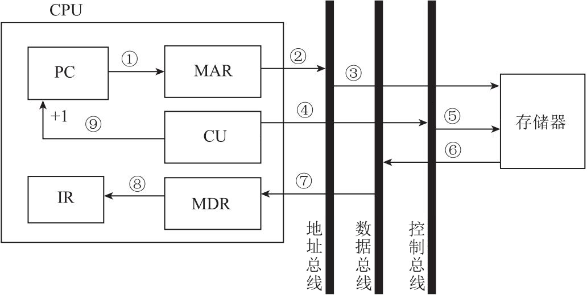

:::

程序计数器PC + 指令所占存储单元数，自动形成下条指令的地址。

取指周期结束后，PC就已经指向了当前待执行指令的下条指令。相当于**PC时刻保存当前所执行指令的下条指令地址**。

#### 跳跃寻址（转移指令）

跳跃寻址的地址给出有两种方式：

1. 绝对地址：直接就是转移目标地址（无符号数），A→PC
2. 相对地址：指出当前PC值到转移目标地址的偏移量（<mark>A可正可负，补码表示</mark>），(PC)+A→PC

取指周期后PC已经+“1”到下一条指令地址，再到执行周期将PC+A。故相对寻址的目标地址计算方法为：<mark>(PC)+“1”+A→PC</mark>。

### 数据的寻址方式

| 寻址方式       | 具体内容                                                     |
| -------------- | ------------------------------------------------------------ |
| 隐含寻址       | 操作数地址无需直接指出，隐含在ACC或栈帧中，具体据指令类型而定。 |
| 立即寻址       | 操作数即**数据本身**，无需访存时间最短，但立即数的范围被限制。 |
| 直接寻址       | 操作数即数据的**有效地址EA**，即访存一次。                   |
| 间接寻址       | 操作数是数据的**间接地址**，需访存两次。n次间接寻址需访存n+1次。 |
| 寄存器寻址     | 操作数是数据的**寄存器编号**，无需访存地址码短指令短，缺点寄存器个数有限。 |
| 寄存器间接寻址 | 操作数是**寄存器编号**，寄存器中存储数据的有效地址。         |
| 相对(偏移)寻址 | 指令的跳跃寻址，归纳为一种数据寻址方式，EA=(PC)+A。适用于转移指令。 |
| 基址(偏移)寻址 | 基址寄存器BR或通用寄存器保存基址，基址固定、偏移量可变，EA=(BR)+A。<br/>适用于多道程序设计。 |
| 变址(偏移)寻址 | 变址寄存器IX或通用寄存器保存变址，变址可变、偏移量固定，EA=(IX)+A。<br/>用户可更改，适用于循环、数组遍历。 |

- 多次间接寻址的地址空间可用标志位标识，间接地址为1真实地址为0。


- 基址寻址变址寻址若采用通用寄存器须在指令中指明寄存器编号。


- 三种偏移寻址的<mark>偏移量A均可正可负、使用补码表示</mark>。

### 复杂精简指令集 CISC/RISC

#### 复杂指令系统CISC

1. 指令系统<u>复杂</u>，指令数目200条以上。
2. 指令<u>长度不固定，格式多，寻址方式多</u>。<u>指令访存性不受限制</u>。指令间使用频度差距大。
3. 各种指令<u>执行时间相差很大</u>，大多数指令需多个时钟周期才能完成。
4. 控制器采用<u>微程序</u>控制，难以通过优化编译生成高效的目标代码程序。

#### 精简指令系统RISC

1. 指令<u>数量少，格式少</u>，都为<u>等长指令</u>，<u>寻址方式相对少</u>，适合流水线操作。
3. <u>仅LOAD/STORE指令可访存</u>，LOAD指令读存储器，STORE指令写存储器。
4. <u>寄存器多</u>，大大<u>减少访存</u>操作。
5. 控制器采用<u>硬布线</u>控制。

#### CISC和RISC的对比

| 对比项目         | CISC（复杂指令集）     | RISC（精简指令集）         |
| ---------------- | ---------------------- | -------------------------- |
| 指令数目         | 一般大于200条          | 一般小于200条              |
| 指令字长         | <mark>不固定</mark>    | <mark>固定</mark>          |
| 指令功能         | 功能强好               | 功能简单                   |
| 可访存指令       | 不加限制               | 只有LOAD/STORE指令         |
| 各种指令执行时间 | 相差较大               | 绝大多数能在一个周期内完成 |
| 各种指令使用频率 | 相差很大               | 比较均衡                   |
| 通用寄存器数量   | 较少                   | 较多                       |
| 控制方式         | 绝大多数为微程序控制器 | 绝大多数为硬布线控制器     |
| 兼容性           | 好                     | 差                         |
| 编译优化         | 不利于编译优化         | 有利于编译优化             |
| 指令流水线       | 可以通过一定方式实现   | 必须实现                   |

### 程序的机器级表示

::: details 常用汇编指令


| 无条件转移指令                                | 含义                                       |
| --------------------------------------------- | ------------------------------------------ |
| jmp 128                                       | 跳转到128地址位置                          |
| jmp [128]                                     | 跳转到主存188地址中所保存的位置            |
| jmp .L1                                       | 跳转到.L1标记位置                          |
| call / ret                                    | 跳转到函数入口，返回到call指令的下一条指令 |
| **<font color="#67676c">条件转移指令</font>** | **<font color="#67676c">含义</font>**      |
| je / jne                                      | jump if equal / if not equal               |
| jz / jne                                      | jump if zero / if not zero                 |
| jg / jge                                      | jump if greater / if greater or equal      |
| jl / jle                                      | jump if less / if less or equal            |

:::

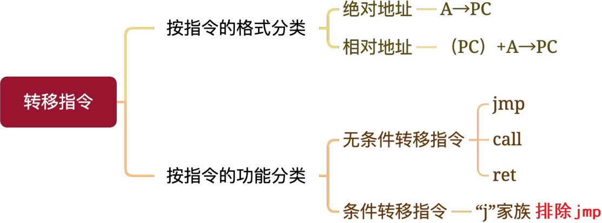

最重要的两种指令：无条件转移指令和条件转移指令。

#### 选择结构的机器级表示

```asm
int  f1(int n){
  1     00401000   55             push ebp
     ...       ...            ...
     if(n>1)
  11    00401018   83 7D 08 01    cmp dword ptr [ebp+8], 1
  12    0040101C   7E 17          jle f1+35h (00401035)
     return n*f1(n-1);
  13    0040101E   8B 45 08       mov eax, dword ptr [ebp+8]
  14    00401021   83 E8 01       sub eax, 1
  15    00401024   50             push eax
  16    00401025   E8 D6 FF FF FF call f1 (00401000)
     ...       ...            ...
  19    00401030   0F AF C1       imul eax, ecx
  20    00401033   EB 05          jmp f1+3Ah (0040103a)
     else return 1;
  21    00401035   B8 01 00 00 00 mov eax, 1
}
     ...       ...            ...
  26    00401040   3B EC          cmp ebp, esp
     ...       ...            ...
  30    0040104A   C3             ret
```

#### 循环结构的机器级表示

```asm
for(i=0; i<24; i++)
1   00401072  C7 45 F8 00 00 00 00              mov [ebp-8], 0
2   00401079  EB 09                             jmp 00401084h
3   0040107B  8B 55 F8                          mov eax, [ebp-8]
    ...       ...                               ...
7   00401088  7D 32                             jge 004010bch
    for(j=0; j<64; j++)
8   0040108A  C7 45 FC 00 00 00 00              mov [ebp-4], 0
    ...       ...                               ...
        a[i][j]=10;
    ...       ...                               ...
19  004010AE  C7 84 82 00 20 42 00 0A 00 00 00  mov [ecx+edx*4+00422000h], 0Ah
20  ...       ...                               ...
```

#### 过程调用的机器级表示

```asm
    int add(int x, int y){
        return x+y;
    }
    int caller(){
        int temp1=125;
        int temp2=80;
        int sum=add(templ,temp2);
        return sum;
    }
	caller:
        push ebp
        mov ebp, esp
        sub esp, 24
        mov [ebp-12], 125           # M[R[ebp]-12]←125，即temp1=125
        mov [ebp-8], 80             # M[R[ebp]-8]←80，即temp2=80
        mov eax, dword ptr [ebp-8]  # R[eax]←M[R[ebp]-8], 即R[eax]=temp2
        mov [esp+4],eax             # M[R[esp]+4]←R[eax]，即temp2入栈
        mov eax, dword ptr [ebp-12] # R[eax]←M[R[ebp]-12]，即R[eax]=temp1
        mov [esp], eax              # M[R[esp]]←R[eax]，即temp1入栈
        call add                    # 调用add，将返回值保存在eax中
        mov [ebp-4], eax            # M[R[ebp]-4]←R[eax]，即add返回值送sum
        mov eax, dword ptr [ebp-4]  # R[eax]←M[R[ebp]-4]，即sum作为返回值
        leave
        ret
```

## 第五章 中央处理器

<div style="display: flex; gap: 20px; align-items: center; justify-content: center;">
  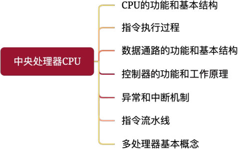
  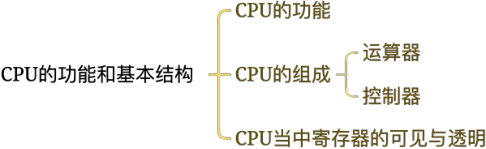
</div>

### CPU的功能和结构

> CPU功能有：指挥指令周期的过程、处理异常和中断、时序控制。

#### CPU的组成

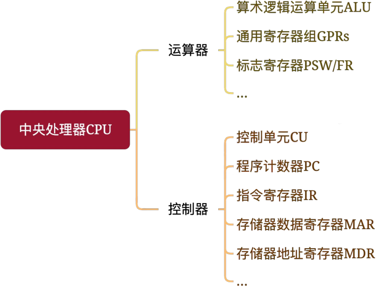

| 部件              | 功能                                                         |
| ----------------- | ------------------------------------------------------------ |
| 算术逻辑单元ALU   | 执行算术和逻辑运算的核心部件，运算结果和状态标志写入寄存器   |
| 程序状态字PSW     | 也叫标志寄存器FR，保存ALU运算产生的状态信息，用于条件判断与转移控制 |
| 通用寄存器组 GPRs | 可编程供用户程序使用，多用于暂存数据，减少访问主存提升效率   |
| 控制单元CU        | CPU指挥中心，负责指令译码、生成微操作控制信号，协调CPU内部所有部件 |
| 地址寄存器 MAR    | 存放当前要访问的主存地址                                     |
| 数据寄存器MDR     | 暂存从主存读出的数据或将要写入主存的数据                     |
| 指令寄存器IR      | 存放从存储器取出的指令。IR的位数等于指令的位数               |
| 程序计数器PC      | 取指周期结束后，存放CPU下一条指令的地址。<br/>一般情况：PC位数=MAR位数=地址位数，特殊情况：指令定长且边界对齐 |

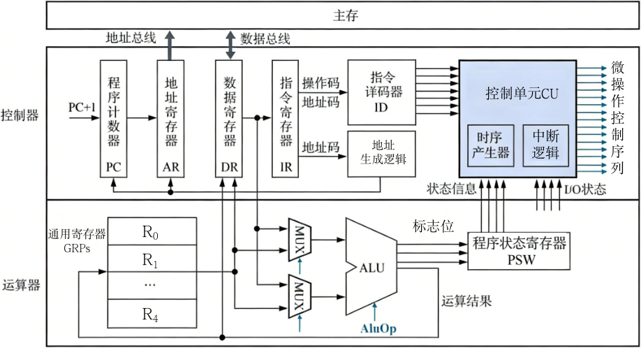

### 可见或透明的寄存器

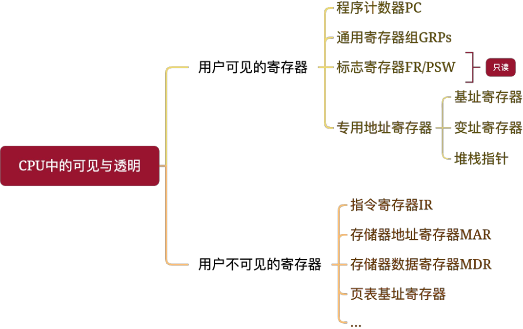

可见或透明是针对机器程序而言，程序可使用的寄存器有PC、GRPs、PSW以及基址变址堆栈寄存器。

### 指令周期的数据流向

- 指令周期：CPU取出并执行指令的全部过程。
- 机器周期：每个阶段周期都是一个机器周期
- 指令的执行过程：不是指令的执行周期，而是整个指令周期。

> 指令周期的内容是灵活的，有的只有取指周期，有的只有取指周期和执行周期，不同指令的执行周期不一定相等。

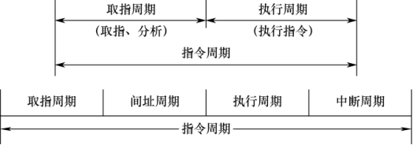

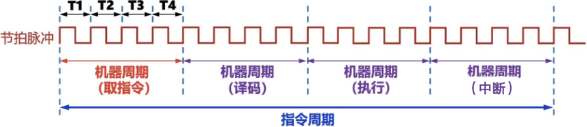

#### 取指周期

根据PC中的指令地址，从主存中取出指令代码存放在IR中。


| 数据流向                                                     | 机器指令    | 描述                               |
| ------------------------------------------------------------ | ----------- | ---------------------------------- |
| PC $\xrightarrow{1}$ MAR $\xrightarrow{2}$ 地址总线 $\xrightarrow{3}$ 主存 | PC→MAR      | 将PC中的指令地址放入MAR            |
| CU发出读命令 $\xrightarrow{4}$ 控制总线 $\xrightarrow{5}$ 主存 | M(MAR)→MDR  | 拿MAR指令地址访存，将指令放到MDR中 |
| 主存 $\xrightarrow{6}$ 数据总线 $\xrightarrow{7}$ MDR $\xrightarrow{8}$ IR | (MDR)→IR    | 将MDR中的指令放到IR中              |
| CU发出控制信号 $\xrightarrow{9}$ PC加1                       | (PC)+"1"→PC | PC自动指向下一条指令的地址         |
|                                                              |             |                                    |

> “1”理解为1个指令所占的存储单元数，实际值会因指令长度、编址方式而不同。

- 取指操作无需操作码，由控制器自动进行
- 当指令定长时，所有取指操作都相同
- 取指周期必定访问存储器（访存取指令）

#### 间址周期

取出操作数的有效地址EA，而非操作数本身。

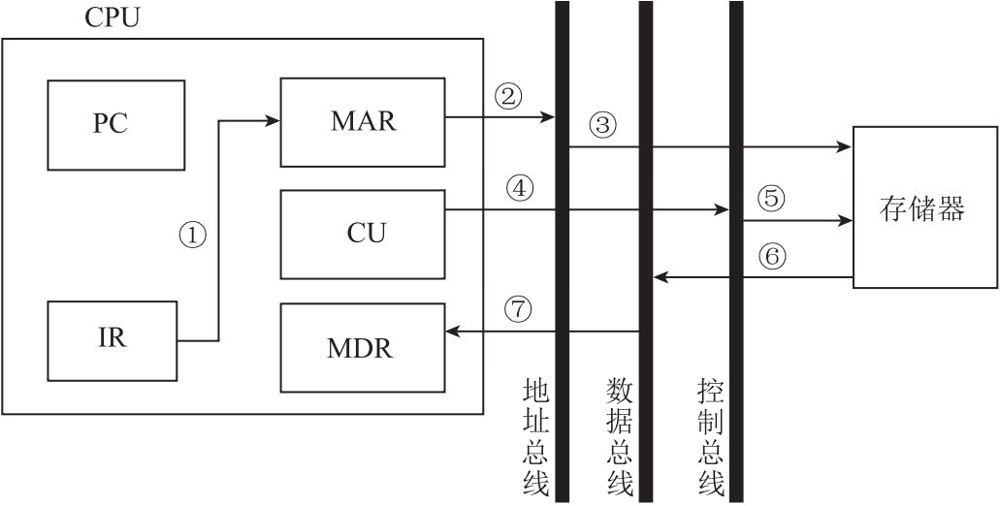

| 数据流向                                                     | 机器指令   | 描述                               |
| ------------------------------------------------------------ | ---------- | ---------------------------------- |
| Op(IR) $\xrightarrow{0}$ CU                                  | Op(IR)→CU  | 将操作码提供给CU，以便发出控制信号 |
| Ad(IR) $\xrightarrow{1}$ MAR $\xrightarrow{2}$ 地址总线 $\xrightarrow{3}$ 主存 | Ad(IR)→MAR | 取出指令中的形式地址A，放入MAR中   |
| CU发出读命令 $\xrightarrow{4}$ 控制总线 $\xrightarrow{5}$ 主存 |            | 读出主存中的有效地址EA             |
| 主存 $\xrightarrow{6}$ 数据总线 $\xrightarrow{7}$ MDR        | M(MAR)→MDR | 将有效地址EA放入MDR中              |
|                                                              |            |                                    |

#### 执行周期

通过有效地址EA取出操作数，并根据指令的操作码，进行运算并产生结果。

- 取操作数未必需要访存，取决于数据的寻址方式
- 不同指令的执行不同，因此没有统一的数据流向

#### 各周期访存对比

| 周期     | 是否访存   | 访存工作                 |
| -------- | ---------- | ------------------------ |
| 取指周期 | 一定访存   | 访存取指令               |
| 间址周期 | 一定访存   | 访存取操作数的有效地址EA |
| 执行周期 | 不一定访存 | 取决于数据寻址方式       |

#### 指令执行方案

| 指令执行方案 | 内容                           | CPI                  |
| ------------ | ------------------------------ | -------------------- |
| 单周期处理器 | 每条指令都在一个时钟周期内完成 | 平均 CPI = 1         |
| 多周期处理器 | 不同指令所需要的时钟周期数不同 | 平均 CPI > 1         |
| 流水线处理器 | 指令流水线级并行               | 理想状态平均 CPI = 1 |

### 数据通路的概念

#### 数据通路的定义

数据在功能部件之间传送的路径，包括数据流经的部件，统称为数据通路。

CPU由数据通路和控制部件两部分组成。数据通路由控制部件控制，根据指令生成对数据通路的控制信号。

> 数据流经的部件包括 ALU、通用寄存器、状态寄存器、异常和中断处理程序。
>
> 数据通路描述了信息从什么地方开始，中间经过哪个寄存器或多路开关，最后传送到哪个寄存器，这些都需要加以控制。

#### 数据通路的组成

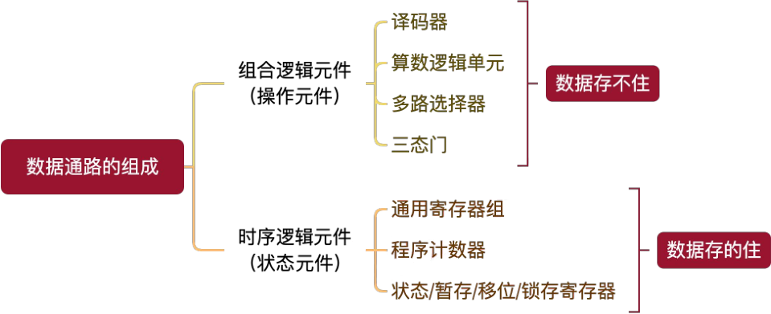

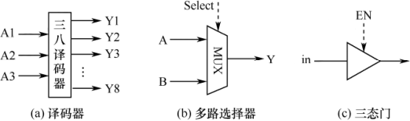

数据通路由组合逻辑元件（操作元件）和时序逻辑元件（状态元件）组成。

| 数据通路组成             | 内容                                              | 特点       |
| ------------------------ | ------------------------------------------------- | ---------- |
| 组合逻辑元件（操作元件） | 算术逻辑单元、译码器、多路选择器、三态门          | 数据存不住 |
| 时序逻辑元件（状态元件） | 通用寄存器、程序计数器、状态/暂存/移位/锁存寄存器 | 数据存的住 |

### 数据通路的结构

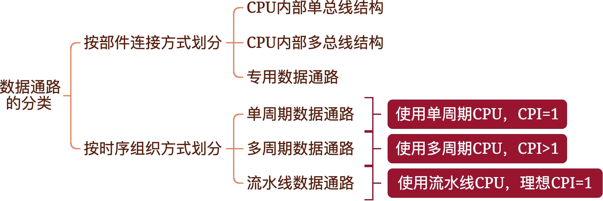

| 总线方式     | 含义                                       | 特点                             |
| ------------ | ------------------------------------------ | -------------------------------- |
| 单总线方式   | 所有寄存器的输入输出端都接在一条公共通路上 | 结构简单、**容易冲突**、性能较低 |
| 多总线方式   | 所有寄存器的输入输出端都接到多条公共通路上 | 效率较高                         |
| 专用数据通路 | 根据指令执行过程中的数据流向安排连接线路   | 避免共享，性能更高，硬件量大     |

<div style="display: flex; gap: 5px; align-items: center; justify-content: center;">
  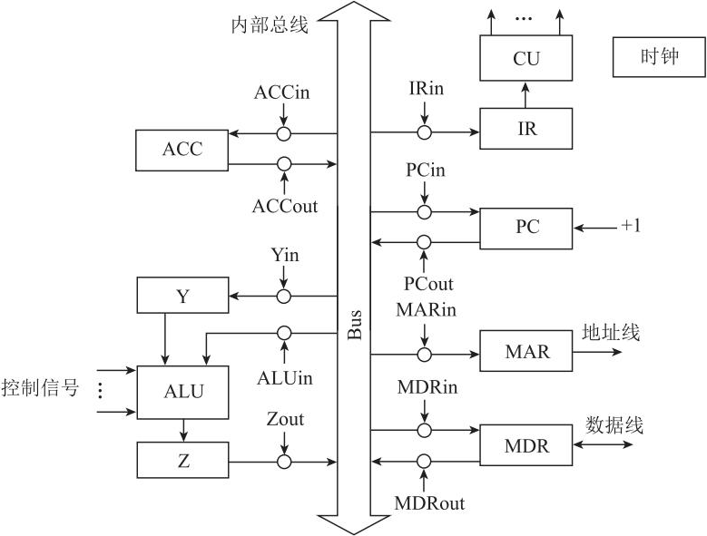
  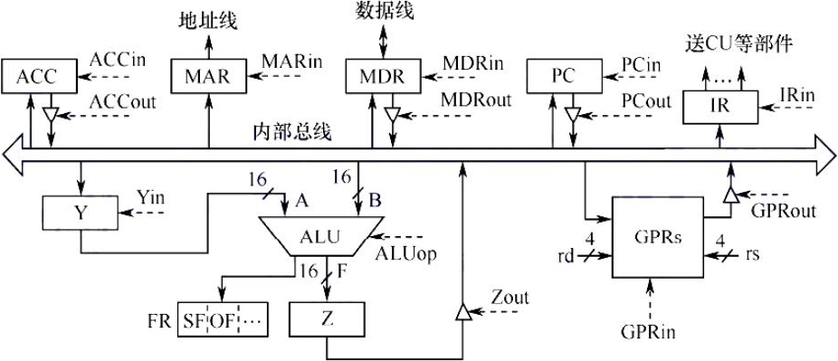
</div>

::: info 单总线框图描述

- 虚线表示控制信号，实线表示数据流向。
- 三态门 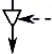 表示通过信号控制连接和断开。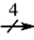 表示并行传输4位二进制数据。
- XX<sub>in</sub> XX<sub>out</sub> 表示XX部件的输入输出的控制信号。信号有效则表示数据会从该部件发出或进入。

---

- ALU两个输入端：一个直接与总线相连，一个与暂存器相连
- ALU两个输出端：一个与暂存器相连，一个与标志寄存器FR/程序状态字寄存器PSW相连

:::

单总线结构同时仅能有一个部件发数据，但可有多个部件接收数据。

单总线结构无法实现单周期CPU。

> 我们认为数据从一个部件流入另一个部件的时间为一个时钟周期。
>
> 单周期CPU要求一条指令仅需一个时钟周期，但光取指周期就需要多个时钟周期，所以一个时钟周期不可能完成一个指令。

### 取指间址的信号序列

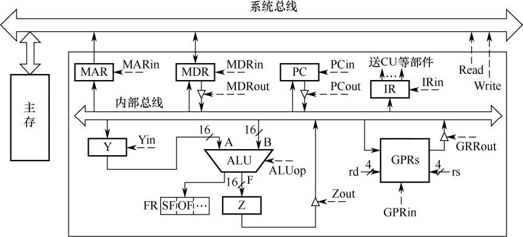

| 节拍 | 取指周期 数据流 | 信号序列                              | 节拍 | 间址周期 数据流 | 信号序列                               |
| :--: | --------------- | ------------------------------------- | :--: | --------------- | -------------------------------------- |
|  T0  | (PC)→MAR        | PC<sub>out</sub>=1 MAR<sub>in</sub>=1 |  T0  | op(IR)→CU       | IR<sub>out</sub>=1 CU<sub>in</sub>=1   |
|  T1  | M(MAR)→MDR      | Read=1 MDR<sub>in</sub>=1             |  T1  | ad(IR)→MAR      | IR<sub>out</sub>=1 MAR<sub>in</sub>=1  |
|  T2  | (MDR)→IR        | MDR<sub>out</sub>=1 IR<sub>in</sub>=1 |  T2  | M(MAR)→MDR      | MAR<sub>out</sub>=1 MDR<sub>in</sub>=1 |
|  T3  | (PC)+"1"→PC     | PC<sub>out</sub>=1 PC<sub>in</sub>=1  |      |                 |                                        |

### 控制器的概念

控制器是CPU的指挥中心，主要功能有：

1. 从主存中取出一条指令，并指出下一条指令在主存中的位置。
2. 对指令进行译码或测试，产生相应的操作控制信号，以便启动规定的动作。
3. 指挥并控制CPU、主存、输入输出设备之间的数据流动方向。

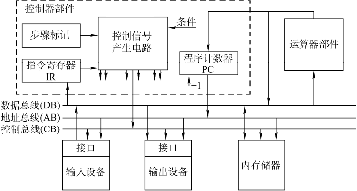

#### 控制器的输出输出

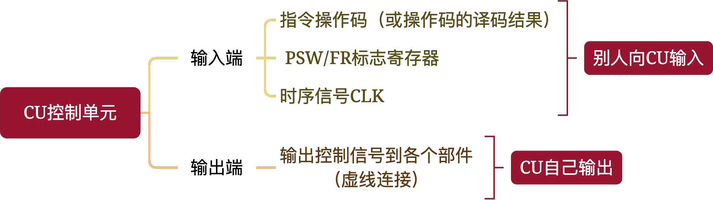

> 条件码又叫反馈信息、标志位，来自PSW/FR寄存器。

#### 控制器的分类

根据控制信号的产生方式的不同，可分为硬布线控制器和微程序控制器，二者中控制单元CU的内部实现是不同的。

| 对比   | 微程序控制器                     | 硬布线控制器                  |
| :----- | -------------------------------- | ----------------------------- |
| 组成   | 软件+硬件（硬件结构+微程序固件） | 硬件（组合逻辑电路+时序电路） |
| 速度   | 慢                               | 快                            |
| 指令集 | CISC                             | RISC                          |
| 扩充性 | 容易                             | 困难                          |

<div style="display: flex; gap: 10px; align-items: center; justify-content: center;">
  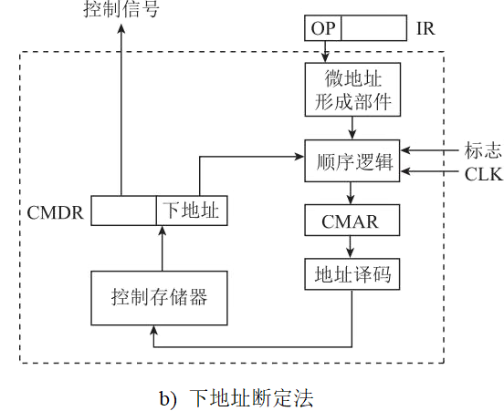
  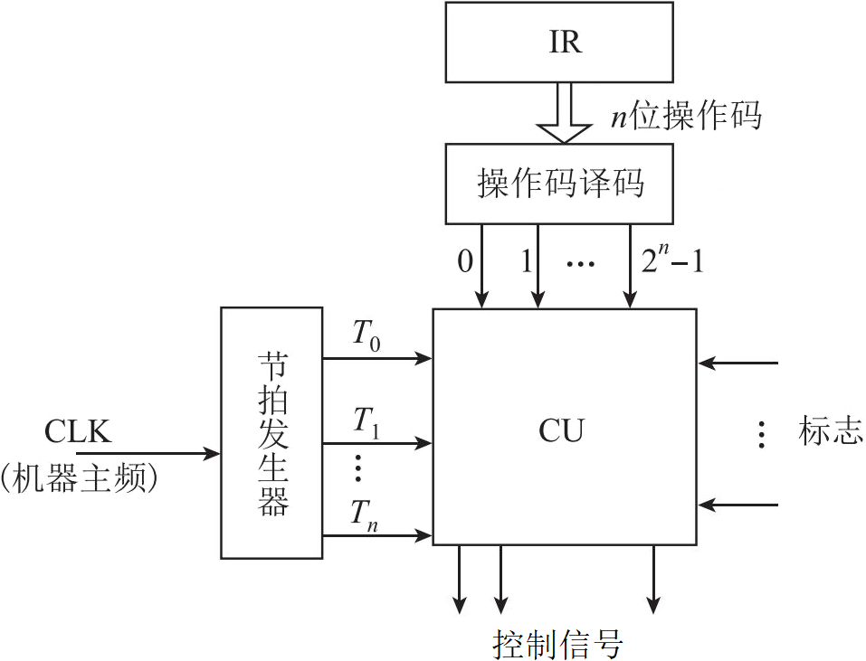
</div>

### 微程序控制器

#### 微程序控制的概念

微程序设计思想是将机器指令编写成一个微程序。微程序由微指令组成。

微程序存在控制存储器CM中，微指令的寻址方式和机器指令类似。x86平台大多采用微程序技术。

> 控制存储器CM是一块ROM芯片，能按地址进行随机存取。

- 一条机器指令 ⇔ 一个微程序 ⇔ 若干微指令
- 一条微指令 ⇔ 多个微命令
- 一个微操作 ⇔ 一套微命令

> 微命令就是控制信号，微操作就是一个数据流向。

#### 控制存储器和主存储器的区别

- 主存储器用于存放程序和数据，在CPU外部，用ROM和RAM实现。
- 控制存储器用于存放微程序，在CPU内部，用ROM实现。

---

- 存放指令的主存储器单元的地址称为地址。
- 存放微指令的控制存储器单元的地址称为微地址。

---

- 程序是指令的集合，以实现特定功能。
- 微程序是微指令的集合，以实现机器指令。

#### 微程序控制器的组成

<div style="display: flex; gap: 5px; align-items: center; justify-content: center;">
  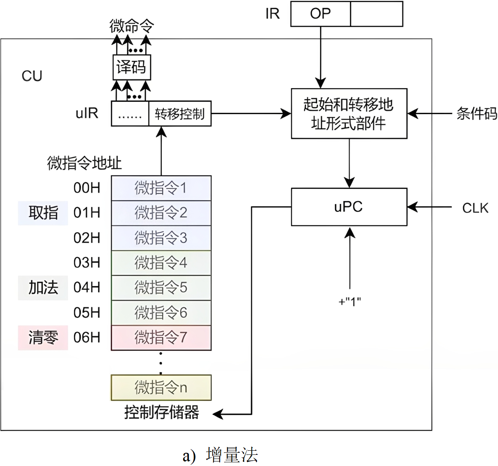
  
</div>

::: info 组成部件介绍

微地址形成部件：根据机器指令的操作码生成对应微程序的入口地址，依据当前微指令的顺序控制字段及状态条件，产生后续微地址。

微指令地址寄存器μPC：接收微地址形成部件提供的微地址，作为CM的读地址。

控制存储器CS/CM：微程序控制器的核心部件，用于存放所有机器指令对应的微程序。

微指令寄存器μlR：暂存从CM中读出的微指令，并将其操作控制字段和顺序控制字段分别送至执行单元和微地址形成部件。

:::

#### 微程序控制器的工作过程

1. 执行取指令公共操作

将取指微程序的入口地址（通常为0号地址）送入μPC，并从CM中读取首条取指微指令并送入μIR。完成取指微程序后，从主存中取出的机器指令即被存入指令寄存器IR中。

2. 生成当前指令的微程序入口地址

根据IR中机器指令的操作码，通过微地址形成部件产生对应微程序的起始微地址，并送入μPC。

3. 顺序执行微程序

在CM中逐条读取微指令，送入μIR并执行，直至该微程序执行完毕。

4. 循环继续重新取指

当前机器指令的微程序执行结束后，控制器自动转移回取指微程序的入口，重新开始处理下一条机器指令。

整个流程不断循环，直至整个程序执行完毕。

#### 微指令地址的生成方式

| 地址             | 生成方式                                                     |
| :--------------- | ------------------------------------------------------------ |
| 微程序入口地址   | 一条机器指令从主存取出并送入IR后，<br/>其操作码经微地址形成部件生成对应微程序的首条微指令地址，并送入μPC |
| 顺序执行         | 增量方式：由μPC+1自动生成下条微地址<br/>断定方式：微指令的下地址字段中指出下一条微指令地址 |
| 条件分支（转移） | 增量方式：修改μPC<br/>断定方式：微指令的下地址字段指定的转移目标地址 |

#### 微指令的格式和编码方式


##### 水平型微指令

| 水平型微指令     | 内容                                                         |
| ---------------- | ------------------------------------------------------------ |
| 直接编码方式     | 微命令字段为位图，每一位代表一个微命令。<br/>无需译码，简单直观，速度快，并行性好，但字长过长。 |
| 字段直接编码方式 | 微命令字段分成若干小字段，每个字段独立编码。<br />互斥性微命令编进同一字段，相容性微命令编进不同字段。<br/>缩短字长，但削弱并行性。 |
| 字段间接编码方式 | 一个字段的某些微命令需由另一个字段中的某些微命令来解释，又称隐式编码。<br/>进一步缩短字长，进一步削弱并行性。 |

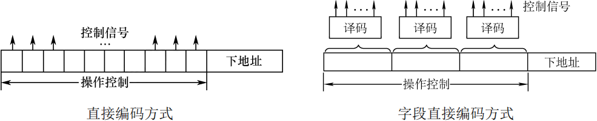

::: info 字段直接编码的具体编码方法

直接编码方式本质就是位图，该位置1表示有效，置0表示无效。

字段直接编码方式用字段编码，比如三位划作一个字段，该字段可表示2<sup>3</sup>-1个微命令，留出一种以表示空。

> 互斥性微命令：同一个时钟周期内，不能同时出现的微命令
>
> 相容性微命令：同一个时钟周期内，可以同时出现的微命令

:::

##### 垂直型微指令

垂直型微指令类似机器指令操作码，在微指令中设置微操作码字段，由其规定微指令的功能。

- 优点：微指令短、简单、规整，便于编写微程序
- 缺点：微程序长，执行速度慢，工作效率低

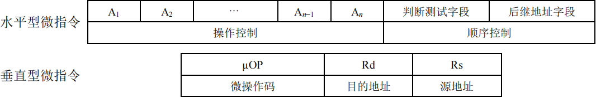

| 对比                 | 水平型微指令 | 垂直型微指令 |
| -------------------- | ------------ | ------------ |
| 并行性、效率、灵活性 | 强           | 差           |
| 执行时间             | 短           | 长           |
| 微指令字长           | 长           | 短           |
| 微程序长度           | 短           | 长           |

### 异常和中断机制

#### 异常和中断的概念

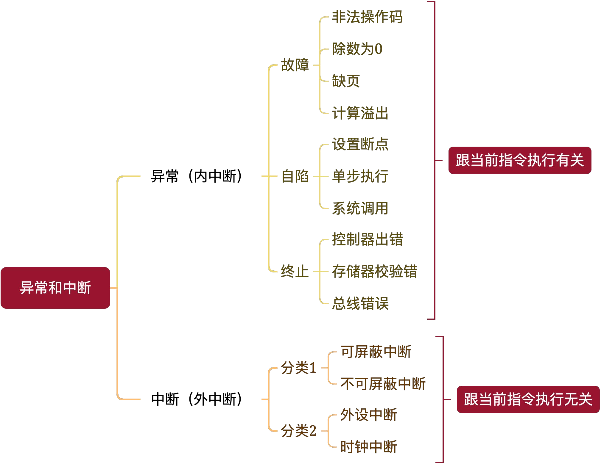

| 概念               | 含义                                                         |
| ------------------ | ------------------------------------------------------------ |
| 异常 (内中断)      | **指令执行过程中**，在CPU内部检测到的、和正在执行的指令有关的事件 |
| 中断 (外中断)      | **指令执行结束后**，检测到由外部设备触发的、与当前执行指令无关的事件 |
|                    |                                                              |
| 故障               | 在指令执行过程中被检测到的异常，故障发生就立即响应，<br/>若故障可处理，**返回原指令位置重新执行**，若故障无法处理，则直接终止 |
| 自陷 / 陷阱 / 陷入 | 在指令正常执行完毕后主动触发的，<br/>异常处理完毕后，**返回自陷指令的下一条指令继续执行** |
| 终止               | 在指令执行过程中发生严重的硬件故障，导致程序无法运行，程序因此终止 |
|                    |                                                              |
| 可屏蔽中断         | 通过可屏蔽中断请求线INTR向CPU发出的中断请求，<br/>CPU可在中断控制器中设置相应的屏蔽字来屏蔽该中断 |
| 不可屏蔽中断       | 通过不可屏蔽中断请求线NMI向CPU发出的中断请求，<br />通常是发生紧急硬件故障，如电源掉电等 |
| 外设中断           | 外部设备（如键盘、硬盘、打印机等）发出的处理请求             |
| 时钟中断           | 系统时钟硬件周期性发出的中断，以便操作系统进行任务切换       |


<table>
  <thead>
    <tr>
      <th colspan="2">类型</th>
      <th>产生原因</th>
      <th>是否返回</th>
    </tr>
  </thead>
  <tbody>
    <tr>
      <td rowspan="3">异常（内中断）</td>
      <td>故障</td>
      <td>可恢复的错误</td>
      <td>可能返回到当前指令</td>
    </tr>
    <tr>
      <td>自陷</td>
      <td>主动的偏离</td>
      <td>总是返回下一条指令</td>
    </tr>
    <tr>
      <td>终止</td>
      <td>不可恢复的错误</td>
      <td>不会返回</td>
    </tr>
    <tr>
      <td>中断（外中断）</td>
      <td></td>
      <td>外设中断/时钟中断</td>
      <td>总是返回下一条指令</td>
    </tr>
  </tbody>
</table>

::: info 浮点数上下溢是否是故障？

- 浮点数上溢：机器停止运算，进行溢出中断处理。
- 浮点数下溢：IEEE 754规定直接将尾数置0，可以继续运算，无需中断处理。

:::

::: info 异常和中断检测的时机

异常是在指令执行周期发生、检测和处理的。

CPU在每条指令执行周期结束前，都要发送中断查询信号，以检测是否有中断请求。若有中断请求，就进入中断周期，若无中断请求，就没有中断周期。

所有异常和中断都是由硬件检测的。

:::

#### 异常和中断的响应流程

1. 中断判优：若存在多个中断源的请求，通过中断判优逻辑响应一个中断源。

中断判优仅针对外中断，外中断响应比异常多一个中断判优的过程。

2. 中断响应的条件：有中断请求、CPU允许中断及开中断、指令执行完毕

异常和不可屏蔽中断不受中断开关限制。异常立即响应不等到指令执行结束。

3. 中断隐指令：关中断、保存断点PC和PSW内容、送中断向量

中断处理程序的首地址称为中断向量，中断向量存放在中断向量表中，每个中断向量对应一个中断类型号。因此可以根据类型号快速找到对应的处理程序。

中断隐指令这三步都是由硬件完成且不可打断。

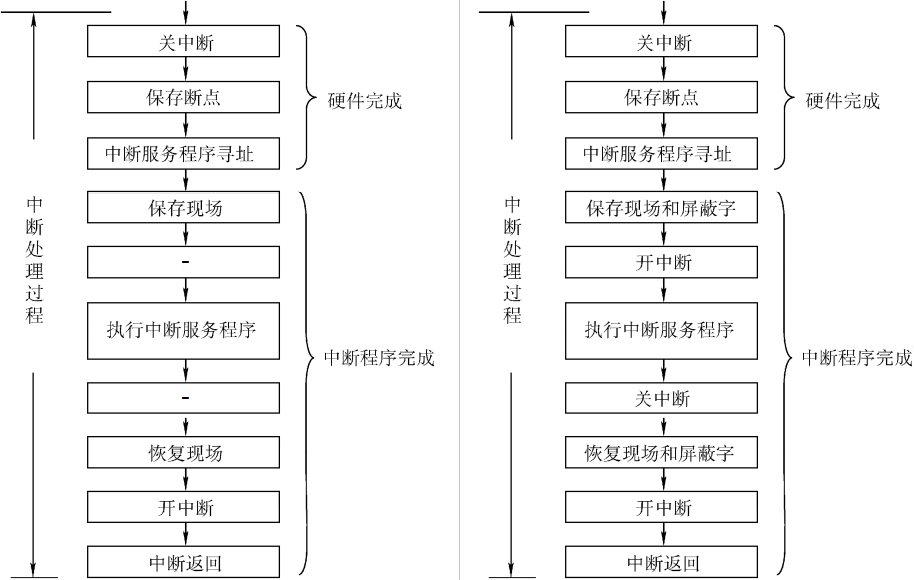

#### 多重中断和中断屏蔽

在执行中断程序的过程中，若转去处理优先级更高中断请求，为多重中断/中断嵌套。

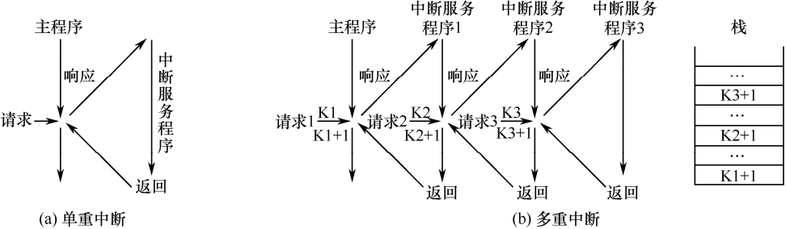

每个中断源都有自己的中断屏蔽字，执行其中断程序时会将其中断屏蔽字放入寄存器中，代表此时的中断处理优先级。

此时新中断请求会先经过中断屏蔽字过滤，再按中断响应优先级进行中断判优。

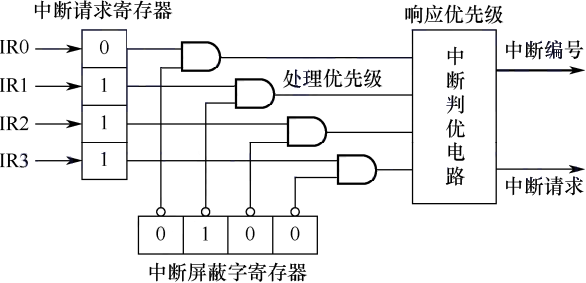

### 指令流水线

### 流水线的执行过程

### 流水线的性能指标

### 流水线的三种冒险

### 高级流水线技术

### 多处理器

### 硬件多线程

## 第六章 总线

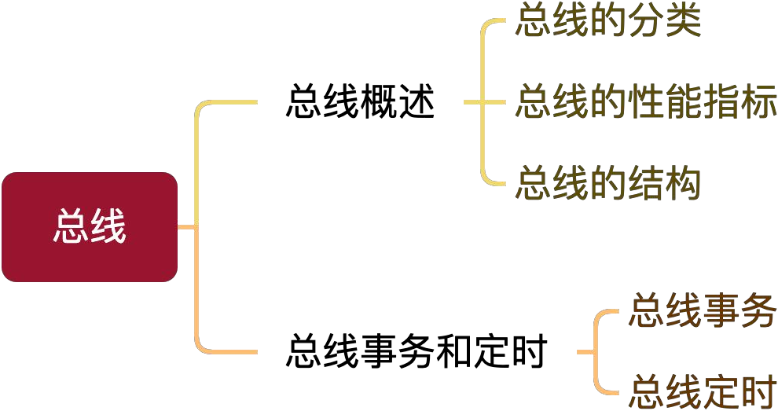

### 总线分类

<div style="display: flex; gap: 20px; align-items: center; justify-content: center;">
  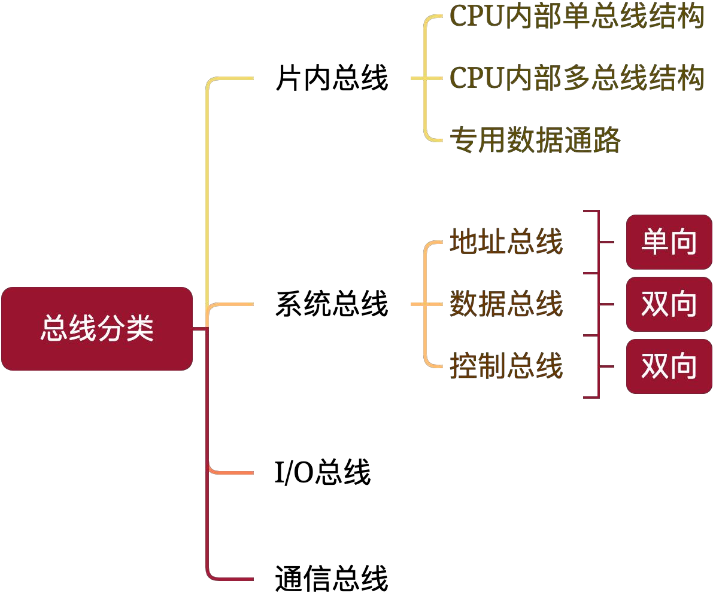
  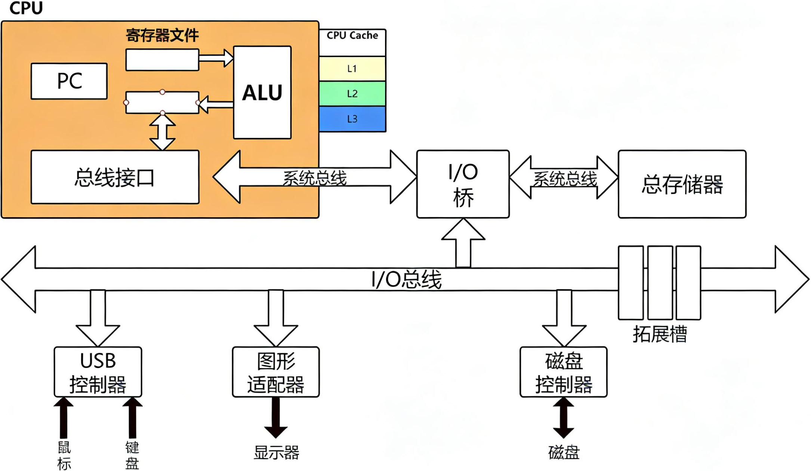
</div>

| 总线种类 | 介绍                           |
| -------- | ------------------------------ |
| 片内总线 | [CPU内部总线](#数据通路的概念) |
| 系统总线 | 连接CPU、主存、IO接口的总线    |
| IO总线   | 连接主机与各类IO控制器的总线   |

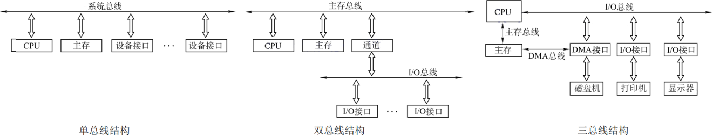

### 系统总线

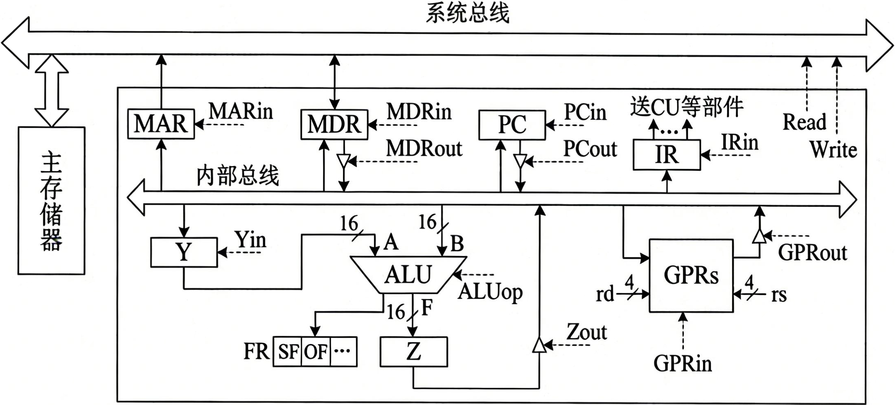

| 系统总线 | 功能                                                         |
| -------- | ------------------------------------------------------------ |
| 数据总线 | 传输数据、指令和中断类型号等，支持双向传输，数据总线位数反映一次传送的数据宽度 |
| 地址总线 | 传输主存地址或IO端口地址，仅支持单向传输，地址总线位数反映空间地址位数 |
| 控制总线 | 传输各种命令、反馈和定时信号，信号包括时钟、复位、总线请求/允许、中断请求/回答、<br/>存储器读写、IO读写、传输确认等 |

### 总线的性能指标

| 性能指标     | 含义                                                         |
| ------------ | ------------------------------------------------------------ |
| 总线时钟周期 | 总线有自己的时钟周期                                         |
| 总线时钟频率 | 总线时钟周期的倒数                                           |
| 总线传输周期 | 完成一次总线事务的时间                                       |
| 总线工作频率 | 每秒完成总线事务的次数                                       |
| 总线宽度     | 总线中数据线的条数，即并行传输的数据位数                     |
| 总线带宽     | 最大数据传输速率，总线带宽=总线宽度×总线工作频率             |
| 总线复用     | 不同信息可在同一条线上传输，<br/>若没有单独地址线，地址就得通过数据线传送，即地址/数据线复用 |
| 总线寻址能力 | 地址线位数决定地址空间量即寻址能力。16根地址线可寻址2<sup>16</sup>个单元 |

### 总线事务

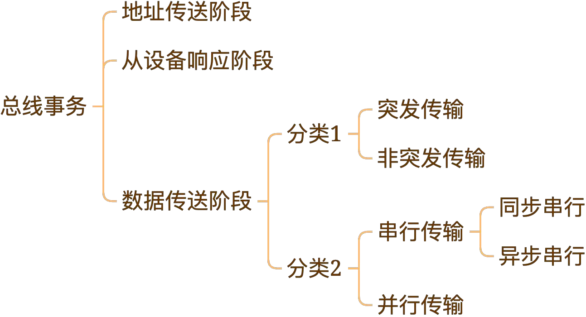

主从设备之间的一次完整信息交换，称为一个总线事务。包含三个阶段：

| 事务阶段                      | 内容                                                    |
| ----------------------------- | ------------------------------------------------------- |
| 地址传送阶段                  | 主设备将目标地址和操作类型（读/写）通过总线传送给从设备 |
| 从设备响应阶段 / 数据准备阶段 | 从设备根据地址准备数据（该阶段耗时若未提及可忽略）      |
| 数据传送阶段                  | 完成实际数据在总线上的传输                              |


| 传送方式   | 内容                                                 |
| ---------- | ---------------------------------------------------- |
| 非突发传送 | 主从设备之间一般只能传输一个总线宽度的数据           |
| 突发传送   | 寻址阶段发的是首地址，传输阶段传送多个连续单元的数据 |

| 传送方式 | 内容                                                         |
| -------- | ------------------------------------------------------------ |
| 串行传输 | 串行同步：双方时钟严格一致，效率高，但复杂成本高。仅添加首尾定界标记。<br />串行异步：双方使用独立时钟，无须严格同步。格式：起始位+数据位+校验位+停止位 |
| 并行传输 | 多条线同时传输，短距离延迟低吞吐高。信号串扰和时序偏移，限制工作频率的提升 |

### 总线定时

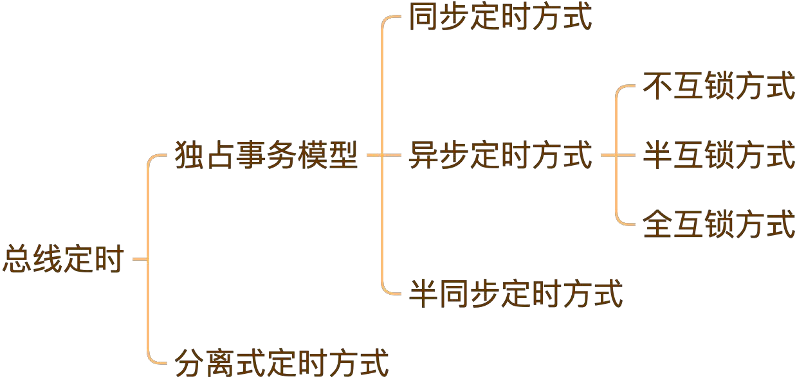

| 总线定时方式 | 内容                                                     |
| ------------ | -------------------------------------------------------- |
| 独占式       | 从发起请求到传送结束，总线全程被该事务占用               |
| 分离式       | 将总线事务分解为请求和应答两个子过程，避免准备时段的占用 |

| 独占式 | 内容                                                         |
| ------ | ------------------------------------------------------------ |
| 同步   | 采用统一的时钟来协调双方的定时。一个总线周期可以进行一次数据传送。<br/>速度快、逻辑简单，不能及时校验，适用于总线长度短、设备速度接近的系统。 |
| 异步   | 无统一时钟，无固定间隔，依靠握手信号实现定时。<br/>总线周期长度可变、能及时校验更可靠，稍复杂且速度慢，适合速度差距大的系统。 |
| 半同步 | 增设一条Wait响应信号线，Wait信号有效则存在数据。<br/>控制简单、可靠性高，时钟频率不能太高、速度不快，适合速度不高的简单系统。 |

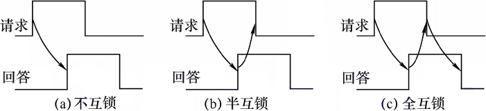

## 第七章 输入输出系统

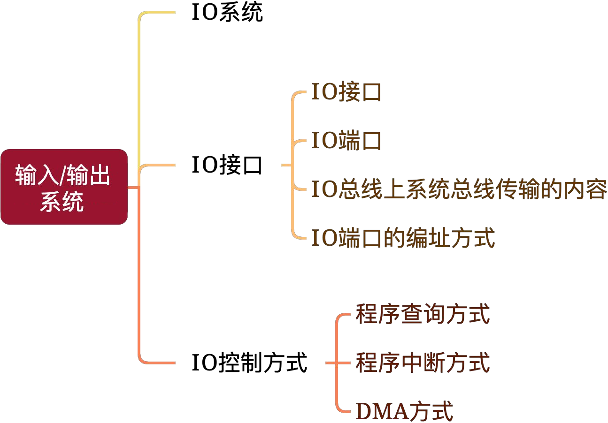

### IO接口

IO接口 / IO控制器：是主机和外设之间的交接界面，本质是硬件电路和配套程序，实现功能有：信号转换、数据暂存、地址译码、控制设备、暂存设备状态等。

I/O端口：接口电路需要设置若干寄存器，用来缓冲数据、设定控制方式、保存状态等，这些寄存器可以被CPU直接访问。

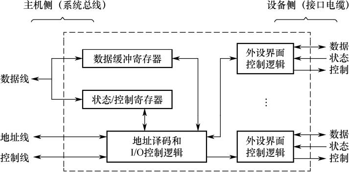

IO接口在主机侧通过IO总线与内存、CPU相连。

| 端口                      | 作用     | 具体内容                     |
| ------------------------- | -------- | ---------------------------- |
| 数据端口 / 数据缓冲寄存器 | 读写数据 | 用来暂存与CPU之间传送的数据  |
| 状态端口 / 状态寄存器     | 读状态   | 用来记录接口或设备的状态信息 |
| 控制端口 / 控制寄存器     | 发命令   | 用来保存CPU对外设的控制命令  |

> 状态和控制寄存器在方向上相反，时间上错开，因此可合二为一。

### IO接口分类

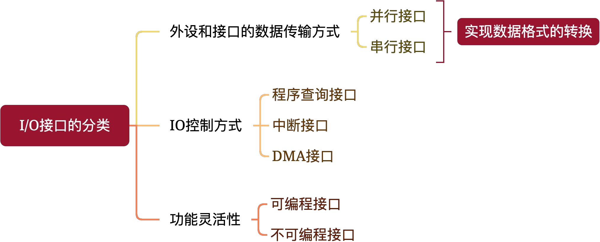

### IO接口和系统总线的连接

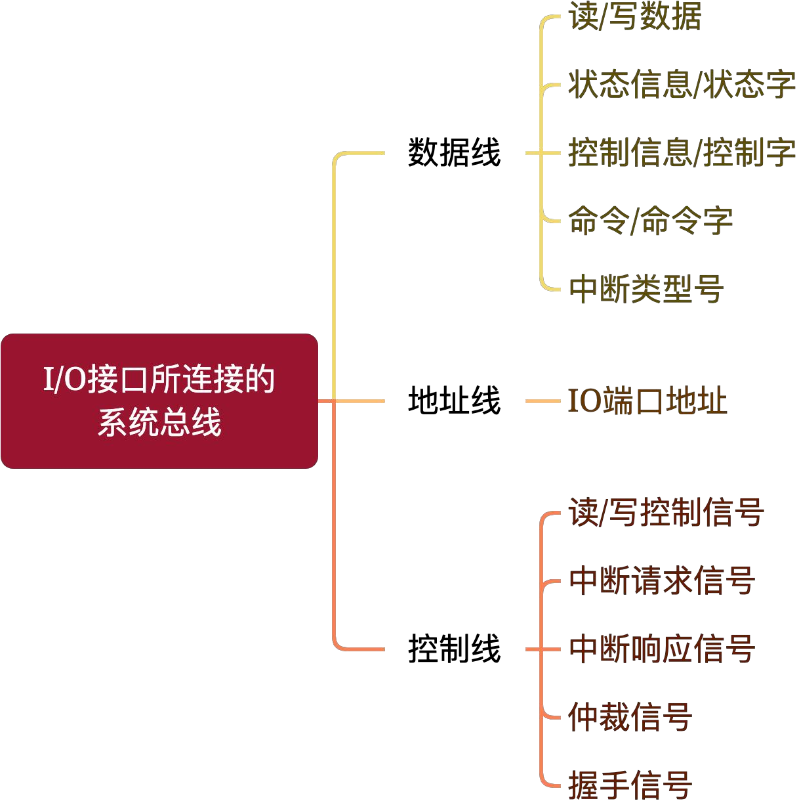

| 线路   | 传输内容                                                     |
| ------ | ------------------------------------------------------------ |
| 数据线 | 数据本身、状态信息/状态字、控制信息/控制字、命令/命令字、中断类型号 |
| 地址线 | IO端口地址                                                   |
| 控制线 | 读写控制信号、中断请求信号、中断响应信号、仲裁信号、握手信号 |

### IO端口编址

IO端口须进行编址以能够被CPU访问，其编址方式有与存储器独立编址和统一编址两种。

| 编址方式 | 含义                                                         |
| -------- | ------------------------------------------------------------ |
| 独立编址 | IO端口的地址空间与主存地址空间是两个独立的地址空间。<br/>优点：IO端口数少，只需少量地址线，译码简单，寻址速度快<br/>缺点：需专用IO指令，增加了指令系统的复杂性。 |
| 统一编址 | 主存地址空间分出一部分给IO端口进行编址，IO端口和主存单元在同一地址空间。<br/>优点：CPU访IO端口和访存一致，无需专门IO指令，简化指令系统设计。<br/>缺点：IO端口占用了一部分地址空间，导致减少了内存地址的可用范围。 |

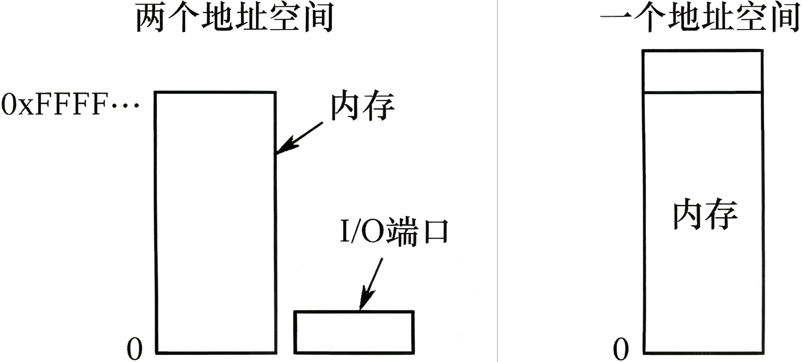

### 程序查询方式

<div style="display: flex; gap: 20px; align-items: center; justify-content: center;">
  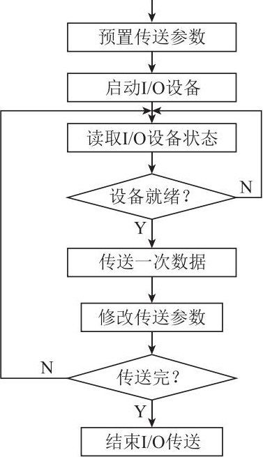
  
</div>
CPU发命令后，外设准备数据，CPU持续查询IO状态（踏步等待），IO就绪后传送数据。

| 数据传输的两个阶段  | 内容                                                         |
| ------------------- | ------------------------------------------------------------ |
| 过程1：外设准备数据 | 外设将数据送到IO接口的数据缓冲寄存器中（取决于外设数据传输速率） |
| 过程2：CPU传输数据  | 将数据从数据端口传输到CPU（取决于指令执行的时间）            |

### 程序中断方式

CPU发命令后，外设准备数据，CPU调度其他进程，IO就绪通过中断程序传输数据。

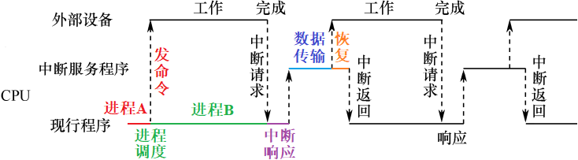

### DMA方式

| 整体流程 | 内容                                                 |
| -------- | ---------------------------------------------------- |
| 预处理   | CPU完成准备工作                                      |
| 数据传输 | 由DMA控制器完成（硬件控制），数据传输过程无需CPU参与 |
| 后处理   | DMA控制器发出中断请求，CPU执行中断做后处理           |

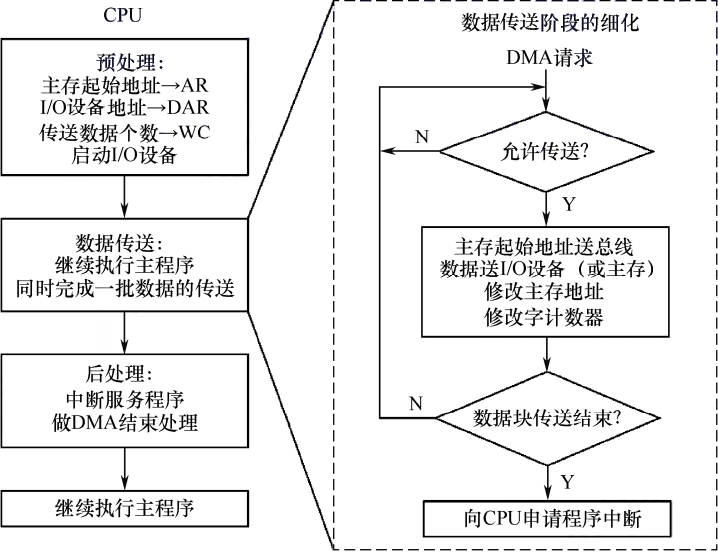

#### DMA传输过程

| 寄存器           | 功能                       |
| ---------------- | -------------------------- |
| AR主存地址寄存器 | 存放将要读写的主存单元地址 |
| WC字计数器       | 记录已写入字的个数         |
| BR数据缓冲寄存器 | 存放将要读写的数据字       |

DMA传输以块为单位，又将块以字为单位进行传输。

1. 首先CPU进行预处理，设置AR、WC、BR初始值。
2. 当字准备好时，外设向DMA控制器发起DMA请求，并设置好AR、WC、BR寄存器的内容。
3. DMA控制器发起总线请求，将字传输到主存。
4. AR自增，WC自增表示。
5. WC溢出时，表示数据交换完毕，由“溢出信号”通过中断机构发起中断请求，CPU进行后处理。

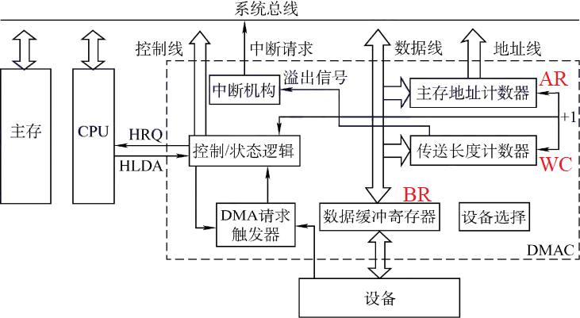

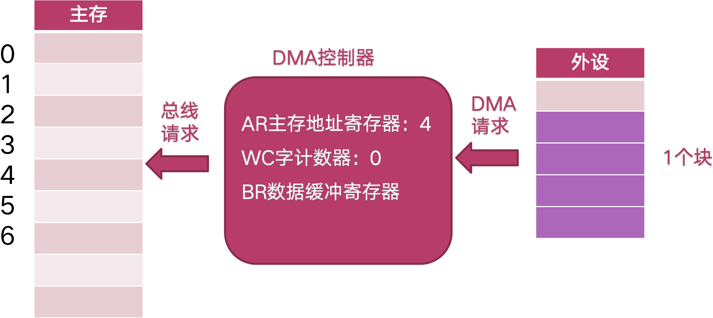

#### DMA访问内存

DMA不经过CPU直接访问主存，若和CPU发生访问冲突，有如下三种策略：

| 策略             | 解释                                                         |
| ---------------- | ------------------------------------------------------------ |
| 停止CPU访存      | DMA要访存时向CPU发送停止信号，CPU放弃系统总线的使用权，<br/>整批数据传输完毕后，将总线控制器交给CPU |
| 周期挪用         | a. CPU不在访存，挪用若干个主存存储周期给IO设备<br/>b. CPU正在访存，等待CPU机器周期结束，CPU将总线占有权让出<br/>c. 二者同时访存，CPU暂时放弃总线占有权，因IO访存优先于CPU访存<br/>此时DMA使用分离式总线定时，传送一个字后立即释放总线。 |
| DMA与CPU交替访存 | 若CPU工作周期比主存存取周期长很多，采用交替访存              |

### 三种控制方式的比较

<table>
  <tr>
    <td>程序查询方式</td>
    <td>CPU和外设完全串行工作</td>
  </tr>
  <tr>
    <td>程序中断方式</td>
    <td>CPU和外设并行，程序和传输串行</td>
  </tr>
  <tr>
    <td>DMA方式</td>
    <td>CPU和外设并行，程序和传输并行</td>
  </tr>
</table>

<table>
  <thead>
    <tr>
      <th>对比</th>
      <th>中断方式</th>
      <th>DMA方式</th>
    </tr>
  </thead>
  <tbody>
    <tr>
      <td>数据传输</td>
      <td>CPU控制数据传输，每次传一个字</td>
      <td>DMA控制数据传输，每次传一个块</td>
    </tr>
    <tr>
      <td>中断请求</td>
      <td>发送中断请求传送数据</td>
      <td>DMA发送后处理中断请求</td>
    </tr>
    <tr>
      <td>CPU参与率</td>
      <td>高，需要参与数据传输</td>
      <td>低，无需参与数据传输</td>
    </tr>
    <tr>
      <td>适用场景</td>
      <td>低速小数据设备</td>
      <td>高速大容量设备</td>
    </tr>
    <tr>
      <td>优先级</td>
      <td colspan="2" align="center">DMA > 中断</td>
    </tr>
  </tbody>
</table>
