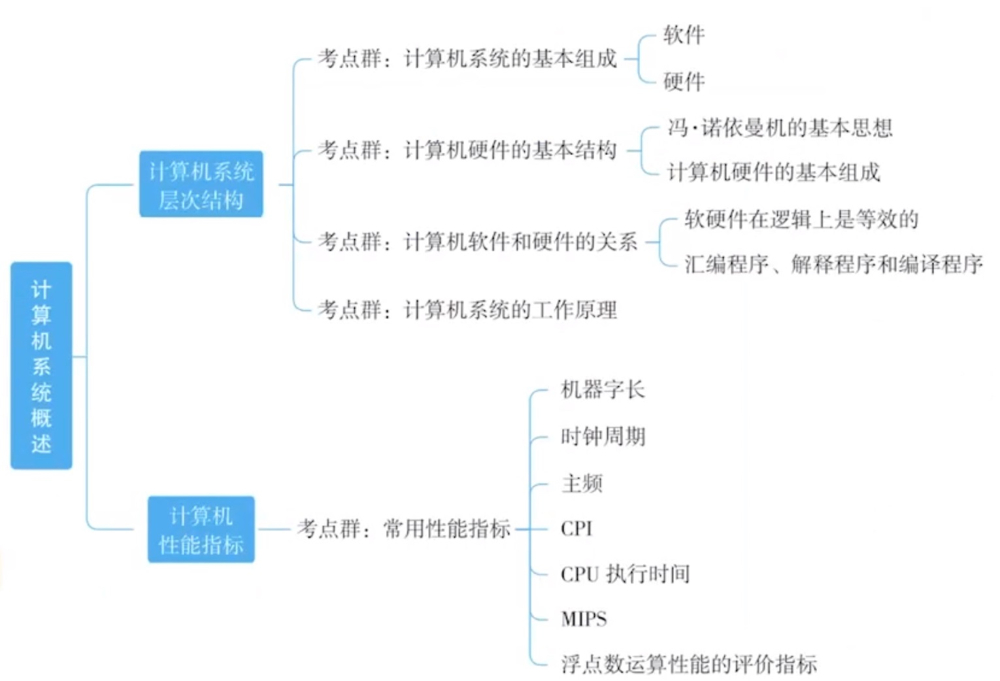
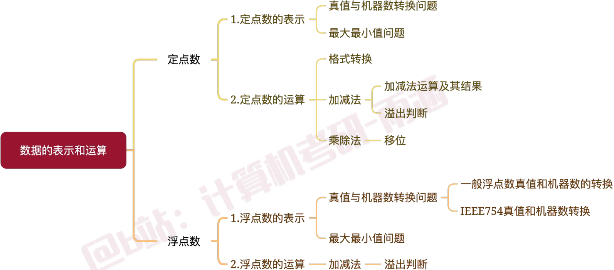

# 计算机组成原理

## 第一章 计算机系统概述

#### 冯诺依曼机的特点

1. 采用”<mark>存储程序</mark>“的工作方式。
2. 计算机硬件系统由运算器、存储器、控制器、输入输出设备五大部件组成，<mark>以运算器为核心</mark>。（现代计算机改以<mark>存储器</mark>为核心）
3. 指令和数据以<mark>同等地位</mark>存储在存储器中。
4. 指令和数据均以二进制形式表示。
5. 指令由操作码和地址码组成，操作码指出操作的类型，地址码指出操作数的地址。
6. 程序和功能都是通过中央处理器执行指令实现的。（“<mark>程序控制</mark>”思想）

#### 计算机的功能部件

1. 存储器是指主存和辅存。
2. 一个编址的对应一个存储单元，存储单元中存储的叫存储字，每一个bit叫存储元件。
3. 运算器的核心是ALU算数逻辑单元

> 其常见寄存器有：累加器ACC、乘商寄存器MQ、操作数寄存器X、变址寄存器IX、基址寄存器BR。

4. 控制器由程序计数器PC、指令寄存器IR和控制单元CU组成。
5. 存储器地址寄存器MAR、存储器数据寄存器MDR。

#### 三种级别的语言

1. 机器语言，是计算机<mark>唯一</mark>可以直接识别和执行的语言。
2. 汇编语言，汇编语言和机器语言一一对应。（汇编相当于机器语言的英语助记）
3. 高级语言。

#### 三种翻译程序

将语言与语言进行转换的软件叫做翻译程序。

1. 解释程序（解释器）：将高级语言按序逐条翻译成机器语言并立即执行。
2. 编译程序（编译器）：将高级语言编译成汇编语言<u>或机器语言</u>。
3. 汇编程序（汇编器）将汇编语言汇编成机器语言。

#### 软硬件逻辑功能等价性

一个功能既可以由硬件实现、也可以有软件实现，这一等价性称为<mark>软硬件逻辑功能等价性</mark>。

#### 三个常见字长

1. 机器字长：简称字长，也叫CPU字长、计算机字长。是指CPU一次整数运算所能处理的二进制位数。机器字长=CPU总线宽度=运算器ALU位数=通用寄存器位数。
2. 存储字长：存储单元的位数（一般按字节编址则8位）
3. 指令字长：一条指令的长度（长度不一，具体和指令内容相关）

#### 计算机主要性能指标

1. 时钟周期：CPU脉冲信号宽度，时间单位（一个时钟周期占多少秒）。
2. CPU主频：每秒有多少时钟周期，时钟周期的倒数。
3. CPI：一个指令需要多少时钟周期（个数）。
4. IPS：每秒能执行多少指令（个数）。
5. FLOPS：每秒能执行多少次浮点运算。

## 第二章 数据的表示和运算

#### 真值机器数转换

> 进制转换、BCD码、原反补移转换

- 无符号数没有原反补移码，原反补移码只针对有符号数。
- 补码符号位取反得移码。移码（解读为无符号真值）= 实际真值 + 偏置值。 

- 真值直接转补码，给补码符号位设置位权为 $-2^i$ 参与运算。

#### 数据表示范围

| 定点数 | 定点整数                            | 定点小数 | 二进制表示 |
| ------ | ----------------------------------- | -------- | -------- |
| （  n  位）无符号 | $0 \sim 2^n-1$ | $0 \sim 1-2^{-n}$ | $0000 \sim 1111$ |
| （n+1位）原码 / 反码 | $-(2^n-1) \sim 2^n-1$ | $-(1-2^{-n}) \sim 1-2^{-n}$ | $1111 \sim 0111$ |
| （n+1位）补码 | $-2^n \sim 2^n-1$ | $-1 \sim 1-2^{-n}$ | $1000 \sim 0001$ |

- 补码全1为-1。补码最小：符号位为1，其他位有1放后面。
- 补码的符号扩展：高位用符号位填充。

#### 加减法运算

- 减法转加法：减去一个数相当于加上这个数的补数。
- 补数求法：所有位取反，再+1。
- 补数本质：一个数+它的补数=$2^n$。

#### 溢出判断

| 加法器标志                               | 含义                                                      |
| ---------------------------------------- | --------------------------------------------------------- |
| <mark>CF</mark> (Carry Flag) 进位标志    | 无符号数运算是否溢出，溢出为1。$CF=C_{in} \oplus C_{out}$ |
| <mark>OF</mark> (Overflow Flag) 溢出标志 | 有符号数运算是否溢出，溢出为1。$OF=C_{n} \oplus C_{n-1}$  |
| ZF (Zero Flag) 零标志                    | 运算结果是否为0，为零ZF=1。                               |
| SF (Sign Flag) 符号标志                  | 输出运算结果符号。                                        |

双符号位判断溢出（仅针对补码运算）：复制一位符号位，若运算结果两符号位相异则溢出，相同不溢出。

> 无符号数：小减大一定溢出，大减小不会溢出，两数之和可能溢出。
>
> 有符号数：正+正 负+负 可能溢出，正+负 正-正 负-负 不会溢出。

#### 乘除法移位

| 移位     | 规则                                                  | 溢出       | 损失精度 |
| -------- | ----------------------------------------------------- | ---------- | -------- |
| 逻辑移位 | 左移：高位移出，低位补0，右移：高位补0，低位移出      | 1被移出    | 1被移出  |
| 算术移位 | 左移：高位移出，低位补0，右移：高位补符号位，低位移出 | 符号位变化 | 1被移出  |

#### 一般浮点数

规格化：尾数中数值位的最高位必须是有效位（原码1有效，补码与符号位相异有效）。

#### IEEE754浮点数

- 阶码使用移码表示，偏置值为$2^{n-1}-1$。8位阶码偏置值127，11位阶码偏置值1023。
- 尾数用原码表示，采用 1.Y 的形式，只存储 Y 的内容。

> 应用以上规则时，阶码不能全0或全1，若阶码全0或全1，应用以下规则。

- 阶码为0尾数为0表示 $0$，阶码为0尾数非0表示非规范数 $±0.Y×2^{-126}$。
- 阶码为255尾数为0表示 $∞$，阶码为255尾数非0表示 $NaN$。

- 只有能写成 $±\frac{A}{2^n}$ 的形式的十进制小数才能转成二进制小数。

#### 浮点数加减法运算
