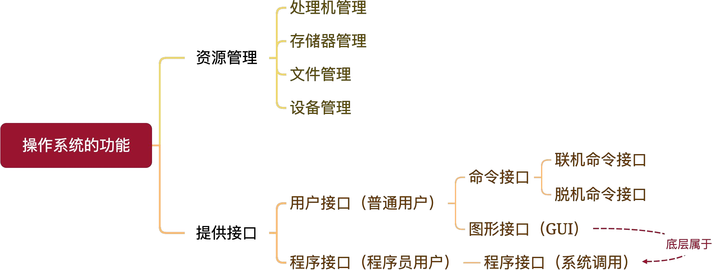
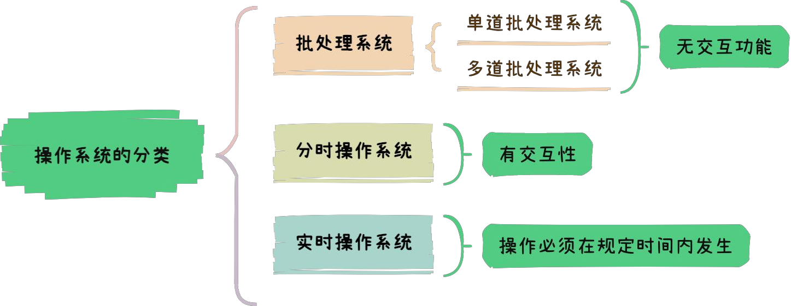
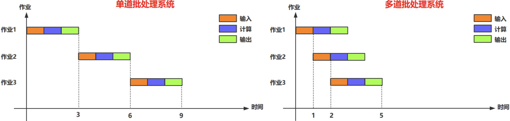
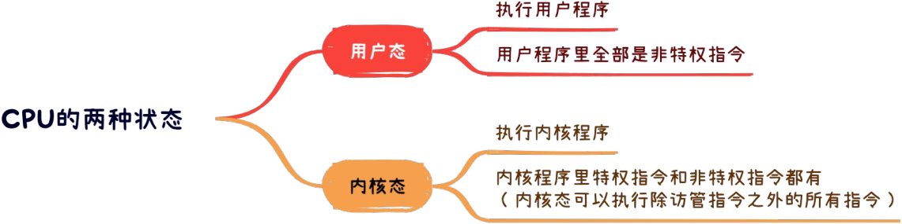
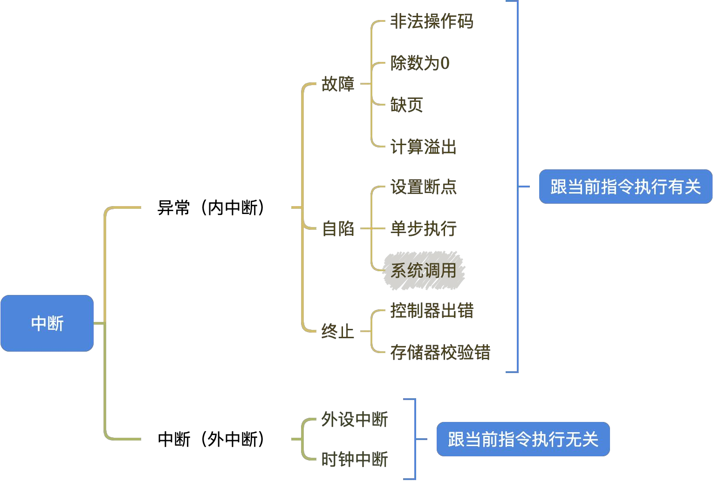
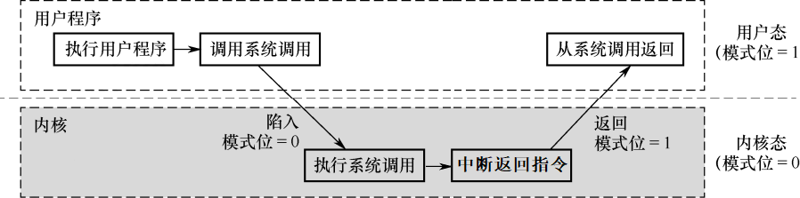
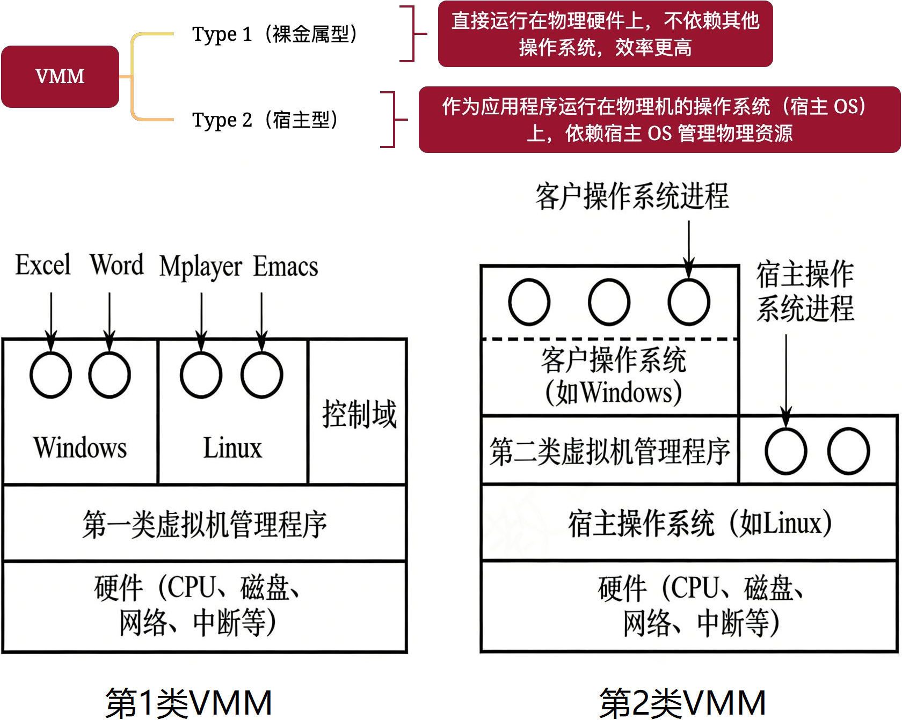
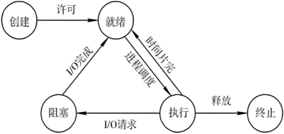

# 操作系统

## 第一章 操作系统基础

### 操作系统的功能

- 命令接口：用户通过命令控制计算机。
  - 联机/交互式命令接口 (cmd输入)
  - 脱机/批处理命令即可 (bat文件)
- 程序接口/系统调用/广义指令：用户通过应用程序间接控制操作系统。

### 操作系统的分类

- 批处理系统 ★：用户提交一批作业后操作系统自动运行，<mark>不具交互性</mark>。
  - 单道批：一次只允许一个程序运行。CPU外设利用率低、系统开销小。
  - 多道批：允许多个程序驻留内存并发执行。CPU外设利用率高、系统开销大、吞吐率大。

- 分时操作系统：以时间片为单位，多用户交互式轮流使用计算机，<mark>交互性强</mark>。
- 实时操作系统：强调系统响应时间短，硬实时要求严格、软实时允许误差。

### CPU运行模式

访管/陷入/自陷/Trap指令：触发在用户态，是用户态进程主动发起态转换的唯一合法指令，状态转换由硬件完成。

### 中断和异常处理

> 中断也称外中断，和当前执行的指令无关，由外部发起的中断。
>
> 异常也称内中断，和当前执行的指令有关，由指令引起的中断。

> 故障是发生意外可以修复，自陷是主动发起，终止是程序崩溃。

### 系统调用

### 系统结构分层

- 宏内核：内核大、性能高、扩展性差、不安全不稳定
- 微内核：内核小、性能差、扩展性好、安全稳定

### 虚拟机

虚拟机监控器/管理程序（VMM）负责管理虚拟机，协调虚拟机与物理硬件之间的资源分配。

| VMM              | 第一类 裸金属型              | 第二类 宿主型                   |
| ---------------- | ---------------------------- | ------------------------------- |
| 运行             | 直接运行在硬件之上           | 运行在宿主机之上                |
| 资源分配方式     | 直接在物理硬盘上自行分配空间 | 使用虚拟硬盘，只是宿主机的文件  |
| 性能             | 性能好                       | 性能差                          |
| 虚拟机的可迁移性 | 可迁移性差                   | 可迁移性好                      |
| 特权级别         | 第一类VMM > 操作系统         | 宿主机OS > 第二类VMM > 客户机OS |

## 第二章 进程线程

### 进程线程的基本概念

| 进程的基本概念                                  | 内容                                                         |
| ----------------------------------------------- | ------------------------------------------------------------ |
| 程序                                            | 指令和数据的集合                                             |
| 进程                                            | 动态的运行着的程序，拥有程序段+代码段+PCB等内核数据结构      |
| 进程控制块PCB                                   | 和进程一一对应，用来管理进程，始终保存在内核空间             |
| 父子进程                                        | 一对多关系，子进程继承了父进程的一些属性和资源，可以执行不同的代码。 父子进程是两个独立的进程，父进程终止不必然导致子进程终止 |
| 闲逛进程                                        | 特殊系统进程，负责无任务时占用CPU，保持系统稳定性。 优先级最低，无实际业务，不可被终止 |
| 进程和作业                                      | 作业是用户提交给系统的任务，作业通常包括几个进程             |
| 作业调度（高级调度）                            | 从外存的后背队列中选择作业，调入内存创建进程，以进入就绪队列 |
| 进程调度（低级调度）                            | 从内存的就绪队列中选择进程，分配CPU真正执行                  |
| **线程的基本概念** | **内容**                        |
| 包含关系                                        | 线程是进程内部的执行流，一个进程可以拥有多个线程             |
| 调度单位                                        | 进程是资源分配的基本单位，线程是CPU调度的基本单位            |
| 并发执行                                        | 线程和线程之间可以并发执行，无关乎所属进程                   |
| 资源共享                                        | 线程共享进程的大部分资源，除了独立栈结构、上下文数据（寄存器） |
| 轻型实体                                        | 线程切换的开销远小于进程切换的开销                           |
| 线程通信                                        | 线程使用进程的共享内存空间进行通信                           |

### 进程线程的状态切换

引起进程创建的事件：

1. 用户登录
2. 作业调度
3. 系统提供服务
4. 用户的应用请求

### 线程的实现方式

### 处理机的三级调度

### 调度的实现

### 进程的调度算法

### 多处理机调度

### 同步和互斥

### 临界区互斥的软件实现方法

### 临界区互斥的硬件实现方法

## 第三章 内存管理

## 第四章 文件管理

### 文件

### 目录

### 文件系统

## 第五章 输入输出管理

