# 操作系统

## 第一章 操作系统基础

### 操作系统的功能


| 用户和计算机的接口         | 内容                                                                                   |
| ----------------------- | ------------------------------------------------------------------------------------- |
| 命令接口                 | 用户通过命令控制计算机<br />&nbsp;• 联机/交互式命令接口（cmd输入）<br />&nbsp;• 脱机/批处理命令接口（bat文件） |
| 程序接口/系统调用/广义指令  | 用户通过应用程序间接控制操作系统                                                            |

### 操作系统的分类


| 分类        | 含义                                                     |
| ----------- | ------------------------------------------------------- |
| 批处理系统★  | 用户提交一批作业后操作系统自动运行，<emp>无交互性</emp><br/>单道批：一次只允许一个程序运行。CPU外设利用率低、系统开销小<br/>多道批：允许多个程序驻留内存并发执行。CPU外设利用率高、系统开销大、吞吐率大                       |
| 分时操作系统 | 以时间片为单位，多用户交互式轮流使用计算机，<emp>交互性强</emp> |
| 实时操作系统 | 强调系统响应时间短，硬实时要求严格、软实时允许误差                |


### CPU的运行模式

| 运行态 | 含义                                                                  |
| ----- | -------------------------------------------------------------------- |
| 用户态 | 执行用户程序，用户程序里全部是非特权指令，<emp>运行态转换由硬件自动完成</emp> |
| 内核态 | 执行内核程序，内核程序里特权指今和非特权指今都有，可执行除访管指令之外的所有指令  |

| 指令       | 含义                                                              |
| --------- | ----------------------------------------------------------------- |
| 特权指令   | 用户不可直接用指令，如IO指令、关中断指令、访问特殊寄存器、修改PSW寄存器等指令 |
| 非特权指令 | 用户可以直接用指令，不能访问系统中资源，仅限用户地址空间，防止破坏系统        |
| 访管指令   | 陷入/自陷/Trap指令，触发在用户态，是用户态进程主动发起态转换的唯一合法指令   |

### 中断和异常处理

> 中断也称外中断，和当前执行的指令无关，由外部发起的中断。
>
> 异常也称内中断，和当前执行的指令有关，由指令引起的中断。


> 故障是发生意外可以修复，自陷是主动发起，终止是程序崩溃。

### 系统调用过程


| 调用         | 准备工作对比                                             |
| ------------ | ------------------------------------------------------ |
| 系统调用      | 硬件自动保存PC和<emp>PSW</emp>，系统保存nPRs和各种现场信息 |
| 一般过程调用   | 硬件自动保存PC，系统保存nPRs和和各种现场信息                 |

> 系统调用存在改变特权级、开关中断等操作，这些都在PSW中，所以需要压栈保存。

### 系统分层结构

| 分层结构 | 含义                                                                 |
| ------- | ------------------------------------------------------------------- |
| 分层法   | 将系统分为若干层，每层只能调用紧邻它的低层的功能（单向依赖，结构清晰，便于调试） |
| 模块化   | 将系统按功能划分若干模块，模块间相互依赖，通过调用接口通信（依赖复杂、难以调试） |
| 宏内核   | 内核大，性能高，扩展性差，不安全不稳定                                    |
| 微内核   | 内核小，性能低，扩展性好，安全稳定（C/S模式、面向对象、机制策略分离）          |

### 操作系统引导

| 步骤                                 | 解释                                                                     |
| ------------------------------------ | ----------------------------------------------------------------------- |
| 1. CPU通电                            | 加载内存ROM中的引导程序/BIOS固件                                           |
| 2. 硬件自检                           | 自检程序构建临时中断向量表，用于硬件自检                                       |
| 3. 自举装入程序                        | 确定启动硬盘优先级，选择首个有效硬盘                                          |
| 4. 加载主引导记录MBR                   | 加载启动硬盘的首扇区/主引导扇区，主引导扇区由MBR和分区表组成。<br/>1.MBR：用于解析分区表，识别活动分区<br/>2.分区表：给出每个分区的起始和结束地址 |
| 5. 定位活动分区<br/>并加载分区引导记录PBR | MBR扫描硬盘分区表，识别并加载活动分区，加载活动分区的首扇区，即<br/>分区引导记录PBR |
| 6. 加载启动管理器                      | 启动管理器将操作系统内核加载到内存中并执行。内核随即接管系统，重建<br/>中断处理机制。 |
| 7. 初始化内核<br/>并启动用户环境         | 内核完成核心子系统的初始化：<br/>1.内存管理模块，构建内核页表及用户进程地址空间<br />2.进程调度模块，初始化进程控制块PCB链表、就绪队列与阻塞队列<br/>3.设备驱动模块，建立设备控制块、设备分配表以及IO缓冲区管理结构<br/>内核初始化后，启动首个用户态进程，逐步构建整个用户操作环境。 |

### 虚拟机

虚拟机监控器/管理程序/VMM 负责管理虚拟机，协调虚拟机与物理硬件之间的资源分配。


| VMM            | 第一类 裸金属型           | 第二类 宿主型                  |
| -------------- | ----------------------- | ---------------------------- |
| 运行            | 直接运行在硬件之上         | 运行在宿主机之上                |
| 资源分配方式     | 直接在物理硬盘上自行分配空间 | 使用虚拟硬盘，只是宿主机的文件    |
| 性能            | 性能好                   | 性能差                        |
| 虚拟机的可迁移性  | 可迁移性差                | 可迁移性好                    |
| 特权级别         | 第一类VMM > 操作系统      | 宿主机OS > 第二类VMM > 客户机OS |

## 第二章 进程线程

### 进程的基本概念

| 进程的基本概念                                  | 内容                                                                           |
| --------------------------------------------- | ----------------------------------------------------------------------------- |
| 程序                                           | 指令和数据的集合                                                                |
| 进程                                           | 动态的运行着的程序，拥有程序段+数据段+PCB等内核数据结构                               |
| 进程控制块PCB                                   | 和进程一一对应，用来管理进程，始终保存在内核空间                                      |
| 父子进程                                        | 一对多关系，子进程继承了父进程的一些属性和资源，可以执行不同的代码。<br/>父子进程是两个独立的进程，父进程终止不必然导致子进程终止 |
| 闲逛进程                                        | 特殊系统进程，负责无任务时占用CPU，保持系统稳定性。<br/>优先级最低，无实际业务，不可被终止 |
| 进程和作业                                      | 作业是用户提交给系统的任务，作业通常包括几个进程                                      |
| <thd>线程的基本概念</thd>  | <thd>内容</thd>                                         |
| 包含关系                                        | 线程是进程内部的执行流，一个进程可以拥有多个线程                                      |
| 调度单位                                        | 进程是资源分配的基本单位，线程是CPU调度的基本单位                                     |
| 并发执行                                        | 线程和线程之间可以并发执行，无关乎所属进程                                           |
| 资源共享                                        | 线程共享进程的大部分资源，除了独立栈结构、上下文数据（寄存器）                          |
| 轻型实体                                        | 线程切换的开销远小于进程切换的开销                                                  |
| 通信方式                                        | 线程使用进程的共享内存空间进行通信                                                  |

### 进程的状态切换


::: info 状态切换图图解

> 口诀：三状态四条线，两条线不可建

- **阻塞态不可直接变成执行态**：需变成就绪态等待调度。
- **就绪态不可直接变成阻塞态**：只有执行中的进程才会变成阻塞态。

:::

| 状态            | 解释                                                      |
| -------------- | --------------------------------------------------------- |
| 创建态          | 进程已有创建计划，但未调入内存未分配资源，创建状态还没有完全完成     |
| **就绪态**      | 进程已获得除CPU外的所有资源，等待CPU时间片轮转                   |
| **执行态**      | 进程已获得CPU时间片，正在被执行指令                            |
| **阻塞/等待态**  | 进程由于期待的事件未发生，如请求系统资源、等待操作完成，数据尚未到达 |
| 挂起态          | 由于内存不足，进程被调到外存中等待称挂起，阻塞态是在内存中等待。     |
| 终止态          | 进程正常结束或其他原因退出运行，随后进行资源释放和回收             |

| 状态转换       | 可能原因            |
| ------------- | ----------------- |
| 就绪态 → 运行态 | 进程调度            |
| 运行态 → 就绪态 | 时间片结束 / 被抢占  |
| 运行态 → 阻塞态 | 等待资源申请        |
| 阻塞态 → 就绪态 | 资源申请成功        |

| 进程创建和销毁 | 内容 |
| ------------ | ---------------------------------------------------- |
| 进程创建的原因 | 用户登录、作业调度、系统提供服务、用户的应用请求              |
| 进程创建的过程 | 申请PCB、分配运行资源（内存、文件等）、初始化PCB、放入就绪队列 |
| 进程销毁的原因 | 正常结束、异常结束、外界干预                              |
| 进程销毁的过程 | 检索PCB、终止运行、归还运行资源、移出所在队列               |

若PCB申请失败，则创建失败。若资源不足，则滞留创建态，等待分配资源。

### 用户级内核级线程

- 内核级线程：由**操作系统内核**创建、调度和管理的线程。
- 用户级线程：由**应用进程**创建、调度和管理的线程。**内核不了解用户级线程的存在**。

| 对比    | 用户级线程 | 内核级线程 |
| ------ | :-------: | :------: |
| 创建线程 |  用户态   |  内核态   |
| 线程调度 |  用户态   |  内核态   |
| 切换开销 |   低     |   高      |


| 用户级线程的三种模型 | 优缺点                                                                   | 对比                                |
| :------: | -------------------------------------------------------------------------------- | :--------------------------------: |
| 多对一模型 | 优：线程切换只在用户空间完成，无需切换到内核态<br/>劣：一个用户级线程被阻塞后，整个进程都被阻塞  | <emp>并发度不高<br/>开销小效率高</emp> |
| 一对一模型 | 优：一个用户级线程被阻塞后，别的进程仍能执行<br/>劣：线程切换需操作系统内核参与，需切换到内核态  | <emp>并发能力强<br/>开销大效率低</emp> |
| 多对多模型<br/>(用户线程数≥内核线程数) | 优：避免了多对一模型中线程阻塞会影响其他线程<br/>劣：避免了一对一模型中使用太多内核级线程 | <emp>并发能力强<br/>开销进步降低</emp> |

> 系统只能看见内核线程，内核线程才是CPU的运行单位，同一进程的多个用户线程不可能并行。

### 进程的通信方式

| 进程通信 | 实现方式                                                                                                             |
| :-----: | ------------------------------------------------------------------------------------------------------------------ |
| 共享内存 | 申请一块可以直接访问的共享内存空间。无任何同步互斥机制。                                                                     |
| 管道通信 | 本质是特殊的内存文件，不在磁盘中，存在于内核缓冲区。单向的、先进先出的。<br/>分为匿名管道和命名管道。**写满阻塞写进程、读完阻塞读进程**。 |
| 消息传递 | 直接通信：发送方直接发送给接收方，挂在接收方的消息缓冲队列上。<br/>间接通信：发送方发送到某个中间实体（信箱），接收方从中取消息。         |
|  信号   | 发送方可为内核或进程，接收方收到信号后，执行信号的默认或自定义处理程序。<br/>**进程从内核态进入用户态时**，会检查是否存在待处理信号。    |

### 三级调度


| 三级调度       | 具体内容                                                                    |
| ------------ | -------------------------------------------------------------------------- |
| 高级/作业 调度 | 从外存的后备队列中选择作业，调入内存创建进程，并进入就绪队列                         |
| 中级/内存 调度 | 将进程从<tip>内存调到外存</tip>，设为就绪挂起/阻塞挂起态，以提高内存利用率和系统吞吐量 |
| 低级/进程 调度 | 从内存的就绪队列中选择进程，分配CPU真正执行                                       |

<div style="display: flex; gap: 5px; align-items: center; justify-content: center;">
  
  
</div>

### 进程调度

#### 进程上下文

用户进程调度必须通过中断使CPU进入内核态并执行调度程序。

进程上下文指进程的程序实体（代码和数据）和运行环境（内核资源和寄存器内容）。

| 进程上下文   | 具体内容                                                  |
| ---------- | -------------------------------------------------------- |
| 用户级上下文 | 用户的程序段、数据段、堆栈等用户区地址空间                      |
| 程序级上下文 | **PCB**，文件，页表等                                      |
| 寄存器上下文 | **通用寄存器、程序计数器PC、程序状态寄存器PSW、页表基址寄存器**等 |

进程调度时，会发生两次上下文切换：

1. 将当前进程上下文保存进PCB，再装入分派程序的上下文；
2. 移出分派程序的上下文，再装入新程序的上下文。


#### 调度的方式

| 调度方式         | 具体内容                                                                         |
| --------------- | ------------------------------------------------------------------------------ |
| 抢占/剥夺方式     | 高优先进程进入队列，调度器暂停当前进程，去执行该进程。适用于分时和实时系统  |
| 非抢占/剥夺方式 | 高优先进程进入队列，当前进程结束，调度器再执行该进程。适用于早期批处理系统 |

#### 调度和不可调度的时机

| 调度的时机                                                                  | 举例                                                      |
| -------------------------------------------------------------------------- | -------------------------------------------------------- |
| 有进程下CPU，执行态到其他态，一定发生调度<br/>队列新增进程，优先级可能更高，可能发生调度 | 运行结束、自我阻塞、等待资源、<br/>时间片用完、中断处理结束、系统调用返回 |

> 默认非抢占式，资源就绪只能导致进程就绪，不会引发调度。

| 不可调度的时机 | 举例                                                  |
| ------------ | ---------------------------------------------------- |
| 原子操作      | 执行原语                                               |
| 内核态临界区   | 各种内核数据结构的操作，如PCB、进程队列、页表、文件表、索引表  |
| 中断处理中     | 中断处理结束，从内核态返回用户态时，系统会检查是否需要进程调度 |

::: tip 原语

原语，本质是执行过程不可中断、原子执行的内核的函数。常见的原语有，进程状态切换操作、线程互斥同步操作。

:::

### 调度算法


#### 评价指标

| 评价指标                    | 含义                                               |
| ------------------------- | -------------------------------------------------- |
| 系统吞吐量                  | 单位时间内CPU完成的任务数量                            |
| 等待时间                    | 进程处于等待获取处理机的状态的时间之和（就绪态和阻塞挂起态） |
| 响应时间                    | 进程从提交到第一次获取CPU执行的时间                     |
| <swarn>**周转时间**</swarn> | <tip>从作业提交到作业完成所消耗的时间</tip>             |
| 带权周转时间                 | 周转时间 / 实际运行时间                               |

#### 基础调度算法

| 调度算法         | 含义                                                                               | 特点                             |
| --------------- | --------------------------------------------------------------------------------- | :-----------------------------: |
| 先来先服务FCFS   | 选最先来的。                                                                         |     <emp>短进程不友好</emp>       |
| 短作业优先SJF    | 选最短的。抢占式短作业优先又叫最短剩余时间优先SPF。<br/><tip>平均等待时间和周转时间均最小</tip>。|      <emp>长进程饥饿</emp>        |
| 高响应比优先HRRN | 选响应比最高的。$响应比=\frac{等待时间+执行时间}{执行时间}$。<br/>综合考虑等待时间和运行时间。   |          兼具两者优点             |
| 时间片轮转RR     | 按提交顺序，轮流获取时间片。公平响应快，适合分时系统。                                    | <emp>不会导致饥饿<br/>切换开销大</emp> |
| 优先级调度PSA    | 按优先级插入队列。抢占式优先级响应迅速，适合实时系统。<br/>优先级原则：系统>用户、交互>非交互、IO>计算 |         综合紧迫程度          |

#### 多级队列调度算法

存在多级就绪队列，按类型或性质的不同，将进程放入不同就绪队列。

- 方式一：高级队列拥有绝对优先级，只有当高级队列为空后，才调度低级队列的进程。
- 方式二：时间片轮转调度多个队列，但高级队列拥有更长的CPU时间片。


#### 多级反馈队列调度算法

进程在多级队列中移动，各级队列优先级从高到低，时间片分配从低到高。

规则如下：

- 新进程先入一级队列，调度一次后若未结束，进入二级队列。末级队列调度若还未结束，则重新放到末级队列尾部。
- 高级队列为空才会调度低级队列。
- 每级队列可以采用不同调度算法，不必全部使用时间片轮转。


#### 多处理机调度

多核调度的注意点：

- 负载均衡：尽量平均所有处理机的工作量。
- 亲和性：进程尽量固定于一个处理机上运行，避免cache浪费。

多处理机的调度方案：

1. 所有处理机共享一个公共就绪队列。特点：负载均衡性好，处理器亲和性差。
2. 每个处理机对应一个私有就绪队列。优点：处理器亲和性好，负载不均衡。

平衡负载的策略：

- 推迁移：特定程序周期性检查负载，从过载CPU的队列中”推“一些到空闲CPU的队列。
- 拉迁移：空闲CPU主动从过载CPU的队列中”拉“一些到自己的队列。

> 一般推迁移和拉迁移通常同时使用。

### 同步互斥的概念

- 同步（直接制约）：AB有先后关系
- 互斥（间接制约）：AB不可同时访问

互斥原则：空闲让进、忙则等待、有限等待、让权等待（非必须）。

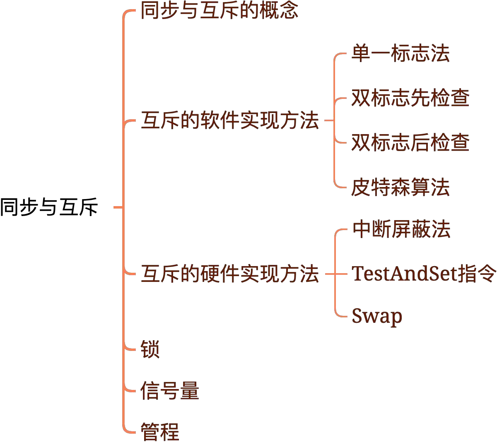

### 互斥的软件实现

#### 单标志法

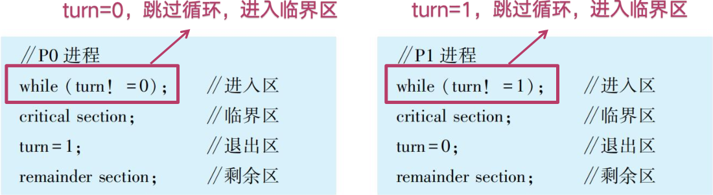

```c
进程P0:                       进程P1:
while(turn!=0);              while(turn!=1);          //进入区
critical section;            critical section;        //临界区
turn=1;                      turn=0;                  //退出区
remainder section;           remainder section;       //剩余区
```

> 只能两个进程交替进入，不能同一进程连续进入。

违反空闲让进、让权等待。

#### 双标志先检查

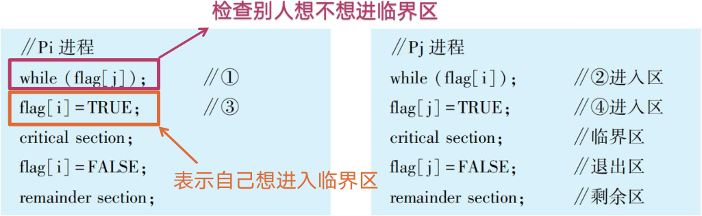

```c
进程Pi:                       进程Pj:
while(flag[i]);     ①        while(flag[j]);    ②     //进入区
flag[i]=true;       ③        flag[j]=true;      ④     //进入区
critical section;            critical section;        //临界区
flag[i]=false;               flag[j]=false;           //退出区
remainder section;           remainder section;       //剩余区
```

> 俩进程可能同时进入临界区。

违反忙则等待、让权等待。

#### 双标志后检查

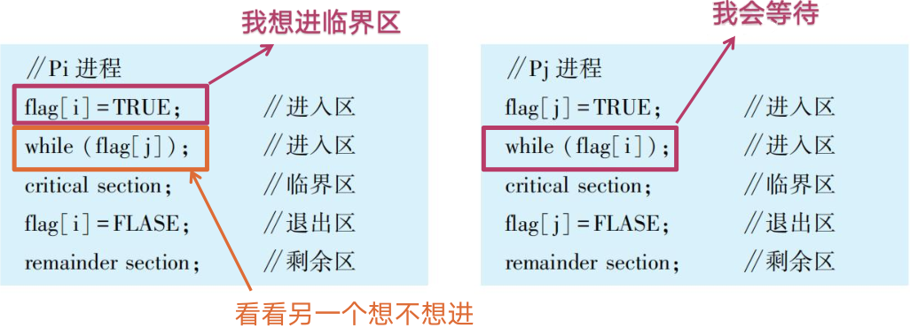

```c
进程Pi:                       进程Pj:
flag[i]=true;       ①        flag[j]=true;      ②     //进入区
while(flag[j]);     ③        while(flag[i]);    ④     //进入区
critical section;            critical section;        //临界区
flag[i]=false;               flag[j]=false;           //退出区
remainder section;           remainder section;       //剩余区
```

> 俩进程可能同时循环等待。

违反空闲让进、有限等待、让权等待。

#### 皮特森算法

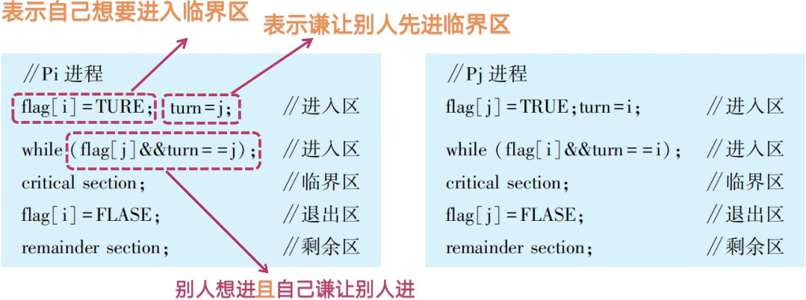

```c
进程Pi:                       进程Pj:
flag[i]=true;turn=j;         flag[j]=true;turn=i      //进入区
while(flag[j]&&turn==j);     while(flag[i]&&turn==i); //进入区
critical section;            critical section;        //临界区
flag[i]=false;               flag[j]=false;           //退出区
remainder section;           remainder section;       //剩余区
```

> turn不会同时等于i或j。故不会让俩进程同时等待。

违反让权等待。

#### 总结

| 互斥的软件实现 | 记忆法                                                                                         |
| ------------ | -------------------------------------------------------------------------------------------- |
| 单一标志法     | 检查不是自己 `while(turn!=i);`                                                                 |
| 双标志先检查   | 检查别人想进，表示自己想进 `while(flag[j]);flag[i]=true;`                                         |
| 双标志后检查   | 表示自己想进，检查别人想进 `flag[i]=true;while(flag[j]);`                                         |
| 皮特森算法     | 表示自己想进，谦让别人先进，检查别人想进且谦让别人进<br/>`flag[i]=true;turn=j;while(flag[i]&&turn=j);` |

<table>
  <thead>
    <tr>
      <th>互斥的软件实现</th>
      <th style="text-align: center">缺点</th>
      <th style="text-align: center">是否互斥</th>
    </tr>
  </thead>
  <tbody>
    <tr>
      <td>单一标志法</td>
      <td>违反空闲让进、让权等待</td>
      <td rowspan="3" style="text-align: center">不能实现互斥</td>
    </tr>
    <tr>
      <td>双标志先检查</td>
      <td>违反忙则等待、让权等待</td>
    </tr>
    <tr>
      <td>双标志后检查</td>
      <td>违反空闲让进、有限等待、让权等待</td>
    </tr>
    <tr>
      <td>皮特森算法</td>
      <td>违反让权等待</td>
      <td></td>
    </tr>
  </tbody>
</table>

### 互斥的硬件实现

#### 中断屏蔽字

阻止其他进程进入临界区最简单粗暴的办法是屏蔽中断。

关中断是设置CPU中断允许标志位，是仅能由内核执行的硬件操作，用于禁止中断、防止进程切换。

缺点：

1. 关中断的权限不可交给用户，随意关中断会导致系统无法运行。
2. 不适用于多处理器系统，无法防止其他CPU上进程进入临界区。

#### var(--vp-c-bg-soft)AndSet指令

var(--vp-c-bg-soft)AndSet是一条原子性的硬件操作，其意思是读值再置真。

```c
bool var(--vp-c-bg-soft)AndSet(bool* lock) {
	bool old = *lock;
	*lock=true;
	return old;
}
```

原本true返回true，继续等待，原本false返回false置为true，结束等待。

```c
while(var(--vp-c-bg-soft)AndSet(&lock));  //进入区
critical section;          //临界区
lock=false;                //退出区
remainder section;         //剩余区
```

> 返回true进不去，返回false能进去

#### Swap指令

Swap是一条原子性的硬件操作，其意思是交换两个字节的内容。

```c
bool key=true;             //进入区
while(key!=false)          //进入区
    Swap(&lock,&key);      //进入区
critical section;          //临界区
lock=false;                //退出区
remainder section;         //剩余区
```

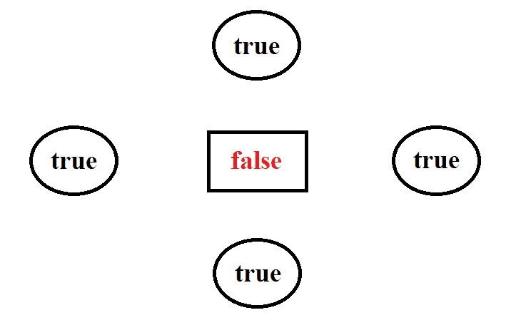

> 1. lock= true key=true 交换后进不去
> 2. lock=false key=true 交换后能进去

### 互斥锁

> 锁是系统中完整实现的互斥机制，融入了上述的互斥软硬件实现内容。

| 锁    | 让权等待 | 适合场景 | 切换开销 | 适用临界区长度 |
| ----- | ------- | ------ | ------- | ----------- |
| 自旋锁 | 不满足   | 多核    | 无开销   | 较短         |
| 互斥锁 | 满足    | 单核多核 | 有开销   | 较长         |

### 信号量

#### 整型信号量

整型信号量用整型量S表示资源数目，线程等待时会连续测试，不符合“让权等待”。

```c
wait(S) {                    P(S) {
    while(S<=0);                 while(S<=0);
    S=S-1;                       S=S-1;
}                            }
signal(S) {                  V(S) {
    S=S+1;                       S=S+1;
}                            }
```

#### 记录型信号量

记录型信号量使用整形量S和等待链表L，线程等待时放进链表，符合“让权等待”。

<tip>S≥0时，表示现有可用的资源数。S<0时，表示正在等待的线程数。</tip>

```c
typedef struct{
    int value;
	struct process *L;
} semaphore;

void wait(semaphore S){             void signal(semaphore S){
    S.value--;                          S.value++;
    if (S.value<0){                    if (S.value<=0){
        add this process to S.L;            remove a process P from S.L;
        block(S.L);                         wakeup(P);
    }                                   }
}                                   }
```

#### 利用信号量实现互斥

信号量初值设为1，可以实现互斥访问。

```c
semaphore S=1; //初始化信号量，初值为1
P1(){                         P2(){
    ...                            ...
    P(S); /*加锁*/                 P(S); /*加锁*/
    进程P1的临界区;                进程P2的临界区;
    V(S); /*解锁*/                 V(S); /*解锁*/
    ...                            ...
}                              }
```

#### 利用信号量实现同步

实现同步时，信号量初值一般设为0，也可由用户确定。

```c
semaphore S=0;//初始化信号量，初值为0
P1(){                             P2(){
    X;    /*执行语句x*/                P(S); /*等待P1释放*/
    V(S); /*通知P2,x已完成*/           Y;    /*使用x的结果,执行语句Y*/
}                                 }
```

#### 利用信号量实现前驱关系

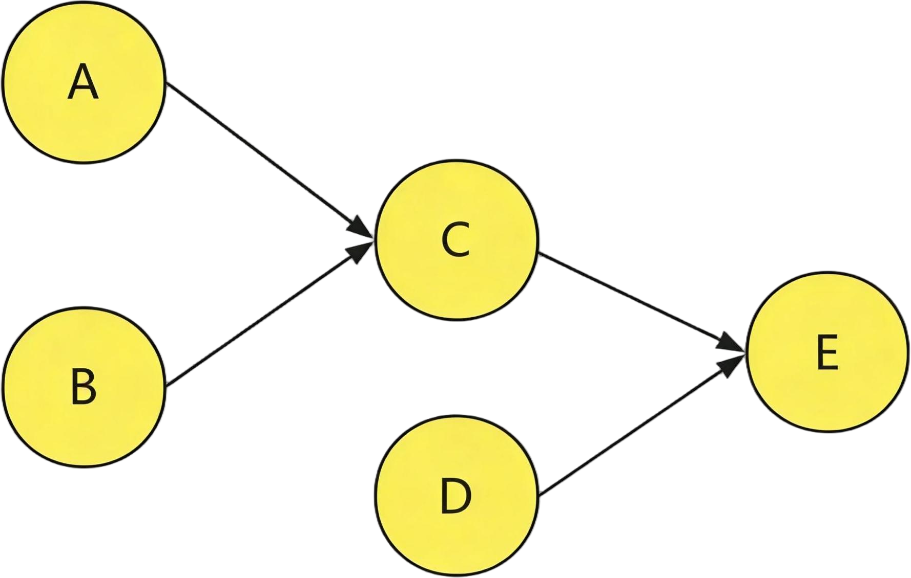

设计原则：资源是线，<tip>信号量设线不设点</tip>。信号量是根据资源而定。

```c
semaphore AC=BC=CE=DE=0;
PA(){            PB(){            PC(){            PD(){            PE(){
   A;               B;               P(AC);          D;               P(CE);
   V(AC);           V(BC);           P(BC);          V(DE);           P(DE);
}                }                   C;            }                  E;
                                     V(CE);                        }
                                  }
```

### 经典同步问题

#### 生产者消费者问题

##### 单缓冲区

- 互斥：缓冲区是临界区，生产者消费者需互斥
- 同步：先生产才消费，满了不能生产，空了不能消费

> 信号量资源就是缓冲区的空空间 (位置) 和满空间 (产品)，故初值分别为n和0。

同步关系：

- 消耗空空间 ⇒ 放入产品 ⇒ 释放满空间
- 消耗满空间 ⇒ 取出产品 ⇒ 释放空空间

```c
semaphore mutex=1;
semaphore empty=n;
semaphore full=0;
producer(){ /*生产者*/              consumer(){ /*消费者*/
    while(1){                            while(1){
        生产;                                P(full); /*使用一个满空间*/
        P(empty); /*使用一个空空间*/          P(mutex); /*上锁*/
        P(mutex); /*上锁*/                   缓冲区拿出产品;
        产品放入缓冲区;                       V(mutex); /*解锁*/
        V(mutex); /*解锁*/                   V(empty); /*产生一个空空间*/
        V(full); /*产生一个满空间*/           消费;
    }                                    }
}                                    }
```

##### 多缓冲区

邮件辩论问题：

- AB两人通过邮件辩论，从信箱中取得问题，再将答案和新问题组成邮件放入对方信箱。
- A信箱最多放M个邮件，B信箱最多放N个邮件。初始时A信箱有x个邮件，B信箱有y个邮件。
- 信箱不空时，才能取邮件，否则等待。信箱不满时，才能放邮件，否则等待。

请添加必要的信号量和PV操作，以实现上述过程的同步。

- A是A邮箱的消费者、B邮箱的生产者，B是B邮箱的消费者、A邮箱的生产者。
- 邮箱会被两个角色访问，所以需要互斥。
- 每个邮箱的空空间和满空间是资源。

同步关系：

- 消耗满空间 ⇒ 取信 ⇒ 释放空空间
- 消耗空空间 ⇒ 放信 ⇒ 释放满空间

```c
seamphore mutexA=1;
seamphore mutexB=1;
seamphore emptyA=M-x, fullA=x;
seamphore emptyB=N-y, fullB=y;
A(){                                B(){
    while(1){                           while(1){
        P(fullA);                           P(fullB);
        P(mutexA);                          P(mutexB);
        从A信箱取信;                        从B信箱取信;
        V(mutexA);                          V(mutexB);
        V(emptyA);                          V(emptyB);
        回答并提问;                         回答并提问;
        P(emptyB);                          P(emptyA);
        P(mutexB);                          P(mutexA);
        向B信箱放信;                        向A信箱放信;
        V(mutexB);                          V(mutexA);
        V(fullB);                           V(fullA);
    }                                   }
}                                   }
```

##### 多生产者多消费者

- 只有一个盘子，每次只能放一个水果。
- 爸爸只放苹果、妈妈只放橘子，儿子只吃橘子、女儿只吃苹果。
- 盘空时，爸妈才可向盘子中放入一个水果。盘中有自己的水果时，儿女才从盘子中取出水果。

用PV操作实现上述过程。

- 盘是资源，只有一个，盘中所放水果种类是资源。

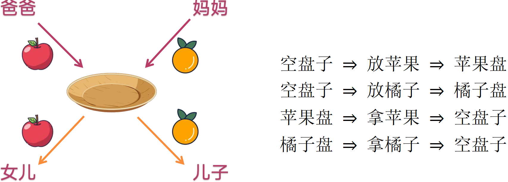

```c
seamphore plate=1, orange=0, apple=0;
father(){            mother(){            son(){            daughter(){
  while(1){            while(1){            while(1){         while(1){
    P(plate);            P(plate);            P(orange);        P(apple);
    放苹果;               放橘子;               取橘子;            取苹果;
    V(apple);            V(orange);           V(plate);         V(plate);
  }                    }                    }                 }
}                    }                    }                 }
```

注意点：

1. 每一个缓冲区都有自己的“空”和“满”资源
2. 若有多个缓冲区，对每个缓冲区要设置专门的互斥信号量
3. 当缓冲区大小为1时，可以天然实现互斥，无需设置额外的mutex互斥信号量

#### 读者写者问题

读者写者两组并发进程共享一个文件。可以多个读者同时读，但不可以多个写者一起写，或一边写一边读。因此要求：

1. 允许多个读者同时读文件
2. 同一时刻只允许一个写者写文件
3. 写者写结束之前，不允许其他读者或写者工作
4. 写者开始写之前，应让所有读者和写者退出

##### 部分互斥实现方法


- 第一个读者加锁，最后一个读者解锁，以做到读写互斥
- 所有写者都加锁，以做到写写互斥

##### 读者优先版

进程调度会导致count数据异常，故count的检查、上锁、增减要加锁保护。

```c :7-9,13-15
int count=0; // 同时读的读者数量
semaphore rw=1; // 保证读写写写互斥
semaphore mutex=1; // 保证count互斥
writer(){                    reader(){
	while(1){   	             while(1){
        P(rw);                       P(mutex); //加锁count
    	写文件;		                 if(count==0) //第一个读者进入时
        V(rw);                           P(rw); //打开锁
    }                                count++; //读者数量+1
}                                    V(mutex); //解锁count
                                     读文件;
                                     P(mutex); //加锁count
                                     count--; //读者数量-1
                                     if(count==0) //最后一个读者离开时
                                         V(rw); //释放锁
                                     V(mutex); //解锁count
                                 }
                             }
```

这种方法会造成写者饥饿，只要有读者在读，写者就不得进入。

##### 读写公平版

```c :7,11
int count=0; // 同时读的读者数量
semaphore rw=1; // 保证读写写写互斥
semaphore mutex=1; // 保证count互斥
semaphore w=1 // 用于实现读写公平
writer(){                            reader(){
	while(1){   	                     while(1){
        P(w); /*阻止新读者进入*/              P(w); //申请读权限，无人写可通过
        P(rw);                               P(mutex);
    	写文件;		                         if(count==0) P(rw); count++;
        V(rw);                               V(mutex);
        V(w); /*允许新读者进入*/              V(w); ///释放读写公平锁
    }                                        读文件;
                                             P(mutex);
}                                            count--; if(count==0) V(rw);
                                             V(mutex);
                                         }
                                     }
```

加一把读写公平锁，写者获得该锁后，后续读者只能等待该锁。已有读者全部读完后，写者可写，写者写完，后续读者可读。

#### 哲学家进餐问题

五个哲学家围坐一张圆桌，有五个碗和五只筷子，他们的思考和进餐交替进行。通常哲学家会思考，饥饿时尝试拿最近的两根筷子，只有有两根筷子才能吃饭。饭后放下筷子继续思考。


```c
semaphore chopstick[5]={1,1,1,1,1};
semaphore eating=4; //最多让四人同时拿筷 // [!code ++]
void philosopher_i(){
    while(1){
        P(eating); //请求拿筷 // [!code ++]
        P(chopstick[i]); /*取左筷子*/
        P(chopstick[i+1%5]); /*取右筷子*/
        V(eating); //释放请求  // [!code ++]
        吃饭;
        V(chopstick[i]);  /*放左筷子*/
        V(chopstick[i+1%5]); /*放右筷子*/
        思考;
    }
}
```

### 死锁

#### 死锁的概念

多个进程因竞争不可剥夺性资源，而处于<tip>相互等待</tip>状态，若无外力作用，所有进程都将无法推进。

> 死锁必须相互等待，仅造成阻塞不一定是死锁导致的。

死锁的原因之一是竞争不足量的系统资源，有如下临界值问题：

<table>
  <thead>
    <tr>
      <th align="center">临界条件</th>
      <th align="center">资源</th>
      <th>方法</th>
    </tr>
  </thead>
  <tbody>
    <tr>
      <td align="center" rowspan="2">不发生死锁</td>
      <td align="center"><emp>资源最小值</emp></td>
      <td><emp>让每个进程都差一个资源，此时资源数+1</emp></td>
    </tr>
    <tr>
      <td align="center">进程最大值</td>
      <td>让每个进程都差一个资源，此时进程数-1</td>
    </tr>
    <tr>
      <td align="center" rowspan="2">会发生死锁</td>
      <td align="center">资源最大值</td>
      <td>让每个进程都差一个资源，此时资源数</td>
    </tr>
    <tr>
      <td align="center"><emp>进程最小值</emp></td>
      <td><emp>让每个进程都差一个资源，此时进程数</emp></td>
    </tr>
  </tbody>
</table>

| 死锁的必要条件 | 含义                                            |
| ------------ | ---------------------------------------------- |
| 互斥         | 资源不可同时被多个进程占有，如果被占用，其他进程必须等待 |
| 不剥夺        | 资源只能由占有进程主动释放，其他进程不可抢夺           |
| 请求和保持    | 进程至少占有一个资源的同时，还要请求其他已被占有的资源   |
| 循环等待      | 处于请求保持状态的进程形成一个环路                   |

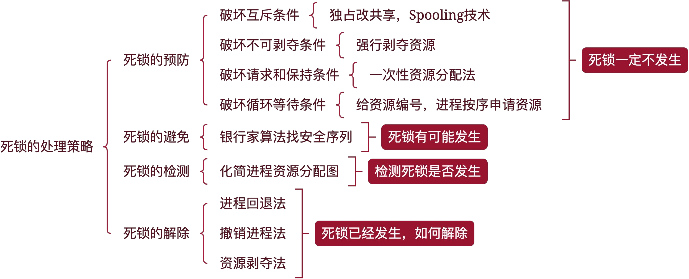

#### 死锁的预防

> 死锁的预防就是破坏死锁的必要条件。

| 破坏条件     | 内容                                                                                                                                  |
| ----------- | ------------------------------------------------------------------------------------------------------------------------------------ |
| 破坏互斥     | 方法：独占设备改成逻辑上的共享设备（SPOOLing技术）<br/>问题：大部分资源无法共享                                                                 |
| 破坏不剥夺    | 方法：强行剥夺阻塞进程的资源<br/>问题：实现复杂，开销大                                                                                      |
| 破坏请求保持  | 方法1：<tip>一次性资源分配法</tip>，进程直接获取所需全部资源，不会“有A等B”<br/>方法2：先释放已用完的资源，才能申请新资源<br/>问题：资源浪费严重、容易饥饿 |
| 破坏循环等待  | 方法：资源有序编号法，<tip>限制进程申请资源的顺序</tip>，按编号递增顺序申请，不能回头<br/>问题：不利于新增设备、资源闲置、编程复杂                      |

#### 死锁的避免（银行家算法）

寻找合理的分配顺序，确认不会死锁才予以分配。

- 若能找到某种安全序列，系统处于安全状态，此时一定不会死锁。
- 若找不到任何安全序列，系统处于<warn>不安全状态，此时不一定死锁</warn>。

> 可能因为进程提前结束、进程主动释放、进程改变需求等原因，不会发生死锁。

银行家算法找安全序列，利用手头可用资源，满足能够满足的进程，结束回收其资源，再分配其他进程。

有四种数据：最大需求资源、已经分配资源、还需要资源、可用资源。


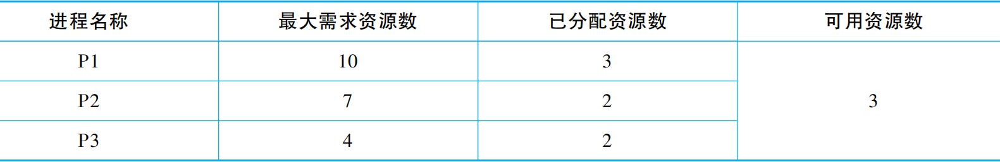

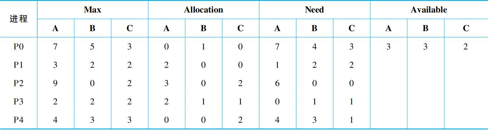

#### 死锁的检测（资源分配图）

::: details 进程资源图

- 圆图：表示进程
- 矩形框：表示一类资源，框内多个圆点表示资源个数
- 请求边：表示该进程申请一个资源（进程指向资源）
- 分配边：表示一个资源已分配给进程（资源指向进程）

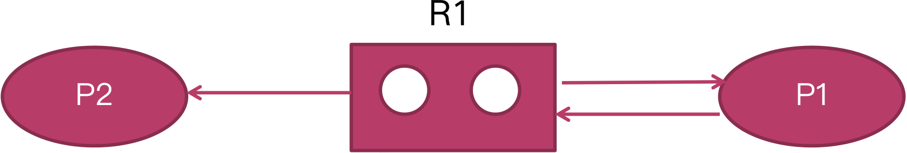

:::

进程资源图描述资源的请求和分配情况，化简进程资源图可以判断系统是否会死锁。

1. 找出可继续运行的进程，满足其资源需求，将其请求分配边全部删除，使之成为孤立节点。
2. 再处理其他节点，若最终所有边都被删除，则化简完成不会自锁。

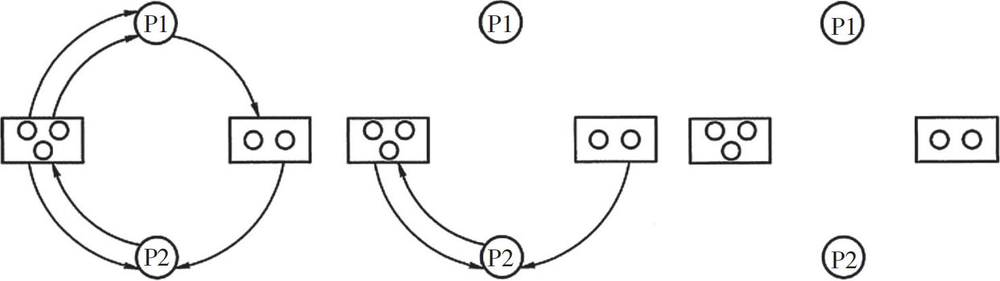

<tip>死锁定理</tip>：若系统处于死锁状态，其进程资源图不可完全简化。

#### 死锁的解除

| 死锁解除方法 | 含义                                        |
| ---------- | ------------------------------------------ |
| 资源剥夺法   | 剥夺某些进程的资源，给一个死锁进程以解除其死锁状态 |
| 撤销进程法   | 强制结束部分或全部死锁进程                     |
| 进程回退法   | 使进程回退到足以回避死锁的时刻，自动释放资源      |

### 管程

管程是一种自带互斥和同步的共享资源管理器，管程有如下特点：

1. 互斥：同时只允许一个进程进入管程
2. 同步：通过<tip>条件变量</tip>实现，不是信号量

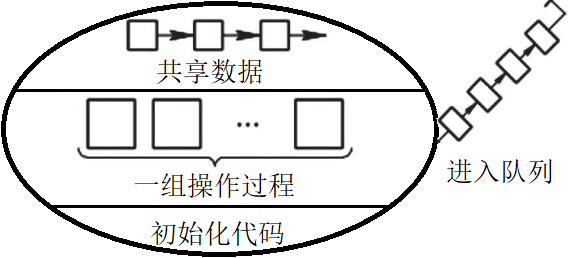

## 第三章 内存管理

<div style="display: flex; gap: 20px; align-items: center; justify-content: center;">
  
  
</div>

### 程序的链接和装入

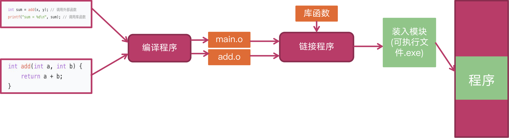

|   链接方式    | 含义                                                                                                           |
| :----------: | ------------------------------------------------------------------------------------------------------------- |
|   静态链接    | <add>程序运行前</add>，就将目标模块和库链接进装入模块。<br/>① 修改相对地址：各模块地址均从0开始，链接成整体就需要将统一偏移<br/>② 外部符号解析：将模块中的引用符号替换为对应地址 |
| 装入时动态链接 | <add>程序装入时</add>，检查到对其他模块的调用，此时将模块装入并连接。<br/>特点：便于修改和更新、便于模块共享                  |
| 运行时动态链接 | <add>程序运行中</add>，需要用到某个尚未装入的模块，此时再装入并链接。<br/>特点：加速装入过程、更加节省内存（未使用模块无需装入） |

> 链接方式的区别是链接的时机，装入方式的区别是逻辑地址转化的时机。

|         装入方式            | 含义                                                                   |
| :------------------------: | --------------------------------------------------------------------- |
|          绝对装入            | <add>程序装入内存前</add>，地址就确定为物理地址。仅适用于单道批系统。           |
| 静态重定位<br/>(可重定位装入)   | <add>程序装入内存时</add>，修改逻辑地址为物理地址。装入后程序位置固定，无法移动。|
| 动态重定位<br/>(动态运行时装入) | <add>指令执行访存时</add>，通过重定位寄存器计算物理地址，为程序基址+逻辑地址。<br/>程序位置可移动，允许运行期调整内存，便于系统紧凑内存。 |

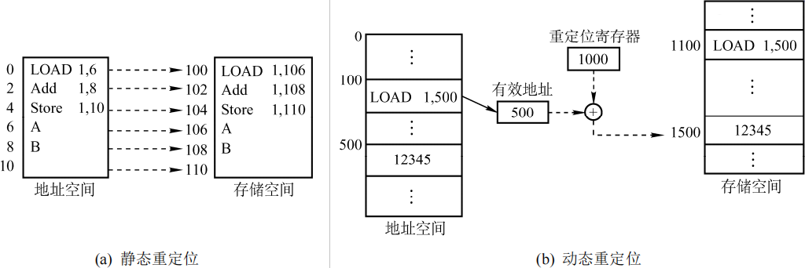

### 内存保护

为确保进程内存的独立性，需界定进程内存空间的范围。有两种越界检查的方法：

- 设置上下限寄存器，标识上限和下限地址。
- 使用重定位寄存器和界地址寄存器，标识起始地址和空间长度。

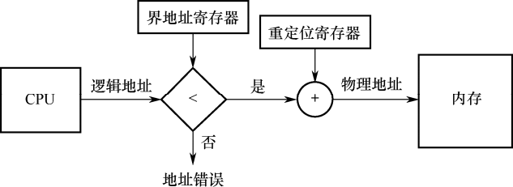

> 可见，内存保护由操作系统和硬件共同实现。

### 内存连续分配

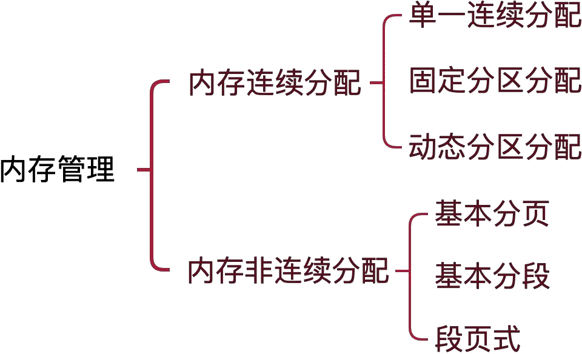

> 程序一次性全部载入内存就是连续分配，部分地载入内存就是非连续分配。

|         内存连续分配          | 内容                                                                                                 |
| :-------------------------: | --------------------------------------------------------------------------------------------------- |
|         单一连续分配          | 内存划分为系统区和用户区，内存中始终只有一道程序，该程序独占整个用户区。<br/>存在内存碎片，内存利用率极低             |
|         固定分区分配          | 划分成多个大小可不等但不可变的分区。维护分区使用表，按分区大小排序。<br/>存在大量内部碎片，可能存在大型程序无法放入分区 |
| 动态分区分配<br/>(可变分区分配) | 根据进程大小动态建立分区，维护空闲分区链，按地址递增或分区大小排序。<br/>只存在外部碎片，需要分配算法选择空闲分区<br/>紧凑技术可缓解外部碎片，系统周期性合并空闲块，移动进程须支持动态重定位。 |

<div style="display: flex; align-items: center; justify-content: center;">
  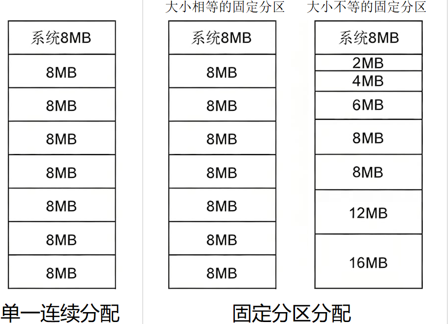
  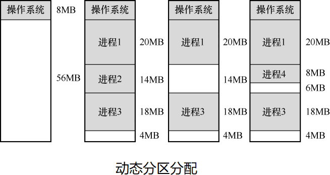
</div>

#### 动态分区分配—顺序搜索算法

| 顺序搜索算法                | 链表排序 | 方法                                | 优缺点                                            |
| :-----------------------: | ------- | ---------------------------------- | ------------------------------------------------ |
| 首次适应算法                | 地址递增 | 找第一个合适的                        | 保留高地址大分区<br/>每次从表头查找，查找开销大，性能最好 |
| 邻近适应算法<br/>(循环首次)  | 地址递增 | 从上次结束位置开始找，<br/>找第一个合适的 | 减少低地址区域的重复扫描<br/>大作业难以装入，性能次之    |
| 最佳适应算法                | 容量递增 | 能满足的最小分区优先                   | 尽量保存大分区<br/>最容易产生小外部碎片，性能差         |
| 最坏适应算法                | 容量递减 | 能满足的最大分区优先                   | 减少小碎片<br/>大分区很快瓜分，不利于大进程，性能差      |

#### 动态分区分配—内存回收

| 回收情况       | 解决方法                              |
| ------------- | ----------------------------------- |
| 前有空闲分区    | 两者合并，更新前一分区的大小             |
| 后有空闲分区    | 两者合并，更新后一分区的起始地址和大小     |
| 前后都有空闲分区 | 三者合并，更新前一分区的大小，删除后一分区 |
| 前后都无空闲分区 | 新建表项，记录起始地址和大小             |

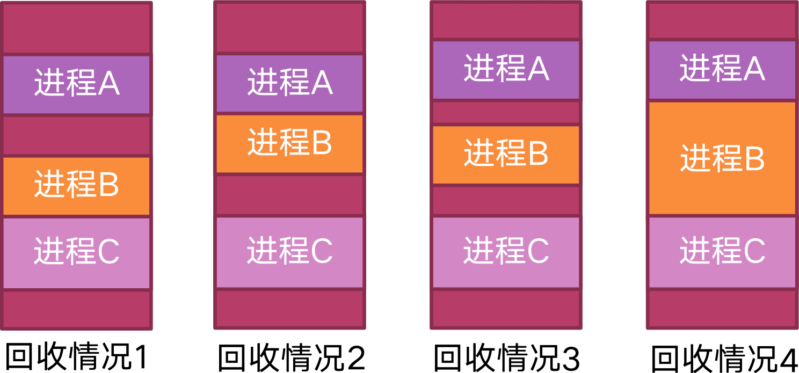

#### 动态分区分配—索引搜索算法

| 索引搜索算法 | 内容                                                                                                                |
| ---------- | ------------------------------------------------------------------------------------------------------------------ |
| 快速适应算法 | 预先将空闲内存分成多个固定大小的分区链表，分配能满足的最小分区。<br/>优点：查找效率高、不会产生外部碎片<br/>缺点：回收时难有效合并分区，算法复杂开销大    |
| 伙伴系统    | 所有内存分区的大小都是2<sup>k</sup>MB，找满足的最小分区，如果分区过大需要不断二分。<br/>释放分区时，检查与它大小相同、地址相邻的伙伴块，能合并就不断合并。 |
| 哈希算法    | 空闲分区大小为关键字，构建一张哈希表，表项是空闲分区链。                                                                                     |

<div style="display: flex; gap: 5px; align-items: center; justify-content: center;">
  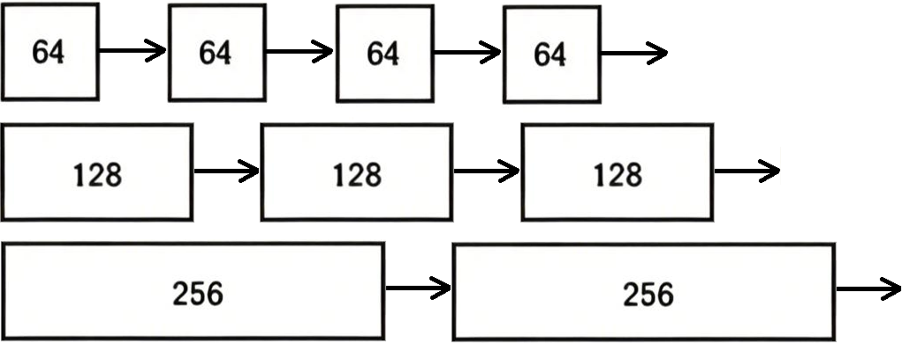
  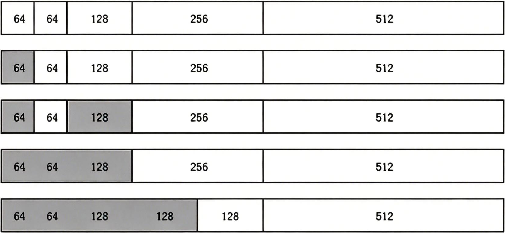
  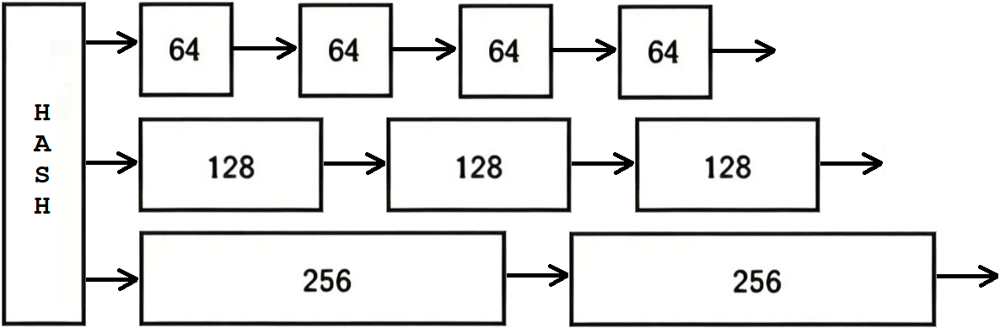
</div>

### 基本分页

内存分成若干固定分区，称页框、页帧、物理块 (4KB)。地址空间也分成若干同样大小的分区，称为页、页面。

操作系统以页为单位分配内存，因此分页只会产生内部碎片，称为页内碎片。

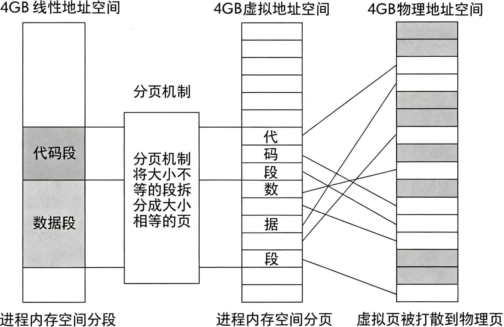


页表就是页面映射表，每个页面对应一个页表项又对应到物理页框。页表实现从页号到物理块号的映射。

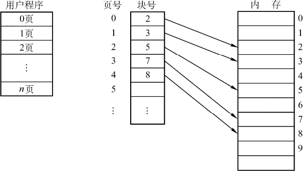

#### 地址变换机构

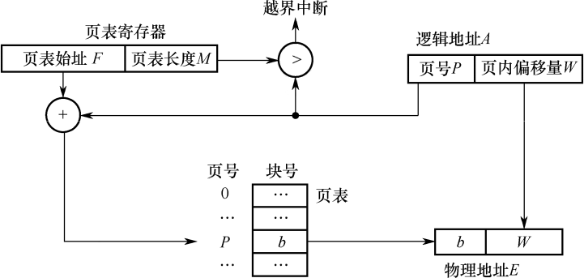

::: info 页式地址转换过程

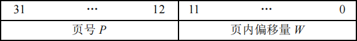

1. 提出逻辑地址A中的页号P
2. 与页表长度M判断，如果大于等于页表长度则越界
3. 页表始址F+页号，即该页面所在页表项，找到对应块号b
4. 页内地址不变，逻辑页号P改为页框号b，即为物理地址

> CPU中设置页表寄存器PTR，存放页表始址和页表长度，进程切换时，将其页表始址和长度装入页表寄存器。

:::

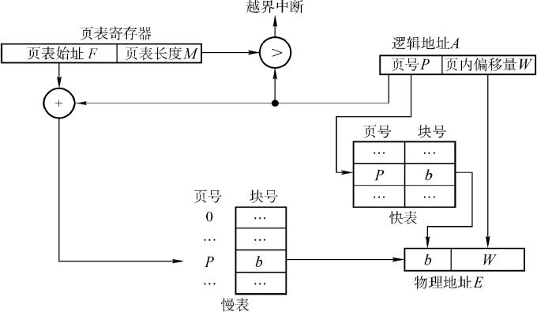

在有快表的地址变换中，拿页号先在快表中找，找到则仅需访存数据。未找到则到慢表中找，找到后需放入快表，此时需两次访存。

### 基本分段

分段系统将地址空间按逻辑结构划分段，段号和段内偏移量由编译器提供。段表负责逻辑空间与物理内存的映射，一个段对应一个段表项，段表项记录该段的内存始址和段长。

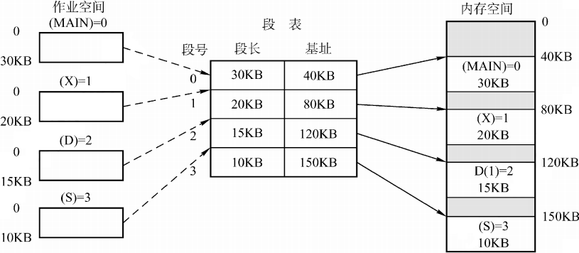

#### 地址变换机构

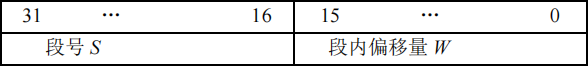

系统中设置一个段表寄存器，用于存放段表始址F和段表长度M。

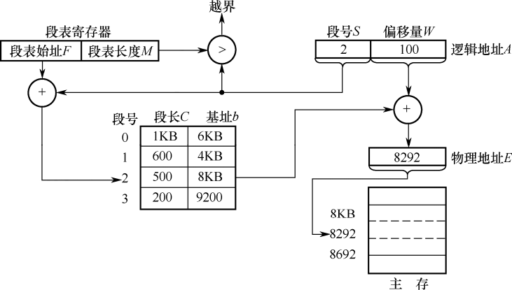

1. 取出段号S和段内偏移量W
2. 若段号S≥段表长度M，则越界
3. 找到对应段表项，段表项地址=段表始址F+段号S×段表项长度。
4. 取出段长C，若段内偏移量W≥段长C，则越界
5. 取出段始址b，计算物理地址E=b+w，并访存。

#### 分页和分段的对比

|   比较   | 分页                       | 分段                                |
| :-----: | :------------------------- | :--------------------------------- |
|  可见性  | 系统管理分页，用户不可见       | 段是信息逻辑单位，对低级语言和编译器可见 |
|   长度   | 页的大小固定，且由系统决定     | 段长不固定，取决于用户程序             |
| 地址空间  | 地址空间一维，只需提供单一地址 | 地址空间二维，需给出段号和段内地址       |
|   碎片   | 有内部碎片，无外部碎片        | 有外部碎片，无内部碎片                 |

### 基本段页式 {.ignore-header}

> 分页能提高内存利用率，而分段能反映程序的逻辑结构，并有利于段的共享和保护。段页式是这两种存储管理的结合。

段页式中，将地址空间先分段，再将段分页。对物理内存依旧分页。

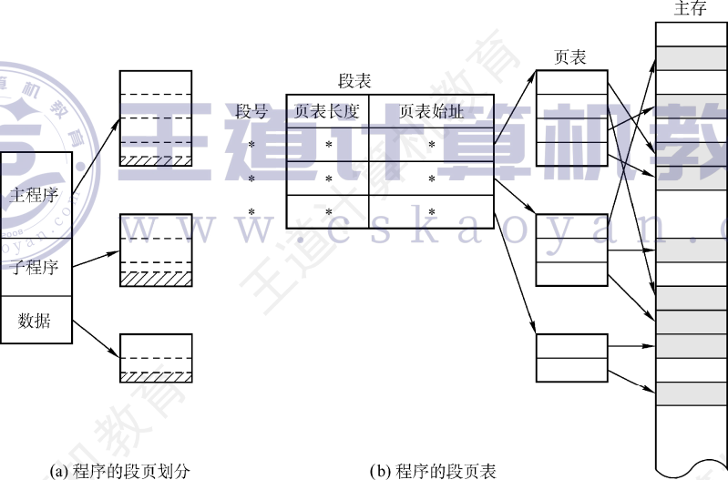

#### 地址变换机构


进程先被分段，每个段再被分页，即进程拥有一张段表，每段拥有一张页表。段表项包括段号 (隐含)、页表长度和页表始址。

此外，系统中设有一个段表寄存器，指出进程的段表始址和段表长度。

地址变换时，首先通过段表查到段的页表始址，然后通过页表找到物理块号，最后形成物理地址。

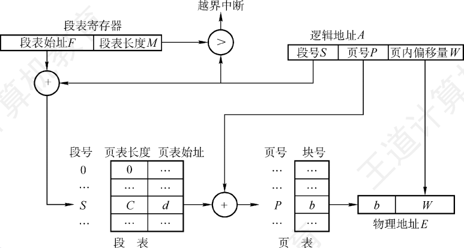

### 多级页表

> 一般页号20位，页表有2<sup>20</sup>个页表项，整个页表需要2<sup>20</sup>×4B=4MB，显然不切实际。故需多级页表，以保证一个页表最多占一页。

用一张索引表来记录页表各部分的内存位置，只将需要的页表部分调入内存。该索引表称外层页表、一级页表、页目录，部分页表叫二级页表。

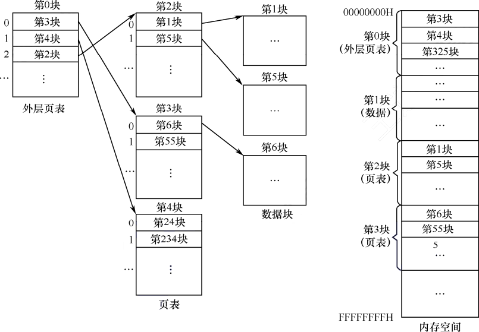

> 二级页表占一页，共分1K个二级页表，一级页表就有1K个页表项，正好占一页。故32位系统中，每个页表都是1页，页目录号和二级页号都需要10位。


#### 二级页表地址变换

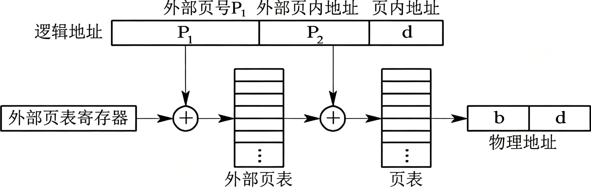

1. 系统中增设一个页目录基址寄存器，存放页目录始址。
2. 将页目录号作为一级页表的索引，找到二级页表的始址 <sup>①</sup>，
3. 用二级页号作为页表分页的索引，找到对应页表项 <sup>②</sup>，
4. 将其中物理块号和页内偏移拼接，形成物理地址。

再用物理地址访存取数据 <sup>③</sup>，共进行了三次访存。

::: info 多级页表大小计算

- 二级页表项的个数取决于页面大小，因为一个页表最多占一页。
- 一级页表项的个数取决于二级页表的个数，如果一级页表超过一页，则需要拆分出三级页表。
---
- 假设页表最多<num>2<sup>p</sup></num>项，则二级页表最多共<num>(2<sup>p</sup>)<sup>2</sup></num>项，n级页表最多共<num>(2<sup>p</sup>)<sup>n</sup></num>项。

:::

### 请求分页

#### 虚拟存储器

| 传统内存管理                                   | 特点                                                      |
| -------------------------------------------- | --------------------------------------------------------- |
| 一次性                                        | 作业必须一次性装入内存才能运行，若作业很大或内存不足则不能运行。     |
| 驻留性                                        | 直至运行结束之前作业必须全部驻留内存，即使是不再使用的部分。        |
| <thd>虚拟内存管理</thd>  | <thd>特点</thd>                     |
| 多次性                                        | 只需装入目前所需部分即可运行。运行到未调入的部分，再将其调入。      |
| 对换性                                        | 允许作业运行过程中，将暂不使用的页面换出至外存，待需要时再换进内存。 |
| 虚拟性                                        | 逻辑上扩充了内存容量，用户感受远大于实际容量。                   |

- 请求分页在基本分页基础上，为支持虚拟存储而增加了请求调页和页面置换的功能。
- 请求调页是请求系统将页面从外存调入内存，页面置换是将页面在内外存之间换入换出。

#### 页表机制


| 表项字段  | 含义                                                          |
| -------- | ------------------------------------------------------------ |
| 状态位Ρ   | 表示页面是否已调入内存。                                         |
| 访问字段A | 表示页面在一段时间内的访问次数，或最近多长时间未被访问，供置换算法参考。 |
| 修改位M   | 表示页面调入后是否被修改，决定换出时是否写回外存。                   |
| 外存地址  | 记录页面的外存地址，通常是物理块号，供调入页面时参考。                |

#### 缺页中断机构

访问缺失页面时，会触发缺页中断，系统进行缺页处理。此时进程被阻塞，完成调页后再唤醒，放回就绪队列。

- 若有空闲页框，则为进程分配一个页框，将所缺页面从外存装入该页框，并修改对应页表项。
- 若没有空闲页框，则置换出一个页面，若该页被修改，还要将其写回外存。

指令执行期间，可能产生多次缺页中断。

缺页中断属于异常中的故障，在指令执行期间进行处理，处理后返回该条指令重新执行。

#### 地址变换机构

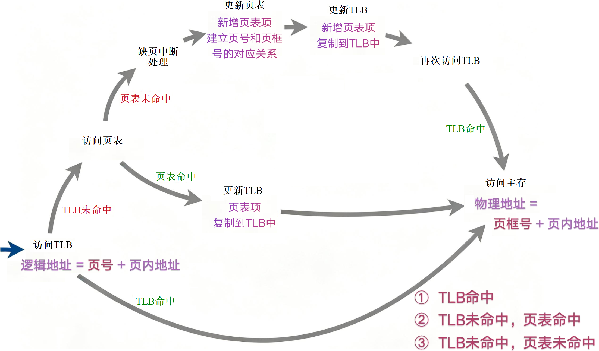

请求分页的地址变换过程如下：

1. 检索快表，若命中，得到物理块号，并修改访问位和修改位。若未命中，
2. 查找页表，若命中，得到物理块号，并修改访问位和修改位，将页表项写入快表。若未命中，
3. 缺页中断，请求系统调入页面，调入完成后，由系统更新页表和快表，并得到物理块号。

物理块号和页内地址拼接形成物理地址，即可访存。

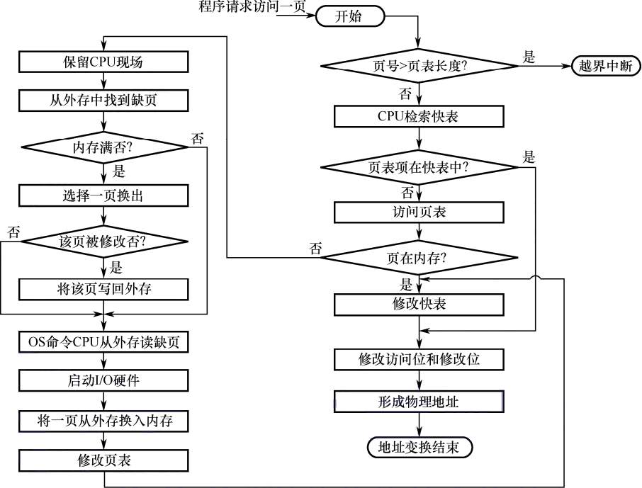

### 页框分配


| 页框分配             | 含义                                                                           |
| ------------------- | ----------------------------------------------------------------------------- |
| 固定分配<br/>局部置换  | 驻留集大小不变，缺页时只能选择驻留集页框置换。<br/>缺点：页框太少则频繁缺页，页框过多则浪费内存、降低系统并发。<br/>最小页框数：保证进程正常运行的最少页框数，取决于指令的格式、功能和寻址方式。 |
| 可变分配<br/>全局置换 | 驻留集大小可变，缺页时从系统空闲页框队列获取，或从全部页框中选择。<br/>优点：灵活扩充驻留集。<br/>缺点：每次缺页都新增页框，驻留集可能持续膨胀抢占页框，削弱系统并发。 |
| 可变分配<br/>局部置换 | 驻留集大小可变，缺页时只能驻留集内置换，但系统会根据缺页情况，动态增减页框数。<br/>优点：有效抑制进程频繁调页，兼顾系统并发能力。<br/>缺点：机制较复杂、运行开销大。 |

### 页面调入

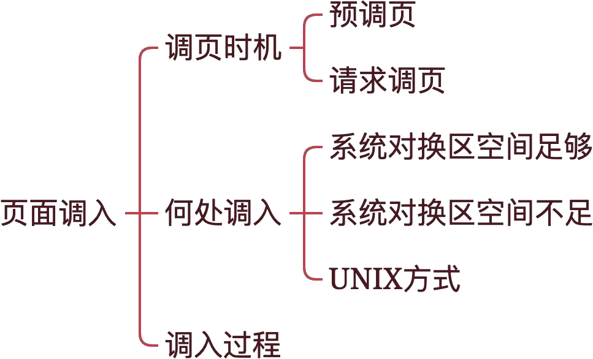

| 调页时机 | 内容                                                                 |
| ------- | ------------------------------------------------------------------- |
| 预调页   | 系统预测进程近期可能访问的页面并预先调入，但效果有限。                       |
| 请求调页 | 访问页面不在内存，触发缺页中断，系统将该页调入内存。每次仅调一页，磁盘IO开销大。 |

| 何处调页              | 内容                                                                                                          |
| -------------------- | ------------------------------------------------------------------------------------------------------------ |
| 系统对换区<br/>空间足够  | 进程运行前，将进程所有页面从文件区复制到对换区。后续只从对换区调页，速度快。                                              |
| 系统对换区<br/>空间不足 | 不会修改的页面从文件区调入，可能修改的页面从对换区调入、换出时也放到对换区。                                              |
| UNIX方式              | 新页面从文件区调入，需调出的页面放到对换区，再调入也从对换区调入。<br/>进程共享的页面，若已被调入内存，则从内存获取无须重复调入。 |

| 调入过程 | 内容                                                                                          |
| ------- | -------------------------------------------------------------------------------------------- |
| 内存未满 | 分配一个空闲页框，发起磁盘IO调入所缺页面，更新页表项，填写页框号，置真存在位。                            |
| 内存已满 | 选出一页准备换出，若已修改则将其写回对换区。发起磁盘IO调入缺页面，并更新页表项，<br/>填写页框号，置真存在位。 |

### 页面置换


> 驻留集已满时需要换出，通过页面置换算法选择页面。

| 页面置换算法               | 内容                                                                                                    |
| :----------------------: | ------------------------------------------------------------------------------------------------------- |
| 最佳置换 OPT              | 选择最长时间内不再被访问的页面，无法实现。                                                                     |
| 先进先出 FIFO             | 选择最早调入的页面，未利用局部性原理，性能差。<br/>Belady现象：FIFO算法中，可能会出现的驻留集越大，缺页率反而提高的现象。 |
| 最近最久未使用<br/>LRU     | 选择最近最长时间未使用的页面，利用局部性原理，性能好但开销大。<br/>实现方法：用页表项的访问字段，记录上次访问后累计时间，时间最大者即目标。 |
| 简单型时钟置换<br/>CLOCK   | 循环检查每页的访问位，为1则改0，为0则淘汰。若所有页均为1，全部改0后，停留<br/>在最初位置，则淘汰最初位置。              |
| 改进型时钟置换<br/>CLOCK   | 循环检查每页的访问位和修改位，分有如下情况：<br/><mono>(0,0)</mono>：最近未访问，最近未修改，最佳↓<br/><mono>(0,1)</mono>：最近未访问，最近有修改，次佳↓<br/><mono>(1,0)</mono>：最近有访问，最近未修改，次好↓<br/><mono>(1,1)</mono>：最近有访问，最近有修改，最差↓<br/> |

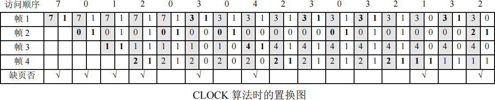

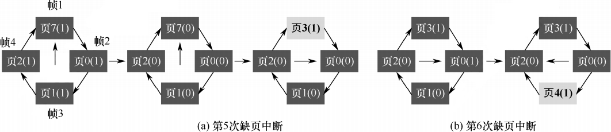

### 页框回收


内存不足时需回收页框，内核页框大多不可回收，用户进程页框基本可回收。系统定期检测内存，空闲页框数量低于阈值，就开始回收。

页框回收只能降低磁盘IO，页面置换算法负责降低缺页率。

| 页面缓冲算法 | 内容                                                             |
| ---------- | --------------------------------------------------------------- |
| 空闲页面链表 | 未修改的页面换出时，将页框尾插进空闲页面链表，后续需要可复用，省去磁盘读入。 |
| 修改页面链表 | 修改过的页面换出时，将页框尾插进修改页面链表，积攒批量写回，降低磁盘IO频率。 |

### 内存共享

#### 段和页的共享

| 共享    | 内容                                                                                                                  |
| ------- | --------------------------------------------------------------------------------------------------------------------- |
| 页的共享 | 共享页的页表项指向同个内存块，共享与非共享内容可能共处一页，故页共享比较麻烦。                                            |
| 段的共享 | 共享段的段表项指向同个内存段，段划分自由不会杂糅非共享内容。<br/>系统维护共享段表指向内存共享段，使用引用计数。共享段代码通常是可重入代码。 |

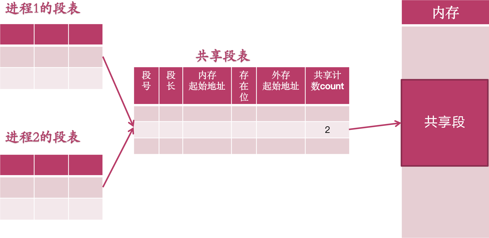

#### 内存映射文件

内存映射文件在磁盘文件与进程的虚拟地址空间之间建立直接映射。

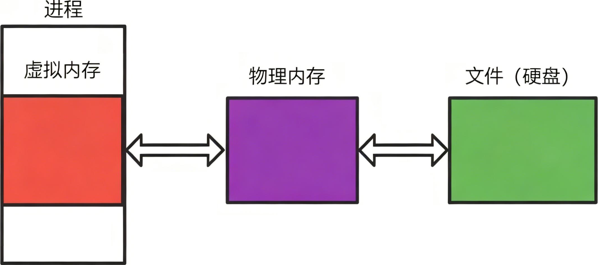

将文件映射到虚拟地址空间的某个区域，用更便利的内存操作来读写文件。

在映射进程的页面时，不会实际读入文件的内容，只在访问页面时才被每次一页地读入。关闭文件映射时，所有改动页面才被写回磁盘文件。

## 第四章 文件管理

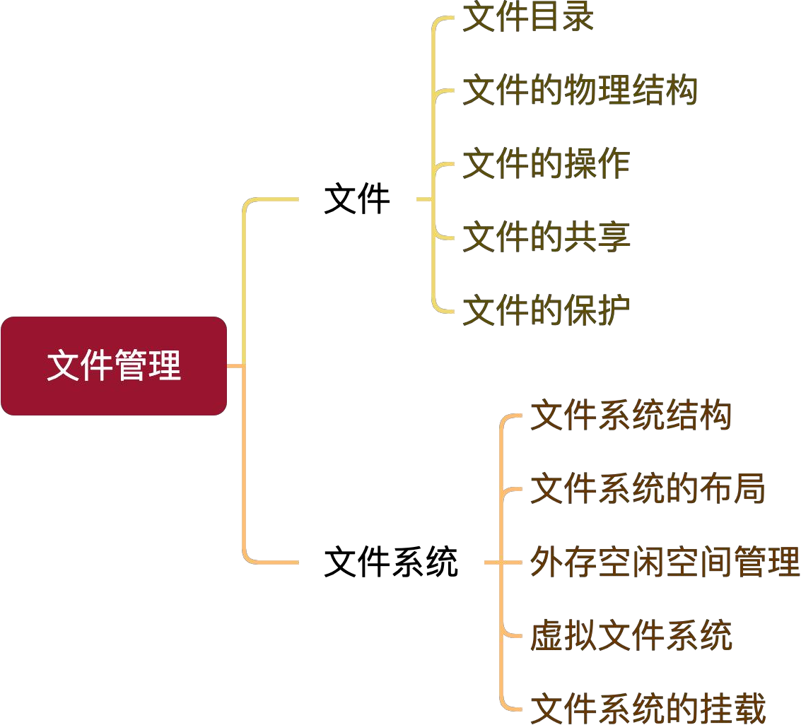

### 文件目录

#### 文件目录的概念

| 文件系统类型        | 含义                                                        |
| ----------------- | ---------------------------------------------------------- |
| 基于FCB的文件系统   | 文件控制块FCB存放文件的描述信息。文件目录项由文件控制块FCB构成。     |
| 基于inode的文件系统 | 索引节点inode存放文件的描述信息。文件目录项由文件名和索引节点号构成。 |

文件目录项的集合是文件目录，文件目录也以文件形式保存，称目录文件，就是所谓的目录。

<div style="display: flex; gap: 10px; align-items: center; justify-content: center;">

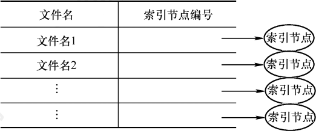
</div>

| 特性      | FCB型文件目录            | inode型文件目录       |
| -------- | ----------------------- | ------------------- |
| 元数据位置 | 文件控制块FCB            | 索引节点inode         |
| 文件名位置 | 文件控制块FCB            | 在目录项中            |
| 目录内容   | FCB列表                 | <文件名, inode号>列表 |
| 元数据    | 无固定区域，FCB分散在数据区 | 有固定区域，inode区   |

索引节点在磁盘上叫磁盘索引节点。文件被打开时，系统会将索引节点加载到内存中，叫内存索引节点。

| 索引节点    | 内容                                                              |
| ---------- | ---------------------------------------------------------------- |
| 磁盘索引节点 | 文件主标识符、文件类型、存取权限、文件体积、物理地址、文件链接计数、存取时间  |
| 内存索引节点 | 新增运行时信息，索引节点号、状态、<emp>访问计数</emp>、逻辑设备号、链接指针 |

#### 文件目录的结构

| 结构       | 内容                                                                                                                    |
| --------- | ----------------------------------------------------------------------------------------------------------------------- |
| 一级目录   | 相当于文件系统只有一个目录，所有文件在一个目录。故整个文件系统只有一个目录表。<br/><tip>文件不允许重名</tip>，查找速度慢，不适用多用户系统。 |
| 二级目录   | 相当于每个用户一个目录，用户所有文件在一个目录。主目录表分成多个用户文件目录。<br/>不同用户文件可重名。                                  |
| 树形目录   | 顶层是根目录，允许目录下存在多个目录以及目录嵌套，故每个目录拥有一个目录文件。<br/>便于文件分类，不便于文件共享。                         |
| 无环图目录 | 允许文件或目录有多个父目录，即可能多个目录下有同一个子目录或文件。<br/>便于文件共享。                                                 |

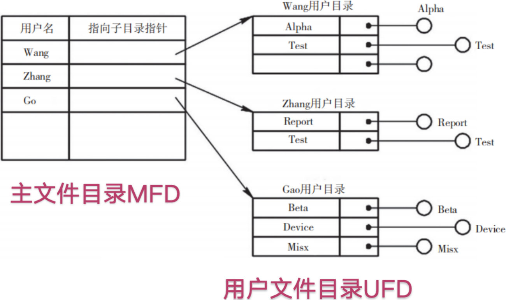

::: info 文件目录的检索

查找文件就是检索该文件所在目录的文件目录，遍历目录项匹配文件名。方法：

1. 算出文件目录所占盘块数
2. 取最好最坏情况的平均数

这就是查找文件所需的平均磁盘IO数。如果需要读入索引节点，则需要再加一次IO，以读取索引节点。

:::

### 文件的物理结构

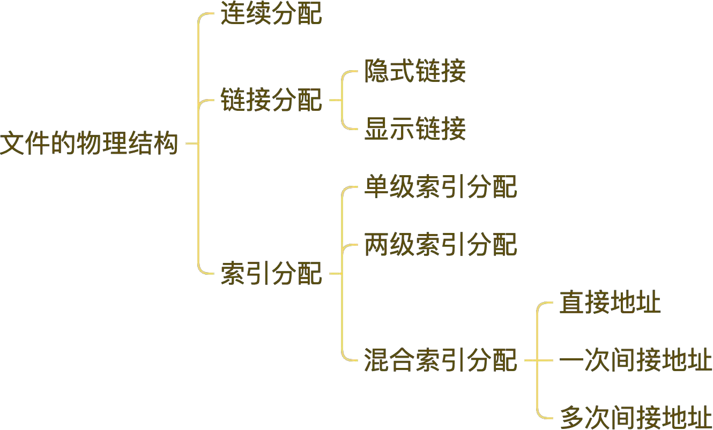

| 连续分配                                  | 内容                                                                     |
| ---------------------------------------- | ----------------------------------------------------------------------- |
| 连续分配                                  | 为文件分配相邻盘块，目录项中记录起始盘块号和盘块数。<br/>优点：支持顺序访问和直接访问，顺序访问速度快<br/>缺点：易产生外部碎片，难以支持动态增长，插删需物理移动，开销较大  |
| <span style="color:#67676c;">**链接分配**</span> | <span style="color:#67676c;">**内容**</span>                                    |
| 隐式链接分配                               | 每个盘块最后包含下一个盘块的指针，目录项中记录起始盘块号和末尾盘块号。<br/>优点：无外部碎片，提高利用率，动态分配便于增删<br/>缺点：仅支持顺序访问，可靠性较差，指针额外占用空间 |
| 显式链接分配                               | 文件分配表FAT维护链接关系，启动时载入内存，一个文件系统一张表。<br/>优点：支持顺序访问，检索操作仅访内存，减少磁盘IO<br/>缺点：FAT需常驻内存，磁盘容量越大，内存占用越大 |

<div style="display: flex; gap: 20px; align-items: center; justify-content: center;">
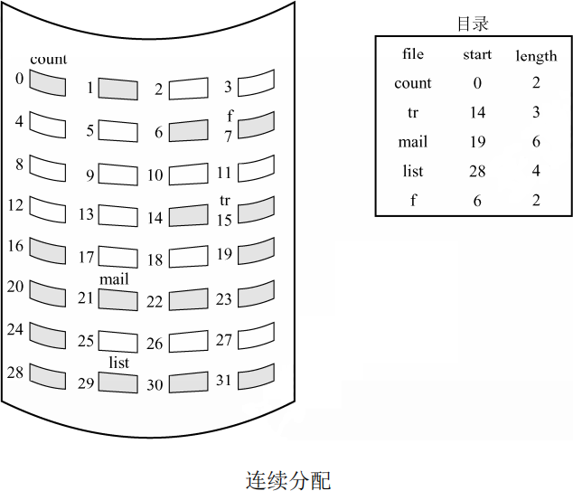
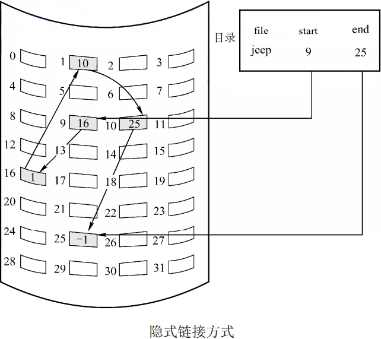
</div>
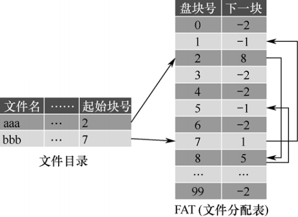

| 索引分配    | 内容                                                                                 |
| ---------- | ----------------------------------------------------------------------------------- |
| 单级索引分配 | 物理地址保存索引块号，索引块内容为文件所占的所有盘块号。<br/>优点：<br/>① 支持直接访问，要访问第<mono>i块</mono>，读取索引块中第<mono>i</mono>项<br/>② 不会产生外部碎片，因为盘块可以离散分配<br/>缺点：额外存储开销，每个文件必须配备一个索引块         |
| 多级索引分配 | 文件过大以至于一个索引块不够存放所有的数据块号，需切分成主索引和二级索引。<br/>单级索引最多有<num>N</num>个数据块，二级索引最多有<num>N<sup>2</sup></num>个数据块，三级索引最多<num>N<sup>3</sup></num>个数据块。 |
| 混合索引分配 | 将多个索引方式融为一体，可通过直接地址、多级间接地址索引到数据块。所有地址访<br/>问方式可同时使用。 |

> 物理地址/索引指针不是索引节点指针，索引节点inode也不是索引块。

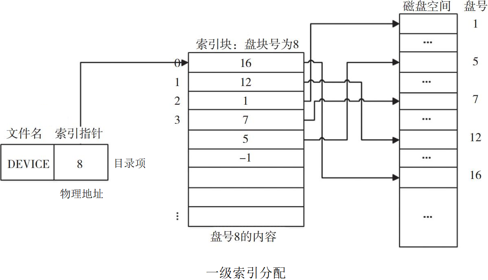

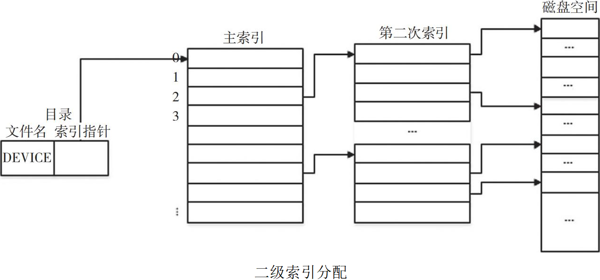

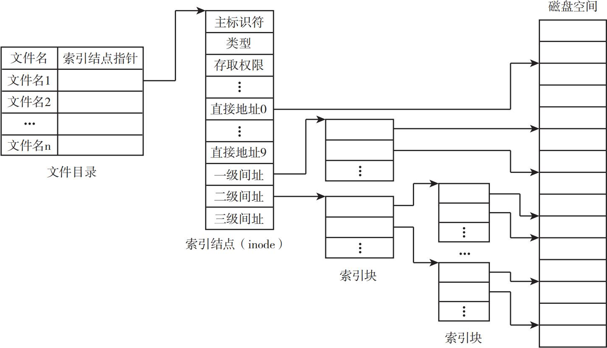

### 文件的操作

| 文件操作 | 内容                                                         |
| ------- | ------------------------------------------------------------ |
| 创建文件 | ① 合法性与权限校验：检查文件名是否合法，验证用户对目标目录的写权限。<br/>② 分配索引节点：从空闲inode池中分配一个节点，初始化元数据，并标记为已占用。<br/>③ 分配磁盘物理块：根据预估大小，分配磁盘物理块，并将块地址记录到inode中。<br/>④ 新建目录项：创建<文件名, 索引节点号>的目录项，让系统能够检索。<br/>⑤ 更新文件系统元数据：更新空闲inode表、空闲磁盘块、修改时间等，确保一致性。<br/> |
| 删除文件 | ① 定位与权限校验：解析路径找到目标文件的目录项和inode，验证用户对目录的写权限。<br/>② 检查状态与硬链接计数：计数大于1时，仅删除当前目录项，计数为1时，完整删除文件。<br/>③ 删除目录项：让文件在用户视角下消失。<br/>④ 释放inode：链接计数降为0时，将inode标记为空闲并归还。<br/>⑤ 释放磁盘块：回收inode中记录的所有数据块和索引块。<br/>⑥ 释放内存资源：清理缓冲区、打开文件表项等临时资源。<br/>⑦ 更新文件系统元数据：同步目录大小、空闲inode表、空闲块结构，保证一致性。 |
| 打开文件 | ① 根据文件存放路径找到目录文件及该文件的目录项，并检查用户是否有操作权限。<br/>② 在系统打开文件表中查找该文件，<br/>③ 若能找到，则让进程打开文件表的表项，指向系统打开文件表的表项。<br/>④ 若未找到，则在系统打开文件表新建表项，再让进程打开文件表指向。 |
| 关闭文件 | ① 进程打开文件表中删除对应项，<br/>② 系统打开文件表中对应项的打开计数器减1，<br/>③ 若为计数器为0，删除系统打开文件表的对应项，并释放相关资源。 |
| 读取文件 | ① 根据文件名查找对应目录项，<br/>② 获取索引节点号，以定位外存数据块。<br/>③ 根据读指针位置，读取数据，并更新读指针。 |
| 写入文件 | ① 通过文件名查找对应目录项，<br/>② 获取索引节点号以定位外存数据块。<br/>③ 根据写指针位置，写入数据，并更新写指针。<br/>④ 若超出分配空间，系统将动态增减盘块，并更新inode或FCB中的块指针。 |

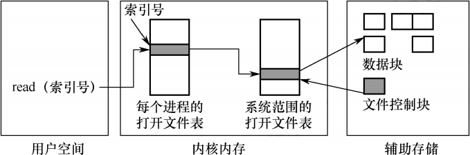

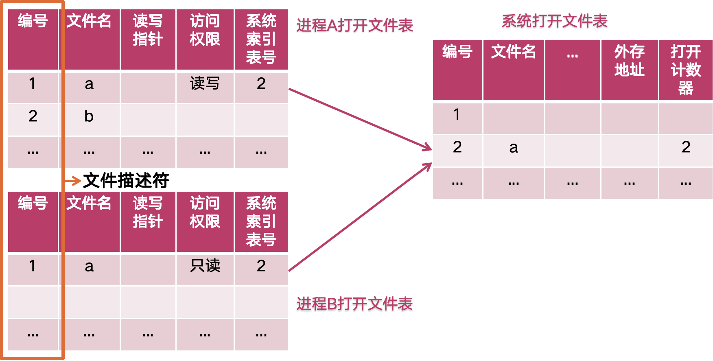

### 文件的共享


| 共享   | 内容                                                                 |
| ----- | -------------------------------------------------------------------- |
| 硬链接 | 硬链接没有创建文件，两个文件目录项指向同一个索引节点，节点中保存链接计数。       |
| 软链接 | 软链接创建了新文件，两个文件目录项分别指向两个索引节点，链接文件中保存对方的路径。 |

<div style="display: flex; gap: 10px; align-items: center; justify-content: center;">
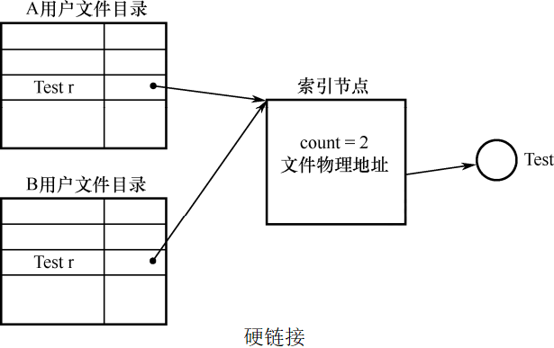
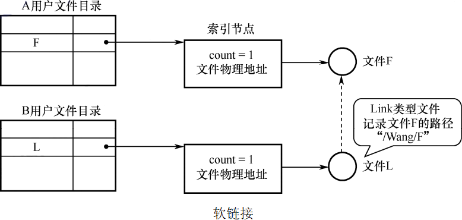
</div>

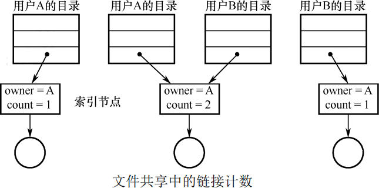

### 文件的保护


| 访问控制       | 内容                                                         |
| ------------- | ------------------------------------------------------------ |
| 访问控制列表ACL | 精简ACL通常将用户划分为三类：拥有者、所属组和其他。<br/>① 拥有者：创建文件的用户<br/>② 所属组：需要共享该文件的用户<br/>③ 其他：除拥有者和所属组以外的所有用户<br/>搭配访问类型作二维表格，以描述权限信息。 |
| 口令          | 创建文件时设定口令，系统将其存入FCB，访问时需要口令。开销小，安全性低 |
| 密码          | 对文件内容加密，系统只存储加密结果，需密钥解密得到原文。保密性强，开销大 |


### 文件系统

<div style="display: flex; gap: 20px; align-items: center; justify-content: center;">
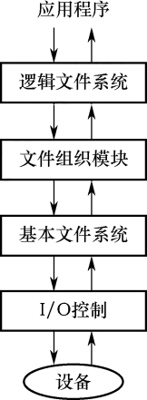
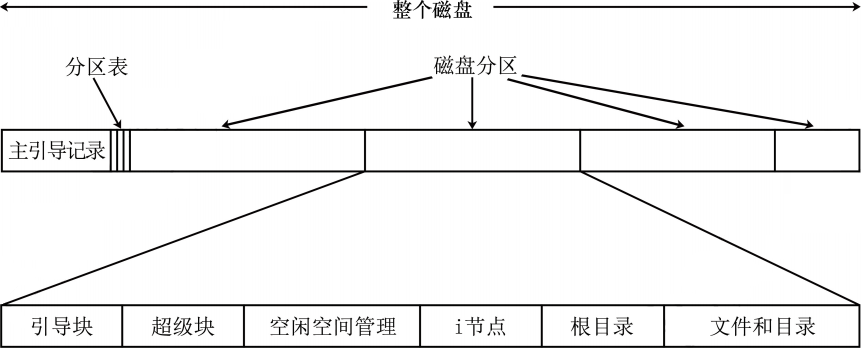
</div>


### 外存空闲空间管理

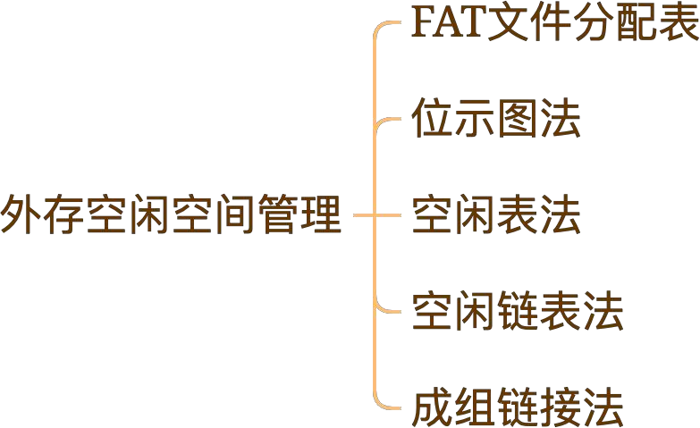

| 空闲空间管理  | 内容                                                                                                                 |
| ----------- | ------------------------------------------------------------------------------------------------------------------- |
| FAT文件分配表 | 文件分配表中用-1表示末尾块，-2表示空闲块。                                                                                |
| 位示图法      | 本质是二维位图，位值为1表示已分配，位值为0表示未分配。                                                                      |
| 空闲表法      | 搭配连续分配，表中维护第一个空闲块号和连续空闲块数。                                                                        |
| 空闲链表法    | 将所有空闲盘块串成一个链表，可以空闲盘块链或空闲盘区链                                                                       |
| 成组链接法    | 将空闲盘块分组，除最后一组外，每组的第一个盘块用作索引块，用于记录下一组中<br/>所有空闲盘块的块号及其数量，这些索引块依次链接，形成条链。 |

<div style="display: flex; gap: 10px; align-items: center; justify-content: center;">

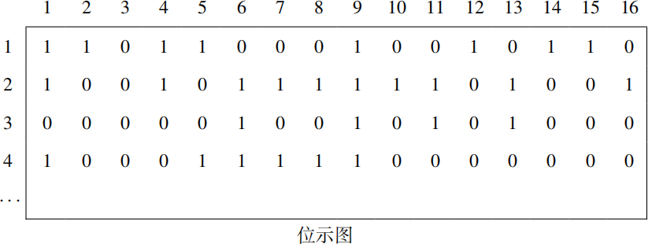
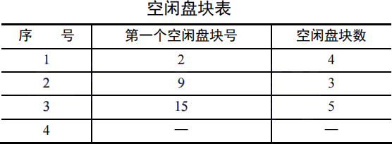
</div>
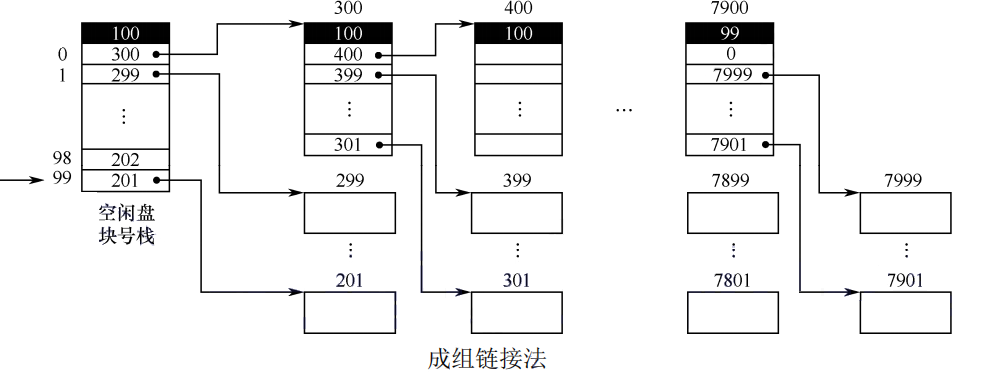

## 第五章 输入输出管理


> [IO接口](/docs/408/2-计算机组成原理#io接口) [IO控制方式](/docs/408/2-计算机组成原理#io方式) 属于计组内容。

### IO设备

| 分类        | 设备及内容                                             |
| ---------- | ---------------------------------------------- |
| 数据<br/>单位 | 块设备：以数据块为读写单位，如磁盘、硬盘。传输速率高、数据可寻址，允许读写任意位置。<br/>字符设备：以字符为读写单位，如键盘、打印机。传输速率低、不可寻址，通常采用中断方式。 |
| 传输<br/>速率 | 低速设备：如键盘、鼠标。中速设备：如激光打印机。高速设备：如磁盘。 |
| 使用<br/>特性 | 人机交互设备：如键盘、显示器。存储设备：如磁盘、光盘。网络通信设备：如网卡。 |
| 共享<br/>属性 | 独占设备：一旦分配给某进程，就由该进程独占直至释放。典型设备多为低速设备，如打印机。<br/>共享设备：允许多进程逻辑上并发。如磁盘，将多个大IO请求拆分成多个块请求，再交替执行。<br/>虚拟设备：独占设备虚拟为多个逻辑设备，开辟多个缓冲区，存储多个请求，逻辑上支持并发。 |

### IO软件

用户层的IO库和内核层的IO子系统，统称IO软件，以服务用户程序。

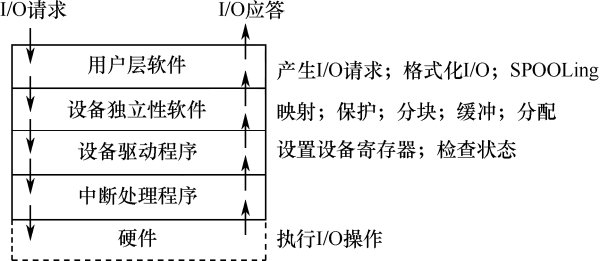

| IO软件层次结构 | 内容                                                                                                |
| :----------: | -------------------------------------------------------------------------------------------------- |
|  用户层IO软件  | 用户直接调用用户层IO库操作硬件设备，用户层IO软件必须通过系统调用获取服务。                                     |
| 设备独立性软件 | 引入逻辑设备和物理设备，要求程序使用逻辑设备名，系统再映射成物理设备名。<br/>① 翻译系统调用、提供驱动接口。<br/>② 设备保护：检查进程是否拥有访问权限。<br/>③ 设备命名与映射：将逻辑设备名映射成物理设备名。<br/>③ 缓冲管理：缓解CPU与外设的速度矛盾。<br/>④ 错误处理：拦截驱动返回的复杂错误码，翻译成用户可理解的报错。<br/>⑤ 设备的分配与回收。 |
|  设备驱动程序  | 实现对设备的操作指令，与硬件操作直接相关。设备驱动与硬件型号和系统有关。<br/>① 将抽象要求具体化：将逻辑地址转换为物理参数。<br/>② 校验请求的合法性：检查是否支持读写。<br/>③ 检查设备状态：查看设备当前是否正常。<br/>④ 写入参数到寄存器：驱动程序向控制器的相应寄存器写入命令、数据地址长度等。<br/>⑤ 启动设备：驱动程序向命令寄存器发送启动信号，设备开始工作。 |
|  中断处理程序  | IO完成后，根据操作的完成情况，进行IO操作的结束处理。 |

::: info 设备独立性软件和设备驱动程序的区别

- 设备独立性软件提供与具体硬件无关的通用功能，不涉及具体硬件、只做所有设备统一的管理工作。
- 设备驱动程序负责内核与特定硬件之间的控制和通信，直接涉及硬件具体细节。

:::

### 用户层IO软件

#### SPOOLing技术

真脱机技术结构图如下。

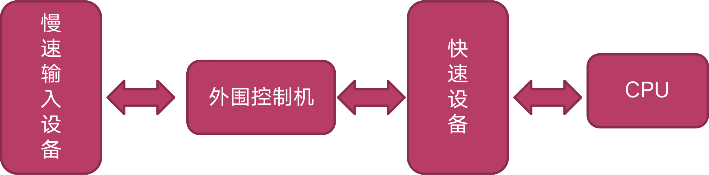

假脱机技术实现外围控制机的功能，包括输入输出井、井管理程序、输入输出缓冲区、输入输出进程。

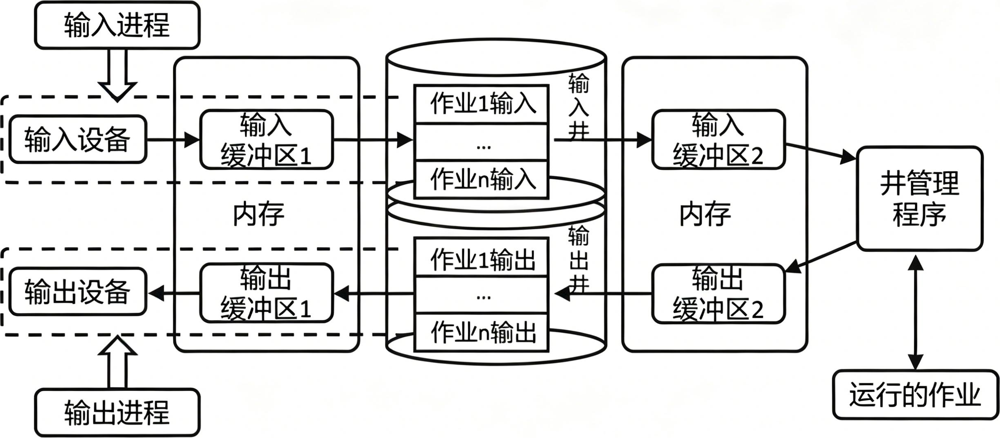

| 结构       | 作用                                         |
| --------- | -------------------------------------------- |
| 输入井     | 模拟脱机输入的快速设备，用于暂存IO设备的输入数据。   |
| 输出井     | 模拟脱机输出的快速设备，用于暂存用户程序的输出数据。 |
| 井管理程序 | 控制作业和磁盘井之间的数据交换。                   |
| 缓冲区12   | 暂存由两方的交互数据。                          |
| 输入进程   | 模拟脱机输入的外围控制机，将输入数据放入输入井。     |
| 输出进程   | 模拟脱机输出的外围控制机，将输出数据交给输出设备。   |

打印机是独占设备，通过SPOOLing技术可实现共享打印机。

| 输出过程      | 内容                                                          |
| ------------ | ------------------------------------------------------------ |
| 申请空闲磁盘区 | 在输出井中申请一个空闲磁盘块区，并将要打印的数据送入其中。             |
| 挂入打印请求   | 为进程申请一张用户请求打印表，填入打印要求，再将该表挂到请求打印队列上。 |
| 取出首个请求   | 从队首取出一张请求打印表，将打印数据从输出井送到缓冲区，由打印机打印。   |
| 检查请求队列   | 打印完后，检查是否还有请求表。若有重复取出打印，直至请求打印队列为空。   |

SPOOLing技术的特点：

- 缓和了CPU与低速设备的速度矛盾。
- 将独占设备改造为共享设备。
- 实现了虚拟设备功能，每个进程都认为自己独占设备。
- 实现空间换时间，开辟磁盘空间作为输入输出井，牺牲存储空间，显著节省时间。

#### 应用程序IO接口

| 接口类型     | 数据类型        | 用户视角                                  |
| ---------- | -------------- | ---------------------------------------- |
| 字符设备接口 | 无边界字节流     | 把设备看作一个可以连续读写的字符序列           |
| 块设备接口   | 固定大小块数组   | 把设备看作一个由相同大小块组成的随机访问存储介质 |
| 网络设备接口 | 端点间数据包交换  | 把设备看作一个可以发送和接收独立数据包的通信端点 |

| IO方式   | 含义                                                   |
| ------- | ------------------------------------------------------ |
| 阻塞IO   | 进程发起IO请求时，若数据未就绪，则该进程阻塞等待。            |
| 非阻塞IO | 进程发起IO请求时，若数据未就绪，调用立即返回，可在适当时机重试。 |

### 设备独立性软件

#### 缓冲管理

| 缓冲技术 | 内容和特点                                          |
| :-----: | ------------------------------------------------- |
|  单缓冲  | 输入和输出无法并行。                                 |
|  双缓冲  | 输入和输出能够并行。                                 |
|  多缓冲  | 循环缓冲，提升缓冲区数量可缓和通信双方速度矛盾。         |
|  缓冲池  | 缓冲池类似管程，提供数据结构和操作机制，可供多个进程使用。 |

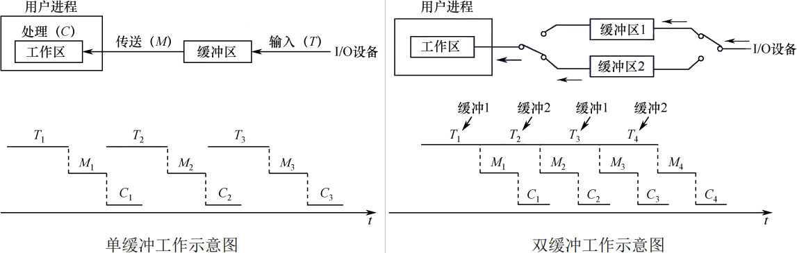

::: info 单双缓冲的读入并分析时长计算

- 单缓冲的输入和分析是可重叠的，处理每块数据的平均时间为 Max(C,T)+M。
- 双缓冲的输入和传送及分析重叠，处理每块数据的平均时间为 Max(C+M,T)。

> 记忆：单缓冲的T/C重叠，故时间上取T和C的最大值。双缓冲的T和C+M重叠，故T和C+M取最大值。

:::

#### 设备分配和回收

| 设备分配顺序        | 查表步骤                | 作用                  | 数量     |
| ----------------- | ---------------------- | -------------------- | ------- |
| ① 逻辑设备表LUT    | 用逻辑设备名查物理设备名   | 记录进程的设备分配情况   | 进程唯一 |
| ② 系统设备表SDT    | 用物理设备名找设备控制表   | 记录系统的所有物理设备   | 全局唯一 |
| ③ 设备控制表DCT    | 用设备控制表找控制器设备表 | 记录设备的各个属性       | 设备唯一 |
| ④ 控制器控制表CODT | 用控制器设备表找通道控制表  | 记录设备控制器的使用状态 | 设备唯一 |
| ⑤ 通道控制表CHDT   |                        | 记录通道的使用状态      | 通道唯一 |

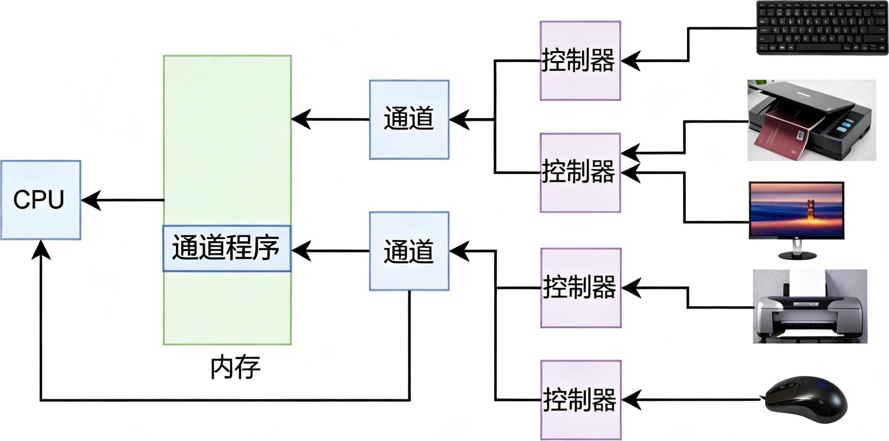

| LUT设置方式 | 内容                                                                                      |
| ---------- | ---------------------------------------------------------------------------------------- |
| 系统唯一LUT | 所有进程的设备分配情况都记录在一张LUT中。要求所有用户不能使用相同逻辑设备<br/>名，主要适用于单用户系统。 |
| 用户唯一LUT | 每个用户拥有用户LUT，同时系统拥有系统LUT。不同用户可使用相同逻辑设备名。                            |

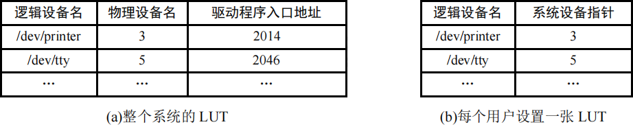

### 磁盘

> [磁盘基础知识](/docs/408/2-计算机组成原理#机械硬盘-hdd) 属于计组内容。

#### 磁盘初始化

| 初始化步骤      | 内容                                                                                                           |
| ------------- | -------------------------------------------------------------------------------------------------------------- |
| ① 物理格式化   | 低级格式化，创建磁盘的物理结构，如磁道和扇区，并做低级错误检测和校正。<br/>为后续逻辑格式化做准备。物理格式化通常由磁盘制造商完成。 |
| ② 分区        | 划分若干逻辑分区，如C盘/D盘。分区位置大小记录于主引导记录MBR的分区表中。                                                  |
| ③ 逻辑格式化   | 物理格式化后，建立文件系统，创建元数据结构，如文件分配表FAT、目录结构等。                                                  |
| ④ 安装操作系统 | 选某个分区作为启动盘，在该分区安装操作系统。                                                                           |

::: info 物理格式化和逻辑格式化的关系

逻辑格式化依赖物理格式化。物理格式化创建磁盘的物理结构，逻辑格式化在此基础上构建文件系统。

:::

<div style="display: flex; gap: 20px; align-items: center; justify-content: center;">
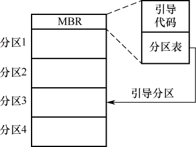

</div>

#### 磁盘调度算法

| 调度算法                      | 内容                                                                                          |
| ---------------------------- | -------------------------------------------------------------------------------------------- |
| 先来先服务FCFS                 | 根据进程请求的先后顺序进行调度，具有公平性。<br/>若大部分请求都访问邻近扇区，则性能较好。<br/>若大量进程竞争，使磁头频繁长距离移动，则效率低下。 |
| 最短寻道时间优先SSTF            | 每次选择离当前磁头最近的磁道，使每次的寻道时间最短。<br/>这种算法会产生“饥饿”现象，远距离磁道长期得不到访问。 |
| 扫描算法SCAN<br/>电梯调度       | 每次选择最近磁道，但要求磁头移动到最外侧时才能向内移动。<br/>移动规律类似电梯，也称电梯调度。<br/>SCAN算法对最近扫描过的区域不公平，因此局部性不如FCFS和SSTF。 |
| 循环扫描C-SCAN<br/>速降电梯     | 每次选择最近磁道，但要求磁头只能单向移动，到末端直接移动至起始。<br/>移动规律类似速降电梯，也称速降电梯调度。 |
| 扫描算法LOOK<br/>循环扫描C-LOOK | 边界请求结束时立即改变方向。<br/>408中默认SCAN/C-SCAN为LOOK/C-LOOK。                               |

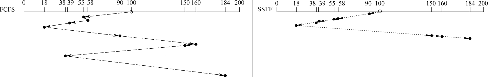

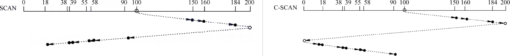

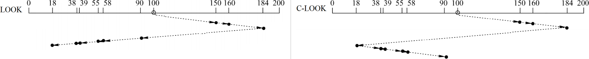

| 算法              | 缺点                          |
| ---------------- | ----------------------------- |
| FCFS算法          | 平均寻道距离大                  |
| SSTF算法          | 饥饿现象，磁臂粘着              |
| SCAN/LOOK算法     | 不利于磁头一端的访问请求，磁臂粘着 |
| C-SCAN/C-LOOK算法 | 磁臂粘着                       |

#### 提升效率的方式

| 提升效率方式 | 内容                                                                                        |
| ---------- | ------------------------------------------------------------------------------------------ |
| 减少寻道时间 | 调度算法                                                                                    |
| 减少延迟时间 | 扇区错位编号，同一盘面的扇区、跨盘面的连续扇区都要错位。<br/>连续数据跨扇区存储，抵消读取扇区后的处理时间。 |
| 提高访问速度 | ① 改进目录结构和检索方法，以减少查找时间（索引节点）<br />② 选用更优的文件存储结构，以提高访问速度（显示链接）<br />③ 提高磁盘读写速度：<br />&nbsp;&nbsp;&nbsp;&nbsp;<mono>1)</mono> 磁盘高速缓存（内存缓冲）+ 提前读/延迟写（批量连读/批量写回）<br />&nbsp;&nbsp;&nbsp;&nbsp;<mono>2)</mono> 虚拟盘（将部分内存模拟成磁盘）<br />&nbsp;&nbsp;&nbsp;&nbsp;<mono>3)</mono> 磁盘阵列（RAID0条带化） |

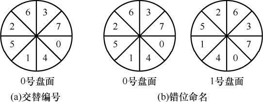

### 固态硬盘

[固态硬盘](/docs/408/2-计算机组成原理#机械硬盘-hdd) 属于计组内容。
