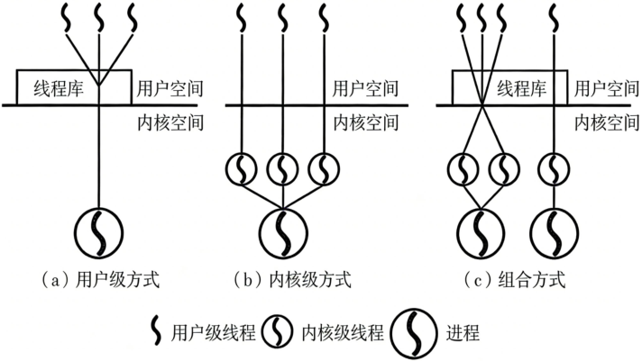
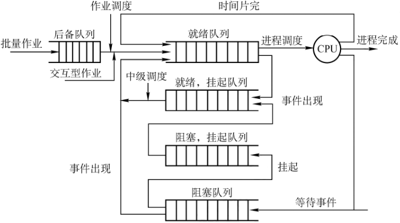
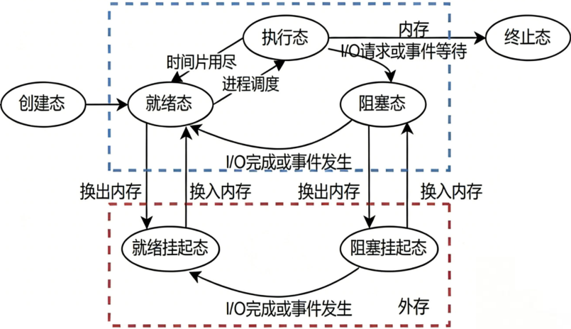
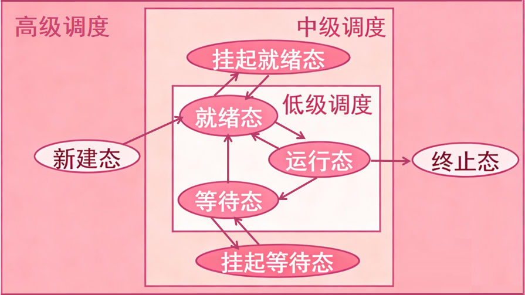
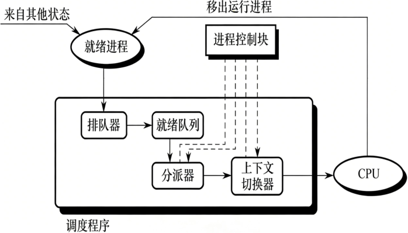
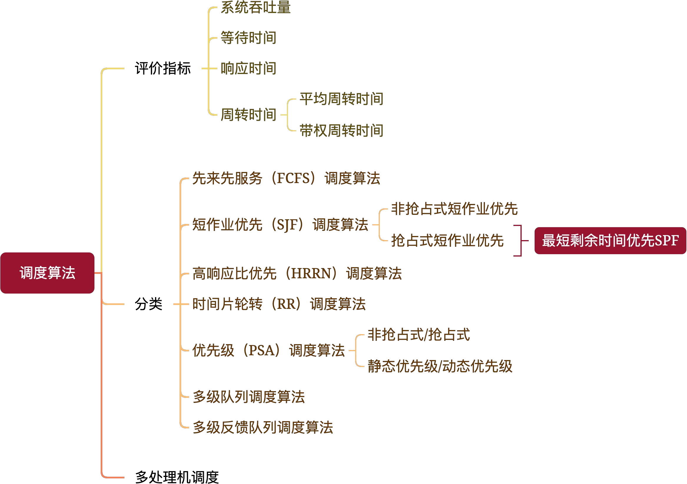
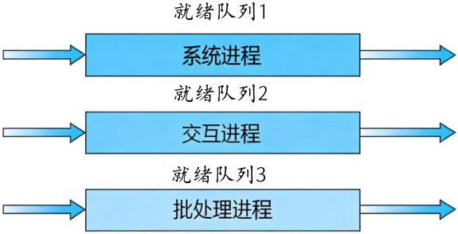
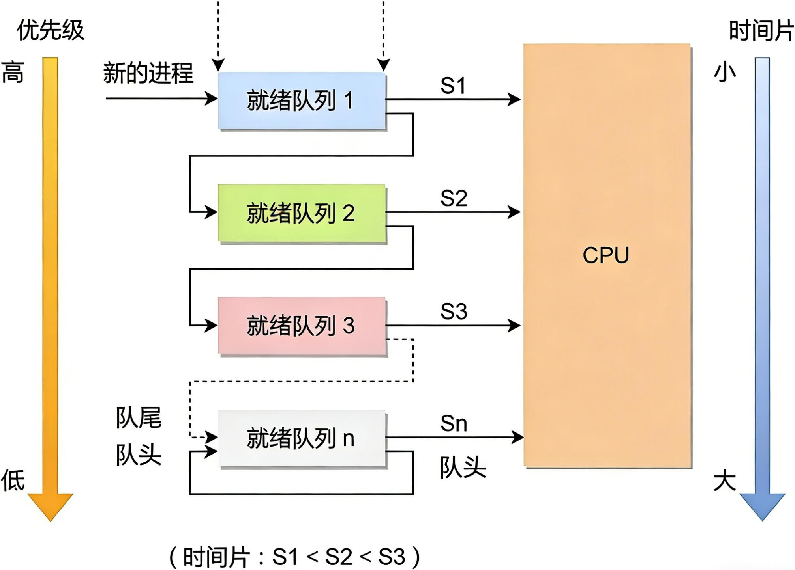

# 操作系统

## 第一章 操作系统基础

### 操作系统的功能

- 命令接口：用户通过命令控制计算机。
  - 联机/交互式命令接口 (cmd输入)
  - 脱机/批处理命令接口 (bat文件)
- 程序接口/系统调用/广义指令：用户通过应用程序间接控制操作系统。

### 操作系统的分类

- 批处理系统 ★：用户提交一批作业后操作系统自动运行，<mark>不具交互性</mark>。
  - 单道批：一次只允许一个程序运行。CPU外设利用率低、系统开销小。
  - 多道批：允许多个程序驻留内存并发执行。CPU外设利用率高、系统开销大、吞吐率大。

- 分时操作系统：以时间片为单位，多用户交互式轮流使用计算机，<mark>交互性强</mark>。
- 实时操作系统：强调系统响应时间短，硬实时要求严格、软实时允许误差。

### CPU运行模式

访管/陷入/自陷/Trap指令：触发在用户态，是用户态进程主动发起态转换的唯一合法指令，状态转换由硬件完成。

### 中断和异常处理

> 中断也称外中断，和当前执行的指令无关，由外部发起的中断。
>
> 异常也称内中断，和当前执行的指令有关，由指令引起的中断。

> 故障是发生意外可以修复，自陷是主动发起，终止是程序崩溃。

### 系统调用

### 系统结构分层

- 宏内核：内核大、性能高、扩展性差、不安全不稳定
- 微内核：内核小、性能差、扩展性好、安全稳定

### 虚拟机

虚拟机监控器/管理程序（VMM）负责管理虚拟机，协调虚拟机与物理硬件之间的资源分配。

| VMM              | 第一类 裸金属型              | 第二类 宿主型                   |
| ---------------- | ---------------------------- | ------------------------------- |
| 运行             | 直接运行在硬件之上           | 运行在宿主机之上                |
| 资源分配方式     | 直接在物理硬盘上自行分配空间 | 使用虚拟硬盘，只是宿主机的文件  |
| 性能             | 性能好                       | 性能差                          |
| 虚拟机的可迁移性 | 可迁移性差                   | 可迁移性好                      |
| 特权级别         | 第一类VMM > 操作系统         | 宿主机OS > 第二类VMM > 客户机OS |

## 第二章 进程线程

### 进程的基本概念

| 进程的基本概念                                  | 内容                                                         |
| ----------------------------------------------- | ------------------------------------------------------------ |
| 程序                                            | 指令和数据的集合                                             |
| 进程                                            | 动态的运行着的程序，拥有程序段+数据段+PCB等内核数据结构      |
| 进程控制块PCB                                   | 和进程一一对应，用来管理进程，始终保存在内核空间             |
| 父子进程                                        | 一对多关系，子进程继承了父进程的一些属性和资源，可以执行不同的代码。 父子进程是两个独立的进程，父进程终止不必然导致子进程终止 |
| 闲逛进程                                        | 特殊系统进程，负责无任务时占用CPU，保持系统稳定性。 优先级最低，无实际业务，不可被终止 |
| 进程和作业                                      | 作业是用户提交给系统的任务，作业通常包括几个进程             |
| **线程的基本概念** | **内容**                        |
| 包含关系                                        | 线程是进程内部的执行流，一个进程可以拥有多个线程             |
| 调度单位                                        | 进程是资源分配的基本单位，线程是CPU调度的基本单位            |
| 并发执行                                        | 线程和线程之间可以并发执行，无关乎所属进程                   |
| 资源共享                                        | 线程共享进程的大部分资源，除了独立栈结构、上下文数据（寄存器） |
| 轻型实体                                        | 线程切换的开销远小于进程切换的开销                           |
| 通信方式                                        | 线程使用进程的共享内存空间进行通信                           |

### 进程的状态切换

> 口诀：三状态四条线，两条线不可建

| 状态            | 解释                                                         |
| --------------- | ------------------------------------------------------------ |
| 创建态          | 进程已有创建计划，但未调入内存未分配资源，创建状态还没有完全完成 |
| **就绪态**      | 进程已获得除CPU外的所有资源，等待CPU时间片轮转               |
| **执行态**      | 进程已获得CPU时间片，正在被执行指令                          |
| **阻塞/等待态** | 进程由于期待的事件未发生，如请求系统资源、等待操作完成，数据尚未到达 |
| 挂起态          | 由于内存不足，进程被调到外存中等待称挂起，阻塞态是在内存中等待。 |
| 终止态          | 进程正常结束或其他原因退出运行，随后进行资源释放和回收       |

- **阻塞态不可直接变成执行态**：需变成就绪态等待调度。
- **就绪态不可直接变成阻塞态**：只有执行中的进程才会变成阻塞态。

| 状态转换        | 可能原因            |
| --------------- | ------------------- |
| 就绪态 → 运行态 | 进程调度            |
| 运行态 → 就绪态 | 时间片结束 / 被抢占 |
| 运行态 → 阻塞态 | 等待资源申请        |
| 阻塞态 → 就绪态 | 资源申请成功        |

### 用户级线程的实现

- 内核级线程：由**操作系统内核**创建、调度和管理的线程。
- 用户级线程：由**应用进程**创建、调度和管理的线程。**内核不了解用户级线程的存在**。

| 对比     | 用户级线程 | 内核级线程 |
| -------- | ---------- | ---------- |
| 创建线程 | 用户态     | 内核态     |
| 线程调度 | 用户态     | 内核态     |
| 切换开销 | 低         | 高         |

|         用户级线程的三种模型          | 优缺点                                                       |
| :-----------------------------------: | ------------------------------------------------------------ |
|              多对一模型               | 优：线程切换只在用户空间完成，无需切换到内核态，开销小效率高。 劣：一个用户级线程被阻塞后，整个进程都被阻塞，并发度不高。 |
|              一对一模型               | 优：一个用户级线程被阻塞后，别的进程仍能继续执行，并发能力强。 劣：线程切换需操作系统内核参与，需切换到内核态，开销大效率低。 |
| 多对多模型 (用户线程数≥内核线程数) | 优：避免了多对一模型中线程阻塞会影响其他线程，并发能力强。 劣：避免了一对一模型中使用太多内核级线程，降低了切换开销。 |

操作系统只能“看见”内核级线程，因此只有内核级线程才是处理机的分配单位。故进程内的多个用户级线程不可能在多核处理器上并行。

### 进程的通信方式

| 进程通信 | 实现方式                                                     |
| :------: | ------------------------------------------------------------ |
| 共享内存 | 申请一块可以直接访问的共享内存空间。无任何同步互斥机制。     |
| 管道通信 | 本质是特殊的内存文件，不在磁盘中，存在于内核缓冲区。单向的、先进先出的。 分为匿名管道和命名管道。**写满阻塞写进程、读完阻塞读进程**。 |
| 消息传递 | 直接通信：发送方直接发送给接收方，挂在接收方的消息缓冲队列上。 间接通信：发送方发送到某个中间实体（信箱），接收方从中取消息。 |
|   信号   | 发送方可为内核或进程，接收方收到信号后，执行信号的默认或自定义处理程序。 信号的处理时机：进程从内核态进入用户态时，会检查是否存在待处理信号。 |

### 三级调度

| 三级调度            | 具体内容                                                     |
| ------------------- | ------------------------------------------------------------ |
| 高级调度 / 作业调度 | 从外存的后背队列中选择作业，调入内存创建进程，以进入就绪队列 |
| 中级调度 / 内存调度 | 将内存中的进程调到外存，设为就绪挂起/阻塞挂起状态，以提高内存利用率 |
| 低级调度 / 进程调度 | 从内存的就绪队列中选择进程，分配CPU真正执行                  |

### 进程调度的概念

#### 上下文内容

用户进程若要进行调度，必须通过中断使CPU进入内核态，给系统提供调度的时机和权限。进程调度时，切换的上下文具体有：

1. 用户级上下文：用户的程序段、数据段、堆栈等用户区地址空间
2. 程序级上下文：**PCB**等内核数据结构
3. 寄存器上下文：**通用寄存器、程序计数器PC、程序状态寄存器PSW、页表基址寄存器**等

进程调度时，会发生两次上下文切换：

1. 将当前进程上下文保存进PCB，再装入分派程序的上下文；
2. 移出分派程序的上下文，再装入新程序的上下文。

#### 调度的方式

- 抢占/剥夺调度方式：优先级更高的进程进入就绪队列时，调度器会暂停当前进程转而执行该进程。适用于**分时和实时系统**。
- 非抢占/剥夺调度方式：即使有优先级更高的进程进入就绪队列，也会等待当前进程执行完毕。适用于**早期批处理系统**。

#### 调度的时机

- 一定发生调度：只要有进程下CPU（有执行态进程切换到其他状态），调度就会发生。
- 可能发生调度：就绪队列进了一个新进程（可能优先级更高）。

#### 不允许调度的时机

- 原子操作 / 执行原语
- 内核态临界区（PCB、就绪/阻塞队列、信号量、页表、系统打开文件表、索引节点等）
- 中断处理中（中断处理结束，从内核态返回用户态时，系统会检查是否需要进程调度）

::: tip 原语

原语，本质是执行过程不可中断、原子执行的内核的函数。常见的原语有，进程状态切换操作、线程互斥同步操作。

:::

### 进程调度的算法

#### 评价指标

| 评价指标         | 含义                                                         |
| ---------------- | ------------------------------------------------------------ |
| 系统吞吐量       | 单位时间内CPU完成的任务数量                                  |
| 等待时间         | 进程处于等待获取处理机的状态的时间之和（就绪态和阻塞挂起态） |
| 响应时间         | 进程从提交到第一次获取CPU执行的时间                          |
| **周转时间**     | 从作业提交到作业完成所消耗的时间                             |
| 平均周转时间     | 多个作业周转时间的平均值                                     |
| 带权周转时间     | 周转时间 / 实际运行时间                                      |
| 平均带权周转时间 | 带多个作业权周转时间的平均值                                 |

#### 基础调度算法

| 调度算法          | 含义                                                         |
| ----------------- | ------------------------------------------------------------ |
| 先来先服务 FCFS   | 选最先来的。 算法简单，短进程不友好。                    |
| 短作业优先 SJF    | 选最短的。抢占式短作业优先又叫最短剩余时间优先SPF。 平均等待时间/周转时间均最小，长进程饥饿。 |
| 高响应比优先 HRRN | 选响应比最高的。$响应比=\frac{等待时间+执行时间}{执行时间}$。 综合考虑等待时间和运行时间，兼具FCFS和SJF的优点。 |
| 时间片轮转 RR     | 按提交顺序，轮流获取时间片。 公平响应快，适合分时系统，完全不会导致饥饿。切换开销大。 |
| 优先级调度 PSA    | 按优先级的先后顺序插入就绪队列。抢占式会挤掉正在执行的低优先级任务。 综合考虑作业的紧迫程度。 |

一般优先级设置的基本原则如下：

- 系统进程 > 用户进程
- 交互进程 > 非交互进程
- IO进程 > 计算型进程

#### 多级队列调度算法

存在多级就绪队列，按不同类型或性质将进程放到不同的就绪队列中。

- 方式一：高级队列拥有绝对的优先级，只有当高级队列为空后，才会调度低级队列的进程。
- 方式二：时间片轮转调度多个队列，但高级队列拥有更长的CPU时间片。

#### 多级反馈队列调度算法

允许进程在多级队列中移动，称为多级反馈队列。各级队列优先级从高到低，时间片分配从低到高。

- 规则一：新进程先到达一级队列，调度一次后若未结束，则进入二级队列。末级队列调度一次若还未结束，则重新放到末级队列尾部。
- 规则二：高级队列为空才会调度低级队列。
- 规则三：每级队列可以采用不同调度算法，不必全部使用时间片轮转。

#### 多处理机调度

多核调度的注意点：

- 负载均衡：尽量平均所有处理机的工作量。
- 亲和性：让一个进程尽量固定在一个处理机上运行，避免cache机制浪费。

多处理机的调度方案：

1. 所有处理机共享一个公共就绪队列。特点：负载均衡性好，处理器亲和性差。
2. 每个处理机对应一个私有就绪队列。优点：处理器亲和性好，负载不均衡。

平衡负载的策略：

- 推迁移：设置特定程序周期性检查负载，从过载CPU的队列中”推“一些进程到空闲CPU队列。
- 拉迁移：空闲CPU会主动从过载CPU的就绪队列中”拉“一些进程到自己的队列中。

> 一般推迁移和拉迁移通常同时使用。

### 同步和互斥

### 临界区互斥的软件实现

### 临界区互斥的硬件实现

### 锁

### 信号量

### 管程

## 第三章 内存管理

### 内存管理

### 虚拟内存管理

## 第四章 文件管理

### 文件

### 目录

### 文件系统

## 第五章 输入输出管理
