# 计算机网络

## 第一章 计算机网络基础

### 三种交换方式

| 交换方式 | 内容                                                                |
| ------- | ------------------------------------------------------------------ |
| 电路交换 | 类似传统电话网，二者间存在真实线路。电路交换三步：建立连接、传输数据和释放连接。 |
| 报文交换 | 将数据加上地址等信息封装成报文，报文经中间设备不断存储转发，最终到达目的地。    |
| 分组交换 | 将报文以分组为单位存储转发。极大地缩减发送时延，可能出现失序、丢失、重复的情况。 |

> 分组交换中使用虚电路可解决失序问题。虚电路即建立连接时确认一条固定的转发线路，可视为虚拟的电路。

<div style="display: flex; gap: 10px; align-items: center; justify-content: center;">
  
  
</div>

<table>
  <thead>
    <tr>
      <th style="text-align: center;" colspan="2">电路交换</th>
      <th style="text-align: center;" colspan="2">报文交换</th>
      <th style="text-align: center;" colspan="2">分组交换</th>
    </tr>
    <tr>
      <th style="text-align: center;">优点</th>
      <th style="text-align: center;">缺点</th>
      <th style="text-align: center;">优点</th>
      <th style="text-align: center;">缺点</th>
      <th style="text-align: center;">优点</th>
      <th style="text-align: center;">缺点</th>
    </tr>
  </thead>
  <tbody>
    <tr>
      <td>通信时延小</td>
      <td>建立时间长</td>
      <td>无建立时延</td>
      <td>转发时延高</td>
      <td>转发时延低</td>
      <td>仍有存转时延</td>
    </tr>
    <tr>
      <td>有序传输</td>
      <td>线路利用率低</td>
      <td>线路利用率高</td>
      <td>缓存开销大</td>
      <td>缓存开销小</td>
      <td>额外信息量多</td>
    </tr>
    <tr>
      <td>没有冲突</td>
      <td>线路灵活性差</td>
      <td>线路分配灵活</td>
      <td>错误处理低效</td>
      <td>错误处理高效</td>
      <td>失序丢失重复</td>
    </tr>
    <tr>
      <td>实时性强</td>
      <td>无差错控制</td>
      <td>支持差错控制</td>
      <td></td>
      <td></td>
      <td></td>
    </tr>
  </tbody>
</table>


### 网络性能指标

| 性能指标        | 含义                                            |
| -------------- | ---------------------------------------------- |
| **发送时延**    | 发送第一个比特到最后一个比特发完所需的时间，也叫传输时延 |
| **传播时延**    | 信道中传播一定距离所需的时间，和数据长度无关           |
| 处理时延        | 分组在节点的处理时间，通常忽略                       |
| 排队时延        | 分组在节点中等待转发的时间，通常忽略                  |
| 时延带宽积      | 带宽和传播时延之积，相当于能有多少比特同时移动          |
| **往返时间RTT** | A到B的总时延 + B到A的总时延                        |
| 信道利用率      | 有数据通过的时间 / 总时间                           |

---
<question>

【例1-1 2013统考真题】主机甲通过一个路由器（存储转发方式）与主机乙互连，两段链路的数据传输速率均为10Mb/s，主机甲分别采用报文交换和分组大小为10kb的分组交换向主机乙发送一个大小为8Mb（1M=10<sup>6</sup>）的报文。若忽略链路传播延迟、分组头开销和分组拆装时间，则两种交换方式完成该报文传输所需的总时间分别为 ( )。

<options :options="['A. 800ms、1600ms', 'B. 801ms、1600ms']" width="70%" />
<options :options="['C. 1600ms、800ms', 'D. 1600ms、801ms']" width="70%" />

::: analysis
分组数量=8Mb/10kb=800，一个分组的发送时延=10kb/10Mbps=1ms。报文交换共需800ms+800ms= 1600ms，分组交换共需800ms+1ms=801ms。

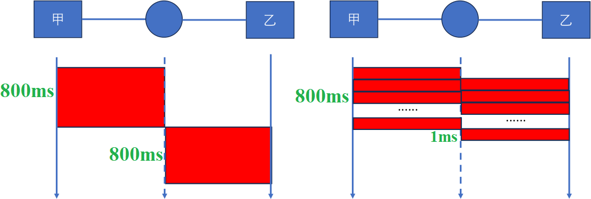
:::

【例1-2】如下图所示，主机H1和H2之间有三种可选的交换方式——电路交换、报文交换和分组交换，其中电路交换建立电路连接的时间为2s，报文交换和分组交换都要经过由一个路由器连接的链路，分组大小为5kb。三种交换方式的数据传输速率均为2.5kb/s，忽略所有的传播时延、分组开销和不可预料的线路延迟，则下列说法中正确的是 ( )。

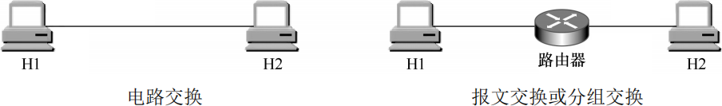

A. 若H1向H2发送5kb的数据，则电路交换最节省时间<br/>
B. 若H1向H2发送50kb的数据，则电路交换和分组交换的时间相同<br/>
C. 若H1向H2发送10kb的数据，则报文交换比分组交换更节省时间<br/>
D. 若H1向H2发送15kb的数据，则报文交换比电路交换更节省时间

::: analysis
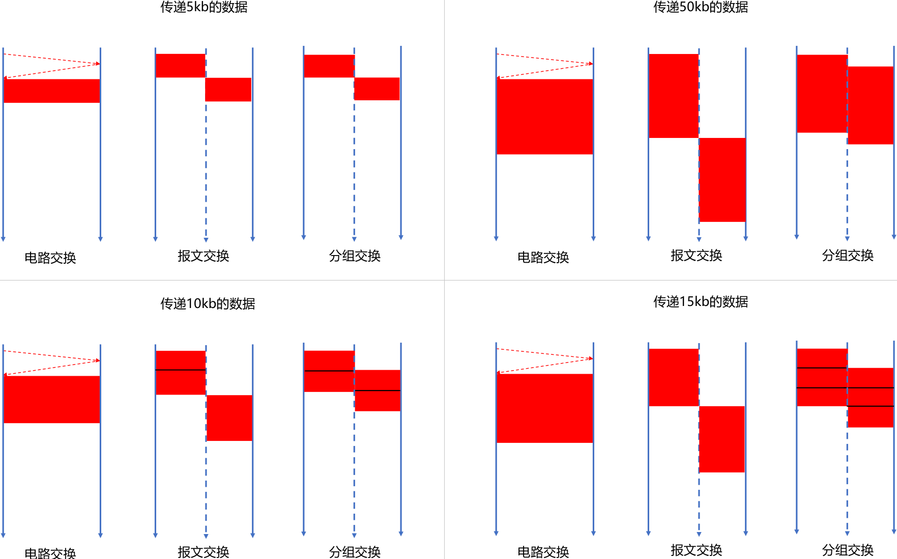
:::

【例1-3 2010统考真题】在下图所示的采用“存储-转发”方式的分组交换网络中，所有链路的数据传输速率为100Mb/s，分组大小为1000B，其中分组头大小为20B。若主机H1向主机H2发送一个大小为980000B的文件，则在不考虑分组拆装时间和传播延迟的情况下，从H1发送开始到H2接收完为止，需要的时间至少是 ( )。

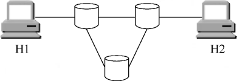

<options :options="['A. 80ms', 'B. 80.08ms', 'C. 80.16ms', 'D. 80.24ms']" />

::: analysis
一个分组的大小=980B，一个分组的发送时延=1000B/100Mbps=0.08ms，分组数量=980000B/ 980B=1000个。

第1个发送时延：H1→A，第1个数据已发送<br/>
第2个发送时延：H1→A, A→B，第2个数据已发送<br/>
第3个发送时延：H1→A, A→B, B→H2，第3个数据已发送<br/>
第4个发送时延：H1→A, A→B, B→H2，第4个数据已发送<br/>
……<br/>
第1000个发送时延：H1→A, A→B, B→H2，第1000个数据已发送<br/>
第1001个发送时延：A→B，第1000个数据由A到B<br/>
第1002个发送时延：B→H2，第1000个数据由B到H2

故总时延=1000×0.08ms+2×0.08ms=80.16ms。

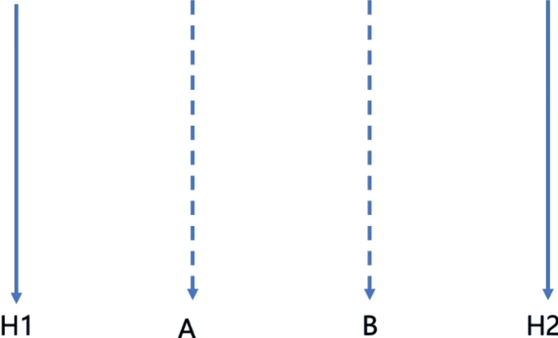
:::

【例1-4 2023统考真题】在下图所示的分组交换网络中，主机H1和H2通过路由器互连，2段链路的带宽均为100Mb/s，时延带宽积（单向传播时延×带宽）均为1000b。若H1向H2发送一个大小为1MB的文件，分组长度为1000B，则从H1开始发送的时刻起到H2收到文件全部数据时刻止，所需的时间至少是 ( )。（注：1M=10<sup>6</sup>。）

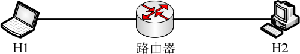

<options :options="['A. 80.02ms', 'B. 80.08ms', 'C. 80.09ms', 'D. 80.10ms']" />

::: analysis
单向传播时延=0.01ms，分组数量=1MB/1000B=1000，一个分组的发送时延=1000B/100Mbps=0.08 ms。如下图分析，总时延=1000个发送时延+1个传播时延+1个发送时延+1个传播时延=80.10ms。

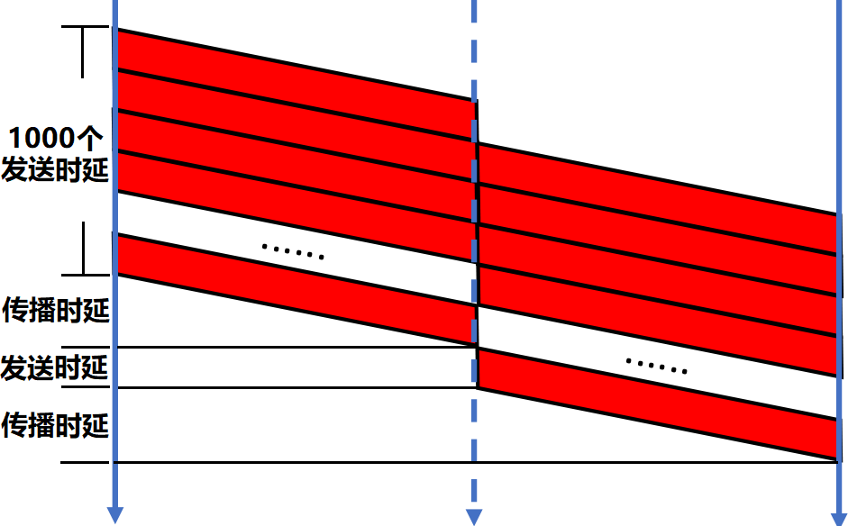
:::

【例1-5 2024统考真题】某分组交换网络及每段链路带宽如图所示，H1到H2的最大吞吐量约为 ( )。

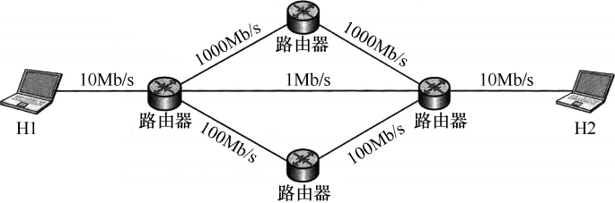

<options :options="['A. 1Mb/s', 'B. 10Mb/s', 'C. 100Mb/s', 'D. 1000Mb/s']" />

::: analysis
考虑木桶效应。
:::

</question>

### 网络协议模型

协议由语法、语义和同步三部分组成。

| 协议组成  | 内容                                                        |
| -------- | ---------------------------------------------------------- |
| 语法      | 数据与控制信息的格式。如TCP报文段由语法定义。                     |
| 语义      | 需要发出何种控制信息、动作及应答。如TCP握手的所有操作由TCP语义定义。  |
| 同步/时序 | 强调各种操作执行的条件、时序、顺序。如TCP握手的时序关系由TCP同步定义。 |


| 层次       | 功能                                     | 设备         |
| --------- | ---------------------------------------- | ----------- |
| 应用层     | 实现具体功能                               |             |
| 表示层     | 数据格式转换                               |             |
| 会话层     | 会话管理                                  |             |
| 传输层     | 复用分用、差错控制、流量控制、连接管理、可靠传输 |             |
| 网络层     | 路由选择、分组转发、拥塞控制、网际互联、流量控制 | 路由器        |
| 数据链路层  | 差错控制、流量控制                          | 交换机       |
| 物理层     | 定义电路接口参数、信号含义、电气特性           | 中继器、集线器 |

## 第二章 物理层

### 物理层接口特性

| 特性     | 含义                                                                                       |
| ------- | ------------------------------------------------------------------------------------------ |
| 机械特性 | 指明接口所用接线器的<tip>形状</tip>、<tip>尺寸</tip>、<tip>引脚数目</tip>、<tip>排列</tip>、规定装置 |
| 电气特性 | 指明在接口电缆的各条线上出现的<tip>电压范围</tip>                                                 |
| 功能特性 | 指明某条线上出现的某一电平的<tip>电压意义</tip>                                                   |
| 过程特性 | 指明对于不同功能的各种可能出现的<tip>事件顺序</tip>                                                |

---
<question>

【例2-1】某网络在物理层规定，信号的电平用+10V~+15V表示二进制0，用-10V～-15V表示二进制1，电线长度限于15m以内，这体现了物理层接口的 ( )。

<options :options="['A. 机械特性', 'B. 功能特性', 'C. 电气特性', 'D. 规程特性']" />

【例2-2】当描述一个物理层接口引脚处于高电平时的含义时，该描述属于 ( )。

<options :options="['A. 机械特性', 'B. 电气特性', 'C. 功能特性', 'D. 规程特性']" />

【例2-3 2012统考真题】在物理层接口特性中，用于描述完成每种功能的事件发生顺序的是 ( )。

<options :options="['A. 机械特性', 'B. 功能特性', 'C. 过程特性', 'D. 电气特性']" />

【例2-4 2018统考真题】下列选项中，不属于物理层接口规范定义范畴的是 ( )。

<options :options="['A. 接口形状', 'B. 引脚功能', 'C. 物理地址', 'D. 信号电平']" />

</question>

---

### 通信指标计算

#### 码元

- 一个固定时长的信号波就是一个码元。该时长称为码元宽度/信号周期。
- 若信号波可能出现4种信号，则称其为4进制码元，即码元一次携带2位二进制数据。
- 一个K进制码元携带的比特数为log<sub>2</sub>K。

#### 传输速率

| 两种传输速率         | 含义               | 单位                   |
| ------------------ | ----------------- | ---------------------- |
| 码元传输速率 / 波特率 | 每秒传输几个码元     | 码元/秒、波特 Baud       |
| 信息传输速率 / 比特率 | 每秒传输几个二进制位 | 比特/秒、bit/s、bps、b/s |

#### 奈氏准则

奈氏准则适用于无噪声信道，

$$
\small极限波特率 = 2W
$$
$$
\small极限比特率 = 2WlogK
$$

其中 W 是信道带宽。

奈奎斯特定理说明：

- 波特率太高，会造成“码间串扰”，即接收方无法识别码元。
- 带宽越大，信道传输码元的能力越强
- 奈奎斯特定理没有解释一个码元最多可以携带多少比特。

#### 香农定理

香农定理适用于有噪声信道，

$$
\small 极限比特率=W\log_2{(1 + \frac{S}{N})}
$$

$$
\small 信噪比=10\log_{10}{(\frac{S}{N})}\;,\;单位\text{dB}
$$

香农定理说明：

- 提高信道带宽、加强信号功率、降低噪声功率，都可以提高信道的极限比特率
- 在带宽信噪比确定的信道上，波特率和比特率都有极限，故一个码元携带的比特数有上限。

---
<question>

【例2-5 2016统考真题】如下图所示，若连接R2和R3链路的频带宽度为8kHz，信噪比为30dB，该链路实际数据传输速率约为理论最大数据传输速率的50%，则该链路的实际数据传输速率约为 ( )。

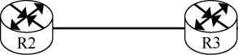

<options :options="['A. 8kb/s', 'B. 20kb/s', 'C. 40kb/s', 'D. 80kb/s']" />

【例2-6 2017统考真题】若信道在无噪声情况下的极限数据传输速率不小于信噪比为30dB条件下的极限数据传输速率，则信号状态数至少是 ( )。

<options :options="['A. 4', 'B. 8', 'C. 16', 'D. 32']" />

</question>

---

### 编码与调制

#### 编码（二进制数据到数字信号）


> 以太网默认使用曼彻斯特编码方式。

---

<question>

【例2-7 2013统考真题】下图为10BaseT网卡接收到的信号波形，则该网卡收到的比特串是 ( )。

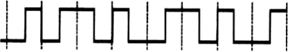

<options :options="['A. 0011 0110', 'B. 1010 1101']" width="70%" />
<options :options="['C. 0101 0010', 'D. 1100 0101']" width="70%" />

【例2-8 2015统考真题】使用两种编码方案对比特流01100111进行编码的结果如下图所示，编码1和编码2分别是 ( )。

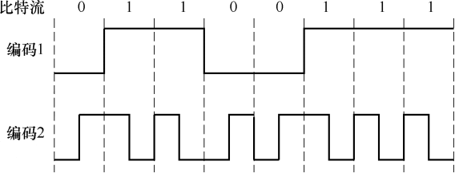

<options :options="['A. NRZ编码和曼彻斯特编码', 'B. NRZ编码和差分曼彻斯特编码']" />
<options :options="['C. NRZI编码和曼彻斯特编码', 'D. NRZI编码和差分曼彻斯特编码']" />

【例2-9 2021统考真题】下图为一段差分曼彻斯特编码信号波形，该编码的二进制串是 ( )。

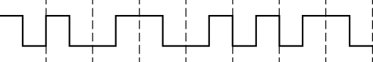

<options :options="['A. 1011 1001', 'B. 11010001', 'C. 0010 1110', 'D. 10110110']" />

</question>

---

#### 调制（二进制数据到模拟信号）


- 正交幅度调制QAM：将调幅AM和调相PM叠加。
- 若有m种幅值、n种相位，则可调制出mn种信号，一个码元可携带logmn个比特。

| QAM方案  | 信号数         | 比特数               |
| ------- | ------------- | ------------------- |
| QAM-16  | 调制出16种信号  | 一个码元可携带4bit数据 |
| QAM-32  | 调制出32种信号  | 一个码元可携带5bit数据 |
| QAM-64  | 调制出64种信号  | 一个码元可携带6bit数据 |
| QAM-128 | 调制出128种信号 | 一个码元可携带7bit数据 |

---
<question>

【例2-10 2009统考真题】在无噪声的情况下，若某通信链路的带宽为3kHZ，采用4个相位，每个相位具有4种幅度的QAM调制技术，则该通信链路的最大数据传输速率是 ( )。

<options :options="['A. 12kb/s', 'B. 24kb/s', 'C. 48kb/s', 'D. 96kb/s']" />

【例2-11 2011统考真题】若某通信链路的数据传输速率为2400b/s，采用4个相位调制，则该链路的波特率是 ( )。

<options :options="['A. 600Baud', 'B. 1200Baud', 'C. 4800Baud', 'D. 9600Baud']" />

</question>

---

### 物理层设备

#### 中继器

中继器的主要功能是整形、放大、转发信号。消除信号经过长段电缆产生的失真和衰减，让信号的波形和强度达到所需的要求。

#### 集线器

集线器Hub一个端口收到数据后，会转发给其余所有端。若同时有多个端输入，则发生冲突它会让这些数据都失效。

- 冲突：多个设备同时在同一传输介质上发送数据时，数据会碰撞导致失效。
- 冲突域：如果多个设备同时发送会导致数据冲突，则它们所在范围就是一个冲突域。相当于是数据发送的“临界区”。

集线器无法分割冲突域，所以集线器端口所连的所有设备同属于一个冲突域。

## 第三章 数据链路层

```c
                   数据链路层
 +--------+---------+----------+-----------+
组帧   差错控制   可靠传输   流量控制   介质访问控制
```

### 封装成帧

组帧所要解决的问题：

- 帧定界：确定帧的边界
- 透明传输：去除边界信息还原数据原貌

| 组帧的方法       | 内容                                                         |
| -------------- | ------------------------------------------------------------ |
| 字符计数法       | 帧首添加一个字节保存帧长，出错导致后续所有帧无法定界                 |
| 字节填充法       | 首尾添加控制字符SOH和EOT，中间添加转义字符ESC避免歧义               |
| **零比特填充法** | 特殊字节01111110标记帧首尾。发送方遇连续5个1添加一个0，接收方要去掉。 |
| **违规编码法**   | 使用违规信号标记帧首尾，需要物理层配合。                           |

> HDLC协议和PPP协议就使用零比特填充法。

<div style="display: flex; gap: 5px; align-items: center; justify-content: center;">
  
  
</div>

### 差错控制

#### 奇偶校验码


- 奇校验：整个校验码（有效信息位和校验位）中“1”的个数为奇数。
- 偶校验：整个校验码（有效信息位和校验位）中“1”的个数为偶数。

奇偶校验码仅能检测奇数个位出错，无纠错能力。

---
<question>
【例3-1】写出两个编码1001101和1010111的奇校验码和偶校验码。

- 奇校验：<u>1</u>1001101 <u>0</u>1010111
- 偶校验：<u>0</u>1001101 <u>1</u>1010111

校验时也是数“1”的个数。
</question>

---

#### 循环冗余校验码 CRC


<question>

【例3-2】生成多项式 G(x)=x<sup>3</sup>+x<sup>2</sup>+1，信息码 101001，求CRC校验码。
</question>

| 求校验码步骤                      | 举例                    |
| ------------------------------- | ----------------------- |
| ① 多项式的最高次数，为校验位位数     | R=3                    |
| ② 多项式的系数，为除数              | 除数=1101              |
| ③ 信息位左移R位，为被除数           | 被除数=101001 000       |
| ④ 模2除运算，余数为校验位           | 余数=001                |
| **校验步骤**                      |                         |
| 信息位+校验位 模2除 除数，结果为0正确 | 101001 001 % 1101 = 000 |

##### 模2除运算

1. 最高位为1则商1，为0商0
2. 抛去最高位，后多位进行异或，异或完下一位下来。


---
<question>

【例3-3 2023统考真题】若甲向乙发送数据时采用CRC检验，生成多项式为G(X)=X<sup>4</sup>+X+1（G=10011），则乙方接收到比特串 ( ) 时，可以断定其在传输过程中未发生错误。

<options :options="['A. 10111 0000', 'B. 10111 0100', 'C. 10111 1000', 'D. 10111 1100']" />

</question>

---

#### 海明校验码

- 假设m位校验位、n位信息位
- m位校验位可表示2<sup>m</sup>种情况，m+n位数据共有m+n种单位错误可能，还有一种正确情况
- 故要求 2<sup>m</sup>≥m+n+1

### 流量控制和可靠传输

> 做到流量控制和可靠传输，需实现滑动窗口、确认机制、重传机制、帧编号。下面三种协议分别是三种具体实现。
>
> - 接收方可通过接受窗口控制发送方发送速度，这就是流量控制。
> - 确认机制和重传机制可保证可靠传输。

#### 停止等待协议 SW

| 机制     | 内容                                                     |
| ------- | -------------------------------------------------------- |
| 滑动窗口 | 发送窗口 W<sub>T</sub>=1，接收窗口 W<sub>R</sub>=1           |
| 确认机制 | 逐帧确认：收到<mono>i</mono>号帧，需要返回 ACK<sub>i</sub>    |
| 重传机制 | 超时重传：超时未收到 ACK<sub>i</sub>，则重传<mono>i</mono>号帧 |
| 帧编号   | 仅需1bit                                                  |

#### 后退N帧协议 GBN

| 机制     | 内容                                                                                                                  |
| -------- | -------------------------------------------------------------------------------------------------------------------- |
| 滑动窗口 | W<sub>T</sub>>1 W<sub>R</sub>=1                                                                                        |
| 确认机制 | **累积确认**：ACK<sub>i</sub> 表示确认<mono>i</mono>号帧及其之前所有帧<br/>**主动丢弃**：接收窗口之外的帧，丢弃并返回最后收到帧的ACK |
| 重传机制 | **超时重传**：超时未收到 ACK<sub>i</sub>，则重传<mono>i</mono>号帧及其之后所有帧                                              |
| 帧编号   | 需nbit，要求 W<sub>T</sub>+W<sub>R</sub>≤2<sup>n</sup>                                                                 |

> 若接受速度慢或信道误码率高，导致发送方经常需要“后退”，传输效率低。

#### 选择重传协议 SR

| 机制     | 内容                                                                                                                          |
| ------- | ----------------------------------------------------------------------------------------------------------------------------- |
| 滑动窗口 | W<sub>T</sub>>1 W<sub>R</sub>>1                                                                                               |
| 确认机制 | **逐帧确认**：收到<mono>i</mono>号帧，必须返回 ACK<sub>i</sub>，不支持累计确认<br/>**请求重传**：若帧出错，丢弃并返回否认帧NAK<sub>i</sub> |
| 重传机制 | **超时重传**：超时未收到 ACK<sub>i</sub>，则重传<mono>i</mono>号帧                                                                 |
| 帧编号   | 需nbit，要求 W<sub>T</sub>≤W<sub>R</sub>                                                                                       |


::: info 链路层三种协议对比 

| 协议       | 窗口大小                         | 确认机制 | 重传机制 | 编号机制                                   |
| --------- | ------------------------------- | ------- | ------ | ----------------------------------------- |
| 停止等待SW | W<sub>T</sub>=1 W<sub>R</sub>=1 | 逐帧确认 | 超时重传 | 1bit                                      |
| 后退N帧GBN | W<sub>T</sub>>1 W<sub>R</sub>=1 | 累积确认 | 超时重传 | W<sub>T</sub>+W<sub>R</sub>≤2<sup>n</sup> |
| 选择重传SR | W<sub>T</sub>>1 W<sub>R</sub>>1 | 逐帧确认 | 超时重传 | W<sub>T</sub>≤W<sub>R</sub>               |

:::

---
<question>

【例3-4 2009统考真题】数据链路层采用了后退N顿（GBN）协议，发送方已经发送了编号为0~7的帧。当计时器超时的时候，若发送方只收到0、2、3号帧的确认，则发送方需要重发的帧数是 ( )。

<options :options="['A. 2', 'B. 3', 'C. 4', 'D. 5']" />

【例3-5 2011统考真题】数据链路层采用选择重传协议（SR）传输数据，发送方已发送0~3号数据顿，现已收到1号顿的确认，而0、2号顿依次超时，则此时需要重传的帧数是 ( )。

<options :options="['A. 1', 'B. 2', 'C. 3', 'D. 4']" />

【例3-6 2019统考真题】对于滑动窗口协议，若分组序号采用3比特编号，发送窗口大小为5，则接收窗口最大是 ( )。

<options :options="['A. 2', 'B. 3', 'C. 4', 'D. 5']" />

【例3-7 2024统考真题】主机甲通过选择重传（SR）滑动窗口协议向主机乙发送帧的部分过程如下图所示，F<em>x</em>为数据帧，ACK<em>x</em>为确认帧，<em>x</em>是位数为3比特的序号。主机乙只对正确接收的数据顿进行独立确认，发送窗口与接收窗口大小相同且均为最大值。主机甲在t<sub>1</sub>时刻和t<sub>2</sub>时刻发送的数据帧分别是 ( )。


<options :options="['A. F1, F3', 'B. F1, F4', 'C. F3, F1', 'D. F4, F1']" />

</question>

---

### 信道利用率

信道利用率，意指发送时间与整个周期之比。

- 停止等待的信道利用率：

$$
\small U_{SW}=\frac{T_D}{T_D+RTT+T_A}
$$

- 后退N帧、选择重传的信道利用率：

$$
\small U_{GBN/SR}=\frac{nT_D}{T_D+RTT+T_A}
$$

其中T<sub>D</sub>为数据帧发送时延，T<sub>A</sub>为确认帧发送时延，RTT为往返传播时延，n为发送窗口大小。

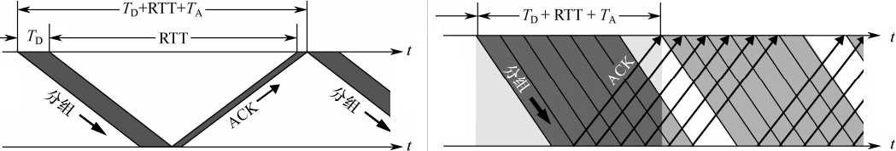

---
<question>

【例3-x 2012统考真题】两台主机之间的数据链路层采用后退N协议（GBN）传输数据，数据传输速率为16kb/s，单向传播时延为270ms，数据帧长范围是128~512字节，接收方总是以与数据帧等长的顿进行确认。为使信道利用率达到最高，帧序号的比特数至少为 ( )。

<options :options="['A. 5', 'B. 4', 'C. 3', 'D. 2']" />

【例3-x 2014统考真题】主机甲与主机乙之间使用后退N帧协议（GBN）传输数据，主机甲的发送窗口尺寸为1000，数据顿长为1000字节，信道带宽为100Mb/s，主机乙每收到一个数据顿，就立即利用一个短帧（忽略其传输延迟）进行确认，若主机甲和主机乙之间的单向传播时延是50mS，则主机甲可以达到的最大平均数据传输速率约为 ( )。

<options :options="['A. 10Mb/s', 'B. 20Mb/s', 'C. 80Mb/s', 'D. 100Mb/s']" />

【例3-x 2015统考真题】主机甲通过128kb/s卫星链路，采用滑动窗口协议向主机乙发送数据链路单向传播时延为250ms，长为1000字节。不考虑确认的开销，为使链路利用率不小于80%，帧序号的比特数至少是 ( )。

<options :options="['A. 3', 'B. 4', 'C. 7', 'D. 8']" />

【例3-x 2018统考真题】主机甲采用停止-等待协议向主机乙发送数据，数据传输速率是3kb/s：单向传播时延是200ms，忽略确认帧的传输时延。当信道利用率等于40%时，数据帧的长度为 ( )。

<options :options="['A. 240 比特', 'B. 400 比特', 'C. 480比特', 'D. 800 比特']" />

【例3-x 2020统考真题】假设主机甲采用停止-等待协议向主机乙发送数据帧，数据长与确认长均为1000B，数据传输速率是10kb/s，单项传播时延是200ms。则主机甲的最大信道利用率为 ( )。

<options :options="['A. 80%', 'B. 66.7%', 'C. 44.4%', 'D. 40%']" />

【例3-x 2023统考真题】假设通过同一条信道，数据链路层分别采用停止-等待协议、GBN协议和SR协议（发送窗口和接收窗口相等）传输数据，三个协议的数据帧长相同，忽略确认帧长，帧序号位数为3比特。若对应三个协议的发送方最大信道利用率分别是U<sub>1</sub>、U<sub>2</sub>和U<sub>3</sub>，则U<sub>1</sub>、U<sub>2</sub>和U<sub>3</sub>满足的关系是 ( )。

<options :options="['A. U<sub>1</sub> ≤ U<sub>2</sub> ≤ U<sub>3</sub>', 'B. U<sub>1</sub> ≤ U<sub>3</sub> ≤ U<sub>2</sub>', 'C. U<sub>2</sub> ≤ U<sub>3</sub> ≤ U<sub>1</sub>', 'D. U<sub>3</sub> ≤ U<sub>2</sub> ≤ U<sub>1</sub>']" />

</question>

---

### 介质访问控制

> 多个节点共享一个信道时，可能发生冲突，因此需要介质访问控制。有如下几种方法。
>
> - 信道划分：时分复用、频分复用、波分复用、码分复用。
> - 随机访问：ALOHA协议、CSMA协议、CSMA/CD协议、CSMA/CA协议。
> - 轮询访问：令牌传递协议。

#### 信道划分

| 码分复用CDMA                                   | 步骤                                |
| --------------------------------------------- | ---------------------------------- |
| 每个节点拥有专属的码片序列                        | A站：<mono>(1,1,1,1)</mono> 表示 1，<mono>(-1,-1,-1,-1)</mono> 表示 0<br/>B站：<mono>(1,-1,1,-1)</mono> 表示 1，<mono>(-1,1,-1,1)</mono> 表示 0   |
| 同时接受的数据，信号值会叠加                       | <mono>(1,1,1,1)+(-1,1,-1,1)=(0,2,0,2)</mono> |
| 将结果和码片序列作单位化内积。<br/>得1表示发的是码片序列本身即1<br/>得-1表示发的是码片序列取反即0 | ¼·<mono>(1,1,1,1)·(0,2,0,2)=1</mono>表示A站发送<mono>(1,1,1,1)</mono>即1<br/>¼·<mono>(1,-1,1,-1)·(0,2,0,2)=-1</mono>表示B站发送<mono>(-1,1,-1,1)</mono>即0         |


---
<question>

【例3-x 2014统考真题】站A、B、C通过CDMA共享链路，A、B、C的码片序列分别是(1,1,1,1)、（1,-1,1,-1)和(1,1,-1,-1)。若C从链路上收到的序列是(2,0,2,0,0,-2,0,-2,0,2,0,2)，则C收到A发送的数据是 ( )。

<options :options="['A. 000', 'B. 101', 'C. 110', 'D. 111']" />

</question>

---

#### 随机访问 CSMA/CD

> CSMA/CD 载波监听多路访问/冲突检测，适用于早期的总线型的有线以太网。

先听后发，边听边发，冲突停发，随机重发。

::: info 考点计算

- 争用期：2×最远单向传播时延。
- 截断二进制指数退避算法：k 为冲突次数，等待时长为 r×倍争用期。
  - k≤10，r在\[0,2<sup>k</sup>-1\]中取随机值
  - k>10，r在\[0,2<sup>10</sup>-1\]中取随机值
  - k=16，放弃传输
- 最短帧长：争用期×信道带宽。

> 以太网帧长规定为 64~1518。

:::


#### 随机访问 CSMA/CA

> CSMA/CA 载波监听多路访问/冲突避免，适用于IEEE 802.11 无线局域网 WiFi。

- 发送方：先听后发，忙则退避。
- 接收方：逐帧确认，若超时未收到确认则认为信道忙，进行“随机退避”。

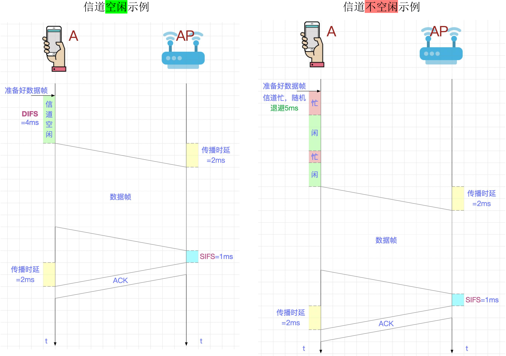

##### 信道预约机制

> 先预约，再发送。

- 发方发送“请求发送控制帧RTS”向接受站预约。
- 基站广播“允许发送控制帧CTS”，向发方表示“同意预约”，向其他站表示“禁言勿扰”。
- 若发方超时未收到CTS，则认为预约失败，进行随即退避。

> RTS (Request To Send) 和CTS (Clear To Send) 都包含源目的地址和持续时间。

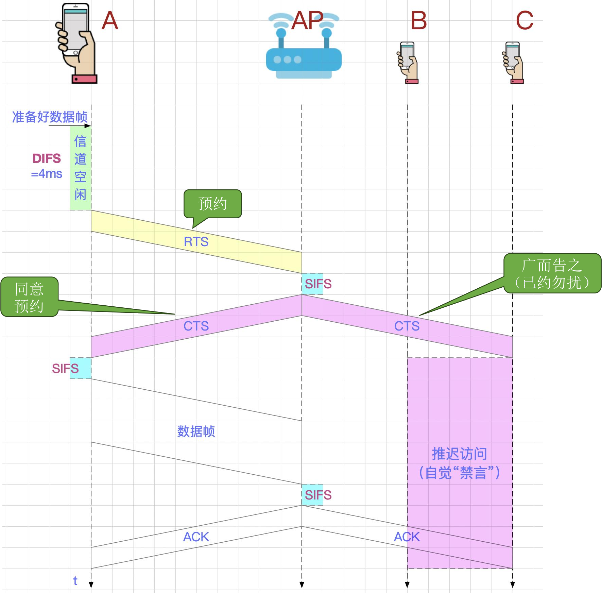

<!--

#### 轮询访问 令牌传递协议

一个令牌沿环形总线在各站之间轮询。令牌是一个特殊的控制帧，只控制信道，确保同时刻只有一个站独占信道。

1. 发送站在令牌中附加数据，令牌沿着环路传输，接收站复制数据。
2. 源站点收到后，停止转发并校验数据，有错重传，无错清空令牌。

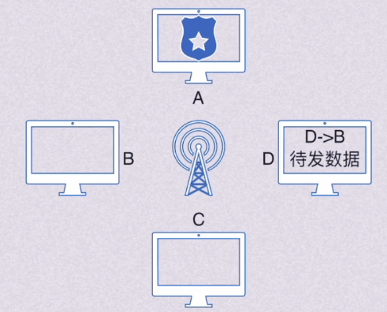

> 令牌传递协议对应的局域网方案叫 802.5 令牌环网，现已淘汰。

-->

---
<question>

【例3- 2009统考真题】在一个采用CSMA/CD协议的网络中，传输介质是一根完整的电缆传输速率为1Gb/s，电缆中的信号传播速率是200000km/s。若最小数据顿长减少800比特，则最远的两个站点之间的距离至少需要 ( )。

<options :options="['A. 增加160m', 'B. 增加80m', 'C. 减少160m', 'D. 减少80m']" />

【例3-3- 2011统考真题】下列选项中，对正确接收到的数据帧进行确认的MAC协议是 ( )。

<options :options="['A. CSMA', 'B. CDMA', 'C. CSMA/CD', 'D. CSMA/CA']" />

【例3- 2013统考真题】下列介质访问控制方法中，可能发生冲突的是 ( )。

<options :options="['A. CDMA', 'B. CSMA', 'C. TDMA', 'D. FDMA']" />

【例3- 2015统考真题】下列关于CSMA/CD协议的叙述中，错误的是 ( )。

A. 边发送数据顿，边检测是否发生冲突<br/>
B. 适用于无线网络，以实现无线链路共享<br/>
C. 需要根据网络跨距和数据传输速率限定最小帧长<br/>
D. 当信号传播延迟趋近0时，信道利用率趋近100%

【例3- 2016统考真题】如下图所示，在Hub再生比特流的过程中会产生1.535us的时延（Switch和Hub均为100Base-T设备），信号传播速率为200m/us，不考虑以太网帧的前导码，则H3和H4之间理论上可以相距的最远距离是 ( )。


<options :options="['A. 200m', 'B. 205m', 'C. 359m', 'D. 512m']" />

【例3- 2018统考真题】IEEE 802.11无线局域网的MAC协议CSMA/CA进行信道预约的方法是 ( )。

<options :options="['A. 发送确认帧', 'B. 采用二进制指数退避']" width="73%" />
<options :options="['C. 使用多个MAC地址', 'D. 交换RTS与CTS顿']" width="70%" />

【例3- 2019统考真题】假设一个采用CSMA/CD协议的100Mb/s局域网，最小顿长是128B，则在一个冲突域内两个站点之间的单向传播时延最多是 ( )。

<options :options="['A. 2.56μs', 'B. 5.12us', 'C. 10.24μs', 'D. 20.48μs']" />

【例3- 2020统考真题】在某个IEEE 802.11无线局域网中，主机H与AP之间发送或接收CSMA/CA的过程如下图所示。在H或AP发送帧前等待的帧间间隔时间（IFS）中，最长的是 ( )。


<options :options="['A. IFS1', 'B. IFS2', 'C. IFS3', 'D. IFS4']" />

【例3- 2023统考真题】已知10BaseT以太网的争用时间片为51.2uS。若网卡在发送某帧时发生了连续4次冲突，则基于二进制指数退避算法确定的再次尝试重发该帧前等待的最长时间是 ( )。

<options :options="['A. 51.2μs', 'B. 204.8μs', 'C. 768μs', 'D. 819.2μs']" />

【例3- 2024统考真题】在采用CSMA/CA的802.11无线局域网中，DIFS=128μs，SIFS=28μs，RTS、CTS和ACK顿的传输时延分别是3us、2us和2uS，忽略信号传播时延。若主机A要向AP发送一个总长度为1998B的数据顿，无线链路带宽为54Mb/s，则隐藏站B收到AP发送的CTS顿时，设置的网络分配向量NAV的值是 ( )。

<options :options="['A. 326μs', 'B. 354μs', 'C. 385μs', 'D. 513μs']" />

</question>

---

### 局域网

#### 802.3 以太网

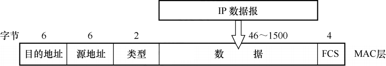

> 6 6 2 N 4 收发协数验。N 46~1500

为简化通信，以太网无连接、不对帧编号、不要求确认，尽最大努力交付数据，提供的是不可靠服务。

##### 以太网标准

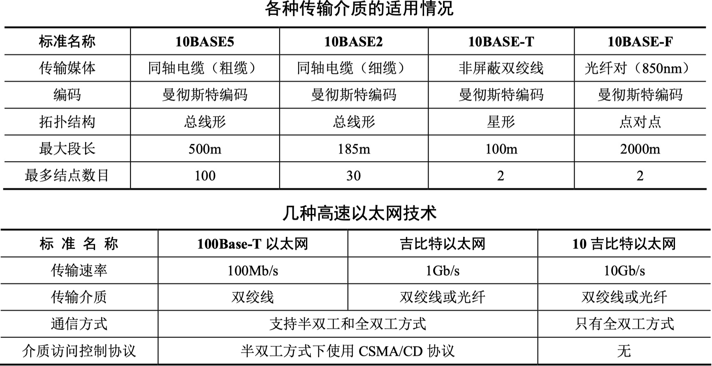

- 同轴电缆只能半双工
- 双绞线2.5Gbps下可半双工和全双工，2.5Gbps上只能全双工
- 光纤只能全双工

#### 802.11 无线局域网

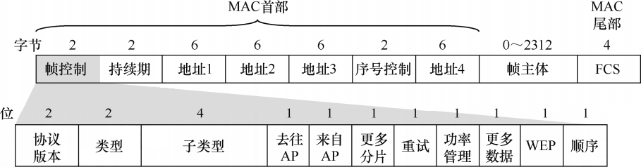

- 移动站之间通信必须通过基站AP，故有“去往AP”和“来自AP”标志位。
- 地址1、地址2、地址3分别表示站A、站B、AP中的**目的地址、源地址、第三者**。

#### 802.1Q 虚拟局域网

> 在规模很大的传统局域网中，大量的广播会严重消耗网络负载，也无法保证节点安全。使用VLAN可以隔离广播域。

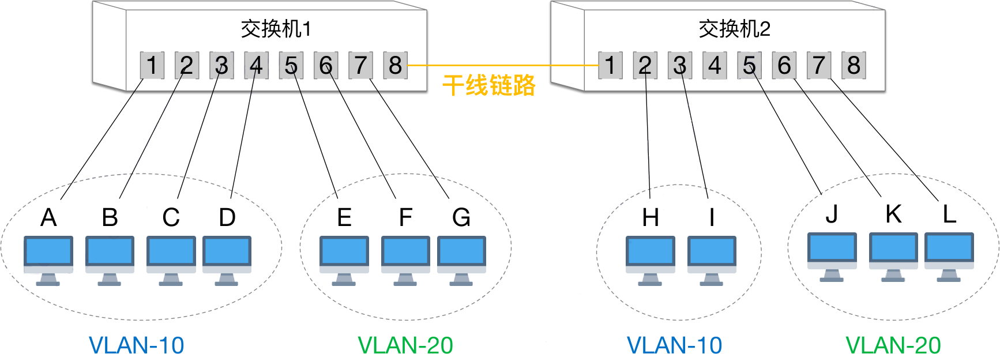

相同VID同属于一个VLAN，一个节点只能探测到同属于一个VLAN的节点。

---
<question>

【例3-x 2012统考真题】以太网的MAC协议提供的是 ( )。

<options :options="['A. 无连接的不可靠服务', 'B. 无连接的可靠服务']" width="70%" />
<options :options="['C. 有连接的可靠服务', 'D. 有连接的不可靠服务']" width="72%" />

【例3-x 2017统考真题】在下图所示的网络中，若主机H发送一个封装访问Internet的IP分组的IEEE802.11数据帧F，则帧F的地址1、地址2和地址3分别是 ( )。


<options :options="['A. 00-12-34-56-78-9a, 00-12-34-56-78-9b, 00-12-34-56-78-9c']" />
<options :options="['B. 00-12-34-56-78-9b, 00-12-34-56-78-9a, 00-12-34-56-78-9c']" />
<options :options="['C. 00-12-34-56-78-9b, 00-12-34-56-78-9c, 00-12-34-56-78-9a']" />
<options :options="['D. 00-12-34-56-78-9a, 00-12-34-56-78-9c, 00-12-34-56-78-9b']" />

【例3-x 2019统考真题】100BaseT快速以太网使用的导向传输介质是 ( )。

<options :options="['A. 双绞线', 'B. 单模光纤', 'C. 多模光纤', 'D. 同轴电缆']" />
    
</question>

---

### 以太网交换机

#### 自学习功能

交换机内部维护一个交换表，记录MAC地址到端口号的映射。每条映射存在有效时间，过期自动作废。

- 有节点发送帧，记录其MAC地址和端口号
- 表中无接收方，就将帧广播到除入口外的其他端口
- 表中有接收方，只将帧转发给接收方

#### 两种交换方式

| 交换方式       | 内容                                                                                                          |
| ------------- | ------------------------------------------------------------------------------------------------------------ |
| 直通交换方式    | 接收到帧立即转发。<br/>优点：转发时延低。<br/>缺点：不适用于需要速率匹配、协议转换或差错检测的线路。                         |
| 存储转发交换方式 | 先缓存帧，进行差错检测等处理再转发。<br/>优点：可靠性高，适用于需要速率匹配、协议转换或差错检测的线路。<br/>缺点：转发时延低高。 |


---
<question>

【例3-x 2009统考真题】以太网交换机进行转发决策时使用的PDU地址是 ( )。

<options :options="['A. 目的物理地址', 'B. 目的IP地址', 'C. 源物理地址', 'D. 源IP地址']" />

【例3-x 2013统考真题】对于100Mb/s的以太网交换机，当输出端口无排队，以直通交换方式转发一个以太网帧（不包括前导码）时，引入的转发时延至少是 ( )。

<options :options="['A. 0μs', 'B. 0.48μs', 'C. 5.12μs', 'D. 121.44μs']" />

【例3-x 2014统考真题】某以太网拓扑及交换机的当前转发表如下图所示，主机00-e1-d5-00-23-al向主机00-el-d5-00-23-c1发送一个数据帧，主机00-el-d5-00-23-cl收到该帧后，向主机00-el-d5-00-23-al发送一个确认帧，交换机对这两个帧的转发端口分别是 ( )。


<options :options="['A. {3}和{1}', 'B. {2,3}和{1}', 'C. {2,3}和{1,2}', 'D. {1,2,3}和{1}']" />

【例3-x 2015统考真题】下列关于交换机的叙述中，正确的是 ( )。

<options :options="['A. 以太网交换机本质上是一种多端口网桥']" />
<options :options="['B. 通过交换机互连的一组工作站构成一个冲突域']" />
<options :options="['C. 交换机每个接口所连的网络构成一个独立的广播域']" />
<options :options="['D. 以太网交换机可实现采用不同网络层协议的网络互连']" />

【例3-x 2016统考真题】若主机H2向主机H4发送一个数据帧，主机H4向主机H2立即发送一个确认帧，则除H4外，从物理层上能够收到该确认帧的主机还有 ( )。


<options :options="['A. 仅H2', 'B. 仅H3', 'C. 仅H1、H2', 'D. 仅H2、H3']" />

</question>

## 第四章 网络层

```c
                            网络层
   +---------+-------------+----------+--------+--------+
报文分片   地址划分   ARP/DHCP/ICMP   IPv6   路由协议   路由器
```

### IPv4

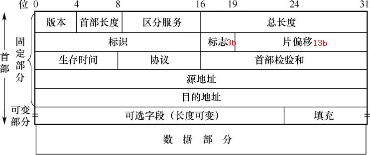

> 考试提供报文结构图，只记字段作用。

| 字段        | 含义                                                                                                              |
| ---------- | ---------------------------------------------------------------------------------------------------------------- |
| 版本        | IP协议的版本                                                                                                       |
| 首部长度     | 报头长度，以4B为单位                                                                                                 |
| 总长度      | 整个报文的长度，以1B为单位                                                                                            |
|            |                                                                                                                  |`
| 16位标识    | 分片报文的标识一致，以确认分片的报文                                                                                    |
| 3位标志     | MF (More Fragment) 1表示还有更多分片，0表示无更多分片；<br/>DF (Don't Fragment) 1表示不允许被分片，0表示允许被分片；最高位保留 |
| 13位片偏移  | 报文的数据距原始数据起始位置的偏移量，以8B为单位                                                                          |
|            |                                                                                                                  |
| 生存时间TTL | 防止报文无限转发。每经一个节点生存时间就减1，减到0就丢弃报文                                                                |
| 协议        | 上层协议                                                                                                           |
| 源目的IP    | 源目的主机的IP地址                                                                                                   |

> 418 首总偏：首部长度、总长度、片偏移分别以4B 1B 8B为单位。

---
<question>

</question>

---

### IP分片

链路层帧能承载的最大数据量称为最大传送单元 MTU。如以太网MTU为1500B，如果报文总长度超出下段链路的MTU，就需要分片。

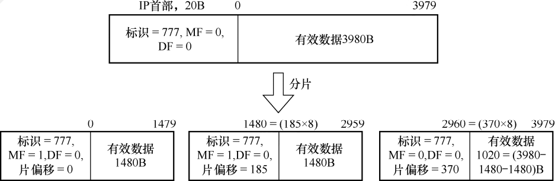

设有4000B的报文需要发送到MTU为1500B的链路上，

1. 将 3980B 的数据拆分成 1480B+1480B+1020B
2. 复制报头并修改片偏移，分别为0/8=0、1480/8=185、(1480+1480)/8=370

---
<question>

</question>

---

### IP地址划分

#### 早期分类

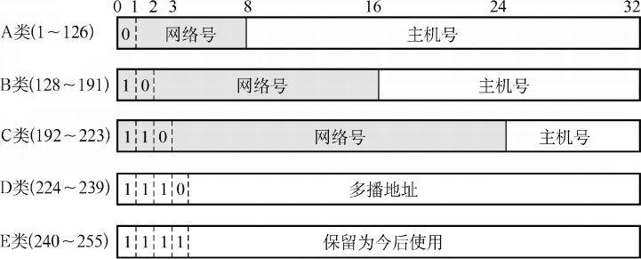

| 特殊IP地址          | 含义                                            |
| ------------------ | ---------------------------------------------- |
| 网络号确定，主机号全0 | 表示网络本身，不可做为地址                          |
| 网络号确定，主机号全1 | 表示广播地址，只能作为目的地址                      |
| 网络号全0，主机号确定 | 表示本网络中的主机，只能作为源地址                   |
| 网络号全0，主机号全0  | 表示本网络中的本主机，DHCP请求分配IP时，只能作为源地址 |
| 网络号全1，主机号全1  | 表示本网络中的广播地址，只能作为目的地址              |
| 网络号127，主机号任意 | 表示环回自检地址，用于本地测试                      |

#### 子网划分

可将主机号前k位作为子网号，剩余n-k位作为主机号，这样就能划分出2<sup>k</sup>个容量为2<sup>n-k</sup>-2的子网。

子网掩码就是网络号全1主机号全0的32位二进制串，和地址相与可得网络号，用于判断地址是否归属于当前子网。

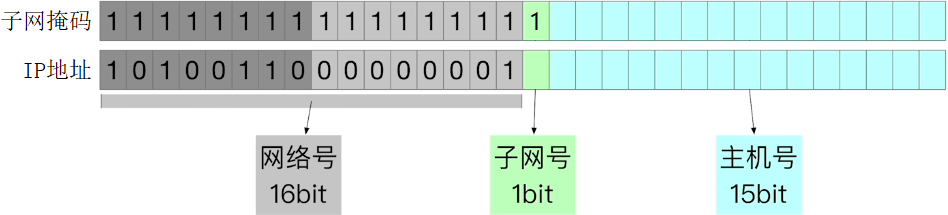

#### 无分类编址 CIDR

> 定长子网划分的每个子网容量相同，不够灵活地址利用率低。CIDR就是变长子网划分方案。

CIDR表示法`165.72.3.14/22`，`/22`表示网络号占22位。注意主机号全0/全1依旧不能使用。

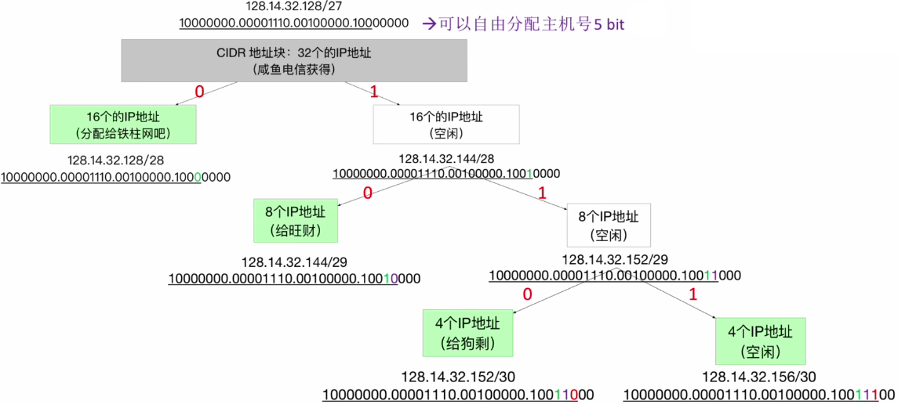

##### 路由聚合

如果有路由表项的转发接口相同、部分网络前缀也相同，可将这几条路由表项合为一条。这种聚合称为路由聚合或构成超网。

优点：可减少路由表大小、增加查询速度。缺点：无法过滤无效地址。

但此时查表须采用最长前缀匹配原则，可以尽量走最短转发路径，避免多次跳转。

<div style="display: flex; gap: 5px; align-items: center; justify-content: center;">
  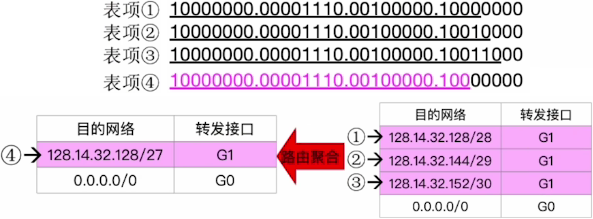
  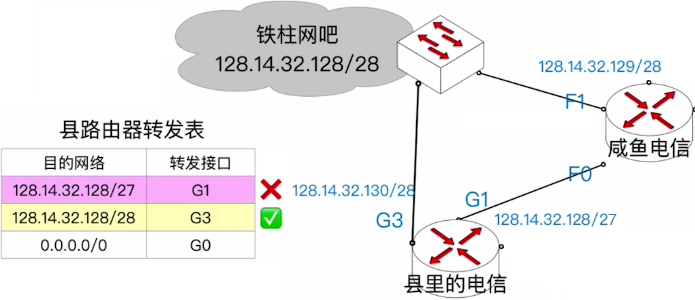
</div>

#### 网络地址转换 NAT

NAT需要NAT路由器，其维护NAT表。

- 报文从内网转发到外网时，会将内网<u>源IP和端口</u>改为公网<u>源IP和端口</u>
- 报文从外网转发到内网时，会将公网<u>目的IP和端口</u>改为内网<u>目的IP和端口</u>

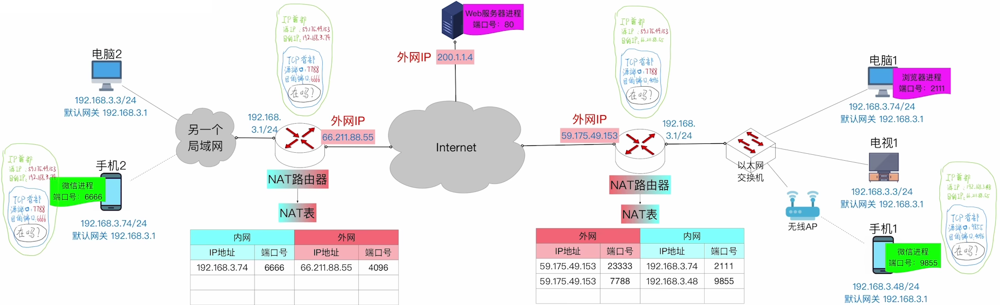

---
<question>

</question>

---

### IP地址解析 ARP

- ARP协议用于局域网内部，查询一个IP地址对应的MAC地址。
- 每个节点都维护一个ARP表，记录IP地址到MAC地址的映射，并定期更新表项。

| ARP请求和响应 | 内容                          | 发送方式     |
| ----------- | ---------------------------- | ------------ |
| ARP请求分组  | 写明自身IP地址MAC地址、对方IP地址 | 通过MAC帧广播 |
| ARP响应分组  | 写明自身IP地址MAC地址           | 通过MAC帧单播 |

---
<question>

</question>

---

### IP地址分配 DHCP

> DHCP是基于UDP的应用层协议，用于给主机分配IP地址、子网掩码、默认网关、DNS服务器地址。

| DHCP报文         | 内容                                                         |
| ---------------- | ------------------------------------------------------------ |
| ① 客→服 发现报文 | 携带信息：客户主机的MAC地址<br/><b style="color: #ed9715;">网络层：源IP=0.0.0.0</b>，<b style="color: #cd364b;">目的IP=255.255.255.255（广播IP报文）</b><br/>链路层：源MAC=客户的MAC地址，目的MAC=全1<b style="color: #269121;">（广播帧）</b> |
| ② 服→客 提供报文 | 携带信息：给客户分配的IP地址、租用期、子网掩码、默认网关<br/>网络层：<b style="color: #297ad6;">源IP=DHCP服务器的IP</b>，<b style="color: #cd364b;">目的IP=255.255.255.255（广播IP报文）</b><br/>链路层：源MAC=服务器的MAC地址，目的MAC=客户的MAC地址<b style="color: #269121;">（单播帧）</b> |
| ③ 客→服 请求报文 | 携带信息：客户机确认要使用的IP地址<br/><b style="color: #ed9715;">网络层：源IP=0.0.0.0</b>，<b style="color: #cd364b;">目的IP=255.255.255.255（广播IP报文）</b><br/>链路层：源MAC=客户的MAC地址，目的MAC=全1<b style="color: #269121;">（广播帧）</b> |
| ④ 服→客 确认报文 | 携带信息：重复提供报文的信息<br/>网络层：<b style="color: #297ad6;">源IP=DHCP服务器的IP</b>，<b style="color: #cd364b;">目的IP=255.255.255.255（广播IP报文）</b><br/>链路层：源MAC=服务器的MAC地址，目的MAC=客户的MAC地址<b style="color: #269121;">（单播帧）</b> |

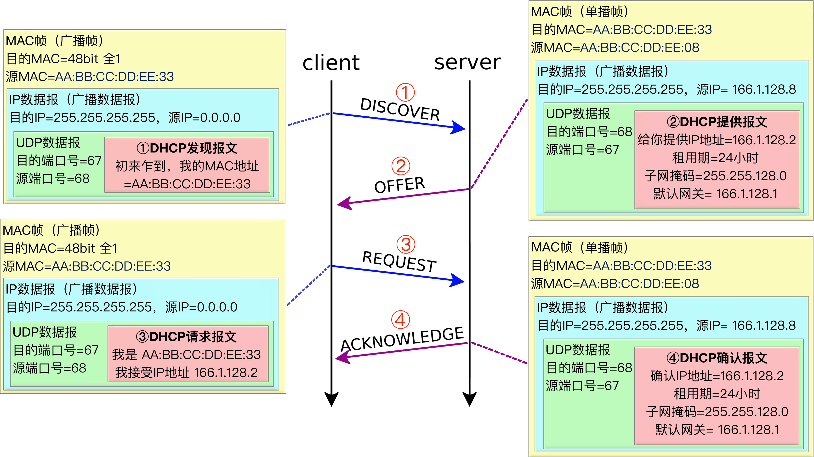

---
<question>

</question>

---

### IP报文控制 ICMP

ICMP属于网络层协议，基于IP协议，封装在IP数据报中。用于让节点报告网络中发生的差错和异常。

| 差错报告报文               | 含义                                   |
| ------------------------ | ------------------------------------- |
| 终点不可达                 | 无对应IP的主机或对应端口的进程             |
| 时间超过                   | TTL耗尽报文被丢弃，报文分片超时未到齐被丢弃 |
| 参数问题                   | 报文首部参数不合法或校验出错              |
| 改变路由（重定向）          | 告知源主机走另一条转发路径                |
| 源点抑制 <sub>*已废弃</sub> | 网络超载发生拥塞，要求源主机慢发           |

| **<span style="color:#67676c;">询问报文</span>** | **<span style="color:#67676c;">含义</span>** |
| ---------------------------------------- | ------------------------------------ |
| 回送请求 (Echo Request)                   | 要求目的主机回复                        |
| 回送回答 (Echo Reply)                     | 目的主机进行回复                        |
| 时间戳请求 (Timestamp Request)            | 要求目的主机回答时间                     |
| 时间戳回答 (Timestamp Reply)              | 目的主机进行回复时间                     |

---
<question>

</question>

---

### IPv6

IPv6地址使用冒号十六进制记法，共128位，写为十六进制，16位为一段，段间以冒号分隔。

```
2001:0db8:85a3:0000:0000:8a2e:0370:7334
2001:db8:85a3:0:0:8a2e:370:7334 -- 每段前导零可省略
2001:db8:85a3::8a2e:370:7334 -- 使用一次::代替连续多个零
```

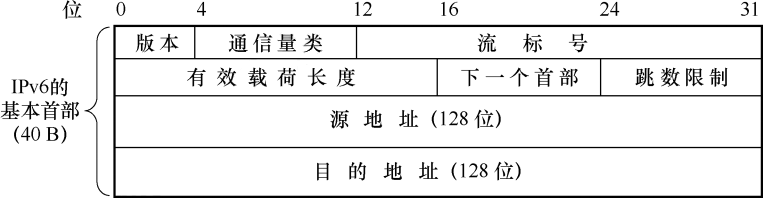

| 字段变化                | 内容                       |
| --------------------- | -------------------------- |
| 取消首部长度字段         | 首部长度固定为40B            |
| 取消服务类型字段         | 优先级和流标号实现了对应功能   |
| 取消了总长度字段         | 改用有效载荷长度字段          |
| 取消标识、标志、片偏移字段 | 这些功能已包含在分片扩展首部中 |
| 取消TTL字段             | 改为跳数限制作用一样         |
| 取消协议字段             | 改用下一个首部字段           |
| 取消检验和字段           | 路由器不再校验报文           |
| 取消选项字段            | 用扩展首部实现选项功能        |

| IPv6的变化           | 含义                                             |
| ------------------- | ------------------------------------------------ |
| 地址更长             | 从32位扩大到128位                                  |
| 灵活的首部格式        | IPv6的首部定义了许多可选的扩展首部，比IPv4提供更多的功能 |
| 改进的选项           | IPv6的首部长度固定，其他选项放在有效载荷中              |
| 允许协议继续扩充      |                                                   |
| 支持即插即用         | IPv6不需要DHCP                                     |
| 支持资源的预分配      |                                                   |
| IPv6首部改为8字节对齐 | 对比IPv4则是4字节对齐                               |

| IPv4向IPv6过渡 | 具体方法                                                                                                |
| ------------- | ------------------------------------------------------------------------------------------------------ |
| 双协议栈       | 设备同时支持IPv4和IPv6，和IPv4主机通信使用IPv4，和IPv6主机通信使用IPv6。<br/>通过DNS查询域名时获取目的主机的IP协议。 |
| 隧道技术       | 进入IPv4网络时，将整个报文作为数据封装进IPv4报文，<br/>离开IPv4网络时，再拆解出来。                               |

---
<question>

</question>

---

### 路由算法和路由协议

> 路由器内部运行着一种路由协议，一个路由协议使用某种路由算法。路由算法获取网络中各个节点的信息，以生成最佳转发路径。

| 路由算法分类 | 含义                                  |
| ---------- | ------------------------------------- |
| 静态路由算法 | 网络管理员手工配置每一条路由              |
| 动态路由算法 | 路由器根据网络负载和拓扑结构来动态调整路由表 |

| 两种具体路由算法 | 含义                                                    |
| ------------- | ------------------------------------------------------- |
| 距离向量路由算法 | 不管网络拓扑结构，只关心自身和相连点、相连点和目的点之间的最短距离 |
| 链路状态路由算法 | 把完整网络拓扑结构摸清楚之后，再用Dijkstra算法确定最短路径      |

> 一张路由表内不可能维护所有网络节点，故在世界范围划分自制系统AS，系统对外使用边界路由器。系统内运行内部路由协议如：RIP、OSPF，系统外运行外部路由协议，如BGP。

#### 路由信息协议 RIP

RIP是基于UDP的应用层协议，端口号520。RIP协议使用“距离向量路由算法”。

- RIP使用跳数 Hop Count 来衡量到达目的网络的距离
- RIP认为跳数最少就是最佳路由
- RIP规定合法距离不能超过15，距离为16表示网络不可达

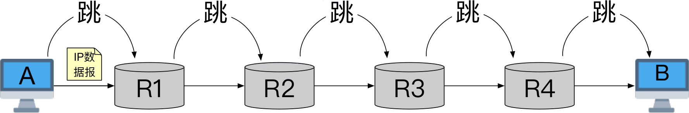

- 每个路由器都要维护自己的路由表
- 路由表项有三个关键字段：<目的网络N，距离d，下一跳路由器地址X>
- 每个路由器都要维护从它自身到其他目的网络的距离，即距离向量

##### RIP的工作流程

1. 路由器启动时，只知道和自身直接相连的网络，距离设为1。
2. 0时刻，路由器向相邻路由器发送RIP响应，其中包含完整路由表。
3. 收到其他路由器的路由表后，”目的网络不变，距离+1，下一跳改为对方“，若路由表中不存在该网络或距离更短，则放到自身路由表中。
4. 每隔30秒，和相邻路由器交换路由信息。为加快收敛速度，可在网络拓扑变化时自动通知相邻路由器，即“触发更新”机制。
5. 若超过RIP默认超时时间180秒没有收到相邻路由器的路由表，则将该路由器标记为不可达。

##### RIP的优缺点

优点：

1. 实现简单、开销小、收敛较快
2. <emp>好消息传播得快</emp>：若发现了更短的路由，短时间内便可传至所有路由器 (30s)

缺点：

1. 限制网络规模，最大距离为15
2. 路由器间交换的是完整的路由表，因此网络规模越大开销越大。
3. “<emp>坏消息传得慢</emp>” / 慢收敛现象：网络故障时，需长时间才能将故障消息传至所有路由器 (180s)

#### 开放最短路径优先协议 OSPF

OSPF是网络层协议，使用IP协议，IP首部的协议字段为89。

> 链路状态指：路由器本身，路由器的相邻路由器和网络，路由器到相邻节点的距离。是一台路由器可独立探测的信息。
>
> 网络拓扑结构：路由器和网络作为顶点、距离作为边权重的带权有向图。

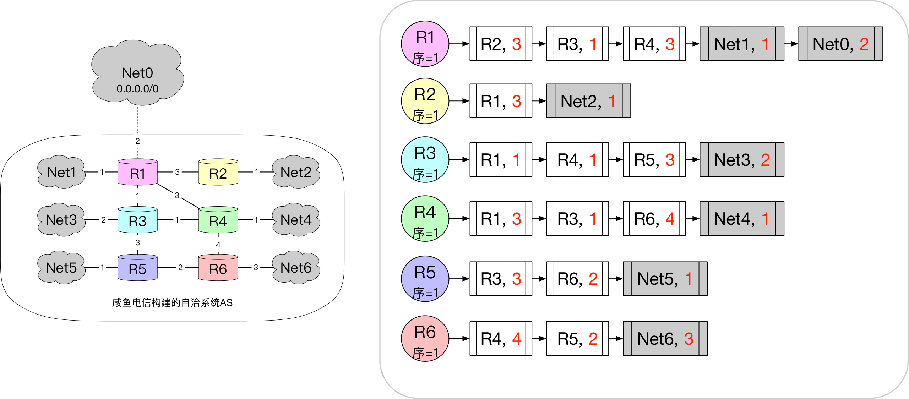

##### OSPF的工作流程

OSPF通过“洪泛法”，让每个路由器都获悉整个网络拓扑结构。一旦路由器探测到新的链路信息，就立即开始洪泛。

1. 路由器将链路信息发送到与之相邻的所有路由器，
2. 相邻路由器会接着转发给与自己相邻的所有路由器，
3. 不可“回流”，转发过的信息不可再转。

#### 边界网关协议 BGP

BGP是一种外部网关协议，用于自治系统之间交换路由信息，实现路由选择。BGP是基于TCP的应用层协议。

其中路由器称为BGP对等方、TCP连接称为BGP会话。跨越自治系统的BGP会话称为eBGP会话，自治系统内部的BGP会话称为iBGP会话。

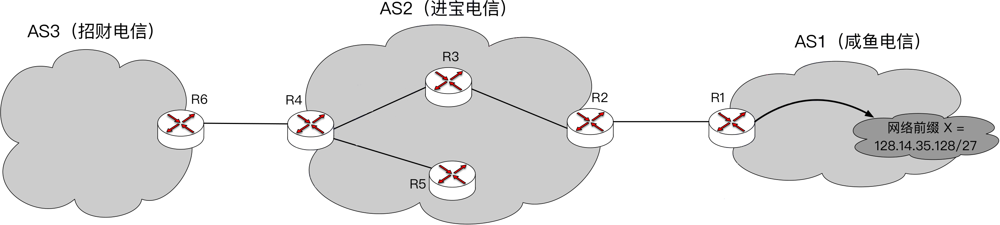

##### BGP的特点

1. BGP力求找到一条较好路由，而不是最佳路由
2. 外部路由选择须考虑政治安全经济因素
3. BGP采用路径向量路由算法，路由器间交换路由信息时，需告知目的地和到达目的地的完整路径，即经过哪些自治系统

##### BGP的路由算法

| 路由因素   | 含义                                                              |
| -------- | ----------------------------------------------------------------- |
| 本地偏好值 | 本地偏好值由AS管理员设置，相当于优先级                                  |
| AS跳数    | AS跳数最少，路由器跳数不一定最少                                       |
| 热土豆路由 | 若有多条AS跳数相同的路线，选择一条离开本自治系统内部最快（内部转发最少）的路径 |
| BGP标识符 | 选择BGP标识符最小的“老员工”路由                                        |

##### BGP的四种报文

| 四种报文             | 内容                                                                                 |
| ------------------- | ----------------------------------------------------------------------------------- |
| Open打开报文         | 具体作用：与BGP邻居建BGP会话，初始化通信<br />发送时机：TCP连接建立成功                       |
| Update更新报文       | 具体作用：通知对方更新或撤销某些路由信息<br />发送时机：路由状态发生变动                        |
| Keepalive保活报文    | 具体作用：通知BGP邻居保持连接<br />发送时机：周期性发送60秒一次，如180秒未收到，说明BGP会话出问题 |
| Notification通知报文 | 具体作用：检测到报文出现错误，通知发送方并关闭BGP会话<br />发送时机：检测到BGP报文出错           |

---
<question>

</question>

---

### 路由器

#### 冲突域和广播域

- 冲突域：连接到同一介质上的节点的集合，集合内节点必须互斥访问，否则会发生冲突。
- 广播域：接收同样广播消息的节点的集合，集合内节点发送广播帧，其他节点都能收到。

> 集线器、中继器等简单复制转发信号的物理层设备所连接的节点属于一个冲突域，也就是说它们不能划分冲突域。
>
> 交换机相连的节点可以收到相互发的广播帧，所以说交换机可以连接广播域。交换机不同端口所连的节点同时发送数据互不影响，所以说交换机分割广播域。
>
> 路由器连接两个网络，节点可以收到自身网络中的广播帧，无法收到另一个网络中的广播帧，所以说路由器隔离广播域。

- 路由器隔开的是广播域
- 交换机隔开的是冲突域

#### 路由器的功能

路由器的任务是连接不同的网络并完成分组转发。

从结构上看，路由器由路由选择和分组转发两部分构成：

- 控制层面：核心是路由选择处理机，任务是根据路由协议构造出路由表，同时定期更新维护路由表。
- 控制层面：交换结构根据转发表对分组进行处理，将某个输入端口进入的分组从一个合适的输出端口转发出去。

---
<question>

</question>

## 第五章 传输层

```c
                         传输层
 +--------+-------------+------------+-------------+
UDP   TCP连接管理   TCP可靠传输   TCP流量控制   TCP拥塞控制
```

- 网络层实现了“主机到主机”的通信，传输层实现了“端到端/进程到进程”的通信。
- IP地址和端口号可以唯一确定一台主机的一个网络进程。

### UDP数据报

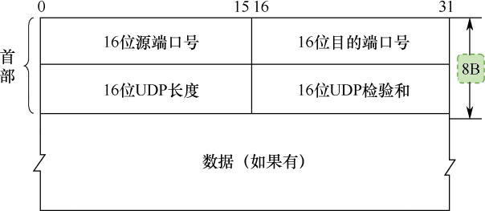

| UDP特点                | TCP特点                       |
| --------------------- | ----------------------------- |
| UDP首部8B              | TCP首部20~60B                 |
| UDP报文不支持拆分        | TCP报文支持拆分                |
| UDP是无连接、不可靠的     | TCP是有连接、可靠的、支持拥塞控制 |
| UDP不支持拥塞控制        | TCP支持拥塞控制                |
| UDP面向数据报           | TCP面向字节流                  |
| UDP支持一对一、一对多传输 | TCP仅支持一对一传输             |

---
<question>

</question>

---

### UDP检验

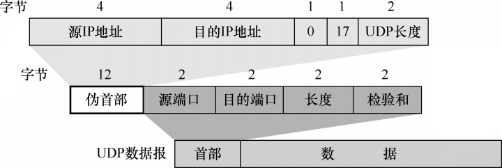

#### 生成UDP报文

1. 先在UDP报文前添加伪首部
2. 再将整体以16位为一组，二进制相加（最高位进位需要“回加”到最低位）
3. 将加法结果按位取反，就得到16位检验和，将其填入UDP首部
4. 再去掉伪首部，就是最终UDP报文

#### 检验UDP报文

1. 先在UDP报文添加伪首部
2. 再将整体以16位为一组，二进制相加（最高位进位需要“回加”到最低位）
3. 若加法结果为全1，说明报文无差错，反之丢弃。

---
<question>

</question>

---

### TCP报文段

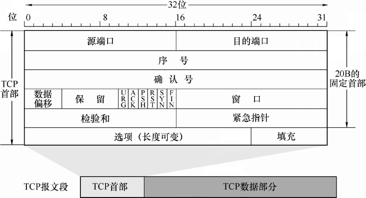

| 字段     | 含义                                                |
| ------- | --------------------------------------------------- |
| 序号     | 标记报文数据在原始字节流中的位置，由发送方设置，不一定从0开始 |
| 确认序号 | 确认序号之前的数据已收到，下次希望接收到从确认序号开始的数据   |
| 数据偏移 | 4位首部长度，以4字节为单位                               |
| 窗口    | 自身接收缓冲区的剩余容量，对方实时调整发送速率               |
| 紧急指针 | 紧急数据在字节流中的位置                                 |
| 选项    | 前两次握手在选项中协商最大段长MSS                         |

| 标志位   | 解释                        |
| ------- | --------------------------- |
| URG     | 表示紧急报文，紧急指针有效      |
| **ACK** | 表示确认报文，确认序号有效      |
| PSH     | 表示催促接收，接收端尽快读取数据 |
| RST     | 表明重置连接，底层会重新建立连接 |
| **SYN** | 表示请求连接，底层会进行三次握手 |
| **FIN** | 表示结束连接，底层会进行四次挥手 |

---
<question>

</question>

---

### TCP连接管理

#### 三次握手

1. 客户端发送SYN报文，请求连接
2. 服务端返回SYN+ACK报文，请求连接并应答
3. 客户端发送ACK报文，应答

> 第三次握手可携带数据

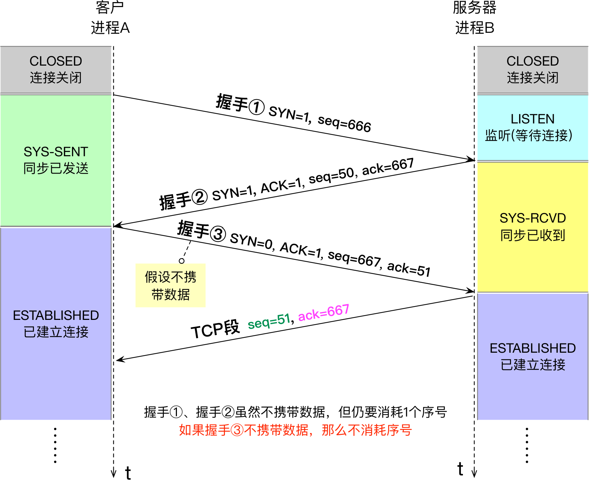

##### 字段分析

- 前两次请求连接的握手中SYN=1，第三次纯应答的握手中SYN=0。
- 前两次请求连接的握手不能携带数据，但仍要消耗一个序号。

##### 耗时分析

- 从第一次握手发出，到客户端进程可以发送数据，需要多久？1RTT
- 从第一次握手发出，到服务器进程可以发送数据，需要多久？1.5RTT

> 客户端收到第二次握手，认为连接建立完成，可发数据。
>
> 服务器收到第三次握手，认为连接建立完成，可发数据。

#### 四次挥手

1. 客户端发送FIN报文，请求关闭连接
2. 服务端返回ACK报文，应答
3. 服务端发送FIN报文，请求关闭连接
4. 客户端返回ACK报文，应答

> 第二次挥手可携带数据，第四次挥手不可携带数据。

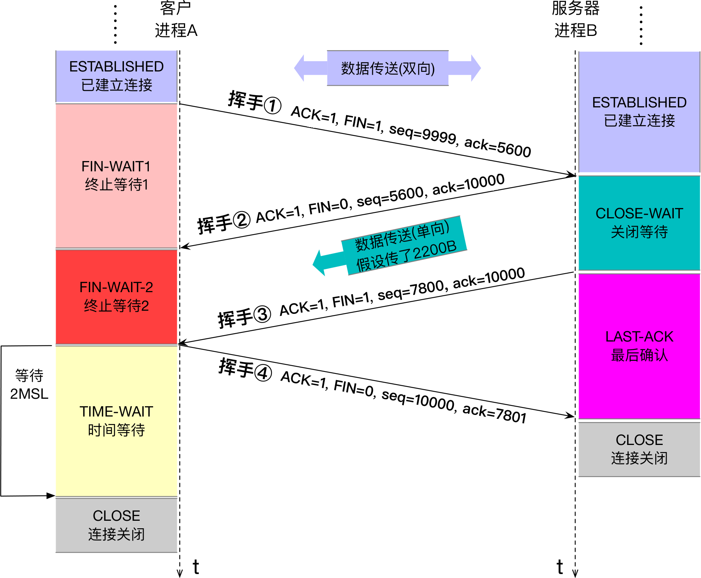

> 等待2MSL最长报文段寿命后，再关闭连接，以免第四次挥手丢失。

##### 字段分析

- 只有请求断开的第一次和第三次挥手中FIN=1。
- 第一次和第三次挥手不能携带数据，但仍要消耗一个序号。

##### 耗时分析

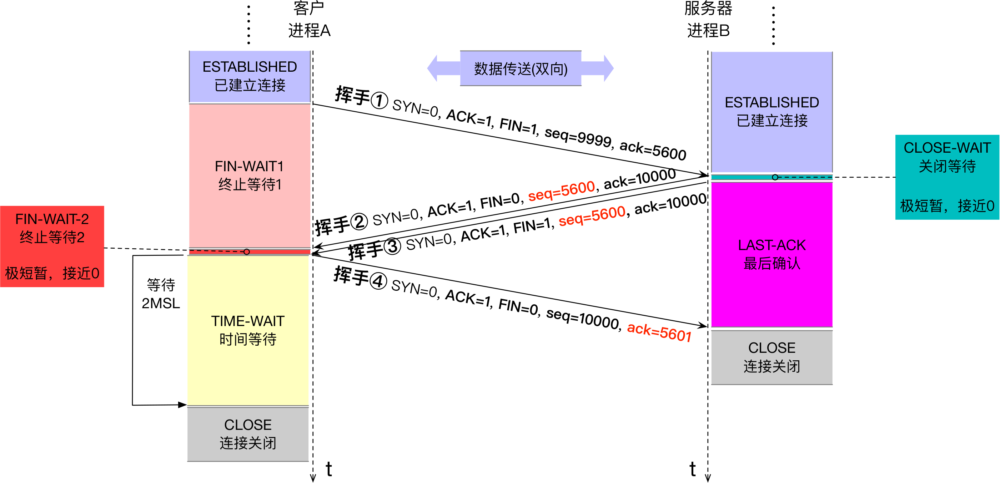

- 从客户发出第一次挥手，到客户进程进入CLOSE状态，需要多久？1RTT+2MSL
- 从客户发出第一次挥手，到服务器进程进程进入CLOSE状态，需要多久？1.5RTT

---
<question>

</question>

---

### TCP可靠传输

| 确认机制 | 含义                                                                           |
| ------- | ----------------------------------------------------------------------------- |
| 累计确认 | 如果ack_seq=n，说明序号n之前的所有字节都已正确接收                                   |
| 延迟确认 | TCP标准规定，推迟时间最多0.5秒，<br/>若连续收到两个长度为最大段长MSS的报段，应立即返回应答 |
| 捎带确认 | 如果需要应答且有数据要发送，立即发送应答报文并带上数据                                 |

| 重传机制 | 含义                                                                                                |
| ------- | -------------------------------------------------------------------------------------------------- |
| 超时重传 | 发送报文时设置计时器，计时器超时未收到应答，则重传报文                                                      |
| 快重传   | 收到报文立即应答，失序报文也要立即应答，失序报文返回的是冗余应答<br/>发送方连续收到三个冗余确认，就立即重传该位置数据 |

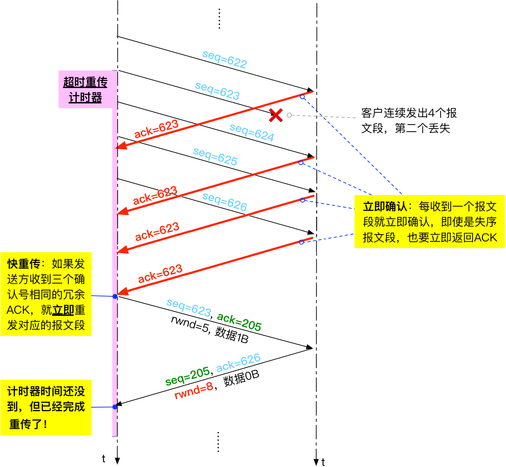

---
<question>

</question>

---

### TCP流量控制

| 窗口机制 | 含义                             |
| ------- | ------------------------------- |
| 接收窗口 | 接收窗口大小受限于接收缓冲区         |
| 发送窗口 | 发送窗口大小受限于发送缓冲区和接收窗口 |

---
<question>

</question>

---

### TCP拥塞控制

发送窗口大小受限于接收窗口和拥塞窗口，拥塞窗口的值的含义为MSS的几倍，考查拥塞窗口时只会立即确认，不会使用延迟确认机制。

#### 慢开始和拥塞避免

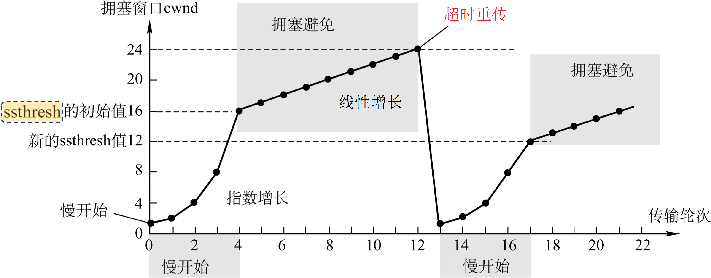

- 初始cwnd=1 ssthresh=16，采用慢开始算法，每一批报文成功发送后，cwnd两倍增长。
- cwnd到达ssthresh时，采用拥塞避免算法，每一批报文成功发送后，cwnd线性增长。
- 一旦发生超时重传，认定网络严重拥塞，ssthresh设为拥塞时 cwnd / 2，cwnd从1重新开始。

> cwnd × 2 > ssthresh 时，将cwnd设为ssthresh。

#### 快恢复算法

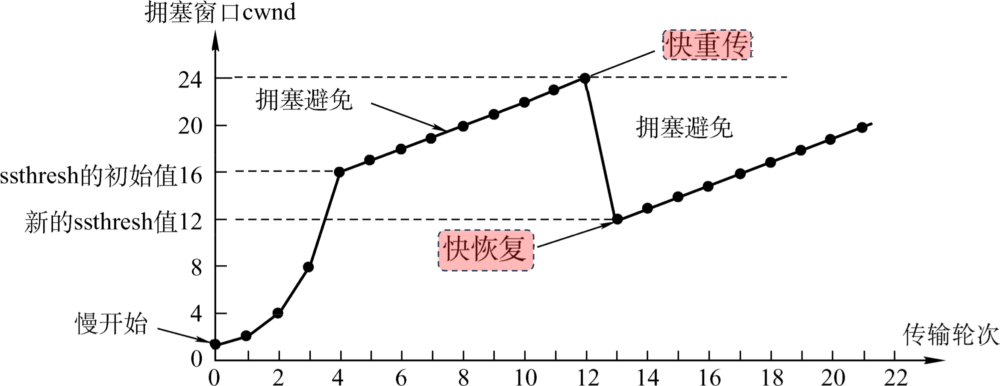

- 起初使用慢开始+拥塞避免算法
- 一旦触发快重传，认定网络轻微拥塞，ssthresh和cwnd都设为拥塞时 cwnd / 2 重新开始。

---
<question>

</question>

## 第六章 应用层

```c
                            应用层
     +-----------+------------+-----------+--------+
网络应用模型   域名系统   文件传输协议   电子邮件   万维网
```

### 网络应用模型

| C/S模型                                  | 含义                                                        |
| --------------------------------------- | ----------------------------------------------------------- |
| 特点                                     | 客户服务器地位不平等，服务器处于中心，客户进程之间不直接通信          |
| 优点                                     | 便于集中管理                                                  |
| 缺点                                     | 服务器损坏影响全局，中心位置的服务器负载大，服务器性能决定了整体性能    |
| **<span style="color:#67676c;">P2P模型</span>** | **<span style="color:#67676c;">含义</span>**                        |
| 特点                                     | “去中心化”，主机与主机之间地位平等，主机与主机之间直接通信            |
| 优点                                     | 单个节点损坏不影响全局，各节点可以分摊负载                          |
| 缺点                                     | 主机被服务也要服务其他主机，单主机负载较大。可能导致流量消耗大、网络拥塞 |

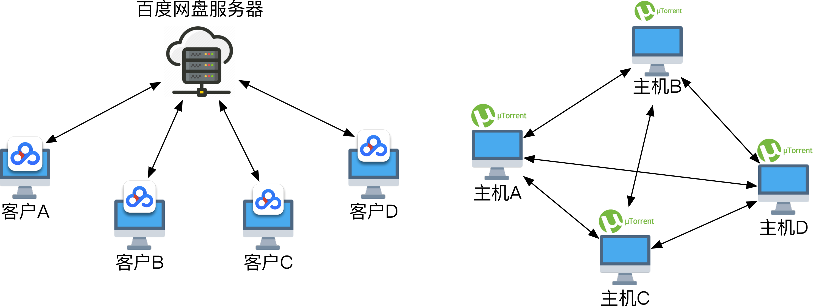

---
<question>

</question>

---

### 域名系统

```
 mail  .  cctv  .  com
三级域名  二级域名  顶级域名
```

| 域名服务器     | 含义                                   |
| ------------ | -------------------------------------- |
| 根域名服务器   | 最高层次的域名服务器，知道顶级域名服务器的地址 |
| 顶级域名服务器 | 负责管理在该顶级域名注册的所有二级域名        |
| 权限域名服务器 | 保存该区中的所有主机的域名到IP地址的映射      |
| 本地域名服务器 | 主机最先询问的是本地域名服务器               |

#### 递归查询DNS

1. 主机向本地服务器询问，
2. 本地服务器向根服务器询问，
3. 根服务器向顶级服务器询问，
4. 顶级服务器向权限服务器询问，
5. 权限域名服务器查询到后逐层返回，最后返回给主机。

> 递归查询会造成根域名服务器负载过大，实际上几乎不用。

#### 迭代查询DNS

1. 主机向本地服务器询问，
2. 本地服务器向根服务器询问，根服务器将顶级服务器的地址告诉本地服务器
3. 本地服务器向顶级服务器询问，顶级服务器将权限服务器的地址告诉本地服务器
4. 本地服务器向权限服务器询问，权限服务器将结果直接给主机。

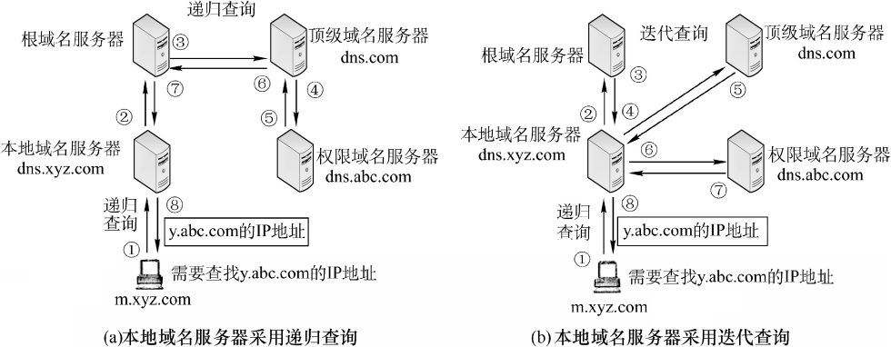

---
<question>

</question>

---

### 文件传输协议

FTP采用C/S应用模型，使用TCP协议。FTP使用两个并行的TCP连接，一个是控制连接端口号21，一个是数据连接端口号20。

#### 控制连接

- 21号端口上的连接称为控制连接，用来传输控制信息。
- 客户发出的请求，通过控制连接发送给控制进程。
- 传输中还可以中途控制，因此控制连接在整个会话期间一直保持打开。

#### 数据连接

- 控制进程接收到传输请求后，就创建“数据传送进程”和“数据连接”。
- 数据传送进程实际完成文件的传送，在传送完毕后关闭“数据传送连接”并结束运行。

数据连接有两种传输模式：主动模式PORT和被动模式PASV。

- 主动模式：客户端开放一个端口，发送命令到服务器，服务器通过20端口向开放端口通信。
- 被动模式：客户端发送命令到服务器，服务器开放一个端口，客户端连接到该端口通信。

主动模式是服务器连接到客户端的端口，被动模式是客户端连接到服务器的端口。

---
<question>

</question>

---

### 电子邮件

#### 邮件发送和读取协议

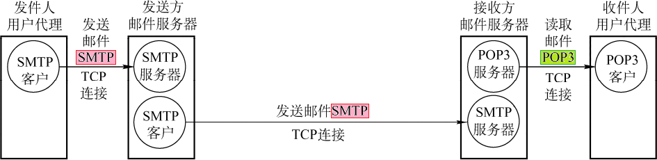

| 协议        | 含义                                          |
| ---------- | --------------------------------------------  |
| 邮件发送协议 | 用于**用户代理向服务器或服务器之间**发送邮件，如SMTP |
| 邮件读取协议 | 用于用户代理从服务器读取邮件，如POP3               |

#### 多用途因特网邮件扩展 MIME

SMTP只能传送ASCII码文本，故提出多用途因特网邮件扩展MIME。

若邮件中存在非ASCII码数据，要通过MIME将其转换为ASCII码数据。发送时要转换，接收时要逆转换。

#### SMTP和POP3的特点

- SMTP用于发送邮件，C/S模型，基于TCP，端口号25。
- POP3用于读取邮件，C/S模型，基于TCP，端口号110。

---

- SMTP是推Push，SMTP将邮件推送到SMTP服务器。
- POP3是拉Pull，POP3从POP3服务器上拉取邮件。

---

- SMTP通信三个阶段：连接建立、邮件传送、连接释放。
- POP3读取邮件时，支持“下载并删除”、“下载并保留”两种功能。

---
<question>

</question>

---

### 万维网

#### HTTP协议特点

HTTP使用TCP作为传输层协议，但HTTP本身是无连接、无状态的。实际应用中，常用Cookie跟踪用户活动。

Cookie的工作原理：

1. 用户初次浏览网站时，网站就为用户产生一个唯一的Cookie识别码，并以此为索引在数据库中记录用户信息。
2. 之后响应报文中添加一个首部行“Setcookie:xxxx-xxxx”，浏览器会将网站信息记录到本地。
3. 之后请求报文中就多一个首部行“Cookie:xxxx-xxxx”，服务器根据Cookie识别码就能从数据库中查询到该用户的活动记录。

#### HTTP1.0请求时间分析

非持续连接：每个网页元素对象的传输都需要单独建立一个TCP连接。

对于持续连接：是指服务器响应后仍然保持这条连接，使客户和服务器可以继续在这条TCP连接上传送后续的请求和响应。

请求一个文档所需时间是该文档的传输时间加上两倍RTT。为了减小时延，浏览器通常会建立多个并行的TCP连接以同时请求多个对象。

#### HTTP1.1请求时间分析

HTTP1.1默认使用持续连接。持续连接又分为流水线和非流水线两种工作方式。

非流水线在收到响应后才能发起请求，TCP连接利用率不高，浪费服务器资源。

流水线可以连续发出多个请求，服务器可并行处理。若所有报文都是连续发送的，共计1RTT延迟。提高TCP连接利用率。

#### HTTP的报文结构

<div style="display: flex; gap: 5px; align-items: center; justify-content: center;">
  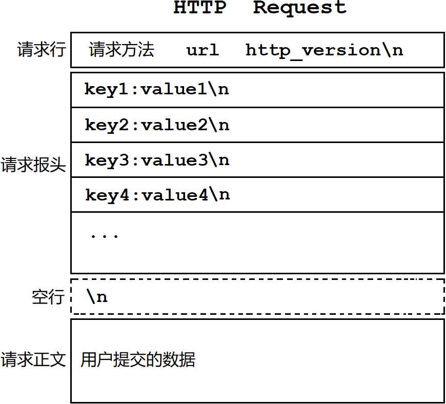
  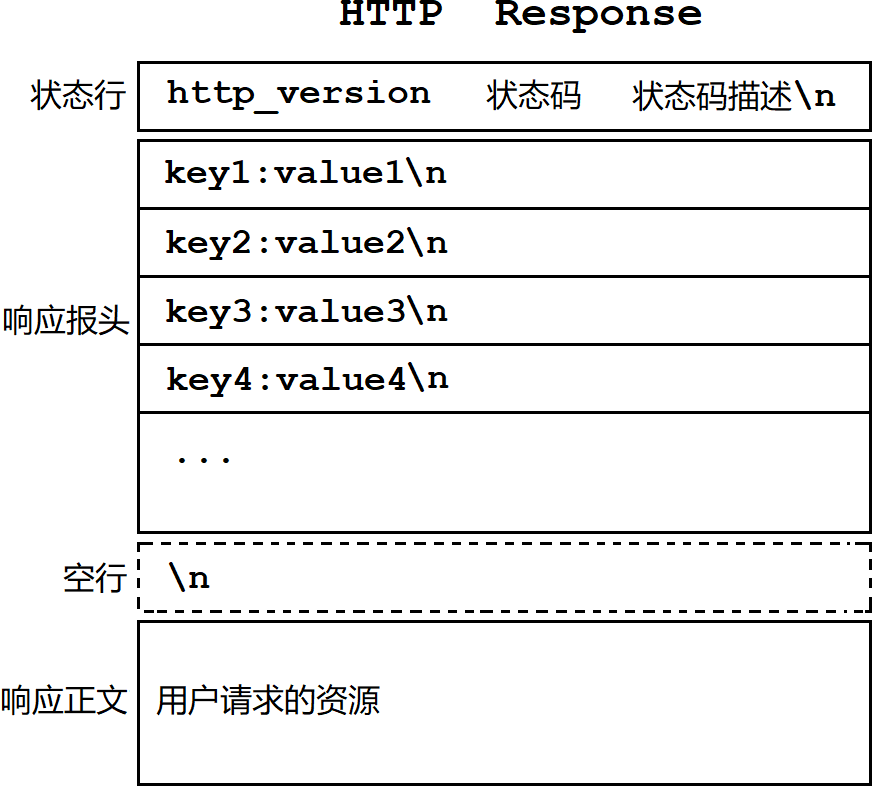
</div>

| 方法     | 说明          |
| ------- | ------------- |
| GET     | 请求资源       |
| HEAD    | 请求资源的首部  |
| POST    | 传输实体资源    |
| PUT     | 传输文件       |
| DELETE  | 删除文件       |
| CONNECT | 用于代理服务器  |

---
<question>

</question>

---
