# 计算机网络

## 第一章 计算机网络基础

### 三种交换方式

**电路交换**：即传统电话网，通信双方必须存在真实线路。电路交换分三步：建立连接、传输数据和释放连接。

**报文交换**：将数据加上源目的地址等信息封装成报文，报文在中间设备中存储转发到下一节点，最终到达目的地。

**分组交换**：和报文交换一致，但会将报文分组，以分组为单位进行存储转发。可能出现失序、丢失、重复的情况

> 分组交换中使用虚电路可解决失序问题。虚电路即建立连接时确认一条固定的转发线路，可看成虚拟的电路。

  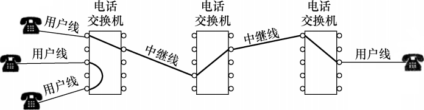
  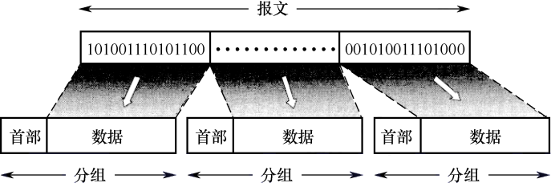

<table>
  <thead>
    <tr>
      <th style="text-align: center;" colspan="2">电路交换</th>
      <th style="text-align: center;" colspan="2">报文交换</th>
      <th style="text-align: center;" colspan="2">分组交换</th>
    </tr>
    <tr>
      <th style="text-align: center;">优点</th>
      <th style="text-align: center;">缺点</th>
      <th style="text-align: center;">优点</th>
      <th style="text-align: center;">缺点</th>
      <th style="text-align: center;">优点</th>
      <th style="text-align: center;">缺点</th>
    </tr>
  </thead>
  <tbody>
    <tr>
      <td>通信时延小</td>
      <td>建立时间长</td>
      <td>无建立时延</td>
      <td>转发时延高</td>
      <td>转发时延低</td>
      <td>仍有存转时延</td>
    </tr>
    <tr>
      <td>有序传输</td>
      <td>线路利用率低</td>
      <td>线路利用率高</td>
      <td>缓存开销大</td>
      <td>缓存开销小</td>
      <td>额外信息量多</td>
    </tr>
    <tr>
      <td>没有冲突</td>
      <td>线路灵活性差</td>
      <td>线路分配灵活</td>
      <td>错误处理低效</td>
      <td>错误处理高效</td>
      <td>失序丢失重复</td>
    </tr>
    <tr>
      <td>实时性强</td>
      <td>难以差错控制</td>
      <td>支持差错控制</td>
      <td></td>
      <td></td>
      <td></td>
    </tr>
  </tbody>
</table>

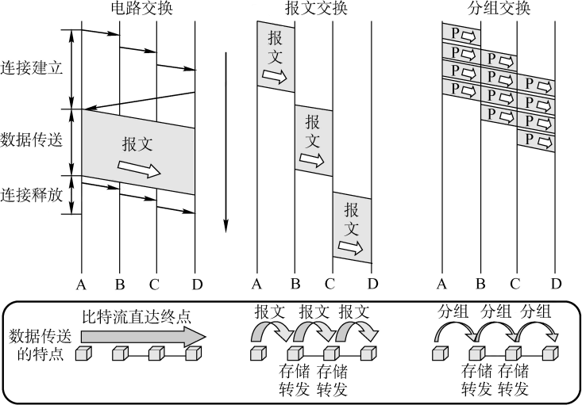

### 网络的性能指标

| 指标            | 含义                                                     |
| --------------- | -------------------------------------------------------- |
| **发送时延**    | 发送第一个比特到最后一个比特发完所需的时间，也叫传输时延 |
| **传播时延**    | 信道中传播一定距离所需的时间，和数据长度无关             |
| 处理时延        | 分组在节点的处理时间，通常忽略                           |
| 排队时延        | 分组在节点中等待转发的时间，通常忽略                     |
| 时延带宽积      | 带宽和传播时延之积，相当于能有多少比特同时移动           |
| **往返时间RTT** | A发数据到B的传播时延 + B发确认到A的传播时延              |
| 信道利用率      | 有数据通过的时间 / 总时间                                |

### 网络模型

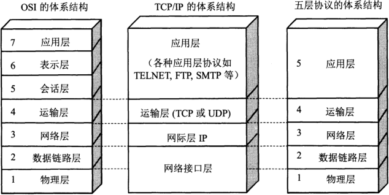

| 层次       | 功能                                             | 设备           |
| ---------- | ------------------------------------------------ | -------------- |
| 应用层     | 实现具体功能                                     |                |
| 表示层     | 数据格式转换                                     |                |
| 会话层     | 会话管理                                         |                |
| 传输层     | 复用分用、差错控制、流量控制、连接管理、可靠传输 |                |
| 网络层     | 路由选择、分组转发、拥塞控制、网际互联           | 路由器         |
| 数据链路层 | 差错控制、流量控制                               | 交换机         |
| 物理层     | 定义电路接口参数、信号含义、电气特性             | 中继器、集线器 |

> TCP/IP 模型的网络接口层，只要求实现网络层所需功能（传输分组），具体内容不做规定。

## 第二章 物理层

### 物理层接口特性

| 特性     | 含义                                                         |
| -------- | ------------------------------------------------------------ |
| 机械特性 | 指明接口所用接线器的形状、尺寸、引脚数目和排列、规定和锁定装置 |
| 电气特性 | 指明在接口电缆的各条线上出现的电压的**范围**                 |
| 功能特性 | 指明某条线上出现的某一电平的电压的**意义**                   |
| 过程特性 | 指明对于不同功能的各种可能事件的出现顺序                     |

### 通信指标计算

#### 码元

- 一个固定时长的信号波就是一个码元。该时长称为码元宽度/信号周期。
- 若信号波可能出现4种信号，则称其为4进制码元，即码元一次携带2位二进制数据。
- 一个 $K$ 进制码元携带的比特数为 $log_2K$。

#### 传输速率

| 两种传输速率          | 含义                 | 单位                     |
| --------------------- | -------------------- | ------------------------ |
| 码元传输速率 / 波特率 | 每秒传输几个码元     | 码元/秒、波特 Baud       |
| 信息传输速率 / 比特率 | 每秒传输几个二进制位 | 比特/秒、bit/s、bps、b/s |

#### 奈氏准则（理想低通信道）

$$
\begin{aligned}
&\text{极限波特率} = 2W \\[4pt]
&\text{极限比特率} = 2W \log K
\end{aligned}
\quad
\text{, W 是信道的频率带宽}
$$

奈奎斯特定理说明：

- 波特率太高，会造成“码间串扰”，即接收方无法识别码元。
- 带宽越大，信道传输码元的能力越强
- 奈奎斯特定理没有解释一个码元最多可以携带多少比特。

#### 香农定理（有噪声低通信道）

$$
\text{极限比特率} = W \log_2 ( 1 + \frac{S}{N} )
$$

$$
\begin{aligned}
&\text{信噪比标准形式:}\quad\frac{S}{N}=\frac{信号功率}{噪声功率}\quad\text{, 单位无} \\
&\text{信噪比分贝形式:}\quad\text{信噪比}=10\log_{10}\frac{S}{N}\quad\text{, 单位 dB}
\end{aligned}
$$

香农定理说明：

- 提高信道带宽、加强信号功率、降低噪声功率，都可以提高信道的极限比特率
- 在带宽信噪比确定的信道上，波特率和比特率都有极限，故一个码元携带的比特数有上限。

### 编码与调制

#### 编码（二进制数据到数字信号）

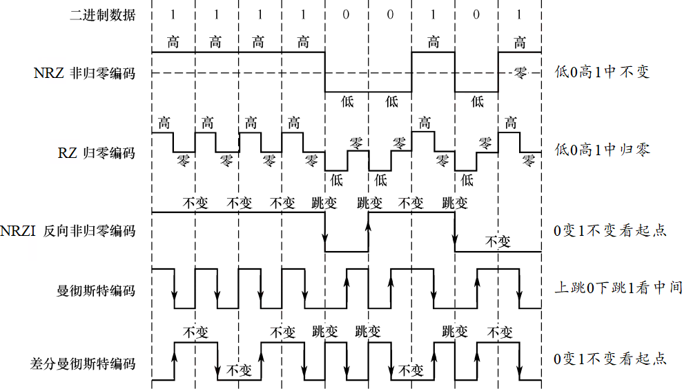

> 以太网默认使用曼彻斯特编码方式。

#### 调制（二进制数据到模拟信号）

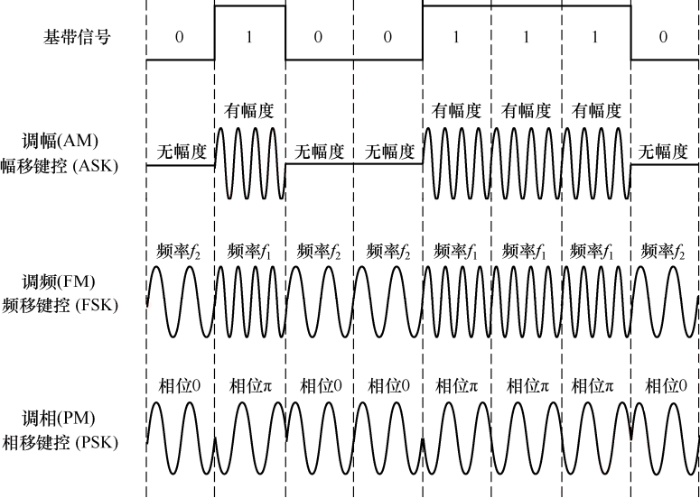

- 正交幅度调制QAM：将调幅AM和调相PM叠加。
- 若有m种赋值、n种相位，则可调制出mn种信号，一个码元可携带logmn个比特。

| QAM方案 | 信号数          | 比特数                 |
| ------- | --------------- | ---------------------- |
| QAM-16  | 调制出16种信号  | 一个码元可携带4bit数据 |
| QAM-32  | 调制出32种信号  | 一个码元可携带5bit数据 |
| QAM-64  | 调制出64种信号  | 一个码元可携带6bit数据 |
| QAM-128 | 调制出128种信号 | 一个码元可携带7bit数据 |

### 物理层设备

#### 中继器

中继器的主要功能是整形、放大、转发信号。消除信号经过长段电缆产生的失真和衰减，让信号的波形和强度达到所需的要求。

#### 集线器

集线器Hub一个端口收到数据后，会转发给其余所有端。若同时有多个端输入，则发生冲突它会让这些数据都失效。

- 冲突：多个设备同时在同一传输介质上发送数据时，数据会碰撞导致失效。
- 冲突域：如果多个设备同时发送会导致数据冲突，则它们所在范围就是一个冲突域。相当于是数据发送的“临界区”。

集线器无法分割冲突域，所以集线器端口所连的所有设备同属于一个冲突域。

## 第三章 数据链路层

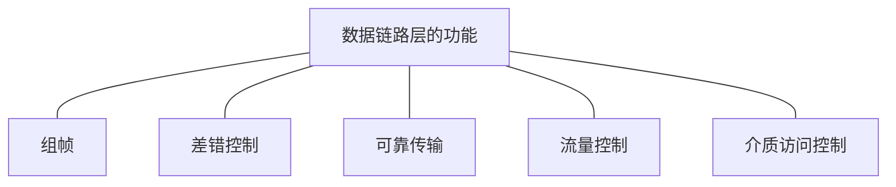

### 封装成帧（组帧）

组帧所要解决的问题：

- 帧定界：确定帧的边界
- 透明传输：去除边界信息还原数据原貌

| 组帧的方法       | 内容                                                         |
| ---------------- | ------------------------------------------------------------ |
| 字符计数法       | 帧首添加一个字节保存帧长，出错导致后续所有帧无法定界         |
| 字节填充法       | 首尾添加控制字符SOH和EOT，中间添加转义字符ESC避免歧义        |
| **零比特填充法** | 特殊字节01111110标记帧首尾。发送方遇连续5个1添加一个0，接收方要去掉。 |
| **违规编码法**   | 使用违规信号标记帧首尾，需要物理层配合。                     |

> HDLC协议和PPP协议就使用零比特填充法。

  
  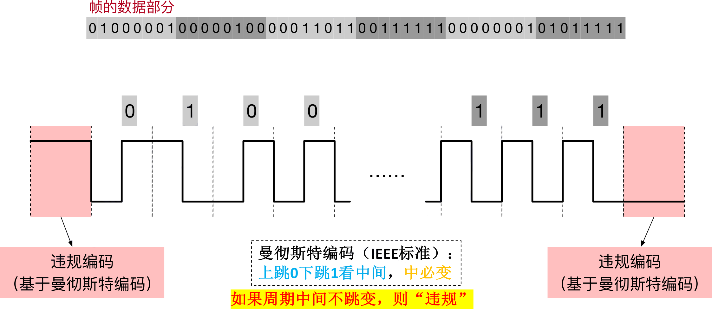  

### 差错控制

- 差错控制目标：发现并解决帧内部的“位错”
- 解决方案一：接收方丢弃帧，通知发送方重传帧。检错编码：奇偶校验码、CRC校验码
- 解决方案二：接收方纠正位错。纠错编码：海明校验码

#### 奇偶校验码

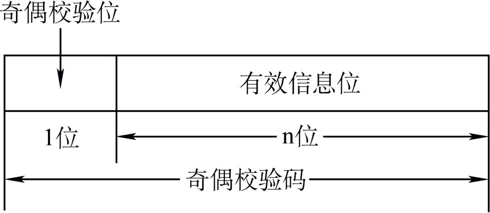

- 奇校验：整体有奇数个“1”
- 偶校验：整体有偶数个“1”
- 奇偶校验码仅能检测奇数个位出错，无纠错能力。

#### 循环冗余码（CRC校验码）

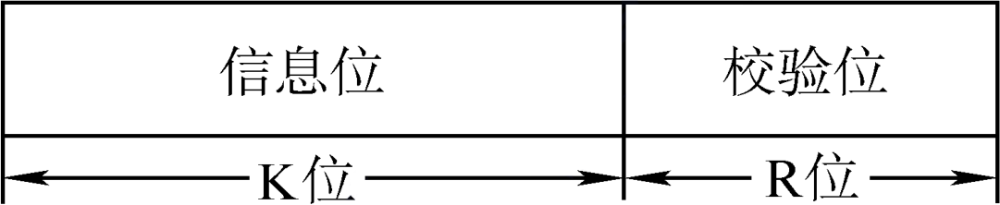

举例：生成多项式$G(x)=x^3+x^2+1$，信息码$101001$，求CRC校验码。

| 求校验码步骤                          | 举例                    |
| ------------------------------------- | ----------------------- |
| R = 生成多项式的次数                  | R=3                     |
| 除数 = 生成多项式的系数               | 除数=1101               |
| 被除数 = 信息位左移R位                | 被除数=101001 000       |
| 进行模2除运算，得余数即校验位         | 余数=001                |
| **进行校验步骤**                      |                         |
| 信息位+校验位 模2除 除数，结果为0正确 | 101001 001 % 1101 = 000 |

##### 模2除运算

1. 最高位为1则商1，为0商0
2. 抛去最高位，后多位进行异或，异或完下一位下来。

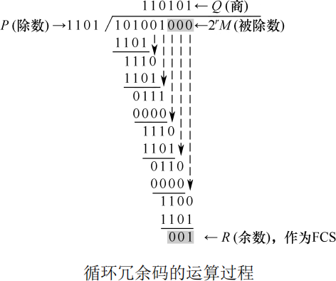

#### 海明校验码

- 假设m位校验位、n位信息位
- m位校验位可表示$2^m$种情况，m+n位数据共有m+n种单位错误可能，还有一种正确情况
- 故要求 $2^m≥m+n+1$

### 流量控制和可靠传输

> 做到流量控制和可靠传输，需要实现滑动窗口机制、确认机制、重传机制、帧编号。下面三种协议分别是三种具体实现。
>
> - 接收方可通过接受窗口控制发送方发送速度，这就是流量控制。
> - 确认机制和重传机制可保证可靠传输。

#### 停止等待协议 SW

| 机制     | 内容                                                |
| -------- | --------------------------------------------------- |
| 滑动窗口 | 发送窗口 WT=1，接收窗口 WR=1  |
| 确认机制 | 逐帧确认：收到 i 号帧，需要返回 ACKi     |
| 重传机制 | 超时重传：超时未收到 ACKi，则重传 i 号帧 |
| 帧编号   | 仅需1bit                                            |

#### 后退N帧协议 GBN

| 机制     | 内容                                                         |
| -------- | ------------------------------------------------------------ |
| 滑动窗口 | WT>1 WR=1                              |
| 确认机制 | **累积确认**：ACKi 表示确认 i 号帧及其之前所有帧 **主动丢弃**：收到接收窗口之外或出错的帧，会返回最后收到的帧的ACK |
| 重传机制 | **超时重传**：超时未收到 ACKi，则重传 i 号帧及其之后所有帧 |
| 帧编号   | 需nbit，要求 $W_T+W_R≤2^n$                                   |

> 若接受速度慢或信道误码率高，导致发送方经常需要“后退”，传输效率低。

#### 选择重传协议 SR

| 机制     | 内容                                                         |
| -------- | ------------------------------------------------------------ |
| 滑动窗口 | WT>1 WR>1                              |
| 确认机制 | **逐帧确认**：收到 i 号帧，必须返回 ACKi，不支持累计确认 **请求重传**：若帧出错，丢弃并返回否认帧NAKi |
| 重传机制 | **超时重传**：超时未收到 ACKi，则重传 i 号帧      |
| 帧编号   | 需nbit，要求 $W_R≤W_T$                                       |

### 三种协议的信道利用率

### 介质访问控制

> 多个节点共享一个信道时，可能发生冲突，因此需要介质访问控制。有如下几种方法。
>
> - 信道划分：时分复用、频分复用、波分复用、码分复用。
> - 随机访问：ALOHA协议、CSMA协议、CSMA/CD协议、CSMA/CA协议。
> - 轮询访问：令牌传递协议。

#### 信道划分

| 码分复用CDMA                                           | 步骤                               |
| ------------------------------------------------------ | ---------------------------------- |
| 每个节点拥有专属的码片序列                             | (1,-1,1,-1)表示1，(-1,1,-1,1)表示0 |
| 同时接受的数据，信号值会叠加                           | (1,-1,1,-1)+(1,1,-1,-1)=(2,0,0,-2) |
| 分离单个节点的发送内容，就将结果和码片序列作单位化内积 | ¼·(1,-1,1,-1)·(2,0,0,-2)=1         |

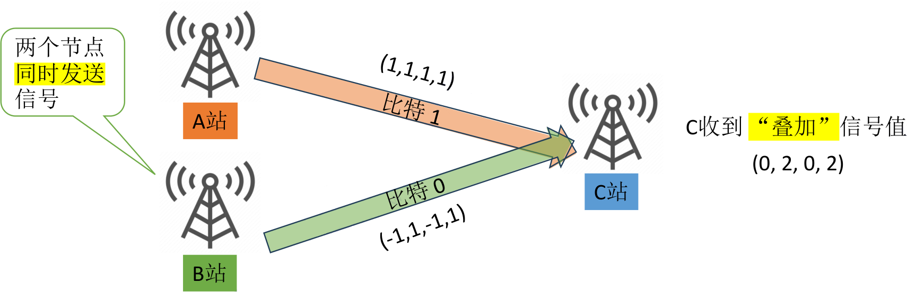

#### 随机访问 CSMA/CD 载波监听多路访问/冲突检测

> CSMA/CD 载波监听多路访问/冲突检测，适用于早期的总线型的有线以太网。

先听后发，边听边发，冲突停发，随机重发。

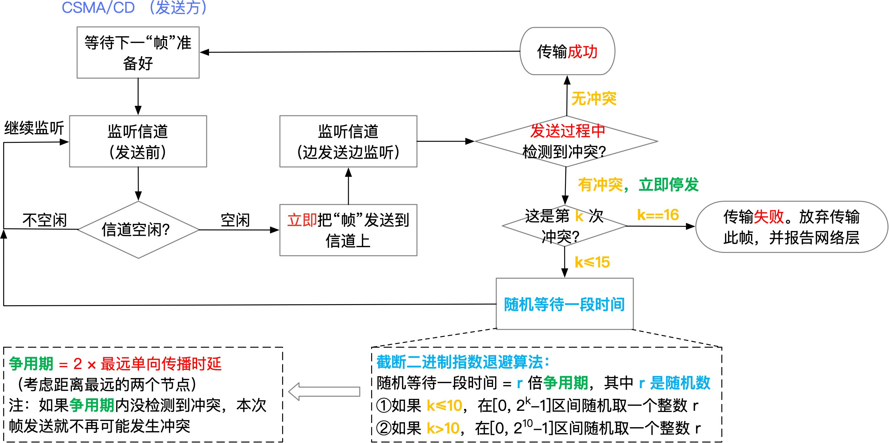

#### 随机访问 CSMA/CA协议

> CSMA/CA 载波监听多路访问/冲突避免，适用于IEEE 802.11 无线局域网 WiFi。

先听后发，忙则退避。

### 局域网和广域网

#### 局域网 以太网 802.3

#### 无线局域网 WiFi 802.11

#### 虚拟局域网 802.1Q

#### 广域网 PPP

### 数据链路层设备

#### 以太网交换机

## 第四章 网络层

### IPv4

### IPv6

### 路由算法与路由协议

### IP多播

### 移动IP

### 网络层设备

## 第五章 传输层

### UDP

### TCP

## 第六章 应用层

### 网络应用模型

### 域名系统

### 文件传输协议

### 电子邮件

### 万维网
