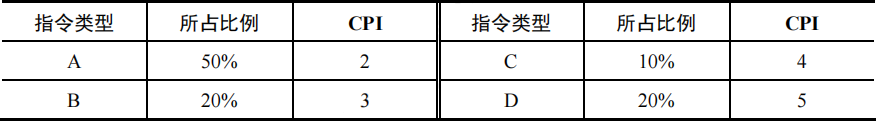
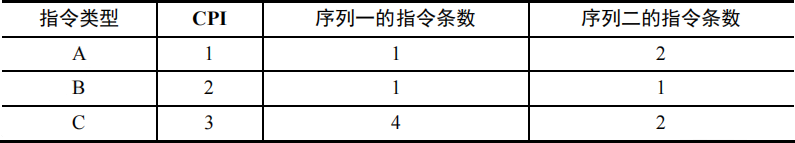
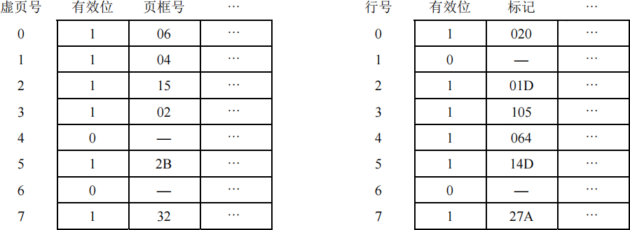
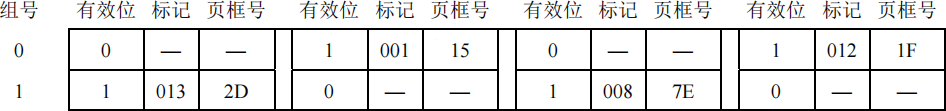
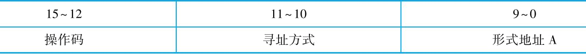

# 计组基础题型

## 第一章 计算机系统概述

#### 题型一：冯诺依曼机特点

<question>

1\. 冯诺依曼机工作方式的基本特点是 (&emsp;)。

<options :options="['A. 程序一边被输入计算机一边被执行']" />
<options :options="['B. 程序直接从磁盘读到CPU执行']" />
<options :options="['C. 按地址访问指令并自动按序执行程序']" />
<options :options="['D. 程序自动执行而数据手工输入']" />

::: analysis
答案：C。
:::

2\. (2019) 下列关于冯·诺依曼机基本思想的叙述中，错误的是 (&emsp;)。

<options :options="['A. 程序的功能都通过中央处理器执行指令实现']" />
<options :options="['B. 指令和数据都用二进制数表示，形式上无差别']" />
<options :options="['C. 指令按地址访问，数据都在指令中直接给出']" />
<options :options="['D. 程序执行前，指令和数据需预先存放在存储器中']" />

::: analysis
答案：C。
:::

</question>

#### 题型二：高级语言、机器语言、汇编语言

<question>

3\. 只有当程序执行时才将源程序翻译成机器语言，并且一次只能翻译一行语句，边翻译边执行的是 (&emsp;) 程序，把汇编语言源程序转换为机器语言程序的过程是 (&emsp;)。

<options :options="['Ⅰ. 编译&emsp;Ⅱ. 目标&emsp;Ⅲ. 汇编&emsp;Ⅳ. 解释']" /> 

<options :options="['A. Ⅰ、Ⅱ', 'B. Ⅳ、Ⅱ', 'C. Ⅳ、Ⅰ', 'D. Ⅳ、Ⅲ']" />

::: analysis
答案：D。
:::

4\. (2015) 计算机硬件能够直接执行的是 (&emsp;)。

<options :options="['Ⅰ. 机器语言程序&emsp;Ⅱ. 汇编语言程序&emsp;Ⅲ. 硬件描述语言程序']" /> 

<options :options="['A. 仅I', 'B. 仅Ⅰ、Ⅱ', 'C. 仅Ⅰ、Ⅲ', 'D. Ⅰ、Ⅱ、Ⅲ']" />

::: analysis
答案：A。
:::

5\. (2016) 将高级语言源程序转换为机器级目标代码文件的程序是 (&emsp;)。

<options :options="['A. 汇编程序', 'B. 链接程序', 'C. 编译程序', 'D. 解释程序']" />

::: analysis
答案：C。
:::

6\. (2022) 将高级语言源程序转换为可执行目标文件的主要过程是 (&emsp;)。

<options :options="['A. 预处理→编译→汇编→链接']" />
<options :options="['B. 预处理→汇编→编译→链接']" />
<options :options="['C. 预处理→编译→链接→汇编']" />
<options :options="['D. 预处理→汇编→链接→编译']" />

::: analysis
答案：A。
:::

</question>

#### 题型三：计算机性能指标（基本概念对比）

<question>

7\. 关于CPU主频、CPI、MIPS、MFLOPS，说法正确的是 (&emsp;)。

<options :options="['A. CPU主频是指CPU执行指令的频率，CPI是执行一条指令平均使用的频率']" />
<options :options="['B. CPI是执行一条指令平均使用CPU时钟的个数，MIPS描述一条CPU指令平均使用的CPU时钟周期数']"/>
<options :options="['C. MIPS是描述CPU执行指令的频率，MFLOPS是计算机系统的浮点数指令']" />
<options :options="['D. CPU主频是CPU使用的时钟频率，CPI是执行一条指令平均使用的CPU时钟周期数']" />

::: analysis
答案：D。
:::

8\. 下列可用于评价计算机系统性能的指标是 (&emsp;)。

<options :options="['Ⅰ. MIPS&emsp;Ⅱ. IPC&emsp;Ⅲ. CPI&emsp;Ⅳ. 字长']" /> 

<options :options="['A. Ⅰ、Ⅲ', 'B. Ⅰ、Ⅲ和Ⅳ', 'C. Ⅰ、Ⅱ和Ⅲ', 'D. 全部']" />

::: analysis
答案：C。
:::

9\. 在用于科学计算的计算机中，标志系统性能的最有用的参数是 (&emsp;)。

<options :options="['A. 主时钟频率', 'B. 主存容量', 'C. MFLOPS', 'D. MIPS']" />

::: analysis
答案：C。
:::

</question>

#### 题型四：计算机性能指标（三大字长）

<question>

10\. 下列描述中，16位CPU的含义不包含的是 (&emsp;)。

<options :options="['A. CPU的寄存器位数是16位']" />
<options :options="['B. 存储器单元是16位']" />
<options :options="['C. 1次处理16位数运算']" />
<options :options="['D. CPU内部传输线是16位']" />

::: analysis
答案：B。
:::

11\. 计算机的机器字长与下列 (&emsp;) 指标最密切相关。

<options :options="['A. 运算速度', 'B. 存取速度', 'C. 内存容量', 'D. 运算精度']" />

::: analysis
答案：D。
:::

</question>

#### 题型五：计算机性能指标（基本存储器性能指标）

<question>

12\. 某16位CPU要求存储单元按照字节编址，该CPU的地址线为20根。则该CPU连接的存储器容量是 (&emsp;)。

<options :options="['A. 1M×8', 'B. 65536×8', 'C. 1M×16', 'D. 65536×16']" />

::: analysis
答案：A。
:::

13\. 某CPU内部的MAR寄存器的位数为10，它输出10位地址信息。它的MDR是16位，对外数据线有16根。则该CPU可以直接访问的存储器的地址空间是 (&emsp;)。

<options :options="['A. 1024', 'B. 2048', 'C. 65536', 'D. 131072']" />

::: analysis
答案：A。
:::

</question>

#### 题型六：计算机性能指标（程序执行时间计算）

<question>

14\. (2010) 下列选项中，能缩短程序执行时间的措施是 (&emsp;)。

<options :options="['Ⅰ. 提高CPU时钟频率&emsp;Ⅱ. 优化数据通路结构&emsp;Ⅲ. 对程序进行编译优化']" /> 

<options :options="['A. 仅Ⅰ和Ⅱ', 'B. 仅Ⅰ和Ⅲ', 'C. 仅Ⅱ和Ⅲ', 'D. Ⅰ、Ⅱ、Ⅲ']" />

::: analysis
答案：D。
:::

15\. (2012) 假定基准程序A在某计算机上的运行时间为100s，其中90s为CPU时间，其余为I/O时间。若CPU速度提高50%，I/O速度不变，则运行基准程序A所耗费的时间是 (&emsp;)。

<options :options="['A. 55s', 'B. 60s', 'C. 65s', 'D. 70s']" />

::: analysis
答案：D。
:::

16\. (2014) 程序P在机器M上的执行时间是20s，编译优化后，P执行的指令数减少到原来的70%，而CPI增加到原来的1.2倍，则P在M上的执行时间是 (&emsp;)。

<options :options="['A. 8.4s', 'B. 11.7s', 'C. 14s', 'D. 16.8s']" />

::: analysis
答案：D。
:::

17\. 某计算机主频为2.0GHz。程序P1的指令条数为5.0×109，平均CPI为1.6；程序P2的指令条数为3.0×109，平均CPI为2.2。若P1和P2在该计算机上顺序执行，则总CPU时间约为 (&emsp;)。

<options :options="['A. 6.10s', 'B. 6.55s', 'C. 7.30s', 'D. 8.05s']" />

::: analysis
答案：C。
:::

18\. 在计算机M1和计算机M2上分别运行功能完全相同的高级语言程序，程序在M1和M2上的平均CPI相等，则对于该类程序而言 (&emsp;)。

<options :options="['A. M1和M2执行速度相等']" />
<options :options="['B. M1和M2中主频高的计算机执行速度快']" />
<options :options="['C. M1和M2中主频低的计算机执行速度快']" />
<options :options="['D. 无法确定哪台机器的执行速度快']" />

::: analysis
答案：B。
:::

19\. (2017) 假定计算机M1和M2具有相同的指令集体系结构(ISA)，主频分别为1.5GHz和1.2GHz。在M1和M2上运行某基准程序P，平均CPI分别为2和1，则程序P在M1和M2上运行时间的比值是 (&emsp;)。

<options :options="['A. 0.4', 'B. 0.625', 'C. 1.6', 'D. 2.5']" />

::: analysis
答案：C。
:::

20\. (2022) 某计算机主频为1GHz，程序P运行过程中，共执行了10000条指令，其中，80%的指令执行平均需1个时钟周期，20%的指令执行平均需10个时钟周期。程序P的平均CPI和CPU执行时间分别是 (&emsp;)。

<options :options="['A. 2.8,28μs', 'B. 28,28μs', 'C. 2.8,28ms', 'D. 28,28ms']" />

::: analysis
答案：A。
:::

8\. 机器A的主频为800MHz，某程序在机器A上运行需要12s。现在硬件设计人员想设计机器B，希望该程序在机器B上的运行时间能缩短为8s，使用新技术后可使机器B的主频大幅度提高，但在机器B上运行该程序所需的时钟周期数为在机器A上的1.5倍，则机器B的主频至少应为 (&emsp;)。

<options :options="['A. 800MHz', 'B. 1.2GHz', 'C. 1.5GHz', 'D. 1.8GHz']" />

::: analysis
答案：D。
:::

</question>

#### 题型七：计算机性能指标（FLOPS计算）

<question>

21\. (2011) 下列选项中，描述浮点数操作速度指标的是 (&emsp;)。

<options :options="['A. MIPS', 'B. CPI', 'C. IPC', 'D. MFLOPS']" />

::: analysis
答案：D。
:::

22\. (2021) 2017年公布的全球超级计算机TOP 500排名中，我国“神威·太湖之光”超级计算机蝉联第一，其浮点运算速度为93.0146 PFLOPS，说明该计算机每秒完成的浮点操作次数约为 (&emsp;)。

<options :options="['A. 9.3×10¹³次', 'B. 9.3×10¹⁵次', 'C. 9.3千万亿次', 'D. 9.3亿亿次']" />

::: analysis
答案：D。
:::

</question>

#### 题型八：计算机性能指标（IPS计算）

<question>

23\. 某计算机主频为1.2GHz，其指令分为4类，它们在基准程序中所占比例及CPI如下表所示。该机的MIPS数是 (&emsp;)。

<options :options="['A. 100', 'B. 200', 'C. 400', 'D. 600']" />

::: analysis
答案：B。
:::

24\. (2023) 若机器M的主频为1.5GHz，在M上执行程序P的指令条数为5×10⁵，P的平均CPI为1.2，则P在M上的指令执行速度和用户CPU时间分别为 (&emsp;)。

<options :options="['A. 0.8GIPS，0.4ms', 'B. 0.8GIPS，0.4μs']" />
<options :options="['C. 1.25GIPS，0.4ms', 'D. 1.25GIPS，0.4μs']" />

::: analysis
答案：C。
:::

25\. 假定编译器对高级语言的某条语句可以编译生成两种不同的指令序列，A、B和C三类指令的CPI和两种不同序列所含的三类指令条数如下表所示，两个指令序列都在时钟周期为2ns的机器上运行，则下列结论中正确的是 (&emsp;)。

<options :options="['A. 序列一的MIPS数比序列二多50，序列一的执行速度比序列二快10ns']" />
<options :options="['B. 序列一的MIPS数比序列二多50，序列二的执行速度比序列一快10ns']" />
<options :options="['C. 序列二的MIPS数比序列一多50，序列一的执行速度比序列二快10ns']" />
<options :options="['D. 序列二的MIPS数比序列一多50，序列二的执行速度比序列一快10ns']" />

::: analysis
答案：C。
:::

</question>

## 第二章 数据的表示和运算

#### 题型一：定点数的表示及范围问题

<question>

1\. 若定点整数为64位，含1位符号位，则采用补码表示的绝对值最大的负数为 (&emsp;)。

<options :options="['A. -264', 'B. -(264-1)', 'C. -263', 'D. -(263-1)']" />

::: analysis
答案：C。
:::

2\. 一个8位的二进制整数由2个“0”和6个“1”组成，采用补码或者移码表示，则下列说法中正确的是 (&emsp;)。

<options :options="['A. 若采用移码表示，偏置值为127，则此整数最小为-64']" />
<options :options="['B. 若采用移码表示，偏置值为128，则此整数最大为123']" />
<options :options="['C. 若采用补码表示，则此整数最小为-96']" />
<options :options="['D. 若采用补码表示，则此整数最大为252']" />

::: analysis
答案：A。
:::

3\. (2021) 已知有符号整数用补码表示，变量x,y,z的机器数分别为FFFDH,FFDFH,7FFCH，下列结论中，正确的是 (&emsp;)。

<options :options="['A. 若x,y和z为无符号整数，则z&ltx&lty']" />
<options :options="['B. 若x,y和z为无符号整数，则x&lty&ltz']" />
<options :options="['C. 若x,y和z为有符号整数，则x&lty&ltz']" />
<options :options="['D. 若x,y和z为有符号整数，则y&ltx&ltz']" />

::: analysis
答案：D。
:::

4\. 一个8位的机器数10000000，如果它所采用的表示格式是“不带符号的BCD(8421码)”，以十进制表示其真值为 (&emsp;)。

<options :options="['A. 128', 'B. -127', 'C. -128', 'D. 80']" />

::: analysis
答案：D。
:::

</question>

#### 题型二：定点数的格式转换

<question>

5\. 把8位补码94H转换为16位补码，得到 (&emsp;)。

<options :options="['A. 0094H', 'B. FF94H', 'C. OF94H', 'D. F094H']" />

::: analysis
答案：B。
:::

6\. 把8位无符号数94H转换为16位无符号数，得到 (&emsp;)。

<options :options="['A. 0094H', 'B. FF94H', 'C. OF94H', 'D. F094H']" />

::: analysis
答案：A。
:::

7\. 某个32位有符号数的补码为FFF9094H，与它的真值相等的补码是 (&emsp;)。

<options :options="['A. 4H', 'B. 94H', 'C. 094H', 'D. 9094H']" />

::: analysis
答案：D。
:::

8\. (2016) 有如下C语言程序段：

<pre>
short si=-32767;
unsigned short usi=si;
</pre>

执行上述两条语句后，机器的值为 (&emsp;)。

<options :options="['A. -32767', 'B. 32767', 'C. 32768', 'D. 32769']" />

::: analysis
答案：D。
:::

9\. (2024) C语言代码段如下，执行该代码段后，j的值是 (&emsp;)。

<pre>
int i=32777;
short si=i;
int j=si;
</pre>

<options :options="['A. -32777', 'B. -32759', 'C. 32759', 'D. 32777']" />

::: analysis
答案：B。
:::

10\. (2019) 考虑以下C语言代码：

<pre>
unsigned short usi=65535;
short si=usi;
</pre>

执行上述程序段后，si的值是 (&emsp;)。

<options :options="['A. -1', 'B. -32767', 'C. -32768', 'D. -65535']" />

::: analysis
答案：A。
:::

11\. (2025) 在32位计算机上执行下列C语言代码段后，ui的值是 (&emsp;)。

<pre>
short si=-32767;
unsigned int ui=si;
</pre>

<options :options="['A. 215 - 1', 'B. 215 + 1', 'C. 232 - 215 - 1', 'D. 232 - 215 + 1']" />

::: analysis
答案：D。
:::

</question>

#### 题型三：定点数的加减法及溢出判断

<question>

12\. 假定[X]补=01101010，[Y]补=01110110，当运算器进行[X]补-[Y]补时，得到的结果是什么？OF位的值是多少？CF位的值是多少？

::: analysis
答案：(11110100) 2 OF=0，CF=1。
:::

13\. (2025) 假设在8位字长的计算机中，两个带符号整数x和y的补码表示分别为[x]补=A3H，[y]补=75H，则通过补码加减运算器得到的x-y的值及OF标志分别为 (&emsp;)。

<options :options="['A. 24,0', 'B. 24,1', 'C. 46,0', 'D. 46,1']" />

::: analysis
答案：D。
:::

14\. (2014) 若x=103,y=-25，则下列表达式采用8位定点补码运算实现时，会发生溢出的是 (&emsp;)。

<options :options="['A. x + y', 'B. -x + y', 'C. x - y', 'D. -x - y']" />

::: analysis
答案：C。
:::

15\. 一个C语言程序在一台32位机器上运行。程序中定义了三个变量x、y和z，其中x和z为int型，y为short型。当x=127,y=-9时，执行赋值语句z=x+y后，x、y和z的值分别是 (&emsp;)。

<options :options="['A. x = 0000007FH, y = FFF9H, z = 00000076H']" />
<options :options="['B. x = 0000007FH, y = FFF9H, z = FFF0076H']" />
<options :options="['C. x = 0000007FH, y = FFF7H, z = FFFF0076H']" />
<options :options="['D. x = 0000007FH, y = FFF7H, z = 00000076H']" />

::: analysis
答案：D。
:::

16\. (2023) 已知x,y为int型，当 x=100,y=200时，执行“x减y”指令得到的溢出标志OF和借位标志CF分别为0,1，那么当x=10,y=-20时，执行该指令得到的OF和CF分别为 (&emsp;)。

<options :options="['A. OF = 0,CF = 0', 'B. OF = 0,CF = 1', 'C. OF = 1,CF = 0', 'D. OF = 1,CF = 1']" />

::: analysis
答案：B。
:::

</question>

#### 题型四：定点数的移位运算（乘或除2n）

<question>

17\. 把8位补码89H进行逻辑左移1位，结果是 (&emsp;)。

<options :options="['A. 00010010', 'B. 11000100', 'C. 00010001', 'D. 10010001']" />

::: analysis
答案：A。
:::

18\. 把8位补码89H进行逻辑右移1位，结果是 (&emsp;)。

<options :options="['A. 11000100', 'B. 01000100', 'C. 11000101', 'D. 01000101']" />

::: analysis
答案：B。
:::

19\. 把8位补码89H进行算术左移1位，结果是 (&emsp;)。

<options :options="['A. 00010010', 'B. 10010010', 'C. 00010001', 'D. 10010001']" />

::: analysis
答案：无选项。
:::

20\. 把8位补码89H进行算术右移，结果是 (&emsp;)。

<options :options="['A. 00010010', 'B. 11000100', 'C. 00010001', 'D. 10010001']" />

::: analysis
答案：无选项。
:::

21\. 要把存放在寄存器R0的无符号数乘以8，可以进行的操作是 (&emsp;)。

<options :options="['A. 把R0逻辑左移3位', 'B. 把R0逻辑右移3位']" />
<options :options="['C. 把R0逻辑右移8位', 'D. 把R0算术右移8位']" />

::: analysis
答案：A。
:::

</question>

#### 题型五：定点数的混合运算及溢出判断

<question>

22\. 某8位计算机中，x和y是两个有符号整数，用补码表示，[x]补=44H，[y]补=DCH，则x-2y的机器数及相应的溢出标志OF分别是 (&emsp;)。

<options :options="['A. 8CH、1', 'B. 8CH、0', 'C. 68H、1', 'D. 68H、0']" />

::: analysis
答案：A。
:::

23\. (2013) 某字长为8位的计算机中，已知整型变量x、y的机器数分别为[x]补=11110100，[y]补=10110000，若整型变量z=2x+y/2则z的机器数为 (&emsp;)。

<options :options="['A. 11000000', 'B. 00100100', 'C. 10101010', 'D. 溢出']" />

::: analysis
答案：A。
:::

24\. (2010) 假定有四个整数用8位补码分别表示：r1=FEH,r2=F2H,r3=90H,r4=F8H，若将运算结果存放在一个8位寄存器中，则下列运算会发生溢出的是 (&emsp;)。

<options :options="['A. r1×r2', 'B. r2×r3', 'C. r1×r4', 'D. r2×r4']" />

::: analysis
答案：B。
:::

</question>

#### 题型六：IEEE754浮点数真值与机器数转换

<question>

25\. (2013) 某数采用IEEE754单精度浮点数格式表示为C6400000H，则该数的值是 (&emsp;)。

<options :options="['A. -1.5×213', 'B. -1.5×212', 'C. -0.5×213', 'D. -0.5×212']" />

::: analysis
答案：A。
:::

26\. 假定采用IEEE754标准中的单精度浮点数格式表示一个数为45100000H，则该数的值是 (&emsp;)。

<options :options="['A. (+1.125)10×210', 'B. (+1.125)10×211']" />
<options :options="['C. (+0.125)10×211', 'D. (+0.125)10×210']" />

::: analysis
答案：B。
:::

27\. (2025) 已知float型变量用IEEE754单精度浮点数格式表示。若float型变量x的机器数为47300000H，则x的值是 (&emsp;)。

<options :options="['A. 0.375×214', 'B. 1.375×214', 'C. 0.375× 215', 'D. 1.375× 215']" />

::: analysis
答案：D。
:::

28\. (2020) 已知带符号整数用补码表示，float型数据用IEEE754标准表示，假定变量x的类型只可能是int或float，当x的机器数为C8000000H时，x的值可能是 (&emsp;)。

<options :options="['A. -7×227', 'B. -216', 'C. 217', 'D. 25×227']" />

::: analysis
答案：A。
:::

29\. (2022) -0.4375的IEEE754单精度浮点数表示为 (&emsp;)。

<options :options="['A. BEE00000H', 'B. BF600000H', 'C. BF700000H', 'D. COE00000H']" />

::: analysis
答案：A。
:::

30\. (2011) float型数据通常用IEEE754单精度格式表示。若编译器将float型变量x分配在一个32位浮点寄存器FR1中，且x=-8.25，则FR1的内容是 (&emsp;)。

<options :options="['A. C1040000H', 'B. C2420000H', 'C. C1840000H', 'D. C1C20000H']" />

::: analysis
答案：A。
:::

31\. IBM370的短浮点数格式中，总位数为32位，基数为16，左边第一位(b0)为数符，随后7位(b1 ~ b7)为阶码，用移码表示，偏置常数为64，右边24位 (b8 ~ b31) 为6位十六进制原码小数表示的尾数，采用规格化形式。若将十进制数-265.625用该浮点数格式表示，则应表示为 (&emsp;)（用十六进制形式表示）。

<options :options="['A. C3109A00H', 'B. 43109A00H', 'C. 83109A00H', 'D. 03109A00H']" />

::: analysis
答案：A。
:::

32\. (2014) float型数据常用IEEE754单精度浮点格式表示。假设两个float型变量x和y分别存放在32位寄存器f1和f2中，若(f1)=CC90 0000H，(f2)=BOC0 0000H，则x和y之间的关系为 (&emsp;)。

<options :options="['A. x&lty 且符号相同', 'B. x&lty 且符号不同', 'C. x&gty 且符号相同', 'D. x&gty 且符号不同']" />

::: analysis
答案：A。
:::

33\. 若某单精度浮点数、某原码、某补码、某移码的32位机器数均为0xF0000000，则这些数从大到小的顺序是 (&emsp;)。

<options :options="['A. 浮原补移', 'B. 浮移补原', 'C. 移原补浮', 'D. 移补原浮']" />

::: analysis
答案：D。
:::

</question>

#### 题型七：IEEE754浮点数的范围问题（临界值）

<question>

34\. 在IEEE754标准规定的64位浮点数格式中，符号位为1位，阶码为11位，尾数为52位，则它所能表示的最小规格化负数为 (&emsp;)。

<options :options="['A. (-2-252)×2-1023', 'A. (-2-252)×2+1023']" />
<options :options="['C. -1×2-1024', 'D. (-1 - 2-52)×2+2047']" />

::: analysis
答案：B。
:::

35\. (2012) float型（IEEE754单精度浮点数格式）能表示的最大正整数是 (&emsp;)。

<options :options="['A. 2126 - 2103', 'B. 2127 - 2104']" />
<options :options="['C. 2127 - 2103', 'D. 2128 - 2104']" />

::: analysis
答案：D。
:::

36\. 设x是采用IEEE754标准表示的32位单精度浮点数，下列说法中正确的是 (&emsp;)。

<options :options="['Ⅰ. 当|x|<1.0×2-126时，x将被置为机器零']" />
<options :options="['Ⅱ. 当|x|>1.0×2127时，将发生溢出']" />
<options :options="['Ⅲ. x所能表示的最小非规格化正数与最大非规格化负数的绝对值相等']" />
<options :options="['Ⅳ. x可表示的最大正数与最小负数的绝对值相等']" /> 

<options :options="['A. Ⅰ,Ⅱ,Ⅲ,Ⅳ', 'B. Ⅰ,Ⅱ', 'C. Ⅱ,Ⅲ,Ⅳ', 'D. Ⅲ,Ⅳ']" />

::: analysis
答案：D。
:::

</question>

#### 题型八：浮点数的加减法

<question>

37\. 已知float型采用IEEE754单精度浮点数格式，若x、y为float型变量，且x=-126,y=15.75则执行语句z=x+y时，在浮点运算单元中进行对阶操作后的结果是 (&emsp;)。

<options :options="['A. x不变，y为010000101，0.001111110...0']" />
<options :options="['B. x不变，y为010000110，0.001111110...0']" />
<options :options="['C. y不变，x为110000101，0.00111110...0']" />
<options :options="['D. y不变，x为110000110，0.001111110...0']" />

::: analysis
答案：A。
:::

38\. 在IEEE754单精度浮点数加减运算中，若两个操作数阶码之差的绝对值为ΔE，当其大于或等于 (&emsp;) 时，阶码较小的操作数对结果无影响，结果直接取阶码较大的操作数。（假设采用就近舍入的方式）

<options :options="['A. 24', 'B. 25', 'C. 126', 'D. 128']" />

::: analysis
答案：B。
:::

</question>

#### 题型九：浮点数的溢出问题

<question>

39\. 在浮点运算中，下溢指的是 (&emsp;)。

<options :options="['A. 运算结果的绝对值小于机器所能表示的最小绝对值']" />
<options :options="['B. 运算的结果小于机器所能表示的最小负数']" />
<options :options="['C. 运算的结果小于机器所能表示的最小正数']" />
<options :options="['D. 运算结果的最低有效位产生的错误']" />

::: analysis
答案：A。
:::

40\. 判断浮点数运算是否溢出，取决于 (&emsp;)。

<options :options="['A. 尾数是否上溢', 'B. 尾数是否下溢', 'C. 阶码是否上溢', 'D. 阶码是否下溢']" />

::: analysis
答案：C。
:::

</question>

#### 题型十：浮点数的精度问题

<question>

41\. 长度相同但格式不同的两种浮点数，假设前者阶码长、尾数短，后者阶码短、尾数长，其他规定均相同，则它们可表示的数的范围和精度为 (&emsp;)。

<options :options="['A. 两者可表示的数的范围和精度相同']" />
<options :options="['B. 前者可表示的数的范围大但精度低']" />
<options :options="['C. 后者可表示的数的范围大且精度高']" />
<options :options="['D. 前者可表示的数的范围大且精度高']" />

::: analysis
答案：B。
:::

42\. 在C语言的不同类型的数据混合运算中，要先转换为同一类型后进行运算。设一表达式中包含有int型、long型、char型和double型的变量与数据，则表达式最后的运算结果是 (&emsp;) ，这 4 种类型数据的转换规律是 (&emsp;)。

<options :options="['A. long,int→char→double→long']" />
<options :options="['B. long,char→int→long→double']" />
<options :options="['C. double,char→int→long→double']" />
<options :options="['D. double,char→int→double→long']" />

::: analysis
答案：C。
:::

43\. 假定变量i、f的数据类型分别是int、float。已知i=12345，f=1.2345×23则在一个32位机器中执行下列表达式时，结果为“假”的是 (&emsp;)。

<options :options="['A. i = (int)(double)i', 'B. f = (float)(double)f', 'C. i = (int)(float)i', 'D. f = (float)(int)f']" />

::: analysis
答案：D。
:::

44\. (2010) 假定变量i、f和d的数据类型分别为int、float和double（int型用补码表示，float型和double型分别用IEEE754单精度和双精度浮点数格式表示），已知 i=785，f=1.5678E3，d=1.5E100，若在32位机器中执行下列关系表达式，则结果为"真"的是 (&emsp;)。

<options :options="['Ⅰ. i==(int)(float)i&emsp;Ⅱ. f==(float)(int)f&emsp;Ⅲ. f==(float)(double)f&emsp;Ⅳ. (d+f)-d=f']" /> 

<options :options="['A. 仅Ⅰ和Ⅱ', 'B. 仅Ⅰ和Ⅲ', 'C. 仅Ⅱ和Ⅲ', 'D. 仅Ⅰ和Ⅳ']" />

::: analysis
答案：B。
:::

45\. 有以下C语言代码段：

<pre>
int m=13;
float a=12.6，x;
x = m/2 + a/2;
printf("%f\n"，x);
</pre>

执行上述代码后，输出的x值为 (&emsp;)。

<options :options="['A. 12.000000', 'B. 12.300000', 'C. 12.800000', 'D. 12']" />

::: analysis
答案：B。
:::

46\. (2024) 某科学实验中，需要使用大量的整型参数，为了在保证表数精度的基础上提高运算速度，需要选择合理的数据表示方法。若整型参数a、β的取值范围分别为-220~220、-240~240，则在下列选项中，a、β最适合采用的数据表示方法分别是 (&emsp;)。

<options :options="['A. 32位整数、32位整数', 'B. 单精度浮点数、单精度浮点数']" />
<options :options="['C. 32位整数、双精度浮点数', 'D. 单精度浮点数、双精度浮点数']" />

::: analysis
答案：C。
:::

</question>

#### 题型十一：数据的存放方式

<question>

47\. (2018) 某32位计算机按字节编址，采用小端方式。若语句“int i=0;”对应指令的机器代码为“C745FC00000000”，则语句“int i=-64;”对应指令的机器代码是 (&emsp;)。

<options :options="['A. C7 45 FC C0 FF FF FF']" />
<options :options="['B. C7 45 FC 0C FF FF FF']" />
<options :options="['C. C7 45 FC FF FF FF C0']" />
<options :options="['D. C7 45 FC FF FF FF 0C']" />

::: analysis
答案：A。
:::

48\. 在按字节编址的计算机中，采用小端方式存储数据，某静态二维数组b的声明如下：

<pre>
static short b[2][4]={ {2,9,-1,5}，{3,1,-6,21} };
</pre>

若b的首地址为0x8049820，采用按行优先存储，地址0x804982c中的内容是 (&emsp;)。

<options :options="['A. FAH', 'B. FFH', 'C. 00H', 'D. 05H']" />

::: analysis
答案：A。
:::

49\. 在按字节编址的计算机中，数据在存储器中以小端方式存放。假定int型变量i的地址为08000000H，i的机器数为01234567H，地址08000000H单元的内容是 (&emsp;)。

<options :options="['A. 01H', 'B. 23H', 'C. 45H', 'D. 67H']" />

::: analysis
答案：D。
:::

50\. (2012) 某计算机存储器按字节编址，采用小端方式存放数据。假定编译器规定int型和short型长度分别为32位和16位，并且数据按边界对齐存储。某C语言程序段如下：

<pre>
struct {
  int a;
  char b;
  short c;
} record;
record.a=273;
</pre>

若record变量的首地址为0xC008，地址0xC008中的内容及record.c的地址分别为 (&emsp;)。

<options :options="['A. 0x00,0xC00D', 'B. 0x00,0xC00E', 'C. 0x11,0xC00D', 'D. 0x11,0xC00E']" />

::: analysis
答案：D。
:::

51\. (2025) 某32位计算机按字节编址，采用小端方式存放数据，编译器按边界对齐方式，为下列C语言结构型数组变量employee分配存储空间。

<pre>
struct record {
  int id;
  char name[10];
  int salary;
} employee[200];
</pre>

若employee的首地址为0000 A0B0H，employee[1].id的机器数为12345678H，则该机器数中的56H所在存储单元的地址是 (&emsp;)。

<options :options="['A. 0000 A0C3H', 'B. 0000 A0C4H', 'C. 0000 A0C5H', 'D. 0000 A0C6H']" />

::: analysis
答案：C。
:::

</question>

## 第三章 存储系统

#### 题型一：存储器（芯片）的特点

<question>

1\. 磁盘属于 (&emsp;) 类型的存储器。

<options :options="['A. 随机存储器(RAM)', 'B. 只读存储器(ROM)']" width="70%" />
<options :options="['C. 顺序存取存储器(SAM)', 'D. 直接存取存储器(DAM)']" />

::: analysis
答案：D。
:::

2\. 下面有关ROM和RAM的叙述中，错误的是 (&emsp;)。

<options :options="['A. RAM是可读可写存储器，ROM是只读存储器']" />
<options :options="['B. ROM和RAM都采用随机访问方式进行读/写']" />
<options :options="['C. 系统的主存由RAM和ROM组成']" />
<options :options="['D. 系统的主存都用DRAM芯片实现']" />

::: analysis
答案：D。
:::

3\. 下面是有关DRAM和SRAM存储芯片的叙述：

<options :options="['Ⅰ. DRAM芯片的集成度比SRAM芯片的高']" />
<options :options="['Ⅱ. DRAM芯片的成本比SRAM芯片的高']" />
<options :options="['Ⅲ. DRAM芯片的速度比SRAM芯片的快']" />
<options :options="['Ⅳ. DRAM芯片工作时需要刷新，SRAM芯片工作时不需要刷新']" /> 

通常情况下，错误的是 (&emsp;)。

<options :options="['A. Ⅰ和Ⅱ', 'B. Ⅱ和Ⅲ', 'C. Ⅲ和Ⅳ', 'D. Ⅰ和Ⅳ']" />

::: analysis
答案：B。
:::

4\. (2010) 下列有关RAM和ROM的叙述中，正确的是 (&emsp;)。

<options :options="['Ⅰ. RAM是易失性存储器，ROM是非易失性存储器']" />
<options :options="['Ⅱ. RAM和ROM都采用随机存取方式进行信息访问']" />
<options :options="['Ⅲ. RAM和ROM都可用作Cache']" />
<options :options="['Ⅳ. RAM和ROM都需要进行刷新']" /> 

<options :options="['A. 仅Ⅰ和Ⅱ', 'B. 仅Ⅱ和Ⅲ', 'C. 仅Ⅰ、Ⅱ和Ⅲ', 'D. 仅Ⅱ、Ⅲ和Ⅳ']" />

::: analysis
答案：A。
:::

5\. (2011) 下列各类存储器中，不采用随机存取方式的是 (&emsp;)。

<options :options="['A. EPROM', 'B. CD-ROM', 'C. DRAM', 'D. SRAM']" />

::: analysis
答案：B。
:::

6\. (2015) 下列存储器中，在工作期间需要周期性刷新的是 (&emsp;)。

<options :options="['A. SRAM', 'B. SDRAM', 'C. ROM', 'D. Flash存储器']" />

::: analysis
答案：B。
:::

7\. 计算机的存储器采用分级方式是为了 (&emsp;)。

<options :options="['A. 方便编程']" />
<options :options="['B. 解决容量、速度、价格三者之间的矛盾']" />
<options :options="['C. 保存大量数据方便']" />
<options :options="['D. 操作方便']" />

::: analysis
答案：B。
:::

</question>

#### 题型二：DRAM芯片的三个特点

<question>

8\. 每推出新一代DRAM芯片，地址引脚至少增加1根，则容量至少提高到原来的 (&emsp;) 倍。

<options :options="['A. 2', 'B. 4', 'C. 8', 'D. 16']" />

::: analysis
答案：B。
:::

9\. 若一个内存条中有16个DRAM芯片，每个芯片中有4个位平面，每个位平面的存储阵列为4096行×4096列，则内存条的总容量为 (&emsp;) MB。

<options :options="['A. 64', 'B. 128', 'C. 256', 'D. 512']" />

::: analysis
答案：B。
:::

10\. (2018) 假定DRAM芯片中存储阵列的行数为r、列数为c，对于一个2K×1位的DRAM芯片，为保证其地址引脚数最少，并尽量减少刷新开销，则r、c的取值分别是 (&emsp;)。

<options :options="['A. 2048，1', 'B. 64，32', 'C. 32，64', 'D. 1，2048']" />

::: analysis
答案：C。
:::

11\. 某DRAM的存储体组织是1024行256列，数据线为8根，则： 
(1) 该存储器容量是多少字节？ 
(2) 该DRAM的行地址需要几位，列地址需要几位？DRAM采用地址复用，则该DRAM的地址线可能是几根？ 
(3) 假定采用集中刷新，刷新一行需要20ns，则该DRAM刷新花费的时间是多少？

::: analysis
答案：

(1) 容量为1024×256bit，就是32kB。 
(2) 存储体有1024行，则行地址需要10位。每行有256个位，数据线是8位，也就是每8个位可以使用1个控制信号，这样需要32个控制信号。列地址用来产生32个控制信号，这样列地址需要5位。由于地址复用，存储器需要10根地址线。 
(3) 集中刷新总时间是1024×20ns=20.48us。
:::

</question>

#### 题型三：存储芯片组成存储体

<question>

12\. 某存储器容量为32K×16位，则 (&emsp;)。

<options :options="['A. 地址线为16根，数据线为32根']" />
<options :options="['B. 地址线为32根，数据线为16根']" />
<options :options="['C. 地址线为15根，数据线为16根']" />
<options :options="['D. 地址线为15根，数据线为32根']" />

::: analysis
答案：C。
:::

13\. 用存储容量为16K×1位的存储芯片来组成一个64K×8位的存储器，则在字方向和位方向分别扩展了 (&emsp;) 倍。

<options :options="['A. 4,2', 'B. 8,4', 'C. 2,4', 'D. 4,8']" />

::: analysis
答案：D。
:::

14\. 80386DX是32位系统，以4B为编址单位，当在该系统中用8KB(8K×8位)的存储芯片构造32KB的存储体时，应完成存储器的 (&emsp;) 设计。

<options :options="['A. 位扩展', 'B. 字扩展', 'C. 字位扩展', 'D. 字位均不扩展']" />

::: analysis
答案：A。
:::

15\. 4个16K×8位的存储芯片，可设计为 (&emsp;) 容量的存储器。

<options :options="['A. 32K×16位', 'B. 16K×16位', 'C. 32K×8位', 'D. 8K×16位']" />

::: analysis
答案：A。
:::

16\. 内存按字节编址，地址从90000H到CFFFFH，若用存储容量为16K×8位的芯片构成该内存，至少需要的芯片数是 (&emsp;)。

<options :options="['A. 2', 'B. 4', 'C. 8', 'D. 16']" />

::: analysis
答案：D。
:::

17\. 若内存地址区间为4000H~43FFH，每个存储单元可存储16位二进制数，该内存区域用4片存储芯片构成，构成该内存所用的存储芯片的容量是 (&emsp;)。

<options :options="['A. 512×16bit', 'B. 256×8bit', 'C. 256×16bit', 'D. 1024×8bit']" />

::: analysis
答案：C。
:::

18\. 设CPU地址总线有24根，数据总线有32根，用512K×8位的RAM芯片构成该计算机的主存储器，则该计算机主存最多需要 (&emsp;) 片这样的存储芯片。

<options :options="['A. 256', 'B. 512', 'C. 64', 'D. 128']" />

::: analysis
答案：D。
:::

19\. (2011) 某计算机存储器按字节编址，主存地址空间大小为64MB，现用4M×8位的RAM芯片组成32MB的主存储器，则存储器地址寄存器MAR的位数至少是 (&emsp;)。

<options :options="['A. 22位', 'B. 23位', 'C. 25位', 'D. 26位']" />

::: analysis
答案：D。
:::

20\. (2016) 某存储器容量为64KB，按字节编址，地址4000H~5FFFH为ROM区，其余为RAM区。若采用8K×4位的SRAM芯片进行设计，则需要该芯片的数量是 (&emsp;)。

<options :options="['A. 7', 'B. 8', 'C. 14', 'D. 16']" />

::: analysis
答案：C。
:::

21\. (2021) 某计算机的存储器总线中有24位地址线和32位数据线，按字编址，字长为32位。若000000H~3FFFFFH为RAM区，则需要512K×8位的RAM芯片数为 (&emsp;)。

<options :options="['A. 8', 'B. 16', 'C. 32', 'D. 64']" />

::: analysis
答案：C。
:::

22\. 某32位计算机按字节编址，其主存地址空间大小为256MB，现欲使用若干8M×8位的DRAM芯片构建一个容量为128MB的RAM区域，该区域需连续且从地址0000000H开始。则组成该RAM区域所需的芯片数量以及该RAM区域占据的最高地址分别是 (&emsp;)。

<options :options="['A. 16片,07FFFFFFH', 'B. 16片,0F800000H', 'C. 32片,07FFFFFFH', 'D. 32片,0FFFFFFH']" />

::: analysis
答案：A。
:::

</question>

#### 题型四：存储芯片的地址分配

<question>

23\. 地址总线A0(高位)~A15(低位)，用4K×4位的存储芯片组成16KB存储器，则产生片选信号的译码器的输入地址线应该是(&emsp;)。

<options :options="['A. A2A3', 'B. A0A1', 'C. A12A13', 'D. A14A15']" />

::: analysis
答案：A。
:::

24\. 若片选地址为111时，选定某一32K×16位的存储芯片工作，则该芯片在存储器中的首地址和末地址分别为 (&emsp;)。

<options :options="['A. 00000H,01000H', 'B. 38000H,3FFFFH', 'C. 3800H,3FFFFH', 'D. 0000H,0100H']" />

::: analysis
答案：B。
:::

25\. 假设用若干个16K×8位的芯片组成一个64K×16位的存储器，存储字长是16位，且按照字节编址，则地址5A2F所在的芯片的起始地址是 (&emsp;)。

<options :options="['A. 1000H', 'B. 2000H', 'C. 4000H', 'D. 5000H']" />

::: analysis
答案：C。
:::

26\. (2023) 某计算机的CPU有30根地址线，按字节编址，CPU和主存连接时，要求主存芯片占满所有可能的存储地址空间，且RAM区和ROM区所分配的空间大小比是3:1。若RAM在低地址区，ROM在高地址区，则ROM的地址范围是 (&emsp;)。

<options :options="['A. 00000000H~0FFFFFFFH', 'B. 10000000H~2FFFFFFFH']" />
<options :options="['C. 30000000H~3FFFFFFFH', 'D. 40000000H~4FFFFFFFH']" />

::: analysis
答案：C。
:::

</question>

#### 题型五：低位交叉编址

<question>

27\. 假定用若干16K×8位的存储芯片组成一个64K×8位的存储器，芯片各单元采用低位交叉编址方式，则地址BFFFH所在的芯片的最小地址为 (&emsp;)。

<options :options="['A. 0000H', 'B. 0001H', 'C. 0002H', 'D. 0003H']" />

::: analysis
答案：D。
:::

28\. 已知单个存储体的存取周期为110ns，总线传输周期为10ns，采用低位交叉编址的多模块存储器时，存储体数应 (&emsp;)。

<options :options="['A. 小于11', 'B. 等于11', 'C. 大于11', 'D. 大于或等于11']" />

::: analysis
答案：D。
:::

29\. (2022) 某内存条包含8个8192×8192×8位的DRAM芯片，按字节编址，支持突发(burst)传送方式，对应存储器总线宽度为64位，每个DRAM芯片内有一个行缓冲区(row buffer)。下列关于该内存条的叙述中，不正确的是 (&emsp;)。

<options :options="['A. 内存条的容量为512MB']" />
<options :options="['B. 采用多模块交叉编址方式']" />
<options :options="['C. 芯片的地址引脚为26位']" />
<options :options="['D. 芯片内行缓冲有8192×8位']" />

::: analysis
答案：C。
:::

30\. 某存储器总线的宽度是64位，若用8个16M×8位的DRAM芯片扩展构成16M×64位的内存条，按字节编址，支持突发传送方式，某double型的变量x的主存地址为20260000H，某int型的变量y的主存地址为20261006H，则下列叙述中错误的是 (&emsp;)。

<options :options="['A. 该内存条可不采用多模块交叉编址']" />
<options :options="['B. DRAM芯片的行缓冲采用的是SRAM']" />
<options :options="['C. 读取变量x只需要一个存取周期']" />
<options :options="['D. 读取变量y需要两个存取周期']" />

::: analysis
答案：A。
:::

</question>

#### 题型六：机械磁盘

<question>

31\. 若磁盘的转速提高一倍，则 (&emsp;)。

<options :options="['A. 平均寻道时间减少一半']" />
<options :options="['B. 存取速度也提高一倍']" />
<options :options="['C. 平均旋转等待时间减少一半']" />
<options :options="['D. 不影响磁盘传输速率']" />
::: analysis
答案：C。
:::

32\. 一个磁盘的转速为7200转/分，每个磁盘有160个扇区，每个扇区有512字节，则在理想情况下，磁盘每秒传输的数据量是 (&emsp;)。

<options :options="['A. 7200×160KB', 'B. 7200KB', 'C. 9600KB', 'D. 19200KB']" />

::: analysis
答案：C。
:::

33\. (2013) 某磁盘的转速为10000转/分，平均寻道时间是6ms，磁盘传输速率是20MB/s，磁盘控制器延迟为0.2ms，读取一个4KB的扇区所需的平均时间约为 (&emsp;)。

<options :options="['A. 9ms', 'B. 9.4ms', 'C. 12ms', 'D. 12.4ms']" />

::: analysis
答案：B。
:::

34\. 某磁盘盘面共有200个磁道，盘面总存储容量为60MB，磁盘旋转一周的时间为25ms，每个磁道有8个扇区，各扇区之间有一间隙，磁头通过每个间隙需1.25ms。则磁盘接口所需的最大传输速率是 (&emsp;)。

<options :options="['A. 10MB/s', 'B. 60MB/s', 'C. 83.3MB/s', 'D. 20MB/s']" />

::: analysis
答案：D。
:::

35\. 下面的RAID系统中，采用磁盘镜像技术来保证数据安全的是 (&emsp;)。

<options :options="['A. RAIDO', 'B. RAID1', 'C. RAID2', 'D. RAID3']" />

::: analysis
答案：B。
:::

36\. 无法保证数据安全性的RAID系统是 (&emsp;)。

<options :options="['A. RAID0', 'C. RAID4', 'B. RAID2', 'D. RAID6']" />

::: analysis
答案：A。
:::

</question>

#### 题型七：固态磁盘

<question>

37\. 下列关于固态硬盘(SSD)的说法中，错误的是 (&emsp;)。

<options :options="['A. 基于闪存的存储技术']" />
<options :options="['B. 随机读/写性能明显高于磁盘']" />
<options :options="['C. 随机写比较慢']" />
<options :options="['D. 读/写速度快，常用作主存']" />
::: analysis
答案：D。
:::

38\. 下列关于固态硬盘(SSD)的叙述中，不正确的是 (&emsp;)。

<options :options="['A. 固态硬盘的读/写是以页为单位的']" />
<options :options="['B. 固态硬盘的擦除是以页为单位的']" />
<options :options="['C. 固态硬盘的写入速度比读取速度慢很多']" />
<options :options="['D. 固态硬盘的写入次数有限，引入磨损均衡可以延长使用寿命']" />

::: analysis
答案：B。
:::

</question>

#### 题型八：Cache的基本原理

<question>

39、局部性通常有两种不同的形式：时间局部性和空间局部性。程序员是否能编写出高速缓存友好的代码，就取决于这两方面的问题。对于下面这个函数，说法正确的是 (&emsp;)。

<pre>
int sumvec(int v[N]) {
  int i,sum=0;
  for(i=0;i&lt;N;i++)
    sum+=v[i];
  return sum;
}
</pre>

<options :options="['A. 对于变量i和sum，循环体具有良好的空间局部性']" />
<options :options="['B. 对于变量i、sum和v[N]，循环体具有良好的空间局部性']" />
<options :options="['C. 对于变量i和sum，循环体具有良好的时间局部性']" />
<options :options="['D. 对于变量i、sum和v[N]，循环体具有良好的时间局部性']" />

::: analysis
答案：C。
:::

40、对于下列代码，以下哪种变化将使其具有更好的空间局部性 (&emsp;)。

<pre>
① int i,j,k,sum=0;
② for(i=0;i&lt;n;i++)
③   for(j=0;j&lt;n;j++)
④     for(k=0;k&lt;n;k++)
⑤       sum+=a[k][j][i];
</pre>

<options :options="['A. 将第2行与第3行互换']" />
<options :options="['B. 将第2行与第4行互换']" />
<options :options="['C. 将第5行改为sum+=a[i][k][j];']" />
<options :options="['D. 将第5行改为sum+=a[j][i][k];']" />

::: analysis
答案：B。
:::

41、下列关于高速缓存Cache的描述中，正确的是 (&emsp;)。

<options :options="['A. Cache的功能全部由硬件实现']" />
<options :options="['B. Cache替换时的单位为字']" />
<options :options="['C. Cache与主存统一编址，即主存地址空间的某一部分属于Cache']" />
<options :options="['D. 无论何时，Cache中的信息一定与主存中的信息一致']" />

::: analysis
答案：A。
:::

</question>

#### 题型九：Cache的映射

<question>

42\. 对于由高速缓存、主存、硬盘构成的三级存储系统，CPU直接根据 (&emsp;) 进行访问。

<options :options="['A. 高速缓存地址', 'B. 虚拟地址', 'C. 主存物理地址', 'D. 磁盘地址']" />

::: analysis
答案：C。
:::

43\. 假设一个Cache中共有M块，每K块组成一个组，则下列描述中正确的是 (&emsp;)。

<options :options="['A. 若K=1，则该Cache是直接映射Cache']" />
<options :options="['B. 若K=1，则该Cache是全相联映射Cache']" />
<options :options="['C. 若K=M，则该Cache是直接映射Cache']" />
<options :options="['D. 若K>1且K<M，则该Cache是M/K路组相联映射Cache']" />

::: analysis
答案：A。
:::

44\. 某计算机的内存大小为64KB，采用字节编址，Cache数据大小为4KB。每个块大小为16字节。在不同映射方式下（若组相联则为二路组相联），计算： 
(1) 需要的比较器的数量。 
(2) tag字段的大小。

::: analysis
答案：
(1) 直接相联1个，组相联2个，全相联256。
(2) 直接相联4位，组相联5位，全相联12位。
:::

45\. 某计算机的Cache有16行，块大小为16B，其映射方式可配置为直接映射或2路组相联映射，主存按字节编址，主存单元从0开始编号。若依次访问下列主存单元，则不论采取上述哪种映射方式都可能引起Cache冲突的是 (&emsp;)。

<options :options="['A. 52号和102号单元', 'B. 48号和308号单元', 'C. 60号和160号单元', 'D. 46号和236号单元']" width="90%" />

::: analysis
答案：B。
:::

46\. 假设主存按字节编址，Cache共有64行，采用4路组相联映射方式，主存块大小为32字节，所有编号都从0开始。则第2593号存储单元所在主存块的Cache组号是 (&emsp;)。

<options :options="['A. 1', 'B. 15', 'C. 14', 'D. 4']" />

::: analysis
答案：A。
:::

47\. (2009) 某计算机的Cache共有16块，采用2路组相联映射方式（每组2块）。每个主存块大小为32B,按字节编址，主存129号单元所在主存块应装入的Cache组号是 (&emsp;)。

<options :options="['A. 0', 'B. 2', 'C. 4', 'D. 6']" />

::: analysis
答案：C。
:::

</question>

#### 题型十：Cache的替换算法

<question>

48\. 下列关于Cache替换算法的叙述中，错误的是 (&emsp;)。

<options :options="['A. 组相联映射和全相联映射都必须考虑如何进行替换']" />
<options :options="['B. 先进先出算法无须对每个Cache行记录替换信息']" />
<options :options="['C. 直接映射是多对一的映射，无须考虑替换问题']" />
<options :options="['D. LRU算法需要对每个Cache行记录替换信息']" />

::: analysis
答案：B。
:::

49\. (2012) 假设某计算机按字编址，Cache有4行，Cache和主存之间交换的块大小为1个字。若Cache的内容初始为空，采用2路组相联映射方式和LRU算法，则访问的主存地址依次为0,4,8,2,0,6,8,6,4,8时，命中Cache的次数是 (&emsp;)。

<options :options="['A. 1', 'B. 2', 'C. 3', 'D. 4']" />

::: analysis
答案：C。
:::

</question>

#### 题型十一：Cache的容量

<question>

50\. 某存储系统中，主存容量是Cache容量的4096倍，Cache被分为64个块，采用直接映射方式、随机替换算法和全写法，则标记阵列（所有标记信息）的大小应为 (&emsp;)。

<options :options="['A. 6×4097bit', 'B. 64×12bit', 'C. 6×4096bit', 'D. 64×13bit']" />

::: analysis
答案：D。
:::

51\. (2021) 若计算机主存地址为32位，按字节编址，Cache数据区大小为32KB，主存块大小为32B，采用直接映射方式和回写法(WriteBack)，则Cache行的位数至少是 (&emsp;)。

<options :options="['A. 275', 'B. 274']" />

::: analysis
答案：无选项。
:::

52\. 对于n路组相联映射Cache，在保持n及主存和Cache总容量不变的前提下，将主存块大小和Cache块大小都增加一倍，则下列描述中正确的是0。

<options :options="['A. 字块内地址的位数增加1位，主存标记字段的位数增加1位']" />
<options :options="['B. 字块内地址的位数增加1位，主存标记字段的位数不变']" />
<options :options="['C. 字块内地址的位数减少1位，主存标记字段的位数增加1位']" />
<options :options="['D. 字块内地址的位数增加1倍，主存标记字段的位数减少一半']" />

::: analysis
答案：B。
:::

53\. 假设主存地址位数为32位，按字节编址，主存和Cache之间采用全相联映射方式，主存块大小为1个字，每字32位，采用回写法(WriteBack)方式和随机替换策略，则能存放32K字数据的Cache的总容量至少应有 (&emsp;) 位。

<options :options="['A. 1536K', 'B. 1568K', 'C. 2016K', 'D. 2048K']" />

::: analysis
答案：D。
:::

</question>

#### 题型十二：Cache的比较器

<question>

54\. 若计算机按字编址，Cache数据区容量为8K字，主存块大小为512字，主存地址空间为1M字，采用2路组相联映射方式。每次根据主存地址访问Cache时，需要同时进行0次标记位的比较，每次需要比较的位数是 (&emsp;)。

<options :options="['A. 2,8', 'B. 2,16', 'C. 4,8', 'D. 4,16']" />

::: analysis
答案：A。
:::

55\. (2022) 若计算机主存地址为32位，按字节编址，某Cache的数据区容量为32KB，主存块大小为64B，采用8路组相联映射方式，该Cache中比较器的个数和位数分别为 (&emsp;)。

<options :options="['A. 8,20', 'B. 8,23', 'C. 64,20', 'D. 64,23']" />

::: analysis
答案：A。
:::

</question>

#### 题型十三：Cache的命中/缺失率

<question>

56\. 假定用作Cache的SRAM的存取时间为2ns，用作主存的SDRAM的存取时间为40ns。为使存储系统的平均存取时间达到3ns，则Cache命中率应达到 (&emsp;) 左右。

<options :options="['A. 92.5%', 'B. 85%', 'C. 97.5%', 'D. 99.9%']" />

::: analysis
答案：C。
:::

57\. (2016) 有如下C语言程序段：

<pre>
for (k=0; k<1000; k++)
  a[k]=a[k]+32;
</pre>

若数组a和变量k均为int型，int型数据占4B，数据Cache采用直接映射方式，数据区大小为1KB、块大小为16B，该程序段执行前Cache为空，则该程序段执行过程中访问数组a的Cache缺失率约为 (&emsp;)。

<options :options="['A. 1.25%', 'B. 2.5%', 'C. 12.5%', 'D. 25%']" />

::: analysis
答案：C。
:::

58\. 有如下C语言程序段：

<pre>
for (k=0; k<1000; k++)
  a[k]++;
</pre>

若数组a和变量k均为int型，int型数据占4B，数据Cache采用直接映射方式，数据区大小为1KB、块大小为16B，该程序段执行前Cache为空，则该程序段执行过程中访问数组a的Cache缺失率约为？

::: analysis
答案：1/8。
:::

59\. 有如下C语言程序段：

<pre>
for (k=0; k<1000; k++)
  a[k] = a[k] + a[k];
</pre>

若数组a和变量k均为int型，int型数据占4B，数据Cache采用直接映射方式，数据区大小为1KB、块大小为16B，该程序段执行前Cache为空，则该程序段执行过程中访问数组a的Cache缺失率约为？

::: analysis
答案：1/12。
:::

60\. 有如下C语言程序段：

<pre>
for (k=0; k<256; k++)
  a[k] = a[k] + 32;
for (k=0; k<256; k++)
  a[k] = a[k] + 32;
</pre>

若数组a和变量k均为int型，int型数据占4B，数据Cache采用直接映射方式，数据区大小为1KB、块大小为16B，该程序段执行前Cache为空，则该程序段执行过程中访问数组a的Cache缺失率约为？

::: analysis
答案：1/16。
:::

61\. (2020) 假定主存地址为32位，按字节编址，指令Cache和数据Cache与主存之间均采用8路组相联映射方式，直写(WriteThrough)写策略和LRU替换算法，主存块大小为64B，数据区容量各为32KB。开始时Cache均为空。请回答下列问题。 
(1) Cache每一行中标记(Tag)、LRU位各占几位？是否有修改位？ 
(2) 有如下C语言程序段：
<pre>
  for(k=0; k<1024; k++)
    s[k] = 2*s[k];
</pre>
若数组s及其变量k均为int型，int型数据占4B，变量k分配在寄存器中，数组s在主存中的起始地址为008000C0H，则该程序段执行过程中，访问数组s的数据Cache缺失次数为多少？ 
(3) 若CPU最先开始的访问操作是读取主存单元00010003H中的指令，简要说明从Cache中访问该指令的过程，包括Cache缺失处理过程。 

::: analysis
答案：

(1) Cache采用8路组相联映射方式，组相联映射格式为 主存字块标记 组号 块内地址。主存块大小为64B=26B，按字节编址，主存地址低6位为块内地址，数据区容量各为32KB，行数为32KB/64B=29，采用8路组相联，组数为29/8=26，主存地址中间6位为Cache组号，主存地址为32位，主存地址中高32-6-6=20位为标记，8路组相联LRU位占log8=3位，采用直写方式，故没有修改位。

(2)因为数组s的起始地址 008000C0H = 0000000010000000000 000011 000000B，块内地址为000000B=0，所以s位于一个主存块开始处，需要访问1024个数组元素，每个数组元素类型为int，占4B，主存块大小为64B，1024个数组元素占1024×4B/64B=64个主存块。执行程序段过程中，观察s[k]=2*s[k]，每个数组元素都需要读、写各1次，主存块大小为64B，每访问一个主存块（包含64B/4B=16个数组元素）产生一次Cache缺失，每个主存块会访问16×(1+1)=32次。总共需要访问64个主存块，产生64×1=64次Cache缺失。所以该程序段执行过程中，访问数组s的数据Cache缺失次数为64。

(3) 00010003H = 0000000000000010000 000000 000011B，根据主存地址划分可知，组索引为0，故该地址所在主存块被映射到指令Cache组0;因为Cache初始为空，所有Cache行的有效位均为0，所以Cache访问缺失。此时，将该主存块取出后存入指令Cache组0的某一行，并将主存地址高20位(00010H)填入该行标记字段，设置有效位，修改LRU位，最后根据块内地址000011B从该行中取出相应内容。
:::

</question>

#### 题型十四：虚拟存储器的基本原理

<question>

62\. 为使虚拟存储系统有效地发挥其预期的作用，所运行程序应具有的特性是 (&emsp;)。

<options :options="['A. 不应含有过多的I/O操作']" />
<options :options="['B. 大小不应小于实际的内存容量']" />
<options :options="['C. 应具有较好的局部性']" />
<options :options="['D. 顺序执行的指令不应过多']" />

::: analysis
答案：无选项。
:::

63\. 采用虚拟存储器的主要目的是 (&emsp;)。

<options :options="['A. 提高主存储器的存取速度']" />
<options :options="['B. 扩大主存储器的存储空间']" />
<options :options="['C. 提高外存储器的存取速度']" />
<options :options="['D. 扩大外存储器的存储空间']" />

::: analysis
答案：无选项。
:::

</question>

#### 题型十五：页式虚拟存储器

<question>

64\. (2024) 对于页式虚拟存储管理系统，下列关于存储器层次结构的叙述中，错误的是 (&emsp;)。

<options :options="['A. Cache-主存层次的交换单位为主存块，主存-外存层次的交换单位为页']" />
<options :options="['B. Cache-主存层次替换算法由硬件实现，主存-外存层次替换算法由软件实现']" />
<options :options="['C. Cache-主存层次可采用回写法，主存-外存层次通常采用回写法']" />
<options :options="['D. Cache-主存层次可采用直接映射方式，主存-外存层次通常采用直接映射方式']" />

::: analysis
答案：无选项。
:::

65\. 下列有关虚拟存储管理机制的页表的叙述中，错误的是 (&emsp;)。

<options :options="['A. 系统中每个进程有一个页表']" />
<options :options="['B. 页表中每个表项与一个虚页对应']" />
<options :options="['C. 每个页表项中都包含装入位（有效位）']" />
<options :options="['D. 所有进程都可以访问页表']" />

::: analysis
答案：无选项。
:::

66\. 虚拟存储器中的页表有快表和慢表之分，下面关于页表的叙述中正确的是 (&emsp;)。

<options :options="['A. 快表与慢表都存储在主存中，但快表比慢表容量小']" />
<options :options="['B. 快表采用了优化的搜索算法，因此查找速度快']" />
<options :options="['C. 快表比慢表的命中率高，因此快表可以得到更多的搜索结果']" />
<options :options="['D. 快表采用相联存储器件组成，按照查找内容访问，因此比慢表查找速度快']" />

::: analysis
答案：无选项。
:::

67\. 下列有关缺页处理的叙述中，错误的是 (&emsp;)。

<options :options="['A. 若对应页表项中的有效位为0，则发生缺页']" />
<options :options="['B. 缺页是一种外部中断，需要调用操作系统提供的中断服务程序来处理']" />
<options :options="['C. 缺页处理过程中需根据页表中给出的磁盘地址去读磁盘数据']" />
<options :options="['D. 缺页处理完后要重新执行发生缺页的指令']" />

::: analysis
答案：无选项。
:::

68\. (2019) 下列关于缺页处理的叙述中，错误的是 (&emsp;)。

<options :options="['A. 缺页是在地址转换时CPU检测到的一种异常']" />
<options :options="['B. 缺页处理由操作系统提供的缺页处理程序来完成']" />
<options :options="['C. 缺页处理程序根据页故障地址从外存读入所缺失的页']" />
<options :options="['D. 缺页处理完成后回到发生缺页的指令的下一条指令执行']" />

::: analysis
答案：无选项。
:::

</question>

#### 题型十六：虚拟存储器的地址转换

<question>

69\. 在虚拟存储器中，当程序正在执行时，由 (&emsp;) 完成地址映射。

<options :options="['A. 程序员', 'B. 编译器', 'C. 装入程序', 'D. 操作系统']" />

::: analysis
答案：无选项。
:::

70\. 下列有关虚拟存储管理机制中地址转换的叙述，错误的是 (&emsp;)。

<options :options="['A. 地址转换是指把逻辑地址转换为物理地址']" />
<options :options="['B. 通常逻辑地址的位数比物理地址的位数少']" />
<options :options="['C. 地址转换过程中会发现是否“缺页”']" />
<options :options="['D. 内存管理单元(MMU)在地址转换过程中要访问页表项']" />

::: analysis
答案：无选项。
:::

71\. (2024) 下列事件中，不是在MMU地址转换过程中检测的是 (&emsp;)。

<options :options="['A. 访问越权', 'B. Cache缺失', 'C. 页面缺失', 'D. TLB缺失']" />

::: analysis
答案：无选项。
:::

</question>

#### 题型十七：段式和段页式虚拟存储器

<question>

72\. 下列关于段式虚拟存储管理的叙述中，错误的是 (&emsp;)。

<options :options="['A. 段是逻辑结构上相对独立的程序块，因此段是可变长的']" />
<options :options="['B. 按程序中实际的段来分配主存，所以分配后的存储块是可变长的']" />
<options :options="['C. 每个段表项必须记录对应段在主存的起始位置和段的长度']" />
<options :options="['D. 分段方式对低级语言程序员和编译器来说是透明的']" />

::: analysis
答案：无选项。
:::

73\. 虚拟存储器的常用管理方式有段式、页式、段页式，对于它们在与主存交换信息时的单位，以下表述正确的是 (&emsp;)。

<options :options="['A. 段式采用“页”']" />
<options :options="['B. 页式采用“块”']" />
<options :options="['C. 段页式采用“段”和“页”']" />
<options :options="['D. 页式和段页式均仅采用“页”']" />

::: analysis
答案：无选项。
:::

</question>

#### 题型十八：TLB和Cache的多级存储系统

<question>

74\. (2015) 假定编译器将赋值语句“x=x+3”转换为指令“add xaddr, 3”，其中xaddr是x对应的存储单元地址。若执行该指令的计算机采用页式虚拟存储管理方式，并配有相应的TLB，且Cache使用直写方式，则完成该指令功能需要访问主存的次数至少是 (&emsp;)。

<options :options="['A. 0', 'B. 1', 'C. 2', 'D. 3']" />

::: analysis
答案：无选项。
:::

75\. (2020) 下列关于TLB和Cache的叙述中，错误的是 (&emsp;)。

<options :options="['A. 命中率都与程序局部性有关']" />
<options :options="['B. 缺失后都需要去访问主存']" />
<options :options="['C. 缺失处理都可以由硬件实现']" />
<options :options="['D. 都由DRAM存储器组成']" />

::: analysis
答案：无选项。
:::

76\. (2024) 某计算机按字节编址，采用页式虚拟存储管理方式，虚拟地址为32位，主存地址为30位，页大小为1KB。若TLB共有32个表项，采用4路组相联映射方式，则TLB表项中标记字段的位数至少是 (&emsp;)。

<options :options="['A. 17', 'B. 18', 'C. 19', 'D. 20']" />

::: analysis
答案：无选项。
:::

77\. 某计算机按字节编址，采用页式虚拟存储管理方式，虚拟地址空间大小为4GB，若TLB共有28个表项，每个表项的Tag占16位，且采用8路组相联映射方式，那么该虚拟空间中页大小为 (&emsp;)。

<options :options="['A. 2KB', 'B. 4KB', 'C. 6KB', 'D. 8KB']" />

::: analysis
答案：无选项。
:::

78\. (2011) 某计算机存储器按字节编址，虚拟（逻辑）地址空间大小为16MB，主存(物理)地址空间大小为1MB，页面大小为4KB：Cache采用直接映射方式，共8行：主存与Cache之间交换的块大小为32B。系统运行到某一时刻时，页表的部分内容和Cache的部分内容分别如题44-a图、题44-b图所示，图中页框号及标记字段的内容为十六进制形式。

请回答下列问题： 
(1) 虚拟地址共有几位，哪几位表示虚页号？物理地址共有几位，哪几位表示页框号（物理页号）？ 
(2) 使用物理地址访问Cache时，物理地址应划分成哪几个字段？要求说明每个字段的位数及在物理地址中的位置。 
(3) 虚拟地址001C60H所在的页面是否在主存中？若在主存中，则该虚拟地址对应的物理地址是什么？访问该地址时是否Cache命中？要求说明理由。 
(4) 假定为该机配置一个4路组相连的TLB，该TLB共可存放8个页表项，若其当前内容（十六进制）如题44-c图所示，则此时虚拟地址024BACH所在的页面是否在主存中？要求说明理由。

::: analysis
(1) 因为页面大小4KB，虚拟地址空间大小16MB，物理地址空间大小1MB，故1MB/4KB=28 ，所以虚拟地址共24位，前12位表示虚页号；物理地址20位，且前8位表示页框号。

(2) 直接映射，因为Cache行大小为32B，因此块内地址5位。字段分为标记、行号、块内地址，因为块内地址5位，8 行需要3位行号，标记为总位数(20)减去块内地址(5)和行号(3)，所以位数分别是12、3、5。

(3) 虚拟地址为001C60H，因为后12位为块内地址，因此虚页号为001H=1，其有效位为1，则在主存中，且对应的页框号为04H，因此物理地址为04C60H=0000 0100 1100 0110 0000。又因为前12位为Cache 标记，因此查询04CH，中间3位为行号，即3号，3号内并不是标记04CH，即未命中。

(4) 024BACH=0000 0010 0100 1011 1010 1100，4 路组相连的TLB的组数为8/4=2，因此占用1位，故其标记为前11位，也就是012H，其在快表中可查询，有效位为1，快表命中则存在于主存中。
:::

79\. (2016) 某计算机采用页式虚拟存储管理方式，按字节编址，虚拟地址为32位，物理地址为24位，页大小为8KB；TLB采用全相联映射；Cache数据区大小为64KB，按2路组相联方式组织，主存块大小为64B。存储访问过程的示意图如下。

请回答下列问题。 
(1) 图中字段A~G的位数各是多少？TLB 标记字段B中存放的是什么信息？ 
(2) 将块号为4099的主存块装入到Cache中时，所映射的Cache组号是多少？对应的H字段内容是什么？ 
(3) Cache缺失处理的时间开销大还是缺页处理的时间开销大？为什么？ 
(4) 为什么Cache可以采用直写(Write Through)策略，而修改页面内容时总是采用回写(Write Back)策略？

::: analysis
(1) 页大小8KB，占13位，因此页内偏移量13位，实页号24-13=11位，虚页号32-13=19位；主存块大小为64B，2路组相联，64KB/64B/2=29组，因此块内地址为6位，组号9位，标记位为24-9-6=9；故综上：A占19位，B占19位，C占11位，D占13位，E占9位，F占9位，G占6位。

(2) 4099/512=8，4099=1 0000 0000 0011B，因此组号为8；H字段为0 0000 1000B；

(3) 缺页处理的开销更大，因为缺页时外存调入内存，Cache是内存调入Cache，不访问磁盘，访问磁盘的速度明显慢于访存。

(4) 因为采用直写策略时需要同时写快速存储器和慢速存储器，而写磁盘比写主存慢得多，所以应该使写磁盘的次数尽量少。在Cache-主存层次，Cache可以采用直写策略，而在主存-外存（磁盘）层次，修改页面内容时总是采用回写策略。
:::

</question>

## 第四章 指令系统

#### 题型一：ISA指令集体系结构

<question>

1\. 下列关于指令集体系结构和指令系统的说法中，错误的是 (&emsp;)。

<options :options="['A. 指令集体系结构位于计算机软/硬件的交界面上']" />
<options :options="['B. 指令集体系结构是指低级语言程序员所看到的概念结构和功能特性']" />
<options :options="['C. 任何程序运行前都要先转换为机器语言程序']" />
<options :options="['D. 指令系统和机器语言是无关的']" />

::: analysis
答案：D。
:::

2\. (2022) 下列选项中，属于指令集体系结构(ISA)规定的内容是 (&emsp;)。

<options :options="['Ⅰ. 指令字格式和指令类型']" />
<options :options="['Ⅱ. CPU的时钟周期']" />
<options :options="['Ⅲ. 通用寄存器个数和位数']" />
<options :options="['Ⅳ. 加法器的进位方式']" /> 

<options :options="['A. 仅Ⅰ、Ⅱ', 'B. 仅Ⅰ、Ⅲ', 'C. 仅Ⅱ、Ⅳ', 'D. 仅Ⅰ、Ⅱ、Ⅳ']" />

::: analysis
答案：B。
:::

3\. (2025) 在下列选项中，由指令集体系结构(ISA)规定的是 (&emsp;)。

<options :options="['A. 是否采用阵列乘法器']" />
<options :options="['B. 是否采用定长指令字格式']" />
<options :options="['C. 是否采用微程序控制器']" />
<options :options="['D. 是否采用单总线数据通路']" />

::: analysis
答案：B。
:::

</question>

#### 题型二：机器指令的概念及分类

<question>

4\. 程序控制类指令的功能是 (&emsp;)。

<options :options="['A. 进行算术运算和逻辑运算']" />
<options :options="['B. 进行主存与CPU之间的数据传送']" />
<options :options="['C. 进行CPU和I/O设备之间的数据传送']" />
<options :options="['D. 改变程序执行的顺序']" />

::: analysis
答案：D。
:::

5\. 下列指令中不属于程序控制类指令的是 (&emsp;)。

<options :options="['A. 无条件转移指令', 'B. 条件转移指令', 'C. 中断隐指令', 'D. 循环指令']" />

::: analysis
答案：C。
:::

6\. 以下叙述错误的是 (&emsp;)。

<options :options="['A. 为了便于取指令，指令的长度通常为存储字长的整数倍']" />
<options :options="['B. 单地址指令是固定长度的指令']" />
<options :options="['C. 单字长指令可加快取指令的速度']" />
<options :options="['D. 单地址指令可能有一个操作数，也可能有两个操作数']" />

::: analysis
答案：B。
:::

</question>

#### 题型三：扩展操作码

<question>

7\. 一个计算机系统采用32位单字长指令，地址码为12位，若定义了250条二地址指令，则还可以有 (&emsp;) 条单地址指令。

<options :options="['A. 212', 'B. 213', 'C. 214', 'D. 3×213']" />

::: analysis
答案：D。
:::

8\. 假设系统采用16位定长指令字格式，操作码使用扩展编码方式，地址码为4位，三地址、二地址、一地址指令各有15、8、127条，则零地址指令最多有 (&emsp;) 条。

<options :options="['A. 15', 'B. 16', 'C. 31', 'D. 32']" />

::: analysis
答案：B。
:::

9\. 某机器的指令字长为12位，采用扩展操作码技术，支持零地址、一地址和二地址3种指令格式，地址码长度均为4位，若一地址和二地址指令均取最大可能条数，则该机器最多可定义的指令总数为 (&emsp;)。

<options :options="['A. 16', 'B. 46', 'C. 48', 'D. 4366']" />

::: analysis
答案：B。
:::

10\. (2017) 某计算机按字节编址，指令字长固定且只有两种指令格式，其中三地址指令29条、二地址指令107条，每个地址字段为6位，则指令字长至少应该是 (&emsp;)。

<options :options="['A. 24位', 'B. 26位', 'C. 28位', 'D. 32位']" />

::: analysis
答案：A。
:::

</question>

#### 题型四：数据寻址的特点

<question>

11\. 为了缩短指令中某个地址段的位数，有效的方法采取 (&emsp;)。

<options :options="['A. 立即寻址', 'B. 变址寻址', 'C. 间接寻址', 'D. 寄存器寻址']" />

::: analysis
答案：D。
:::

12\. 简化地址结构的基本方法是尽量采用 (&emsp;)。

<options :options="['A. 寄存器寻址', 'B. 隐含寻址', 'C. 直接寻址', 'D. 间接寻址']" />

::: analysis
答案：B。
:::

13\. 在指令寻址的各种方式中，获取操作数最快的方式是 (&emsp;)。

<options :options="['A. 直接寻址', 'B. 立即寻址', 'C. 寄存器寻址', 'D. 间接寻址']" />

::: analysis
答案：B。
:::

14\. 假定指令中地址码所给出的是操作数的有效地址，则该指令采用 (&emsp;)。

<options :options="['A. 直接寻址', 'B. 立即寻址', 'C. 寄存器寻址', 'D. 间接寻址']" />

::: analysis
答案：A。
:::

15\. (&emsp;) 便于处理数组问题。

<options :options="['A. 间接寻址', 'B. 变址寻址', 'C. 相对寻址', 'D. 基址寻址']" />

::: analysis
答案：B。
:::

16\. 设指令中的地址码为A，变址寄存器为X，程序计数器为PC，则变址间址寻址方式的操作数的有效地址EA是 (&emsp;)。

<options :options="['A. ((PC)+A)', 'B. ((X)+A)', 'C. (X)+(A)', 'D. (X)+A']" />

::: analysis
答案：B。
:::

17\. 寄存器R1、R2均为16位，指令MOV R1，[R2]的功能是把内存数据传送至寄存器R1，寻址方式为寄存器间接寻址。R2的值为1234H，内存单元1234H存放数据56H，内存单元1235H存放数据78H，采用小端方式存储。则执行指令后R1的值为 (&emsp;)。

<options :options="['A. 5678H', 'B. 7856H', 'C. 8765H', 'D. 6587H']" />

::: analysis
答案：B。
:::

18\. 假设某条指令的第一个操作数采用寄存器间接寻址方式，指令中给出的寄存器编号为8，8号寄存器的内容为1200H，地址为1200H的单元中的内容为12FCH，地址为12FCH的单元中的内容为38D8H，而地址为38D8H的单元中的内容为88F9H，则该操作数的有效地址为 (&emsp;)。

<options :options="['A. 1200H', 'B. 12FCH', 'C. 38D8H', 'D. 88F9H']" />

::: analysis
答案：A。
:::

19\. (2013) 假设变址寄存器R的内容为1000H，指令中的形式地址为2000H；地址1000H中的内容为2000H，地址2000H中的内容为3000H，地址3000H中的内容为4000H，则变址寻址方式下访问到的操作数是 (&emsp;)。

<options :options="['A. 1000H', 'B. 2000H', 'C. 3000H', 'D. 4000H']" />

::: analysis
答案：D。
:::

20\. (2016) 某指令格式如下所示。

其中M为寻址方式，I为变址寄存器编号，D为形式地址。若采用先变址后间址的寻址方式，则操作数的有效地址是 (&emsp;)。

<options :options="['A. I+D', 'B. (D)+D', 'C. (D)+D', 'D. (D)+D']" />

::: analysis
答案：C。
:::

21\. (2018) 按字节编址的计算机中，某double型数组A的首地址为2000H，使用变址寻址和循环结构访问数组A，保存数组下标的变址寄存器的初值为0，每次循环取一个数组元素，其偏移地址为变址值乘以sizeof(double)，取完后变址寄存器的内容自动加1。若某次循环所取元素的地址为2100H，则进入该次循环时变址寄存器的内容是 (&emsp;)。

<options :options="['A. 25', 'B. 32', 'C. 64', 'D. 100']" />

::: analysis
答案：B。
:::

22\. 指令中操作数的寻址方式种类繁多，通过以下哪种方式取到操作数需要2次访问内存？ (&emsp;)。

<options :options="['A. 直接寻址', 'B. 先间址再变址', 'C. 寄存器寻址', 'D. 变址寻址']" />

::: analysis
答案：B。
:::

</question>

#### 题型五：找机器指令格式

<question>

23\. (2014) 某计算机有16个通用寄存器，采用32位定长指令字，操作码字段（含寻址方式位）为8位，STORE指令的源操作数和目的操作数分别采用寄存器直接寻址和基址寻址方式。若基址寄存器可使用任意一个通用寄存器，且偏移量用补码表示，则STORE指令中偏移量的取值范围是 (&emsp;)。

<options :options="['A. -32768- +32767', 'B. -32767- +32768', 'C. -65536- +65535', 'D. -65535- +65536']" />

::: analysis
答案：A。
:::

24\. (2020) 某计算16位定长指令字格式，操作码位数和寻址方式位数固定，指令系统有48条指令，支持直接、间接、立即、相对4种寻址方式。在单地址指令中，直接寻址方式的可寻址范围是 (&emsp;)。

<options :options="['A. 0~255', 'B. 0~1023', 'C. -128~127', 'D. -512~511']" />

::: analysis
答案：A。
:::

25\. 某计算机按字节编址，指令系统采用16位定长指令字。其中一条单字长指令格式如下：已知当前指令地址为2000H，PC的值为2002H。变址寄存器IX的内容为0100H，形式地址A=20H。若寻址方式字段定义如下：

<options :options="['00：直接寻址']" />
<options :options="['01：间接寻址']" />
<options :options="['10：变址寻址']" />
<options :options="['11：相对寻址']" />
则当寻址方式字段为10（变址寻址）时，有效地址为 (&emsp;) ；当寻址方式字段为11（相对寻址）时，有效地址为 (&emsp;)。

<options :options="['A. ① 0120H，② 1F40H', 'B. ① 0120H，② 2022H']" />
<options :options="['C. ① 1020H，② 1F40H', 'D. ① 1020H，② 2022H']" />

::: analysis
答案：B。
:::

</question>

#### 题型六：转移指令（主要考相对寻址）

<question>

26\. 相对寻址方式中，指令所提供的相对地址实质上是一种 (&emsp;)。

<options :options="['A. 立即数']" />
<options :options="['B. 内存地址']" />
<options :options="['C. 以本条指令在内存中首地址为基准位置的偏移量']" />
<options :options="['D. 以下条指令在内存中首地址为基准位置的偏移量']" />

::: analysis
答案：D。
:::

27\. 某机器指令字长为16位，主存按字节编址，取指令时，每取一字节，PC自动加1。当前指令地址为2000H，指令内容为相对寻址的无条件转移指令，指令中的形式地址为40H，则取指令后及指令执行后PC的内容为 (&emsp;)。

<options :options="['A. 2000H,2042H', 'B. 2002H,2040H', 'C. 2002H,2042H', 'D. 2000H,2040H']" />

::: analysis
答案：C。
:::

28\. 某计算机的字长为16位，主存按字编址，转移指令由两个字节组成，采用相对寻址，第一个字节为操作码字段，第二个字节为相对偏移量字段。若某转移指令所在的主存地址为4000H，相对偏移量字段的内容为06H，则该转移指令执行后的PC值为 (&emsp;)。

<options :options="['A. 4002H', 'B. 4004H', 'C. 4007H', 'D. 4008H']" />

::: analysis
答案：C。
:::

29\. 设相对寻址的转移指令占3B，第1字节为操作码，第2、3字节为相对位移量（补码表示），数据在存储器中采用以低字节为字地址的存放方式。每当CPU从存储器取出一字节时，即自动完成(PC)+1→PC。若PC的当前值为240（十进制），要求转移到290（十进制），则转移指令的第2、3字节的机器代码是0；若PC的当前值为240（十进制），要求转移到200（十进制），则转移指令的第2、3字节的机器代码是 (&emsp;)。

<options :options="['A. 2FH、FFH', 'B. D5H、00H', 'C. D5H、FFH', 'D. 2FH、00H']" />

::: analysis
答案：D、C。
:::

30\. 某计算机字长为16位，标志寄存器中存在ZF、SF、OF和CF标志位，采用双字节字长指令字。假定bgt（大于零转移）指令的第一个字节指明操作码和寻址方式，第二个字节为立即数IMM8，用补码表示。指令功能是：若转移条件成立，则PC=PC+2+Imm8×2；否则，PC=PC+2。则下列叙述中错误的是 (&emsp;)。

<options :options="['A. 该计算机按字节编址']" />
<options :options="['B. 若bg指令是无符号整数的比较，则转移条件可以是ZF+CF=0']" />
<options :options="['C. 若bgt指令是有符号整数的比较，则转移条件可以是SF⊕OF=0']" />
<options :options="['D. 转移目标地址的范围是相对于bgt指令的前127条指令到后128条指令之间']" />

::: analysis
答案：C。
:::

31\. (2011) 某机器有一个标志寄存器，其中有进位/借位标志CF，零标志ZF，符号标志SF和溢出标志OF，条件转移指令bgt（无符号整数比较大于时转移）的转移条件是 (&emsp;)。

<options :options="[
  'A. CF+OF=1',
  'B. SF+ZF=1',
  'C. CF+ZF=1',
  'D. CF+SF=1'
]" />

::: analysis
答案：C。
:::

</question>

#### 题型七：汇编指令

<question>

32\. 假设R[eaX]=080480B4H，R[cbx]=00000011H，M[080480F8H]=000000BOH，执行指令“imul eax,[eax+cbx*4],-16"后，寄存器或存储单元的内容变为 (&emsp;)。

<options :options="['A. R[eaX]=00000B00H']" />
<options :options="['B. M[080480F8H]=00000B00H']" />
<options :options="['C. R[eaX]=FFFFFF500H']" />
<options :options="['D. M[080480F8H]=FFFFFF500H']" />

::: analysis
答案：C。
:::

33\. 假定全局数组a的声明为doublea[8]，a的首地址为80498c0H，变量i被分配在寄存器ecx中，现要将a[i]取到eax相应宽度的寄存器中，则所用的汇编指令是 (&emsp;)。

<options :options="['A. mov eax, [ecx*4+80498c0H]']" />
<options :options="['B. mov eax, ecx*4+80498c0H']" />
<options :options="['C. mov eax, [ecx*8+80498c0H]']" />
<options :options="['D. mov eax, ecx*8+80498c0H']" />

::: analysis
答案：C。
:::

</question>

#### 题型八：选择、循环、过程调用结构

<question>

34\. 下列关于选择结构语句 "if(comp_A) then statement_B; else statement_C" 对应的机器级代码表示的叙述中，错误的是 (&emsp;)。

<options :options="['A. 一定包含一条无条件转移指令']" />
<options :options="['B. 一定包含一条条件转移指令（分支指令）']" />
<options :options="['C. 计算comp_A的代码段一定在条件转移指令之前']" />
<options :options="['D. 对应statement_B的代码一定在对应statement_C的代码之前']" />

::: analysis
答案：D。
:::

35\. 程序P中有两个变量i和j，被分别分配在寄存器eax和edx中，P中语句"if(i<j){...}"对应的指令序列如下（左边为指令地址，中间为机器代码，右边为汇编指令），其中jle指令的偏移量为0d：

<pre>
804846a  39 c2  cmp dword ptr edx,eax
804846c  7e 0d  jle xxxxxxxx
</pre>

若执行到804846aH处的cmp指令时，i=105,j=100，则jle指令执行后将转到 (&emsp;) 处的指令执行。

<options :options="['A. 8048461H', 'B. 804846eH', 'C. 8048479H', 'D. 804847bH']" />

::: analysis
答案：D。
:::

36\. 下列关于循环结构语句的机器级代码表示的叙述中，错误的是 (&emsp;)。

<options :options="['A. 一定至少包含一条条件转移指令']" />
<options :options="['B. 不一定包含无条件转移指令']" />
<options :options="['C. 循环结束条件可以用一条比较指令CMP来实现']" />
<options :options="['D. 循环体内执行的指令不包含条件转移指令']" />

::: analysis
答案：D。
:::

37\. 子程序调用指令执行时，必须完成的操作是 (&emsp;)。

<options :options="['A. 仅将子程序入口地址送入程序计数器(PC)']" />
<options :options="['B. 将返回地址存入主存，并将子程序入口地址送入程序计数器(PC)']" />
<options :options="['C. 将程序计数器(PC)当前值存入通用寄存器']" />
<options :options="['D. 修改数据通路中的控制信号以实现转移']" />

::: analysis
答案：B。
:::

</question>

## 第五章 中央处理器

#### 题型一：CPU中的可见与透明

<question>

1\. 在CPU的寄存器中， (&emsp;) 对汇编语言程序员是完全透明的。

<options :options="['A. 程序计数器', 'B. 状态寄存器', 'C. 指令寄存器', 'D. 通用寄存器']" />

::: analysis
答案：C。
:::

2\. (2010) 下列寄存器中，汇编语言程序员可见的是 (&emsp;)。

<options :options="['A. 存储器地址寄存器(MAR)']" />
<options :options="['B. 程序计数器(PC)']" />
<options :options="['C. 存储器数据寄存器(MDR)']" />
<options :options="['D. 指令寄存器(IR)']" />

::: analysis
答案：B。
:::

</question>

#### 题型二：关于程序计数器PC

<question>

3\. 程序计数器(PC)属于 (&emsp;) 的部件。

<options :options="['A. 运算器', 'B. 控制器', 'C. 存储器', 'D. ALU']" />

::: analysis
答案：B。
:::

4\. 取指操作后，程序计数器中存放的是 (&emsp;)。

<options :options="['A. 当前指令的地址', 'B. 程序中指令的数量']" />
<options :options="['C. 已执行的指令数量', 'D. 下一条指令的地址']" />

::: analysis
答案：D。
:::

5\. 指令 (&emsp;) 从主存储器中读出。

<options :options="['A. 总是根据程序计数器']" />
<options :options="['B. 有时根据程序计数器，有时根据转移指令']" />
<options :options="['C. 根据地址寄存器']" />
<options :options="['D. 有时根据程序计数器，有时根据地址寄存器']" />

::: analysis
答案：A。
:::

6\. 在一条无条件转移指令的指令周期内（不含中断），程序计数器的值被修改了 (&emsp;) 次。

<options :options="['A. 1', 'B. 2', 'C. 3', 'D. 不能确定']" />

::: analysis
答案：B。
:::

7\. 下列关于程序计数器(PC)的叙述中，错误的是 (&emsp;)。

<options :options="['A. 机器指令中不能显式地使用PC']" />
<options :options="['B. 指令顺序执行时，PC值总是自动加1']" />
<options :options="['C. 调用指令执行后，PC值一定是被调用过程的入口地址']" />
<options :options="['D. 无条件转移指令执行后，PC值一定是转移目标地址']" />

::: analysis
答案：B。
:::

8\. 下面有关程序计数器(PC)的叙述中，错误的是 (&emsp;)。

<options :options="['A. PC中总是存放指令地址']" />
<options :options="['B. PC的值由CPU在执行指令过程中进行修改']" />
<options :options="['C. 执行转移指令时，PC的值总是修改为转移指令的目标地址']" />
<options :options="['D. PC的位数一般和存储器地址寄存器(MAR)的位数一样']" />

::: analysis
答案：C。
:::

9\. (2016) 某计算机的主存储器空间为4GB，字长为32位，按字节编址，采用32位字长指令字格式。若指令按字边界对齐存放，则程序计数器(PC)和指令寄存器(IR)的位数至少分别是 (&emsp;)。

<options :options="['A. 30,30', 'B. 30,32', 'C. 32,30', 'D. 32,32']" />

::: analysis
答案：B。
:::

10\. 若指令按字边界对齐存放，程序计数器(PC)可以使用字地址，其位数取决于 (&emsp;)。

<options :options="['Ⅰ. 存储器的容量&emsp;Ⅱ. 机器字长&emsp;Ⅲ. 指令字长']" /> 

<options :options="['A. Ⅰ', 'B. Ⅰ和Ⅲ', 'C. Ⅱ和Ⅲ', 'D. Ⅰ、Ⅱ和Ⅲ']" />

::: analysis
答案：B。
:::

11\. 某CPU内部，MDR是8位，MAR是12位，PC是10位，该CPU的指令长度为8位，则CPU运行的程序最多包含 (&emsp;) 条指令。

<options :options="['A. 256', 'B. 1024', 'C. 4096', 'D. 任意']" />

::: analysis
答案：B。
:::

12\. 某CPU内部，MDR是8位，MAR是12位，PC是10位，是16位，该CPU采用等长指令，IR存放1条指令，则读取1条指令，需要使用数据总线 (&emsp;) 次。

<options :options="['A. 1', 'B. 1.5', 'C. 2', 'D. 4']" />

::: analysis
答案：C。
:::

</question>

#### 题型三：通用寄存器

<question>

13\. CPU中通用寄存器的位数取决于 (&emsp;)。

<options :options="['A. 存储器的容量', 'B. 指令的长度', 'C. 机器字长', 'D. 都不对']" />

::: analysis
答案：C。
:::

14\. CPU中的通用寄存器，(&emsp;)。

<options :options="['A. 只能存放数据，不能存放地址']" />
<options :options="['B. 可以存放数据和地址']" />
<options :options="['C. 既不能存放数据，又不能存放地址']" />
<options :options="['D. 可以存放数据和地址，还可以替代指令寄存器']" />

::: analysis
答案：B。
:::

</question>

#### 题型四：通用寄存器程序状态字寄存器PSW/标志寄存器FR

<question>

15\. 在计算机系统中表示程序和机器运行状态的部件是 (&emsp;)。

<options :options="['A. 程序计数器', 'B. 指令寄存器', 'C. 中断寄存器', 'D. 程序状态字寄存器']" />

::: analysis
答案：D。
:::

16\. 状态寄存器用来存放 (&emsp;)。

<options :options="['A. 算术运算结果']" />
<options :options="['B. 逻辑运算结果']" />
<options :options="['C. 运算类型']" />
<options :options="['D. 算术、逻辑运算及测试指令的结果状态']" />

::: analysis
答案：D。
:::

17\. 下列关于标志寄存器（EFLAGS寄存器或PSW寄存器）的叙述中，错误的是 (&emsp;)。

<options :options="['A. 不需要像通用寄存器那样，对标志寄存器进行编号']" />
<options :options="['B. 条件转移指令根据其中的一些的标志位来确定PC的值']" />
<options :options="['C. 可以通过指令直接访问标志寄存器并修改它的值']" />
<options :options="['D. 可以用它来存放执行指令得到的各种标志信息']" />

::: analysis
答案：C。
:::

18\. 某CPU的标志位有CF（进位或借位）、ZF（是否为零）、OF（溢出标志）、SF（最高位，当看作有符号数，就是符号位）。执行指令CMPR1，R2后，再执行条件转移指令JAE（两个无符号整数比较，大于等于时转移）的转移条件是 (&emsp;)。

<options :options="['A. CF=1', 'B. ZF=0', 'C. SF=0', 'D. CF=0']" />

::: analysis
答案：D。
:::

19\. (2011) 某机器有一个标志寄存器，其中有进位/借位标志CF，零标志ZF，符号标志SF和溢出标志OF，条件转移指令bgt（无符号整数比较大于时转移）的转移条件是 (&emsp;)。

<options :options="[
  'A. CF+OF=1',
  'B. SF+ZF=1',
  'C. CF+ZF=1',
  'D. CF+SF=1'
]" />

::: analysis
答案：C。
:::

20\. 很多CPU设置有类似IF的标志位。该标志位的功能是 (&emsp;)。

<options :options="['A. 禁止或允许CPU响应中断']" />
<options :options="['B. 表示运算结果是否进位或借位']" />
<options :options="['C. 表示运算结果是否是0']" />
<options :options="['D. 禁止或允许CPU单步运行']" />

::: analysis
答案：A。
:::

</question>

#### 题型五：CPU内部结构

<question>

21\. 以下关于计算机系统的概念中，正确的是 (&emsp;)。

<options :options="['Ⅰ. CPU不包括地址译码器']" />
<options :options="['Ⅱ. CPU的程序计数器中存放的是操作数地址']" />
<options :options="['Ⅲ. CPU中决定指令执行顺序的是程序计数器']" />
<options :options="['Ⅳ. CPU的状态寄存器对用户是完全透明的']" /> 

<options :options="['A. Ⅰ、Ⅲ', 'B. Ⅲ、Ⅳ', 'C. Ⅱ、Ⅲ、Ⅳ', 'D. Ⅰ、Ⅲ、Ⅳ']" />

::: analysis
答案：A。
:::

22\. 间址周期结束后，CPU内寄存器MDR中的内容为 (&emsp;)。

<options :options="['A. 指令', 'B. 操作数地址', 'C. 操作数', 'D. 无法确定']" />

::: analysis
答案：B。
:::

23\. (2020) 下列给出的部件中，其位数（宽度）一定与机器字长相同的是 (&emsp;)。

<options :options="['Ⅰ. ALU&emsp;Ⅱ. 指令寄存器&emsp;Ⅲ. 通用寄存器&emsp;Ⅳ. 浮点寄存器']" /> 

<options :options="['A. 仅Ⅰ、Ⅱ', 'B. 仅Ⅰ、Ⅲ', 'C. 仅Ⅲ', 'D. 仅Ⅱ、Ⅲ、Ⅳ']" />

::: analysis
答案：B。
:::

</question>

#### 题型六：指令周期、时钟周期

<question>

24\. 指令周期是指 (&emsp;)。

<options :options="['A. CPU从主存取出一条指令的时间']" />
<options :options="['B. CPU执行一条指令的时间']" />
<options :options="['C. CPU从主存取出一条指令加上执行这条指令的时间']" />
<options :options="['D. 时钟周期时间']" />

::: analysis
答案：C。
:::

25\. (2019) 下列有关处理器时钟信号的叙述中，错误的是 (&emsp;)。

<options :options="['A. 时钟信号由机器脉冲源发出的脉冲信号经整形和分频后形成']" />
<options :options="['B. 时钟信号的宽度称为时钟周期，时钟周期的倒数为机器主频']" />
<options :options="['C. 时钟周期以相邻状态单元间组合逻辑电路的最大延迟为基准确定']" />
<options :options="['D. 处理器总是在每来一个时钟信号时就开始执行一条新的指令']" />

::: analysis
答案：D。
:::

26\. 关于指令执行过程，下列叙述中正确的是 (&emsp;)。

<options :options="['A. 取指令和取操作数阶段都一定需要通过总线访问主存']" />
<options :options="['B. 指令译码阶段需要计算操作数在内存中的地址']" />
<options :options="['C. 所有指令在执行阶段必然包含访问主存或I/O端口的操作']" />
<options :options="['D. 取指令和译码是每条指令必须执行的操作，但取数或写结果不一定要访问主存']" />

::: analysis
答案：D。
:::

27\. (2009) 冯·诺依曼机中指令和数据均以二进制形式存放在存储器中，CPU区分它们的依据是 (&emsp;)。

<options :options="['A. 指令操作码的译码结果']" />
<options :options="['B. 指令和数据的寻址方式']" />
<options :options="['C. 指令周期的不同阶段']" />
<options :options="['D. 指令和数据所在的存储单元']" />

::: analysis
答案：C。
:::

28\. (2011) 假定不采用Cache和指令预取技术，且机器处于“开中断”状态，则在下列有关指令执行的叙述中，错误的是 (&emsp;)。

<options :options="['A. 每个指令周期中CPU都至少访存一次']" />
<options :options="['B. 每个指令周期一定大于或等于一个CPU时钟周期']" />
<options :options="['C. 空操作指令的指令周期中任何寄存器的内容都不会被改变']" />
<options :options="['D. 当前程序在每条指令执行结束时都可能被外部中断打断']" />

::: analysis
答案：C。
:::

</question>

#### 题型七：数据通路的组成

<question>

29\. 下列不属于CPU数据通路结构的是 (&emsp;)。

<options :options="['A. 单总线结构', 'B. 多总线结构', 'C. 部件内总线结构', 'D. 专用数据通路结构']" />

::: analysis
答案：C。
:::

30\. 下列有关数据通路的叙述中，错误的是 (&emsp;)。

<options :options="['A. 数据通路由若干组合逻辑元件和时序逻辑元件连接而成']" />
<options :options="['B. 数据通路的功能由控制部件送出的控制信号决定']" />
<options :options="['C. ALU属于操作元件，包含在数据通路中']" />
<options :options="['D. 通用寄存器属于状态元件，但不包含在数据通路中']" />

::: analysis
答案：D。
:::

31\. (2021) 下列关于数据通路的叙述中，错误的是 (&emsp;)。

<options :options="['A. 数据通路包含ALU等组合逻辑(操作)元件']" />
<options :options="['B. 数据通路包含寄存器等时序逻辑(状态)元件']" />
<options :options="['C. 数据通路不包含用于异常事件检测及响应的电路']" />
<options :options="['D. 数据通路中的数据流动路径由控制信号进行控制']" />

::: analysis
答案：C。
:::

32\. CPU内部若多个部件共享一条总线，则每个部件与总线之间需设置一个常用的器件，CPU控制该器件的状态，实现某个部件与总线的连接或断开。该器件是 (&emsp;)。

<options :options="['A. 触发器', 'B. 多路选择器', 'C. 三态门', 'D. 与非门']" />

::: analysis
答案：C。
:::

33\. 数据通路是由操作元件和状态元件通过总线或分散方式连接而成的进行数据存储、处理和传送的路径，下列部件中属于状态元件的是 (&emsp;)。

<options :options="['Ⅰ. 算术逻辑部件&emsp;Ⅱ. 译码器&emsp;Ⅲ. 移位寄存器&emsp;Ⅳ. 存储器数据寄存器']" /> 

<options :options="['A. Ⅰ、Ⅲ', 'B. Ⅰ、Ⅲ、Ⅳ', 'C. Ⅲ、Ⅳ', 'D. Ⅰ、Ⅳ']" />

::: analysis
答案：C。
:::

34\. (2023) 数据通路由组合逻辑元件（操作元件）和时序逻辑元件（状态元件）组成。下列给出的元件中，属于操作元件的是 (&emsp;)。

<options :options="['Ⅰ. 算术逻辑单元(ALU)&emsp;Ⅱ. 程序计数器(PC)']" />
<options :options="['Ⅲ. 通用寄存器组(GPRs)&emsp;Ⅳ. 多路选择器(MUX)']" /> 

<options :options="['A. 仅 Ⅰ、Ⅱ', 'B. 仅 Ⅰ、Ⅳ', 'C. 仅 Ⅲ、Ⅲ', 'D. 仅 Ⅰ、Ⅱ、Ⅳ']" />

::: analysis
答案：B。
:::

</question>

#### 题型八：单周期CPU和多周期CPU

<question>

35\. 下列关于多周期CPU的说法中，合理的是 (&emsp;)。

<options :options="['A. 执行各条指令的时钟周期数相同，各时钟周期的长度均匀']" />
<options :options="['B. 执行各条指令的时钟周期数相同，各时钟周期的长度可变']" />
<options :options="['C. 执行各条指令的时钟周期数可变，各时钟周期的长度均匀']" />
<options :options="['D. 执行各条指令的时钟周期数可变，各时钟周期的长度可变']" />

::: analysis
答案：C。
:::

36\. 下列关于单周期CPU和多周期CPU的描述中，错误的是 (&emsp;)。

<options :options="['A. 单周期CPU更容易支持复杂指令(如乘法、除法)']" />
<options :options="['B. 单周期CPU部件冗余大、利用率低，多周期CPU则刚好相反']" />
<options :options="['C. 单周期CPU在1个时钟周期内执行一条指令，CPI=1']" />
<options :options="['D. 多周期CPU至少需要2个时钟周期才能执行一条指令，CPI>1']" />

::: analysis
答案：A。
:::

37\. 下列关于单周期数据通路和多周期数据通路的说法中，正确的是 (&emsp;)。

<options :options="['A. 单周期CPU的CPI总比多周期CPU的CPI大']" />
<options :options="['B. 单周期CPU的时钟周期通常比多周期CPU的时钟周期短']" />
<options :options="['C. 在一条指令执行过程中，单周期CPU中的每个控制信号取值一直不变，而多周期CPU中的控制信号可能发生改变']" />
<options :options="['D. 在一条指令执行过程中，单周期数据通路和多周期数据通路中的每个部件都可使用多次']" />

::: analysis
答案：C。
:::

38\. 下列关于单周期CPU与采用单总线结构的多周期CPU的说法中，正确的是 (&emsp;)。

<options :options="['A. 单周期CPU可基于单总线结构实现']" />
<options :options="['B. 运行相同程序时，单周期CPU的总执行时间一定更短']" />
<options :options="['C. 多周期CPU可将指令和数据存放在同一单端口存储器中，而单周期CPU不行']" />
<options :options="['D. 单周期CPU的硬件实现成本通常低于多周期CPU']" />

::: analysis
答案：C。
:::

39\. 下列有关取指令操作部件的叙述中，错误的是 (&emsp;)。

<options :options="['A. 取指令操作的时延主要由存储器的访问时间决定']" />
<options :options="['B. 取指令操作可与下条指令地址的计算并行进行']" />
<options :options="['C. 在单周期数据通路中，需设置指令寄存器(IR)暂存取出的指令']" />
<options :options="['D. 在单周期数据通路中，程序计数器(PC)无须“写使能”控制信号']" />

::: analysis
答案：C。
:::

40\. (2016) 单周期处理器中所有指令的指令周期为一个时钟周期。下列关于单周期错误的是 (&emsp;) ？

<options :options="['A. 可以采用单总线结构数据通路']" />
<options :options="['B. 处理器时钟频率较低']" />
<options :options="['C. 在指令执行过程中控制信号不变']" />
<options :options="['D. 每条指令的CPI为1']" />

::: analysis
答案：A。
:::

</question>

#### 题型九：中断和异常的事件

<question>

41\. 以下关于“自陷”（Trap）异常的叙述中，错误的是 (&emsp;)。

<options :options="['A. “自陷”是人为预先设定的一种特定处理事件']" />
<options :options="['B. 可由访管指令或自陷指令的执行进入“自陷”']" />
<options :options="['C. 一定是出现某种异常情况才会发生“自陷”']" />
<options :options="['D. “自陷”发生后CPU将进入操作系统内核程序并执行']" />

::: analysis
答案：C。
:::

42\. 指令执行结果出现异常而引起的中断是 (&emsp;)。

<options :options="['A. I/O中断', 'B. 机器校验中断', 'C. 故障', 'D. 外部中断']" />

::: analysis
答案：C。
:::

43\. 访问主存时发生的校验错误属于 (&emsp;)。

<options :options="['A. 故障', 'B. 自陷', 'C. 终止', 'D. 外中断']" />

::: analysis
答案：C。
:::

44\. 下列给出的事件中，无须异常处理程序进行处理的是 (&emsp;)。

<options :options="['A. 缺页故障', 'B. Cache缺失', 'C. 地址越界', 'D. 除数为0']" />

::: analysis
答案：B。
:::

45\. (2016) 异常是指令执行过程中在处理器内部发生的特殊事件，中断是来自处理器外部的请求事件。下列关于中断或异常情况的叙述中，错误的是 (&emsp;)。

<options :options="['A. “访存时缺页”属于中断']" />
<options :options="['B. “整数除以0”属于异常']" />
<options :options="['C. “DMA传送结束”属于中断']" />
<options :options="['D. “存储保护错”属于异常']" />

::: analysis
答案：A。
:::

</question>

#### 题型十：中断和异常的响应

<question>

46\. CPU响应中断的时间是 (&emsp;)。

<options :options="['A. 一条指令执行结束', 'B. I/O设备提出中断', 'C. 取指周期结束', 'D. 指令周期结束']" />

::: analysis
答案：A。
:::

47\. 下列关于异常和中断响应的叙述中，错误的是 (&emsp;)。

<options :options="['A. 异常事件检测由CPU在执行每一条指令的过程中进行']" />
<options :options="['B. 中断请求检测由CPU在每条指令执行结束、取下条指令之前进行']" />
<options :options="['C. CPU检测到异常事件后所做的处理和检测到中断请求后所做的处理完全相同']" />
<options :options="['D. CPU在中断响应时会关中断、保存断点和程序状态并转到相应的中断服务程序']" />

::: analysis
答案：C。
:::

48\. 下列关于异常/中断机制与进程上下文切换机制的叙述中，错误的是 (&emsp;)。

<options :options="['A. 进程上下文切换和异常/中断响应两者都会产生异常控制流']" />
<options :options="['B. 进程上下文切换后，CPU执行的是另一个进程的代码']" />
<options :options="['C. 响应异常/中断请求后，CPU执行的是内核程序的代码']" />
<options :options="['D. 进程上下文切换和异常/中断响应处理都通过执行内核程序实现']" />

::: analysis
答案：D。
:::

</question>

#### 题型十一：中断和异常的处理流程

<question>

49\. 异常或中断处理结束后，返回到被中断原程序继续执行的指令地址称为“断点”，下列关于“断点”的说法中，错误的是 (&emsp;)。

<options :options="['A. “陷阱”类异常的断点为陷阱指令下一条指令的地址']" />
<options :options="['B. “故障”类异常的断点为当前发生异常的指令的地址']" />
<options :options="['C. 外部中断的断点总是当前刚执行完的指令的地址']" />
<options :options="['D. “终止”类异常的断点可以是当前指令或下一条指令的地址']" />

::: analysis
答案：C。
:::

50\. (2015) 内部异常（内中断）可分为故障(fault)、陷阱(trap)和终止(abort)三类。下列有关内部异常的叙述中，错误的是 (&emsp;)。

<options :options="['A. 内部异常的产生与当前执行指令相关']" />
<options :options="['B. 内部异常的检测由CPU内部逻辑实现']" />
<options :options="['C. 内部异常的响应发生在指令执行过程中']" />
<options :options="['D. 内部异常处理后返回到发生异常的指令继续执行']" />

::: analysis
答案：D。
:::

51\. (2020) 下列关于"自陷"（Trap，也称陷阱）的叙述中，错误的是 (&emsp;)。

<options :options="['A. 自陷是通过陷阱指令预先设定的一类外部中断事件']" />
<options :options="['B. 自陷可用于实现程序调试时的断点设置和单步跟踪']" />
<options :options="['C. 自陷发生后CPU将转去执行操作系统内核相应程序']" />
<options :options="['D. 自陷处理完成后返回到陷阱指令的下一条指令执行']" />

::: analysis
答案：A。
:::

52\. (2021) 异常事件在当前指令执行过程中进行检测，中断请求则在当前指令执行后进行检测。下列事件中，相应处理程序执行后，必须回到当前指令重新执行的是 (&emsp;)。

<options :options="['A. 系统调用', 'B. 页缺失', 'C. DMA传送结束', 'D. 打印机缺纸']" />

::: analysis
答案：B。
:::

</question>

#### 题型十二：流水线CPU概念

<question>

53\. 下列关于流水线CPU的叙述中，正确的是 (&emsp;)。

<options :options="['A. 流水线技术通过复制多个功能部件实现空间并行处理']" />
<options :options="['B. 只有精简指令集(RISC)处理器才能采用流水线技术']" />
<options :options="['C. 流水线CPU必须采用多核结构才能工作']" />
<options :options="['D. 流水线是一种通过时间并行性提高指令执行效率的技术']" />

::: analysis
答案：D。
:::

54\. 流水段CPU是由一系列称为"段"的处理电路组成的。一个m段流水线稳定时的CPU的吞吐能力，与m个并行部件的CPU的吞吐能力相比， (&emsp;)。

<options :options="['A. 具有同等水平的吞吐能力']" />
<options :options="['B. 不具备同等水平的吞吐能力']" />
<options :options="['C. 吞吐能力大于前者的吞吐能力']" />
<options :options="['D. 吞吐能力小于前者的吞吐能力']" />

::: analysis
答案：A。
:::

55\. (2009) 某计算机的指令流水线由4个功能段组成，指令流经各功能段的时间(忽略各功能段之间的缓存时间)分别为90ns、80ns、70ns和60ns,则该计算机的CPU周期至少是 (&emsp;)。

<options :options="['A. 90ns', 'B. 80ns', 'C. 70ns', 'D. 60ns']" />

::: analysis
答案：A。
:::

56\. (2018) 若某计算机最复杂指令的执行需要完成5个子功能，分别由功能部件A~E实现，各功能部件所需时间分别为80ps、50ps、50ps、70ps和50ps，采用流水线方式执行指令，流水段寄存器延时为20ps，则CPU时钟周期至少为 (&emsp;)。

<options :options="['A. 60ps', 'B. 70ps', 'C. 80ps', 'D. 100ps']" />

::: analysis
答案：D。
:::

57\. 设指令由取指、分析、执行3个子部件完成，并且每个子部件的时间均为Δt，若采用常规标量单流水线处理机(处理机的度为1)，连续执行12条指令，共需 (&emsp;)。

<options :options="['A. 12Δt', 'B. 14Δt', 'C. 16Δt', 'D. 18Δt']" />

::: analysis
答案：B。
:::

58\. 设指令由取指、分析、执行3个子部件完成，并且每个子部件的时间均为Δt，若采用度为4的超标量流水线处理机，连续执行20条指令，只需 (&emsp;)。

<options :options="['A. 3Δt', 'B. 5Δt', 'C. 7Δt', 'D. 9Δt']" />

::: analysis
答案：C。
:::

59\. 下列关于指令流水线设计的叙述中，错误的是 (&emsp;)。

<options :options="['A. 指令执行过程中的各个子功能都需要包含在某个流水段中']" />
<options :options="['B. 所有子功能都必须按一定的顺序经过流水段']" />
<options :options="['C. 虽然各个子功能所用实际时间可能不同，但经过每个流水段的时间都一样']" />
<options :options="['D. 任何时候各个流水段的功能部件都不可能执行空操作']" />

::: analysis
答案：D。
:::

60\. 下列关于流水段寄存器的叙述中，正确的是 (&emsp;)。

<options :options="['A. 指令译码得到的控制信号需通过流水段寄存器传递到下一个流水段']" />
<options :options="['B. 每个流水段之间的流水段寄存器位数一定相同']" />
<options :options="['C. 每个流水段之间的流水段寄存器存放的信息一定相同']" />
<options :options="['D. 用户程序可以通过指令指定访问哪个流水段寄存器']" />

::: analysis
答案：A。
:::

61\. 下列关于流水线数据通路的描述中，错误的是 (&emsp;)。

<options :options="['A. 每个流水段由执行指令子功能的功能部件和流水段寄存器组成']" />
<options :options="['B. 控制信号仅作用在功能部件上，时钟信号仅作用在流水段寄存器上']" />
<options :options="['C. 在没有阻塞的情况下，PC的值在每个时钟周期都会改变']" />
<options :options="['D. 取指令阶段和指令译码阶段不需要控制信号的控制']" />

::: analysis
答案：B。
:::

</question>

#### 题型十三：数据冒险

<question>

62\. 指令流水线中出现数据相关时流水线将受阻， (&emsp;) 可部分解决数据相关问题。

<options :options="['A. 增加硬件资源', 'B. 采用旁路技术', 'C. 采用分支预测技术', 'D. 以上都可以']" />

::: analysis
答案：B。
:::

63\. 下列关于数据冒险和转发技术的叙述中，正确的是 (&emsp;)。

<options :options="['Ⅰ. 并非所有数据冒险都能通过转发技术解决']" />
<options :options="['Ⅱ. 五段流水线中load-use数据冒险会引起至少一个时钟周期的阻塞']" />
<options :options="['Ⅲ. 前面的分支指令和后面的ALU运算指令之间肯定不会发生数据冒险']" /> 

<options :options="['A. Ⅰ、Ⅱ', 'B. Ⅰ、Ⅲ', 'C. Ⅱ、Ⅲ', 'D. Ⅰ、Ⅱ、Ⅲ']" />

::: analysis
答案：A。
:::

64\. 下列关于数据冒险的叙述中，正确的是 (&emsp;)。

<options :options="['Ⅰ. 数据冒险是指后面指令用到的数据还未来得及由前面的指令产生']" />
<options :options="['Ⅱ. 在发生数据冒险的指令之间插入空操作指令能避免数据冒险']" />
<options :options="['Ⅲ. 采用转发（旁路）技术可以解决一部分数据冒险现象']" />
<options :options="['Ⅳ. 通过编译器调整指令顺序可解决部分数据冒险']" /> 

<options :options="['A. Ⅰ、Ⅱ、Ⅳ', 'B. Ⅰ、Ⅱ、Ⅲ', 'C. Ⅰ、Ⅲ、Ⅳ', 'D. Ⅰ、Ⅱ、Ⅲ和Ⅳ']" />

::: analysis
答案：D。
:::

65\. (2010) 下列不会引起指令流水线阻塞的是 (&emsp;)。

<options :options="['A. 数据旁路', 'B. 数据相关', 'C. 条件转移', 'D. 资源冲突']" />

::: analysis
答案：A。
:::

66\. (2024) 对于采用"取指、译码/取数、执行、访存、写回"5段流水线的RISC数据通路，下列关于指令流水线数据冒险处理的叙述中，错误的是 (&emsp;)。

<options :options="['A. 相邻两条指令中的操作数相关可能引起数据冒险']" />
<options :options="['B. 在数据相关的指令间插入“气泡”能避免数据冒险']" />
<options :options="['C. 所有数据冒险都可以通过加入转发(旁路)电路解决']" />
<options :options="['D. 所有数据冒险都能通过调整指令顺序和插入nop指令解决']" />

::: analysis
答案：C。
:::

</question>

#### 题型十四：控制冒险

<question>

67\. 下面关于控制冒险的描述中，错误的是 (&emsp;)。

<options :options="['Ⅰ. 无条件转移指令不会发生控制冒险']" />
<options :options="['Ⅱ. 在分支指令加入若干空操作指令可以避免控制冒险']" />
<options :options="['Ⅲ. 采用转发(旁路)技术，可以解决部分控制冒险']" />
<options :options="['Ⅳ. 中断或异常也会引起控制冒险']" />
<options :options="['Ⅴ. 流水段的数量与控制冒险引发的开销无关']" /> 

<options :options="['A. Ⅰ、Ⅳ、Ⅴ', 'B. Ⅲ、Ⅴ', 'C. Ⅰ、Ⅲ、Ⅳ', 'D. Ⅰ、Ⅲ、Ⅴ']" />

::: analysis
答案：D。
:::

68\. 下列关于分支预测的叙述中，正确的是 (&emsp;)。

<options :options="['Ⅰ. 分支预测技术可用于处理控制冒险和数据冒险']" />
<options :options="['Ⅱ. 使用静态预测技术时，每次的预测结果是一样的']" />
<options :options="['Ⅲ. 动态预测技术通常比静态预测技术的预测成功率高']" />
<options :options="['Ⅳ. 若预测错误，已被错误放入流水线执行的指令必须被舍弃']" /> 

<options :options="['A. Ⅰ、Ⅱ、Ⅲ', 'B. Ⅰ、Ⅱ、Ⅳ', 'C. Ⅱ、Ⅲ、Ⅳ', 'D. Ⅰ、Ⅱ、Ⅲ、Ⅳ']" />

::: analysis
答案：C。
:::

</question>

#### 题型十五：结构冒险

<question>

69\. 下列关于结构冒险的叙述中，正确的是 (&emsp;)。

<options :options="['Ⅰ. 结构冒险是指多条指令在同一时钟周期争用同一个硬件资源']" />
<options :options="['Ⅱ. 规定每条指令只能在指定流水段访问特定功能部件，可减少结构冒险']" />
<options :options="['Ⅲ. 通过重复设置功能部件(如多个ALU)可以避免结构冒险']" />
<options :options="['Ⅳ. 将数据Cache与指令Cache分离，可解决取指和取数同时访存引起的结构冒险']" /> 

<options :options="['A. 1、Ⅱ、Ⅳ', 'B. Ⅰ、Ⅱ、Ⅲ', 'C. Ⅰ、Ⅱ、Ⅳ', 'D. Ⅰ、Ⅱ、Ⅲ和Ⅳ']" />

::: analysis
答案：D。
:::

70\. (2014) 采用指令Cache与数据Cache分离的主要目的是 (&emsp;)。

<options :options="['A. 降低Cache的缺失损失']" />
<options :options="['B. 提高Cache的命中率']" />
<options :options="['C. 降低CPU平均访存时间']" />
<options :options="['D. 减少指令流水线资源冲突']" />

::: analysis
答案：D。
:::

</question>

#### 题型十六：三种冒险画流水线问题

<question>

71\. 下列指令序列中，指令I1和I3、I2和I3之间发生数据相关。假定采用“取指、译码/取数、执行、访存、写回”五段流水线方式，那么在采用转发技术时，需要在指令I3之前加入 (&emsp;) 条空操作指令才能使这段程序不发生数据冒险。

<pre>
I1:        add  r1,r0,1          #(r1)←(r0)+1
I2:        load r3,12(r2)        #(r3)←M[(r2)+12]
I3:        add  r5,r3,r1         #(r5)←(r3)+(r1)
</pre>

<options :options="['A. 3', 'B. 2', 'C. 0', 'D. 1']" />

::: analysis
答案：D。
:::

72\. (2019) 在采用“取指、译码/取数、执行、访存、写回”5段流水线的处理器中，执行如下指令序列，其中s0、s1、s2、s3和t2表示寄存器编号。

<pre>
I1:        add   s2，s1，s0        // R[s2]←R[s1]+R[s0]
I2:        load  s3，0(t2)         // R[s3]←M[R[t2]+0]
I3:        add   s2，s2，s3        // R[s2]←R[s2]+R[s3]
I4:        store s2，0(t2)         // M[R[t2]+0]←R[s2]
</pre>

下列指令对中，不存在数据冒险的是 (&emsp;)。

<options :options="['A. I1和I3', 'B. I2和I3', 'C. I2和I4', 'D. I3和I4']" />

::: analysis
答案：C。
:::

73\. (2023) 在采用“取指、译码/取数、执行、访存、写回”5段流水线的RISC处理器中，执行如下指令序列（第一列为指令序号），其中s0、s1、s2、s3和t2表示寄存器编号。

<pre>
I1        add  s2，s1，s0        // R[s2]←R[s1]+R[s0]
I2        load s3，0(s2)         // R[s3]←M[R[s2]+0]
I3        beq  t2，s3，L1        // if R[t2]=R[s3] jump to L1
I4        addi t2，t2，20        // R[t2]←R[t2]+20
I5  L1: ......
</pre>

若采用转发(旁路)技术处理数据冒险，采用硬件阻塞方式处理控制冒险，则在指令11~14的执行过程中，发生流水线阻塞的指令有 (&emsp;)。

<options :options="['A. 仅13', 'B. 仅12、14', 'C. 仅13、14', 'D. 仅12、13、14']" />

::: analysis
答案：C。
:::

</question>

#### 题型十七：高级流水线技术

<question>

74\. 下列关于超标量流水线的描述中，不正确的是 (&emsp;)。

<options :options="['A. 在一个时钟周期内一条流水线可执行一条以上的指令']" />
<options :options="['B. 一条指令分为多段指令由不同电路单元完成']" />
<options :options="['C. 超标量通过内置多条流水线来同时执行多个处理器，其实质是以空间换取时间']" />
<options :options="['D. 超标量流水线仅仅是指运算操作并行']" />

::: analysis
答案：D。
:::

75\. 关于流水线技术的说法中，错误的是 (&emsp;)。

<options :options="['A. 超标量技术需要配置多个功能部件和指令译码电路等']" />
<options :options="['B. 与超标量技术和超流水线技术相比，超长指令字技术对优化编译器要求更高，而无其他硬件要求']" />
<options :options="['C. 在按序流动的流水线中，只可能出现RAW相关']" />
<options :options="['D. 超流水线技术相当于将流水线再分段，从而提高每个周期内功能部件的使用次数']" />

::: analysis
答案：B。
:::

76\. (2020) 下列给出的处理器类型中，理想情况下，CPI为1的是 (&emsp;)。

<options :options="['Ⅰ. 单周期CPU&emsp;Ⅱ. 多周期CPU&emsp;Ⅲ. 基本流水线CPU&emsp;Ⅳ. 超标量流水线CPU']" /> 

<options :options="['A. 仅Ⅰ、Ⅱ', 'B. 仅Ⅰ、Ⅲ', 'C. 仅Ⅱ、Ⅳ', 'D. 仅Ⅲ、Ⅳ']" />

::: analysis
答案：B。
:::

</question>

#### 题型十八：微程序控制器的组成

<question>

77\. 微程序控制存储器属于 (&emsp;) 的一部分。

<options :options="['A. 主存', 'B. 外存', 'C. CPU', 'D. 缓存']" />

::: analysis
答案：C。
:::

78\. 在组合逻辑控制器中，微操作控制信号的形成主要与 (&emsp;)。信号有关。

<options :options="['A. 指令操作码和地址码', 'B. 指令译码信号和时钟']" />
<options :options="['C. 操作码和条件码', 'D. 状态信息和条件']" width="70%" />

::: analysis
答案：B。
:::

79\. 下列说法中，正确的是 (&emsp;)。

<options :options="['A. 采用微程序控制器是为了提高速度']" />
<options :options="['B. 控制存储器由高速RAM电路组成']" />
<options :options="['C. 微指令计数器决定指令执行顺序']" />
<options :options="['D. 一条微指令存放在控制器的一个控制存储器单元中']" />

::: analysis
答案：D。
:::

80\. (2017) 下列关于主存储器(MM)和控制存储器(CS)的叙述，错误的是 (&emsp;)。

<options :options="['A. MM在CPU外，CS在CPU内']" />
<options :options="['B. MM按地址访问，CS按内容访问']" />
<options :options="['C. MM存储指令和数据，CS存储微指令']" />
<options :options="['D. MM用RAM和ROM实现，CS用ROM实现']" />

::: analysis
答案：B。
:::

</question>

#### 题型十九：微程序、微指令、微命令的概念

<question>

81\. 在微程序控制器中，机器指令与微指令的关系是 (&emsp;)。

<options :options="['A. 每条机器指令由一条微指令来执行']" />
<options :options="['B. 每条机器指令由若干微指令组成的微程序来执行']" />
<options :options="['C. 若干机器指令组成的程序可由一个微程序来执行']" />
<options :options="['D. 每条机器指令由若干微程序来执行']" />

::: analysis
答案：B。
:::

82\. 在微程序控制器中，形成微程序入口地址的是 (&emsp;)。

<options :options="['A. 机器指令的地址码字段']" />
<options :options="['B. 微指令的微地址码字段']" />
<options :options="['C. 机器指令的操作码字段']" />
<options :options="['D. 微指令的微操作码字段']" />

::: analysis
答案：C。
:::

83\. 在微程序控制器中，控制部件向执行部件发出的某个控制信号称为 (&emsp;)。

<options :options="['A. 微程序', 'B. 微指令', 'C. 微操作', 'D. 微命令']" />

::: analysis
答案：D。
:::

84\. 为了确定下一条微指令的地址，通常采用断定方式，其基本思想是 (&emsp;)。

<options :options="['A. 用程序计数器(PC)来产生后继微指令地址']" />
<options :options="['B. 用微程序计数器(μPC)来产生后继微指令地址']" />
<options :options="['C. 通过后继微指令地址字段由设计者指定或转移控制字段控制产生后继微指令地址']" />
<options :options="['D. 通过指令中指定一个专门字段来控制产生后继微指令地址']" />

::: analysis
答案：C。
:::

85\. 通常一条指令对应一个微程序，一个微程序的周期对应一个 (&emsp;)。

<options :options="['A. 指令周期', 'B. 主频周期', 'C. 时钟周期', 'D. 工作周期']" />

::: analysis
答案：A。
:::

86\. (2014) 某计算机采用微程序控制器，共有32条指令，公兵的取指令微程序包含2条微指令，各指令对应的微程序平均由4条微指令组成，采用断定法(后继地址字段法)确定下条微指令地址，则微指令中后继地址字段的位数至少是 (&emsp;)。

<options :options="['A. 5', 'B. 6', 'C. 8', 'D. 9']" />

::: analysis
答案：C。
:::

87\. (2021) 通常情况下，将汇编语言程序中实现特定功能的指令序列定义成一条伪指令(pseudoin struction)。在下列选项中，CPU能理解并直接执行的是 (&emsp;)。

<options :options="['Ⅰ. 伪指令&emsp;Ⅱ. 微指令&emsp;Ⅱ. 机器指令&emsp;Ⅳ. 汇编指令']" /> 

<options :options="['A. 仅Ⅰ、Ⅳ', 'B. 仅Ⅱ、Ⅲ', 'C. 仅Ⅲ、Ⅳ', 'D. 仅Ⅰ、Ⅲ、Ⅳ']" />

::: analysis
答案：B。
:::

</question>

#### 题型二十：微指令的编码方式

<question>

88\. 下列关于微指令的说法中，错误的是 (&emsp;)。

<options :options="['Ⅰ. 字段直接编码方式可用较少的二进制位数表示较多的微操作命令。若有两组互斥的微命令，每组微命令的个数分别为4和9，则分别只需要2位和4位即可']" />
<options :options="['Ⅱ. 直接编码方式不用进行译码操作，微指令字段中的每一位都代表一个微命令']" />
<options :options="['Ⅲ. 垂直型微指令用较长的微程序结构换取较短的微指令结构，所以在执行效率和灵活性两方面都高于水平型微指令']" />
<options :options="['Ⅳ. 在字段间接编码方式中，某个字段的译码输出需要依靠另外某个字段的输出']" /> 

<options :options="['A. Ⅱ', 'B. Ⅰ、Ⅱ', 'C. Ⅰ、Ⅲ', 'D. Ⅱ、Ⅲ、ⅠV']" />

::: analysis
答案：C。
:::

89\. 水平型微指令与垂直型微指令相比，(&emsp;)。

<options :options="['A. 前者一次只能完成一个基本操作']" />
<options :options="['B. 后者一次只能完成一个基本操作']" />
<options :options="['C. 两者都是一次只能完成一个基本操作']" />
<options :options="['D. 两者都能一次完成多个基本操作']" />

::: analysis
答案：B。
:::

90\. 垂直型微指令的特点是 (&emsp;)。

<options :options="['A. 控制信号经过编码产生']" />
<options :options="['B. 强调并行控制功能']" />
<options :options="['C. 采用微操作码']" />
<options :options="['D. 微指令格式垂直表示']" />

::: analysis
答案：C。
:::

91\. 下列关于微命令的描述中，正确的是 (&emsp;)。

<options :options="['A. 同一个时钟周期中，可以同时出现的微命令叫相容性微命令']" />
<options :options="['B. 同一个时钟周期中，可以同时出现的微命令叫互斥性微命令']" />
<options :options="['C. 在执行过程中可能引起总线冲突的微命令叫互斥性微命令']" />
<options :options="['D. 同一个时钟周期中，不允许同时出现的微命令叫相容性微命令']" />

::: analysis
答案：A。
:::

</question>

#### 题型二十一：微程序控制器与硬布线的对比

<question>

92\. 微程序控制器的执行速度比硬布线控制器慢，主要是因为 (&emsp;)。

<options :options="['A. 增加了从磁盘存储器读取微指令的时间']" />
<options :options="['B. 增加了从主存读取微指令的时间']" />
<options :options="['C. 增加了从指令寄存器读取微指令的时间']" />
<options :options="['D. 增加了从控制存储器读取微指令的时间']" />

::: analysis
答案：D。
:::

93\. 假设计算机A要求应用在实时性要求较高的场合，计算机B要求有较好的灵活性和可修改性，则两台计算机的控制器应采用的设计方式分别是 (&emsp;)。

<options :options="['A. 计算机A和B都应采用硬布线控制器']" />
<options :options="['B. 计算机A和B都应采用微程序控制器']" />
<options :options="['C. 计算机A应采用硬布线控制器，计算机B应采用微程序控制器']" />
<options :options="['D. 计算机A应采用微程序控制器，计算机B应采用硬布线控制器']" />

::: analysis
答案：C。
:::

94\. (2009) 相对于微程序控制器，硬布线控制器的特点是 (&emsp;)。

<options :options="['A. 指令执行速度慢，指令功能的修改和扩展容易']" />
<options :options="['B. 指令执行速度慢，指令功能的修改和扩展难']" />
<options :options="['C. 指令执行速度快，指令功能的修改和扩展容易']" />
<options :options="['D. 指令执行速度快，指令功能的修改和扩展难']" />

::: analysis
答案：D。
:::

95\. 下列说法中，正确的是 (&emsp;)。

<options :options="['Ⅰ. 微程序控制方式和硬布线控制方式相比较，前者可以使指令的执行速度更快']" />
<options :options="['Ⅱ. 若采用微程序控制方式，则可用 μPC取代PC']" />
<options :options="['Ⅲ. 控制存储器可以用ROM元件实现']" />
<options :options="['Ⅳ. 指令周期也称CPU时钟周期']" /> 

<options :options="['A. Ⅰ、Ⅲ', 'B. Ⅱ、Ⅲ', 'C. 只有Ⅲ', 'D. Ⅰ、Ⅲ、ⅠV']" />

::: analysis
答案：C。
:::

</question>

## 第六章 总线

#### 题型一：总线的概念

<question>

1\. 系统总线用来连接 (&emsp;)。

<options :options="['A. 寄存器和运算器部件']" />
<options :options="['B. 运算器和控制器部件']" />
<options :options="['C. CPU、主存和外设部件']" />
<options :options="['D. 接口和外部设备']" />

::: analysis
答案：C。
:::

2\. 计算机使用总线结构便于增减外设，同时 (&emsp;)。

<options :options="['A. 减少信息传输量']" />
<options :options="['B. 提高信息的传输速度']" />
<options :options="['C. 减少信息传输线的条数']" />
<options :options="['D. 提高信息传输的并行性']" />

::: analysis
答案：C。
:::

3\. 间址寻址第一次访问内存所得到的信息经系统总线的 (&emsp;) 传送到CPU。

<options :options="['A. 数据总线', 'B. 地址总线', 'C. 控制总线', 'D. 总线控制器']" />

::: analysis
答案：A。
:::

4\. 系统总线中地址线的功能是 (&emsp;)。

<options :options="['A. 选择主存单元地址']" />
<options :options="['B. 选择进行信息传输的设备']" />
<options :options="['C. 选择外存地址']" />
<options :options="['D. 指定主存和I/O设备接口电路的地址']" />

::: analysis
答案：D。
:::

5\. 主存通过0来识别信息是地址还是数据

<options :options="['A. 总线的类型']" />
<options :options="['B. 存储器数据寄存器(MDR)']" />
<options :options="['C. 存储器地址寄存器(MAR)']" />
<options :options="['D. 控制单元(CU)']" />

::: analysis
答案：A。
:::

6\. 下列信号中，可在系统总线中的控制总线上传输的有 (&emsp;)。

<options :options="['Ⅰ. 存储器和I/O设备的地址信息']" />
<options :options="['Ⅱ. 存储器和I/O设备的时序信号、控制信号']" />
<options :options="['Ⅲ. 存储器和I/O设备的响应信号']" />
<options :options="['Ⅳ. 存储器中存放的数据（或读写的数据）']" /> 

<options :options="['A. Ⅰ和Ⅳ', 'B. Ⅱ和Ⅲ', 'C. Ⅰ、Ⅱ和Ⅲ', 'D. Ⅲ、Ⅲ和Ⅳ']" />

::: analysis
答案：B。
:::

</question>

#### 题型二：总线的复用

<question>

7\. 不同信号在同一条信号线上分时传输的方式称为 (&emsp;)。

<options :options="['A. 总线复用方式', 'B. 并串行传输方式', 'C. 并行传输方式', 'D. 串行传输方式']" />

::: analysis
答案：A。
:::

8\. 有些总线会采用地址总线与数据总线复用，其主要目的是 (&emsp;)。

<options :options="['A. 节约时间', 'B. 提高速度', 'C. 减少线数', 'D. 加快传输']" />

::: analysis
答案：C。
:::

9\. (2011) 在系统总线的数据线上，不可能传输的是 (&emsp;)。

<options :options="['A. 指令', 'B. 操作数', 'C. 握手(应答)信号', 'D. 中断类型号']" />

::: analysis
答案：C。
:::

</question>

#### 题型三：总线的带宽（数据传输速率）

<question>

10\. 在32位总线系统中，若时钟频率为500MHz，传送一个32位字需要5个时钟周期，刑该总线的数据传输速率是 (&emsp;)。

<options :options="['A. 200MB/s', 'B. 400MB/s', 'C. 600MB/s', 'D. 800MB/s']" />

::: analysis
答案：B。
:::

11\. 某总线有104根信号线，其中数据线(DB)为32根，若总线工作频率为33MHz，则其理论最大传输速率为 (&emsp;)。

<options :options="['A. 33MB/s', 'B. 64MB/s', 'C. 132MB/s', 'D. 164MB/s']" />

::: analysis
答案：C。
:::

12\. 在一个16位的总线系统中，若时钟频率为100MHz，总线周期为5个时钟周期传输一个字，则总线带宽是 (&emsp;)。

<options :options="['A. 4MB/s', 'B. 40MB/s', 'C. 16MB/s', 'D. 64MB/s']" />

::: analysis
答案：B。
:::

13\. (2009) 假设某系统总线在一个总线周期中并行传输4字节信息，一个总线周期占用2个时钟周期，总线时钟频率为10MHz，则总线带宽是 (&emsp;)。

<options :options="['A. 10MB/s', 'B. 20MB/s', 'C. 40MB/s', 'D. 80MB/s']" />

::: analysis
答案：B。
:::

14\. (2014) 某同步总线采用数据线和地址线复用方式，其中地址/数据线有32根，总线时钟频率为66MHz，每个时钟周期传送两次数据（上升沿和下降沿各传送一次数据），该总线的最大数据传输速率（总线带宽）是 (&emsp;)。

<options :options="['A. 132MB/s', 'B. 264MB/s', 'C. 528MB/s', 'D. 1056MB/s']" />

::: analysis
答案：C。
:::

15\. (2025) 某处理器总线采用同步、并行传输方式，每个总线时钟周期传送4次数据（quadpumped技术）。若该总线的工作频率为1333MHz（实际单位是MT/s，表示每秒传送1333M次），总线宽度为64位，则总线带宽约为 (&emsp;)。

<options :options="['A. 10.66GB/s', 'B. 42.66GB/s', 'C. 85.31GB/s', 'D. 341.25GB/s']" />

::: analysis
答案：A。
:::

16\. 某I/O设备采用异步串行通信方式向主机传送7位ASCII字符，通信规程要求每个字符后附加1位奇校验位。若要求每秒传送480个字符，则该设备在异步串行线路上每秒传输的比特数为 (&emsp;)。

<options :options="['A. 3360', 'B. 38400', 'C. 3840', 'D. 4800']" />

::: analysis
答案：D。
:::

</question>

#### 题型四：总线的突发传输

<question>

17\. (2014) 一次总线事务中，主设备只需给出一个首地址，从设备就能从首地址开始的若干连续单元读出或写入多个数据。这种总线事务方式称为 (&emsp;)。

<options :options="['A. 并行传输', 'B. 串行传输', 'C. 突发传输', 'D. 同步传输']" />

::: analysis
答案：C。
:::

18\. (2012) 某同步总线的时钟频率为100MHz，宽度为32位，地址/数据线复用，每传输一个地址或数据占用一个时钟周期。若该总线支持突发（猝发）传输方式，则一次“主存写”总线事务传输128位数据所需要的时间至少是 (&emsp;)。

<options :options="['A. 20ns', 'B. 40ns', 'C. 50ns', 'D. 80ns']" />

::: analysis
答案：C。
:::

19\. (2023) 某存储器总线宽度为64位，总线时钟频率为1GHz，在总线上传输一个数据或地址需要一个时钟周期，不支持突发传送方式。若通过该总线连接CPU和主存，主存每次准备一个64位数据需要6ns，主存块大小为32B，则读取一个主存块所需的时间是 (&emsp;)。

<options :options="['A. 8ns', 'B. 11ns', 'C. 26ns', 'D. 32ns']" />

::: analysis
答案：D。
:::

20\. 假设某存储器总线采用同步通信方式，时钟频率为50MHz，总线以突发方式传输8个字，以支持块长为8个字（每个字4B）的Cache行的读/写，若全部访问都为读操作，访问顺序是1个时钟周期接收地址，3个时钟周期等待存储器读数，8个时钟周期用于传输8个字，则该存储器的数据传输速率为 (&emsp;)。

<options :options="['A. 114.3MB/s', 'B. 126MB/s', 'C. 133.3MB/s', 'D. 144.3MB/s']" />

::: analysis
答案：C。
:::

21\. (2024) 某存储器总线的时钟频率为420MHz，总线宽度为64位，每个时钟周期传送2次数据；其总线事务支持突发传送方式，最多传送8次数据，第1个时钟周期传送地址和读/写命令，从第4个至第7个时钟周期连续传送8次数据。该总线的总线带宽（最大数据传输率）为 (&emsp;)。

<options :options="['A. 3.84GB/s', 'B. 6.72GB/s', 'C. 30.72GB/s', 'D. 53.76GB/s']" />

::: analysis
答案：B。
:::

</question>

#### 题型五：总线的定时方式

<question>

22\. 下列有关同步总线事务的描述中，错误的是 (&emsp;)。

<options :options="['A. 一个总线事务需多个总线时钟周期完成']" />
<options :options="['B. 总线事务开始时，先将地址和读/写命令发送到总线']" />
<options :options="['C. “存储器读”总线事务中，地址与数据通常分时传输']" />
<options :options="['D. 一次总线事务只能完成一次数据交换']" />

::: analysis
答案：D。
:::

23\. 在不同速度的设备之间传送数据，(&emsp;)。

<options :options="['A. 必须采用同步控制方式']" />
<options :options="['B. 必须采用异步控制方式']" />
<options :options="['C. 可以选用同步控制方式，也可选用异步控制方式']" />
<options :options="['D. 必须采用应答方式']" />

::: analysis
答案：C。
:::

24\. 同步控制方式是 (&emsp;)。

<options :options="['A. 只适用于CPU控制的方式']" />
<options :options="['B. 只适用于外部设备控制的方式']" />
<options :options="['C. 由统一的时序信号控制的方式']" />
<options :options="['D. 所有指令执行时间都相同的方式']" />

::: analysis
答案：C。
:::

25\. 同步通信之所以比异步通信具有较高的传输速率，是因为 (&emsp;)。

<options :options="['A. 同步通信不需要应答信号且总线长度较短']" />
<options :options="['B. 同步通信用一个公共的时钟信号进行同步']" />
<options :options="['C. 同步通信中，各部件的存取时间较接近']" />
<options :options="['D. 以上各项因素的综合结果']" />

::: analysis
答案：D。
:::

26\. 下列选项中，属于同步传输特点的是 (&emsp;)。

<options :options="['A. 需要应答信号']" />
<options :options="['B. 各部件的存取时间比较接近']" />
<options :options="['C. 总线长度较长']" />
<options :options="['D. 总线周期长度可变']" />

::: analysis
答案：B。
:::

27\. 在异步总线中，传送操作 (&emsp;)。

<options :options="['A. 由设备控制器控制']" />
<options :options="['B. 由CPU控制']" />
<options :options="['C. 由统一时序信号控制']" />
<options :options="['D. 按需分配时间']" />

::: analysis
答案：D。
:::

28\. (2015) 下列有关总线定时的叙述中，错误的是 (&emsp;)。

<options :options="['A. 异步通信方式中，全互锁协议最慢']" />
<options :options="['B. 异步通信方式中，不互锁协议的可靠性最差']" />
<options :options="['C. 同步通信方式中，同步时钟信号可由各设备提供']" />
<options :options="['D. 半同步通信方式中，握手信号的采样由同步时钟控制']" />

::: analysis
答案：C。
:::

</question>

## 第七章 输入输出系统

#### 题型一：I/O接口

<question>

1\. 下列功能中，属于I/O接口的功能的是 (&emsp;)。

<options :options="['Ⅰ. 数据格式的转换']" />
<options :options="['Ⅱ. I/O过程中错误与状态检测']" />
<options :options="['Ⅲ. I/O操作的控制与定时']" />
<options :options="['Ⅳ. 与主机和外设通信']" /> 

<options :options="['A. Ⅰ和Ⅳ', 'B. Ⅰ、Ⅲ和Ⅳ', 'C. Ⅰ和Ⅳ', 'D. Ⅰ、Ⅱ、Ⅲ和Ⅳ']" />

::: analysis
答案：D。
:::

2\. 下列属于I/O接口中寄存器的有 (&emsp;)。

<options :options="['Ⅰ. 指令寄存器&emsp;Ⅱ. 控制寄存器&emsp;Ⅱ. 状态寄存器']" />
<options :options="['Ⅳ. 存储器地址寄存器&emsp;Ⅴ. 数据缓冲寄存器']" /> 

<options :options="['A. Ⅰ、Ⅱ、Ⅲ和V', 'B. Ⅱ、Ⅲ和Ⅳ', 'C. Ⅱ、Ⅲ和Ⅴ', 'D. Ⅱ、Ⅲ、Ⅳ和Ⅴ']" />

::: analysis
答案：C。
:::

3\. (2021) 下列选项中，不属于I/O接口的是 (&emsp;)。

<options :options="['A. 磁盘驱动器', 'B. 打印机适配器', 'C. 网络控制器', 'D. 可编程中断控制器']" />

::: analysis
答案：A。
:::

</question>

#### 题型二：I/O端口

<question>

4\. 下列关于I/O端口和接口的说法中，正确的是 (&emsp;)。

<options :options="['A. 在统一编址方式下，对主存单元和I/O端口的存储保存措施是独立的']" />
<options :options="['B. 在统一编址方式下，主存单元和I/O端口是靠不同的地址线来区分的']" />
<options :options="['C. 在独立编址方式下，主存单元和I/O端口是靠不同的地址线来区分的']" />
<options :options="['D. 在独立编址方式下，CPU需要设置专门的输入/输出指令访问I/O端口']" />

::: analysis
答案：D。
:::

5\. 某计算机系统内存地址范围是0~0FFFFH，端口地址是0~0FFFFH，可以推测，端口地址编码采用的是 (&emsp;)。

<options :options="['A. 统一编址', 'B. 独立编址', 'C. 随机编址', 'D. 以上都不是']" />

::: analysis
答案：B。
:::

6\. 某计算机系统内存地址范围是0~0FFFFH，端口地址是100000H~10FFFFH，可以推测，端口地址编码采用的是 (&emsp;)。

<options :options="['A. 统一编址', 'B. 独立编址', 'C. 随机编址', 'D. 以上都不是']" />

::: analysis
答案：A。
:::

7\. I/O的编址方式采用统一编址方式时，进行输入/输出的操作的指令是 (&emsp;)。

<options :options="['A. 控制指令', 'B. 访存指令', 'C. 输入输出指令', 'D. 都不对']" />

::: analysis
答案：B。
:::

8\. 下列叙述中，正确的是 (&emsp;)。

<options :options="['A. 只有I/O指令可以访问I/O设备']" />
<options :options="['B. 在统一编址下，不能直接访问I/O设备']" />
<options :options="['C. 访问存储器的指令一定不能访问I/O设备']" />
<options :options="['D. 只有在具有专门I/O指令的计算机中，I/O设备才可以单独编址']" />

::: analysis
答案：D。
:::

9\. 在内存地址空间与接口地址空间统一编址的计算机中，不需要的指令是 (&emsp;)。

<options :options="['A. 数据传送类（如MOV指令）']" />
<options :options="['B. 算术、逻辑运算类（如ADD、SUB、AND和OR指令）']" />
<options :options="['C. 输入/输出类（如IN和OUT指令）']" />
<options :options="['D. 程序控制类（如条件转移指令和子程序调用指令）']" />

::: analysis
答案：C。
:::

10\. 在统一编址的情况下，就I/O设备而言，其对应的I/O地址不可取的是 (&emsp;)。

<options :options="['A. 要求固定在地址高端']" />
<options :options="['B. 要求固定在地址低端']" />
<options :options="['C. 要求相对固定在地址的某部分']" />
<options :options="['D. 可以随意在地址的任何地方']" />

::: analysis
答案：D。
:::

11\. (2014) 下列有关I/O接口的叙述中，错误的是 (&emsp;)。

<options :options="['A. 状态端口和控制端口可以合用同一个寄存器']" />
<options :options="['B. I/O接口中CPU可访问的寄存器称为I/O端口']" />
<options :options="['C. 采用独立编址方式时，I/O端口地址和主存地址可能相同']" />
<options :options="['D. 采用统一编址方式时，CPU不能用访存指令访问I/O端口']" />

::: analysis
答案：D。
:::

</question>

#### 题型三：I/O指令

<question>

12\. 下列关于I/O指令的说法中，错误的是 (&emsp;)。

<options :options="['A. I/O指令是CPU系统指令的一部分']" />
<options :options="['B. I/O指令是机器指令的一类']" />
<options :options="['C. I/O指令反映CPU和I/O设备交换信息的特点']" />
<options :options="['D. I/O指令的格式和通用指令的格式相同']" />

::: analysis
答案：D。
:::

13\. (2017) I/O指令实现的数据传送通常发生在 (&emsp;)。

<options :options="['A. I/O设备和I/O端口之间']" />
<options :options="['B. 通用寄存器和I/O设备之间']" />
<options :options="['C. I/O端口和I/O端口之间']" />
<options :options="['D. 通用寄存器和I/O端口之间']" />

::: analysis
答案：D。
:::

</question>

#### 题型四：I/O总线

<question>

14\. (2012) 下列选项中，在I/O总线的数据线上传输的信息包括 (&emsp;)。

<options :options="['I. I/O接口中的命令字&emsp;Ⅱ. I/O接口中的状态字&emsp;Ⅲ. 中断类型号']" />

<options :options="['A. 仅Ⅰ、Ⅱ', 'B. 仅Ⅰ、Ⅲ', 'C. 仅Ⅱ、ⅢI', 'D. Ⅰ、Ⅱ、Ⅲ']" />

::: analysis
答案：D。
:::

15\. 采用中断方式进行打印控制时，在打印控制接口和打印机之间交换的信息不包括 (&emsp;)。

<options :options="['A. 打印字符点阵信息', 'B. 打印控制信息', 'C. 打印机状态信息', 'D. 中断请求信息']" />

::: analysis
答案：D。
:::

16\. (2015) 在采用中断I/O方式控制打印输出的情况下，CPU和打印控制接口中的I/O端口之间交换的信息不可能是 (&emsp;)。

<options :options="['A. 打印字符', 'B. 主存地址', 'C. 设备状态', 'D. 控制命令']" />

::: analysis
答案：B。
:::

</question>

#### 题型五：程序查询方式

<question>

17\. 下列关于程序查询方式及其工作过程的叙述中，正确的是 (&emsp;)。

<options :options="['A. 按启动查询方式的不同，可分为软件查询方式和硬件查询方式']" />
<options :options="['B. CPU主要负责启动外设和查询其状态，不参与数据传送']" />
<options :options="['C. 每完成一次数据传送后，会修改主存地址和计数值']" />
<options :options="['D. CPU需要一直查询外设的状态，直到外设准备就绪时才可去执行其他程序']" />

::: analysis
答案：C。
:::

</question>

#### 题型六：程序中断方式（中断响应）

<question>

18\. CPU响应中断时最先完成的步骤是 (&emsp;)。

<options :options="['A. 开中断', 'B. 保存断点', 'C. 关中断', 'D. 转入中断服务程序']" />

::: analysis
答案：C。
:::

19\. 中断响应是在 (&emsp;)。

<options :options="['A. 一条指令执行开始']" />
<options :options="['B. 一条指令执行中间']" />
<options :options="['C. 一条指令执行之末']" />
<options :options="['D. 一条指令执行的任何时刻']" />

::: analysis
答案：C。
:::

20\. 设置中断排队判优逻辑的目的是 (&emsp;)。

<options :options="['A. 产生中断源编码']" />
<options :options="['B. 使同时提出的请求中的优先级别最高者得到及时响应']" />
<options :options="['C. 使CPU能方便地转入中断服务子程序']" />
<options :options="['D. 提高中断响应速度']" />

::: analysis
答案：B。
:::

21\. 下列关于中断的说法中，错误的是 (&emsp;)。

<options :options="['A. 中断服务程序一般是操作系统模块']" />
<options :options="['B. 中断向量方法可提高中断源的识别速度']" />
<options :options="['C. 中断向量地址是中断服务程序的入口地址']" />
<options :options="['D. 重叠处理中断的现象称为中断嵌套']" />

::: analysis
答案：C。
:::

22\. 在下列情况下，可能不发生中断请求的是 (&emsp;)。

<options :options="['A. DMA操作结束', 'B. 一条指令执行完毕', 'C. 机器出现故障', 'D. 执行“软中断”指令']" />

::: analysis
答案：B。
:::

23\. 下列关于中断I/O方式的叙述中，错误的是 (&emsp;)。

<options :options="['A. CPU对外部中断的响应不可能发生在一条指令的执行过程中']" />
<options :options="['B. 在中断I/O方式下，外设接口中的寄存器和CPU中的寄存器直接交换数据']" />
<options :options="['C. 中断请求的是CPU时间，要求CPU执行程序来处理发生的相关事件']" />
<options :options="['D. 只要有中断请求发生，一条指令执行结束后CPU就进入中断响应周期']" />

::: analysis
答案：D。
:::

24\. 当CPU响应中断时，进入“中断响应周期”，采用硬件方法保存并更新程序计数器(PC)内容，而不是由软件完成的，主要是为了 (&emsp;)。

<options :options="['A. 能进入中断处理程序，并能正确返回源程序']" />
<options :options="['B. 节省主存空间']" />
<options :options="['C. 提高处理机速度']" />
<options :options="['D. 易于编制中断处理程序']" />

::: analysis
答案：A。
:::

25\. 在I/O接口中设置中断触发器保存外设发出的中断请求，是因为 (&emsp;)。

<options :options="['A. 中断不需要立即处理']" />
<options :options="['B. 中断设备的处理速度比CPU快']" />
<options :options="['C. CPU无法对发生的中断请求立即进行处理']" />
<options :options="['D. 可能有多个中断同时发生']" />

::: analysis
答案：C。
:::

26\. 在中断响应周期中，由 (&emsp;) 将允许中断触发器置0。

<options :options="['A. 关中断指令', 'B. 中断隐指令', 'C. 开中断指令', 'D. 中断服务程序']" />

::: analysis
答案：B。
:::

27\. (2009) 下列选项中，能引起外部中断的事件是 (&emsp;)。

<options :options="['A. 键盘输入', 'B. 除数为 0', 'C. 浮点运算下溢', 'D. 访存缺页']" />

::: analysis
答案：A。
:::

28\. (2020) 外部中断包括不可屏蔽中断(NMI)和可屏蔽中断，下列关于外部中断的叙述中，错误的是 (&emsp;)。

<options :options="['A. CPU处于关中断状态时，也能响应NMI请求']" />
<options :options="['B. 一旦可屏蔽中断请求信号有效，CPU就立即响应']" />
<options :options="['C. 不可屏蔽中断的优先级比可屏蔽中断的优先级高']" />
<options :options="['D. 可通过中断屏蔽字改变可屏蔽中断的处理优先级']" />

::: analysis
答案：B。
:::

29\. (2022) 下列关于中断I/O方式的叙述中，不正确的是 (&emsp;)。

<options :options="['A. 适用于键盘、针式打印机等字符型设备']" />
<options :options="['B. 外设和主机之间的数据传送通过软件完成']" />
<options :options="['C. 外设准备数据的时间应小于中断处理时间']" />
<options :options="['D. 外设为某进程准备数据时CPU可运行其他进程']" />

::: analysis
答案：C。
:::

30\. (2023) 下列关于硬件和异常/中断关系的叙述中，错误的是 (&emsp;)。

<options :options="['A. CPU在执行一条指令的过程中检测异常事件']" />
<options :options="['B. CPU在执行完一条指令时检测中断请求信号']" />
<options :options="['C. 开中断时CPU检测到中断请求后就进行中断响应']" />
<options :options="['D. 外部设备通过中断控制器向CPU发中断结束信号']" />

::: analysis
答案：D。
:::

31\. (2018) 下列关于外部I/O中断的叙述中，正确的是 (&emsp;)。

<options :options="['A. 中断控制器按所接收中断请求的先后次序进行中断优先级排队']" />
<options :options="['B. CPU响应中断时，通过执行中断隐指令完成通用寄存器的保存']" />
<options :options="['C. CPU只有在处于中断允许状态时，才能响应外部设备的中断请求']" />
<options :options="['D. 有中断请求时，CPU立即暂停当前指令执行，转去执行中断服务程序']" />

::: analysis
答案：C。
:::

32\. (2025) 下列选项中，会触发外部中断请求的事件是 (&emsp;)。

<options :options="['A. DMA传送结束', 'B. 总线事务结束', 'C. 页故障处理结束', 'D. 执行断点指令']" />

::: analysis
答案：A。
:::

</question>

#### 题型七：程序中断方式（多重中断）

<question>

33\. 某计算机有4级中断，优先级从高到低为1→2→3→4若将优先级顺序修改，改后1级中断的屏蔽字为1101，2级中断的屏蔽字为0100，3级中断的屏蔽字为1111，4级中断的屏蔽字为0101，则修改后的优先顺序从高到低为 (&emsp;)。

<options :options="['A. 1→2→3→4', 'B. 3→1→4→2', 'C. 1→3→4→2', 'D. 2→1→3→4']" />

::: analysis
答案：B。
:::

34\. 设置中断屏蔽标志可以改变 (&emsp;)。

<options :options="['A. 多个中断源的中断请求优先级']" />
<options :options="['B. CPU对多个中断请求响应的优先次序']" />
<options :options="['C. 多个中断服务程序开始执行的顺序']" />
<options :options="['D. 多个中断服务程序执行完的次序']" />

::: analysis
答案：D。
:::

35\. (2017) 下列关于多重中断系统的叙述中，错误的是 (&emsp;)。

<options :options="['A. 在一条指令执行结束时响应中断']" />
<options :options="['B. 中断处理期间CPU处于关中断状态']" />
<options :options="['C. 中断请求的产生与当前指令的执行无关']" />
<options :options="['D. CPU通过采样中断请求信号检测中断请求']" />

::: analysis
答案：B。
:::

36\. (2021) 下列是关于多重中断系统中CPU响应中断的叙述，错误的是 (&emsp;)。

<options :options="['A. 仅在用户态(执行用户程序)下，CPU才能检测和响应中断']" />
<options :options="['B. CPU只有在检测到中断请求信号后，才会进入中断响应周期']" />
<options :options="['C. 进入中断响应周期时，CPU一定处于中断允许(开中断)状态']" />
<options :options="['D. 若CPU检测到中断请求信号，则一定存在未被屏蔽的中断源请求信号']" />

::: analysis
答案：A。
:::

37\. (2024) 下列关于中断I/O方式的叙述中，错误的是 (&emsp;)。

<options :options="['A. 中断屏蔽字用于确定中断响应的优先级']" />
<options :options="['B. 保存断点和程序状态字在中断响应阶段完成']" />
<options :options="['C. 保存通用寄存器和设置新中断屏蔽字由软件实现']" />
<options :options="['D. 单重中断方式下中断处理时CPU处于关中断状态']" />

::: analysis
答案：A。
:::

</question>

#### 题型八：DMA方式

<question>

38\. (2024) DMA控制I/O方式下，设备的输入/输出由DMA控制器控制完成，此时，DMA控制器控制的数据传输通路位于 (&emsp;)。

<options :options="['A. CPU和主存之间']" />
<options :options="['B. CPU和DMA控制器之间']" />
<options :options="['C. 设备接口和主存之间']" />
<options :options="['D. 设备接口和DMA控制器之间']" />

::: analysis
答案：C。
:::

39\. 在DMA传送方式中，由 (&emsp;) 发出DMA请求，在传送期间总线控制权由 (&emsp;) 掌握。

<options :options="['A. 外部设备、CPU']" />
<options :options="['B. DMA控制器、DMA控制器']" />
<options :options="['C. 外部设备、DMA控制器']" />
<options :options="['D. DMA控制器、内存']" />

::: analysis
答案：C。
:::

40\. 中断发生时，程序计数器内容的保存和更新是由 (&emsp;) 完成的。

<options :options="['A. 硬件自动', 'B. 进栈指令和转移指令', 'C. 访存指令', 'D. 中断服务程序']" />

::: analysis
答案：A。
:::

41\. 以下关于DMA方式进行I/O的描述中，正确的是 (&emsp;)。

<options :options="['A. 一个完整的DMA过程，部分由DMA控制器控制，部分由CPU控制']" />
<options :options="['B. 一个完整的DMA过程，完全由CPU控制']" />
<options :options="['C. 一个完整的DMA过程，完全由DMA控制器控制，CPU不介入任何控制']" />
<options :options="['D. 一个完整的DMA过程，完全由CPU采用周期挪用法控制']" />

::: analysis
答案：A。
:::

42\. 启动一次DMA传送，外设和主机之间将完成一个 (&emsp;) 的数据传送。

<options :options="['A. 字节', 'B. 字', 'C. 总线宽度', 'D. 数据块']" />

::: analysis
答案：D。
:::

43\. (2019) 下列关于DMA方式的叙述中，正确的是 (&emsp;)。

<options :options="['Ⅰ. DMA传送前由设备驱动程序设置传送参数']" />
<options :options="['Ⅱ. 数据传送前由DMA控制器请求总线使用权']" />
<options :options="['Ⅲ. 数据传送由DMA控制器直接控制总线完成']" />
<options :options="['Ⅳ. DMA传送结束后的处理由中断服务程序完成']" /> 

<options :options="['A. 仅Ⅰ、Ⅱ', 'B. 仅Ⅰ、Ⅱ、ⅠV', 'C. 仅Ⅱ、Ⅲ、ⅠV', 'D. Ⅰ、Ⅱ、Ⅲ、ⅠV']" />

::: analysis
答案：D。
:::

44\. (2020) 若设备采用周期挪用DMA方式进行输入和输出，每次DMA传送的数据块大小为512字节，相应的I/O接口中有一个32位数据缓冲寄存器。对于数据输入过程，下列叙述中，错误的是 (&emsp;)。

<options :options="['A. 得准备好32位数据，DMA控制器就发出一次总线请求']" />
<options :options="['B. 相对于CPU、DMA控制器的总线使用权的优先级更高']" />
<options :options="['C. 在整个数据块的传送过程中，CPU不可以访问主存储器']" />
<options :options="['D. 数据块传送结束时，会产生“DMA传送结束”中断请求']" />

::: analysis
答案：C。
:::

</question>

#### 题型九：程序中断方式与DMA方式对比

<question>

45\. 下列关于程序中断方式和DMA方式的叙述中，错误的是 (&emsp;)。

<options :options="['Ⅰ. DMA的优先级比程序中断的优先级要高']" />
<options :options="['Ⅱ. 程序中断方式需要保存现场，DMA方式在传输过程中不需要保存现场']" />
<options :options="['Ⅲ. 程序中断方式的中断请求是为了报告CPU数据的传输结束，而DMA方式的中断请求完全是为了传送数据']" /> 

<options :options="['A. 仅Ⅱ', 'B. Ⅱ、Ⅱ', 'C. 仅Ⅲ', 'D. Ⅰ、Ⅲ']" />

::: analysis
答案：C。
:::

46\. 下列关于程序中断方式和DMA方式的说法中，错误的是 (&emsp;)。

<options :options="['Ⅰ. 程序中断过程是由硬件和中断服务程序共同完成的']" />
<options :options="['Ⅱ. 在每条指令的执行过程中，每个总线周期要检查一次有无中断请求']" />
<options :options="['Ⅲ. 检测有无DMA请求，一般安排在一条指令执行过程的末尾']" />
<options :options="['Ⅳ. 中断服务程序的最后指令是无条件转移指令']" />
<options :options="['Ⅴ. 中断响应判优是根据中断屏蔽字来确定中断的优先级']" /> 

<options :options="['A. Ⅰ、Ⅲ、ⅠV', 'B. Ⅱ、Ⅲ、ⅠV、V', 'C. Ⅱ、ⅠV、V', 'D. Ⅱ、Ⅲ、ⅠV']" />

::: analysis
答案：B。
:::

47\. 下列叙述中， (&emsp;) 是正确的。

<options :options="['A. 程序中断方式和DMA方式中实现数据传送都需要中断请求']" />
<options :options="['B. 程序中断方式中有中断请求，DMA方式中没有中断请求']" />
<options :options="['C. 程序中断方式和DMA方式中都有中断请求，但目的不同']" />
<options :options="['D. DMA要等指令周期结束时才可以进行周期窃取']" />

::: analysis
答案：C。
:::

48\. 关于外中断（故障除外）和DMA，下列说法中正确的是 (&emsp;)。

<options :options="['A. DMA请求和中断请求同时发生时，响应DMA请求']" />
<options :options="['B. DMA请求、非屏蔽中断、可屏蔽中断都要在当前指令结束之后才能被响应']" />
<options :options="['C. 非屏蔽中断请求优先级最高，可屏蔽中断请求优先级最低']" />
<options :options="['D. 若不开中断，所有中断请求就不能响应']" />

::: analysis
答案：A。
:::

49\. (2013) 下列关于中断I/O方式和DMA方式比较的叙述中，错误的是 (&emsp;)。

<options :options="['A. 中断I/O方式请求的是CPU处理时间，DMA方式请求的是总线使用权']" />
<options :options="['B. 中断响应发生在一条指令执行结束后，DMA响应发生在一个总线事务完成后']" />
<options :options="['C. 中断I/O方式下数据传送通过软件完成，DMA方式下数据传送由硬件完成']" />
<options :options="['D. 中断I/O方式适用于所有外部设备，DMA方式仅适用于快速外部设备']" />

::: analysis
答案：D。
:::

</question>

#### 题型十：三种I/O方式对比

<question>

50\. (2023) 下列关于I/O控制方式的叙述中，错误的是 (&emsp;)。

<options :options="['A. 查询方式下，通过CPU执行查询程序进行I/O操作']" />
<options :options="['B. 中断方式下，通过CPU执行中断服务程序进行I/O操作']" />
<options :options="['C. DMA方式下，通过CPU执行DMA传送程序进行I/O操作']" />
<options :options="['D. 对于SSD，网络适配器等高速设备，采用DMA方式输入/输出']" />

::: analysis
答案：C。
:::

</question>

#### 题型十一：三种I/O方式计算

<question>

51\. (2011) 某计算机处理器主频为50MHz，采用定时查询方式控制设备A的I/O，查询程序运行一次所用的时钟周期数至少为500。在设备A工作期间，为保证数据不丢失，每秒需对其查询至少200次，则CPU用于设备A的I/O的时间占整个CPU时间的百分比至少是 (&emsp;)。

<options :options="['A. 0.02%', 'B. 0.05%', 'C. 0.20%', 'D. 0.50%']" />

::: analysis
答案：C。
:::

52\. (2019) 某设备以中断方式与CPU进行数据交换，CPU主频为1GHz，设备接口中的数据缓冲寄存器为32位，设备的数据传输速率为50kB/s。若每次中断开销(包括中断响应和中断处理)为1000个时钟周期，则CPU用于该设备输入/输出的时间占整个CPU时间的百分比最多是 (&emsp;)。

<options :options="['A. 1.25%', 'B. 2.5%', 'C. 5%', 'D. 12.5%']" />

::: analysis
答案：A。
:::

</question>