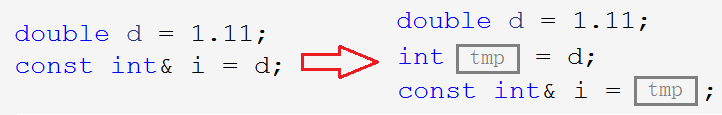
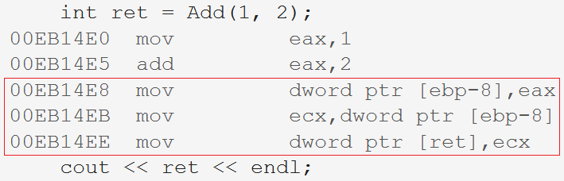

# 基础语法

C语言是结构化的语言，不适合大型程序开发时。Bjarne 等人顺应面向对象思想在C语言的基础上发明了一种新的语言，名为 C++。C++ 以C语言为基础，最初叫做 C with class 新增了类的概念，后逐步更新迭代，变得更加丰富完善。

历代最重要的是 C++98 和 C++11 两个版本，C++98 是 C++ 标准的第一个版本，以模板的方式重写C++标准库，引入了STL。C++11 为其增加了许多实用的特性。

C++ 在C的32个关键字的基础上新增了31个关键字，故C++兼容C绝大多数的特性。也暗示着C++的基础语法也是为了弥补C语言的某些缺陷。

&nbsp;

## 1. 命名空间

命名空间的出现是为了解决 C 语言中经常出现的命名冲突的问题：定义的全局变量、函数有可能与库文件或者项目中其他成员写的变量发生命名冲突。

<center>

</center>

> 如图所示，定义的全局变量`rand`和库中的rand发生冲突。C语言没有办法解决这样的问题，C++就此提出新的语法命名空间。

### 1.1 命名空间的定义

命名空间，即定义一个域。在这个域中定义变量、函数或类型，使用这些变量时在其名称前面加上命名空间的标识，以避免命名冲突。

~~~cpp
namespace test
{
    //1.
	int rand = 0;
    //2.
    int Add(int a, int b)
    {
        return a+b;
    }
    //3.
    struct Node
    {
        int data;
        struct Node* next;
    };
}
~~~

1. **这样的一个“域”，只是给变量的访问加上了一层“锁”，并不会影响变量的属性仍然是全局变量。**
2. 命名空间中只能定义变量或函数并进行初始化，不可以进行其他操作。

#### 命名空间的嵌套

~~~cpp
namespace N1
{
	int a = 0;
	int b = 0;
	int Add(int a, int b)
    {
		return a + b;
	}
	namespace N2
    {
		int c = 0;
		int d = 0;
		int Sub(int c, int d)
        {
			return c - d;
		}
	}
}
~~~

此外，当命名空间重名时，两个同名的命名空间会被合并为一个命名空间。

### 1.2 命名空间的使用

在命名空间中定义变量，相当于将变量封锁起来，访问时要加上命名空间的标识。域作用限定符`::`。

使用命名空间中的变量有如下三种方式。

#### 用时展开

~~~cpp
int main() {
    std::cout << "hello world" << std::endl;
}
~~~

在变量名前加上空间名和`::`，告诉编译器使用该命名空间中的变量。

> 域作用限定符并不是C++新增的，C语言中同样可以使用。

~~~cpp
int a = 0;

int main()
{
	int a = 1;
	printf("%d\n", ::a); // ::前不写空间的名称，就表示使用全局范围的变量。
}
~~~

#### 全局展开

~~~cpp
using namespace std;

int main() {
    cout << "hello world" << endl;
}
~~~

这种写法会将该命名空间中的所有变量或者函数都在当前文件展开。

好处是比较方便，坏处是使整个命名空间失效，可能造成命名冲突。相当于取消隔离，所以要慎用。

#### 部分展开

~~~cpp
using std::cout;
using std::endl;

int main() {
    cout << "hello world" << endl;
}
~~~

引入命名空间中的指定成员。

1. 第一种用时展开，隔离效果最好但使用繁琐，
2. 第二种全局展开，最简单但效果最差，容易导致命名冲突，
3. 第三种部分展开，只展开常用成员，相对来说更加安全可靠。

&nbsp;

## 2. 输入输出

~~~cpp
#include <iostream>  // C++标准输入输出流文件
using namespace std;

int main()
{
    int i = 0;

    cin >> i;          // 输入
    cout << i << endl; // 输出

    return 0;
}
~~~

C++ 库的实现都放在一个叫`std`的命名空间中。一般学习时可以直接展开整个命名空间。

- `cout`是一个全局变量在 C++ 中称为对象，为标准输出即控制台。`cin`是C++的标准输入即键盘。

- `<<`是流插入运算符，`>>`时流提取运算符。

> `cout`,`cin`可以自动识别类型，不需要格式控制符，也可以根据变量的值自动控制小数点位数。

~~~cpp
int i = 0;
double d = 1.11;

cin >> i >> d;
cout << i << " " << d << endl;
~~~

C 和 C++ 的输入输出都可以使用，一般哪个方便选哪个。如果需要控制格式，最好使用 prinf 和 scanf。

> cin 和 scanf 都存在缓冲区遗留回车字符`\n`的问题。

&nbsp;

## 3. 缺省参数

缺省就是默认的意思，就像备胎一样，如果有就用给的，如果没有就用默认值。

### 3.1 缺省参数的定义

缺省参数，是在声明或者定义函数的时候，为函数的参数指定一个默认值。

在调用函数时，若对应位置没有传入实参，则使用该参数的缺省值，反之，则使用传入值。

<center>

</center>


### 3.2 缺省参数的类型

| 类型       | 含义                   |
| ---------- | ---------------------- |
| 全缺省参数 | 所有的形参都带有缺省值 |
| 半缺省参数 | 只有部分形参带有缺省值 |

~~~cpp
//1.全缺省参数
void Func(int a = 10, int b = 20, int c = 30)
{
	cout << "a=" << a << endl;
	cout << "b=" << b << endl;
	cout << "c=" << c << endl << endl;
}

//2.半缺省参数
void Func(int a, int b, int c = 30)
{
	cout << "a=" << a << endl;
	cout << "b=" << b << endl;
	cout << "c=" << c << endl << endl;
}
~~~

### 3.3 缺省参数的要求

- **传参也必须连续地从左向右传参**。不可以跳过，不可以只针对某个参数传参。

~~~cpp
void Func(int a = 10, int b = 20, int c = 30)
{
	cout << "a=" << a << endl;
	cout << "b=" << b << endl;
	cout << "c=" << c << endl << endl;
}
int main()
{
	Func();        // 不传参
	Func(1);       // 传 a=1
	Func(1, 2);    // 传 a=1,b=2
	Func(1, 2, 3); // 传 a=1,b=2,c=3

    //错误写法
    Func(,2,);
    Func(,,3);
    Func(1,,3);
	return 0;
}
~~~

- **缺省参数的设置必须从右往左且必须连续**。所以通常将需要缺省的参数放在右边，如下所示：

~~~cpp
void Func(int a = 10, int b = 20, int c = 30) {} //1.
void Func(int a,      int b = 20, int c = 30) {} //2.
void Func(int a,      int b,      int c = 30) {} //3.

//错误形式
void Func(int a = 10, int b, int c = 30) {}
void Func(int a = 10, int b, int c)      {}
~~~

- 缺省参数不可在函数声明和函数定义中同时出现，只能放在声明处。

&nbsp;

## 4. 函数重载

### 4.1 函数重载的定义

C++ 创造出了一种新语法叫函数重载，函数重载是指一个函数具有多种功能。

函数重载允许在同一个作用域中出现“同名函数”。这些同名函数的参数列表必须不同，即**参数个数，参数顺序，参数类型三者任有一个不同即可**。

**返回类型不同不算重载**。因为仅靠返回类型无法在调用时区分重载的函数。

~~~cpp
int Add(int a, int b)
{
	return a + b;
}
int Add(int a, int b, int c)
{
	return a + b + c;
}

float Add(int a, float b)
{
	return a + b;
}
float Add(float a, int b)
{
	return a + b;
}
~~~

只有类型不同才算不同，名称不在考虑范围，因为编译器根本不关心形参的名称。

~~~cpp
//1.
void f(int a) {
	cout << "f(int a)" << endl;
}
void f(int a = 0) {
	cout << "f(int a = 0)" << endl;
}
//2.
void f() {
	cout << "f()" << endl;
}
void f(int a = 0) {
	cout << "f(int a = 0)" << endl;
}
~~~

第一组函数不可构成重载，参数与缺省值无关。

第二组函数参数个数不同，构成重载，但调用时存在歧义。

### 4.2 函数重载的原理

```cpp
int Add(int a, int b)
{
	return a + b;
}

void func(int i, double d, int* pi)
{
    return;
}
```

C/C++的源文件都是需要进行预处理，编译，汇编，链接，最后生成可执行程序。

C语言编译时，**C语言单纯使用函数名查找函数地址**，两个同名函数的符号表存在冲突，所以编译失败，都到不了链接的步骤。

> C++是如何支持函数重载的呢？

C++的函数查找规则更严格，C++不是直接用函数名来查找函数地址的，查找规则如下图所示：

<center>

</center>

```cpp
add   ->  _Z3Addii
func  ->  _Z4funcidPi
```

| 拆分         | 解释                     |
| ------------ | ------------------------ |
| `_Z`         | 函数的前缀               |
| 数字`3`,`4`  | 函数名字符长度           |
| `Add`,`func` | 函数名                   |
| `i`,`d`,`Pi` | 参数类型首字母以表示参数 |

可以看出，C++函数的编译符号名称和函数名、参数类型有关。对于编译器来说，这些函数并不相同，这就是函数重载的原理。

### 4.3 extern "C"

当我们使用C语言程序去调用C++所写的库，或者使用C++程序去调用C所写的库时，必须要在C++文件中引入`extern "C"`，这样才能让C++程序按照C的方式调用函数。

可以将`.lib`库文件和头文件放入工程文件的位置，也可以记下文件位置以待在调用工程中配置相关设置。下面仅介绍 vs 环境下的配置方法，其他平台大同小异。

由于工程中没有库文件，所以要在工程的属性设置中的链接设置中填写库文件的位置和文件名。如下图所示：

<center>

</center>

<center>

</center>

经过上述步骤，工程便可以找到库文件了，下面解决调用问题，调用报错找不到找不到函数地址，这是因为C/C++的函数名修饰规则不同导致的。所以要在C++文件中使用`extern"C"`。`extern "C"`命令就是为了让该文件使用C语言的名字修饰规则，以免C程序调用时找不到函数。

#### C++程序调用C的库

C++的工程去调用C语言所写的库，只需要在工程包头文件时加上这样的语句即可。

~~~cpp
extern "C"
{
#include "../../StackLibrary/StackLibrary/Stack.h"
}
~~~

#### C程序调用C++的库

C程序调用C++的库相对来说要繁琐一点，因为头文件须在C和C++的文件都展开。必须在C++工程中将头文件加上条件编译指令，免得C语言调用的时候遇到`extern"C"`。基本方法如下：

这里有两种方式，一种是利用`#ifdef __cplusplus`给头文件加上`extern"C"{}`的代码，现在C++的工程中编译一下生成可以让C语言程序可以调用的`.lib`文件。

~~~c
#define FRISTSOLUTION 1
//第一种方案
#ifdef FRISTSOLUTION
	#ifdef __cplusplus
	extern "C" {
	#endif
		void StackInit(ST* ps);
		void StackPush(ST* ps, STDataType data);
		void StackPop(ST* ps);
		STDataType StackTop(ST* ps);
		int StackSize(ST* ps);
		bool StackEmpty(ST* ps);
		void StackDestroy(ST* ps);
	#ifdef __cplusplus
	}
	#endif
//第二种方案
#else
	#ifdef __cplusplus
		#define EXTERN_C extern "C"
	#else
		#define EXTERN_C
	#endif
	EXTERN_C void StackInit(ST* ps);
	EXTERN_C void StackPush(ST* ps, STDataType data);
	EXTERN_C void StackPop(ST* ps);
	EXTERN_C STDataType StackTop(ST* ps);
	EXTERN_C int StackSize(ST* ps);
	EXTERN_C bool StackEmpty(ST* ps);
	EXTERN_C void StackDestroy(ST* ps);
#endif
~~~

&nbsp;

## 5. 引用

引用是 C++ 中一个重要的语法，在后期应用非常广泛。相较于指针，它更加方便也更好理解。

### 5.1 引用的定义

**引用是给已存在的变量取一个别名，并不是定义一个新的变量**。取别名就相当于取外号，相当于给一块空间取了两个名字。

~~~cpp
int a = 0;
int& b = a;
~~~

> `b`是`a`的引用，b 和 a 指向同一块空间，改变 b 就是改变 a 。

语法层面上，引用变量没有开辟空间，它和它所引用的变量使用同一块空间。

<center>

</center>

### 5.2 引用的特性

- 一个变量可以有多个引用；
- **定义引用时必须要初始化**；
- **引用初始化后不可改变引用实体**。

~~~cpp
//1.
int& b = a;
int& c = a;
int& d = a;

//2.
int a = 10;
int& b;//Err 引用必须要初始化

//3.
int e = 1;
int& f = a;
f = e; //把e赋值给f
~~~

定义引用时必然要初始化，不然别名就没有意义了。

一个变量可以取多个别名，但一个别名被使用后便不可以指代其他变量，只能是赋值操作。

### 5.3 常引用

常变量是具有常属性的变量，那么常引用就是具有常属性的引用。常引用会涉及到权限的问题，如：

~~~cpp
const int a = 0;
int& ra = a;       // 权限放大 Err

int b = 0;
const int rb = b;  // 权限缩小

const int c = 0;
const int& rc = c; // 权限相同
~~~

权限不允许扩大，但是可以不变和缩小。

~~~cpp
double d = 1.11;
int i = d;

double d = 1.11;
const int& i = d;
~~~

<center>

</center>

隐式类型转换，中间会创建一个临时变量来“过渡”。不同类型变量的赋值，其实是将变量的数据截断放入临时变量，再将临时变量赋值给另一个变量。

这样的临时变量是个右值，具有常属性，只有常引用才能引用这样的临时变量。也就使得`const Type&`的引用类型可以引用任意类型的变量。

> 创建临时变量的方式不仅存在于类型转换，还有整型提升，传参返回等。

<center>

</center>

>  d 和 ri 并没有指向同一块空间，ri 指向的临时变量那块空间。

### 5.4 引用的应用

> 引用实际使用时通常有两种用法，作参数和返回值。

#### 作函数参数

~~~cpp
void Swap(int& rx, int& ry) {
	int tmp = rx;
	rx = ry;
	ry = tmp;
}
~~~

<center>

</center>

> 单链表插入删除操作可能会修改头指针，可以传入头指针的引用，免得使用二级指针。
>
> `phead`就是`plist`的引用，改变`phead`就是改变`plist`。

#### 作返回类型

~~~cpp
int& Add(int a, int b)
{
	int c = a + b;
	return c;
}
int main()
{
	int ret = Add(1, 2);
	cout << ret << endl;
}
~~~

取 c 的值赋值给 ret，而 c 的空间已还给操作系统，就造成了非法访问。

<center>

</center>

~~~txt
mov eax, dword ptr [c] ; 将变量c的值放入寄存器eax中
lea eax, [c]           ; 将变量c的地址放入寄存器eax中
~~~

> 之所以将地址放到寄存器中带回，是因为引用的底层实现是指针，要通过地址访问 c 的内存空间。

- 值返回用临时变量存储了c 的值，返回的是拷贝临时对象。
- 引用返回用引用访问了原来 c 的内存空间。

引用作返回值可能会造成非法访问，所以不要返回局部变量的引用。引用作返回值自有其的应用场景，在后续的学习中会遇到。

~~~cpp
int& At(int i)
{
	static int a[N];
	return a[i];
}
int main()
{
	for (int i = 0; i < N; i++)
		cout << At(i) << endl;
}
~~~

### 5.5 引用和指针的区别

- 传引用和传指针差不多，每次调用都访问的是同一块空间，
- 传引用的效率比传值高很多，数据越大对性能的提升越大。

引用可以作输出型参数或输出型返回值，就是达到改变函数外面的实参的目的。

<center>

</center>

引用和指针在语法层面上是完全不同的两种语法，但从汇编代码可以看出引用的底层也是指针，引用就是为了解决多级指针造成的理解困扰。

| 引用                                  | 指针                                |
| ------------------------------------- | ----------------------------------- |
| 引用是变量的别名，没有独立空间        | 指针是变量，存储变量的地址          |
| 引用必须初始化                        | 指针没有要求初始化                  |
| 引用定义后就无法改变引用实体          | 指针可以任意改变指向                |
| 没有空引用                            | 只有空指针                          |
| `sizeof(Type&)`表示引用对象的类型大小 | `sizeof(Type*)`表示当前平台地址大小 |
| 引用自增自减改变引用实体的大小        | 指针自增自减表示地址位置的前后移动  |
| 无多级引用                            | 有多级指针                          |
| 引用编译器处理，相对指针更加安全      | 指针需要显式解引用                  |

&nbsp;

## 6. 内联函数

函数栈桢的创建和销毁会有不少的消耗，像一些小的被频繁调用的如`Swap`,`Add`等仅有几行的函数，封装成函数浪费性能。

解决这种问题除了使用C语言的语法宏以外，C++还有新语法叫内联函数。

### 6.1 内联函数的定义

用`inline`修饰的函数就叫内联函数，编译时编译器会自动将其在调用处展开，不会产生函数压栈的一系列开销，提升了程序的效率。

<center>

</center>

> 内联函数只在release模式下起作用，若想在Debug模式下查看需要配置项目属性。

### 6.2 内联函数的特性

1. 内联函数以空间换时间，省去调用函数开销，但在调用处展开会增加程序大小。故**一般适用于十行以内且没有递归迭代的函数**。
2. **内联函数仅是对编译器的一种建议**，编译器会选择性的优化。
3. **内联函数不能声明定义分离**，内联函数不会调用就没有函数地址，分离会导致链接失败。

**宏可以增强代码的复用性，提高性能，缺点是无法调试，可维护性差，没有类型检查**。因此推荐使用内联函数。

&nbsp;

> 以下是C++11中的部分语法，了解即可。

## 7. auto 关键字

> C语言的 auto 关键字，表示自动变量，可以自动销毁释放，忽略即可，切莫与 C++ 中的 auto 混淆。

### 7.1 auto 的定义

auto 定义的变量，**其类型由编译器根据初始化的内容自动推导，因此 auto 修饰的变量必须初始化**。

auto 并非是一种类型的声明，而是一种类型的“占位符”，编译器会在编译时将auto替换成实际的类型。

~~~cpp
int a = 10;
auto b = a;
auto c = 10;
auto d = 'A';
auto f = 11.11;
auto e = "aaaa";
~~~

> auto 意义在于，类型很长时可以使用 auto 代替，更简单省事。

### 7.2 auto 的使用

#### auto 声明指针和引用

~~~cpp
//定义指针
auto pa = &a;
auto* pa = &a;
//定义引用
auto& ra = a;
~~~

- auto 定义指针可以带`*`也可以不带，通过初始化的内容都能确定指针的类型。
- 但引用必须要加`&`，不然无法确定是引用还是普通变量。

#### auto 一行定义多个变量

~~~cpp
auto a = 1, b = 2;
auto c = 3, d = 4.0; // Err
~~~

auto **连续定义多个变量时，变量的类型必须相同**，因为编译器只对第一个变量的类型进行推导，以推得的类型定义之后的变量。

#### auto 不能推导的情况

此外，**auto 不能用来声明函数形参类型**，即使给了缺省值也不行，auto 也不可用来声明数组。

~~~cpp
int Add(auto a);       // Err
auto arr[] = { 10,20 };// Err
~~~

> auto 的常见用法是用在 C++11 提供的新式 for 循环，还有 lambda 表达式等进行配合使用。

&nbsp;

## 8. 范围for

### 8.1 范围for的语法

对于一个有范围的集合仍需说明它的范围，这无疑是多余的，因此C++11引入范围 for。

`:`前是循环变量，后面是迭代的对象。范围for和普通for类似，也可以使用`continue`和`break`。

~~~cpp
for (auto e : arr)
{
    cout << e << endl;
}
~~~

范围 for 循环提取的对象是集合元素的拷贝，**若要修改迭代的对象，需要使用引用。**

~~~cpp
for (int i = 0; i < sz; i++) {
    arr[i] *= 2;
}
for (auto& e : arr) {
    e *= 2;
}
~~~

### 8.2 范围for的使用条件

范围for的范围必须确定。数组传参本质就是指针，并不能确定数组的具体范围，因此是错误的。

迭代的对象要支持 ++ 和 == 操作。

~~~cpp
void TestFor(int arr[])
{
	for (auto e : arr)
		cout << e << endl;
}
~~~

&nbsp;

## 9. 指针空值nullptr

传统C语言中对于`NULL`的定义可以在`stddef.h`中找到，如下图所示：

<center>

</center>

可以发现`NULL`是个宏，且在C++文件中是被当成整型数字0来处理的，可能在某些情况下会导致隐患，所以C++推荐我们使用`nullptr`，它是C++11作为关键字引入的。

&nbsp;

## 10. 四种强制类型转换

C语言的隐式类型转换容易发生意外，C++为规范使用类型转换提出了四种强制类型转换的操作符。

### 10.1 static_cast

静态转换static_cast，就是隐式类型转换。相近类型的转换用static_cast。

```cpp
i = d1;
i = static_cast<int>(d1);
```

### 10.2 reinterpret_cast

非相近类型的转换用static_cast会报错，就要用reinterpret_cast表示重新解释。

```cpp
int* p = static_cast<int*>(i); //err
int* p = reinterpret_cast<int*>(i);
```

### 10.3 const_cast

const_cast用来去掉const变量的const属性。

```cpp
volatile const int a = 2;
int* pa = const_cast<int*>(&a);

cout << a << endl;
cout << *pa << endl;
```

### 10.4 dynamic_cast

dynamic_cast支持向下转型，就是能让父类指针或引用赋值给子类的指针或引用，并保证安全。条件是父子类支持多态。

如果随意将父类指针改为子类指针类型，会导致越界访问。

所谓保证安全，是如果父类指针指向的是子类对象，那么dynamic_cast可以转成功。反之，则返回空。

> 父类对象无论如何都不可以赋值给子类对象。

```cpp
A* pa = new A;
B* pb = dynamic_cast<B*>(pa); // nullptr

A* pa = new B;
B* pb = dynamic_cast<B*>(pa);

cout << "pa1" << pa1 << "\tdynamic_cast: " << pb1 << endl;
cout << "pa2" << pa2 << "\tdynamic_cast: " << pb2 << endl;
```
