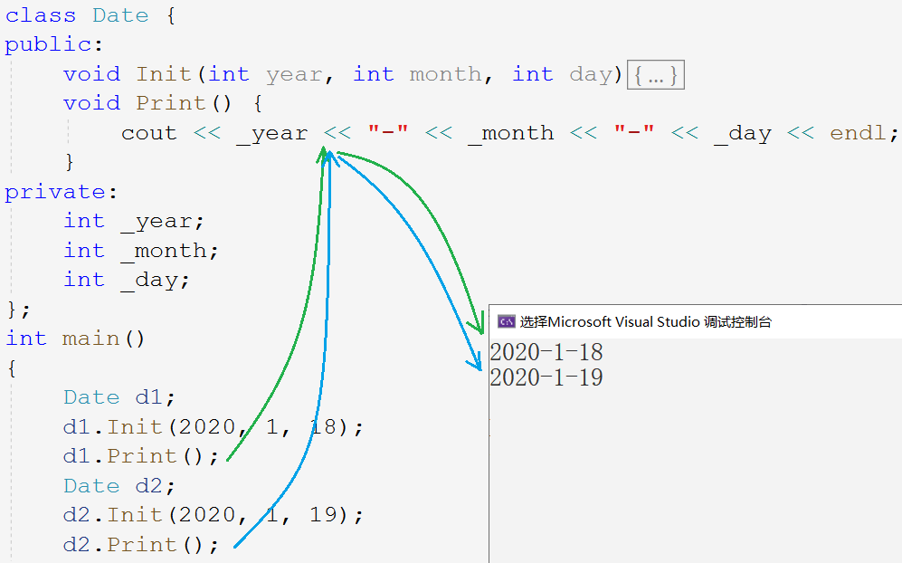
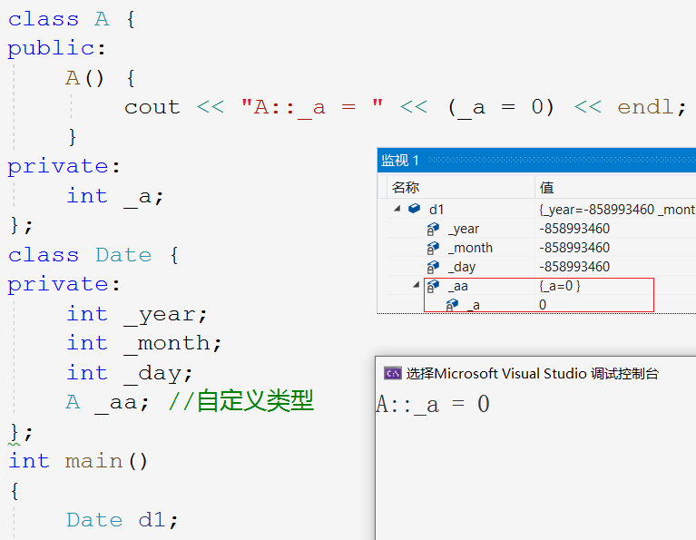
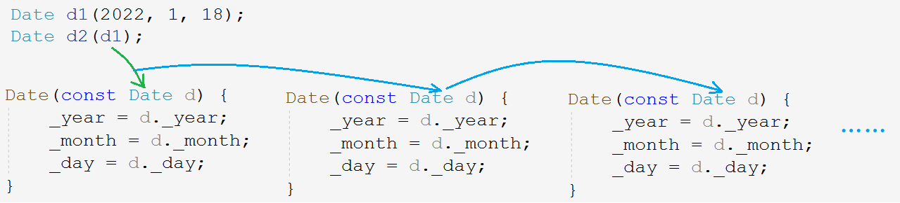
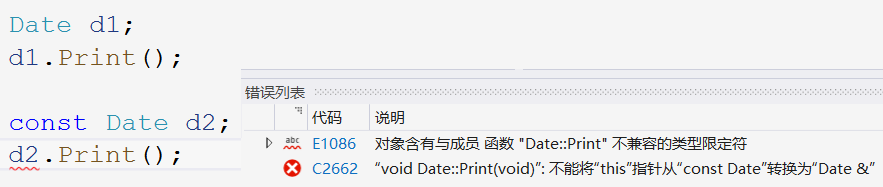

# 类和对象

### 面向对象

直到七十年代面向过程编程在开发大型程序时表现出不足，计算机界提出了面向对象思想（Object Oriented Programming），**面向对象三大特性是封装、继承和多态**。

面向过程和面向对象只是计算机编程中两种侧重点不同的思想，面向过程算是一种最为实际的思考方式，其中重要的是模块化的思想，面向过程更注重过程或者说动作的步骤。

面向对象也是含有面向过程的，面向对象主要是把事物给对象化，把事物看作为对象和对象之间的关系，更符合人对事物的认知方式。

面向对象是一个广泛而深刻的思想，不可能一时半会就理解透彻，需要在学习和工作中慢慢体会。

> C++不是纯面向对象语言，它支持面向对象，又兼容C也支持面向过程。

&nbsp;

## 1. 类的定义

~~~cpp
struct Student
{
	//成员变量
	char _name[20];
	int _age;
	int _id;

	//成员方法
	void Init(const char* name, int age, int id)
    {
		strcpy(_name, name);
		_age = age;
		_id = id;
	}

	void Print()
    {
		cout << _name << " " << _age << " " << _id << endl;
	}
};

int main()
{
    Student s1, s2;
    s1.Init("yyo", 19, 1);
    s1.Print();
    s2.Init("yyx", 18, 2);
    s2.Print();
}
~~~

C语言的结构体中只能定义变量，就相当于是个多个变量的集合，操作成员变量的方式也比较繁琐且容易出现错误。

C++ 中定义类有两个关键字分别是`struct`和`class`，结构体在C++中也升级成了类。

类名可以直接作类型使用，类中不仅可以定义变量，还可以定义函数。类中的变量和函数都叫类的成员。

&nbsp;

## 2. 类的封装

面向对象讲究“封装”二字，封装体现在两方面，一是将数据和方法都放到类中封装起来，二是给成员增加访问权限的限制。

### 2.1 访问限定修饰符

C++共有三个访问限定符，分别为**公有`public`，保护`protect`，私有`private`**。

- `public`修饰的成员可以在类外直接访问，`private`和`protect`修饰的成员在类外不能直接访问。
- `class`类中成员默认访问权限为`private`，`struct`类中默认为`public`。
- 从访问限定符出现的位置到下一个访问限定符出现的位置之间都是该访问限定符的作用域。

> 和 public 相比，private 和 protect 是类似的，它二者具体区别会在之后的继承中谈到。

封装的意义就在于**规范成员的访问权限，更好的管理类的成员**，一般是将成员的访问权限标清楚。

~~~cpp
class Student
{
private:
	//成员变量
	char _name[20];
	int _age;
	int _id;

public:
	//成员方法
	void Init(const char* name, int age, int id)
    {
		strcpy(_name, name);
		_age = age;
		_id = id;
	}
	void Print()
    {
		cout << _name << " " << _age << " " << _id << endl;
	}
};
~~~

注意，访问限定修饰符只在编译阶段起作用，之后不会对变量和函数造成任何影响。

### 2.2 类的封装

面向对象三大特性是封装、继承和多态。

C++ 相对 C 语言，数据和方法都封装到类里，数据的访问是受限制的。不允许在函数外操作和改变结构。使得代码更加安全且易于操作。

~~~cpp
class Stack {
public:
	void Init();
	void Push(STDataType x);
	void Pop();
	STDataType Top();
	int Size();
	bool Empty();
	void Destroy();
private:
	STDataType* _a;
	int _top;
	int _capacity;
};
~~~

&nbsp;

## 3. 类的特性

### 3.1 类的作用域

类定义了一个新的作用域，类中所有成员都在类的作用域中。

1. 在满足内联函数的要求的情况下，编译器默认将**类内定义的函数当作内联函数处理**。
2. 在类外定义成员函数时，需要使用域作用限定符`::`指明该成员归属的类域。

```cpp
void	   Stack::Init();
void 	   Stack::Push(STDataType x);
void 	   Stack::Pop();
STDataType Stack::Top();
int  	   Stack::Size();
bool 	   Stack::Empty();
void 	   Stack::Destroy();
```

### 3.2 类的实例化

用类创建对象的过程，就称为类的实例化。

1. 类只是一个“模型”，类中的成员变量也只是声明，并没有为其分配空间。
2. 由类可以实例化得多个对象，对象在内存中占据实际的空间，用于存储类成员变量。

> 类和对象的关系，就与类型和变量的关系一样，可以理解为图纸和房子的关系。

### 3.3 类对象的存储

> 既然类中既有成员变量又有成员函数，类对象如何存储？

~~~cpp
class Stack {
public:
	void Init();
	void Push(int x);
	// ...
private:
	int* _a;
	int _top;
	int _capacity;
};
Stack st;
cout << sizeof(Stack) << endl;
cout << sizeof(st) << endl;
~~~

由类实例化出多个对象时，各个对象的成员变量相互独立，但成员函数是相同的。因此，**对象中仅存储类变量，成员函数存放在公共代码段**。


类的大小就是该类中成员变量之和，要求内存对齐，和结构体一样。

注意，空类的大小为1个字节，用来标识这个对象的存在。

### 3.4 this 指针

~~~cpp
class Date {
public:
	void Init(int year, int month, int day) {
        _year = year;        //1.
        Date::month = month; //2.
		this->day = day;     //3.
	}
private:
	int _year;
	int month;
	int day;
};
~~~

如果成员变量和形参重名的话，赋值操作会优先使用形参，无法指定成员变量，这种问题有三种解决方案：

1. 在成员变量名前加`_`，以区分成员和形参。
2. 使用域访问修饰符`::`，指定前面的变量是成员变量。
3. 使用 this 指针。

#### this 指针的定义



> 但函数并不存放在类对象中，那调用`Print()`时如何区分不同对象呢？

C++ 中引入 this 指针解决该问题，this 是 C++ 的一个关键字，代表当前对象的指针。

编译器给每个非静态的成员函数增加了一个隐含的形参叫 this 指针。

this 指针指向当前调用对象，函数体中所有对成员变量的操作都通过该指针访问，但这些操作由编译器自动完成，不需要主动传递。


在传参时隐式传入了对象指针，形参列表中也隐藏增加了对象指针，函数体中访问成员变量的前面也隐藏了 this 指针。

> 这些操作都由编译器自动处理，不用也不能手动传递。

#### this 指针的特性

1. 调用成员函数时，不可以显式传入 this 指针，成员函数参数列表也不可显示声明 this 指针。
2. 成员函数中可以显式使用 this 指针。
3. this 的类型为`classType* const`，加 const 是为了防止 this 指针被改变。

4. this 指针是成员函数的形参，函数被调用时对象传入该指针，所以 this 指针存储在函数栈帧中，对象中不存储 this 指针。

~~~cpp
class A {
public:
	void Print() { cout <<  _a      << endl; }
	void Show()  { cout << "Show()" << endl; }
private:
	int _a;
};

int main()
{
	A* a = nullptr;

	a->Show();	//1.
	a->Print();	//2.
}
~~~

- 函数没有存储在对象中，调用函数并不会访问空指针`a`，空指针仅作参数传入成员函数而已。
- `Show()`函数没有访问对象中的内容，故没有访问空指针。
- `Print()`函数需到访问成员`_a`，故访问空指针程序崩溃。

&nbsp;

## 4. 默认成员函数

对象一般都要进行初始化，释放空间，拷贝复制等等操作。由于这些操作经常使用，在设计之初就被放到类中作为默认的成员函数使用。

C++的默认成员函数机制较为复杂，一个类有6个默认的成员函数，分别为构造函数、析构函数、拷贝构造、赋值运算符重载以及取地址操作符重载（以及const版本）。

他们都是特殊的成员函数，这些特殊函数不能被当作常规函数调用。


默认的意思是我们不写编译器会自动生成一份，但如果我们写了编译器就不生成了。自动生成默认函数有的时候功能不够全面，还是得自己写。

### 4.1 构造函数

#### 构造函数的定义

构造函数和析构函数分别是完成初始化和清理资源的工作。

构造函数是一个特殊的函数，名字与类名相同，没有返回值。创建对象时被编译器自动调用，用于初始化每个成员变量，并且在对象的生命周期中只调用一次。

```cpp
class Date
{
public:
	Date()
    {}
private:
    // ...
};
```

#### 构造函数的特性

构造函数并不是开辟空间定义成员变量，成员变量在创建对象时就已被创建，而初始化对象中的成员变量。

- 函数名和类名相同，且无返回类型。
- 对象实例化时由编译器自动调用对应的构造函数。
- 构造函数支持函数重载。

~~~cpp
Date d1;            // 调用无参的构造函数
Date d2();          // Err 会被解释为函数声明
Date d2(2020,1,18); // 调用带参的构造函数
~~~

对象实例化时，就是在调用构造函数，且调用无参的构造函数不能带括号，否则会当成函数声明。

- 若类中没有显式定义构造函数，程序默认创建的构造函数是无参的。一旦显式定义了编译器就不会生成。

- 无参的构造函数、全缺省的构造函数和默认生成的构造函数都算作是默认构造函数，为防止冲突默认，构造函数只能有一个。


#### 默认构造初始化规则

默认构造函数对内置类型的成员不作处理，对自定义类型成员会调用它们的默认构造来初始化自定义类型成员。



&nbsp;

### 4.2 析构函数

#### 析构函数的定义

析构函数的名字是`~`加类名，是无参无返回值的，故不支持重载。

析构函数不是完成对象的销毁，而是负责清理资源，对象是随生命周期结束而销毁，析构函数会在对象销毁时自动调用。

```cpp
class Date {
public:
    Date (int year = 1, int month = 1, int day = 1) {
        _year = year;
        _month = month;
        _day = day;
	}
    ~Date()
    {}
private:
    int _year;
    int _month;
    int _day;
};
```

#### 析构函数的特性

- 一个类中有且仅有一个析构函数，同样若未显式定义，编译器自动生成默认的析构函数。
- 对象生命周期结束时，编译器自动调用析构函数。
- 调用析构函数的顺序和创建对象的顺序是相反的，因为哪个对象先压栈哪个对象就后销毁。

> 自动调用析构函数，可以避免内存泄漏的问题。不是所有类都需要析构函数，但对于有些类就很方便。

#### 默认析构清理规则

默认生成的析构函数同样对内置类型的成员变量不作处理，**对自定义类型的成员会调用它们的析构函数**。

> 不释放内置类型的成员也是有一定道理的，防止释放一些文件指针等等可能导致程序崩溃。

&nbsp;

### 4.3 拷贝构造

除了初始化和销毁以外，最常见的就是对象赋值和拷贝对象。而类这种复杂类型直接赋值是不起作用的，拷贝对象要由拷贝构造实现，每次拷贝对象都要调用拷贝构造函数。

#### 拷贝构造的定义

拷贝构造函数也是特殊的成员函数，负责对象的拷贝赋值工作。

拷贝构造只会在用同类型的对象初始化新对象时，由编译器自动调用。拷贝构造是构造函数的一种重载，故拷贝构造的函数名和构造函数相同。

```cpp
class Date
{
public:
    Date(int year = 1, int month = 1, int day = 1) {
        _year = year;
        _month = month;
        _day = day;
	}
    Date(const Date& d) {
		_year = d.year;
        _month = d.month;
        _day = d.day;
	}
};
int main()
{
    Date d2(d1);  // 调用拷贝构造
    Date d2 = d1; // 同样也是调用拷贝构造
}
```

`()`和`=`的方式，都是在定义对象并初始化，都需要调用拷贝构造。

#### 拷贝构造的特性

- 拷贝构造函数是构造函数的一个重载形式。
- 拷贝构造函数只有一个参数，且**必须是同类型的对象的引用**，否则会引发无穷递归。

> 传值传参就要拷贝对象，要想拷贝对象就要调用拷贝构造，而调用拷贝构造函数又要传值传参，这样就会在调用逻辑死循环出不来了。



- 一般拷贝构造另一个对象时，不希望原对象发生改变，所以形参对象的引用被`const`修饰。
- 若只显式定义拷贝构造，系统就不会生成默认的构造函数，因为拷贝构造是构造函数的一份重载。

#### 默认拷贝构造拷贝规则

默认生成的拷贝构造，对于内置类型的成员，是把该成员逐字节拷贝至新对象中。这样的拷贝被称为浅拷贝或值拷贝。

默认生成的拷贝构造，对于自定义类型的成员，会调用该自定义类型成员的拷贝构造。

> 浅拷贝有时会发生错误，是否实现拷贝构造看情况而定。

&nbsp;

## 5. 运算符重载

运算符重载是 C++ 的一大利器，使得对象也可以用各种运算符更方便的进行有意义的运算。编译器无法生成默认的各种运算符重载函数，这里的规则需要我们自行定义。

### 5.1 运算符重载的定义

运算符重载是具有特殊函数名的函数，也具有返回类型、函数名和参数列表。由编译器自动识别和调用。

1. 函数名是关键字`operator`加需要重载的运算符符号，如`operator+`，`operator=`等。
2. 返回类型和参数都要根据运算符的规则和含义的实际情况来定。

~~~cpp
bool operator>(const Date& d1, const Date& d2) {
	if (d1._year > d2._year)
		return true;
	else if (d1._year == d2._year && d1._month > d2._month)
		return true;
	else if (d1._year == d2._year && d1._month == d2._month && d1._day > d2._day)
		return true;
    else
		return false;
}
//...
int main()
{
    d1 > d2;
    operator>(d1, d2);
}
~~~

两种调用方式都可以，编译器把`d1>d2`转化成`operator>(d1,d2)`。大大提高了代码的可读性。

### 5.2 运算符重载的特性

- 只能重载已有的运算符，不能使用其他符号来定义新的运算，如`operator@`。
- 运算符重载函数最多有两个形参，分别作为运算符的左右操作数，自定义类型最好采用常引用传参。
- 操作符重载，不建议改变该操作符本身含义。
- 共有5个运算符不可被重载，分别是：`.*`、`::`、`sizeof`、`?:`、`.`。
- 运算符重载和类无关，并不单独局限于某个类。如果要**将运算符重载放到类中，作为类成员函数，具有隐藏形参 this 指针，所以只有一个参数位置**。

~~~cpp
bool operator==(const Date& d1, const Date& d2) {
    return d1._year == d2._year && d1._month == d2._month && d1._day == d2._day;
}

class Date {
public:
	Date(int year = 0, int month = 1, int day = 1);
    bool operator==(const Date& d) {
        return _year == d._year && _month == d._month && _day == d._day;
    }

private:
	int _year;
	int _month;
	int _day;
};

int main()
{
	d1 == d2;
	d1.operator==(d2);
}
~~~

### 5.3 赋值运算符重载

赋值重载实现的是对象的赋值操作，和拷贝构造不同，**拷贝构造是用一个已存在的对象去初始化一个对象，赋值重载是将一个对象赋值给自身对象**。

```cpp
Date d5 = d1; // 用已存在的对象初始化新对象，调用的是拷贝构造
d5 = d1;      // 把一个已存在的对象赋值给另一个已存在的对象，调用的是赋值重载
```

- 参数列表：自身作为左操作数，参数为右操作数的引用。
- 返回类型：返回当前对象的引用，以支持连续赋值。

~~~cpp
// i = j = k = 1;
Date& Date::operator=(const Date& d)
{
	if (this != &d) // 优化自己给自己赋值
    {
		_year = d._year;
		_month = d._month;
		_day = d._day;
	}
	return *this;
}
~~~

> 不使用引用会调用拷贝构造，为减少拷贝和避免修改原对象，最好使用常引用。

#### 默认赋值重载赋值规则

如果没有显式定义赋值重载，编译器会生成一个默认赋值重载。

默认赋值重载对于内置类型的成员采用浅拷贝的方式，对于自定义类型的成员会调用它内部的赋值重载函数。

> 所以写不写赋值重载仍然要视情况而定。

&nbsp;

## 6. 日期类的实现

### 6.1 日期类的构造函数

~~~cpp
int Date::GetMonthDay()
{
	static int MonthDayArray[13] = { 0, 31 ,28, 31, 30, 31, 30, 31, 31, 30, 31, 30, 31 };

	if (_month == 2 && ((_year % 4 == 0 && _year % 100 != 0) || (_year % 400 == 0)))
		return 29;
	return MonthDayArray[_month];
}

Date::Date(int year, int month, int day)
{
	_year = year;
	_month = month;
	_day = day;
}
~~~

### 6.2 比较运算符的重载

~~~cpp
//运算符重载 >
bool Date::operator>(const Date& d) {
	if (_year > d._year) {
		return true;
	}
	else if (_year == d._year && _month > d._month) {
		return true;
	}
	else if (_year == d._year && _month == d._month && _day > d._day) {
		return true;
	}
	return false;
}
//运算符重载 >=
bool Date::operator>=(const Date & d) {
	return (*this > d) || (*this == d);
}
//运算符重载 <
bool Date::operator<(const Date& d) {
	return !(*this >= d);
}
//运算符重载 <=
bool Date::operator<=(const Date& d) {
	return !(*this > d);
}
//运算符重载 ==
bool Date::operator==(const Date& d) {
	return (_year == d._year) && (_month == d._month) && (_day == d._day);
}
//运算符重载 !=
bool Date::operator!=(const Date& d) {
	return !(*this == d);
}
~~~

### 6.3 加法运算符的重载


先将天数加到天数位上，然后判断天数是否合法。

1. 如果不合法则要减去当月的最大合法天数值，相当于进到下一月，即**先减值再进位**。
2. 若天数合法，则进位运算结束。
3. 在天数进位的同时，月数如果等于13则赋值为1，再年份加1，可将剩余天数同步到明年。


先减值再进位的原因是，减值所减的是当月的最大合法天数。

~~~cpp
// 运算符重载 +=
Date& Date::operator+=(int day)
{
	_day += day;
	while (_day > GetMonthDay()) // 检查天数是否合法
	{
		_day -= GetMonthDay(); // 天数减当月合法最大值
		_month++;

        if (_month == 13) // 检查月数是否合法
        {
			_month = 1;
			_year += 1; // 年份进位
		}
	}
	return *this;
}
// 运算符重载 +
Date Date::operator+(int day) // 临时变量会销毁，不可传引用
{
	Date ret(*this);
	ret += day;

	return ret;
}
~~~

### 6.4 减法运算符的重载

先将天数减到天数位上，再检查天数是否合法：

1. 如果天数不合法，向月份借位，再加上上月的最大合法天数，即**先借位再加值**。并检查月份是否合法，月份若为0则置为12年份再借位。
2. 如果天数合法，则停止借位。

先借位再加值是因为加值相当于去掉上个月的过的天数，所以应加上的是上月的天数。


~~~cpp
//运算符重载 -=
Date& Date::operator-=(int day)
{
	if (_day < 0) // 防止天数是负数
		return *this += -day;

	_day -= day;
	while (_day <= 0) // 检查天数是否合法
    {
		_month--;

		if (_month == 0) // 检查月份是否合法
		{
			_month = 12;
			_year--; // 年份借位
		}
		_day += GetMonthDay();// 天数加上当月合法最大值
	}
	return *this;
}

//运算符重载 -
//日期 - 天数 = 日期
Date Date::operator-(int day)
{
	Date ret(*this);
	ret -= day;
	return ret;
}
//日期 - 日期 = 天数
int Date::operator-(const Date& d)
{
	int flag = 1;
	Date max = *this;
	Date min = d;

	if (max < min)
    {
		max = d;
		min = *this;
		flag = -1;
	}

	int gap = 0;
	while ((min + gap) != max)
		gap++;

	return gap * flag;
}
~~~

### 6.5 自增自减的重载

C++为区分前置和后置，**规定后置自增减的重载函数设置一个`int`参数占位**，可以和前置构成重载。

~~~cpp
//前置++
Date& Date::operator++() {
	return *this += 1;
}
//后置++
Date Date::operator++(int) {
	return (*this += 1) - 1;
}
//前置--
Date& Date::operator--() {
	return *this -= 1;
}
//后置--
Date Date::operator--(int) {
	return (*this -= 1) + 1;
}
// 实现方式2
Date ret = *this;
*this + 1;
return ret;
~~~

&nbsp;

## 7. const 类

被 const 修饰的类即为 const 类，const 类调用成员函数时出错，因为参数 this 指针从`const ClassType*`到`ClassType*`涉及权限放大的问题。如图所示：



### 7.1 const 类的成员函数

this 指针作为隐含参数不可被修改，C++规定在函数声明后面加上 const ，就相当于给形参 this 指针添加 const 修饰。

~~~cpp
//运算符重载 !=
//声明
bool Date::operator!=(const Date& d) const;
//定义
bool Date::operator!=(const Date& d) const {
	return !(*this == d);
}
~~~

const 修饰成员函数，实际修饰函数的隐含形参 this 指针，这样函数内就不可修改对象的成员变量。

### 7.2 取地址操作符重载

取地址操作符重载和 const 取地址操作符重载，这两个默认成员函数一般不用定义，编译器默认生成的就够用了。

~~~cpp
Date* operator&() {
    return this;
}
const Date* operator&() const {
    return this;
}
~~~

> 当不允许获取对象的地址时，返回空即可。


## 8. 初始化列表

### 8.1 初始化列表的定义

进入构造函数内时，成员变量已经创建好，此时再修改成员变量的值是赋值而不是初始化。如果想要定义成员时就初始化，就使用初始化列表。

~~~cpp
Date(int year = 1, int month = 1, int day = 1)
    : _year(year)
    , _month(month)
    , _day(day)
{}
~~~

在构造函数的参数列表后函数体前，以`:`起始，`,`间隔，用类似构造函数的方式初始化变量。

### 8.2 初始化列表的特性

- 初始化列表只能用在构造函数中（拷贝构造也是一种构造函数）。

- 变量只能初始化一次，故每个成员变量只能在初始化列表出现一次。

- 三种成员变量必须放在初始化列表进行初始化：

  - 引用成员变量

  - const 常变量成员

  - 无默认构造函数的自定义类型成员。

~~~cpp
class Test {
public:
	Date(int year = 1, int month = 1, int day = 1, int i = 1)
		: _ref(i)
		, _j(0)
        , _a(10);
	{}
private:
	int& _ref;    // 引用必须初始化
	const int _j; // const修饰的变量必须初始化
	A _a;         // 自定义类型必须要有默认构造函数
};
~~~

- 成员在**类中的声明次序就是其在初始化列表中的初始化顺序**，与初始化列表中的顺序无关。

```cpp
class A {
public:
	A()
		: _a2(1)
		, _a1(_a2)
	{}
	void Print() { cout << _a1 << " " << _a2 << endl; }
private:
	int _a1;
	int _a2;
};

int main()
{
	A().Print(); // 2078469811 1
}
```

> 声明次序是先 _a1_ 后 _a2_，所以初始化列表中先初始化 _a1_ 后初始化 _a2_。

初始化列表的效率更高，尽量使用初始化列表初始化成员。


#### 成员初始化新方法

构造函数默认不初始化内置类型的成员，后以打补丁的方式，新增了一种初始化成员变量的方式。

C++11 支持在声明处对非静态成员予以缺省值，如果该变量没有初始化，就会使用该缺省值。缺省值会在初始化列表中起作用初始化。

~~~cpp
class B {
public:
	B(int b1 = 0, int b2 = 0)
		: _b1(b1)
		, _b2(b2)
	{}
private:
	int _b1;
	int _b2;
};
class A {
private:
	int _a = 1; // 声明变量缺省值
	B _b = { 20,10 };
    int _arr[] = { 1,2 };
	int* _p = (int*)malloc(4);
};
~~~

### 8.3 关键字 explicit

C++中支持两种实例化对象的方式。

~~~cpp
Date d(2022);  // 构造函数
Date d = 2022; // 隐式类型转换
~~~

隐式类型转换过程中，产生了一个类类型的临时变量`Date tmp(2022)`，再用该临时变量初始化`d`。

~~~cpp
Date d = 2022;
--------------
Date tmp(2022); // 调用构造函数初始化临时对象
Date d(tmp);    // 调用拷贝构造初始化目标对象
~~~

编译器会将这一次构造函数和一次拷贝构造，优化成一次构造函数。也就是直接用该值去调用构造函数。

如果不想发生这样的隐式类型转换，可以用`explicit`修饰构造函数：


```cpp
void func1(A aa)        {}
void func2(const A& aa) {}

int main()
{
    A aa = 1;    // 构造函数+拷贝构造，优化成一次构造

    func1(aa);   // 无优化
    func1(1);    // 构造函数+拷贝构造，优化成一次构造
    func1(A(1)); // 构造函数+拷贝构造，优化成一次构造

    func2(aa);   // 无优化
    func2(1);    // 一次构造函数
    func2(A(1)); // 一次构造函数
}

A func3() { A aa; return aa; }
A func4() { return A(); }

int main()
{
    func3();        // 返回值一次拷贝构造
    A aa = func3(); // 返回值一次拷贝构造+接收返回值一次拷贝构造，优化成拷贝构造

   	func4();        // 匿名对象一次构造函数+返回值一次拷贝构造，优化成一次构造
    A aa = func4(); // 构造+拷贝构造+拷贝构造，优化为构造
}
```


&nbsp;

## 9. 静态成员

### 9.1 静态成员的定义

用 _static_ 修饰的成员变量叫静态成员变量，用 _static_ 修饰的成员函数叫静态成员函数。静态变量存储在静态区，其生命周期被扩大到整个程序的开始到结束。

~~~cpp
//计算创建了多少个类对象
class A {
public:
	A(int a = 0)  { _sCount++; }
	A(const A& a) { _sCount++; }
	static int GetCount() { return _sCount; }
private:
	static int _sCount; // 声明
};

int A::_sCount = 0; // 定义

int main()
{
	A a1;
	//...
	cout << A::GetCount() << endl;
}
~~~

### 9.2 静态成员的特性

- 静态成员变量必须在类外定义，定义时不能用 _static_ 修饰。
- 静态成员变量为所有类对象共享。静态成员存储在静态区，故计算类的大小时不算静态成员。
- 静态成员可用类名加域作用符`::`访问，也可以使用对象名加访问符`.`访问。


- 静态成员函数没有隐含的 _this_ 指针，不能访问任何非静态成员。
- 非静态成员函数可以调用静态成员函数，但静态成员函数不能调用非静态成员函数。

&nbsp;

## 10. 友元

友元是一种突破封装的机制，有时提供了便利，但会增加耦合度，破坏封装，所以友元不宜多用。

 友元分为：友元函数和友元类。

### 10.1 友元函数的定义

**友元函数是定义在类外的普通函数，但作为类的友元可以访问类的私有成员**。声明的方式是在类体中声明函数并用 friend 修饰。

~~~cpp
class Date {
public:
	// 友元声明
	friend ostream& operator<<(ostream& out, const Date& d); // 流插入<<
	friend istream& operator>>(istream& in,        Date& d); // 流提取>>
private:
	int _year;
	int _month;
	int _day;
};
ostream& operator<<(ostream& out, const Date& d) {
	return out << d._year << "-" << d._month << "-" << d._day << endl;
}
istream& operator>>(istream& in, Date& d) {
    return in >> d._year >> d._month >> d._day;
}
~~~

###  10.2 友元函数的特性

- 友元函数可以访问类的私有和保护成员，但其本身不是类的成员函数，不受访问限定符的限制，友元函数可以声明在类的任意地方。
- 友元函数不是成员函数，所以不能用 _const_ 修饰。
- 一个函数可以是多个类的友元，调用方式和普通函数一致。

### 10.3 友元类

友元类的所有成员函数都是另一个类的友元函数，都可以访问另一个类的成员变量。比如下方例子：日期类是时间类的友元类，故日期类中所有函数都可以访问时间类的成员变量。

~~~cpp
class Time {
public:
	friend class Date; //声明日期类是时间类的友元类
	Time(int hour = 0, int minute = 0, int second = 0)
		: _hour(hour)
		, _minute(minute)
		, _second(second)
	{}
private:
	int _hour;
	int _minute;
	int _second;
};
class Date {
public:
	Date(int year = 1,int month = 1,int day = 1)
		:_year(year)
		,_month(month)
		,_day(day)
	{
		_t._hour = _t._minute = _t._second = 0;
	}
private:
	int _year;
	int _month;
	int _day;
	Time _t;
};
~~~

> 友元类声明在另一个类中，相当于另一个类拿着小本本记下友元类是自己的好朋友，这样“好朋友”就可以随便访问自己的成员啦。友元类的关系容易搞混，记住上面的比喻就可以了。

- **友元关系是单项的**，友元类可以访问另一个类，但另一个类不可以访问友元类。
- 友元关系不具有传递性，即 A 是 B 的友元，B 是 C 的友元，但 A 不是 C 的友元。

&nbsp;

## 11. 内部类

> C++ 开发时并不喜欢使用内部类。视情况而定。

### 11.1 内部类的定义

将一个类定义在另一个类的内部，这个定义在内部的类就叫内部类。

- 内部类只是**作用域被限定在外部类中**，空间上不算外部类。
- **内部类是外部类的友元类**，但外部类不是内部类的友元。

> 可以想象成外部类把内部类放在心里，所以内部类随意访问外部类。

- 内部类可以定义在外部类的任意地方，但被外部访问时会受访问限定符的限制。
- 计算外部类的大小和内部类无任何关系，因为内部类并不属于外部类。

```cpp
class A
{
public:
    class B
    {
        void setA() { _a = 1 };
        int _b;
    };

private:
    class C
    {
        void setA() { _a = 1 };
        int _c;
    };

    int _a;
};
```
