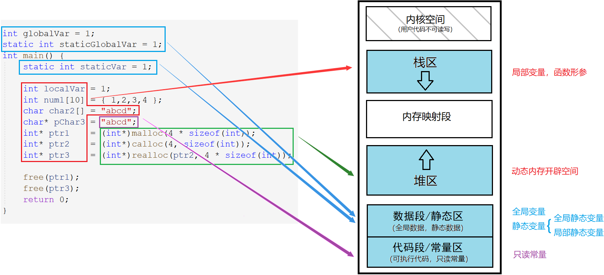

# C/C++内存管理

## 1. 内存分布



| 区域          | 解释                                                         |
| ------------- | ------------------------------------------------------------ |
| 栈区          | 函数栈帧、函数形参、局部变量都会在栈区上创建。               |
| 堆区          | 动态开辟的空间。                                             |
| 数据段/静态区 | 存放全局变量，静态数据。                                     |
| 代码段/常量区 | 存放可执行代码、指令一类的和只读常量，这些东西一般不会被修改。 |

- 字符串数组`char2`的内容`"abcd"`是存储在栈上的，是从常量区拷贝过来的。（数组是开辟在栈上的，数组地址也就是元素首地址）
- `pchar3`指针所指向的内容是存在常量区的。

&nbsp;

## 2. 动态内存管理

### 2.1 C动态内存管理

#### malloc

~~~c
void* malloc ( size_t size );
~~~

- `malloc`返回通用类型的指针，将其强制转换为所需类型，并用该类型的指针维护该内存空间。
- 开辟成功返回空间起始地址，开辟失败则返回`NULL`。

#### calloc

~~~c
void* calloc ( size_t num, size_t size );
~~~

`calloc`函数在堆区上申请`num`个`size`大小的空间，返回起始地址并将内容初始化为0。

#### realloc

~~~c
void* realloc ( void* memblock, size_t size );
~~~

`realloc`函数为已开辟的空间重新开辟大小。

- 当原空间后有足够大小时，就紧接原空间开辟剩余空间，并返回整个空间的起始地址。反之，就在堆区寻找新空间，再将原空间的内容移动到新空间，返回新空间的地址且释放原空间。
- 当剩余空间不够无法开辟时，增容失败，返回`NULL`。

#### free

~~~c
void free ( void* memblock );
~~~

- `free`函数释放指针指向的动态开辟的空间，但不对指针造成任何影响。

### 2.2 C++动态内存管理

~~~cpp
// C++动态申请
int* p3 = new int;
int* p4 = new int[5];
// 动态释放
delete p3;
delete[] p4;
~~~

使用关键字 new 开辟空间，不需要强转。不需要判空，new 会以抛异常的形式提示错误，符合面向对象的错误处理机制。

new 后面可以使用`()`进行初始化，C++11支持用`{}`初始化连续空间。

~~~cpp
//初始化空间
int* p1 = new int(5);
int* p2 = new int[5] {1,2,3,4,5};
~~~

| 开辟     | 实现原理                                                     |
| -------- | ------------------------------------------------------------ |
| new      | 调用 operator new 申请空间，调用构造函数构造对象             |
| delete   | 调用析构函数清理资源，调用 operator delete 释放空间          |
| new[N]   | 调用 operator new[] ，由该函数调用 operator new 申请N块空间，再调用N次构造函数构造对象 |
| delete[] | 调用N次析构函数清理资源，再调用 operator delete[]，去调用N次 operator delete 释放空间 |

#### new/delete开辟销毁规则

- malloc/free只会开辟空间和释放空间，不会做任何处理。
- **new/delete不仅开辟空间和释放空间，对自定义类型，会调用构造和析构。**

> 如果混用，规则不会发生变化，但可能因调用构造和析构的次数不匹配而导致程序出错。

故最好匹配使用，不要随意搭配，否则可能会出错。

~~~cpp
//1.
int* p = (int*)malloc(sizeof(int));
free(p);

//2.
int* p = new int;
delete p;

//3.
int* p = new int[5];
delete[] p;
~~~

#### 不匹配报错情况测试

```cpp
void test1()
{
    A* p = (A*)malloc(sizeof(A) * 4);
    delete[] p; // 死循环调用析构
    delete p;
    free(p);
}
void test2()
{
    A* p = new A;
	delete[] p; // 死循环调用析构
    delete p;
	free(p);
}
void test3()
{
    A* p = new A[2];
	delete[] p;
    delete p;   // 程序异常终止
	free(p);    // 程序异常终止
}
```

&nbsp;

## 3. operator new/delete函数

new 和 delete 是C++提供动态内存申请和释放的操作符。operator new 和 operator delete 是C++提供的全局函数，注意不是操作符重载。

- **new 底层先是调用 operator new 开辟空间，再调用构造函数初始化。**
- **delete 底层先是调用析构函数清理资源，再调用 operator delete 释放空间。**

> new/delete 的底层是分别调用 operator new/operator delete 来实现的，
>
> 而 operator new/operator delete 又是分别调用C语言的 malloc/free 实现的。

### 3.1 operator new/delete函数实现

~~~cpp
void *__CRTDECL operator new(size_t size) _THROW1(_STD bad_alloc)
{       // try to allocate size bytes
    void *p;
    while ((p = malloc(size)) == 0)
        if (_callnewh(size) == 0)
        {       // report no memory
            static const std::bad_alloc nomem;
            _RAISE(nomem);
        }

    return (p);
}
void operator delete(void *pUserData)
{
        _CrtMemBlockHeader * pHead;
        RTCCALLBACK(_RTC_Free_hook, (pUserData, 0));
        if (pUserData == NULL)
            return;
        _mlock(_HEAP_LOCK);  /* block other threads */
        __TRY
            /* get a pointer to memory block header */
            pHead = pHdr(pUserData);
             /* verify block type */
            _ASSERTE(_BLOCK_TYPE_IS_VALID(pHead->nBlockUse));
            _free_dbg( pUserData, pHead->nBlockUse );
        __FINALLY
            _munlock(_HEAP_LOCK);  /* release other threads */
        __END_TRY_FINALLY
        return;
}
~~~

**operator new/operator delete 就是对 malloc/free 的封装，在此基础上多了抛异常的错误处理机制**。

除此以外还有 operator new[]/operator delete[]，封装的是 operator new/operator delete。

> operator new/operator delete 并不是提供给用户使用的函数，是提供给 new 和 delete 使用的。

### 3.2 new/delete 类专属重载*

operator new 一般有两种形式，一是全局重载的 operator new，二是针对某个类专属定制的重载 operator new。

~~~cpp
void* operator new (size_t size);
void* A::operator new (size_t size);
~~~

一般 operator new 就是用来分配内存的，系统默认的全局重载也是用 malloc 实现向堆上申请内存，并返回地址。

~~~cpp
class ListNode {
public:
	void* operator new(size_t size) {
		void* p = nullptr;
		p = allocator<ListNode>().allocate(1); //STL中内存池--空间配置器
		return p;
	}
	void operator delete(void* p) {
		allocator<ListNode>().deallocate((ListNode*)p, 1);
	}
private:
	ListNode* _prev;
	ListNode* _next;
	int _val;
};
~~~

new 不能被重载，其行为总是一致的。它先调用 operator new 分配内存，然后调用构造函数初始化那段空间。要实现不同的内存分配行为，应该重载函数 operator new，而不是重载操作符 new。

使用 new/delete 操作对象时，系统会优先调用类专属的重载 operator new/delete，没有的话才会调用全局的。

> 不管是全局还是类专属的 operator new 都是用来实现内存空间的开辟的。除此以外，operator new[]、operator delete、operator delete[] 也是可以重载的。

&nbsp;

## 4. 定位 new

### 4.1 使用方式

定位 new 是**为已分配的空间调用构造函数初始化**。

~~~cpp
Test* pt = (Test*)malloc(sizeof(Test));
new(pt) Test;    //已开辟好的空间，调用构造函数
new(pt) Test(1); //已开辟好的空间，调用构造函数
~~~

~~~cpp
//1.
A* a = new A;
//2.
A* a = (A*)operator new(sizeof(A));
new(a) A;
~~~

可以认为使用`new`开辟空间并初始化，和先`operator new`开空间再调用定位`new()`初始化，二者是等价的。

### 4.2 使用场景

定位 new 一般配合内存池使用。内存池的内存没有被初始化，需要在分配给自定义对象前，使用定位 new 调用构造函数。

> 构造函数不可以显式调用，所以要使用定位 new，但析构函数可以直接调用。

~~~cpp
A* pA = (A*)operator new(sizeof(A)); // 开辟空间
new(pA) A;                           // 初始化
new(pA) A(1);                        // 初始化

a2->~A();             // 清理资源
operator delete(a2);  // 释放空间
~~~

&nbsp;

## 5. 常见面试题

### 5.1 malloc/free 和 new/delete 的区别

malloc/free 和 new/delete 的相同点是都是从堆上主动申请空间和释放空间，不同点是：

| 用法上的区别                                                 |
| ------------------------------------------------------------ |
| malloc 申请空间需要计算大小并强转类型，new 只需要在后面跟上对象类型 |
| malloc 申请空间失败时会返回NULL，new 失败时会抛异常          |
| **底层上的区别**                                             |
| malloc/free 是函数，new/delete 是操作符                      |
| malloc/free 申请/释放空间不存在初始化，new/delete 可以初始化和销毁空间 |

### 5.2 内存泄漏

#### 内存泄漏的定义

内存泄漏指给程序分配内存后，因错误失去了对该段内存的控制，造成了内存的浪费。

泄漏的内存可以在程序结束后返还给系统，但长期运行的程序出现内存泄漏的影响很大，如操作系统、服务器后台等，出现内存泄漏会导致程序变慢，最终卡死。

#### 如何避免内存泄漏

1. 良好的设计规范，良好的编码规范。
2. 采用 RAII 思想或者智能指针来管理资源。
3. 公司内部规范使用内部实现的私有内存管理库。这套库自带内存泄漏检测的功能选项。
4. 出问题了使用内存泄漏工具检测。
