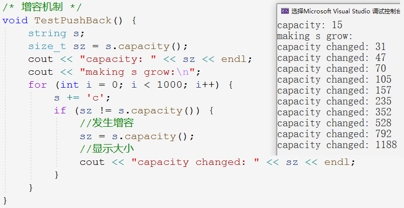

#  string

## 1. string 类的定义


C语言中，字符串以`'\0'`结尾的一些字符的集合。为操作方便，同时提供了一些关于 str 库函数，但这些库函数和字符串是分离的，并不符合面向对象的思想。

string 是 C++ 中管理字符数组的一个类，是 STL中的一个容器，把字符串交由 string 管理，减轻了编程难度。

[string官方文档](https://legacy.cplusplus.com/reference/string/string/)


~~~cpp
template <class T>
class basic_string {
    //...
private:
	T* str;
	//...
};

typedef basic_string<char> string; // string是模版类basic_string的一个实例
~~~

`string`是表示字符串的类。在底层上实际上是`basic_string`的别名。

> 在使用 string 类时，必须包含`#include<string>`头文件，以及展开命名空间。

## 2. string 类的接口

### 2.1 特殊成员函数

#### 构造函数

| 构造函数                                                 | 说明                          |
| -------------------------------------------------------- | ----------------------------- |
| **`string()`**                                           | **构造空string对象**          |
| **`string(const char* s)`**                              | **用C字符串构造**             |
| **`string(const string& s)`**                            | **拷贝构造函数**              |
| `string(const string& s, size_t pos, size_t len = npos)` | s对象的pos位置向后取len个长度 |
| `string(size_t n,char c)`                                | 构造 n 个字符 c 的类对象      |

~~~cpp
string s1;                  // 默认构造
string s2("hello string");  // 构造函数
string s3 = "hello string"; // 构造函数
string s4(s3);              // 拷贝构造
string s5(s3, 0);           // 构造函数
string s6(s3, 0, 25);       // 构造函数
string s7(10, '*');         // 构造函数
~~~

#### 赋值重载

| 赋值重载                                   | 说明                     |
| ------------------------------------------ | ------------------------ |
| **`string& operator=(const string& str)`** | **使用string对象赋值**。 |
| **`string& operator=(const char* s)`**     | **使用C字符串赋值**。    |
| `string& operator=(char c)`                | 用字符赋值。             |

~~~cpp
s7 = "ab"; // 赋值重载
s8 = s7;   // 赋值重载
~~~

### 2.2 容量操作

| 一般接口    | 说明                                           |
| ----------- | ---------------------------------------------- |
| **`size`**  | **返回 string 对象有效字符长度，不包含`\0`**。 |
| `length`    | 和 size 作用相同，历史习惯用法。               |
| `max_size`  | 字符串最长的大小。                             |
| `capacity`  | 返回对象所占空间总大小，vs下不包含`\0`。       |
| **`empty`** | **判断对象是否为空**。                         |
| **`clear`** | **清空有效字符，不包含`\0`**。                 |

~~~cpp
cout << s.size()     << endl; // 返回有效字符长度
cout << s.length()   << endl;
cout << s.max_size() << endl; // 最大长度
cout << s.capacity() << endl; // 所占空间
cout << s1.empty()   << endl; // 判空
s.clear();                    // 清空
~~~

#### 增容机制

<center>

</center>

第一次增容从16变到32，为2倍增长。之后就是 48、71、106 ……，为1.5左右的增速。这是vs下的增容机制。

Linux 下是每次按2倍增容。

<center>

</center>

<center>

</center>

起始分配的16个字节，是在栈上开辟的空间`_Buf`。之后再增容就全部拷贝到堆上`_Ptr`再增容。

#### 修改容量

| 容量接口      | 说明                                                         |
| ------------- | ------------------------------------------------------------ |
| **`reserve`** | **考虑到内存对齐，开辟指定大小左右的空间**                   |
| **`resize`**  | **将有效字符个数改成 n，多出的空间用字符 c 填充，未指定 c 则初始化为空字符。** |
|               | n < _size：指定大小比原长度小，则删去多余的内容；            |
|               | _size <= n <= _capacity：指定大小比容量小，则只扩大字符串的长度 _size； |
|               | n > _capacity：指定大小比容量大，则先扩充容量，再扩大字符串的长度 _size 。 |

~~~cpp
s.reserve(100); // 为字符串对象提前开辟好100左右字节的容量，以免之后的增容
s.reserve(10);  // 由于已开辟的空间大于指定的空间，故本次修改无效

s.resize(100);      // 修改有效字符个数为100个
s.resize(100, 'x'); // 修改有效字符个数为100个，新内容初始化为'x'
s.resize(10);       // 修改有效字符个数为100个，删除了多余的内容
~~~

`reserve`是修改空间容量大小、`resize`是修改有效字符个数。

`reserve`只能增容不能释放。`resize`修改字符个数的同时也有可能顺带增加容量，相当于修改容量加上初始化内容。

### 2.3 访问操作

| 下标访问                                        | 说明                             |
| ----------------------------------------------- | -------------------------------- |
| **`char& operator[] (size_t pos)`**             | **获取对象下标的字符，支持修改** |
| **`const char& operator[] (size_t pos) const`** | **获取对象下标的字符，禁止修改** |
| `char& at(size_t pos)`                          | 和`[]`作用一直，历史习惯用法     |
| ` char& back()`                                 | 获取末尾字符                     |
| `char& front()`                                 | 获取开头字符                     |

| 迭代器接口          | 说明                                                         |
| ------------------- | ------------------------------------------------------------ |
| **`begin`,`end`**   | **begin 返回起始位置的迭代器，end 返回尾字符的下一个位置的迭代器**。 |
| **`rbegin`,`rend`** | **rbegin 返回反向起始位置的迭代器，end 返回反向尾字符的下一个位置的迭代器**。 |
| `cbegin`,`cend`     | `begin`和`end`的 const 常量版本                              |

<center>

</center>

迭代器是专门为迭代遍历容器的一种机制。迭代器是一个对象，可以指向容器中的某个元素，通过迭代器就可以操作它指向的元素。所以迭代器可以想象成指针。

~~~cpp
string::iterator it = s.begin();
while (it != s.end())
{
    cout << *it << " ";
    it++;
}
cout << endl;
~~~

- **迭代器统一采用左闭右开的策略**，begin指向起始位置是有效元素，end指向末尾位置是无效位置。
- `iterator`是迭代器的类型名，但迭代器类型前必须指明类域，因为它是在类里定义的。
- 迭代器按照定义方式分成以下四种：正向迭代器、常量正向迭代器、反向迭代器、常量反向迭代器。

~~~cpp
//正向迭代器
string::iterator it = s.begin();
while (it != s.end()) {
    *it += 1;
    it++;
}
//反向迭代器
string::reverse_iterator rit = s.rbegin();
while (rit != s.rend()) {
    *rit -= 1;
    rit++;
}
//常量正向迭代器
string::const_iterator cit = s.cbegin();
while (cit != s.cend()) {
    cout << *cit << " ";
    cit++;
}
cout << endl;
//常量反向迭代器
string::const_reverse_iterator  crit = s.crbegin();
while (crit != s.crend()) {
    cout << *crit << " ";
    crit++;
}
cout << endl;
~~~

> 常量迭代器不支持对容器进行修改，一般用于常对象，或者防止函数内修改对象。

`[]`重载更方便快捷，所以 string 对象一般使用`[]`遍历。但迭代器是通用的，对于其他非线性的容器如树、图等，不支持使用`[]`访问遍历。

#### 范围 for

范围for循环被称为语法糖，自动判断范围大小。在实际编译时，范围 for 会被替换成迭代器。所以说，能用迭代器的容器就一定能用范围 for。

~~~cpp
for (auto& e : s) {
    e -= 1;
    cout << e << " ";
}
cout << endl;
~~~

### 2.4 修改操作

| 修改接口                                           | 说明                     |
| -------------------------------------------------- | ------------------------ |
| **`string& operator+= (const string& str)`**       | **追加字符串或字符**     |
| `void push_back(char c)`                           | 追加字符                 |
| `string& append(const string& str)`                | 追加字符串               |
| `string& assign(const string& str)`                | 覆盖有效数据，相当于赋值 |
| `string& insert(size_t pos, const string& str)`    | 指定位置插入             |
| `string& erase(size_t pos = 0, size_t len = npos)` | 指定位置删除             |

~~~cpp
s1.push_back('c'); // 尾插字符

s1.append("ddd"); // 尾插字符串
s1.append(s2);

s1 += "sss"; // += 字符串
s1 += s2;    // += 对象
~~~

`push_back`和`append`较为局限，`operator+=`可以尾插字符串、字符和 string 对象。

> insert，erase 使用不多，仅作了解即可。

C++中读取一行有两种接口：

| getline              | 函数声明                                            |
| -------------------- | --------------------------------------------------- |
| **全局函数 getline** | **`istream& getline (istream& is, string& str)`**   |
| cin 成员 getline     | `istream& istream::getline (char* s, streamsize n)` |

```cpp
string s;
getline(cin, s); // 推荐这种，可以直接使用string对象

char str[BUFF_SIZE] = {0};
cin.getline(buff, BUFF_SIZE);
```

### 2.5 查找操作

| 查找接口                                                     | 说明                 |
| ------------------------------------------------------------ | -------------------- |
| **`const char* c_str()`**                                    | **获取C格式字符串**  |
| **`size_t find (const string& str, size_t pos = 0)`**        | **指定位置顺序查找** |
| `size_t rfind (const string& str, size_t pos = npos)`        | 指定位置逆序查找     |
| `size_t find_first_of (const string& str, size_t pos = 0)`   | 顺序查找任意字符     |
| `size_t find_last_of (const string& str, size_t pos = npos)` | 逆序查找任意字符     |
| **`string substr (size_t pos = 0, size_t len = npos) `**     | **截取子串**         |

~~~cpp
string s1 = "hello world i love you";
size_t pos = s1.find(' ');

while (pos != string::npos)
{
    s1.replace(pos, 1, "%20");
    pos = s1.find(' ', pos + 3);
}

cout << s1 << endl;
~~~

&nbsp;

> 面试时常考察string的细节问题，由于时间关系，一般要求实现四大默认成员函数。涉及动态内存管理、深浅拷贝、异常处理等类和对象的基本功。

## 3. string类的实现

string 类针对四大默认成员函数的实现方法分为两种：传统写法和现代写法。

- 传统写法的 string 类，可读性高，
- 现代写法的 string 类，代码简洁，实现巧妙，代码维护性高。

### 3.1 string 类的传统写法

#### 构造析构

~~~cpp
string(const char* str = "")
    :_str(new char[strlen(str) + 1]) // 在堆上开辟和str一样大小的空间
{
    strcpy(_str, str);
}
~string() {
    delete[] _str;
    _str = nullptr;
}
~~~

- 构造函数初始化`_str`时，不可直接时用`str`初始化`_str`，以致`_str`存储在栈上无法实现增容等一系列操作。**须动态开辟一个和`str`一样大的空间，再将`str`的内容拷贝到`_str`中。**
- 构造函**数参数一般采用全缺省的形式**，因为`string s;`只构造对象不初始化时其值默认为空值`""`。


#### 拷贝构造

实际上两个对象应该有各自独立的字符串，**拷贝构造应实现二者内容相同，即实现深拷贝而非浅拷贝**。

~~~cpp
//拷贝构造
string(const string& s)
    :_str(new char[strlen(s._str) + 1])
{
    strcpy(_str, s._str);
}
~~~

#### 赋值重载

~~~cpp
string& operator=(const string& s) {
    if (this != &s) { // 避免自赋值
        char* tmp = new char[strlen(s._str) + 1]; // 先开辟空间再释放原空间
        strcpy(tmp, s._str);
        delete[] _str; //释放后再赋值，避免空间不够或浪费
        _str = tmp;
    }
    return *this;
}
~~~

1. 两个对象的`_str`变量不能直接进行拷贝，因为目标空间大小可能不够需要扩容，空间太大也会浪费空间。所以最好**先释放原空间再按照原字符串大小开辟新空间**。
2. **须避免自赋值**，因为释放`_str`也就释放了原字符串`s._str`，然后会导致将乱码拷贝给`_str`中。
3. 不要将`new`开辟的空间直接赋值给`_str`，因为`new`可能开辟失败抛异常并结束程序，此时已将`_str`释放掉。最好**开辟空间先赋值临时变量，再将临时变量赋值给`_str`**。

### 3.2 string 类的现代写法

> 现代写法实现的更加巧妙。

#### 拷贝构造

~~~cpp
string(const string& s)
    : _str(nullptr)
{
    string tmp(s._str); //利用构造函数构造出临时对象
    swap(_str, tmp._str);
}
~~~

必须将字符串`_str`初始化为空，不然等到出作用域，调用`tmp`的析构函数时释放`tmp._str`也就是随机值地址会出错。

<center>

</center>

#### 赋值重载

~~~cpp
string& operator=(const string& s)
{
    if (this != &s) {
        string tmp(s); //利用拷贝构造构造出临时对象
        swap(_str, tmp._str);
    }
    return *this;
}
// 更精炼版
string& operator=(string s)
{
    swap(_str, s._str);
    return *this;
}
~~~

1. `_str`和`tmp._str`的交换，达到了一石二鸟的效果：
   - 利用临时对象将`s`的数据交换到了操作对象中，相当于进行了赋值。
   - 和拷贝构造不同的是，`_str`指向的原有数据，经交换后在析构函数内被`tmp._str`顺带释放，就无需手动释放了。

2. 更精炼版利用传值调用产生临时拷贝的特点，直接使用`s`当作临时对象，免去构造临时对象`tmp`，同时也能达到顺带释放的效果。
   - 但由于传值拷贝的特点，无法判断自赋值的情况，不过并不影响程序运行。

### 3.3 string 类的模拟实现

~~~cpp
/* 传统写法 */
//构造函数
string(const char* str)
    : _size(strlen(str))
    , _capacity(_size)
{
    _str = new char[_capacity + 1];
    strcpy(_str, str);
}
//拷贝构造
string(const string& s)
    : _size(s._size)
	, _capacity(s._capacity)
{
    _str = new char[_capacity + 1];
    strcpy(_str, s._str);
}
//赋值重载
string& operator=(const string& s)
{
    if (this != &s) {
        char* tmp = new char[s._capacity + 1];
        strcpy(tmp, s._str);
        delete[] _str;
        _str = tmp;
        _size = s._size;
        _capacity = s._capacity;
    }
    return *this;
}
//析构函数
~string()
{
    delete[] _str;
    _str = nullptr;
    _size = _capacity = 0;
}
/* 现代写法 */
//swap 交换两个对象的成员变量
void swap(string& s)
{
    std::swap(_str, s._str);
    std::swap(_size, s._size);
    std::swap(_capacity, s._capacity);
}
//拷贝构造
string(const string& s)
    : _str(nullptr)
{
    string tmp(s._str);
    swap(tmp);
}
//赋值重载
string& operator=(string s)
{
    swap(s);
    return *this;
}
~~~

> 默认成员函数实现完毕，接下来就是实现 string 类的增删查改的细节。

#### resize

将有效字符个数改成 n，多出的空间用字符 c 填充，未指定 c 则初始化为空字符。故分为三种情况：

1. n < \_size：指定大小比原长度小，则删去多余的内容；
2. \_size <= n <= _capacity：指定大小比容量小，则只扩大字符串的长度 _size；
3. n > _capacity：指定大小比容量大，则先扩充容量，再扩大字符串的长度 _size 。

~~~cpp
void resize(size_t n, char ch = '\0')
{
    if (n < _size)
    {
        _size = n;
        _str[_size] = '\0';
    }
    else /* n >= _size */
    {
        if (n > _capacity)
            reserve(n);

        memset(_str + _size, ch, n - _size);
        _size = n;
        _str[_size] = '\0';
    }
}
~~~

#### insert

~~~cpp
string& insert(size_t pos, char ch)
{
    assert(pos <= _size); //== 时尾插

    if (_size == _capacity)
        reserve(_capacity == 0 ? 4 : _capacity * 2);

    //后移一位 [pos,_size]
    size_t end = _size + 1;
    while (end > pos)
    {
        _str[end] = _str[end - 1];
        end--;
    }

    _size++;
    _str[pos] = ch; //插入元素 pos
    return *this;
}

string& insert(size_t pos, const char* str)
{
    assert(pos <= _size);

    size_t len = strlen(str);
    if (_size + len >= _capacity)
        reserve(_size + len);


    size_t end = _size + 1;
    while (end > pos)
    {
        _str[end - 1 + len] = _str[end - 1];
        end--;
    }

    _size += len;
    strncpy(_str + pos, str, len);//插入字符串 pos
    return *this;
}

string& insert(size_t pos, const string& s)
{
    assert(pos < _size);
    insert(pos, s._str);
    return *this;
}
~~~

end 与 pos 比较，尤其是步进条件为 end–– ，当 pos == 0 时，end会从零减到无符号整数的最大值。

插入前须先将元素后移，end 从后向前遍历，始终在所移元素的后一个位置，利用str[i]=str[i-1]将元素后移。

<center>

</center>

[面试string类的一种正确写法 CoolShell](https://coolshell.cn/articles/10478.html)

[string的“读时也拷贝”技术  CoolShell](https://coolshell.cn/articles/1443.html)

[string的 Copy-On-Write 技术 CoolShell](https://coolshell.cn/articles/12199.html#特性)
