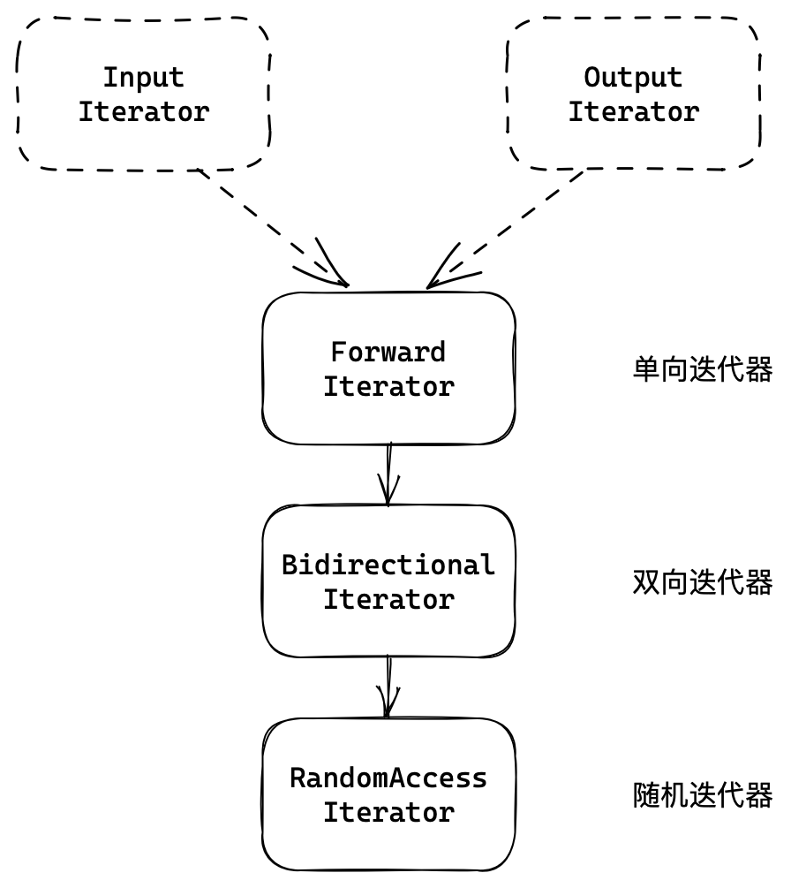
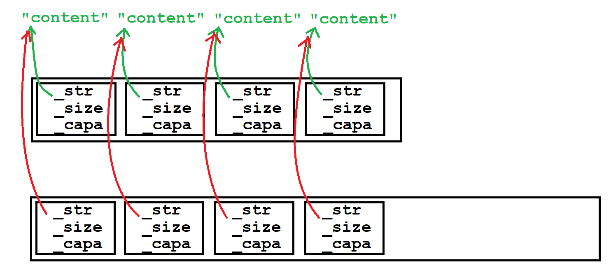

# vector

vector是用数组实现的、可变长度的顺序容器，本质是一种类模板。

~~~cpp
template <
	class T, // 元素类型
	class Alloc = allocator<T> > // 空间配置器类型

class vector; // 类模板声明
~~~

## 1. vector的接口

### 1.1 默认成员函数

| 接口声明                                                  | 解释                       |
| --------------------------------------------------------- | -------------------------- |
| **`vector()`**                                            | **默认构造**               |
| `vecotr(size_type n, const_value_type& val=value_type())` | 填充构造，填充n个元素      |
| `vector(InputIter first, InputIter last)`                 | 范围构造，迭代器区间初始化 |
| **`vector(const vector& v)`**                             | **拷贝构造**               |
| **`vector& operator=(const vector& x)`**                  | **赋值重载**               |

### 1.2 容量操作

| 容量操作                                                     | 解释                           |
| ------------------------------------------------------------ | ------------------------------ |
| **`size_type size()`**                                       | **元素个数**                   |
| **`size_type capacity()`**                                   | **容量大小**                   |
| `size_type max_size()`                                       | 最大能存储的元素个数（无意义） |
| **`void resize(size_type n, value_type val = value_type());`** | **增减有效元素个数**           |

~~~cpp
v.reserve(100);   // 扩容到100
v.resize(100, 1); // 有效元素个数变为100,新增元素初始化为1
v.resize(10);     // 有效元素个数变为10
~~~

<center>

</center>

> 由图可知，vs下vector按1.5倍增容。

### 1.3 访问操作

| 接口声明                                         | 解释                   |
| ------------------------------------------------ | ---------------------- |
| **`reference operator[](size_type n)`**          | **返回下标位置的引用** |
| `const_reference operator[] (size_type n) const` |                        |
| `reference at(size_type n)`                      |                        |
| `const_reference at (size_type n) const`         |                        |

`[]`重载和`at`的区别是，`[]`越界会断言报错，`at`是抛异常。

| 迭代器接口      | 解释                             |
| --------------- | -------------------------------- |
| `begin`         | 起始位置的迭代器                 |
| `end`           | 末尾元素的下一个位置的迭代器     |
| `rbegin`        | 反向起始位置的迭代器             |
| `rend`          | 反向末尾元素的下一个位置的迭代器 |
| `cbegin`,`cend` | begin 和 end 的 const 版本       |

`[]`重载就已经能方便的访问 vector，但并不意味着放弃迭代器。大部分容器都支持迭代器访问，且迭代器使用简单规范统一。

STL 中容器的迭代器区间都是采用 $[first,last)$ 左闭右开的方式。

~~~cpp
//[]
for (size_t i = 0; i < v.size(); i++) {
    v1[i] += 1;
}

//iterator
vector<int>::iterator it = v.begin();
while (it != v.end()) {
    cout << *it << " ";
    it++;
}

for (auto e : v) {
    cout << e << " ";
}
~~~

### 1.4 修改操作

| 接口声明                                                     | 解释                   |
| ------------------------------------------------------------ | ---------------------- |
| **`void push_back (const value_type& val)`**                 | **尾插**               |
| **`void pop_back()`**                                        | **尾删**               |
| **`iterator insert (iterator pos, const value_type& val)`**  | **迭代器位置插入**     |
| `void insert (iterator pos, size_type n, const value_type& val);` | 迭代器位置插入         |
| `void insert (iterator pos, InputIter first, InputIter last)` | 迭代器位置插入一段区间 |
| **`iterator erase (iterator pos)`**                          | **迭代器位置删除**     |
| `iterator erase (iterator first, iterator last)`             | 删除一段迭代器区间     |
| `void assign (size_type n, const value_type& val)`           | 覆盖数据               |

~~~cpp
v.insert(ret, 30);
v.insert(ret, 2, 30);
v.insert(ret, v2.begin(), v2.end());
v1.erase(pos);
v1.erase(v1.begin(), v1.end());
~~~

```cpp
#include <algorithm>
// 查找接口
template <class InputIter, class T>
   InputIter find (InputIter first, InputIter last, const T& val);
```

&nbsp;

## 2. vector的模拟实现

<center>

</center>

### 2.1 类的定义

~~~cpp
template <class T, class Alloc = alloc>
class vector {
public:
    typedef T* iterator;
    // ...
private:
    iterator start;
    iterator finish;
    iterator end_of_storage;
}
~~~

这个结构和顺序表结构稍有不同，但本质是一样的。只是将容量和元素个数的变量用指向对应位置的迭代器代替。

~~~cpp
class Seqlist {
    T* _a;            /* start */
    size_t _size;     /* finish - start */
    size_t _capacity; /* end_of_storage - start */
}
~~~

### 2.2 默认成员函数

~~~cpp
//default constructor
vector()
    : _start(nullptr)
    , _finish(nullptr)
    , _end_of_storage(nullptr)
{}
//fill constructor
vector(size_t n, const T& val = T()) // 引用临时对象可延长其声明周期
    : _start(nullptr)
    , _finish(nullptr)
    , _end_of_storage(nullptr)
{
    resize(n, val);
}
//copy constructor
vector(const vector<T>& v)
    : _start(nullptr)
    , _finish(nullptr)
    , _end_of_storage(nullptr)
{
    _start = new T[v.capacity()];
    for (size_t i = 0; i < v.capacity(); i++)
    {
        _start[i] = v._start[i];
    }
    _finish = _start + v.size();
    _end_of_storage = _start + v.capacity();
}
~~~

~~~cpp
//range constructor
template <class InputIterator>
vector(InputIterator first, InputIterator last)
    : _start(nullptr)
	, _finish(nullptr)
	, _end_of_storage(nullptr)
{
	while (first != last)
	{
		push_back(*first++);
    }
}
//destructor
~vector()
{
    delete[] _start;
    _start = _finish = _end_of_storage = nullptr;
}

// 现代写法
//copy constructor
vector(const vector<T>& v)
    : _start(nullptr)
	, _finish(nullptr)
	, _end_of_storage(nullptr)
{
    vector<T> tmp(v.begin(), v.end());
    swap(tmp);
}
//operator=
vector<T>& operator=(vector<T> v)  /* pass by value */
{
    swap(v);
    return *this;
}
~~~

> 从范围构造可以看出类模板中的函数也可以是函数模板。

#### 迭代器的分类

函数模板的模板参数要传迭代器区间时，命名是有规定的，范围构造中的`InputIterator`就是一种指定的迭代器类型。因容器的结构各有不同，迭代器分为五种类型：

| 名称            | 特性                                   | 适用容器              |
| --------------- | -------------------------------------- | --------------------- |
| 输入/输出迭代器 | 只读迭代器只能读取，只写迭代器可以写入 | 无实际容器            |
| 单向迭代器      | ++，读写                               | forward_list          |
| 双向迭代器      | ++，––，读写                           | list, map, set        |
| 随机迭代器      | ++，––，+，–，读写                     | deque, vector, string |

可以看出，下方的迭代器类型是上方的父类，也就是说**下方迭代器满足上方的所有要求**。

<center>

</center>

划分出不同的迭代器类型，是为了限制传入的迭代器，因为其必须满足要求才能完成接下来的函数。

函数指明迭代器为`InputIterator`，意味着满足要求的迭代器都可以传入，起提示的作用。

> 当然，模版不区分类型，语法上所有迭代器都可以传入，但可能无法完成编译。

### 2.3 容量接口

#### memcpy 浅拷贝问题

~~~cpp
vector<string> v;
v.push_back("11111111111111");
v.push_back("11111111111111");
v.push_back("11111111111111");
v.push_back("11111111111111");
v.push_back("11111111111111"); // 增容浅拷贝
~~~

出现问题是因为正好数组需要增容。模拟实现的`reserve`函数使用`memcpy`将原空间的内容按字节拷贝至新空间。

1. 若 vector 存储的是内置类型，则浅拷贝没问题。
2. 若 vector 存储的是自定义类型，浅拷贝使得新旧变量指向同一块空间。深拷贝调用拷贝构造或者赋值重载。

<center>

</center>

~~~cpp
void reserve(size_t n)
{
    if (n > capacity())
    {
        T* tmp = new T[n];
        size_t oldSize = size();

        if (_start)
        {
            //memcpy(tmp, _start, size() * sizeof(T)); // err
            for (int i = 0; i < size(); i++)
            {
                tmp[i] = _start[i];//_start指向的空间存任意类型都能完成深拷贝
            }

            delete[] _start;
        }

        _start = tmp;
        _finish = _start + oldSize;
        _end_of_storage = _start + n;
    }
}
~~~

```cpp
void resize(size_t n, T val = T())
{
    if (n > size())
    {
        reserve(n);
        while (_finish != _start + n)
        {
            *_finish = val;
            ++_finish;
        }
    }
    else
    {
        _finish = _start + n;
    }
}
```

### 2.4 修改接口

~~~cpp
iterator insert(iterator pos, const T& val)
{
    assert(_start <= pos && pos <= _finish); // 检查pos位置是否合法
    // 增容
    if (_finish == _end_of_storage)
    {
        size_t sz = pos - _start;
        reserve(capacity() == 0 ? 4 : capacity() * 2); //增容会导致迭代器失效，迭代器位置陈旧
        pos = _start + sz; //增容后更新pos
    }

    // 后移 [pos,_finish)
    for (iterator end = _finish; end > pos; --end)
    {
        *end = *(end - 1);
    }

    // 插入
    *pos = val;
    ++_finish;
    return pos; //返回迭代器最新位置
}
~~~

- 增容改变`_start`，但迭代器`pos`并没有跟着改变，仍然指向原空间，也就是迭代器失效。
- 迭代器`pos`实参并没有改变仍然指向错误位置，故函数返回更新的`pos`。

```cpp
iterator erase(iterator pos)
{
    assert(_start <= pos && pos < _finish);

    for (iterator begin = pos + 1; begin < _finish; begin++)
    {
        *(begin - 1) = *begin;
    }

    _finish--;
    return pos; //返回删除数据的下一个位置
}
```


- erase **挪动数据后 pos 指向元素会发生变化**，同样会导致迭代器失效。
- 返回删除数据的下一个位置，通过返回值更新迭代器。

&nbsp;

## 3. vector的oj题

| 题目                                                         | 题解                                                         |
| ------------------------------------------------------------ | ------------------------------------------------------------ |
| [只出现一次的数字](https://leetcode.cn/problems/single-number/description/) | [【简洁明了】只出现一次的数字 I](https://leetcode.cn/problems/single-number/solutions/2148111/jian-ji-ming-liao-zhi-chu-xian-yi-ci-de-resn0/) |
| [杨辉三角](https://leetcode.cn/problems/pascals-triangle/description/) | [【简洁明了】cpp 杨辉三角](https://leetcode.cn/problems/pascals-triangle/solutions/2148504/jian-ji-ming-liao-cpp-yang-hui-san-jiao-r68z0/?orderBy=newest_to_oldest) |
| [删除有序数组中的重复项](https://leetcode.cn/problems/remove-duplicates-from-sorted-array/) | [【双指针 简单明了】数组去重](https://leetcode.cn/problems/remove-duplicates-from-sorted-array/solutions/2148460/shuang-zhi-zhen-jian-dan-ming-liao-shu-z-9p32/?orderBy=newest_to_oldest) |
| [只出现一次的数字 II](https://leetcode.cn/problems/single-number-ii/) | [【简单明了 注释】只出现一次的数字](https://leetcode.cn/problems/single-number-ii/solutions/2149532/jian-dan-ming-liao-zhu-shi-zhi-chu-xian-1iwno/) |
| [只出现一次的数字 III](https://leetcode.cn/problems/single-number-iii/) | [【详细解析】只出现一次的数字 系列 I II III](https://leetcode.cn/problems/single-number-iii/solutions/2152031/xiang-xi-jie-xi-zhi-chu-xian-yi-ci-de-sh-1vsp/) |
| [多数元素](https://leetcode.cn/problems/majority-element/description/) | [【哈希 排序 投票】三种解法 简洁明了](https://leetcode.cn/problems/majority-element/solutions/2148590/ha-xi-pai-xu-tou-piao-san-chong-jie-fa-j-qzoi/) |
| [连续子数组的最大和](https://leetcode.cn/problems/lian-xu-zi-shu-zu-de-zui-da-he-lcof/) | [【动归】连续子数组的最大和](https://leetcode.cn/problems/lian-xu-zi-shu-zu-de-zui-da-he-lcof/solutions/2148610/dong-gui-lian-xu-zi-shu-zu-de-zui-da-he-ovcf3/) |
| [电话号码的字母组合](https://leetcode-cn.com/problems/letter-combinations-of-a-phone-number/) | [【注释解析 回溯】电话号码字母组合](https://leetcode.cn/problems/letter-combinations-of-a-phone-number/solutions/2148604/zhu-shi-jie-xi-hui-su-dian-hua-hao-ma-zi-uokb/) |
