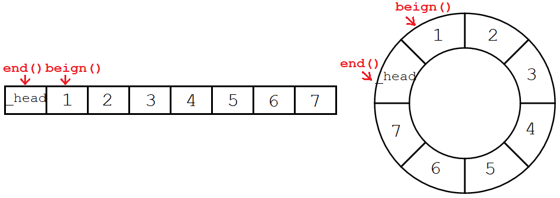
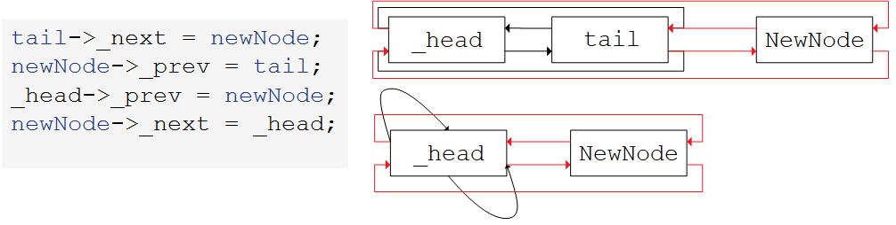

# list

[list (cplusplus.com)](http://www.cplusplus.com/reference/list/list/)

list是双向链表，forward_list是单向链表。

~~~cpp
template <
	class T, //模板参数T
	class Alloc = allocator<T> //空间配置器
         >
class list; //类模板
~~~

> 关于链表，数据结构处已经讨论过，不再赘述。

## 1. list的使用

### 1.1 增删查改

| 默认成员函数                                                 | 说明           |
| ------------------------------------------------------------ | -------------- |
| **`list ()`**                                                | **默认构造**   |
| `list (size_type n, const value_type& val = value_type())`   | 填充构造       |
| `list (InputIter first, InputIter last)`                     | 范围构造       |
| `list (const list& li)`                                      | 拷贝构造       |
| `list& operator= (const list& x)`                            | 赋值重载       |
| **访问接口**                                                 | **说明**       |
| **`reference front()`**                                      | **取头元素**   |
| `reference back()`                                           | 取尾元素       |
| **容量接口**                                                 | **说明**       |
| `bool empty() const`                                         | 判空           |
| `size_type size() const`                                     | 元素个数       |
| `void resize (size_type n, value_type val = value_type())`   | 修改元素个数   |
| **修改接口**                                                 | **说明**       |
| **`void push_front (const value_type& val)`**                | **头插**       |
| **`void pop_front()`**                                       | **头删**       |
| **`void push_back (const value_type& val)`**                 | **尾插**       |
| **`void pop_back()`**                                        | **尾删**       |
| **`iterator insert (iterator position, const value_type& val)`** | **迭代器插入** |
| `void insert (iterator position, size_type n, const value_type& val)` | 迭代器插入     |
| `void insert (iterator position, InputIter first, InputIter last)` | 迭代器插入     |
| **`iterator erase (iterator position)`**                     | **迭代器删除** |
| `iterator erase (iterator first, iterator last)`             | 迭代器删除     |
| `void assign (InputIter first, InputIter last)`              | 重置链表       |
| `void assign (size_type n, const value_type& val)`           | 重置链表       |
| `void clear()`                                               | 清空链表       |

### 1.2 功能接口

| **功能接口**                                                 | **说明**         |
| ------------------------------------------------------------ | ---------------- |
| `void reverse()`                                             | 逆置链表         |
| `void sort(Compare comp = cmp)`                              | 排序链表         |
| `void unique()`                                              | 链表去重         |
| `void remove (const value_type& val)`                        | 删除所有指定元素 |
| `void merge (list& x, Compare comp = cmp`                    | 归并两个链表     |
| `void splice (iterator position, list& x)`                   | 接合整个链表     |
| `void splice (iterator position, list& x, iterator i)`       | 接合单个元素     |
| `void splice (iterator position, list& x, iterator first, iterator last)` | 接合一段区间     |

~~~cpp
lt.sort();
~~~

list 不支持随机访问，所以不支持算法库中的 sort。

单独内置一个 sort 接口，使用的是归并排序，但效率不高。当需要对数据进行排序的时候，不要选择链表。

~~~cpp
lt.sort();
lt.unique();
~~~

去重接口可以去掉链表中的重复元素，但**前提是需先将链表排成有序状态**。

~~~cpp
lt.remove(1);
~~~

删除链表中所有指定值的元素，不是指定下标位置的元素。

~~~cpp
lt.splice(pos, list);              // 转移整个链表
lt.splice(pos, list, i);           // 转移单个节点
lt.splice(pos, list, first, last); // 转移一段区间
~~~

接合函数能将一个链表中的一个或多个节点，转移到另一个链表中的指定迭代器位置。可转移整个链表，可转移链表内的一个元素，转移一个迭代器区间。

**splice 的功能是转移不是拷贝**，原链表中的该节点将不复存在。

&nbsp;

> list 不支持随机访问，实际中用的不多。list 的重点在于模拟实现。

## 2. list的模拟实现

### 2.1 list的定义

~~~cpp
// listnode
template<class T>
struct __list_node
{
    __list_node<T>* _prev;
    __list_node<T>* _next;
    T _data;

    __list_node<T>(const T& t = T())
        : _data(t), _prev(nullptr), _next(nullptr)
    {}
};

// list
template <class T>
class list
{
public:
    typedef __list_node<T> Node;
    list() {
        empty_init();
    }
private:
    Node* _head;
}
~~~

__list_node 是链表节点类，list 是链表类，他的成员是 \_\_list_node 类型的指针，作链表的带头节点。

> 一般供他人使用的类，都用 struct 定义，因为 struct 定义的类成员默认都是公有的。

### 2.2 默认成员函数

~~~cpp
/* default constructor */
void empty_init()
{
	_head = new Node(x);
    _head->_prev = _head;
    _head->_next = _head;
}

list()
{
    empty_init();
}
~~~


```cpp
/* copy constructor */
//传统写法
list<T>(const list<T>& lt)
{
    empty_init();
    for (auto e : lt)
        push_back(e);
}
//现代写法
list<T>(const list<T>& lt)
{
	empty_init();
	list<T> tmp(lt.begin(), lt.end());
    swap(_head, tmp._head);
}
```

~~~cpp
/* = operator */
//传统写法
list<T>& operator=(const list<T>& lt)
{
    if (this != &lt) {
        clear();
        for (auto e : lt)
            push_back(e);
    }
    return *this;
}
//现代写法
list<T>& operator=(list<T> lt)
{
    swap(_head, lt._head);
    return *this;
}
~~~

```cpp
/* deconstructor */
void clear()
{
    iterator it = begin();
    while (it != end())
    {
        it = erase(it);
    }
}

~list<T>()
{
    clear();
    delete _head;
}
```

### 2.3 迭代器

迭代器模拟指针，意图像指针一样遍历容器。

list 的底层实现并不是 vector 一样的连续空间，而是通过节点地址链接前后，故 list 实现上述操作就需要自行实现一个迭代器类再重载这些运算符。

#### 正向迭代器

~~~cpp
template<class T, class Ref, class Ptr>
struct __list_iterator
{
    typedef __list_node<T> list_node;
    typedef __list_iterator<T, Ref, Ptr> self;

    __list_iterator(list_node* n) : _node(n)
    {}

    Ref operator*() {
        return _node->_data;
    }
    Ptr operator->() {
        return &_node->_data;
    }

    self& operator++() {
        _node = _node->_next;
        return *this;
    }
    self& operator--() {
        _node = _node->_prev;
        return *this;
    }

    bool operator!=(const self& s) {
        return _node != s._node;
    }

    list_node* _node;
};
~~~

> list 容器的迭代器是双向迭代器，不支持随机访问，没有重载`+,+=,-,-=`。

迭代器的拷贝构造、赋值重载都只需要浅拷贝指针。析构函数无需释放任何资源，节点交由链表进行管理。所以这些编译器默认生成就可以。

##### 解引用箭头

~~~cpp
template <class T, class Ref, class Ptr> // 交由list类控制
struct __list_iterator
{
	typedef __list_iterator<T, Ref, Ptr> iterator;
    Ref operator* () { return  _node->_data; }
    Ptr operator->() { return &_node->_data; }
    //...
};

class list
{
public:
    typedef __list_iterator<T, T&, T*> iterator;                   // 传入普通类型
    typedef __list_iterator<T, const T&, const T*> const_iterator; // 传入常量类型
}
~~~

可以给迭代器类增加引用和指针类型的模版参数，分别给`*`和`->`重载函数返回值使用。

相当于把具体的元素引用和指针类型交给外界控制。就不需要单独实现一个常量迭代器了。


当元素是自定义类型时，箭头操作符可以让迭代器直接访问到自定义类型的内部成员。如：

```cpp
struct AA
{
    AA(int a1 = 0, int a2 = 0) : _a1(a1), _a2(a2) {}
    int _a1;
    int _a2;
};

void test_list()
{
    list<AA> lt;
    lt.push_back(AA(1, 1));
    lt.push_back(AA(2, 2));

    list<AA>::iterator it = lt.begin();
    while (it != lt.end())
    {
        cout << it->_a1 << ":" << it->_a2 << " "; // ->直接访问AA内部成员
        ++it;
    }
    cout << endl;
}
```

> `it->AA()->_a1`，省略了一个`->`。

#### 反向迭代器

反向迭代器同样是个适配器，所以它被单独实现在一个文件中。

~~~cpp
template <class Iterator, class Ref, class Ptr>
struct reverse_iterator
{
    Iterator _it;
    typedef reverse_iterator self;

    reverse_iterator(Iterator it) // 利用正向迭代器构造出反向迭代器
        :_it(it)
    {}

    self& operator++() // 反向迭代器++，就是正向迭代器--
    {
        --_it;
        return *this;
    }

    self& operator--() // 反向迭代器--，就是正向迭代器++
    {
        ++_it;
        return *this;
    }

    bool operator!=(const self& it) // 反向迭代器是否相等，就是正向迭代器是否相等
    {
        return _it != it._it;
    }

    Ref operator*()
    {
        Iterator tmp = _it;
        return *--tmp;       // 前一个位置的迭代器
    }
    Ptr operator->()
    {
        Iterator tmp = _it;
        return &*--tmp;
    }
};
~~~

> 反向迭代器是对正向迭代器的封装。源码实现使用类型萃取难度较高，我们不使用。

反向迭代器解引用和箭头不是访问当前位置，而是**前一个位置**。

```cpp
//list源码
iterator begin() { return (link_type)((*node).next); }
iterator end() { return node; }

reverse_iterator rbegin() { return reverse_iterator(end()); }
reverse_iterator rend() { return reverse_iterator(begin()); }

const_iterator begin() const { return (link_type)((*node).next); }
const_iterator end() const { return node; }

const_reverse_iterator rbegin() const { return const_reverse_iterator(end()); }
const_reverse_iterator rend() const { return const_reverse_iterator(begin()); }
```

**所有容器的迭代器`begin/end()`和`rbegin/rend()`指向的位置正好对应相反**。目的是设计出对称形式，因此解引用时返回的是上一个位置的数据。


#### 迭代器接口

~~~cpp
template<class T>
class list
{
public:
    typedef __list_iterator<T, T&, T*> iterator;
    typedef __list_iterator<T, const T&, const T*> const_iterator;
    typedef reverse_iterator<iterator, T&, T*> reverse_iterator;
    typedef reverse_iterator<const_iterator, const T&, const T*> const_reverse_iterator;

    iterator begin() { return iterator(_head->_next); }
    iterator end()   { return iterator(_head); }

    const_iterator begin() const { return const_iterator(_head->_next); }
    const_iterator end()   const { return const_iterator(_head); }

    reverse_iterator rbegin() { return reverse_iterator(end()); }
    reverse_iterator rend()   { return reverse_iterator(begin()); }

    const_reverse_iterator rbegin() const { return const_reverse_iterator(end()); }
    const_reverse_iterator rend()   const { return const_reverse_iterator(begin()); }
};
~~~




### 2.4 基本功能

~~~cpp
iterator insert(iterator pos, const T& x)
{
    Node* newNode = new Node(x);
    Node* prev = pos._node->_prev;
    Node* cur = pos._node;

    // prev - newNode - cur
    prev->_next = newNode;
    newNode->_prev = prev;

    cur ->_prev = newNode;
    newNode->_next =  cur;

    return iterator(newNode); //返回迭代器
}
iterator erase(iterator pos)
{
    assert(pos != end());

    Node* prev = pos._node->_prev;
    Node* next = pos._node->_next;

    delete pos._node;

    // prev - pos - after
    prev->_next = next;
    next->_prev = prev;

    return iterator(next);
}
~~~

- list 的插入操作迭代器不会失效，因为迭代器 pos 的值不会改变，始终指向原来的节点。
- list 的删除操作迭代器一定失效，因为节点已经被释放了，应修正为 pos 下一个位置。



```cpp
void push_back(const T& x) { insert(end(), x); }
void push_front(const T& x) { insert(begin(), x); }

void pop_back() { erase(--end()); }
void pop_front() { erase(begin()); }
```

&nbsp;

## 3. list对比vector

| 容器       | vector                                  | list                               |
| ---------- | --------------------------------------- | ---------------------------------- |
| 底层结构   | 连续物理空间                            | 空间不连续                         |
| 随机访问   | 支持随机访问                            | 不支持随机访问                     |
| 插入删除   | 非尾部插入删除要移动数据，效率低 $O(n)$ | 任意位置的插入删除效率高 $O(1)$    |
| 空间利用率 | 增容代价大，倍数扩容存在一定的空间浪费  | 按需申请空间，不存在浪费           |
| 迭代器     | 原生指针支持随机访问                    | 迭代器类模拟指针行为，支持双向访问 |
| 适用场景   | 高效存储，随机访问，不关心增删效率      | 频繁使用插入删除，不关心随机访问   |

vector与list两种容器各有优劣，实际上vector用的更多些。因为vector支持随机访问，其次空间浪费也不是太严重的问题。
