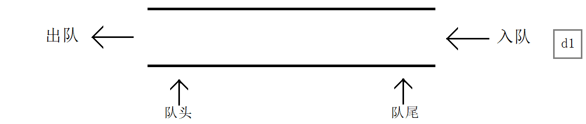
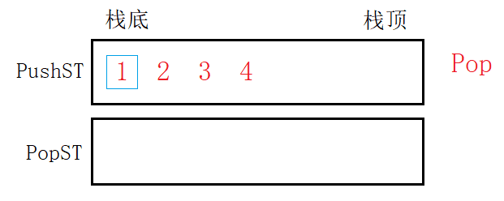
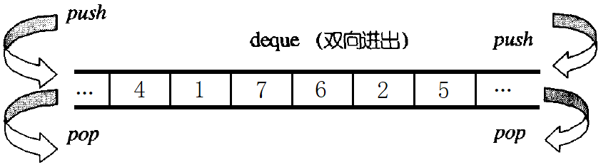
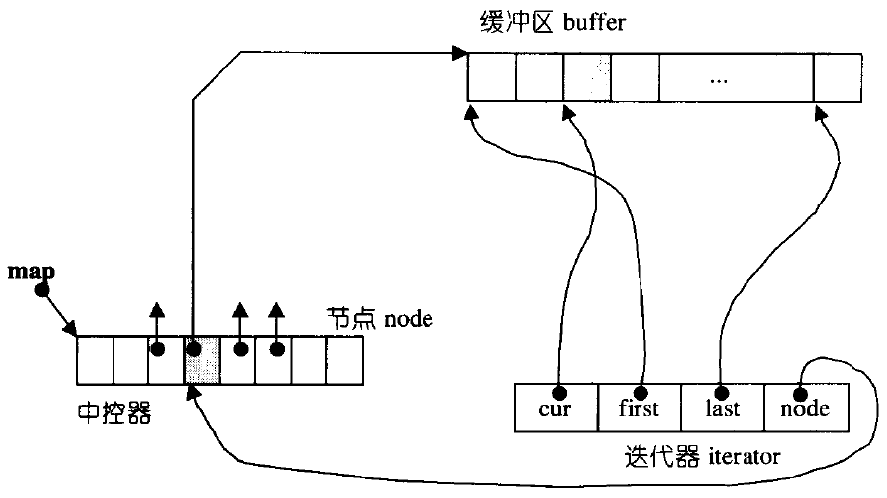
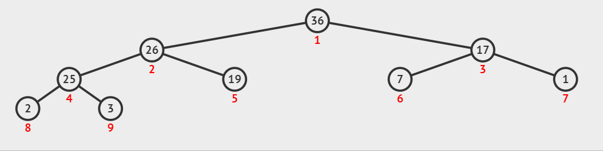
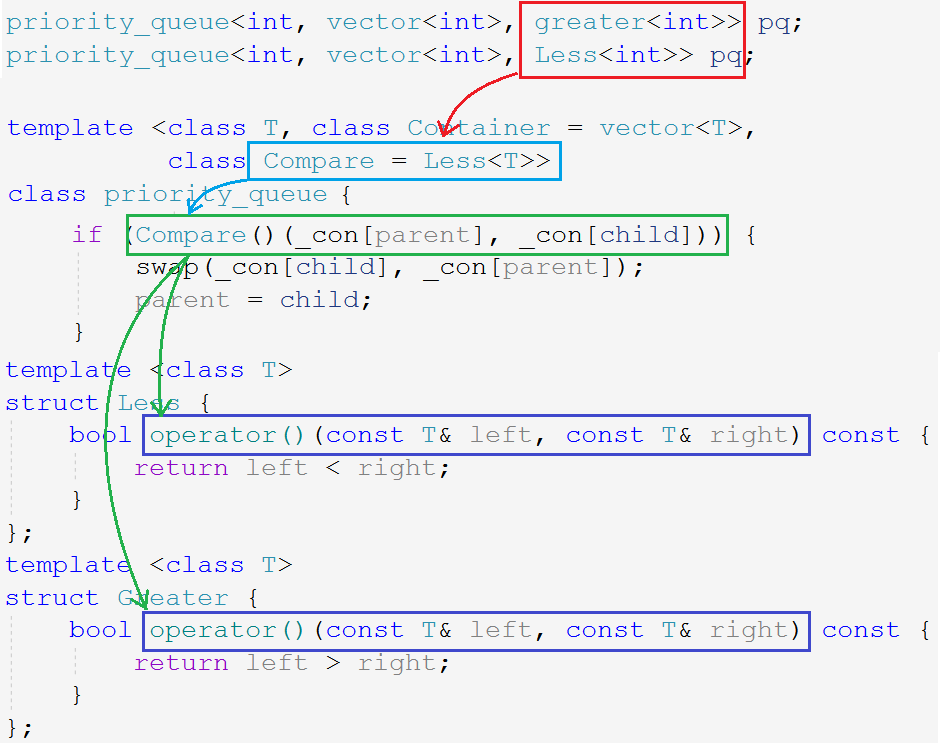

# stack&queue

## 1. 介绍

### 1.1 stack

栈是一种特殊的线性表，只允许固定一端进行插入和删除。

能够插入删除的一端被称为栈顶，另一端被称为栈底。栈的元素遵循后进先出的原则。

> 栈的插入被称为压栈、进栈、入栈，删除被称为出栈、弹栈。

后进先出，先进后出，$LIFO$ 原则（Last In First Out）。

<center>

</center>

### 1.2 queue

队列同样是一种特殊的线性表，和栈相反，队列只允许在其一端进行插入而在另一端进行删除。

插入数据的一端被称为队尾，删除的另一端被称为队头。队列的元素遵循先进先出的原则。

> 入队列就是队尾插入数据，出队列就是队头删除数据。

先进先出，后进后出，即 $FIFO$ 原则（First In First Out）。

<center>

</center>

&nbsp;

## 2. 接口

### 2.1 stack

STL中的栈和队列不是容器而是容器适配器。

~~~cpp
template <class T, class Container = deque<T> >
class stack;
~~~

stack 的底层可以使用任何容器，只要该容器支持`empty`、`back`、`push_back`、`pop_back`这些接口。如果没有为stack指定底层容器，默认使用deque。

| 接口声明                                                     | 解释     |
| ------------------------------------------------------------ | -------- |
| `explicit stack (const container& ctnr = container())`       | 构造函数 |
| `bool empty() const`                                         | 判空     |
| `size_type size() const`                                     | 元素个数 |
| `value_type& top()`                                          | 栈顶元素 |
| `void push (const value_type& val)`                          | 尾插     |
| `void pop()`                                                 | 尾删     |
| `bool operator== (const stack<T,Ctnr>& lhs, const stack<T,Ctnr>& rhs)` | 关系运算 |

### 2.2 queue

```cpp
template <class T, class Container = deque<T> >
class queue;
```

queue也是容器适配器。底层容器要求和stack一样。

| 接口声明                                                     | 解释     |
| ------------------------------------------------------------ | -------- |
| `explicit queue (const container& ctnr = container())`       | 构造函数 |
| `bool empty() const`                                         | 判空     |
| `size_type size() const`                                     | 元素个数 |
| `value_type& front()`                                        | 队头元素 |
| `value_type& back()`                                         | 队尾元素 |
| `void push (const value_type& val)`                          | 尾插     |
| `void pop()`                                                 | 头删     |
| `bool operator== (const stack<T,Ctnr>& lhs, const stack<T,Ctnr>& rhs)` | 关系运算 |

## 3. OJ

### 3.1 最小栈

[最小栈](https://leetcode-cn.com/problems/min-stack/)

~~~cpp
class MinStack {
public:
    void push(int val) {
        st.push(val);
        if (minST.empty() || val <= minST.top()) {
            minST.push(val);
        }
    }
    void pop() {
        if (st.top() == minST.top()) {
            minST.pop();
        }
        st.pop();
    }
    int top() {
        return st.top();
    }
    int getMin() {
        return minST.top();
    }
private:
    stack<int> st;
    stack<int> minST;
};
~~~

准备两个栈，一个用来正常入栈出栈，一个用来存储最小值。

1. 当入栈元素大于当前最小值时，只入到普通栈，不入最小栈。
2. 当入栈元素小于等于当前最小值时，将其入到普通栈，也入到最小栈中。

出栈时，判断栈顶元素是否和最小值相等，相等则把最小栈中的元素也弹出。

<center>

</center>

### 3.2 验证栈序列

[验证栈序列](https://leetcode.cn/problems/validate-stack-sequences/) / [剑指 Offer 31. 栈的压入、弹出序列](https://leetcode.cn/problems/zhan-de-ya-ru-dan-chu-xu-lie-lcof/)

一个入栈序列对应多种出栈序列，只能拿一个栈用来模拟，如果能匹配出当前的出栈序列，则两者是匹配的。

~~~cpp
class Solution {
public:
    bool IsPopOrder(vector<int> pushV, vector<int> popV) {
    	stack<int> st; // 模拟栈
        int popi = 0;  // 出数组指针
        for (auto& e : pushV) {
            st.push(e); // 入栈数组只管向栈中入元素
            while (!st.empty() && st.top() == popV[popi]) { // 出栈数组和模拟栈进行比较
                st.pop();
                ++popi;
            }
        }
        return st.empty(); // 出栈数组遍历结束或栈为空
    }
};
~~~

定义一个模拟栈，定义两个指针指向出入数组的起始位置，向后遍历。

入栈数组只管向栈中入元素，只有出栈数组和模拟栈进行比较：当栈顶元素和出栈指针所指元素相等时，将栈顶元素出栈并++出栈指针。

**成功示例图示**

<center>

</center>

**不成功示例**

<center>

</center>

待入栈数组遍历结束后，若出栈数组遍历结束或栈为空，说明匹配成功，若栈中仍有元素或出栈数组未遍历结束，说明匹配不成功。

### 3.3 逆波兰表达式求值

[逆波兰表达式求值](https://leetcode-cn.com/problems/evaluate-reverse-polish-notation/)

中缀表达式转后缀表达式的目的是，将操作符按照运算顺序从左到右依次排好，方便计算机进行运算。

**中缀转后缀**

遍历中缀字符串：

- 遇到操作数，直接输出。
- 遇到操作符，如果是空栈，直接入栈；如果栈非空，将其与栈顶比较优先级；
- 优先级比栈顶元素高，则入栈，比栈顶低或相等，栈顶出栈并输出。
- 遍历结束后，将栈中元素全部输出。

**后缀运算**

遍历后缀表达式：

- 遇到操作数，直接入栈。
- 遇到操作符，连续取两个栈顶元素（先出为右，后出为左）作操作数与其运算，运算结果入栈。
- 遍历结束后，栈顶即结果。

~~~cpp
class Solution {
public:
    int evalRPN(vector<string>& tokens) {
    	stack<int> st;
        for (auto& s : tokens) {
            if (s == "+" || s == "-" || s == "*" || s == "/") {
                string optor(s); //得操作符
                int op2 = st.top(); //先出为右操作数
                st.pop();
                int op1 = st.top(); //后出为左操作数
                st.pop();
                switch(s[0]) {
                case '+':
                    st.push(op1 + op2);//将运算结果入栈
                    break;
                case '-':
                    st.push(op1 - op2);
                    break;
                case '*':
                    st.push(op1 * op2);
                    break;
                case '/':
                    st.push(op1 / op2);
                    break;
                }
            }
            else {
                st.push(stoi(s)); // 操作数入栈，待遍历得操作符与之运算
            }
        }
        return st.top();//返回栈顶元素
    }
};
~~~

### 3.4 用栈实现队列

[用栈实现队列](https://leetcode-cn.com/problems/implement-queue-using-stacks/)

使用两个栈，一个用来入，一个用来出。

只要出栈为空，就将入栈中的数据全部导入出栈。只有当出栈为空时，才会导入，以免打乱顺序。保证了出栈和取数据时有元素。

~~~cpp
class MyQueue {
public:
    void push(int x) {
        _pushST.push(x);
    }

    int pop() {
        int tmp = peek(); //返回队头数据的同时进行了转移判断
        _popST.pop();
        return tmp;
    }

 	int peek() {
		if (_popST.empty()) { // 只需要在取数据处判断是否需要转移数据
			while (!_pushST.empty()) {
				_popST.push(_pushST.top());
				_pushST.pop();
			}
		}
		return _popST.top();
	}

    bool empty() {
        return _popST.empty() && _pushST.empty();
    }
private:
    stack<int> _pushST;
    stack<int> _popST;
};
~~~

<center>

</center>

入栈`pushST`和出栈`popST`互不影响，分别完成入队的出队的任务。只要`popST`为空，就将`pushST`中元素移入即可。

### 3.5 用队列实现栈

[用队列实现栈](https://leetcode-cn.com/problems/implement-stack-using-queues/)

用队列实现栈，需要考虑栈是先进后出的结构，都是顺序容器插入操作一致，删除操作需要将队列中的前`n-1`个元素移入另一个队列，只留最后一个元素。

~~~cpp
class MyStack {
public:
    void push(int x) {
        q1.push(x);
    }
    int pop() {
        int tmp = top();
        q1.pop();
        swap(q1, q2);//pop之后交换，把q2变成q1，相当于栈出了栈顶
        return tmp;
    }
    int top() {
        while(q1.size() > 1) {
            q2.push(q1.front());
            q1.pop();
        }
        int tmp = q1.front();
        return tmp;
    }
    bool empty() {
        return q1.empty() && q2.empty();
    }
private:
    queue<int> q1;
    queue<int> q2;
};
~~~

&nbsp;

## 4. 模拟实现

### 4.1 stack

适配器是一种设计模式。数据结构栈可以用数组和链表实现，C++中栈被实现成容器的适配器，通过复用底层容器的接口。

~~~cpp
template <class T> class stack {
    void push(const T& x) {
        _v.push_back(x);
    }
    //...
private:
    vector<T> _v;
}
~~~

> 直接将容器 vector 作成员变量，所有接口都调用 vector 的接口即可。

~~~cpp
template <class T, class Container = deque<T>>
class stack {
public:
    void push(int x) {
        _con.push_back(x);
    }
    void pop() {
        _con.pop_back();
    }
    bool empty() const {
        return _con.empty();
    }
    bool size() const {
        return _con.size();
    }
    T& top() const {
        return _con.back();
    }
private:
    Container _con;
};
~~~

STL直接将容器类型作为类模板参数传入，支持自定义底层容器，并采用缺省参数的形式，指定默认容器为 deque。

### 4.2 queue

~~~cpp
template<class T, class Container = deque<T>>
class queue
{
public:
    void push(const T& x) {
        _con.push_back(x);
    }
    void pop() {
        _con.pop_front();
    }
    T& front() {
        return _con.front();
    }
    T& back() {
        return _con.back();
    }
    size_t size() {
        return _con.size();
    }
    bool empty() {
        return _con.empty();
    }

private:
    Container _con;
};
~~~

> queue也是容器适配器，只要按照queue的特性，将适配容器的接口换一下即可。

### 4.3 deque

#### deque的介绍

vector和list在随机访问和插入删除的方面各有优劣，为均衡二者的特性，STL设计了一种容器叫做双端队列 deque。

双端队列deque是一种双端的、“连续”空间的数据结构。双端表示可以在头尾两端进行插入和删除，且时间复杂度为O(1)。

<center>

</center>

| 增删接口                                  | 解释     |
| ----------------------------------------- | -------- |
| `void push_back (const value_type& val)`  | 尾插     |
| `void push_front (const value_type& val)` | 头插     |
| `void pop_back()`                         | 尾删     |
| `void pop_front()`                        | 头删     |
| **访问接口**                              | **解释** |
| `reference operator[] (size_type n)`      | 随机访问 |
| `reference front()`                       | 头部元素 |
| `reference back()`                        | 尾部元素 |

#### deque的原理

deque底层并不是真正连续的空间，而是由一个中控指针数组保存每个用来存储数据的小连续空间buffer的地址。类似于一个动态的二维数组，如下图所示：

<center>

</center>

从中控数组的中部开始使用，头插使用前面的buffer，尾插使用后面的buffer。头插就向前开辟，尾插就向后开辟。

- 头部操作无需挪动数据，头插头删效率高。
- 扩容只开辟buffer，空间浪费少。
- 中控数组扩容只拷贝指针，扩容代价低。
- 先计算所在buffer再计算buffer内位置，可以支持随机访问。

<center>

</center>

> 如果单个buffer大小不固定，则需要迭代器支持随机访问，效率变低。

deque的迭代器有四个指针：

- `cur`指向buffer当前数据位置
- `first`指向buffer起始位置
- `last`指向buffer结束位置
- `node`反向指向本buffer在中控数组的位置

#### deque的优劣

| vector的缺点                                 | deque                                      |
| -------------------------------------------- | ------------------------------------------ |
| 扩容消耗高，空间浪费，头插头删效率低         | 扩容消耗低，空间浪费不严重，头插头删效率高 |
| **vector的优点**                             | **deque**                                  |
| 支持随机访问，连续空间缓存命中率高           | 支持伪随机访问，连续空间缓存命中率较高     |
| **list的缺点**                               | **deque**                                  |
| 按需申请释放，不支持随机访问                 | 申请次数少，支持伪随机访问                 |
| **list的优点**                               | **deque**                                  |
| 任意位置的插入删除效率高，按需申请不存在浪费 | 头尾插入删除效率高，空间浪费不严重         |

deque基本兼具两大容器的优点，缺点是中部增删效率低，且做不到两大容器的极致。

但栈和队列只需要头尾的插入删除，所以stack和queue使用deque作为默认适配容器。

> deque颇具局限性，仅作了解。

&nbsp;

## 5. priority_queue

### 5.1 接口使用

优先级队列priority_queue同样是个容器适配器，不同于stack和queue只是对容器的简单封装。它有三个模板参数：

~~~cpp
template <class T, /* 数据类型 */
	      class Container = vector<T>, /* 适配容器 */
		  class Compare = less<typename Container::value_type> > /* 仿函数 */
class priority_queue;
~~~

priority_queue要求底层容器必须具有随机访问迭代器，支持`empty`,`size`,`front`,`push_back`,`pop_back`几种接口，一般使用vector作底层容器。

priority_queue就是堆，能够实现堆的各种算法。因为要维护容器本身的特性，所以不支持遍历。

~~~cpp
class Compare = less<typename Container::value_type>
~~~

priority_queue默认数值大优先级高，也就是默认大堆。想要排成小堆，需要指定priority_queue的仿函数参数，传入`greator<T>`。

| 接口声明                                                     | 解释     |
| ------------------------------------------------------------ | -------- |
| `priority_queue (Compare& cmp = Compare(), Container& ctnr = Container())` | 构造函数 |
| `bool empty() const`                                         | 判空     |
| `size_type size() const`                                     | 元素个数 |
| `value_type& top()`                                          | 栈顶元素 |
| `void push (const value_type& val)`                          | 尾插     |
| `void pop()`                                                 | 尾删     |

[Top-K](https://leetcode-cn.com/problems/kth-largest-element-in-an-array/)

~~~cpp
class Solution {
public:
    //建大堆会选出整个数组的最大值，减小堆才能选出第k大的数
    int findKthLargest(vector<int>& nums, int k) {
        vector<int>::iterator pos = nums.begin() + k;
        //k个数的小堆
        priority_queue<int, vector<int>, greater<int>> pq(nums.begin(), nums.begin() + k);
        while (pos != nums.end()) {
            if (*pos > pq.top()) {
                pq.pop();
                pq.push(*pos);
            }
            ++pos;
        }
        return pq.top();
    }
};
~~~


### 5.2 模拟实现

#### 基本接口

~~~cpp
template<class T, class Container = std::vector<T>, class Compare = less<T>>
class priority_queue
{
public:
    void push(const T& x) {
        _con.push_back(x);
        adjust_up(_con.size() - 1); //向上调整
    }
    void pop() {
        swap(_con[0], _con[size() - 1]);
        _con.pop_back();
        adjust_down(0); //向下调整
    }
    bool empty() const {
        return _con.empty();
    }
    int size() const {
        return _con.size();
    }
    T& top() const {
        return _con.front();
    }
private:
    Container _con;
    Compare _cmp;
};
~~~

#### 向上向下调整算法

~~~cpp
void adjust_up(int child)
{
    int parent = (child - 1) / 2;

    while (child > 0)
    {
        if (_cmp(_con[parent], _con[child]))
            swap(_con[parent], _con[child]);
        else
            break;

        child = parent;
        parent = (child - 1) / 2;
    }
}

void adjust_down(int parent)
{
    int child = parent * 2 + 1;

    while (child < _con.size())
    {
        if (child + 1 < _con.size() && _cmp(_con[child], _con[child + 1]))
            child++;

        if (_cmp(_con[parent], _con[child]))
            swap(_con[parent], _con[child]);
        else
            break;

        parent = child;
        child  = parent * 2 + 1;
    }
}
~~~

堆插入就是数组尾插一个元素，然后向上调整。

此时堆的性质可能被破坏，不过只会影响该结点到根结点所在路径上的所有结点，故顺势向上调整：一直交换结点数值直到满足堆的性质即可。

<center>

</center>

堆删除就是将尾元素覆盖到堆顶，然后向下调整。

只是堆顶元素不满足性质，其左右子树还是原样。只需将堆顶元素逐步向下调整：将根结点与其较大/小的子结点交换，只要父结点比子结点中任意一个大/小，就进行交换，直到交换到叶结点或不满足条件为止。

<center>

</center>

#### 仿函数

决定大堆还是小堆，在于向上/向下调整算法中的父子节点的比较关系：

~~~cpp
if (_cmp(_con[parent], _con[child])) {
	swap(_con[parent], _con[child]);
}

if (child + 1 < _con.size() && _cmp(_con[child], _con[child + 1])) {
    child++;
}
~~~

比较大小操作符写死不便用户修改，使用宏定义，函数指针都比较复杂，还有一种简单的方式就是仿函数。

仿函数又名函数对象，本质是对象，通过重载`()`操作符模仿函数的调用方式。

仿函数相当于更高级的泛型，使用仿函数能够改变执行逻辑，仿函数内部的实现完全由用户自定，拥有极大的自定义空间。

~~~cpp
template <class T>
struct less {
    bool operator()(const T& left, const T& right) const {
        return left < right;
    }
};
template <class T>
struct greater {
    bool operator()(const T& left, const T& right) const {
        return left > right;
    }
};

Less less;
less(1, 2);
Greater greater;
greater(1, 2);
~~~

仿函数本质是一种类型，所以可以作模版参数，让用户定义类的时候指定。

~~~cpp
template <class T, class Container = vector<T>, class Compare = Less<T>>
class priority_queue {
    void adjust_up(int child) {
        if (_cmp(_con[parent], _con[child]))
            //...
    }
    void adjust_down(int parent) {
        if (child + 1 < _con.size() && _cmp(_con[child], _con[child + 1]))
            //...
        if (_cmp(_con[parent], _con[child]))
            //...
    }
    Compare _cmp;
};
~~~

<center>

</center>


~~~cpp
#include <iostream>
#include <vector>

namespace test
{
template<class T>
struct less
{
    bool operator()(const T& x, const T& y)
    {
        return x < y;
    }
};

template<class T>
struct greater
{
    bool operator()(const T& x, const T& y)
    {
        return x > y;
    }
};

template<class T, class Container = std::vector<T>, class Compare = less<T>>
class priority_queue
{
public:
    void adjust_up(int child)
    {
        int parent = (child - 1) / 2;

        while (child > 0)
        {
            if (_cmp(_con[parent], _con[child]))
                swap(_con[parent], _con[child]);
            else
                break;

            child = parent;
            parent = (child - 1) / 2;
        }
    }

    void adjust_down(int parent)
    {
        int child = parent * 2 + 1;

        while (child < _con.size())
        {
            if (child + 1 < _con.size() && _cmp(_con[child], _con[child + 1]))
                child++;

            if (_cmp(_con[parent], _con[child]))
                swap(_con[parent], _con[child]);
            else
                break;

            parent = child;
            child  = parent * 2 + 1;
        }
    }

    void push(const T& x)
    {
        _con.push_back(x);
        adjust_up(_con.size() - 1);
    }

    void pop()
    {
        _con[0] = _con[_con.size() - 1];
        _con.pop_back();
        adjust_down(0);
    }

    size_t size()
    {
        return _con.size();
    }

    bool empty()
    {
        return _con.empty();
    }

    T& top()
    {
        return _con[0];
    }

private:
    Container _con;
    Compare _cmp;
};

}
~~~
