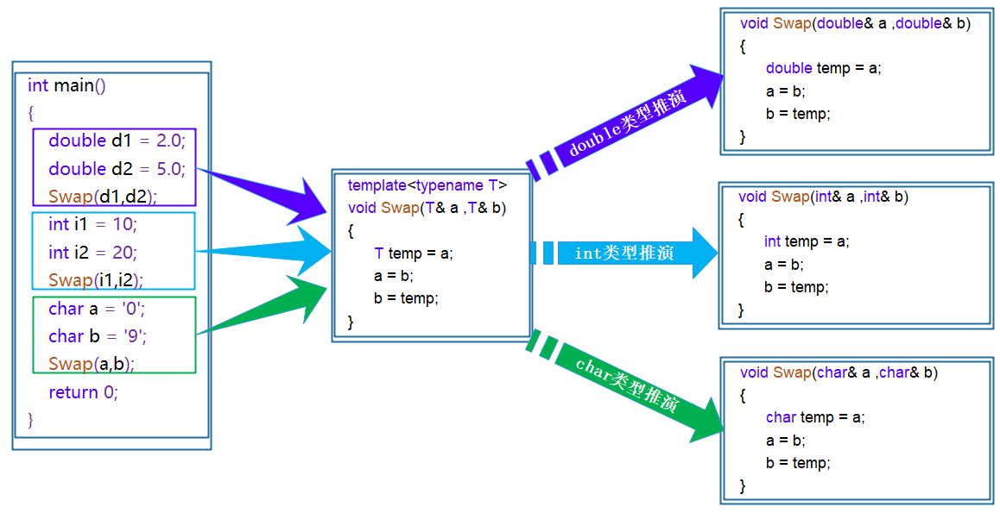
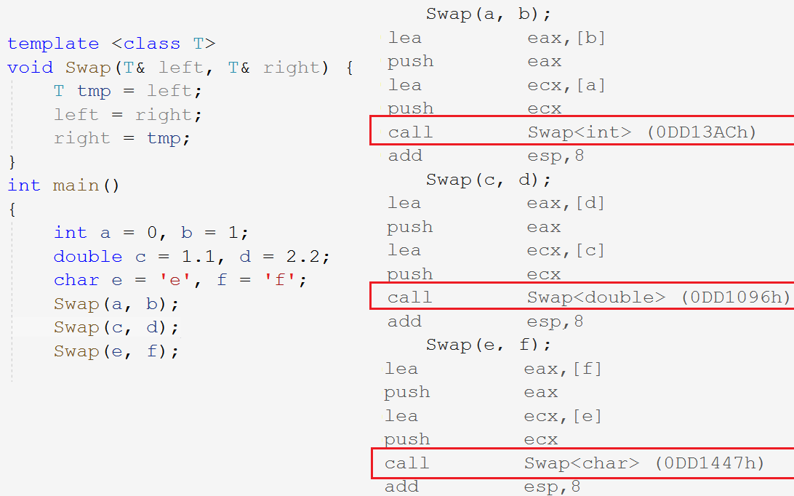
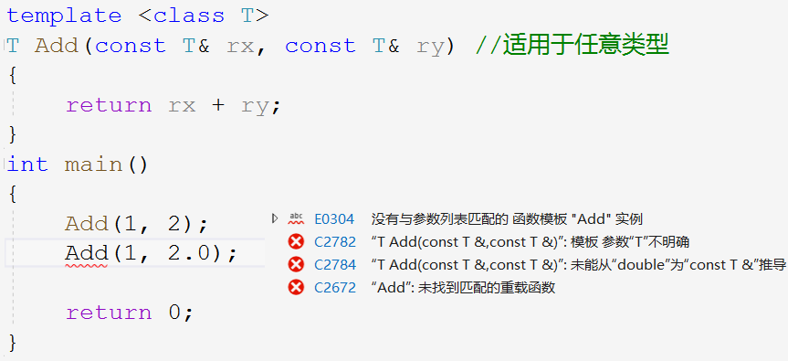

# 模板编程

~~~cpp
void Swap(int& l, int& r) { // 交换两个整型
	int t = l;
	l = r;
	r = t;
}
void Swap(double& l, double& r) { // 交换两个浮点型
	double t = l;
	//...
}
void Swap(char*& l, char*& r) { // 交换两个指针
	char* t = l;
	//...
}
~~~

> 上述代码功能相似，只是处理的数据类型不同。为每种类型都写出对应的代码，复用率可维护性低。

可以在函数中传入通用的数据类型，从而合并代码，泛型的出现就是专门解决这个问题的。泛型编程的定义就是：编写与类型无关的代码，是一种代码复用的手段。

C++泛型编程就体现在模板上，用模板来抽象类型。模板分为函数模板和类模板。

&nbsp;

## 1. 函数模板
### 1.1 函数模板的格式

~~~cpp
template <class T1, class T2, ..., class Tn>
ret_type func (parm_list)
{}

template <typename T1, typename T2, ..., typename Tn>
ret_type func (parm_list)
{}
~~~

> 两种都可以，typename和class都可以用来定义模板关键字。

~~~cpp
// 交换两个变量
template <class T>
void Swap(T& l, T& r) {
	T t = l;
	l = r;
	r = t;
}
~~~

### 1.2 函数模板的原理

> 当不同数据类型调用该函数模板时，使用的是同一个函数吗？

函数模板是编译器产生具体函数的模具，它是函数模板而不是函数本身。在编译阶段，**编译器根据传入的实参类型，生成对应类型的函数**。





> 函数地址不同，可见调用的不是一个函数。

### 1.3 函数模板的实例化

不同类型的参数使用该函数模板的过程，称为函数模板的实例化。模板参数实例化分为两种：隐式实例化和显式实例化。

- 隐式实例化：编译器根据实参类型**自动推演形参类型**。

- 显式实例化：函数名加`<type>`**指定参数类型**。

~~~cpp
template <class T>
T Add(const T& rx, const T& ry) {
	return rx + ry;
}
int main()
{
	int a = 10, b = 20;
	double c = 3.33, d = 4.44;
    // 隐式实例化
	Add(a, b);
	Add(c, d);
    // 显式实例化
	Add<int>(a, d);
	Add<double>(a, d);

    Add(a, d); // Err:类型不一致
	Add((double)a, d); // 提前强转参数类型
    return 0;
}
~~~

类型不匹配编译器会报错。要么强转实参类型，要么显式实例化。

### 1.4 函数模板的匹配原则

~~~cpp
int Add(const int& rx, const int& ry) // 适用于int类型
{
	return rx + ry;
}

template <class T>
T Add(const T& rx, const T& ry) // 通用类型模板
{
	return rx + ry;
}
~~~

当存在和函数模板同名同参数列表的函数时，编译器会**优先调用普通函数而非模板**。

> 调用普通函数也可以省去模板实例化的环节。



**函数模板传参时不允许发生类型转换**，但普通函数传参时允许发生隐式类型转换。

&nbsp;

## 2. 类模板

### 2.1 类模板的格式

定义格式和函数模板类似：

~~~cpp
template <class T1, class T2,..., class Tn>
class class_name {
	//...
};
~~~

~~~cpp
template <class T>
class stack
{
public:
	stack(int capacity) : _top(0), _capacity(capacity)
    {
		_data = new T[capacity];
	}
	~stack()
    {
		delete[] _data;
	}
private:
	T* _data;
	int _top;
	int _capacity;
};
~~~

### 2.2 类模板的实例化

类模板必须要显式实例化，在模板类名后跟`<type>`。**类模板是模板而不是类，实例化生成的类才是真正的类**。

~~~cpp
//stack是类模板名，stack<int>才是类型
stack<int> st;
~~~

若想成员函数声明定义分离，函数体类外定义不仅要声明类域，还要声明模板类型。

~~~cpp
template <class T> // 声明模板类型
void stack<T>::Push(T x) { // 声明所属类域
	_data[top++] = x;
	//...
}
~~~

&nbsp;

## 3. 非类型模板参数

模板参数不一定是类型参数，还有非类型的模板参数。

~~~cpp
template <class T> // 类型参数
class A;
template <size_t N> // 非类型参数
class A;
~~~

比如实现一个静态栈，数组长度可以宏定义，也可以使用非类型模板参数：

~~~cpp
template <class T, size_t N = 100>
class stack {
	T _a[N];
};
stack<int> st1;
stack<int, 200> st2;
~~~

使用非类型模板参数可以灵活控制该常量的数值。

- 非类型模板参数的**类型只能是整型家族类型**，`char`、`short`、`int`、`long`等。
- 非类型模板参数**只能是常量**，和宏一样编译被替换成对应的常量。
- 非类型模板参数**支持给缺省值**，和普通参数的缺省值一样只能从右到左给。

&nbsp;

## 4. 模板的特化

### 4.1 函数模板特化

使用模板对于一些特殊类型的可能得不到想要的结果，比如：

```cpp
template <class T>
bool less(T l, T r) {
	return l < r;
}
int main()
{
    date d1(2020, 1, 2);
    date d2(2020, 3, 3);
    less(d1, d2); // 结果不确定
    return 0;
}
```

实例化为基本类型时能够完成任务，实例化为指针类型时，我们的需求并不是比较指针大小而是比较指针所指向的对象的大小。

此时该模板就不能起作用，需要特化该函数专门针对指针类型的比较函数。

~~~cpp
template <class T>
bool less(T l, T r) {
	return l < r;
}

template <>
bool less<date*>(date* l, date* r) { //针对指针类型
	return *l < *r;
}

bool less(date* l, date* r) {
	return *l < *r;
}
~~~

函数模板特化是从原来的函数模板特化出一个类型专有的版本，相当于针对一个类型的特殊解法。

> 函数模板特化不如直接重载，模板特化在函数处显得比较鸡肋。模板特化主要是用于类模板特化。

### 4.2 类模板特化

类模板特化和函数模板特化差不多，都是针对某些特殊类型进行特殊处理。

```cpp
template<class T>
struct greater
{
    bool operator()(const T& x, const T& y)
    {
        return x > y;
    }
};

template<>
struct greater<date*>
{
    bool operator()(const date* p1, const date* p2)
    {
        return *p1 > *p2;
    }
};
```

#### 全特化

全特化是模板参数列表中所有模板参数都进行特化。

~~~cpp
template <class T1, class T2>
struct Data {
	Data() { cout << "Data<T1, T2>" << endl; }
	T1 _a;
	T2 _c;
};
template <>
struct Data<int, char> { // 特化处理int,char类型
	Data() { cout << "Data<int, char>" << endl; }
	int _a;
	char _c;
};
~~~

```cpp
template<class T>
struct less
{
    bool operator()(const T l, const T r)
    {
        return l < r;
    }
};
template<>
struct less<date*> {
    bool operator()(const date* l, const date* r) {
        return l < r;
    }
};
less<date>()(date(2020, 1, 2), date(2020, 3, 3));
less<date*>()(new date(2020, 1, 2), new date(2020, 3, 3));
```

#### 偏特化

偏特化是只限制部分参数为固定类型，其他仍是模板参数类型。

~~~cpp
template <class T1>
class Data<T1, char> //第二个模板参数为char
{
public:
	Data() {
		cout << "Data<T1, char>" << endl;
	}
private:
	T1 _a;
	char _c;
};
~~~

**模板参数的指针和引用也算偏特化**。

~~~cpp
template<class T>
struct less {
    bool operator()(const T l, const T r) {
        return l < r;
    }
};
template<class T>
struct less<T*> {
    bool operator()(const T* l, const T* r) {
        return l < r;
    }

};

less<int*>()(new int(1), new int(2));
less<date>()(date(2020, 1, 2), date(2020, 3, 3));
less<date*>()(new date(2020, 1, 2), new date(2020, 3, 3));
~~~

**非类型模板参数也支持特化。**

```cpp
template ＜size_t N>
struct A {
	A() { cout << "A<N>" << endl; }
}

template <>
struct A<10> {
	A() { cout << "A<10>" << endl; }
}

A<20> a1;
A<10> a2；
```

&nbsp;

## 5. 模板分离编译

模板声明定义分离，会出现链接错误：


模版在编译阶段会根据调用生成对应的函数，**但定义模版的文件中没有函数调用，就不会生成函数**。

当然我们可以显式实例化，在定义模版的文件里显式实例化需要的版本。

```cpp
template<class T>
void func(T& x)
{
    cout << "func(T& x)" << endl;
}
//显式实例化
template void func<int>(int& x);
template void func<double>(double& x);
```

&nbsp;

## 6. 模板总结

| 优点                                         |
| -------------------------------------------- |
| 模板复用代码，更快的开发，增强了代码的灵活性 |
| **缺点**                                     |
| 导致代码膨胀，导致编译时间变长               |
| 编译报错信息非常凌乱，不易定位错误           |