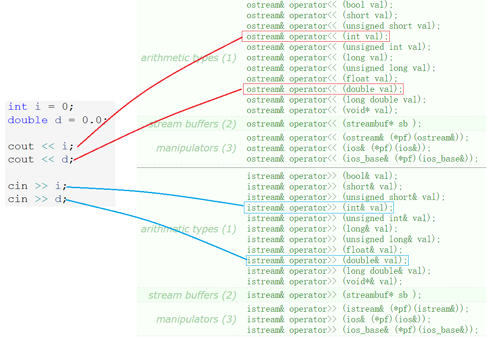

# IO流

## 1. C语言IO

C语言中常用的输入输出函数有如下几种：前者是格式化标准输入输出，后者是格式化文件输入输出，最后是格式化字符串输入输出。

| 函数名    | 内容                                     |
| :-------- | :--------------------------------------- |
| `scanf`   | 从标准输入流（键盘）读取格式化的数据     |
| `fscanf`  | 从所有输入流读取读取格式化数据           |
| `sscanf`  | 从字符串中读取格式化的数据               |
| `printf`  | 将格式化的数据输出到标准输出流（屏幕）上 |
| `fprintf` | 将格式化数据输出到所有输出流上           |
| `sprintf` | 将格式化的数据输出到字符串中             |

文件的输入输出需要以下几个函数：

| 函数名    | 功能                           |
| --------- | ------------------------------ |
| `fopen`   | 打开文件流                     |
| `fclose`  | 关闭文件流                     |
| `fscanf`  | 从所有输入流读取读取格式化数据 |
| `fprintf` | 将格式化数据输出到所有输出流上 |
| `fread`   | 二进制输入                     |
| `fwrite`  | 二进制输出                     |

~~~c
//文件开关
FILE* fopen   (const char* filename, const char* mode);
int   fclose  (FILE* stream);
//格式化读写
int fprintf (FILE* stream, const char* format [, argument ]...);
int fscanf  (FILE* stream, const char* format [, argument ]...);
//二进制读写
size_t fwrite  (const void* buffer, size_t size, size_t count, FILE* stream);
size_t fread   (      void* buffer, size_t size, size_t count, FILE* stream);
~~~

使用方式如下：

~~~cpp
struct ServerInfo
{
	char _ip[32];
	int _port;
	friend ostream& operator<<(ostream& os, ServerInfo& info);
	friend ostream& operator>>(ostream& os, ServerInfo& info);
};
//测试C语言二进制读写
void TestC_Write_Bin() {
	ServerInfo info = { "192.168.1.1",80 };
	FILE* fout = fopen("info.bin", "wb");
    //assert();
	fwrite(&info, sizeof(ServerInfo), 1, fout);
	fclose(fout);
}
void TestC_Read_Bin() {
	ServerInfo info;
	FILE* fin = fopen("info.bin", "rb");
	fread(&info, sizeof(ServerInfo), 1, fin);
	printf("%s:%d", info._ip, info._port);
	fclose(fin);
}
//测试C语言字符读写
void TestC_Write_Text() {
	ServerInfo info = { "192.168.1.1",80 };
	FILE* fout = fopen("info.txt", "w");
	fprintf(fout, "%s %d", info._ip, info._port);
	fclose(fout);
}
void TestC_Read_Text() {
	ServerInfo info;
	FILE* fin = fopen("info.txt", "r");
	fscanf(fin, "%s %d", &info._ip, &info._port);
	printf("%s:%d", info._ip, info._port);
}
~~~

&nbsp;

## 2. C++IO

C++ 标准库提供了4个全局流对象`cin`、`cout`、`cerr`、`clog`。cout、cerr、clog 是 ostream 类的三个不同的对象。使用 cout 进行标准输出，使用 cin 进行标准输入。同时 C++ 标准库还提供了 cerr 用来进行标准错误的输出，以及 clog 进行日志的输出。

### 2.1 C++标准IO流

`cout`,`cin`是`ostream`,`istream`类的对象，`operator<<`,`operator>>`分别是两个对象的操作符重载成员函数。

C++输出输入可直接使用`cout>>`和`cin>>`，因为其重载了所有内置类型，对于自定义类型需要自行重载操作符`>>`和`<<`。

~~~cpp
cin >> a >> b;
~~~

`operator<<`和`operator>>`的返回值也是`ostream&`或`istream&`，因此支持连续输入输出，又是一次函数调用。

> cout/cin 取代 printf/scanf 的真正原因是 cout/cin 支持自定义类型，符合面向对象的思想。

当需要循环读入数据时，可以采用如下的方式：

~~~cpp
string str;
while (cin >> str) {
	;
}
~~~

从文档中可以看到，`operator>>`的返回值是`istream`类型，这个对象类型是如何作真假判断的呢？

原因是`istream`类的对象支持一个操作符的重载函数叫`operator bool`，C++98中叫`operator void*`，C++11中叫`operator bool`。

这是个特殊的运算符重载函数，该函数不允许限定返回类型，当类型被当作条件判断时，自动调用并将返回值强转为内置的标识，该标识如果为真就继续，如果为假就停止读取。

### 2.2 C++文件IO流

采用面向对象的思想，C++中文件指针被文件输入输出流对象`ofstream`、`ifstream`代替。

和`fopen`的调用方式类似，创建输入输出流对象，调用其构造函数传入文件地址以及打开模式。`fclose`被析构函数代替，且析构函数可以自动调用。

| 对象构造函数                                                 | 解释                                     |
| ------------------------------------------------------------ | ---------------------------------------- |
| **ofstream (const char* fileName, ios_base::openmode mode=ios_base::out)** | 创建输出流对象，并指定文件地址和打开模式 |
| **ifstream (const char* fileName, ios_base::openmode mode=ios_base::in)** | 创建输入流对象，并指定文件地址           |

打开模式变量的类型是`ios_base::openmode`，该变量有如下几个特定的值：

| 模式       | 解释           |
| ---------- | -------------- |
| **in**     | 文件读取模式   |
| **out**    | 文件写入模式   |
| **binary** | 二进制文件模式 |
| ...        |                |

常用的有如上几种，该变量的值以二进制位中的不同位为1来标识，也就是说使用异或`|`就可以组合起来用。

| 函数                                              | 解释                                                         |
| ------------------------------------------------- | ------------------------------------------------------------ |
| **istream& read(char* s, streamsize n);**         | `read`接口是输入流`istream`对象的成员函数，参数是变量和大小。 |
| **ostream& write(const char* s , streamsize n);** | `write`接口是输出流`ostream`对象的成员函数，参数是写入变量和写入大小。 |

#### 示例

使用一个`ConfigManage`类来演示几种文件读写的方式。

~~~cpp
struct ServerInfo
{
	char _ip[32];
	int _port;
	friend ostream& operator<<(ostream& os, ServerInfo& info);
	friend ostream& operator>>(ostream& os, ServerInfo& info);
};
class ConfigManage {
public:
	ConfigManage(const char* fileName)
		:_fileName(fileName)
	{}
    //二进制写入
	void WriteBin(ServerInfo& info)
	{
		ofstream ofs(_fileName.c_str(), ios_base::out | ios_base::binary); //创建输出流对象
		ofs.write((const char*)&info, sizeof(ServerInfo)); //调用write接口
	}
    //二进制读取
	void ReadBin(ServerInfo& info)
	{
		ifstream ifs(_fileName.c_str(), ios_base::in | ios_base::binary);
		ifs.read((char*)&info, sizeof(ServerInfo));
		cout << info << endl;
	}
private:
	string _fileName;
};
~~~

读写文件更常用的方式是以文本形式读写，因此就可以省略打开模式参数。

`ifstream`,`ofstream`文件输入输出类中还继承了`iostream`的流插入`<<`流提取`>>`操作符，也就是对象`ofs`和`ifs`也可以使用`<<`或`>>`操作符。

~~~cpp
struct ServerInfo {
	friend ostream& operator<<(ostream& os, ServerInfo& info);
	friend ostream& operator>>(ostream& os, ServerInfo& info);
    char _ip[32];
	int _port;
};
ostream& operator<<(ostream& os, ServerInfo& info) {
	os << info._ip << " " << info._port;
	return os;
}
istream& operator>>(istream& is, ServerInfo& info) {
	is >> info._ip >> info._port;
	return is;
}
//文本写入
void WriteText(ServerInfo& info)
{
    ofstream ofs(_fileName.c_str());
    //write
    ofs.write((const char*)&info, sizeof(ServerInfo));
    //1.
    ofs << info._ip << info._port; //对象未重载<<
	//2.
    ofs << info; //对象已重载>>
}
//文本读取
void ReadText(ServerInfo& info)
{
    ifstream ifs(_fileName.c_str());
    //read
    ifs.read((char*)&info, sizeof(ServerInfo));
	//1.
    ofs << info._ip << info._port; //对象未重载<<
	//2.
    ifs >> info; //对象已重载>>
    cout << info << endl;
}
~~~

具体调用方式则是如下：

~~~cpp
void TestCPP_Write_Bin() {
	ServerInfo info = { "192.168.1.1",80 };
	ConfigManage con("config.bin");
	con.WriteBin(info);
}
void TestCPP_Read_Bin() {
	ServerInfo info;
	ConfigManage con("config.bin");
	con.ReadBin(info);
}
void TestCPP_Write_Text() {
	ServerInfo info = { "192.168.1.1",80 };
	ConfigManage con("config.bin");
	con.WriteText(info);
}
void TestCPP_Read_Text() {
	ServerInfo info;
	ConfigManage con("config.bin");
	con.ReadText(info);
}
~~~

文件的输入输出流对象调用构造函数时也可能会失败，C++采取面向对象抛异常的形式。

### 2.3 C++ stringstream

在头文件`<sstream>`下，有三个类：istringstream、ostringstream 和 stringstream，分别用来进行字符串流的输入、输出和输入输出操作。

- 字符串流`ostringstream`可以将一个其他类型的数据转化为字符串格式，该类中的成员函数`str`可以返回转出的字符串。
- 字符串流`istringstream`可以将一个字符串格式转化其他类型的数据，该类中的成员函数`str`可以传入需要转化的字符串，或直接在构造时传入。

~~~cpp
struct PersonInfo
{
	string _name;
	int _age;
	friend ostream& operator<<(ostream& os, PersonInfo& info);
	friend istream& operator>>(istream& is, PersonInfo& info);
};
//序列化
PersonInfo info1 = { string("zhangsan"), 20 };
ostringstream oss;
//1.
oss << info1._name << " " << info1._age; //对象未重载<<
//2.
oss << info1;
string str = oss.str();
cout << str << endl;

//反序列化
PersonInfo info2;
istringstream iss(str);
iss.str(str);
//1.
iss >> info2._name >> info2._age; //对象未重载>>
//2.
iss >> info2;
cout << info2 << endl;
~~~
