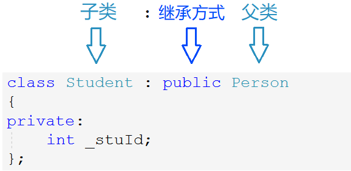
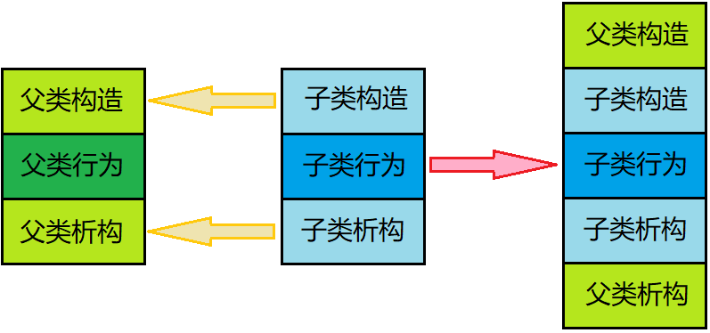
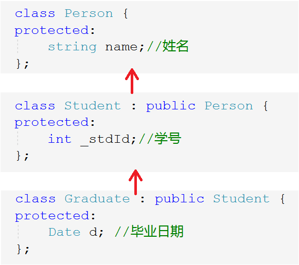

# 继承

> 面向对象三大特性：封装、继承、多态。继承实际中用的也不多，但必须熟练掌握。

## 1. 继承的概念

继承是面向对象中复用代码的一种手段，它能够在原有类的特性的基础上进行扩展。继承体现了面向对象设计的层次结构，不同于面向过程只有函数复用，继承是类设计层面上的复用。

### 1.1 继承的定义

对于具有一定关系的一类群体，将其抽象成一类对象后，这些对象必然会具有重复的属性。

比如学生老师都属于人，他们都有名字、年龄等共有属性，不同的是学生有学号，教师有职工号。因此可将共有属性放到人这个类，将二者独有属性放入各自的类。避免代码冗余，也更能体现出类的层次设计。

~~~cpp
class Son : public Father; //中间用:间隔
~~~


原有类称为基类或父类，继承而来的类叫派生类或子类。**继承后子类也拥有了父类的成员变量和函数，使得子类可以使用父类的成员**，这便是继承的意义。

### 1.2 继承关系和访问限定



子类和父类中间用`:`间隔，并声明继承关系，继承关系有三种：`public`，`protected`，`private`。

因为成员的访问权限有三种，而类的继承关系也有三种，组合起来有九种情况。这些会影响到子类继承来的成员的访问权限，具体如表所示：

| 父类成员\继承方式   | public 继承         | protect 继承      | private 继承      |
| ------------------- | ------------------- | ----------------- | ----------------- |
| 父类 public 成员    | 子类 public 成员    | 子类 protect 成员 | 子类 private 成员 |
| 父类 protected 成员 | 子类 protected 成员 | 子类 protect 成员 | 子类 private 成员 |
| 父类 private 成员   | 子类不可见成员      | 子类不可见成员    | 子类不可见成员    |

- **父类中的访问限定和继承方式二者中取最低的权限**，就是子类中该成员的访问权限。（防止权限放大）
- 任何继承方式下，**父类私有成员在子类中都是存在但不可访问的**。
- 若不显式指定继承方式，`class`类默认私有继承，`struct`类默认为公有继承，不提倡这种方式。

> 实际中很少使用、也不提倡使用除公有继承以外的继承方式，可维护性不强。

&nbsp;

## 2. 父子对象赋值兼容

**公有继承下，子类对象可以赋值给父类对象或父类对象的指针或引用**。

子类赋值给父类，就是把子类中从父类继承下来的成员“切割”出来调用拷贝构造赋值过去，这就叫做“切片”。

- 父类的指针或引用也只能指向或引用来自父类的那一部分成员。
- **父类对象不可以赋值给子类对象**，因为父类无法构造子类所有成员。


- 子类赋值父类的转换，**不存在类型转换，是编译器语法所支持的行为**。
- 子类赋值父类的转换，只能发生在公有继承的情况下，因为其他继承会影响到成员的访问权限，可能会造成权限放大。

~~~cpp
Student s;
Person p;

//子类赋值给父类，发生赋值兼容
p = s;
Person& rp = s;
Person* pp = &s;

//父类赋值给子类
s = p;           // Err
s = (Student)p;  // Err
Student& rs = p; // Err
Student* ps = p; // Err
~~~

&nbsp;

## 3. 继承的作用域

类的定义就是一个作用域，父子类都有独立的作用域，父类成员可能会与子类成员重名。

父子类出现同名成员时会发生隐藏，即**子类成员会屏蔽从父类继承来的同名成员**，这种情况叫隐藏或重定义。

> 实际上在使用继承时，不要定义重名变量。

### 3.1 成员变量的隐藏

~~~cpp
struct Person {
	string _name = "人名";
	int _num = 111;
};
class Student : public Person {
public:
	void getNum() {
		cout << "学号->" << _num << endl;
	}
    void getPersonNum() {
		cout << "证件->" << Person::_num << endl; // 访问隐藏成员，必须加域名限定
    }
protected:
	int _num = 999;
};
~~~

### 3.2 成员函数的隐藏

~~~cpp
struct A {
	void func() { cout << "A::func()" << endl; }
};
class B : public A {
public:
	void func(int i) {
		A::func(); // 访问隐藏成员，必须加域名限定
		cout << "B::func(int i)" << endl;
	}
};

b.A::Func(); //访问隐藏成员，必须加域名限定
b.Func(1);
~~~

**父子类同名成员函数，函数名相同就构成隐藏，不构成函数重载**，因为二者不在一个作用域。

### 3.3 总结

- 成员变量构成隐藏时，直接调用其会导致访问不明确，所以编译不通过。
- 成员函数构成隐藏时，默认访问子类中的成员函数，若想访问父类中的必须加父类域名限定。
- 成员函数和成员变量一样只需名称相同即可构成隐藏。可通过类名::的方式访问隐藏的父类成员。

&nbsp;

## 4. 子类的默认成员函数

> 子类的默认成员函数会有哪些变化呢？

### 4.1 构造函数

- 构造子类对象时，构造函数会先调用父类的构造函数，再初始化子类成员。

- 如果父类有默认构造，编译器可以自动调用。如果父类没有默认构造，则需要在初始化列表中显式调用。
- 子类中不可直接初始化父类成员，只能调用父类构造函数。

```cpp
student(const char* name, int num)
    : person(name)
    , _num(num)
{}
```

### 4.2 拷贝构造

- 拷贝子类对象时，拷贝构造不会自动调用父类的拷贝构造，需手动调用父类拷贝构造。
- 显式调用父类拷贝构造时，传子类对象自动切片即可。

```cpp
student(const student& s)
    : person(s)
    , _num(s._num)
{}
```

### 4.3 赋值重载

- 赋值子类对象时，赋值重载需要显式调用父类的赋值重载，再对子类成员赋值。
- 显式调用父类赋值重载时，需指定父类域，也传子类对象自动切片。

```cpp
student& operator=(const student& s)
{
    if (this != &s)
    {
        person::operator=(s);
        _num = s._num;
    }
    return *this;
}
```

### 4.4 析构函数

- 子类析构会在析构完子类后，自动调用父类析构，规定不允许在子类析构中手动调用父类析构。

- 先构造父类再构造子类。析构反之，先析构子类再析构父类，保证栈后进先出的特性。



```cpp
~student()
{
    // person::~person(); // ERROR
}
```

析构函数的名称会被统一处理成`destructor`，父子类析构会构成隐藏。

> 主动调用父类析构，会导致父类析构两遍，可能会出错。因为要满足栈帧后进先出，只能由编译器调用。

### 4.5 总结

- 如果父类有默认构造，子类构造会自动调用父类默认构造。
- 析构函数会自动调用且不允许手动调用父类析构。
- 拷贝构造、赋值重载都不会自动调用父类对应函数，只能手动调用。


&nbsp;

## 5. 继承和友元

**友元关系无法继承**，也就是说父类中的友元，无法访问子类的成员。

~~~cpp
struct Person {
	friend void Display(const Person& p, const Student& s);
	string _name;
};
class Student : public Person {
private:
	int _stuId;
};
void Display(const Person& p, const Student& s) {
	cout << "Person::_name" << p._name << endl;
	cout << "Student::_stuId" << s._stuId << endl; //无法访问子类成员
}
~~~

&nbsp;

## 6. 继承和静态成员

子类不会继承父类的静态成员，但可以访问，且操作的是同一个变量，不会影响其静态的特性。

~~~cpp
struct A {
	A() { _si += 1; }
	static int _si;
};
int A::_si = 0;

struct B : public A {
	B() { _si += 1; }
};
struct C : public A {
	C() { _si += 1; }
};

cout << _si << endl; // 5
~~~

&nbsp;

## 7. 菱形继承和虚拟继承

### 7.1 单继承和多继承

单继承：一个子类只有一个直接父类，这样的继承关系为单继承。



多继承：一个子类有两个及以上的直接父类，这样的继承关系为多继承。


### 7.2 菱形继承

菱形继承是继承关系呈现出菱形的状态，是多继承的一种特殊情况。


菱形继承会产生的问题是：数据冗余和二义性。

| 问题     | 解释                                     | 现象                                               | 解决办法               |
| -------- | ---------------------------------------- | -------------------------------------------------- | ---------------------- |
| 数据冗余 | 两个父类都继承了爷类的成员               | Student类和Teacher类中都有name成员                 | 虚拟继承               |
| 二义性   | 子类访问爷类的成员，不能确定来自哪个父类 | Assitant类访问name不确定是Student类还是Teacher类的 | 访问变量时加上类域限定 |

```cpp
// 二义性需要访问变量时加上域限定
assitant a;
a.student::_name = "小张";
a.teacher::_name = "老张";
```


> 一般不会用到多继承，一定要避免菱形继承。

### 7.3 菱形虚拟继承

数据冗余根源在于两个父类都继承了爷类的成员，这两个父类叫做虚基类，让虚基类使用虚拟继承即可解决。

~~~cpp
class person {
public:
    string _name;
};

class student : virtual public person {
public:
    int _stuid;
};

class teacher : virtual public person {
public:
    int _jobid;
};

class assitant : public student, public teacher {
public:
    int _major_course;
};
~~~

虚继承让虚基类从爷类中继承的成员是同一个变量。因此不存在数据冗余了。


#### 虚拟继承的原理

```cpp
struct A {
    int _a;
};                                         A
struct B : virtual public A {            /   \
    int _b;                             /     \
};                                     B       C
struct C : virtual public A {           \     /
    int _c;                              \   /
};                                         D
struct D : public B, public C {
    int _d;
};

void test()
{
    D d;
    d.B::_a = 1;
    d.B::_b = 2;

    d.C::_a = 3;
    d.C::_c = 4;

    d.D::_d = 5;
}
```


如果采用菱形继承：创建`D`类对象时，会按继承顺序依次开辟变量`B::_a`、`B::_b`、`C::_a`、`C::_c`、`D::_d`。

如果采用虚拟继承：

- 最上层的公共基类叫虚基类，继承虚基类的类叫做虚拟派生类。

- 普通成员仍然按继承顺序开辟，虚基类成员被单独放在最后。两个虚拟派生类空间上方分别存放一个指针。

- 指针指向的空间存有两个整型值。第一个用于多态，第二个表示该指针距虚基类空间的偏移量。以此定位虚基类成员。


```cpp
struct A {
    A(string s1) { cout << s1 << endl; }
};

struct B : virtual public A {
    B(string s1, string s2) : A(s1) { cout << s2 << endl; }
};

struct C : virtual public A {
    C(string s1, string s2) : A(s1) { cout << s2 << endl; }
};

struct D : public B, public C
{
    D(string s1, string s2, string s3, string s4) : C(s1, s3), B(s1, s2), A(s1) {
        cout << s4 << endl;
    }
};

D* pd = new D("class A", "class B", "class C", "class D");
delete pd;
```

&nbsp;

## 8. 继承和组合

### 8.1 继承和组合的概念

```cpp
//继承
class B : public A
{};
//组合
class B {
    A _a;
};
```

| 方式 | 解释                                              | 举例                       |
| ---- | ------------------------------------------------- | -------------------------- |
| 继承 | 每个派生类对象都是一个基类对象（is-a）            | 学生是一种人，宝马是一款车 |
| 组合 | 类里面使用其他类作为成员，本类有一个他类（has-a） | 车上有轮胎，笔记本上有屏幕 |

继承符合“是一个”的关系，组合符合“有一个”的关系。

### 8.2 组合和继承的对比

- 继承导致父类的实现细节对子类是可见的，故称继承为一种白盒复用。
- 组合通过接口使用原有类的功能，原有类的细节是不可见的，这种复用被称为黑盒复用。

- 使用继承，子类可直接使用父类成员，一定程度上破坏了封装性，二者之间耦合度较高。
- 组合反之，通过创建对象进行复用，只能通过接口访问，并不破坏封装性，耦合度也比较低。

组合比继承更满足高内聚、低耦合的设计要求。所以优先组合而不是继承。