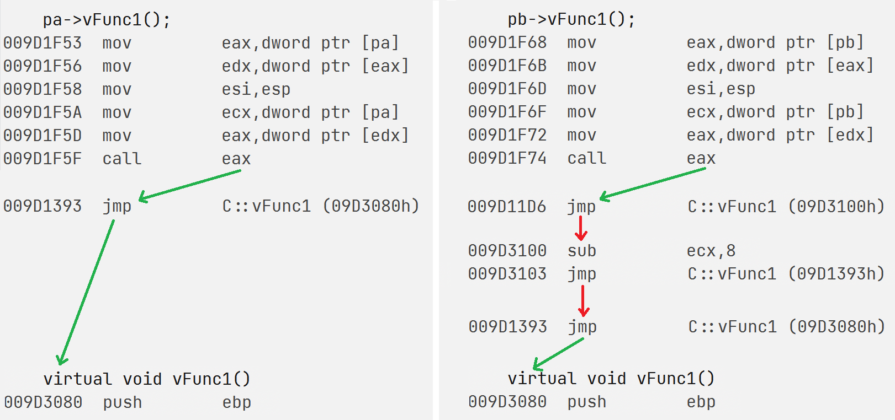

# 多态

## 1. 虚函数的定义

**`virtual`修饰的、非静态的成员函数称为虚函数。**

~~~cpp
struct Test {
	virtual void func() { cout << "func" << endl; }
};
~~~

虚函数可以像普通函数一样调用，但虚函数的作用主要是实现多态。

> 虚继承也用到virtual关键字，但虚函数和虚继承没有任何关系。

## 2. 重写的定义

子类重新定义父类中的虚函数，就叫做子类重写/覆盖了父类的虚函数。

**具有继承关系的两个类中，返回类型、函数名、参数列表完全相同的虚函数构成重写**，不构成隐藏。

### 2.1 重写的条件

#### 协变

重写允许虚函数返回类型不同，但必须是父子类对象的指针或引用。父类的返回父类引用指针，子类的返回子类引用指针，这种情况被称为协变。

> 不一定是自身父子类指针引用，也可以是其他父子类指针引用。

```cpp
struct person {
	virtual person*  buy_ticket() { cout << "成人全价" << endl; }
};
struct student : public person {
	virtual student* buy_ticket() { cout << "学生半价" << endl; }
};
```

#### 析构函数的重写

```cpp
struct person {
    ~person() { cout << "~person()" << endl; }
};
struct student : public person {
    ~student() { cout << "~student()" << endl; }
};

void test() {
    person* p = new student;
    delete p;  // p->_destructor(); + operator delete(p);
}
```

析构函数名会被编译器处理为 destructor，所以父子类的析构函数名是相同的。

不构成重写的话，父类指针指向子类对象会发生切片，只能访问到父类的内容，所以 delete 只能调用父类析构函数。

```cpp
struct person {
    virtual ~person() { cout << "~person()" << endl; }
};
struct student : public person {
    virtual ~student() { cout << "~student()" << endl; }
};

void test() {
    person* p = new student;
    delete p; // p->_destructor(); + operator delete(p);
}
```

**virtual 修饰父子类析构函数可以构成重写**。这样父类指针就能调用子类析构，不会有资源泄漏的风险。

#### 子类允许省略virtual

重写可以只给父类函数加 virtual，允许省略子类的。

~~~cpp
struct person {
	virtual void buy_ticket() { cout << "成人全价" << endl; }
};
struct student : public person {
	void buy_ticket() { cout << "学生半价" << endl; }
};
~~~

| 概念     | 解释                                                         |
| -------- | ------------------------------------------------------------ |
| 实现继承 | 普通成员函数继承就是实现继承，继承的是父类成员函数的实现。   |
| 接口继承 | 虚函数的继承是一种接口继承，继承接口声明并重写其实现，以构成多态。 |

重写是一种接口继承，子类把父类的虚函数继承下来重新实现，只改变函数内容，不会改变函数声明和属性。

子类会继承下重写的虚函数的属性，再完成重写所以不加声明也是虚函数。

### 2.2 重载重写重定义的对比

| 概念        | 要求1          | 要求2                        | 要求3            |
| ----------- | -------------- | ---------------------------- | ---------------- |
| 重载        | 在同一作用域   | 函数名相同，参数列表不同     |                  |
| 重定义/隐藏 | 在父子类作用域 | 函数名相同                   |                  |
| 重写/覆盖   | 在父子类作用域 | 函数名、参数、返回值完全相同 | 函数必须是虚函数 |

&nbsp;

## 3. 多态的定义

多态就是不同对象执行同一行为产生不同结果。具有继承关系的对象才会产生多态，如父子对象通过父类指针引用，调用重写函数。

### 3.1 多态的条件

1. 子类必须**重写父类的虚函数**；
2. **通过父类的指针或引用**调用重写函数；

> 重写条件：一虚三同。多态条件：父类的指针引用，重写的虚函数。

~~~cpp
struct person {
    virtual void buy_ticket() { cout << "成人全价" << endl; }
};
struct student : public person {
    virtual void buy_ticket() { cout << "学生半价" << endl; }
};

void func_ref(person& p) { p.buy_ticket();  }
void func_ptr(person* p) { p->buy_ticket(); }

void test()
{
    person p;
    student s;

    func_ref(p);  // 成人全价
    func_ref(s);  // 学生半价

    func_ptr(&p); // 成人全价
    func_ptr(&s); // 学生半价
}
~~~

### 3.2 多态的效果

构成多态的话，传入子类对象才会调用到子类的虚函数。如果不构成多态，只会调用父类的虚函数。

```cpp
//----------------------------- 第一题 ----------------------------
struct A {
    virtual void func(int i = 1) { cout << "A->" << i << endl; }
    void test() { func(); }
};

struct B : public A {
    void func(int i = 0) { cout << "B->" << i << endl; }
};

void test()
{
    B* p = new B;
    p->test();
}

p->test() 把子类对象指针传给 test 函数 this 形参，test 函数的 this 类型是父类指针，相当于父类指针指向子类对象。

父子类 func 函数构成重写，this->func() 构成多态，所以调用子类的 func。

重写不会改变函数声明，所以 i 值为 1。B->1


//----------------------------- 第二题 ----------------------------
struct A {
    virtual void func(int i = 1) { cout << "A->" << i << endl; }
};

struct B : public A {
    void func(int i = 0) { cout << "B->" << i << endl; }
    void test() { func(); }
};

void test()
{
    B* p = new B;
    p->test();
}

不构成多态，就不用关心重写，func 函数构成隐藏，默认调用子类 func。B->0
```

&nbsp;

## 4. final override

C++11中新出的两个关键字final和override，与继承和多态有关。

### 4.1 final修饰类

final修饰的类无法被继承。

~~~cpp
class A final // final修饰类
{};
class B : public A // Error
{};
~~~

> final 表示最终的意思，也就是该类是继承关系中最后的类。

### 4.2 final修饰虚函数

final修饰的虚函数无法被重写。

~~~cpp
class A {
protected:
	virtual void f() final // final修饰虚函数
	{}
};
class B : public A {
protected:
	virtual void f() // Error
	{}
};
~~~

### 4.3 override

override修饰虚函数，用来检查该虚函数是否和父类虚函数构成重写，相当于对重写的断言。

~~~cpp
class A {
protected:
	virtual void f(int)
    {}
};
class B : public A {
protected:
	virtual void f() override // Error
    {}
};
~~~

&nbsp;

## 5. 纯虚函数和抽象类

- `=0`修饰的虚函数为纯虚函数，也称接口。纯虚函数无法调用，一般只声明不实现。
- 包含纯虚函数的类叫做抽象类或接口类。抽象类作为框架无法实例化，子类继承后重写其中所有纯虚函数，子类才能实例化。

~~~cpp
class car {
	virtual void drive() = 0;
};
class tsla : public car {
  	void drive()
    {}
};
~~~

&nbsp;

## 6. 多态的原理

```cpp
class A { // 普通类
	int _a;
};
class B { // 包含虚函数的类
	virtual void func() {}
	int _a;
};

void test()
{
    cout << sizeof(A) << endl; // 4
    cout << sizeof(B) << endl; // 8 只有一个整型成员和一个虚函数，类的大小为8，难道虚函数占用类的空间？
}
```

### 6.1 虚表指针


含有虚函数的类，实例化后会有虚函数表指针`_vfptr`这一隐藏成员，存储在类的头四个字节空间。

虚表指针指向的空间称为虚函数表，用来存储虚函数的地址。


- 同类的不同对象的虚表指针都指向同一块空间。
- 虚表指针只能由编译器调用，故不考虑它作为成员变量的属性。

### 6.2 虚函数表

虚函数表本质是函数指针数组。构成多态时，编译器访问对象空间拿到虚表，再根据偏移量找到对应虚函数。这就是多态原理。


- 父子类不共用虚表，子类的虚表是父类的一份拷贝。
- 子类会将子类重写的虚函数地址覆盖到父类对应虚函数的虚表位置上。
- 子类新增的虚函数依次增加在虚表的尾部。

> 重写体现在语法上，覆盖体现在原理上。

- 虚表在编译阶段就生成好了。编译时就可以确定地址。
- 对象的虚表会在构造函数的初始化列表中初始化。
- 虚表一般存在于代码段，具体还要看编译器。

### 6.3 多态条件的解释


多态的构成条件可以解释为：

1. 重写的虚函数：虚函数地址存储在虚表中，运行时才从虚表指针中确定地址。
2. 父类指针引用：父类指针或引用指向子类空间，能拿到子类虚表，从而访问子类的虚函数。

> 对象直接调用不构成多态，因为父子类赋值切片时不允许拷贝虚表指针，就拿不到子类虚表。


&nbsp;

## 7. 不同继承下的虚表

> vs的监视会隐藏子类本身具有的虚函数。我们只能打印。

~~~cpp
// 虚表指针存储在类的最头上四个字节
// 解引用虚表指针，该空间直接裸存虚函数指针

typedef void(*vf_t)();

void print_vftable(vf_t* vft)
{
    for (int i = 0; vft[i]; i++)
    {
        printf("vft[%d]=0x%p->", i, vft[i]);
        vft[i]();
    }
}
~~~

### 7.1 单继承的虚表

~~~cpp
namespace signle_inherit {
class A {
public:
    virtual void vFunc1() { cout << "A::vFunc1()" << endl; }
    virtual void vFunc2() { cout << "A::vFunc2()" << endl; }
protected:
    int _a;
};
class B : public A {
public:
    virtual void vFunc1() { cout << "B::vFunc1()" << endl; }
    virtual void vFunc3() { cout << "B::vFunc3()" << endl; }
    virtual void vFunc4() { cout << "B::vFunc4()" << endl; }
protected:
    int _b;
};
void test() {
    A a;
    B b;
    vf_t* vft_a = *(vf_t**)&a;
    vf_t* vft_b = *(vf_t**)&b;
    print_vftable(vft_a);
    print_vftable(vft_b);
}
}
~~~


### 7.2 多继承的虚表

~~~cpp
namespace mutiple_inherit {
class A {
public:
    virtual void vFunc1() { cout << "A::vFunc1()" << endl; }
    virtual void vFunc2() { cout << "A::vFunc2()" << endl; }
    int _a;
};
class B {
public:
    virtual void vFunc1() { cout << "B::vFunc1()" << endl; }
    virtual void vFunc2() { cout << "B::vFunc2()" << endl; }
    int _b;
};
class C : public A, public B {
public:
    virtual void vFunc1() { cout << "C::vFunc1()" << endl; }
    virtual void vFunc3() { cout << "C::vFunc3()" << endl; }
    int _c;
};
void test() {
    C c;
    vf_t* vft_from_a = *(vf_t**)&c;
    // vf_t* vft_from_b = *(vf_t**)((char*)&c + sizeof(A));
    B* pc_from_b = &c;
    vf_t* vft_from_b = *(vf_t**)(pc_from_b);
    print_vftable(vft_from_a);
    print_vftable(vft_from_b);
}
}
~~~


- 多继承中子类会有多个虚表，分别记录来自不同父类的虚函数。
- 子类新增的虚函数会放在第一个虚表中。

> C类重写了父类A和父类B的函数vFunc1，但两张虚表中vFunc1的地址却不同，这是为什么？

```cpp
// 观察下面程序的汇编代码。
C c;
A* pa =&c;
B* pb =&c;
pa->vFunc1();
pb->vFunc1();
```



从第一张虚表和第二张虚表，调用 vfunc1 的汇编是不同的。从第二张虚表调用 vFunc1 需要去第一张虚表中跳转地址。

[C++ 虚函数表解析 (coolshell.cn)](https://coolshell.cn/articles/12165.html)

[C++ 对象内存布局 (coolshell.cn)](https://coolshell.cn/articles/12176.html)
