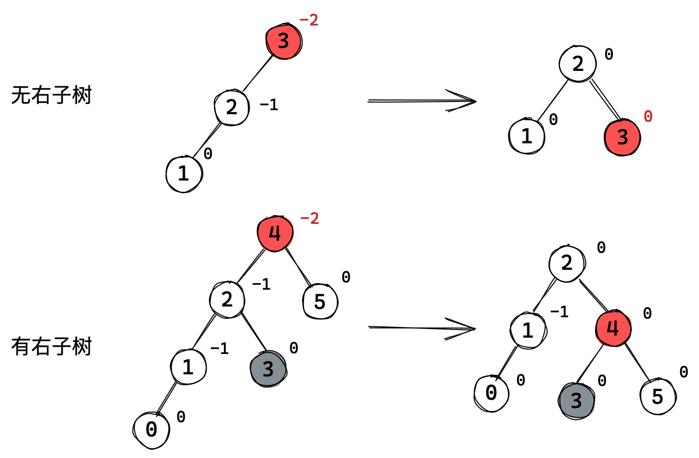
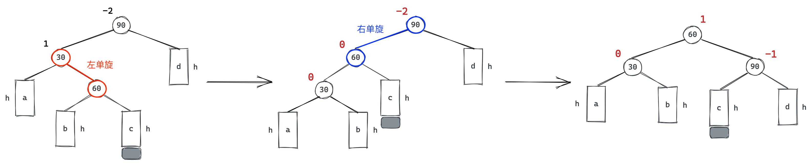
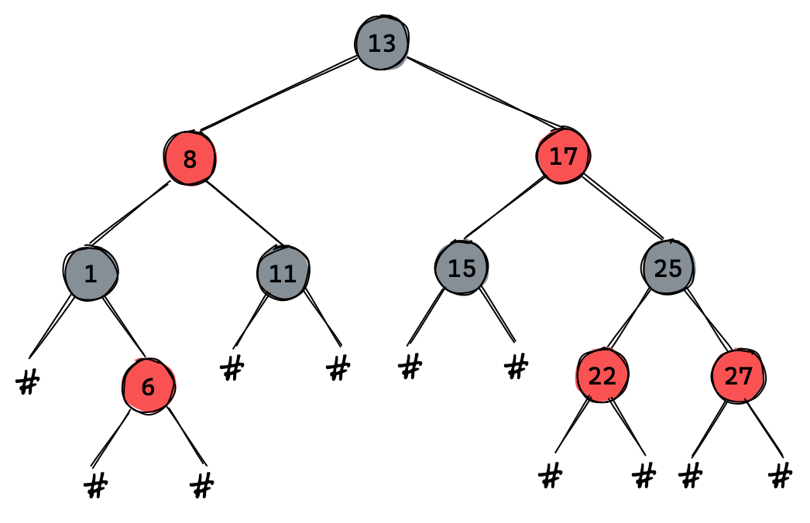
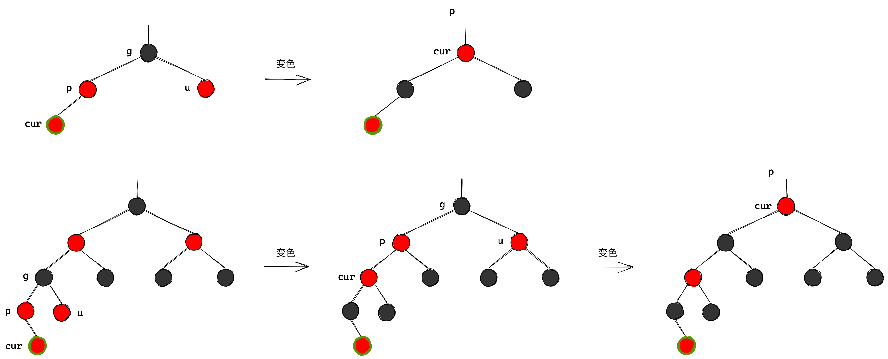
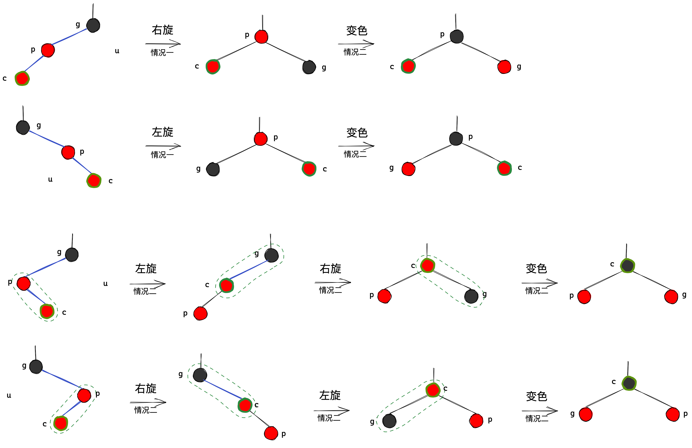

## map和set

> STL容器分为序列式容器和关联式容器。

- 序列式容器vector、list等底层为线性数据结构，数据元素之间没有联系，一般用来存储数据。
- 关联式容器map、set等底层采用平衡搜索树，存储的是`<key/value>`式的键值对，数据检索效率高。

# 1.容器

## 1.1 set

```cpp
template < class T,                        // T 元素数据类型
           class Compare = less<T>,        // compare 该数据类型的比较函数
           class Alloc = allocator<T>>     // Alloc 空间配置器
class set;
```

set就是K模型的容器，按照搜索树的规则存储元素，具有排序和去重的功能。

**set等搜索树容器都不支持修改元素，会破坏搜索树结构**。find的返回值被`const`修饰。

### 接口

| 增加                                                         | 解释         |
| ------------------------------------------------------------ | ------------ |
| **`pair<iterator,bool> insert (const value_type& val)`**     | **单个插入** |
| `iterator insert (iterator position, const value_type& val)` | 迭代器插入   |
| `void insert (InputIterator first, InputIterator last)`      | 范围插入     |

```cpp
set<int> s;
s.insert(3);
s.insert(1);
s.insert(5);
s.insert(8);
s.insert(8);
s.insert(2);
s.insert(2);

std::set<int>::iterator it = s.begin();
while (it != s.end()) {
    cout << *it << " ";
    ++it;
}
// 1 2 3 5 8 //set底层是平衡搜索树，所以可以去重和排序
```

| 删除                                          | 解释           |
| --------------------------------------------- | -------------- |
| **`size_type erase (const value_type& val)`** | **指定值删除** |
| `void erase (iterator position)`              | 迭代器删除     |
| `void erase (iterator first, iterator last)`  | 范围删除       |

**值删除接口返回的是删除元素的个数，可通过此判断是否删除成功。**

```cpp
size_t ret = s.erase(30);
std::cout << ret << std::endl; // 使用值删除时，返回值是删除元素的个数
```

| 查找                                              | 解释       |
| ------------------------------------------------- | ---------- |
| **`iterator find (const value_type& val) const`** | **值查找** |
| `size_type count (const value_type& val) const`   | 返回个数   |

```cpp
set<int>::iterator pos = s.find(30);
if (pos != s.end())
    s.erase(pos);

int cnt = s.count(30);
if (cnt == 1)
    cout << "ok" << endl;
```

## 1.2 multiset

**multiset没有去重机制，允许键值重复。**其底层也是搜索树，插入相同元素时，可以放到该节点的任意子节点。

**对于键值重复的节点，查找返回的是中序遍历遇到的第一个节点**。

> 比如查找值为10的节点，在找到第一个10时，会到他的左子树去找，直到遇到比10小的数。

```cpp
std::multiset<int> s;
s.insert(3);
s.insert(1);
s.insert(5);
s.insert(5);
s.insert(2);
s.insert(2);

multiset<int>::iterator it = s.begin();
while (it != s.end()) {
    std::cout << *it << " ";
    ++it;
}
// 1 2 2 3 5 5
```

### 接口

```cpp
multiset<int>::iterator pos = s.find(1);
while (pos != s.end() && *pos == 1)
{
    s.erase(pos);
    ++pos;
}
```

**删除和迭代器遍历操作不可以放在一起，删除就改变了原有树的结构，再`++pos`就访问非法空间了**。可以用下面更简单的方式。

```cpp
while (pos != s.end())
{
    s.erase(pos);
    std::cout << "找到了" << std::endl;
    pos = s.find(1);
}

int ret = 1;
while (ret)
{
    ret = s.erase(1);
    std::cout << "找到了" << std::endl;
}
```

&nbsp;

## 1.3 map

map底层也是平衡搜索树，map的元素按照键值key进行排序。map支持下标访问符，可以找到与key对应的value。

### 定义

键值对是表示具有对应关系的一种结构，一般只有两个成员key和value，key代表键值，value表示对应的数据。

```cpp
template <class T1, class T2>
struct pair
{
  typedef T1 first_type;
  typedef T2 second_type;
  first_type first;
  second_type second;

  pair(const T1& a, const T2& b) : first(a = T1()), second(b = T2())
  {}
};
```

pair就是键值对，实际上是一个结构体，被map当作元素类型使用。

```cpp
template < class Key,                                     // map::key_type
           class T,                                       // map::mapped_type
           class Compare = less<Key>,                     // map::key_compare
           class Alloc = allocator<pair<const Key,T> >    // map::allocator_type
         > class map;
```

### 接口

```cpp
typedef Key key_type;
typedef T mapped_type;
typedef pair<const Key, T> value_type;
```

| 增加                                                     | 解释         |
| -------------------------------------------------------- | ------------ |
| **`pair<iterator,bool> insert (const value_type& val)`** | **单个插入** |

```cpp
dict.insert(pair<string, string>("arrary", "数组"));
dict.insert(make_pair("string", "字符串"));
dict.insert({"sort", "排序"});

auto ret = m.insert({"sort", "[[排序]]"});
cout <<(ret.first)->first << (ret.first)->second << ret.second << endl; // sort 排序 0
```

插入返回的是迭代器和布尔值的键值对。布尔值表示插入是否成功。

- 树中无重复key值的元素则插入成功，迭代器表示插入位置。
- **树中存在相同key值的元素则插入失败，迭代器表示该相同key值元素的位置**。

| 查找                                    | 解释     |
| --------------------------------------- | -------- |
| **`iterator find (const key_type& k)`** | **查找** |

```cpp
string str;
while (cin >> str) {
    map<string, string>::iterator it = m.find(str);
    if (it != m.end()) {
        cout << it->first << "-" << it->second << endl;
    }
}
```

| 删除                                         | 解释           |
| -------------------------------------------- | -------------- |
| **`size_type erase (const key_type& k)`**    | **指定值删除** |
| `void erase (iterator position)`             | 迭代器删除     |
| `void erase (iterator first, iterator last)` | 范围删除       |

`erase`删除节点可以传迭代器，也可以传`key`进行遍历删除。

| 下标访问                                          | 解释         |
| ------------------------------------------------- | ------------ |
| **`mapped_type& operator[] (const key_type& k)`** | **下标访问** |
| `mapped_type& at (const key_type& k)`             | 下标访问     |

`[]`**基本功能是查找，此外兼具插入和修改**。

```cpp
count_map["pg"];         // 插入
cout << count_map["pg"]; // 查找
count_map["pg"] = 111;   // 修改
count_map["tz"] = 888;   // 插入+修改
```

调用`insert`，无则插入有则查找，返回value的引用表示支持修改。

> 他的内部实现是：

```cpp
mapped_type& operator[] (const key_type& k)
{
    return insert(make_pair(k,mapped_type())).first->second;
    // pair<iterator, bool> ret = insert(make_pair(k, mapped_type()));
    // return ret.first->second;
}
```

```cpp
string arr[] = {"西瓜","西瓜","苹果","西瓜","苹果","苹果","西瓜","苹果","香蕉","苹果","香蕉","梨"};
map<string, int> count_map;

for (auto& e : arr)
	count_map[e]++;
for (auto& kv: count_map)
	cout << kv.first << ": " << kv.second << endl;
```

## 1.4 multimap

`multimap`和`map`的区别是可存在重复数据。所以`multimap`无法重载`[]`操作符。

`count`可以用来统计同一`key`值元素的出现次数。

&nbsp;

# 2. 底层结构

## 2.1 AVL树

### AVL树的定义

搜索树的查找效率高，但如果数据有序或接近有序，搜索树就会退化成单支树，查找效率就会变成线性的。

使用AVL树插入新结点时会对树进行调整，保证每个结点的左右子树高度之差的绝对值不超过1。从而降低树的高度，减少平均搜索长度。

一棵AVL树要么是空树，要么是具有如下性质的搜索树：

- 该树的左右子树都是AVL树，
- **左右子树的高度之差（简称平衡因子）的绝对值不超过1**。

<center>

</center>

> 使用平衡因子只是AVL树的一种实现方式。

这样的树是高度平衡的，它的高度维持在 $logn$ 左右，搜索的时间复杂度就是 $O(logn)$。

```cpp
template<class K, class V>
struct avl_node
{
    avl_node<K, V>* _left;
    avl_node<K, V>* _right;
    avl_node<K, V>* _parent;

    pair<K, V> _kv;
    int _bf; // balance factor

    avl_node<K, V>(const pair<K, V>& kv)
    	: _kv(kv), _bf(0), _left(nullptr), _right(nullptr), _parent(nullptr)
    {}
};

template<class K, class V>
class avl_tree
{
    avl_node<K, V>* _root = nullptr;
};
```

#### AVL树的性能

AVL是一棵严格平衡的二叉搜索树，可以保证查询效率 $O(logn)$ 。但插入删除时要维护平衡，会出现多次旋转，性能很低下。

因此，如果需要一种查询高效且有序的数据结构，且不常改变结构，可以考虑AVL树。AVL树在实际中不太常用，因为存在红黑树。

### 更新平衡因子

如图所示，**插入节点会改变新节点到根的路径上所有节点的平衡因子**。所以要先更新平衡因子，再对树旋转处理。

<center>

</center>

如果插入在父节点的左边，父节点的平衡因子要减1；如果插入在父节点的右边，父节点的平衡因子要加1。

1. 如果父节点的平衡因子更新为0，说明所在树已经平衡且高度未变，不会影响到上层节点。
2. 如果父节点的平衡因子更新为1/-1，说明所在树高度发生变化；
3. 如果父节点的平衡因子更新为2/-2，说明子树已经不平衡，需要旋转处理。

<center>

</center>

```cpp
bool Insert(const pair<K, V>& kv)
{
    if (_root == nullptr)
    {
        _root = new Node(kv);
        return true;
    }

    Node* parent = nullptr;
    Node* curr = _root;

    while (curr)
    {
        if (curr->_kv.first < kv.first) {
            parent = curr;
            curr = curr->_right;
        }
        else if (curr->_kv.first > kv.first) {
            parent = curr;
            curr = curr->_left;
        }
        else {
            return false;
        }
    }

    curr = new Node(kv);
    if (parent->_kv.first < kv.first)
        parent->_right = curr;
    else
        parent->_left = curr;
    curr->_parent = parent;

    // 控制平衡
    // 1. 更新平衡因子
    // 2. 旋转处理异常平衡因子

    while (parent) // 更新到根
    {
        // 更新
        if (curr == parent->_left)
            parent->_bf--;
        else if (curr == parent->_right)
            parent->_bf++;

        // 检测
        if (parent->_bf == 0) { // 已经平衡，更新结束
            break;
        }
        else if (parent->_bf == 1 || parent->_bf == -1) // 向上更新
        {
            curr = parent;
            parent = parent->_parent;
        }
        else if (parent->_bf == 2 || parent->_bf == -2) // 平衡被打破，开始旋转
        {
            if (parent->_bf == -2 && curr->_bf == -1)
                RotateR(parent);
            else if (parent->_bf == 2 && curr->_bf == 1)
                RotateL(parent);
            else if (parent->_bf == -2 && curr->_bf == 1)
                RotateLR(parent);
            else if (parent->_bf == 2 && curr->_bf == -1)
                RotateRL(parent);
            break;
        }
        else {
            assert(false); // 树构建出错
        }
    }
    return true;
}
```

### AVL树的旋转

> 先看如图所示的树结构的抽象图，节点下方的矩形代表多种可能，分别是a，b，c子树，其高度都是h。

<center>

</center>

旋转的方式有四种，目的是<u>在搜索树规则下平衡二叉树，平衡的结果就是树的整体高度减1</u>，提高搜索效率。

旋转后树中各节点的平衡因子达到最佳状态，不需要继续向上更新平衡因子。

#### 右单旋

<center>

</center>

> 左树新增节点，高度+1，导致父节点bf=–1，爷节点bf=–2。此时平衡被破坏，就会引发右单旋。

**右单旋就是把`bf=-2`的节点旋转至`bf=-1`的节点的右子树上**。此时，`bf=-1`的节点是否存在右子树，有两种情况但可以统一处理。

<center>

</center>

1. 先把`bf=-1`的节点的右子树链接到`bf=-2`的节点的左边，
2. 再将`bf=-2`的节点链接到`bf=-1`的节点的右边。
3. 最后`bf=-1`的节点作当前树的根，和整棵树链接。

<center>

</center>

```cpp
void rotate_r(node* parent)
{
    node* subl = parent->_left;
    node* sublr = subl->_right;

    parent->_left = sublr;
    if (sublr) sublr->_parent = parent;

    node* pparent = parent->_parent;

    subl->_right = parent;
    parent->_parent = subl;

    if (parent == _root)
    {
        _root = subl;
        subl->_parent = nullptr;
    }
    else
    {
        if (pparent->_left == parent)
            pparent->_left = subl;
        else
            pparent->_right = subl;
        subl->_parent = pparent;
    }

    parent->_bf = 0;
    subl->_bf = 0;
}
```

<center>

</center>

#### 左单旋

<center>

</center>

左单旋和右单旋正好相反。**左单旋就是把`bf=2`的节点旋转至`bf=1`的节点的左子树上**。

<center>

</center>

1. 先把`bf=1`的节点的左子树链接到`bf=2`的节点的右边。
1. 再将`bf=2`的节点链接到`bf=1`的节点的左边。
1. 最后`bf=-1`的节点作当前树的根，和整棵树链接。

<center>

</center>

```cpp
void rotate_l(node* parent)
{
    node* subr = parent->_right;
    node* subrl = parent->_left;

    parent->_right = subrl;
    if (subrl) subrl->_parent = parent;

    node* pparent = parent->_parent;

    subr->_left = parent;
    parent->_parent = subr;

    if (parent == _root)
        _root = subr;
    else
    {
        if (pparent->_left == parent)
            pparent->_left = subr;
        else
            pparent->_right = subr;
    }
    subr->_parent = pparent;

    parent->_bf = 0;
    subr->_bf = 0;
}
```

#### 左右双旋

左单旋右单旋分别是左高左旋和右高右旋。

左右双旋的情况如下图所示，<u>对于下半部分来说左边高，对于上半部分来说右边高</u>。

<center>

</center>

<center>

</center>

1. **先以`bf=1`的节点为轴进行左单旋**；
2. **再以`bf=-2`的节点为轴进行右单旋**。

```cpp
void RotateLR(Node* parent) { // 双旋就是由两个单旋组成
    RotateL(parent->_left);
    RotateR(parent);
    //...
}
```

##### 更新平衡因子

两个单旋会把节点的平衡因子都变成0，显然是不正确的。根据插入节点的位置不同，左右双旋的平衡因子更新有三种情况：

> 可以通过`subLR`节点的平衡因子的值来判断三种情况。不管树有多高，我们只在乎新节点在`subLR`的左右。

| 插入情况              | 如何判断      | 结果                                    |
| --------------------- | ------------- | --------------------------------------- |
| `subLR`本身就是新节点 | `subLR.bf=0`  | `parent.bf=0`,`subL.bf=0`,`subLR.bf=0`  |
| 新节点在`subLR`的左边 | `subLR.bf=-1` | `parent.bf=0`,`subL.bf=-1`,`subLR.bf=0` |
| 新节点在`subLR`的右边 | `subLR.bf=1`  | `parent.bf=1`,`subL.bf=0`,`subLR.bf=0`  |

<center>

</center>

```cpp
void rotate_lr(node* parent)
{
    node* subl = parent->_left;
    node* sublr = subl->_right;

    int bf = sublr->_bf; // 记录sublr的平衡因子用以判断

    rotate_l(parent->_left);
    rotate_r(parent);

    if (bf == 0) // sublr就是新节点
    {
        parent->_bf = 0;
        subl->_bf = 0;
        sublr->_bf = 0;
    }
    else if (bf == 1) // 插入在sublr的左边
    {
        parent->_bf = 0;
        subl->_bf = -1;
        sublr->_bf = 0;
    }
    else if (bf == -1) // 插入在sublr的右边
    {
        parent->_bf = 1;
        subl->_bf = 0;
        sublr->_bf = 0;
    }
    else
    {
        assert(false);
    }
}
```

#### 右左双旋

右左双旋和左右双旋正好相反，<u>对于下半部分来说右边高，对于上半部分来说是左边高</u>。

1. **先以`bf=-1`的节点为轴进行右单旋**；
2. **再以`bf=2`的节点为轴进行左单旋**。

<center>

</center>

<center>

</center>

##### 更新平衡因子

右左双旋同样存在如下三种情况：

| 插入情况              | 如何判断      | 结果                                    |
| --------------------- | ------------- | --------------------------------------- |
| `subRL`本身就是新节点 | `subRL.bf=0`  | `parent.bf=0`,`subR.bf=0`,`subRL.bf=0`  |
| 新节点在`subRL`的左边 | `subRL.bf=-1` | `parent.bf=0`,`subR.bf=1`,`subRL.bf=0`  |
| 新节点在`subRL`的右边 | `subRL.bf=1`  | `parent.bf=-1`,`subR.bf=0`,`subRL.bf=0` |

<center>

</center>

```cpp
void rotate_rl(node* parent)
{
    node* subr = parent->_right;
    node* subrl = subr->_left;

    int bf = subrl->_bf;

    rotate_r(parent->_right);
    rotate_l(parent);

    if (bf == 0)
    {
        parent->_bf = 0;
        subr->_bf = 0;
        subrl->_bf = 0;
    }
    else if (bf == -1)
    {
        parent->_bf = 0;
        subr->_bf = 1;
        subrl->_bf = 0;
    }
    else if (bf == 1)
    {
        parent->_bf = -1;
        subr->_bf = 0;
        subrl->_bf = 0;
    }
    else
    {
        assert(false);
    }
}
```

### AVL树的验证

```cpp
void inorder()
{
    _inorder(_root);
    cout << endl;
}
void _inorder(node* root)
{
    if (!root) return;

    _inorder(root->_left);
    cout << root->_kv.first << ":" << root->_kv.second << " ";
    _inorder(root->_right);
}

bool is_balance()
{
    return _is_balance(_root);
}
bool _is_balance(node* root)
{
    if (!root)
        return true;

    int lh  = height(root->_left);
    int rh = height(root->_right);

    if (rh - lh != root->_bf)
    {
        cout << root->_kv.first << "  but now:" << root->_bf << endl;
        cout << root->_kv.first << "should be:" << rh - lh << endl;
        return false;
    }

    return abs(rh - lh) < 2
        && _is_balance(root->_left) && _is_balance(root->_right);
}

int height(node* root)
{
    if (!root)
        return 0;

    int lh = height(root->_left);
    int rh = height(root->_right);

    return rh > lh ? rh + 1 : lh + 1;
}
```

> AVL树、红黑树、B树都是了解性的数据结构，到此足矣。
>

&nbsp;

## 2.2 红黑树

### 红黑树的定义

红黑树也是一种二叉搜索树，每个结点上都带有红或黑两种颜色。

通过限制整条从根到叶路径上的结点的着色方式，**确保整棵树中最长路径的长度不超过最短路径的两倍，因而是接近平衡的**。

<center>

</center>

#### 红黑树的性质

1. 每个结点不是红色就是黑色。
2. 根节点是黑色的。
3. **红色节点的子结点必须都是黑色的**。（不能出现连续的红色节点）
4. **每条路径所含的黑色结点数量相等**。
5. 每个空结点都是黑色的，空节点也认为是叶结点。
6. 对于红黑树，我们认为从根到空算一条路径。

#### 搜索效率推导

从红黑树的性质看，最短路径肯定全是黑色节点，最长路径肯定是黑红相间的。

假设黑节点数量为$X$，则路径的长度满足 $X≤path\_length≤2X$，即红黑树的高度满足 $X≤h≤2X$。

首先完全二叉树的高度和节点数量的关系是 $2^h-1=N$。推导到红黑树的节点个数满足：
$$
2^{X}-1≤N≤2^{2X}-1\\
=> \frac{1}{2}×log_2N≤X≤log_2N \quad => \quad log_4N≤X≤log_2N
$$

**红黑树的搜索效率为 $logN≤O(N)≤2logN$**。

红黑树是接近平衡，AVL树是严格平衡。但CPU的速度快，二者差距不明显，且维护AVL树结构更花时间，所以红黑树应用更多。

#### 红黑树的结构

```cpp
enum COLOR {
    RED,
    BLACK
};

template <class K, class V>
struct rbtree_node {
    rbtree_node* _left;
    rbtree_node* _right;
    rbtree_node* _parent;
    pair<K, V> _kv;
    COLOR _col;
};

template <class K, class V>
class rb_tree {
    rbtree_node<K, V>* _root;
    // ...
};
```

### 红黑树的插入

红黑树也是搜索二叉树，插入的步骤都是一样的，不同的是维护插入后树的结构。

由于红黑树的性质，每条路径的黑节点数量必须相同，**故新插入节点统一采用红色，对整个树的影响最小**。

```cpp
bool insert(const pair<K, V> kv)
{
    if (_root == nullptr) {
        _root = new Node(kv);
		cur->_col = BLACK;
        return true;
    }

    node* parent = nullptr;
    node* cur = _root;

    while (cur) {
        if (cur->_kv.first < kv.first) {
            parent = cur;
            cur = cur->_right;
        }
        else if (cur->_kv.first > kv.first) {
            parent = cur;
            cur = cur->_left;
        }
        else {
            return false;
        }
    }

    cur = new Node(kv);
    if (parent->_kv.first < kv.first)
        parent->_right = cur;
    else
        parent->_left = cur;
    cur->_parent = parent;

    // 控制平衡
    // ...
}
```

> 处理红黑树我们需要确认三个节点：插入新节点 $cur$、父节点 $p$、叔节点 $u$、爷节点 $g$。

插入后，如果父节点是黑节点，则无需处理。**只有当父节点是红节点时，就出现了连续红节点，需要处理**：

| 情况                            | 解决方案  |
| ------------------------------- | --------- |
| p为红，g为黑，**u为红**         | 变色      |
| p为红，g为黑，**u为黑或不存在** | 旋转+变色 |

#### 变色情况

p为红，g为黑，**u为红**

- **将父节点叔节点变黑，爷节点变红。**
- `cur`指向爷节点，继续向上遍历。直到父节点为空或条件不满足。

<center>

</center>

```cpp
if (grandpa->_left == parent) // 父在左
{
    Node* uncle = grandpa->_right;

    /* 情况一：u存在且为红 */
    if (uncle && uncle->_col == RED) // 叔节点存在且为红
    {
        // 变色
        parent->_col = uncle->_col = BLACK;
        grandpa->_col = RED;

        // 向上调整
        curr = grandpa; // 越过父节点直接跳到爷节点
        parent = grandpa->_parent;
    }
    //...
}
else // 父在右
{
    Node* uncle = grandpa->_left;

    /* 情况一：u存在且为红 */
    if (uncle && uncle->_col == RED) // 叔节点存在且为红
    {
        // 变色
        parent->_col = uncle->_col = BLACK;
        grandpa->_col = RED;

        // 向上调整
        curr = grandpa; // 越过父节点直接跳到爷节点
        parent = grandpa->_parent;
    }
    //...
}
```

#### 旋转情况

p为红，g为黑，**u为黑或不存在**。

> 此时我们根据爷父子三个节点呈现出的“形状”而选择旋转方式。

| 情况                   | 旋转方案 |
| ---------------------- | -------- |
| 子是父的左，父是爷的左 | 右单旋   |
| 子是父的右，父是爷的右 | 左单旋   |
| 子是父的右，父是爷的左 | 左右双旋 |
| 子是父的左，父是爷的右 | 右左双旋 |

旋转后需要改色，**上面的一个改为黑色，下面的两个改红色。**

<center>

</center>

```cpp
if (grandpa->_left == parent)
{
    node* uncle = grandpa->_right;

    if (uncle && uncle->_col == RED)
    {}
    else
    {
        if (parent->_left == cur)
        {
            rotate_r(grandpa);
            cur->_col = grandpa->_col = RED;
            parent->_col = BLACK;
        }
        else
        {
            rotate_l(parent);
            rotate_r(grandpa);
            grandpa->_col = parent->_col = RED;
            cur->_col = BLACK;
        }
        break;
    }
}
else
{
    node* uncle = grandpa->_left;

    if (uncle && uncle->_col == RED)
    {}
    else
    {
        if (parent->_left == cur)
        {
            rotate_r(parent);
            rotate_l(grandpa);
            grandpa->_col = parent->_col = RED;
            cur->_col = BLACK;
        }
        else
        {
            rotate_l(grandpa);
            cur->_col = grandpa->_col = RED;
            parent->_col = BLACK;
        }
        break;
    }
}
```

#### 代码实现

```cpp
bool insert(const pair<K, V>& kv)
{
    if (!_root)
    {
        _root = new node(kv);
        _root->_col = BLACK;
        return true;
    }

    node* parent = nullptr;
    node* cur = _root;

    while (cur)
    {
        if (cur->_kv.first < kv.first)
        {
            parent = cur;
            cur = cur->_right;
        }
        else if (cur->_kv.first > kv.first)
        {
            parent = cur;
            cur = cur->_left;
        }
        else
        {
            return false;
        }
    }

    cur = new node(kv);
    if (parent->_kv.first < kv.first)
        parent->_right = cur;
    else
        parent->_left = cur;
    cur->_parent = parent;

    while (parent && parent->_col == RED)
    {
        node* grandpa = parent->_parent;

        if (grandpa->_left == parent)
        {
            node* uncle = grandpa->_right;

            if (uncle && uncle->_col == RED)
            {
                parent->_col = uncle->_col = BLACK;
                grandpa->_col = RED;

                cur = grandpa;
                parent = cur->_parent;
            }
            else
            {
                if (parent->_left == cur)
                {
                    rotate_r(grandpa);
                    cur->_col = grandpa->_col = RED;
                    parent->_col = BLACK;
                }
                else
                {
                    rotate_l(parent);
                    rotate_r(grandpa);
                    grandpa->_col = parent->_col = RED;
                    cur->_col = BLACK;
                }
                break;
            }
        }
        else
        {
            node* uncle = grandpa->_left;

            if (uncle && uncle->_col == RED)
            {
                parent->_col = uncle->_col = BLACK;
                grandpa->_col = RED;

                cur = grandpa;
                parent = cur->_parent;
            }
            else
            {
                if (parent->_left == cur)
                {
                    rotate_r(parent);
                    rotate_l(grandpa);
                    grandpa->_col = parent->_col = RED;
                    cur->_col = BLACK;
                }
                else
                {
                    rotate_l(grandpa);
                    cur->_col = grandpa->_col = RED;
                    parent->_col = BLACK;
                }
                break;
            }
        }
    }

    _root->_col = BLACK;
    return true;
}

private:
void rotate_l(node* parent)
{
    node* subr = parent->_right;
    node* subrl = subr->_left;

    parent->_right = subrl;
    if (subrl) subrl->_parent = parent;

    node* pparent = parent->_parent;

    subr->_left = parent;
    parent->_parent = subr;

    if (parent == _root)
        _root = subr;
    else
    {
        if (pparent->_left == parent)
            pparent->_left = subr;
        else
            pparent->_right = subr;
    }
    subr->_parent = pparent;
}

void rotate_r(node* parent)
{
    node* subl = parent->_left;
    node* sublr = subl->_right;

    parent->_left = sublr;
    if (sublr) sublr->_parent = parent;

    node* pparent = parent->_parent;

    subl->_right = parent;
    parent->_parent = subl;

    if (parent == _root)
    {
        _root = subl;
        subl->_parent = nullptr;
    }
    else
    {
        if (pparent->_left == parent)
            pparent->_left = subl;
        else
            pparent->_right = subl;
        subl->_parent = pparent;
    }
}
```

<center>

</center>

### 红黑树的验证

```cpp
bool is_rbtree()
{
    if (_root && _root->_col == RED)
        return false;

    int mark = -1;
    return check(_root, mark, 0);
}

bool check(node* root, int& mark, int cnt)
{
    if (!root)
    {
        if (mark == -1)
            mark = cnt;
        else if (mark != cnt)
        {
            cout << "block nodes count error\n" << endl;
            return false;
        }
        return true;
    }

    if (root->_col == BLACK)
        cnt++;

    if (root->_col == RED && root->_parent->_col == RED)
    {
        cout << "consecutive red nodes "
             << root->_parent->_kv.first << " and "
             << root->_kv.first << endl;
        return false;
    }

    return check(root->_left, mark, cnt) && check(root->_right, mark, cnt);
}
```

[红黑树](https://www.cnblogs.com/fornever/archive/2011/12/02/2270692.html)

&nbsp;

# 3. 实现封装

> map和set如何复用同一棵红黑树呢？

<center>

</center>

## 3.1 整体设计

```cpp
template <class Key, class T, class Compare = less<Key>, class Alloc = alloc>
class map {
    typedef Key key_type;
    typedef pair<const Key, T> value_type;
    typedef rb_tree<key_type, value_type,
                      select1st<value_type>, key_compare, Alloc> rep_type;
    rep_type t;
}

template <class Key, class Compare = less<Key>, class Alloc = alloc>
class set {
    typedef Key key_type;
    typedef Key value_type;
    typedef rb_tree<key_type, value_type,
                  identity<value_type>, key_compare, Alloc> rep_type;
    rep_type t;
}

template <class Key, class Value, class KeyOfValue, class Compare, class Alloc = alloc>
class rb_tree {
	typedef __rb_tree_node<Value> rb_tree_node;
}

template <class Value>
struct __rb_tree_node {
	Value value_field;
};

set<K>    -> rb_tree<K, K>                 -> rb_tree_node<K>
map<K, V> -> rb_tree<K, pair<const K, V> > -> rb_tree_node<pair<const K, V> >
```

| 模版参数     | 作用                                                         |
| ------------ | ------------------------------------------------------------ |
| `Key`        | **可以直接拿到`Key`类型，编译模版的时候需要确定`Key`类型**   |
| `Value`      | **决定了树节点元素存储的数据的类型**                         |
| `KeyOfValue` | 仿函数，用来获取`Value`中的`Key`值，如果是`map`就是取`kv.first`如果是`set`就是`K` |
| `Compare`    | 仿函数，`Key`类型的比较函数                                  |

```cpp
template<class V>
struct rbt_node
{};
template<class K, class V, class KeyOfValue, class Compare>
class rb_tree
{};

template<class K, class CmpOfKey = less<K>>
class set
{
    bool insert(const K& key) { t.insert(key); }
    class KeyOfVal { K& operator()(const K& key) { return key; } };
    rb_tree<K, K, KeyOfVal, CmpOfKey> t;
};

template<class K, class V, class CmpOfKey = less<K>>
class map
{
    bool insert(const pair<const K, V>& kv) { t.insert(kv); }
    class KeyOfVal { K& operator()(const pair<const K, V>& kv) { return kv.first; } };
    rb_tree<K, pair<const K, V>, KeyOfVal, CmpOfKey> t;
};
```

## 3.2 红黑树

### 默认函数

```cpp
template<class V>
struct rbt_node
{
    rbt_node<V>* _left;
    rbt_node<V>* _right;
    rbt_node<V>* _parent;

    V _val;
    COLOR _col;

    rbt_node<V>(const V& val)
        : _left(nullptr), _right(nullptr), _parent(nullptr)
        , _val(val), _col(RED)
    {}
};

template<class K, class V, class KeyOfValue, class Compare>
class rb_tree
{
public:
    typedef rbt_node<V> node;

public:
    rb_tree()
    {}

    rb_tree(const rb_tree& t)
    {
        _root = copy(_root);
    }

    rb_tree& operator=(const rb_tree t)
    {
        if (this != &t)
        {
            swap(_root, t._root);
        }
        return *this;
    }

    ~rb_tree()
    {
        destroy(_root);
        _root = nullptr;
    }

private:
    node* copy(node* root)
    {
        if (!root)
            return nullptr;

        node* new_node = new node(root->_kv);
        new_node->_left = copy(root->_left);
        new_node->_right = copy(root->_right);
        return new_node;
    }

    void destroy(node* root)
    {
        if (!root)
            return;

        destroy(root->_left);
        destroy(root->_right);
        delete root;
    }

    bool insert(const V& val)
    {
        // ...
        if (_kov(cur->_val) < _kov(val))
        else if (_kov(cur->_val) > _kov(val))
        // ...
    }

private:
    KeyOfValue _kov;
    Compare _cmp;
    node* _root = nullptr;
};
```

### 插入函数

```cpp
pair<iterator, bool> insert(const V& val)
{
    if (!_root)
    {
        _root = new node(val);
        _root->_col = BLACK;
        return {iterator(_root), true};
    }

    node* parent = nullptr;
    node* cur = _root;

    while (cur)
    {
        if (_cmp(_kov(cur->_val), _kov(val)))
        {
            parent = cur;
            cur = cur->_right;
        }
        else if (_cmp(_kov(val), _kov(cur->_val)))
        {
            parent = cur;
            cur = cur->_left;
        }
        else
        {
            return {iterator(cur), false};
        }
    }

    cur = new node(val);
    if (_cmp(_kov(parent->_val), _kov(val)))
        parent->_right = cur;
    else
        parent->_left = cur;
    cur->_parent = parent;

    while (parent && parent->_col == RED)
    {
        node* grandpa = parent->_parent;

        if (grandpa->_left == parent)
        {
            node* uncle = grandpa->_right;

            if (uncle && uncle->_col == RED)
            {
                parent->_col = uncle->_col = BLACK;
                grandpa->_col = RED;

                cur = grandpa;
                parent = cur->_parent;
            }
            else
            {
                if (parent->_left == cur)
                {
                    rotate_r(grandpa);
                    cur->_col = grandpa->_col = RED;
                    parent->_col = BLACK;
                }
                else
                {
                    rotate_l(parent);
                    rotate_r(grandpa);
                    grandpa->_col = parent->_col = RED;
                    cur->_col = BLACK;
                }
                break;
            }
        }
        else
        {
            node* uncle = grandpa->_left;

            if (uncle && uncle->_col == RED)
            {
                parent->_col = uncle->_col = BLACK;
                grandpa->_col = RED;

                cur = grandpa;
                parent = cur->_parent;
            }
            else
            {
                if (parent->_left == cur)
                {
                    rotate_r(parent);
                    rotate_l(grandpa);
                    grandpa->_col = parent->_col = RED;
                    cur->_col = BLACK;
                }
                else
                {
                    rotate_l(grandpa);
                    cur->_col = grandpa->_col = RED;
                    parent->_col = BLACK;
                }
                break;
            }
        }
    }

    _root->_col = BLACK;
    return {iterator(cur), true};
}
```

### 迭代器

```cpp
template<class V, class Ref, class Ptr>
struct __rb_tree_iterator
{
    typedef __rb_tree_node<V> node;
    typedef __rb_tree_iterator<V, Ref, Ptr> self;

    node* _node = nullptr;

    __rb_tree_iterator<V, Ref, Ptr>(node* node)
        : _node(node)
    {}

    // support normal iter construt const iter
    __rb_tree_iterator(const __rb_tree_iterator<V, V&, V*>& it)
        : _node(it.node)
    {}

    Ref operator*()
    {
        return _node->_val;
    }
    Ptr operator->()
    {
        return &_node->_val;
    }

    bool operator==(const self& s)
    {
        return _node == s._node;
    }
    bool operator!=(const self& s)
    {
        return _node != s._node;
    }
};
```

库中是将根节点带个头节点，头节点的左孩子指向整个树的最左节点，右孩子指向整个树的最右节点；

<center>

</center>

- 如果节点的右子树不为空，下一个位置就是节点的**右子树的最左节点**。
- 如果节点的右子树为空，向上遍历，找到某个节点，满足该节点是其父亲的左，该父亲就是下一个位置。

```cpp
self& operator++()
{
    if (_node->_right)
    {
        node* left = _node->_right;
        while (left->_left)
        {
            left = left->_left;
        }
        _node = left;
    }
    else
    {
        node* cur = _node;
        node* parent = cur->_parent;

        while (parent && parent->_right == cur)
        {
            cur = parent;
            parent = cur->_parent;
        }
        _node = parent;
    }
    return *this;
}

self& operator--()
{
    if (!_node) assert(false); // can't do that

    if (_node->_left)
    {
        node* right = _node->_left;
        while (right->_right)
        {
            right = right->_right;
        }
        _node = right;
    }
    else
    {
        node* cur = _node;
        node* parent = cur->_parent;

        while (parent && parent->_left == cur)
        {
            cur = parent;
            parent = cur->_parent;
        }
        _node = parent;
    }
    return *this;
}
```

<center>

</center>


## 3.3 set

```cpp
template<class K, class Compare = less<K>>
class set
{
private:
    struct KeyOfVal {
        const K& operator()(const K& key) { return key; }
    };

public:
    typedef rb_tree<K, K, KeyOfVal, Compare> rep_type;
    typedef typename rep_type::const_iterator iterator; // use const iter
    typedef typename rep_type::const_iterator const_iterator;

public:
    pair<iterator, bool> insert(const K& key) { return _t.insert(key); }
    iterator find(const K& key) { return _t.find(key); }
    void inorder() { _t.inorder(); }

public:
    iterator begin() { return _t.begin(); }
    iterator end() { return _t.end(); }

private:
    rb_tree<K, K, KeyOfVal, Compare> _t;
};
```

## 3.4 map

```cpp
template<class K, class V, class Compare = less<K>>
class map
{
private:
    struct KeyOfVal {
        const K& operator()(const pair<const K, V>& kv) { return kv.first; }
    };

public:
    typedef rb_tree<K, pair<const K, V>, KeyOfVal, Compare> rep_type;
    typedef typename rep_type::iterator iterator;
    typedef typename rep_type::const_iterator const_iterator;

public:
    iterator find(const K& key) { return _t.find(key); }
    pair<iterator, bool> insert(const pair<const K, V>& kv) { return _t.insert(kv); }
    V& operator[](const K& key) { return _t.insert(make_pair(key, V())).first->second; }
    void inorder() { _t.inorder(); }

    iterator begin() { return _t.begin(); }
    iterator end() { return _t.end(); }

private:
    rep_type _t;
};
```
