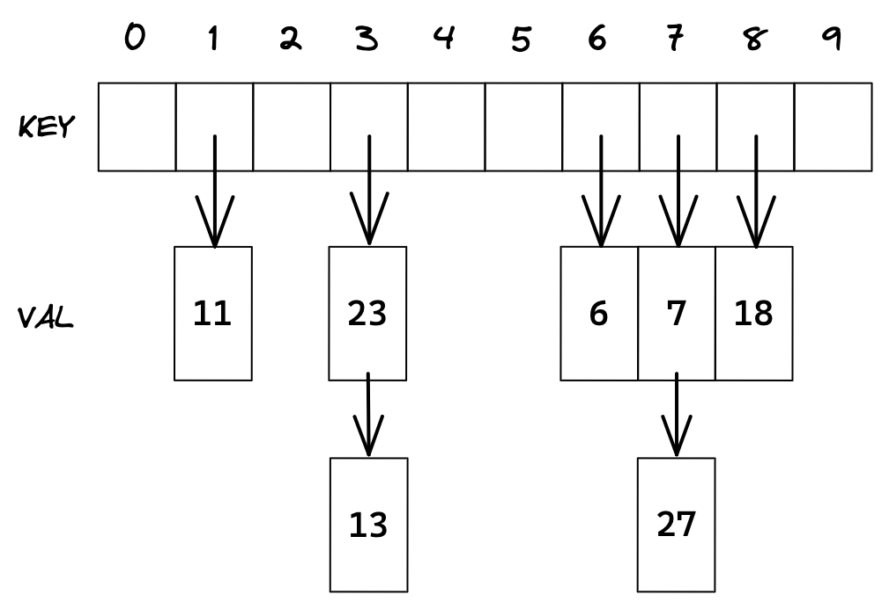

# 哈希

## 1. unordered容器

当节点非常多时，map和set查询效率也不够理想。C++11新增`unordered_map, unordered_set`等底层为哈希的关联式容器。

`unordered`意为无序的，即存储遍历不按`key`排序。所以`unordered`系列容器只有单向迭代器。

| 容器                                    | 底层   | 区别         |
| --------------------------------------- | ------ | ------------ |
| set / map                               | 红黑树 | 排序加去重   |
| multiset / multimap                     | 红黑树 | 排序不去重   |
| unordered_set / unordered_map           | 哈希   | 去重不排序   |
| unordered_multiset / unordered_multimap | 哈希   | 不排序不去重 |

### 1.1 效率对比

```cpp
int n = 10000000;
vector<int> v;
srand((unsigned int)time(nullptr));
for (int i = 0; i < n; i++) {
    v.push_back(rand());
    v.push_back(i);
}

set<int> s;
unordered_set<int> us;

int begin1 = clock();
for (auto e : v) {
    s.insert(e);
}
int end1 = clock();

//
int begin2 = clock();
for (auto e : v) {
    us.insert(e);
}
int end2 = clock();

cout << "set insert: " << end1 - begin1 << endl;
cout << "unordered_set insert: " << end2 - begin2 << endl;
```

- 当插入随机值且数据量很大时，unordered_set比set快3倍左右。
- 当插入有序值且数据量很大时，unordered_set比set慢2倍左右。
- unordered_set的查找效率极高，这得益于哈希的底层结构。

set更适合有序重复度低的数据，unordered_set更适合随机重复度高的数据。**综合来看，unordered系列容器比map/set效率要更好些。**


&nbsp;

## 2. 哈希

### 2.1 哈希的定义

哈希也叫做散列，记数排序就体现了哈希思想。

计数排序为统计数字出现的个数，<u>为每个数字都开辟了对应的一块空间</u>，用来记录其出现的个数，每遇到就加一。

**将一个元素和一个位置建立映射关系，这就是哈希的本质**。

#### 哈希函数

> 搜索树中key与元素的存储位置没有直接映射。因此查找必须经历多次比较key。搜索效率还是不够理想。

最理想的搜索方法是：不经任何比较，一次性直接得出元素的存储位置。

<u>通过某种函数（hashFunc）使元素 key 与它的存储位置之间能够建立映射关系</u>，那么就可以一次性找到该元素。

##### 除留余数法

例如，存在数据集合 $[1,7,6,4,5,9]$，将哈希函数设置为 $hash(key)=key\;\%\;capacity$，$capacity$ 为存储空间总的大小。

<center>

</center>

##### 自定义哈希函数

常见的数据类型如整数，库中自带哈希函数，但有些类型比如自定义类型，需要我们自定义哈希函数。

可以把哈希函数设计成仿函数，对不同类型添加特化处理。

```cpp
template<class K>
struct Hash {
    size_t operator()(const K& key) {
        return key;
    }
};
// 特化
template<>
struct Hash<string> {
    //BKDR
    size_t operator()(const string& s) {
        size_t val = 0;
        for (auto ch : s) {
            val = val * 131 + ch;
        }
        return val;
    }
};
```

如果我们自定义类型作key，可以单独为其设计一个哈希函数，并在创建哈希表时作参数传进去。

```cpp
struct Date {
    int _year;
    int _month;
    int _day;
};
struct HashDate {
    size_t operator()(const Date& date) {
        return date._year + date._month + date._day;
    }
};
```

#### 哈希冲突

很可能存在不同数值映射到同一位置的情况，比如$10\%10=0,\;20\%10=0$。这就是哈希冲突或称哈希碰撞。

一般哈希冲突是不可避免的，冲突越多效率越低，故提高哈希效率在于如何解决哈希冲突。解决哈希冲突的两种常见的方法是：闭散列和开散列。

### 2.2 哈希冲突的解决

#### 闭散列/开放定址法

闭散列，又称开放定址法。**当发生哈希冲突时，把元素放到冲突位置后的下一个空位中**。

> 如何寻找空位呢？一般有线性探测和二次探测。如果没有空位，可以闭散列扩容。

##### 两种探测方式

| 探测方式 | 解释                                              | 问题                               |
| -------- | ------------------------------------------------- | ---------------------------------- |
| 线性探测 | 从冲突位置向后遇到的第一个空位，就是存放位置      | 连续位置冲突越来越多，引发洪水效应 |
| 二次探测 | 每次向后跳过 $i^2$ 个长度，如遇到空位就是存放位置 | 能缓解拥堵，快满时“绕圈”现象明显。 |

如何表示元素位置是否存在、为空、被删除？要为每个位置数据增加状态标记。

<center>

</center>

二次探测在得到位置后如果发生冲突，第一次向后跳过$1^2$个长度、第二次$2^2$个长度，如此类推，直到遇到空位置。

```cpp
bool insert(const pair<K, V>& kv)
{
    if (_table.size() == 0 || _size * 10 / _table.size() >= 7)
    {
        size_t new_size = _size == 0 ? 10 : _table.size() * 2;
        hash_table<K, V> new_hash;
        new_hash._table.resize(new_size);

        for (auto& data : _table)
            if (data._st == EXIST)
                new_hash.insert(data._kv);

        _table.swap(new_hash._table);
    }

    size_t hashi = kv.first % _table.size();

    size_t i = 1;
    size_t idx = hashi;
    while (_table[idx]._st == EXIST)
    {
        if (_table[idx]._kv.first == kv.first)
            return false;

        idx += i;     // 线性探测
        idx += i * i; // 二次探测
        idx %= _table.size();
    }

    _table[idx]._kv = kv;
    _table[idx]._st = EXIST;
    ++_size;
    return true;
}
```

##### 闭散列扩容

> 当二次探测总是在正确位置“绕圈”时，只能用扩容解决问题。但什么时候该扩容呢？扩容多大呢？

载荷因子可以衡量哈希表的装载程度，它的定义是：
$$
\alpha \; = \;表中元素个数\;/\;表的总长度
$$
负载因子越小，冲突概率越低，效率越高，但空间浪费就多。

使用闭散列时，荷载因子是决定哈希效率的重要因素，应严格限制在0.7-0.8以下。超过0.8，查表的缓存不命中率指数级上升。

哈希表的扩容要维护原有数据的存放位置。数据搬迁很麻烦，不如将原数据插入到新表。

<center>

</center>

```cpp
bool insert(const pair<K, V>& kv)
{
    if (_table.size() == 0 || _size * 10 / _table.size() >= 7)
    {
        size_t new_size = _size == 0 ? 10 : _table.size() * 2;
        hash_table<K, V> new_hash;
        new_hash._table.resize(new_size);

        for (auto& data : _table)
        {
            if (data._st == EXIST)
                new_hash.insert(data._kv);
        }

        _table.swap(new_hash._table);
    }
    // ...
}
```

```cpp
HashNode<K, V>* Find(const K& key) {
    if (_table.size() == 0)
        return nullptr;

    HashFunc hf;

    size_t pos = hf(key) % _table.size();
    size_t index = pos;
    size_t i = 0;

    while (_table[index]._status == EXIST) {
        if (_table[index]._kv.first == key) {
            return &_table[index];
        }

        ++i;
            index = pos + i;
            index %= _table.size();
    }

    return nullptr;
}
bool Erase(const K& key) {
    HashNode<K, V>* ret = Find(key);
    if (ret == nullptr)
        return false;
    else {
        ret->_status = EMPTY;
        --_n;
        return true;
    }
}
```

#### 开散列/拉链法/哈希桶

> 闭散列的线性探测和二次探测都会加剧哈希冲突，现实中几乎不会使用闭散列。

开散列又称拉链法、链地址法、开链法、哈希桶。

**具有相同地址的key归于一个集合（桶），桶中元素通过链表链接起来，各链表的头结点存储在哈希表中**。从根本上解决了冲突的问题。

<center>

</center>

```cpp
template<class K, class V>
struct hash_node
{
    pair<K, V> _kv;
    hash_node<K, V>* _next;

    hash_node<K, V>(const pair<K, V>& kv) : _kv(kv), _next(nullptr)
    {}
};

template<class K, class V>
class hash_table
{
public:
    typedef hash_node<K, V> node;
public:
    ~hash_table<K, V>() {
        for (auto cur : _table) {
            while (cur) {
                node* next = cur->_next;
                delete cur;
                cur = next;
            }
        }
    }

private:
    vector<node*> _table;
    size_t _size;
};
```

##### 开散列实现

桶由链表实现，本质效率和线性探测一样。如果桶中节点过多会影响哈希表的性能。必须在适当条件下对哈希表增容。让哈希表处于最佳状态。

开散列的最佳情况是每个哈希桶中刚好挂一个节点。如果再插入必然会发生冲突。因此**当元素个数等于桶的个数时，可以给哈希表增容**。

<center>

</center>

开散列扩容复用插入逻辑的话，会浪费原节点，最好是遍历原表节点放到新表中。

```cpp
bool insert(const pair<K, V>& kv)
{
    if (_table.empty() || _size == _table.size())
    {
        size_t new_size = _size == 0 ? 10 : _table.size() * 2;
        vector<node*> new_table(new_size);

        for (auto cur : _table)
        {
            while (cur)
            {
                size_t hashi = cur->_kv.first % _table.size();
                node* next = cur->_next;

                cur->_next = new_table[hashi];
                new_table[hashi] = cur;

                cur = next;
            }
            cur = nullptr;
        }

        _table.swap(new_table);
    }

    size_t hashi = kv.first % _table.size();

    node* new_node = node(kv);
    new_node->_next = _table[hashi];
    _table[hashi] = new_node;
    return true;
}
```

```cpp
node* find(const K& key)
{
    if (_table.empty())
        return nullptr;

    size_t hashi = key % _table.size();
    node* cur = _table[hashi];

    while (cur)
    {
        if (cur->_kv.first == key)
            return cur;

        cur = cur->_next;
    }

    return nullptr;
}

bool erase(const K& key)
{
    if (_table.empty())
        return false;

    size_t hashi = key % _table.size();
    node* cur = _table[hashi];
    node* prev = nullptr;

    while (cur)
    {
        if (cur->_kv.first == key)
        {
            if (!prev)
            {
                _table[hashi] = cur->_next;
            }
            else
            {
                prev->_next = cur->_next;
            }
            delete cur;
            return true;
        }

        prev = cur;
        cur = cur->_next;
    }
    return false;
}
```

&nbsp;

## 3. 模拟实现

> 哈希表的实现比红黑树要简单不少，但是它的封装比较繁琐。

根据哈希表原理，实现unordered系列容器，需要对key类型作出如下要求：

| 参数                 | 解释                                 |
| -------------------- | ------------------------------------ |
| `Hash=hash<Key>`     | **支持取模或支持映射到整数进行取模** |
| `Pred=equal_to<Key>` | **支持判断相等的函数**               |

```cpp
template < class Key,  									// unordered_map::key_type
		   class Value,									// unordered_map::mapped_type
		   class Hash = hash<Key>, 						// unordered_map::hasher
		   class Pred = equal_to<Key>, 					// unordered_map::key_equal
		   class Alloc = allocator<pair<const Key,T>>   // unordered_map::allocator_type
		 > class unordered_map;
```

### 3.1 改造哈希表

- unordered_map/unordered_set要复用同一个哈希表，同样要提供仿函数`KeyOfVal`。
- 哈希只支持单向迭代器，所以只有++。
- 哈希表遍历是从头到尾遍历每个桶，必须能访问表中的数组，所以必须提供哈希表对象的指针。

```cpp
template<class K, class V, class HashFunc, class KeyOfVal, class EqualKey>
class hash_table;

template<class K, class V, class HF, class KOV, class Ref, class Ptr>
struct __hash_iterator
{
    typedef __hash_node<V> node;
    typedef hash_table<K, V, HF, KOV> hash_table;
    typedef __hash_iterator<K, V, HF, KOV, V&, V*> iterator;
    typedef __hash_iterator<K, V, HF, KOV, Ref, Ptr> self;

    node* _node;
    const hash_table* _ht;

    __hash_iterator(node* n, const hash_table* ht) : _node(n), _ht(ht)
    {}

    __hash_iterator(const iterator& it) : _node(it._node), _ht(it._ht)
    {}

    Ref operator*() { return _node->_val; }

    Ptr operator->() { return &_node->_val; }

    bool operator==(const self& s) { return _node == s._node; }

    bool operator!=(const self& s) { return !this->operator==(s); }

    self& operator++()
    {
        if (_node->_next)
        {
            _node = _node->_next;
        }
        else
        {
            size_t hashi = _ht->_hash(_ht->_kov(_node->_val)) % _ht->_table.size();
            ++hashi;

            while (hashi < _ht->_table.size())
            {
                if (_ht->_table[hashi])
                {
                    _node = _ht->_table[hashi];
                    break;
                }
                ++hashi;
            }

            if (hashi == _ht->_table.size())
                _node = nullptr;
        }
        return *this;
    }
};
```

```cpp
template<class V>
struct __hash_node
{
    V _val;
    __hash_node<V>* _next;
    __hash_node<V>(const V& val) : _val(val), _next(nullptr)
    {}
};

template<class K, class V, class HashFunc, class KeyOfVal>
class hash_table
{
public:
    typedef __hash_node<V> node;
    typedef __hash_iterator<K, V, HashFunc, KeyOfVal, V&, V*> iterator;
    typedef __hash_iterator<K, V, HashFunc, KeyOfVal, const V&, const V*> const_iterator;

    template<class K, class V, class HF, class KOV, class Ref, class Ptr>
    friend struct __hash_iterator;

public:
    const_iterator begin() const
    {
        for (auto cur : _table)
        {
            if (cur) return const_iterator(cur, this);
        }
        return end();
    }

    const_iterator end() const
    {
        return const_iterator(nullptr, this);
    }

    iterator begin()
    {
        for (auto cur : _table)
        {
            if (cur) return iterator(cur, this);
        }
        return end();
    }

    iterator end()
    {
        return iterator(nullptr, this);
    }

public:
    std::pair<iterator, bool> insert(const V& val)
    {
        auto pos = find(_kov(val));
        if (pos != end())
            return {pos, false};

        if (_table.empty() || _table.size() == _size)
        {
            size_t new_size = _table.empty() ? 10 : _table.size() * 2;
            std::vector<node*> new_table(new_size);

            for (auto& cur : _table)
            {
                while (cur)
                {
                    size_t hashi = _hash(_kov(cur->_val))%new_table.size();
                    node* next = cur->_next;

                    cur->_next = new_table[hashi];
                    new_table[hashi] = cur;

                    cur = next;
                }
            }

            _table.swap(new_table);
        }

        size_t hashi = _hash(_kov(val)) % _table.size();
        node* new_node = new node(val);

        new_node->_next = _table[hashi];
        _table[hashi] = new_node;
        ++_size;

        return {iterator(new_node, this), true};
    }

    iterator find(const K& key)
    {
        if (_table.empty())
            return end();

        size_t hashi = _hash(key) % _table.size();
        node* cur = _table[hashi];

        while (cur)
        {
            if (_hash(_kov(cur->_val)) == _hash(key))
                return iterator(cur, this);

            cur = cur->_next;
        }

        return end();
    }

    bool erase(const K& key)
    {
        if (_table.empty())
            return false;

        size_t hashi = _hash(key) % _table.size();
        node* cur = _table[hashi];
        node* prev = nullptr;

        while (cur)
        {
            if (_hash(_kov(cur->_val)) == _hash(key))
            {
                if (!prev)
                {
                    _table[hashi] = cur->_next;
                }
                else
                {
                    prev->_next = cur->_next;
                }
                delete cur;
                return true;
            }

            prev = cur;
            cur = cur->_next;
        }
        return false;
    }

private:
    std::vector<node*> _table;
    size_t _size = 0;

    KeyOfVal _kov;
    HashFunc _hash;
};
```

### 3.2 封装容器

#### unordered_set

```cpp
template<class K, class Hash = hash<K>>
class unordered_set
{
private:
    struct KeyOfVal {
        const K& operator()(const K& key) const { return key; }
    };

public:
    typedef hash_table<K, K, Hash, KeyOfVal> rep_type;
    typedef typename rep_type::const_iterator iterator;
    typedef typename rep_type::const_iterator const_iterator;

public:
    std::pair<iterator, bool> insert(const K& key) { return _ht.insert(key); }

    size_t erase(const K& key) { return _ht.erase(key); }

    iterator find(const K& key) { return _ht.find(key); }

    iterator begin() { return _ht.begin(); }
    iterator end() { return _ht.end(); }

    const_iterator begin() const { return _ht.begin(); }
    const_iterator end() const { return _ht.end(); }

private:
    rep_type _ht;
};
```

#### unordered_map

```cpp
template<class K, class V, class Hash = hash<K>>
class unordered_map
{
private:
    struct KeyOfVal {
        const K& operator()(const std::pair<const K, V>& kv) const {
            return kv.first;
        }
    };

public:
    typedef hash_table<K, std::pair<const K, V>, Hash, KeyOfVal> rep_type;
    typedef typename rep_type::iterator iterator;
    typedef typename rep_type::const_iterator const_iterator;

public:
    std::pair<iterator, bool> insert(const std::pair<K, V>& kv) { return _ht.insert(kv); }

    size_t erase(const K& key) { return _ht.erase(key); }

    iterator find(const K& key) { return _ht.find(key); }

    iterator begin() { return _ht.begin(); }
    iterator end() { return _ht.end(); }

    const_iterator begin() const { return _ht.begin(); }
    const_iterator end() const { return _ht.end(); }

    V& operator[](const K& key) { return _ht.insert({key, V()}).first->second; }

private:
    rep_type _ht;
};
```

&nbsp;

## 4. 哈希应用

### 4.1 位图

哈希是存在一定空间消耗的，在处理海量数据的情况下可以选择位图。

#### 位图的定义

位图用一段空间的每个比特位：

- 比特位的位置映射到特定的元素；
- 比特位的值即01来表示二元状态。

位图可以记录某个元素的某个二元状态，通常用于处理海量数据，且数据无重复的场景。通常是用来判断某个数据存不存在。

<u>位图的大小和数据量无关，而是和数据最大值有关</u>。整型最大能表示42亿多。故位图最大为$500MB$。

#### 位图的优劣

- 位图的查找速度快。节省空间。
- 但位图只能处理整数，只能记录二元状态。

#### 位图的实现

<center>

</center>

位图就是将元素以绝对映射的方式到下标位置。

以一个字节八个比特位为一组，$x/8$ 得元素在第几个组，然后 $x\%8$ 得元素在组中第几个比特位。

```cpp
template <size_t N>
class bit_set
{
public:
	bit_set() { _bits.resize(N / 8 + 1); }

    void set(size_t x)
    {
        int i = x / 8; // 字节位
        int j = x % 8; // 比特位
        _bit[i] |= (1 << j); // 比特位置1
    }

    void reset(size_t x)
    {
        int i = x / 8;
        int j = x % 8;
        _bit[i] &= ~(1 << j) // 比特位置0
    }

    bool test(size_t x)
    {
        int i = x / 8;
        int j = x % 8;
        return _bit[i] & (1 << j); // 探测该比特位
    }

private:
	vector<char> _bits;
};
```

整数相除会丢弃余数，所以加一个字节保证空间大小一定满足要求。

```cpp
//开满大小的位图
bitset<(size_t)-1> bs1;
bitset<0xffffffff> bs2;
```

#### 位图的应用

##### 问题一

> 给定40亿个整数，设计算法找到只出现一次的整数？

找到只出现一次的整数，需要两个位图，<u>一个保存这些数的是否出现一次，一个保存是否出现</u>。

```cpp
template <size_t N>
void handlequestion2(vector<int>& in, vector<int>& out)
{
    bitset<N> bs1;
    bitset<N> bs2;

	for (auto e : in) {
        if (!_bs2.test(x)) {
            _bs1.set(x);
            _bs2.set(x);
        }
        else {
            _bs1.reset(x);
        }
    }
	for (int i = 0; i < N; i++)
        if (_bs1.test(i))
            v.push_back(i);
}
```

##### 问题二

> 给两个文件，分别有100亿个整数，我们只有1G内存，如何找到两个文件交集？

思路一：将第一个文件中的整数set到位图中，再遍历第二个文件的整数test该位图，如果已经存在则属于交集，输出后再将其reset防止重复。

```cpp
template <size_t N>
void handlequestion2(vector<int>& in1, vector<int>& in2, vector<int>* out)
{
    bitset<N> bs;
    for (auto e : in1) {
        bs.set(e);
    }
    for (auto e : in2) {
        if (bs.test(e)) {
            bs.reset(e);
            out->push_back(e);
        }
    }
}
```

思路二：两个文件分别set到两个位图，取两个位图相与后的结果，就是交集。

```cpp
template <size_t N>
void handlequestion2(vector<int>& in1, vector<int>& in2, vector<int>* out)
{
    bitset<N> bs1;
    bitset<N> bs2;

	for (auto e : in1) bs1.set(e);
    for (auto e : in2) bs2.set(e);

    for (int i = 0; i < N; i++) {
        if (bs1.test(i) && bs2.test(i))
            out->push_back(i);
    }
}
```

##### 问题三

> 100亿个整数，1G内存，找到出现不超过2次的整数。

两个位图可表示4种状态，可以描述出现0次，出现1次，出现2次，2次以上。

```cpp
template <size_t N>
void handlequestion3(vector<int>& in, vector<int>* out)
{
    bitset<N> bs1;
    bitset<N> bs2;
    if(bs1.test(x) == false && bs2.test(x) == false) // 00 -> 01
    {
        bs1.set(x);
    }
    else if (bs1.test(x) == true && bs2.test(x) === false) // 01 -> 10
    {
        bs1.reset(x);
        bs2.set(x);
    }
    else if (bs1.test(x) == false && bs2.test(x) === true) // 10 -> 11
    {
        bs1.set(x);
        bs2.set(x);
    }

    for (int i = 0; i < N; i++) {
        if ((_bs1.test(i) && !_bs2.test(i)) || (!_bs1.test(i) && _bs2.test(i)))
            v->push_back(i);
    }
}
```

### 4.2 布隆过滤器

> 位图只能处理整数，布隆过滤器可以处理任意类型。

#### 布隆过滤器的定义

有些类型虽不可直接映射，但可以通过哈希函数转整数间接映射。可以认为，布隆过滤器就是加上哈希函数的位图。

但使用哈希函数就不可避免会发生哈希冲突。发生冲突会导致误判，将一个不存在的元素误判为存在。

解决冲突的方式：

1. 使用更大空间，自然会减少冲突的概率。
2. **多副本映射，使用多个哈希函数，将同一元素映射在不同位置上，降低误判的概率**。

<center>

</center>

倘若某个元素的位置都被其他元素映射了，那它就会被误判存在。也就是说，**结果存在不一定对，结果不存在一定对。所以尽量使用布隆过滤器判断“不在”**。

#### 布隆过滤器的优劣

| 优点                 | 解释                                           |
| -------------------- | ---------------------------------------------- |
| **查询效率高**       | $O(K)$，K是映射副本的个数，属于常数次。        |
| **占存小，保密性高** | 不存储元素本身，只存储映射状态。               |
| **缺点**             | **解释**                                       |
| 有误判率             | 不能准确判断元素是否存在。                     |
| 不能删除             | 如果采用计数方式删除，可能会存在计数回绕问题。 |

#### 布隆过滤器的实现

[布隆过滤器](https://zhuanlan.zhihu.com/p/43263751)

模版参数`N`表示需要映射的元素个数，但防止冲突一个元素需要多个比特位，那具体要开辟多大空间呢？
$$
布隆过滤器大小=4.3*映射的元素个数
$$

```cpp
#pragma once
#include <iostream>
#include "bitset.hpp"
using namespace std;
using namespace test;

struct BKDRHash {
    size_t operator()(const string& s) {
        int val = 0;
        for (auto e : s) val = val * 131 + e;
        return val;
    }
};
struct APHash {
  	size_t operator()(const string& s) {
		size_t hash = 0;
        size_t ch = 0, i = 0;
        for (auto ch : s) {
            if (i++ & 1 == 0) hash ^= ((hash << 7) ^ ch ^ (hash >> 3));
            else hash ^= (~(hash << 11) ^ ch ^ (hash >> 5));
        }
        return hash;
    }
};
struct DJBHash {
  	size_t operator()(const string& s) {
        size_t hash = 5381;
        for (auto ch : s) hash += (hash << 5) + ch;
        return hash;
    }
};

template <size_t N,
          size_t MUL = 4,
          class K = string,
          class Hash1 = BKDRHash,
          class Hash2 = APHash,
          class Hash3 = DJBHash>
class bloom_filter
{
public:
    void set(const K& key)
    {
        size_t i1 = Hash1()(key) % _len;
        size_t i2 = Hash2()(key) % _len;
        size_t i3 = Hash3()(key) % _len;
        _bs.set(i1);
        _bs.set(i2);
        _bs.set(i3);
    }

    bool test(const K& key)
    {
        size_t i1 = Hash1()(key) % _len;
        size_t i2 = Hash2()(key) % _len;
        size_t i3 = Hash3()(key) % _len;
        return _bs.test(i1) && _bs.test(i2) && _bs.test((i3));
    }

private:
    bitset<N * MUL> _bs;
    size_t _len = MUL * N;
};
```

#### 布隆过滤器的应用

> 如何使布隆过滤器支持删除？

布隆过滤器本身不支持删除。因为在发生冲突的情况下将比特位置0，可能会导致误判不在。

利用多个位图，每个元素占有多个比特位，存储引用计数。会导致耗费空间变多，布隆过滤器优势减弱。

### 4.3 哈希切分

#### 应用一

> 给两个文件，分别有100亿个query，我们只有1G内存，如何找到两个文件交集？

先将文件A和文件B分别各切分成200个小文件。

利用哈希函数，算出每个query的映射位置，是多少就放进多少号文件。比如文件A中的某个query的哈希结果是3，就放到A3号文件中，B中的query也同理。

因为文件A和文件B用同一个哈希函数，所以两个文件中相同的query一定进入了同一个编号的小文件中。所以只要对比编号相同的哈希桶是否存在相同的元素即可。

> 小文件就相当于是一个哈希桶，相同哈希结果的query会到同一个桶中。

<center>

</center>

如果$A_i$和$B_i$两个桶太大，超过内存限制，可以换一个哈希算法，再对这两个桶切分一次。

#### 应用二

> 给一个超过100G大小的日志文件存着IP地址，我们只有1G内存，设计算法找到出现次数TopK的IP地址？

遍历文件读取IP，`i=BKDR(ip)%100`下标为多少，IP就进入编号为多少的文件。

通过哈希算法一定会将相同的IP进入同一个文件，所以统计该文件内各IP的次数就是该IP的出现次数。

[一致性哈希](https://blog.csdn.net/a745233700/article/details/120814088)

[哈希与加密](https://www.cnblogs.com/leoo2sk/archive/2010/10/01/hash-and-encrypt.html)
