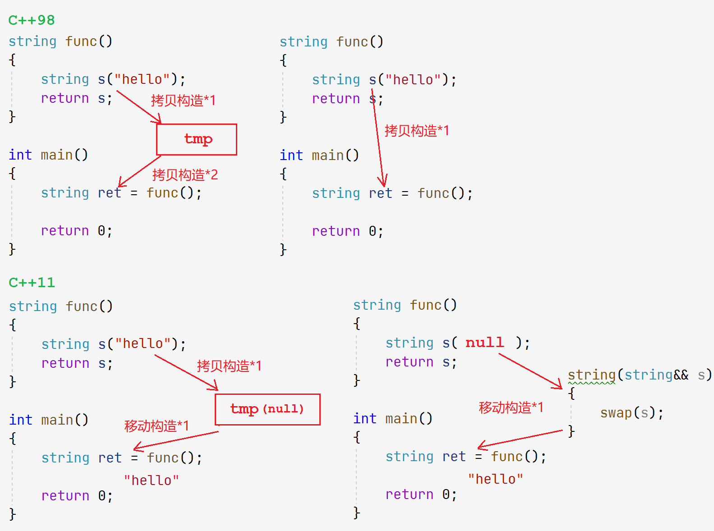
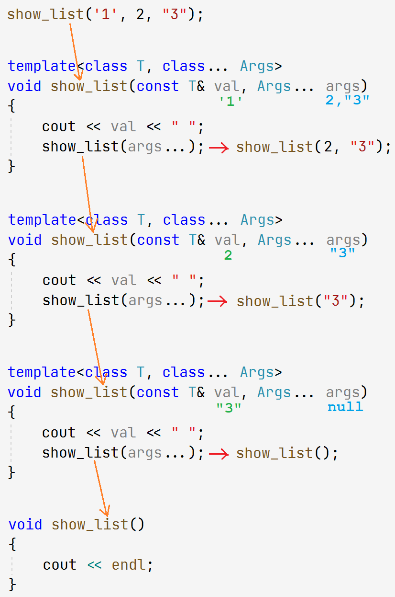

# C++11

相比于C++98，C++11则带来了数量可观的变化，以及对C++03缺陷的修正。C++11语法更加泛化简单化、更加稳定安全，功能更强大，提升开发效率。

[cpp11](https://en.cppreference.com/w/cpp/11)

&nbsp;

## 1. 列表初始化

C++11扩大了用`{}`（初始化列表）的使用范围，可用于所有的内置类型和自定义类型，可以省略赋值符`=`。

```cpp
int a1 = 1;    // C++98
int a2 = {2};  // C++11
int a3{3};     // C++11

int* ptr1 = new int[5];          // C++98
int* ptr2 = new int[5]{1, 2, 3}; // C++11

int arr[10] = {1, 2, 3, 4};     // C++98
vector<int> v = {1,2, 3,4};     // C++11

A a2 = 2;       // 单参数隐式类型转换 C++98
Point pp{1, 2}; // 多参数隐式类型转换 C++11
```

> C++11对容器也可以使用列表初始化，这到底是如何做到的呢？

```cpp
vector (initializer_1ist<value_type> il);
vector<int> v1 = { 1,2,3,4,5,6 };
```

`{}`的常量数组的类型被C++解释为初始化列表`initializer_list`。它的底层就是用常量区数组存储列表中的内容。

```cpp
template<class T>
class initializer_list;

auto il = { 10, 20, 30 };
initializer_list<int> il = { 10, 20, 30 };
```

> 如何为自定义类型实现列表初始化呢？

`initializer_list`类型支持`begin`和`end`接口。

1. 自定义类型中添加初始化列表构造函数
2. 在其中用初始化列表的迭代器调用迭代器区间构造函数。

```cpp
class vector {
	vector(iterator first, iterator last)
        : _start(nullptr)
        , _finish(nullptr)
        , _end_of_storage(nullptr)
    {
        while (first != last)
        {
            push_back(*first);
            first++;
        }
    }

    vector(initializer_list<T>& il)
        : _start(nullptr)
        , _finish(nullptr)
        , _end_of_storage(nullptr)
    {
        vector<T> tmp(il);
        swap(tmp);
    }
};
```

&nbsp;

## 2. 变量类型推导

### 2.1 auto

C++11定义变量时，auto用于自动类型推导，让编译器自动推导变量的类型，使用auto更加便捷省时。


```cpp
auto i = 0;
cout << typeid(i).name() << endl;
```

### 2.2 decltype

关键字`decltype`使用表达式的类型声明一个新的变量。

```cpp
// 使用变量的类型创建新变量
decltype(x) i = 1;
decltype(x * y) i = 1;

int(*pfunc1)(int) = &func; // 类型过于复杂，使用decltype获取类型
decltype(func) pfunc2;
```

&nbsp;

## 3. 右值引用和移动语义

> 右值引用和移动语义是C++11中最重要的更新，在根本上减少拷贝，提升效率。

### 3.1 左值引用和右值引用

#### 左值右值

- 左值是一个表达式，如变量名或解引用的指针。一般指表达式结束依然存在的持久对象。
- 右值是一个表达式，如字面常量、表达式返回值、函数返回值。一般指表达式结束就不存在的临时对象。

| 左值特点                   | 右值特点                   |
| -------------------------- | -------------------------- |
| **左值可以取地址可以赋值** | 右值不可被取地址不可赋值   |
| 左值可以出现在赋值符的左右 | 右值只能出现在赋值符的右边 |

> 左值就是变量，右值就是常量，不完全对。

**可以取地址的就是左值，不可以取地址的就是右值**。

##### 右值的分类

- 将亡值：指生命周期即将结束的值，通常是将要被销毁被移动的对象。
- 纯右值：值返回的临时对象、表达式运算产生的临时对象、字面常量和lambda表达式等。

#### 左右值引用

**左值引用就是给左值取别名，右值引用就是给右值取别名**。左值引用用`&`表示，右值引用使用`&&`表示。

**给右值取别名后，该右值会被当作变量存储在内存中，且可以取地址**。

```cpp
// 左值引用
int& ra = a;
int& rp = *p;
const int& rb = b;

// 右值引用
int&& rr1 = 10;         // 字面常量
int&& rr2 = x + y;      // 表达式运算的临时对象
int&& rr3 = func(x, y); // 值返回的临时对象
```

##### 交叉引用

```cpp
const int& lr = 10;       // 左值引用 引用 右值
int*&& rr = std::move(p); // 右值引用 引用 左值
```

- 左值引用不能直接引用右值，但`const`常引用可以。
- 右值引用不能直接引用左值，但可以引用`std::move`后的左值。

### 3.2 移动构造和移动赋值

#### 移动构造

> 左值引用无法解决的问题有两点：局部对象返回，接口传参对象拷贝。

##### 右值引用作参数

编译器可以识别表达式是左值还是右值。因此传入的不同属性的表达式会进入不同的构造函数。

移动构造就是单独拎出右值的情况来优化，具体如何进行资源转移还取决于代码。

> 移动构造减少拷贝的前提是编译器支持识别右值，这便是右值引用的意义。

```cpp
string(const string& s)
    : _size(s._size)
    , _capacity(s._capacity)
{
    _str = new char[_capacity + 1];
    strcpy(_str, s._str);
}

string(string&& s)
    : _size(0)
    , _capacity(0)
{
    swap(s); // 资源转移
}

string ret1 = s1;      // 拷贝构造
string ret2 = s1 + s2; // 移动构造
```

> `move()`也就是将左值强制转化为右值引用，然后直接转移其资源。

##### 右值引用作返回值

值返回函数会构造出一个即将销毁的临时对象用来返回，编译器会将临时对象视为将亡值，会调用移动构造来构造对象。


```cpp
string func()
{
    string s("hello");
    return s;
}

int main()
{
	string ret = func();
    return 0;
}
```

- 如果编译器完全不做优化，上述代码应该有两次拷贝：
  - 使用`s`拷贝构造出一个临时对象`tmp`以供返回。
  - 使用临时对象`tmp`拷贝构造`ret`以接收返回值。
- 一般C++98编译器，会将连续两次的拷贝构造，优化成一次：
  - 直接用`s`拷贝构造`ret`。
- C++11编译器支持移动构造后，做到一般优化：
  - 栈变量`s`是左值，拷贝构造出临时对象`tmp`。
  - 临时对象`tmp`是将亡值，再调用移动构造，转移`tmp`资源到`ret`中。

- C++11编译器支持移动构造后，做到最大优化：
  - 栈变量`s`会被识别成将亡值，直接调用移动构造，转移`s`的资源到`ret`中。



#### 移动赋值

类默认成员函数新增一个移动赋值，移动赋值的参数是对象右值引用。当用右值对象赋值给其他对象时，会调用移动赋值。

 ```cpp
 // 移动赋值
 string& operator=(string&& s)
 {
     swap(s);
     return *this;
 }
 ```


用已经存在的对象接受值返回函数返回时：

1. 先用将亡值对象`s`构移动构造出一个临时对象`tmp`，
2. 再用临时对象`tmp`移动赋值给这个已经存在的对象`ret`。

> 只有连续的构造可以合二为一，其他不行。

C++11后STL所有容器也新增了移动构造和移动赋值，以及插入接口也新增了右值引用版本。

### 3.4 万能引用和完美转发

#### 万能引用

```cpp
template <class T>
void PerfectForward(T&& t) /* 万能引用 */
{}
```

`&&`放在具体类型的后面代表右值引用，**放在模版类型后面叫做万能引用或引用折叠。**

**万能引用既能接收左值也能接收右值**。

#### 完美转发

右值本身是占据空间的，右值引用后会变成左值。因为我们需要能够修改它，转移它的资源。

也就是说，右值引用做参数时会丢失右值属性。如果要维持属性，需要传参时使用完美转发`std::forward()`。

```cpp
void Func(int& x)        { cout << "左值引用"      << endl; }
void Func(const int& x)  { cout << "const左值引用" << endl; }
void Func(int&& x)       { cout << "右值引用"      << endl; }
void Func(const int&& x) { cout << "const右值引用" << endl; }

template <class T>
void ImperfectForward(T&& t) {
    Func(t);
}
template <class T>
void PerfectForward(T&& t) {
    Func(std::forward<T>(t)); /* 完美转发 */
}

int main()
{
    int a;
    const int b = 8;

    PerfectForward(10);

    PerfectForward(a);
    PerfectForward(std::move(a));

    PerfectForward(b);
    PerfectForward(std::move(b));
}
```


库或者自行实现的各种容器的右值插入也要支持完美转发。

```cpp
void push_back(T&& x)
{
    insert(end(), std::forward<T>(x));
}

iterator insert(iterator pos, T&& x)
{
    list_node* prev     = pos._node->_prev;
    list_node* next     = pos._node;
    list_node* new_node = new list_node(std::forward<T>(x));

    new_node->_prev = prev;
    prev->_next = new_node;
    new_node->_next = next;
    next->_prev = new_node;
    return iterator(new_node);
}

 __list_node<T>(T&& t)
    : _data(std::forward<T>(t))
{}
```

&nbsp;

## 4. 默认成员函数

### 4.1 默认成员函数控制

> 拷贝构造也是构造，如果只实现拷贝构造，编译器也是不会生成默认构造的。

- 在默认构造函数声明后加`=default`，可以指示编译器生成该函数的默认版本。
- 相反，加上`=delete`可以避免生成该函数的默认版本。


```cpp
class A
{
public:
    A() = default;
    A(const A& a);
    A operator=(const A& a) = delete;
private:
    // ...
};
```

C++98没有这样的关键字，那就必须将构造函数至声明不实现并私有化，能防止类外使用和类外实现。

### 4.2 新增默认成员函数

C++98有六个默认成员函数：构造函数、拷贝构造、拷贝赋值、析构函数以及取地址符重载。C++11新增两个：移动构造、移动赋值。

#### 移动构造的特性

- 没有实现移动构造，且没有实现析构函数、拷贝构造和拷贝赋值，那编译器会生成默认移动构造。
- 默认生成的移动构造，对内置类型会逐字节拷贝，对自定义类型如果内部有移动构造就调移动构造，没有就调拷贝构造。

#### 移动赋值的特性

- 如果没有实现移动赋值，且没有实现析构函数、拷贝构造和拷贝赋值，那编译器会生成默认移动赋值。
- 默认生成的移动赋值，对内置类型会逐字节拷贝，对自定义类型如果内部有移动赋值就调移动赋值，没有就调拷贝赋值。

> 默认移动构造和移动赋值的生成规则和成员处理规则一致。

```cpp
//test
class Person {
public:
    Person(const char* name = "", int age = 18) : _name(name), _age(age)
    {}
    // #define kb 1
#ifdef kb
    Person(const Person& p) : _name(p._name), _age(p._age)
    {}
    Person operator=(const Person& p) {
        if (this == &p) {
            Person tmp(p);
            return tmp;
        }
        return *this;
    }
    ~Person() {}
#endif
private:
    test::string _name;
    int _age;
};
int main()
{
    Person p1("hello", 18);
    Person p2 = std::move(p1); // 移动构造
    p1 = std::move(p2);        // 移动赋值
}
```

&nbsp;

## 5. lambda表达式

lambda表达式是一种可调用对象，类似于函数指针，仿函数。

### 5.1 lambda的语法

```cpp
// lambda示例
[capture_list] (param_list) -> ret_type
{
    func_body;
};
```

lambda又称匿名函数，虽然是匿名的，但可以赋值给`auto`类型变量取个名字。它的使用和函数一样。

| 语法组成         | 解释                                                       | 是否省略       |
| ---------------- | ---------------------------------------------------------- | -------------- |
| `[capture_list]` | 捕获列表，捕捉当前作用域中的变量。分为传值捕捉和引用捕捉   | 不可省略       |
| `(param_list)`   | 参数列表，形参默认具有`const`属性，可加`mutable`去除常属性 | 可省略         |
| `-> ret_type`    | 指明返回类型                                               | 可省略自动推导 |
| `{}`             | 函数体内容                                                 | 不可省略       |

```cpp
auto swap1 = [](int x, int y) {  // 形参默认具有const属性，编译报错
    int tmp = a;
    a = b;
    b = tmp;
};

auto swap2 = [](int x, int y) mutable {  // mutable去除const常属性，但不影响传值调用
    int tmp = a;
    a = b;
    b = tmp;
};

auto swap3 = [](int& x, int& y) { // 引用传参
    int tmp = x;
    x = y;
    y = tmp;
};
```

#### 捕获列表

`[captrue_list]`  捕获列表，用来捕捉当前作用域前和全局的变量。`[]`不可省略。

- 分为传值捕捉和引用捕捉，引用捕捉`[&a, &b]`。
- `[&]`表示全引用捕捉，`[=]`表示全传值捕捉。捕捉所有能捕捉的变量。
- `[&a, =]`表示混合捕捉，引用捕捉`a`变量，其他变量传值捕捉。但不可重复捕捉。
- **捕捉列表和参数列表的变量默认用`const`修饰，可加`mutable`解除修饰**。

```cpp
auto func1 = [a, b] () {};   // 传值捕捉
auto func2 = [&a, &b] () {}; // 引用捕捉
auto func3 = [=] () {}; // 全传值捕捉
auto func4 = [&] () {}; // 全引用捕捉

// 混合捕捉
[&a, &b, =](){}; // 引用捕捉a和b变量，其他变量传值捕捉
[=, a](){}; // 重复传值捕捉a，编译报错
```

### 5.2 lambda的底层

lambda表达式不能相互赋值，即使看起来类型相同。

```cpp
auto lamdba = []() {};
cout << sizeof(lamdba) << endl;        // 1
cout << typeid(lamdba).name() << endl; // class `int __cdecl main(void)'::`2'::<lambda_1>
									   // class <lambda_fcbffd5ae4b5ac20353abe92769a204f>
```

lambda表达式最后会被编译器处理成仿函数，所以lambda是个空类，大小为1。类名不同编译器实现不同，但能保证每个lambda表达式类名不同。

&nbsp;

## 6. 模版的可变参数

> C++11支持模版的可变参数，可变模版参数比较抽象晦涩，我们只探讨其中基础。

```cpp
template <class ...Args> // 模版参数包
void ShowList(Args... args) // 函数参数包
{}
```

`...`表明是可变模版参数，称为参数包，可以有 $[0,N]$ 个模版参数。可变参数的模版函数，同样是根据调用情况，实例化出多份。

```cpp
// 展示参数包个数
cout << sizeof...(Args) << endl;
cout << sizeof...(args) << endl;
```

### 6.1 模版参数包的使用

```cpp
void show_list()
{
    cout << endl;
}

template<class T, class... Args>
void show_list(const T& val, Args... args)
{
    cout << val << " "; // 使用第一个参数
    show_list(args...); // 向下递归传递参数包
}

int main()
{
    show_list();
    show_list('1');
    show_list('1', 2);
    show_list('1', 2, "3");

    return 0;
}
```

参数包可以递归解析。

1. 首先无参调用可直接调用无参版本。
2. 其次有参调用的第一个参数会被`val`获取，之后的参数会被参数包获取。
3. 使用完第一个参数后，可以传参数包下去递归调用。



> 线程库就是使用可变模版参数，支持传递任意个参数。

&nbsp;

## 7. 包装器

包装器用来包装具有相同特征用途的多个可调用对象，便于以统一的形式调用它们。

### 7.1 function包装器

function包装器也叫做适配器，C++中的function本质是一个类模版。定义如下：

```cpp
#include <functional>

template <class RetType, class... ArgsType> /* 声明返回类型和参数类型 */
	class function<Ret(Args...)>;
```

```cpp
// 普通函数
int func(int a, int b) { return a + b; }
// 仿函数
struct functor {
    int operator()(int x, int y) { return x + y; }
};
// 非静态成员函数
struct Plus {
    int plus(int a, int b) { return a + b; }
};
// 静态成员函数
struct Sub {
    static int sub(int a, int b) { return a - b; }
};

std::function<int(int, int)>          f1 = f;
std::function<int(int, int)>          f2 = Functor();
std::function<int(Plus&, int, int)>   f3 = &Plus::plus;
std::function<int(int, int)>          f4 = Sub::sub;
```

封装成员函数时需要注意的点有：指定类域、对象参数、加取地址符。

```cpp
struct Plus {
    Plus(int i) {}
    int plus(int a, int b) { return a + b; }
};

int main()
{
    function<int(Plus, int, int)> f1 = &Plus::plus;
    f1(Plus(1), 1, 2);

    function<int(Plus&, int, int)> f2 = &Plus::plus;
    Plus p(1);
    f2(p, 1, 2);

    function<int(Plus*, int, int)> f3 = &Plus::plus;
    f3(&p, 1, 2);

    function<int(Plus&&, int, int)> f4 = &Plus::plus;
    f4(Plus(3), 1, 2);

    return 0;
}
```

### 7.2 bind

bind函数也是一个函数包装器，本质是一个函数模版。生成一个新的可调用对象，来调整一个可调用对象的参数列表。

```cpp
// without return
template <class Func, class... Args>
    bind(Func&& fn, Args&&... args);

// with return type
template <class Ret, class Func, class... Args>
    bind(Func&& fn, Args&&... args);
```

```cpp
class suber
{
public:
    suber(int rt) : _rt(rt)
    {}

    int sub(int a, int b) { return (a - b) * _rt; }
private:
    int _rt;
};

// 通过bind调整参数顺序
function<int(int, int)> f1 = bind(suber, placeholders::_1, placeholders::_2);
function<int(int, int)> f2 = bind(suber, placeholders::_2, placeholders::_1);
cout << f1(2, 1) << endl;
cout << f2(1, 2) << endl;

// 通过bind调整参数个数
function<int(suber, int, int)> f3 = &Sub::sub;
function<int(int, int)> f4 = bind(&Sub::sub, Sub(3), placeholders::_1, placeholders::_2);
cout << f3(Sub(1), 2, 1) << endl;
cout << f4(2, 1) << endl;
```

&nbsp;

## 8. 线程库

C++11提供了跨平台的具有面向对象特性的线程库，线程相关的系统知识在此不作赘述，直接讨论线程库的使用。

### 8.1 thread类

| 构造函数                              | 解释                           |
| ------------------------------------- | ------------------------------ |
| `thread() noexcept`                   | 创建thread对象，不执行任何操作 |
| **`thread(Fn&& fn, Args&&... args)`** | **传入调用对象和参数列表**     |
| `thread(const thread&) = delete`      | 线程对象不可拷贝               |
| `thread(thread&& th)`                 | 线程对象支持移动               |
| **成员函数**                          | **解释**                       |
| `void join()`                         | 等待线程                       |
| `void detach()`                       | 分离线程                       |

关于当前线程的一些操作被放到`this_thread`类中：

| this_thread 成员函数                                         | 解释         |
| ------------------------------------------------------------ | ------------ |
| **thread::id get_id () noexcept**                            | 返回线程ID   |
| **void sleep_for (const chrono::duration<Rep,Period>& rel_time)** | 设置休眠时间 |

```cpp
vector<thread> thds(N); // 线程池
atomic<int> x = 0;

for (auto& td : thds) {
    td = thread([&x, M](int i = 0) {
            while (i++ < M) {
                cout << this_thread::get_id() << "->" << x << endl; // get_id()
                this_thread::sleep_for(std::chrono::seconds(1));    // sleep_for()
                x++;
            }
    	}
    );
}

for (auto& td : thds) {
    td.join();
}
```

### 8.2 mutex类

mutex类封装系统中的互斥锁，具体接口如下：

| mutex                                       | 解释       |
| ------------------------------------------- | ---------- |
| `mutex() noexcept`                          | 创建互斥锁 |
| `mutex (const mutex&) = delete`             | 禁止拷贝锁 |
| **`void lock()`**                           | **加锁**   |
| **`void unlock()`**                         | **解锁**   |
| **lock_guard**                              | **解释**   |
| `explicit lock_guard (mutex_type& m)`       | 构造函数   |
| `lock_guard (const lock_guard&) = delete`   | 不支持拷贝 |
| **unique_lock**                             | **解释**   |
| `explicit unique_lock (mutex_type& m)`      | 构造函数   |
| `unique_lock (const unique_lock&) = delete` | 不支持拷贝 |
| `void lock()`                               | 加锁       |
| `void unlock()`                             | 解锁       |

捕获异常并解锁释放资源是不够友好的，因此异常时资源的处理，交给RAII解决。RAII即资源获取就是初始化，是一种管理资源的用法。

**本质是将资源封装成类，自动调用构造和析构。以达到资源获取自动初始化，出作用域自动释放的效果**。

利用 RAII 封装的成“智能锁”，我们称之为锁守卫`lock_guard`。

### 8.3 atomic类

保证自增减的原子性，可以使用原子操作。atomic类封装系统原子操作，具体接口如下：

```cpp
template <class T> struct atomic;

T fetch_add (T val, memory_order sync = memory_order_seq_cst) volatile noexcept; // +=
T fetch_sub (T val, memory_order sync = memory_order_seq_cst) volatile noexcept; // -=
T fetch_and (T val, memory_order sync = memory_order_seq_cst) volatile noexcept; // &=
T fetch_or  (T val, memory_order sync = memory_order_seq_cst) volatile noexcept; // |=
T fetch_xor (T val, memory_order sync = memory_order_seq_cst) volatile noexcept; // ^=
T operator++() volatile noexcept; // ++
T operator--() volatile noexcept; // --
```

[无锁算法CAS](https://blog.csdn.net/qq_31960623/article/details/115573337)

[Linux原子操作系统调用](https://blog.csdn.net/weixin_53318672/article/details/121921628)

### 8.4 condition_variable类

条件变量是线程同步的一种机制，主要包括两个动作：等待条件变量挂起，条件变量成立运行。

| condition_variable                                        | 解释             |
| --------------------------------------------------------- | ---------------- |
| `condition_variable()`                                    | 构造条件变量     |
| `condition_variable (const condition_variable&) = delete` | 禁止拷贝条件变量 |
| `void wait (unique_lock<mutex>& lck)`                     | 直接等待         |
| `void wait (unique_lock<mutex>& lck, Predicate pred)`     | 指定条件下等待   |
| `void notify_one() noexcept`                              | 唤醒单个线程     |
| `void notify_all() noexcept`                              | 唤醒多个线程     |

```cpp
// wait的实现
template <class Predicate>
void wait (unique_lock<mutex>& lck, Predicate pred)
{
    while (!pred()) /* pred()为假，进入等待 */
        wait(lck);
}
```

模版参数`pred`是个可调用对象，其返回值代表线程是否进入临界区的条件。条件为真停止等待，条件为假进入等待。
