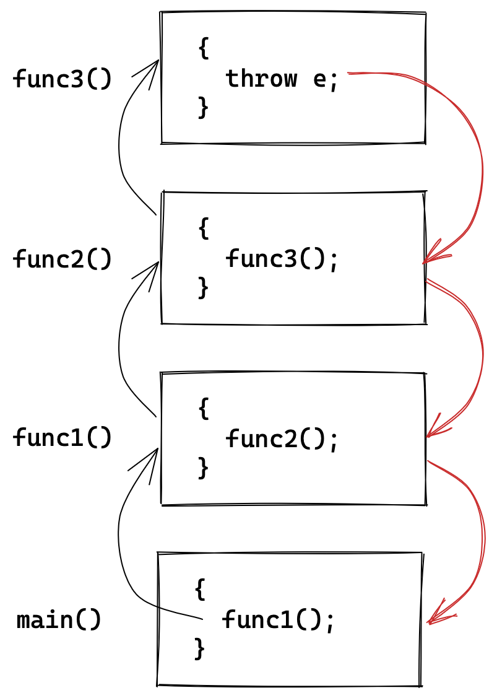
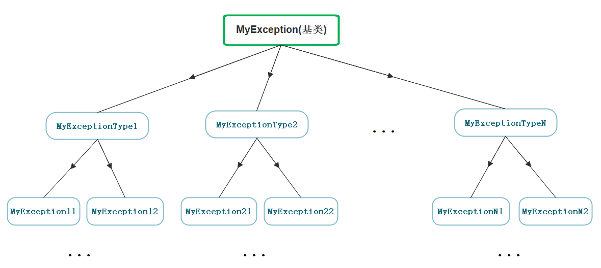

# 异常

传统错误处理机制是`assert`断言和`errno`错误码。两种方式都有很大的局限性：

| 错误处理机制 | 局限性                                                       |
| ------------ | ------------------------------------------------------------ |
| 断言         | 强制终止程序，用户难以接受                                   |
| 错误码       | 返回值传递错误码，占用函数返回位置；无法直接展示信息，需查错误码表 |

## 1. 异常的概念

异常是面向对象语言对错误的处理机制。更加灵活和全面。

当一个函数发现自己无法处理错误时就可以抛出异常，让函数的调用者处理这个错误。

| 关键字  | 含义                                                         |
| ------- | ------------------------------------------------------------ |
| `throw` | 使用`throw`可以抛出一个异常                                  |
| `catch` | 在处理问题的地方，使用`catch`用来捕获并处理异常。            |
| `try`   | `try`块中的代码将被激活的特定异常，它后面通常跟着一个或多个`catch`块。 |

异常机制可以帮助我们将异常检测和处理机制解耦，这样异常检测部分可以不必知道异常如何处理。

```cpp
int Division(int a, int b)
{
	if (b == 0)
		throw "Division by zero condition";
	else
		return a / b;
}

void Func()
{
	int a, b;
	cin >> a >> b;
	cout << Division(a, b) << endl;
}

int main()
{
	try
    {
		Func();
	}
	catch (const char* errmsg)
    {
		cerr << errmsg << endl;
	}
	catch (...)
    {
		cerr << "Unkown Exception" << endl;
	}
    return 0;
}
```

&nbsp;

## 2. 异常的使用

### 2.1 抛出和捕获规则

1. `throw`可抛任意类型的变量，类型对应才能被捕获，`catch(...)`可以捕获任意类型。
2. 抛出异常后，会直接跳到调用链上最近的匹配的`catch`块。
3. 异常处理后程序会从`catch`位置向后运行。如果异常没有被捕获就会终止程序。
4. 抛出异常后，会生成一份拷贝的异常对象，该临时对象会在`catch`后销毁。
5. 捕获异常是可以用父类对象捕获子类对象，原理是多态对象切片。

> 实际工程中也都是用自定义异常类，用父类对象捕获子类对象，这非常实用。

```cpp
try
{
    throw memory_exception; // 子类
}
catch (const exception& e)  // 父类
{
}
```

#### 函数调用链展开异常匹配原则

1. 首先检查`throw`语句是否在`try`内部，如果是再从`try`块的结束位置查找匹配的`catch`语句，如果不是则直接终止程序。
2. 如果当前函数栈没有匹配的`catch`块，则退出当前函数栈在其调用栈查找匹配的`catch`块。如果到`main`函数栈桢依旧没有匹配的`catch`块，则直接终止程序。
3. 找到匹配的`catch`子句并处理以后，会继续沿着`catch`子句后面继续执行。



一般在大型项目中都是在最外层统一进行处理异常，但资源的释放需要在当前层完成，为防止异常跳过资源释放，可以在当前层捕获并释放再抛出，再在最外层重新捕获并处理。

```cpp
void Func()
{
    try {
        some();
    }
    catch (...) {
        delete resource; // 释放资源
      	throw; // 重新抛出
    }
}
int main()
{
    try {
        Func();
    }
    catch(...) {
        HandlerException(); // 处理异常
    }
}
```

### 2.2 异常安全和规范

C++ 中经常会出现异常导致资源泄漏的问题。比如：

在`new`和`delete`中间抛出异常，可能导致内存泄漏。在`lock`和`unlock`中间抛出异常，可能导致死锁。

#### 异常规范

针对异常，C++标准也有规范，

- 如果函数不会抛异常可以在其声明后加上关键字`noexcept`。
- 在函数声明后加上`throw(...)`表明该函数可能抛出的异常类型。

```cpp
// 表示函数可能抛出的异常有指定类型
void Func() throw(int, char, string, vector);

// 表示函数只可能会抛出std::bad_alloc一种异常
void New(size_t size) throw (std::bad_alloc);

// 表示函数不会抛出异常
void Delete(size_t size, void* ptr) throw();
```

> 编译器不对这两条声明作检查。

#### 异常安全

- 不要在构造析构函数内抛出异常，以防对象初始化或释放不全。
- 对于异常导致的资源泄漏、死锁等问题，通常使用锁守卫和智能指针来初始化和析构。

&nbsp;

## 3. 自定义异常体系

实际项目中不可随便抛任意类型的异常，这样会增加处理难度。很多公司都会定义自己的异常类体系进行规范的异常管理。



实际工程中也都是自定义异常类体系，用父类对象捕获子类对象，这非常实用。

```cpp
class Exception
{
public:
    Exception(const string& errmsg, int id)
        :_errmsg(errmsg), _id(id)
    {}
    virtual string What() const {
        return _errmsg;
    }
protected:
    string _errmsg;
    int _id;
};

class SqlException : public Exception
{
public:
    SqlException(const string& errmsg, int id, const string sql)
        : Exception(errmsg, id), _sql(sql)
    {}
    virtual string What() const {
        return "SqlException: " + _sql + " : " + _errmsg;
    }
private:
    string _sql;
};

class CacheException : public Exception
{
public:
    CacheException(const string& errmsg, int id)
        : Exception(errmsg, id)
    {}
    virtual string What() const {
        return "CacheException: " + _errmsg;
    }
};

class HttpException : public Exception
{
public:
    HttpException(const string& errmsg, int id, const string& type)
        : Exception(errmsg, id), _type(type)
    {}
    virtual string What() const {
        return "HttpException: " + _type + " : " + _errmsg;
    }
private:
    string _type;
};
```

模拟网络服务体系：

```cpp
void SqlMgr()
{
    //...
    if (rand() % 7 == 0)
        throw SqlException("sql sytanx wrong!", 100, "some error sql");
    if (rand() % 8 == 0)
        throw SqlException("permission denied!", 101, "select * from secret");
    //...
    throw "Unkown Exception";
}

void CacheMgr()
{
    //...
    if (rand() % 5 == 0)
        throw CacheException("insufficient space!", 100);
    if (rand() % 6 == 0)
        throw CacheException("permission denied!", 101);
    //...
    SqlMgr();
}

void HttpMgr()
{
    //...
    if (rand() % 3 == 0)
        throw HttpException("resource is not exist!", 100, "post");
    if (rand() % 4 == 0)
        throw HttpException("permission denied!", 101, "post");
    //...
    CacheMgr();
}

void ServerStart()
{
    srand((unsigned int)time(nullptr));
    while (1)
    {
        this_thread::sleep_for(chrono::seconds(1));
        try {
            HttpMgr();
        }
        catch (const Exception& e) {
            cout << e.What() << endl;
        }
        catch (...) {
            cout << "Unkown Exception" << endl;
        }
    }
}

int main()
{
    ServerStart();
    return 0;
}
```

&nbsp;

## 4. 标准库的异常体系

C++标准库也提供了标准异常类[std::exception](https://cplusplus.com/reference/exception/exception/)。

继承体系结构图如下：


| 异常                  | 描述                           |
| --------------------- | ------------------------------ |
| std::exception        | 该异常是所有标准异常的父类     |
| std::bad_alloc        | new出现异常，内存不足          |
| std::bad_cast         | dynamic_cast出现异常           |
| std::bad_exception    | 出现无法预期的异常             |
| std::bad_typeid       | typeid出现异常                 |
| std::logic_error      | 逻辑错误                       |
| std::domain_error     | 无效的数学域异常               |
| std::invalid_argument | 无效的参数异常                 |
| std::length_error     | td::string出现异常，字符串太长 |
| std::out_of_range     | 越界访问                       |
| std::runtime_error    | 运行时异常                     |
| std::overflow_error   | 溢出异常                       |
| std::range_error      | 存储超出范围异常               |
| std::underflow_error  | 数学下溢异常                   |

&nbsp;

## 5. 异常的优缺点

| 异常的优点                                           |
| ---------------------------------------------------- |
| 清晰准确地展示出各种错误信息                         |
| 不需要层层返回，一次性到达异常处理的地方             |
| 不占用函数的返回位置                                 |
| **异常的缺点**                                       |
| 异常可能导致执行流乱跳，易混乱                       |
| 异常容易导致资源泄漏，需要智能指针管理资源           |
| 标准库的异常体系定义得不好，导致没有规范的异常体系。 |

&nbsp;

# 智能指针

异常会导致资源泄露等安全问题，可以用智能指针管理这些资源。

## 0. RAII

智能指针需要解决三个问题：

1. 支持模拟`*`、`->`、`++`、`--`等指针运算；
2. 自动初始化自动销毁；
3. 解决指针拷贝问题。

```cpp
template <class T>
class SmartPtr
{
public:
    SmartPtr(T* ptr) : _ptr(ptr)
    {}

    ~SmartPtr()
    {
        delete _ptr;
    }

private:
    T* _ptr;
};

void Func()
{
    try {
		SmartPtr<int> sp = new int;
    }
    catch(const exception& e) {
        cout << e.what() << endl;
    }
}
```

`RAII`是一种利用对象生命周期来管理资源的初始化和销毁的简单思想。

给资源“套了对象的壳”，把管理资源的责任托管给了一个对象。对象构造时获取资源，对象析构时自动释放。

此间对象控制对资源的访问，使之在对象的生命周期内始终保持有效。

```cpp
int main()
{
    SmartPtr<int> sp1 = new int;
    SmartPtr<int> sp2(sp1); // 程序崩溃 ...
}
```

智能指针是用来管理资源的，如果要支持拷贝构造那必是浅拷贝，管理同一份资源。但析构两遍会导致程序崩溃。

多个对象管理同一份资源才是实现智能指针的难点。

> 跟随智能指针的发展历程讨论如何实现智能指针。

&nbsp;

## 2. auto_ptr

C++98标准库中第一个智能指针就是`auto_ptr`，而`auto_ptr`对智能指针拷贝的处理方案是**管理权转移**。

```cpp
template <class T>
class auto_ptr
{
public:
    auto_ptr(T* ptr) : _ptr(ptr)
    {}

    auto_ptr(auto_ptr& sp)
        : _ptr(sp._ptr) // 将资源的管理权移交到自己手上
	{
		sp._ptr = nullptr; // 将原指针置空
	}

    T& operator*()
    {
        return *_ptr;
    }
    T& operator->()
    {
        return _ptr;
    }

    auto_ptr& operator++()
    {
        ++_ptr;
    }
    auto_ptr& operator--()
    {
        --_ptr;
    }

    ~auto_ptr()
    {
        delete _ptr;
    }

private:
    T* _ptr;
};

void test_auto_ptr()
{
    auto_ptr<int> p1(new int);
    auto_ptr<int> p2(p1); // 管理权转移

    cout << *p2 << endl;
    cout << *p1 << endl; // 程序崩溃
}
```

将原指针置空，并将资源的管理权移交到自己手上，就不需要担心析构的问题。

**这样虽然实现拷贝的功能，但原智能指针`sp1`已经变成了空指针**。所以库中的`auto_ptr`是个失败的半成品。

[std::auto_ptr](https://cplusplus.com/reference/memory/auto_ptr/)

&nbsp;

## 3. unique_ptr

当时Boost库设计出了三个智能指针`scoped_ptr`、`shared_ptr`、`weak_ptr`。

C++11更新的`std::unique_ptr`就是Boost库的`scoped_ptr`改名来的。`unique_ptr`简单粗暴，**禁止拷贝构造**。

```cpp
template <class T>
class unique_ptr
{
public:
    unique_ptr(T* ptr) : _ptr(ptr)
    {}

    unique_ptr(const unique_ptr<T>& sp) = delete; // 直接禁止拷贝构造

    T& operator*()
    {
        return *_ptr;
    }
    T& operator->()
    {
        return _ptr;
    }

    unique_ptr& operator++()
    {
        ++_ptr;
    }
    unique_ptr& operator--()
    {
        --_ptr;
    }

    ~unique_ptr()
    {
        delete _ptr;
    }

private:
    T* _ptr;
};

void test_unique_ptr()
{
    std::unique_ptr<int> up1(new int);
    std::unique_ptr<int> up2(up1); // 编译报错
}
```

[std::unique_ptr](https://cplusplus.com/reference/memory/unique_ptr/)

&nbsp;

## 4. shared_ptr

> 那如何让智能指针可以拷贝，也可以准确析构呢？

**使用引用计数，为管理的资源配一个变量用来计数**。只有最后一个对象析构时再去释放资源，其他对象析构只需减减引用计数。

注意是<u>为被管理的资源配一个引用计数，而不是给对象</u>，所以不能用静态成员变量。


```cpp
template<class T>
class shared_ptr
{
public:
    shared_ptr(T* ptr)
        : _ptr(ptr)
        , _pcnt(new int(1))
    {}

    shared_ptr(const shared_ptr& p)
        : _ptr(p._ptr)
        , _pcnt(p._pcnt)
    {
        ++(*_pcnt);
    }

    shared_ptr& operator=(const shared_ptr& p)
    {
        if (_ptr != p._ptr)
        {
            if (--(*_pcnt) == 0)
            {
                delete _ptr;
                delete _pcnt;
                _ptr = nullptr;
                _pcnt = nullptr;
            }

            _ptr = p._ptr;
            _pcnt = p._pcnt;
            _pmtx = p._pmtx;
            ++(*_pcnt);
        }

        return *this;
    }

    ~shared_ptr()
    {
        if (--(*_pcnt) == 0)
        {
            delete _ptr;
            delete _pcnt;
            _ptr = nullptr;
            _pcnt = nullptr;
        }
    }

    T& operator*()
    {
        return *_ptr;
    }

    T* operator->()
    {
        return _ptr;
    }

    T* get()
    {
        return _ptr;
    }

    size_t use_count()
    {
        return *_pcnt;
    }

private:
    T* _ptr;
    int* _pcnt;
};
```

在构造函数首次接受资源的托管时，开辟一个堆变量作引用计数，就实现资源和引用计数配套了。

### 线程安全

除此之外，多线程下无法保证引用计数的安全，智能指针需要考虑引用计数的线程安全。可以使用标准库中的原子操作封装引用计数，也可以在`AddRef`和`Release`处加锁。

故库中的`shared_ptr`的引用计数是线程安全的，但不是保证资源的线程安全。

```cpp
template<class T>
class shared_ptr
{
private:
    void add_ref()
    {
        _pmtx->lock();
        ++(*_pcnt);
        _pmtx->unlock();
    }

    void release()
    {
        _pmtx->lock();

        bool flag = false;
        if (--(*_pcnt) == 0)
        {
            cout << "delete: " << _ptr << endl;
            delete _ptr;
            delete _pcnt;
            _ptr = nullptr;
            _pcnt = nullptr;

            flag = true;
        }

        _pmtx->unlock();

        if (flag)
        {
            delete _pmtx;
            _pmtx = nullptr;
        }
    }

public:
    shared_ptr(T* ptr)
        : _ptr(ptr)
        , _pcnt(new int(1))
        , _pmtx(new mutex)
    {}

    shared_ptr(const shared_ptr& p)
        : _ptr(p._ptr)
        , _pcnt(p._pcnt)
        , _pmtx(p._pmtx)
    {
        add_ref();
    }

    shared_ptr& operator=(const shared_ptr& p)
    {
        if (_ptr != p._ptr)
        {
            release();

            _ptr = p._ptr;
            _pcnt = p._pcnt;
            _pmtx = p._pmtx;
            add_ref();
        }

        return *this;
    }

    ~shared_ptr()
    {
        release();
    }

    T& operator*()
    {
        return *_ptr;
    }

    T* operator->()
    {
        return _ptr;
    }

    T* get()
    {
        return _ptr;
    }

    size_t use_count()
    {
        return *_pcnt;
    }

private:
    T* _ptr;
    int* _pcnt;
    mutex* _pmtx;
};
```

### 循环引用

普通场景下不会产生循环引用的问题，但在某些的特殊场景，如双向链表节点的前后指针。


```cpp
// 双向链表
struct ListNode
{
    shared_ptr<ListNode> _prev;
    shared_ptr<ListNode> _next;
    int _val;
};

void test()
{
    shared_ptr<ListNode> n1 = new ListNode;
	shared_ptr<ListNode> n2 = new ListNode;
	n1->_next = n2;
	n2->_prev = n1;
}
```

- `n2->prev`和`n1`一起管理第一块资源，释放第一块资源不仅需要`n1`析构还需要`n2->prev`析构。
- `n1->next`和`n2`一起管理第二块资源，释放第二块资源不仅需要`n2`析构还需要`n1->next`析构。

> 出作用域后`n1`、`n2`相继析构，两个资源分别由`n2->prev`和`n1->next`管理。


`n2->prev`和`n1->next`分别属于第二块资源和第一块资源。现在就出现了循环引用的问题：

- **释放第一块资源需要先析构`n2->prev`，也就是需要先释放第二块资源**；

- **释放第二块资源需要先析构`n1->next`，也就是需要先释放第一块资源；**

&nbsp;

## 5. weak_ptr

```cpp
template <class u>
weak_ptr (const shared_ptr<u>& x) noexcept;
```

weak_ptr不是常规意义的智能指针。它用于辅助shared_ptr解决重复引用问题。

weak_ptr可以访问资源，但不参与资源的释放，**所以不改变引用计数，就避免循环引用的问题**。

> weak_ptr比原生指针的优势在于weak_ptr支持和share_ptr进行相互赋值和拷贝。

```cpp
template <class T>
class weak_ptr
{
public:
    weak_ptr(T* ptr = nullptr)
        : _ptr(ptr)
    {}

    weak_ptr(const weak_ptr<T>& wp)
        : _ptr(wp._ptr)
    {}

    weak_ptr(const shared_ptr<T>& sp)
        : _ptr(sp.get())
    {}

    ~weak_ptr()
    {}

    weak_ptr<T>& operator=(const shared_ptr<T>& sp)
    {
        _ptr = sp.get();
        return *this;
    }

    weak_ptr<T>& operator=(const weak_ptr<T>& wp)
    {
        _ptr = wp._ptr;
        return *this;
    }

    T* operator->()
    {
        return _ptr;
    }
    T& operator*()
    {
        return *_ptr;
    }

private:
    T* _ptr;
};
```

```cpp
struct ListNode
{
    int _val = 0;
    weak_ptr<ListNode> _prev = nullptr;
    weak_ptr<ListNode> _next = nullptr;
};

void test_weak_ptr()
{
    shared_ptr<ListNode> n1(new ListNode);
    shared_ptr<ListNode> n2(new ListNode);

    n1->_next = n2;
    n2->_prev = n1;
}
```

&nbsp;

## 6. 定制删除器

智能指针的析构要适配delete和delete两种情况，我们使用定制删除器解决这个问题。

提供一个删除器的仿函数，作智能指针的模版参数，析构时调用该仿函数释放资源。

```cpp
template <class T>
struct default_delete {
    void operator()(const T* ptr) { delete ptr; }
};

template <class T>
struct delete_array {
    void operator()(const T* ptr) { delete[] ptr; }
};

struct delete_file {
    void operator()(FILE* ptr) { fclose(ptr); }
};

template <class T, class D = default_delete<T>>
class unique_ptr {
public:
    unique_ptr(T* ptr) : _ptr(ptr) {}

    unique_ptr(const unique_ptr<T>&) = delete;
    unique_ptr<T>& operator=(const unique_ptr<T>&) = delete;

    ~unique_ptr() { D()(_ptr); }

    T& operator*() { return *_ptr; }
    T* operator->() { return _ptr; }
private:
    T* _ptr;
};
```

&nbsp;

## 7. 对比总结

| 智能指针     | 实现方案                                 |
| ------------ | ---------------------------------------- |
| `auto_ptr`   | 管理权转移，悬空被拷贝对象               |
| `unique_ptr` | 直接禁止拷贝赋值                         |
| `shared_ptr` | 添加引用计数以支持拷贝，但会出现循环引用 |
| `weak_ptr`   | 不修改引用计数，用于解决循环引用         |

不建议使用`auto_ptr`，无拷贝需求就使用`unique_ptr`，有拷贝需求就使用`shared_ptr`。
