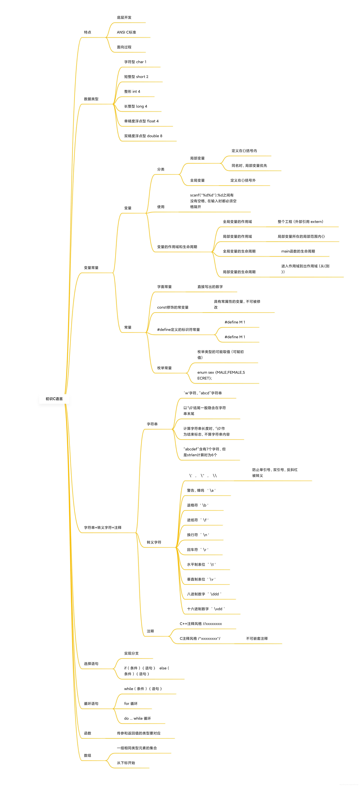
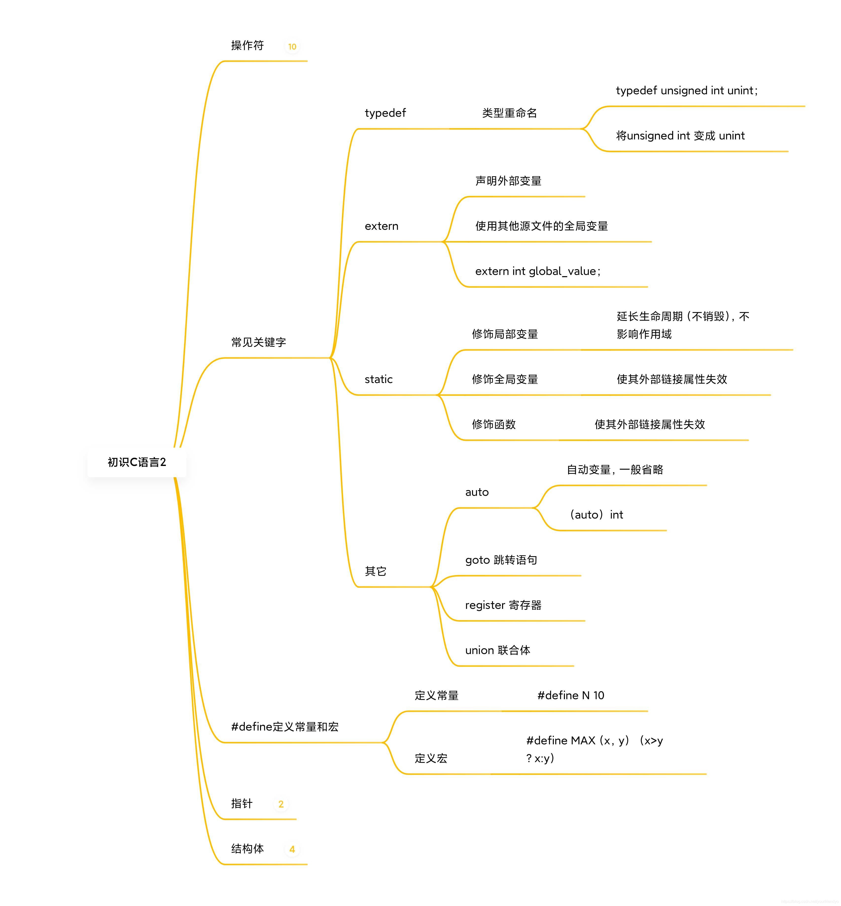
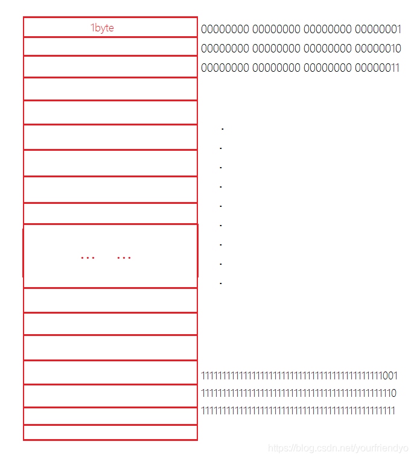

## 初识C语言

初识C语言，简单介绍了C语言的各项内容，做到认识心中有数即可，不作过多研究。

###     1 C语言概述

> C语言是一门面向过程语言，一般应用于底层开发。提供低级处理的功能，保持着良好跨平台的特性，美国国家标准局为C语言制定了一套完整的标准语法 ANSI C，作为C语言最初的标准。

#### 头文件

~~~c
#include <stdio.h>
//stdio-标准输入输出  standard input & output headfile
~~~

引用编译器自带的标准输入输出文件，一般将其放在程序的开头，以便之后使用其中的内容。

#### 主函数

主函数即`main`函数，主函数具有唯一性有且仅有一个。它是程序的入口，一切程序都是从此处开始执行的，没有它程序就不完整。

```c
int main()
{
	//库函数-打印函数-输出函数
	printf("hello world!\n");
	printf("hello world!\n");
	printf("hello world!\n");

    return 0;
}

//这种写法明确告诉你，main函数不需要传参
int main(void)
{}

//这种写法有用，但不是重点
int mian(int argc, char* argv[])
{}
```

&nbsp;

### 数据类型

程序语言中变量需要类型来描述，也就是用类型定义变量。C语言主要有六种数据类型，如下述表格所示：

| 类型关键字 | 类型名       | 类型解释               | 类型长度 |
| ---------- | ------------ | ---------------------- | -------- |
| char       | 字符型       | 定义字符变量           | 1字节    |
| short      | 短整型       | 定义比较小的整型变量   | 2字节    |
| int        | 整形         | 定义整型变量           | 4字节    |
| long       | 长整型       | 定义比较大的整型变量   | 4字节    |
| float      | 单精度浮点型 | 定义精度较低浮点型变量 | 4字节    |
| double     | 双精度浮点型 | 定义精度较高浮点型变量 | 8字节    |

- `char`,`short`,`int`,`long`都属于整型家族，`float`,`double`都属于浮点型家族。这六种数据类型都是内置的、编译器自带的，所以可以直接使用。

- 这六种分别有自己的类型长度，即用该类型创建的变量所占的内存空间。`long`的大小可能是4也可能是8，标准规定须满足$sizeof(int)≤sizeof(long)$ 。

> 关键字`sizeof`用于计算一个类型所占空间的大小。

```c
int main()
{
	printf("%d\n", sizeof(char));//1个字节
	printf("%d\n", sizeof(short));//2个字节
	printf("%d\n", sizeof(int));//4个字节
	printf("%d\n", sizeof(long));//4个字节
	printf("%d\n", sizeof(long long));//8个字节
	printf("%d\n", sizeof(float));//4个字节
	printf("%d\n", sizeof(double));//8个字节
	return 0;
}
```

### 2 变量

变量分为全局变量和局部变量。一般定义在`{}`内的变量是局部变量，定义在`{}`外的就是全局变量。

~~~c
//1.
int a = 0;
int main()
{
    //2.
    int b = 0;
    {
        //3.
        int c = 0;
    }
}
~~~

- 全局变量顾名思义就是定义在全局，可以在全局使用的变量，一般都是指定义在main函数外的变量，如`a`。

- 局部是一个相对的概念，如上述的`b`变量就是定义在main函数内的局部变量，`c`是定义在其所在的这个`{}`内的局部变量。

> 如果全局变量和局部变量重名，则局部变量优先。

使用`scanf`读取多个变量时，可以写成如下几种形式：

~~~c
//1.
scanf("%d%d%d", &a, &b, &c);
//2.
scanf("%d %d %d", &a, &b, &c);
//3.
scanf("%d,%d,%d", &a, &b, &c);
~~~

第一种形式虽然%d之间没有空格，但输入变量时仍需以空格相隔，使用上和第二种无异。

第三种形式%d以`,`相隔，故输入时同样要以`,`相隔。

#### 作用域

定义的变量有作用域的概念一说，顾名思义，作用域就是变量能够作用的范围。变量只能在变量的作用域内使用，作用域以外变量失效。

一般来说，全局变量的作用域就是全局，也就是整个工程，局部变量的作用域就是它所在的`{}`。

#### 生命周期

变量入作用域生命周期开始，出作用域生命周期结束。但生命周期和作用域不同，生命周期是时间上的概念，程序运行到该范围就开始出该范围结束。

- 全局变量的生命周期就是整个工程的生命周期，也就是`main`函数的生命周期。从程序运行到程序结束。
- 局部变量的生命周期就是入该变量的作用域到出作用域。

> 生命周期的概念使用不多，明白即可。

### 3 常量

#### 字面常量

如字母`a`,数字`1`等，可直接写出的常量。

#### const修饰的常变量

`const`修饰变量，将变量修饰成常量。但需要警惕的是，`const`修饰只是将变量变成具有常属性的变量，仅是不可修改而已，归根结底它还是变量。

~~~c
const int a = 0;
a = 1;//Err const修饰的变量不可修改
~~~

#### #define定义的标识符常量

使用`#define`定义一个标识符常量，这种常量就相当于标识符。

程序对这种常量的处理是在程序编译的时候就将代码中所有的标识符常量进行了原模原样的替换。所以在程序运行时早已完成替换已经不存在这个常量了。

~~~c
#define MAX 100
~~~

#### 枚举常量

以枚举的形式定义出一串具有一定意义的常量。

~~~c
enum color { RED, BULE, YELLOW, BLACK };
~~~

每个成员都是一个常量，`RED`只是一个字面的标识符名，所代表的是从0开始的连续数字常量。如RED=0,BULE=1,……,BLACK=3。当然也可自行初始化赋值，之后的变量就从该初始值开始向后延续。

&nbsp;

### 4 字符串

字符：被单引号引起来的，如`'w'`,`'r'`，

字符串：被双引号引起来的，`"yyx"`,`"abcdef"`。

> 字符串一般以`'\0'`结尾隐含在字符串的末尾。既然`'\0'`为字符串结束标志，在计算字符串长度时当然**不算作字符串内容**。

定义字符串有如下两种方式：

```c
int main()
{
    //1.
	char ch1[] = "abcdef";//初始化字符数组
	//a, b, c, d, e, f, \0
	printf("%s\n", ch1);//abcdef
	printf("%d\n", strlen(ch1));//6

    //2.
	char ch2[] = { 'a','b','c','d','e','f' };
	//a ,b ,c ,e ,f
	printf("%s\n", ch2);//abcdef烫烫烫烫烫abcdef
	printf("%d\n", strlen(ch2));//随机值

	char ch3[] = { 'a','b','c','d','e','f','\0' };
	//a ,b ,c ,d ,e ,f ,\0
	printf("%s\n", ch3);//abcdef
	printf("%d\n", strlen(ch3));//6

	return 0;
}
```

> `%s`是字符串形式的格式控制符，`printf("%s",a);`也即是以字符串的形式打印。
>
> `strlen`是字符串库函数，传入字符串名`strlen(a)`可以计算该字符串长度并返回。具体是从开头到`\0`的位置，`\0`不算作字符串元素。

### 5 转义字符

| 转义字符 | 内容用法                                     |
| -------- | -------------------------------------------- |
| `\`      | 加在各自转义字符前防止其被转移，当成普通字符 |
| `\n`     | 换行符、回车符                               |
| `\ddd`   | 八进制数字                                   |
| `\xdd`   | 十六进制数字                                 |
| `\t`     | 水平制表符（后移四个空格长度）               |
| `\v`     | 垂直制表位                                   |
| `\a`     | 警告，蜂鸣                                   |
| `\b`     | 退格符                                       |
| `\f`     | 进纸符                                       |

> 前四个要重点掌握，后面的只要了解就行。

```c
// 转义字符 \
	printf("c:\\code\test.c\n");
	//单个\是转义序列符，想要出现该\，则必须要搭配两个\\，防止其被转义
	//\' \"
	printf("%c\n", 'a');
	printf("%c\n", 'b');
	printf("%c\n",'\'');//在'前面加上\，以单纯的将其视为字符'
	printf("%s\n", "\"");//在"前面加上\，以单纯的将其视为字符"

//\ddd八进制数字  \xdd十六进制数字
int main()
{
	printf("%c\n", '\065');
	//打印八进制数065转化为十进制数53所代表的字符（ASCII码）
	printf("%d\n", '\065');
	//以十进制的形式打印八进制数065

	printf("%c\n", '\x15');
	printf("%d\n", '\x15');
    //以十进制的形式打印十六进制数15

	return 0;
}
```

### 6 注释

| 注释方式    | 优缺点                            |
| ----------- | --------------------------------- |
| `//xxxxx`   | 缺点是只能注释一行。              |
| `/*xxxxx*/` | C语言的风格，缺点是不可嵌套注释。 |

~~~c
//这是一条注释

/*
这是多条注释
这是多条注释
*/
~~~

&nbsp;

### 7 选择循环语句

1. 选择语句，实现分支结构，有`if`语句和`switch`语句。
2. 循环语句，有`while`循环，`do..while`循环和`for`循环，实现循环结构。

```c
int main()
{
	int i = 0;
	printf("加入比特\n");
	scanf("%d", &i);
	if (i == 1)
	{
		printf("好offer\n");
	}
	else
	{
		printf("药丸\n");
	}
	return 0;
}
int main()
{
	int line = 0;
	printf("加入比特\n");

	while (line<20000)
	{
		printf("敲%d了代码\n",line);
		line++;
	}

	return 0;
}
```

`if..else..`两部分算一个语句。使用分支结构一定要注意各个条件的逻辑关系，怎样划分整个集合。

### 8 函数

使用函数要注意，传参的类型和个数以及返回值的类型要对应起来。

```c
int ADD(int num1, int num2)
{
	scanf("%d %d", &num1, &num2);
	int sum = num1 + num2;
	return sum;
}
int main()
{
	int num1 = 0;
	int num2 = 0;
	int output = ADD(num1,num2);
	printf("%d\n", output);

	return 0;
}
```

### 9 数组

数组定义是一组相同类型的元素组成的集合。根据元素的下标来访问和使用数组，下标都是从0开始向后延续。

```c
int main()
{
	//数组 - 相同元素的集合
	int arr[10] = { 1, 2, 3, 4, 5, 6, 7, 8, 9, 10 };
	int i = 0;
	for (i = 0; i < 10; i++)
	{
		printf("%3d", arr[i]);
	}
	printf("\n");
	for (i = 9; i >= 1; i--)
	{
		printf("%3d", arr[i]);
	}
	return 0;
}
```

> 计算机中一般都是从0开始计数，要习惯这种逻辑。



### 10 操作符

#### 算术操作符

> `+ - * /`，前三个和数学中没有什么不同，只有除号稍有不同。

1. 除号两端全为整数则进行整数除法

2. 除号任意一端有浮点数则进行浮点数除法

若想得浮点数，**两端操作数至少有一个为浮点数，**否则就算将结果保存到浮点型变量也没用。

~~~c
int main()
{
    //1. 整数除法
	float a = 5 / 2;
	printf("%f\n", a);//2.0000

    //2. 浮点数除法
	float b = 5.0 / 2;
	printf("%f\n", b);//2.5000

	float c = 5 / 2.0;
	printf("%f\n", c);//2.5000

	float d = 5.0 / 2.0;
	printf("%f\n", d);//2.5000
	return 0;
}
~~~

#### 移位操作符

移位操作符分为左移和右移，右移较复杂先不讲，先讲左移。

左移：将二进制序列按二进制位整体向左移动一位。即把32个比特位的二进制序列写出来，<u>整体向左移动一位，左侧移出去就舍弃，右侧补零</u>。

根据结果可以看出来左移一位即乘2，那么右移一位就是除2。移位操作符只是用于整数。

~~~c
int main()
{

	//00000000 00000000 00000000 00001100 - 12
	//00000000 00000000 00000000 00011000 - 24
	int a = 12;
	int b = a << 1;
	printf("%d\n", b);

	//00000000 00000000 00000000 00000110 - 6
	//00000000 00000000 00000000 00001100 - 12
	int c = 6;
	int d = c << 1;
	printf("%d\n", d);

	//00000000 00000000 00000000 00000010 - 2
	//00000000 00000000 00000000 00000100 - 4
	int e = 2;
	int f = e << 1;
	printf("%d\n", f);

	return 0;
}
~~~

#### 位操作符

位操作符有按位与`&`，按位异或`^`和按位或`|`，按位与和按位或是互为反义的。

| 位操作符    | 具体含义           |
| ----------- | ------------------ |
| 按位与`&`   | 有0则0，全1则1。   |
| 按位异或`^` | 相同为0，相异为1。 |
| 按位或`|`   | 有1则1，全0才0。   |

具体操作方法是将两个操作数的二进制位序列写出来，把相应位拿出来按上述定义进行运算。

~~~c
int main()
{
	int a = 3;
	int b = 5;
	//00000000000000000000000000000011 - a
	//00000000000000000000000000000101 - b
	//00000000000000000000000000000001 - a & b
	int c = a & b;
	printf("%d\n", c);//1

	//00000000000000000000000000000011 - a
	//00000000000000000000000000000101 - b
	//00000000000000000000000000000110 - a ^ b
	int d = a ^ b;
	printf("%d\n", d);//6

	//00000000000000000000000000000011 - a
	//00000000000000000000000000000101 - b
    //00000000000000000000000000000111 - a | b
	int e = a | b;
	printf("%d\n", e);//7

	return 0;
}
~~~

#### 赋值操作符

使用场景有`a=a+1`，` b=10`等，和数学上的`=`是同等含义。

要深究的话，赋值操作符两端的操作数既然可以用赋值操作符连接起来，就代表二者是等价的，或者说类型一致。

#### 单目操作符

##### 逻辑反操作`!`

首当其冲是逻辑反操作`!`，这就涉及到了逻辑真假的问题。C语言中规定**非0就是真，只有0是假**。所以`!`上一个任意不为零的数都是0，`!0`呢，规定`!0`就为1。

##### `sizeof`操作符

`sizeof`用来求一个变量或类型（所创建的变量）所占的空间大小，单位是字节。sizeof是个**操作符**，这也是很多人会忽略的一点。

##### 按位取反`~`

按位取反`~`，同样操作的是二进制位。经过上面移位和位操作符的讲解，应该不难得出按位取反的含义，就是把二进制位序列列出来，按照逻辑取反，也就是1变0，0变1。

对于有符号的整数，二进制位最高位如果是0则为正数，如果是1则为负数。

其实计算机在内存中存储整数的时侯，存储的是二进制。一个整数的二进制的表示形式有三种分别是原码，反码，补码。

- 正数的原码反码补码相同。
- 负数的原反补按如下逻辑计算：

  - 反码：原码符号位不变，其他位按位取反。
  - 补码：反码+1。

但是最重要也是最易混淆的一点是：**计算机存储整数时，内存里存的是补码**，而不是大多数人想象的原码，这就需要我们反过来计算原反补了。

> 可以以0为例，0的二进制位全为0，所以可以看成是个正数，所以其原反补相同。
>
> 如果我们想知道~0（对0按位取反）是个什么结果的话，
>
> 1. 先对0的补码按位取反的~0的补码，
>
> 2. 再反过来计算，补码-1得反码，
>
> 3. 然后再符号位不变，其他按位取反得其原码，
>
> 4. 这样就得到了~0的原码，就可计算其十进制数了

由此可得的重要结论，**对一个数按位取反，反的是二进制位的补码**！

~~~c
int main()
{
	int a = 1;
	//00000000000000000000000000000001 - 原码
	//00000000000000000000000000000001 - 反码
	//00000000000000000000000000000001 - 补码

	int b = -1;
	//10000000000000000000000000000001 - 原码
	//11111111111111111111111111111110 - 反码 - 符号位不变，其他位按位取反
	//11111111111111111111111111111111 - 补码 - 反码+1

    int c = 0;
	printf("%d\n", ~c);//-1

	//00000000000000000000000000000000 - 0的原码->反码->补码
	//11111111111111111111111111111111 - ~0的补码
	//11111111111111111111111111111110 - ~0的反码
	//10000000000000000000000000000001 - ~0的原码

	return 0;
}
~~~

##### 操作符`++`,`--`

> 操作符`++`，`--`，值得一提。有些题目会将`++--`放在一起，若在不同的编译器得到的结果不同的话那就是道错题。在真正编程时，使用++-- 就是为了利用它的特点方便少写点代码而已。
>

++和--分为前置和后置两种情况，也就是先++再使用，还是先使用再++的区别。

~~~c
int main()
{
	int a = 2;
    int c = ++a;//前置++ 先++，后使用
	printf("++a=%d\n", c);//3
	printf("  a=%d\n", a);//3

	a = 2;
	int d = a++;//后置++ 先使用，后++
	printf("a++=%d\n", d);//2
	printf("  a=%d\n", a);//3

	a = 2;
	int e = --a;//前置-- 先--，后使用
	printf("--a=%d\n", e);//1
	printf("  a=%d\n", a);//1

	a = 2;
	int f = a--;//后置-- 先使用，后--
	printf("a--=%d\n", f);//2
	printf("  a=%d\n", a);//1

	return 0;
}
~~~

当然`++--`是自增自减，也就是说结果会保留到原变量中。

> 取地址操作符和解引用操作符是一对，放在指针部分再讲。关系操作符没什么好讲的，和数学上一个含义。
>

##### 逻辑操作符

> 逻辑操作符和数学里的逻辑真假一样。

逻辑与`&&`和逻辑或`||`，分别是并且和或者的关系。他们两边的操作数分别是两个条件值。

逻辑与`&&`：两个都为真，逻辑与表达式就为真。

逻辑或`||`：两个有一个真的，逻辑或表达式就为真。

```c
int main()
{
	int a = 1;
	int b = 4;
	if ((a = 1) && (b = 4))
	{
		printf("&&\n");
	}
	if ((a = 3) || (b = 4))
	{
		printf("||\n");
	}
	return 0;
}
```
##### 条件操作符

条件操作符`?:`。具体用法如`x>y?1:2`，`?`的前面是条件，条件成立则整个表达式的值为1，反之则是2。

##### 逗号表达式

逗号表达式`( , , ,)`

其中每一个表达式都是一个算式，从左向右依次计算，最后一个表达式的结果作为整个逗号表达式的值。

~~~c
int main()
{
    int a = 10;
    int b = 0;
    b = (a = 5) ? (6) : (-6);
    printf("%d\n", b);

    int a = 0;
    int b = 3;
    int c = -1;
    int d = (a = b - 5, b = a + c, c = a + b, c -= 5);
    printf("%d\n", d);
}
~~~


### 11 常见关键字

这些是C语言里常见的各种关键词，下面将对其部分稍作讨论。


#### `typedef`

首先是`typedef`，翻译来就是类型重命名。顾名思义，就是将定义变量的类型的名字如`int`，`char`等，重新取个名字代替。当然一般用于非常长的类型名如`unsigned int`这样，或者是结构体类型。

~~~c
//typedef 变量类型重命名
typedef unsigned int unint;
~~~

 如此之后就可以把`unsigned int` 直接写成 `unint`了。

#### `extern`

然后是`extern`，翻译过来就是外部的意思，故用于声明引用外部文件（其他`.c`文件）的变量或者是函数等，但由于函数自带外部链接属性，所以可以不用于声明外部函数。用法如`extern int g_val;`（`g_val`是外部的变量）

#### `static`

`static`分别有修饰局部变量，修饰全局变量和修饰函数三种不同的用法，不过修饰全局变量和函数的意义差不多。

##### 修饰局部变量

修饰局部变量时，使其出作用域不会被销毁。虽不被销毁但是仍不可在作用域之外使用该变量，准确的来说就是**延长了他的生命周期，但不影响作用域**。

##### 修饰全局变量和函数

修饰全局变量和函数时，会**使其外部链接属性失效**，也是就使其不可以在其他源文件中被使用。

~~~c
void test()
{
	static int a = 1;
	a++;
	printf("%d ", a);
}
int main()
{
	int i = 0;
	while (i < 10)
	{
		test();
		i++;
	}
    return 0;
}
~~~

~~~c
static int g_val = 2021;

static int Add(int x, int y)
{
	return x + y;
}
~~~

> 其它如`auto`，`goto`，`register`，`union`，稍微了解一下即可。



&nbsp;

### 12 #define定义常量和宏

#### 定义常量

定义常量时，也是非常简单，例如：`#define N 10;` 就定义了一个不可被修改的常量其值为10。

#### 定义宏

`#define MAX(x,y) (x>y?x:y)`

类似于函数，但又有别于函数，`MAX(x,y)`是宏，`(x>y?x:y) `是宏体。`MAX(x,y)`，像是函数名和传参放在一块，`()`就像是函数内容。

~~~c
//定义常量
#define NUM 100
//定义宏
#define MAX(X,Y) (X>Y?X:Y)

int main()
{
	printf("%d\n", NUM);
	int a = 0;
	int b = 10;
	int c = MAX(a, b);
	//实际操作，替换宏体
	//int c = (a > b ? a : b);

	printf("%d\n", c);
	return 0;
}
~~~


### 13 指针

指针一直是初学者最害怕的内容，但本次能够让你消除对指针的恐惧，带你一步步的了解指针。指针就是指向变量的内存地址，故讲指针之前必须把内存搞清楚。

#### 内存单元

为了可以有效使用内存，我们把内存划分了一个个小的内存单元，**每个内存单元的大小为1byte**。

我们需对内存进行编号，当然需要二进制位序列表示（默认32位环境）。每个二进制序列有32个bit，从数学全排列角度看，一共有2的32次方种排列可能（32个全0到32个全1）。所以若想对其进行编号，不如一人一个码（一个内存单元用一个二进制序列表示）。并且我们把这些编号成为地址。

当然为显示和阅读方便，计算机中一般以十六进制的形式显示。



我们了解了内存，现在我们看看如何取出内存的地址。

~~~c
int main()
{
    int num = 1;//先创建一个变量
    &num;//然后取出它的地址
    printf("%p",&num);//最后以%p的形式打印地址

	return 0;
}
~~~

这样我们就得到了`num`的地址，以十六进制数字展示。

#### 指针变量

我们讲清楚了内存，现在再来看看指针。我们既然已经得到了地址，那我们如何去储存这些东西呢，这是程序员们就想到了一种东西叫指针变量，它用于**存放地址**。

关于该指针变量如何定义看下列代码。

~~~c
int main()
{
    int num = 10;
    int *p = &num;
    *p = 20;
	return 0;
}
~~~

####  取地址操作符`&`，解引用操作符`*`

这里我们介绍一下，两个操作符分别是&取地址操作符和*解引用操作符。

1. <u>`&`+变量名 可以取出变量的地址相当于指针</u>。
2. <u>`*`+指针变量名 即解引用指针也就是原变量</u>，通过这样就可以进行改变原变量的这样一系列的操作。

可以说` pa = &a , *pa = a`。

#### 指针类型所占空间

那么我们既然知道了有种变量叫指针变量，那么他们的类型大小是多少呢？

**每种指针变量类型大小都为4个字节**（32位机器），因为指针变量存放地址，地址为二进制序列，32个bit，正好占4个byte。当然64位机器就是8个字节。

&nbsp;

### 14 结构体

> 结构体的出现使得C语言具有了描述复杂对象的能力。

C语言的内置类型`int`，`char`，`float`等可以描述很多东西，但是这毕竟太单一，使用结构体可以描述更复杂的对象。比如最经典的例子，如学生，书籍等。

#### 定义结构体

描述学生的信息有名字，性别，年龄，学号等：

~~~c
struct stu
{
	char name[20];//姓名
	int age;//年龄
	char sex[5];//性别
	char id[20];//学号
};
~~~

或者是针对书籍的描述，有书名，价格，作者名等：

~~~c
struct book
{
	char name[20];
	int price;
	char author[20];
};
~~~

注意，`struct stu`是学生结构体的类型名，这一整个相当于 `int float double` 都是类型名。

下面我们定义结构体变量并初始化。

~~~c
struct stu s1 = {"芜湖大司马",40,"男","2020313222"};
struct stu s2 = {"lisa",22,"女","2020313232"};
struct book b1 = {"C语言详解",55,"谭浩强
~~~

####  使用结构体变量

创建好了我们如何去使用呢？最简单的输出方式，使用操作符 .

形式上是 **结构体变量`.`成员名**。

~~~c
//输出1
printf("name: %s,age: %d,sex: %s,id: %s\n", s1.name, s1.age, s1.sex, s1.id);
printf("书名: %s,价格: %d,作者: %s\n", b1.name, b1.price, b1.author);
~~~

既然这样可以的话，我们还可以定义指针变量代替变量名，用**`(*pb)`代替`b1`**。

~~~c
struct book * pb = &b1;
//先定义一下指针变量

printf("%s %d %s\n", (*pb).name, (*pb).price, (*pb).author);
//指针变量解引用，就可以当作原变量使用
~~~

当然有更方便的操作符 `->`，这样我们可以直接使用指针啦，如**结构体指针`->`成员名**。

~~~c
struct book * pb = &b1;
//别忘了定义指针

printf("%s %d %s\n", pb->name, pb->price, pb->author);
//指针变量名直接加 —> 再加成员名
~~~

 直到这里我们初识C语言的内容就完毕了。