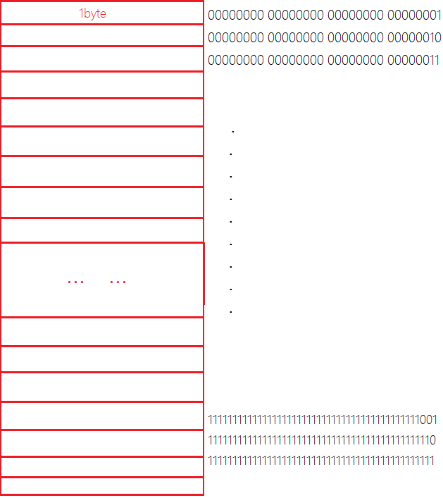

## 初识C语言

> 初识C语言，简单介绍了C语言的各项内容，做到认识心中有数即可，不作过多研究。

###     1 C语言概述

#### 头文件

```c
#include <stdio.h> //stdio-标准输入输出  standard input & output headfile
```

引用编译器自带的标准输入输出文件，一般放在程序的开头，以便使用其内容。

#### 主函数

主函数即`main`函数，主函数有且仅有一个。它是程序的入口，一切程序都是从此处开始执行的，没有它程序就不完整。

```c
int main()
{
	//库函数-打印函数-输出函数
	printf("hello world!\n");
	printf("hello world!\n");
	printf("hello world!\n");

    return 0;
}

int main(void) //这种写法明确告诉你，main函数不需要传参
int mian(int argc, char* argv[]) //这种写法有用，但不是重点
```

### 数据类型

程序语言中变量需要类型来描述，也就是用类型定义变量。C语言主要有六种数据类型，如下述表格所示：

| 类型关键字 | 类型名       | 类型解释               | 类型长度 |
| ---------- | ------------ | ---------------------- | -------- |
| char       | 字符型       | 定义字符变量           | 1字节    |
| short      | 短整型       | 定义比较小的整型变量   | 2字节    |
| int        | 整形         | 定义整型变量           | 4字节    |
| long       | 长整型       | 定义比较大的整型变量   | 4字节    |
| float      | 单精度浮点型 | 定义精度较低浮点型变量 | 4字节    |
| double     | 双精度浮点型 | 定义精度较高浮点型变量 | 8字节    |

- `char`,`short`,`int`,`long`属于整型家族，`float`,`double`属于浮点型家族。这六种类型都是内置的，可以直接使用。
- 每种类型分别有自己的类型长度，即用该类型创建的变量所占的内存空间。

> `long`的大小可能是4也可能是8，标准规定须满足$sizeof(int)≤sizeof(long)$ 。

- 关键字`sizeof`用于计算一个类型所占空间的大小。

```c
int main()
{
	printf("%d\n", sizeof(char));//1个字节
	printf("%d\n", sizeof(short));//2个字节
	printf("%d\n", sizeof(int));//4个字节
	printf("%d\n", sizeof(long));//4个字节
	printf("%d\n", sizeof(long long));//8个字节
	printf("%d\n", sizeof(float));//4个字节
	printf("%d\n", sizeof(double));//8个字节
	return 0;
}
```

### 2 变量

变量分为全局变量和局部变量。

```c
//1.
int a = 0;
int main()
{
    //2.
    int b = 0;
    {
        //3.
        int c = 0;
    }
}
```

- 一般定义在`{}`内的变量是局部变量。
- 全局变量就是定义在全局、可以全局使用的变量，如`a`。
- 局部是一个相对的概念，如`b`变量就是定义在main函数内的局部变量，`c`是定义在其所在的`{}`内的局部变量。

> 如果全局变量和局部变量重名，则局部变量优先。

使用`scanf`读取多个变量时，可以写成如下几种形式：

```c
//1.
scanf("%d%d%d", &a, &b, &c);
//2.
scanf("%d %d %d", &a, &b, &c);
//3.
scanf("%d,%d,%d", &a, &b, &c);
```

第一种形式虽然%d之间没有空格，但输入变量时仍需以空格相隔，使用上和第二种无异。第三种形式%d以`,`相隔，故输入时同样要以`,`相隔。

#### 作用域

变量有作用域的概念，作用域就是变量能够作用的范围。变量只能在变量的作用域内使用，作用域以外变量失效。

一般来说，全局变量的作用域就是全局，也就是整个工程，局部变量的作用域就是它所在的`{}`。

#### 生命周期

变量入作用域生命周期开始，出作用域生命周期结束。但生命周期和作用域不同，生命周期是时间上的概念，程序运行到该范围就开始出该范围结束。

- 全局变量的生命周期就是整个工程的生命周期，也就是`main`函数的生命周期。从程序运行到程序结束。
- 局部变量的生命周期就是入该变量的作用域到出作用域。

### 3 常量

#### 字面常量

如字母`a`,数字`1`等，可直接写出的常量。

#### const修饰的常变量

`const`修饰变量，将变量修饰成常量。但需要警惕的是，`const`修饰只是将变量变成具有常属性的变量，仅是不可修改而已，归根结底它还是变量。

```c
const int a = 0;
a = 1;//Err const修饰的变量不可修改
```

#### #define定义的标识符常量

使用`#define`定义一个标识符常量，这种常量就相当于标识符。

程序编译时会将所有标识符常量直接进行文本替换。所以在程序运行时早已已经不存在这个常量了。

```c
#define MAX 100
```

#### 枚举常量

以枚举的形式定义出一串具有一定意义的常量。

```c
enum color { RED, BULE, YELLOW, BLACK };
```

每个成员都是一个常量，`RED`只是一个字面的标识符名，所代表的是从0开始的连续数字常量，如RED=0,BULE=1,……,BLACK=3。当然也可自行初始化赋值，之后的变量就从该初始值开始向后延续。

### 4 字符串

字符：被单引号引起来的，如`'w'`,`'r'`，

字符串：被双引号引起来的，`"yyx"`,`"abcdef"`。

字符串以`'\0'`结尾隐含在字符串的末尾。`'\0'`为字符串结束标志，在计算字符串长度时**不算作字符串内容**。

定义字符串有如下两种方式：

```c
int main()
{
    //1.
	char ch1[] = "abcdef";//初始化字符数组
	//a, b, c, d, e, f, \0
	printf("%s\n", ch1);//abcdef
	printf("%d\n", strlen(ch1));//6

    //2.
	char ch2[] = { 'a','b','c','d','e','f' };
	//a ,b ,c ,e ,f
	printf("%s\n", ch2);//abcdef烫烫烫烫烫abcdef
	printf("%d\n", strlen(ch2));//随机值

	char ch3[] = { 'a','b','c','d','e','f','\0' };
	//a ,b ,c ,d ,e ,f ,\0
	printf("%s\n", ch3);//abcdef
	printf("%d\n", strlen(ch3));//6

	return 0;
}
```

> `%s`是字符串形式的格式控制符，`printf("%s",a);`也即是以字符串的形式打印。
>
> `strlen`是字符串库函数，传入字符串名`strlen(a)`可以计算该字符串长度并返回。具体是从开头到`\0`的位置，`\0`不算作字符串元素。

### 5 转义字符

| 转义字符 | 内容用法                                     |
| -------- | -------------------------------------------- |
| `\`      | 加在各自转义字符前防止其被转移，当成普通字符 |
| `\n`     | 换行符、回车符                               |
| `\ddd`   | 八进制数字                                   |
| `\xdd`   | 十六进制数字                                 |
| `\t`     | 水平制表符（后移四个空格长度）               |
| `\v`     | 垂直制表位                                   |
| `\a`     | 警告，蜂鸣                                   |
| `\b`     | 退格符                                       |
| `\f`     | 进纸符                                       |

```c
// 转义字符 \
	printf("c:\\code\test.c\n");
	//单个\是转义序列符，想要出现该\，则必须要搭配两个\\，防止其被转义
	//\' \"
	printf("%c\n", 'a');
	printf("%c\n", 'b');
	printf("%c\n",'\'');//在'前面加上\，以单纯的将其视为字符'
	printf("%s\n", "\"");//在"前面加上\，以单纯的将其视为字符"

//\ddd八进制数字  \xdd十六进制数字
int main()
{
	printf("%c\n", '\065');
	//打印八进制数065转化为十进制数53所代表的字符（ASCII码）
	printf("%d\n", '\065');
	//以十进制的形式打印八进制数065

	printf("%c\n", '\x15');
	printf("%d\n", '\x15');
    //以十进制的形式打印十六进制数15

	return 0;
}
```

### 6 注释

| 注释方式    | 优缺点                            |
| ----------- | --------------------------------- |
| `//xxxxx`   | 缺点是只能注释一行。              |
| `/*xxxxx*/` | C语言的风格，缺点是不可嵌套注释。 |

```c
//这是一条注释

/*
这是多条注释
这是多条注释
*/
```

### 7 选择循环语句

1. 选择语句，有`if`和`switch`。
2. 循环语句，有`while`、`do..while`和`for`。

```c
if (i == 1)
    printf("好offer\n");
else
    printf("药丸\n");

while (line<20000) {
    printf("敲%d了代码\n",line);
    line++;
}
```

`if..else..`两部分算一个语句。使用分支结构一定要注意各个条件的逻辑关系，怎样划分整个集合。

### 8 函数

使用函数要注意，传参的类型和个数以及返回值的类型要对应起来。

```c
int ADD(int num1, int num2) {
	return sum = num1 + num2;
}

int output = ADD(num1,num2);
```

### 9 数组

数组是一组相同类型的元素组成的集合。根据下标来访问，下标从0开始向后延续。

```c
//数组 - 相同元素的集合
int arr[10] = { 1, 2, 3, 4, 5, 6, 7, 8, 9, 10 };
int i = 0;
for (i = 0; i < 10; i++)
    printf("%3d", arr[i]);
```

> 计算机中一般都是从0开始计数，要习惯这种逻辑。

### 10 操作符

#### 算术操作符

> `+ - * /`，前三个和数学中没有什么不同，只有除号稍有不同。

除号两端全为整数则进行整数除法，任意一端有浮点数则进行浮点数除法。

若想得浮点数，**两端操作数至少有一个为浮点数**，否则就算将结果保存到浮点型变量也没用。

```c
int main()
{
    //1. 整数除法
	float a = 5 / 2;
	printf("%f\n", a);//2.0000

    //2. 浮点数除法
	float b = 5.0 / 2;
	printf("%f\n", b);//2.5000

	float c = 5 / 2.0;
	printf("%f\n", c);//2.5000

	float d = 5.0 / 2.0;
	printf("%f\n", d);//2.5000
	return 0;
}
```

#### 移位操作符

移位操作符分为左移和右移，右移较复杂先不讲，先讲左移。

左移：将二进制序列按二进制位整体向左移动一位。即把32个比特位的二进制序列写出来，<u>整体向左移动一位，左侧移出去就舍弃，右侧补零</u>。

根据结果可以看出来左移一位即乘2，那么右移一位就是除2。移位操作符只是用于整数。

```c
//00000000 00000000 00000000 00001100 - 12
//00000000 00000000 00000000 00011000 - 24
int a = 12;
int b = a << 1;
printf("%d\n", b);

//00000000 00000000 00000000 00000110 - 6
//00000000 00000000 00000000 00001100 - 12
int c = 6;
int d = c << 1;
printf("%d\n", d);

//00000000 00000000 00000000 00000010 - 2
//00000000 00000000 00000000 00000100 - 4
int e = 2;
int f = e << 1;
printf("%d\n", f);
```

#### 位操作符

位操作符有按位与`&`，按位或`|`和按位异或`^`，按位与和按位或是互为反义的。

| 位操作符    | 具体含义         |
| ----------- | ---------------- |
| 按位与`&`   | 有0则0，全1则1   |
| 按位异或`^` | 相同为0，相异为1 |
| 按位或`\|`  | 有1则1，全0才0   |

> 将两个操作数的二进制位序列写出来，把相应位拿出来按定义运算。

```c
int a = 3;
int b = 5;
//00000000000000000000000000000011 - a
//00000000000000000000000000000101 - b
//00000000000000000000000000000001 - a & b
int c = a & b;
printf("%d\n", c);//1

//00000000000000000000000000000011 - a
//00000000000000000000000000000101 - b
//00000000000000000000000000000110 - a ^ b
int d = a ^ b;
printf("%d\n", d);//6

//00000000000000000000000000000011 - a
//00000000000000000000000000000101 - b
//00000000000000000000000000000111 - a | b
int e = a | b;
printf("%d\n", e);//7
```

#### 赋值操作符

使用场景有`a=a+1`，` b=10`等，和数学上的`=`是同等含义。

赋值操作符两端的操作数既然可以用赋值操作符连接起来，就代表二者是等价的，或者说类型一致。

#### 单目操作符

##### 逻辑反操作`!`

逻辑反操作`!`涉及到逻辑真假的问题。C语言中规定**非0就是真，只有0是假**。所以`!`上一个任意不为零的数都是0，`!0`就为1。

##### `sizeof`操作符

`sizeof`用来求一个变量或类型所占的空间大小，单位是字节。sizeof是个**操作符**，这也是很多人会忽略的一点。

##### 按位取反`~`

按位取反`~`，就是把二进制序列列出来按位取反，1变0，0变1。

对于有符号的整数，二进制位最高位如果是0为正数，是1为负数。

计算机存储整数时存的是二进制。一个整数的二进制的表示形式有三种分别是原码，反码，补码。

- 正数的原码反码补码相同。
- 负数的原反补按如下逻辑计算：
- 反码：原码符号位不变，其他位按位取反。
- 补码：反码+1。

**计算机存储整数时，内存里存的是补码**，而不是大多数人想象的原码。

```c
int a = 1;
//00000000000000000000000000000001 - 原码
//00000000000000000000000000000001 - 反码
//00000000000000000000000000000001 - 补码

int b = -1;
//10000000000000000000000000000001 - 原码
//11111111111111111111111111111110 - 反码 - 符号位不变，其他位按位取反
//11111111111111111111111111111111 - 补码 - 反码+1

int c = 0;
printf("%d\n", ~c);//-1

//00000000000000000000000000000000 - 0的原码->反码->补码
//11111111111111111111111111111111 - ~0的补码
//11111111111111111111111111111110 - ~0的反码
//10000000000000000000000000000001 - ~0的原码
```

##### 操作符`++`,`--`

> 有些题会将`++--`放在一起，不同编译器得到的结果不同的话那就是道错题。在真正编程时，使用++-- 就是为了利用它的特点方便少写点代码而已。

`++--`是自增自减，也就是说结果会保留到原变量中。

++和--分为前置和后置两种情况，就是先++再使用，还是先使用再++。

```c
int a = 2;
int c = ++a;//前置++ 先++，后使用
printf("++a=%d\n", c);//3
printf("  a=%d\n", a);//3

a = 2;
int d = a++;//后置++ 先使用，后++
printf("a++=%d\n", d);//2
printf("  a=%d\n", a);//3

a = 2;
int e = --a;//前置-- 先--，后使用
printf("--a=%d\n", e);//1
printf("  a=%d\n", a);//1

a = 2;
int f = a--;//后置-- 先使用，后--
printf("a--=%d\n", f);//2
printf("  a=%d\n", a);//1
```

> 取地址操作符和解引用操作符是一对，放在指针部分再讲。关系操作符没什么好讲的，和数学上一个含义。

##### 逻辑操作符

> 逻辑操作符和数学里的逻辑真假一样。

逻辑与`&&`和逻辑或`||`，分别是并且和或者的关系。他们两边的操作数分别是两个条件值。

逻辑与`&&`：两个都为真，逻辑与表达式就为真。

逻辑或`||`：两个有一个真的，逻辑或表达式就为真。

```c
int a = 1;
int b = 4;
if ((a = 1) && (b = 4))
{
    printf("&&\n");
}
if ((a = 3) || (b = 4))
{
    printf("||\n");
}
```
##### 三元操作符

条件操作符`?:`。如`x>y?1:2`，`?`的前面是条件，条件成立则整个表达式的值为1，反之则是2。

##### 逗号表达式

逗号表达式`( , , ,)`

其中每一个表达式都是一个算式，从左向右依次计算，最后一个表达式的结果作为整个逗号表达式的值。

```c
int main()
{
    int a = 10;
    int b = 0;
    b = (a = 5) ? (6) : (-6);
    printf("%d\n", b);

    int a = 0;
    int b = 3;
    int c = -1;
    int d = (a = b - 5, b = a + c, c = a + b, c -= 5);
    printf("%d\n", d);
}
```

### 11 常见关键字

#### `typedef`

类型重命名，就是将变量的类型重新取个名字。一般用于非常长的类型名如`unsigned int`这样，或者是结构体类型。

```c
//typedef 变量类型重命名
typedef unsigned int unint;
```

 之后就可以把`unsigned int` 直接写成 `unint`了。

#### `extern`

`extern`，翻译过来就是外部的意思，用于声明引用外部文件（其他`.c`文件）的变量或是函数。但由于函数自带外部链接属性，所以可以不用声明。

用法如`extern int g_val;`（`g_val`是外部的变量）

#### `static`

`static`有修饰局部变量、全局变量和函数三种不同的用法。

##### 修饰局部变量

修饰局部变量时，使其出作用域不会被销毁。虽不被销毁但是仍不可在作用域之外使用该变量，准确的来说就是**延长了他的生命周期，但不影响作用域**。

##### 修饰全局变量和函数

修饰全局变量和函数时，会**使其外部链接属性失效**，也是就使其不可以在其他源文件中被使用。

```c
void test()
{
	static int a = 1;
	a++;
	printf("%d ", a);
}
int main()
{
	int i = 0;
	while (i < 10)
	{
		test();
		i++;
	}
    return 0;
}
```

```c
static int g_val = 2021;

static int Add(int x, int y)
{
	return x + y;
}
```

> 其它如`auto`，`goto`，`register`，`union`，稍微了解一下即可。

### 12 #define定义常量和宏

定义常量时，`#define N 10;` 就定义了一个不可被修改的常量，其值为10。

#### 定义宏

`#define MAX(x,y) (x>y?x:y)`，类似于函数，`MAX(x,y)`是宏，`(x>y?x:y) `是宏体。

```c
//定义常量
#define NUM 100
//定义宏
#define MAX(X,Y) (X>Y?X:Y)

int main()
{
	printf("%d\n", NUM);
	int a = 0;
	int b = 10;
	int c = MAX(a, b);
	//实际操作，替换宏体
	//int c = (a > b ? a : b);

	printf("%d\n", c);
	return 0;
}
```

### 13 指针

指针一直是初学者最害怕的内容，本次能够让你消除对指针的恐惧，带你一步步了解指针。指针就是指向变量的内存地址，故讲指针之前必须把内存搞清楚。

#### 内存单元

为了有效使用内存，我们把内存划分了一个个小的内存单元，**每个内存单元的大小为1byte**。

我们需对内存进行编号，用二进制位表示。每个二进制序列有32个bit，一共有$2^{32}$种排列可能（32个全0到32个全1）。

对其进行编号，就是一个内存单元用一个二进制序列表示，并且将这些编号称为地址。

<center>

</center>

我们了解了内存，现在我们看看如何取出内存的地址。

```c
int main()
{
    int num = 1;//先创建一个变量
    &num;//然后取出它的地址
    printf("%p",&num);//最后以%p的形式打印地址
	return 0;
}
```

这样我们就得到了`num`的地址，以十六进制数字展示。

#### 指针变量

我们讲清楚了内存，再来看指针。我们既然已经得到了地址，那我们如何去储存地址呢，程序员们就想到指针变量，它用于**存放地址**。

关于该指针变量如何定义看下列代码。

```c
int main()
{
    int num = 10;
    int *p = &num;
    *p = 20;
	return 0;
}
```

####  取地址操作符`&`，解引用操作符`*`

这里我们介绍一下，两个操作符分别是&取地址操作符和*解引用操作符。

1. &变量名 可以取出变量的地址相当于指针。
2. *指针变量名 即解引用指针也就是原变量，这样就可以进行改变原变量等操作。

可以说` pa = &a , *pa = a`。

#### 指针类型所占空间

那么我们既然知道了有种变量叫指针变量，那么他们的类型大小是多少呢？

**每种指针变量类型大小都为4个字节**（32位机器），因为指针变量存放地址，地址为二进制序列，32个bit，正好占4个byte。当然64位机器就是8个字节。

### 14 结构体

> 结构体的出现使得C语言具有了描述复杂对象的能力。

C语言的内置类型`int`，`char`，`float`等可以描述很多东西，但是这毕竟太单一，使用结构体可以描述更复杂的对象。比如最经典的例子，如学生，书籍等。

#### 定义结构体

描述学生的信息有名字，性别，年龄，学号等：

```c
struct stu
{
	char name[20];//姓名
	int age;//年龄
	char sex[5];//性别
	char id[20];//学号
};
```

或者是针对书籍的描述，有书名，价格，作者名等：

```c
struct book
{
	char name[20];
	int price;
	char author[20];
};
```

注意，`struct stu`是学生结构体的类型名。下面我们定义结构体变量并初始化。

```c
struct stu s1 = {"芜湖大司马",40,"男","2020313222"};
struct stu s2 = {"lisa",22,"女","2020313232"};
struct book b1 = {"C语言详解",55,"谭浩强
```

####  使用结构体变量

创建好了我们如何去使用呢？最简单的输出方式，使用操作符`.`

形式上是 **结构体变量`.`成员名**。

```c
printf("name: %s,age: %d,sex: %s,id: %s\n", s1.name, s1.age, s1.sex, s1.id);
printf("书名: %s,价格: %d,作者: %s\n", b1.name, b1.price, b1.author);
```

我们还可以定义指针变量代替变量名，__用`(*pb)`代替`b1`__。

```c
struct book * pb = &b1; //先定义一下指针变量
//指针变量解引用，就可以当作原变量使用
printf("%s %d %s\n", (*pb).name, (*pb).price, (*pb).author); 
```

当然有更方便的操作符 `->`，可以直接使用指针，如**结构体指针`->`成员名**。

```c
struct book * pb = &b1;
//指针变量名直接加 —> 再加成员名
printf("%s %d %s\n", pb->name, pb->price, pb->author);
```
