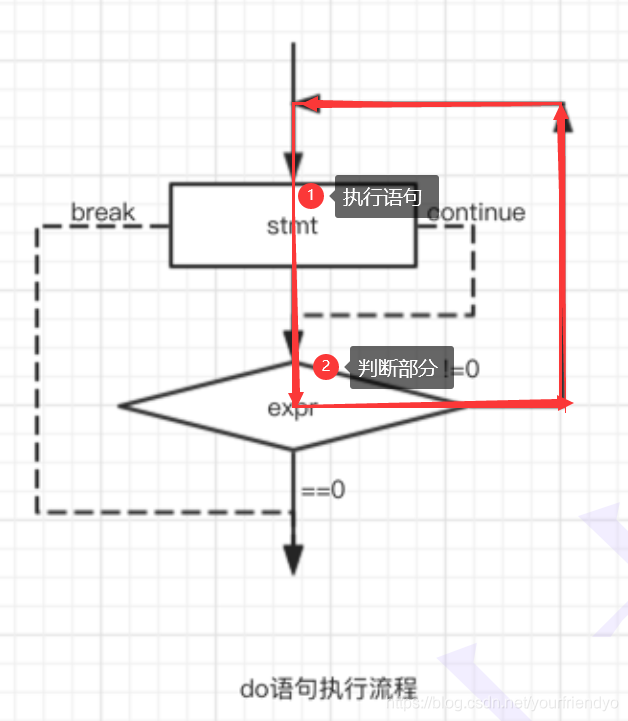

# 分支循环

C语言是一门结构化的编程语言。顺序结构，选择结构，循环结构。生活中的事情大大小小基本上都可以通过这三种结构描述。

- 顺序结构不必多言，选择结构有`if`语句，`switch`语句，
- 循环结构有`while`循环，`for`循环以及`do...while`循环语句，还会介绍到`goto`语句。

<center>

</center>

### 语句的概念

以分号`;`结尾、用分号`;`隔开的就是一条语句。只有一个分号`;`的语句就是空语句。

~~~C
printf("hehe\n");
1+2;
;//空语句
~~~

## 1. 选择结构

### 1.1 if 语句

if 语句 条件表达式为真，就进入语句，反之为假，则不执行。

if 语句 分为单分支和多分支两种逻辑结构。

```C
//1.单分支
if (表达式) {
    语句;
}
else {
    语句;
}

//2. 多分支
if (表达式) {
    语句;
}
else if (表达式) {
    语句;
}
else if (表达式) {
    语句;
}
...
else {
    语句;
}
```

#### 示例

~~~C
int main()
{
    int age = 20;

    //多分支
    if (age < 18)
        printf("青少年\n");
    else if (age >= 18 && age < 30)
        printf("青年\n");
    else if (age >= 30 && age < 50)
        printf("壮年\n");
    else if (age >= 50 && age < 80)
        printf("老年\n");
    else
        printf("快没了\n");

    return 0;
}
~~~

if 语句**使用代码块可以控制多条语句则**。即用一对大括号将所以语句括在一起。这样还有一个明显的好处就是可以提高代码的可读性，如：

~~~C
int main()
{
    int age = 10;
    if (age >= 18)
    {
        printf("成年了\n");
        printf("可以谈恋爱了\n");
    }

    return 0;
}
~~~

#### 常见问题

1. 条件表达式错误：`18 <= age && age < 30` 写成  `18 <= age < 30`。

```C
if (18 <= age < 30) // 18 <= age && age < 30
    printf("青年\n");
```

- C语言中 18 <= age < 30 是一个表达式。
- 从左向右计算，左边的18 <= age 是一个表达式，真则为1，假则为0。无论如何都是小于30的，故整个表达式为真，无论怎样都会执行if语句。

2. 悬空`else`：else 总是与其上最近的一个 if 搭配，不受代码对齐的影响。

```c
if (a == 1)
    if (b == 2)
        printf("hehe\n");
else
    printf("haha\n"); // else与其上最近的一个if匹配
```

应修改为下图，提示了代码的可读性。

~~~C
if (a == 1)
{
    if (b == 2)
        printf("hehe\n");
    else
        printf("haha\n"); // else与其上最近的一个if匹配
}
~~~

3. 判断条件写成赋值表达式

~~~c
if (a = 5) // a == 5 写成 a = 5
    printf("hehe\n");
~~~

a=5是赋值表达式，表达式的值为5，无论如何都执行if语句。

~~~C
if (5 == a)
    printf("hehe\n");
~~~

把`a == 5`改成`5 == a`，这样一来如果再写成赋值表达式，就出现了语法错误，常量是不可赋值的，编译器就会报警。

> 该代码的含义为如果条件成立，则返回x，否则返回y。

~~~c
void test()
{
    if (1)
    {
        printf("hehe\n");
        return 0;
    }
    //函数返回值后，后面的代码不执行
    printf("haha\n");
}

int main()
{
   test();

   return 0;
}
~~~

从上面的代码可以看出，函数返回值后，下面的代码将不再执行。所以函数不可能又返回x又返回y。

### 1.2 switch 语句

之所以会存在 switch 语句，是因为在条件过多的情况下，使用 if...else 会显得过于繁琐。

~~~c
switch (day) // 整型表达式
{
    case 1: // 整型常量表达式
    {
        printf("星期一\n");
        printf("美好的一天，从上班开始5555~");
        break;
    }
    case 2:
        printf("星期二\n");
        break;
    case 3:
        printf("星期三\n");
        break;
    case 4:
        printf("星期四\n");
        break;
    case 5:
        printf("星期五\n");
        break;
    case 6:
        printf("星期六\n");
        break;
    case 7:
        printf("星期日\n");
        break;
}
~~~

- `switch ()`的表达式必须是**整型表达式**。
- `case`语句也必须判断的是**整型常量表达式**。
- `case`语句项内若想控制多条语句，仍需使用代码块。但我们不推荐这样，一般封装成函数才不显得臃肿。

- 每种情况下都要有 break 跳出去，不然代码不具有分支功能。、

> case是代码入口，break是代码出口。

- 当所有的 case 标签都不满足时，便会执行 default 子句。

- 另外，**case语句不存在顺序问题**，即无论顺序怎么排，都无所谓。

~~~c
switch (day)
{
    case 1:
    case 2:
    case 3:
    case 4:
    case 5:
        printf("工作日\n");
        break;
    case 6:
    case 7:
        printf("休息日\n");
        break;
    default:
        printf("输入数据有误，请重新输入\n");
        break;
}
~~~

## 2. 循环结构

### 2.1 while 循环

`while`语句的执行流程如下：

<center>

</center>

1. 条件判断：条件为真，则进入循环，反之则退出循环。
2. 执行内部逻辑：内部逻辑执行完毕后，又会回到条件判断部分。

#### break&continue

- `break`用来**直接终止循环**。

- `continue`用于停止本次循环，继续下次循环。本次循环`continue` 后边的代码不会再执行，直接跳到 while 的判断部分，进行下一次循环。

~~~c
int i = 0;
while (i <= 10)
{
    if (i == 6)
        break;

    printf("%d ", i);
    i++;
}
~~~

当 i=6 时，break 终止循环，所以输出结果为0 1 2 3 4 5 。

~~~c
int i = 0;

while (i <= 10)
{
    if (i == 6)
        continue;

    printf("%d ", i);
    i++;
}
~~~

先是输出了0 1 2 3 4 5 ，但当 i=6 时，`continue`跳出了本次循环，进入下一次循环。但 i 并没有`++`，一直等于=6，故下一次循环仍会发生`continue`，一直死循环。

~~~c
int i = 0;
while (i <= 10)
{
    i++;
    if (i == 6)
        continue;

    printf("%d ", i);//1 2 3 4 5 7 8 9 10 11
}
~~~

#### 应用实例

~~~c
int ch = 0;
while ((ch = getchar()) != EOF)
    putchar(ch);
~~~

- `getchar`就是<u>从键盘获取字符</u>，`getchar`就是<u>把字符打印到屏幕</u>。
- `EOF`即 end of file 是文件结束标志。判断条件中的ch = `getchar` ，同样返回的也是字符的ACSII码值。

<center>

</center>

由图可知，`getchar`和`scanf`两个常见的输入函数，虽然我们都说是从键盘上读取字符，但其实是先从键盘再到输入缓冲区。输入缓冲区是一块特殊的内存空间。`getchar`和`scanf`是从输入缓冲区里读取的字符。

> - 二者读取的方式有所不同，`scanf`读取到空格就停下不读了，`getchar`一次只读取一个字符。
>
> - 但又有相同之处，如果输入缓冲区没东西，那么就等待我们从键盘上输入。如果输入缓冲区有东西，就直接读取。

~~~c
int ch = 0;
char password[20] = { 0 };
printf("请输入密码>:");
scanf("%s", password);
printf("请确认密码(Y/N):>");

while ((ch = getchar()) != '\n') { // 清理\n
    ;
}
ch = getchar();

if (ch == 'Y')
    printf("确认成功\n");
else
    printf("确认失败\n");
~~~

### 2.2 for 循环

相比 while 循环，for 循环才是使用最多的循环语句。

```c
for (表达式1, 表达式2, 表达式3)
    循环语句;
```

1. 表达式1为**初始化部分**，用于初始化循环变量。
2. 表达式2为**条件判断部分**，用于判断什么时候终止循环。
3. 表达式3为**循环更新部分**，用于循环条件的调整。

循环最重要的三个部分被集中在一起，不容易漏写错写。

<center>

</center>

```c
int i = 0;

for (i = 1; i <= 10; i++)
{
    printf("%d ", i);
}
```

#### break&continue

- for 循环里`break`作用和其他循环一样。是直接终止循环，或者说是跳出循环。
- for 循环里`continue`跳过循环体下面的代码，来到本次循环的变量更新部分（*for循环的调整部分在循环体上面所以不受影响*）

```c
int i = 0;
for (i = 1; i <= 10; i++)
{
    if (i == 5)
        break;
    printf("%d ",i);//1 2 3 4
}
```

```c
int i = 0;

for (i = 1; i <= 10; i++)
{
    if (i == 5)
        continue;
    printf("%d ", i);//1 2 3 4 6 7 8 9 10
}
```

1 2 3 4 6 7 8 9 10，显然跳过了i=5的情况，直接跳到了for循环的调整部分，调整循环变量，不容易造成死循环。

#### 注意

1. 不可在 for 循环内部修改循环变量，容易使 for 循环失去控制。

~~~c
int i = 0;
for (i = 1; i <= 10; i++)
{
    printf("%d ", i);
    i++;
}
~~~

2. 建议 for 的循环条件判断采用"左闭右开"写法。

~~~c
int i = 0;
for (i = 0; i < 10; i++) // 左闭右开
{
    printf("%d ", arr[i]);
}
~~~

采用“左闭右开”的写法，循环变量 i 就拥有了更多的意义。

i 可以表示数组下标从 0 开始，i<10 表示循环10 次。也不是说必须要左开右闭，根据事实情况来看，目的就是使循环变量拥有更多的意义。

3. for 循环的三个部分可以省略。

- 初始化部分省略，则在创建变量时就已经初始化。
- 判断部分省略，意味着判断条件恒为真。
- 调整部分省略，那就不调整。

```c
int i = 0;
for (;;)
{
    printf("%d ", i);
}

int i = 0;
for ( ; i < 10; i++)
    printf("hehe\n");
```

4. 多循环变量的情况

~~~c
int x = 0;
int y = 0;
for (x = 0, y = 0; x < 5 && y < 7; x++, y++)
{
    printf("hehe\n");
}
~~~

> 请问下面代码循环几遍？

~~~c
int i = 0;
int k = 0;
for (i = 0, k = 0; k = 0; i++, k++)
{
    k++;
}
~~~

当然是一遍都不循环啦。判断条件写成赋值表达式，k=0 恒为假。

### 2.3 do..while 循环

先看它的语法结构。

~~~c
do
{
	循环语句;
} while(表达式);
~~~

他的特点显而易见，是先执行再判断。所以就算条件不满足，也至少执行一次。一般 do while 循环使用的场景有限。

<center>

</center>

#### break&continue

- `break`仍是终止循环。

- `continue` 仍提前结束本次循环，继续下次循环。本次循环`continue` 后边的代码不会再执行，直接跳到 do while 的判断部分，进行下一次循环。

~~~c
int i = 1;
do
{
    if (i == 5)
        continue;
    printf("hehe\n");
    i++;

} while (i < 10); // 死循环
~~~

三种循环的 break 作用都是一样的。

while 循环和 do .. while 循环的 continue 的作用一样，跳到下一次循环的条件判断处。for 循环的 continue 作用是跳到本次循环的条件更新处。

## 3. goto 语句

C语言中提供了可以随意跳转的`goto`语句。如：

```c
again:
    //...
    goto again;
```

`again`只是一个标记名字而已。代码执行到 goto 语句处，会跳转到标记位置，继续向下执行。

> 一般`goto`语句是没有必要的，其常见用法就是使程序在各种深层嵌套的代码中一次性跳出来。一般出现在各种服务端程序的差错处理代码的复杂逻辑判断中。
