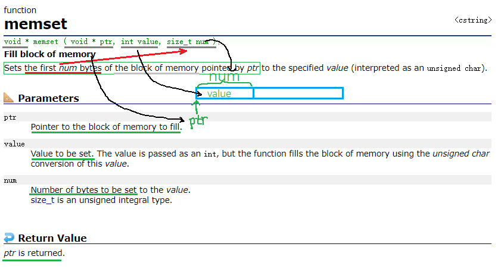
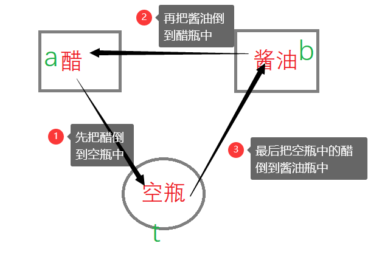
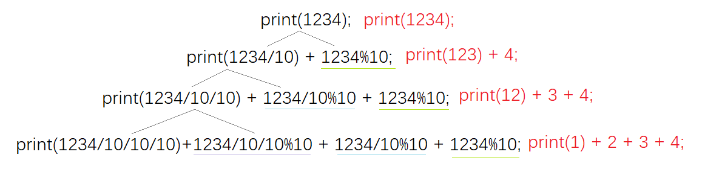
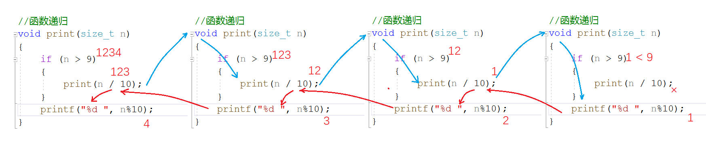
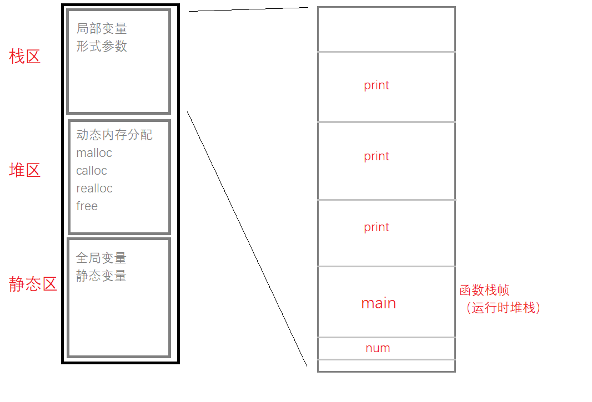
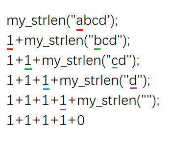
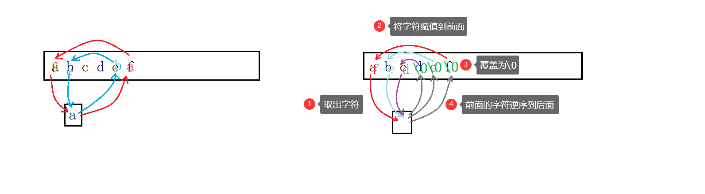
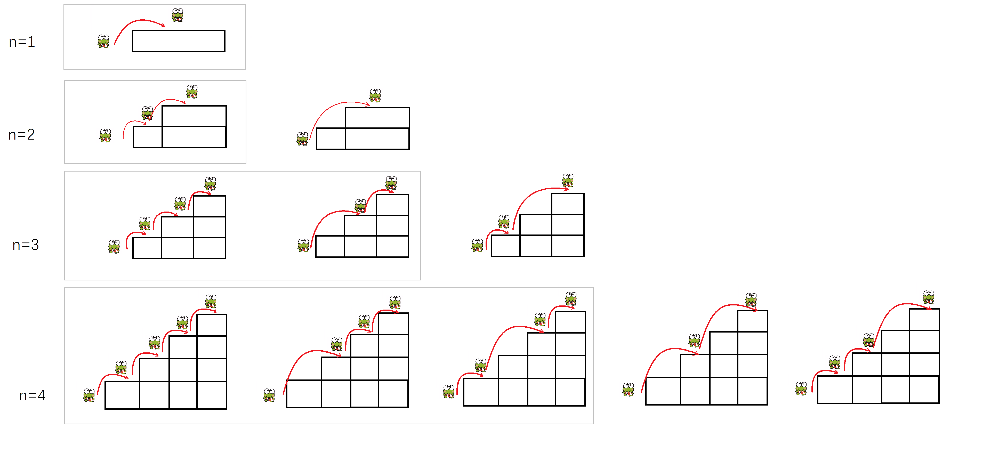

# 函数

函数又被叫做子程序，有一或多个语句项组成，负责完成某项特定任务。通常我们是将一项任务或者功能封装在一个函数中，对外提供接口，这样代码更加结构化。

特点：

1. 具备相对的独立性
2. 一般有输入值和返回值
3. 功能单一且灵活

## 1. 库函数

### 1.1 库函数的定义

库函数，就是放在库里供他人使用的函数。

如打印输出这样的基础功能，他不是业务性的代码，在开发过程中使用率高且可移植性强，故C语言的基础库里提供了这样的一系列基础功能的代码。

一般库函数有：

> - IO函数（input&output）—— printf	scanf	getchar	putchar …
> - 字符串操作函数 —— strlen	strcmp	strcat	strcpy …
> - 字符操作函数 —— tolower	toupper …
> - 内存操作函数 —— memcpy	menset	memmove	memcmp …
> - 时间/日期操作函数 —— time …
> - 数学函数 —— sqrt	abs	fabs	pow …
> - 其他库函数

### 1.2 介绍

查看库函数可以以 c/cpp权威网站 [cplusplus](https://cplusplus.com/) 的解析为样本，不同平台也是大同小异。

- 函数的基本信息：函数名，参数，返回类型
- 功能描述：函数的具体作用

#### strcpy

~~~C
char* strcpy (char* destination, const char* source);
~~~

~~~C
//当然这里 strcpy 函数的返回值是目标空间的首地址，故接收时也可以使用函数的返回值。
char arr1[20] = { 0 };
char arr2[] = "damn it!";
//1.
char* ret = strcpy(arr1, arr2);
printf("%s\n", ret);
//2.
printf("%s\n",strcpy(arr1, arr2));
~~~

#### memset

~~~C
void* (void* ptr, int value, size_t num);
~~~

memset 是以字节为单位，修改地址中的内容。

~~~C
int arr[30];
memset(arr, 0, 30 * sizeof(int));
~~~

&nbsp;

## 2. 自定义函数

### 2.1 自定义函数的定义

库函数虽多，但毕竟是有限的，还是需要自定义函数来实现某些具体的需求。自定义函数和库函数一样，有函数名、返回类型和函数参数，但不同的是这些都由我们自己来设计。

~~~C
ret_type fun_name (para1, ...)
{
    statment;//语句项
}
ret_type //返回类型
fun_name //函数名
para1    //参数
~~~

#### 找最大值

如图所示，写函数，函数名、参数、返回类型都要对应。

### 2.2 函数的参数

函数参数分为实际参数和形式参数两种：

1. 实际参数又叫实参，实参可以是任意有确定值的形式，以便在进行函数调用时，将其传给形参。
2. 形式参数又叫形参，只有当函数调用时，他们才被分配确定值以及内存单元，调前不存在，调后销毁，所以形参只是形式上存在。

### 2.3 函数的调用

1. 传值调用

**形参相当于实参的一份临时拷贝**，并且形参和实参占用不同的内存单元，本质上是两个不同的变量，形参的修改不影响实参。

2. 传址调用

**将外部变量的地址传给函数参数**，这样的调用可使函数内外建立真正的联系，即形参实参建立联系。

#### 两数交换

先看在程序设计中如何进行两数交换，用酱油、醋和空瓶举例。

1. 先把 a 赋值给 t，那么现在 t 里面存的就是 a 的值；
2. 再把 b 赋值给 a，这样 a 里就是 b 的值，但 a 原本的值还在 t 里不会被覆盖；
3. 最后把 t 赋值给 b，这样 a 原本的值就到了 b 中，就完成了 a 和 b 的互换。

~~~C
void Swap1(int x, int y) {
	int t = 0;
	t = x;
	x = y;
	y = t;
}
void Swap2(int* px, int* py) {
	int t = 0;
	t = *px;
	*px = *py;
	*py = t;
}
int main() {
	int a = 10;
	int b = 20;

    Swap1(a,b);
	printf("Swap1：a=%d,b=%d\n", a, b);

    Swap2(&a, &b);
	printf("Swap2：a=%d,b=%d\n", a, b);

    return 0;
}
~~~

Swap1 仅仅是把 a 和 b 传值给 x 和 y，此时去修改 x 和 y 是影响不到 a 和 b 的。

Swap2 是把 a，b 的地址传给指针变量 px 和 py，这样的话，在函数内去将 px 和 py 解引用再修改，就可以指向a，b 的内容了。

简而言之，**通过指针指向实参的地址使得外边的实参发生变化**。

由图可知，px 和 py 内部存储的是变量 a 和 b 的地址，这样对 px 和 py 解引用就可以修改 a 和 b 的值。

由右图的监视可看出，Swap1 函数 x 和 y 确实发生了交换，但并没有影响到 a 和 b。Swap2 函数的 px、py 和 &a、&b 是一个意思。

#### 嵌套调用

函数不可以嵌套定义，函数与函数是平等的，是并列关系，不可以在任意函数（包括主函数）中定义其他函数。但函数是可以互相调用的。

~~~C
void fun1()
{
    printf("hehe\n");
}
void fun2()
{
    fun1();
}
int main()
{
    fun2();
    return 0;
}
~~~

> 如代码所示，main函数调用fun2函数，fun2函数又调用fun1函数，最终在屏幕上打印hehe。

#### 链式访问

链式访问（chain access），顾名思义，把一个函数的返回值作为另一个函数的参数。像是用链子把函数首尾相连拴起来。如：

~~~C
int main()
{
    printf("%d\n",strlen("abcde")); //把strlen的返回值作为printf的参数
    return 0;
}
~~~

~~~C
int main()
{
	char arr1[20] = "xxxxxxx";
	char arr2[20] = "abcde";
	//strcpy(arr1,arr2);
	printf("%s\n", strcpy(arr1, arr2));//strcpy函数的返回值是目标空间首元素地址
	return 0;
}
~~~

如果觉得掌握了的话，可以看看这个经典例子。

~~~C
printf("%d", printf("%d", printf("%d", 43)));
~~~

printf 函数的返回值是打印字符的个数，如果发生错误，则返回负值。（ps:scanf 的返回值是输出字符的个数）

1. 首先可以看出第三个 printf 打印了43；
2. 然后第二个 printf 打印了第三个 printf 的返回值为2；
3. 最后第一个 printf 打印第二个 printf 的返回值1；

> 所以屏幕上打印了4321。

#### 函数声明

代码是从前往后执行的，如果在函数调用处之前并没有发现函数的定义，那么便会发出警告：函数未定义。

若想消除警告，我们便需要在前面声明一下。

~~~C
void test1();

int test2() {
	tes1();
}

void test1()
{}
~~~

函数声明目的是告诉编译器函数的返回类型、函数名、参数这些具体信息。表示这个函数是真实存在的。

函数的声明一般出现在函数使用之前，函数的声明一般放在头文件中。

在工作的时候，一般是把函数的声明、定义和使用放在三个不同的文件内，方便所有人协作。如：

> 链接：两个.c的源文件编译之后，会分别生成.obj的目标文件，然后再链接起来，最后生成.exe的可执行文件。
>

#### 头文件引用

`#include`的预编译指令是**在预编译阶段将头文件内的所有内容拷贝到源文件**内。头文件中的内容若被重复包含则会造成效率降低。

> 那么，怎么解决这件事呢？

1. 头文件中包含语句`#pragma once`，就可使得头文件不会被其他文件重复包含。
2. 添加这样的代码，将代码包含起来。

 ~~~C
 #ifndef __ADD_H__ // if not define
 #define __ADD_H__ // define

 extern int Add(int x, int y); //Add函数声明

 #endif            // end if
 ~~~

早期都是用第二种方法的，这两种方法是完全等价的。

#### 函数递归

函数自身调用自身，的代码逻辑叫做递归。

1. 大型复杂问题层层转化为小规模的问题
2. 少量程序描述出多次运算

递归的思维方法在于：大事化小。

##### 示例1

接收一个无符号整型值，按照顺序打印其每一位。如输入：1234，输出：1 2 3 4 .

1. 创建一个函数叫print，
2. 若print(1234)，则剥离一位变成print(123)+4，
3. 再剥离一位成print(12)+3+4，
4. 再来一位就是print(1)+2+3+4，
5. 最后只有一位了，
6. 那就全部用`printf` 函数打印。如：

> 我们发现只要将数字1234模10就可以得到4，除10便可以得到123，如此模10除10循环往复，可以将1 2 3 4全部剥离出来。

~~~c
//函数递归
void print(size_t n)
{
	if (n > 9)//只有1位便不再往下进行
	{
		print(n / 10);
	}
	printf("%d ", n%10);
}
~~~

具体流程可参考下面这张图。

红线部分即在返回的时候，n是本次函数n，而不是前一次调用的n。

> 递归递归，就是递推加回归。

现在有两个问题

1. `if(n > 9)`这个条件没有行不行？没有会怎么样？

> 自然是不行的，我们在上面的推导中发现，最后1<9条件不成立，就结束了递归，否则会永远递归下去，造成死循环且耗干了栈区。

2. 或者是我们不论代码的正确性，将`print(n / 10)`改成`print(n)`会怎么样？

> 改成`print(n)`的话每次递归都是相同的值，递归也会无止境的延续下去。

这样便引出了我们递归的两个重要的必要条件：

##### 必要条件

1. 必须**存在限制条件**，满足条件时，递归不再继续
2. 每次递归调用后必须**越来越接近限制条件**

##### 栈溢出

在第一个问题中，如果我们要去试验的话，编译器会报出这样的错误：名叫Stackoverflow（栈溢出）。

首先我们看看内存的划分：

内存粗略的划分为栈区，堆区，静态区。

> 1. 栈区主要存放：局部变量，形参（形参和局部变量差不多）
> 2. 动态内存分配：`malloc calloc`等函数开辟空间
> 3. 静态区主要存放：全局变量，static修饰的静态变量

若是把栈区放大细看的话，如图所示，有为main函数开辟的空间和print函数开辟的空间，为函数开辟的空间叫函数栈帧也可以叫运行时堆栈。

> - 程序开始执行时开辟空间，程序结束时销毁空间
> - 函数每调用一次就在栈上开辟一次空间，递归返回时，空间会被回收

##### 示例2

不创建临时变量，实现`Strlen`函数。

~~~c
//my_strlen求字符串长度
int my_strlen(char* pa)
{
	if (*pa == 0)
		return 0;

	return 1+my_strlen(pa + 1);//直接返回长度
}
~~~

具体的思考方式就是只要第一个字符不是0，那我们就在外面+1并且跳到下一个字符，直到找到‘\0’，那么我们返回0。

> 字符指针+1，向后跳一个字节，整型指针+1，向后跳四个字节，指针+1都是向后跳一个元素的地址，指针类型不同向后跳的字节也不同。

> 有这两题我们可以发现，什么时候用递归简单呢？

1. 有公式有模板的时候
2. 递归简单，非递归复杂的时候

当递归有明显问题的时候，就不要用递归了。

## 函数递归

#### 函数递归的定义和优缺点

程序调用自身的行为就是递归。可以直接或间接的调用，本质是把复杂的问题转化为一个规模小的问题。递归一般只需少量的代码就可描绘出多次重复计算。其主要思考方式在于**大事化小**。

**优点**是为具有某些特征的编程问题提供了最简单的策略，**缺点**是层层调用，算法的复杂度可能过高，以致于快速耗干了计算机的内存资源，不方便阅读和维护等。

#### 递归的使用场景及必要条件

**使用场景**

1. 能够要求转化为新的问题，且二者解决方法相同，所处理的对象存在规律变化。
2. 非递归比较麻烦，而递归很简单。
3. 有模板或是公式可以直接套用，不会出现明显问题。

**必要条件**

- 明确存在限制条件
- 每次递归越来越逼近条件

#### 递归的细节说明

- 每级递归都有自己的变量，可能名称相同，但是其值不同。

  > 递归调用时，系统自动保留当前函数的参数变量。每次调用系统都会为函数开辟相应的空间。

- 每次调用都要返回值，递归执行结束后，控制权传回到上一级函数。

  > 调用结束后，系统释放本次调用所开辟的空间，程序返回到上一次的调用点，同时获得初进该级调用的参数。
  >
  > 每级递归必须逐级返回，不可跳跃或间断。

- 函数中递归语句之前的代码，按被调函数的顺序执行，递归之后的代码，与被调函数相反的顺序执行。

#### 递归的习题讲解

##### 1打印整数每一位

用递归的方式，实现打印一个整数的每一位的功能。

###### 输入输出示例

> 输入：1234
>
> 输出：1 2 3 4

###### 解题思路

> `print(1234)`
> $=$ `print(123)`+4
> $=$ `print(12)`+3+4
> $=$ `print(1)`+2+3+4
> $=$ `printf(1)`+2+3+4

 这便是前面使用场景中所写的，将题目要求问题转化为新的问题，且变量有规律的变化

###### 代码逻辑

> `n`是不是个位数，递推调用`n / 10`
>
> `n`是个位数，回归打印`n % 10`

~~~c
void Print(int n)
{
	if (n > 9)
	{
		Print(n / 10);
	}
	printf("%d ", n%10);
}
int main()
{
	int num = 0;
	scanf("%d", &num);
	Print(num);
	return 0;
}
~~~

##### 2递归和非递归求n阶乘

用递归和非递归的方法，分别实现求n的阶乘的功能（不考虑溢出）。

###### 输入输出示例

> 输入：5
>
> 输出：120

###### 解题思路

> $n*n-1*n-2*n-3*…*1$

###### 代码逻辑

> $fac(n) = n * fac(n-1) , n>0$
>
> $fac(n) = 1 , n=0$

~~~c
int fac(int n)//非递归
{
	int ret = 1;
	for (int i = 1; i <= n; i++)
	{
		ret *= i;
	}
	return ret;
}
int fac(int n)//递归
{
	if (n > 0)
		return n * fac2(n - 1);
	else
		return 1;
}
int main()
{
	int n = 0;
	scanf("%d", &n);
	printf("%d\n", fac(n));
	return 0;
}
~~~

##### 3`strlen`函数模拟

###### 输入输出示例

> 输入：abcdef
>
> 输出：6

###### 解题思路

> `strlen(abcdef\0)
> 1+strlen(bcdef\0)
> 1+1+strlen(cdef\0)
> 1+1+1+strlen(def\0)
> 1+1+1+1+strlen(ef\0)
> 1+1+1+1+1+strlen(f\0)
> 1+1+1+1+1+1+strlen(\0)`

###### 代码逻辑

> $若 *ch≠0 , strlen(arr) = 1 + strlen(arr+1)$
> $若*ch=0 , strlen(arr) = 0$

~~~c
int my_strlen(char* ch)
{
	if (*ch != '\0')
	{
		return 1 + my_strlen(ch + 1);
	}
	return 0;
}
int main()
{
	char ch[20] = { 0 };
	scanf("%s", &ch);
	printf("%d", my_strlen(ch));
	return 0;
}
~~~

##### 4逆序字符串

不开辟额外空间的情况下，不使用字符串库函数，递归实现字符串反向排列，而不是倒序打印。

###### 输入输出示例

> 输入：abcdef
>
> 输出：fedcba

###### 解题思路

> `abcdef`
>
> 递推：（先把后面赋值给前面，后面用覆盖\0）
>
> $ \Rightarrow$ `f b c d e \0`
>
> $\Rightarrow$ `f e c \0\0`
>
> $\Rightarrow$ `f e d \0\0\0`
>
> 回归：（把前面转移出去的字符对应赋值给\0）
>
> $ \Rightarrow$ `f e d c \0\0`
>
> $\Rightarrow$ `f e d c b \0`
>
> $\Rightarrow$ `f e d c b a`

###### 代码逻辑

> `reverse("abcdef\0")
> 交换a和f+reverse("f bcde\0\0")
> 交换a和f+交换b和e+reverse("fe cd\0\0\0")
> 交换a和f+交换b和e+交换c和d+reverse("fed \0\0\0\0")`

> - 交换两个字符
>   1. 将在前的字符先放到一边存着
>   2. 把在后的字符赋值到前面的位置
>   3. 再把后面的位置对应覆盖为`\0`
> - 原在前字符替换`\0`
>   1. 把事先存好的在前的字符对应替换到`\0`的位置上

~~~C
void reserve_string1(char* ch)//指针
{
	char* left = ch;
	char* right = ch + strlen(ch) - 1;
	while (left < right)
	{
		char tmp = *left;//不能交换地址，只能交换内容
		*left = *right;
		*right = tmp;
		left++;
		right--;
	}
}
void reserve_string2(char* ch)//数组
{
	int left = 0;
	int right = strlen(ch) - 1;
	while (left < right)
	{
		char tmp = ch[right];
		ch[right] = ch[left];
		ch[left] = tmp;
		left++;
		right--;
	}
}

void reverse_string3(char* ch)//递归
{
	char* left = ch;
	char* right = ch + strlen(ch) - 1;

	if (*ch != '\0')
	{
		char tmp = *left;//提取
		*left = *right;//赋值
		*right = '\0';//赋\0

		reverse_string3(ch+1);//ch+1,而不是ch++

		*right = tmp;//赋值
	}
}
int main()
{
	char ch[20] = "abcdef";
	//char* ch = "abcdef";//err - 常量字符串不可修改
	reverse_string3(ch);
	printf("%s\n", ch);

	return 0;
}
~~~

##### 5递归实现数字各位之和

写一个递归函数`DigitSum()`，输入一个非负整数，返回组成它的数字之和

###### 输入输出示例

> 输入：1234
>
> 输出：10

###### 解题思路

> 1234
> `DigitSum(123)`+4
> `DigitSum(12)`+3+4
> `DigitSum(1)`+2+3+4
>
> 1+2+3+4

> 1234%10=4
> 1234/10=123
>
> 123%10=3
> 123/10=12
>
> 12%10=2
> 12/10=1
>
> 1%10=1
> 1/10=0
>
> 一个数模10得到尾数，除10得到尾数前面的数字
>
> 通过不断的除10模10，就可以把每一位数字放到末尾，从而得到每一位数字

###### 代码逻辑

> 若n不为个位数，先%10得到尾数，再/10
>
> 一定要有递归的出口，即当n为个位数时，函数返回n

~~~c

int DigitSum(int n)
{
	if (n > 9)
		return DigitSum(n / 10) + n % 10;
	else
		return n;//递归的出口
}
int main()
{
	int n = 0;
	scanf("%d", &n);
	printf("%d\n", DigitSum(n));

	return 0;
}
~~~

##### 6求n的k次幂

输入两个整数分别代表底数和次幂，递归实现n的k次幂的功能。

###### 输入输出示例

> 输入：2   3
>
> 输出：8

###### 解题思路

> 当`k>0`时，函数返回`n*power(n,k-1)`
>
> 当`k=0`时，函数返回1，这是程序的出口，是程序递归到最后必须要计算的值

###### 代码逻辑

> $n^k = n * n^{k-1} ,k > 0$
> $n^k = 1 , k = 0$

~~~c
double power(int n,int k)
{
	if (k > 0)
		return n * power(n, k - 1);
	else if (k == 0)
		return 1.0;//递归的出口k=0
	else
		return 1.0 / power(n, -k);
}
int main()
{
	int n = 0;
	int k = 0;
	scanf("%d%d", &n, &k);
	printf("%lf\n", power(n, k));
    return 0;
}
~~~

##### 7递归求斐波那契数列

递归和非递归分别实现求第n个斐波那契数

###### 输入输出示例

> 输入：5
>
> 输出：5

###### 解题思路

> $1\quad 1\quad 2\quad 3\quad 5\quad 8\quad 13\quad 21\quad 34\quad 55\quad 89\quad ...$

###### 代码逻辑

> 递归：
>
> $Fib(n) = Fib(n-1) + Fib(n-2) , n>2$
> $Fib(1) = Fib(2) = 1$
>
> 非递归：
>
> 上一次的b换成这一次的a
>
> 上一次的c换成这一次的b
>
> 如此循环，就可以从前往后一个一个求。

~~~c
int Fib(int n)
{
	if (n > 2)
		return Fib(n - 1) + Fib(n - 2);
	else
		return 1;
}
~~~

> 但是这个方法效率是非常低的，当数字特别大时，层层拆分下来，时间效率是$O(2^n)$。
>
> 根据公式可知，第三个斐波那契数可由前两个得到，我们利用这个规律

~~~C
int Fib(int n)
{
	if (n <= 2)
		return 1;
	int a = 1;
	int b = 1;
	int c = 1;//n=3时不用运算
	while (n >= 3)//从头开始移动n-2次，n=3时不用
	{
        c = a + b;
		a = b;//b赋值给a
		b = c;//c赋值给b
		n--;
	}
	return c;
}

int main()
{
	int n = 0;
	scanf("%d", &n);
	printf("%d",Fib(n));

	return 0;
}
~~~

#### 经典问题

##### 汉诺塔问题

汉诺塔，小时候游戏机上经常看别人玩的，自己玩到三四局就玩不下去了的那款游戏。当然如果你觉得非常简单，小时候能玩的行云流水，那你有本事到我面前说，礼貌谢谢（狗头保命）。

###### 游戏规则

有三根柱子，分别为A、B、C ，A柱上从上到下依次排列着由小到大的圆盘，我们需要把圆盘从A柱按照同样的摆放顺序放到C柱上，期间我们可以借助B柱。

- 每次只能挪动一个且是最上面的圆盘
- 按照从上到下依次是由小到大的顺序摆放。

###### 解题思路

假设由N个盘子，只需要考虑第$N$个盘子和其上$N-1$个盘子的整体。显然思路就是，第$N$个是要放在$C$柱上的，

1. 首先将$N-1$个整体是先放在$B$柱上；
2. 其次将第$N$个放在$C$柱上；
3. 最后将$N-1$个整体放到$C$柱上。

即：第$N$个$A\rightarrow B$，$N-1$个整体$A\rightarrow B\rightarrow C$ 。然后再考虑$N-1$个中把第$N-1$个当作最后一个，其上$N-2$个当作整体，到最后只剩一个直接放到$C$柱上。这便是递归的整体思路。

~~~c
void move(int n, int x, int z)
{
	printf("%d盘：%c->%c\n", n, x, z);
}
void hannoi(int n, char x, char y, char z)
{
	if (n == 1)
		move(n, x, z);
	else
	{
		hannoi(n - 1, x, z, y);
		move(n, x, z);
		hannoi(n - 1, y, x, z);
	}
}
int main()
{
	int input = 0;
	do
	{
		printf("输入盘数开始测试（0. 退出测试）\n");
		scanf("%d", &input);
		switch (input)
		{
		case 0:
			break;
		default:
			hannoi(input, 'A', 'B', 'C');
			break;
		}
	} while (input);
	return 0;
}
~~~

##### 青蛙跳台阶

###### 游戏规则

	**初阶版本**

		青蛙一次可以跳一级台阶，也可以跳两级台阶。求该青蛙跳n级台阶共有多少种跳法？

	**进阶版本**

		青蛙一次可以跳一级台阶，也可以跳两级台阶，……，也可以跳n级台阶，求该青蛙跳上n级台阶的跳法种数。

###### 解题思路

我们反向思考，当青蛙跳到最高阶$N$阶时，他是怎么跳到第$N$阶的呢？

有两种情况，

- 从第$N-1$阶，跳到第$N$阶，最后一次跳一阶。
- 从第$N-2$阶，跳到第$N$阶，最后一次跳两阶。

> 图中用灰框框出的部分，是最后一次跳一阶的，其余的是最后一次跳两阶的。

很显然，除了这两种情况，别无他法。所以计算青蛙

跳到$N$阶的方法数 $=$ 跳$N-1$阶的方法数  $+$  跳$N-2$ 阶的方法数。

> 同样，图中用灰框框出的部分，也代表的是跳$N-1$阶的方法数，其余的是跳$N-2$ 阶的方法数。

这其实就是斐波那契数列。

~~~c
int fib(int n)
{
	if (n > 1)
		return fib(n - 1) + fib(n - 2);
	else
		return 1;
}
~~~
