#  数组

## 一维数组

### 一维数组的创建

数组是一组相同类型的元素的集合。语法形式是：

```c
type_t arr_name [const_n]
//如：
int arr[10];
```

> `type_t` 指的是数组元素的类型。`const_n` 指的是一个常量表达式，用来指定数组的大小。

此时运行程序的话，系统会报一个警告：未初始化变量。打开调试就会发现系统默认将数组填入一些随机值。

<center>
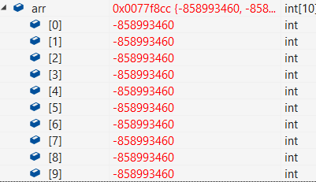
</center>

- 局部数组，不会初始化，因此默认是随机值。
- 全局数组，系统默认初始化为0。

```c
int arr[10];// 0 0 ... 0
int main()
{
  return 0;
}
```

#### 创建实例

```c
//1.
int arr[10];
//2.
int count = 10;
int arr2[count];//这样的创建数组可不可以呢？
//3.
float arr3[20];//浮点型数组
char ch[10];
```

**数组的`[]`内必须为常量，不能使用变量**，即便是const修饰的常变量也不行。

> 数组控制不好容易越界访问，所以C语言只允许用常量的指明数组大小。

### 一维数组的初始化

初始化，即在创建数组的同时给予一些合理的初始值。一般有如下两种方式：

1. 不完全初始化

```c
int arr[10] = { 1,2,3 };
```

前三个元素分别为1，2，3，剩余的元素默认初始化为0。

2. 省略数组大小

```c
int arr2[] = { 1,2,3,4 };//利用初始化内容，指定数组大小
```

由初始化内容指定数组的大小，初始化了四个元素分别为1，2，3，4。数组的大小即为4个元素。

#### 初始化字符数组

<center>
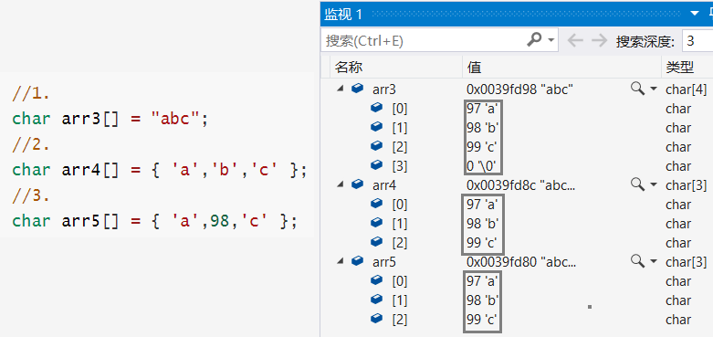
</center>

- 第一种是用字符串初始化数组

字符串有`\0`作为结束标志。虽不算字符串内容，但它也被初始化作为数组内容。共有4个元素。

- 第二种和第三种是一样的

因为数组元素类型是字符型，且字符`'b'`的ACSII码值是98，自动将98解析为字符。这样初始化就不会自带`\0`，所以有3个元素。

### 一维数组的使用

数组是通过下标来访问的，下标默认是从0开始。通过下标引用操作符`[]`我们可以访问到数组元素。

```c
//定义数组
int arr[10] = { 1,2,3,4,5,6,7,8,9,10 };
//计算数组长度
int sz = sizeof(arr) / sizeof(arr[0]);
//循环打印数组
for (int i = 0; i < sz; i++)
{
    printf("%d ", arr[i]);
}
//1 2 3 4 5 6 7 8 9 10
```

- `sizeof(arr)`，即`sizeof`+数组名，指的是以字节为单位计算整个数组的大小。
- `sizeof(arr[0])`是计算数组首元素的大小。

数组大小为40个字节，而数组首元素为4个字节，相除得数组长度为10。这样可以灵活的控制打印的个数，在编程中很常见。

#### 总结

1. 数组是通过下标访问的，下标从0开始。
2. 数组的大小可以通过计算得到。

### 一维数组的存储

通过如下代码可以循环打印数组每个元素的在内存中存储的地址。可以通过它看到该数组在内存中的存储情况。

<center>
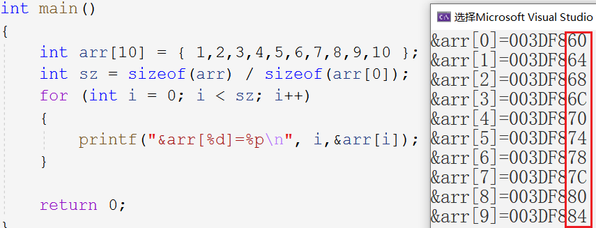
</center>

打印结果是十六进制的内存编号，可以看见每一个元素之间都相差4个字节，而一个整型元素正好占4个字节。很明显的是，**数组在内存中是连续存放的**。

<center>
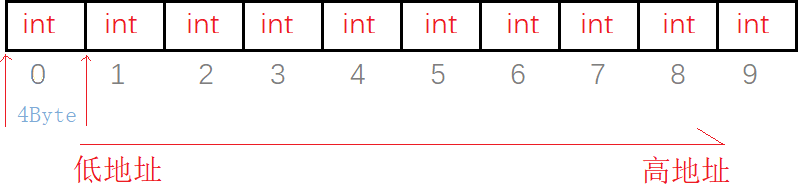
</center>

随着数组下标的增长地址也在增长，这也是为什么指针变量+1可以访问到下一个元素。所以数组本质就是**内存中一组连续存放的相同类型的元素。**

## 二维数组

### 二维数组的创建

二维数组的创建方式与一维数组类似，不过多了行列的概念而已。

```c
type_t arr_name[const_n][const_n]
//
int arr[3][5];//3行5列
char ch[4][7];//4行5列
double arr2[2][4]//2行4列
```

如上述代码所示：二维数组的语法结构就是，类型+数组名+\[行][列]。

<center>
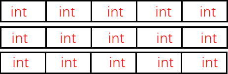
</center>

如图所示，二维数组在逻辑上就是这样的3行5列的元素排列类似于表格、矩阵，矩阵的定义就是一组数组成数表。

### 二维数组的初始化

二维数组的初始化有如下两种方式：

```c
//1.
int arr1[3][5] = { 1,2,3,4,5,6,7,8,9,10,11 };
//2.
int arr2[3][5] = { {1,2},{3,4},{5,6,7} };
```

- 第一种：按行填入，第一行是`1 2 3 4 5`，第二行是`6 7 8 9 10`，第三行不够就补零`11 0 0 0 0` 。
- 第二种：按行填入，每一行看成一个一维数组，每行不够还是补零。第一行`1 2 0 0 0`，第二行`3 4 0 0 0`，第三行`5 6 7 0 0` 。

<center>
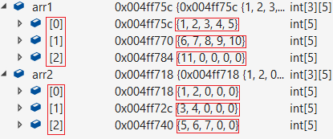
</center>

#### 初始化字符数组

```c
char ch1[2][4] = { 'a','b' };
char ch2[2][4] = { {'a'},{'b'} };
char ch3[3][4] = { "abc","def","gh" };
```

用字符串去初始化二维数组的话，也是需要注意`\0`的问题。第一行：`a b c \0 `；第二行：`d e f \0`；第三行：`g h \0 0`。

#### 行列的省略问题

总的来说就是**行可省，列不可省**，如：

```c
int arr2[][5] = { {1,2},{3,4},{5,6,7} };
```

省略行可以，但是不能省略列，行数可以根据初始化内容来判定，但如果列省略了就会造成歧义。

列确定了就可以确定行，而行的确定并不能确定列。省略必须在已初始化的前提下，不然行和列一概不知就无法分配空间。

### 二维数组的使用

二维数组同样是用下标访问，如：

<center>
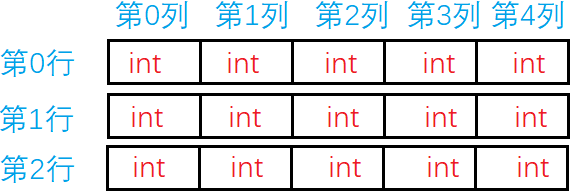
</center>

访问二维数组的方式，是用两次循环遍历这个数组。

<center>
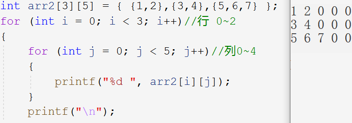
</center>

### 二维数组的存储

同样打印出每个元素的地址，如：

<center>
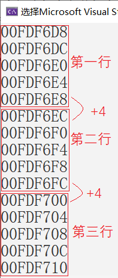
</center>

每行的最后一个和下一行的第一个元素之间仍相隔一个元素大小。二维数组也是在内存中连续存放的。

二维数组将二维形式的每一行理解为一个一维数组，整体仍然是一个一维数组。因此二维数组在内存中的存储形式还是一维的。

<center>
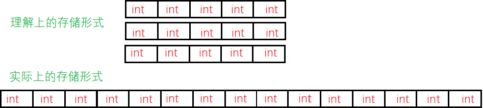
</center>

> 从这里我们也可以理解到，二维数组的初始化里，为什么可以省略行不能省略列。把行省略了，但是我们知道列，一个一个填满就是了，能填到多少行就有多少行。

#### 存储方式的理解

对于二维数组，我们可以将其每一行理解为一个元素，其中每一个元素又是一个一维数组。二维数组的整体又是一个一维数组。

例如二维数组`arr[3][5]` 是一个具有3个元素的一维数组，每个元素是一个有5个元素的一维数组。指向二维数组的指针+1，指向的是下一行。

> 对于二维数组在内存存储形式的理解还是很重要的，有了这样的思想，我们就可以通过指针遍历得到数组元素，如：

```c
int arr[3][5] = { {1,2,3},{4,5,6},{7,8} };
int* p = &arr[0][0];
for (int i = 0; i < 15; i++)
{
    printf("%d ", *p++);//1 2 3 0 0 4 5 6 0 0 7 8 0 0 0
}
```

## 数组越界问题

数组通过下标访问，那么下标也就可以控制数组的访问范围。下标在数组前后进行访问，就是非法访问内存，即数组越界。

```c
//1 2 3 4 5 -858993460
int arr[5] = { 1,2,3,4,5 };
for (int i = 0; i <= 5; i++)//越界访问到第6个
{
    printf("%d ", arr[i]);
}
```

> 数组越界访问到最后一个元素之后的一块内存，这就属于越界访问，-858993460是编译器自动生成的随机值。

一般编译器是不会去检查数组越界访问的情况，所以我们就要有意识的主动检查。如果编译器提示这样数组溢出的错误信息，那么一般就是数组越界了：

<center>
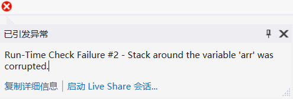
</center>

## 数组作函数参数

在写代码时，我们经常会将数组作为参数，这里以冒泡排序为例。

冒泡排序的核心思想：两两相邻的元素进行比较。

- 一趟冒泡排序搞定一个数字，让其来到最终的位置上。
- $n$ 个元素，则总共需要 $n-1$ 趟冒泡排序，每一趟排序需要进行 $n-1-i$ 次判断大小。如分析图所示：

<center>
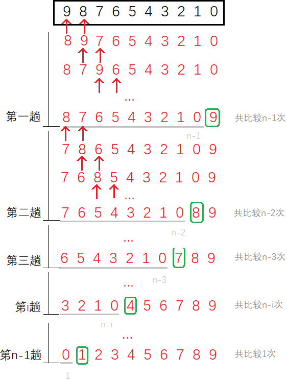
</center>

```c
void Print(int* arr, int sz)
{
	for (int i = 0; i < sz; i++)
	{
		printf("%d ", *arr++);
	}
}
void Sort(int arr[],int sz)//int* arr - 数组作形参本质是指针
{
	//int sz = sizeof(arr) / sizeof(arr[0]);//err
	for (int i = 0; i < sz - 1; i++)//n-1趟
	{
		for (int j = 0; j < sz - 1 - i; j++)//n-1-i次
		{
			if (arr[j] > arr[j + 1])//目标升序
			{
				//交换
				int tmp = arr[j];
				arr[j] = arr[j + 1];
				arr[j + 1] = tmp;
			}
		}
	}
}
int main()
{
	int arr[] = { 1,4,6,3,7,9,3,2,8,5 };
	int sz = sizeof(arr) / sizeof(arr[0]);
	//排序
	Sort(arr,sz);
	//打印
	Print(arr,sz);
	return 0;
}
```

**定义数组作形参时，本质上是指针**。

`void Sort(int arr[],int sz)`本质就是`void Sort(int *arr,int sz)`。

`sizeof(arr)`算的就是指针`arr`的大小，所以数组大小只能传参进去，不可在函数内计算。

## 数组名`arr`的意义

`sizeof(arr)`和`&arr`代表的是整个数组，除此以外都是代表首元素的地址。
