##  数组

### 1 一维数组

#### 1.1 一维数组的创建

数组的定义是一组相同类型的元素的集合。数组的语法形式是：

~~~c
type_t arr_name [const_n]
//如：
int arr[10];
~~~

> `type_t` 指的是数组元素的类型。`const_n` 指的是一个常量表达式，用来指定数组的大小。

此时运行程序的话，系统会报一个警告：未初始化变量。打开调试就会发现系统默认将数组填入一些随机值。

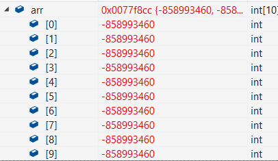

当然全局数组的话，系统默认初始化为0。

~~~c
int arr[10];// 0 0 ... 0
int main()
{
  return 0;
}
~~~

##### 创建实例

~~~c
//1.
int arr[10];
//2.
int count = 10;
int arr2[count];//这样的创建数组可不可以呢？
//3.
float arr3[20];//浮点型数组
char ch[10];
~~~

**数组的`[]`内必须为常量，不能使用变量。**同样，我虽然用const_n表示常量，但可千万不要将其误认为const修饰的变量哦。

数组控制不好容易越界访问非法内存，用变量的话风险太大，所以一直以来都是用常量创建数组的。

#### 1.2 一维数组的初始化

初始化，即在创建数组的同时给予一些合理的初始值。一般有如下两种方式：

1. 不完全初始化

~~~c
int arr[10] = { 1,2,3 };
~~~

前三个元素分别为1，2，3，剩余的元素默认初始化为0。

2. 省略数组大小

~~~c
int arr2[] = { 1,2,3,4 };//利用初始化内容，指定数组大小
~~~

由初始化内容指定数组的大小，初始化了四个元素分别为1，2，3，4。数组的大小即为4个元素。

##### 初始化字符数组

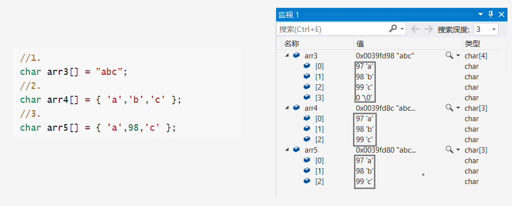

- 第一种是用字符串初始化数组，字符串有`\0`作为结束标志。虽不算字符串内容，但它也被初始化作为数组内容。共有4个元素。

- 第二种和第三种是一样的，因为数组元素类型是字符型，且字符`'b'`的ACSII码值是98，自动将98解析为字符。这样初始化就不会自带`\0`，所以有3个元素。

#### 1.3 一维数组的使用

数组是通过下标来访问的，下标默认是从0开始。通过下标引用操作符`[]`我们可以访问到数组元素。

~~~c
//定义数组
int arr[10] = { 1,2,3,4,5,6,7,8,9,10 };
//计算数组长度
int sz = sizeof(arr) / sizeof(arr[0]);
//循环打印数组
for (int i = 0; i < sz; i++)
{
    printf("%d ", arr[i]);
}
//1 2 3 4 5 6 7 8 9 10
~~~

`sizeof(arr)`，即`sizeof`+数组名的形式，指的是以字节为单位计算整个数组的大小。`sizeof(arr[0])`是计算数组首元素。数组大小为40个字节，而数组首元素为4个字节，相除得数组长度为10。

> 使用变量sz，可以灵活的控制打印的个数，这样的方法在编程中很常见。

##### 总结：

1. 数组是通过下标访问的，下标从0开始。
2. 数组的大小可以通过计算得到。

#### 1.4 一维数组的存储

通过如下代码可以循环打印数组每个元素的在内存中存储的地址。可以通过它看到该数组在内存中的存储情况。

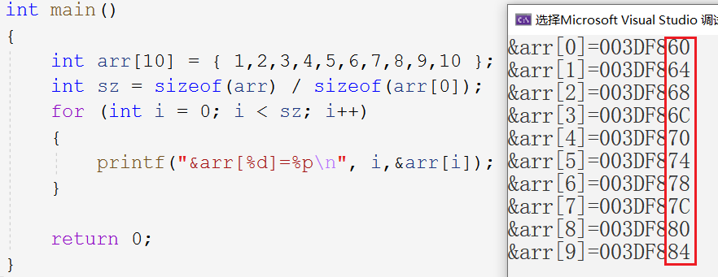

打印结果是十六进制的内存编号，可以看见每一个元素之间都相差4个字节，而一个整型元素正好占4个字节。很明显的是，**数组在内存中是连续存放的**。

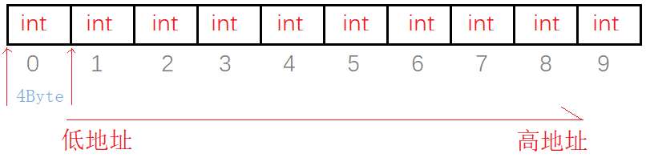

数组在内存中是连续存放的，随着数组下标的增长地址也在增长，这也正是为什么指针变量+1可以访问到下一个数组元素。所以数组的本质也就是**一组内存中连续存放的相同类型的元素。**

&nbsp;

### 2 二维数组

#### 2.1 二维数组的创建

二维数组的创建方式与一维数组类似，不过多了行列的概念而已。

~~~c
type_t arr_name[const_n][const_n]
//
int arr[3][5];//3行5列
char ch[4][7];//4行5列
double arr2[2][4]//2行4列
~~~

如上述代码所示：二维数组的语法结构就是，类型+数组名+\[行][列]。

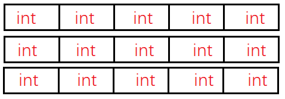

如图所示，二维数组在逻辑上就是这样的3行5列的元素排列类似于表格、矩阵，矩阵的定义就是一组数组成数表。

#### 2.2 二维数组的初始化

二维数组的初始化有如下两种方式：

~~~c
//1.
int arr1[3][5] = { 1,2,3,4,5,6,7,8,9,10,11 };
//2.
int arr2[3][5] = { {1,2},{3,4},{5,6,7} };
~~~

1. 第一种初始化：先一行一行填入，第一行是`1 2 3 4 5`，第二行是`6 7 8 9 10`，第三行不够就补零`11 0 0 0 0 ` 。

2. 第二种初始化：把每一行看成一个一维数组，每行不够还是补零，即第一行`1 2 0 0 0 `，第二行`3 4 0 0 0 `，第三行`5 6 7 0 0` 。

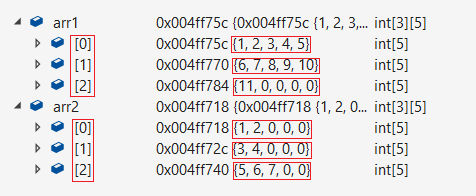

##### 初始化字符数组

~~~c
char ch1[2][4] = { 'a','b' };
char ch2[2][4] = { {'a'},{'b'} };
char ch3[3][4] = { "abc","def","gh" };
~~~

用字符串去初始化二维数组的话，也是需要注意`\0`的问题。第一行：`a b c \0 `；第二行：`d e f \0`；第三行：`g h \0 0`。

##### 行列的省略问题

总的来说就是**行可省，列不可省**，如：

~~~c
int arr2[][5] = { {1,2},{3,4},{5,6,7} };
~~~

省略行可以，但是不能省略列，行数可以根据初始化内容来判定，但如果列省略了就会造成歧义。列确定了就可以确定行，而行的确定并不能确定列。省略必须在已初始化的前提下，不然行和列一概不知就无法分配空间。

#### 2.3 二维数组的使用

当然二维数组同样是用下标访问数组内容的，也是从0开始。如：

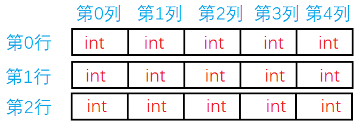

访问这个二维数组的方式，仍然是用两次循环遍历这个数组。

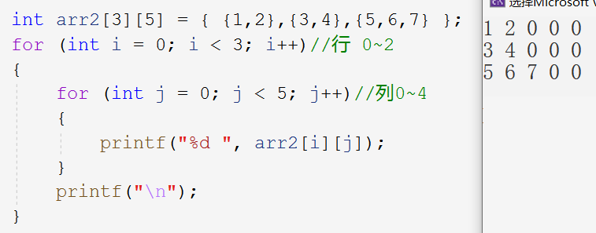

#### 2.4 二维数组的存储

当然我们也可以用同样的办法打印出每个元素的地址，如：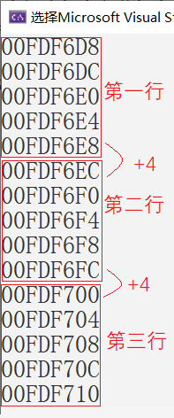

每行的最后一个和下一行的第一个元素之间仍相隔一个元素大小。所以二维数组每一个元素都是在内存中连续存放的。

二维数组在内存中的存储形式便是将想象中的二维形式的每一行理解为一个一维数组整体仍然是一个一维数组。因此二维数组在内存中的存储形式还是一维的，如下图的对比：

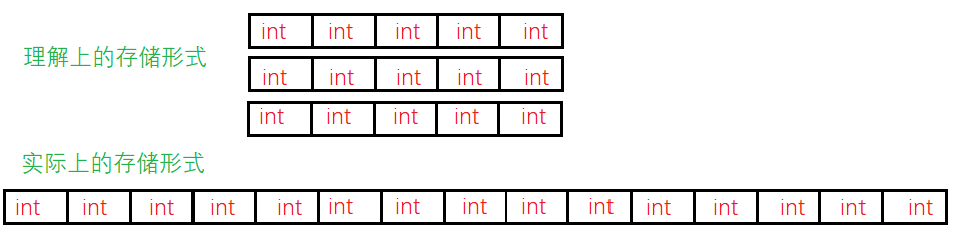

> 从这里我们也可以理解到，二维数组的初始化里，为什么可以省略行不能省略列。把行省略了，但是我们知道列，一个一个填满就是了，能填到多少行就有多少行。

##### 存储方式的理解

对于二维数组，我们可以将其每一行理解为一个元素，其中每一个元素又是一个一维数组。二维数组的整体又是一个一维数组。

例如二维数组`arr[3][5]` 是一个具有3个元素的一维数组，每个元素是一个有5个元素的一维数组。指向二维数组的指针+1，指向的是下一行。

> 对于二维数组在内存存储形式的理解还是很重要的，有了这样的思想，我们就可以通过指针遍历得到数组元素，如：

~~~c
int arr[3][5] = { {1,2,3},{4,5,6},{7,8} };
int* p = &arr[0][0];
for (int i = 0; i < 15; i++)
{
    printf("%d ", *p++);//1 2 3 0 0 4 5 6 0 0 7 8 0 0 0
}
~~~

&nbsp;

### 3 数组越界问题

数组通过下标访问，那么下标也就可以控制数组的访问范围。下标在数组前后进行访问，就是非法访问内存，即数组越界。

~~~c
//1 2 3 4 5 -858993460
int arr[5] = { 1,2,3,4,5 };
for (int i = 0; i <= 5; i++)//越界访问到第6个
{
    printf("%d ", arr[i]);
}
~~~

> 数组越界访问到最后一个元素之后的一块内存，这就属于越界访问，-858993460是编译器自动生成的随机值。

一般编译器是不会去检查数组越界访问的情况，所以我们就要有意识的主动检查。如果编译器提示这样数组溢出的错误信息，那么一般就是数组越界了：

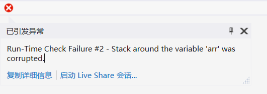

### 4 数组作函数参数

在写代码时，我们经常会将数组作为参数，比如接下来的两个应用实例，那么我们这里以冒泡排序的实现作为案例。

> 排序算法一般有四种：冒泡排序、选择排序、插入排序和快速排序。

冒泡排序的核心思想：**两两相邻的元素进行比较**。

- 一趟冒泡排序搞定一个数字，让其来到最终的位置上。
- $n$ 个元素，则总共需要 $n-1$ 趟冒泡排序，每一趟排序需要进行 $n-1-i$ 次判断大小。如分析图所示：

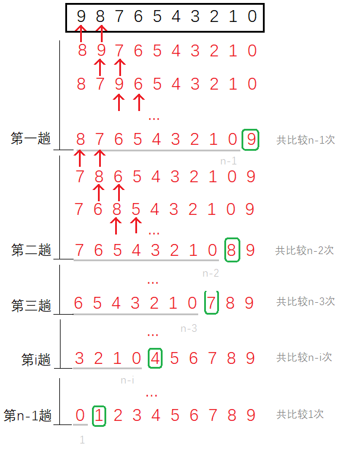

~~~c
void Print(int* arr, int sz)
{
	for (int i = 0; i < sz; i++)
	{
		printf("%d ", *arr++);
	}
}
void Sort(int arr[],int sz)//int* arr - 数组作形参本质是指针
{
	//int sz = sizeof(arr) / sizeof(arr[0]);//err
	for (int i = 0; i < sz - 1; i++)//n-1趟
	{
		for (int j = 0; j < sz - 1 - i; j++)//n-1-i次
		{
			if (arr[j] > arr[j + 1])//目标升序
			{
				//交换
				int tmp = arr[j];
				arr[j] = arr[j + 1];
				arr[j + 1] = tmp;
			}
		}
	}
}
int main()
{
	int arr[] = { 1,4,6,3,7,9,3,2,8,5 };
	int sz = sizeof(arr) / sizeof(arr[0]);
	//排序
	Sort(arr,sz);
	//打印
	Print(arr,sz);
	return 0;
}
~~~

定义数组作形参时，本质上是指针。

`void Sort(int arr[],int sz)`本质上就是`void Sort(int *arr,int sz)`。所以`Sort()`函数内，`sizeof(arr)`算的就是指针`arr`的大小，所以数组大小只能传参进去，不可在函数内计算。

##### 数组名`arr`的意义

- 代表整个数组的情况：

  1. 单独放在`sizeof`操作符内部时，如`sizeof(arr); ` 。

  2. 写出`&arr`时，代表的是整个数组，但表面仍为首元素地址。

- 代表首元素地址的情况：除上面两以外其他都是代表首元素的地址。

&nbsp;

### 5 应用实例

笔者实在没时间写两个应用实例的博客，所以在此将思维导图奉上，一般照着思维导图写就没问题了。

#### 5.1 三子棋

#### 5.2 扫雷游戏

