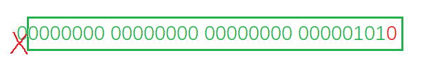
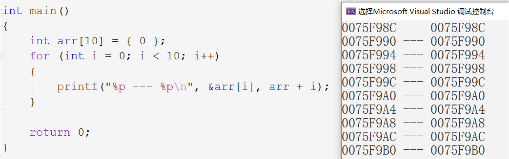
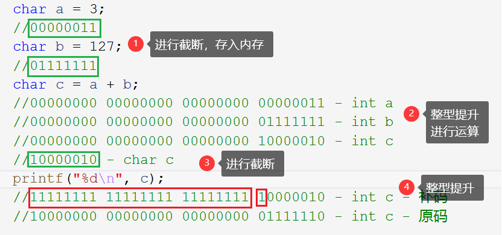
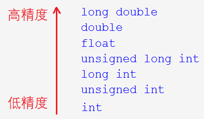
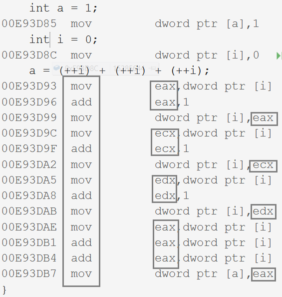

## 1 操作符

#### 操作符概览

| 操作符种类                   | 具体                                                         |
| ---------------------------- | ------------------------------------------------------------ |
| 算术操作符                   | +     -     *     /     %                                    |
| 移位操作符                   | <<     >>                                                    |
| 位操作符                     | &     ^     \|                                               |
| 赋值操作符                   | =     +=     -=     *=     /=     %=     >>=     <<=         |
| 单目操作符                   | !     -     +     &     sizeof     ~     --     ++     *     () |
| 关系操作符                   | >     >=     <     <=     !=     ==                          |
| 逻辑操作符                   | &&     \|\|                                                  |
| 条件操作符                   | exp1 ? exp2 : exp3                                           |
| 逗号表达式                   | exp1 , exp2 , exp3 , ... , expN                              |
| 下标引用、函数调用和结构成员 | []     ()     .     ->                                       |

&nbsp;

### 1.1 算术操作符

~~~c
+   -   *   /   %
~~~

~~~c
//1.
int ret = 9 / 2;
printf("%d", ret);//4
//2.
double ret2 = 9 / 2;
printf("%lf", ret2);//4.000000
//3.
double ret3 = 9 / 2.0;
printf("%lf", ret3);//4.500000
~~~

按计算机的运算规则，9/2执行整数除法其值就是为4。从前两个对比可以看出并不是存储形式的问题。若要得到小数结果，则要改成9.0/2或者9/2.0。

1. `/` 的两个操作数都为整数时，执行整数除法，只要有浮点数就执行浮点数除法。
2. `%` 的两个操作数必须为整数，所得结果的范围在 $[0, 除数-1]$ 之间。

> 移位操作符和位操作符涉及到二进制位，较为复杂。

### 1.2 移位操作符

~~~c
<<   //左移操作符
>>	 //右移操作符
~~~

#### 整数存储规则

> 移位操作符移动的是二进制位，**整数在内存中存储的是二进制补码**，移位操作符操作的也是内存中的补码。

整数在内存中的存储形式分为正数和负数两种：

- 正数：原码反码补码相同。

- 负数：

  - 原码：二进制序列；

  - 反码：原码符号位不变，其他位按位取反；

  - 补码：反码$+1$。

#### 左右移位规则

> 知道二进制位如何转化后，我们再来看移位操作符的移动规则。

1. 左移操作符：左边舍弃，右边补0。



~~~c
int a = 5;
int b = a << 1;
~~~

`a<<1`的意思就是a的补码向左移动一位，正数的原反补相同，所以得补码为`00000000 00000000 00000000 00000101` ，向左移动一位得`00000000 00000000 00000000 00001010`，换算一下就可得到10。

> 此时a的值还是5，可以类比b=a*2，a并不会发生变化。

~~~c
int c = -1;
int d = c << 1;
~~~

先写出-1的原码，再取反加一得补码，补码向左移动一位，然后将得到的补码按相同规则换算成原码，就可以得到-2了。

~~~c
10000000 00000000 00000000 00000001 - -1的原码
11111111 11111111 11111111 11111110 - -1的反码
11111111 11111111 11111111 11111111 - -1的补码

11111111 11111111 11111111 11111110 - -1<<1的补码
11111111 11111111 11111111 11111101 - 反码
10000000 00000000 00000000 00000010 - 原码 = -2
~~~

2. 右移操作符


右移规则分两种，一种是逻辑右移一种是算术右移。但绝大多数编译器都是采用**算术右移**。

- 算术右移：左边补原符号位，右边舍弃

- 逻辑右移：左边补0，右边舍弃

~~~c
int a = -1;
printf("%d\n", a >> 1);
//10000000 00000000 00000000 00000001 - 原码
//11111111 11111111 11111111 11111110 - 反码
//11111111 11111111 11111111 11111111 - 补码
//11111111 11111111 11111111 11111111 - 补码
~~~

> 逻辑右移会把负数搞成整数，所以算术右移显得更正确一些。值得一提的是，-1的补码右移一位后仍是-1。

**补充：**

1. 不难发现左移使数据变大，右移使数据变小，左移就是数据$×2$，右移即数据$÷2$ 。
2. 左移右移操作数必须为整数。
3. 移位操作符不可移动负数位，即`1>>-1`，标准未定义行为。

### 1.3 位操作符

~~~c
&	//按位与
|   //按位或
^   //按位异或
~~~

#### 运算规则

同样位操作符也是按二进制位。

| 操作符      | 运算规则         |
| ----------- | ---------------- |
| 按位与`&`   | 全1则1，有0则0   |
| 按位或`|`   | 有1则1，全0则0   |
| 按位异或`^` | 相异为1，相同为0 |

> 通过运算规则可以看出，按位与和按位或和逻辑与、逻辑或还是有异曲同工之妙的。

~~~c
int a = 3;
int b = -2;
int c = a & b;

//1.求a的补码
100000000 000000000 000000000 000000010 - -2的原码
111111111 111111111 111111111 111111101 - -2的反码
111111111 111111111 111111111 111111110 - -2的补码
//2.求b的补码
000000000 000000000 000000000 000000011 -  3的原反补相同!!
//3.求a & b
111111111 111111111 111111111 111111110 - -2的补码
000000000 000000000 000000000 000000011 -  3的补码
000000000 000000000 000000000 000000010 - 所得数的补码!! (全1为1，有0则0)
//4.转化为原码
000000000 000000000 000000000 000000010 - 正数的原反补相同
~~~

1. 求两操作数的补码
2. 计算按位与、或、异或的结果
3. **将所得补码转换成原码**

> 将a和b的补码求出来，然后再按位与、或，得到所得数的补码，再转换成原码。这几步很绕人千万要仔细。整数的原反补相同，可别照负数的规范求。按位与、按位或的结果同样是补码，**最后还需转换成原码**。

#### Example  1

不创建临时变量，实现两数交换。

~~~c
int a = 10;
int b = 20;
printf("a=%d,b=%d\n", a, b);
//1.
a = a + b;
b = a - b;//(a+b)-b = a
a = a - b;//(a+b)-a = b
printf("a=%d,b=%d\n", a, b);
//溢出风险
//2.
a = a ^ b;
b = a ^ b;//(a ^ b) ^ b = a
a = a ^ b;//(a ^ b) ^ a = b
//可读性差，只支持正数
~~~

`a^b`的值再和a异或，则得到b；`a^b`的值再和b异或，则得到a，`a ^ a = 0`  `a ^ 0 = a`/

> `(a ^ a) ^ b = b` `(a ^ b) ^ a = b` ，由此也可以说异或支持交换律。

#### Example  2

给出一个正整数，想知道其（如果是负数的话，就是补码）二进制位最低位是0是1，怎么办？将这个正整数按位与1，如果所得结果为1则最低位为1，反之则为0。如：

~~~c
int a = 15;
int b = a & 1;
00000000 00000000 00000000 00001111 - 15原反补相同
00000000 00000000 00000000 00000001 - 1
00000000 00000000 00000000 00000001 - b=1原反补相同
~~~

从这个例子可以看出，某个正数`&`1，所得结果为1则最低位为1，反之则为0。如果搭配上`>>`右移操作符，可以得到每一位的数字。 如：

~~~c
int num = 15;
int count = 0;
for (int i = 0; i < 32; i++)
{
    if (((num >> i) & 1) == 1) {
        count++;
    }
}
printf("%d\n", count);
~~~

### 1.4 赋值操作符

~~~c
=
//复合赋值符
+=   -=   *=   /=   %=   >>=   <<=
~~~

赋值操作符的左右的量的类型必定相同，不然就会出错。浅显地来说，`=`左边的就是左值右边的就是右值，左值必须是个可修改的变量相当于一块空间，右值一般为常量。如下代码所示：

~~~c
int a = 10;
int x = 0;
int y = 20;
a = x = y+1;//连续赋值
~~~

如何理解这个连续赋值呢？先是把y+1赋值给了x，再把表达式x=y+1的值赋值给了a 。

### 1.5 单目操作符

~~~c
!		//逻辑反操作
-		//取负
+		//取正
&   	//取地址
sizeof	//操作数的类型长度
~		//按位取反
--		//前后置——
++		//前后置++
*		//解引用操作符
(type)  //强制类型转换
~~~

#### 逻辑反操作 !

非零即为真，零为假，默认规定 `!0=1`。

#### 取地址操作符 &    解引用操作符 *

~~~c
int a = 10;
int* p = &a; //*说明p为指针变量 ,&说明p中存储的是a的地址
*p = 20;     //解引用访问其存储的地址中的内容
printf("%d\n", *p);
~~~

##### 数组名作首元素地址问题

~~~c
int arr[10] = { 0 };
//1.
printf("%p\n", arr + 1);
//2.
printf("%p\n", &arr[0] + 1);
//3.
printf("%p\n", &arr + 1);
~~~

`arr`和`arr[0]`都是首元素的地址，`&arr`是整个数组的地址，打印出来都是一样的。但是当他们都+1区别就出现了，前两个加1都是第二个元素的地址，而`&arr`加1就跳过了整个数组的地址。

拓宽一点，`*p`放在`=`左边就是一块空间，而放在`=`右边就是一个值。

~~~c
//1.
int b = *p; //这里*p代表值
//2.
*p = b;     //这里*p就代表一块空间用以存放值
~~~

> 任何一个变量都可以这样理解，放在=的左边代表一块空间`a = 10;`，就是左值。放在=右边就是代表值`p = a;`，即右值。

#### 类型长度操作符`sizeof`

`sizeof`计算变量或类型所占内存空间的大小，与其内存中存放的数据是什么无关。

~~~c
//1.
printf("%d\n", sizeof arr);
//2.
printf("%d\n", strlen(arr));
~~~

##### `sizeof`与`strlen()` 的区别

`sizeof` 是计算所占空间的操作符，不关心存放的数据，`strlen()` 是计算字符串长度的函数，关注存放的数据中的`\0` 前的字符个数。

`sizeof ` 后面的`()`是表达式的括号，而不是函数调用操作符，正因`sizeof ` 是操作符，所以可以省略。

##### Example

~~~c
int a = 5;
short s = 10;
printf("%d\n", sizeof(s = a + 2));//?
printf("%d\n", s);//?
~~~

把`int`型数据`a+2`赋值给`short`型数据`s`，会发生整型截断，还是`short` 型的数据。

`sizeof` 内部的表达式是不参与运算的，所以s原来是多少现在还是多少。原因：`sizeof`内部的运算是在预编译时期处理的，在程序执行期间早已将内部的表达式替换成了数字。

#### 按位取反操作符 ~

将其二进制位所有位统统取反。

##### Example

如何将二进制位指定一位1修改为0，0修改为1？

~~~c
int a = 13;
//00000000 00000000 00000000 00001101 - 13
//00000000 00000000 00000000 00000010 - 1<<1
//00000000 00000000 00000000 00001111 - 15
int b = a | (1<<1);
printf("%d\n", b);

//00000000 00000000 00000000 00001111 - 15
//11111111 11111111 11111111 11111101 - ~(1<<1)
//00000000 00000000 00000000 00001101 - 13
int c = b & (~(1 << 1));
printf("%d\n", c);
~~~

该二进制位为0想改为1，则<u>按位或</u>上这么一个数字`..00100..`。该二进制位为1想改为0，则<u>按位与</u>上这么一个数字`..11011..`

#### 自增自减操作符

前置`++`,`--`是先使用在修改，后置`++`,`--`先修改再使用。

~~~c
int a = 0;
printf("%d\n", a);
int b = a++;
printf("%d\n", b);
int c = --a;
printf("%d\n", c);
~~~

`++`,`--`这样使用就可以了，不要去追求一些没用的复杂使用，没人会去那么用的，写代码的目的并不是不让人看懂。如：

~~~c
int a = 0;
int b=(++a)+(a++)+(a++);
~~~

这样的代码在不同的编译器上会跑出不同的结果，没必要在这个上浪费时间。

#### 强制类型转换操作符 (type)

~~~c
int a = (int)3.14;
~~~

#### Example

~~~c
void test1(int arr[]){
	printf("%d\n", sizeof(arr));//(2)
}
void test2(char ch[]){
	printf("%d\n", sizeof(ch));//(4)
}
int main(){
	int arr[10] = { 0 };
	char ch[10] = { 0 };
	printf("%d\n", sizeof(arr));//(1)
	printf("%d\n", sizeof(ch));//(3)
	test1(arr);
	test2(ch);

	return 0;
}
~~~

1. (1) 和 (3) 没问题，数组名单独放在`sizeof`内，计算的是整个数组的大小，分别是40和10。

2. (2) 和 (4) 是数组名作函数参数。别看表面上是用数组接收，其实是用指针接收的，计算的都是指针的大小。数组名作函数参数，没有可能将数组整个传参过去，编译器自动将其降级优化为指向元素首地址的指针。

### 1.6 关系操作符

~~~c
>	>=   <   <=   !=	==
~~~

`==`和`=`不一样，如果写错就成赋值了。

### 1.7 逻辑操作符

~~~c
&&     //逻辑与
||	   //逻辑或
~~~

逻辑操作符只关注真假，逻辑与 `&&` 就是并且，逻辑或 `||` 就是或者。

逻辑与 `&&` 两边操作数都为真，整个条件才为真，逻辑或 `||`两边操作数有一个是真，则整个条件就为真。

**短路运算**

~~~c
int main()
{
    int i = 0,a=0,b=2,c =3,d=4;
    i = a++ && ++b && d++;
    i = a++||++b||d++;
    printf("a = %d\n b = %d\n c = %d\nd = %d\n", a, b, c, d);
    return 0;
}
~~~

1. 逻辑与 `&&`，当左边的表达式为假时，整个条件为假，不再进行运算。
2. 逻辑或 `||`，当左边的表达式为真时，整个条件为真，不再进行运算。

> `i = a++ && ++b && d++`，第一步`a++=0`为假，则整个表达式为假，`i=0`；`i = a++||++b||d++`，第二步`a++`为真，整个表达式为真，后面的表达式也不进行运算了。

### 1.8 条件操作符

~~~C
exp1 ? exp2 : exp3
~~~

表达式`exp1`的结果为真，执行`exp2`并将`exp2`的结果作为整个表达式的结果，反之，则执行`exp3`并将其赋值给整个表达式。

#### 逗号表达式

~~~c
exp1, exp2, exp3,...,expN
~~~

从左向右依次计算，整个表达式的结果为最后一个表达式的结果。但前面的表达式可能会影响到最后一个表达式的值。如：

~~~c
int a = 1，b = 2;
int c = (a>b, a=b+10, a, b=a+1);
~~~

#### 下标引用、函数调用和结构成员

~~~c
[]   ()   .   ->
~~~

##### 下标引用操作符`[]`



> `arr+i`即为数组中下标为`i`的元素的地址。

`[]`是一个操作符，它的两个操作数分别为数组名和下标，缺一不可。对于`arr[i]`可理解为`*(arr+i)`，既然如此我们就可写出：

~~~c
arr[i] <=> *(arr+i) <=> *(i+arr) <=> i[arr]
~~~

~~~c
int arr[10] = { 0 };
for (int i = 0; i < 10; i++){
    printf("%p --- %p\n", &i[arr], i+arr);
}
~~~

> 这就体现出了`[]`是个操作符，这样的写法语法是支持的。

##### 函数调用操作符`()`

~~~c
printf("%u\n", strlen("abc"));
~~~

这里`printf`和`strlen`函数都必须带上`()`，不传参也要带上，不然就错。对于函数调用操作符`()`，可以有一个或者两个操作数都可以。

##### 结构成员操作符`.` `->`

结构体用于描述一个复杂的对象。

~~~c
struct Book {
	char name[50];
	char id[15];
	float price;
};
~~~

1. 结构体`.`成员名
2. 结构体指针 `->` 成员名

~~~c
Print(struct Book b1) {
	printf("书名为：%s\n", b1.name);
	printf("价格为：%f\n", b1.price);
	printf("书号为：%s\n", b1.id);
}
int main()
{
	struct Book b1 = { "谭浩强C语言程序设计",55.5f,"2020322222" };
	Print(b1);
	return 0;
}
~~~

使用结构体类型`struct Book`创建了一个结构体类型的变量`b`，`b`中成员有三个`name`，`id`和`price`。我们还可以后续去修改价格，如：

~~~c
b1.price = 100.0f;
~~~

那我们能不能用`b1.name="数据结构";`把书名或者书号都给改了呢？

当然不行，书名`name `和书号`id`都是通过数组创建的，`b1.name`是数组的首地址。**使用库函数`strcpy`对字符串赋值**改变结构体变量的数组成员。

~~~c
strcpy(b1.name, "数据结构");
~~~

将变量地址传过去，如何使用呢？

1. `(*结构体指针).成员名`

~~~c
Print2(struct Book* pb) {
	printf("书名为：%s\n", (*pb).name);
	printf("价格为：%f\n", (*pb).price);
	printf("书号为：%s\n", (*pb).id);
}
~~~

2. `结构体指针->成员名`

~~~c
Print3(struct Book* pb) {
	printf("书名为：%s\n", pb->name);
	printf("价格为：%f\n", pb->price);
	printf("书号为：%s\n", pb->id);
}
~~~

&nbsp;

## 2 表达式求值

一个表达式在求值时，一部分取决于它的操作符的优先级和结合性，一部分取决于编译器自己的规则。我们写出的表达式一定要让编译器的逻辑与自己的代码逻辑相一致，否则就是没用的代码。与此同时，有一些表达式中的操作数可能需要类型提升。

### 2.1 隐式类型转换

在运算的过程中，一些小字节的类型会向大字节的类型转换后再加以运算，整个过程是编译器自动一次完成的。

#### 整型提升

如，`short`和`char`会转化为`int `，再进行运算。不是说只有不同类型数据运算时才会发生类型转换，而是为适应CPU4个字节的运算器，都会转化为普通整型，这个过程被称为整型提升。**只要有运算就会有整型提升**。如：

~~~c
char a=1,b=2,c=3;
...
char d=a+b+c;
~~~

> 如这样的一个例子，先将字符型的`a`,`b`,`c`整型提升为普通整型，然后进行运算，再放到`d`中，最后再发生截断，只取最后一个字节，转化回为字符型。

#### 如何整型提升

按类型的符号位进行整型提升。如：

~~~c
char c = -1;
//11111111 11111111 11111111 11111111
//11111111
printf("%d\n",c);
//11111111 11111111 11111111 11111111
~~~

**有符号数**

1. 写出变量的二进制补码
2. 按**最高位符号位**进行填充
3. 得到的补码再转换成原码

**无符号数**最高位填充0。

如何得到`c`的补码？(1)先把`c`当成`int`类型然后，写出32位补码，(2)然后进行截断，只得最后8位。(3)最后再按此时的最高位填充，是0就填充0，反之则1。

##### Example  1

~~~c
char a = 3;
//00000000 00000000 00000000 00000011 - int a
//00000011 - char a
char b = 127;
//00000000 00000000 00000000 01111111 - int b
//01111111 - char b
char c = a + b;
//00000000 00000000 00000000 00000011 - int a 发生整型提升
//00000000 00000000 00000000 01111111 - int b
//00000000 00000000 00000000 10000010 - int c
//10000010 - char c 发生截断
printf("%d\n", c);
//11111111 11111111 11111111 10000010 - int c - 补码 发生整型提升
//10000000 00000000 00000000 01111110 - int c - 原码
~~~

1. 写出`a` 和`b`的32位补码
1. 进行截断，存入内存
2. 整型提升，按最高位进行填充
3. 进行运算
4. 进行截断，再整型提升
5. 将所得补码转换回原码

如：



我们在得到两个变量的二进制码后，对其进行整型提升，再对所得结果进行截断，因为要存入字符型变量c中。又因为要以`%d`的形式打印变量`c`，再次对已经截断过的补码（存入内存中的都是补码），进行整型提升，转换成原码。

##### Example  2

```c
char a = 0xb6;
//10110110
short b = 0xb600;
//10110110 00000000
int c = 0xb6000000;
//10110110 00000000 00000000 00000000
if (a == 0xb6)
	//11111111 11111111 11111111 10110110
	//10000000 00000000 00000000 01001001
	//10000000 00000000 00000000 01001010 - int a
	//00000000 00000000 00000000 10110110 - 0xb6
	printf("a");
if (b == 0xb600)
	//11111111 11111111 10110110 00000000
	//10000000 00000000 01001001 11111111
	//10000000 00000000 01001010 00000000 - int b
	//00000000 00000000 10110110 00000000 - 0xb600
	printf("b");
if (c == 0xb60000)
	//10110110 00000000 00000000 00000000 - int c
	//10110110 00000000 00000000 00000000 - 0xb6000000
	printf("c");
```

1. 首先我们写出`a`，`b`，`c` 的二进制补码（都是正数）。
2. 然后发现有运算（`==`也是运算），**只要有运算就要整型提升**，整型提升后好巧不巧最高位都是1，默认为负数了。
3. 这样经过原反补转化后无论怎样都是负数，不会和`0xb6`和`0xb600`相等的。只有`c`本身就是默认整型，不用提升。

##### Example  3

~~~c
char c = 1;
printf("%u\n", sizeof(c));//1
printf("%u\n", sizeof(+c));//4
printf("%u\n", sizeof(-c));//4
~~~

计算`sizeof(c)`时，没有运算所以没有发生整型提升。取正取负也是运算符，`sizeof(±c)`时`(+c)`和`(-c)`两个表达式发生了整型提升，故变成了四个字节。

### 2.2 算术转换

对于`short`和`char`需要整型提升为`int`，那浮点型，长整型呢？对于这些类型，就不叫整型提升了，叫算术转换。



顺序由高到低，当精度低的类型与精度高的类型相运算时，会将低精度转换为高精度，然后在和高精度数据进行运算。例：

~~~c
int a = 4;
float f = 4.5f;
f = a + f;
printf("%f\n", f);//8.500000
~~~

计算`f`时需要先把`a`转化为单精度浮点型。

#### 操作符的属性

表达式的求值有三个影响因素：

1. 操作符的优先级
2. 操作符的结合性
3. 是否控制求值顺序

两个相邻的操作符先执行那个？先看优先级，优先级相同看结合性。

~~~c
//表达式1.
a*b+c*d+e*f;
//表达式2
c + --c;
//表达式3
int a = 1;
a=(++i)+(++i)+(++i);
~~~



> 这样的表达式在不同的编译器下，会跑出不同的结果，因为各个编译器的标准不一样。

对于这样的表达式，我们知道操作符的优先级和结合性，但我们依然无法确定表达式计算的唯一路径，所以这样的代码是不好的，宁愿多写几步，规范确定出表达式的唯一执行路径，也不要追求过分的简洁，这不是代码的目的。

#### 总结

我们写出的表达式如果不能通过操作符的属性**确定唯一的计算路径**，那这个表达式就是存在问题的。