# 指针

> 这次的指针不是全部内容，后面进阶部分还会深入。

### 指针的定义

了解指针先理解内存，指针指向的就是一个个的内存单元。

#### 内存划分

内存是一块很大的空间，由一个个小的的内存单元组成，每一个内存单元占一字节。每个内存单元对应一个地址也就是内存单元的编号，像是身份证号一样，通过地址我们就可以唯一确定地找到一块内存单元。如：

<center>
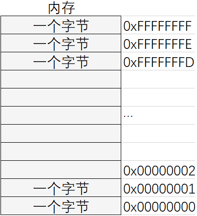
</center>

#### 指针与指针变量

地址直接指向了内存数据的位置，也就是地址指向了唯一确定的内存单元，故将地址形象化称为指针。

定义一个整型变量`a`，就是在内存中给它分配了4个字节的空间。由此也能看出定义变量的本质就是在内存中分配空间。变量`a`的第一个字节的地址为`0x0012ff40`，它就代表变量`a`的地址。

<center>
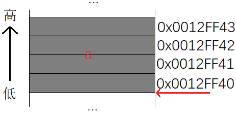
</center>

定义一个“指针”指向一个变量`a`。我们用`&a`把变量`a`的地址取出来，再放到变量`pa`中，由于变量`pa`中存的是地址，所以用类型`int*`去定义变量`pa`。

```c
int * pa = &a;
```

`pa`也是存在内存中的一个变量，其中存储的是地址编号。这样的变量叫**指针变量**。

1. 指针即地址，地址即指针。
2. 指针变量是存放地址的变量，其中的内容都被当作地址处理。

一般指针变量经常被人们简称为指针，我们要去从语境中区分他人说的是指针还是指针变量。

#### 指针的大小

> 一个内存单元有多大？地址是如何进行编号的？

32位机器，有32根地址线，每一个地址线在寻址时产生的电信号转化为数字信号。

32根地址线有 $2^{32}$ 种二进制序列，即从32个全0到32个全1。

```
00000000 00000000 00000000 00000000
11111111 11111111 11111111 11111111
```

指针变量用来存储地址，一个地址32个比特位即4个字节。所以**无论是什么类型的指针变量的大小都是4个字节**。

32位指针4个字节，64位指针8个字节。

### 指针的类型

 ```c
 int a = 10;
 int * pa = &a;
 ```

- `*` 代表`pa`是指针
- `int` 代表`pa`所指向的变量类型为`int`

任何类型的指针大小都是4个字节。指针类型的作用体现在两个方面：一是指针解引用，二是指针加减整数。

#### 指针解引用

 ```c
 int a = 0x11223344;
 int* pa = &a;
 *pa = 0;
 ```

> 创建变量`a`，用指针`pa`指向它，再对`pa`解引用把`a`置为0，从内存中可以看到：
>
> <center>
> 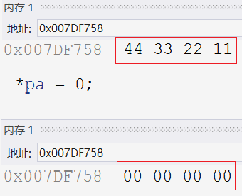
> </center>
>
> 把`int* pa`改成`char* pa`，就可以看到`char*`指针只修改了1个字节。
>
> <center>
> 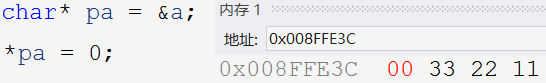
> </center>

所以**指针的类型决定了解引用时能够访问的字节数**。

#### 指针 ± 整数

用不同类型的指针指向同一个变量，对其`+1`。如：

<center>
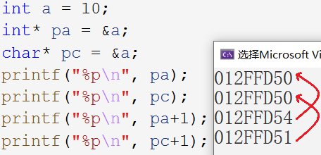
</center>

可以看到`int*`指针+1向后跳过了4个字节，`char*`指针+1向后跳过了1个字节。

所以**指针的类型决定了指针±整数时能跳过几个字节**（步长）。

#### 总结

指针类型决定了：

1. 指针解引用操作时能够访问的字节（内存大小）。
2. 指针`±`整数时能跳过几个字节（步长）。

这样的话，用不同类型的指针可以跳过不同的字节，继而更细致的访问。如：

```c
int arr[10] = { 0 };
//1.
int* pa = arr;
//2.
char * pa = arr;
for (int i = 0; i < 10; i++)
{
    *(pa + i) = 1;
}
```

两种不同的指针，带来不同的效果，如图所示：

<center>
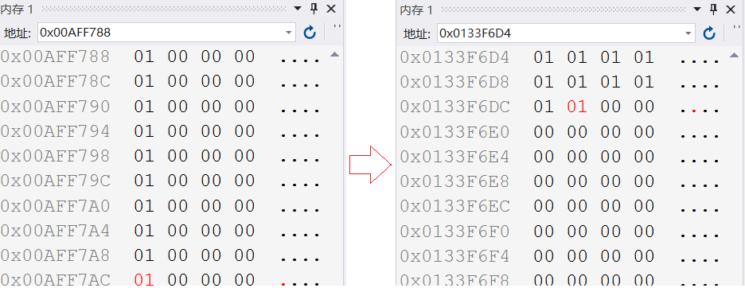
</center>

> 第一种是按整型访问数组，第二个是按字符访问。如：

<center>
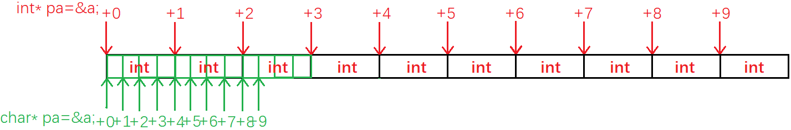
</center>

### 野指针

#### 野指针的定义

指向不明确的位置（随机的，不正确的，无明确限制的）的指针是野指针，可能造成越界访问。

#### 野指针的成因

1. **指针未初始化**

```c
int* p; //未初始化
*p = 20;
```

2. **指针越界访问**

```c
//例1
int arr[10] = { 0 };
int* p = arr;
for (int i = 0; i <= 10; i++) //越界访问
{
    *(p + i) = i;
}
//例2
int* test() {
	int a = 10;
	return &a;
}
int main() {
	int* p = test();
	printf("%d\n", *p); //野指针越界访问
	return 0;
}
```

a是test函数中定义的，出了作用域就会被销毁，所以*p这里就属于越界访问。

> 但执行程序能发现结果是10，这是为什么呢？
>
> 原因是a所占空间回收后系统未销毁，编译器对其作一次保留。且传参先行于调用，调用printf之前*p就已经替换为10。

```c
int* p = test();
printf("hehe\n");
printf("%d\n", *p);
```

我们稍作修改，在打印*p的前面再调用一次printf函数。这次调用，使得原来分配给a的空间被覆盖，分配给了`printf`函数。

```c
int* p = test();
*p = 20;//访问非法内存
```

如果把打印改为赋值`*p = 20`的话，编译器就直接检测出这块空间是非法内存，就会直接报错。

3. **指针指向空间已释放**

指针指向原先占有但已被释放的内存空间，也是一件非常危险的事情。动态开辟时也会将指针`free`掉，也是防止其成为野指针。

#### 如何规避野指针

1. **明确指针初始化，确定指向**

```c
int* p = &a;
int* p =NULL;//不知道该指向何处时，置为空NULL
```

2. **谨防指针越界**

3. **指针指向空间释后，立即置空**

4. **避免函数返回局部变量地址**

```c
void test(int x) {
	return &x //err调用结束后形参已经销毁，返回地址无意义
}
```

5. **检查指针有效性**

空指针不可解引用。

  ```c
  if(p != NULL) {
      *p=20;//检验不为空指针，再使用
  }
  ```

### 指针运算

指针加减整数还是指针，就像日期加天数还是日期。指针减指针为偏移量，就像日期减日期为天数。指针加指针是没有意义的。

> 指针解引用和指针加减整数上文已讲。

#### 指针-指针

```c
int arr[] = { 1,2,3,4,5,6,7,8,9,10 };
printf("%d\n", &arr[9] - &arr[0]); //9
```

语法规定**指针`-`指针，得到的是两地址之间的元素个数差**（下标相减）。也可以理解为总字节长度除以类型长度。

#### 指针关系运算

指针也是地址、是编号、是数字，就可进行大小比较。**指针的关系运算就是比较大小**。

```c
for( vp = &values[N - 1]; vp >= &values[0]; vp--) {
    *vp = 0;
}
// 指针最后指向values[0]前面的空间，再判断已不满足条件，就退出循环。
```

C语言标准规定：允许指针与末尾元素之后的位置比较，但不允许与首元素之前的位置进行比较。如图：

<center>
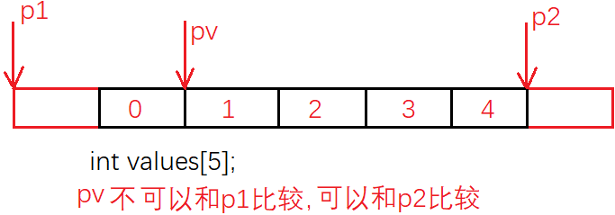
</center>

原因是编译器可能会在数组前的位置存储和数组有关的信息，如数组元素个数等。这样可能会影响到程序的运行。

### 指针和数组

- 数组是相同类型元素的集合，其元素存放在连续空间中。数组大小取决于元素类型和个数。
- 指针存储地址，是一个变量。大小固定为4或8个字节。

```c
int arr[10] = { 0 };
printf("%p\n", arr);      //0x0012ff40
printf("%p\n", &arr[0]);  //0x0012ff40
```

由此可得：**数组名就是数组首元素的地址**。`sizeof(数组名)`和`&数组名`代表整个数组，除此以外，数组名都代表首元素地址。

```c
int arr[10] = { 1,2,3,4,5,6,7,8,9,10 };
int* p = arr;
for (int i = 0; i < sz; i++) {
    printf("&arr[%d] = %p <===> p+%d = %p\n", i, &arr[i], i, p + i);
}
```

<center>
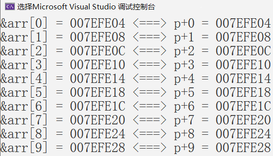
</center>

**`arr+i`其实就是`arr[i]`的地址**，二者本质上是一回事。

### 二级指针

#### 多级指针的定义

二级指针用来存放一级指针的地址，通过二级指针可以访问到一级指针。

<center>
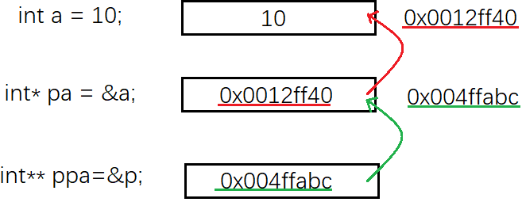
</center>

> 1. 首先创建变量`a`，类型`int`，地址`0x0012ff40`。
> 2. 然后创建`pa`，存`&a`，类型一级指针`int*`，地址`0x004ffabc`。
> 3. 最后创建`ppa`，存`&pa`，类型二级指针`int**`。

<center>
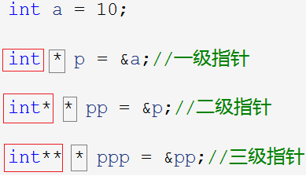
</center>

灰框`*`代表变量是一个指针变量。

- 一级指针`p`前的`int`表示指向的对象是`int`型的。
- 二级指针`pp`前的`int*`表示`pp`指向的对象是`int*`型的。
- 三级指针`ppp`前的`int**`表示`ppp`指向的对象是`int**`型的。

#### 多级指针的使用

```c
*p = 1;
* *pp = 2;
* * *ppp = 3;
```

- 对一级指针`p`解引用`*p`，找到`a`。
- 对二级指针`pp`解引用`*pp`，找到`p`，再解引用`**pp`，找到`a`。
- 对三级指针`ppp`解引用`*ppp`找到`pp`，再解引用`**ppp`，找到`p`，再解一次引用`***ppp`，找到`a`。

> 所以可以看出，有多少级指针，就要解多少次引用。

### 指针数组

```c
int arr[10] = {0}; //整型数组 - 存放整型变量的数组
char ch[10] = {'0'}; //字符数组 - 存放字符变量的数组
int* parr[10]; //整型指针数组
char* pch[5]; //字符型指针数组
```

**指针数组就是存放指针变量的数组**。

整型指针数组，每个元素都是整型变量的地址，字符型指针数组，每个元素都是字符型变量的地址。指针数组的大小，仅取决于数组元素个数。

<center>
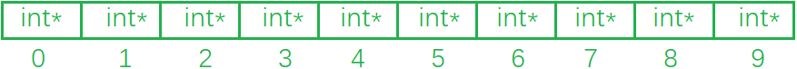
</center>
