## 指针

> 这次的指针（Pointer）不是全部内容，因为后面的进阶部分还会更加深入。

### 1. 指针的定义

了解指针必须先理解内存的概念，因为指针指向的就是一个个的内存单元。

#### 1.1 内存划分

内存是一块很大的空间，由一个个小的的内存单元组成，每一个内存单元占一字节。每个内存单元对应绑定着一个地址也就是内存单元的编号，像是身份证号一样，通过地址我们就可以唯一确定地找到一块内存单元。如：

#### 1.2 指针与指针变量

地址直接指向了存储在内存的数据的位置。由于能通过地址找到所标识的变量，也就是地址指向了唯一确定的内存单元，故将地址形象化称为指针。

定义一个整型变量`a`，就是在内存中给它分配了4个字节的空间。由此我们也能看出定义变量的本质就是在内存中分配空间。变量`a`的第一个字节的地址为`0x0012ff40`，它就代表变量`a`的地址。

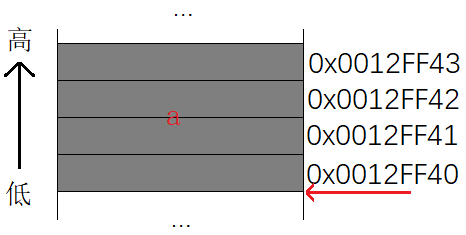

定义一个“指针”指向一个变量`a`。我们用`&a`把变量`a`的地址取出来，再放到变量`pa`中，由于变量`pa`中存的是地址，所以用类型`int*`去定义变量`pa`。

~~~c
int * pa = &a;
~~~

这样的变量`pa`也是真实存在于内存中的一个变量，其中存储的是地址编号。这样的变量叫**指针变量**。

1. 指针即地址，地址即指针。
2. 指针变量是存放地址的变量，其中的内容都被当作地址处理。

一般指针变量经常被人们简称为指针，我们要去从语境中区分他人说的是指针还是指针变量。

#### 1.3 指针的大小

> 一个内存单元有多大？地址是如何进行编号的？

首先我们分析一下，内存单元的大小为什么是一个字节。

对于32位机器，即32根地址线，每一个地址线在寻址时产生的电信号（正电/负电）转化为数字信号 ，正点就是1，负电就是0。更通俗来说，通电即为1，没通电就是0。

那么32根地址线有多少种01组合呢，高中的排列知识就可以说明共有 $2^{32}$ 种01序列。即从32个全0到32个全1。

> 00000000 00000000 00000000 00000000
>
> 00000000 00000000 00000000 00000001
>
> … …
>
> 11111111 11111111 11111111 11111110
>
> 11111111 11111111 11111111 11111111

当然64位机器，就有 $2^{64}$ 种排列组合。既然我们32位机器上，有 $2^{32}$ 种排列组合。

> 每一个二进制序列就是一个内存单元的编号，那么就有 $2^{32}$ 个内存单元可供使用，转化为十进制就是 $4,294,967,296$。如果每个内存单元是1bit 大小的话，那么除以8就有 $536,870,912$ 个byte，就有 $524,288$ 个kb，再除以1024就是我们熟悉的 $512$ 个MB，约含半个GB。这样的话一个`char`类型的变量就需要8个地址，是不是太浪费了？假设每个内存单元是1个byte的话，转化到最后正好是4个GB。这就正好了，最早期的时候只有1个或者2个GB。

指针变量用来存储地址，一个地址就是32个比特位，那么正好需要4个字节。所以无论是什么类型，**指针变量的大小都是4个字节**。当然，32位机器指针的大小为4个字节，64位机器下指针大小为8个字节。

### 2. 指针的类型

 ~~~c
 int a = 10;
 int * pa = &a;
 ~~~

- `*` 代表`pa`是指针
- `int` 代表`pa`所指向的变量类型为`int `

变量有不同的类型，很明显指针变量也应该有不同的类型。可是依据前面的推导，不管什么类型的指针变量，32位平台下大小都是4个字节，那指针的类型有什么作用呢？体现在两个方面，一是指针解引用，二是指针加减整数。

#### 2.1 指针解引用方面

 ~~~c
 int a = 0x11223344;
 int* pa = &a;
 *pa = 0;
 ~~~

我们先创建一个变量`a`，并用指针变量`pa`指向它，然后再对`pa`解引用把`a`置为0，我们可以从内存中看到：

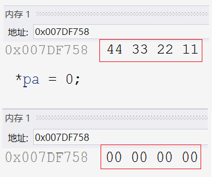

这个结果大家都能猜到，那么接下来我们对指针变量的类型稍作修改，把`int* pa`改成`char* pa`。

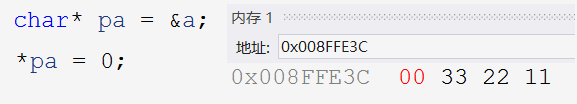

这样的话，区别就有了，`int*` 的指针访问并修改了4个字节的内容，而`char*` 的指针只修改了1个字节的内容。所以指针解引用操作时能够访问的字节（内存大小）。

#### 2.2 指针 ± 整数方面

现在我们再用不同类型的指针分别指向同一个变量，对其`+1`。如：

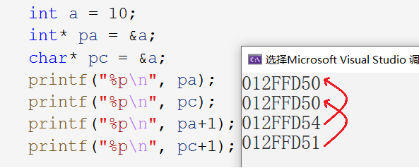

可以看到`int*`型的指针+1向后跳过了4个字节，`char*`型的指针+1向后跳过了1个字节。所以指针`±`整数时能跳过几个字节（步长）。

#### 2.3 总结

指针类型决定了：

1. 指针解引用操作时能够访问的字节（内存大小）。
2. 指针`±`整数时能跳过几个字节（步长）。

这样的话，我们用不同类型的指针，就可以实现跳过不同的字节，继而更细致的访问变量内容。如：

~~~c
int arr[10] = { 0 };
//1.
int* pa = arr;
//2.
char * pa = arr;
for (int i = 0; i < 10; i++)
{
    *(pa + i) = 1;
}
~~~

两种不同的指针，带来不同的效果，如图所示：

> 第一种是一个整型一个整型访问数组元素，第二个是一个字符一个字符地访问数组。如：

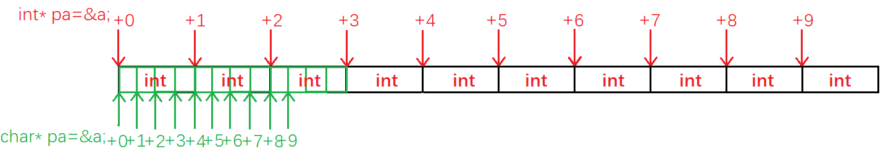

### 3 野指针

#### 3.1 野指针的定义

指向不明确的位置（随机的，不正确的，无明确限制的）的指针是野指针。不正确的位置就是指向了没有分配的内存空间，造成越界访问。

#### 3.2 野指针的成因

1. **指针未初始化**

~~~c
int* p; //未初始化
*p = 20;
~~~

2. **指针越界访问**

~~~c
int arr[10] = { 0 };
int* p = arr;
for (int i = 0; i <= 10; i++) //越界访问
{
    *(p + i) = i;
}
~~~

> 越界勉强不报错，但不能越界访问\^_^。

**Example**

~~~c
int* test()
{
	int a = 10;
	return &a;
}
int main()
{
	int* p = test();
	printf("%d\n", *p); //野指针越界访问
	return 0;
}
~~~

这里的`a`是`test`函数中定义的，出了作用域就会被销毁，所以我们这里打印`*p`就属于越界访问。

但我们这执行程序仍能发现结果是10，这是为什么呢？

原因是`a`变量所占的空间回收后操作系统还未将其销毁，编译器对其作一次保留。而且传参先行于调用，所以再调用`printf`函数之前就`*p`就已经替换为`10`。

我们稍作修改，在打印`*p`的前面再调用一次`printf`函数，如：
~~~c
int* test()
{
	int a = 10;
	return &a;
}
int main()
{
	int* p = test();
	printf("hehe\n");
	printf("%d\n", *p);
	return 0;
}
~~~

这次调用`printf`函数，使得原来分配给a的空间被覆盖，又分配给了`printf`函数。栈区的使用习惯就是压栈弹栈（如果不了解的话可以去看看栈区空间的开辟和销毁）。

那如果我们把打印`printf("%d\n", *p);`改为赋值语句`*p = 20;`的话，如：

~~~c
int* test()
{
    int a = 10;
    return &a;
}
int main()
{
    int* p = test();
    *p = 20;//访问非法内存
    return 0;
}
~~~

编译器就直接检测出这块空间是非法内存，就会直接报错。

3. **指针指向空间已释放**

从上面的例子也可以看出，指针`p`指向`test`函数原先占有的已被释放的内存空间，这也是一件非常危险的事情，必然会成为野指针。动态内存开辟的地方也会将指向动态开辟的内存的指针`free`掉，这也是防止其成为野指针。

#### 3.3 如何规避野指针

1. **明确指针初始化，确定指向**

~~~c
int* p = &a;
int* p =NULL;//不知道该指向何处时，置为空NULL
~~~

2. **谨防指针越界**

3. **指针指向空间释后，立即置为`NULL`**

4. **避免函数返回局部变量地址**

~~~c
void test(int x)
{
return &x //err调用结束后形参已经销毁，返回地址无意义
}
~~~

5. **检查指针有效性**

空指针不可解引用。

  ~~~c
  if(p != NULL)
  {
      *p=20;//检验不为空指针，再使用
  }
  ~~~

  > 或者直接用`assert`断言函数，`assert(p)`判断指针`p`是否为空指针，如有误返回错误信息。

### 4 指针运算

> 当然指针的解引用操作也算是指针的运算，但我们这里仅考虑一下三类，毕竟指针解引用是基本运算。

指针加减整数所得还是指针，就像日期加天数后还是日期。而指针减指针所得为元素个数，就像日期减日期为天数，从这个例子也可以看出来指针加指针是没有意义的。

#### 4.1 指针 ± 整数

~~~c
float values[N_VALUE];
float* vp = values;
for (vp = &values[0]; vp < &values[N_VALUE];)
{
    *vp++=0;
}
~~~

上述代码，依靠指向数组的指针循环遍历置零。

- 循环体内，`vp`先`++`后`*`，尽管`++`的优先级比`*`要高，但是后置++是先使用再++。

> 所以仿佛是对指针先解引用再`++`的。

- `float`类型指针的加一，跳过一个`float`类型的长度，故跳到下一个元素。

> 不论指针是什么类型，指针`++`，都是跳过一个类型的长度。

- 当`vp`指向数组最后一个元素其后的地址，不满足条件，结束循环。

> 该地址虽不属于数组，但仅是用所判断大小的条件(地址有高低)，没有访问该地址的内容，所以不算越界访问。

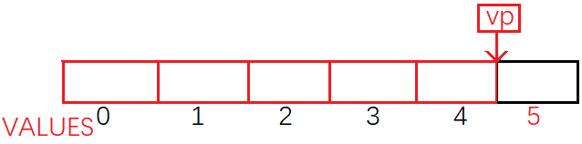

本例子涉及到了两个指针的运算：指针加减整数，也就是指针`++`。指针的关系运算，指针相互比大小作判断条件。指针加整数即指针向后跳整数个类型大小的字节，再来看看指针减整数。

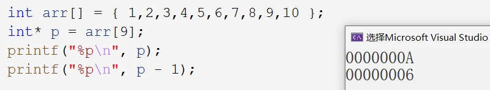

如图所示，指针`p-1`就是指针`p`向前跳一个类型的大小。**指针加减整数即指针向后或向前跳过整数个类型大小的字节**。

#### 4.2 指针`-`指针

> 指针可以减去指针，代表两个地址之间的”差距“。那可以用指针加上指针吗？相当于两个地址相加是没有意义的。

~~~c
int arr[] = { 1,2,3,4,5,6,7,8,9,10 };
printf("%d\n", &arr[9] - &arr[0]);
~~~

这题答案是什么？是36还是9？答案是9，语法规定指针`-`指针，得到的是两地址之间的元素个数（下标相减）。当然两地址间的元素个数，也可以理解为所占字节大小除以类型大小。

那要是在不同的数组中运算呢？如：

~~~c
int arr[] = { 1,2,3,4,5,6,7,8,9,10 };
char ch[] = { '1','2','3' };
printf("%d\n", &arr[9] - &ch[0]);
~~~

编译器不会报错，因为没有语法错误。但是所得到的数字即元素的个数，该元素是`int`类型还是`char`类型的呢？所以这数字根本就是没有意义的。

所以我们得到指针相减运算的前提：是两指针指向同一块空间，如同一个数组。

- **指针`-`指针的前提：是两指针指向同一块空间。**

- **指针`-`指针，得到的数字的绝对值是两地址之间的元素个数。**

应用：实现`strlen`函数

~~~c
int my_strlen(const char* s)
{
    char* begin = s;      //标记开头
    while(*s++);          //s先++再判断是否为\0
    return s - begin - 1; //指针相减
}
~~~

#### 4.3 指针关系运算

> 将指针加减整数代码例子拿过来稍作修改。

~~~c
//1.
for(vp = &values[N_VALUE];vp > &values[0];) {
    *--vp = 0;
}
~~~

把数组后面的空间，也想象成数组内容根据数组下标拿取是可以的，毕竟数组在内存中是连续存放的。从后往前遍历，先`--`再解引用，就不会造成数组越界访问。我们再稍作修改：

~~~c
//2.
for(vp = &values[N_VALUE-1];vp >= &values[0];vp--) {
    *vp = 0;
}
~~~

最后一次遍历时，指针指向`values[0]`前面的一块地址，当然再回来判断时不满足条件，就退出循环。

尽量选择第一种方法，因为C语言标准规定：允许指向数组的指针，与指向数组最后元素之后的内存位置进行比较，但不允许与首元素之前的位置进行比较。如图：

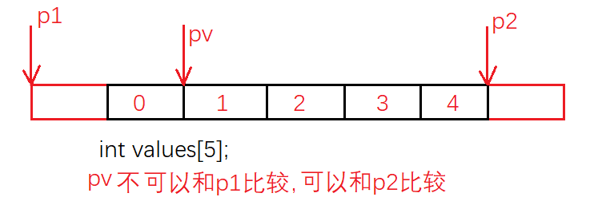

原因是编译器可能会在数组前的位置存储和数组有关的信息，如数组元素个数等。这样可能会影响到程序的运行。

指针也是地址，地址是编号是数字，就可以进行**比较大小**。**指针的关系运算就是比较大小**。

### 5 指针和数组

> 指针和数组之间有什么区别，有什么联系吗？

- 数组是一个相同类型元素的集合，其中元素存放在连续的空间中。数组的大小取决于元素类型和元素个数。

- 指针存储地址，是一个变量。指针的大小固定为4 (32bit) / 8 (64bit)。

~~~c
int arr[10] = { 0 };
printf("%p\n", arr);      //0x0012ff40
printf("%p\n", &arr[0]);  //0x0012ff40
~~~

由此可得：**数组名就是数组首元素的地址**。

> ps：以下两种情况数组名代表整个数组，除该两种情况外，数组名都代表首元素地址。
>
> 1. `sizeof(arr)`
> 2. `&arr`

数组名可以作为地址，存放在指针变量中，我们就可以通过指针访问数组。

> 事实上，数组作函数形参时，都是降级优化为指针的，一整个数组是传不过去的。不过这也是后话了。

~~~c
int arr[10] = { 1,2,3,4,5,6,7,8,9,10 };
int* p = arr;
for (int i = 0; i < sz; i++)
{
    printf("&arr[%d] = %p <===> p+%d = %p\n", i, &arr[i], i, p + i);
}
~~~

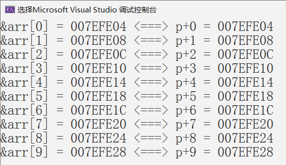

也就是说，**`p+i`其实就是数组`arr`下标为`i`的地址**，本质上二者就是一回事。

### 6. 二级指针

#### 6.1 多级指针的定义

顾名思义，二级指针就是用来存放一级指针的地址的，通过二级指针也可以访问到一级指针。

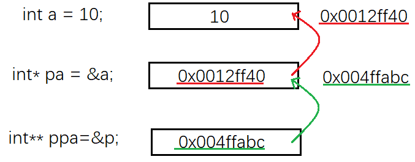

1. 首先创建了一个变量`a`，存了`10`，所以它的类型为`int `，变量的地址为`0x0012ff40`。
2. 然后取出a的地址，再创建了一个新的变量`pa`，并把`&a`存了进去，所以它的类型为`int*`（一级指针），变量的地址为`0x004ffabc`。
3. 最后又创建了一个新的变量`ppa`，把`&p`存了进去，所以它的类型为`int**`（二级指针）。

通过`ppa`里`p`的地址，可以找到`p`，通过`p`里`a`的地址，也可以找到`a`。

#### 6.2 类型中“*”的含义

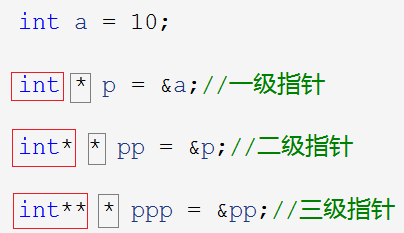

灰框中的`*`代表变量是一个指针变量。

- 一级指针`p`前面的`int`表示`p`指向的对象`a`是`int`型的。
- 二级指针`pp`前面的`int*`表示`pp`指向的对象`p`的类型是`int*`型的。
- 三级指针`ppp`前面的`int**`表示`ppp`指向的对象`pp`的类型是`int**`型的。

#### 6.3 多级指针的使用

~~~c
*p = 1;
* *pp = 2;
* * *ppp = 3;
~~~

如上述代码所示，我们一级一级分析。

- 对一级指针`p`解引用`*p`，找到`a`。
- 对二级指针`pp`解引用`*pp`，找到`p`，再解引用`**pp`，找到`a`。
- 对三级指针`ppp`解引用`*ppp`找到`pp`，再解引用`**ppp`，找到`p`，再解一次引用`***ppp`，找到`a`。

所以可以看出，有多少级指针，就要解多少次引用。

### 7 指针数组

#### 7.1 指针数组的定义

在回答何为指针数组前，我们先来看何为整型数组，何为字符数组。

~~~c
int arr[10] = {0};
//整型数组 - 存放整型变量的数组
char ch[10] = {'0'};
//字符数组 - 存放字符变量的数组
~~~

通过类比整型数组和字符数组，可以得到**指针数组就是存放指针变量的数组**。

> 数组名前的类型`int`和`char`表示，数组元素的类型是`int`或者`char`。所以指针数组名前的类型名就是`int*`或者是`char*`。如：

~~~c
//整型指针数组
int* parr[10];
//字符型指针数组
char* pch[5];
~~~

对于整型指针数组，每个元素都是整型变量的地址，对于字符型指针数组，每个元素都是字符型变量的地址。由此也可以看出，指针数组的大小，仅取决于数组元素个数。

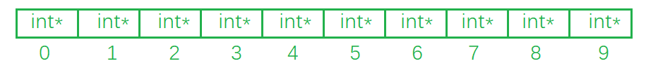

#### 7.2 指针数组的使用

~~~c
int arr[] = { 10,20,30 };
int* parr[5] = {NULL};
//输入
for (int i = 0; i < 3; i++)
{
    parr[i] = &arr[i];
}
//输出1.
for (int i = 0; i < 3 ; i++)
{
    printf("%d ", *parr[i]);
}
//输出2.
for (int i  = 0; i < 3; i++)
{
    printf("%d ", **(parr+i));
}
~~~

1. 切记要么初始化要么指定大小。指针数组记得内容初始化为空指针。
2. 指针数组遍历数组元素打印时，记得要解引用。用数组名`+i`遍历数组元素时，就要解两层引用。

> 目前对应指针数组就理解到这个层次，后续还会学习指针的进阶。
