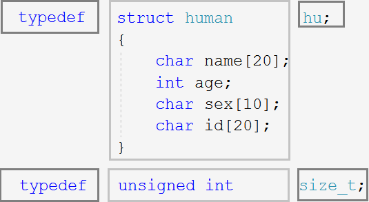

# 结构体

> 后面的自定义类型会更加深入的讲这部分内容。

`char`,`int`,`float`,`double`等，都只能描述单一变量。所以C语言就发明了结构体用于描述复杂对象。

### 结构体的定义

#### 结构体的语法

结构体是值的集合，这些值被称为成员变量。结构体的每个成员可以具有不同类型。

```c
struct tag //结构体名称
{
    member-list;//成员列表

}variable-list;//变量列表（全局变量）
```

在结构体声明的`{}`后面创建的变量是全局变量，如果我们只想创建局部变量，就在`mian`函数里创建。

```c
struct tag // 这个叫结构体类型名，或者叫结构体类型
struct S s = { "abc", "man", 3.1415 }; // 这个用结构体定义的变量，叫结构体变量。
```

#### 结构体的声明

结构体用于描述复杂对象，必然有多个成员变量。结构体成员的类型可以是任意类型，也可是其他结构体。

```c
struct book
{
	char name[20];//书名
	char author[15];//作者
	float price;//价格
}b1,b2; //全局变量

struct point
{
	int x;
	int y;
};
```

当然也可以把结构体类型声明在函数内部，此时仅函数内部可使用。

```c
int main() {
	struct book {
		char name[20];
		char author[15];
		float price;
	}b1, b2;
	struct book b;
}
```

还可以使用`typedef`对类型重命名，使用`typedef`就不能在声明后面直接创建全局变量。

```c
typedef struct human {
	char name[20];
	int age;
	char sex[10];
	char id[20];
}human;

struct human man; //1.
human man; //2.
```



只是将`struct human`取名叫`human`。本质都是类型是不占用空间的，只有变量才会占用空间。

### 结构体的使用

```c
struct book {
    char name[20];
    char author[15];
    float price;
}b1, b2; // 全局变量仅定义
struct book b3 = { 0 }; // 全局变量定义和初始化
```

```c
int main() {
	struct human man1 = { "张三",20,"女装大佬","20203100" }; // 局部变量定义和初始化
	point p1 = { 1,2 };
	return 0;
}
```

```c
struct S {
	int a;
	char c;
	double d;
};
struct T {
	struct S s;
	char name[20];
	int num;
};
int main() {
	struct T t = { {10, 'x', 1.00}, "yourfriendyo", 21 }; // 嵌套定义和初始化
}
```

### 结构体成员访问

#### .操作符

成员通过操作符`.`进行访问。`.`操作符具有两个操作数，左边是结构体变量名，右边是结构体成员名。

```c
int main() {
	struct T t = { {10, 'x', 1.00}, "yyx", 21 };
	printf("%d %c %lf %s %d\n", t.s.a, t.s.c, t.s.d, t.name, t.num);
}
```

> `s`是`t`的成员变量，`a`,`c`,`d`分别是`s`的成员变量，所以是`t.s.a`，`t.s.c`，`t.s.d`。

#### ->和*操作符

有时须通过结构体的指针访问成员，就需要操作符`->`。

```c
struct T* pt = &t;
printf("%d %c %lf %s %d\n", (*pt).s.a, (*pt).s.c, (*pt).s.d, (*pt).name, (*pt).num);
printf("%d %c %lf %s %d\n",   pt->s.a,   pt->s.c,   pt->s.d,   pt->name,   pt->num);
```

1. 第一种是对指针解引用获得结构体变量，再通过`.`访问。
2. 第二种`->`是专门在访问结构体时使用指针的方法，更高效。

### 结构体作参数

```c
struct S {
	char arr[100];
	int num;
	float f;
};
void Print(struct S ss) {
	printf("%c %c %c %d %f\n", ss.arr[0], ss.arr[1], ss.arr[2], ss.num, ss.f);
}
void Print2(struct S* ps) {
	printf("%c %c %c %d %f\n", ps->arr[0], ps->arr[1], ps->arr[2], ps->num, ps->f);
}
int main() {
	struct S s = { {'1','2','3','4'}, 22, 3.14};
	Print1(s);
	Print2(&s);
}
```

结构体作为函数参数，此时传址调用和传址调用就会有很大区别。

- 传值调用，`s`本身占用空间很大，又创建一份一样大的形参拷贝，时间空间上浪费非常严重。
- 传址调用，无论`s`占用空间有多大，都只传4个字节的地址。

故结构体传参通常使用传址调用。
