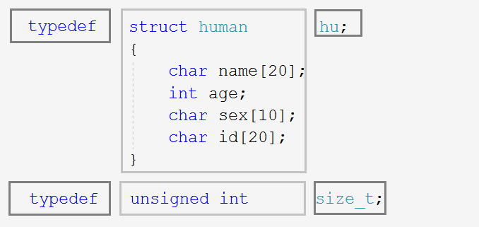

## 结构体

> 当然本次结构体仍不会讲的特别深入，在后面的自定义类型进阶会更加深入的讲到这部分内容。

我们所学过的类型如：`char`,`int`,`float`,`double`等，都只能描述单一变量。但是结构体，顾名思义，是多个变量的集合，其中包含多个单一变量。所以C语言就发明了结构体用于用来描述复杂对象，如：书，人等具有多个特征的变量。

### 1. 结构体的定义

**结构（体）是一些值的集合**，这些值被称为<u>成员变量</u>。结构的每个成员变量可以具有<u>不同类型</u>。

#### 1.1 结构体的语法结构

~~~c
struct tag//结构体名称
{
    member-list;//成员列表

}variable-list;//变量列表（全局变量）
~~~

在结构体声明的`{}`后面创建的变量是全局变量，如果我们只想创建局部变量，就在`mian`函数里创建。几个名词需要我们额外注意区分一下。

1. 结构体（类型）名

~~~c
struct tag
~~~

这个叫结构体类型名，或者叫结构体类型，使用上相当于`int`,`char`等类型，故叫类型名。

2. 结构体成员变量

~~~c
struct S {
	char a[20];
	char b[5];
	float c;
};
~~~

因为`{}`内部定义的叫成员变量，如例子中`a`,`b`,`c`这样的。定义结构体成员变量也可以顺带初始化。

3. 结构体变量名

~~~c
struct S s = { "abc", "man", 3.1415 };
~~~

在声明好结构体后，用结构体去定义的变量，叫结构体变量，不能和成员变量混淆了。上面的`s`就是用`S`创建的变量。定义结构体变量和声明结构体，两种说法是两件完全不同的事情。

#### 1.2 结构体的创建

结构体用于描述复杂对象的多个属性，必然具有多个成员变量。结构体成员的类型可以是常量，数组，指针，也可以是其他结构体。结构体类型创建如下列示例：

~~~c
struct book//书
{
	char name[20];//书名
	char author[15];//作者
	float price;//价格
}b1,b2;//全局变量

struct point//坐标
{
	int x;
	int y;
};

int main()
{
	struct book b;//局部变量
	return 0;
}
~~~

当然如果我们把结构体类型声明在`main`函数内部也可以。但在团队合作中更多是团队一起使用，所以定义在外面更好。

~~~c
int main() {
	struct book {
		char name[20];
		char author[15];
		float price;
	}b1, b2;
	struct book b;

	return 0;
}
~~~

还有一种方法是使用`typedef`对类型重定义，如：

~~~c
typedef struct human
{
	char name[20];
	int age;
	char sex[10];
	char id[20];
}hu;
int main() {
    //1.
	struct human man;
	//2.
    hu man;
	return 0;
}
~~~

这样该结构体就有了两种创建变量的方式`struct human man`和`hu man`都行。可以类比`tpyedef unsigned int size_t`，如下图：

注意，只是将`struct human`重新取个名字叫`hu`。本质上还是类型是不占用空间的，只有创建变量时才会开辟空间。当然使用`typedef`就不能在声明结构体的后面直接创建全局变量了。

### 2. 结构体变量的定义

可以直接在结构体声明后面定义，甚至在后面可以初始化。

~~~c
struct book
{
    char name[20];
    char author[15];
    float price;
}b1, b2;
struct book b3 = { 0 };
struct point {
	int x;
	int y;
};
struct point p1 = { x, y };
~~~

也可以在`main`函数中定义及初始化。

~~~c
typedef struct human{
	char name[20];
	int age;
	char sex[10];
	char id[20];
}hu;
int main() {
	struct human man1 = { "张三",20,"女装大佬","20203100" };
	point p1 = { 1,2 };
	return 0;
}
~~~

甚至说嵌套定义和初始化。

~~~c
struct S {
	int a;
	char c;
	double d;
};
struct T {
	struct S s;
	char name[20];
	int num;
};
int main() {
	struct T t = { {10, 'x', 1.00}, "yourfriendyo", 21 };
	return 0;
}
~~~

在结构体`T`中使用结构体`S`定义了`T`的成员变量`s`。在初始化的时候同样需要注意的是，`s`也需要使用`{}`进行初始化。

### 3. 结构体成员的访问

#### 3.1 `.`操作符

结构体成员是通过操作符`.`进行访问的，`.`操作符具有两个操作数。左边是结构体变量名，右边是结构体成员名。

~~~c
//就用上面举得嵌套访问的例子
int main() {
	struct T t = { {10, 'x', 1.00}, "yourfriendyo", 21 };
	printf("%d %c %lf %s %d\n", t.s.a, t.s.c, t.s.d, t.name, t.num);

	return 0;
}
~~~

`s`是`t`的成员变量，`a`,`c`,`d`分别是`s`的成员变量，所以是`t.s.a`，`t.s.c`，`t.s.d` 。

#### 3.2 `->`和`*`操作符

当然有的时候有可能我们得到的是一个指向该结构体的指针。这时候我们就需要操作符`->`，同样也是两个操作数，如：

~~~c
struct T t = { {10, 'x', 1.00}, "yourfriendyo", 21 };
//1.
struct T* pt = &t;
printf("%d %c %lf %s %d\n", (*pt).s.a, (*pt).s.c, (*pt).s.d, (*pt).name, (*pt).num);
//2.
printf("%d %c %lf %s %d\n", pt->s.a, pt->s.c, pt->s.d, pt->name, pt->num);
//3.
struct S* ps = &(t.s);
printf("%d %c %lf %s %d\n", ps->a, ps->c, ps->d, pt->name, pt->num);
~~~

1. 第一种方法是我们不知道`->`，只能对指针解引用时想到的方法。
2. 第二种方法`->`是专门在访问结构体时使用指针的方法，更高效。
3. 第三种方法是更加简单粗暴的方法，我们越过了结构体变量`t`，直接创建指针指向`(t.s)`.

### 4. 结构体作参数

~~~c
struct S {
	char arr[100];
	int num;
	float f;
};
void Print(struct S ss) {
	printf("%c %c %c %d %f\n", ss.arr[0], ss.arr[1], ss.arr[2], ss.num, ss.f);
}
void Print2(struct S* ps) {
	printf("%c %c %c %d %f\n", ps->arr[0], ps->arr[1], ps->arr[2], ps->num, ps->f);
}
int main() {
	struct S s = { {'1','2','3','4'}, 22, 3.14};
	Print1(s);
	Print2(&s);
	return 0;
}
~~~

既然讨论到函数传参，就会有传址调用和传址调用的问题。

如上述代码，我们直接把`s`传过去，显然是传值调用，但`s`本身就占用了非常大的空间，然后又创建了一份一样大的形参临时拷贝，时间空间上浪费的问题非常严重。这样的话，很明显我们还是传址调用最好，无论`s`的占用有多大，我们只传了4个字节的地址。

所以**结构体传参通常使用传址调用**。
