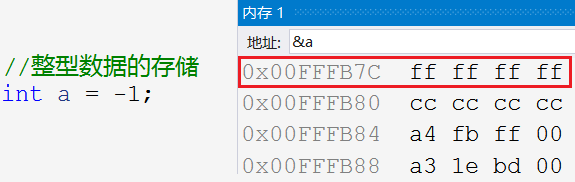
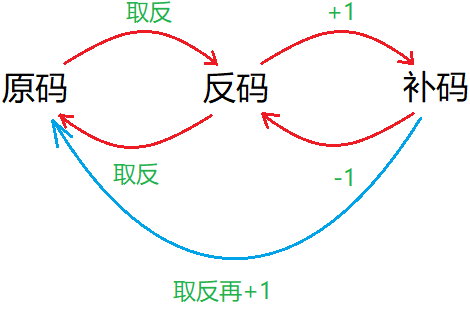
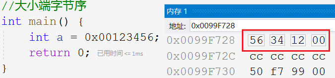
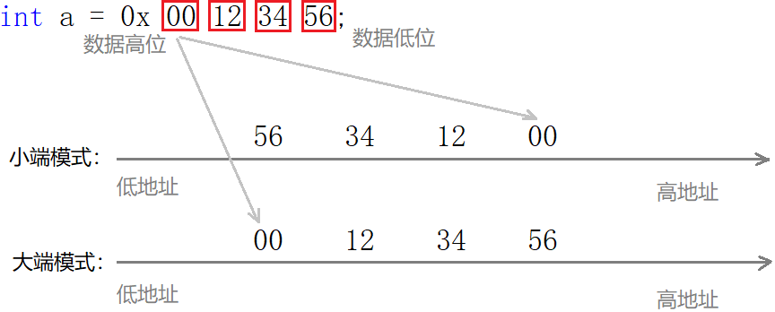
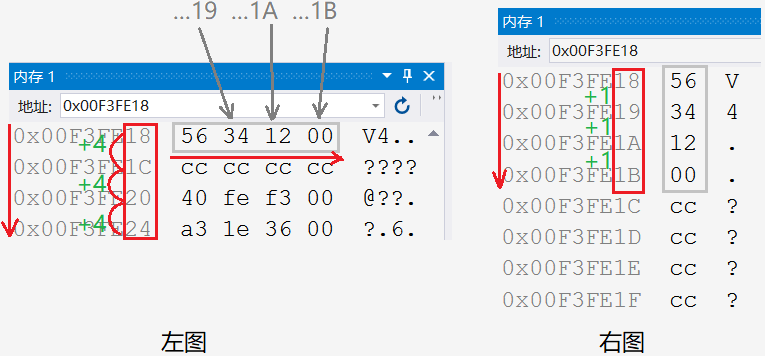
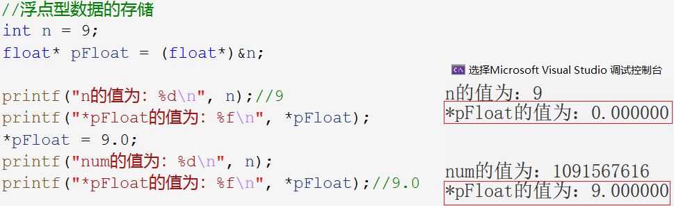
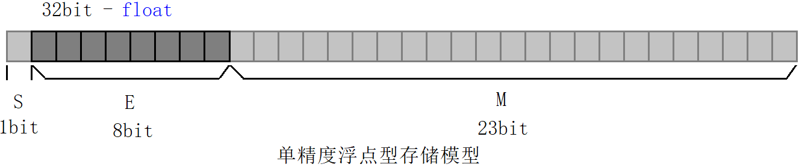
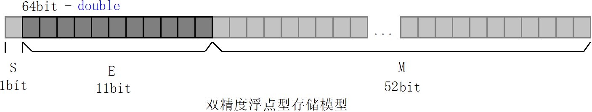

# 数据的存储

## 类型的分类

### 整型

```c
char
    signed char
    unsigned char
short
    signed short [int]
    unsigned short [int]
int
    signed int
    unsigned int
long
    signed long [int]
    unsigned long [int]
long long
    ...
```

### 浮点型

```c
float
double
```

### 构造类型

```c
数组类型：
    int[5]
    char[10]
    ...
结构体类型：
    struct type { v1; v2; };
    ...
枚举类型：
	enum type { v1, v2, ...};
	...
联合类型：
    union type { v1; v2; };
    ...
```

数组也是有类型的，去掉数组名`int[N]`就是数组类型。

```c
int arr[10] = {0};
printf("%d\n", sizeof(int));//4
printf("%d\n", sizeof(arr));//40
printf("%d\n", sizeof(int[10]));//40
```

### 指针类型

```c
int*
char**
float*
```

### 空类型

```c
void
void test(void) {}
void*
```

`void`表示空或无。通常用于函数的返回类型表示无返回类型，函数的参数表示不传参，`void*`指针类型也叫通用指针类型，可接收任意类型的指针变量。

## 类型的意义

| 意义                     | 解释                                           |
| ------------------------ | ---------------------------------------------- |
| 类型决定了开辟空间的大小 | 存的角度，变量使用的类型就代表分配多大的空间。 |
| 类型决定了看待数据的方式 | 取的角度，以什么样的方式去看待空间里的数据。   |

如`int a`和`unsigned int b`和`float c`，空间中都是32位二进制数据，编译器认为`a`空间中的是有符号整型，`b`空间中的是无符号整型，`c`空间中的是浮点型。

#### signed和unsigned

有符号和无符号的区别，在于内存中的二进制序列的最高位是符号位还是数值位。

如`char`和`unsigned char`都只有8个比特位。若这8个比特位全1，即`11111111`，对于`unsigned char`来说就是都是数值位，换成十进制就是255，对于`char`来说就只有后七位是数值位，换成十进制就是-1。


`char`的范围是$[-128,127]$（`10000000`代表$-128$），`unsigned char`的范围是$[0,255]$。

## 数据的存储

> 创建变量的实质是在内存上为其开辟一块空间，空间大小由变量类型决定。那么数据在内存中到底是如何存储的呢？

### 整数的存储



> 为什么`-1`存到内存中变成了`ffffffff`呢？接下来我们会系统的讲解这个问题。

#### 原反补

有符号数的存储涉及到原码、反码、补码的概念。

符号位：正数为0，负数为1。正数的原反补码相同，负数有如下转换规则：

- 原码：数值的二进制序列
- 反码：符号位不变，其他位按位取反
- 补码：反码$+1$

```c
int a = -1;
10000000 00000000 00000000 00000001 - 原码
11111111 11111111 11111111 11111110 - 反码
11111111 11111111 11111111 11111111 - 补码
ff ff ff ff
```

所以说，**内存中存放的是整数的补码**。

#### 补码的意义

为什么计算机中，数值统一用补码进行表示和存储呢？

1. **加法和减法可以统一处理**（CPU只有加法器）

假设使用原码进行运算减法，计算 $1-1$ 即 $1+(-1)$，只能得到错误结果$-2$。

```
 // 使用原码
 1+(-1)
 00000000 00000000 00000000 00000001 - 1  原码
 10000000 00000000 00000000 00000001 - -1 原码
 10000000 00000000 00000000 00000010 - -2

 // 使用补码
 1+(-1)
 00000000 00000000 00000000 00000001 - 1  补码
 11111111 11111111 11111111 11111111 - -1 补码
100000000 00000000 00000000 00000000 - 0  补码 - 发生截断
 00000000 00000000 00000000 00000000 - 0
```

> 二者补码相加后发现出现了第33位二进制位，当然就会发生截断，截断后全零，自然是0。使用补码进行计算可以统一加减法。

2. 使用补码运算：可以将符号位和数值位统一处理。

> 从刚刚的补码运算过程可以看出，符号位也被带入运算当中，当作数值位统一处理，二者不做区分。

3. 补码和原码相互转换时，运算逻辑相同，不需要额外的硬件电路。

> **补码符号位不变其他位按位取反再+1也会得到原码**。



#### 大小端字节序

> 为什么存在大小端之分呢？
>
> 内存以字节为单位，一个地址对应一个字节。很多长度都大于一个字节。因此必然存在多个字节的内容如何存放的问题，故衍生了大端字节序和小端字节序。



**以字节为单位，讨论计算机的存储顺序**，就是大小端字节序问题。

- 大端字节序：数据的低位存在内存的高地址处，高位存在低地址处。
- 小端字节序：数据的低位存在内存的低地址处，高位存在高地址处。



> 很明显，小端存储更合规矩，数据低位放低处，高位放高处。从数据发生截断和提升时来看，同样截出低地址内容，增加高地址内容。



很明显，对于`0x00123456`，最低数据位`56`在低地址处，最高数据位`00`在高地址处。可见VS采用小端存储。事实上，绝大多数编译器都是小端存储。

```c
// 判断当前编译器是大端存储还是小端存储。
int check_sys() {
	int a = 1;
	return a & 1;
}
int check_sys() {
	int a = 1;
	return *(char*)&a;
}
int main() {
	if (check_sys())
		printf("小端\n");
	else
		printf("大端\n");
	return 0;
}
```

#### 例1~7

在看例题之前，对于数据存和取的问题不够清楚的话，我们再强调一下。举个简单的例子：

```c
int main()
{
    unsigned int n = -10;
    printf("%d\n", n);
    printf("%u\n", n);
}
```

> 有人可能会问，无符号整型数据怎么能放负数呢？这说明你对整数的存储的概念不够清晰。
>
> - 存：首先往`n`里放的不是-10，放的是-10的二进制补码，32位二进制序列怎么会不能放呢？只不过对`n`来说，从无符号整型的角度看这是一个很大的数，它并不意味着-10而已。
> - 取：现在我们补码有了，对该补码如何解读，那是%d和%u的事情。也就是说，如果以%d的形式打印，就把该补码当作有符号数来看，反之%u的话，就当作无符号数。

##### 例题1

```c
1.
//输出什么？
#include <stdio.h>
int main()
{
  char a= -1;
  signed char b=-1;
  unsigned char c=-1;
  printf("a=%d,b=%d,c=%d",a,b,c);
  return 0;
}
```

答案：

```c
int main()
{
	char a = -1;
	//11111111 11111111 11111111 11111111 - -1的补码
	//11111111 - 截断存入a
	//11111111 11111111 11111111 11111111 - %d打印整型提升（负整数）
	//11111111 11111111 11111111 11111110 - -1 反码
	//10000000 00000000 00000000 00000001 - -1 原码

	signed char b = -1;
	//11111111 11111111 11111111 11111111
	//11111111
	//11111111 11111111 11111111 11111111
	//10000000 00000000 00000000 00000000
	//10000000 00000000 00000000 00000001 - -1

	unsigned char c = -1;
	//11111111 11111111 11111111 11111111 - -1的补码
	//11111111 - 截断存入
	//00000000 00000000 00000000 11111111 - 255 %d打印整型提升（正整数）

	printf("a=%d,b=%d,c=%d", a, b, c);//-1，-1，225
	return 0;
}
```

> 1. 存什么，如何存入-1？
>
> $-1$是怎么存入`a`,`b`,`c`的，**存的是**$-1$**的补码**，先把$-1$的补码写出来，三者都是`char`类型只有一个字节的空间，必然发生截断，只存了`11111111`。
>
> 2. 怎么看，如何整型提升？
>
> 类型为`signed char`的`a`,`b`认为是有符号数，`unsigned char`的`c`认为是无符号数。
>
> `%d`是打印有符号整型。`11111111`不够整型怎么办？重点：要整型提升，怎么整型提升？正数补0，负数补1。有符号数`a`,`b`，最高位都是1，则是负数。无符号数`c`，最高位虽是1，但认为是正数。**整型提升的区别导致二者数值的不同**。
>
> 3. 怎么用，二进制序列怎么用？
>
> 用`%d`的形式打印`a`,`b`,`c`，把三个二进制序列都当成有符号数来打印。

变题：

```c
#include <stdio.h>
int main()
{
  char a= -1;
  signed char b=-1;
  unsigned char c=-1;
  printf("a=%u,b=%u,c=%u",a,b,c);
  return 0;
}
```

> 无论以`%d`还是`%u`的形式打印，都要整型提升，整型提升只关心它是正数还是负数。（有无符号数，最高位是0还是1）
>
> 提升后我们如何看待得到的二进制位，怎么去打印，那就是`%u`的事情了，把二进制序列都当成无符号数。（%d还是%u）

答案：

```c
int main()
{
	char a = -1;
	//11111111 - 截断存入
	//11111111 11111111 11111111 11111111 - 整型提升并%u打印
	signed char b = -1;
	//11111111
	//11111111 11111111 11111111 11111111 - 整型提升并%u打印
	unsigned char c = -1;
	//11111111 - 截断存入
	//00000000 00000000 00000000 11111111 - 整型提升并%u打印

	printf("a=%u,b=%u,c=%u", a, b, c);//2^32-1 2^32-1 255
	return 0;
}
```

> 前者整型提升补1，最高位是1，使用%d还是%u对其有影响。后者整型提升补0，%d还是%u都当作正数所以无影响。

类型只能决定字节大小和有无符号数，而`%d`,`%u`决定了如何使用该数据。

##### 例题2

```c
2.
#include <stdio.h>
int main()
{
	char a = 128;
	printf("%u\n", a);
	return 0;
}
```

答案：

```c
int main()
{
	char a = -128;
	//10000000 00000000 00000000 10000000 - 原码
	//11111111 11111111 11111111 01111111 - 反码
	//11111111 11111111 11111111 10000000 - 补码

	//10000000 - 截断存入
	//11111111 11111111 11111111 10000000 - 整型提升并以无符号数打印

	printf("%u\n", a);//4,294,967,168
	return 0;
}
```

> 1. 写出`-128`的补码，变量`a`里存入截断后的结果`10000000`，%u打印整型要整型提升，负数高位补1。
> 2. 得到整型提升后的结果，用%u以无符号数的形式打印整型，即将该二进制序列当作无符号数，那自然原反补相同。

##### 例题3

```c
3.
#include <stdio.h>
int main()
{
	char a = 128;
	printf("%u\n", a);
	return 0;
}
```

答案：

```c
int main()
{
	char a = 128;
	//00000000 00000000 00000000 10000000 - 原码
	//01111111 11111111 11111111 01111111 - 反码
	//01111111 11111111 11111111 10000000 - 补码
	//10000000 - 截断后存入
	//11111111 11111111 11111111 10000000 - 整型提升并以无符号数打印

	printf("%u\n", a);//4,294,967,168
	return 0;
}
```

> 本题和例2一样，都是补码截断再存入，再整型提升并以无符号形式打印。
>
> 例2和例3唯一的不同就是一正一负，符号位不同，但当截断后存入，这个差别就消除了。

##### 例题4

```c
4.
int main()
{
    int i = -20;
	unsigned int j = 10;
	printf("%d\n", i+j);
	//按照补码的形式进行运算，最后格式化成为有符号整数
    return 0;
}
```

答案：

```c
int main()
{
	int i = -20;
	//10000000 00000000 00000000 00010100 - 原码
	//11111111 11111111 11111111 11101011 - 反码
	//11111111 11111111 11111111 11101100 - 补码
	unsigned int j = 10;
	//00000000 00000000 00000000 00001010 - 原反补

	//11111111 11111111 11111111 11101100 - i 补码
	//00000000 00000000 00000000 00001010 - j 补码
	//11111111 11111111 11111111 11110110 - i+j 补码
	//10000000 00000000 00000000 00001001
	//10000000 00000000 00000000 00001010 - i+j 原码

	printf("%d\n", i + j);//-10
	return 0;
}
```

> 想要得到`i+j`，就要先得到`i`和`j`的补码（前面已经说过整数运算是补码的运算），二者补码相加得到的当然是`i+j`的补码。可以看到`i+j`的补码符号位是1，而且我们要以%d的形式打印，那必然当作负数，再将补码转化为原码。

##### 例题5

```c
5.
int main()
{
	unsigned int i;
	for (i = 9; i >= 0; i--)
	{
		printf("%u\n", i);
	}
	return 0;
}
```

答案：

```c
#include <windows.h>
int main()
{
	unsigned int i;
	//00000000 00000000 00000000 00000000 - 0  原反补
	//11111111 11111111 11111111 11111111 - -1 补码
    //11111111 11111111 11111111 11111111 - 0+(-1)的补码

	for (i = 9; i >= 0; i--)
	{
		printf("%u\n", i);
		Sleep(100);
	}
	return 0;
}
```

> 问题出在当i=0时，i再`--`就是`0–1`也就是`0+(-1)`，该结果的补码是全1，又是无符号数，说明i又从最大数开始循环了。i是不可能小于0的，所以这是个死循环。

##### 例题6

```c
6.
int main()
{
	char a[1000];
	int i;
	for (i = 0; i < 1000; i++)
	{
		a[i] = -1 - i;
	}
	printf("%d", strlen(a));
	return 0;
}

```

答案：

```c
a[] = { -1, -2, -3,..., -128, 127, 126,...,  2, 1, 0 };
```

> 求字符串的长度，也就是找`'\0'`前有多少个字符，而`'\0'`的ASCII码就是0，也就是找什么时候数组元素为0。
>
> `-1-i`每次`i++`，这样数组元素依次是-1,-2,-3,…,-128，-128往后是什么呢？这要看`-1-i`的补码，其实是补码每次减1。-128的补码是`10000000`，再减1，就是`01111111`，这就从负数轮回到正数了，正数再每次减1，一直减到0。

`signed char`轮回如图所示：（相当于反着转）


甚至于`signed short`补码轮回图我们也可以画出来。


##### 例题7

```c
7.
#include <stdio.h>
unsigned char i = 0;
int main()
{
	for (i = 0; i <= 255; i++)
	{
		printf("hello world\n");
	}
	return 0;
}
```

答案：

> unsigned char类型的变量范围在0到255之间，255再加1就变成0，和例5一样死循环。

从例5和例7还可以看出，循环变量不要用无符号数。

### 浮点数的存储

#### 举例

```c
int main()
{
	int n = 9;
	float* pFloat = (float*)&n;

	printf("n的值为：%d\n", n);//9
    //1.
	printf("*pFloat的值为：%f\n", *pFloat);

	*pFloat = 9.0;
    //2.
	printf("num的值为：%d\n", n);
	printf("*pFloat的值为：%f\n", *pFloat);//9.0
	return 0;
}
```

> 先来看一下这个例子，将正数n的地址强制转化再存入浮点型指针中。（二者都是4个字节，所以不会丢失或忽略数据）问：
>
> - 对该指针解引用后，以浮点型的形式打印
> - 将指针指向的内容修改为9.0，再解引用并以浮点型的形式打印

这个问法背后的意义是：

1. 将整数的补码，以浮点型的视角读取会解析成什么？
2. 将浮点型数据的补码，再以整型的视角读取会解析成什么？



> 整数和浮点数存储方式截然不同。若要理解这个过程，需要认识浮点型的表示和存储方法。

#### 浮点数表示

浮点数的表示和存储请看[计组第二章 IEEE754浮点数](/docs/408/2-计算机组成原理#IEEE754浮点数)。

#### 浮点数存储

32位`float`型浮点数。



64位`double`型的浮点数。


