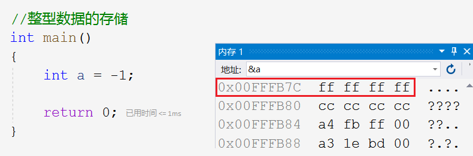
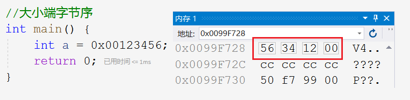
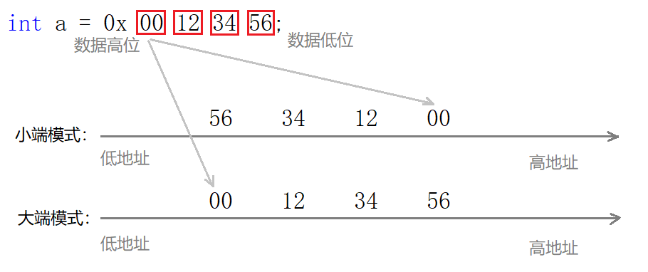
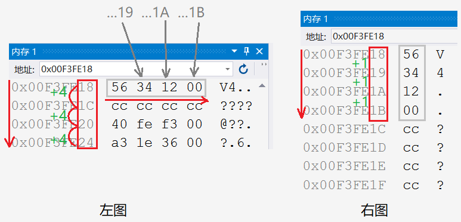
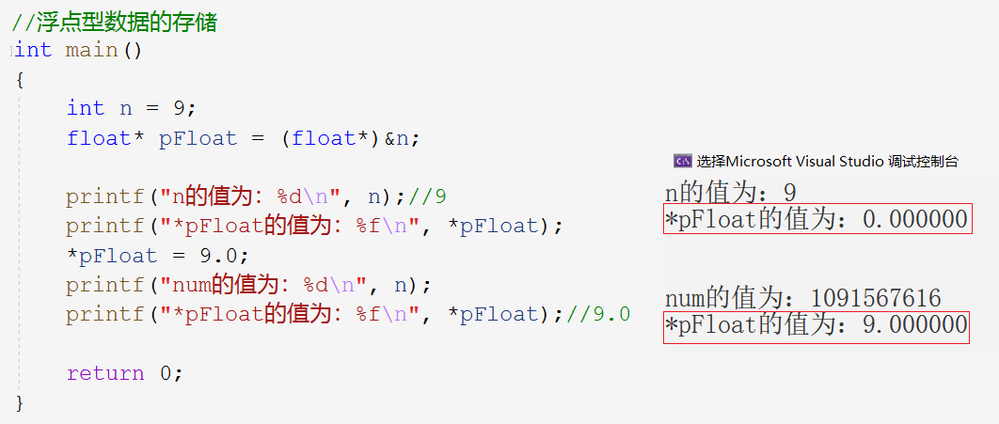
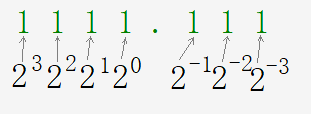
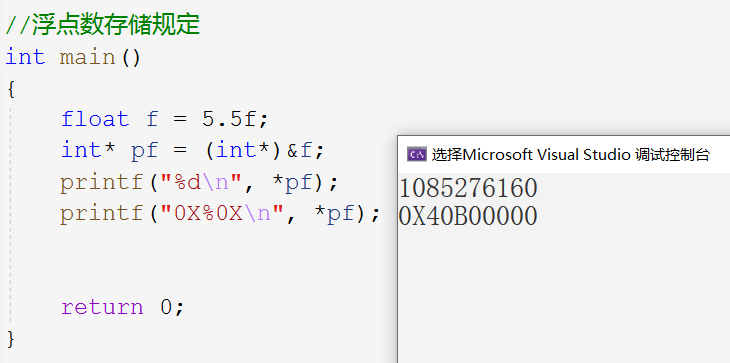

# 数据的存储

## 类型的基本分类

### 整型

~~~c
char
    signed char
    unsigned char
short
    signed short [int]
    unsigned short [int]
int
    signed int
    unsigned int
long
    signed long [int]
    unsigned long [int]
long long
    ...
~~~

> 加上`[]`代表可以省略不写。另外不加`signed`都默认为有符号的。不过`char`类型虽然标准未规定是有符号还是无符号的，但一般编译器都是默认为是有符号的。

### 浮点型

~~~c
float
double
~~~

需要更高精度时，使用`double`，代价就是空间浪费更严重。

### 构造类型

~~~c
数组类型：
    int[5]
    char[10]
    ...
结构体类型：
    struct type
    {
        v1;
        v2;
    };
    ...
枚举类型：
	enum type { v1, v2, ...};
	...
联合类型：
    union type
    {
        v1;
        v2;
    };
    ...
~~~

数组也是有类型的，去掉数组名就是类型。可以使用下面的代码验证。

~~~c
int arr[10] = { 0 };
printf("%d\n", sizeof(int));//4
printf("%d\n", sizeof(arr));//40
printf("%d\n", sizeof(int[10]));//40
~~~

> 其他自定义类型我们在自定义类型进阶部分会讲到。

### 指针类型

~~~c
int*
char**
float*
void*
~~~

### 空类型

~~~c
void
~~~

`void` 表示空类型或称无类型。

> 通常应用在函数的返回类型（无返回类型），函数的参数（不传参），
>
> 指针类型（空类型`void*`，也可以说是通用指针类型，可接收任意指针变量）

~~~c
void test(void) {}
~~~

## 类型的意义

类型，不光出现在定义变量的时候，还有使用变量的时候。

1. 类型决定了开辟空间的大小

> 存的角度，定义变量时使用何种类型就代表分配给变量多大的内存空间，这个变量最大能拥有多少空间。
>
> 如：`int a`就分配给了`a`变量4个字节的空间，`char`就是1个字节。

2. 看待内存空间的方式

> 取的角度，以什么样的方式去看待空间里的数据，（这边说是取，其实有点牵强，最多说是看）
>
> 如`int a;`和`unsigned int b;`和`float c;`，编译器认为`a`是有符号整型，`b`是无符号整型，`c`是浮点型

~~~c
int a = 10;
float b = 10.0f;
~~~

`a`和`b`都是4个字节，为何还要分你是`int`我是`float`呢？因为看待这4个字节的视角不一样，编译器认为`a`里存放的整型数据，而`b`是浮点型变量。

#### `signed`&`unsigned`

有符号和无符号的区别在于存在内存中的二进制序列的最高位是符号位还是数值位。

如`signed char`和`unsigned char`都只有1个字节即8个比特位。若这8个比特位全1，即`11111111`：

> 对于`unsigned char`来说就是都是数值位，换成十进制就是256，对于`signed char`来说就只有后七位是数值位，换成十进制就是127。

~~~c
unsigned char c1 = 255;
1.
printf("%u\n", c1);//255
2.
printf("%d\n", c1);//255

char c2 = 255;
3.
printf("%d\n", c2);//-1
~~~

1. 毋庸置疑是255，因为以无符号方式无符号数肯定是255。
2. 以有符号方式打印无符号数，答案为什么也是255呢。`%u`和`%d`分别是以无符号有符号的方式打印**整型**，也就是打印的时候要发生整型提升，正数补0，负数补1。提升后当然是可以打印出来的。
3. 有人可能会说有符号`char`类型也放不下255呀，其实计算机存储数据时**存储其二进制补码**。255是正数，补码为`00..011111111`，再截断把最后8个比特位放到内存中，我们以有符号的方式读取该`11111111`，高位补1，然后转化为原码就为-1。

> 因为放的是二进制补码序列，所以不存在放不放的下的问题，放不下就截断，255只是转化为十进制后的说法，是否发生截断要看二进制位数。

> 但有符号数是有正负的，所以`signed char`的范围是$[-128,127]$（`10000000`代表$-128$），`unsigned char`的范围是$[0,255]$。都是完美的利用了所有的比特位，二者的范围是一样大的，这个规则可以应用到所有类型。
>
> **血泪史啊，多少个日夜因记不住有符号数的负数要原反补计算而痛哭流涕！**

## 数据在内存中的存储

创建变量的实质是在内存上为其开辟一块空间，空间大小由变量类型决定。那么数据在内存中到底是如何存储的呢？

### 整型数据的存储

> 为什么`-1`存到内存中变成了`ffffffff`呢？接下来我们会系统的讲解这个问题。

#### 原码反码补码

**整数**的存储涉及到原码、反码、补码的概念，这里只讨论整数的存储。

- 符号位：正数为0，负数为1
- 数值位：
  - 正数：原码反码补码相同
  - 负数：
    - 原码：数值的二进制序列
    - 反码：符号位不变，其他位按位取反
    - 补码：反码$+1$

~~~c
int a = -1;
10000000 00000000 00000000 00000001 - 原码
11111111 11111111 11111111 11111110 - 反码
11111111 11111111 11111111 11111111 - 补码
ff ff ff ff
~~~

> 现在我们再来看看最开始的题目
>
> 1. 写出-1的原码
> 2. 写出-1的反码
> 3. 写出-1的补码
> 4. 补码是二进制序列，转化成十六进制就可得到`ffffffff`（二进制`1111` $=$ 十进制`15`  $=$ 十六进制`f`）

所以说，**内存中存放的是整数的补码**。

#### 补码的意义

为什么计算机中，数值统一用补码进行表示和存储呢？

1. 加法和减法可以统一处理（CPU只有加法器）

> 假设我们使用原码进行运算减法时，计算$1-1$即$1+(-1)$。

~~~
1+(-1)
00000000 00000000 00000000 00000001 - 1  原码
10000000 00000000 00000000 00000001 - -1 原码
10000000 00000000 00000000 00000010 - -2
~~~

> 我们发现竟然得到了错误的结果$1-1=-2$，这很明显是不合理的。那么我们用补码进行计算试试看

~~~
 1+(-1)
 00000000 00000000 00000000 00000001 - 1  补码
 11111111 11111111 11111111 11111111 - -1 补码
100000000 00000000 00000000 00000000 - 0  补码 - 发生截断
 00000000 00000000 00000000 00000000 - 0
~~~

> 二者补码相加后发现出现了第33位二进制位，当然就会发生截断，截断后全零，自然是0。由此可以得出，使用补码进行运算可以统一加减法。

2. 使用补码运算：可以将符号位和数值位统一处理。

> 同样从刚刚的运算过程可以看出，符号位也被带入运算当中，当作数值位统一处理，二者不做区分。

3. 补码和原码相互转换时，运算逻辑相同，不需要额外的硬件电路。

> 原码是如何得到补码的呢？补码是如何得到原码的呢？
>
> - 原码符号位不变其它位按位取反得到反码，反码+1得补码。
>
> - 补码-1得反码，反码符号位不变其他位按位取反得到原码。
>
> 但其实逻辑反过来也同样适用，**补码符号位不变其他位按位取反再+1也会得到原码**。如图：

~~~
//-1
10000000 00000000 00000000 00000001 - 原码
11111111 11111111 11111111 11111110 - 反码
11111111 11111111 11111111 11111111 - 补码

11111111 11111111 11111111 11111111 - 补码
10000000 00000000 00000000 00000000
10000000 00000000 00000000 00000001 - 原码
~~~

#### 大小端字节序

为什么存在大小端之分呢？

> 在计算机中，以字节为单位，一个地址对应一个字节。但除`char`类型只占一个字节以外，`short`类型，`int`类型的长度都大于一个字节。因此必然存在多个字节内容如何安排如何存放的问题，就导致了大端字节序和小端字节序的存储模式的诞生。

选取十六进制数字`0x00123456`，1个十六进制数字对于4个二进制位，正好占满32个比特位。

~~~
0    0    1    2    3    4    5    6
0000 0000 0001 0010 0011 0100 0101 0110
~~~

计算机存储整数`0x00123456`为什么是图中的方式呢？

> 每个灰框一个字节，整个红框共四个字节。看似每个字节是“倒”着放的，字节内又是“正”着放的。
>
> 在不知道大小端字节序之前，我们能想象出各种存储方案，甚至是胡乱存都可以，只要我们能按相同的逻辑取出来就行。但是，如果没有一套逻辑，一套规定，取也不方便，这不就乱套了嘛。

**以字节为单位，讨论计算机的存储顺序**，就是大小端字节序问题。

大端（字节序存储）模式：数据的低位存在内存的高地址处，高位存在低地址处。

小端（字节序存储）模式：数据的低位存在内存的低地址处，高位存在高地址处。

很明显，小端存储更合规矩，数据低位放低处，高位放高处。从数据发生截断和提升时来看，同样是截出低地址内容，提示增加高地址内容。小端存储才是我们认知中的“正”着放。我们再来看我们的编译器是大端还是小端存储。

> 还是上面的引例，打开内存，左图一行显示4个字节，右图一行显示1个字节，不管怎么显示，从上到下，从左到右都是低地址到高地址。

很明显，对于`0x00123456`，最低数据位`56`的地址是`0x00F3FE18`为低地址处，最高数据位`00`的地址是`0x00F3FE1B`为高地址处。可见vs2019采用的是小端存储。事实上，绝大多数编译器都是小端存储。

> 我们可以写出一个小程序去判断当前编译器是大端存储还是小端存储。

~~~c
int check_sys() {
	int a = 1;
	return a & 1;
}
int check_sys() {
	int a = 1;
	return *(char*)&a;
}
int main() {
	if (check_sys())
		printf("小端\n");
	else
		printf("大端\n");
	return 0;
}
~~~

#### Example  1~7

在看例题之前，对于数据存和取的问题不够清楚的话，我们再强调一下。举个简单的例子：

~~~c
int main()
{
    unsigned int n = -10;
    printf("%d\n", n);
    printf("%u\n", n);

    return 0;
}
~~~

> 有人可能会问，无符号整型数据怎么能放负数呢？这说明你对整数的存储的概念不够清晰。-10为什么就不能放在无符号整型变量中呢？

- 存：首先，往`n`里放的不是-10，放的是-10的二进制补码，二进制序列怎么会不能放呢？只不过对于`n`来说，从补码的角度，从无符号整型的角度看这是一个很大的数，它并不意味着-10而已。所以说不管是什么类型，拿着补码一个劲的往里存就对了。

- 取：现在我们补码有了，对该补码如何解读，那是%d和%u的事情。也就是说，如果以%d的形式打印，就把该补码当作有符号数来看，反之%u的话，就当作无符号数。

**例题1**

~~~c
1.
//输出什么？
#include <stdio.h>
int main()
{
  char a= -1;
  signed char b=-1;
  unsigned char c=-1;
  printf("a=%d,b=%d,c=%d",a,b,c);
  return 0;
}
~~~

答案：

~~~c
int main()
{
	char a = -1;
	//11111111 11111111 11111111 11111111 - -1的补码
	//11111111 - 截断存入a
	//11111111 11111111 11111111 11111111 - %d打印整型提升（负整数）
	//11111111 11111111 11111111 11111110 - -1 反码
	//10000000 00000000 00000000 00000001 - -1 原码

	signed char b = -1;
	//11111111 11111111 11111111 11111111
	//11111111
	//11111111 11111111 11111111 11111111
	//10000000 00000000 00000000 00000000
	//10000000 00000000 00000000 00000001 - -1

	unsigned char c = -1;
	//11111111 11111111 11111111 11111111 - -1的补码
	//11111111 - 截断存入
	//00000000 00000000 00000000 11111111 - 255 %d打印整型提升（正整数）

	printf("a=%d,b=%d,c=%d", a, b, c);//-1，-1，225
	return 0;
}
~~~

> 1. 存什么，如何存入-1？
>
> $-1$是怎么存入`a`,`b`,`c`的，**存的是**$-1$**的补码**，先把$-1$的补码写出来，三者都是`char`类型只有一个字节的空间，必然发生截断，只存了`11111111`。
>
> 2. 怎么看，如何整型提升？
>
> 类型为`signed char`的`a`,`b`认为是有符号数，`unsigned char`的`c`认为是无符号数。
>
> `%d`是打印有符号整型。`11111111`不够整型怎么办？重点：要整型提升，怎么整型提升？正数补0，负数补1。有符号数`a`,`b`，最高位都是1，则是负数。无符号数`c`，最高位虽是1，但认为是正数。**整型提升的区别导致二者数值的不同**。
>
> 3. 怎么用，二进制序列怎么用？
>
> 用`%d`的形式打印`a`,`b`,`c`，把三个二进制序列都当成有符号数来打印。

变题：

~~~c
#include <stdio.h>
int main()
{
  char a= -1;
  signed char b=-1;
  unsigned char c=-1;
  printf("a=%u,b=%u,c=%u",a,b,c);
  return 0;
}
~~~

> 无论以`%d`还是`%u`的形式打印，都要整型提升，整型提升只关心它是正数还是负数。（有无符号数，最高位是0还是1）
>
> 提升后我们如何看待得到的二进制位，怎么去打印，那就是`%u`的事情了，把二进制序列都当成无符号数。（%d还是%u）

答案：

~~~c
int main()
{
	char a = -1;
	//11111111 - 截断存入
	//11111111 11111111 11111111 11111111 - 整型提升并%u打印
	signed char b = -1;
	//11111111
	//11111111 11111111 11111111 11111111 - 整型提升并%u打印
	unsigned char c = -1;
	//11111111 - 截断存入
	//00000000 00000000 00000000 11111111 - 整型提升并%u打印

	printf("a=%u,b=%u,c=%u", a, b, c);//2^32-1 2^32-1 255
	return 0;
}
~~~

> 前者整型提升补1，最高位是1，使用%d还是%u对其有影响。后者整型提升补0，%d还是%u都当作正数所以无影响。

类型只能决定字节大小和有无符号数，而`%d`,`%u`决定了如何使用该数据。

**例题2**

~~~c
2.
#include <stdio.h>
int main()
{
	char a = 128;
	printf("%u\n", a);
	return 0;
}
~~~

答案：

~~~c
int main()
{
	char a = -128;
	//10000000 00000000 00000000 10000000 - 原码
	//11111111 11111111 11111111 01111111 - 反码
	//11111111 11111111 11111111 10000000 - 补码

	//10000000 - 截断存入
	//11111111 11111111 11111111 10000000 - 整型提升并以无符号数打印

	printf("%u\n", a);//4,294,967,168
	return 0;
}
~~~

> 1. 写出`-128`的补码，变量`a`里存入截断后的结果`10000000`，%u打印整型要整型提升，负数高位补1。
> 2. 得到整型提升后的结果，用%u以无符号数的形式打印整型，即将该二进制序列当作无符号数，那自然原反补相同。

**例题3**

~~~c
3.
#include <stdio.h>
int main()
{
	char a = 128;
	printf("%u\n", a);
	return 0;
}
~~~

答案：

~~~c
int main()
{
	char a = 128;
	//00000000 00000000 00000000 10000000 - 原码
	//01111111 11111111 11111111 01111111 - 反码
	//01111111 11111111 11111111 10000000 - 补码
	//10000000 - 截断后存入
	//11111111 11111111 11111111 10000000 - 整型提升并以无符号数打印

	printf("%u\n", a);//4,294,967,168
	return 0;
}
~~~

> 本题和例2一样，都是补码截断再存入，再整型提升并以无符号形式打印。
>
> 例2和例3唯一的不同就是一正一负，符号位不同，但当截断后存入，这个差别就消除了。

**例题4**

~~~c
4.
int main()
{
    int i = -20;
	unsigned int j = 10;
	printf("%d\n", i+j);
	//按照补码的形式进行运算，最后格式化成为有符号整数
    return 0;
}
~~~

答案：

~~~c
int main()
{
	int i = -20;
	//10000000 00000000 00000000 00010100 - 原码
	//11111111 11111111 11111111 11101011 - 反码
	//11111111 11111111 11111111 11101100 - 补码
	unsigned int j = 10;
	//00000000 00000000 00000000 00001010 - 原反补

	//11111111 11111111 11111111 11101100 - i 补码
	//00000000 00000000 00000000 00001010 - j 补码
	//11111111 11111111 11111111 11110110 - i+j 补码
	//10000000 00000000 00000000 00001001
	//10000000 00000000 00000000 00001010 - i+j 原码

	printf("%d\n", i + j);//-10
	return 0;
}
~~~

> 想要得到`i+j`，就要先得到`i`和`j`的补码（前面已经说过整数运算是补码的运算），二者补码相加得到的当然是`i+j`的补码。可以看到`i+j`的补码符号位是1，而且我们要以%d的形式打印，那必然当作负数，再将补码转化为原码。

**例题5**

~~~c
5.
int main()
{
	unsigned int i;
	for (i = 9; i >= 0; i--)
	{
		printf("%u\n", i);
	}
	return 0;
}
~~~

答案：

~~~c
#include <windows.h>
int main()
{
	unsigned int i;
	//00000000 00000000 00000000 00000000 - 0  原反补
	//11111111 11111111 11111111 11111111 - -1 补码
    //11111111 11111111 11111111 11111111 - 0+(-1)的补码

	for (i = 9; i >= 0; i--)
	{
		printf("%u\n", i);
		Sleep(100);
	}
	return 0;
}
~~~

> 问题出在当i=0时，i再`--`就是`0–1`也就是`0+(-1)`，该结果的补码是全1，又是无符号数，说明i又从最大数开始循环了。i是不可能小于0的，所以这是个死循环。

**例题6**

~~~c
6.
int main()
{
	char a[1000];
	int i;
	for (i = 0; i < 1000; i++)
	{
		a[i] = -1 - i;
	}
	printf("%d", strlen(a));
	return 0;
}

~~~

答案：

~~~c
a[] = { -1, -2, -3,..., -128, 127, 126,...,  2, 1, 0 };
~~~

> 求字符串的长度，也就是找`'\0'`前有多少个字符，而`'\0'`的ASCII码就是0，也就是找什么时候数组元素为0。
>
> `-1-i`每次`i++`，这样数组元素依次是-1,-2,-3,…,-128，-128往后是什么呢？这要看`-1-i`的补码，其实是补码每次减1。-128的补码是`10000000`，再减1，就是`01111111`，这就从负数轮回到正数了，正数再每次减1，一直减到0。

`signed char`轮回如图所示：（相当于反着转）

甚至于`signed short`补码轮回图我们也可以画出来。

**例题7**

~~~c
7.
#include <stdio.h>
unsigned char i = 0;
int main()
{
	for (i = 0; i <= 255; i++)
	{
		printf("hello world\n");
	}
	return 0;
}
~~~

答案：

> unsigned char类型的变量范围在0到255之间，255再加1就变成0，和例5一样死循环。

从例5和例7还可以看出，循环变量不要用无符号数。

### 浮点型数据的存储

> 浮点数如：3.14159，1E10等，在内存中也是以原反补的二进制序列的形式存储的吗？

#### Example

~~~c
int main()
{
	int n = 9;
	float* pFloat = (float*)&n;

	printf("n的值为：%d\n", n);//9
    //1.
	printf("*pFloat的值为：%f\n", *pFloat);

	*pFloat = 9.0;
    //2.
	printf("num的值为：%d\n", n);
	printf("*pFloat的值为：%f\n", *pFloat);//9.0
	return 0;
}
~~~

> 先来看一下这个例子，将正数n的地址强制转化再存入浮点型指针中。（二者都是4个字节，所以不会丢失或忽略数据）问：
>
> - 对该指针解引用后，以浮点型的形式打印
> - 将指针指向的内容修改为9.0，再解引用并以浮点型的形式打印

这个问法背后的意义是：

1. 将整数的补码，以浮点型的视角读取会解析成什么？
2. 将浮点型数据的补码，再以整型的视角读取会解析成什么？

> 这个引例就说明整数和浮点数存储方式是截然不同的。同一个数，以整型和浮点型的视角来看，为什么差别这么大？若要理解这个过程，需要认识浮点型的表示和存储方法。

#### 浮点数表示规定

国际标准**IEEE754**（IEEE是电气电子工程协会简称）规定，任意一个浮点数V可以表示为如下形式：

`(-1)^S * M * 2^E`

1. 符号位`(-1)^S`：S=0时，V为正数，S=1时，V为负数。

> S=0时，$(-1)^0$正好为1，相当于乘以1，当S=1时，$(-1)^1$正好是-1，相当于乘以-1。S=0或1，分别代表正负，与整数的表示有异曲同工之妙。

2. 有效数位`M`：范围：$1≤M＜ 2$

> 类似于数学上科学计数法中的有效部分，而计算机是二进制所以为$[1,2)$，逢二进一。值得关注的是，小数点前是2的正数次方，小数点后是2的负数次方。如5.5是`101.1`。**先将十进制数转化为二进制**。

3. 指数位`2^E`：

> 同样类似于科学计数法的指数部分，由于数据是以二进制的形式存放在内存中，十进制进位是$×10^x$（乘以10的几次方），二进制进位是$×2^E$（乘以2的几次方）。

例如浮点数5.5，写成二进制是`101.1`。将有效部分和符号位带上，就是`(-1)^0 × 1.011 × 2^2`。S=0,M=1.011,E=2。

#### 浮点数存储规定

> 我们为什么要定义一套表示浮点数的逻辑呢？因为有了这套逻辑，就可以在内存中只存入S,M,E三个量就行了，在有限的位数中尽量保存有用的值，利于扩大精度，也方便存储。
>
> 那三个部分，分别占多少个比特位呢?

**IEEE754**规定：

- 32位`float`型浮点数，首位存S占1bit，其后8bit存入E，最后23bit存入M，显然这个安排是很合理的，最大化利用内存的同时，提升精度。

- 64位`double`型的浮点数，首位同样存S占1bit，其后11bit存入E，最后52bit存入M，由此也可以看出，精度提高不止一倍呀。

> 为了最大化的利用存储空间，S,M,E在存入的时候也是有方法的。

- S：既然只有$(-1)^0$和$(-1)^1$两种情况，那么只存0或1就行。

> 按照相同的逻辑取出就可，其他的位留给E和M用，更能提高精度。

- M：M的范围$[1,2)$，所以M必然等于`1.x...xx`，所以只存小数部分`x...xxx`

> 舍弃前面的1，只存后面的x…xxx，最大化的利用内存。

- E：指数部分是$2^E$，故只把$E$存入E中。$E$必然是整数，E这部分被视为无符号整数。

> 如0.1表示为`1.0*2^-1`，当浮点数小于1时，E就会是负数，所以必须综合考虑E为正负数的情况。
>
> 存入E时，将E的值再加上一个中间值，**E为8bit时，加127，E为11bit时，加1023**。如32位浮点数，E为10时，10+127=137，则E中存入`10001001`。
>
> （宁愿如此，也不愿改成有符号整数，可见比特位的弥足珍贵。）

同样使用浮点数5.5验证上述逻辑。

~~~c
int main()
{
	float f = 5.5f;
	int* pf = (int*)&f;
	//(-1)^0 * 1.011 * 2^2
	//S=0,M=1.011,E=2
	//0 10000001 01100000000000000000000
	//S  E+127             M
	//01000000101100000000000000000000 - 1085276160
	//40      B0      00      00
	printf("%d\n", *pf);
	printf("0X%0X\n", *pf);
	return 0;
}
~~~

> `0 10000001 01100000000000000000000`，所以，存的是M,E的修正值。

#### 浮点数取出规定

> 存取当然是一个逻辑，S照常取出，E取出后再减去127或者1023，M取出后再前面“加”个`1.` 。不仅如此还要考虑一些特殊情况。情况共分三种：

1. 一般情况，E不为全0或全1

> 这时候E照常减去127或1023就行。

2. 特殊情况

   - E为全0

   > 当E为全0时，说明E的真实值为-127，一个数乘以$2^{-127}$，说明是一个非常小的数，极限等于0。此时，直接取出M，在前面加上`0.`，得到`0.x...xx`。

   - E为全1

   > 当E为全1时，说明E的真实值为255-127=128，一个数乘以$2^{128}$，说明是一个非常大的数，极限等于$∞$ 。表示$±∞$的情况。

这时，我们再回头解答最开始的引例：

~~~c
int main()
{
	int n = 9;
	//00000000 00000000 00000000 00001001
	float* pFloat = (float*)&n;

	printf("n的值为：%d\n", n);//9
	printf("*pFloat的值为：%f\n", *pFloat);
	//0 00000000 00000000000000000001001 - E为全0
	*pFloat = 9.0;
	//S=0，M=1.001，E=3
	//0 10000010 00100000000000000000000

	printf("num的值为：%d\n", n);
	//01000001 00010000 00000000 00000000 - 1,091,567,616
	printf("*pFloat的值为：%f\n", *pFloat);//9.0

	return 0;
}
~~~

> 把9的补码，以浮点数的形式解析，由于E为全0，就直接输出0.000000。
>
> 把9.0的二进制序列，以十进制的方式解析，就得到十进制数1,091,567,616。
